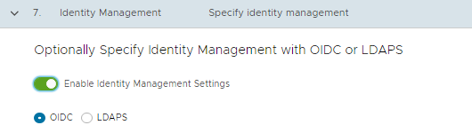
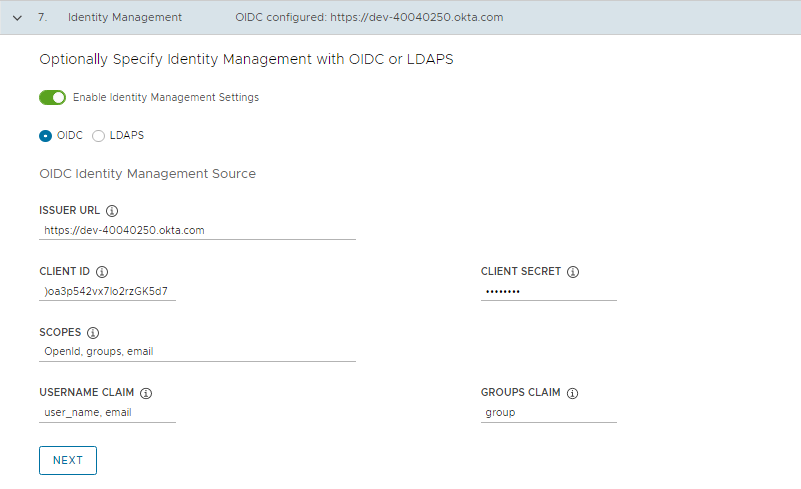
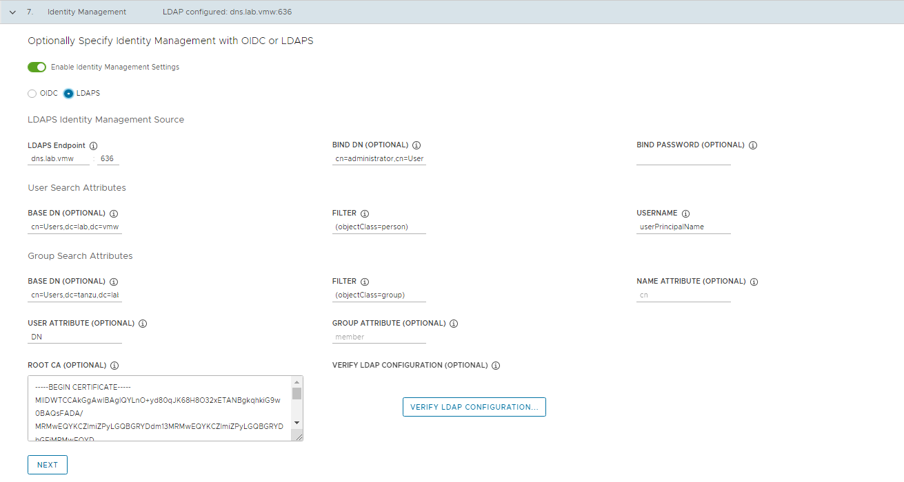
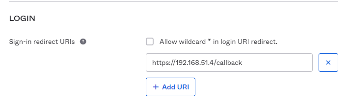
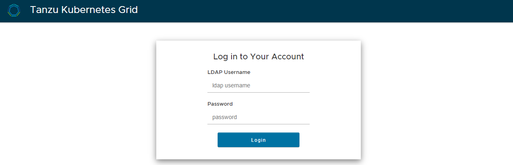
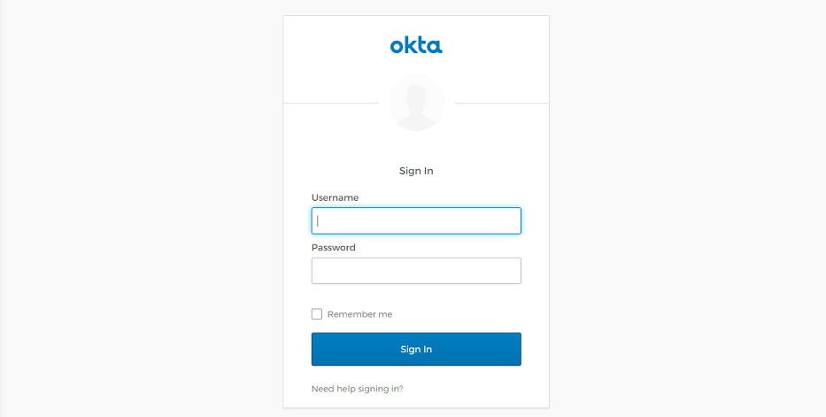
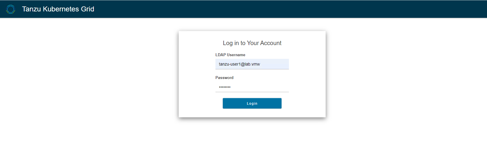
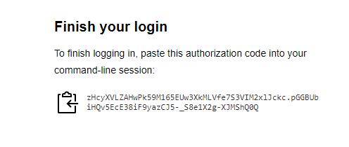

# Prepare External Identity Management

Tanzu Kubernetes Grid implements user authentication with Pinniped. Pinniped allows you to plug external OpenID Connect (OIDC) or LDAP identity providers (IDP) into Tanzu Kubernetes clusters, so that you can control user access to those clusters.

You can enable identity management during or after management cluster deployment. Any workload clusters that you create after enabling identity management are automatically configured to use the same identity provider as the management cluster.

- Enabling and configuring identity management during management cluster deployment (Recommended):

    - Obtain your identity provider details.
    - Use the obtained details to configure LDAPS or OIDC in Tanzu Kubernetes Grid.
    - After the management cluster has been created, confirm that the authentication service is running correctly and complete its configuration.

- Enabling and configuring identity management after management cluster deployment:

   - Obtain your identity provider details.
   - Generate the Pinniped add-on secret for the management cluster.
   - Confirm that the authentication service is running correctly and complete its configuration.
   - If the management cluster manages any workload clusters, generate the Pinniped add-on secret for each workload cluster that was created before you enabled identity management.

## Enable and Configure Identity Management During Management Cluster Deployment

This section explains how to enable and configure identity management during management cluster deployment.

### Obtain Your Identity Provider Details

Before you can enable identity management, you must have an identity provider. Tanzu Kubernetes Grid supports LDAPS and OIDC identity providers.

To use your company’s internal LDAPS server as the identity provider, obtain LDAPS information from your LDAP administrator.

To use OIDC as the identity provider, you must have an account with an identity provider that supports the OpenID Connect standard, for example, [Okta](https://www.okta.com/).

For more information on using Okta as your OIDC provider, see [Register a Tanzu Kubernetes Grid Application in Okta](https://docs.vmware.com/en/VMware-Tanzu-Kubernetes-Grid/1.5/vmware-tanzu-kubernetes-grid-15/GUID-iam-configure-id-mgmt.html#obtain-your-identity-provider-details-3).

### Configure LDAPS or OIDC Settings in Tanzu Kubernetes Grid

When you are deploying your management cluster using the installer interface, configure LDAPS or OIDC in the Identity Management section. For instructions, see [Configure Identity Management](https://docs.vmware.com/en/VMware-Tanzu-Kubernetes-Grid/1.5/vmware-tanzu-kubernetes-grid-15/GUID-mgmt-clusters-deploy-ui.html#id-mgmt) in Deploy Management Clusters with the Installer Interface.

1. In the **Identity Management** section of the management cluster deployment UI, 
   1. Enable **Enable Identity Management Settings**.
   2. Select the provider as **OIDC** or **LDAPS**.

   

2. If you choose to use **OIDC**, provide details of your OIDC provider account, for example, Okta.

   - **Issuer URL**: The IP or DNS address of your OIDC server.

   - **Client ID**: The client_id value that you obtain from your OIDC provider. For example, if your provider is Okta, log in to Okta, create a Web application, and select the **Client Credentials** options in order to get a **client_id** and **secret**.

   - **Client Secret**: The secret value that you obtain from your OIDC provider.

   - **Scopes**: A comma separated list of additional scopes to request in the token response. For example, **openid**,**groups**,**email**.

   - **Username Claim**: The name of your username claim. This is used to set a user’s username in the JSON Web Token (JWT) claim. Depending on your provider, enter claims such as **user_name**, **email**, or **code**.

   - **Groups Claim**: The name of your groups claim. This is used to set a user’s group in the JWT claim. For example, **groups**.

      

3. If you choose to use **LDAPS**, provide details of your company’s LDAPS server. All settings except for LDAPS Endpoint are optional.

   -  **LDAPS Endpoint**: The IP or DNS address of your LDAPS server. Provide the address and port of the LDAP server, in the form host:port.
   - **Bind DN**: The DN for an application service account. The connector uses these credentials to search for users and groups. Not required if the LDAP server provides access for anonymous authentication.
   - **Bind Password**: The password for an application service account, if Bind DN is set.
   - **Base DN**: The point from which to start the LDAP search. For example, OU=Users,OU=domain,DC=io.
   - **Filter**: An optional filter to be used by the LDAP search.
   - **Username**: The LDAP attribute that contains the user ID. For example, uid, sAMAccountName.
   - **Base DN**: The point from which to start the LDAP search. For example, OU=Groups,OU=domain,DC=io.
   - **Filter**: An optional filter to be used by the LDAP search.
   - **Name Attribute**: The LDAP attribute that holds the name of the group. For example, cn.
   - **User Attribute**: The attribute of the user record that is used as the value of the membership attribute of the group record. For example, distinguishedName, dn.
   - **Group Attribute**: The attribute of the group record that holds the user/member information. For example, member.
   - Paste the contents of the LDAPS server CA certificate into the Root CA text box.

      
   
   - (Optional) Verify the LDAP settings.
      - Click **Verify LDAP Configuration**.
      - Enter a user name and group name.
      - Click **Start**. After verification completes, if you see any failures, examine them closely.

4. Click **Next** and proceed with management cluster creation. 

5. After you deploy the management cluster, proceed with [Complete the configuration of Identity Management in the Management Cluster](#complete-the-identity-management-configuration-on-management-cluster)

## Enable and Configure Identity Management in an Existing Deployment
If you did not configure identity management when you deployed your management cluster, you can enable it as a post-deployment step by doing the following:

1. [Obtain your identity provider details](#obtain-your-identity-provider-details).

2. [Generate a Kubernetes secret for the Pinniped add-on and deploy Pinniped package.](#generate-the-pinniped-add-on-secret-for-the-management-cluster-and-deploy-pinniped-package) 

3. [Complete the identity management configuration on the management cluster](#complete-the-identity-management-configuration-on-management-cluster). 

4. [Create role bindings for your management cluster users.](#configure-rbac)

5. [Enable identity management in workload clusters.](#enable-identity-management-on-workload-clusters)

### Obtain your identity provider details

Before you can identity management, you must have an identity provider. Tanzu Kubernetes Grid supports LDAPS and OIDC identity providers.

To use your company’s internal LDAPS server as the identity provider, obtain LDAPS information from your LDAP administrator.

To use OIDC as the identity provider, you must have an account with an identity provider that supports the OpenID Connect standard, for example, [Okta](https://www.okta.com/).

For more information on using Okta as your OIDC provider, see [Register a Tanzu Kubernetes Grid Application in Okta](https://docs.vmware.com/en/VMware-Tanzu-Kubernetes-Grid/1.5/vmware-tanzu-kubernetes-grid-15/GUID-iam-configure-id-mgmt.html#obtain-your-identity-provider-details-3).

For more information on obtaining your identity provider details, see [Obtain Your Identity Provider Details](https://docs.vmware.com/en/VMware-Tanzu-Kubernetes-Grid/1.5/vmware-tanzu-kubernetes-grid-15/GUID-iam-configure-id-mgmt.html#idp).

### Generate the Pinniped Add-on Secret for the Management Cluster and deploy Pinniped package

This procedure configures the Pinniped add-on and deploys the authentication components in your management cluster. To generate a Kubernetes secret for the Pinniped add-on:

1. Set the context of kubectl to your management cluster. For example, with a management cluster named id-mgmt-test:

   ```bash
   # kubectl config use-context tkg-mgmt-01-admin@tkg-mgmt-01
   Switched to context "tkg-mgmt-01-admin@tkg-mgmt-01"
   ```

2. Create a cluster configuration file by copying the configuration settings that you defined when you deployed your management cluster into a new file. In addition to the variables from the original management cluster configuration, include the following OIDC or LDAP identity provider details in the file:

   **Note**: With the exception of IDENTITY_MANAGEMENT_TYPE, you need to set these variables only for management clusters. For workload clusters, set IDENTITY_MANAGEMENT_TYPE to the same value as in the management cluster.

   ```yaml
   # Identity management type. This must be "oidc" or "ldap".

   IDENTITY_MANAGEMENT_TYPE:

   # Set these variables if you want to configure OIDC.

   CERT_DURATION: 2160h
   CERT_RENEW_BEFORE: 360h
   OIDC_IDENTITY_PROVIDER_CLIENT_ID:
   OIDC_IDENTITY_PROVIDER_CLIENT_SECRET:
   OIDC_IDENTITY_PROVIDER_GROUPS_CLAIM:
   OIDC_IDENTITY_PROVIDER_ISSUER_URL:
   OIDC_IDENTITY_PROVIDER_SCOPES: "email,profile,groups"
   OIDC_IDENTITY_PROVIDER_USERNAME_CLAIM:

   # Set these variables if you want to configure LDAP.

   LDAP_BIND_DN:
   LDAP_BIND_PASSWORD:
   LDAP_GROUP_SEARCH_BASE_DN:
   LDAP_GROUP_SEARCH_FILTER:
   LDAP_GROUP_SEARCH_GROUP_ATTRIBUTE:
   LDAP_GROUP_SEARCH_NAME_ATTRIBUTE: cn
   LDAP_GROUP_SEARCH_USER_ATTRIBUTE: DN
   LDAP_HOST:
   LDAP_ROOT_CA_DATA_B64:
   LDAP_USER_SEARCH_BASE_DN:
   LDAP_USER_SEARCH_EMAIL_ATTRIBUTE: DN
   LDAP_USER_SEARCH_FILTER:
   LDAP_USER_SEARCH_ID_ATTRIBUTE: DN
   LDAP_USER_SEARCH_NAME_ATTRIBUTE:
   LDAP_USER_SEARCH_USERNAME: userPrincipalName
   ```

3. Providing a sample management cluster configuration file below after updating the ldap configuration. 

   ```yaml
   #! ---------------------------------------------------------------------
   #! vSphere non proxy env configs
   #! ---------------------------------------------------------------------
   AVI_CA_DATA_B64: <base64-encoded-cert>
   AVI_CLOUD_NAME: tkgvsphere-cloud01
   AVI_CONTROLLER: alb-ctlr01.lab.vmw
   AVI_DATA_NETWORK: tkg-mgmt-vip-segment
   AVI_DATA_NETWORK_CIDR: 172.16.50.0/24
   AVI_ENABLE: 'true'
   AVI_LABELS: |
      'type': 'management'
   AVI_PASSWORD: <encoded:Vk13YXJlMSE=>
   AVI_SERVICE_ENGINE_GROUP: tkgvsphere-tkgmgmt-group01
   AVI_USERNAME: admin
   CLUSTER_CIDR: 100.96.0.0/11
   CLUSTER_NAME: tkg-mgmt-01
   CLUSTER_PLAN: prod
   ENABLE_CEIP_PARTICIPATION: 'true'
   ENABLE_MHC: 'true'
   #----------Providing the ldap config here---------------------
   IDENTITY_MANAGEMENT_TYPE: ldap
   LDAP_BIND_DN: cn=administrator,cn=Users,dc=lab,dc=vmw
   LDAP_BIND_PASSWORD: VMware1!
   LDAP_GROUP_SEARCH_BASE_DN: cn=Users,dc=lab,dc=vmw
   LDAP_GROUP_SEARCH_FILTER: (objectClass=group)
   LDAP_GROUP_SEARCH_GROUP_ATTRIBUTE: member
   LDAP_GROUP_SEARCH_NAME_ATTRIBUTE: member
   LDAP_GROUP_SEARCH_USER_ATTRIBUTE: DN
   LDAP_HOST: dns.lab.vmw
   LDAP_ROOT_CA_DATA_B64: <base64-encoded-cert>
   LDAP_USER_SEARCH_BASE_DN: cn=Users,dc=lab,dc=vmw
   LDAP_USER_SEARCH_EMAIL_ATTRIBUTE: DN
   LDAP_USER_SEARCH_FILTER: (objectClass=person)
   LDAP_USER_SEARCH_ID_ATTRIBUTE: DN
   LDAP_USER_SEARCH_NAME_ATTRIBUTE: userPrincipalName
   LDAP_USER_SEARCH_USERNAME: userPrincipalName
   #--------------------------
   INFRASTRUCTURE_PROVIDER: vsphere
   SERVICE_CIDR: 100.64.0.0/13
   TKG_HTTP_PROXY_ENABLED: false
   DEPLOY_TKG_ON_VSPHERE7: 'true'
   VSPHERE_DATACENTER: /tkgm-internet-dc1
   VSPHERE_DATASTORE: /tkgm-internet-dc1/datastore/vsanDatastore
   VSPHERE_FOLDER: /tkgm-internet-dc1/vm/tkg-vsphere-tkg-mgmt
   VSPHERE_NETWORK: pg-tkg_mgmt
   VSPHERE_PASSWORD: <encoded:Vk13YXJlMSE=>
   VSPHERE_RESOURCE_POOL: /tkgm-internet-dc1/host/tkgm-internet-c1/Resources/tkg-vsphere-tkg-Mgmt
   VSPHERE_SERVER: vcenter.lab.vmw
   VSPHERE_SSH_AUTHORIZED_KEY: <vcenter-ssh-key>
   VSPHERE_USERNAME: administrator@vsphere.local
   VSPHERE_INSECURE: 'true'
   AVI_CONTROL_PLANE_HA_PROVIDER: 'true'
   ENABLE_AUDIT_LOGGING: 'true'
   OS_ARCH: amd64
   OS_NAME: photon
   OS_VERSION: 3
   AVI_MANAGEMENT_CLUSTER_VIP_NETWORK_NAME: pg-tkg-cluster-vip
   AVI_MANAGEMENT_CLUSTER_VIP_NETWORK_CIDR: 172.16.80.0/24
   WORKER_SIZE: medium
   CONTROLPLANE_SIZE: medium

   ```

4. Make sure your local environment has IDENTITY_MANAGEMENT_TYPE set to either `oidc` or `ldap`, and not `none`:

   ```
   # export IDENTITY_MANAGEMENT_TYPE=ldap

   # echo $IDENTITY_MANAGEMENT_TYPE
   ldap

   ```

5. Set the _TKG_CLUSTER_FORCE_ROLE environment variable to management:

   <!-- /* cSpell:disable */ -->
   ```
   export _TKG_CLUSTER_FORCE_ROLE="management"
   ```
   <!-- /* cSpell:enable */ -->

6. Set the FILTER_BY_ADDON_TYPE environment variable to authentication/pinniped:

   <!-- /* cSpell:disable */ -->
   ```
   export FILTER_BY_ADDON_TYPE="authentication/pinniped"
   ```
   <!-- /* cSpell:enable */ -->

7. Generate a secret for the Pinniped add-on:

   <!-- /* cSpell:disable */ -->
   ```
   tanzu cluster create CLUSTER-NAME --dry-run -f CLUSTER-CONFIG-FILE > CLUSTER-NAME-example-secret.yaml

   Example:
   # tanzu cluster create tkg-mgmt-01 --dry-run -f tkg-mgmt-01.yaml > tkg-mgmt-01-example-secret.yaml

   # ls
   tkg-mgmt-01.yaml 	       tkg-mgmt-01-example-secret.yaml
   ```
   <!-- /* cSpell:enable */ -->

   The environment variable settings cause tanzu cluster create --dry-run to generate a Kubernetes secret, not a full cluster manifest.

   **Note**: This command generates the manifest with default namespace, however you need to create the secret in tkg-system namespace for kapp controller to reconcile the core addon. So manually edit the file and change the namespace to “tkg-system”

8. Review the secret and then apply it to the management cluster. For example:

   <!-- /* cSpell:disable */ -->
   ```
   # kubectl apply -f tkg-mgmt-01-example-secret.yaml
   secret/tkg-mgmt-01-pinniped-addon created
   ```
   <!-- /* cSpell:enable */ -->

9. After applying the secret, check the status of the Pinniped add-on by running the kubectl get app command:

   <!-- /* cSpell:disable */ -->
   ```
   # kubectl get app pinniped -n tkg-system
   NAME         DESCRIPTION                  SINCE-DEPLOY   AGE
   pinniped   Reconcile succeeded      92s                          4m3s
   ```
   <!-- /* cSpell:enable */ -->

   **Note**: If the Pinniped app reconcile fails, see [Troubleshooting Core Add-on Configuration](https://docs.vmware.com/en/VMware-Tanzu-Kubernetes-Grid/1.5/vmware-tanzu-kubernetes-grid-15/GUID-packages-update-addons.html#troubleshooting). 

## Complete the Identity Management Configuration on Management Cluster

After deploying the management cluster, do the following to complete the identity management configuration:

1. Connect kubectl to the management cluster.
2. Confirm that the authentication service is running correctly by checking its status:
   - **OIDC**: Check the Status of an OIDC Identity Management Service.
   - **LDAP**: Check the Status of an LDAP Identity Management Service.
   - **OIDC**: Provide the Callback URI to the OIDC Provider.
3. If you want to use regular, non-administrator `kubeconfig` files for access to the management cluster, after completing the configuration of identity management, configure RBAC by following the instructions in [Configure RBAC for a Management Cluster](https://docs.vmware.com/en/VMware-Tanzu-Kubernetes-Grid/1.5/vmware-tanzu-kubernetes-grid-15/GUID-iam-configure-rbac.html#rbac-mgmt).

## Connect kubectl to the Management Cluster

To configure identity management, you must obtain and use the admin context of the management cluster:

1. Get the admin context of the management cluster. The procedures in this topic use a management cluster named tkg-mgmt.
   <!-- /* cSpell:disable */ -->
   ```
   $ tanzu management-cluster `kubeconfig` get tkg-mgmt --admin

   Credentials of cluster 'tkg-mgmt' have been saved
   You can now access the cluster by running 'kubectl config use-context tkg-mgmt-admin@tkg-mgmt'
   ```
   <!-- /* cSpell:enable */ -->

   The admin context of a cluster gives you full access to the cluster without requiring authentication with your IDP

2. Set kubectl to the admin context of the management cluster:
   <!-- /* cSpell:disable */ -->
   ```
   $ kubectl config use-context tkg-mgmt@tkg-mgmt 
   Switched to context "tkg-mgmt-admin@tkg-mgmt".
   ```
   <!-- /* cSpell:enable */ -->

## Check the Status of an LDAP Identity Management Service

Tanzu Kubernetes Grid uses Pinniped to integrate clusters with an LDAP identity service, along with Dex to expose the service endpoint. When you enable LDAP, Tanzu Kubernetes Grid creates the `pinniped-supervisor` service in the `pinniped-supervisor` namespace, `pinniped-concierge` in the `pinniped-concierge` namespace, and `dexsvc` in the `tanzu-system-auth` namespace. 

Follow the steps below to check the status of an LDAP service and note the EXTERNAL-IP address at which the service is exposed.

1. Verify that the Pinniped package was installed and reconciled successfully.
   <!-- /* cSpell:disable */ -->
   ```
   # kubectl get app pinniped -n tkg-system

   NAMESPACE	NAME                            	DESCRIPTION       	SINCE-DEPLOY   AGE
   tkg-system   pinniped                        	Reconcile succeeded   3m44s      	49m
   ```
   <!-- /* cSpell:enable */ -->


2. Get information about the pinniped supervisor and `dexsvc` services that are running in the management cluster.
   <!-- /* cSpell:disable */ -->
   ```
   # kubectl get svc -n pinniped-supervisor
   pinniped-supervisor                 pinniped-supervisor                               LoadBalancer   100.67.31.28    192.168.51.4   443:31088/TCP            17d


   # kubectl get svc -n tanzu-system-auth
   NAME               	TYPE                     CLUSTER-IP    EXTERNAL-IP    PORT(S)      	AGE
   dexsvc               LoadBalancer   100.65.110.223   192.168.51.5         443:31769/TCP   8h
   ```
   <!-- /* cSpell:enable */ -->

3. Proceed with generating the `kubeconfig` and creating the role based access control. For more information, see [Configure RBAC](#configure-rbac). 

## Check the Status of an OIDC Identity Management Service

Tanzu Kubernetes Grid uses Pinniped to integrate clusters with an OIDC identity service. When you enable OIDC, Tanzu Kubernetes Grid creates the pinniped-supervisor service in the pinniped-supervisor namespace and pinniped-concierge in the pinniped-concierge namespace. 

Follow the steps below to check the status of the Pinniped service and note the EXTERNAL-IP address at which the service is exposed.

1. Verify that the Pinniped package was installed and reconciled successfully.

   <!-- /* cSpell:disable */ -->
   ```
   # kubectl get apps pinniped -n tkg-system

   NAMESPACE	NAME                            	DESCRIPTION       	SINCE-DEPLOY   AGE
   tkg-system   pinniped                        	Reconcile succeeded   3m44s      	49m
   ```
   <!-- /* cSpell:enable */ -->

2. Get information about the services that are running in the management cluster. The identity management service runs in the pinniped-supervisor namespace.

   <!-- /* cSpell:disable */ -->
   ```
   # kubectl get svc -n pinniped-supervisor
   NAME                	TYPE                     CLUSTER-IP    EXTERNAL-IP PORT(S)     	AGE
   pinniped-supervisor   LoadBalancer   100.65.110.223   192.168.51.4   443:31769/TCP   8h
   ```
   <!-- /* cSpell:enable */ -->

3. Note the external address of the pinniped-supervisor service, as listed under EXTERNAL-IP.

4. Update the External IP in the login redirect URI in the OIDC identity provider. For more information, see [Provide the Callback URI to the OIDC Provider](#provide-the-callback-uri-to-the-oidc-provider-oidc-only).

5. Once you update the redirect URI, proceed with generating the `kubeconfig` and creating the role based access control. For more information, see [Configure RBAC](#configure-rbac). 

## Provide the Callback URI to the OIDC Provider (OIDC Only)

If you configured the management cluster to use OIDC authentication, you must provide the callback URI for that management cluster to your OIDC identity provider.

1. Log in to your Okta account.
1. In the main menu, go to **Applications**.
1. Select the application that you created for Tanzu Kubernetes Grid.
1. In the General Settings panel, click **Edit**.
1. Under Login, update **Login redirect URIs** to include the address of the node in which the pinniped-supervisor is running. 
1. Add the external IP address of the node at which the pinniped-supervisor service is running, that you noted in the previous procedure.

   **Note**:  You must specify https, not http.

   

## Enable Identity Management on Workload Clusters

Any workload clusters that you create after you enable identity management in the management cluster are automatically configured to use the same identity management service.  You can proceed with generating a `kubeconfig` file and share it with users for connecting to the cluster. For more information on generating `kubeconfig` and creating the role based access, see [Configure RBAC](#configure-rbac). 

If a workload cluster was created before you enabled identity management for your management cluster, you must enable it manually. To enable identity management for a workload cluster:

1. Generate the Pinniped add-on secret:
   -  Create a cluster configuration file by copying the configuration settings that you defined when you deployed your workload cluster into a new file. In addition to the variables from the original cluster configuration, include the following:

      <!-- /* cSpell:disable */ -->
      ```yaml
      # Identity management type used by the management cluster. This must be "oidc" or "ldap".
      IDENTITY_MANAGEMENT_TYPE:

      # This is the Pinniped supervisor service endpoint in the management cluster.
      SUPERVISOR_ISSUER_URL:

      # Pinniped uses this b64-encoded CA bundle data for communication between the management cluster and the workload cluster.
      SUPERVISOR_ISSUER_CA_BUNDLE_DATA_B64:
      ```
      <!-- /* cSpell:enable */ -->

2. You can retrieve SUPERVISOR_ISSUER_URL and SUPERVISOR_ISSUER_CA_BUNDLE_DATA_B64 by running `kubectl get configmap pinniped-info -n kube-public -o yaml` against the management cluster.
   <!-- /* cSpell:disable */ -->
   ```yaml
   # kubectl get configmap pinniped-info -n kube-public -o yaml
   apiVersion: v1
   data:
      cluster_name: tkg-mgmt-01
      concierge_is_cluster_scoped: "true"
      issuer: https://172.16.80.104
      issuer_ca_bundle_data: <base64-issuer-ca>
   kind: ConfigMap
   metadata:
      creationTimestamp: "2022-03-24T12:03:46Z"
      name: pinniped-info
      namespace: kube-public
      resourceVersion: "62756"
      uid: 7f399d41-ab1b-41f2-9cd1-1d5fc4ddf9e1
   ```
   <!-- /* cSpell:enable */ -->

3. Create the cluster configuration by providing above details. Here is a sample workload config file with ldap configuration.

   <!-- /* cSpell:disable */ -->
   ```yaml
   CLUSTER_CIDR: 100.96.0.0/11
   CLUSTER_NAME: workload-2
   CLUSTER_PLAN: dev
   ENABLE_CEIP_PARTICIPATION: 'true'
   ENABLE_MHC: 'true'
   IDENTITY_MANAGEMENT_TYPE: none
   INFRASTRUCTURE_PROVIDER: vsphere
   SERVICE_CIDR: 100.64.0.0/13
   TKG_HTTP_PROXY_ENABLED: false
   DEPLOY_TKG_ON_VSPHERE7: 'true'
   VSPHERE_DATACENTER: /tkgm-internet-dc1
   VSPHERE_DATASTORE: vsanDatastore
   VSPHERE_FOLDER: /tkgm-internet-dc1/vm/tkg-vsphere-workload
   VSPHERE_NETWORK: /tkgm-internet-dc1/network/pg-tkg_workload
   VSPHERE_PASSWORD: <encoded:Vk13YXJlMSE=>
   VSPHERE_RESOURCE_POOL: /tkgm-internet-dc1/host/tkgm-internet-c1/Resources/tkg-vsphere-workload
   VSPHERE_SERVER: vcenter.lab.vmw
   VSPHERE_SSH_AUTHORIZED_KEY: <vsphere-ssh-key>

   VSPHERE_USERNAME: administrator@vsphere.local
   WORKER_MACHINE_COUNT: 1
   VSPHERE_INSECURE: 'true'
   ENABLE_AUDIT_LOGGING: 'true'
   ENABLE_DEFAULT_STORAGE_CLASS: 'true'
   ENABLE_AUTOSCALER: false
   AVI_CONTROL_PLANE_HA_PROVIDER: 'true'
   OS_ARCH: amd64
   OS_NAME: photon
   OS_VERSION: 3
   WORKER_SIZE: medium
   CONTROLPLANE_SIZE: medium

   IDENTITY_MANAGEMENT_TYPE: ldap

   SUPERVISOR_ISSUER_URL: https://172.16.80.104

   SUPERVISOR_ISSUER_CA_BUNDLE_DATA_B64: <Supervisor issuer CA from previous step>

   ```
   <!-- /* cSpell:enable */ -->

4. Ensure that the local environment variable IDENTITY_MANAGEMENT_TYPE set to either oidc or ldap:

   <!-- /* cSpell:disable */ -->
   ```
   # export IDENTITY_MANAGEMENT_TYPE=ldap

   # echo $IDENTITY_MANAGEMENT_TYPE
   ldap
   ```
   <!-- /* cSpell:enable */ -->

5. Set the _TKG_CLUSTER_FORCE_ROLE environment variable to workload:
   <!-- /* cSpell:disable */ -->
   ```
   export _TKG_CLUSTER_FORCE_ROLE="workload"
   ```
   <!-- /* cSpell:enable */ -->

6. Set the FILTER_BY_ADDON_TYPE environment variable to authentication/pinniped:
   <!-- /* cSpell:disable */ -->
   ```
   export FILTER_BY_ADDON_TYPE="authentication/pinniped"
   ```
   <!-- /* cSpell:enable */ -->

7. Generate a secret for the Pinniped add-on:
   <!-- /* cSpell:disable */ -->
   ```
   tanzu cluster create workload-2 --dry-run -f workload-2.yaml > workload-2-example-secret.yaml

   # ls
   Workload-2.yaml       workload-2-example-secret.yaml
   ```
   <!-- /* cSpell:enable */ -->

   The environment variable settings cause tanzu cluster create --dry-run to generate a Kubernetes secret, not a full cluster manifest.

8. Review the secret and apply it to the management cluster. The Pinniped add-on secret is always created or applied to the management cluster, even if you are configuring a workload cluster. 
   -  Set the context of kubectl to the management cluster. For example, with a management cluster named tkg-mgmt:

      <!-- /* cSpell:disable */ -->
      ```
      # kubectl config use-context tkg-mgmt-01-admin@tkg-mgmt-01
      Switched to context "tkg-mgmt-01-admin@tkg-mgmt-01"
      ```
      <!-- /* cSpell:enable */ -->
   - Apply the secret.

      <!-- /* cSpell:disable */ -->
      ```
      # kubectl apply -f workload-2-example-secret.yaml
      secret/workload-2-pinniped-addon created
      ```
      <!-- /* cSpell:enable */ -->

10. After applying the secret, check the status of the Pinniped add-on:
      - Set the context of kubectl to your workload cluster:

      <!-- /* cSpell:disable */ -->
      ```
      # kubectl config use-context workload-2-admin@workload-2
      Switched to context "workload-2-admin@workload-2".
      ```
      <!-- /* cSpell:enable */ -->

      -  Run the kubectl get app command against the workload cluster:
      <!-- /* cSpell:disable */ -->
      ```
      # kubectl get app pinniped -n tkg-system

      NAME        DESCRIPTION             SINCE-DEPLOY   AGE
      pinniped   Reconcile succeeded      53s            2m43s
      ```
      <!-- /* cSpell:enable */ -->

11. If you plan to use regular, non-administrator `kubeconfig` files for cluster access, proceed with generating the `kubeconfig` and creating the role based access control. For more information, see [Configure RBAC](#configure-rbac). 

## Configure RBAC

To give users access to a management or a workload cluster, you generate a `kubeconfig` file and then share the file with those users. If you provide them with the administrator `kubeconfig` for the cluster, they have full access to the cluster and do not need to be authenticated. However, if you provide users with the regular `kubeconfig`, they must have a user account in your OIDC or LDAP identity provider and you must configure RBAC on the cluster to grant access permissions to the designated user.

For more information on how to configure role-based access control (RBAC) in Tanzu Kubernetes Grid, see [Configure RBAC](https://docs.vmware.com/en/VMware-Tanzu-Kubernetes-Grid/1.5/vmware-tanzu-kubernetes-grid-15/GUID-iam-configure-rbac.html#rbac-mgmt).

### Generate and Test a Non-Administrator `kubeconfig` File for the Tanzu Clusters

This procedure allows you to test the login step of the authentication process if a browser is present on the machine on which you are running tanzu and kubectl commands. If the machine does not have a browser, see [Authenticate Users on a Machine Without a Browser](https://docs.vmware.com/en/VMware-Tanzu-Kubernetes-Grid/1.5/vmware-tanzu-kubernetes-grid-15/GUID-iam-configure-id-mgmt.html#no-browser).

1. Export the regular `kubeconfig` for the management cluster to a local file, for example, /tmp/id_mgmt_test_kubeconfig. Note that the command does not include the --admin option, so the `kubeconfig` that is exported is the regular `kubeconfig`, not the admin version.

   <!-- /* cSpell:disable */ -->
   ```
   # tanzu management-cluster `kubeconfig` get tkg-mgmt --export-file /tmp/id_mgmt_test_kubeconfig
   You can now access the cluster by specifying '--kubeconfig /tmp/id_mgmt_test_kubeconfig flag when using `kubectl` command
   ```
   <!-- /* cSpell:enable */ -->

2. Connect to the management cluster by using the newly created `kubeconfig` file:

   <!-- /* cSpell:disable */ -->
   ```
   # kubectl get pods -A --kubeconfig /tmp/id_mgmt_test_kubeconfig
   ```
   <!-- /* cSpell:enable */ -->

   The authentication process requires a browser to be present on the machine from which users connect to clusters because running kubectl commands automatically opens the IdP login page so that users can log in to the cluster. Your browser should open and display the login page for your OIDC provider or an LDAPS login page.

   **LDAPS**:

   

   **OIDC**:

   

   Enter the credentials of a user account that exists in your OIDC or LDAP server. After a successful login, the browser should display the following. 
   

3. Go back to the terminal in which you run tanzu and kubectl commands:
   - If you already configured a role binding on the cluster for the authenticated user, the output of `kubectl get pods -A` appears, displaying the pod information.
   - If you have not configured a role binding on the cluster, you see a message denying the user account access to the pods:

      <!-- /* cSpell:disable */ -->
      ```
      Error from server (Forbidden): pods is forbidden: User "user@example.com" cannot list resource "pods" in API group "" at the cluster scope. 
      ```
      <!-- /* cSpell:enable */ -->
     
   This happens because the user has been successfully authenticated, but they are not yet authorized to access any resources on the cluster. To authorize the user to access the cluster resources, you must Create a Role Binding on the Management Cluster as described in [Create a Role Binding on the Management Cluster](#create-a-role-binding-on-the-management-cluster).

### Create a Role Binding on the Management Cluster

To give non-admin users access to a management cluster, you generate and distribute a `kubeconfig` file as described in [Generate and Test a Non-Administrator `kubeconfig` File for the Management Cluster](#generate-and-test-a-non-administrator-kubeconfig-file-for-the-management-cluster). 

To make the `kubeconfig` work, you must first set up RBAC by creating a role binding on the management cluster. This role binding assigns role-based permissions to individual authenticated users or user groups. There are many roles with which you can associate users, but the most useful roles are the following:

*  **cluster-admin**: Can perform any operation on the cluster.
*  **admin**: Permission to view most resources but can only modify resources like roles and bindings. Cannot modify pods or deployments.
* **edit**: The opposite of admin. Can create, update, and delete resources like deployments, services, and pods. Cannot change roles or permissions.
* **view**: Read-only.

You can assign any of the roles to users. For more information about custom roles and role bindings, see [Using RBAC Authorization](https://kubernetes.io/docs/reference/access-authn-authz/rbac/) in the Kubernetes documentation.

1. Make sure that you are using the admin context of the management cluster:

   <!-- /* cSpell:disable */ -->
   ```
   kubectl config current-context
   ```
   <!-- /* cSpell:enable */ -->


2. If the context is not the management cluster admin context, set kubectl to use that context. For example:
   <!-- /* cSpell:disable */ -->
   ```
   kubectl config use-context tkg-mgmt-admin@tkg-mgmt
   ```
   <!-- /* cSpell:enable */ -->

3. List your existing roles:
   - To see the full list of namespace-scoped roles, run:
      <!-- /* cSpell:disable */ -->
      ```
      kubectl get roles --all-namespaces
      ```
      <!-- /* cSpell:enable */ -->

   - To see the full list of cluster-scoped roles, run:
      <!-- /* cSpell:disable */ -->
      ```
      kubectl get clusterroles
      ```
      <!-- /* cSpell:enable */ -->

4. To associate a given user with a role, create a role binding.
   - A RoleBinding can reference a Role or ClusterRole.
   - A ClusterRoleBinding can reference only a ClusterRole.

5. The following example creates a cluster role binding named id-mgmt-test-rb that binds the cluster role cluster-admin to the user <user@example.com>:

   <!-- /* cSpell:disable */ -->
   ```
   kubectl create clusterrolebinding tkg-mgmt-rb --clusterrole cluster-admin --user user@example.com
   ```
   <!-- /* cSpell:enable */ -->

   For --user, specify the OIDC or LDAP username of the user. You configured the username attribute and other identity provider details in the Identity Management section of the Tanzu Kubernetes Grid installer interface or by setting the **LDAP_\*** or **OIDC_\*** variables:

      1. **OIDC**: The username attribute is set in the **Username Claim** field under **OIDC Identity Management Source** in the installer interface or the OIDC_IDENTITY_PROVIDER_USERNAME_CLAIM configuration variable.
      2. **LDAPS**: The username attribute is set in the **Username** field under **LDAPS Identity Management Source –> User Search Attributes** in the installer interface or the LDAP_USER_SEARCH_USERNAME configuration variable.

         For example, for OIDC, the username is often the email address of the user. For LDAPS, it is the LDAP username, not the email address.

      3. Attempt to connect to the management cluster again by using the `kubeconfig` file that you created in the previous procedure:
         <!-- /* cSpell:disable */ -->
         ```
         kubectl get pods -A --kubeconfig /tmp/id_mgmt_test_kubeconfig
         ```
         <!-- /* cSpell:enable */ -->

This time, because the user is bound to the cluster-admin role on this management cluster, the list of pods should be displayed. You can share the generated `kubeconfig` file with any users for whom you configure role bindings on the management cluster.


## Authenticate Users on a Machine Without a Browser

If your bootstrap machine is a jumpbox or other machine with no display, you can authenticate to a cluster from a browser running on your local machine. How you do this depends on the cluster’s Pinniped version, which comes from the Tanzu Kubernetes release that the cluster is based on.

For clusters based on older TKrs or created by older versions of Tanzu Kubernetes Grid : Follow the [Authenticate Users on a Machine Without a Browser](https://docs.vmware.com/en/VMware-Tanzu-Kubernetes-Grid/1.4/vmware-tanzu-kubernetes-grid-14/GUID-cluster-lifecycle-connect.html#no-browser) procedure in the Tanzu Kubernetes Grid v1.4 documentation.

For clusters based on TKr v1.22.5 (default for Tanzu Kubernetes Grid v1.5) or later, do the following:

1. From a terminal window on your local machine, run ssh to remotely log in to your bootstrap machine.

2. Set the TANZU_CLI_PINNIPED_AUTH_LOGIN_SKIP_BROWSER=true environment variable. This adds the --skip-browser option to the `kubeconfig` for the cluster.

   <!-- /* cSpell:disable */ -->
   ```
   export TANZU_CLI_PINNIPED_AUTH_LOGIN_SKIP_BROWSER=true
   ```
   <!-- /* cSpell:enable */ -->

3. Export the regular `kubeconfig` for the cluster to a local file. Note that the command does not include the --admin option, so the `kubeconfig` that is exported is the regular `kubeconfig`, not the admin version.

   <!-- /* cSpell:disable */ -->
   ```
   ## For a management cluster, run:

   # tanzu management-cluster `kubeconfig` get tkg-mgmt --export-file /tmp/mgmt-kubeconfig
   You can now access the cluster by specifying '--kubeconfig /tmp/mgmt-kubeconfig' flag when using `kubectl` command

   ## For a workload cluster, run:

   # tanzu cluster `kubeconfig` get workload-2 --export-file /tmp/workload-kubeconfig
   You can now access the cluster by specifying '--kubeconfig /tmp/workload-kubeconfig' flag when using `kubectl` command
   ```
   <!-- /* cSpell:enable */ -->


4. Connect to the cluster by using the newly-created `kubeconfig` file.  The CLI outputs a login link for your identity provider. 

   <!-- /* cSpell:disable */ -->
   ```
   # kubectl get pods -A --kubeconfig /tmp/mgmt-kubeconfig
   Log in by visiting this link:
   https://172.16.80.104/oauth2/authorize?access_type=offline&client_id=pinniped-cli&code_challenge=Was7DEO7GQL4tSOrQ9qH4D31stBngVkLgVcwS6SYFQg&code_challenge_method=S256&nonce=b4a1d3cc079c803387f4ad87b91e551d&redirect_uri=http%3A%2F%2F127.0.0.1%3A41723%2Fcallback&response_mode=form_post&response_type=code&scope=offline_access+openid+pinniped%3Arequest-audience&state=266ffa2a3852bf523609d625f98b0588

      Optionally, paste your authorization code:
   ```
   <!-- /* cSpell:enable */ -->

5. Copy the link and paste it into a browser on your local machine and log in to your identity provider. 

   

6. A page appears prompting you to paste an authorization code into the CLI to finish you login:

   

7. Copy the authorization code and paste it into the CLI, after the Optionally, paste your authorization code: prompt.

8. Connect to the cluster again by using the same `kubeconfig` file as you used previously:

   <!-- /* cSpell:disable */ -->
   ```
   # kubectl get pods -A --kubeconfig /tmp/mgmt-kubeconfig
   Error from server (Forbidden): pods is forbidden: User "tanzu-user1@lab.vmw" cannot list resource "pods" in API group "" at the cluster scope
   ```
   <!-- /* cSpell:enable */ -->

9. If you already configured a role binding on the cluster for the authenticated user, the output shows the pod information.

10. If you have not configured a role binding on the cluster, you will see a message denying the user account access to the pods: Error from server (Forbidden): pods is forbidden: User "user@example.com" cannot list resource "pods" in API group "" at the cluster scope. This happens because the user has been successfully authenticated, but they are not yet authorized to access any resources on the cluster. 

11. To authorize the user to access the cluster resources, you must configure RBAC on the cluster by creating a cluster role binding. For more information, see [Configure RBAC](#configure-rbac).
