# Enable Data Protection on a Workload Cluster and Configure Backup

You can run backup and restore operations in Tanzu Mission Control to protect your Kubernetes data.

## Prerequisites
Before you enable Data Protection on a workload cluster, ensure the following prerequisites:

- You have an active Tanzu Mission Control subscription.

- The workload cluster that you want to protect is registered or attached with Tanzu Mission Control.

- You have created a credential for Data Protection as per instructions provided in the Tanzu Mission Control [documentation](https://docs.vmware.com/en/VMware-Tanzu-Mission-Control/services/tanzumc-using/GUID-4F349EE4-9C64-4243-84FF-D287F497A3D0.html).

- You have created a Target Location for Data Protection as per instructions provided in the Tanzu Mission Control [documentation](https://docs.vmware.com/en/VMware-Tanzu-Mission-Control/services/tanzumc-using/GUID-867683CE-8AF0-4DC7-9121-81AD507EDB3B.html).

For more information about protecting the data resources in your Kubernetes clusters, see Data Protection in [VMware Tanzu Mission Control Concepts](https://docs.vmware.com/en/VMware-Tanzu-Mission-Control/services/tanzumc-concepts/GUID-C16557BC-EB1B-4414-8E63-28AD92E0CAE5.html).

## Enable Data Protection on Workload Cluster

To enable data protection on a workload cluster, 

1. Locate the cluster in the Tanzu Mission Control portal and click on the Overview tab. 
2. In the **Data protection** section, click **Enable Data Protection**.

    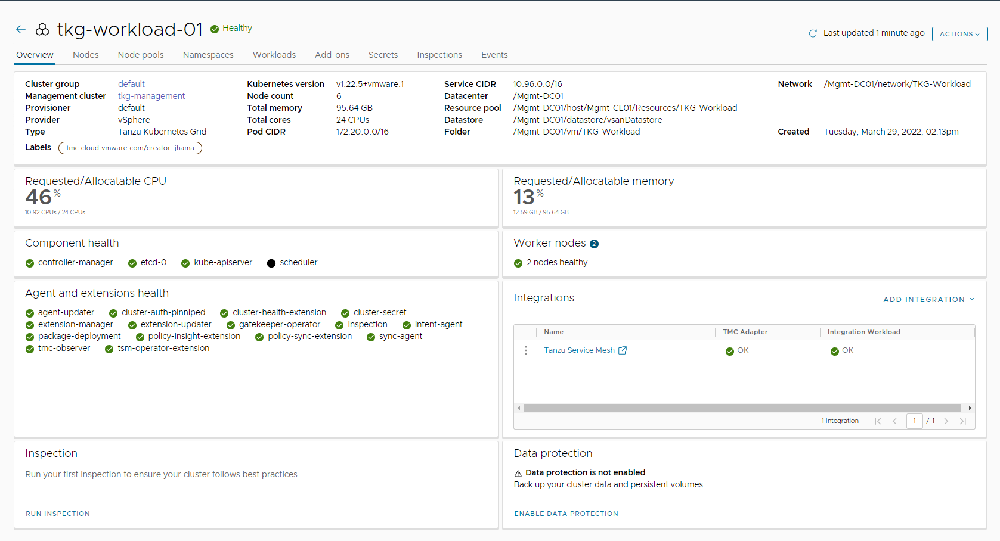

3. Click **Enable** on the confirmation dialog.

    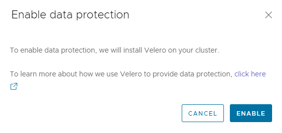

It takes approximately 5-10 minutes to enable data protection on a Kubernetes cluster. Tanzu Mission Control creates a namespace named Velero and installs Velero related Kubernetes objects in the workload cluster.

```bash
root@arcas [ ~ ]# kubectl get all -n velero
NAME                          READY   STATUS    RESTARTS   AGE
pod/restic-nfbpl              1/1     Running   0          44s
pod/restic-q57nk              1/1     Running   0          44s
pod/restic-sj954              1/1     Running   0          44s
pod/velero-57cdf5f99f-7fn4b   1/1     Running   0          71s

NAME                    DESIRED   CURRENT   READY   UP-TO-DATE   AVAILABLE   NODE SELECTOR   AGE
daemonset.apps/restic   3         3         3       3            3           <none>          45s

NAME                     READY   UP-TO-DATE   AVAILABLE   AGE
deployment.apps/velero   1/1     1            1           71s

NAME                                DESIRED   CURRENT   READY   AGE
replicaset.apps/velero-57cdf5f99f   1         1         1       72s
```

## Configure Backup

After enabling data protection, 

1. In the **Data protection** section, click **Create Backup** to configure backup for the workload cluster.

    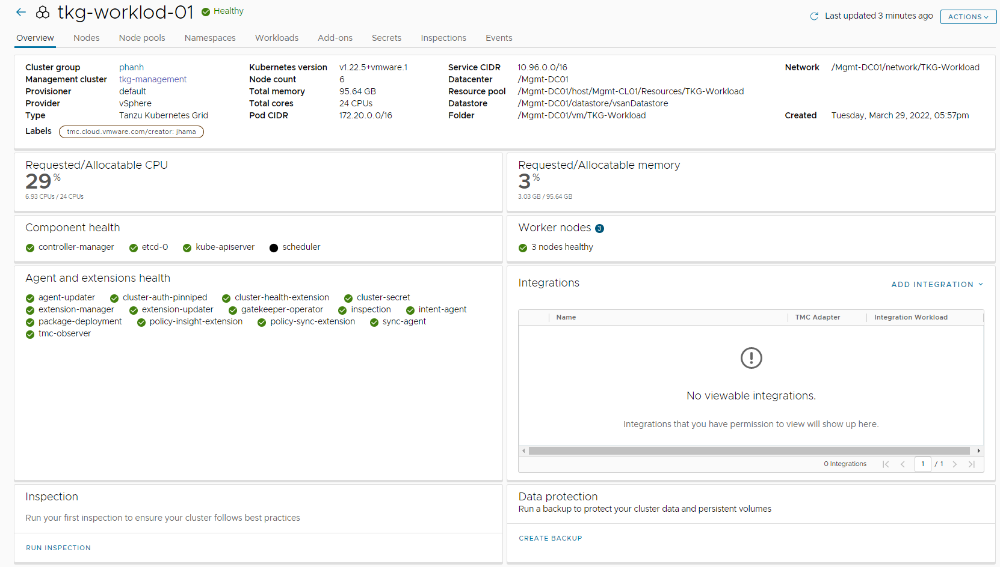

    Tanzu Mission Control Data Protection allows you to create backups of the following types:

      - All resources in a cluster.
      - Selected namespaces in a cluster.
      - Specific resources in a cluster identified by a given label.

    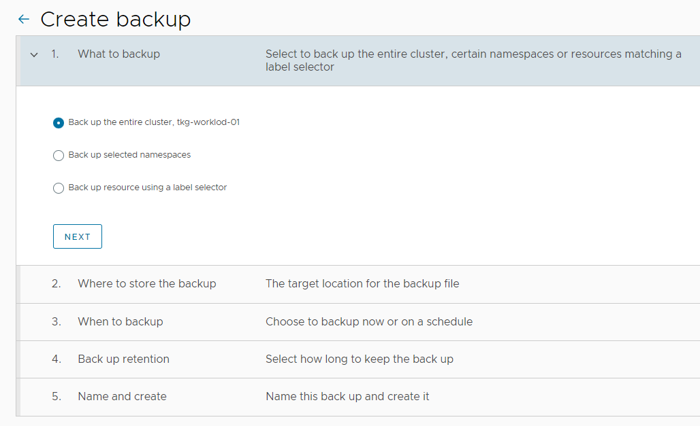

1. Select the target location where the backup will be stored.

    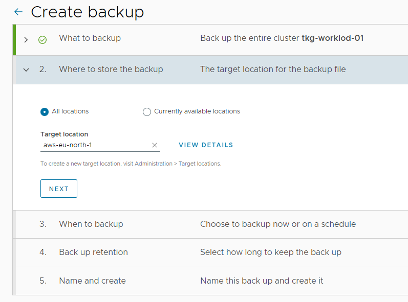

1. Configure the backup schedule and click **Next**.

    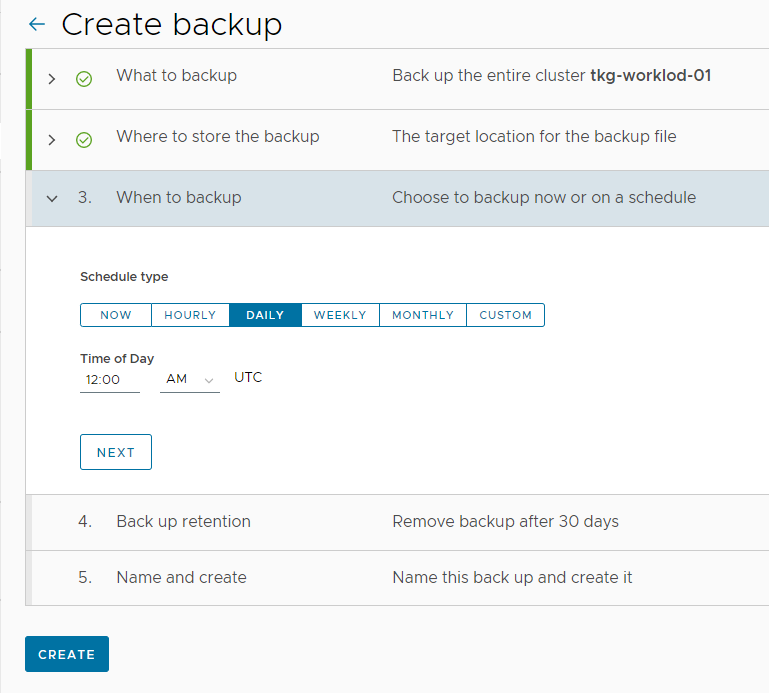

1. Specify the backup retention period and click **Next**.

    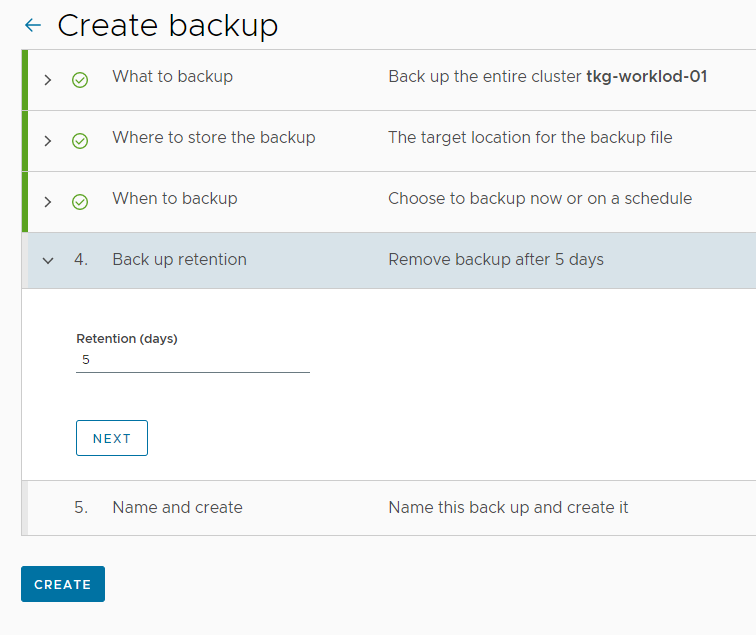

1. Specify a name for the backup schedule and click **Create**.

    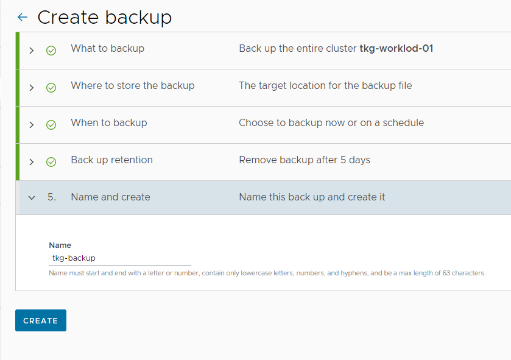

Backup configuration may take some time depending on the Kubernetes objects that you have provisioned in the workload cluster. When backup is configured for the first time, Tanzu Mission Control takes a backup immediately. After that backups are taken as per the backup schedule configured.

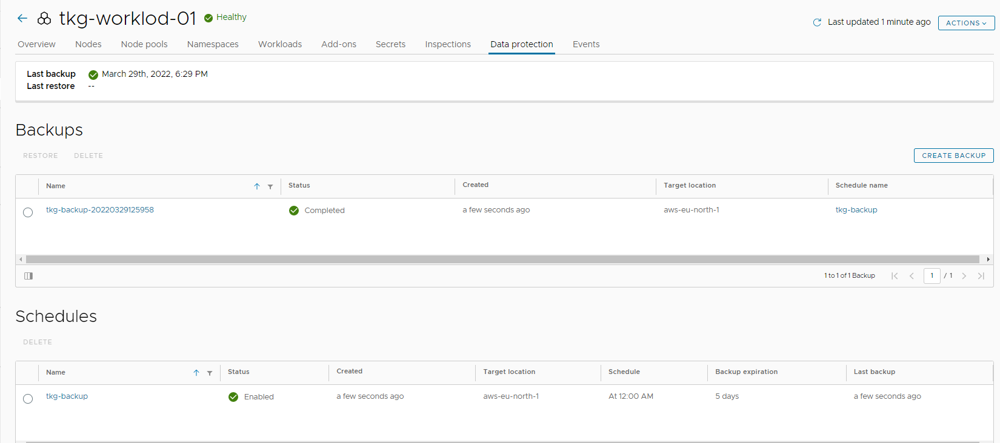

## Restore Backup

To restore the Kubernetes data from the backup, 

1. Go to **Data Protection**.
2. Select the backup image and click **Restore**.

    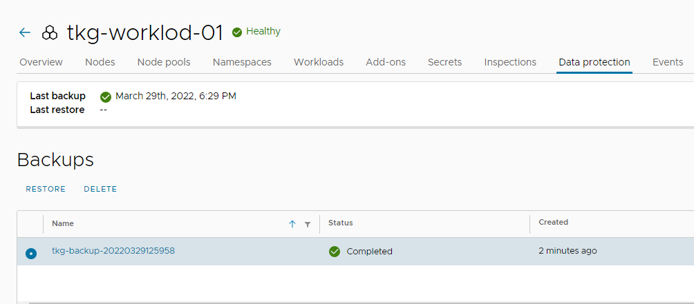

3. Select the resources that you want to restore.  

    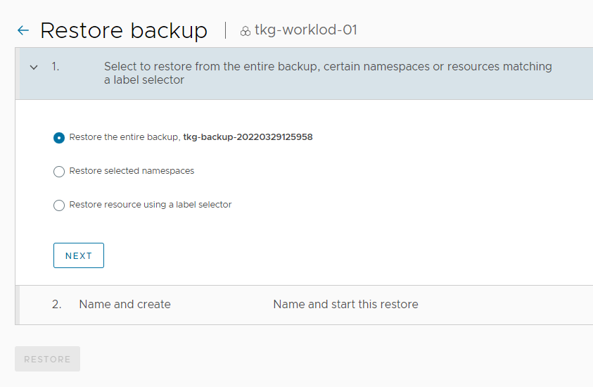

4. Specify a name for the restore task and click **Restore**.

    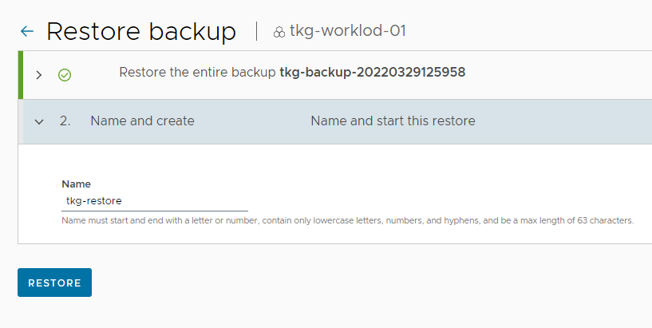

If you have backed up persistent volumes, the restore process may take some time. The backup is restored in the same cluster from which it was retrieved.
