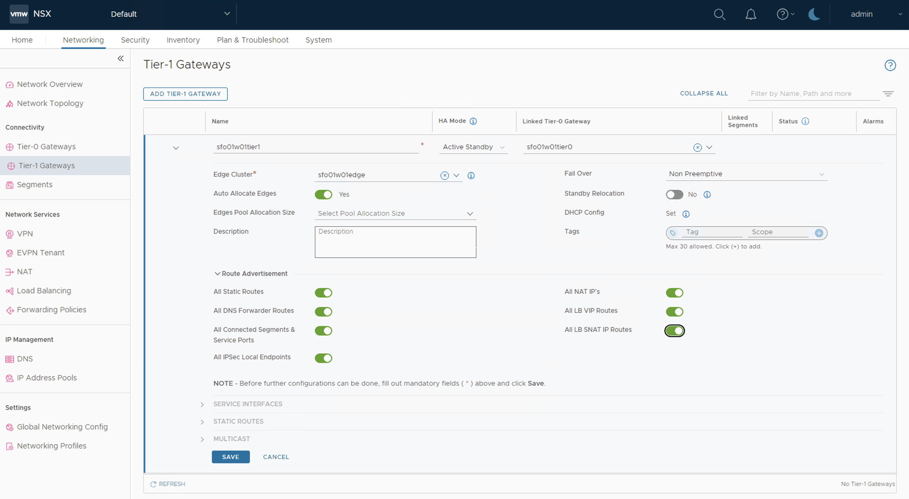
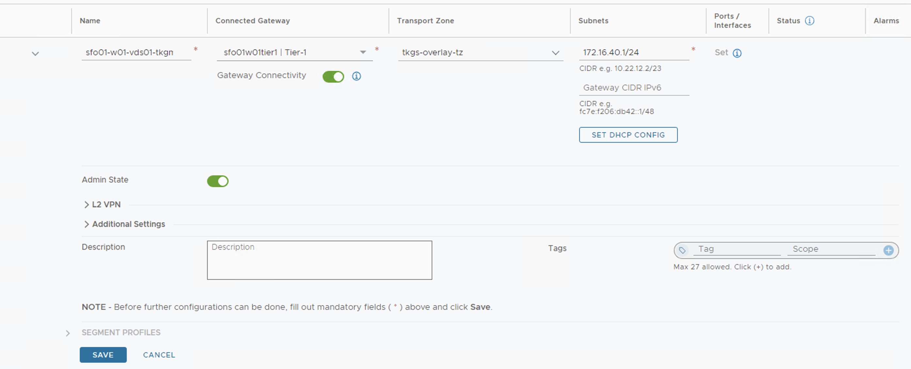
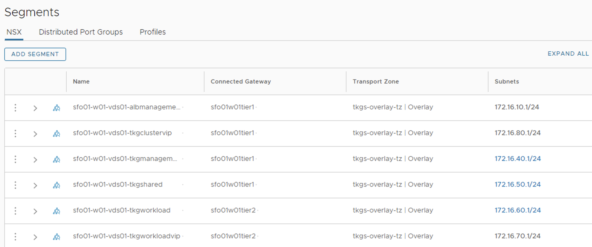
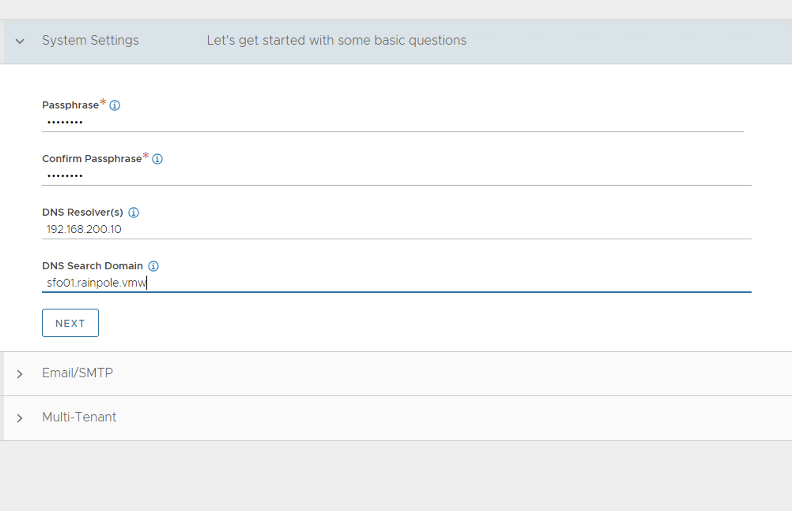
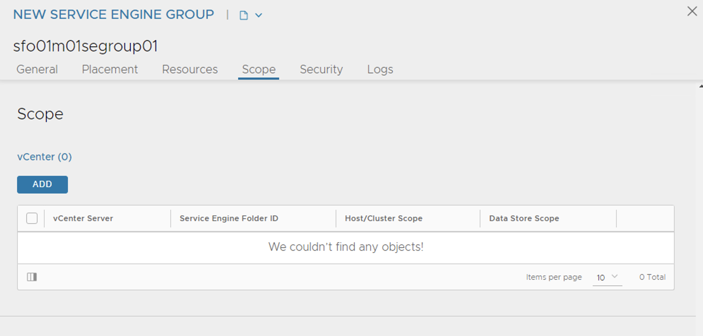
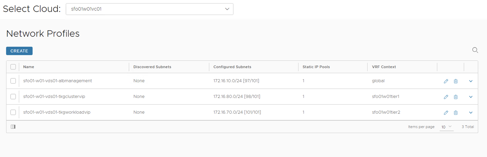
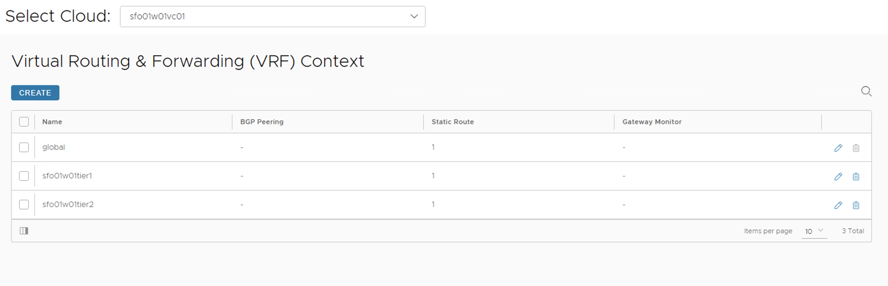
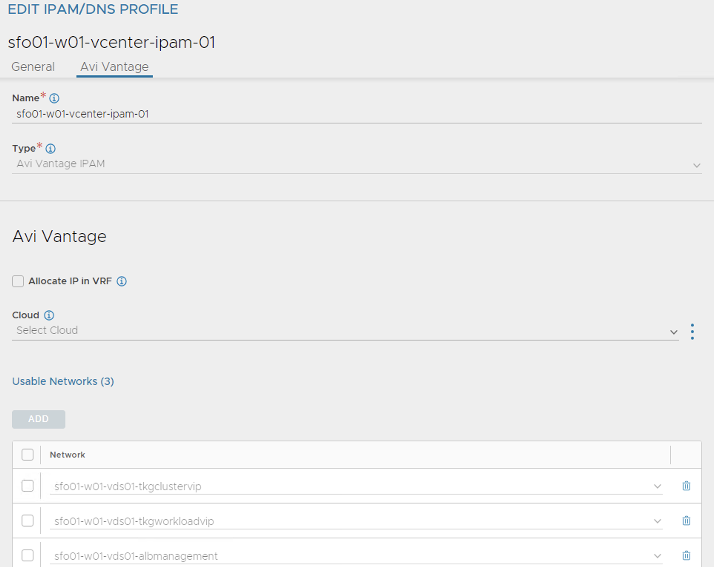
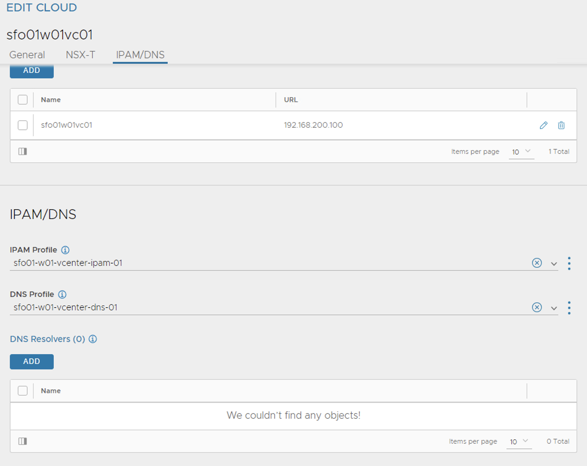

# Deploy Tanzu Kubernetes Grid on vSphere with NSX-T Networking in Air-gapped Environment

VMware Tanzu Kubernetes Grid (TKG) (multi-cloud) provides organizations with a consistent, upstream-compatible, regional Kubernetes substrate that is ready for end-user workloads and ecosystem integrations. It delivers an open source aligned Kubernetes distribution with consistent operations and management to support infrastructure and app modernization.

An air-gapped installation method is used when the Tanzu Kubernetes Grid components (bootstrapper and cluster nodes) are unable to connect to the Internet to download the installation binaries from the public [VMware Registry](https://projects.registry.vmware.com/) during Tanzu Kubernetes Grid installation or upgrade.

The scope of the document is limited to providing deployment steps based on the reference design in [Tanzu Kubernetes Grid on NSX-T Networking](../reference-designs/tkg-nsxt-airgap-ra.md) and it does not cover deployment procedures for the underlying SDDC components.

## Supported Component Matrix

The following table provides the component versions and interoperability matrix supported with the reference design:

|**Software Components**|**Version**|
| --- | --- |
|Tanzu Kubernetes Grid|2.1.x|
|VMware vSphere ESXi|7.0 U3d and later|
|VMware vCenter (VCSA)|7.0 U3d and later |
|NSX Advanced Load Balancer|22.1.2|
|VMware NSX-T|3.2.1.2|

For latest information on software versions that can be used together, see the [Interoperability Matrix](https://interopmatrix.vmware.com/Interoperability?col=551,9293&row=789,%262,%26912).

## <a id=prepare-environment-deployment-tkg> </a> Prepare the Environment for Deployment of Tanzu Kubernetes Grid

Before deploying Tanzu Kubernetes Grid in the your VMware NSX-T environment, ensure that your environment is set up as described in the following sections:

- [General Requirements](#general-requirements)
- [Network Requirements](#network-requirements)
- [Firewall Requirements](#firewall-requirements)

### <a id=general-requirements> </a>  General Requirements


- A vCenter with NSX-T backed environment.
- Ensure that following NSX-T configurations are complete. 

  **Note:** The following provides only a high-level overview of the required NSX-T configuration. For more information, see [NSX-T Data Center Installation Guide](https://docs.vmware.com/en/VMware-NSX-T-Data-Center/3.2/installation/GUID-3E0C4CEC-D593-4395-84C4-150CD6285963.html) and [NSX-T Data Center Product Documentation](https://docs.vmware.com/en/VMware-NSX/index.html).

  - NSX-T manager instance is deployed and configured with Advanced or higher license.
  - vCenter Server that is associated with the NSX-T Data Center is configured as Compute Manager.
  - Required overlay and vLAN Transport Zones are created.
  - IP pools for host and edge tunnel endpoints (TEP) are created.
  - Host and edge uplink profiles are in place.
  - Transport node profiles are created. This is not required if configuring NSX-T data center on each host instead of the cluster.
  - NSX-T data center configured on all hosts part of the vSphere cluster or clusters.
  - Edge transport nodes and at least one edge cluster is created.
  - Tier-0 uplink segments and tier-0 gateway is created.
  - Tier-0 router is peered with uplink L3 switch.
  - DHCP profile is created in NSX.
- SDDC environment has the following objects are available:
  - A vSphere cluster with at least three hosts on which vSphere DRS is enabled and NSX-T is successfully configured.
  - A dedicated resource pool to deploy the following Tanzu Kubernetes management cluster, shared services cluster, and workload clusters. The number of required resource pools depends on the number of workload clusters to be deployed.
  - VM folders to collect the Tanzu Kubernetes Grid VMs.
  - A datastore with sufficient capacity for the control plane and worker node VM files.
  - Network time protocol (NTP) service is running on all hosts and vCenter.
  - A host, server, or VM based on Linux, macOS, or Windows which acts as your bootstrap machine which has docker installed. For this deployment, a virtual machine based on Photon OS will be used.
  - Depending on the OS flavor of the bootstrap VM, download and configure the following packages from [VMware Customer Connect](https://customerconnect.vmware.com/downloads/info/slug/infrastructure_operations_management/vmware_tanzu_kubernetes_grid/2_x). To configure required packages on the Cent OS machine, see [Deploy and Configure Bootstrap Machine](#configurebootstrap)."
    - Tanzu CLI 2.1.0
    - Kubectl cluster CLI 1.24.9
  - A vSphere account with permissions as described in [Required Permissions for the vSphere Account](https://docs.vmware.com/en/VMware-Tanzu-Kubernetes-Grid/2.1/tkg-deploy-mc-21/mgmt-reqs-prep-vsphere.html).
  - Download and import NSX Advanced Load Balancer 22.1.2 OVA to Content Library.
  - Download the following OVA files from [VMware Customer Connect](https://customerconnect.vmware.com/downloads/info/slug/infrastructure_operations_management/vmware_tanzu_kubernetes_grid/2_x) and import to vCenter. Convert the imported VMs to templates."
    - Photon v3 Kubernetes v1.24.9 OVA and/or
    - Ubuntu 2004 Kubernetes v1.24.9 OVA  

**Note**: You can also download supported older versions of Kubernetes from [VMware Customer Connect](https://customerconnect.vmware.com/en/downloads/details?downloadGroup=TKG-160&productId=988&rPId=93384) and import them to deploy workload clusters on the intended Kubernetes versions.<p>
**Note**: In Tanzu Kubernetes Grid nodes, it is recommended to not use hostnames with ".local" domain suffix. For more information, see [KB article](https://kb.vmware.com/s/article/83623). 

### <a id=resource-pools-and-vm-folders> </a> Resource Pools and VM Folders

The sample entries of the resource pools and folders that need to be created are as follows.

|**Resource Type**|**Sample Resource Pool Name**|**Sample Folder Name**|
| --- | --- | --- |
|NSX ALB Components|`tkg-vsphere-alb-components`|`tkg-vsphere-alb-components`|
|TKG Management components|`tkg-management-components`|`tkg-management-components`|
|TKG Shared Service Components|`tkg-vsphere-shared-services`|`tkg-vsphere-shared-services`|
|TKG Workload components|`tkg-vsphere-workload`|`tkg-vsphere-workload`|

### <a id=network-requirements> </a> Network Requirements

Create logical segments in NSX-T for deploying Tanzu Kubernetes Grid components as per [Network Requirements](../reference-designs/tkg-nsxt-airgap-ra.md#ra-network-requirements) defined in the reference architecture.

### <a id=firewall-requirements> </a> Firewall Requirements

Ensure that the firewall is set up as described in [Firewall Requirements](../reference-designs/tkg-nsxt-airgap-ra.md#ra-firewall-requirements).

### <a id=subnet-and-cidr-examples> </a> Subnet and CIDR Examples

For this demonstration, this document makes use of the following CIDR for Tanzu Kubernetes Grid deployment. Change the values to reflect your environment.

|**Network Type**|**Segment Name**|**Gateway CIDR**|**DHCP Pool in NSXT**|**NSX ALB IP Pool**|
| --- | --- | --- | --- | --- |
|NSX ALB Management Network|sfo01-w01-vds01-albmanagement|172.16.170.1/24|N/A|172.19.170.24 - 172.19.170.200|
|TKG Cluster VIP Network|sfo01-w01-vds01-tkgclustervip|172.16.180.1/24|N/A|172.16.180.8 - 172.16.180.200|
|TKG Management Network|sfo01-w01-vds01-tkgmanagement|172.16.140.1/24|172.16.140.8 - 172.16.140.200|N/A|
|TKG Shared Service Network|sfo01-w01-vds01-tkgshared|172.16.150.1/27|172.16.150.8 - 172.16.150.200|N/A|
|TKG Workload Network|sfo01-w01-vds01-tkgworkload|172.16.160.1/24|172.16.160.8- 172.16.160.200|N/A|

## <a id=tkg-deployment-workflow> </a> Tanzu Kubernetes Grid Deployment Workflow

Here are the high-level steps for deploying Tanzu Kubernetes Grid on NSX-T networking in an air-gapped environment:
- [Configure T1 Gateway and Logical Segments in NSX-T Data Center](#configurensxt)
- [Deploy and Configure NSX Advanced Load Balancer](#deploynsxalb)
- [Configure Bastion Host](#configure-bastion)
- [Install Harbor Image Registry](#install-harbor)
- [Configure Bootstrap Virtual machine](#configure-bootstrap)
- [Deploy Tanzu Kubernetes Grid Management Cluster](#deploy-tkg-management)
- [Deploy Tanzu Kubernetes Grid Shared Service Cluster](#deploy-tkg-shared-services)
- [Deploy Tanzu Kubernetes Grid Workload Cluster](#deploy-workload-cluster)
- [Deploy User-Managed Packages on Tanzu Kubernetes Grid Clusters](#deploy-packages)

## <a id="configurensxt"> </a> Configure T1 Gateway and Logical Segments in NSX-T Data Center
As a prerequisite, an NSX-T backed vSphere environment must be configured with at least one tier-0 gateway. A tier-0 gateway performs the functions of a tier-0 logical router. It processes traffic between the logical and physical networks. For more information on creating and configuring a tier-0 gateway, see [NSX-T documentation](https://docs.vmware.com/en/VMware-NSX-T-Data-Center/3.2/administration/GUID-E9E62E02-C226-457D-B3A6-FE71E45628F7.html).

This procedure comprises the following tasks:

1. Add a Tier-1 Gateway
1. Create Overlay-Backed Segments

### Add a Tier-1 Gateway

The tier-1 logical router must be connected to the tier-0 logical router to get the northbound physical router access. The following procedure provides the minimum required configuration to create a tier-1 gateway, which is adequate to successfully deploy the Tanzu for Kubernetes Operations stack. For a more advanced configuration, see [NSX-T documentation](https://docs.vmware.com/en/VMware-NSX/index.html).

1. With admin privileges, log in to NSX Manager.
1. Select **Networking** > **Tier-1 Gateways**.
1. Click **Add Tier-1 Gateway**.
1. Enter a name for the gateway.
1. Select a tier-0 gateway to connect to this tier-1 gateway to create a multi-tier topology.
1. Select an NSX Edge cluster. This is required for this tier-1 gateway to host stateful services such as NAT, load balancer, or firewall.
1. (Optional) In the **Edges** field, select **Auto Allocated** or manually set the edge nodes.
1. Select a failover mode or accept the default. The default option is Non-preemptive.
1. Select **Enable Standby Relocation**.
1. Click **Route Advertisement** and ensure that following routes are selected:
   * **All DNS Forwarder Routes**
   * **All Connected Segments and Service Ports**
   * **All IPSec Local Endpoints**
   * **All LB VIP Routes**
   * **All LB SNAT IP Routes**

    

1. Click **Save**.
    
#### DHCP configuration on Tier-1 Gateway

Complete the following steps to set the DHCP configuration in the tier-1 gateway:

1. With admin privileges, log in to NSX Manager.
1. Select **Networking** > **Tier-1 Gateways**.
1. On the tier-1 gateway that you created earlier, click the three dots menu and select **Edit**.
1. Next to DHCP Config, click **Set**.


1. In the Set DHCP Configuration dialog box, set **Type** to DHCP Server and select the DHCP profile that you created as part of the prerequisites.

   

1. Click **Save**.

### Create Overlay-Backed Segments

VMware NSX provides the option to add two kinds of segments: overlay-backed segments and VLAN-backed segments. Segments are created as part of a transport zone. There are two types of transport zones: VLAN transport zones and overlay transport zones. A segment created in a VLAN transport zone is a VLAN-backed segment and a segment created in an overlay transport zone is an overlay-backed segment.

Create the overlay backed logical segments as shown in the [Overlay backed segments CIDR example](#cidrex). All these segments will be a part of the same overlay transport zone and they must be connected to the tier-1 gateway.

The following procedure provides required details to create one such network which is required for the Tanzu for Kubernetes Operations deployment:

1. With admin privileges, log in to NSX Manager

1. Select **Networking** > **Segments**.

1. Click **ADD SEGMENT** and enter a name for the segment. For example, `sfo01-w01-vds01-tkgmanagement`

1. Under **Connected Gateway**, select the tier-1 gateway that you created earlier.

1. Under **Transport Zone**, select a transport zone that will be an overlay transport zone.

1. Under **Subnets**, enter the gateway IP address of the subnet in the CIDR format. For example, `172.16.140.1/24`

   

    **Note:** The following  step is required only for Tanzu Kubernetes Grid management network, shared services network, and workload network.

1. Click **SET DHCP CONFIG**.

    **DHCP Type** field is set to Gateway DHCP Server and **DHCP Profile** is set to the profile created while creating the tier-1 gateway.

   1. Click **Settings**, select **Enable DHCP Config**, and enter the DHCP range and DNS server information.

      

   1. Click **Options** and under **Select DHCP Options**, select **GENERIC OPTIONS**.

   1. Click **ADD GENERIC OPTION**, Add **NTP servers (42)** and **Domain Search (119)**.

      

   1. Click **Save** to create the logical segment.

Repeat steps 1-7 to create all other required overlay-backed segments. Once completed, you should see an output similar to:

   

Additionally, you can create the required inventory groups and firewall rules. For more information, see [NSX-T Data Center Product Documentation](https://docs.vmware.com/en/VMware-NSX/index.html).

## <a id="deploynsxalb"> </a>   Deploy and Configure NSX Advanced Load Balancer
NSX Advanced Load Balancer (ALB) is an enterprise-grade integrated load balancer that provides L4- L7 load balancer support. It is recommended for vSphere deployments without NSX-T or when there are unique scaling requirements.

NSX Advanced Load Balancer is deployed in Write Access Mode in the vSphere Environment backed by NSX-T. This mode grants NSX Advanced Load Balancer controllers full write access to the vCenter or NSX which helps in automatically creating, modifying, and removing service engines (SEs) and other resources as needed to adapt to changing traffic needs.

The sample IP address and FQDN set for the NSX Advanced Load Balancer controllers is as follows:

|**Controller Node**|**IP Address**|**FQDN**|
| --- | --- | --- |
|Node 1 Primary|172.16.170.18|`sfo01albctlr01a.sfo01.rainpole.local`|
|Node 2 Secondary|172.16.170.19|`sfo01albctlr01b.sfo01.rainpole.local`|
|Node 3 Secondary |172.16.170.20|`sfo01albctlr01c.sfo01.rainpole.local`|
|HA Address|172.16.170.17|`sfo01albctlr01.sfo01.rainpole.local`|

### <a id="deploynsxalb"> </a> Deploy NSX Advanced Load Balancer

As part of the prerequisites, you must have the NSX Advanced Load Balancer 22.1.2 OVA downloaded and imported to the content library. Deploy the NSX Advanced Load Balancer under the resource pool **tkg-vsphere-alb-components**  and place it under the folder **tkg-vsphere-alb-components**.

To deploy NSX Advanced Load Balancer, complete the following steps.

1. Log in to **vCenter** and navigate to **Home** > **Content Libraries**.
1. Select the content library under which the NSX-ALB OVA is placed.
1. Click on **OVA & OVF Templates**.
1. Right-click the NSX Advanced Load Balancer image and select **New VM from this Template**.
1. On the Select name and folder page, enter a name and select a folder for the NSX Advanced Load Balancer VM as **tkg-vsphere-alb-components**.
1. On the Select a compute resource page, select the resource pool **tkg-vsphere-alb-components**.
1. On the Review details page, verify the template details and click **Next**.
1. On the Select storage page, select a storage policy from the VM Storage Policy drop-down menu and choose the  datastore location where you want to store the virtual machine files.
1. On the Select networks page, select the network **sfo01-w01-vds01-albmanagement** and click **Next**.
1. On the Customize template page, provide the NSX Advanced Load Balancer management network details such as IP address, subnet mask, and gateway, and then click **Next**.
1. On the Ready to complete page, review the provided information and click **Finish**.


A new task for creating the virtual machine appears in the **Recent Tasks** pane. After the task is complete, the NSX Advanced Load Balancer virtual machine is created on the selected resource. Power on the virtual machine and give it a few minutes for the system to boot. Upon successful boot up, navigate to NSX Advanced Load Balancer on your browser.  

**Note**: While the system is booting up, a blank web page or a 503 status code may appear.  

### <a id="nsx-alb-init"> </a>NSX Advanced Load Balancer: Initial Setup

Once NSX Advanced Load Balancer is successfully deployed and running, navigate to NSX Advanced Load Balancer on your browser using the URL https://<em><IP/FQDN></em> and configure the basic system settings:

1. Set admin password and click on **Create Account**.

    

1. On the Welcome page, under **System Settings**, set backup passphrase and provide DNS information, and then click **Next**.

    

1. Under **Email/SMTP**, provide email and SMTP information, and then click **Next**.

    

1. Under **Multi-Tenant**, configure settings as follows and click **Save**.
    - IP Route Domain: Share IP route domain across tenants  
    - Service Engines are managed within the: Provider (Shared across tenants)  
    - Tenant Access to Service Engine: Read

    

If you did not select the **Setup Cloud After** option before saving, the initial configuration wizard exits. The Cloud configuration window does not automatically launch, and you are directed to a dashboard view on the controller.

### NSX Advanced Load Balancer: NTP Configuration

To configure NTP, navigate to **Administration** > **Settings** > **DNS/NTP > Edit**.


Add your NTP server details and then click **Save**.

**Note:** You may also delete the default NTP servers.


### NSX Advanced Load Balancer: Licensing

This document focuses on enabling NSX Advanced Load Balancer using the license model: **Enterprise License (VMware NSX ALB Enterprise)**.

1. To configure licensing, navigate to **Administration** > **Licensing**, and click on the gear icon to change the license type to Enterprise.

   

2. Select Enterprise Tier as the license type and click **Save**.

   

3. Once the license tier is changed, apply the NSX Advanced Load Balancer Enterprise license key. If you have a license file instead of a license key, apply the license by selecting the **Upload a License File** option.

   

### NSX Advanced Load Balancer: Controller High Availability

In a production environment, it is recommended to deploy additional controller nodes and configure the controller cluster for high availability and disaster recovery. Adding 2 additional nodes to create a 3-node cluster provides node-level redundancy for the controller and also maximizes performance for CPU-intensive analytics functions.

To run a 3-node controller cluster, you deploy the first node and perform the initial configuration, and set the cluster IP address. After that, you deploy and power on two more controller VMs, but you must not run the initial configuration wizard or change the admin password for these controllers VMs. The configuration of the first controller VM is assigned to the two new controller VMs.

The first controller of the cluster receives the Leader role. The second and third controllers work as Follower.

Complete the following steps to configure NSX Advanced Load Balancer cluster:

1. Log in to the primary NSX Advanced Load Balancer controller and navigate to **Administrator** > **Controller** > **Nodes**, and then click **Edit**.

1. Specify **Name** and **Controller Cluster IP**, and then click **Save**. This IP address must be from the NSX ALB management network.

    

1. Deploy the 2nd and 3rd NSX Advanced Load Balancer controller nodes by using steps in [Deploy NSX Advanced Load Balancer](#deploynsxalb).

1. Log into the primary NSX Advanced Load Balancer controller using the Controller Cluster IP/FQDN and navigate to **Administrator** > **Controller** >  **Nodes**, and then click **Edit**. The Edit Controller Configuration popup appears.

1. In the **Cluster Nodes** field, enter the IP address for the 2nd and 3rd controller, and then click **Save**.

    

    After you complete these steps, the primary NSX Advanced Load Balancer controller becomes the leader for the cluster and invites the other controllers to the cluster as members.

    NSX Advanced Load Balancer then performs a warm reboot of the cluster. This process can take approximately 10-15 minutes. You will be automatically logged out of the controller node where you are currently logged in. On entering the cluster IP address in the browser, you can see details about the cluster formation task.

    

The configuration of the primary (leader) controller is synchronized to the new member nodes when the cluster comes online following the reboot. Once the cluster is successfully formed, you can see the following status:


**Note:** In the following tasks, all NSX Advanced Load Balancer configurations are done by connecting to the NSX Advanced Load Balancer Controller Cluster IP/FQDN.

### NSX Advanced Load Balancer: Certificate Management

The default system-generated controller certificate generated for SSL/TSL connections will not have the required subject alternate name (SAN) entries. Complete the following steps to create a controller certificate:

1. Log in to the NSX Advanced Load Balancer controller and navigate to **Templates** > **Security** > **SSL/TLS Certificates**.

1. Click **Create** and select **Controller Certificate**. You can either generate a self-signed certificate, generate CSR, or import a certificate. For the purpose of this document, a self-signed certificate will be generated.

1. Provide all required details as per your infrastructure requirements and in the **Subject Alternate Name (SAN)** field, provide IP address and FQDN of all NSX Advanced Load Balancer controllers including NSX Advanced Load Balancer cluster IP and FQDN, and then click **Save**.

    

    

1. Once the certificate is created, capture the certificate contents as this is required while deploying the Tanzu Kubernetes Grid management cluster.
  To capture the certificate content, click on the Download icon next to the certificate, and then click **Copy to clipboard** under **Certificate**.

    

1. To replace the certificate, navigate to **Administration** > **Settings** > **Access Settings**, and click the pencil icon at the top right to edit the system access settings, and then replace the SSL/TSL certificate and click **Save**.

    

1. Log out and log in to NSX Advanced Load Balancer.

### Create Credentials

NSX Advanced Load Balancer requires credentials of VMware NSX and vCenter Server to authenticate with these endpoints. These credentials need to be created before configuring NSX Cloud.

To create a new credential, navigate to **Administration** > **User Credentials** and click **Create**.

1. Create NSX Credential: Select the credential type as NSX-T and provide a name for the credential. Under the section NSX-T Credentials, specify the username and password that NSX Advanced Load Balancer will use to authenticate with VMware NSX.


2. Create vCenter Credential: Select the credential type as vCenter and provide a name for the credential. Under the section vCenter Credentials, specify the username and password that NSX Advanced Load Balancer will use to authenticate with vCenter server.


### Create NSX Cloud and Service Engine Groups

NSX Advanced Load Balancer can be deployed in multiple environments for the same system. Each environment is called a cloud. The following procedure provides steps to create a VMware NSX cloud. As per the architecture, two service engine (SE) groups will be created.

**Service Engine Group 1**: Service engines associated with this service engine group hosts:

* Virtual services for all load balancer functionalities requested by Tanzu Kubernetes Grid management cluster and workload.
* Virtual services that load balances control plane nodes of all Tanzu Kubernetes Grid Kubernetes clusters.

**Service Engine Group 2**: Service engines associated with this service engine group hosts virtual services for all load balancer functionalities requested by Tanzu Kubernetes Grid workload clusters mapped to this SE group.  

**Note**:

* Based on your requirements, you can create additional SE groups for the workload clusters.
* Multiple workload clusters can be mapped to a single SE group.
* A Tanzu Kubernetes Grid cluster can be mapped to only one SE group for application load balancer services.

For information about mapping a specific service engine group to Tanzu Kubernetes Grid workload cluster, see [Configure NSX Advanced Load Balancer in Tanzu Kubernetes Grid Workload Cluster](#workloadako).

The following components are created in NSX Advanced Load Balancer.

<!-- /* cSpell:disable */ -->

| Object | Sample Name |
| --- | --- |
| NSX Cloud | sfo01w01vc01|
| Service Engine Group 1 | sfo01m01segroup01|
| Service Engine Group 2 | sfo01w01segroup01 |

<!-- /* cSpell:enable */ -->

1.  Log in to NSX Advanced Load Balancer and navigate to **Infrastructure** > **Clouds** > **Create** > **NSX-T Cloud**.

    

2.  Enter cloud name and provide a object name prefix. Click **CHANGE CREDENTIALS** to connect NSX Advanced Load Balancer with VMware NSX.

    

3.  Specify NSX-T Manager Address and select the NSX-T credential that you created earlier.

    

4.  Under the **Management Network** pane, select the following:

    - Transport Zone: Overlay transport zone where you connected your NSX Advanced Load Balancer management network.
    - Tier-1 Router: Tier-1 gateway where Advanced Load Balancer management network is connected.
    - Overlay Segment: Logical segment that you have created for Advanced Load Balancer management.

5.  Under the **Data Networks** pane, select the following:

    - Transport Zone: Overlay transport zone where you connected your Tanzu Kubernetes Grid VIP network.
    - Tier-1 Router: Tier-1 gateway where Tanzu Kubernetes Grid VIP network is connected.
    - Overlay Segment: Logical segment that you have created for Tanzu Kubernetes Grid VIP.

    

6.  Under **vCenter Servers** pane, click **ADD**.

    

7.  Specify a name for the vCenter server and click **CHANGE CREDENTIALS** to connect NSX Advanced Load Balancer with the vCenter server.

    

8.  Select the vCenter server from the drop down and select the vCenter credential which you have created earlier.
    
    

9.  Select the Content Library where Service Engine templates will be stored by NSX Advanced Load Balancer.
    
    

10.  Leave the IPAM/DNS profile section empty as this will be populated later, once you have created the profiles. Click **SAVE** to finish the NSX-T cloud configuration.

     

11. Ensure that status of the NSX-T cloud is Green post creation.

     

12. Create a service engine group for Tanzu Kubernetes Grid management clusters: 
    1.  Click on the Service Engine Group tab. 
    2.  Under Select Cloud, choose the cloud created in the previous step, and click **Create**.

13. Enter a name for the Tanzu Kubernetes Grid management service engine group and set the following parameters:  

    | Parameter | Value |
    | --- | --- |
    | High availability mode | Active/Active |
    | VS Placement | Compact |
    | Memory per Service Engine | 4 |
    | vCPU per Service Engine | 2 |

    Use the default values for the rest of the parameters.

    

    For advanced configuration, click on the Advanced tab. Specify the vCenter server endpoint by clicking on the Add vCenter option.

    

    Select the vCenter server from the dropdown, vSphere cluster and datastore for service engine placement, and service engine name prefix, and then click **Save**.

    

14. Repeat steps 12 and 13 to create another service engine group for Tanzu Kubernetes Grid workload clusters. Once complete, there must be two service engine groups created.

    

### Configure Network and IPAM Profile

As part of the cloud creation, NSX Advanced Load Balancer management and Tanzu Kubernetes Grid VIP networks have been configured in NSX Advanced Load Balancer. Since DHCP was not selected as the IP address management method in the cloud configuration, you have to specify pool of IP addresses that can be assigned to the service engine NICs and the virtual services that will be created in future.

To configure IP address pools for the networks, follow this procedure:

1. Navigate to **Infrastructure** > **Networks** and select the cloud that you have created earlier.

   

2. Click on the edit icon next for the network and configure as follows. Change the provided details as per your SDDC configuration.

   |**Network Name**|**DHCP** |**Subnet**|**Static IP Pool**|
   | --- | --- | --- | --- |
   |sfo01-w01-vds01-albmanagement|No|172.16.170.0/24|172.16.170.10 - 172.16.170.200|
   |sfo01-w01-vds01-tkgclustervip|No|172.16.180.0/24|172.16.180.10 - 172.16.180.200|

   The following snippet shows configuring one of the networks. For example: `sfo01-w01-vds01-albmanagement`

   **Note**: Ensure that VRF Context for `sfo01-w01-vds01-albmanagement` network is set to `Global`.<p>
   **Note**: Ensure that VRF Context for `sfo01-w01-vds01-tkgclustervip` network is set to NSX tier-1 gateway.
   
   Once the networks are configured, the configuration must look like the following image.

   

3. Once the networks are configured, set the default routes for the networks by navigating to **Infrastructure** > **Routing**.

   The default gateway for the `sfo01-w01-vds01-albmanagement` network is set in the global VRF context and for the `sfo01-w01-vds01-tkgclustervip` network, the VRF Context is set to NSX tier-1 gateway.

   To set the default gateway for the `asfo01-w01-vds01-albmanagement` network, click **ADD** Static Route under the global VRF context and set the default gateway to gateway of the NSX Advanced Load Balancer management subnet.

   

      To set the default gateway for the `sfo01-w01-vds01-tkgclustervip` network, click **CREATE** under the tier-1 gateway VRF context and set the default gateway to gateway of the VIP network subnet.

   

   The final configuration is shown below:

   

#### Create IPAM Profile in NSX Advanced Load Balancer and Attach to Cloud

At this point, all the required networks related to Tanzu functionality are configured in NSX Advanced Load Balancer. NSX Advanced Load Balancer provides IPAM service for Tanzu Kubernetes Grid cluster VIP network and NSX ALB management network.  

Complete the following steps to create an IPAM profile and once created, attach it to the NSX-T cloud created earlier.  

1. Log in to NSX Advanced Load Balancer and navigate to **Templates** > **IPAM/DNS Profiles** > **Create** > **IPAM Profile**.

   

   Provide the following details, and then click **Save**.

     |**Parameter**|**Value**|
     | --- | --- |
     |Name|sfo01-w01-ipam01|
     |Type|AVI Vintage IPAM|
     |Cloud for Usable Networks|sfo01w01vc01|
     |Usable Networks|sfo01-w01-vds01-management<br>sfo01-w01-vds01-tkgworkloadvip|

    

2. Click **Create** > **DNS Profile** and provide the domain name.

   

3. Attach the IPAM and DNS profiles to the NSX-T cloud.
    1. Navigate to **Infrastructure** > **Clouds**.
    2. Edit the `sfo01w01vc01` cloud.
    3. Under IPAM/DNS section, choose the IPAM and DNS profiles created earlier and save the updated configuration.  

     

4. Under the section **DNS Resolvers**, click **ADD** to add the DNS server that NSX-T cloud will use to resolve the hostname or FQDN of the components that will be created later.

     

   Enter a name for the DNS and click **ADD** under **Name Servers** to add your infrastructure DNS servers. Optionally, you can specify the TTL for the DNS.

    

This completes the NSX Advanced Load Balancer configuration. The next step is to deploy and configure a bootstrap machine which will be used to deploy and manage Tanzu Kubernetes clusters.


## <a id=configure-bastion> </a> Deploy and Configure Bastion Host

Bastion host is the physical or virtual machine where you download the required installation images or binaries for Tanzu Kubernetes Grid installation from the Internet. The downloaded items then need to be shipped to the bootstrap machine which is inside the air-gapped environment. The bastion host needs to have a browser installed to download the binaries from the Internet.

The bastion host needs to be deployed with the following hardware configuration:

- CPU: 1
- Memory: 4 GB
- Storage (HDD): 160 GB or greater.

**Note:** The following instructions are for CentOS 7. If you are using any other operating system for your bastion host, change the commands accordingly.

### <a id=download-binaries-for-bastion> </a> Download Binaries Required for Configuring Bastion Host

1. Download Docker Engine and associated dependencies binaries using the steps provided below

   ```bash
   ### Create a directory for collecting docker installation binaries:

   mkdir docker-binaries && cd docker-binaries

   ### Add docker repository to the yum command:

   yum install yum-utils -y

   yum-config-manager --add-repo https://download.docker.com/linux/centos/docker-ce.repo

   ### Download docker and associated dependencies: 

   yumdownloader --resolve docker-ce docker-ce-cli containerd.io docker-compose-plugin
   ```

   The `yumdownloader` command downloads the following binaries.

   

2. Download installation binaries from the [Harbor GitHub repository](https://github.com/goharbor/harbor/releases/tag/v2.3.3). 

3. Download the NSX Advanced Load Balancer OVA from [VMware Customer Connect portal](https://customerconnect.vmware.com/downloads/info/slug/networking_security/vmware_nsx_advanced_load_balancer/22_1_x).

4. Download Tanzu CLI, Kubectl, and the Kubernetes OVA images from the [Tanzu Kubernetes Grid product download page](https://customerconnect.vmware.com/downloads/info/slug/infrastructure_operations_management/vmware_tanzu_kubernetes_grid/2_x). Tanzu CLI and Plugins need to be installed on the bastion host and the bootstrap machine.

5. Download the [yq](https://github.com/mikefarah/yq) installation binary from [mikefarah / yq](https://github.com/mikefarah/yq/releases/tag/v4.25.2) GitHub repository.

### Configure Bastion Host

1. Install Tanzu CLI.

    ```bash
    tar -xvf tanzu-cli-bundle-linux-amd64.tar.gz
    cd ./cli/
    sudo install core/v0.28.0/tanzu-core-linux_amd64 /usr/local/bin/tanzu
    chmod +x /usr/local/bin/tanzu
    ```
    Run the `tanzu version` command to check that the correct version of tanzu is installed and executable.

    ```bash
    # tanzu version

    version: v0.28.0
    buildDate: 2023-01-20
    sha: 3c34115bc-dirty
    ```
1. Download the Images .

    Before performing this step, ensure that the disk partition where you download the images has 45 GB of available space.

    ```bash
    tanzu isolated-cluster download-bundle --source-repo <SOURCE-REGISTRY> --tkg-version <TKG-VERSION> --ca-certificate <SECURITY-CERTIFICATE>
    ```

   * SOURCE-REGISTRY is the IP address or the hostname of the registry where the images are stored.
   * TKG-VERSION is the version of Tanzu Kubernetes Grid that you want to deploy in the proxied or air-gapped environment.
   * SECURITY-CERTIFICATE is the security certificate of the registry where the images are stored. To bypass the security certificate validation, use --insecure, instead of --ca-certificate. Both the strings are optional. If you do not specify any value, the system validates the default server security certificate.
    ```bash
    tanzu isolated-cluster download-bundle --source-repo projects.registry.vmware.com/tkg --tkg-version v2.1.0
    ```
   The image bundle in the form of TAR files, along with the publish-images-fromtar.yaml file, is downloaded . The YAML file defines the mapping between the images and the TAR files.

1. Copy the Files to the bootstrap Machine after bootstrap Machine deployment.

    Copy the following files to the offline machine, which is the bootstrap machine in the proxied or air-gapped environment, through a USB thumb drive or other medium:
   * The Image TAR files.
   * The YAML files 

## <a id=install-harbor> </a> Install Harbor Image Registry

Install the Harbor only if you don’t have any existing image repository in your environment. 

To install Harbor, deploy an operating system of your choice with the following hardware configuration:

- vCPU: 4
- Memory: 8 GB
- Storage (HDD): 160 GB

Follow the instructions provided in [Harbor Installation and Configuration](https://goharbor.io/docs/2.3.0/install-config/) to deploy and configure Harbor.


## <a id=configure-bootstrap> </a> Deploy and Configure Bootstrap Machine

The deployment of the Tanzu Kubernetes Grid management and workload clusters is facilitated by setting up a bootstrap machine where you install the Tanzu CLI and Kubectl utilities which are used to create and manage the Tanzu Kubernetes Grid instance. This machine also keeps the Tanzu Kubernetes Grid and Kubernetes configuration files for your deployments. The bootstrap machine can be a laptop, host, or server running on Linux, macOS, or Windows that you deploy management and workload clusters from.

The bootstrap machine runs a local `kind` cluster when Tanzu Kubernetes Grid management cluster deployment is started. Once the `kind` cluster is fully initialized, the configuration is used to deploy the actual management cluster on the backend infrastructure. After the management cluster is fully configured, the local `kind` cluster is deleted and future configurations are performed with the Tanzu CLI.

For this deployment, a Photon-based virtual machine is used as the bootstrap machine. For information on how to configure a macOS or a Windows machine, see [Install the Tanzu CLI and Other Tools](https://customerconnect.vmware.com/downloads/info/slug/infrastructure_operations_management/vmware_tanzu_kubernetes_grid/2_x).

The bootstrap machine must meet the following prerequisites:

   * A minimum of 6 GB of RAM,  2-core CPU , 160 Storage GB .
   * System time is synchronized with a Network Time Protocol (NTP) server.
   * Docker and containerd binaries are installed. For instructions on how to install Docker, see [Docker documentation](https://docs.docker.com/engine/install/centos/).
   * Ensure that the bootstrap VM is connected to Tanzu Kubernetes Grid management network, `sfo01-w01-vds01-tkgmanagement`.

To install Tanzu CLI, Tanzu Plugins, and Kubectl utility on the bootstrap machine, follow the instructions below:
1. Copy  Files to  bootstrap Machine.<p>
   Copy the following files downloaded in Bastion Host through a USB thumb drive or other  medium.
   * The Image TAR files.
   * The YAML files
1. Copy following Linux CLI packages from Bastion Host to  Bootstrap Machine.

   * VMware Tanzu CLI 2.1.0 for Linux
   * kubectl cluster CLI v1.24.9 for Linux

1. Execute the following commands to install Tanzu Kubernetes Grid CLI, kubectl CLIs, and Carvel tools.
    ```bash
    ## Install required packages
    install tar, zip, unzip, wget

    ## Install Tanzu Kubernetes Grid CLI
    tar -xvf tanzu-cli-bundle-linux-amd64.tar.gz
    cd ./cli/
    sudo install core/v0.28.0/tanzu-core-linux_amd64 /usr/local/bin/tanzu
    chmod +x /usr/local/bin/tanzu

    ## Verify Tanzu CLI version

     [root@tkg160-bootstrap ~] # tanzu version

    version: v0.28.0
    buildDate: 2023-01-20
    sha: 6288c751-dirty
    ```
1. Install the isolated-cluster plugin on the offline bootstrap machine:

      ```bash
     tanzu plugin install isolated-cluster --local standalone-plugins/

      ```
1. Log in to the Private Registry on the Offline Machine.
      ```bash
     docker login <URL>
      ```
   Note:- If your private registry uses a self-signed certificate, save the CA certificate of the registry in "/etc/docker/certs.d/registry.example.com/ca.crt"
1. Upload the Images to the Private Registry.
      ```bash
     tanzu isolated-cluster upload-bundle --source-directory <SOURCE-DIRECTORY> --destination-repo <DESTINATION-REGISTRY> --ca-certificate <SECURITY-CERTIFICATE>
      ```
    * SOURCE-DIRECTORY is the path to the location where the image TAR files are stored.
    * DESTINATION-REGISTRY is the path to the private registry where the images will be hosted in the air-gapped environment.
    * SECURITY-CERTIFICATE is the security certificate of the private registry where the images will be hosted in the proxied or air-gapped environment. 
      
    ```bash
     Example:- tanzu isolated-cluster upload-bundle --source-directory ./ --destination-repo registry.example.com/library --ca-certificate /etc/docker/certs.d/registry.example.com/ca.crt
      ```
  **Note** :- we can Skip Step 3,4,5 if your Bastion host direct access to private registry . we can directly upload the files from Bastion to Private registry.

1. Install the kubectl utility.

      ```bash
     gunzip kubectl-linux-v1.24.9+vmware.1.gz
     mv kubectl-linux-v1.24.9+vmware.1.gz /usr/local/bin/kubectl && chmod +x /usr/local/bin/kubectl
      ```

      Run the `kubectl version --short=true` to check that the correct version of kubectl is installed and executable.

1. Configure the environment variables.

      In an air-gap environment, if you run the `tanzu init` or `tanzu plugin sync` commands, the command hangs and times out after some time with the following error:

      ```bash
      [root@bootstrap ~]# tanzu init
      Checking for required plugins...
      unable to list plugin from discovery 'default': error while processing package: failed to get resource files from discovery: Checking if image is bundle: Fetching image: Get "https://projects.registry.vmware.com/v2/": dial tcp 10.188.25.227:443: i/o timeout
      All required plugins are already installed and up-to-date
      ✔  successfully initialized CLI

      [root@bootstrap ~]# tanzu plugin sync
      Checking for required plugins...
      unable to list plugin from discovery 'default': error while processing package: failed to get resource files from discovery: Checking if image is bundle: Fetching image: Get "https://projects.registry.vmware.com/v2/": dial tcp 10.188.25.227:443: i/o timeout
      All required plugins are already installed and up-to-date
      ✔  Done
      ```

      By default the Tanzu global config file, `config.yaml`, which gets created when you first run `tanzu init` command, points to the repository URL <https://projects.registry.vmware.com> to fetch the Tanzu plugins for installation. Because there is no Internet in the environment, the commands fails after some time.

      To ensure that Tanzu Kubernetes Grid always pulls images from the local private registry, run the Tanzu `export` command to add `TKG_CUSTOM_IMAGE_REPOSITORY` to the global Tanzu CLI configuration file, `~/.config/tanzu/config.yaml`. 

      If your image registry is configured with a public signed CA certificate, set the following environment variables.

      ```bash
      export TKG_CUSTOM_IMAGE_REPOSITORY=custom-image-repository.io/yourproject

      export TKG_CUSTOM_IMAGE_REPOSITORY_SKIP_TLS_VERIFY=false
      ```

      If your registry solution uses self-signed certificates, also add TKG_CUSTOM_IMAGE_REPOSITORY_CA_CERTIFICATE in base64-encoded format to the global Tanzu CLI configuration file. For self-signed certificates, set the following environment variables:

      ```bash
      export TKG_CUSTOM_IMAGE_REPOSITORY=custom-image-repository.io/yourproject

      export TKG_CUSTOM_IMAGE_REPOSITORY_SKIP_TLS_VERIFY=false

      export TKG_CUSTOM_IMAGE_REPOSITORY_CA_CERTIFICATE LS0t[...]tLS0tLQ==

      ```
  Note:If we reboot the VM , this setting will go to default 
1. Initialize Tanzu Kubernetes Grid and Install Tanzu CLI plugins.

      ```bash
      ### Initialize Tanzu Kubernetes Grid 

      tanzu config init 

      ## (Optional) Remove existing plugins from any previous CLI installations.

      tanzu plugin clean

      tanzu plugin sync
      ```

      After installing the tanzu plugins, run the tanzu plugin list command to check the plugins version and installation status.

1. Install Carvel tools.

    Tanzu Kubernetes Grid uses the following tools from the Carvel open-source project:

    - [ytt](https://carvel.dev/ytt/) - a command-line tool for templating and patching YAML files. You can also use ytt to collect fragments and piles of YAML into modular chunks for easy re-use.
    - [kapp](https://carvel.dev/kapp/) - the application deployment CLI for Kubernetes. It allows you to install, upgrade, and delete multiple Kubernetes resources as one application.
    - [kbld](https://carvel.dev/kbld/) - an image-building and resolution tool.
    - [imgpkg](https://carvel.dev/imgpkg/) - a tool that enables Kubernetes to store configurations and the associated container images as OCI images, and to transfer these images.

    1. Install ytt

        ```bash
        cd ./cli

        ytt-linux-amd64-v0.43.1+vmware.1.gz

        chmod ugo+x ytt-linux-amd64-v0.43.1+vmware.1 &&  mv ./ytt-linux-amd64-v0.43.1+vmware.1 /usr/local/bin/ytt
        ```
        Run `ytt --version` to check that the correct version of ytt is installed and executable

   1. Install kapp.

      ```bash
      gunzip kapp-linux-amd64-v0.53.2+vmware.1.gz

      chmod ugo+x kapp-linux-amd64-v0.53.2+vmware.1 && mv ./kapp-linux-amd64-v0.53.2+vmware.1 /usr/local/bin/kapp
      ```

      Run `kapp --version` to check that the correct version of kapp is installed and executable.

   2. Install kbld.

      ```bash
      gunzip kbld-linux-amd64-v0.35.1+vmware.1.gz

      chmod ugo+x kbld-linux-amd64-v0.35.1+vmware.1 && mv ./kbld-linux-amd64-v0.35.1+vmware.1 /usr/local/bin/kbld
      ```

      Run `kbld --version` to check that the correct version of kbld is installed and executable.

   3. Install imgpkg.

      ```bash
      gunzip imgpkg-linux-amd64-v0.31.1+vmware.1.gz
      chmod ugo+x imgpkg-linux-amd64-v0.31.1+vmware.1 && mv ./imgpkg-linux-amd64-v0.31.1+vmware.1 /usr/local/bin/imgpkg
      ```

      Run `imgpkg --version` to check that the correct version of imgpkg is installed and executable.

1. Install yq.

    yq a lightweight and portable command-line YAML processor.
    Download [yq](https://github.com/mikefarah/yq/releases/download/v4.25.2/yq_linux_amd64.tar.gz)

    ```bash
    tar -zxvf yq_linux_amd64.tar.gz

    mv yq_linux_amd64 /usr/local/bin/
    ```
    Run the `yq -V` command to check that the correct version of yq is installed and executable.

1. Run the following commands to start the Docker service and enable it to start at boot. Photon OS has Docker installed by default.

    ```bash
    ## Check Docker service status
    systemctl status docker

    ## Start Docker Service
    systemctl start docker

    ## To start Docker Service at boot
    systemctl enable docker
    ```
1. Execute the following commands to ensure that the bootstrap machine uses [cgroup v1](https://man7.org/linux/man-pages/man7/cgroups.7.html).

    ```bash
    docker info | grep -i cgroup

    ## You should see the following
    Cgroup Driver: cgroupfs
    ```

1. Create an SSH key-pair.

    This is required for Tanzu CLI to connect to vSphere from the bootstrap machine.  The public key part of the generated key will be passed during the Tanzu Kubernetes Grid management cluster deployment.  

    ```bash
    ### Generate public/Private key pair.

    ssh-keygen -t rsa -b 4096 -C "email@example.com"

    ### Add the private key to the SSH agent running on your machine and enter the password you created in the previous step 

    ssh-add ~/.ssh/id_rsa 

    ### If the above command fails, execute "eval $(ssh-agent)" and then rerun the command.
    ```

    Make a note of the public key from the file **$home/.ssh/id_rsa.pub**. You need this while creating a config file for deploying the Tanzu Kubernetes Grid management cluster.

1. If your bootstrap machine runs Linux or Windows Subsystem for Linux, and it has a Linux kernel built after the May 2021 Linux security patch, for example Linux 5.11 and 5.12 with Fedora, run the following command.

   ```
    sudo sysctl net/netfilter/nf_conntrack_max=131072
   ```

### <a id="importbaseimage"> </a> Import Base Image Template for Tanzu Kubernetes Grid Cluster Deployment

Before you proceed with the management cluster creation, ensure that the base image template is imported into vSphere and is available as a template. To import a base image template into vSphere:

1. Go to the [Tanzu Kubernetes Grid downloads page](https://customerconnect.vmware.com/downloads/info/slug/infrastructure_operations_management/vmware_tanzu_kubernetes_grid/2_x) and download a Tanzu Kubernetes Grid OVA for the cluster nodes.

 - For the management cluster, this must be either Photon or Ubuntu based Kubernetes v1.24.9 OVA.

     **Note**: Custom OVA with a custom Tanzu Kubernetes release (TKr) is also supported, as described in [Build Machine Images](https://docs.vmware.com/en/VMware-Tanzu-Kubernetes-Grid/2.1/tkg-deploy-mc-21/mgmt-byoi-index.html).
 - For workload clusters, OVA can have any supported combination of OS and Kubernetes version, as packaged in a Tanzu Kubernetes release.

    **Note**: Make sure you download the most recent OVA base image templates in the event of security patch releases. You can find updated base image templates that include security patches on the Tanzu Kubernetes Grid product download page.

2. In the vSphere client, right-click an object in the vCenter Server inventory and select **Deploy OVF template**.

1. Select Local file, click the button to upload files, and go to the downloaded OVA file on your local machine.

1. Follow the installer prompts to deploy a VM from the OVA.

1. Click **Finish** to deploy the VM. When the OVA deployment finishes, right-click the VM and select **Template** > **Convert to Template**.

    **Note:** Do not power on the VM before you convert it to a template.

1. **If using non administrator SSO account**: In the VMs and Templates view, right-click the new template, select **Add Permission**, and assign the **tkg-user** to the template with the **TKG role**.

For information about how to create the user and role for Tanzu Kubernetes Grid, see [Required Permissions for the vSphere Account](https://docs.vmware.com/en/VMware-Tanzu-Kubernetes-Grid/2.1/tkg-deploy-mc-21/mgmt-reqs-prep-vsphere.html).


### Management Cluster Configuration Template

The templates include all of the options that are relevant to deploying management clusters on vSphere. You can copy this template and use it to deploy management clusters to vSphere.

**Important:** The environment variables that you have set, override values from a cluster configuration file. To use all settings from a cluster configuration file, unset any conflicting environment variables before you deploy the management cluster from the CLI.<p>
**Important:** Image repository configuration is very important details which will not be part of default config file when we are creating from TKG UI.<p>
**Important:** Insert the key `AVI_NSXT_T1LR`. The value of this key is the tier-1 gateway where you have connected the `tkg management network` network.

```yaml
#! ---------------------------------------------------------------------
#! Basic cluster creation configuration
#! ---------------------------------------------------------------------

CLUSTER_NAME:
CLUSTER_PLAN: <dev/prod>
INFRASTRUCTURE_PROVIDER: vsphere
ENABLE_CEIP_PARTICIPATION: <true/false>
ENABLE_AUDIT_LOGGING: <true/false>
CLUSTER_CIDR: 100.96.0.0/11
SERVICE_CIDR: 100.64.0.0/13
# CAPBK_BOOTSTRAP_TOKEN_TTL: 30m

#! ---------------------------------------------------------------------
#! vSphere configuration
#! ---------------------------------------------------------------------

VSPHERE_SERVER:
VSPHERE_USERNAME:
VSPHERE_PASSWORD:
VSPHERE_DATACENTER:
VSPHERE_RESOURCE_POOL:
VSPHERE_DATASTORE:
VSPHERE_FOLDER:
VSPHERE_NETWORK: <tkg-management-network>
VSPHERE_CONTROL_PLANE_ENDPOINT: #Leave blank as VIP network is configured in NSX ALB and IPAM is configured with VIP network

# VSPHERE_TEMPLATE:

VSPHERE_SSH_AUTHORIZED_KEY:
VSPHERE_TLS_THUMBPRINT:
VSPHERE_INSECURE: <true/false>
DEPLOY_TKG_ON_VSPHERE7: true

#! ---------------------------------------------------------------------
#! Node configuration
#! ---------------------------------------------------------------------

# SIZE:
# CONTROLPLANE_SIZE:
# WORKER_SIZE:
# OS_NAME: ""
# OS_VERSION: ""
# OS_ARCH: ""
# VSPHERE_NUM_CPUS: 2
# VSPHERE_DISK_GIB: 40
# VSPHERE_MEM_MIB: 4096
# VSPHERE_CONTROL_PLANE_NUM_CPUS: 2
# VSPHERE_CONTROL_PLANE_DISK_GIB: 40
# VSPHERE_CONTROL_PLANE_MEM_MIB: 8192
# VSPHERE_WORKER_NUM_CPUS: 2
# VSPHERE_WORKER_DISK_GIB: 40
# VSPHERE_WORKER_MEM_MIB: 4096

#! ---------------------------------------------------------------------
#! NSX Advanced Load Balancer configuration
#! ---------------------------------------------------------------------

AVI_ENABLE: true
AVI_CONTROL_PLANE_HA_PROVIDER: true
AVI_CONTROLLER:
AVI_USERNAME: ""
AVI_PASSWORD: ""
AVI_CLOUD_NAME:
AVI_SERVICE_ENGINE_GROUP:
AVI_MANAGEMENT_CLUSTER_SERVICE_ENGINE_GROUP:
AVI_DATA_NETWORK:
AVI_DATA_NETWORK_CIDR:
AVI_MANAGEMENT_CLUSTER_VIP_NETWORK_NAME:
AVI_MANAGEMENT_CLUSTER_VIP_NETWORK_CIDR:
AVI_CA_DATA_B64: ""
AVI_LABELS: ""
AVI_NSXT_T1LR: ""

# AVI_DISABLE_STATIC_ROUTE_SYNC: true
# AVI_INGRESS_DEFAULT_INGRESS_CONTROLLER: false
# AVI_INGRESS_SHARD_VS_SIZE: ""
# AVI_INGRESS_SERVICE_TYPE: ""
# AVI_INGRESS_NODE_NETWORK_LIST: ""
# AVI_NAMESPACE: "tkg-system-networking"
# AVI_DISABLE_INGRESS_CLASS: true
# AVI_AKO_IMAGE_PULL_POLICY: IfNotPresent
# AVI_ADMIN_CREDENTIAL_NAME: avi-controller-credentials
# AVI_CA_NAME: avi-controller-ca
#AVI_CONTROLLER_VERSION:# Required for NSX Advanced Load Balancer (ALB) v21.1.x.

#! ---------------------------------------------------------------------
#! Image repository configuration
#! ---------------------------------------------------------------------

TKG_CUSTOM_IMAGE_REPOSITORY: ""
TKG_CUSTOM_IMAGE_REPOSITORY_SKIP_TLS_VERIFY: false
TKG_CUSTOM_IMAGE_REPOSITORY_CA_CERTIFICATE: ""

#! ---------------------------------------------------------------------
#! Machine Health Check configuration
#! ---------------------------------------------------------------------

ENABLE_MHC:
ENABLE_MHC_CONTROL_PLANE: <true/false>
ENABLE_MHC_WORKER_NODE: <true/flase>

#! ---------------------------------------------------------------------
#! Identity management configuration
#! ---------------------------------------------------------------------

IDENTITY_MANAGEMENT_TYPE: "none"

#! Settings for IDENTITY_MANAGEMENT_TYPE: "oidc"
# CERT_DURATION: 2160h
# CERT_RENEW_BEFORE: 360h
# OIDC_IDENTITY_PROVIDER_CLIENT_ID:
# OIDC_IDENTITY_PROVIDER_CLIENT_SECRET:
# OIDC_IDENTITY_PROVIDER_GROUPS_CLAIM: groups
# OIDC_IDENTITY_PROVIDER_ISSUER_URL:
# OIDC_IDENTITY_PROVIDER_SCOPES: "email,profile,groups"
# OIDC_IDENTITY_PROVIDER_USERNAME_CLAIM: email

#! Settings for IDENTITY_MANAGEMENT_TYPE: "ldap"
# LDAP_BIND_DN:
# LDAP_BIND_PASSWORD:
# LDAP_HOST:
# LDAP_USER_SEARCH_BASE_DN:
# LDAP_USER_SEARCH_FILTER:
# LDAP_USER_SEARCH_USERNAME: userPrincipalName
# LDAP_USER_SEARCH_ID_ATTRIBUTE: DN
# LDAP_USER_SEARCH_EMAIL_ATTRIBUTE: DN
# LDAP_USER_SEARCH_NAME_ATTRIBUTE:
# LDAP_GROUP_SEARCH_BASE_DN:
# LDAP_GROUP_SEARCH_FILTER:
# LDAP_GROUP_SEARCH_USER_ATTRIBUTE: DN
# LDAP_GROUP_SEARCH_GROUP_ATTRIBUTE:
# LDAP_GROUP_SEARCH_NAME_ATTRIBUTE: cn
# LDAP_ROOT_CA_DATA_B64:
```
To create Management Cluster execute the following command:
```bash
tanzu management-cluster create --file config.yaml
```

- For a full list of configurable values and to know more about the fields present in the template file, see [Create a Management Cluster Configuration File](https://docs.vmware.com/en/VMware-Tanzu-Kubernetes-Grid/2.1/tkg-deploy-mc-21/mgmt-deploy-file.html).

- Create a file using the values provided in the template and save the file with the `.yaml` extension. A sample yaml file used for management cluster deployment is provided in the [Appendix section](#supplemental-information) for your reference.

- After you have created or updated the cluster configuration file, you can deploy a management cluster by running the `tanzu mc create --file CONFIG-FILE` command, where `CONFIG-FILE` is the name of the configuration file.

- The cluster deployment logs are streamed in the terminal when you run the `tanzu mc create` command. The first run of `tanzu mc create` takes longer than subsequent runs because it has to pull the required Docker images into the image store on your bootstrap machine. Subsequent runs do not require this step, and thus the process is faster.

- While the cluster is being deployed, you will find that a virtual service will be created in NSX Advanced Load Balancer and new SEs will be deployed in vCenter by NSX ALB and the service engines will be mapped to the SE group `tkg-mgmt-seg`.

- Now, you can access the Tanzu Kubernetes Grid management cluster from the bootstrap machine and perform additional tasks such as verifying the management cluster health and deploying the workload clusters etc.

- To get the status of the Tanzu Kubernetes Grid management cluster, run the following command:

  ```bash
  tanzu management-cluster get
  ```
    

Use `kubectl get nodes` command to get the status of the Tanzu Kubernetes Grid management cluster nodes.

  

The Tanzu Kubernetes Grid management cluster is successfully deployed and now you can proceed with creating shared services and workload clusters.

## <a id="workloadalb"> </a> Configure AKO Deployment Config (ADC) for Workload Clusters

Tanzu Kubernetes Grid v2.1.0 management clusters with NSX Advanced Load Balancer are deployed with 2 AKODeploymentConfigs.

* `install-ako-for-management-cluster`: default configuration for management cluster
* `install-ako-for-all`:  default configuration for all workload clusters. By default, all the workload clusters reference this file for their virtual IP networks and service engine (SE) groups. This ADC configuration does not enable NSX L7 Ingress by default.

As per this Tanzu deployment, create two more ADCs:

* `tanzu-ako-for-shared`: Used by shared services cluster to deploy the virtual services in `TKG Mgmt SE Group` and  the loadbalancer applications in `TKG Management VIP Network`.

* `tanzu-ako-for-workload-L7-ingress`: Use this ADC only if you would like to enable NSX Advanced Load Balancer L7 ingress on workload cluster. Otherwise, leave the cluster labels empty to apply the network configuration from default ADC `install-ako-for-all`.

### <a id="sharedako"> </a> Configure AKODeploymentConfig (ADC) for Shared Services Cluster

As per the defined architecture, shared services cluster uses the same control plane and data plane network as the management cluster. Shared services cluster control plane endpoint uses `TKG Cluster VIP Network`, application loadbalancing uses `TKG Management Data VIP network` and the virtual services are deployed in `tanzu-mgmt-segroup-01` SE group. This configuration is enforced by creating a custom AKO Deployment Config (ADC) and applying the respective `AVI_LABELS` while deploying the shared services cluster.

The format of the AKODeploymentConfig YAML file is as follows.

<!-- /* cSpell:disable */ -->
```yaml
apiVersion: networking.tkg.tanzu.vmware.com/v1alpha1
kind: AKODeploymentConfig
metadata:
  finalizers:
     - ako-operator.networking.tkg.tanzu.vmware.com
  generation: 2
  name: <Unique name of AKODeploymentConfig>
spec:
  adminCredentialRef:
    name: nsx-alb-controller-credentials
    namespace: tkg-system-networking
  certificateAuthorityRef:
    name: nsx-alb-controller-ca
    namespace: tkg-system-networking
  cloudName: <NAME OF THE CLOUD in ALB>
  clusterSelector:
    matchLabels:
      <KEY>: <VALUE>
  controlPlaneNetwork:
    cidr: <TKG-Cluster-VIP-CIDR>
    Name: <TKG-Cluster-VIP-Network>
  controller: <NSX ALB CONTROLLER IP/FQDN>
  dataNetwork:
    cidr: <TKG-Mgmt-Data-VIP-CIDR>
    name: <TKG-Mgmt-Data-VIP-Name>
  extraConfigs:
   cniPlugin: antrea
   disableStaticRouteSync: true
   ingress:
      defaultIngressController: false
      disableIngressClass: true
      nodeNetworkList:
      - networkName: <TKG-Mgmt-Network>     
  serviceEngineGroup: <Mgmt-Cluster-SEG>

```
<!-- /* cSpell:enable */ -->

The sample AKODeploymentConfig with sample values in place is as follows. You should add the respective NSX ALB label `type=shared-services` while deploying shared services cluster to enforce this network configuration.

* cloud: ​`sfo01w01vc01​`
* service engine group: `sfo01m01segroup01`
* Control Plane network: `sfo01-w01-vds01-tkgclustervip`
* VIP/data network: `sfo01-w01-vds01-tkgclustervip`
* Node Network: `sfo01-w01-vds01-tkgmanagement`

<!-- /* cSpell:disable */ -->
```yaml
apiVersion: networking.tkg.tanzu.vmware.com/v1alpha1
kind: AKODeploymentConfig
metadata:
  finalizers:
  - ako-operator.networking.tkg.tanzu.vmware.com
  generation: 2
  labels:
  name: tanzu-ako-for-shared
spec:
  adminCredentialRef:
    name: NSXALB-controller-credentials
    namespace: tkg-system-networking
  certificateAuthorityRef:
    name: NSXALB-controller-ca
    namespace: tkg-system-networking
  cloudName: sfo01w01vc01
  clusterSelector:
    matchLabels:
      type: shared-services
  controlPlaneNetwork:
    cidr: 172.16.180.0/24
    name: sfo01-w01-vds01-tkgclustervip
  controller: sfo01albctlr01.sfo01.rainpole.local
  dataNetwork:
    cidr: 172.16.180.0/24
    name: sfo01-w01-vds01-tkgclustervip
  extraConfigs:
    cniPlugin: antrea
    disableStaticRouteSync: true
    ingress:
      defaultIngressController: false
      disableIngressClass: true
      nodeNetworkList:
      - networkName: sfo01-w01-vds01-tkgmanagement
  serviceEngineGroup: sfo01m01segroup01
```
<!-- /* cSpell:enable */ -->

After you have the AKO configuration file ready, use the `kubectl` command to set the context to Tanzu Kubernetes Grid management cluster and create the ADC:

<!-- /* cSpell:disable */ -->
```
# kubectl config use-context sfo01w01vc01-admin@sfo01w01vc01
Switched to context "sfo01w01vc01-admin@sfo01w01vc01".


# kubectl apply -f ako-shared-services.yaml
akodeploymentconfig.networking.tkg.tanzu.vmware.com/tanzu-ako-for-shared created
```
<!-- /* cSpell:enable */ -->

Use the following command to list all AKODeploymentConfig created under the management cluster:

<!-- /* cSpell:disable */ -->
```
# kubectl get adc
NAME                                 AGE
install-ako-for-all                  21h
install-ako-for-management-cluster   21h
tanzu-ako-for-shared                 113s
```
<!-- /* cSpell:enable */ -->

### <a id="l7workloadako"> </a> Configure AKO Deployment Config (ADC) for Workload Cluster to Enable NSX ALB L7 Ingress with NodePortLocal Mode

VMware recommends using NSX Advanced Load Balancer L7 ingress with NodePortLocal mode for the L7 application load balancing. This is enabled by creating a custom ADC with ingress settings enabled, and then applying the NSXALB_LABEL while deploying the workload cluster.  

As per the defined architecture, workload cluster cluster control plane endpoint uses `TKG Cluster VIP Network`, application loadbalancing uses `TKG Workload Data VIP network` and the virtual services are deployed in `sfo01-w01-vds01-tkgworkloadvip` SE group. 

Below are the changes in ADC Ingress section when compare to the default ADC. 

* **disableIngressClass**: set to `false` to enable NSX ALB L7 Ingress.

* **nodeNetworkList**: Provide the values for TKG workload network name and CIDR.

* **serviceType**:  L7 Ingress type, recommended to use `NodePortLocal`

* **shardVSSize**: Virtual service size

The format of the AKODeploymentConfig YAML file for enabling NSX ALB L7 Ingress is as follows.

<!-- /* cSpell:disable */ -->
```yaml
apiVersion: networking.tkg.tanzu.vmware.com/v1alpha1
kind: AKODeploymentConfig
metadata:
  name: <unique-name-for-adc>
spec:
  adminCredentialRef:
    name: NSXALB-controller-credentials
    namespace: tkg-system-networking
  certificateAuthorityRef:
    name: NSXALB-controller-ca
    namespace: tkg-system-networking
  cloudName: <cloud name configured in nsx alb>
  clusterSelector:
    matchLabels:
      <KEY>: <value>
  controller: <ALB-Controller-IP/FQDN>
  controlPlaneNetwork:
    cidr: <TKG-Cluster-VIP-Network-CIDR>
    name: <TKG-Cluster-VIP-Network-CIDR>
  dataNetwork:
    cidr: <TKG-Workload-VIP-network-CIDR>
    name: <TKG-Workload-VIP-network-CIDR>
  extraConfigs:
    cniPlugin: antrea
    disableStaticRouteSync: false                               # required
    ingress:
      disableIngressClass: false                                # required
      nodeNetworkList:                                          # required
        - networkName: <TKG-Workload-Network>
          cidrs:
            - <TKG-Workload-Network-CIDR>
      serviceType: NodePortLocal                                # required
      shardVSSize: MEDIUM                                       # required
  serviceEngineGroup: <Workload-Cluster-SEG>


```
<!-- /* cSpell:enable */ -->

The AKODeploymentConfig with sample values in place is as follows. You should add the respective NSXALB label `workload-l7-enabled=true` while deploying shared services cluster to enforce this network configuration.

* cloud: ​`sfo01w01vc01​`
* service engine group: `sfo01w01segroup01`
* Control Plane network: `sfo01-w01-vds01-tkgclustervip`
* VIP/data network: `sfo01-w01-vds01-tkgclustervip`
* Node Network: `sfo01-w01-vds01-tkgworkload`

<!-- /* cSpell:disable */ -->
```yaml
apiVersion: networking.tkg.tanzu.vmware.com/v1alpha1
kind: AKODeploymentConfig
metadata:
  name: tanzu-ako-for-workload-l7-ingress
spec:
  adminCredentialRef:
    name: NSXALB-controller-credentials
    namespace: tkg-system-networking
  certificateAuthorityRef:
    name: NSXALB-controller-ca
    namespace: tkg-system-networking
  cloudName: sfo01w01vc01
  clusterSelector:
    matchLabels:
      workload-l7-enabled: "true"
  controller: sfo01albctlr01.sfo01.rainpole.local
  controlPlaneNetwork:
    cidr: 172.16.180.0/24
    name: sfo01-w01-vds01-tkgclustervip
  dataNetwork:
    cidr: 172.16.180.0/24
    name: sfo01-w01-vds01-tkgclustervip
  extraConfigs:
    cniPlugin: antrea
    disableStaticRouteSync: false                               # required
    ingress:
      disableIngressClass: false                                # required
      nodeNetworkList:                                          # required
        - networkName: sfo01-w01-vds01-tkgworkload
          cidrs:
            - 172.16.160.0/24
      serviceType: NodePortLocal                                # required
      shardVSSize: MEDIUM                                       # required
  serviceEngineGroup: sfo01w01segroup01
```
<!-- /* cSpell:enable */ -->

Use the `kubectl` command to set the context to Tanzu Kubernetes Grid management cluster and create the ADC:

<!-- /* cSpell:disable */ -->
```
# kubectl config use-context sfo01w01vc01-admin@sfo01w01vc01
Switched to context "sfo01w01vc01-admin@sfo01w01vc01".

# kubectl apply -f workload-adc-l7.yaml
akodeploymentconfig.networking.tkg.tanzu.vmware.com/tanzu-ako-for-workload-l7-ingress created
```
<!-- /* cSpell:enable */ -->

Use the following command to list all AKODeploymentConfig created under the management cluster:

<!-- /* cSpell:disable */ -->
```
# kubectl get adc
NAME                                 AGE
install-ako-for-all                  22h
install-ako-for-management-cluster   22h
tanzu-ako-for-shared                 82m
tanzu-ako-for-workload-l7-ingress    25s

```
<!-- /* cSpell:enable */ -->

Now that you have successfully created the AKO deployment config, you need to apply the cluster labels while deploying the workload clusters to enable NSX Advanced Load Balancer L7 Ingress with NodePortLocal mode.

## <a id=deploy-tkg-shared-services> </a> Deploy Tanzu Kubernetes Grid Shared Services Cluster

Each Tanzu Kubernetes Grid instance can have only one shared services cluster. Create a shared services cluster if you intend to deploy Harbor.  

The procedures for deploying a shared services cluster and workload cluster are almost the same. A key difference is that for the shared service cluster you add the `tanzu-services` label to the shared services cluster, as its cluster role. This label identifies the shared services cluster to the management cluster and workload clusters.  

Shared services cluster uses the custom ADC `tanzu-ako-for-shared` created earlier to apply the network settings similar to the management cluster. This is enforced by applying the AVI_LABEL `type:shared-services` while deploying the shared services cluster.

Deployment of the shared services cluster is done by creating a YAML file and invoking the `tanzu cluster create -f <file-name>` command. The YAML file used for shared services deployment is usually a bit smaller than the YAML used for the management cluster deployment because you don’t need to define the AVI fields except `AVI_CONTROL_PLANE_HA_PROVIDER` & `AVI_LABELS` in the YAML.<p>
**Important:** Image repository configuration is very important details.<p>
A sample yaml for shared services cluster deployment is given below:

```yaml
CLUSTER_NAME: sfo01w01shared01
CLUSTER_PLAN: prod
INFRASTRUCTURE_PROVIDER: vsphere
ENABLE_CEIP_PARTICIPATION: "true"
ENABLE_AUDIT_LOGGING: "true"
CLUSTER_CIDR: 100.96.0.0/11
SERVICE_CIDR: 100.64.0.0/13
VSPHERE_SERVER: sfo01w01vc01.sfo01.rainpole.local
VSPHERE_USERNAME: administrator@vsphere.local
VSPHERE_PASSWORD: <encoded:Vk13YXJlMSE=>
VSPHERE_DATACENTER: /sfo01w01dc01
VSPHERE_RESOURCE_POOL: /sfo01w01dc01/host/sfo01w01vc01/Resources/tkg-sharedsvc-components
VSPHERE_DATASTORE: /sfo01w01dc01/datastore/vsanDatastore
VSPHERE_FOLDER: /sfo01w01dc01/vm/tkg-sharedsvc-components
VSPHERE_NETWORK: /sfo01w01dc01/network/sfo01-w01-vds01-tkgmanagement
VSPHERE_CONTROL_PLANE_ENDPOINT: #Leave blank as VIP network is configured in NSX ALB and IPAM is configured with VIP network
VSPHERE_SSH_AUTHORIZED_KEY: ssh-rsa AAAA[...]== email@example.com
VSPHERE_TLS_THUMBPRINT: DC:FA:81:1D:CA:08:21:AB:4E:15:BD:2B:AE:12:2C:6B:CA:65:49:B8
VSPHERE_INSECURE: "false"
OS_NAME: photon
OS_VERSION: "3"
OS_ARCH: amd64
VSPHERE_CONTROL_PLANE_NUM_CPUS: 2
VSPHERE_CONTROL_PLANE_DISK_GIB: 40
VSPHERE_CONTROL_PLANE_MEM_MIB: 8192
VSPHERE_WORKER_NUM_CPUS: 2
VSPHERE_WORKER_DISK_GIB: 40
VSPHERE_WORKER_MEM_MIB: 8192
AVI_CONTROL_PLANE_HA_PROVIDER: "true"
AVI_LABELS: |
    'type': 'shared-services'
TKG_CUSTOM_IMAGE_REPOSITORY: "harbor-sa.lab.vmw/tkg-160"
TKG_CUSTOM_IMAGE_REPOSITORY_SKIP_TLS_VERIFY: false
TKG_CUSTOM_IMAGE_REPOSITORY_CA_CERTIFICATE: LS0t[...]tLS0tLQ==
ENABLE_MHC: true
IDENTITY_MANAGEMENT_TYPE: "none"
```
To create Workload Cluster execute the following command:
```bash
tanzu cluster create --file config.yaml
```
Cluster creation takes approximately 15-20 minutes to complete. Verify the health of the cluster and validate the cluster labels applied.

1. Connect to the Tanzu Management Cluster context and verify the cluster labels for the workload cluster.
    <!-- /* cSpell:disable */ -->
     ```bash
    ## verify the workload  service cluster creation

    tanzu cluster list
    NAME                  NAMESPACE  STATUS   CONTROLPLANE  WORKERS  KUBERNETES        ROLES   PLAN  TKR
    
    sfo01w0tkgshared01    default    running  3/3           3/3      v1.24.9+vmware.1  <none>  prod  v1.24.9---vmware.1-tkg.1


    ## Connect to tkg management cluster

    kubectl config use-context sfo01w01tkgmgmt01-admin@sfo01w01tkgmgmt01

    ## Add the tanzu-services label to the shared services cluster as its cluster role. In the following command "sfo01w01tkgshared01” is the name of the shared service cluster
    
    kubectl label cluster.cluster.x-k8s.io/sfo01w0tkgshared01 cluster-role.tkg.tanzu.vmware.com/tanzu-services="" --overwrite=true
    cluster.cluster.x-k8s.io/sfo01w0tkgshared01 labeled

    ## Validate that TMC has applied the AVI_LABEL while deploying the cluster

    kubectl get cluster sfo01w0tkgshared01 --show-labels
    NAME                   PHASE         AGE    VERSION   LABELS
    
    sfo01w0tkgshared01   Provisioned   105m             cluster-role.tkg.tanzu.vmware.com/tanzu-services=,networking.tkg.tanzu.vmware.com/avi=tanzu-ako-for-shared,tanzuKubernetesRelease=v1.24.9---vmware.1-tkg.1,tkg.tanzu.vmware.com/cluster-name=sfo01w0tkgshared01,type=shared-services

      ```
    <!-- /* cSpell:enable */ -->

1. Connect to admin context of the workload cluster using the following commands and validate the ako pod status.

    <!-- /* cSpell:disable */ -->
     ```bash
    ## Use the following command to get the admin context of workload Cluster.

    tanzu cluster kubeconfig get sfo01w0tkgshared01 --admin
    
    Credentials of cluster 'sfo01w0tkgshared01' have been saved
    You can now access the cluster by running 'kubectl config use-context sfo01w0tkgshared01-admin@sfo01w0tkgshared01'


    ## Use the following command to use the context of workload Cluster

    kubectl config use-context sfo01w0tkgshared01-admin@sfo01w0tkgshared01
    
    Switched to context "sfo01w0tkgshared01-admin@sfo01w0tkgshared01".
    
    # Verify that ako pod gets deployed in avi-system namespace

     kubectl get pods -n avi-system
    NAME    READY   STATUS    RESTARTS   AGE
    ako-0   1/1     Running   0          73m

    # verify the nodes and pods status by running the command:
    kubectl get nodes -o wide

    kubectl get pods -A 
     ```
    <!-- /* cSpell:enable */ -->

Now that the shared services cluster is successfully created.

## <a id=deploy-workload-cluster> </a> Deploy Tanzu Kubernetes Grid Workload Cluster

Deployment of the workload cluster** is done using a YAML similar to the shared services cluster YAML but customized for the workload cluster placement objects.

The following is a sample YAML for deploying the workload cluster.

```yaml
CLUSTER_NAME: sfo01w01workload01
CLUSTER_PLAN: prod
INFRASTRUCTURE_PROVIDER: vsphere
ENABLE_CEIP_PARTICIPATION: "true"
ENABLE_AUDIT_LOGGING: "true"
CLUSTER_CIDR: 100.96.0.0/11
SERVICE_CIDR: 100.64.0.0/13
VSPHERE_SERVER: sfo01w01vc01.sfo01.rainpole.local
VSPHERE_USERNAME: administrator@vsphere.local
VSPHERE_PASSWORD: <encoded:Vk13YXJlMSE=>
VSPHERE_DATACENTER: /tkgm-internet-dc1
VSPHERE_RESOURCE_POOL: /sfo01w01dc01/host/sfo01w01vc01/Resources/tkg-workload01-components
VSPHERE_DATASTORE: /sfo01w01dc01/datastore/vsanDatastore
VSPHERE_FOLDER: /sfo01w01dc01/vm/tkg-workload01-components
VSPHERE_NETWORK: /sfo01w01dc01/network/sfo01-w01-vds01-tkgworkload
VSPHERE_CONTROL_PLANE_ENDPOINT: #Leave blank as VIP network is configured in NSX ALB and IPAM is configured with VIP network
VSPHERE_SSH_AUTHORIZED_KEY: ssh-rsa AAAA[...]== email@example.com
VSPHERE_TLS_THUMBPRINT: DC:FA:81:1D:CA:08:21:AB:4E:15:BD:2B:AE:12:2C:6B:CA:65:49:B8
VSPHERE_INSECURE: "false"
OS_NAME: photon
OS_VERSION: "3"
OS_ARCH: amd64
VSPHERE_CONTROL_PLANE_NUM_CPUS: 2
VSPHERE_CONTROL_PLANE_DISK_GIB: 40
VSPHERE_CONTROL_PLANE_MEM_MIB: 8192
VSPHERE_WORKER_NUM_CPUS: 2
VSPHERE_WORKER_DISK_GIB: 40
VSPHERE_WORKER_MEM_MIB: 8192
AVI_CONTROL_PLANE_HA_PROVIDER: "true"
AVI_LABELS: |
    'workload-l7-enabled': 'true'
TKG_CUSTOM_IMAGE_REPOSITORY: "harbor-sa.lab.vmw/tkg-160"
TKG_CUSTOM_IMAGE_REPOSITORY_SKIP_TLS_VERIFY: false
TKG_CUSTOM_IMAGE_REPOSITORY_CA_CERTIFICATE: LS0t[...]tLS0tLQ==
ENABLE_MHC: true
IDENTITY_MANAGEMENT_TYPE: "none"
```
To create Workload Cluster execute the following command:
```bash
tanzu cluster create --file config.yaml
```
Cluster creation roughly takes 15-20 minutes to complete. Verify the health of the cluster and apply the labels.

**Important**: After the Workload cluster creation verify the cluster labels and ako pod status.
1. Connect to the Tanzu Management Cluster context and verify the cluster labels for the workload cluster.
    <!-- /* cSpell:disable */ -->
     ```bash
    ## verify the workload  service cluster creation

    tanzu cluster list
    NAME                  NAMESPACE  STATUS   CONTROLPLANE  WORKERS  KUBERNETES        ROLES   PLAN  TKR
    
    sfo01w01shared01    default    running  3/3           3/3      v1.24.9+vmware.1  <none>  prod   v1.24.9---vmware.1-tkg.1

    sfo01w01workload01  default    running  3/3           3/3      v1.24.9+vmware.1  <none>  prod   v1.24.9---vmware.1-tkg.1

    ## Connect to tkg management cluster

    kubectl config use-context sfo01w01vc01-admin@sfo01w01vc01

    ## Validate that TMC has applied the AVI_LABEL while deploying the cluster

    kubectl get cluster sfo01w01workload01 --show-labels
    NAME                   PHASE         AGE    VERSION   LABELS
    
    sfo01w01workload01   Provisioned   105m             networking.tkg.tanzu.vmware.com/avi=tanzu-ako-for-workload-l7-ingress,tanzuKubernetesRelease=v1.249---vmware.1-tkg.1,tkg.tanzu.vmware.com/cluster-name=sfo01w01workload01,workload-l7-enabled=true
      ```
    <!-- /* cSpell:enable */ -->

1. Connect to admin context of the workload cluster using the following commands and validate the ako pod status.

    <!-- /* cSpell:disable */ -->
     ```bash
    ## Use the following command to get the admin context of workload Cluster.

    tanzu cluster kubeconfig get sfo01w01workload01 --admin
    
    Credentials of cluster 'sfo01w01workload01' have been saved
    You can now access the cluster by running 'kubectl config use-context sfo01w01workload01-admin@sfo01w01workload01'


    ## Use the following command to use the context of workload Cluster

    kubectl config use-context sfo01w01workload01-admin@sfo01w01workload01
    
    Switched to context "sfo01w01workload01-admin@sfo01w01workload01".
    
    # Verify that ako pod gets deployed in avi-system namespace

     kubectl get pods -n avi-system
    NAME    READY   STATUS    RESTARTS   AGE
    ako-0   1/1     Running   0          73m

    # verify the nodes and pods status by running the command:
    kubectl get nodes -o wide

    kubectl get pods -A 
     ```
    <!-- /* cSpell:enable */ -->


You can see that the workload cluster is successfully deployed and the AKO pod is deployed on the cluster. You can now deploy user-managed packages on this cluster.

## <a id=deploy-packages> </a> Deploy User-Managed Packages

User-managed packages are installed after workload cluster creation. These packages extend the core functionality of Kubernetes clusters created by Tanzu Kubernetes Grid. 

Tanzu Kubernetes Grid includes the following user-managed packages. These packages provide in-cluster and shared services to the Kubernetes clusters that are running in your Tanzu Kubernetes Grid environment.<p>[Installing and Managing Packages with the Tanzu CLI
](https://docs.vmware.com/en/VMware-Tanzu-Kubernetes-Grid/2.1/using-tkg-21/workload-packages-index.html)

|**Function**|**Package**|**Location**|
| --- | --- | --- |
|Certificate Management|Cert Manager|Workload and shared services cluster|
|Container registry|Harbor|Shared services cluster|
|Ingress control|Contour|Workload and shared services cluster|
|Log forwarding|Fluent Bit|Workload cluster|
|Monitoring|Grafana<br>Prometheus|Workload cluster|

User-managed packages can be installed via CLI by invoking the `tanzu package install` command. Before installing the user-managed packages, ensure that you have switched to the context of the cluster where you want to install the packages.

Also, ensure that the tanzu-standard repository is configured on the cluster where you want to install the packages.

You can run the command `tanzu package repository list -A` to verify this. Also, ensure that the repository status is `Reconcile succeeded`.

```bash
]# Add Private Registry to the workload Cluster 

tanzu package repository add tanzu-standard --url harbor.tanzu.lab/tanzu-170/packages/standard/repo -n tkg-system

# tanzu package repository list -A

NAME            REPOSITORY                                        TAG     STATUS               DETAILS
tanzu-standard  harbor.tanzu.lab/tanzu-170/packages/standard/repo        Reconcile succeeded
```


### Install Cert Manager

The first package that you should install on your cluster is the [**cert-manager**](https://github.com/cert-manager/cert-manager) package which adds certificates and certificate issuers as resource types in Kubernetes clusters and simplifies the process of obtaining, renewing and using those certificates.

1. Capture the available Cert Manager package versions.

    ```bash
    # tanzu package available list cert-manager.tanzu.vmware.com -A

    NAME                           VERSION               RELEASED-AT
    cert-manager.tanzu.vmware.com  1.5.3+vmware.7-tkg.1  2021-08-23 18:00:00 +0000 UTC
    cert-manager.tanzu.vmware.com  1.7.2+vmware.1-tkg.1  2021-10-29 18:00:00 +0000 UTC
    cert-manager.tanzu.vmware.com  1.7.2+vmware.3-tkg.1  2021-10-29 17:22:51 +0000 UTC
    ```


2. Install the `cert-manager` package.

    Capture the latest version from the previous command, if there are multiple versions available check the "RELEASED-AT" to collect the version of the latest one. This document makes use of version 1.7.2+vmware.3-tkg.2 for installation.

    The following command installs the `cert-manager` package:

    ```bash
    tanzu package install cert-manager --package-name cert-manager.tanzu.vmware.com --namespace package-cert-manager --version <AVAILABLE-PACKAGE-VERSION> --create-namespace

    ]# tanzu package install cert-manager --package-name cert-manager.tanzu.vmware.com --namespace cert-manager-package --version 1.7.2+vmware.3-tkg.1 --create-namespace
    ℹ   Installing package 'cert-manager.tanzu.vmware.com'
    ℹ   Creating namespace 'cert-manager-package'
    ℹ   Getting package metadata for 'cert-manager.tanzu.vmware.com'
    ℹ   Creating service account 'cert-manager-cert-manager-package-sa'
    ℹ   Creating cluster admin role 'cert-manager-cert-manager-package-cluster-role'
    ℹ   Creating cluster role binding 'cert-manager-cert-manager-package-cluster-rolebinding'
    ℹ   Creating package resource
    ℹ   Waiting for 'PackageInstall' reconciliation for 'cert-manager'
    ℹ   'PackageInstall' resource install status: Reconciling
    ℹ   'PackageInstall' resource install status: ReconcileSucceeded
    ℹ   'PackageInstall' resource successfully reconciled
    ```

1. Confirm that the `cert-manager` package has been installed successfully and the status is `Reconcile succeeded`.

    ```bash
   ]# tanzu package installed get cert-manager -n cert-manager-package
    NAME:                    cert-manager
    PACKAGE-NAME:            cert-manager.tanzu.vmware.com
    PACKAGE-VERSION:         1.7.2+vmware.3-tkg.1
    STATUS:                  Reconcile succeeded
    CONDITIONS:              [{ReconcileSucceeded True  }]
    USEFUL-ERROR-MESSAGE:
    ```

### Install Contour

[Contour](https://projectcontour.io/) is an open-source Kubernetes ingress controller providing the control plane for the Envoy edge and service proxy. Tanzu Kubernetes Grid includes signed binaries for Contour and Envoy, which you can deploy into workload clusters to provide ingress control services in those clusters.

After you have set up the cluster, you must first create the configuration file that is used when you install the Contour package and then install the package.

Package installation can be customized by entering the user-configurable values in YAML format. Following is an example YAML for customizing Contour installation.

```yaml
---
infrastructure_provider: vsphere
namespace: tanzu-system-ingress
contour:
 configFileContents: {}
 useProxyProtocol: false
 replicas: 2
 pspNames: "vmware-system-restricted"
 logLevel: info
envoy:
 service:
   type: LoadBalancer
   annotations: {}
   nodePorts:
     http: null
     https: null
   externalTrafficPolicy: Cluster
   disableWait: false
 hostPorts:
   enable: true
   http: 80
   https: 443
 hostNetwork: false
 terminationGracePeriodSeconds: 300
 logLevel: info
 pspNames: null
certificates:
 duration: 8760h
 renewBefore: 360h
```

For a full list of user-configurable values, see [Configure the Contour Extension](https://docs.vmware.com/en/VMware-vSphere/7.0/vmware-vsphere-with-tanzu/GUID-A1288362-61F7-46D9-AB42-1A5711AB4B57.html#GUID-A1288362-61F7-46D9-AB42-1A5711AB4B57__GUID-3E4520E4-6D20-4D27-8772-E4A9817EBAA8)

1. Capture the available Contour package versions.

    ```bash
    # tanzu package available list contour.tanzu.vmware.com -A

    NAME                      VERSION                RELEASED-AT
    contour.tanzu.vmware.com  1.22.3+vmware.1-tkg.1  2022-12-12 18:00:00 +0000 UTC
    ```

    Capture the latest version from the previous command. If there are multiple versions available check the "RELEASED-AT" to collect the version of the latest one. This document makes use of version 1.22.3+vmware.1-tkg.1 for installation.

1. Install the Contour package.

    ```bash
    tanzu package install contour --package-name contour.tanzu.vmware.com --version <AVAILABLE-PACKAGE-VERSION> --values-file <Path_to_contour-data-values.yaml_file> --namespace tanzu-system-contour --create-namespace

    # kubectl create namespace tanzu-system-ingress 
    # kubectl create namespace tanzu-contour-ingress
    #tanzu package install contour --package-name contour.tanzu.vmware.com --version 1.22.3+vmware.1-tkg.1 --values-file ./contour-data-values.yaml --namespace tanzu-contour-ingress

    ℹ   Installing package 'contour.tanzu.vmware.com'
    ℹ   Creating namespace 'tanzu-system-ingress'
    ℹ   Getting package metadata for 'contour.tanzu.vmware.com'
    ℹ   Creating service account 'contour-tanzu-system-ingress-sa'
    ℹ   Creating cluster admin role 'contour-tanzu-system-ingress-cluster-role'
    ℹ   Creating cluster role binding 'contour-tanzu-system-ingress-cluster-rolebinding'
    ℹ   Creating secret 'contour-tanzu-system-ingress-values'
    ℹ   Creating package resource
    ℹ   Waiting for 'PackageInstall' reconciliation for 'contour'
    ℹ   'PackageInstall' resource install status: Reconciling
    ℹ   'PackageInstall' resource install status: ReconcileSucceeded
    ℹ
        Added installed package 'contour'
    ```

3. Confirm that the Contour package has been installed and the status is `Reconcile succeeded`.

    ```bash
    # tanzu package installed get contour --namespace tanzu-contour-ingress

    NAME:                    contour
    PACKAGE-NAME:            contour.tanzu.vmware.com
    PACKAGE-VERSION:         1.22.3+vmware.1-tkg.1
    STATUS:                  Reconcile succeeded
    CONDITIONS:              [{ReconcileSucceeded True  }]
    USEFUL-ERROR-MESSAGE:
    ```

### Install Harbor

[Harbor](https://goharbor.io/) is an open-source container registry. Harbor Registry may be used as a private registry for container images that you want to deploy to Tanzu Kubernetes clusters.

Tanzu Kubernetes Grid includes signed binaries for Harbor, which you can deploy into:

- A workload cluster to provide container registry services for that clusters
- A shared services cluster to provide container registry services for other Tanzu Kubernetes (workload) clusters.

When deployed as a shared service, Harbor is available to all of the workload clusters in a given Tanzu Kubernetes Grid instance.

Follow this procedure to deploy Harbor into a workload cluster or a shared services cluster.

1. Confirm that the Harbor package is available in the cluster and retrieve the version of the available package.

    ```bash
    # tanzu package available list harbor.tanzu.vmware.com -A

    - Retrieving package versions for harbor.tanzu.vmware.com...

     NAME                     VERSION               RELEASED-AT                    NAMESPACE
    harbor.tanzu.vmware.com  2.3.3+vmware.1-tkg.1  2021-09-28 18:00:00 +0000 UTC  tkg-system
    harbor.tanzu.vmware.com  2.5.3+vmware.1-tkg.1  2021-09-28 18:00:00 +0000 UTC  tkg-system
    harbor.tanzu.vmware.com  2.6.3+vmware.1-tkg.1  2021-09-28 06:05:00 +0000 UTC  tkg-system
    ```


1. Create a configuration file named `harbor-data-values.yaml` by executing the following commands:

    ```bash
    image_url=$(kubectl -n tkg-system get packages harbor.tanzu.vmware.com.2.6.3+vmware.1-tkg.1 -o jsonpath='{.spec.template.spec.fetch[0].imgpkgBundle.image}')
    
    imgpkg pull -b $image_url -o /tmp/harbor-package --registry-ca-cert-path /etc/docker/certs.d/harbor.tanzu.lab/ca.crt

    cp /tmp/harbor-package/config/values.yaml harbor-data-values.yaml
    ```

1. Set the mandatory passwords and secrets in the `harbor-data-values.yaml` file

    ```bash
    bash /tmp/harbor-package/config/scripts/generate-passwords.sh harbor-data-values.yaml
    ```

1. Edit the `harbor-data-values.yaml` file and configure the values for the following mandatory parameters. 

      - namespace
      - port
      - harborAdminPassword
      - secretKey

    You can also change the values for other parameters to meet the requirements for your deployment. For the full list of the user-configurable values, see [Deploy Harbor into a Cluster](https://docs.vmware.com/en/VMware-Tanzu-Kubernetes-Grid/2.1/using-tkg-21/workload-packages-harbor.html).

1. Remove the comments in the `harbor-data-values.yaml` file

    ```bash
    yq -i eval '... comments=""' harbor-data-values.yaml
    ```

1. Install the Harbor package by executing the following command:

    ```bash
    # kubectl create namespace tanzu-system-registry
    # kubectl create namespace tanzu-harbor-registry
    # tanzu package install harbor --package-name harbor.tanzu.vmware.com --version 2.5.3+vmware.1-tkg.1 --values-file harbor-data-values.yaml --namespace tanzu-harbor-registry

     8:01:14AM: Creating service account 'harbor-tanzu-system-registry-sa'
     8:01:14AM: Creating cluster admin role 'harbor-tanzu-system-registry-cluster-role'
     8:01:15AM: Creating cluster role binding 'harbor-tanzu-system-registry-cluster-rolebinding'
     8:01:15AM: Creating secret 'harbor-tanzu-system-registry-values'
     8:01:15AM: Creating overlay secrets
     8:01:15AM: Creating package install resource
     8:01:15AM: Waiting for PackageInstall reconciliation for 'harbor'
     8:01:15AM: Fetch started (6s ago)
            | 8:04:50AM:  L ongoing: waiting on pod/harbor-registry-78c99df744-v8psj (v1) namespace: tanzu-system-registry
            | 8:04:50AM:     ^ Condition Ready is not True (False)
            | 8:04:52AM: ok: reconcile deployment/harbor-registry (apps/v1) namespace: tanzu-system-registry
            | 8:04:52AM: ---- applying complete [50/50 done] ----
            | 8:04:52AM: ---- waiting complete [50/50 done] ----
            | Succeeded
    8:04:52AM: Deploy succeeded
    ```

7. Confirm that the Harbor package has been installed and the status is `Reconcile succeeded`.

    ```bash
    # tanzu package installed get harbor --namespace tanzu-system-registry


    NAME:                    harbor
    PACKAGE-NAME:            harbor.tanzu.vmware.com
    PACKAGE-VERSION:         2.5.3+vmware.1-tkg.1
    STATUS:                  Reconcile succeeded
    CONDITIONS:              [{ReconcileSucceeded True  }]
    USEFUL-ERROR-MESSAGE:
    ```

### Install Prometheus

[Prometheus](https://prometheus.io/) is a system and service monitoring system. It collects metrics from configured targets at given intervals, evaluates rule expressions, displays the results, and can trigger alerts if some condition is observed to be true. Alertmanager handles alerts generated by Prometheus and routes them to their receiving endpoints.

Do the following to deploy Prometheus into a workload cluster:

1. Capture the available Prometheus version.

    ```bash
    # tanzu package available list prometheus.tanzu.vmware.com -A

    NAME                         VERSION                RELEASED-AT
    prometheus.tanzu.vmware.com  2.27.0+vmware.2-tkg.1  2021-05-12 18:00:00 +0000 UTC
    prometheus.tanzu.vmware.com  2.36.2+vmware.1-tkg.1  2022-06-23 18:00:00 +0000 UTC
    prometheus.tanzu.vmware.com  2.37.0+vmware.1-tkg.1  2022-10-25 18:00:00 +0000 UTC

    ```


    Capture the latest version from the previous command. If there are multiple versions available check the "RELEASED-AT" to collect the version of the latest one. This document makes use of version  2.37.0+vmware.1-tkg.1 for installation.

2. Retrieve the template of the Prometheus package’s default configuration:

    ```bash
    image_url=$(kubectl -n tkg-system get packages prometheus.tanzu.vmware.com.2.37.0+vmware.1-tkg.1 -o jsonpath='{.spec.template.spec.fetch[0].imgpkgBundle.image}')

    imgpkg pull -b $image_url -o /tmp/prometheus-package-2.37.0+vmware.1-tkg.1 --registry-ca-cert-path /etc/docker/certs.d/harbor.tanzu.lab/ca.crt

    cp /tmp/prometheus-package-2.37.0+vmware.1-tkg.1/config/values.yaml prometheus-data-values.yaml
    ```

    This creates a configuration file named `prometheus-data-values.yaml` that you can modify.

1. To customize the Prometheus installation, modify the following values.

    |**Key**|**Default Value**|**Modified value**|
    | --- | --- | --- |
    |Ingress.tlsCertificate.tls.crt|Null|<p><Full chain cert provided in Input file></p><p></p><p>Note: This is optional.</p>|
    |ingress.tlsCertificate.tls.key|Null|<p><Cert Key provided in Input file</p><p></p><p>Note: This is optional.</p>|
    |ingress.enabled|false|true|
    |ingress.virtual_host_fqdn|prometheus.system.tanzu|prometheus.your-domain|

    To see a full list of user configurable configuration parameters, see [Prometheus Package Configuration Parameters](https://docs.vmware.com/en/VMware-Tanzu-Kubernetes-Grid/2.1/using-tkg-21/workload-packages-prometheus.html).

1. After you make any changes needed to your `prometheus-data-values.yaml` file, remove all comments in the file:

    ```bash
    yq -i eval '... comments=""' prometheus-data-values.yaml
    ```

1. Install Prometheus package.

    ```bash
    # kubectl create namespace tanzu-system-monitoring 
    # kubectl create namespace tanzu-prometheus-monitoring
    # tanzu package install prometheus --package-name prometheus.tanzu.vmware.com --version 2.37.0+vmware.1-tkg.1 --values-file prometheus-data-values.yaml --namespace tanzu-prometheus-monitoring

    8:20:09AM: Creating service account 'prometheus-tanzu-system-monitoring-sa'
    8:20:09AM: Creating cluster admin role 'prometheus-tanzu-system-monitoring-cluster-role'
    8:20:09AM: Creating cluster role binding 'prometheus-tanzu-system-monitoring-cluster-rolebinding'
    8:20:09AM: Creating secret 'prometheus-tanzu-system-monitoring-values'
    8:20:09AM: Creating overlay secrets
    8:20:09AM: Creating package install resource
    8:20:09AM: Waiting for PackageInstall reconciliation for 'prometheus'
 
            | 8:22:02AM:  L ok: waiting on replicaset/alertmanager-56f6ccfc64 (apps/v1) namespace: tanzu-system-monitoring
            | 8:22:02AM:  L ok: waiting on pod/alertmanager-56f6ccfc64-h5tl9 (v1) namespace: tanzu-system-monitoring
            | 8:22:03AM: ok: reconcile deployment/alertmanager (apps/v1) namespace: tanzu-system-monitoring
            | 8:22:03AM: ---- waiting on 1 changes [35/36 done] ----
            | 8:22:23AM: ok: reconcile deployment/prometheus-server (apps/v1) namespace: tanzu-system-monitoring
            | 8:22:23AM: ---- applying complete [36/36 done] ----
            | 8:22:23AM: ---- waiting complete [36/36 done] ----
            | Succeeded
    8:22:23AM: Deploy succeeded (1s ago)
    ```

1. Confirm that the Prometheus package has been installed successfully and the status is `Reconcile succeeded`.

    ```bash
    # tanzu package installed get prometheus -n tanzu-prometheus-monitoring

    NAME:                    prometheus
    PACKAGE-NAME:            prometheus.tanzu.vmware.com
    PACKAGE-VERSION:         2.37.0+vmware.1-tkg.1
    STATUS:                  Reconcile succeeded
    CONDITIONS:              [{ReconcileSucceeded True  }]
    USEFUL-ERROR-MESSAGE:
    ```

### Install Grafana

[Grafana](https://grafana.com/) allows you to query, visualize, alert on, and explore metrics no matter where they are stored. Grafana provides tools to form graphs and visualizations from application data. 

**Note:** Grafana is configured with Prometheus as a default data source. If you have customized the Prometheus deployment namespace and it is not deployed in the default namespace, `tanzu-system-monitoring`, you need to change the Grafana data source configuration in the following code.

1. Retrieve the version of the available package.

    ```bash
    # tanzu package available list grafana.tanzu.vmware.com -A

    NAME                      VERSION                RELEASED-AT                    NAMESPACE
    grafana.tanzu.vmware.com  7.5.16+vmware.1-tkg.1  2022-05-19 18:00:00 +0000 UTC  tkg-system
    grafana.tanzu.vmware.com  7.5.16+vmware.1-tkg.2  2022-05-19 18:00:00 +0000 UTC  tkg-system
    grafana.tanzu.vmware.com  7.5.7+vmware.2-tkg.1   2021-05-19 18:00:00 +0000 UTC  tkg-system
    ```

    Capture the latest version from the previous command. If there are multiple versions available check the "RELEASED-AT" to collect the version of the latest one. This document makes use of version 7.5.16+vmware.1-tkg.1 for installation.

2. Retrieve the template of the Grafana package’s default configuration.

    ```bash
    image_url=$(kubectl -n tkg-system get packages grafana.tanzu.vmware.com.7.5.16+vmware.1-tkg.1 -o jsonpath='{.spec.template.spec.fetch[0].imgpkgBundle.image}')

    imgpkg pull -b $image_url -o /tmp/grafana-package-7.5.16+vmware.1-tkg.1 --registry-ca-cert-path /etc/docker/certs.d/harbor.tanzu.lab/ca.crt

    cp /tmp/grafana-package-7.5.16+vmware.1-tkg.1/config/values.yaml grafana-data-values.yaml
    ```

    This creates a configuration file named `grafana-data-values.yaml` that you can modify. For a full list of user-configurable values, see [Grafana Package Configuration Parameters](https://docs.vmware.com/en/VMware-Tanzu-Kubernetes-Grid/2.1/using-tkg-21/workload-packages-grafana.html).

4. Edit grafana-data-values.yaml and replace the following with your custom values.

    |**Key**|**Default Value**|**Modified value**|
    | --- | --- | --- |
    |secret.admin_password|Null|Your password in Base64 encoded format.|
    |grafana.service.type	|LoadBalancer|NodePort|
    |ingress.virtual_host_fqdn|grafana.system.tanzu	|User-Provided FQDN from Input File|
    |ingress.tlsCertificate.tls.crt	|Null|Full chain cert provided in Input file|
    |ingress.tlsCertificate.tls.key	|Null|Full chain cert provided in Input file|

5. (Optional) Modify the Grafana data source configuration. 

    Grafana is configured with Prometheus as a default data source. If you have customized the Prometheus deployment namespace and it is not deployed in the default namespace, `tanzu-system-monitoring`, you need to change the Grafana data source configuration in `grafana-data-values.yaml`.

    ```yaml
    datasources:
            - name: Prometheus
              type: prometheus
              url: prometheus-server.<change-to-prometheus-namespace>.svc.cluster.local
    ```

6. Remove all comments from `grafana-data-values.yaml` file

    ```bash
    yq -i eval '... comments=""' grafana-data-values.yaml
    ```

7. Install Grafana.

    ```bash
   # kubectl create namespace tanzu-system-dashboards
   # kubectl create namespace tanzu-grafana-dashboards
   #  tanzu package install grafana --package-name grafana.tanzu.vmware.com --version 7.5.16+vmware.1-tkg.2 --values-file grafana-data-values.yaml --namespace tanzu-grafana-dashboards

    8:12:41AM: Creating service account 'grafana-tanzu-system-dashboards-sa'
    8:12:42AM: Creating cluster admin role 'grafana-tanzu-system-dashboards-cluster-role'
    8:12:42AM: Creating cluster role binding 'grafana-tanzu-system-dashboards-cluster-rolebinding'
    8:12:42AM: Creating secret 'grafana-tanzu-system-dashboards-values'
    8:12:42AM: Creating overlay secrets
    8:12:42AM: Creating package install resource
    8:12:42AM: Waiting for PackageInstall reconciliation for 'grafana'
            | 8:14:19AM: ongoing: reconcile deployment/grafana (apps/v1) namespace: tanzu-system-dashboards
            | 8:14:19AM:  ^ Waiting for 1 unavailable replicas
            | 8:14:19AM:  L ok: waiting on replicaset/grafana-58656c5f9b (apps/v1) namespace: tanzu-system-dashboards
            | 8:14:19AM:  L ongoing: waiting on pod/grafana-58656c5f9b-mjphv (v1) namespace: tanzu-system-dashboards
            | 8:14:19AM:     ^ Condition Ready is not True (False)
            | 8:14:31AM: ok: reconcile deployment/grafana (apps/v1) namespace: tanzu-system-dashboards
            | 8:14:31AM: ---- applying complete [18/18 done] ----
            | 8:14:31AM: ---- waiting complete [18/18 done] ----
            | Succeeded
   8:14:31AM: Deploy succeeded
    ```

1. Confirm that the Grafana package has been installed and the status is `Reconcile succeeded`.

    ```bash
    # tanzu package installed get grafana -n tanzu-grafana-dashboards

    NAME:                    grafana
    PACKAGE-NAME:            grafana.tanzu.vmware.com
    PACKAGE-VERSION:         7.5.16+vmware.1-tkg.1
    STATUS:                  Reconcile succeeded
    CONDITIONS:              [{ReconcileSucceeded True  }]
    USEFUL-ERROR-MESSAGE:
    ```

### Install Fluent Bit

[Fluent Bit](https://fluentbit.io/) is a lightweight log processor and forwarder that allows you to collect data and logs from different sources, unify them, and send them to multiple destinations.

The current release of Fluent Bit allows you to gather logs from management clusters or Tanzu Kubernetes clusters running in vSphere, Amazon EC2, and Azure. You can then forward them to a log storage provider such as [Elastic Search](https://www.elastic.co/), [Kafka](https://www.confluent.io/confluent-operator/), [Splunk](https://www.splunk.com/), or an HTTP endpoint. 

The example shown in this document uses HTTP endpoint `vRealize Log Insight` for forwarding logs from Tanzu Kubernetes clusters.

1. Retrieve the version of the available package.

    ```bash
    # tanzu package available list fluent-bit.tanzu.vmware.com -A

    NAME                         VERSION                RELEASED-AT                    NAMESPACE
    fluent-bit.tanzu.vmware.com  1.7.5+vmware.1-tkg.1   2021-05-13 18:00:00 +0000 UTC  tanzu-package-repo-global
    fluent-bit.tanzu.vmware.com  1.8.15+vmware.1-tkg.1  2022-05-24 18:00:00 +0000 UTC  tanzu-package-repo-global
    fluent-bit.tanzu.vmware.com  1.9.5+vmware.1-tkg.1   2022-06-23 18:00:00 +0000 UTC   tkg-system
    ```


    Capture the latest version from the previous command. If there are multiple versions available check the "RELEASED-AT" to collect the version of the latest one. This document makes use of version 1.9.5+vmware.1-tkg.1  for installation.

2.  Retrieve the template of the Fluent Bit package’s default configuration.

    ```bash
    image_url=$(kubectl -n tkg-system get packages fluent-bit.tanzu.vmware.com.1.9.5+vmware.1-tkg.1  -o jsonpath='{.spec.template.spec.fetch[0].imgpkgBundle.image}')

    imgpkg pull -b $image_url -o /tmp/fluent-bit-1.9.5+vmware.1-tkg.1 --registry-ca-cert-path /etc/docker/certs.d/harbor.tanzu.lab/ca.crt

    cp /tmp/fluent-bit-1.9.5+vmware.1-tkg.1/config/values.yaml fluentbit-data-values.yaml
    ```

3. Modify the resulting `fluentbit-data-values.yaml` file and configure the endpoint as per your choice. A sample endpoint configuration for sending logs to vRealize Log Insight Cloud over HTTP is shown in the following example.

    ```bash
    [OUTPUT]
            Name                 syslog
            Match                *
            Host                 vrli.lab.vmw
            Port                 514
            Mode                 udp
            Syslog_Format        rfc5424
            Syslog_Hostname_key  tkg_cluster
            Syslog_Appname_key   pod_name
            Syslog_Procid_key    container_name
            Syslog_Message_key   message
            Syslog_SD_key        k8s
            Syslog_SD_key        labels
            Syslog_SD_key        annotations
            Syslog_SD_key        tkg
    ```

4. Deploy Fluent Bit.

    ```bash
    # kubectl create namespace tanzu-system-logging
    # kubectl create namespace tanzu-fluent-bit-logging

     tanzu package install fluent-bit --package-name fluent-bit.tanzu.vmware.com --version 1.9.5+vmware.1-tkg.1 --namespace tanzu-fluent-bit-logging --values-file fluent-bit-data-values.yaml

    ℹ   Installing package 'fluent-bit.tanzu.vmware.com'
    ℹ   Getting package metadata for 'fluent-bit.tanzu.vmware.com'
    ℹ   Creating service account 'fluent-bit-tanzu-fluent-bit-logging-sa'
    ℹ   Creating cluster admin role 'fluent-bit-tanzu-fluent-bit-logging-cluster-role'
    ℹ   Creating cluster role binding 'fluent-bit-tanzu-fluent-bit-logging-cluster-rolebinding'
    ℹ   Creating package resource
    ℹ   Waiting for 'PackageInstall' reconciliation for 'fluent-bit'
    ℹ   'PackageInstall' resource install status: Reconciling
    ℹ   'PackageInstall' resource install status: ReconcileSucceeded
    ℹ
    Added installed package 'fluent-bit'
    ```

5. Confirm that the Fluent Bit package has been installed and the status is `Reconcile succeeded`.

    ```bash
    # tanzu package installed get fluent-bit --namespace tanzu-fluent-bit-logging

    NAME:                    fluent-bit
    PACKAGE-NAME:            fluent-bit.tanzu.vmware.com
    PACKAGE-VERSION:         1.9.5+vmware.1-tkg.1
    STATUS:                  Reconcile succeeded
    CONDITIONS:              [{ReconcileSucceeded True  }]
    USEFUL-ERROR-MESSAGE:
    ```

## <a id=supplemental-information> </a> Appendix 

### Appendix A - Management Cluster Configuration File

```yaml
AVI_CA_DATA_B64: LS0tLS1CRUdJTiBDRVJUSUZJQ0FURS0tLS0tCk1JSUVJVENDQXdtZ0F3SUJBZ0lVZVUrTTMvUHNlN2hkS3kwWG5WMGxFTk5jdHRBd0RRWUpLb1pJaHZjTkFRRUwKQlFBd2dhd3hDekFKQmdOVkJBWVRBbFZUTVFzd0NRWURWUVFJREFKRFFURVNNQkFHQTFVRUJ3d0pVR0ZzYnlCQgpiSFJ2TVE4d0RRWURWUVFLREFaV1RYZGhjbVV4R3pBWkJnTlZCQXNNRWxaTmQyRnlaU0JGYm1kcGJtVmxjbWx1Clp6RXNNQ29HQTFVRUF3d2pjMlp2TURGaGJHSmpkR3h5TURFdWMyWnZNREV1Y21GcGJuQnZiR1V1Ykc5allXd3gKSURBZUJna3Foa2lHOXcwQkNRRVdFV1Z0WVdsc1FHVjRZVzF3YkdVdVkyOXRNQjRYRFRJek1ETXhOakEyTkRVeApORm9YRFRJME1ETXhOVEEyTkRVeE5Gb3dnYXd4Q3pBSkJnTlZCQVlUQWxWVE1Rc3dDUVlEVlFRSURBSkRRVEVTCk1CQUdBMVVFQnd3SlVHRnNieUJCYkhSdk1ROHdEUVlEVlFRS0RBWldUWGRoY21VeEd6QVpCZ05WQkFzTUVsWk4KZDJGeVpTQkZibWRwYm1WbGNtbHVaekVzTUNvR0ExVUVBd3dqYzJadk1ERmhiR0pqZEd4eU1ERXVjMlp2TURFdQpjbUZwYm5CdmJHVXViRzlqWVd3eElEQWVCZ2txaGtpRzl3MEJDUUVXRVdWdFlXbHNRR1Y0WVcxd2JHVXVZMjl0Ck1JSUJJakFOQmdrcWhraUc5dzBCQVFFRkFBT0NBUThBTUlJQkNnS0NBUUVBcU1ZbmoyMWRETklveVdyMlJSYkEKdzhjei9DM0tTMU5WcXozTXJsWktNckQvUHhnVVJvc3c4Rzl5UkZ0aEZIRUJERXZYODhKY1gyYUtiRHFpaXRKVApiL2UvUHNuTkl4UlMvUG94T3UwQTFTMGJRZ3d1ZUpOMjNXc1NTeUJUR0RmeE1MT3p3NitONXFmZkdlY3Y1c2hlCmVRQjljaXZvTTJOZTJZVTFDVkFkcll5WFNJbWljdmFPZ2kvUlE1ZGpYY0VEMDg5TGRnQkV6TTgvckxCM1g0ZWQKMG05Qm10c1NQYUFja3JLZnRBZFBxMUlodHpFSGZaeno0VkF6VXFjdjkyQlR1eUM1cDVwUTRpSVZlSTlHZGxTQQoxL0kxNHQ5NTQ0M29saGVYWUY4bHR2Q2FkOGtsTFRIY1V0VjN2U0pUUm9hdFh2SzdMSmt3cmVZeTFKclQ5WTU1ClJ3SURBUUFCb3prd056QTFCZ05WSFJFRUxqQXNnaVJ6Wm04d01XRnNZbU4wYkhJd01XRXVjMlp2TURFdWNtRnAKYm5CdmJHVXViRzlqWVd5SEJLd1FDaEl3RFFZSktvWklodmNOQVFFTEJRQURnZ0VCQUJZV0xZdzZqaHFzU1pDVQp0WnBDYXB1OGl3RU9Ma3J0Q3N1WUkvd0dWUGtJRnIramJiRTFzMFkvTlBRb1VsalJwbDNRSFp4bzYveFFCQllMCnI4RHFxMk1UOHI0U0t1TXNmRGl6cTB6RHJUSUhwUjQ1RlBWV0dXRU05Q2hqeWJMRGJWazhyY1ZYZ2F4L3JIZUYKZlJGZmZka1lTdzRYNlpCbitYMmlYL1p0eHZxSStDbzFrdFNGZG9DSm5kbVRwdFAxaks3S3E4dGZiM05EYk9QaAp0dlRpY0s4SDRJY01SK2JwQUNKdTFxdHI3eThyTHZpa1l3S0dTLzR5WGh0Ky8zU3QxZVdFRWljYnpyTk1VN0FBCkhkZVNhYzlTc0Y1TDBsVkVnbVpNZUFKT1NrOE9tTVFzUnB5M29pRjMwQXZ5SDZqa0Jhc2QwcUNJUVlySjluUVQKMGoweU9Pbz0KLS0tLS1FTkQgQ0VSVElGSUNBVEUtLS0tLQ==
AVI_CLOUD_NAME: sfo01w01vc01
AVI_CONTROL_PLANE_HA_PROVIDER: "true"
AVI_CONTROL_PLANE_NETWORK: sfo01-w01-vds01-tkgclustervip
AVI_CONTROL_PLANE_NETWORK_CIDR: 172.16.80.0/24
AVI_CONTROLLER: sfo01albctlr01.sfo01.rainpole.local
AVI_DATA_NETWORK: sfo01-w01-vds01-tkgworkloadvip
AVI_DATA_NETWORK_CIDR: 172.16.70.0/24
AVI_ENABLE: "true"
AVI_LABELS: ""
AVI_MANAGEMENT_CLUSTER_CONTROL_PLANE_VIP_NETWORK_CIDR: 172.16.80.0/24
AVI_MANAGEMENT_CLUSTER_CONTROL_PLANE_VIP_NETWORK_NAME: sfo01-w01-vds01-tkgclustervip
AVI_MANAGEMENT_CLUSTER_SERVICE_ENGINE_GROUP: sfo01m01segroup01
AVI_MANAGEMENT_CLUSTER_VIP_NETWORK_CIDR: 172.16.50.0/24
AVI_MANAGEMENT_CLUSTER_VIP_NETWORK_NAME: sfo01-w01-vds01-tkgmanagementvip
AVI_PASSWORD: <encoded:Vk13YXJlMSE=>
AVI_SERVICE_ENGINE_GROUP: sfo01w01segroup01
AVI_USERNAME: admin
TKG_CUSTOM_IMAGE_REPOSITORY: "harbor.tanzu.lab/tanzu-170"
TKG_CUSTOM_IMAGE_REPOSITORY_SKIP_TLS_VERIFY: false
TKG_CUSTOM_IMAGE_REPOSITORY_CA_CERTIFICATE: LS0tLS1CRUdJTiBDRVJUSUZJQ0FURS0tLS0tCk1JSUZzVENDQTVtZ0F3SUJBZ0lKQUtvLzY4U3RGSC8vTUEwR0NTcUdTSWIzRFFFQkRRVUFNRzh4Q3pBSkJnTlYKQkFZVEFrTk9NUkl3RUFZRFZRUUlEQWxMWVhKdVlYUmhhMkV4RWpBUUJnTlZCQWNNQ1VKaGJtZGhiRzl5WlRFUApNQTBHQTFVRUNnd0dWazEzWVhKbE1Rd3dDZ1lEVlFRTERBTldUVU14R1RBWEJnTlZCQU1NRUdoaGNtSnZjaTUwCllXNTZkUzVzWVdJd0hoY05Nak13TXpJd01UUTBOakV5V2hjTk16TXdNekUzTVRRME5qRXlXakJ2TVFzd0NRWUQKVlFRR0V3SkRUakVTTUJBR0ExVUVDQXdKUzJGeWJtRjBZV3RoTVJJd0VBWURWUVFIREFsQ1lXNW5ZV3h2Y21VeApEekFOQmdOVkJBb01CbFpOZDJGeVpURU1NQW9HQTFVRUN3d0RWazFETVJrd0Z3WURWUVFEREJCb1lYSmliM0l1CmRHRnVlblV1YkdGaU1JSUNJakFOQmdrcWhraUc5dzBCQVFFRkFBT0NBZzhBTUlJQ0NnS0NBZ0VBMSs1NEJXNU0Kb0xIZ3BJRUZEUk9OTngyR2FtVkxPdEh0MlNVSWhmcmtlWXJ0Nlc4dWNoM3B3WUVOS3BuSGtaWU85a09kcnpIagpETENmSzR6dDdxY0J4R2pZSEJPY3pablkxL0oxWTRLU1l3UHc2ZzU2YU82MThFMGY3RDc4T05udkVZVjcxQlZJCmd3SmFoa0g1bCtTM3dURlZYd00xNGMxMTVNYitmV1Bmb1RSSGdwVnM2N1IzR0pFMGlBWEJDbHJRS3JsbDdCQWkKRDIxdVZxcnA1anEvd2xHUHN6ZkdDRUF3N21Wc2Z5RWIwWm1vV21jdnExRER1T3hLQjlFdjcyaUloRURmeDhJUgo1OWVTVHFvbzg2Q0xEaWxPMnduRVZuaEVBQy8wL0hGYUdmeWhLQ09neE50RWtER1c3ei9KWHNNb2Q3N3BhdzN4CkpqNEFSQWkvZ2ZlYVlIMjlGZnBWTHF2VitNazJydTF0ZHdING5RUTlra21CYlh2NDNIL3krSVBySDZxMUpFNlAKeGV0Lzh6UGE5RHd6eWs1Y0NPbHU0SDRLOSs5eGVnN0lKRk5jQk8reE1XQ2VtaUhlVXZ3SlBBRUcyQmFUSVduQwpxNGNFNEY5ck1ybHFHeW9sZkhURzFCSTR1dDl3NWRVbFViUlJuM0x5SHpZcG9tc1BvZ3lIb29QbXBiWk9hbTY4CjV4N1NZdEFka2ZnYW1kV2VPYU9Qc09Ob1VXenA1UTZIT0lHaVI3Z2ZiU3Yxa3owNzBnYXMvRlJVK1F4ZkVkWncKeGhOWjlvUENBYWJFMVJPRkhhTGszNFUrZ2lHclNiZmNzUUdZcFBYZUR0TS9GSUlsTGdiSGMrZEZINWNUbmcwLworR2RUR01qdkI5UHJTc05VekJTMGdNK3dTT3luKzZqWXJtMENBd0VBQWFOUU1FNHdIUVlEVlIwT0JCWUVGTHl3CnErVENpRDZxNllvTy9IMnNmRnE1cE1ERE1COEdBMVVkSXdRWU1CYUFGTHl3cStUQ2lENnE2WW9PL0gyc2ZGcTUKcE1ERE1Bd0dBMVVkRXdRRk1BTUJBZjh3RFFZSktvWklodmNOQVFFTkJRQURnZ0lCQUJ4dkxQWUg4dTFudTZVMQpScEhMQ1JLVy91eGlBS3ZHR1UyWkR0ZVArS243Qml1RlorNlBWZE9EaVI0QjRqcmxCc241TkhvanBoa2tTL2QrCmJkRFB3NlRtb2RTWjFhcjdNQUNSODFRdlpLcmtSUm05VklZdVJwMTExalliRWowY1dHbUp6eVhZQWZxREMydFMKUCs4NWYzazlrT2ZpclFhWld3SkJGcDViSklLNmhKam5DN3NwdmJaRHRqTGgvZTBRbXdzNHRveWRGOTRMaEdrZAp2cXB4OWJuSXIrV1cyTkNKbzRGa3ppMnhJcDRnVG50N1Z2bkI0MnFLaW80a0FxbXpDN1VSU3daVWYrT1NKUkpFCm5RNWpLbEF0MllZZnE0b0F4OVN6dm5wWjRQSkhKT1FseEJTNmplWkh6UzRjdS9qMHIwbHRkdDh4MWo0eEkwQSsKK01oSXRpdVVlWEZMUHNJYjdFRU9zUjlZblUxOVdTd0lUYTAyMVFVVVVHTWlvRlhhYno0VkpEY2V1K0YvK1d2Rgp6RndXMDBvbTZ0dWREbm9qVFpzcEc4cUhkS2NiLytSRzJVak14amVMRCtrRmdsZGozc3hOZWwxdldhMWNnK0hzCkd5UFl5ejJlUlFyRG5yU21QMFN5QlFpallZV1QwNTd4TUUwK1M0ZzdZQXRKQWFPNDdtbW41dWRxQ2lmNmZlcHMKYW5Sd3hnOHY3N1Zvb2IvZUdxZFBjZmpNQXZEdm1Ed0VhZW1OWnJOM1g2ODlJdllTdkF2R1AwY2ovKzc1VVJBNApSOTFYU3FPdUMrd0RzRXVUUlNsQ1ZDMzhZNzJpQmNnK2VtUjg2dWc1M1Y4WVQyVTRwWVEwdkRMR3NZNWduWGlFCmVpSEFmK0M1TGhrMlc2ZnRBUElnRUdRV3NET0kKLS0tLS1FTkQgQ0VSVElGSUNBVEUtLS0tLQo=
CLUSTER_ANNOTATIONS: 'description:,location:'
CLUSTER_CIDR: 100.96.0.0/11
CLUSTER_NAME: sfo01w01tkgmgmt01
CLUSTER_PLAN: prod
ENABLE_AUDIT_LOGGING: "true"
ENABLE_CEIP_PARTICIPATION: "true"
ENABLE_MHC: "true"
IDENTITY_MANAGEMENT_TYPE: none
INFRASTRUCTURE_PROVIDER: vsphere
LDAP_BIND_DN: ""
LDAP_BIND_PASSWORD: ""
LDAP_GROUP_SEARCH_BASE_DN: ""
LDAP_GROUP_SEARCH_FILTER: ""
LDAP_GROUP_SEARCH_GROUP_ATTRIBUTE: ""
LDAP_GROUP_SEARCH_NAME_ATTRIBUTE: cn
LDAP_GROUP_SEARCH_USER_ATTRIBUTE: DN
LDAP_HOST: ""
LDAP_ROOT_CA_DATA_B64: ""
LDAP_USER_SEARCH_BASE_DN: ""
LDAP_USER_SEARCH_FILTER: ""
LDAP_USER_SEARCH_NAME_ATTRIBUTE: ""
LDAP_USER_SEARCH_USERNAME: userPrincipalName
OIDC_IDENTITY_PROVIDER_CLIENT_ID: ""
OIDC_IDENTITY_PROVIDER_CLIENT_SECRET: ""
OIDC_IDENTITY_PROVIDER_GROUPS_CLAIM: ""
OIDC_IDENTITY_PROVIDER_ISSUER_URL: ""
OIDC_IDENTITY_PROVIDER_NAME: ""
OIDC_IDENTITY_PROVIDER_SCOPES: ""
OIDC_IDENTITY_PROVIDER_USERNAME_CLAIM: ""
OS_ARCH: amd64
OS_NAME: photon
OS_VERSION: "3"
SERVICE_CIDR: 100.64.0.0/13
TKG_HTTP_PROXY_ENABLED: "false"
VSPHERE_CONTROL_PLANE_CUSTOM_VMX_KEYS: ""
VSPHERE_CONTROL_PLANE_DISK_GIB: "40"
VSPHERE_CONTROL_PLANE_ENDPOINT: ""
VSPHERE_CONTROL_PLANE_HARDWARE_VERSION: ""
VSPHERE_CONTROL_PLANE_MEM_MIB: "8192"
VSPHERE_CONTROL_PLANE_NUM_CPUS: "2"
VSPHERE_CONTROL_PLANE_PCI_DEVICES: ""
VSPHERE_DATACENTER: /sfo01w01dc01
VSPHERE_DATASTORE: /sfo01w01dc01/datastore/vsanDatastore
VSPHERE_FOLDER: /sfo01w01dc01/vm/tkg-management-components
VSPHERE_IGNORE_PCI_DEVICES_ALLOW_LIST: ""
VSPHERE_INSECURE: "false"
VSPHERE_NETWORK: /sfo01w01dc01/network/sfo01-w01-vds01-tkgmanagement
VSPHERE_PASSWORD: <encoded:Vk13YXJlMSE=>
VSPHERE_RESOURCE_POOL: /sfo01w01dc01/host/sfo01w01cluster01/Resources/tkg-management-components
VSPHERE_SERVER: sfo01w01vc01.sfo01.rainpole.local
VSPHERE_SSH_AUTHORIZED_KEY: ssh-rsa AAAAB3NzaC1yc2EAAAADAQABAAACAQC0mAnVUaKqvQQilprtq5WMQL3Xf6MVxhKzxvZwqS6thXDD4ET2hqcmztAJorKBqwI6aX5mVM8cIy5lUmLYcsW6PaRt24+wY2JInqtPxr/06VIp2CZts+46d8PZ4fQCoqI59yPwE0AU8EOvS9k9AxUPIJwLMbsYMFgu2yveU5sTG0jgYuGodkghMul1ohfMh8WpKKSnq4QM6Pll0t2k1CfOviwmRDJECET/K34XgFigLx1CbI5HfyTeG84TFPBJs8OiWZMjCEG3++xW1nV9kpLP2JyOBmDCDVJNS2ZqlGXUkCWaaXQ/VJnPOJIEQHCoJ2GT2mUrjW4kUcrlHkmO04a1Fu3q7RmVxDLKAVxZOc1tkKHqhUKqbdRYc71vftpI8n9os/hxU4N0uKLuW4ymw2n3+LNiUWVU9UKVOZ3LUT+rm2JlIi/ooTwkwJM+48BeKQ1uC0jqIAcafpSk9PibXj1BR1Qp7PpB/97d3hUVYfNoiT3zDfyQbDfbwgVMr/DG4Bhow3n34iV72nRLdqPm81ckUUZEvbftX9ylYsqm2U4X1zTVAZDXAXUlylyV2bGdt5usoKtp5lK3xI+WlqTEP+WQ65WRBP+gJkjxoe1QkYjYJS8u3sysy8M/sxJLElutVvAzwBfitYYRAm49A2gTTuekDtELjmKIjgNGALikk1qB/Q== email@example.com
VSPHERE_TLS_THUMBPRINT: 7F:BA:25:AC:DD:B9:89:DD:04:EB:89:B8:76:74:18:F4:23:EC:75:17
VSPHERE_USERNAME: administrator@vsphere.local
VSPHERE_WORKER_CUSTOM_VMX_KEYS: ""
VSPHERE_WORKER_DISK_GIB: "40"
VSPHERE_WORKER_HARDWARE_VERSION: ""
VSPHERE_WORKER_MEM_MIB: "8192"
VSPHERE_WORKER_NUM_CPUS: "2"
VSPHERE_WORKER_PCI_DEVICES: ""
WORKER_ROLLOUT_STRATEGY: ""
```