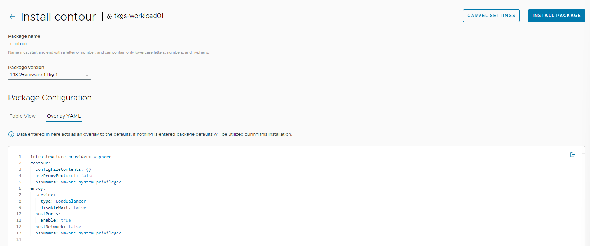
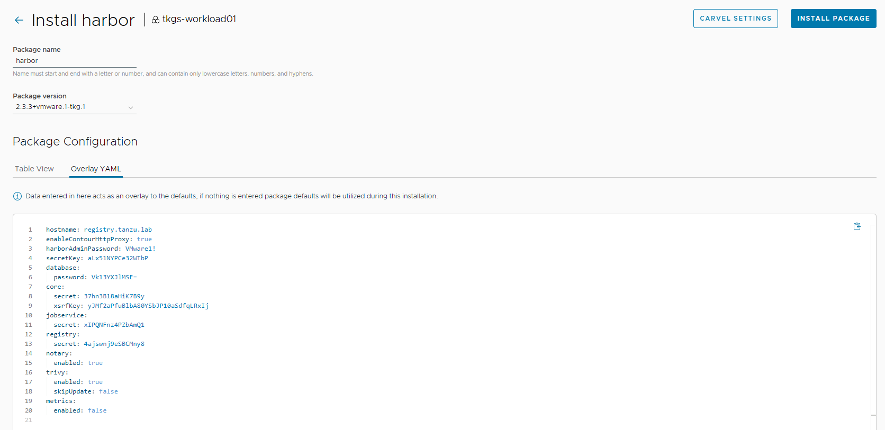
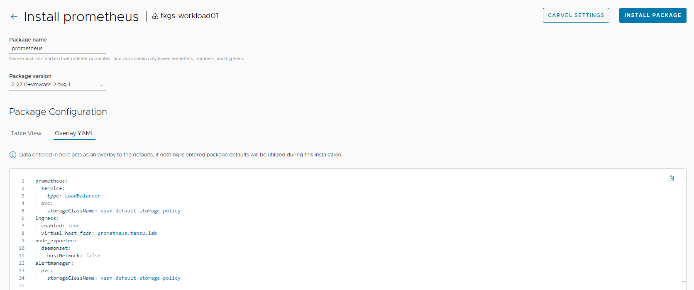
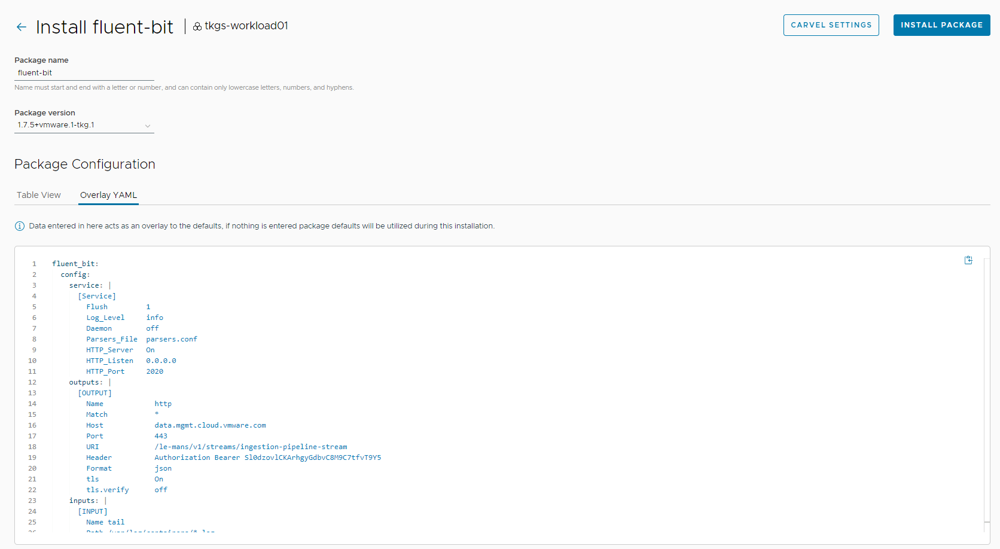
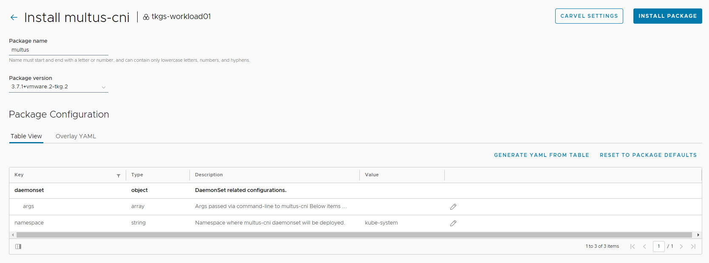
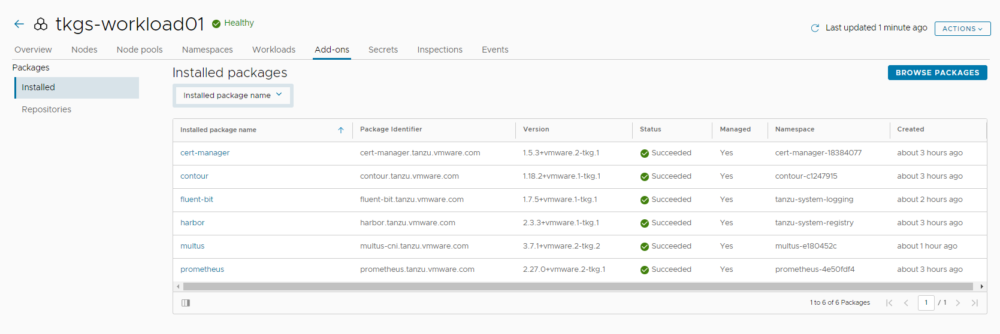

# Deploy User-Managed Packages in Workload Clusters

The user-managed packages extend the core functionality of the Kubernetes clusters created by VMware Tanzu Kubernetes Grid (informally known as TKG). After creating workload clusters, you can install user-managed packages.

For example, you can install the Contour package to implement ingress control, the Harbor package to configure a private container registry, or the Fluent Bit, Grafana, and Prometheus packages to collect logs and metrics from your clusters.

You can install Tanzu packages via the CLI by invoking the `tanzu package install` command or directly from Tanzu Mission Control by utilizing the [**TMC Catalog**](https://docs.vmware.com/en/VMware-Tanzu-Mission-Control/services/tanzumc-using/GUID-EF35646D-8762-41F1-95E5-D2F35ED71BA1.html) feature.

## General Instructions for Installing a Package from Tanzu Mission Control

VMware recommends installing packages on Tanzu Kubernetes clusters through Tanzu Mission Control. The general procedure for using Tanzu Mission Control to install a single package on a particular cluster is as follows:

1. Log in to the Tanzu Mission Control portal and go to the **Catalog** page. On the **Available** tab, you'll see a set of tiles that represent the packages available for installation.

  

1. From the dropdown list of clusters under **Available packages for cluster**, select the cluster on which to install a package.
1. Select the package to install.
1. On the package details screen for that package, click **Install Package**.
1. Configure the package. (Details for configuring common packages follow.)
1. Verify that the package is shown in the list of installed packages for that cluster and that the package **Status** is **Succeeded**.

### Install Cert-Manager

The first package that you should install on your cluster is [**cert-manager**](https://github.com/cert-manager/cert-manager). This package adds certificates and certificate issuers as resource types in Kubernetes clusters and simplifies the process of obtaining, renewing, and using those certificates.

Click the cert-manager package tile on the **Catalog page** to navigate to the install package page. Click **Install Package** to navigate to the package details page. The package details page shows the metadata provided by the package author.

On the package details page, click **Install Package**.


On the **Install** page, provide a name for the installed instance of the package and select the version to install. You can customize the package installation by using the pencil icon under the Table View option to edit the configuration parameters.

After supplying any custom parameters, click **Install Package** to initiate the installation.


After installing cert-manager, ensure that the installation status for the cert-manager package on the **Installed Tanzu Packages** screen is **Green**.


### Install Contour

[Contour](https://projectcontour.io/) is an open-source Kubernetes ingress controller providing the control plane for the Envoy edge and service proxy.​ The Tanzu Mission Control catalog includes signed binaries for Contour and Envoy, which you can deploy into Tanzu Kubernetes (workload) clusters to provide ingress control services in those clusters.

To install the Contour package, click **Browse Packages** and **click the Contour tile on the Catalog page**. 

Click **Install Package** to initiate the installation.


Provide a name for the installed package and select the version that you want to install. You can customize your installation by entering the user-configurable values in YAML format under the **Overlay YAML** option.

An example YAML file for customizing the installation of Contour follows.

```yaml
infrastructure_provider: vsphere
contour:
 configFileContents: {}
 useProxyProtocol: false
 pspNames: "vmware-system-privileged"
envoy:
 service:
   type: LoadBalancer
   disableWait: false
 hostPorts:
   enable: true
 hostNetwork: false
 pspNames: "vmware-system-privileged"
```

For a full list of user-configurable values, see the official Contour [documentation](https://docs.vmware.com/en/VMware-Tanzu-Kubernetes-Grid/2.1/using-tkg-21/workload-packages-contour.html)

> **Note** You can leave the default settings if you don’t need to customize the package installation.



After installing Contour, ensure that the installation status for the Contour package on the **Installed Tanzu Packages** screen is **Green**.


### Install Harbor

[Harbor](https://goharbor.io/) is an open-source container registry. The Harbor registry may be used as a private registry for container images that you want to deploy to Tanzu Kubernetes clusters.

To install the Harbor package, repeat the steps for package installation. An example YAML file for customizing Harbor deployment follows.

> **Note** you will need to provide credentials where indicated.

```yaml
hostname: registry.tanzu.lab
enableContourHttpProxy: true
harborAdminPassword: <insert harborAdminPassword>
secretKey: <insert secretKey>
database:
  password: <insert database.password>
core:
  secret: <insert core.secret>
  xsrfKey: <insert core.xsrfKey>
jobservice:
  secret: <insert jobservice.secret>
registry:
  secret: <insert registry.secret>
notary:
  enabled: true
trivy:
  enabled: true
  skipUpdate: false
metrics:
  enabled: false
```

For a full list of user-configurable values, see the official [Harbor documentation](https://docs.vmware.com/en/VMware-Tanzu-Kubernetes-Grid/2.1/using-tkg-21/workload-packages-harbor.html)

A screenshot of the Harbor installation page showing a YAML file for customizing Harbor installation follows.



After installing Harbor, ensure that the installation status for the Harbor package on the **Installed Tanzu Packages** screen is **Green**.


### Install Prometheus

[Prometheus](https://prometheus.io/) is a system and service monitoring system. It collects metrics from configured targets at given intervals, evaluates rule expressions, displays the results, and can trigger alerts if certain conditions occur. The Prometheus Alertmanager handles alerts generated by Prometheus and routes them to their receiving endpoints.

To install the Prometheus package, repeat the steps for package installation. An example YAML file for customizing Prometheus deployment follows.

```yaml
namespace: tanzu-system-dashboards
prometheus:
  service:
    type: LoadBalancer
  pvc:
    storageClassName: "vsan-default-storage-policy"
ingress:
  enabled: true
  virtual_host_fqdn: "prometheus.tanzu.lab"
node_exporter:
  daemonset:
    hostNetwork: false
alertmanager:
  pvc:
    storageClassName: "vsan-default-storage-policy"
```

For a full list of user-configurable values, see the official [Prometheus documentation](https://docs.vmware.com/en/VMware-Tanzu-Kubernetes-Grid/2.1/using-tkg-21/workload-packages-prometheus.html)

An example screenshot of a customized Prometheus installation follows.



After installing Prometheus, ensure that the installation status for the Prometheus package on the **Installed Tanzu Packages** screen is **Green**.


### Install Grafana

[Grafana](https://grafana.com/) allows you to query, visualize, alert on, and explore metrics no matter where they are stored. Grafana provides tools to form graphs and visualizations from application data.

To install the Grafana package, repeat the steps for the package installation. An example YAML file for customizing Grafana deployment follows.

> **Note** By default, Grafana is configured to use Prometheus as its data source. If you have customized the Prometheus deployment namespace and Prometheus is not deployed in the default namespace, **tanzu-system-monitoring**, you must change the Grafana data source configuration as shown in the YAML code that follows.

```yaml
ingress:
  virtual_host_fqdn: grafana.tanzu.lab
namespace: tanzu-system-monitoring
```

For a full list of user-configurable values, see the official [Grafana documentation]https://docs.vmware.com/en/VMware-Tanzu-Kubernetes-Grid/2.1/using-tkg-21/workload-packages-grafana.html)

An example screenshot for customizing your Grafana installation follows.


After installing Grafana, ensure that the installation status for the Grafana package on the **Installed Tanzu Packages** screen is **Green**.


### Install Fluent Bit

[Fluent Bit](https://fluentbit.io/) is a lightweight log processor and forwarder that allows you to collect data and logs from different sources, unify them, and send them to multiple destinations.

You can use Fluent Bit to gather logs from management clusters or Tanzu Kubernetes clusters running in vSphere, Amazon EC2, and Azure. You can then forward them to a log storage provider such as [Elastic Search](https://www.elastic.co/), [Kafka](https://www.confluent.io/confluent-operator/), [Splunk](https://www.splunk.com/), or an HTTP endpoint.

The example shown in this document uses an HTTP endpoint [vRealize Log Insight Cloud](https://docs.vmware.com/en/VMware-vRealize-Log-Insight-Cloud/index.html) for forwarding logs from Tanzu Kubernetes clusters.

A sample YAML file for configuring an http endpoint with Fluent Bit is provided as a reference here. For a full list of user-configurable values, see the official [Fluent Bit documentation](https://docs.vmware.com/en/VMware-Tanzu-Kubernetes-Grid/2.1/using-tkg-21/workload-packages-fluentbit.html).

Before you add the following YAML code in TMC for installing Fluent Bit, you must [create an API key](https://vmc.techzone.vmware.com/resource/implement-centralized-logging-tanzu-kubernetes-grid-fluent-bit).

```yaml
namespace: "tanzu-system-logging"
fluent_bit:
  config:
    service: |
      [Service]
        Flush         1
        Log_Level     info
        Daemon        off
        Parsers_File  parsers.conf
        HTTP_Server   On
        HTTP_Listen   0.0.0.0
        HTTP_Port     2020
    outputs: |
      [OUTPUT]
        Name            http
        Match           *
        Host            data.mgmt.cloud.vmware.com
        Port            443
        URI             /le-mans/v1/streams/ingestion-pipeline-stream
        Header          Authorization Bearer <insert bearer token>
        Format          json
        tls             On
        tls.verify      off
    inputs: |
      [INPUT]
        Name tail
        Path /var/log/containers/*.log
```

An example screenshot for fluent-bit installation follows.



After installing Fluent Bit, ensure that the installation status for the Fluent Bit package on the **Installed Tanzu Packages** screen has changed to **Green**.


### Install Multus CNI

[Multus CNI](https://github.com/k8snetworkplumbingwg/multus-cni) is a container network interface (CNI) plugin for Kubernetes that enables attaching multiple network interfaces to pods. With Multus CNI, you can create a multi-homed pod with multiple interfaces.

To install the Multus CNI package, repeat the steps for the package installation.  An example screenshot for Multus CNI installation follows.



After installing Multus CNI, ensure that the installation status for the Multus CNI package on the **Installed Tanzu Packages** screen is **Green**.

