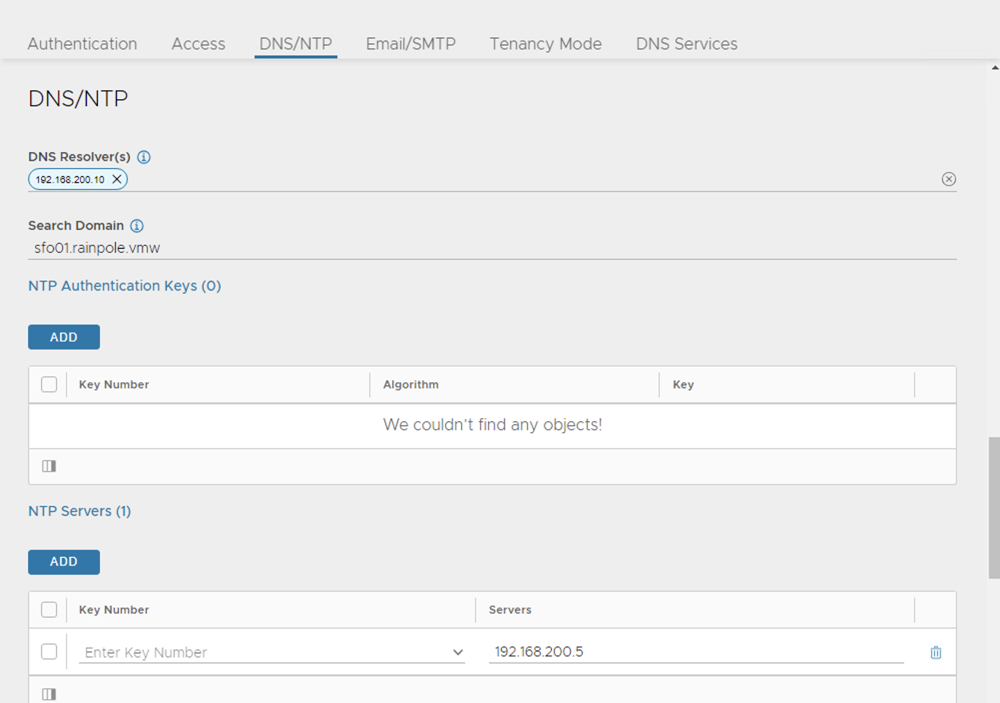
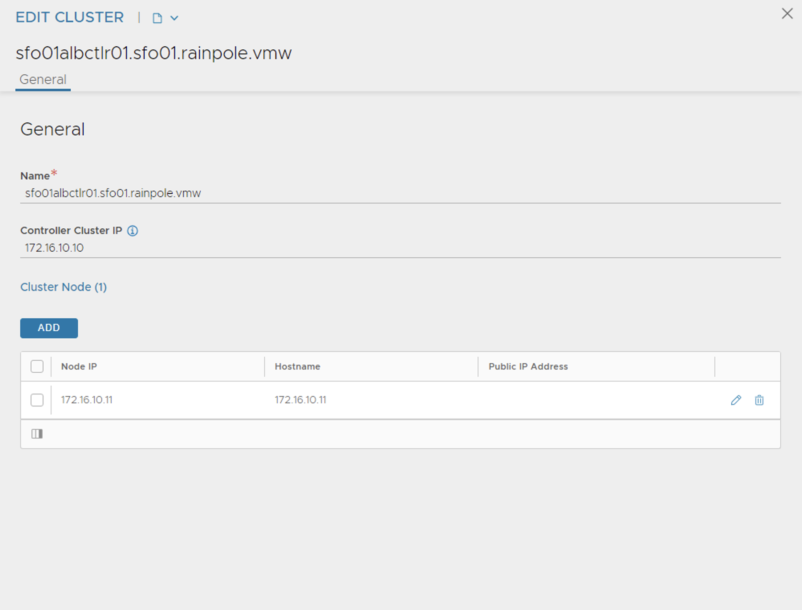
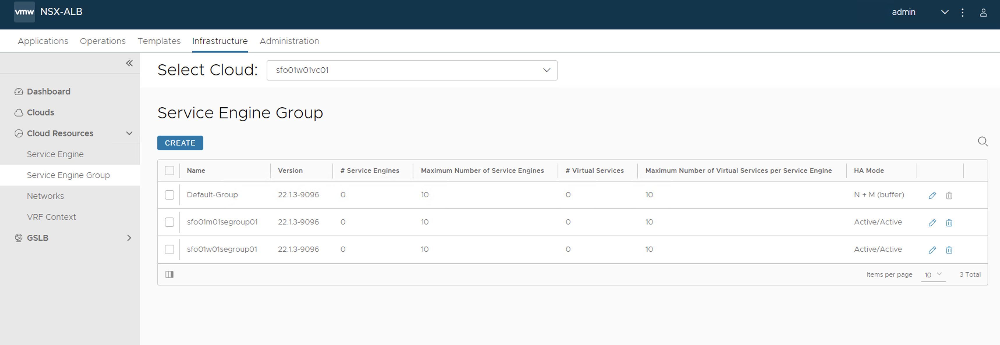

# Deploy Tanzu Kubernetes Grid on vSphere Networking in an Air-Gapped Environment

VMware Tanzu Kubernetes Grid (TKG) provides a consistent, upstream-compatible, regional Kubernetes substrate that is ready for end-user workloads and ecosystem integrations.

An air-gap installation method is used when the Tanzu Kubernetes Grid bootstrapper and cluster nodes components are unable to connect to the Internet to download the installation binaries from the public [VMware Registry](https://projects.registry.vmware.com/) during Tanzu Kubernetes Grid installation or upgrades. 

The scope of this document is limited to providing deployment steps based on the reference design in [Tanzu Kubernetes Grid on vSphere Networking](../reference-designs/tkg-vsphere-vds-airgap.md). This document does not provide any deployment procedures for the underlying SDDC components.

## Supported Component Matrix

The following table provides the component versions and interoperability matrix supported with the reference design:

|**Software Components**|**Version**|
| ---| --- |
|Tanzu Kubernetes Grid|2.1.x|
|VMware vSphere ESXi|7.0U3 and later|
|VMware vCenter (VCSA)|7.0U3 and later|
|VMware vSAN|7.0U3 and later|
|NSX Advanced LB|22.1.2 |

For the latest information, see [VMware Product Interoperability Matrix](https://interopmatrix.vmware.com/Interoperability?col=551,9293&row=789,%262,%26912).

## Prepare your Environment for Deploying Tanzu Kubernetes Grid

Before deploying the Tanzu Kubernetes Grid in the vSphere environment, ensure that your environment is set up as described in the following sections:

- [General Requirements](#general-requirements)
- [Network Requirements](#network-requirements)
- [Firewall Requirements](#firewall-requirements)

### <a id=general-requirements> </a> General Requirements
- vSphere 7.0 U3 or greater instance with an Enterprise Plus license
- Your SDDC environment has the following objects in place: 
  - A vSphere cluster with at least 3 hosts, on which vSphere DRS is enabled. If you are using vSAN for shared storage, it is recommended that you use 4 ESXi hosts.
  - A distributed switch with port groups for Tanzu Kubernetes Grid components. Please refer to the [Network Requirements](#network-requirements) section for the required port groups.
  - Dedicated resource pool in which to deploy the Tanzu Kubernetes Grid Instance.
  - VM folders in which to collect the Tanzu Kubernetes Grid VMs. 
  - A shared datastore with sufficient capacity for the control plane and worker node VMs. 
  - Network Time Protocol (NTP) service is running on all ESXi hosts and vCenter and time is synchronized from the centralized NTP servers.
  - A host/server/VM based on Linux that acts as your **bastion host** and is located **outside the Internet-restricted environment (i.e. connected to the Internet)**. The installation binaries for Tanzu Kubernetes Grid and NSX Advanced Load Balancer will be downloaded on this machine. You will need to transfer files from this bastion host to your Internet-restricted environment (proxy connection, shared drive, USB drive, sneakernet, etc.).
  - A host/server/VM **inside your Internet-restricted environment** based on Linux/Windows which acts as your bootstrap machine and has Tanzu CLI, Kubectl and docker installed. This document makes use of a virtual machine based on CentOS. An internal Harbor registry will be installed on the same machine.
- vSphere account with permissions as described in [Required Permissions for the vSphere Account](https://docs.vmware.com/en/VMware-Tanzu-Kubernetes-Grid/2.1/tkg-deploy-mc-21/mgmt-reqs-prep-vsphere.html).

**Note:** You can also download and import supported older versions of Kubernetes in order to deploy workload clusters on the intended Kubernetes versions.
**Note:** In Tanzu Kubernetes Grid nodes, it is recommended to not use hostnames with ".local" domain suffix. For more information, see [KB article](https://kb.vmware.com/s/article/83623)

### Resource Pools and VM Folders
The sample entries of the resource pools and folders that need to be created are as follows.

|**Resource Type**|**Sample Resource Pool Name**|**Sample Folder Name**|
| --- | --- | --- |
|NSX ALB Components|`nsx-alb-components`|`nsx-alb-components`|
|TKG Management components|`tkg-management-components`|`tkg-management-components`|
|TKG Shared Service Components|`tkg-sharedsvc-components`|`tkg-sharedsvc-components`|
|TKG Workload components|`tkg-workload01-components`|`tkg-workload01-components`|

### <a id=network-requirements> </a> Network Requirements

Create Port groups on vSphere Distributed Switch for deploying Tanzu Kubernetes Grid components as defined in [Network Requirements](../reference-designs/tkg-vsphere-vds-airgap.md) in the reference architecture. 

### <a id=firewall-requirements> </a> Firewall Requirements
Ensure that the firewall is set up as described in [Firewall Requirements](../reference-designs/tkg-vsphere-vds-airgap.md#ra-firewall-requirements).

### Subnet and CIDR Examples
For the purpose of this demonstration, this document makes use of the following CIDR for TKO deployment. Please change the values to reflect your environment.

|**Network Type**|**Port Group Name**|**Gateway CIDR**|**DHCP Pool**|**NSX ALB IP Pool**|
| --- | --- | --- | --- | --- |
|NSX ALB Management Network|sfo01-w01-vds01-albmanagement|172.16.10.1/24|N/A|172.16.10.100- 172.16.10.200|
|TKG Management Network|sfo01-w01-vds01-tkgmanagement|172.16.40.1/24|172.16.40.100- 172.16.40.200|N/A|
|TKG Management VIP Network|sfo01-w01-vds01-tkgmanagementvip|172.16.50.1/24|N/A|172.16.50.100- 172.16.50.200|
|TKG Cluster VIP Network|sfo01-w01-vds01-tkgclustervip|172.16.80.1/24|N/A|172.16.80.100- 172.16.80.200|
|TKG Workload VIP Network|sfo01-w01-vds01-tkgworkloadvip|172.16.70.1/24|N/A|172.16.70.100 - 172.16.70.200|
|TKG Workload Segment|sfo01-w01-vds01-tkgworkload|172.16.60.1/24|172.16.60.100- 172.16.60.200|N/A|

## Deployment Overview
Here are the high-level steps for deploying Tanzu Kubernetes Grid on vSphere VDS networking in an air-gap environment:

- [Deploy and Configure Bastion Host](#configure-bastion)
- [Install Harbor Image Registry](#install-harbor)
- [Deploy and Configure Bootstrap VM](#configure-bootstrap)
- [Deploy and Configure NSX Advanced Load Balancer](#configure-alb)
- [Deploy Tanzu Kubernetes Grid Management Cluster](#deploy-tkg-management)
- [Deploy Tanzu Kubernetes Grid Shared Services Cluster](#deploy-tkg-shared-services)
- [Deploy Tanzu Kubernetes Grid Workload Cluster](#deploy-workload-cluster)
- [Deploy User-Managed Packages](#deploy-packages)

## <a id=configure-bastion> </a> Deploy and Configure Bastion Host

The bastion host is the physical or virtual machine where you download the images and binaries required for Tanzu Kubernetes Grid installation from the Internet. You will then transfer the downloaded items to the bootstrap machine, which is located inside the air-gap environment. 

Ensure the following:
- A browser is available on the bastion host to download the binaries from the Internet.
- The bastion host has the following hardware configuration:
    - CPU: 1
    - Memory: 4 GB
    - Storage (HDD): 200 GB or greater.

**Note:** The following instructions are for CentOS 7. If you are using any other operating system for your bastion host, change the commands accordingly.

### Prerequisites

1. Download the binaries for Docker Engine and associated dependencies.

    ```bash
    ### Create a directory for collecting docker installation binaries

    mkdir docker-binaries && cd docker-binaries

    ### Add docker repository to the yum command

    yum install yum-utils -y

    yum-config-manager --add-repo https://download.docker.com/linux/centos/docker-ce.repo

    ### Download docker and associated dependencies 

    yumdownloader --resolve docker-ce docker-ce-cli containerd.io docker-compose-plugin
    ```

    The `yumdownloader` command downloads the following binaries: 

    

2. Download installation binaries from the [Harbor GitHub repository](https://github.com/goharbor/harbor/releases/tag/v2.3.3). 

3. Download the NSX Advanced Load Balancer OVA from [VMware Customer Connect portal](https://customerconnect.vmware.com/downloads/info/slug/networking_security/vmware_nsx_advanced_load_balancer/22_1_x).

4. Download Tanzu CLI, Kubectl, and the Kubernetes OVA images from the [Tanzu Kubernetes Grid product download page](https://customerconnect.vmware.com/downloads/info/slug/infrastructure_operations_management/vmware_tanzu_kubernetes_grid/2_x). Tanzu CLI and Plugins need to be installed on the bastion host and the bootstrap machine.

5. Download the [yq](https://github.com/mikefarah/yq) installation binary from [mikefarah / yq](https://github.com/mikefarah/yq/releases/tag/v4.25.2) GitHub repository.

6. Download the [gen-publish-images](https://raw.githubusercontent.com/vmware-tanzu/tanzu-framework/e3de5b1557d9879dc814d771f431ce8945681c48/hack/gen-publish-images-totar.sh) script for pulling Tanzu Kubernetes Grid installation binaries from the Internet.

### Configure Bastion Host

1. Install Tanzu CLI.

    ```bash
    tar -xvf tanzu-cli-bundle-linux-amd64.tar.gz
    cd ./cli/
    sudo install core/v0.28.0/tanzu-core-linux_amd64 /usr/local/bin/tanzu
    chmod +x /usr/local/bin/tanzu
    ```
    Run the `tanzu version` command to check that the correct version of tanzu is installed and executable.

    ```bash
    # tanzu version

    version: v0.28.0
    buildDate: 2023-01-20
    sha: 3c34115bc-dirty
    ```
1. Download the Images .

    Before performing this step, ensure that the disk partition where you download the images has 45 GB of available space.

    ```bash
    tanzu isolated-cluster download-bundle --source-repo <SOURCE-REGISTRY> --tkg-version <TKG-VERSION> --ca-certificate <SECURITY-CERTIFICATE>
    ```

   * SOURCE-REGISTRY is the IP address or the hostname of the registry where the images are stored.
   * TKG-VERSION is the version of Tanzu Kubernetes Grid that you want to deploy in the proxied or air-gapped environment.
   * SECURITY-CERTIFICATE is the security certificate of the registry where the images are stored. To bypass the security certificate validation, use --insecure, instead of --ca-certificate. Both the strings are optional. If you do not specify any value, the system validates the default server security certificate.
    ```bash
    tanzu isolated-cluster download-bundle --source-repo projects.registry.vmware.com/tkg --tkg-version v2.1.0
    ```
   The image bundle in the form of TAR files, along with the publish-images-fromtar.yaml file, is downloaded . The YAML file defines the mapping between the images and the TAR files.

1. Copy the Files to the bootstrap Machine after bootstrap Machine deployment.

    Copy the following files to the offline machine, which is the bootstrap machine in the proxied or air-gapped environment, through a USB thumb drive or other medium:
   * Image TAR files
   * YAML files


## <a id=install-harbor> </a> Install Harbor Image Registry

Install the Harbor only if you don’t have any existing image repository in your environment. 

To install Harbor, deploy an operating system of your choice with the following hardware configuration:

- vCPU: 4
- Memory: 8 GB
- Storage (HDD): 160 GB

 Follow the instructions provided in [Harbor Installation and Configuration](https://goharbor.io/docs/2.3.0/install-config/) to deploy and configure Harbor.

## <a id=configure-bootstrap> </a> Deploy and Configure Bootstrap VM

The deployment of the Tanzu Kubernetes Grid management and workload clusters is facilitated by setting up a bootstrap machine where you install the Tanzu CLI and Kubectl utilities which are used to create and manage the Tanzu Kubernetes Grid instance. This machine also keeps the Tanzu Kubernetes Grid and Kubernetes configuration files for your deployments. The bootstrap machine can be a laptop, host, or server running on Linux, macOS, or Windows that you deploy management and workload clusters from.

The bootstrap machine runs a local `kind` cluster when Tanzu Kubernetes Grid management cluster deployment is started. Once the `kind` cluster is fully initialized, the configuration is used to deploy the actual management cluster on the backend infrastructure. After the management cluster is fully configured, the local `kind` cluster is deleted and future configurations are performed with the Tanzu CLI.

For this deployment, a Photon-based virtual machine is used as the bootstrap machine. For information on how to configure a macOS or a Windows machine, see [Install the Tanzu CLI and Other Tools](https://customerconnect.vmware.com/downloads/info/slug/infrastructure_operations_management/vmware_tanzu_kubernetes_grid/2_x).

The bootstrap machine must meet the following prerequisites:

   * A minimum of 6 GB of RAM, 2-core CPU, 160 Storage GB .
   * System time is synchronized with a Network Time Protocol (NTP) server.
   * Docker and containerd binaries are installed. For instructions on how to install Docker, see [Docker documentation](https://docs.docker.com/engine/install/centos/).
   * Ensure that the bootstrap VM is connected to Tanzu Kubernetes Grid management network, `sfo01-w01-vds01-tkgmanagement`.

To install Tanzu CLI, Tanzu Plugins, and Kubectl utility on the bootstrap machine, follow the instructions below:
1. Copy  Files to  bootstrap Machine.<p>
   Copy the following files downloaded in Bastion Host through a USB thumb drive or other  medium.
   * Image TAR files
   * YAML files
1. Download and unpack the following Linux CLI packages from [VMware Tanzu Kubernetes Grid Download Product page](https://customerconnect.vmware.com/downloads/info/slug/infrastructure_operations_management/vmware_tanzu_kubernetes_grid/2_x).

   * VMware Tanzu CLI 2.1.0 for Linux
   * kubectl cluster CLI v1.24.9 for Linux

1. Execute the following commands to install Tanzu Kubernetes Grid CLI, kubectl CLIs, and Carvel tools.
    ```bash
    ## Install required packages
    install tar, zip, unzip, wget

    ## Install Tanzu Kubernetes Grid CLI
    tar -xvf tanzu-cli-bundle-linux-amd64.tar.gz
    cd ./cli/
    sudo install core/v0.28.0/tanzu-core-linux_amd64 /usr/local/bin/tanzu
    chmod +x /usr/local/bin/tanzu

    ## Verify Tanzu CLI version

     [root@tkg160-bootstrap ~] # tanzu version

    version: v0.28.0
    buildDate: 2023-01-20
    sha: 6288c751-dirty
    ```
1. Install the isolated-cluster plugin on the offline bootstrap machine:

      ```bash
     tanzu plugin install isolated-cluster --local standalone-plugins/

      ```
1. Log in to the Private Registry on the Offline Machine.
      ```bash
     docker login <URL>
      ```
   **Note** If your private registry uses a self-signed certificate, save the CA certificate of the registry in "/etc/docker/certs.d/registry.example.com/ca.crt"
1. Upload the Images to the Private Registry.
      ```bash
     tanzu isolated-cluster upload-bundle --source-directory <SOURCE-DIRECTORY> --destination-repo <DESTINATION-REGISTRY> --ca-certificate <SECURITY-CERTIFICATE>
      ```
    * SOURCE-DIRECTORY is the path to the location where the image TAR files are stored.
    * DESTINATION-REGISTRY is the path to the private registry where the images will be hosted in the air-gapped environment.
    * SECURITY-CERTIFICATE is the security certificate of the private registry where the images will be hosted in the proxied or air-gapped environment. 
    ```bash
     Example:- tanzu isolated-cluster upload-bundle --source-directory ./ --destination-repo registry.example.com/library --ca-certificate /etc/docker/certs.d/registry.example.com/ca.crt
      ```
  **Note** we can Skip Step 3,4,5 if your Bastion host direct access to private registry . we can directly upload the files from Bastion to Private registry.

1. Install the kubectl utility.

      ```bash
     gunzip kubectl-linux-v1.24.9+vmware.1.gz
     mv kubectl-linux-v1.24.9+vmware.1.gz /usr/local/bin/kubectl && chmod +x /usr/local/bin/kubectl
      ```

      Run the `kubectl version --short=true` to check that the correct version of kubectl is installed and executable.

1. Configure the environment variables.

      In an air-gap environment, if you run the `tanzu init` or `tanzu plugin sync` commands, the command hangs and times out after some time with the following error:

      ```bash
      [root@bootstrap ~]# tanzu init
      Checking for required plugins...
      unable to list plugin from discovery 'default': error while processing package: failed to get resource files from discovery: Checking if image is bundle: Fetching image: Get "https://projects.registry.vmware.com/v2/": dial tcp 10.188.25.227:443: i/o timeout
      All required plugins are already installed and up-to-date
      ✔  successfully initialized CLI

      [root@bootstrap ~]# tanzu plugin sync
      Checking for required plugins...
      unable to list plugin from discovery 'default': error while processing package: failed to get resource files from discovery: Checking if image is bundle: Fetching image: Get "https://projects.registry.vmware.com/v2/": dial tcp 10.188.25.227:443: i/o timeout
      All required plugins are already installed and up-to-date
      ✔  Done
      ```

      By default the Tanzu global config file, `config.yaml`, which gets created when you first run `tanzu init` command, points to the repository URL <https://projects.registry.vmware.com> to fetch the Tanzu plugins for installation. Because there is no Internet in the environment, the commands fails after some time.

      To ensure that Tanzu Kubernetes Grid always pulls images from the local private registry, run the Tanzu `export` command to add `TKG_CUSTOM_IMAGE_REPOSITORY` to the global Tanzu CLI configuration file, `~/.config/tanzu/config.yaml`. 

      If your image registry is configured with a public signed CA certificate, set the following environment variables.

      ```bash
      export TKG_CUSTOM_IMAGE_REPOSITORY=custom-image-repository.io/yourproject

      export TKG_CUSTOM_IMAGE_REPOSITORY_SKIP_TLS_VERIFY=false
      ```

      If your registry solution uses self-signed certificates, also add TKG_CUSTOM_IMAGE_REPOSITORY_CA_CERTIFICATE in base64-encoded format to the global Tanzu CLI configuration file. For self-signed certificates, set the following environment variables:

      ```bash
      export TKG_CUSTOM_IMAGE_REPOSITORY=custom-image-repository.io/yourproject

      export TKG_CUSTOM_IMAGE_REPOSITORY_SKIP_TLS_VERIFY=false

      export TKG_CUSTOM_IMAGE_REPOSITORY_CA_CERTIFICATE LS0t[...]tLS0tLQ==
      ```
  **Note** If we reboot the VM, above configuration will be set to default.

1. Initialize Tanzu Kubernetes Grid and install Tanzu CLI plugins.

      ```bash
      ### Initialize Tanzu Kubernetes Grid 

      tanzu config init 

      ## (Optional) Remove existing plugins from any previous CLI installations.

      tanzu plugin clean

      tanzu plugin sync
      ```

      After installing the tanzu plugins, run the tanzu plugin list command to check the plugins version and installation status.

1. Install Carvel tools.

    Tanzu Kubernetes Grid uses the following tools from the Carvel open-source project:

    - [ytt](https://carvel.dev/ytt/) - a command-line tool for templating and patching YAML files. You can also use ytt to collect fragments and piles of YAML into modular chunks for easy re-use.
    - [kapp](https://carvel.dev/kapp/) - the application deployment CLI for Kubernetes. It allows you to install, upgrade, and delete multiple Kubernetes resources as one application.
    - [kbld](https://carvel.dev/kbld/) - an image-building and resolution tool.
    - [imgpkg](https://carvel.dev/imgpkg/) - a tool that enables Kubernetes to store configurations and the associated container images as OCI images, and to transfer these images.

    1. Install ytt

        ```bash
        cd ./cli

        ytt-linux-amd64-v0.43.1+vmware.1.gz

        chmod ugo+x ytt-linux-amd64-v0.43.1+vmware.1 &&  mv ./ytt-linux-amd64-v0.43.1+vmware.1 /usr/local/bin/ytt
        ```
        Run `ytt --version` to check that the correct version of ytt is installed and executable

   1. Install kapp.

      ```bash
      gunzip kapp-linux-amd64-v0.53.2+vmware.1.gz

      chmod ugo+x kapp-linux-amd64-v0.53.2+vmware.1 && mv ./kapp-linux-amd64-v0.53.2+vmware.1 /usr/local/bin/kapp
      ```

      Run `kapp --version` to check that the correct version of kapp is installed and executable.

   2. Install kbld.

      ```bash
      gunzip kbld-linux-amd64-v0.35.1+vmware.1.gz

      chmod ugo+x kbld-linux-amd64-v0.35.1+vmware.1 && mv ./kbld-linux-amd64-v0.35.1+vmware.1 /usr/local/bin/kbld
      ```

      Run `kbld --version` to check that the correct version of kbld is installed and executable.

   3. Install imgpkg.

      ```bash
      gunzip imgpkg-linux-amd64-v0.31.1+vmware.1.gz
      chmod ugo+x imgpkg-linux-amd64-v0.31.1+vmware.1 && mv ./imgpkg-linux-amd64-v0.31.1+vmware.1 /usr/local/bin/imgpkg
      ```

      Run `imgpkg --version` to check that the correct version of imgpkg is installed and executable.

1. Install yq.

    yq a lightweight and portable command-line YAML processor.
    Download [yq](https://github.com/mikefarah/yq/releases/download/v4.25.2/yq_linux_amd64.tar.gz)

    ```bash
    tar -zxvf yq_linux_amd64.tar.gz

    mv yq_linux_amd64 /usr/local/bin/
    ```
    Run the `yq -V` command to check that the correct version of yq is installed and executable.

1. Run the following commands to start the Docker service and enable it to start at boot. Photon OS has Docker installed by default.

    ```bash
    ## Check Docker service status
    systemctl status docker

    ## Start Docker Service
    systemctl start docker

    ## To start Docker Service at boot
    systemctl enable docker
    ```
1. Execute the following commands to ensure that the bootstrap machine uses [cgroup v1](https://man7.org/linux/man-pages/man7/cgroups.7.html).

    ```bash
    docker info | grep -i cgroup

    ## You should see the following
    Cgroup Driver: cgroupfs
    ```

1. Create an SSH key-pair.

    This is required for Tanzu CLI to connect to vSphere from the bootstrap machine.  The public key part of the generated key will be passed during the Tanzu Kubernetes Grid management cluster deployment.  

    ```bash
    ### Generate public/Private key pair.

    ssh-keygen -t rsa -b 4096 -C "email@example.com"

    ### Add the private key to the SSH agent running on your machine and enter the password you created in the previous step 

    ssh-add ~/.ssh/id_rsa 

    ### If the above command fails, execute "eval $(ssh-agent)" and then rerun the command.
    ```

    Make a note of the public key from the file **$home/.ssh/id_rsa.pub**. You need this while creating a config file for deploying the Tanzu Kubernetes Grid management cluster.

1. If your bootstrap machine runs Linux or Windows Subsystem for Linux, and it has a Linux kernel built after the May 2021 Linux security patch, for example Linux 5.11 and 5.12 with Fedora, run the following command.

   ```
    sudo sysctl net/netfilter/nf_conntrack_max=131072
   ```

### Import the Base Image Template in vCenter Server

Before you proceed with the management cluster creation, ensure that the base image template is imported into vSphere and is available as a template. To import a base image template into vSphere:

1. Go to the [Tanzu Kubernetes Grid downloads page](https://customerconnect.vmware.com/downloads/info/slug/infrastructure_operations_management/vmware_tanzu_kubernetes_grid/2_x) and download a Tanzu Kubernetes Grid OVA for the cluster nodes.

* For the management cluster, this must be either Photon or Ubuntu based Kubernetes v1.23.8 OVA.

     **Note**: Custom OVA with a custom Tanzu Kubernetes release (TKr) is also supported, as described in [Build Machine Images](https://docs.vmware.com/en/VMware-Tanzu-Kubernetes-Grid/2.1/tkg-deploy-mc-21/mgmt-byoi-index.html).
* For workload clusters, OVA can have any supported combination of OS and Kubernetes version, as packaged in a Tanzu Kubernetes release.

    **Note**: Make sure you download the most recent OVA base image templates in the event of security patch releases. You can find updated base image templates that include security patches on the Tanzu Kubernetes Grid product download page.

1. In the vSphere client, right-click an object in the vCenter Server inventory and select **Deploy OVF template**.

1. Select **Local file**, click the button to upload files, and select the downloaded OVA file on your local machine.

1. Follow the installer prompts to deploy a VM from the OVA.

1. Click **Finish** to deploy the VM. When the OVA deployment finishes, right-click the VM and select **Template** > **Convert to Template**.

    **Note:** Do not power on the VM before you convert it to a template.

1. **If using non administrator SSO account**: In the VMs and Templates view, right-click the new template, select **Add Permission**, and assign the **tkg-user** to the template with the **TKG role**.

For information about how to create the user and role for Tanzu Kubernetes Grid, see [Required Permissions for the vSphere Account](https://docs.vmware.com/en/VMware-Tanzu-Kubernetes-Grid/2.1/tkg-deploy-mc-21/mgmt-reqs-prep-vsphere.html).

### Import NSX Advanced Load Balancer in Content Library

Create a content library following the instructions provided in [Create a Library](https://docs.vmware.com/en/VMware-vSphere/7.0/com.vmware.vsphere.vm_admin.doc/GUID-2A0F1C13-7336-45CE-B211-610D39A6E1F4.html) in VMware vSphere documentation. You will store the NSX Advanced Load Balancer OVA in the library.

To import the OVA into the content library, see [Import Items to a Content Library](https://docs.vmware.com/en/VMware-vSphere/7.0/com.vmware.vsphere.vm_admin.doc/GUID-897EEEC2-B378-41A7-B92B-D1159B5F6095.html).

## <a id=configure-alb> </a> Deploy and Configure NSX Advanced Load Balancer

NSX Advanced Load Balancer (ALB) is an enterprise-grade integrated load balancer that provides L4 - L7 load balancer support. It is recommended for vSphere deployments without NSX-T, or when there are unique scaling requirements.

NSX Advanced Load Balancer is deployed in Write Access Mode in the vSphere Environment. This mode grants NSX Advanced Load Balancer controllers full write access to vCenter that helps in automatically creating, modifying, and removing service engines (SEs) and other resources as needed to adapt to changing traffic needs.

For a production-grade deployment, it is recommended to deploy three instances of the NSX Advanced Load Balancer controller for high availability and resiliency.  

The following table provides a sample IP address and FQDN set for the NSX Advanced Load Balancer controllers:  

|**Controller Node**|**IP Address**|**FQDN**|
| --- | --- | --- |
|Node 1 Primary|172.16.10.11|`sfo01albctlr01a.sfo01.rainpole.local`|
|Node 2 Secondary|172.16.10.12|`sfo01albctlr01b.sfo01.rainpole.local`|
|Node 3 Secondary |172.16.10.13|`sfo01albctlr01c.sfo01.rainpole.local`|
|HA Address|172.16.10.10|`sfo01albctlr01.sfo01.rainpole.local`|

Follow these steps to deploy and configure NSX Advanced Load Balancer:

1. [Deploy NSX Advanced Load Balancer](#dep-nsx-alb)
1. [NSX Advanced Load Balancer: Initial setup](#nsx-alb-init)
1. [NSX Advanced Load Balancer: Licensing](#nsx-alb-license)
1. [NSX Advanced Load Balancer: Controller High Availability](#nsx-alb-ha)
1. [NSX Advanced Load Balancer: Certificate Management](#nsx-alb-cert-mgmt)
1. [NSX Advanced Load Balancer: Create vCenter Cloud and SE Groups](#nsx-alb-vcenter-se)
1. [NSX Advanced Load Balancer: Configure Network and IPAM & DNS Profiles](#nsx-alb-net-ipam)

### <a id="dep-nsx-alb"> </a> Deploy NSX Advanced Load Balancer

As part of the prerequisites, you must have the NSX Advanced Load Balancer 21.1.4 OVA downloaded and imported to the content library. Deploy the NSX Advanced Load Balancer under the resource pool **“nsx-alb-components”**  and place it under the folder **“nsx-alb-components”**.


To deploy NSX Advanced Load Balancer, complete the following steps.

1. Log in to **vCenter** and go to **Home** > **Content Libraries**.
1. Select the content library under which the NSX Advanced Load Balancer OVA is placed.
1. Click on **OVA & OVF Templates**.
1. Right-click the NSX Advanced Load Balancer image and select **New VM from this Template**.
1. On the Select name and folder page, enter a name and select a folder for the NSX Advanced Load Balancer VM as **nsx-alb-components**.
1. On the Select a compute resource page, select the resource pool **nsx-alb-components**.
1. On the Review details page, verify the template details and click **Next**.
1. On the Select storage page, select a storage policy from the VM Storage Policy drop-down menu and choose the  datastore location where you want to store the virtual machine files.
1. On the Select networks page, select the network **nsx_alb_management_pg** and click **Next**.
1. On the Customize template page, provide the NSX Advanced Load Balancer management network details such as IP address, subnet mask, and gateway, and click **Next**.
1. On the Ready to complete page, review the page and click **Finish**.

    

A new task for creating the virtual machine appears in the **Recent Tasks** pane. After the task is complete, the NSX Advanced Load Balancer virtual machine is created on the selected resource. Power on the virtual machine and give it a few minutes for the system to boot. Upon successful boot up, go to NSX Advanced Load Balancer on your browser.  
**Note**: While the system is booting up, a blank web page or a 503 status code may appear.  

### <a id="nsx-alb-init"> </a> NSX Advanced Load Balancer: Initial Setup

After NSX Advanced Load Balancer is successfully deployed and running, go to NSX Advanced Load Balancer on your browser using the URL https://<em><IP/FQDN></em> and configure the basic system settings:

1. Set admin password and click on **Create Account**.

    


2. On the Welcome page, under **System Settings**, set backup passphrase and provide DNS information, and click **Next**.

    

3. Under **Email/SMTP**, provide email and SMTP information, and click **Next**.

    

4. Under **Multi-Tenant**, configure settings as follows and click **Save**.
    - IP Route Domain: Share IP route domain across tenants  
    - Service Engines are managed within the: Provider (Shared across tenants)  
    - Tenant Access to Service Engine: Read Access

    

If you did not select the **Setup Cloud After** option before saving, the initial configuration wizard exits. The Cloud configuration window does not automatically launch and you are directed to a dashboard view on the controller.

### NSX Advanced Load Balancer: NTP Configuration

To configure NTP, go to **Administration** > **Settings** > **DNS/NTP > Edit** and add your NTP server details and click **Save**.

**Note:** You may also delete the default NTP servers.



### <a id="nsx-alb-license"></a> NSX Advanced Load Balancer: Licensing

This document focuses on enabling NSX Advanced Load Balancer using the license model: **Enterprise License (VMware NSX ALB Enterprise)**.

1. To configure licensing, go to **Administration** > **Settings** > **Licensing** and click on the gear icon to change the license type to Enterprise. 

    
1. Select Enterprise Tier as the license type and click **Save**

    

1. Once the license tier is changed, apply the NSX Advanced Load Balancer Enterprise license key. If you have a license file instead of a license key, apply the license by clicking on the **Upload a License File(.lic)** option.

    

### <a id="nsx-alb-ha"> </a> NSX Advanced Load Balancer: Controller High Availability

In a production environment, it is recommended to deploy additional controller nodes and configure the controller cluster for high availability and disaster recovery. Adding 2 additional nodes to create a 3-node cluster provides node-level redundancy for the controller and also maximizes performance for CPU-intensive analytics functions.

To run a 3-node controller cluster, you deploy the first node and perform the initial configuration, and set the cluster IP address. After that, you deploy and power on two more controller VMs, but you must not run the initial configuration wizard or change the admin password for these controllers VMs. The configuration of the first controller VM is assigned to the two new controller VMs.

The first controller of the cluster receives the Leader role. The second and third controllers work as Follower.

Complete the following steps to configure NSX Advanced Load Balancer cluster.

1. Log in to the primary NSX Advanced Load Balancer controller and go to **Administrator** > **Controller** > **Nodes**, and click **Edit**.

    

2. Specify **Name** and **Controller Cluster IP**, and click **Save**. This IP address must be from the NSX Advanced Load Balancer management network.

    

3. Deploy the 2nd and 3rd NSX Advanced Load Balancer controller nodes by using steps in [Deploy NSX Advanced Load Balancer](#dep-nsx-alb).

4. Log into the primary NSX Advanced Load Balancer controller using the Controller Cluster IP/FQDN and go to **Administrator** > **Controller** >  **Nodes**, and click **Edit**. The Edit Controller Configuration popup appears.

5. In the **Cluster Nodes** field, enter the IP address for the 2nd and 3rd controller, and click **Save**.

    

    After you complete these steps, the primary NSX Advanced Load Balancer controller becomes the leader for the cluster and invites the other controllers to the cluster as members.

    NSX Advanced Load Balancer then performs a warm reboot of the cluster. This process can take approximately 10-15 minutes. You are automatically logged out of the controller node where you are currently logged in. Enter the cluster IP address in the browser, to see details about the cluster formation task.

    

The configuration of the primary (leader) controller is synchronized to the new member nodes when the cluster comes online following the reboot. After the cluster is successfully formed, you can see the following status:


**Note:** In the following tasks, all NSX Advanced Load Balancer configurations are done by connecting to the NSX ALB Controller Cluster IP/FQDN.

### <a id="nsx-alb-cert-mgmt"> </a> NSX Advanced Load Balancer: Certificate Management

The default system-generated controller certificate generated for SSL/TSL connections will not have the required subject alternate name (SAN) entries. Complete the following steps to create a controller certificate:

1. Log in to the NSX Advanced Load Balancer controller and go to **Templates** > **Security** > **SSL/TLS Certificates**.

1. Click **Create** and select **Controller Certificate**. You can either generate a self-signed certificate, generate CSR, or import a certificate. For the purpose of this document, a self-signed certificate is generated.

1. Provide all required details as per your infrastructure requirements and in the **Subject Alternate Name (SAN)** field, provide IP address and FQDN of all NSX Advanced Load Balancer controllers including NSX Advanced Load Balancer cluster IP and FQDN, and click **Save**.

    
    

1. After the certificate is created, capture the certificate contents as this is required while deploying the Tanzu Kubernetes Grid management cluster.
  To capture the certificate content, click on the Download icon next to the certificate, and click **Copy to clipboard** under **Certificate**.

    

1. To replace the certificate, go to **Administration** > **Settings** > **Access Settings**, and click the pencil icon at the top right to edit the system access settings, and then replace the SSL/TSL certificate and click **Save**.

    

1. Log out and log in to NSX Advanced Load Balancer.

### <a id="nsx-alb-vcenter-se"> </a> NSX Advanced Load Balancer: Create vCenter Cloud and SE Groups

NSX Advanced Load Balancer can be deployed in multiple environments for the same system. Each environment is called a cloud. The following procedure provides steps on how to create a VMware vCenter cloud, and as shown in the architecture two service engine (SE) groups are created.

**Service Engine Group 1**: Service engines part of this service engine group hosts:

* Virtual services that load balances control plane nodes of Management Cluster and Shared services cluster.
* Virtual services for all load balancer functionalities requested by Tanzu Kubernetes Grid management cluster and Shared services cluster.

**Service Engine Group 2**: Service engines part of this service engine group hosts virtual services that load balances control plane nodes and virtual services for all load balancer functionalities requested by the workload clusters mapped to this SE group. 

**Note**:

* Based on your requirements, you can create additional SE groups for the workload clusters.
* Multiple workload clusters can be mapped to a single SE group.
* A Tanzu Kubernetes Grid cluster can be mapped to only one SE group for application load balancer services.
* Control plane VIP for the workload clusters will be placed on the respective Service Engine group assigned through AKO Deployment Config (ADC) during cluster creation.

For information about mapping a specific service engine group to Tanzu Kubernetes Grid workload cluster, see [Configure NSX Advanced Load Balancer in Tanzu Kubernetes Grid Workload Cluster](#workloadalb).


1. Log in to NSX Advanced Load Balancer and go to **Infrastructure** > **Clouds** > **Create** > **VMware vCenter/vSphere ESX**.

    

1. Under **General** pane, in the **Name** field, enter a Cloud name. 

    

1. Under the **vCenter/vSphere** pane, enter information for * vCenter address*, *Username*, and *Password* fields and  click **CONNECT**.

    

1. Under the **Data Center** pane, choose the data center from the Data Center dropdown.Select **Content Library** for SE template and click **SAVE & LAUNCH**.

    

1. Select the Management Network from the **Management Network** drop down to choose the NSX Advanced Load Balancer management network for service engines. Enter a static IP address pool for SEs and VIP, and click **Complete**.
    

1. Wait for the cloud to get configured and the status to turn green.

    

1. To create a service engine group for Tanzu Kubernetes Grid management clusters, under **Infrastructure** tab, go to **Cloud Resources** > **Service Engine Group**.
From the **Select Cloud** drop down, select the cloud created in the previous step and click **Create**.<p>
The following components are created in NSX Advanced Load Balancer.

   | **Object** | **Sample Name** |
   | --- | --- |
   | vCenter Cloud | sfo01w01vc01 |
   | Service Engine Group 1 | sfo01m01segroup01 |
   | Service Engine Group 2 | sfo01w01segroup01 |


1. Enter a name for the Tanzu Kubernetes Grid management service engine group and set the following parameters:  

    | **Parameter** | **Value** |
    | --- | --- |
    | High availability mode | Active/Active |
    | Memory per Service Engine | 4   |
    | vCPU per Service Engine | 2   |

    Use the default values for the rest of the parameters.

    

    For advanced configuration, click on the **Advanced tab**, specify a specific cluster and datastore for service engine placement, change the NSX_ALB SE folder name, and service engine name prefix, and click **Save**.

      

1. Repeat steps 7 and 8 to create another service engine group for Tanzu Kubernetes Grid workload clusters. After completing this step, you will have created two service engine groups.  
    

### <a id="nsx-alb-net-ipam"> </a> NSX Advanced Load Balancer: Configure Network and IPAM Profile

#### Configure Tanzu Kubernetes Grid Networks in NSX Advanced Load Balancer

As part of the cloud creation in NSX Advanced Load Balancer, only management network has been configured in NSX Advanced Load Balancer. Complete the following steps to configure these networks:

   * TKG Management Network
   * TKG Workload Network
   * TKG Cluster VIP/Data Network
   * TKG Management VIP/Data Network
   * TKG Workload VIP/Data Network

1. Log in to NSX Advanced Load Balancer and go to **Infrastructure** > **Cloud Resources** > **Networks**.

1. Select the desired cloud. All the networks available in vCenter are listed.

1. Click on the edit icon next for the network and configure as follows. Change the provided details as per your SDDC configuration.

    **Note:** Not all networks are auto-discovered. For those networks, manually add the subnet.

    <!-- /* cSpell:disable */ -->

    | **Network Name** | **DHCP** | **Subnet** | **Static IP Pool** |
    | --- | --- | --- | --- |
    | sfo01-w01-vds01-tkgmanagement | Yes | 172.16.40.0/24 | NA  |
    | sfo01-w01-vds01-tkgworkload | Yes | 172.16.60.0/24 | NA  |
    | sfo01-w01-vds01-tkgclustervip | No  | 172.16.80.0/24 | 172.16.80.100 - 172.16.80.200 |
    | sfo01-w01-vds01-tkgmanagementvip | No  | 172.16.50.0/24 | 172.16.50.100 - 172.16.50.200 |
    | sfo01-w01-vds01-tkgworkloadvip | No  | 172.16.70.0/24 | 172.16.70.100 - 172.16.70.200 |
    <!-- /* cSpell:enable */ -->

    The following snippet shows an example network configuration: `sfo01-w01-vds01-tkgclustervip` , Same configuration should be applied in sfo01-w01-vds01-tkgmanagementvip and sfo01-w01-vds01-tkgworkloadvip

    

    sfo01-w01-vds01-tkgmanagement and sfo01-w01-vds01-tkgworkload network should be enabled with DHCP

    After the networks are configured, the configuration must look like the following image.
    

#### Create IPAM and DNS Profile in NSX Advanced Load Balancer and Attach it to Cloud

At this point, all the required networks related to Tanzu functionality are configured in NSX Advanced Load Balancer, except for Tanzu Kubernetes Grid management and workload network which uses DHCP. NSX Advanced Load Balancer provides IPAM service for Tanzu Kubernetes Grid cluster VIP network, management VIP network, and workload VIP network.  

Complete the following steps to create an IPAM profile and attach it to the vCenter cloud created earlier.  

1. Log in to NSX Advanced Load Balancer and go to **Templates** > **Profiles** >  **IPAM/DNS Profiles** > **Create** > **IPAM Profile**, provide the following details, and click **Save**.  

    <!-- /* cSpell:disable */ -->

    | **Parameter** | **Value** |
    | --- | --- |
    | Name | sfo01-w01-vcenter-ipam-01 |
    | Type | AVI Vintage IPAM |
    | Cloud for Usable Networks | Tanzu-vcenter-01 (created earlier in this deployment) |
    | Usable Networks | sfo01-w01-vds01-tkgclustervip  <br>sfo01-w01-vds01-tkgmanagementvip  <br>sfo01-w01-vds01-tkgworkloadvip |

    <!-- /* cSpell:enable */ -->

    

1. Click **Create** > **DNS Profile** and provide the domain name.

    

1. Attach the IPAM and DNS profiles to the `sfo01w01vc01` cloud.
    1. Navigate to **Infrastructure** > **Clouds**.
    2. Edit the sfo01w01vc01 cloud.
    3. Under IPAM/DNS section, choose the IPAM and DNS profiles created earlier and save the updated configuration.  
      

This completes the NSX Advanced Load Balancer configuration. The next step is to deploy and configure a bootstrap machine. The bootstrap machine is used to deploy and manage Tanzu Kubernetes clusters.
## <a id=deploy-tkg-management> </a> Deploy Tanzu Kubernetes Grid Management Cluster

The management cluster is a Kubernetes cluster that runs Cluster API operations on a specific cloud provider to create and manage workload clusters on that provider.

The management cluster is also where you configure the shared and in-cluster services that the workload clusters use.

You may deploy management clusters in the following ways:

- Run the Tanzu Kubernetes Grid installer, a wizard interface that guides you through the process of deploying a management cluster. 

- Create and edit YAML configuration files, and use them with Tanzu CLI commands to deploy a management cluster.

Before creating a management cluster using the Tanzu CLI, you must define its configuration in a YAML configuration file that provides the base configuration for the cluster. When you deploy the management cluster from the CLI, you specify the YAML file by using the `--file` option of the `tanzu mc create` command.

In an air-gap environment, we recommend deploying a management cluster using a YAML configuration file. You can use the templates provided in the following section to deploy management clusters on vSphere. 

### Management Cluster Configuration Template

The templates include all of the options that are relevant to deploying management clusters on vSphere. You can copy this template and use it to deploy management clusters to vSphere.

**Important:** The environment variables that you have set, override values from a cluster configuration file. To use all settings from a cluster configuration file, remove any conflicting environment variables before you deploy the management cluster from the CLI.<p>
**Important:** Image repository configuration is very important details which will not be part of default config file when we are creating from TKG UI.<p>


```yaml
#! ---------------------------------------------------------------------
#! Basic cluster creation configuration
#! ---------------------------------------------------------------------

CLUSTER_NAME:
CLUSTER_PLAN: <dev/prod>
INFRASTRUCTURE_PROVIDER: vsphere
ENABLE_CEIP_PARTICIPATION: <true/false>
ENABLE_AUDIT_LOGGING: <true/false>
CLUSTER_CIDR: 100.96.0.0/11
SERVICE_CIDR: 100.64.0.0/13
# CAPBK_BOOTSTRAP_TOKEN_TTL: 30m

#! ---------------------------------------------------------------------
#! vSphere configuration
#! ---------------------------------------------------------------------

VSPHERE_SERVER:
VSPHERE_USERNAME:
VSPHERE_PASSWORD:
VSPHERE_DATACENTER:
VSPHERE_RESOURCE_POOL:
VSPHERE_DATASTORE:
VSPHERE_FOLDER:
VSPHERE_NETWORK: <tkg-management-network>
VSPHERE_CONTROL_PLANE_ENDPOINT: #Leave blank as VIP network is configured in NSX ALB and IPAM is configured with VIP network

# VSPHERE_TEMPLATE:

VSPHERE_SSH_AUTHORIZED_KEY:
VSPHERE_TLS_THUMBPRINT:
VSPHERE_INSECURE: <true/false>
DEPLOY_TKG_ON_VSPHERE7: true

#! ---------------------------------------------------------------------
#! Node configuration
#! ---------------------------------------------------------------------

# SIZE:
# CONTROLPLANE_SIZE:
# WORKER_SIZE:
# OS_NAME: ""
# OS_VERSION: ""
# OS_ARCH: ""
# VSPHERE_NUM_CPUS: 2
# VSPHERE_DISK_GIB: 40
# VSPHERE_MEM_MIB: 4096
# VSPHERE_CONTROL_PLANE_NUM_CPUS: 2
# VSPHERE_CONTROL_PLANE_DISK_GIB: 40
# VSPHERE_CONTROL_PLANE_MEM_MIB: 8192
# VSPHERE_WORKER_NUM_CPUS: 2
# VSPHERE_WORKER_DISK_GIB: 40
# VSPHERE_WORKER_MEM_MIB: 4096

#! ---------------------------------------------------------------------
#! NSX Advanced Load Balancer configuration
#! ---------------------------------------------------------------------

AVI_CA_DATA_B64: 
AVI_CLOUD_NAME: 
AVI_CONTROL_PLANE_HA_PROVIDER: <true/false>
AVI_CONTROL_PLANE_NETWORK: 
AVI_CONTROL_PLANE_NETWORK_CIDR: 
AVI_CONTROLLER: 
AVI_DATA_NETWORK: 
AVI_DATA_NETWORK_CIDR: 
AVI_ENABLE: <true/false>
AVI_LABELS: 
AVI_MANAGEMENT_CLUSTER_CONTROL_PLANE_VIP_NETWORK_CIDR: 
AVI_MANAGEMENT_CLUSTER_CONTROL_PLANE_VIP_NETWORK_NAME: 
AVI_MANAGEMENT_CLUSTER_SERVICE_ENGINE_GROUP: 
AVI_MANAGEMENT_CLUSTER_VIP_NETWORK_CIDR: 
AVI_MANAGEMENT_CLUSTER_VIP_NETWORK_NAME: 
AVI_PASSWORD: <base 64 encoded AVI password>
AVI_SERVICE_ENGINE_GROUP: 
AVI_USERNAME: 


#! ---------------------------------------------------------------------
#! Image repository configuration
#! ---------------------------------------------------------------------

TKG_CUSTOM_IMAGE_REPOSITORY: ""
TKG_CUSTOM_IMAGE_REPOSITORY_SKIP_TLS_VERIFY: false
TKG_CUSTOM_IMAGE_REPOSITORY_CA_CERTIFICATE: ""

#! ---------------------------------------------------------------------
#! Machine Health Check configuration
#! ---------------------------------------------------------------------

ENABLE_MHC:
# ENABLE_MHC_CONTROL_PLANE: <true/false>
# ENABLE_MHC_WORKER_NODE: <true/flase>

#! ---------------------------------------------------------------------
#! Identity management configuration
#! ---------------------------------------------------------------------

IDENTITY_MANAGEMENT_TYPE: "none"

#! Settings for IDENTITY_MANAGEMENT_TYPE: "oidc"
# CERT_DURATION: 2160h
# CERT_RENEW_BEFORE: 360h
# OIDC_IDENTITY_PROVIDER_CLIENT_ID:
# OIDC_IDENTITY_PROVIDER_CLIENT_SECRET:
# OIDC_IDENTITY_PROVIDER_GROUPS_CLAIM: groups
# OIDC_IDENTITY_PROVIDER_ISSUER_URL:
# OIDC_IDENTITY_PROVIDER_SCOPES: "email,profile,groups"
# OIDC_IDENTITY_PROVIDER_USERNAME_CLAIM: email

#! Settings for IDENTITY_MANAGEMENT_TYPE: "ldap"
# LDAP_BIND_DN:
# LDAP_BIND_PASSWORD:
# LDAP_HOST:
# LDAP_USER_SEARCH_BASE_DN:
# LDAP_USER_SEARCH_FILTER:
# LDAP_USER_SEARCH_USERNAME: userPrincipalName
# LDAP_USER_SEARCH_ID_ATTRIBUTE: DN
# LDAP_USER_SEARCH_EMAIL_ATTRIBUTE: DN
# LDAP_USER_SEARCH_NAME_ATTRIBUTE:
# LDAP_GROUP_SEARCH_BASE_DN:
# LDAP_GROUP_SEARCH_FILTER:
# LDAP_GROUP_SEARCH_USER_ATTRIBUTE: DN
# LDAP_GROUP_SEARCH_GROUP_ATTRIBUTE:
# LDAP_GROUP_SEARCH_NAME_ATTRIBUTE: cn
# LDAP_ROOT_CA_DATA_B64:
```

For a full list of configurable values and to learn more about the fields present in the template file, see [Tanzu Configuration File Variable Reference](https://docs.vmware.com/en/VMware-Tanzu-Kubernetes-Grid/1.6/vmware-tanzu-kubernetes-grid-16/GUID-tanzu-config-reference.html).

Create a file using the values provided in the template and save the file with a `.yaml` extension. See [Appendix Section](#supplemental-information) for a sample YAML file to use for deploying a management cluster. 

After you have created or updated the cluster configuration file, you can deploy a management cluster by running the `tanzu mc create --file CONFIG-FILE` command, where CONFIG-FILE is the name of the configuration file. Below is the sample config file for deploying the TKG Management cluster in an air-gapped environment. 

```yaml
#! ---------------------------------------------------------------------
#! Basic cluster creation configuration
#! ---------------------------------------------------------------------

CLUSTER_NAME: sfo01w01vc01
CLUSTER_PLAN: prod
INFRASTRUCTURE_PROVIDER: vsphere
ENABLE_CEIP_PARTICIPATION: "true"
ENABLE_AUDIT_LOGGING: "true"
CLUSTER_CIDR: 100.96.0.0/11
SERVICE_CIDR: 100.64.0.0/13
# CAPBK_BOOTSTRAP_TOKEN_TTL: 30m

#! ---------------------------------------------------------------------
#! vSphere configuration
#! ---------------------------------------------------------------------

VSPHERE_SERVER: sfo01w01vc01.sfo01.rainpole.local
VSPHERE_USERNAME: administrator@vsphere.local
VSPHERE_PASSWORD: <encoded:Vk13YXJlMSE=>
VSPHERE_DATACENTER: /sfo01w01dc01
VSPHERE_RESOURCE_POOL: /sfo01w01dc01/host/tkg-management-components/Resources/tkg-management-components
VSPHERE_DATASTORE: /sfo01w01dc01datastore/vsanDatastore
VSPHERE_FOLDER: /sfo01w01dc01vm/tkg-management-components
VSPHERE_NETWORK: /sfo01w01dc01/network/sfo01-w01-vds01-tkgmanagement
VSPHERE_CONTROL_PLANE_ENDPOINT: #Leave blank as VIP network is configured in NSX ALB and IPAM is configured with VIP network

# VSPHERE_TEMPLATE:

VSPHERE_SSH_AUTHORIZED_KEY: ssh-rsa AAAA[...]== email@example.com
VSPHERE_TLS_THUMBPRINT: DC:FA:81:1D:CA:08:21:AB:4E:15:BD:2B:AE:12:2C:6B:CA:65:49:B8
VSPHERE_INSECURE: "false"
DEPLOY_TKG_ON_VSPHERE7: true

#! ---------------------------------------------------------------------
#! Node configuration
#! ---------------------------------------------------------------------

OS_NAME: photon
OS_VERSION: "3"
OS_ARCH: amd64
VSPHERE_CONTROL_PLANE_NUM_CPUS: 2
VSPHERE_CONTROL_PLANE_DISK_GIB: 40
VSPHERE_CONTROL_PLANE_MEM_MIB: 8192
VSPHERE_WORKER_NUM_CPUS: 2
VSPHERE_WORKER_DISK_GIB: 40
VSPHERE_WORKER_MEM_MIB: 8192

#! ---------------------------------------------------------------------
#! NSX Advanced Load Balancer configuration
#! ---------------------------------------------------------------------

AVI_CA_DATA_B64: LS0t[...]tLS0tLQ==
AVI_CLOUD_NAME: sfo01w01vc01
AVI_CONTROL_PLANE_HA_PROVIDER: "true"
AVI_CONTROL_PLANE_NETWORK: sfo01-w01-vds01-tkgclustervip
AVI_CONTROL_PLANE_NETWORK_CIDR: 172.16.80.0/24
AVI_CONTROLLER: sfo01albctlr01.sfo01.rainpole.local
AVI_DATA_NETWORK: sfo01-w01-vds01-tkgworkloadvip
AVI_DATA_NETWORK_CIDR: 172.16.70.0/24
AVI_ENABLE: "true"
AVI_LABELS: 
AVI_MANAGEMENT_CLUSTER_CONTROL_PLANE_VIP_NETWORK_CIDR: 172.16.80.0/24
AVI_MANAGEMENT_CLUSTER_CONTROL_PLANE_VIP_NETWORK_NAME: sfo01-w01-vds01-tkgclustervip
AVI_MANAGEMENT_CLUSTER_SERVICE_ENGINE_GROUP: sfo01m01segroup01
AVI_MANAGEMENT_CLUSTER_VIP_NETWORK_CIDR: 172.16.50.0/24
AVI_MANAGEMENT_CLUSTER_VIP_NETWORK_NAME: sfo01-w01-vds01-tkgmanagementvip
AVI_PASSWORD: <encoded:Vk13YXJlMSE=>
AVI_SERVICE_ENGINE_GROUP: sfo01w01segroup01
AVI_USERNAME: admin


#! ---------------------------------------------------------------------
#! Image repository configuration
#! ---------------------------------------------------------------------

TKG_CUSTOM_IMAGE_REPOSITORY: "harbor-sa.lab.vmw/tkg-160"
TKG_CUSTOM_IMAGE_REPOSITORY_SKIP_TLS_VERIFY: false
TKG_CUSTOM_IMAGE_REPOSITORY_CA_CERTIFICATE: LS0t[...]tLS0tLQ==

#! ---------------------------------------------------------------------
#! Machine Health Check configuration
#! ---------------------------------------------------------------------

ENABLE_MHC: true

#! ---------------------------------------------------------------------
#! Identity management configuration
#! ---------------------------------------------------------------------

IDENTITY_MANAGEMENT_TYPE: "none"

#! ---------------------------------------------------------------------
```
To create Management Cluster execute the following command:
```bash
tanzu management-cluster create --file config.yaml
```
The cluster deployment logs are streamed in the terminal when you run the `tanzu mc create` command. The first run of `tanzu mc create` takes longer than subsequent runs because it has to pull the required Docker images into the image store on your bootstrap machine. Subsequent runs do not require this step, and thus the process is faster.

While the cluster is being deployed, you will find that a virtual service is created in NSX Advanced Load Balancer and new service engines are deployed in vCenter by NSX Advanced Load Balancer. The service engines are mapped to the SE Group `sfo01m01segroup01`​.

Now you can access the Tanzu Kubernetes Grid management cluster from the bootstrap machine and perform additional tasks such as verifying the management cluster health and deploying the workload clusters.

To get the status of the Tanzu Kubernetes Grid management cluster execute the following command:

```bash
tanzu management-cluster get
```


To interact with the management cluster using the kubectl command, retrieve the management cluster `kubeconfig` and switch to the cluster context to run kubectl commands.

```bash
# kubectl config get-contexts
Get Context of  Management cluster

]# kubectl config use-context sfo01w01tkgmgmt01-admin@sfo01w01tkgmgmt01
Switched to context "sfo01w01tkgmgmt01-admin@sfo01w01tkgmgmt01".

]# kubectl get nodes
NAME                                            STATUS   ROLES           AGE     VERSION
sfo01w01tkgmgmt01-b6tjz-rg7x8                   Ready    control-plane   36h     v1.24.9+vmware.1
sfo01w01tkgmgmt01-b6tjz-tm9rw                   Ready    control-plane   6d21h   v1.24.9+vmware.1
sfo01w01tkgmgmt01-md-0-dsn6c-76c9f9487c-r7ntc   Ready    <none>          6d21h   v1.24.9+vmware.1
sfo01w01tkgmgmt01-md-1-k6cs9-5bc955d8db-c6gs6   Ready    <none>          6d21h   v1.24.9+vmware.1
sfo01w01tkgmgmt01-md-2-7djsl-54f5dcc497-lktjs   Ready    <none>          6d21h   v1.24.9+vmware.1


# kubectl get apps -A
NAMESPACE    NAME                                DESCRIPTION           SINCE-DEPLOY   AGE
tkg-system   ako-operator                        Reconcile succeeded   2m42s          15m
tkg-system   antrea                              Reconcile succeeded   22s            15m
tkg-system   load-balancer-and-ingress-service   Reconcile succeeded   47s            11m
tkg-system   metrics-server                      Reconcile succeeded   2m58s          15m
tkg-system   secretgen-controller                Reconcile succeeded   2m8s           15m
tkg-system   tanzu-addons-manager                Reconcile succeeded   2m59s          33m
tkg-system   tanzu-core-management-plugins       Reconcile succeeded   12m            32m
tkg-system   tanzu-featuregates                  Reconcile succeeded   92s            32m
tkg-system   vsphere-cpi                         Reconcile succeeded   86s            15m
tkg-system   vsphere-csi                         Reconcile succeeded   77s            15m
```


The Tanzu Kubernetes Grid management cluster is successfully deployed. You can now proceed with configuring custom ADCs and creating shared services & workload clusters.


## <a id="workloadalb"> </a> Configure AKO Deployment Config (ADC) for Workload Clusters

Tanzu Kubernetes Grid v2.1.0 management clusters with NSX Advanced Load Balancer are deployed with 2 AKODeploymentConfigs.

* `install-ako-for-management-cluster`: default configuration for management cluster
* `install-ako-for-all`:  default configuration for all workload clusters. By default, all the workload clusters reference this file for their virtual IP networks and service engine (SE) groups. This ADC configuration does not enable NSX L7 Ingress by default.

As per this Tanzu deployment, create 2 more ADCs:

* `tanzu-ako-for-shared`: Used by shared services cluster to deploy the virtual services in `TKG Mgmt SE Group` and  the loadbalancer applications in `TKG Management VIP Network`.

* `tanzu-ako-for-workload-L7-ingress`: Use this ADC only if you would like to enable NSX Advanced Load Balancer L7 ingress on workload cluster. Otherwise, leave the cluster labels empty to apply the network configuration from default ADC `install-ako-for-all`.

### <a id="sharedako"> </a> Configure AKODeploymentConfig (ADC) for Shared Services Cluster

As per the defined architecture, shared services cluster uses the same control plane and data plane network as the management cluster. Shared services cluster control plane endpoint uses `TKG Cluster VIP Network`, application loadbalancing uses `TKG Management Data VIP network` and the virtual services are deployed in `sfo01m01segroup01` SE group. This configuration is enforced by creating a custom AKO Deployment Config (ADC) and applying the respective `NSXALB_LABELS` while deploying the shared services cluster.

The format of the AKODeploymentConfig YAML file is as follows.

<!-- /* cSpell:disable */ -->
```yaml
apiVersion: networking.tkg.tanzu.vmware.com/v1alpha1
kind: AKODeploymentConfig
metadata:
  finalizers:
     - ako-operator.networking.tkg.tanzu.vmware.com
  generation: 2
  name: <Unique name of AKODeploymentConfig>
spec:
  adminCredentialRef:
    name: nsx-alb-controller-credentials
    namespace: tkg-system-networking
  certificateAuthorityRef:
    name: nsx-alb-controller-ca
    namespace: tkg-system-networking
  cloudName: <NAME OF THE CLOUD in ALB>
  clusterSelector:
    matchLabels:
      <KEY>: <VALUE>
  controlPlaneNetwork:
    cidr: <TKG-Cluster-VIP-CIDR>
    Name: <TKG-Cluster-VIP-Network>
  controller: <NSX ALB CONTROLLER IP/FQDN>
  dataNetwork:
    cidr: <TKG-Mgmt-Data-VIP-CIDR>
    name: <TKG-Mgmt-Data-VIP-Name>
  extraConfigs:
   cniPlugin: antrea
   disableStaticRouteSync: true
   ingress:
      defaultIngressController: false
      disableIngressClass: true
      nodeNetworkList:
      - networkName: <TKG-Mgmt-Network>     
  serviceEngineGroup: <Mgmt-Cluster-SEG>

```
<!-- /* cSpell:enable */ -->

The sample AKODeploymentConfig with sample values in place is as follows. You should add the respective NSX_ALB label `type=shared-services` while deploying shared services cluster to enforce this network configuration.

* cloud: ​`sfo01w01vc01​`
* service engine group: `sfo01m01segroup01`
* Control Plane network: `sfo01-w01-vds01-tkgclustervip`
* VIP/data network: `sfo01-w01-vds01-tkgmanagementvip`
* Node Network: `sfo01-w01-vds01-tkgmanagement`

<!-- /* cSpell:disable */ -->
```yaml
apiVersion: networking.tkg.tanzu.vmware.com/v1alpha1
kind: AKODeploymentConfig
metadata:
  finalizers:
  - ako-operator.networking.tkg.tanzu.vmware.com
  generation: 2
  labels:
  name: tanzu-ako-for-shared
spec:
  adminCredentialRef:
    name: NSX_ALB-controller-credentials
    namespace: tkg-system-networking
  certificateAuthorityRef:
    name: NSX_ALB-controller-ca
    namespace: tkg-system-networking
  cloudName: sfo01w01vc01
  clusterSelector:
    matchLabels:
      type: shared-services
  controlPlaneNetwork:
    cidr: 172.16.80.0/24
    name: sfo01-w01-vds01-tkgclustervip
  controller: sfo01albctlr01.sfo01.rainpole.local
  dataNetwork:
    cidr: 172.16.50.0/24
    name: sfo01-w01-vds01-tkgmanagementvip
  extraConfigs:
    cniPlugin: antrea
    disableStaticRouteSync: true
    ingress:
      defaultIngressController: false
      disableIngressClass: true
      nodeNetworkList:
      - networkName: sfo01-w01-vds01-tkgmanagement
  serviceEngineGroup: sfo01m01segroup01
```
<!-- /* cSpell:enable */ -->

After you have the AKO configuration file ready, use the `kubectl` command to set the context to Tanzu Kubernetes Grid management cluster and create the ADC:

<!-- /* cSpell:disable */ -->
```
# kubectl config use-context sfo01w01vc01-admin@sfo01w01vc01
Switched to context "sfo01w01vc01-admin@sfo01w01vc01".


# kubectl apply -f ako-shared-services.yaml
akodeploymentconfig.networking.tkg.tanzu.vmware.com/tanzu-ako-for-shared created
```
<!-- /* cSpell:enable */ -->

Use the following command to list all AKODeploymentConfig created under the management cluster:

<!-- /* cSpell:disable */ -->
```
# kubectl get adc
NAME                                 AGE
install-ako-for-all                  21h
install-ako-for-management-cluster   21h
tanzu-ako-for-shared                 113s
```
<!-- /* cSpell:enable */ -->

### <a id="l7workloadako"> </a> Configure AKO Deployment Config (ADC) for Workload Cluster to Enable NSX ALB L7 Ingress with NodePortLocal Mode

VMware recommends using NSX Advanced Load Balancer L7 ingress with NodePortLocal mode for the L7 application load balancing. This is enabled by creating a custom ADC with ingress settings enabled, and then applying the NSX_ALB LABEL while deploying the workload cluster.  

As per the defined architecture, workload cluster cluster control plane endpoint uses `TKG Cluster VIP Network`, application loadbalancing uses `TKG Workload Data VIP network` and the virtual services are deployed in `sfo01w01segroup01` SE group. 

Below are the changes in ADC Ingress section when compare to the default ADC. 

* **disableIngressClass**: set to `false` to enable NSX ALB L7 Ingress.

* **nodeNetworkList**: Provide the values for TKG workload network name and CIDR.

* **serviceType**:  L7 Ingress type, recommended to use `NodePortLocal`

* **shardVSSize**: Virtual service size

The format of the AKODeploymentConfig YAML file for enabling NSX ALB L7 Ingress is as follows.

<!-- /* cSpell:disable */ -->
```yaml
apiVersion: networking.tkg.tanzu.vmware.com/v1alpha1
kind: AKODeploymentConfig
metadata:
  name: <unique-name-for-adc>
spec:
  adminCredentialRef:
    name: NSX_ALB-controller-credentials
    namespace: tkg-system-networking
  certificateAuthorityRef:
    name: NSX_ALB-controller-ca
    namespace: tkg-system-networking
  cloudName: <cloud name configured in nsx alb>
  clusterSelector:
    matchLabels:
      <KEY>: <value>
  controller: <ALB-Controller-IP/FQDN>
  controlPlaneNetwork:
    cidr: <TKG-Cluster-VIP-Network-CIDR>
    name: <TKG-Cluster-VIP-Network-CIDR>
  dataNetwork:
    cidr: <TKG-Workload-VIP-network-CIDR>
    name: <TKG-Workload-VIP-network-CIDR>
  extraConfigs:
    cniPlugin: antrea
    disableStaticRouteSync: false                               # required
    ingress:
      disableIngressClass: false                                # required
      nodeNetworkList:                                          # required
        - networkName: <TKG-Workload-Network>
          cidrs:
            - <TKG-Workload-Network-CIDR>
      serviceType: NodePortLocal                                # required
      shardVSSize: MEDIUM                                       # required
  serviceEngineGroup: <Workload-Cluster-SEG>


```
<!-- /* cSpell:enable */ -->

The AKODeploymentConfig with sample values in place is as follows. You should add the respective NSX ALB label `workload-l7-enabled=true` while deploying shared services cluster to enforce this network configuration.

* cloud: ​`sfo01w01vc01​`
* service engine group: `sfo01w01segroup01`
* Control Plane network: `sfo01-w01-vds01-tkgclustervip`
* VIP/data network: `sfo01-w01-vds01-tkgworkloadvip`
* Node Network: `sfo01-w01-vds01-tkgworkload`

<!-- /* cSpell:disable */ -->
```yaml
apiVersion: networking.tkg.tanzu.vmware.com/v1alpha1
kind: AKODeploymentConfig
metadata:
  name: tanzu-ako-for-workload-l7-ingress
spec:
  adminCredentialRef:
    name: NSX_ALB-controller-credentials
    namespace: tkg-system-networking
  certificateAuthorityRef:
    name: NSX_ALB-controller-ca
    namespace: tkg-system-networking
  cloudName: sfo01w01vc01
  clusterSelector:
    matchLabels:
      workload-l7-enabled: "true"
  controller: sfo01albctlr01.sfo01.rainpole.local
  controlPlaneNetwork:
    cidr: 172.16.80.0/24
    name: sfo01-w01-vds01-tkgclustervip
  dataNetwork:
    cidr: 172.16.70.0/24
    name: sfo01-w01-vds01-tkgworkloadvip
  extraConfigs:
    cniPlugin: antrea
    disableStaticRouteSync: false                               # required
    ingress:
      disableIngressClass: false                                # required
      nodeNetworkList:                                          # required
        - networkName: sfo01-w01-vds01-tkgworkload
          cidrs:
            - 172.16.60.0/24
      serviceType: NodePortLocal                                # required
      shardVSSize: MEDIUM                                       # required
  serviceEngineGroup: sfo01w01segroup01
```
<!-- /* cSpell:enable */ -->

Use the `kubectl` command to set the context to Tanzu Kubernetes Grid management cluster and create the ADC:

<!-- /* cSpell:disable */ -->
```
# kubectl config use-context sfo01w01vc01-admin@sfo01w01vc01
Switched to context "sfo01w01vc01-admin@sfo01w01vc01".

# kubectl apply -f workload-adc-l7.yaml
akodeploymentconfig.networking.tkg.tanzu.vmware.com/tanzu-ako-for-workload-l7-ingress created
```
<!-- /* cSpell:enable */ -->

Use the following command to list all AKODeploymentConfig created under the management cluster:

<!-- /* cSpell:disable */ -->
```
# kubectl get adc
NAME                                 AGE
install-ako-for-all                  22h
install-ako-for-management-cluster   22h
tanzu-ako-for-shared                 82m
tanzu-ako-for-workload-l7-ingress    25s

```
<!-- /* cSpell:enable */ -->

Now that you have successfully created the AKO deployment config, you need to apply the cluster labels while deploying the workload clusters to enable NSX Advanced Load Balancer L7 Ingress with NodePortLocal mode.

## <a id=deploy-tkg-shared-services> </a> Deploy Tanzu Kubernetes Grid Shared Services Cluster

Each Tanzu Kubernetes Grid instance can have only one shared services cluster. Create a shared services cluster if you intend to deploy Harbor.  

The procedures for deploying a shared services cluster and workload cluster are almost the same. A key difference is that for the shared service cluster you add the `tanzu-services` label to the shared services cluster, as its cluster role. This label identifies the shared services cluster to the management cluster and workload clusters.  

Shared services cluster uses the custom ADC `tanzu-ako-for-shared` created earlier to apply the network settings similar to the management cluster. This is enforced by applying the AVI_LABEL `type:shared-services` while deploying the shared services cluster.

Deployment of the shared services cluster is done by creating a YAML file and invoking the `tanzu cluster create -f <file-name>` command. The YAML file used for shared services deployment is usually a bit smaller than the YAML used for the management cluster deployment because you don’t need to define the AVI fields except `AVI_CONTROL_PLANE_HA_PROVIDER` & `AVI_LABELS` in the YAML. 

The following is a sample YAML for deploying a shared services cluster:

```yaml
CLUSTER_NAME: sfo01w01shared01
CLUSTER_PLAN: prod
INFRASTRUCTURE_PROVIDER: vsphere
ENABLE_CEIP_PARTICIPATION: "true"
ENABLE_AUDIT_LOGGING: "true"
CLUSTER_CIDR: 100.96.0.0/11
SERVICE_CIDR: 100.64.0.0/13
VSPHERE_SERVER: sfo01w01vc01.sfo01.rainpole.local
VSPHERE_USERNAME: administrator@vsphere.local
VSPHERE_PASSWORD: <encoded:Vk13YXJlMSE=>
VSPHERE_DATACENTER: /sfo01w01dc01
VSPHERE_RESOURCE_POOL: /sfo01w01dc01/host/sfo01w01vc01/Resources/tkg-sharedsvc-components
VSPHERE_DATASTORE: /sfo01w01dc01/datastore/vsanDatastore
VSPHERE_FOLDER: /sfo01w01dc01/vm/tkg-sharedsvc-components
VSPHERE_NETWORK: /sfo01w01dc01/network/sfo01-w01-vds01-tkgmanagement
VSPHERE_CONTROL_PLANE_ENDPOINT: #Leave blank as VIP network is configured in NSX ALB and IPAM is configured with VIP network
VSPHERE_SSH_AUTHORIZED_KEY: ssh-rsa AAAA[...]== email@example.com
VSPHERE_TLS_THUMBPRINT: DC:FA:81:1D:CA:08:21:AB:4E:15:BD:2B:AE:12:2C:6B:CA:65:49:B8
VSPHERE_INSECURE: "false"
OS_NAME: photon
OS_VERSION: "3"
OS_ARCH: amd64
VSPHERE_CONTROL_PLANE_NUM_CPUS: 2
VSPHERE_CONTROL_PLANE_DISK_GIB: 40
VSPHERE_CONTROL_PLANE_MEM_MIB: 8192
VSPHERE_WORKER_NUM_CPUS: 2
VSPHERE_WORKER_DISK_GIB: 40
VSPHERE_WORKER_MEM_MIB: 8192
AVI_CONTROL_PLANE_HA_PROVIDER: "true"
AVI_LABELS: |
    'type': 'shared-services'
TKG_CUSTOM_IMAGE_REPOSITORY: "harbor-sa.lab.vmw/tkg-160"
TKG_CUSTOM_IMAGE_REPOSITORY_SKIP_TLS_VERIFY: false
TKG_CUSTOM_IMAGE_REPOSITORY_CA_CERTIFICATE: LS0t[...]tLS0tLQ==
ENABLE_MHC: true
IDENTITY_MANAGEMENT_TYPE: "none"
```

To create Workload Cluster execute the following command:
```bash
tanzu cluster create --file config.yaml
```

Cluster creation takes approximately 15-20 minutes to complete. Verify the health of the cluster and validate the cluster labels applied.

1. Connect to the Tanzu Management Cluster context and verify the cluster labels for the workload cluster.
    <!-- /* cSpell:disable */ -->
     ```bash
    ## verify the workload  service cluster creation

    tanzu cluster list
    NAME                  NAMESPACE  STATUS   CONTROLPLANE  WORKERS  KUBERNETES        ROLES   PLAN  TKR
    
    sfo01w0tkgshared01    default    running  3/3           3/3      v1.24.9+vmware.1  <none>  prod  v1.24.9---vmware.1-tkg.1


    ## Connect to tkg management cluster

    kubectl config use-context sfo01w01tkgmgmt01-admin@sfo01w01tkgmgmt01

    ## Add the tanzu-services label to the shared services cluster as its cluster role. In the following command "sfo01w01tkgshared01” is the name of the shared service cluster
    
    kubectl label cluster.cluster.x-k8s.io/sfo01w0tkgshared01 cluster-role.tkg.tanzu.vmware.com/tanzu-services="" --overwrite=true
    cluster.cluster.x-k8s.io/sfo01w0tkgshared01 labeled

    ## Validate that TMC has applied the AVI_LABEL while deploying the cluster

    kubectl get cluster sfo01w0tkgshared01 --show-labels
    NAME                   PHASE         AGE    VERSION   LABELS
    
    sfo01w0tkgshared01   Provisioned   105m             cluster-role.tkg.tanzu.vmware.com/tanzu-services=,networking.tkg.tanzu.vmware.com/avi=tanzu-ako-for-shared,tanzuKubernetesRelease=v1.24.9---vmware.1-tkg.1,tkg.tanzu.vmware.com/cluster-name=sfo01w0tkgshared01,type=shared-services

      ```
    <!-- /* cSpell:enable */ -->

1. Connect to admin context of the workload cluster using the following commands and validate the ako pod status.

    <!-- /* cSpell:disable */ -->
     ```bash
    ## Use the following command to get the admin context of workload Cluster.

    tanzu cluster kubeconfig get sfo01w0tkgshared01 --admin
    
    Credentials of cluster 'sfo01w0tkgshared01' have been saved
    You can now access the cluster by running 'kubectl config use-context sfo01w0tkgshared01-admin@sfo01w0tkgshared01'


    ## Use the following command to use the context of workload Cluster

    kubectl config use-context sfo01w0tkgshared01-admin@sfo01w0tkgshared01
    
    Switched to context "sfo01w0tkgshared01-admin@sfo01w0tkgshared01".
    
    # Verify that ako pod gets deployed in avi-system namespace

     kubectl get pods -n avi-system
    NAME    READY   STATUS    RESTARTS   AGE
    ako-0   1/1     Running   0          73m

    # verify the nodes and pods status by running the command:
    kubectl get nodes -o wide

    kubectl get pods -A 
     ```
    <!-- /* cSpell:enable */ -->

Now that the shared services cluster is successfully created.

## <a id=deploy-workload-cluster> </a> Deploy Tanzu Kubernetes Grid Workload Cluster

Deployment of the workload cluster** is done using a YAML similar to the shared services cluster YAML but customized for the workload cluster placement objects.

The following is a sample YAML for deploying the workload cluster.

```yaml
CLUSTER_NAME: sfo01w01workload01
CLUSTER_PLAN: prod
INFRASTRUCTURE_PROVIDER: vsphere
ENABLE_CEIP_PARTICIPATION: "true"
ENABLE_AUDIT_LOGGING: "true"
CLUSTER_CIDR: 100.96.0.0/11
SERVICE_CIDR: 100.64.0.0/13
VSPHERE_SERVER: sfo01w01vc01.sfo01.rainpole.local
VSPHERE_USERNAME: administrator@vsphere.local
VSPHERE_PASSWORD: <encoded:Vk13YXJlMSE=>
VSPHERE_DATACENTER: /tkgm-internet-dc1
VSPHERE_RESOURCE_POOL: /sfo01w01dc01/host/sfo01w01vc01/Resources/tkg-workload01-components
VSPHERE_DATASTORE: /sfo01w01dc01/datastore/vsanDatastore
VSPHERE_FOLDER: /sfo01w01dc01/vm/tkg-workload01-components
VSPHERE_NETWORK: /sfo01w01dc01/network/sfo01-w01-vds01-tkgworkload
VSPHERE_CONTROL_PLANE_ENDPOINT: #Leave blank as VIP network is configured in NSX ALB and IPAM is configured with VIP network
VSPHERE_SSH_AUTHORIZED_KEY: ssh-rsa AAAA[...]== email@example.com
VSPHERE_TLS_THUMBPRINT: DC:FA:81:1D:CA:08:21:AB:4E:15:BD:2B:AE:12:2C:6B:CA:65:49:B8
VSPHERE_INSECURE: "false"
OS_NAME: photon
OS_VERSION: "3"
OS_ARCH: amd64
VSPHERE_CONTROL_PLANE_NUM_CPUS: 2
VSPHERE_CONTROL_PLANE_DISK_GIB: 40
VSPHERE_CONTROL_PLANE_MEM_MIB: 8192
VSPHERE_WORKER_NUM_CPUS: 2
VSPHERE_WORKER_DISK_GIB: 40
VSPHERE_WORKER_MEM_MIB: 8192
AVI_CONTROL_PLANE_HA_PROVIDER: "true"
AVI_LABELS: |
    'workload-l7-enabled': 'true'
TKG_CUSTOM_IMAGE_REPOSITORY: "harbor-sa.lab.vmw/tkg-160"
TKG_CUSTOM_IMAGE_REPOSITORY_SKIP_TLS_VERIFY: false
TKG_CUSTOM_IMAGE_REPOSITORY_CA_CERTIFICATE: LS0t[...]tLS0tLQ==
ENABLE_MHC: true
IDENTITY_MANAGEMENT_TYPE: "none"
```
To create Workload Cluster execute the following command:
```bash
tanzu cluster create --file config.yaml
```
Cluster creation roughly takes 15-20 minutes to complete. Verify the health of the cluster and apply the labels.

**After the Workload cluster creation verify the cluster labels and ako pod status**
1. Connect to the Tanzu Management Cluster context and verify the cluster labels for the workload cluster.
    <!-- /* cSpell:disable */ -->
     ```bash
    ## verify the workload  service cluster creation

    tanzu cluster list
    NAME                  NAMESPACE  STATUS   CONTROLPLANE  WORKERS  KUBERNETES        ROLES   PLAN  TKR
    
    sfo01w01shared01    default    running  3/3           3/3      v1.24.9+vmware.1  <none>  prod   v1.24.9---vmware.1-tkg.1

    sfo01w01workload01  default    running  3/3           3/3      v1.24.9+vmware.1  <none>  prod   v1.24.9---vmware.1-tkg.1

    ## Connect to tkg management cluster

    kubectl config use-context sfo01w01vc01-admin@sfo01w01vc01

    ## Validate that TMC has applied the AVI_LABEL while deploying the cluster

    kubectl get cluster sfo01w01workload01 --show-labels
    NAME                   PHASE         AGE    VERSION   LABELS
    
    sfo01w01workload01   Provisioned   105m             networking.tkg.tanzu.vmware.com/avi=tanzu-ako-for-workload-l7-ingress,tanzuKubernetesRelease=v1.249---vmware.1-tkg.1,tkg.tanzu.vmware.com/cluster-name=sfo01w01workload01,workload-l7-enabled=true
      ```
    <!-- /* cSpell:enable */ -->

1. Connect to admin context of the workload cluster using the following commands and validate the ako pod status.

    <!-- /* cSpell:disable */ -->
     ```bash
    ## Use the following command to get the admin context of workload Cluster.

    tanzu cluster kubeconfig get sfo01w01workload01 --admin
    
    Credentials of cluster 'sfo01w01workload01' have been saved
    You can now access the cluster by running 'kubectl config use-context sfo01w01workload01-admin@sfo01w01workload01'


    ## Use the following command to use the context of workload Cluster

    kubectl config use-context sfo01w01workload01-admin@sfo01w01workload01
    
    Switched to context "sfo01w01workload01-admin@sfo01w01workload01".
    
    # Verify that ako pod gets deployed in avi-system namespace

     kubectl get pods -n avi-system
    NAME    READY   STATUS    RESTARTS   AGE
    ako-0   1/1     Running   0          73m

    # verify the nodes and pods status by running the command:
    kubectl get nodes -o wide

    kubectl get pods -A 
     ```
    <!-- /* cSpell:enable */ -->


You can see that the workload cluster is successfully deployed and the AKO pod is deployed on the cluster. You can now deploy user-managed packages on this cluster.

## <a id=deploy-packages> </a> Deploy User-Managed Packages

User-managed packages are installed after workload cluster creation. These packages extend the core functionality of Kubernetes clusters created by Tanzu Kubernetes Grid. 

Tanzu Kubernetes Grid includes the following user-managed packages. These packages provide in-cluster and shared services to the Kubernetes clusters that are running in your Tanzu Kubernetes Grid environment.<p>[Installing and Managing Packages with the Tanzu CLI
](https://docs.vmware.com/en/VMware-Tanzu-Kubernetes-Grid/2.1/using-tkg-21/workload-packages-index.html)

|**Function**|**Package**|**Location**|
| --- | --- | --- |
|Certificate Management|Cert Manager|Workload and shared services cluster|
|Container networking|Multus|Workload cluster|
|Container registry|Harbor|Shared services cluster|
|Ingress control|Contour|Workload and shared services cluster|
|Log forwarding|Fluent Bit|Workload cluster|
|Monitoring|Grafana<br>Prometheus|Workload cluster|

User-managed packages can be installed via CLI by invoking the `tanzu package install` command. Before installing the user-managed packages, ensure that you have switched to the context of the cluster where you want to install the packages.

Also, ensure that the tanzu-standard repository is configured on the cluster where you want to install the packages. By default, the newly deployed clusters should have the tanzu-standard repository configured.

You can run the command `tanzu package repository list -A` to verify this. Also, ensure that the repository status is `Reconcile succeeded`.

```bash
]# Add Private Registry to the workload Cluster 

tanzu package repository add tanzu-standard --url harbor.tanzu.lab/tanzu-170/packages/standard/repo -n tkg-system

# tanzu package repository list -A

NAME            REPOSITORY                                        TAG     STATUS               DETAILS
tanzu-standard  harbor.tanzu.lab/tanzu-170/packages/standard/repo        Reconcile succeeded
```


### Install Cert Manager

The first package that you should install on your cluster is the [**cert-manager**](https://github.com/cert-manager/cert-manager) package which adds certificates and certificate issuers as resource types in Kubernetes clusters and simplifies the process of obtaining, renewing and using those certificates.

1. Capture the available Cert Manager package versions.

    ```bash
    # tanzu package available list cert-manager.tanzu.vmware.com -A

    NAME                           VERSION               RELEASED-AT
    cert-manager.tanzu.vmware.com  1.5.3+vmware.7-tkg.1  2021-08-23 18:00:00 +0000 UTC
    cert-manager.tanzu.vmware.com  1.7.2+vmware.1-tkg.1  2021-10-29 18:00:00 +0000 UTC
    cert-manager.tanzu.vmware.com  1.7.2+vmware.3-tkg.1  2021-10-29 17:22:51 +0000 UTC
    ```


2. Install the `cert-manager` package.

    Capture the latest version from the previous command, if there are multiple versions available check the "RELEASED-AT" to collect the version of the latest one. This document make use of version 1.7.2+vmware.3-tkg.2 for installation.

    The following command installs the `cert-manager` package:

    ```bash
    tanzu package install cert-manager --package-name cert-manager.tanzu.vmware.com --namespace package-cert-manager --version <AVAILABLE-PACKAGE-VERSION> --create-namespace

    ]# tanzu package install cert-manager --package-name cert-manager.tanzu.vmware.com --namespace cert-manager-package --version 1.7.2+vmware.3-tkg.1 --create-namespace
    ℹ   Installing package 'cert-manager.tanzu.vmware.com'
    ℹ   Creating namespace 'cert-manager-package'
    ℹ   Getting package metadata for 'cert-manager.tanzu.vmware.com'
    ℹ   Creating service account 'cert-manager-cert-manager-package-sa'
    ℹ   Creating cluster admin role 'cert-manager-cert-manager-package-cluster-role'
    ℹ   Creating cluster role binding 'cert-manager-cert-manager-package-cluster-rolebinding'
    ℹ   Creating package resource
    ℹ   Waiting for 'PackageInstall' reconciliation for 'cert-manager'
    ℹ   'PackageInstall' resource install status: Reconciling
    ℹ   'PackageInstall' resource install status: ReconcileSucceeded
    ℹ   'PackageInstall' resource successfully reconciled

    ```

1. Confirm that the `cert-manager` package has been installed successfully and the status is `Reconcile succeeded`.

    ```bash
   ]# tanzu package installed get cert-manager -n cert-manager-package
    NAME:                    cert-manager
    PACKAGE-NAME:            cert-manager.tanzu.vmware.com
    PACKAGE-VERSION:         1.7.2+vmware.3-tkg.1
    STATUS:                  Reconcile succeeded
    CONDITIONS:              [{ReconcileSucceeded True  }]
    USEFUL-ERROR-MESSAGE:
    ```

### Install Contour

[Contour](https://projectcontour.io/) is an open-source Kubernetes ingress controller providing the control plane for the Envoy edge and service proxy. Tanzu Kubernetes Grid includes signed binaries for Contour and Envoy, which you can deploy into workload clusters to provide ingress control services in those clusters.

After you have set up the cluster, you must first create the configuration file that is used when you install the Contour package and then install the package.

Package installation can be customized by entering the user-configurable values in YAML format. Following is an example YAML for customizing Contour installation.

```yaml
---
infrastructure_provider: vsphere
namespace: tanzu-system-ingress
contour:
 configFileContents: {}
 useProxyProtocol: false
 replicas: 2
 pspNames: "vmware-system-restricted"
 logLevel: info
envoy:
 service:
   type: LoadBalancer
   annotations: {}
   nodePorts:
     http: null
     https: null
   externalTrafficPolicy: Cluster
   disableWait: false
 hostPorts:
   enable: true
   http: 80
   https: 443
 hostNetwork: false
 terminationGracePeriodSeconds: 300
 logLevel: info
 pspNames: null
certificates:
 duration: 8760h
 renewBefore: 360h
```

For a full list of user-configurable values, see [Configure the Contour Extension](https://docs.vmware.com/en/VMware-vSphere/7.0/vmware-vsphere-with-tanzu/GUID-A1288362-61F7-46D9-AB42-1A5711AB4B57.html#GUID-A1288362-61F7-46D9-AB42-1A5711AB4B57__GUID-3E4520E4-6D20-4D27-8772-E4A9817EBAA8)

1. Capture the available Contour package versions.

    ```bash
    # tanzu package available list contour.tanzu.vmware.com -A

    NAME                      VERSION                RELEASED-AT
    contour.tanzu.vmware.com  1.22.3+vmware.1-tkg.1  2022-12-12 18:00:00 +0000 UTC
    ```

    Capture the latest version from the previous command. If there are multiple versions available check the "RELEASED-AT" to collect the version of the latest one. This document make use of version 1.22.3+vmware.1-tkg.1 for installation.

1. Install the Contour package.

    ```bash
    tanzu package install contour --package-name contour.tanzu.vmware.com --version <AVAILABLE-PACKAGE-VERSION> --values-file <Path_to_contour-data-values.yaml_file> --namespace tanzu-system-contour --create-namespace

    # kubectl create namespace tanzu-system-ingress 
    # kubectl create namespace tanzu-contour-ingress
    #tanzu package install contour --package-name contour.tanzu.vmware.com --version 1.22.3+vmware.1-tkg.1 --values-file ./contour-data-values.yaml --namespace tanzu-contour-ingress

    ℹ   Installing package 'contour.tanzu.vmware.com'
    ℹ   Creating namespace 'tanzu-system-ingress'
    ℹ   Getting package metadata for 'contour.tanzu.vmware.com'
    ℹ   Creating service account 'contour-tanzu-system-ingress-sa'
    ℹ   Creating cluster admin role 'contour-tanzu-system-ingress-cluster-role'
    ℹ   Creating cluster role binding 'contour-tanzu-system-ingress-cluster-rolebinding'
    ℹ   Creating secret 'contour-tanzu-system-ingress-values'
    ℹ   Creating package resource
    ℹ   Waiting for 'PackageInstall' reconciliation for 'contour'
    ℹ   'PackageInstall' resource install status: Reconciling
    ℹ   'PackageInstall' resource install status: ReconcileSucceeded
    ℹ
        Added installed package 'contour'
    ```

3. Confirm that the Contour package has been installed and the status is `Reconcile succeeded`.

    ```bash
    # tanzu package installed get contour --namespace tanzu-contour-ingress

    NAME:                    contour
    PACKAGE-NAME:            contour.tanzu.vmware.com
    PACKAGE-VERSION:         1.22.3+vmware.1-tkg.1
    STATUS:                  Reconcile succeeded
    CONDITIONS:              [{ReconcileSucceeded True  }]
    USEFUL-ERROR-MESSAGE:
    ```

### Install Harbor

[Harbor](https://goharbor.io/) is an open-source container registry. Harbor Registry may be used as a private registry for container images that you want to deploy to Tanzu Kubernetes clusters.

Tanzu Kubernetes Grid includes signed binaries for Harbor, which you can deploy into:

- A workload cluster to provide container registry services for that clusters
- A shared services cluster to provide container registry services for other Tanzu Kubernetes (workload) clusters.

When deployed as a shared service, Harbor is available to all of the workload clusters in a given Tanzu Kubernetes Grid instance.

Follow this procedure to deploy Harbor into a workload cluster or a shared services cluster.

1. Confirm that the Harbor package is available in the cluster and retrieve the version of the available package.

    ```bash
    # tanzu package available list harbor.tanzu.vmware.com -A

    - Retrieving package versions for harbor.tanzu.vmware.com...

     NAME                     VERSION               RELEASED-AT                    NAMESPACE
    harbor.tanzu.vmware.com  2.3.3+vmware.1-tkg.1  2021-09-28 18:00:00 +0000 UTC  tkg-system
    harbor.tanzu.vmware.com  2.5.3+vmware.1-tkg.1  2021-09-28 18:00:00 +0000 UTC  tkg-system
    harbor.tanzu.vmware.com  2.6.3+vmware.1-tkg.1  2021-09-28 06:05:00 +0000 UTC  tkg-system
    ```


1. Create a configuration file named `harbor-data-values.yaml` by executing the following commands:

    ```bash
    image_url=$(kubectl -n tkg-system get packages harbor.tanzu.vmware.com.2.6.3+vmware.1-tkg.1 -o jsonpath='{.spec.template.spec.fetch[0].imgpkgBundle.image}')
    
    imgpkg pull -b $image_url -o /tmp/harbor-package --registry-ca-cert-path /etc/docker/certs.d/harbor.tanzu.lab/ca.crt

    cp /tmp/harbor-package/config/values.yaml harbor-data-values.yaml
    ```

1. Set the mandatory passwords and secrets in the `harbor-data-values.yaml` file

    ```bash
    bash /tmp/harbor-package/config/scripts/generate-passwords.sh harbor-data-values.yaml
    ```

1. Edit the `harbor-data-values.yaml` file and configure the values for the following mandatory parameters. 

      - namespace
      - port
      - harborAdminPassword
      - secretKey

    You can also change the values for other parameters to meet the requirements for your deployment. For the full list of the user-configurable values, see [Deploy Harbor into a Cluster](https://docs.vmware.com/en/VMware-Tanzu-Kubernetes-Grid/2.1/using-tkg-21/workload-packages-harbor.html).

1. Remove the comments in the `harbor-data-values.yaml` file

    ```bash
    yq -i eval '... comments=""' harbor-data-values.yaml
    ```

1. Install the Harbor package by executing the following command:

    ```bash
    # kubectl create namespace tanzu-system-registry
    # kubectl create namespace tanzu-harbor-registry
    # tanzu package install harbor --package-name harbor.tanzu.vmware.com --version 2.5.3+vmware.1-tkg.1 --values-file harbor-data-values.yaml --namespace tanzu-harbor-registry

     8:01:14AM: Creating service account 'harbor-tanzu-system-registry-sa'
     8:01:14AM: Creating cluster admin role 'harbor-tanzu-system-registry-cluster-role'
     8:01:15AM: Creating cluster role binding 'harbor-tanzu-system-registry-cluster-rolebinding'
     8:01:15AM: Creating secret 'harbor-tanzu-system-registry-values'
     8:01:15AM: Creating overlay secrets
     8:01:15AM: Creating package install resource
     8:01:15AM: Waiting for PackageInstall reconciliation for 'harbor'
     8:01:15AM: Fetch started (6s ago)
            | 8:04:50AM:  L ongoing: waiting on pod/harbor-registry-78c99df744-v8psj (v1) namespace: tanzu-system-registry
            | 8:04:50AM:     ^ Condition Ready is not True (False)
            | 8:04:52AM: ok: reconcile deployment/harbor-registry (apps/v1) namespace: tanzu-system-registry
            | 8:04:52AM: ---- applying complete [50/50 done] ----
            | 8:04:52AM: ---- waiting complete [50/50 done] ----
            | Succeeded
    8:04:52AM: Deploy succeeded
    ```

7. Confirm that the Harbor package has been installed and the status is `Reconcile succeeded`.

    ```bash
    # tanzu package installed get harbor --namespace tanzu-system-registry


    NAME:                    harbor
    PACKAGE-NAME:            harbor.tanzu.vmware.com
    PACKAGE-VERSION:         2.5.3+vmware.1-tkg.1
    STATUS:                  Reconcile succeeded
    CONDITIONS:              [{ReconcileSucceeded True  }]
    USEFUL-ERROR-MESSAGE:
    ```

### Install Prometheus

[Prometheus](https://prometheus.io/) is a system and service monitoring system. It collects metrics from configured targets at given intervals, evaluates rule expressions, displays the results, and can trigger alerts if some condition is observed to be true. Alertmanager handles alerts generated by Prometheus and routes them to their receiving endpoints.

Do the following to deploy Prometheus into a workload cluster:

1. Capture the available Prometheus version.

    ```bash
    # tanzu package available list prometheus.tanzu.vmware.com -A

    NAME                         VERSION                RELEASED-AT
    prometheus.tanzu.vmware.com  2.27.0+vmware.2-tkg.1  2021-05-12 18:00:00 +0000 UTC
    prometheus.tanzu.vmware.com  2.36.2+vmware.1-tkg.1  2022-06-23 18:00:00 +0000 UTC
    prometheus.tanzu.vmware.com  2.37.0+vmware.1-tkg.1  2022-10-25 18:00:00 +0000 UTC

    ```


    Capture the latest version from the previous command. If there are multiple versions available check the "RELEASED-AT" to collect the version of the latest one. This document make use of version  2.37.0+vmware.1-tkg.1 for installation.

2. Retrieve the template of the Prometheus package’s default configuration:

    ```bash
    image_url=$(kubectl -n tkg-system get packages prometheus.tanzu.vmware.com.2.37.0+vmware.1-tkg.1 -o jsonpath='{.spec.template.spec.fetch[0].imgpkgBundle.image}')

    imgpkg pull -b $image_url -o /tmp/prometheus-package-2.37.0+vmware.1-tkg.1 --registry-ca-cert-path /etc/docker/certs.d/harbor.tanzu.lab/ca.crt

    cp /tmp/prometheus-package-2.37.0+vmware.1-tkg.1/config/values.yaml prometheus-data-values.yaml
    ```

    This creates a configuration file named `prometheus-data-values.yaml` that you can modify.

1. To customize the Prometheus installation, modify the following values.

    |**Key**|**Default Value**|**Modified value**|
    | --- | --- | --- |
    |Ingress.tlsCertificate.tls.crt|Null|<p><Full chain cert provided in Input file></p><p></p><p>Note: This is optional.</p>|
    |ingress.tlsCertificate.tls.key|Null|<p><Cert Key provided in Input file</p><p></p><p>Note: This is optional.</p>|
    |ingress.enabled|false|true|
    |ingress.virtual_host_fqdn|prometheus.system.tanzu|prometheus.your-domain|

    To see a full list of user configurable configuration parameters, see [Prometheus Package Configuration Parameters](https://docs.vmware.com/en/VMware-Tanzu-Kubernetes-Grid/2.1/using-tkg-21/workload-packages-prometheus.html).

1. After you make any changes needed to your `prometheus-data-values.yaml` file, remove all comments in the file:

    ```bash
    yq -i eval '... comments=""' prometheus-data-values.yaml
    ```

1. Install Prometheus package.

    ```bash
    # kubectl create namespace tanzu-system-monitoring 
    # kubectl create namespace tanzu-prometheus-monitoring
    # tanzu package install prometheus --package-name prometheus.tanzu.vmware.com --version 2.37.0+vmware.1-tkg.1 --values-file prometheus-data-values.yaml --namespace tanzu-prometheus-monitoring

    8:20:09AM: Creating service account 'prometheus-tanzu-system-monitoring-sa'
    8:20:09AM: Creating cluster admin role 'prometheus-tanzu-system-monitoring-cluster-role'
    8:20:09AM: Creating cluster role binding 'prometheus-tanzu-system-monitoring-cluster-rolebinding'
    8:20:09AM: Creating secret 'prometheus-tanzu-system-monitoring-values'
    8:20:09AM: Creating overlay secrets
    8:20:09AM: Creating package install resource
    8:20:09AM: Waiting for PackageInstall reconciliation for 'prometheus'
 
            | 8:22:02AM:  L ok: waiting on replicaset/alertmanager-56f6ccfc64 (apps/v1) namespace: tanzu-system-monitoring
            | 8:22:02AM:  L ok: waiting on pod/alertmanager-56f6ccfc64-h5tl9 (v1) namespace: tanzu-system-monitoring
            | 8:22:03AM: ok: reconcile deployment/alertmanager (apps/v1) namespace: tanzu-system-monitoring
            | 8:22:03AM: ---- waiting on 1 changes [35/36 done] ----
            | 8:22:23AM: ok: reconcile deployment/prometheus-server (apps/v1) namespace: tanzu-system-monitoring
            | 8:22:23AM: ---- applying complete [36/36 done] ----
            | 8:22:23AM: ---- waiting complete [36/36 done] ----
            | Succeeded
    8:22:23AM: Deploy succeeded (1s ago)
    ```

1. Confirm that the Prometheus package has been installed successfully and the status is `Reconcile succeeded`.

    ```bash
    # tanzu package installed get prometheus -n tanzu-prometheus-monitoring

    NAME:                    prometheus
    PACKAGE-NAME:            prometheus.tanzu.vmware.com
    PACKAGE-VERSION:         2.37.0+vmware.1-tkg.1
    STATUS:                  Reconcile succeeded
    CONDITIONS:              [{ReconcileSucceeded True  }]
    USEFUL-ERROR-MESSAGE:
    ```

### Install Grafana

[Grafana](https://grafana.com/) allows you to query, visualize, alert on, and explore metrics no matter where they are stored. Grafana provides tools to form graphs and visualizations from application data. 

**Note:** Grafana is configured with Prometheus as a default data source. If you have customized the Prometheus deployment namespace and it is not deployed in the default namespace, `tanzu-system-monitoring`, you need to change the Grafana data source configuration in the following code.

1. Retrieve the version of the available package.

    ```bash
    # tanzu package available list grafana.tanzu.vmware.com -A

    NAME                      VERSION                RELEASED-AT                    NAMESPACE
    grafana.tanzu.vmware.com  7.5.16+vmware.1-tkg.1  2022-05-19 18:00:00 +0000 UTC  tkg-system
    grafana.tanzu.vmware.com  7.5.16+vmware.1-tkg.2  2022-05-19 18:00:00 +0000 UTC  tkg-system
    grafana.tanzu.vmware.com  7.5.7+vmware.2-tkg.1   2021-05-19 18:00:00 +0000 UTC  tkg-system
    ```

    Capture the latest version from the previous command. If there are multiple versions available check the "RELEASED-AT" to collect the version of the latest one. This document make use of version 7.5.16+vmware.1-tkg.1 for installation.

2. Retrieve the template of the Grafana package’s default configuration.

    ```bash
    image_url=$(kubectl -n tkg-system get packages grafana.tanzu.vmware.com.7.5.16+vmware.1-tkg.1 -o jsonpath='{.spec.template.spec.fetch[0].imgpkgBundle.image}')

    imgpkg pull -b $image_url -o /tmp/grafana-package-7.5.16+vmware.1-tkg.1 --registry-ca-cert-path /etc/docker/certs.d/harbor.tanzu.lab/ca.crt

    cp /tmp/grafana-package-7.5.16+vmware.1-tkg.1/config/values.yaml grafana-data-values.yaml
    ```

    This creates a configuration file named `grafana-data-values.yaml` that you can modify. For a full list of user-configurable values, see [Grafana Package Configuration Parameters](https://docs.vmware.com/en/VMware-Tanzu-Kubernetes-Grid/2.1/using-tkg-21/workload-packages-grafana.html).

4. Edit grafana-data-values.yaml and replace the following with your custom values.

    |**Key**|**Default Value**|**Modified value**|
    | --- | --- | --- |
    |secret.admin_password|Null|Your password in Base64 encoded format.|
    |grafana.service.type	|LoadBalancer|NodePort|
    |ingress.virtual_host_fqdn|grafana.system.tanzu	|User-Provided FQDN from Input File|
    |ingress.tlsCertificate.tls.crt	|Null|Full chain cert provided in Input file|
    |ingress.tlsCertificate.tls.key	|Null|Full chain cert provided in Input file|

5. (Optional) Modify the Grafana data source configuration. 

    Grafana is configured with Prometheus as a default data source. If you have customized the Prometheus deployment namespace and it is not deployed in the default namespace, `tanzu-system-monitoring`, you need to change the Grafana data source configuration in `grafana-data-values.yaml`.

    ```yaml
    datasources:
            - name: Prometheus
              type: prometheus
              url: prometheus-server.<change-to-prometheus-namespace>.svc.cluster.local
    ```

6. Remove all comments from `grafana-data-values.yaml` file

    ```bash
    yq -i eval '... comments=""' grafana-data-values.yaml
    ```

7. Install Grafana.

    ```bash
   # kubectl create namespace tanzu-system-dashboards
   # kubectl create namespace tanzu-grafana-dashboards
   #  tanzu package install grafana --package-name grafana.tanzu.vmware.com --version 7.5.16+vmware.1-tkg.2 --values-file grafana-data-values.yaml --namespace tanzu-grafana-dashboards

    8:12:41AM: Creating service account 'grafana-tanzu-system-dashboards-sa'
    8:12:42AM: Creating cluster admin role 'grafana-tanzu-system-dashboards-cluster-role'
    8:12:42AM: Creating cluster role binding 'grafana-tanzu-system-dashboards-cluster-rolebinding'
    8:12:42AM: Creating secret 'grafana-tanzu-system-dashboards-values'
    8:12:42AM: Creating overlay secrets
    8:12:42AM: Creating package install resource
    8:12:42AM: Waiting for PackageInstall reconciliation for 'grafana'
            | 8:14:19AM: ongoing: reconcile deployment/grafana (apps/v1) namespace: tanzu-system-dashboards
            | 8:14:19AM:  ^ Waiting for 1 unavailable replicas
            | 8:14:19AM:  L ok: waiting on replicaset/grafana-58656c5f9b (apps/v1) namespace: tanzu-system-dashboards
            | 8:14:19AM:  L ongoing: waiting on pod/grafana-58656c5f9b-mjphv (v1) namespace: tanzu-system-dashboards
            | 8:14:19AM:     ^ Condition Ready is not True (False)
            | 8:14:31AM: ok: reconcile deployment/grafana (apps/v1) namespace: tanzu-system-dashboards
            | 8:14:31AM: ---- applying complete [18/18 done] ----
            | 8:14:31AM: ---- waiting complete [18/18 done] ----
            | Succeeded
   8:14:31AM: Deploy succeeded
    ```

1. Confirm that the Grafana package has been installed and the status is `Reconcile succeeded`.

    ```bash
    # tanzu package installed get grafana -n tanzu-grafana-dashboards

    NAME:                    grafana
    PACKAGE-NAME:            grafana.tanzu.vmware.com
    PACKAGE-VERSION:         7.5.16+vmware.1-tkg.1
    STATUS:                  Reconcile succeeded
    CONDITIONS:              [{ReconcileSucceeded True  }]
    USEFUL-ERROR-MESSAGE:
    ```

### Install Fluent Bit

[Fluent Bit](https://fluentbit.io/) is a lightweight log processor and forwarder that allows you to collect data and logs from different sources, unify them, and send them to multiple destinations.

The current release of Fluent Bit allows you to gather logs from management clusters or Tanzu Kubernetes clusters running in vSphere, Amazon EC2, and Azure. You can then forward them to a log storage provider such as [Elastic Search](https://www.elastic.co/), [Kafka](https://www.confluent.io/confluent-operator/), [Splunk](https://www.splunk.com/), or an HTTP endpoint. 

The example shown in this document uses HTTP endpoint `vRealize Log Insight` for forwarding logs from Tanzu Kubernetes clusters.

1. Retrieve the version of the available package.

    ```bash
    # tanzu package available list fluent-bit.tanzu.vmware.com -A

    NAME                         VERSION                RELEASED-AT                    NAMESPACE
    fluent-bit.tanzu.vmware.com  1.7.5+vmware.1-tkg.1   2021-05-13 18:00:00 +0000 UTC  tanzu-package-repo-global
    fluent-bit.tanzu.vmware.com  1.8.15+vmware.1-tkg.1  2022-05-24 18:00:00 +0000 UTC  tanzu-package-repo-global
    fluent-bit.tanzu.vmware.com  1.9.5+vmware.1-tkg.1   2022-06-23 18:00:00 +0000 UTC   tkg-system
    ```


    Capture the latest version from the previous command. If there are multiple versions available check the "RELEASED-AT" to collect the version of the latest one. This document make use of version 1.9.5+vmware.1-tkg.1  for installation.

2.  Retrieve the template of the Fluent Bit package’s default configuration.

    ```bash
    image_url=$(kubectl -n tkg-system get packages fluent-bit.tanzu.vmware.com.1.9.5+vmware.1-tkg.1  -o jsonpath='{.spec.template.spec.fetch[0].imgpkgBundle.image}')

    imgpkg pull -b $image_url -o /tmp/fluent-bit-1.9.5+vmware.1-tkg.1 --registry-ca-cert-path /etc/docker/certs.d/harbor.tanzu.lab/ca.crt

    cp /tmp/fluent-bit-1.9.5+vmware.1-tkg.1/config/values.yaml fluentbit-data-values.yaml
    ```

3. Modify the resulting `fluentbit-data-values.yaml` file and configure the endpoint as per your choice. A sample endpoint configuration for sending logs to vRealize Log Insight Cloud over HTTP is shown in the following example.

    ```bash
    [OUTPUT]
            Name                 syslog
            Match                *
            Host                 vrli.lab.vmw
            Port                 514
            Mode                 udp
            Syslog_Format        rfc5424
            Syslog_Hostname_key  tkg_cluster
            Syslog_Appname_key   pod_name
            Syslog_Procid_key    container_name
            Syslog_Message_key   message
            Syslog_SD_key        k8s
            Syslog_SD_key        labels
            Syslog_SD_key        annotations
            Syslog_SD_key        tkg
    ```

4. Deploy Fluent Bit.

    ```bash
    # kubectl create namespace tanzu-system-logging
    # kubectl create namespace tanzu-fluent-bit-logging

     tanzu package install fluent-bit --package-name fluent-bit.tanzu.vmware.com --version 1.9.5+vmware.1-tkg.1 --namespace tanzu-fluent-bit-logging --values-file fluent-bit-data-values.yaml

    ℹ   Installing package 'fluent-bit.tanzu.vmware.com'
    ℹ   Getting package metadata for 'fluent-bit.tanzu.vmware.com'
    ℹ   Creating service account 'fluent-bit-tanzu-fluent-bit-logging-sa'
    ℹ   Creating cluster admin role 'fluent-bit-tanzu-fluent-bit-logging-cluster-role'
    ℹ   Creating cluster role binding 'fluent-bit-tanzu-fluent-bit-logging-cluster-rolebinding'
    ℹ   Creating package resource
    ℹ   Waiting for 'PackageInstall' reconciliation for 'fluent-bit'
    ℹ   'PackageInstall' resource install status: Reconciling
    ℹ   'PackageInstall' resource install status: ReconcileSucceeded
    ℹ
    Added installed package 'fluent-bit'
    ```

5. Confirm that the Fluent Bit package has been installed and the status is `Reconcile succeeded`.

    ```bash
    # tanzu package installed get fluent-bit --namespace tanzu-fluent-bit-logging

    NAME:                    fluent-bit
    PACKAGE-NAME:            fluent-bit.tanzu.vmware.com
    PACKAGE-VERSION:         1.9.5+vmware.1-tkg.1
    STATUS:                  Reconcile succeeded
    CONDITIONS:              [{ReconcileSucceeded True  }]
    USEFUL-ERROR-MESSAGE:
    ```
