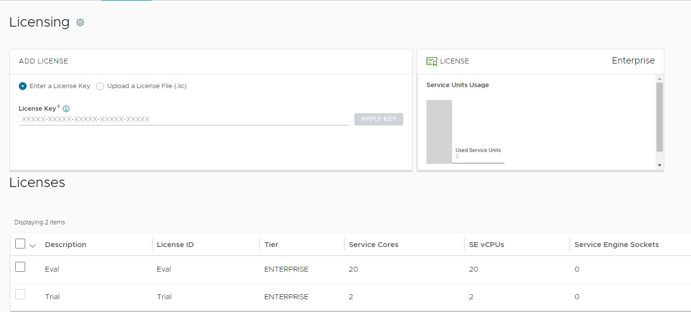
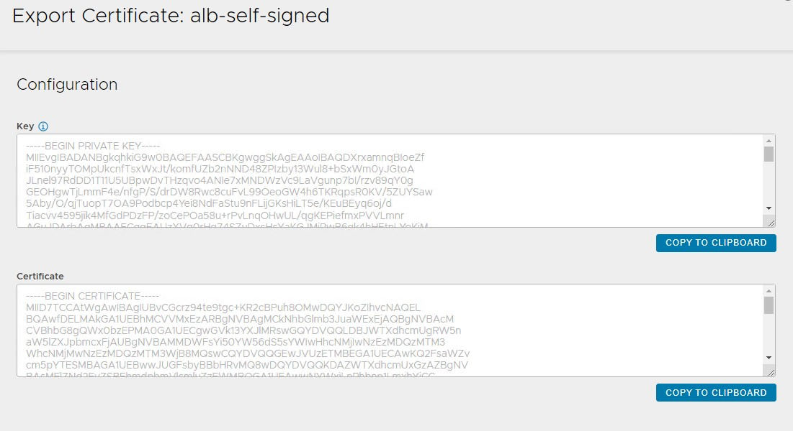
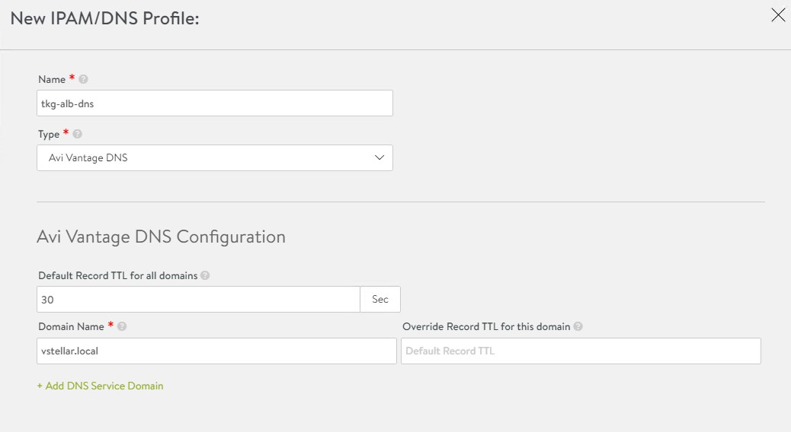

# Deploy Tanzu Kubernetes Grid on vSphere Networking in an Air-Gapped Environment

VMware Tanzu Kubernetes Grid (TKG) provides a consistent, upstream-compatible, regional Kubernetes substrate that is ready for end-user workloads and ecosystem integrations.

An air-gap installation method is used when the Tanzu Kubernetes Grid bootstrapper and cluster nodes components are unable to connect to the Internet to download the installation binaries from the public [VMware Registry](https://projects.registry.vmware.com/) during Tanzu Kubernetes Grid installation or upgrades. 

The scope of this document is limited to providing deployment steps based on the reference design in [Tanzu Kubernetes Grid on vSphere Networking](../reference-designs/tkg-vsphere-vds-airgap.md). This document does not provide any deployment procedures for the underlying SDDC components.

## Supported Component Matrix

The following table provides the component versions and interoperability matrix supported with the reference design:

|**Software Components**|**Version**|
| --- | --- |
|Tanzu Kubernetes Grid|1.5.4|
|VMware vSphere ESXi|7.0 U2 and later|
|VMware vCenter Server|7.0 U2 and later|
|NSX Advanced Load Balancer|21.1.4|

For up-to-date interoperability information about other VMware products and versions, see the [VMware Interoperability Matrix](https://interopmatrix.vmware.com/Interoperability?col=551,7906&row=1,%262,%26789,).

## Prepare your Environment for Deploying Tanzu Kubernetes Grid

Before deploying the Tanzu Kubernetes Grid in the vSphere environment, ensure that your environment is set up as described in the following sections:

- [General Requirements](#general-requirements)
- [Network Requirements](#network-requirements)
- [Firewall Requirements](#firewall-requirements)

### <a id=general-requirements> </a> General Requirements
- vSphere 7.0 U2 or greater instance with an Enterprise Plus license
- Your SDDC environment has the following objects in place: 
  - A vSphere cluster with at least 3 hosts, on which vSphere DRS is enabled. If you are using vSAN for shared storage, it is recommended that you use 4 ESXi hosts.
  - A distributed switch with port groups for Tanzu Kubernetes Grid components. Please refer to the [Network Requirements](#network-requirements) section for the required port groups.
  - Dedicated resource pool in which to deploy the Tanzu Kubernetes Grid Instance.
  - VM folders in which to collect the Tanzu Kubernetes Grid VMs. 
  - A shared datastore with sufficient capacity for the control plane and worker node VMs. 
  - Network Time Protocol (NTP) service is running on all ESXi hosts and vCenter and time is synchronized from the centralized NTP servers.
  - A host/server/VM based on Linux that acts as your **bastion host** and is located **outside the Internet-restricted environment (i.e. connected to the Internet)**. The installation binaries for Tanzu Kubernetes Grid and NSX Advanced Load Balancer will be downloaded on this machine. You will need to transfer files from this bastion host to your Internet-restricted environment (proxy connection, shared drive, USB drive, sneakernet, etc.).
  - A host/server/VM **inside your Internet-restricted environment** based on Linux/Windows which acts as your bootstrap machine and has Tanzu CLI, Kubectl and docker installed. This document makes use of a virtual machine based on CentOS. An internal Harbor registry will be installed on the same machine.
- vSphere account with permissions as described in [Required Permissions for the vSphere Account](https://docs.vmware.com/en/VMware-Tanzu-Kubernetes-Grid/1.5/vmware-tanzu-kubernetes-grid-15/GUID-mgmt-clusters-vsphere.html#required-permissions-for-the-vsphere-account-5).

**Note:** You can also download and import supported older versions of Kubernetes in order to deploy workload clusters on the intended Kubernetes versions.

### Resource Pools and VM Folders
Below are the sample entries of the resource pools and folders that need to be created.

|**Resource Type**|**Resource Pool**|**Sample Folder**|
| --- | --- | --- |
|NSX ALB Components|NSX-ALB|NSX-ALB-VMs|
|TKG Management components|TKG-Mgmt|TKG-Mgmt|
|TKG Shared Service Components|TKG-SS|TKG-SS|
|TKG Workload components|TKG-Workload|TKG-Workload|

### <a id=network-requirements> </a> Network Requirements

Create Port groups on vSphere Distributed Switch for deploying Tanzu Kubernetes Grid components as defined in [Network Requirements](../reference-designs/tkg-vsphere-vds-airgap.md) in the reference architecture. 

### <a id=firewall-requirements> </a> Firewall Requirements
Ensure that the firewall is set up as described in [Firewall Requirements](../reference-designs/tkg-vsphere-vds-airgap.md#ra-firewall-requirements).

### Subnet and CIDR Examples
For the purpose of this demonstration, this document makes use of the following CIDR for TKO deployment. Please change the values to reflect your environment.

|**Network Type**|**Port Group Name**|**Gateway CIDR**|**DHCP Pool**|**NSX ALB IP Pool**|
| --- | --- | --- | --- | --- |
|NSX ALB Mgmt Network|NSX-ALB-Mgmt|172.16.13.1/27|N/A|172.16.13.6 - 172.16.13.30|
|TKG Management Network|TKG-Management|172.16.14.1/27|172.16.14.2- 172.16.14.30|N/A|
|TKG Workload Segment|TKG-Workload|172.16.15.1/24|172.16.15.2- 172.16.15.251|N/A|
|TKG Cluster VIP Network|TKG-Cluster-VIP|172.16.16.1/26|N/A|172.16.16.2 - 172.16.16.62|
|TKG Mgmt VIP Network|TKG-SS-VIP|172.16.17.1/26|N/A|172.16.17.2 - 172.16.17.62|
|TKG Workload VIP Network|TKG-WLD-VIP|172.16.18.1/26|N/A|172.16.18.2 - 172.16.18.62|

## Deployment Overview
Here are the high-level steps for deploying Tanzu Kubernetes Grid on vSphere VDS networking in an air-gap environment:

- [Deploy and Configure Bastion Host](#configure-bastion)
- [Install Harbor Image Registry](#install-harbor)
- [Deploy and Configure Bootstrap VM](#configure-bootstrap)
- [Deploy and Configure NSX Advanced Load Balancer](#configure-alb)
- [Deploy Tanzu Kubernetes Grid Management Cluster](#deploy-tkg-management)
- [Deploy Tanzu Kubernetes Grid Shared Services Cluster](#deploy-tkg-shared-services)
- [Deploy Tanzu Kubernetes Grid Workload Cluster](#deploy-workload-cluster)
- [Deploy User-Managed Packages](#deploy-packages)

## <a id=configure-bastion> </a> Deploy and Configure Bastion Host

The bastion host is the physical or virtual machine where you download the images and binaries required for Tanzu Kubernetes Grid installation from the Internet. You will then transfer the downloaded items to the bootstrap machine, which is located inside the air-gap environment. 

Ensure the following:
- A browser is available on the bastion host to download the binaries from the Internet.
- The bastion host has the following hardware configuration:
    - CPU: 1
    - Memory: 4 GB
    - Storage (HDD): 200 GB or greater.

**Note:** The following instructions are for CentOS 7. If you are using any other operating system for your bastion host, change the commands accordingly.

### Deploy Bastion Host

1. Download the binaries for Docker Engine and associated dependencies.

    ```bash
    ### Create a directory for collecting docker installation binaries

    mkdir docker-binaries && cd docker-binaries

    ### Add docker repository to the yum command

    yum install yum-utils -y

    yum-config-manager --add-repo https://download.docker.com/linux/centos/docker-ce.repo

    ### Download docker and associated dependencies 

    yumdownloader --resolve docker-ce docker-ce-cli containerd.io docker-compose-plugin
    ```

    The `yumdownloader` command downloads the following binaries: 

    

2. Download installation binaries from the [Harbor GitHub repository](https://github.com/goharbor/harbor/releases/tag/v2.3.3). 

3. Download the NSX Advanced Load Balancer OVA from [VMware Customer Connect portal](https://customerconnect.vmware.com/downloads/info/slug/networking_security/vmware_nsx_advanced_load_balancer/21_1_x).

4. Download Tanzu CLI, Kubectl, and the Kubernetes OVA images from the [Tanzu Kubernetes Grid product download page](https://customerconnect.vmware.com/downloads/details?downloadGroup=TKG-154&productId=988&rPId=90871). Tanzu CLI and Plugins need to be installed on the bastion host and the bootstrap machine.

5. Download the [yq](https://github.com/mikefarah/yq) installation binary from [mikefarah / yq](https://github.com/mikefarah/yq/releases/tag/v4.25.2) GitHub repository.

6. Download the [gen-publish-images](https://raw.githubusercontent.com/vmware-tanzu/tanzu-framework/e3de5b1557d9879dc814d771f431ce8945681c48/hack/gen-publish-images-totar.sh) script for pulling Tanzu Kubernetes Grid installation binaries from the Internet.

### Configure Bastion Host

1. Install Tanzu CLI.

    ```bash
    gunzip tanzu-cli-bundle-linux-amd64.tar.gz

    cd cli/

    sudo install core/v0.11.6/tanzu-core-linux_amd64 /usr/local/bin/tanzu 

    chmod +x /usr/local/bin/tanzu
    ```
    Run the `tanzu version` command to check that the correct version of tanzu is installed and executable.

1. Install [imgpkg](https://carvel.dev/imgpkg/).

    imgpkg is a tool that enables Kubernetes to store configurations and the associated container images as OCI images and to transfer these images.

    ```bash
    gunzip imgpkg-linux-amd64-v0.22.0+vmware.1.gz

    chmod +x imgpkg-linux-amd64-v0.22.0+vmware.1

    mv imgpkg-linux-amd64-v0.22.0+vmware.1 /usr/local/bin/imgpkg
    ```

1. Install the Tanzu CLI plugins.

    The Tanzu CLI plugins provides commands for Tanzu Kubernetes cluster management and feature operations.

    Running the `tanzu init` command for the first time installs the necessary Tanzu Kubernetes Grid configuration files in the `~/.config/tanzu/tkg` folder on your system. The script that you create and run in subsequent steps requires the Bill of Materials (BoM) YAML files in the `~/.config/tanzu/tkg/bom` folder to be present on your machine. The scripts in this procedure use the BoM files to identify the correct versions of the different Tanzu Kubernetes Grid component images to pull.

    ```bash
    # tanzu init

    Checking for required plugins...
    Installing plugin 'login:v0.11.6'
    Installing plugin 'management-cluster:v0.11.6'
    Installing plugin 'package:v0.11.6'
    Installing plugin 'pinniped-auth:v0.11.6'
    Installing plugin 'secret:v0.11.6'
    Successfully installed all required plugins
    ✔  successfully initialized CLI
    ```

1. After installing the Tanzu plugins, run the `tanzu plugin` list command to check the plugins version and installation status.

    

    Validate the BOM files by listing the contents in the `.config/tanzu/tkg/bom/` folder.

    ```bash
    ls .config/tanzu/tkg/bom/

    tkg-bom-v1.5.4.yaml  tkr-bom-v1.22.9+vmware.1-tkg.1.yaml
    ```

1. Set the following environment variables.

   - IP address or FQDN of your local image registry. 

      ```bash
      export TKG_CUSTOM_IMAGE_REPOSITORY="PRIVATE-REGISTRY"
      ```

      Where PRIVATE-REGISTRY is the IP address or FQDN of your private registry and the name of the project. For example, `registry.example.com/library`

   - The repository from which to fetch Bill of Materials (BoM) YAML files.

      ```bash
      export TKG_IMAGE_REPO="projects.registry.vmware.com/tkg"

      export TKG_BOM_IMAGE_TAG="v1.5.4"
      ```

   - If your private registry uses a self-signed certificate, provide the CA certificate of the registry in base64 encoded format. For example, `base64 -w 0 your-ca.crt`.

      ```bash
      export TKG_CUSTOM_IMAGE_REPOSITORY_CA_CERTIFICATE=LS0t[...]tLS0tLQ==
      ```
      This CA certificate is automatically injected into all Tanzu Kubernetes clusters that you create in this Tanzu Kubernetes Grid instance. 

   - (Optional) Define the Tanzu Kubernetes releases (TKrs) to download. By default, the download script retrieves container images used in Tanzu Kubernetes Grid versions v1.3.0 and later. 

      List all TKrs and their associations with a Tanzu Kubernetes Grid releases.

      ```bash
      imgpkg pull -i ${TKG_IMAGE_REPO}/tkr-compatibility:v$(imgpkg tag list -i ${TKG_IMAGE_REPO}/tkr-compatibility |sed 's/v//' |sort -rn |head -1) --output "tkr-tmp"; cat tkr-tmp/tkr-compatibility.yaml; rm -rf tkr-tmp
      ```
      For your Tanzu Kubernetes Grid version, note the supported Kubernetes versions. The one with the latest minor version is used by the management cluster. For example the Tanzu Kubernetes Grid v1.5.4 management cluster uses TKr v1.22.9_vmware.1-tkg.1.

      Export as `DOWNLOAD_TKRS` a space-separated string of the TKrs required for your management cluster and workloads. For example, to download the images for Kubernetes v1.21 and v1.22 versions supported by Tanzu Kubernetes Grid v1.5.4:

      ```bash
      export DOWNLOAD_TKRS="v1.21.11_vmware.1-tkg.3 v1.22.9_vmware.1-tkg.1"
      ```

1. Prepare and execute the scripts for pulling Tanzu Kubernetes Grid installation binaries.

   - Create a folder to collect Tanzu Kubernetes Grid installation binaries.

      ```bash
      mkdir -p /root/tkg-images && cd /root/tkg-images
      ```
   - Download the script `gen-publish-images-totar.sh`.

      ```bash
      wget <https://raw.githubusercontent.com/vmware-tanzu/tanzu-framework/e3de5b1557d9879dc814d771f431ce8945681c48/hack/gen-publish-images-totar.sh>
      ```

   - Make the `gen-publish-images-totar.sh` script executable.

      ```bash
      chmod +x gen-publish-images-totar.sh
      ```

   - Generate the `images-to-tar-list` file. 

      ```bash
      ./gen-publish-images.sh > images-to-tar-list
      ```

1. Run the `download-images.sh` script.

   - Create the script using the following code snippet to download the Tanzu Kubernetes Grid installation binaries.

      ```bash
      #!/bin/bash

      set -euo pipefail

      images_script=${1:-}
      if [ ! -f $images_script ]; then
        echo "You may add your images list filename as an argument."
        echo "E.g ./download-images.sh image-copy-list"
      fi

      commands="$(cat ${images_script} |grep imgpkg |sort |uniq)"

      while IFS= read -r cmd; do
        echo -e "\nrunning $cmd\n"
        until $cmd; do
            echo -e "\nDownload failed. Retrying....\n"
            sleep 1
        done
      done <<< "$commands"
      ```

   - Make the `download-images script` executable.

      ```bash
      chmod +x download-images.sh
      ```

   - Run the `download-images.sh` script on the `images-to-tar-list` file to pull the required images from the public Tanzu Kubernetes Grid registry and save them as a TAR file.

      ```bash
      ./download-images.sh images-to-tar-list
      ```
      After the script has finished execution, you will see the required Tanzu Kubernetes Grid binaries in TAR format in the directory `tkg-images`. You will move the binaries to the bootstrap machine which is running inside the air-gap environment.

1. Generate the `publish-images-fromtar.sh` script.

    Run the script on the bootstrap machine after you have copied the download Tanzu Kubernetes Grid binaries onto the bootstrap VM. The script will copies the binaries from the bootstrap VM into the project in your private repository.

   1. Download the script named `gen-publish-images-fromtar.sh`.

      ```bash
      wget  https://raw.githubusercontent.com/vmware-tanzu/tanzu-framework/e3de5b1557d9879dc814d771f431ce8945681c48/hack/gen-publish-images-fromtar.sh
      ```

   1. Make the `gen-publish-images-fromtar.sh` script executable.

      ```bash
      chmod +x gen-publish-images-fromtar.sh
      ```

   1. Generate a `publish-images-fromtar.sh` shell script that is populated with the address of your private Docker registry.

      ```bash
      ./gen-publish-images-fromtar.sh > publish-images-fromtar.sh
      ```

   1. Verify that the generated script contains the correct registry address.

      ```bash
      cat publish-images-fromtar.sh
      ```
   1. Transfer the generated `publish-images-fromtar.sh` script file to the bootstrap machine. 

2. Move the binaries you downloaded to the bootstrap VM. 

## <a id=install-harbor> </a> Install Harbor Image Registry

Install the Harbor only if you don’t have any existing image repository in your environment. 

To install Harbor, deploy an operating system of your choice with the following hardware configuration:

- vCPU: 4
- Memory: 8 GB
- Storage (HDD): 160 GB

Copy the Harbor binary from the bootstrap VM to the Harbor VM. Follow the instructions provided in [Harbor Installation and Configuration](https://goharbor.io/docs/2.3.0/install-config/) to deploy and configure Harbor.

## <a id=configure-bootstrap> </a> Deploy and Configure Bootstrap VM

The bootstrap machine can be a laptop, host, or server (running on Linux/MAC/Windows platform). You deploy management and workload clusters from the bootstrap machine. The bootstrap machine also keeps the Tanzu and Kubernetes configuration files for your deployments. The bootstrap machine is typically local.

The bootstrap machine now hosts all the required binaries for Tanzu Kubernetes Grid installation. The bootstrap machine should have the following resources allocated:

- vCPU: 4
- RAM: 8 GB
- Storage: 200 GB or greater

The following procedure provides steps to configure the bootstrap virtual machines that uses CentOS. See [Install the Tanzu CLI and Other Tools](https://docs.vmware.com/en/VMware-Tanzu-Kubernetes-Grid/1.5/vmware-tanzu-kubernetes-grid-15/GUID-install-cli.html) to configure MAC/Windows machines.

- Ensure that the bootstrap VM is connected to the TKG Management Network `TKG-Mgmt`.

- [Configure NTP](https://www.cyberithub.com/how-to-install-configure-ntp-server-in-rhel-centos-7-8/) on your bootstrap VM and ensure that the time is synchronized with the NTP server. We recommend using the same NTP server that you configured for the other infrastructure components such as vCenter and ESXi hosts.

1. Install Tanzu CLI.

      ```bash
      gunzip tanzu-cli-bundle-linux-amd64.tar.gz

      cd cli/

      install core/v0.11.6/tanzu-core-linux_amd64 /usr/local/bin/tanzu
      
      chmod +x /usr/local/bin/tanzu
      ```

      Run the `tanzu version` command to check that the correct version of tanzu is installed and executable.

1. Install the Kubectl utility.

      ```bash
      gunzip kubectl-linux-v1.22.9+vmware.1.gz

      mv kubectl-linux-v1.22.9+vmware.1 /usr/local/bin/kubectl

      chmod +x /usr/local/bin/kubectl
      ```

      Run the `kubectl version --short=true` to check that the correct version of kubectl is installed and executable.

1. Configure the environment variables.

      In an air-gap environment, if you run the `tanzu init` or `tanzu plugin sync` commands, the command hangs and times out after some time with the following error:

      ```bash
      [root@bootstrap ~]# tanzu init
      Checking for required plugins...
      unable to list plugin from discovery 'default': error while processing package: failed to get resource files from discovery: Checking if image is bundle: Fetching image: Get "https://projects.registry.vmware.com/v2/": dial tcp 10.188.25.227:443: i/o timeout
      All required plugins are already installed and up-to-date
      ✔  successfully initialized CLI

      [root@bootstrap ~]# tanzu plugin sync
      Checking for required plugins...
      unable to list plugin from discovery 'default': error while processing package: failed to get resource files from discovery: Checking if image is bundle: Fetching image: Get "https://projects.registry.vmware.com/v2/": dial tcp 10.188.25.227:443: i/o timeout
      All required plugins are already installed and up-to-date
      ✔  Done
      ```

      By default the Tanzu global config file, `config.yaml`, which gets created when you first run `tanzu init` command, points to the repository URL <https://projects.registry.vmware.com> to fetch the Tanzu plugins for installation. Because there is no Internet in the environment, the commands fails after some time.

      To ensure that Tanzu Kubernetes Grid always pulls images from the local private registry, run the Tanzu `config set` command to add `TKG_CUSTOM_IMAGE_REPOSITORY` to the global Tanzu CLI configuration file, `~/.config/tanzu/config.yaml`. 

      If your image registry is configured with a public signed CA certificate, set the following environment variables.

      ```bash
      tanzu config set env.TKG_CUSTOM_IMAGE_REPOSITORY custom-image-repository.io/yourproject

      tanzu config set env.TKG_CUSTOM_IMAGE_REPOSITORY_SKIP_TLS_VERIFY true
      ```

      If your registry solution uses self-signed certificates, also add TKG_CUSTOM_IMAGE_REPOSITORY_CA_CERTIFICATE in base64-encoded format to the global Tanzu CLI configuration file. For self-signed certificates, set the following environment variables:

      ```bash
      tanzu config set env.TKG_CUSTOM_IMAGE_REPOSITORY custom-image-repository.io/yourproject

      tanzu config set env.TKG_CUSTOM_IMAGE_REPOSITORY_SKIP_TLS_VERIFY false

      tanzu config set env.TKG_CUSTOM_IMAGE_REPOSITORY_CA_CERTIFICATE LS0t[...]tLS0tLQ==

      ```

1. Initialize Tanzu Kubernetes Grid and Install Tanzu CLI plugins.

      ```bash
      ### Initialize Tanzu Kubernetes Grid 

      tanzu config init 

      ## (Optional) Remove existing plugins from any previous CLI installations.

      tanzu plugin clean

      tanzu plugin sync
      ```

      After installing the tanzu plugins, run the tanzu plugin list command to check the plugins version and installation status.

1. Install Carvel tools.

    Tanzu Kubernetes Grid uses the following tools from the Carvel open-source project:

    - [ytt](https://carvel.dev/ytt/) - a command-line tool for templating and patching YAML files. You can also use ytt to collect fragments and piles of YAML into modular chunks for easy re-use.
    - [kapp](https://carvel.dev/kapp/) - the application deployment CLI for Kubernetes. It allows you to install, upgrade, and delete multiple Kubernetes resources as one application.
    - [kbld](https://carvel.dev/kbld/) - an image-building and resolution tool.
    - [imgpkg](https://carvel.dev/imgpkg/) - a tool that enables Kubernetes to store configurations and the associated container images as OCI images, and to transfer these images.

    1. Install ytt

        ```bash
        cd ./cli

        gunzip ytt-linux-amd64-v0.37.0+vmware.1.gz

        mv ytt-linux-amd64-v0.37.0+vmware.1 /usr/local/bin/ytt

        chmod +x /usr/local/bin/ytt

        ```
        Run `ytt --version` to check that the correct version of ytt is installed and executable

   1. Install kapp.

      ```bash
      gunzip kapp-linux-amd64-v0.42.0+vmware.2.gz

      mv kapp-linux-amd64-v0.42.0+vmware.2 /usr/local/bin/kapp

      chmod +x /usr/local/bin/kapp
      ```

      Run `kapp --version` to check that the correct version of kapp is installed and executable.

   2. Install kbld.

      ```bash
      gunzip kbld-linux-amd64-v0.31.0+vmware.1.gz

      mv kbld-linux-amd64-v0.31.0+vmware.1 /usr/local/bin/kbld

      chmod +x /usr/local/bin/kbld
      ```

      Run `kbld --version` to check that the correct version of kbld is installed and executable.

   3. Install imgpkg.

      ```bash
      gunzip imgpkg-linux-amd64-v0.22.0+vmware.1.gz
      mv imgpkg-linux-amd64-v0.22.0+vmware.1 /usr/local/bin/imgpkg
      chmod +x /usr/local/bin/imgpkg
      ```

      Run `imgpkg --version` to check that the correct version of imgpkg is installed and executable.

1. Install yq.

    yq a lightweight and portable command-line YAML processor. 

    ```bash
    wget https://github.com/mikefarah/yq/releases/download/v4.25.2/yq_linux_amd64.tar.gz

    tar -zxvf yq_linux_amd64.tar.gz

    mv yq_linux_amd64 /usr/local/bin/
    ```
    Run the `yq -V` command to check that the correct version of yq is installed and executable.

1. Install Docker.

    Navigate to the folder where the docker installation binaries are located and run the `rpm -ivh <package-name>` command.

    ```bash
    cd docker-binaries

    rpm -ivh *.rpm
    ```

    Wait for the installation process to finish.

    

    Start the docker service and set the service to run at boot time.

    ```bash
    systemctl start docker && systemctl enable docker && systemctl status docker
    ```

1. Create an SSH key-pair.

    This is required for Tanzu CLI to connect to vSphere from the bootstrap machine.  The public key part of the generated key will be passed during the Tanzu Kubernetes Grid management cluster deployment.  

    ```bash
    ### Generate public/Private key pair.

    ssh-keygen -t rsa -b 4096 -C "email@example.com"

    ### Add the private key to the SSH agent running on your machine and enter the password you created in the previous step 

    ssh-add ~/.ssh/id_rsa 

    ### If the above command fails, execute "eval $(ssh-agent)" and then rerun the command.
    ```

    Make a note of the public key from the file **$home/.ssh/id_rsa.pub**. You need this while creating a config file for deploying the Tanzu Kubernetes Grid management cluster.

1. Push Tanzu Kubernetes Grid installation binaries to your private image registry.

    Navigate to the folder which contains all Tanzu Kubernetes Grid binaries and the `publish-images-fromtar.sh` file that you have copied from the bastion host and then execute the following command to push the binaries to your private image registry. 

    ```bash
    ### Make the publish-images-fromtar.sh script executable.

    chmod +x publish-images-fromtar.sh

    ### Execute the publish-images-fromtar.sh script

    sh publish-images-fromtar.sh
    ```

Now all the required packages are installed and required configurations are in place on the bootstrap virtual machine.

### Import the Base Image Template in vCenter Server

A base image template containing the OS and Kubernetes versions, that will be used to deploy management and workload clusters, is imported in vSphere. See [Import the Base Image Template into vSphere](https://docs.vmware.com/en/VMware-Tanzu-Kubernetes-Grid/1.5/vmware-tanzu-kubernetes-grid-15/GUID-mgmt-clusters-vsphere.html#import-a-base-image-template-into-vsphere-4).

**Note:** If you use a `non-administrator SSO account`, in the VMs and Templates view, right-click the new template, select **Add Permission**, and assign the **tkg-user** to the template with the **TKG role**.

For information about how to create the user and role for Tanzu Kubernetes Grid, see [Required Permissions for the vSphere Account](https://docs.vmware.com/en/VMware-Tanzu-Kubernetes-Grid/1.5/vmware-tanzu-kubernetes-grid-15/GUID-mgmt-clusters-vsphere.html#required-permissions-for-the-vsphere-account-5).

### Import NSX Advanced Load Balancer in Content Library

Create a content library following the instructions provided in [Create a Library](https://docs.vmware.com/en/VMware-vSphere/7.0/com.vmware.vsphere.vm_admin.doc/GUID-2A0F1C13-7336-45CE-B211-610D39A6E1F4.html) in VMware vSphere documentation. You will store the NSX Advanced Load Balancer OVA in the library. 

To import the OVA into the content library, see [Import Items to a Content Library](https://docs.vmware.com/en/VMware-vSphere/7.0/com.vmware.vsphere.vm_admin.doc/GUID-897EEEC2-B378-41A7-B92B-D1159B5F6095.html). 

## <a id=configure-alb> </a> Deploy and Configure NSX Advanced Load Balancer

NSX Advanced Load Balancer is deployed in Write Access Mode mode in the vSphere environment. This mode grants NSX Advanced Load Balancer Controllers full write access to the vCenter which helps in automatically creating, modifying, and removing SEs and other resources as needed to adapt to changing traffic needs.

For a production-grade deployment, we recommend deploying three instances of the NSX Advanced Load Balancer Controller for high availability and resiliency. For more information about how NSX Advanced Load Balancer provides load balancing in the Tanzu Kubernetes Grid environment, see [Install NSX Advanced Load Balancer](https://docs.vmware.com/en/VMware-Tanzu-Kubernetes-Grid/1.5/vmware-tanzu-kubernetes-grid-15/GUID-mgmt-clusters-install-nsx-adv-lb.html).

The following table provides an example IP and FQDN set for the NSX Advanced Load Balancer controllers:

|**Controller Node**|**IP Address**|**FQDN**|
| --- | --- | --- |
|Node 01 (Primary)|172.16.13.3|`alb01.vstellar.local`|
|Node 02 (Secondary)|172.16.13.4|`alb02.vstellar.local`|
|Node 03 (Secondary) |172.16.13.5|`alb03.vstellar.local`|
|Controller Cluster|172.16.13.2|`alb.vstellar.local`|

### Deploy NSX Advanced Load Balancer Controllers

To deploy NSX Advanced Load Balancer controller nodes, follow the steps provided in [Deploy a Virtual Machine from an OVF Template](https://docs.vmware.com/en/VMware-vSphere/7.0/com.vmware.vsphere.vm_admin.doc/GUID-3C02B3FC-5DE6-48AA-9AD3-7F0D1C7EC4B6.html). Follow the wizard to configure the following:

- VM Name and select the NSX-ALB-VMs folder for controller nodes placement.
- Select the **NSX-ALB** resource pool as a compute resource.
- Select the datastore for the controller node deployment.
- Select the **NSX-ALB-Mgmt** port group for the Management Network.
- Customize the configuration by providing Management Interface IP Address, Subnet Mask, and Default Gateway. The rest of the fields are optional and should be left blank.


A new task for creating the virtual machine appears in the **Recent Tasks** pane. After the task is complete, the NSX Advanced Load Balancer virtual machine is created on the selected resource. Power on the VM and give a few minutes for the system to boot up. After the system successfully boots up, go to NSX Advanced Load Balancer on your browser using the URL `https://<ALB_IP/FQDN>/` and configure the basic system settings as follows:

- (Optional) Configure the administrator account by setting up a password and email.

  

- Configure **System Settings** by specifying the backup passphrase and DNS information.

  

- (Optional) Configure **Email/SMTP**: Provide **Email** or **SMTP** information.

  

- Configure Multi-Tenant settings as follows:
  - **IP Route Domain:** Share IP route domain across tenants.
  - **Service Engine Context:** Service Engines are managed within the tenant context, not shared across tenants.

  

If you did not select the **Setup Cloud After** option before saving, the initial configuration wizard exits. The Cloud configuration window does not automatically launch and you are directed to a dashboard view on the controller.

### Configure NTP Settings

To Configure NTP, 

1. Navigate to **Administration** > **Settings** > **DNS/NTP > Edit**. 

    

1. Add your NTP server details and **Save.**

**Note:** You can delete the default NTP servers.


#### Configure Licensing

The deployment described in this document requires NSX Advanced Load Balancer Enterprise License.

To configure licensing, 

1. Go to **Administration** > **Settings** > **Licensing**.
2. Click on the gear icon to change the license type to Enterprise.

    

3. Select license type as **Enterprise Tier**.

    

4. After changing the license tier, apply the NSX Advanced Load Balancer Enterprise license key. If you have a license file instead of a license key, apply the license by selecting the **Upload a License File** option.

    

### NSX Advanced Load Balancer: Controller High Availability

In a production environment, we recommended that you deploy additional controller nodes and configure the controller cluster for high availability and disaster recovery. Adding two additional nodes to create a 3-node cluster provides node-level redundancy for the controller and also maximizes performance for CPU-intensive analytics functions. 

To run a 3-node controller cluster, you deploy the first node and perform the initial configuration, and set the Cluster IP. After that, deploy and power on two more Controller VMs. Do not run the initial configuration wizard or change the admin password for the additional controller VMs. The configuration of the first controller VM is assigned to the two new controller VMs.

The first controller of the cluster receives the "Leader" role. The second and third controllers will work as "Follower".

Perform the following steps to configure the NSX Advanced Load Balancer cluster:

1. Log in to the primary NSX Advanced Load Balancer controller.
2. Go to **Administrator** > **Controller** > **Nodes,** and click **Edit**. 

    

1. Specify the cluster **name,** and** set the Controller Cluster IP. This IP address should be from the NSX Advanced Load Balancer management network. Also, specify the IP address for the 2nd and 3rd controller and click on **Save.**

2. (Optional) Provide a friendly name for the nodes.

    

The primary NSX Advanced Load Balancer Controller becomes the leader for the cluster and invites the other controllers to the cluster as members. 

NSX Advanced Load Balancer then performs a warm reboot of the cluster. This process can take approximately 10-15 minutes. You will be automatically logged out of the controller node on which you are currently logged. 

Enter the cluster IP in the browser to see details about the cluster formation task.

The configuration of the primary (leader) Controller is synchronized to the new member nodes when the cluster comes online following the reboot. Once the cluster is successfully formed you should see the following status:


**Note:** Going forward, all NSX Advanced Load Balancer configurations are configured by connecting to the NSX Advanced Load Balancer Controller Cluster IP/FQDN.

### Change NSX Advanced Load Balancer Portal Certificate

The default system-generated controller certificate generated for SSL/TSL connections will not have the required SAN entries. Do the following to create a Controller certificate:

1. Log in to NSX Advanced Load Balancer Controller.
2. Go to **Templates > Security > SSL/TLS Certificates**.

3. Click **Create** and select **Controller Certificate**.

    

4. You can either generate a self-signed certificate, generate CSR, or import a certificate.
  This deployment uses a self-signed certificate.

     - Provide the required details based on your infrastructure requirements. 
     - For Subject Alternate Name (SAN), enter the IP and FQDN of all NSX Advanced Load Balancer controllers including the NSX Advanced Load Balancer cluster IP and FQDN.
     - Click **Save**. 

    

    

5. Capture the certificate contents. You will use the certificate contents when deploying the Tanzu Kubernetes Grid management cluster. 
      - To capture the certificate content, click on the download icon next to the certificate, then click **Copy to clipboard** under the certificate section.

        

6. Replace the system-generated certificate with the newly created certificate. 
   1. Go to **Administration** > **Settings** > **Access** **Settings**.
   2. Click on the pencil icon at the top right to edit the System Access Settings.
   3. Replace the SSL/TSL certificate and click **Save**.

        

7. Log out and log in to NSX Advanced Load Balancer.

### Configure vCenter Cloud and Service Engine Groups

NSX Advanced Load Balancer Vantage may be deployed in multiple environments for the same system. Each environment is called a cloud. The following procedure provides steps on how to create a VMware vCenter cloud, and as shown in the architecture two Service Engine Groups will be created.

**Service Engine Group 1**: Service engines part of this Service Engine group hosts:

- Virtual services for all load balancer functionalities requested by Tanzu Kubernetes Grid management and shared services cluster.
- Virtual services that load balances control plane nodes of all Tanzu Kubernetes Grid clusters.

**Service Engine Group 2**: Service engines part of this Service Engine group, hosts virtual services for all load balancer functionalities requested by Tanzu Kubernetes Grid workload clusters mapped to this SE group.

**Note:** 
- Based on your requirements, you can create additional Service Engine groups for the workload clusters. 
- Multiple workload clusters can be mapped to a single SE group.
- A Tanzu Kubernetes Grid cluster can be mapped to only one SE group for Application load balancer services.  

The following table lists the components that are be created in NSX Advanced Load Balancer.

|Object|Sample Name|
| --- | --- |
|vCenter Cloud|tkg-vsphere|
|Service Engine Group 1|`mgmt-segroup-01`|
|Service Engine Group 2|`wld-segroup-01`|

1. Log in to NSX Advanced Load Balancer.
2. Go to **Infrastructure > Clouds > Create > VMware vCenter/vSphere ESX**. 

    

3. Enter a name for the Cloud and click **Next**.

    

4. For **Infrastructure** pane, 
   - Enter the **vCenter Address, Username**, and **Password**. 
   - Set the Access Permission to **Write** and click on **Next**.

    

5. For **Data Center**, 
   - Choose the data center for NSX Advanced Load Balancer to discover infrastructure resources. 
   - Ensure that the Default Network IP Address Management is set to **DHCP**.

    

1. For **Network**, 
   - Choose the NSX Advanced Load Balancer **Management Network** for Service Engines.
   - Provide a **Static IP pool** for SEs and VIPs and click on Complete.

    

1. Wait for the status of the Cloud to configure and the status to turn Green. 

    

7. To create a Service Engine group for the Tanzu Kubernetes Grid management clusters, click the **Service Engine Group** tab, under **Select Cloud**, choose the Cloud created in the previous step, and click **Create**

8. Enter a name for the Tanzu Kubernetes Grid management Service Engine group and set the following parameters

    |**Parameter**|**Value**|
    | --- | --- |
    |High availability mode|N+M (buffer)|
    |Memory per Service Engine|4|
    |vCPU per Service Engine|2|

    The rest of the parameters can be left as default.

    

    For advanced configuration click on the **Advanced** tab, to specify a specific cluster and datastore for service engine placement, to change the SE folder name and Service engine name prefix and, click on **Save**.

1. Repeat the steps to create another Service Engine group for Tanzu Kubernetes Grid workload clusters. You must have two service engine groups.

    

### Configure Tanzu Kubernetes Grid Networks in NSX Advanced Load Balancer 

As part of the Cloud creation in NSX Advanced Load Balancer, only the management network is configured in NSX Advanced Load Balancer. You have to configure the following Tanzu Kubernetes Grid networks: 

- TKG Cluster VIP Network 
- TKG Management VIP (TKG-SS-VIP) Network 
- TKG Workload VIP Network 

Do the following steps to configure the Tanzu Kubernetes Grid networks. 

1. Log in to NSX Advanced Load Balancer and navigate to **Infrastructure > Networks** tab and select the `tkg-vsphere` Cloud. All the networks available in vCenter will be listed.


2. Click on the edit icon next to the network and configure it as shown in the following table. Change the values as per your SDDC configuration.

    |**Network Name**|**DHCP** |**Subnet**|**Static IP Pool**|
    | --- | --- | --- | --- |
    |TKG-Cluster-VIP|No|172.16.16.0/26|172.16.16.2 - 172.16.16.62|
    |TKG-SS-VIP|No|172.16.17.0/26|172.16.17.2 - 172.16.17.62|
    |TKG-WLD-VIP|No|172.16.18.0/26|172.16.18.2 - 172.16.18.62|

    The following screen capture shows an example configuration.

    

The following shows an example of the configured networks.


**Configure Routing**

After the VIP networks are configured, set the default routes for all VIP/Data networks. The following table lists the default routes used in the current environment.

|**Network Name**|**Gateway Subnet**|**Next Hop**|
| --- | --- | --- |
|TKG-Cluster-VIP|0.0.0.0/0|172.16.16.1|
|TKG-SS-VIP|0.0.0.0/0|172.16.17.1|
|TKG-WLD-VIP|0.0.0.0/0|172.16.18.1|

**Note:** Change the gateway for VIP networks as per your network configurations.

Navigate to the **Routing** page and click **Create**. Add default routes for the VIP networks.


A total of three default gateways are configured.


### Create IPAM and DNS Profiles

IPAM is required to allocate virtual IP addresses when virtual services get created. NSX Advanced Load Balancer provides IPAM service for TKG Cluster VIP Network, TKG Mgmt VIP Network, and TKG Workload VIP Network.

To create an IPAM profile, 

1. Go to **Templates > Profiles > IPAM/DNS Profiles**, 
2. Click **Create** and select **IPAM Profile**. 
3. Create the IPAM profile using the values in the following table.

    |**Parameter**|**Value**|
    | --- | --- |
    |Name|tkg-alb-ipam|
    |Type|AVI Vintage IPAM|
    |Cloud for Usable Networks|tkg-vsphere|
    |Usable Networks|<p>TKG-Cluster-VIP</p><p>TKG-SS-VIP</p><p>TKG-WLD-VIP</p>|

4. Click **Save**.

    

To create a DNS profile, 

1. Click **Create** again and select **DNS Profile**.
2. Enter a name for the DNS Profile. 
3. Select the **Type** as **AVI Vantage DNS**. 
1. For **Domain Name**, specify the domain that you want to use with NSX Advanced Load Balancer. 
2. (Optional) Configure a value for **Override Record TTL for this domain**. The default is 30 seconds for all domains.



To use the NSX Advanced Load Balancer objects created under the cloud, associate the newly created IPAM and DNS profiles with the cloud.

To assign the IPAM and DNS profile to the cloud, 

1. Go to **Infrastructure > Cloud** and edit the cloud configuration.
   - For **IPAM Profile**, select the IPAM profile. 
   - For **DNS Profile**, select the DNS profile and save the settings. 

    

2. Verify that the status of the cloud is green.

    

This completes the NSX Advanced Load Balancer configuration. Next, deploy and configure the Tanzu Kubernetes Grid management cluster.

## <a id=deploy-tkg-management> </a> Deploy Tanzu Kubernetes Grid Management Cluster

The management cluster is a Kubernetes cluster that runs Cluster API operations on a specific cloud provider to create and manage workload clusters on that provider.

The management cluster is also where you configure the shared and in-cluster services that the workload clusters use.

You may deploy management clusters in the following ways:

- Run the Tanzu Kubernetes Grid installer, a wizard interface that guides you through the process of deploying a management cluster. 

- Create and edit YAML configuration files, and use them with Tanzu CLI commands to deploy a management cluster.

Before creating a management cluster using the Tanzu CLI, you must define its configuration in a YAML configuration file that provides the base configuration for the cluster. When you deploy the management cluster from the CLI, you specify the YAML file by using the `--file` option of the `tanzu mc create` command.

In an air-gap environment, we recommend deploying a management cluster using a YAML configuration file. You can use the templates provided in the following section to deploy management clusters on vSphere. 

### Management Cluster Configuration Template

The templates include all of the options that are relevant to deploying management clusters on vSphere. You can copy this template and use it to deploy management clusters to vSphere.

**Important:** The environment variables that you have set, override values from a cluster configuration file. To use all settings from a cluster configuration file, remove any conflicting environment variables before you deploy the management cluster from the CLI.

```yaml
#! ---------------------------------------------------------------------
#! Basic cluster creation configuration
#! ---------------------------------------------------------------------

CLUSTER_NAME:
CLUSTER_PLAN: <dev/prod>
INFRASTRUCTURE_PROVIDER: vsphere
ENABLE_CEIP_PARTICIPATION: <true/false>
ENABLE_AUDIT_LOGGING: <true/false>
CLUSTER_CIDR: 100.96.0.0/11
SERVICE_CIDR: 100.64.0.0/13
# CAPBK_BOOTSTRAP_TOKEN_TTL: 30m

#! ---------------------------------------------------------------------
#! vSphere configuration
#! ---------------------------------------------------------------------

VSPHERE_SERVER:
VSPHERE_USERNAME:
VSPHERE_PASSWORD:
VSPHERE_DATACENTER:
VSPHERE_RESOURCE_POOL:
VSPHERE_DATASTORE:
VSPHERE_FOLDER:
VSPHERE_NETWORK: <tkg-management-network>
VSPHERE_CONTROL_PLANE_ENDPOINT: #Leave blank as VIP network is configured in NSX ALB and IPAM is configured with VIP network

# VSPHERE_TEMPLATE:

VSPHERE_SSH_AUTHORIZED_KEY:
VSPHERE_TLS_THUMBPRINT:
VSPHERE_INSECURE: <true/false>
DEPLOY_TKG_ON_VSPHERE7: true

#! ---------------------------------------------------------------------
#! Node configuration
#! ---------------------------------------------------------------------

# SIZE:
# CONTROLPLANE_SIZE:
# WORKER_SIZE:
# OS_NAME: ""
# OS_VERSION: ""
# OS_ARCH: ""
# VSPHERE_NUM_CPUS: 2
# VSPHERE_DISK_GIB: 40
# VSPHERE_MEM_MIB: 4096
# VSPHERE_CONTROL_PLANE_NUM_CPUS: 2
# VSPHERE_CONTROL_PLANE_DISK_GIB: 40
# VSPHERE_CONTROL_PLANE_MEM_MIB: 8192
# VSPHERE_WORKER_NUM_CPUS: 2
# VSPHERE_WORKER_DISK_GIB: 40
# VSPHERE_WORKER_MEM_MIB: 4096

#! ---------------------------------------------------------------------
#! NSX Advanced Load Balancer configuration
#! ---------------------------------------------------------------------

AVI_ENABLE: true
AVI_CONTROL_PLANE_HA_PROVIDER: true
AVI_CONTROLLER:
AVI_USERNAME: ""
AVI_PASSWORD: ""
AVI_CLOUD_NAME:
AVI_SERVICE_ENGINE_GROUP:
AVI_MANAGEMENT_CLUSTER_SERVICE_ENGINE_GROUP:
AVI_DATA_NETWORK:
AVI_DATA_NETWORK_CIDR:
AVI_MANAGEMENT_CLUSTER_VIP_NETWORK_NAME:
AVI_MANAGEMENT_CLUSTER_VIP_NETWORK_CIDR:
AVI_CA_DATA_B64: ""
AVI_LABELS: ""

# AVI_DISABLE_STATIC_ROUTE_SYNC: true
# AVI_INGRESS_DEFAULT_INGRESS_CONTROLLER: false
# AVI_INGRESS_SHARD_VS_SIZE: ""
# AVI_INGRESS_SERVICE_TYPE: ""
# AVI_INGRESS_NODE_NETWORK_LIST: ""
# AVI_NAMESPACE: "tkg-system-networking"
# AVI_DISABLE_INGRESS_CLASS: true
# AVI_AKO_IMAGE_PULL_POLICY: IfNotPresent
# AVI_ADMIN_CREDENTIAL_NAME: avi-controller-credentials
# AVI_CA_NAME: avi-controller-ca
#AVI_CONTROLLER_VERSION:# Required for NSX Advanced Load Balancer (ALB) v21.1.x.

#! ---------------------------------------------------------------------
#! Image repository configuration
#! ---------------------------------------------------------------------

TKG_CUSTOM_IMAGE_REPOSITORY: ""
TKG_CUSTOM_IMAGE_REPOSITORY_SKIP_TLS_VERIFY: false
TKG_CUSTOM_IMAGE_REPOSITORY_CA_CERTIFICATE: ""

#! ---------------------------------------------------------------------
#! Machine Health Check configuration
#! ---------------------------------------------------------------------

ENABLE_MHC:
ENABLE_MHC_CONTROL_PLANE: <true/false>
ENABLE_MHC_WORKER_NODE: <true/flase>

#! ---------------------------------------------------------------------
#! Identity management configuration
#! ---------------------------------------------------------------------

IDENTITY_MANAGEMENT_TYPE: "none"

#! Settings for IDENTITY_MANAGEMENT_TYPE: "oidc"
# CERT_DURATION: 2160h
# CERT_RENEW_BEFORE: 360h
# OIDC_IDENTITY_PROVIDER_CLIENT_ID:
# OIDC_IDENTITY_PROVIDER_CLIENT_SECRET:
# OIDC_IDENTITY_PROVIDER_GROUPS_CLAIM: groups
# OIDC_IDENTITY_PROVIDER_ISSUER_URL:
# OIDC_IDENTITY_PROVIDER_SCOPES: "email,profile,groups"
# OIDC_IDENTITY_PROVIDER_USERNAME_CLAIM: email

#! Settings for IDENTITY_MANAGEMENT_TYPE: "ldap"
# LDAP_BIND_DN:
# LDAP_BIND_PASSWORD:
# LDAP_HOST:
# LDAP_USER_SEARCH_BASE_DN:
# LDAP_USER_SEARCH_FILTER:
# LDAP_USER_SEARCH_USERNAME: userPrincipalName
# LDAP_USER_SEARCH_ID_ATTRIBUTE: DN
# LDAP_USER_SEARCH_EMAIL_ATTRIBUTE: DN
# LDAP_USER_SEARCH_NAME_ATTRIBUTE:
# LDAP_GROUP_SEARCH_BASE_DN:
# LDAP_GROUP_SEARCH_FILTER:
# LDAP_GROUP_SEARCH_USER_ATTRIBUTE: DN
# LDAP_GROUP_SEARCH_GROUP_ATTRIBUTE:
# LDAP_GROUP_SEARCH_NAME_ATTRIBUTE: cn
# LDAP_ROOT_CA_DATA_B64:
```

For a full list of configurable values and to learn more about the fields present in the template file, see [Create a Management Cluster Configuration File](https://docs.vmware.com/en/VMware-Tanzu-Kubernetes-Grid/1.5/vmware-tanzu-kubernetes-grid-15/GUID-tanzu-config-reference.html).

Create a file using the values provided in the template and save the file with a `.yaml` extension. See [Appendix Section](#supplemental-information) for a sample YAML file to use for deploying a management cluster.

After you have created or updated the cluster configuration file, you can deploy a management cluster by running the `tanzu mc create --file CONFIG-FILE` command, where CONFIG-FILE is the name of the configuration file. 

The cluster deployment logs are streamed in the terminal when you run the `tanzu mc create` command. The first run of `tanzu mc create` takes longer than subsequent runs because it has to pull the required Docker images into the image store on your bootstrap machine. Subsequent runs do not require this step, and thus the process is faster.

While the cluster is being deployed, you will find that a virtual service is created in NSX Advanced Load Balancer and new service engines are deployed in vCenter by NSX Advanced Load Balancer. The service engines are mapped to the SE Group `mgmt-segroup-01​`​.

Now you can access the Tanzu Kubernetes Grid management cluster from the bootstrap machine and perform additional tasks such as verifying the management cluster health and deploying the workload clusters.

To get the status of the Tanzu Kubernetes Grid management cluster execute the following command:

```bash
tanzu management-cluster get
```


To interact with the management cluster using the kubectl command, retrieve the management cluster `kubeconfig` and switch to the cluster context to run kubectl commands.

```bash
tanzu mc kubeconfig get --admin

Kubectl config use-context <mgmt cluster context>
```


The Tanzu Kubernetes Grid management cluster is successfully deployed. You can now proceed with creating shared services and workload clusters.

## <a id=deploy-tkg-shared-services> </a> Deploy Tanzu Kubernetes Grid Shared Services Cluster

Each Tanzu Kubernetes Grid instance can have only one shared services cluster. Create a shared services cluster if you intend to deploy Harbor.

Deploying a shared service cluster and workload cluster is the same with the following exceptions:

- You will add a `tanzu-services` label to the shared services cluster. The label identifies the shared services cluster's role to the management cluster and workload clusters.
- The Cluster Labels applied to the shared service cluster are defined while deploying management cluster. This enforces that only the shared services cluster makes use of the **TKG-Cluster-VIP** network for application load balancing purposes and the virtual services are deployed on the same Service Engine that is used by the management cluster.

Deployment of the shared services cluster is done by creating a YAML file and invoking the `tanzu cluster create -f <file-name>` command. The YAML file used for shared services deployment is usually a bit smaller than the YAML used for the management cluster deployment because you don’t need to define the AVI fields except `AVI_CONTROL_PLANE_HA_PROVIDER` in the YAML. 

The following is a sample YAML for deploying a shared services cluster:

```yaml
CLUSTER_CIDR: 100.96.0.0/11
SERVICE_CIDR: 100.64.0.0/13
CLUSTER_PLAN: prod
ENABLE_CEIP_PARTICIPATION: "false"
ENABLE_AUDIT_LOGGING: "true"
IDENTITY_MANAGEMENT_TYPE: none
ENABLE_MHC: "true"
INFRASTRUCTURE_PROVIDER: vsphere
TKG_HTTP_PROXY_ENABLED: "false"
AVI_CONTROL_PLANE_HA_PROVIDER: "true"
VSPHERE_CONTROL_PLANE_ENDPOINT: ""
CLUSTER_NAME: tkg154-ss-airgap
OS_ARCH: amd64
OS_NAME: photon
OS_VERSION: "3"
TKG_IP_FAMILY: ipv4
CONTROLPLANE_SIZE: "medium"
WORKER_SIZE: "medium"
CONTROL_PLANE_MACHINE_COUNT: "3"
WORKER_MACHINE_COUNT: "3"
VSPHERE_DATACENTER: /Mgmt-DC01
VSPHERE_DATASTORE: /Mgmt-DC01/datastore/vsanDatastore
VSPHERE_FOLDER: /Mgmt-DC01/vm/tkg-vsphere-shared-services
VSPHERE_INSECURE: "true"
VSPHERE_NETWORK: /Mgmt-DC01/network/TKG-Management
VSPHERE_RESOURCE_POOL: /Mgmt-DC01/host/Mgmt-CL01/Resources/TKG-SS
VSPHERE_SERVER: mgmt-vc01.vstellar.local
VSPHERE_USERNAME: administrator@vsphere.local
VSPHERE_PASSWORD: <encoded:Vk13YXJlMSE=>
VSPHERE_SSH_AUTHORIZED_KEY: ssh-rsa AAAA[...]== email@example.com
VSPHERE_TLS_THUMBPRINT: ""
TKG_CUSTOM_IMAGE_REPOSITORY: registry.vstellar.local/tkg154
TKG_CUSTOM_IMAGE_REPOSITORY_SKIP_TLS_VERIFY: 'False'
TKG_CUSTOM_IMAGE_REPOSITORY_CA_CERTIFICATE: LS0t[...]tLS0tLQ==
```

Cluster creation takes approximately 15-20 minutes to complete. Verify the health of the cluster by running the `tanzu cluster list` command.


After the cluster deployment completes, connect to the Tanzu Management Cluster context and apply the following labels.

```bash
## Connect to tkg management cluster

kubectl config use-context <mgmt cluster context>

## Add the tanzu-services label to the shared services cluster as its cluster role.

kubectl label cluster.cluster.x-k8s.io/<shared services cluster name> cluster-role.tkg.tanzu.vmware.com/tanzu-services="" --overwrite=true

## Tag shared service cluster with all “Cluster Labels” defined while deploying Management Cluster, once the “Cluster Labels” are applied AKO pod will be deployed on the Shared Service Cluster

kubectl label cluster <shared services cluster name> key=value

Example: kubectl label cluster tkg154-ss-airgap type=management
```

Get the admin context of the shared service cluster using the following commands and switch the context to the shared services cluster

```bash
## Use below command to get the admin context of Shared Service Cluster.
tanzu cluster kubeconfig get shared services cluster name --admin

## Use below to use the context of Shared Service Cluster
kubectl config use-context <shared services cluster context>

## Verify that ako pod gets deployed in avi-system namespace

kubectl get pods -n avi-system
NAME    READY   STATUS    RESTARTS   AGE
ako-0   1/1     Running   0          41s
```
The shared services cluster is now successfully created, and you can proceed to deploying the workload clusters. 

## <a id=deploy-workload-cluster> </a> Deploy Tanzu Kubernetes Grid Workload Cluster

Deployment of the workload cluster** is done using a YAML similar to the shared services cluster YAML but customized for the workload cluster placement objects.

The following is a sample YAML for deploying the workload cluster.

```yaml
CLUSTER_CIDR: 100.96.0.0/11
SERVICE_CIDR: 100.64.0.0/13
CLUSTER_PLAN: prod
ENABLE_CEIP_PARTICIPATION: "false"
ENABLE_AUDIT_LOGGING: "true"
IDENTITY_MANAGEMENT_TYPE: none
ENABLE_MHC: "true"
INFRASTRUCTURE_PROVIDER: vsphere
TKG_HTTP_PROXY_ENABLED: "false"
AVI_CONTROL_PLANE_HA_PROVIDER: "true"
VSPHERE_CONTROL_PLANE_ENDPOINT: ""
CLUSTER_NAME: tkg154-wld-airgap
OS_ARCH: amd64
OS_NAME: photon
OS_VERSION: "3"
TKG_IP_FAMILY: ipv4
CONTROLPLANE_SIZE: "medium"
WORKER_SIZE: "medium"
CONTROL_PLANE_MACHINE_COUNT: "3"
WORKER_MACHINE_COUNT: "3"
VSPHERE_DATACENTER: /Mgmt-DC01
VSPHERE_DATASTORE: /Mgmt-DC01/datastore/vsanDatastore
VSPHERE_FOLDER: /Mgmt-DC01/vm/TKG-Workload
VSPHERE_INSECURE: "true"
VSPHERE_NETWORK: /Mgmt-DC01/network/TKG-Workload
VSPHERE_RESOURCE_POOL: /Mgmt-DC01/host/Mgmt-CL01/Resources/TKG-Workload
VSPHERE_SERVER: mgmt-vc01.vstellar.local
VSPHERE_USERNAME: administrator@vsphere.local
VSPHERE_PASSWORD: <encoded:Vk13YXJlMSE=>
VSPHERE_SSH_AUTHORIZED_KEY: ssh-rsa AAAA[...]== email@example.com
VSPHERE_TLS_THUMBPRINT: ""
TKG_CUSTOM_IMAGE_REPOSITORY: registry.vstellar.local/tkg154
TKG_CUSTOM_IMAGE_REPOSITORY_SKIP_TLS_VERIFY: 'False'
TKG_CUSTOM_IMAGE_REPOSITORY_CA_CERTIFICATE: LS0t[...]tLS0tLQ==
```
Cluster creation roughly takes 15-20 minutes to complete. Verify the health of the cluster by running the `tanzu cluster list` command.


### Configure NSX Advanced Load Balancer in Tanzu Kubernetes Grid Workload Cluster
Based on the architecture, workload clusters use a separate SE group `wld-segroup-01` and VIP Network `TKG-WLD-VIP` for application load balancing. This can be controlled by creating a new **AKODeploymentConfig**.

Tanzu Kubernetes Grid v1.5.4 management clusters with NSX Advanced Load Balancer are deployed with two default AKODeploymentConfigs. 

- `Install-ako-for-management-cluster`: default config for management cluster
- `Install-ako-for-all`:  default config for all Tanzu Kubernetes Grid clusters. By default, any clusters that match the cluster labels defined in `install-ako-for-all` will reference this file for their virtual IP networks, service engine (SE) groups, and L7 ingress. As part of our architecture, only the shared service cluster makes use of the configuration defined in the default AKODeploymentConfig “install-ako-for-all”

Based on the architecture, workload clusters must not make use of the Service Engine Group `mgmt-segroup-01` and VIP Network `TKG-Cluster-VIP` for application load balancer services.

These configurations can be enforced on workload clusters by

- Creating a new AKODeploymentConfig in the Tanzu Kubernetes Grid management cluster. The new AKODeploymentConfig file dictates which specific SE group and VIP network the workload clusters can use for load balancer functionalities.  
- Applying the new AKODeploymentConfig. Label the workload cluster to match the `AKODeploymentConfig.spec.clusterSelector.matchLabels` element in the AKODeploymentConfig file. 
  
  After the labels are applied to the workload cluster, the Tanzu Kubernetes Grid management cluster deploys the AKO pod on the target workload cluster which has the configuration defined in the new AKODeploymentConfig. 


The following shows the format of the AKODeploymentConfig YAML file. 

```yaml
apiVersion: networking.tkg.tanzu.vmware.com/v1alpha1
kind: AKODeploymentConfig
metadata:
  generation: 1
  name: <Unique name of AKODeploymentConfig>
spec:
  adminCredentialRef:
    name: avi-controller-credentials
    namespace: tkg-system-networking
  certificateAuthorityRef:
    name: avi-controller-ca
    namespace: tkg-system-networking
  cloudName: <Cloud name in NSX ALB>
  clusterSelector:
    matchLabels:
      <KEY>: <VALUE>
  controlPlaneNetwork:
    cidr: <Workload Control Plane VIP Network CIDR>
    name: <Workload Control Plane VIP Network>
  controller: <NSX ALB CONTROLLER IP/FQDN>
  controllerVersion: <Controller Version>
  dataNetwork:
    cidr: <Workload VIP Network CIDR>
    name: <Workload VIP Network NAME>
  extraConfigs:
    cniPlugin: antrea
    disableStaticRouteSync: true
    ingress:
      defaultIngressController: true
      disableIngressClass: false
    l4Config:
      autoFQDN: disabled
    layer7Only: false
    networksConfig: {}
  serviceEngineGroup: <Service Engine Group Name>
```

The following is a sample AKODeploymentConfig file with sample values in place. In this example, the Tanzu Kubernetes Grid management cluster deploys the AKO pod on any workload cluster that matches the label **type=workload**. The AKO configuration will be as follows:

- cloud: `tkg-vsphere​`
- service engine Group: `wld-segroup-01`
- VIP/data network: `TKG-WLD-VIP`

```yaml
apiVersion: networking.tkg.tanzu.vmware.com/v1alpha1
kind: AKODeploymentConfig
metadata:
  generation: 1
  name: adc-workload
spec:
  adminCredentialRef:
    name: avi-controller-credentials
    namespace: tkg-system-networking
  certificateAuthorityRef:
    name: avi-controller-ca
    namespace: tkg-system-networking
  cloudName: tkg-vsphere
  clusterSelector:
    matchLabels:
      type: workload
  controlPlaneNetwork:
    cidr: 172.16.16.0/26
    name: TKG-Cluster-VIP
  controller: alb.vstellar.local
  controllerVersion: 21.1.4
  dataNetwork:
    cidr: 172.16.18.0/26
    name: TKG-WLD-VIP
  extraConfigs:
    cniPlugin: antrea
    disableStaticRouteSync: true
    ingress:
      defaultIngressController: true
      disableIngressClass: false
    l4Config:
      autoFQDN: disabled
    layer7Only: false
    networksConfig: {}
  serviceEngineGroup: tkg-wld-seg
```

After you have the AKO configuration file ready, use the kubectl command to set the context to the Tanzu Kubernetes Grid management cluster and use the following command to create AKODeploymentConfig for the workload cluster.

```bash
kubectl apply -f <path_to_akodeploymentconfig.yaml>
```

Use the following command to list all AKODeploymentConfig created under management cluster.

```bash
kubectl get akodeploymentconfig
```


Now that you have successfully created the AKO deployment config, apply the cluster labels defined in the AKODeploymentConfig to any of the Tanzu Kubernetes Grid workload clusters. After the labels are applied, the AKO operator running in the Tanzu Kubernetes Grid management cluster deploys the AKO pod on the target workload cluster.

```bash
kubectl label cluster <cluster Name> <label>
```

#### Connect to Tanzu Kubernetes Grid Workload Cluster and Validate the Deployment

Now that you have the Tanzu Kubernetes Grid workload cluster created and required AKO configurations are applied, use the following command to get the admin context of the Tanzu Kubernetes Grid workload cluster. 

```bash
tanzu cluster kubeconfig get <cluster-name> --admin

Kubectl config use-context <workload cluster context>
```

Run the following commands to check the status of AKO and other components.

```bash
kubectl get nodes                ## List all nodes with status
kubectl get pods -n avi-system   ## To check the status of AKO pod
kubectl get pods -A              ## Lists all pods and it’s status
```


You can see that the workload cluster is successfully deployed and the AKO pod is deployed on the cluster. You can now deploy user-managed packages on this cluster.

## <a id=deploy-packages> </a> Deploy User-Managed Packages

User-managed packages are installed after workload cluster creation. These packages extend the core functionality of Kubernetes clusters created by Tanzu Kubernetes Grid. 

Tanzu Kubernetes Grid includes the following user-managed packages. These packages provide in-cluster and shared services to the Kubernetes clusters that are running in your Tanzu Kubernetes Grid environment.

|**Function**|**Package**|**Location**|
| --- | --- | --- |
|Certificate Management|Cert Manager|Workload and shared services cluster|
|Container networking|Multus|Workload cluster|
|Container registry|Harbor|Shared services cluster|
|Ingress control|Contour|Workload and shared services cluster|
|Log forwarding|Fluent Bit|Workload cluster|
|Monitoring|Grafana<br>Prometheus|Workload cluster|

User-managed packages can be installed via CLI by invoking the `tanzu package install` command. Before installing the user-managed packages, ensure that you have switched to the context of the cluster where you want to install the packages.

Also, ensure that the tanzu-standard repository is configured on the cluster where you want to install the packages. By default, the newly deployed clusters should have the tanzu-standard repository configured.

You can run the command `tanzu package repository list -n tanzu-package-repo-global` to verify this. Also, ensure that the repository status is `Reconcile succeeded`.


### Install Cert Manager

The first package that you should install on your cluster is the [**cert-manager**](https://github.com/cert-manager/cert-manager) package which adds certificates and certificate issuers as resource types in Kubernetes clusters and simplifies the process of obtaining, renewing and using those certificates.

1. Capture the available Cert Manager package versions.

    ```bash
    tanzu package available list cert-manager.tanzu.vmware.com -n tanzu-package-repo-global
    ```

    

2. Install the `cert-manager` package.

    Capture the latest version from the previous command, if there are multiple versions available check the "RELEASED-AT" to collect the version of the latest one. This document make use of version 1.5.3+vmware.2-tkg.1 for installation.

    The following command installs the `cert-manager` package:

    ```bash
    tanzu package install cert-manager --package-name cert-manager.tanzu.vmware.com --namespace package-cert-manager --version <AVAILABLE-PACKAGE-VERSION> --create-namespace
    
    Example: tanzu package install cert-manager --package-name cert-manager.tanzu.vmware.com --namespace cert-manager --version 1.5.3+vmware.2-tkg.1 --create-namespace
    ```

1. Confirm that the `cert-manager` package has been installed successfully and the status is `Reconcile succeeded`.

    ```bash
    tanzu package installed get cert-manager -n cert-manager

    ### Output 

    - Retrieving installation details for cert-manager

    NAME:                    cert-manager
    PACKAGE-NAME:            cert-manager.tanzu.vmware.com
    PACKAGE-VERSION:         1.5.3+vmware.2-tkg.1
    STATUS:                  Reconcile succeeded
    CONDITIONS:              [{ReconcileSucceeded True  }]

    ```

### Install Contour

[Contour](https://projectcontour.io/) is an open-source Kubernetes ingress controller providing the control plane for the Envoy edge and service proxy.​ Tanzu Mission Control catalog includes signed binaries for Contour and Envoy, which you can deploy into Tanzu Kubernetes (workload) clusters to provide ingress control services in those clusters.

Package installation can be customized by entering the user-configurable values in YAML format. Following is an example YAML for customizing Contour installation.

```yaml
---
infrastructure_provider: vsphere
namespace: tanzu-system-ingress
contour:
 configFileContents: {}
 useProxyProtocol: false
 replicas: 2
 pspNames: "vmware-system-restricted"
 logLevel: info
envoy:
 service:
   type: LoadBalancer
   annotations: {}
   nodePorts:
     http: null
     https: null
   externalTrafficPolicy: Cluster
   disableWait: false
 hostPorts:
   enable: true
   http: 80
   https: 443
 hostNetwork: false
 terminationGracePeriodSeconds: 300
 logLevel: info
 pspNames: null
certificates:
 duration: 8760h
 renewBefore: 360h
```

For a full list of user-configurable values, see [Configure the Contour Extension](https://docs.vmware.com/en/VMware-vSphere/7.0/vmware-vsphere-with-tanzu/GUID-A1288362-61F7-46D9-AB42-1A5711AB4B57.html#GUID-A1288362-61F7-46D9-AB42-1A5711AB4B57__GUID-3E4520E4-6D20-4D27-8772-E4A9817EBAA8)

1. Capture the available Contour package versions.

    ```bash
    tanzu package available list contour.tanzu.vmware.com -n tanzu-package-repo-global
    ```

    

    Capture the latest version from the previous command. If there are multiple versions available check the "RELEASED-AT" to collect the version of the latest one. This document make use of version 1.18.2+vmware.1-tkg.1 for installation.

1. Install the Contour package.

    ```bash
    tanzu package install contour --package-name contour.tanzu.vmware.com --version <AVAILABLE-PACKAGE-VERSION> --values-file <Path_to_contour-data-values.yaml_file> --namespace tanzu-system-contour --create-namespace
    
    Example: tanzu package install contour --package-name contour.tanzu.vmware.com --version 1.18.2+vmware.1-tkg.1 --values-file ./contour-data-values.yaml --namespace tanzu-system-ingress --create-namespace
    ```

3. Confirm that the Contour package has been installed and the status is `Reconcile succeeded`.

    ```bash
    tanzu package installed get contour --namespace tanzu-system-ingress

    ### output

    - Retrieving installation details for contour

    NAME:                    contour
    PACKAGE-NAME:            contour.tanzu.vmware.com
    PACKAGE-VERSION:         1.18.2+vmware.1-tkg.1
    STATUS:                  Reconcile succeeded
    CONDITIONS:              [{ReconcileSucceeded True  }]
    ```

### Install Harbor

[Harbor](https://goharbor.io/) is an open-source container registry. Harbor Registry may be used as a private registry for container images that you want to deploy to Tanzu Kubernetes clusters.

Tanzu Kubernetes Grid includes signed binaries for Harbor, which you can deploy into:

- A workload cluster to provide container registry services for that clusters
- A shared services cluster to provide container registry services for other Tanzu Kubernetes (workload) clusters.

When deployed as a shared service, Harbor is available to all of the workload clusters in a given Tanzu Kubernetes Grid instance.

Follow this procedure to deploy Harbor into a workload cluster or a shared services cluster.

1. Confirm that the Harbor package is available in the cluster and retrieve the version of the available package.

    ```bash
    tanzu package available list harbor.tanzu.vmware.com -A
    ```

    

1. Create a configuration file named `harbor-data-values.yaml` by executing the following commands:

    ```bash
    image_url=$(kubectl -n tanzu-package-repo-global get packages harbor.tanzu.vmware.com.2.3.3+vmware.1-tkg.1 -o jsonpath='{.spec.template.spec.fetch[0].imgpkgBundle.image}')
    
    imgpkg pull -b $image_url -o /tmp/harbor-package

    cp /tmp/harbor-package/config/values.yaml harbor-data-values.yaml
    ```

1. Set the mandatory passwords and secrets in the `harbor-data-values.yaml` file

    ```bash
    bash /tmp/harbor-package/config/scripts/generate-passwords.sh harbor-data-values.yaml
    ```

1. Edit the `harbor-data-values.yaml` file and configure the values for the following mandatory parameters. 

      - namespace
      - port
      - harborAdminPassword
      - secretKey

    You can also change the values for other parameters to meet the requirements for your deployment. For the full list of the user-configurable values, see [Deploy Harbor into a Cluster](https://docs.vmware.com/en/VMware-Tanzu-Kubernetes-Grid/1.5/vmware-tanzu-kubernetes-grid-15/GUID-packages-harbor-registry.html#deploy-harbor-into-a-cluster-5).

1. Remove the comments in the `harbor-data-values.yaml` file

    ```bash
    yq -i eval '... comments=""' harbor-data-values.yaml
    ```

1. Install the Harbor package by executing the following command:

    ```bash
    tanzu package install harbor --package-name harbor.tanzu.vmware.com --version 2.3.3+vmware.1-tkg.1 --values-file ./harbor-data-values.yaml --namespace tanzu-system-registry --create-namespace
    ```

7. Confirm that the Harbor package has been installed and the status is `Reconcile succeeded`.

    ```bash
    tanzu package installed get harbor --namespace tanzu-system-registry

    - Retrieving installation details for harbor

    NAME:                    harbor
    PACKAGE-NAME:            harbor.tanzu.vmware.com
    PACKAGE-VERSION:         2.3.3+vmware.1-tkg.1
    STATUS:                  Reconcile succeeded
    CONDITIONS:              [{ReconcileSucceeded True  }]
    ```

### Install Prometheus

[Prometheus](https://prometheus.io/) is a system and service monitoring system. It collects metrics from configured targets at given intervals, evaluates rule expressions, displays the results, and can trigger alerts if some condition is observed to be true. Alertmanager handles alerts generated by Prometheus and routes them to their receiving endpoints.

Do the following to deploy Prometheus into a workload cluster:

1. Capture the available Prometheus version.

    ```bash
    tanzu package available list prometheus.tanzu.vmware.com -n tanzu-package-repo-global
    ```

    

    Capture the latest version from the previous command. If there are multiple versions available check the "RELEASED-AT" to collect the version of the latest one. This document make use of version  2.27.0+vmware.2-tkg.1 for installation.

2. Retrieve the template of the Prometheus package’s default configuration:

    ```bash
    image_url=$(kubectl -n tanzu-package-repo-global get packages prometheus.tanzu.vmware.com.2.27.0+vmware.1-tkg.1 -o jsonpath='{.spec.template.spec.fetch[0].imgpkgBundle.image}')

    imgpkg pull -b $image_url -o /tmp/prometheus-package-2.27.0+vmware.1-tkg.1

    cp /tmp/prometheus-package-2.27.0+vmware.1-tkg.1/config/values.yaml prometheus-data-values.yaml
    ```

    This creates a configuration file named `prometheus-data-values.yaml` that you can modify.

1. To customize the Prometheus installation, modify the following values.

    |**Key**|**Default Value**|**Modified value**|
    | --- | --- | --- |
    |Ingress.tlsCertificate.tls.crt|Null|<p><Full chain cert provided in Input file></p><p></p><p>Note: This is optional.</p>|
    |ingress.tlsCertificate.tls.key|Null|<p><Cert Key provided in Input file</p><p></p><p>Note: This is optional.</p>|
    |ingress.enabled|false|true|
    |ingress.virtual_host_fqdn|prometheus.system.tanzu|prometheus.<your-domain>|

    To see a full list of user configurable configuration parameters, see [Prometheus Package Configuration Parameters](https://docs.vmware.com/en/VMware-Tanzu-Kubernetes-Grid/1.5/vmware-tanzu-kubernetes-grid-15/GUID-packages-prometheus.html#config-table).

1. After you make any changes needed to your `prometheus-data-values.yaml` file, remove all comments in the file:

    ```bash
    yq -i eval '... comments=""' prometheus-data-values.yaml
    ```

1. Install Prometheus package.

    ```bash
    tanzu package install prometheus --package-name prometheus.tanzu.vmware.com --version 2.27.0+vmware.2-tkg.1 --values-file ./prometheus-data-values.yaml --namespace tanzu-system-monitoring --create-namespace
    ```

1. Confirm that the Prometheus package has been installed successfully and the status is `Reconcile succeeded`.

    ```bash
    tanzu package installed get prometheus -n tanzu-system-monitoring

    - Retrieving installation details for prometheus

    NAME:                    prometheus
    PACKAGE-NAME:            prometheus.tanzu.vmware.com
    PACKAGE-VERSION:         2.27.0+vmware.2-tkg.1
    STATUS:                  Reconcile succeeded
    CONDITIONS:              [{ReconcileSucceeded True  }]
    ```

### Install Grafana

[Grafana](https://grafana.com/) allows you to query, visualize, alert on, and explore metrics no matter where they are stored. Grafana provides tools to form graphs and visualizations from application data. 

**Note:** Grafana is configured with Prometheus as a default data source. If you have customized the Prometheus deployment namespace and it is not deployed in the default namespace, `tanzu-system-monitoring`, you need to change the Grafana data source configuration in the following code.

1. Retrieve the version of the available package.

    ```bash
    tanzu package available list grafana.tanzu.vmware.com -A
    ```

    

    Capture the latest version from the previous command. If there are multiple versions available check the "RELEASED-AT" to collect the version of the latest one. This document make use of version 7.5.7+vmware.2-tkg.1 for installation.

2. Retrieve the template of the Grafana package’s default configuration.

    ```bash
    image_url=$(kubectl -n tanzu-package-repo-global get packages grafana.tanzu.vmware.com.7.5.7+vmware.2-tkg.1 -o jsonpath='{.spec.template.spec.fetch[0].imgpkgBundle.image}')

    imgpkg pull -b $image_url -o /tmp/grafana-package-7.5.7+vmware.2-tkg.1

    cp /tmp/grafana-package-7.5.7+vmware.2-tkg.1/config/values.yaml grafana-data-values.yaml
    ```

    This creates a configuration file named `grafana-data-values.yaml` that you can modify. For a full list of user-configurable values, see [Grafana Package Configuration Parameters](https://docs.vmware.com/en/VMware-Tanzu-Kubernetes-Grid/1.5/vmware-tanzu-kubernetes-grid-15/GUID-packages-grafana.html#grafana-package-configuration-parameters-5).

4. Edit grafana-data-values.yaml and replace the following with your custom values.

    |**Key**|**Default Value**|**Modified value**|
    | --- | --- | --- |
    |virtual_host_fqdn|grafana.system.tanzu|grafana.<your-domain>|
    |secret.admin_password|Null|Your password in Base64 encoded format.|

5. (Optional) Modify the Grafana data source configuration. 

    Grafana is configured with Prometheus as a default data source. If you have customized the Prometheus deployment namespace and it is not deployed in the default namespace, `tanzu-system-monitoring`, you need to change the Grafana data source configuration in `grafana-data-values.yaml`.

    ```yaml
    datasources:
            - name: Prometheus
              type: prometheus
              url: prometheus-server.<change-to-prometheus-namespace>.svc.cluster.local
    ```

6. Remove all comments from `grafana-data-values.yaml` file

    ```bash
    yq -i eval '... comments=""' grafana-data-values.yaml
    ```

7. Install Grafana.

    ```bash
    tanzu package install grafana --package-name grafana.tanzu.vmware.com --version 7.5.7+vmware.2-tkg.1 --values-file grafana-data-values.yaml --namespace tanzu-system-dashboards --create-namespace
    ```

1. Confirm that the Grafana package has been installed and the status is `Reconcile succeeded`.

    ```bash
    tanzu package installed get grafana -n tanzu-system-dashboards

    - Retrieving installation details for grafana

    NAME:                    grafana
    PACKAGE-NAME:            grafana.tanzu.vmware.com
    PACKAGE-VERSION:         7.5.7+vmware.2-tkg.1
    STATUS:                  Reconcile succeeded
    CONDITIONS:              [{ReconcileSucceeded True  }]
    ```

### Install Fluent Bit

[Fluent Bit](https://fluentbit.io/) is a lightweight log processor and forwarder that allows you to collect data and logs from different sources, unify them, and send them to multiple destinations.

The current release of Fluent Bit allows you to gather logs from management clusters or Tanzu Kubernetes clusters running in vSphere, Amazon EC2, and Azure. You can then forward them to a log storage provider such as [Elastic Search](https://www.elastic.co/), [Kafka](https://www.confluent.io/confluent-operator/), [Splunk](https://www.splunk.com/), or an HTTP endpoint. 

The example shown in this document uses HTTP endpoint `vRealize Log Insight` for forwarding logs from Tanzu Kubernetes clusters.

1. Retrieve the version of the available package.

    ```bash
    tanzu package available list fluent-bit.tanzu.vmware.com -A
    ```

    

    Capture the latest version from the previous command. If there are multiple versions available check the "RELEASED-AT" to collect the version of the latest one. This document make use of version 1.7.5+vmware.2-tkg.1 for installation.

2.  Retrieve the template of the Fluent Bit package’s default configuration.

    ```bash
    image_url=$(kubectl -n tanzu-package-repo-global get packages fluent-bit.tanzu.vmware.com.1.7.5+vmware.2-tkg.1 -o jsonpath='{.spec.template.spec.fetch[0].imgpkgBundle.image}')

    imgpkg pull -b $image_url -o /tmp/fluent-bit-1.7.5+vmware.2-tkg.1

    cp /tmp/fluent-bit-1.7.5+vmware.2-tkg.1/config/values.yaml fluentbit-data-values.yaml
    ```

3. Modify the resulting `fluentbit-data-values.yaml` file and configure the endpoint as per your choice. A sample endpoint configuration for sending logs to vRealize Log Insight Cloud over HTTP is shown in the following example.

    ```bash
    [OUTPUT]
            Name                 syslog
            Match                *
            Host                 vrli.tanzu.lab
            Port                 514
            Mode                 udp
            Syslog_Format        rfc5424
            Syslog_Hostname_key  tkg_cluster
            Syslog_Appname_key   pod_name
            Syslog_Procid_key    container_name
            Syslog_Message_key   message
            Syslog_SD_key        k8s
            Syslog_SD_key        labels
            Syslog_SD_key        annotations
            Syslog_SD_key        tkg
    ```

4. Deploy Fluent Bit.

    ```bash
    tanzu package install fluent-bit --package-name fluent-bit.tanzu.vmware.com --version 1.7.5+vmware.2-tkg.1 --namespace tanzu-system-logging --create-namespace
    ```

5. Confirm that the Fluent Bit package has been installed and the status is `Reconcile succeeded`.

    ```bash
    tanzu package installed get fluent-bit -n tanzu-system-logging

    - Retrieving installation details for fluent-bit

    NAME:                    fluent-bit
    PACKAGE-NAME:            fluent-bit.tanzu.vmware.com
    PACKAGE-VERSION:         1.7.5+vmware.2-tkg.1
    STATUS:                  Reconcile succeeded
    CONDITIONS:              [{ReconcileSucceeded True  }]
    ```

## <a id=supplemental-information> </a> Appendix 

### Appendix A - Management Cluster Configuration File

```yaml
AVI_CA_DATA_B64: LS0tLS1CRUdJTiBDRVJUSUZJQ0FUN[.....]VYU2p5dHRacy85U25yR2t0cwotLS0tLUVORCBDRVJUSUZJQ0FURS0tLS0t
AVI_CLOUD_NAME: tkg-vsphere
AVI_CONTROL_PLANE_HA_PROVIDER: "true"
AVI_CONTROLLER: alb01.vstellar.local
AVI_DATA_NETWORK: TKG-SS-VIP
AVI_DATA_NETWORK_CIDR: 172.16.17.0/26
AVI_ENABLE: "true"
AVI_LABELS: |
    'type': 'management'
AVI_MANAGEMENT_CLUSTER_VIP_NETWORK_CIDR: 172.16.16.0/26
AVI_MANAGEMENT_CLUSTER_VIP_NETWORK_NAME: TKG-Cluster-VIP
AVI_PASSWORD: <encoded:Vk13YXJlMSE=>
AVI_SERVICE_ENGINE_GROUP: tkg-mgmt-seg
AVI_USERNAME: admin
CLUSTER_CIDR: 100.96.0.0/11
CLUSTER_NAME: tkg154-mgmt-airgap
CLUSTER_PLAN: prod
ENABLE_AUDIT_LOGGING: "true"
ENABLE_CEIP_PARTICIPATION: "false"
ENABLE_MHC: "true"
IDENTITY_MANAGEMENT_TYPE: none
INFRASTRUCTURE_PROVIDER: vsphere
OS_ARCH: amd64
OS_NAME: photon
OS_VERSION: "3"
SERVICE_CIDR: 100.64.0.0/13
TKG_HTTP_PROXY_ENABLED: "false"
TKG_IP_FAMILY: ipv4
VSPHERE_CONTROL_PLANE_ENDPOINT: ""
VSPHERE_CONTROL_PLANE_DISK_GIB: "40"
VSPHERE_CONTROL_PLANE_MEM_MIB: "8192"
VSPHERE_CONTROL_PLANE_NUM_CPUS: "2"
VSPHERE_WORKER_DISK_GIB: "40"
VSPHERE_WORKER_MEM_MIB: "8192"
VSPHERE_WORKER_NUM_CPUS: "2"
VSPHERE_DATACENTER: /Mgmt-DC01
VSPHERE_DATASTORE: /Mgmt-DC01/datastore/vsanDatastore
VSPHERE_FOLDER: /Mgmt-DC01/vm/TKG-Mgmt
VSPHERE_INSECURE: "true"
VSPHERE_NETWORK: /Mgmt-DC01/network/TKG-Management
VSPHERE_PASSWORD: <encoded:Vk13YXJlMSE=>
VSPHERE_RESOURCE_POOL: /Mgmt-DC01/host/Mgmt-CL01/Resources/TKG-Mgmt
VSPHERE_SERVER: mgmt-vc01.vstellar.local
VSPHERE_SSH_AUTHORIZED_KEY: ssh-rsa AAAAB3NzaC1yc[.....]3+qW8vtBHQ== manish@vmware
VSPHERE_TLS_THUMBPRINT: ""
VSPHERE_USERNAME: administrator@vsphere.local
CONTROL_PLANE_MACHINE_COUNT: "3"
WORKER_MACHINE_COUNT: "3"
DEPLOY_TKG_ON_VSPHERE7: 'true'
TKG_CUSTOM_IMAGE_REPOSITORY: registry.vstellar.local/tkg154
TKG_CUSTOM_IMAGE_REPOSITORY_SKIP_TLS_VERIFY: 'false'
TKG_CUSTOM_IMAGE_REPOSITORY_CA_CERTIFICATE: LS0tLS1CRUdJTiBD[.....]RVJUSUZJQ0FURS0tLJQ0FURS0tLS0tCg==
```