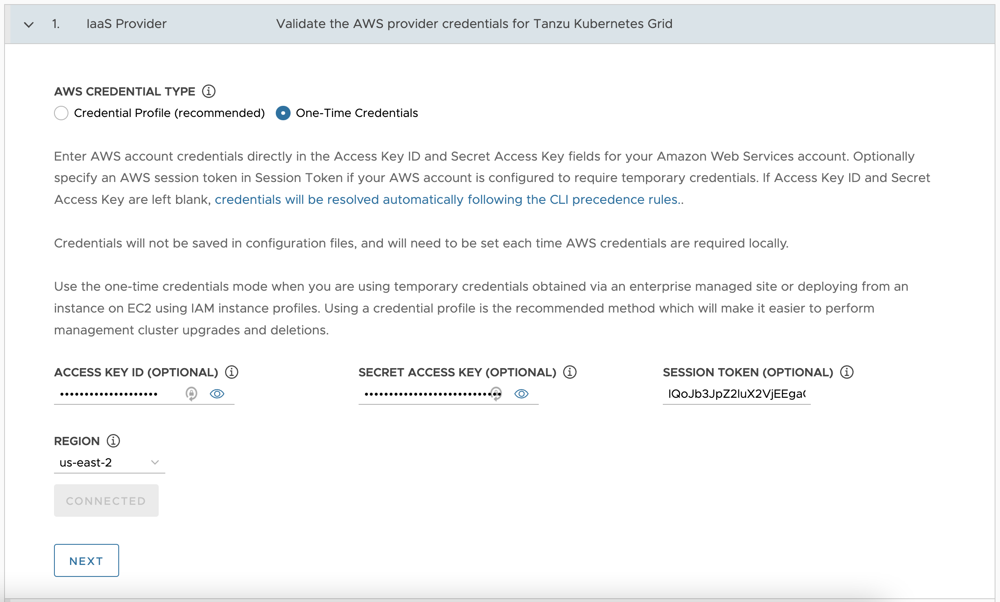
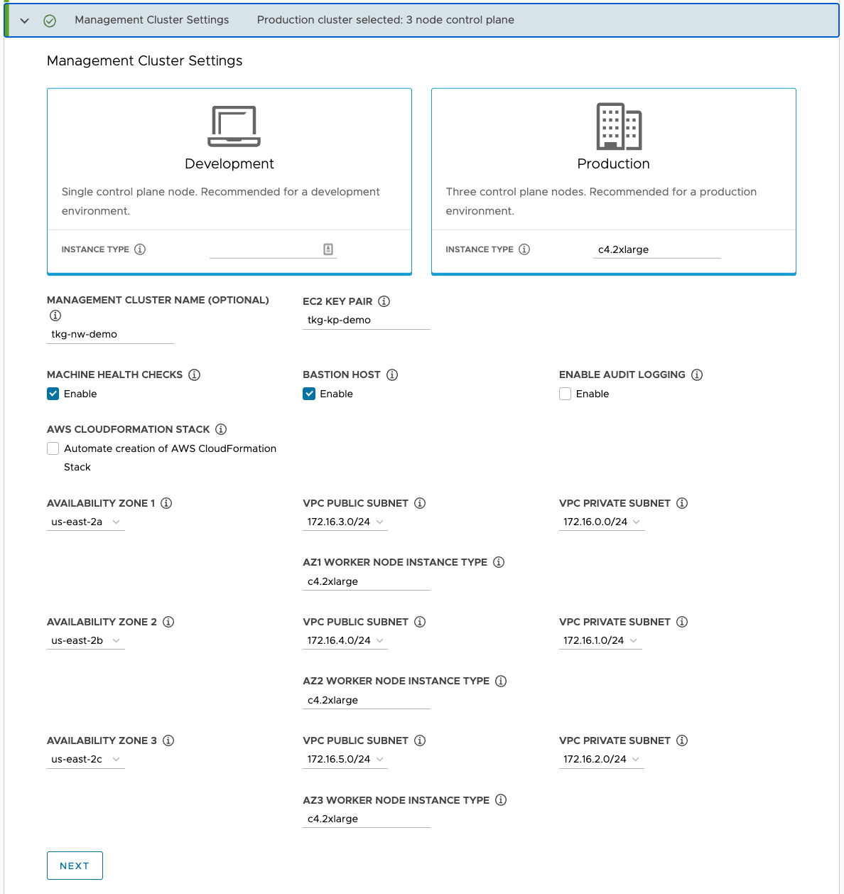

# Deploy Tanzu for Kubernetes Operations on AWS

This document outlines the steps for deploying VMware Tanzu for Kubernetes Operations on AWS. The deployment is based on the reference design provided in [VMware Tanzu for Kubernetes Operations on AWS Reference Design](../reference-designs/tko-on-aws.md).

## Prerequisites
Before deploying VMware Tanzu for Kubernetes Operations on AWS, ensure that the following are set up.

* **AWS Account**: An IAM user account with **administrative privileges**.
Choose an AWS region where the Tanzu Kubernetes Grid (TKG) AMIs exist. See [Supported AWS and Azure Regions](https://docs.vmware.com/en/VMware-Tanzu-Kubernetes-Grid/1.4/rn/VMware-Tanzu-Kubernetes-Grid-14-Release-Notes.html#aws-regions) for AWS regions.

* **AWS Resource Quotas**: Sufficient quotas to support both the management cluster and the workload clusters in your deployment. Otherwise, the cluster deployments will fail. Depending on the number of workload clusters you plan to deploy, you may need to increase the AWS services quotas from their default values. You will need to increase the quota in every region in which you deploy Tanzu Kubernetes Grid.
For more information on AWS services default quotas see [AWS service quotas](https://docs.aws.amazon.com/general/latest/gr/aws_service_limits.html) in the AWS documentation.

* **Bootstrap Machine with AWS CLI Installed**: The bootstrap machine can be a local device such as a laptop, or a virtual machine running in, for example, VMware Workstation or Fusion. Install the AWS CLI on the bootstrap machine. You can get the AWS CLI through a package manager such as Homebrew, apt-get, or by downloading the CLI from [AWS CLI](https://aws.amazon.com/cli/). You will use the bootstrap machine to create the AWS VPC and jumpbox.

* **VMware Cloud**: Access to [VMware Cloud]( https://customerconnect.vmware.com/login ) to download Tanzu CLI.

For additional information about preparing to deploy Tanzu Kubernetes Grid on AWS, see [Prepare to Deploy Management Clusters to Amazon EC2](https://docs.vmware.com/en/VMware-Tanzu-Kubernetes-Grid/1.4/vmware-tanzu-kubernetes-grid-14/GUID-mgmt-clusters-aws.html).

## Overview of the Deployment Steps

The following provides an overview of the major steps necessary to deploy Tanzu for Kubernetes Operations on AWS EC2. Each steps links to the section for detailed information.

1. [Set up AWS Infrastructure](#aws-infra).
2. [Create and Set Up a Jumpbox](#jumpbox).
3. [Prepare an External Identity Management](#idp).
4. [Install Tanzu Kubernetes Grid Management Cluster](#install-tkg).
5. [Examine the Management Cluster Deployment](#examine-cluster).
6. [Deploy Workload Clusters](#deploy-workload-cluster).
7. [Install and Configure Packages into Workload Clusters](#install-packages).
8. [Configure SaaS Services](#config-saas).

## <a id=aws-infra> </a> Set up AWS Infrastructure
The following describes the steps to create your AWS environment and configure your network. The instructions use AWS CLI. Follow the steps in the order provided.

 1. Create the AWS environment.

 	**Be sure to select a region that has at least three availability zones**.

 	<!-- /* cSpell:disable */ -->
 	```bash
	export AWS_ACCESS_KEY_ID=xx
	export AWS_SECRET_ACCESS_KEY=xx
	# Should be a region with at least 3 available AZs
	export AWS_REGION=us-west-2
	export AWS_PAGER=""
	```
	<!-- /* cSpell:enable */ -->

2. Define and create a working directory.
	<!-- /* cSpell:disable */ -->

	```bash
	WORKING_DIR="$(pwd)"/tkg-vpc
	mkdir -p $WORKING_DIR
	```
	<!-- /* cSpell:enable */ -->

3. Create the VPC. This deployment uses a single VPC for all clusters.

	**Note**: Beware that 172.17.0.0/16 is the default docker0 subnet.

	<!-- /* cSpell:disable */ -->
	```bash
	aws ec2 create-vpc --cidr-block 172.16.0.0/16 --tag-specifications 'ResourceType=vpc, Tags=[{Key=Name,Value=TKGVPC}]'  --output json > $WORKING_DIR/vpc

	# Create a second VPC like: aws ec2 create-vpc --cidr-block 172.18.0.0/16 --tag-specifications 'ResourceType=vpc, Tags=[{Key=Name,Value=TKGVPC-2}]' --output json > $WORKING_DIR/vpc2

	export vpcId="$(jq -r .Vpc.VpcId $WORKING_DIR/vpc)"
	# Verify you have a valid VPC ID
	echo $vpcId
	```
	<!-- /* cSpell:enable */ -->

4. For each VPC, create a public and private subnet in each AZ.

	<!-- /* cSpell:disable */ -->
	```
	aws ec2 create-subnet --vpc-id $vpcId --cidr-block 172.16.0.0/24 --availability-zone ${AWS_REGION}a --tag-specifications 'ResourceType=subnet, Tags=[{Key=Name,Value=priv-a}]' --output json > $WORKING_DIR/subnet-priv-a

	aws ec2 create-subnet --vpc-id $vpcId --cidr-block 172.16.1.0/24  --availability-zone ${AWS_REGION}b  --tag-specifications 'ResourceType=subnet, Tags=[{Key=Name,Value=priv-b}]' --output json > $WORKING_DIR/subnet-priv-b

	aws ec2 create-subnet --vpc-id $vpcId --cidr-block 172.16.2.0/24  --availability-zone ${AWS_REGION}c   --tag-specifications 'ResourceType=subnet, Tags=[{Key=Name,Value=priv-c}]' --output json > $WORKING_DIR/subnet-priv-c

	aws ec2 create-subnet --vpc-id $vpcId --cidr-block 172.16.3.0/24 --availability-zone ${AWS_REGION}a --tag-specifications 'ResourceType=subnet, Tags=[{Key=Name,Value=pub-a}]'  --output json > $WORKING_DIR/subnet-pub-a

	aws ec2 create-subnet --vpc-id $vpcId --cidr-block 172.16.4.0/24  --availability-zone ${AWS_REGION}b  --tag-specifications 'ResourceType=subnet, Tags=[{Key=Name,Value=pub-b}]'  --output json > $WORKING_DIR/subnet-pub-b

	aws ec2 create-subnet --vpc-id $vpcId --cidr-block 172.16.5.0/24  --availability-zone ${AWS_REGION}c   --tag-specifications 'ResourceType=subnet, Tags=[{Key=Name,Value=pub-c}]'  --output json > $WORKING_DIR/subnet-pub-c
	```
	<!-- /* cSpell:enable */ -->

5. For each of the public subnets, set `map-public-ip-on-launch`.

	<!-- /* cSpell:disable */ -->
	```
	# Set the public subnets to give them public IPs.
	for i in $WORKING_DIR/subnet-pub-*; do
   subnetId="$(jq -r .Subnet.SubnetId $i)"
   aws ec2 modify-subnet-attribute --subnet-id "$subnetId" --map-public-ip-on-launch
	done

	```
	<!-- /* cSpell:enable */ -->

6. Create the Internet and NAT gateways and attach them to the relevant subnets.

	<!-- /* cSpell:disable */ -->

	```bash
	aws ec2 create-internet-gateway  --output json > $WORKING_DIR/inet-gw
	aws ec2 create-tags --resources "$(jq -r .InternetGateway.InternetGatewayId  $WORKING_DIR/inet-gw)" --tags Key=Name,Value="tkg-inet-gw"

	aws ec2 attach-internet-gateway \
 	--internet-gateway-id "$(jq -r .InternetGateway.InternetGatewayId  $WORKING_DIR/inet-gw)"  \
 	--vpc-id "$vpcId"

	aws ec2 allocate-address > $WORKING_DIR/nat-eip
	aws ec2 create-nat-gateway --subnet $(jq -r .Subnet.SubnetId  $WORKING_DIR/subnet-pub-a) --allocation-id $(jq -r .AllocationId  $WORKING_DIR/nat-eip) --output json > $WORKING_DIR/nat-gw

	```
	<!-- /* cSpell:enable */ -->

7. If you have an existing transit gateway, you can skip the `create-transit-gateway` command and just feed the transit gateway ID into the `vpc-attachment` command. Otherwise, execute the following commands to create a new transit gateway.

	<!-- /* cSpell:disable */ -->
	```
	aws ec2 create-transit-gateway --description "For TKG Transit" > $WORKING_DIR/transit-gw
	aws ec2 create-transit-gateway-vpc-attachment --transit-gateway-id  $(jq -r .TransitGateway.TransitGatewayId $WORKING_DIR/transit-gw) --vpc-id $vpcId --subnet-ids $(jq -r .Subnet.SubnetId $WORKING_DIR/subnet-priv-a) --subnet-ids $(jq -r .Subnet.SubnetId $WORKING_DIR/subnet-priv-b) --subnet-ids $(jq -r .Subnet.SubnetId $WORKING_DIR/subnet-priv-c) --	output json > $WORKING_DIR/attachment_transit_gw
	```
	<!-- /* cSpell:enable */ -->

8. Create the routing tables.

	<!-- /* cSpell:disable */ -->
	```bash
	aws ec2 create-route-table --vpc-id  $vpcId --output json > $WORKING_DIR/priv-rt
	PRIV_RT_TABLE_ID="$(jq -r .RouteTable.RouteTableId $WORKING_DIR/priv-rt)"
	aws ec2 create-tags --resources $PRIV_RT_TABLE_ID --tags 'Key=Name,Value=tkgvpc-priv-rt'

	aws ec2 create-route \
 	--route-table-id "$PRIV_RT_TABLE_ID" \
	--destination-cidr-block "0.0.0.0/0" \
 	--nat-gateway-id $(jq -r .NatGateway.NatGatewayId $WORKING_DIR/nat-gw)

	# Route any corporate IPs through your transit gw
	aws ec2 create-route \
 	--route-table-id "$PRIV_RT_TABLE_ID" \
 	--destination-cidr-block "172.16.0.0/12" \
 	--transit-gateway-id $(jq -r .TransitGateway.TransitGatewayId $WORKING_DIR/transit-gw)

	for i in $WORKING_DIR/subnet-priv-*; do
   subnetId="$(jq -r .Subnet.SubnetId $i)"
   aws ec2 associate-route-table --subnet-id "$subnetId" --route-table-id $PRIV_RT_TABLE_ID --output json
	done

	aws ec2 create-route-table --vpc-id  $vpcId --output json > $WORKING_DIR/pub-rt
	PUB_RT_TABLE_ID="$(jq -r .RouteTable.RouteTableId $WORKING_DIR/pub-rt)"

	aws ec2 create-tags --resources $PUB_RT_TABLE_ID --tags 'Key=Name,Value=tkgvpc-pub-rt'

	aws ec2 create-route \
 	--route-table-id "$PUB_RT_TABLE_ID" \
 	--destination-cidr-block "0.0.0.0/0" \
 	--gateway-id $(jq -r .InternetGateway.InternetGatewayId $WORKING_DIR/inet-gw)

	# Route any corporate IPs through your transit gw
	aws ec2 create-route \
 	--route-table-id "$PRIV_RT_TABLE_ID" \
 	--destination-cidr-block "172.16.0.0/12" \
 	--transit-gateway-id $(jq -r .TransitGateway.TransitGatewayId $WORKING_DIR/transit-gw)

	for i in $WORKING_DIR/subnet-pub-*; do
   	subnetId="$(jq -r .Subnet.SubnetId $i)"
   aws ec2 associate-route-table --subnet-id "$subnetId" --route-table-id $PUB_RT_TABLE_ID --output json
	done
	```
	<!-- /* cSpell:enable */ -->


## <a id=jumpbox> </a> Create and Set Up a Jumpbox

After doing the network configuration, complete the steps described in this section to set up your jumpbox. You will download the Tanzu CLI to the jumpbox, which you will use to deploy the management cluster and workload clusters from the jumpbox. You also keep the Tanzu and Kubernetes configuration files for your deployments on your jumpbox.

1. Create a jumpbox.

	<!-- /* cSpell:disable */ -->

	```bash
	aws ec2 create-security-group --group-name "jumpbox-ssh" --description "To Jumpbox" --vpc-id "$vpcId" --output json > $WORKING_DIR/sg_jumpbox_ssh
	aws ec2 create-tags --resources $(jq -r .GroupId $WORKING_DIR/sg_jumpbox_ssh) --tags Key=Name,Value="jumpbox-ssh"
	# Allow ssh to jumpbox
	aws ec2 authorize-security-group-ingress --group-id  $(jq -r .GroupId $WORKING_DIR/sg_jumpbox_ssh) --protocol tcp --port 22 --cidr "0.0.0.0/0"

	# Save this file or use some team keypair already created
	aws ec2 create-key-pair --key-name tkg-kp --query 'KeyMaterial' --output text > tkgkp.pem
	chmod 400 tkgkp.pem

	# Find an AMI for your region https://cloud-images.ubuntu.com/locator/ec2/ (20.04)
	aws ec2 run-instances --image-id ami-036d46416a34a611c --count 1 --instance-type t2.medium --key-name tkg-kp --security-group-ids  $(jq -r .GroupId $WORKING_DIR/sg_jumpbox_ssh)   --subnet-id $(jq -r .Subnet.SubnetId $WORKING_DIR/subnet-pub-a)  --tag-specifications 'ResourceType=instance,Tags=[{Key=Name,Value=tkg-jumpbox}]' --block-device-mappings 'DeviceName=/dev/sda1,Ebs={VolumeSize=64}' > $WORKING_DIR/instance_jb_starting
	```
	<!-- /* cSpell:enable */ -->

2. Wait a few minutes for the instance to start. After it restarts, SSH to the jumpbox.

	<!-- /* cSpell:disable */ -->
	```bash
	aws ec2 describe-instances --instance-id $(jq -r '.Instances[0].InstanceId' $WORKING_DIR/instance_jb_starting) > $WORKING_DIR/instance_jb_started

	echo Public IP: $(jq -r '.Reservations.Instances[0].PublicIpAddress' $WORKING_DIR/instance_jb_started')

	ssh ubuntu@$(jq -r '.Reservations[0].Instances[0].PublicIpAddress' $WORKING_DIR/instance_jb_started) -i tkgkp.pem
	```
	<!-- /* cSpell:enable */ -->

3. Log in to the jumpbox to install the necessary packages and configurations. Then reboot.
	<!-- /* cSpell:disable */ -->
	```bash
	sudo apt update
	sudo apt install docker.io
	sudo apt install screen
	sudo adduser ubuntu docker
	sudo reboot
   ```
	<!-- /* cSpell:enable */ -->

4. Install Docker Engine on Ubuntu.  For installation instructions, see [Install Docker Engine on Ubuntu](https://docs.docker.com/engine/install/ubuntu/).

5. Download the Tanzu CLI and other utilities for Linux from the Tanzu Kubernetes Grid [Download Product](https://customerconnect.vmware.com/downloads/details?downloadGroup=TKG-140&productId=988&rPId=73652) site.

6. Copy the files and binaries to the jumpbox.

	<!-- /* cSpell:disable */ -->
	```bash
	scp -i tkgkp.pem tanzu-cli-bundle-linux-amd64.tar  kubectl-linux-v1.21.2+vmware.1.gz ubuntu@$(jq -r '.Reservations[0].Instances[0].PublicIpAddress' $WORKING_DIR/instance_jb_started):/home/ubuntu
	ssh -L 8080:localhost:8080 ubuntu@$(jq -r '.Reservations[0].Instances[0].PublicIpAddress' $WORKING_DIR/instance_jb_started) -i tkgkp.pem

	```
	<!-- /* cSpell:enable */ -->

7. Install the Tanzu CLI.

	Run the session in `screen` in case your SSH session is terminated. If your session is terminated, you can restart the session with `screen -r`.

	<!-- /* cSpell:disable */ -->		
	```bash
	screen
	tar -xvf tanzu-cli-bundle-linux-amd64.tar
	gunzip kubectl-linux-v1.21.2+vmware.1.gz
	sudo install kubectl-linux-v1.21.2+vmware.1 /usr/local/bin/kubectl
	cd cli/
	sudo install core/v1.4.0/tanzu-core-linux_amd64 /usr/local/bin/tanzu
	gunzip *.gz
	sudo install imgpkg-linux-amd64-v0.10.0+vmware.1 /usr/local/bin/imgpkg
	sudo install kapp-linux-amd64-v0.37.0+vmware.1 /usr/local/bin/kapp
	sudo install kbld-linux-amd64-v0.30.0+vmware.1 /usr/local/bin/kbld
	sudo install vendir-linux-amd64-v0.21.1+vmware.1 /usr/local/bin/vendir
	sudo install ytt-linux-amd64-v0.34.0+vmware.1 /usr/local/bin/ytt
	cd ..
	tanzu plugin install --local cli all
	```
	<!-- /* cSpell:enable */ -->

8. Create a custom file to place the Tanzu Kubernetes Grid management APIs on private load balancers:

	<!-- /* cSpell:disable */ -->
	```bash
	tanzu config init
	cat <<EOF > ~/.config/tanzu/tkg/providers/ytt/03_customizations/internal_lb.yaml
	#@ load("@ytt:overlay", "overlay")
	#@ load("@ytt:data", "data")

	#@overlay/match by=overlay.subset({"kind":"AWSCluster"})
	---
	apiVersion: infrastructure.cluster.x-k8s.io/v1alpha3
	kind: AWSCluster
	spec:
	#@overlay/match missing_ok=True
        controlPlaneLoadBalancer:
	#@overlay/match missing_ok=True
           scheme: "internal"

	EOF
	```

	Running the `tanzu config init` command for the first time creates the `~/.config/tanzu/tkg` subdirectory, which contains the Tanzu Kubernetes Grid configuration files.

	<!-- /* cSpell:enable */ -->

	For more information about ytt cluster overlays, see [ytt Overlays](https://docs.vmware.com/en/VMware-Tanzu-Kubernetes-Grid/1.4/vmware-tanzu-kubernetes-grid-14/GUID-tanzu-k8s-clusters-config-plans.html#ytt-overlays-4).

## <a id=idp></a> Prepare an External Identity Management
Tanzu Kubernetes Grid implements user authentication with Pinniped. Pinniped allows you to plug external OpenID Connect (OIDC) or LDAP identity providers (IDP) into Tanzu Kubernetes clusters, so that you can control user access to those clusters.

Pinniped is an open-source authentication service for Kubernetes clusters. If you use LDAP authentication, Pinniped uses Dex as the endpoint to connect to your upstream LDAP identity provider. If you use OIDC, Pinniped provides its own endpoint, so Dex is not required. Pinniped and Dex run automatically as in-cluster services in your management cluster.

You enable identity management during management cluster deployment. Therefore, ensure that you have an IDP/LDAP server setup before you do the Tanzu Kubernetes Grid management cluster installation.

If you don't have identity management configured, see [Configure Identity Management](https://docs.vmware.com/en/VMware-Tanzu-Kubernetes-Grid/1.4/vmware-tanzu-kubernetes-grid-14/GUID-mgmt-clusters-deploy-ui.html) for a sample IDP setup. Also see [Pinniped Docs](https://pinniped.dev/docs/) for information on Pinniped integration into Tanzu Kubernetes Grid with various OIDC providers and LDAPs.

## <a id=install-tkg></a> Deploy a Tanzu Kubernetes Grid Management Cluster

You can deploy a Tanzu Kubernetes Grid management cluster using one of the following methods:

- Run the Tanzu Kubernetes Grid installer, a wizard interface that guides you through the process of deploying a management cluster. See [Deploy Management Cluster from the Tanzu Kubernetes Grid Installer](#installer-ui).

OR

- Create and edit YAML configuration files, and use the configuration files to deploy a management cluster with the CLI commands. See [Deploy Management Clusters from a Configuration File](#config-cli).

### <a id=installer-ui> </a>Deploy a Management Cluster from the Tanzu Kubernetes Grid Installer

To deploy a management cluster from the Tanzu Kubernetes Grid installer interface:

1. From the jumpbox, execute the following command to launch the installer interface.
	<!-- /* cSpell:disable */ -->
	```
	tanzu management-cluster create --ui
	```
	<!-- /* cSpell:enable */ -->

2. Open a web browser and launch <!-- /* cSpell:disable */ --> ```localhost:8080 ```<!-- /* cSpell:enable */ --> on the machine running the SSH session.

	The Tanzu Kubernetes Grid installer interface displays.

	**Note**: The screens are provided to help you navigate the installer interface. Enter the values that are specific to your AWS setup.

3. Click **Deploy** on the **Amazon EC2** tile to start the management cluster setup on Amazon EC2.

	

4. For **IaaS Provider** settings, enter your **AWS Access Key ID**, **Secret Access Key**, **Session Token**, **Region**, and **SSH Key Name** and click **Next**.
	Select the region you selected in [Set up AWS infrastructure](#aws-infra).

	

5. For **VPC for AWS** settings, select the VPC ID you created in [Set up AWS infrastructure](#aws-infra) and click **Next**.

	

6. For **Management Cluster Settings**, select **Production**.

7. Enter the following specifications for the management cluster and click **Next**.

	- **Worker Node Instance Type**: Select the configuration for the worker node VM.
	- **Bastion Host**: Select Enable.
	- **Machine Health Checks**: Select Enable.
	- **Availability Zone**: Select the three availability zones for your region.

	

8. For **Kubernetes Network**, enter the Network CNI settings and click **Next**.

	Optionally, if you already have a proxy server setup and want to send outgoing HTTP(S) traffic from the management cluster to a proxy, toggle **Enable Proxy Settings**. For more information on how to configure proxy settings, see [Configure the Kubernetes Network and Proxies](https://docs.vmware.com/en/VMware-Tanzu-Kubernetes-Grid/1.4/vmware-tanzu-kubernetes-grid-14/GUID-mgmt-clusters-deploy-ui.html#configure-the-kubernetes-network-and-proxies-15).

	

9. For **Identity Management**, toggle **Enable Identity Management Settings** to configure your IDP and click **Next**.

	For more information about configuring the identity management settings, see [Configure Identity Management](https://docs.vmware.com/en/VMware-Tanzu-Kubernetes-Grid/1.4/vmware-tanzu-kubernetes-grid-14/GUID-mgmt-clusters-deploy-ui.html).

	

10. For **OS Image**, use the drop-down menu to select the OS and Kubernetes version image template to use for deploying Tanzu Kubernetes Grid VM. Select Ubuntu OS image (amd64) and click **Next**.


11. For **Register with Tanzu Mission Control**, you can skip to enter Tanzu Mission Control url since Tanzu Kubernetes Grid 1.4 management cluster is currently not supported to be registered with Tanzu Mission Control. See [Supported Environments for Registering Tanzu Kubernetes Clusters](https://docs.vmware.com/en/VMware-Tanzu-Mission-Control/services/tanzumc-concepts/GUID-3AE5F733-7FA7-4B34-8935-C25D41D15EF9.html#supported-environments-for-registering-tanzu-kubernetes-clusters-1).

12. For **CEIP Agreement**, select the check box to opt in to the VMware Customer Experience Improvement Program (CEIP), and click **Next**.

	A summary of the configuration displays.
	

13. Review the summary of the configuration.
14. Click **Deploy Management Cluster** to complete the installation.

	

### <a id=config-cli> </a>Deploy Management Clusters from a Configuration File

This section describes how to deploy a Tanzu Kubernetes Grid management cluster from a configuration file using Tanzu CLI. Skip this section if have already deployed a management cluster from the Tanzu Kubernetes Grid Installer UI.

Before creating a management cluster using the Tanzu CLI, define the base configuration for the cluster in a YAML file. You specify this file by using the `--file` option of the `tanzu management-cluster create` command.

To create a new Tanzu Kubernetes Grid management cluster, run the following command:

<!-- /* cSpell:disable */ -->
```bash
tanzu management-cluster create --file path/to/cluster-config-file.yaml
```
<!-- /* cSpell:enable */ -->

If you had previously deployed a management cluster, the `~/.config/tanzu/tkg/clusterconfigs` directory contains the management cluster configuration file.

To use the configuration file from a previous deployment, make a copy of the configuration file with a new name, open it in a text editor, and update the configuration. We recommend using a dedicated configuration file for each management cluster, with the configuration settings specific to a single infrastructure.

For more information about deploying a management cluster from a configuration file, see [Deploy Management Clusters from a Configuration File](https://docs.vmware.com/en/VMware-Tanzu-Kubernetes-Grid/1.4/vmware-tanzu-kubernetes-grid-14/GUID-mgmt-clusters-deploy-cli.html).  

## <a id=examine-cluster></a> Examine the Management Cluster Deployment

During the deployment of the management cluster, either from the installer interface or from a configuration file using Tanzu CLI, Tanzu Kubernetes Grid creates a temporary management cluster using a Kubernetes in Docker, `kind`, cluster on the jumpbox.

Tanzu Kubernetes Grid uses the temporary management cluster to provision the final management cluster on AWS. For information about how to examine and verify your Tanzu Kubernetes Grid management cluster deployment, see [Examine the Management Cluster Deployment](https://docs.vmware.com/en/VMware-Tanzu-Kubernetes-Grid/1.4/vmware-tanzu-kubernetes-grid-14/GUID-mgmt-clusters-verify-deployment.html).

## <a id=deploy-workload-cluster></a> Deploy Workload Clusters

After deploying the management cluster, you can create the workload clusters. The management cluster's context is updated automatically, so you can begin interacting with the management cluster.

Run the following command to create a basic workload cluster:

<!-- /* cSpell:disable */ -->
```bash

tanzu cluster create <cluster_name> --plan=prod
```
<!-- /* cSpell:enable */ -->

Workload clusters can be highly customized through YAML manifests and applied to the management cluster for deployment and lifecycle management. To generate a YAML template to update and modify to your own needs use the `--dry-run` switch. Edit the manifests to meet your requirements and apply them to the cluster.

Example:

<!-- /* cSpell:disable */ -->
```
tanzu cluster create <workload_cluster> --plan=prod --worker-machine-count 3 --dry-run
```
<!-- /* cSpell:enable */ -->

After the workload cluster is created, the current context changes to the new workload cluster.

For more information on cluster lifecycle and management, see [Manage Clusters](https://docs.vmware.com/en/VMware-Tanzu-Kubernetes-Grid/1.4/vmware-tanzu-kubernetes-grid-14/GUID-cluster-lifecycle-index.html).

### Troubleshooting Tips for Tanzu Kubernetes Grid

For tips to help you to troubleshoot common problems that you might encounter when installing Tanzu Kubernetes Grid and deploying Tanzu Kubernetes clusters, see [Troubleshooting Tips for Tanzu Kubernetes Grid](https://docs.vmware.com/en/VMware-Tanzu-Kubernetes-Grid/1.4/vmware-tanzu-kubernetes-grid-14/GUID-troubleshooting-tkg-tips.html?hWord=N4IghgNiBcIC4CcD2BXARhApgZwBZKThAF8g).

## <a id=install-packages></a> Install and Configure Packages into Workload Clusters

A package in Tanzu Kubernetes Grid is a collection of related software that supports or extends the core functionality of the Kubernetes cluster in which the package is installed. Tanzu Kubernetes Grid includes two types of packages, core packages and user-managed packages. For more information about packages in Tanzu Kubernetes Grid, see [Install and Configure Packages](https://docs.vmware.com/en/VMware-Tanzu-Kubernetes-Grid/1.4/vmware-tanzu-kubernetes-grid-14/GUID-packages-index.html).

### Core Packages

Tanzu Kubernetes Grid automatically installs the core packages during cluster creation. For more information about core packages, see [Core Packages](https://docs.vmware.com/en/VMware-Tanzu-Kubernetes-Grid/1.4/vmware-tanzu-kubernetes-grid-14/GUID-packages-core-index.html).

### User-Managed Packages

A user-managed package is an optional component of a Kubernetes cluster that you can install and manage with the Tanzu CLI. These packages are installed after cluster creation. User-managed packages are grouped into package repositories in the Tanzu CLI. If a package repository that contains user-managed packages is available in the target cluster, you can use the Tanzu CLI to install and manage any of the packages from that repository.   

Using the Tanzu CLI, you can install user-managed packages from the built-in `tanzu-standard` package repository or from package repositories that you add to your target cluster. From the `tanzu-standard` package repository, you can install the Cert Manager, Contour, External DNS, Fluent Bit, Grafana, Harbor, Multus CNI, and Prometheus packages. For more information about user-managed packages, see [User-Managed Packages](https://docs.vmware.com/en/VMware-Tanzu-Kubernetes-Grid/1.4/vmware-tanzu-kubernetes-grid-14/GUID-packages-cli-reference-packages.html).

We recommend installing the following packages:

* [Installing Cert Manager](https://docs.vmware.com/en/VMware-Tanzu-Kubernetes-Grid/1.4/vmware-tanzu-kubernetes-grid-14/GUID-packages-cert-manager.html)

* [Implementing Ingress Control with Contour](https://docs.vmware.com/en/VMware-Tanzu-Kubernetes-Grid/1.4/vmware-tanzu-kubernetes-grid-14/GUID-packages-ingress-contour.html)

* [Implementing Log Forwarding with Fluent Bit](https://docs.vmware.com/en/VMware-Tanzu-Kubernetes-Grid/1.4/vmware-tanzu-kubernetes-grid-14/GUID-packages-logging-fluentbit.html)

* [Implementing Monitoring with Prometheus and Grafana](https://docs.vmware.com/en/VMware-Tanzu-Kubernetes-Grid/1.4/vmware-tanzu-kubernetes-grid-14/GUID-packages-monitoring.html)

* [Implementing Multiple Pod Network Interfaces with Multus](https://docs.vmware.com/en/VMware-Tanzu-Kubernetes-Grid/1.4/vmware-tanzu-kubernetes-grid-14/GUID-packages-cni-multus.html)

* [Implementing Service Discovery with ExternalDNS](https://docs.vmware.com/en/VMware-Tanzu-Kubernetes-Grid/1.4/vmware-tanzu-kubernetes-grid-14/GUID-packages-external-dns.html)

* [Deploying Harbor Registry as a Shared Service](https://docs.vmware.com/en/VMware-Tanzu-Kubernetes-Grid/1.4/vmware-tanzu-kubernetes-grid-14/GUID-packages-harbor-registry.html)

	If Harbor is required to take on a heavy load and store large images into the registry, you can install Harbor into a separate workload cluster.  

## <a id=config-saas></a> Configure SaaS Services

The following VMware SaaS services provide additional Kubernetes lifecycle management, observability, and service mesh features.

* Tanzu Mission Control (TMC)
* Tanzu Observability (TO)
* Tanzu Service Mesh (TSM)

For configuration information, see [Configure SaaS Services](tko-saas-services.md).

## <a id=cluster-mgmt> </a> Delete Clusters
The procedures in this section are optional. They are provided in case you want to clean up your production or lab environment.

### Delete a Workload Cluster

To delete a provisioned workload first set your context back to the management cluster.

<!-- /* cSpell:disable */ -->
```bash
kubectl config use-context [mgmt_cluster_name]-admin@[mgmt_cluster_name]

```
<!-- /* cSpell:enable */ -->

From the management cluster context run:

<!-- /* cSpell:disable */ -->
```bash
tanzu cluster delete <cluster_name>
```
<!-- /* cSpell:enable */ -->

### Delete a Management Cluster

Use this procedure to delete the management cluster as well as all of the AWS objects Tanzu Kubernetes Grid created such as VPC, subnets and NAT Gateways.

**Note**: Be sure to wait until all the workload clusters have been reconciled before deleting the management cluster or infrastructure will need to be manually cleaned up.

Running the following command will delete the objects.

<!-- /* cSpell:disable */ -->
```bash
tanzu cluster delete <management-cluster-name>
```
<!-- /* cSpell:enable */ -->


## <a id=logs></a> Logs and Troubleshooting
For information about how to find the Tanzu Kubernetes Grid logs, how to troubleshoot frequently encountered Tanzu Kubernetes Grid issues, and how to use the Crash Recovery and Diagnostics tool, see [Logs and Troubleshooting](https://docs.vmware.com/en/VMware-Tanzu-Kubernetes-Grid/1.4/vmware-tanzu-kubernetes-grid-14/GUID-troubleshooting-tkg-index.html).

 
