# Deploy Tanzu for Kubernetes Operations on VMware Cloud on AWS

This document provides step-by-step instructions for deploying Tanzu Kubernetes Operations on VMware Cloud on AWS.

The scope of the document is limited to providing the deployment steps based on the reference design in [VMware Tanzu for Kubernetes Operations on VMware Cloud on AWS Reference Design](../reference-designs/tko-on-vmc-aws.md).

## Deploying with VMware Service Installer for Tanzu
 
You can use VMware Service Installer for VMware Tanzu to automate this deployment.
 
VMware Service Installer for Tanzu automates the deployment of the reference designs for Tanzu for Kubernetes Operations. It uses best practices for deploying and configuring the required Tanzu for Kubernetes Operations components.
 
To use Service Installer to automate this deployment, see [Deploying VMware Tanzu for Kubernetes Operations on VMware Cloud on AWS Using Service Installer for VMware Tanzu](https://docs.vmware.com/en/Service-Installer-for-VMware-Tanzu/1.3/service-installer/GUID-VMware%20Cloud%20on%20AWS%20-%20VMC-TKOonVMConAWS.html).
 
Alternatively, if you decide to manually deploy each component, follow the steps provided in this document.

## Prerequisites
These instructions assume that you have the following set up:

* VMware Cloud subscription
* SDDC deployment
* Access to VMware vCenter Server over HTTPs
* NTP configured on all VMware ESXi hosts and vCenter Server

## Supported Component Matrix

|**Software Components**|**Version**|
| --- | --- |
|Tanzu Kubernetes Grid|1.5.1|
|VMware Cloud on AWS SDDC Version|1.16 and later|
|NSX Advanced Load Balancer|20.1.7|

To verify the interoperability of other versions and products, use the [VMware Interoperability Matrix](https://interopmatrix.vmware.com/Interoperability?col=551,5305&row=648,&row=1,%262,%26789).

## Prepare the Environment for Deploying Tanzu for Kubernetes Operations

Before deploying Tanzu Kubernetes Operations on VMC on AWS, ensure that your environment is set up as described in the following:

- [General Requirements](#genreq)
- [Network Requirements](#netreq)
- [Firewall Requirements](#fwreq)
- [Resource Pools and VM Folders](#resource-pools-and-vm-folders)
- [Subnet and CIDR Examples](#subnet-and-cidr-examples)

### <a id="genreq"> </a> General Requirements

Your environment should meet the following general requirements:

- SDDC v1.16 or later deployed in VMC on AWS.
- Your SDDC has the following objects in place:
  - Dedicated resource pools and VM folders for collecting Tanzu Kubernetes Grid and NSX Advanced Load Balancer VMs. Refer to the Resource Pools and VM Folders section for more information.
  - NSX Advanced Load Balancer 20.1.7 OVA downloaded from the [customer connect](https://customerconnect.vmware.com/home?bmctx=89E60DF848C641FD518EB9F6B9A6E5334F602FA3A762B409625CD531863AC847&contextType=external&username=string&password=secure_string&challenge_url=https:%2F%2Fcustomerconnect.vmware.com%2Fhome&request_id=-7975651889850440054&authn_try_count=0&locale=en_GB&resource_url=https%253A%252F%252Fcustomerconnect.vmware.com%252Fweb%252Fvmware%252Fchecksession) portal and readily available for deployment.

  - A content library to store NSX Advanced Load Balancer Controller and service engine OVA templates.  

### <a id="netreq"> </a> Network Requirements

Create NSX-T logical segments for deploying Tanzu for Kubernetes Operations components as per [Network Recommendations](../reference-designs/tko-on-vmc-aws.md#network-recommendations) defined in the reference architecture.

### <a id="fwreq"> </a> Firewall Requirements

Ensure that the firewall is set up as described in [Firewall Recommendations](../reference-designs/tko-on-vmc-aws.md#a-idfirewallafirewall-recommendations).

### <a id="resource-pools-and-vm-folders"> </a> Resource Pools and VM Folders

The following table shows sample entries of the resource pools and folders that you should create in your SDDC.

|**Resource Type**|**Resource Pool Name**|**Sample Folder Name**|
| --- | --- | --- |
|NSX Advanced Load Balancer Components|<p>NSX-Advanced Load Balancer</p><p></p>|NSX-Advanced Load Balancer-VMS|
|TKG Management Components|TKG-Management|TKG-Mgmt-VMS|
|TKG Shared Services Components|TKG-Shared-Services|TKG-Shared-Services-VMS|
|TKG Workload Components|TKG-Workload|TKG-Workload-VMS|

### <a id=subnet-and-cidr-examples> </a> Subnet and CIDR Examples

For the purpose of demonstration, this document uses the following subnet CIDRs for Tanzu for Kubernetes Operations deployment.

|**Network Type**|**Segment Name**|**Gateway CIDR**|**DHCP Pool**|**NSX Advanced Load Balancer IP Pool**|
| --- | --- | --- | --- | --- |
|NSX ALB Mgmt Network|NSX-ALB-Mgmt|192.168.11.1/27|192.168.11.15 - 192.168.11.20|192.168.11.21 - 192.168.11.30|
|TKG Management Network|TKG-Management|192.168.12.1/24|192.168.12.2 - 192.168.12.251|NA|
|TKG Workload Network|TKG-Workload-PG01|192.168.13.1/24|192.168.13.2 - 192.168.13.251|NA|
|TKG Cluster VIP Network|TKG-Cluster-VIP|192.168.14.1/26|NA|192.168.14.2 - 192.168.14.60|
|TKG Mgmt VIP Network|TKG-SS-VIP|192.168.15.1/26|NA|192.168.15.2 - 192.168.15.60|
|TKG Workload VIP Network|TKG-Workload-VIP|192.168.16.1/26|NA|192.168.16.2 - 192.168.16.60|
|TKG Shared Services Network|TKG-Shared-Service|192.168.17.1/24|192.168.17.2 - 192.168.17.251||

## Deployment Overview

The high-level steps for deploying Tanzu for Kubernetes Operation on VMware Cloud on AWS are as follows:

1. [Deploy and Configure NSX Advanced Load Balancer](#dep-config-nsxalb)
2. [Deploy and Configure Tanzu Kubernetes Grid](#deploy-config-tkg)
3. [Deploy Tanzu Kubernetes Grid Management Cluster](#deploy-mgmt-cluster)
4. [Register Management Cluster with Tanzu Mission Control](#tmc-integration)
5. [Deploy and Configure Shared Services Workload Cluster](#set-up-shared-cluster)
6. [Deploy Tanzu Kubernetes Clusters (Workload Cluster)](#deploy-workload-cluster)
7. [Integrate Tanzu Kubernetes Clusters with Tanzu Observability](#integrate-to)
8. [Integrate Tanzu Kubernetes Clusters with Tanzu Service Mesh](#integrate-tsm)
9. [Deploy User-Managed Packages on Tanzu Kubernetes Grid Clusters](#deploy-user-managed-packages)

## <a id="dep-config-nsxalb"> </a> Deploy and Configure NSX Advanced Load Balancer

For the purpose of demonstration, this document describes how to deploy NSX Advanced Load Balancer as a cluster of three nodes. After the first node is deployed and configured, two more nodes are deployed to form the cluster.

The following IP addresses are reserved for NSX Advanced Load Balancer:

|**Controller Node**|**IP Address**|**FQDN**|
| --- | --- | --- |
|Node01 (Primary)|192.168.11.11|alb0101.tanzu.lab|
|Node02 (Secondary)|192.168.11.12|alb02.tanzu.lab|
|Node03 (Secondary) |192.168.11.13|alb03.tanzu.lab|
|Controller Cluster IP|192.168.11.10|alb.tanzu.lab|

To deploy NSX Advanced Load Balancer controller nodes:

1. Log in to the vCenter server from the vSphere client.

2. Select the cluster where you want to deploy the NSX Advanced Load Balancer controller node.

3. Right-click the cluster and invoke the **Deploy OVF Template** wizard.

4. Follow the wizard to configure the following:

    - Set the **VM Name** and **Folder Location**.
    - Select the **NSX-Advanced Load Balancer** resource pool as a compute resource.
    - Select the datastore for the controller node deployment.
    - Select the **NSX-Advanced Load Balancer-Mgmt** port group for the Management Network.
    - Customize the configuration by providing the **Management Interface IP Address**, **Subnet Mask**, and **Default Gateway**. The remaining fields are optional and can be left blank.

After the controller VM is deployed and powered on, connect to the URL for the node and configure the node for your Tanzu Kubernetes Grid environment as follows:

1. Create the administrator account by setting the password and optional email address.

    

2. Configure System Settings by specifying the backup passphrase and DNS information.

    

3. (Optional) Configure **Email/SMTP**

    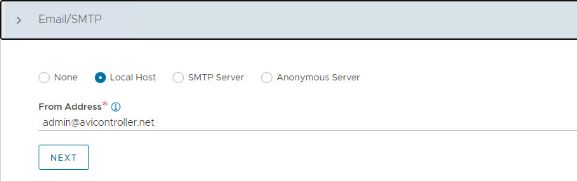

4. Configure **Multi-Tenant** settings as follows:

      - **IP Route Domain:** Per tenant IP route domain.
      - **Service Engine Context:** Tenant context, (not shared across tenants).

    

5. Click **Save** to complete the post-deployment configuration wizard.

If you did not select the **Setup Cloud After** option before saving, the initial configuration wizard exits. The Cloud configuration window does not automatically launch and you are directed to a Dashboard view on the controller.

### Configure No Orchestrator Cloud

1. To configure the No Orchestrator Cloud, navigate to the **Infrastructure > Clouds** tab.

2. Click **Create** and select **No Orchestrator** from the dropdown list.

    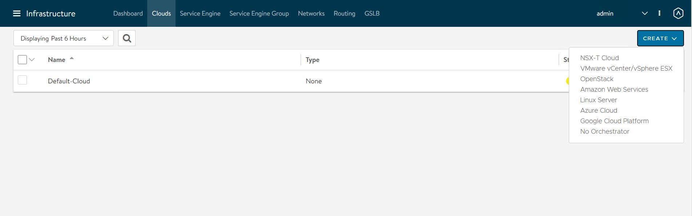

3. Provide a name for the cloud and click **Next** to continue.

    

4. Enable IPv4 DHCP in the cloud settings and click **Save** to complete the new cloud creation wizard.

    

After the cloud is created, ensure that the health status of the cloud is reporting green.


### Configure Licensing

Tanzu for Kubernetes Operations is bundled with a license for NSX Advanced Load Balancer Enterprise. To configure licensing, navigate to the **Administration > Settings > Licensing** and apply the license key.


**Note:** If you have a license file instead of a license key, assign the license by clicking on the **Upload from Computer** option.

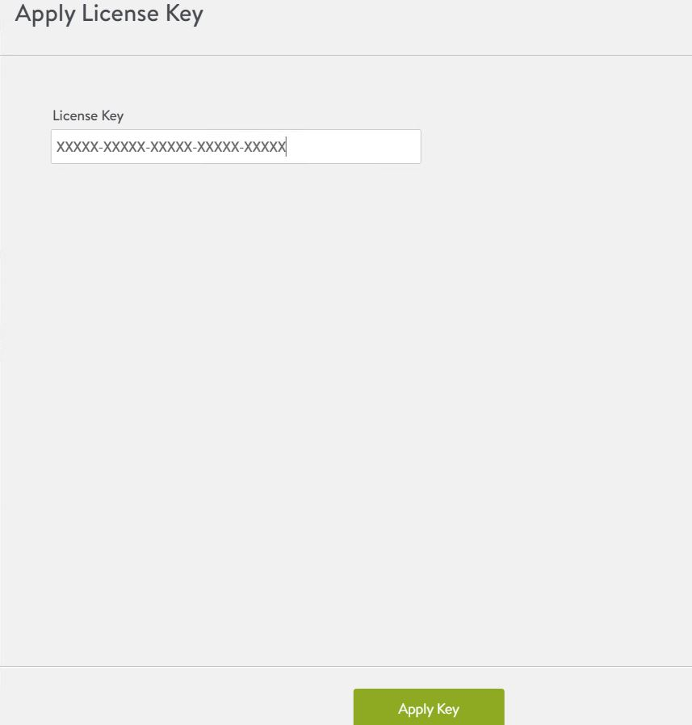

### Configure NTP Settings

Configure NTP settings if you want to use an internal NTP server. To configure NTP settings, navigate to the **Administration > Settings > DNS/NTP** page.

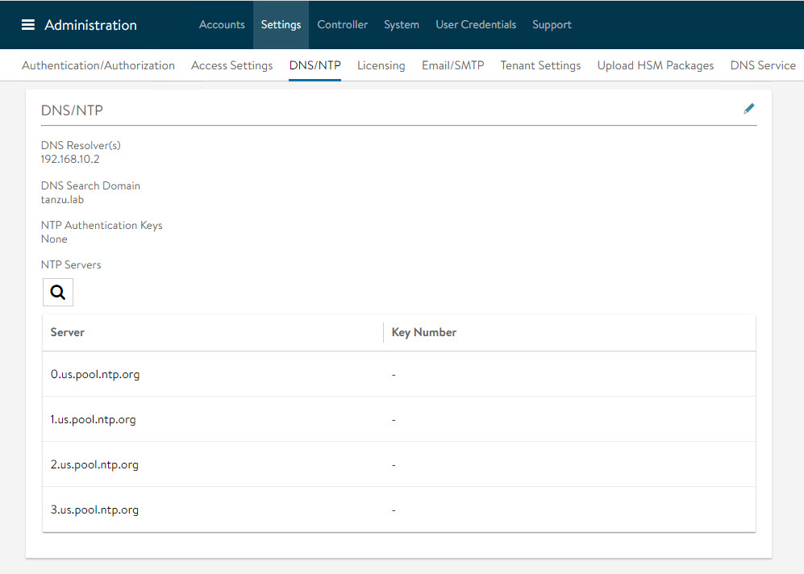

Edit the settings using the pencil icon to specify the NTP server that you want to use and save the settings.


### Configure NSX Advanced Load Balancer Controller Cluster

In a production environment, VMware recommends that you deploy additional controller nodes and configure the controller cluster for high availability and disaster recovery. Adding two additional nodes to create a 3-node cluster provides node-level redundancy for the controller and also maximizes performance for CPU-intensive analytics functions.

To run a 3-node controller cluster, you deploy the first node,  perform the initial configuration, and set the cluster IP address. After that, you deploy and power on two more Controller VMs, but you must not run the initial configuration wizard or change the admin password for these controller VMs. The configuration of the first controller VM is assigned to the two new controller VMs.

Repeat the steps provided in the [Deploy NSX Advanced Load Balancer Controller](#dep-config-nsxalb) section to deploy additional controllers.

1. To configure the controller cluster, navigate to the **Administration > Controller > Nodes** page and click **Edit**.

   

2. Specify the name for the controller cluster and set the **Cluster IP**. This IP address should be from the NSX Advanced Load Balancer management network.

3. Under **Cluster Nodes**, specify the IP addresses of the two additional controllers that you have deployed. Optionally, you can configure the name for the controllers.

4. Click **Save** to complete the cluster configuration wizard.

    

After you click **Save**, the controller cluster setup starts, and the controller nodes are rebooted in the process. It takes approximately 10-15 minutes for cluster formation to complete.

You will be automatically logged out of the controller node where you are currently logged in. On entering the cluster IP address in the browser, you can see details about the cluster formation task.


**Note:** Once the controller cluster is deployed, you must use the IP address of the controller cluster, not the IP address of the individual controller node, for any further configuration.

Connect to the NSX Advanced Load Balancer controller cluster IP/FQDN and ensure that all controller nodes are in a healthy state.


The first controller of the cluster receives the "Leader" role. The second and third controllers will work as "Followers".

### Change NSX Advanced Load Balancer Portal Certificate

The controller must send a certificate to clients to establish secure communication. This certificate must have a Subject Alternative Name (SAN) that matches the NSX Advanced Load Balancer controller cluster hostname or IP address.

The controller has a default self-signed certificate, but this certificate does not have the correct SAN. You must replace it with a valid or self-signed certificate that has the correct SAN. You can create a self-signed certificate or upload a CA-signed certificate.

For the purpose of the demonstration, this document uses a self-signed certificate.

1. To replace the default certificate, navigate to the **Templates > Security > SSL/TLS Certificate > Create** and select **Controller Certificate**.

    

2. In the **New Certificate (SSL/TLS)** window,enter a name for the certificate and set the type to **Self Signed**.

3. Enter the following details:

   - **Common Name** - Specify the fully-qualified site name. For the site to be considered trusted, this entry must match the hostname that the client entered in the browser.
   - **Subject Alternate Name (SAN)** - Enter the cluster IP address or FQDN of the controller cluster nodes.
   - **Algorithm** - Select either EC or RSA.
   - **Key Size**

4. Click **Save** to save the certificate.

    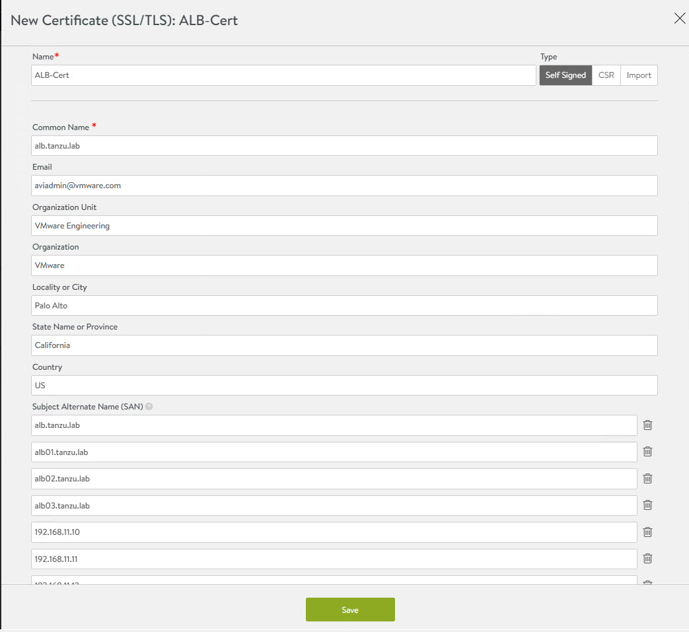

5. To change the NSX Advanced Load Balancer portal certificate, navigate to the **Administration **System Access Settings**> Settings > Access Settings** page. Click the pencil icon to edit the settings.

    

6. Under SSL/TLS Certificate, remove the existing default certificates. From the drop-down menu, select the newly created certificate and click **Save**.

    

7. Refresh the controller portal from the browser and accept the newly created self-signed certificate. Ensure that the certificate reflects the updated information in the browser.

### Export NSX Advanced Load Balancer Certificate

After the certificate is created, export the certificate thumbprint. The thumbprint will be required later when you configure the Tanzu Kubernetes Grid Management cluster.

1.  To export the certificate, navigate to the **Templates > Security > SSL/TLS Certificate** page and export the certificate by clicking **Export**. 

2. In the **Export Certificate** page, click **Copy to clipboard** against the certificate. Do not copy the key. Save the copied certificate to use later when you enable workload management.

    

### Configure Service Engine Groups

Tanzu for Kubernetes Operations deployment is based on the use of distinct Service Engine Groups (SEG) for the Tanzu Kubernetes Grid management and workload clusters. The service engines for the management cluster are deployed in the Tanzu Kubernetes Grid management SEG, and the service engines for Tanzu Kubernetes Grid workload clusters are deployed in the Tanzu Kubernetes Grid workload SEG.

**TKG-Mgmt-SEG**: The Service Engines part of this Service Engine Group hosts:

- Virtual services for all load balancer functionalities requested by the Tanzu Kubernetes Grid management and shared services clusters.
- Virtual services that load balances control plane nodes of all Tanzu Kubernetes Grid clusters.

**TKG-WLD01-SEG**: The Service Engines part of this Service Engine Group hosts virtual services for all load balancer functionalities requested by Tanzu Kubernetes Grid workload clusters mapped to this SE group.

**Note:**

- Based on your requirements, you can create additional Service Engine Groups for the workload clusters.
- Multiple workload clusters can be mapped to a single SE group.
- A Tanzu Kubernetes Grid cluster can be mapped to only one SE group for application load balancer services.

To create and configure a new SEG, 

1. Go to **Infrastructure > Service Engine Group** and click **Create**.

    

2. Provide a name for the SEG and configure the following settings:

   - **High Availability Mode:** Elastic HA N + M (buffer)
   - **VS Placement across SEs:** Compact
   - **Virtual Service per Service Engine:** 10
   - **SE Self-Election:** Selected

    

Repeat the steps to create a SEG for the Tanzu Kubernetes Grid workload cluster. You should have created two Service Engine Groups.

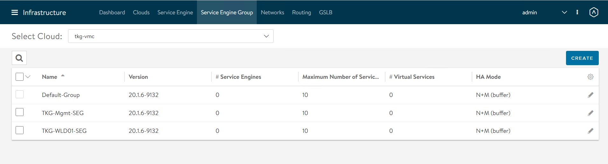

### Configure VIP Networks

As per the reference architecture, Tanzu for Kubernetes Operations deployment makes use of three VIP networks:

- **TKG-Cluster-VIP:** This network provides high availability for the control plane nodes of the Tanzu Kubernetes Grid management cluster, shared services cluster, and the workload clusters.
- **Shared-Services VIP:** This network provides VIP for the extensions (Envoy, Contour, etc) deployed in the shared services cluster.
- **TKG-Workload-VIP:** This network provides VIP for the applications (of type load balancer) deployed in the workload clusters.

**Note:** You can provision additional VIP networks for the network traffic separation for the applications deployed in various workload clusters. This will be a day-2 operation.

To create and configure the VIP networks, 

1. Go to the **Infrastructure > Networks** tab and click **Create**. Check that the VIP networks are being created under the correct cloud.

    

2. Provide a name for the VIP network and uncheck the **DHCP Enabled** and **IPv6 Auto-Configuration** options.

    

3. Click **Add Subnet** and configure the following:

   - **IP Subnet:** Subnet CIDR of the VIP network.
   - **Static IP Address Pool:** Range of IP addresses that will be assigned to service engines and the virtual services that will be deployed.

4. Click **Save** to continue.

    

5. Click **Save** again to finish the network configuration wizard.

    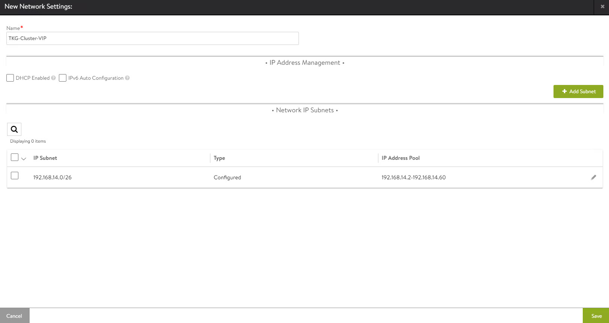

Repeat the steps to create additional VIP networks.


### Configure Routing

After configuring the VIP networks, set the default routes for all VIP/data networks. The following table lists the default routes used in the current environment.

|**Network Name**|**Gateway Subnet Mask**|**Next Hop**|
| --- | --- | --- |
|TKG-Cluster-VIP|0.0.0.0/0|192.168.14.1|
|TKG-SS-VIP|0.0.0.0/0|192.168.15.1|
|Workload-VIP|0.0.0.0/0|192.168.16.1|

**Note:** Change the gateway subnet addresses to match your network configuration.

1. Go to the **Routing** page and click **Create**.

    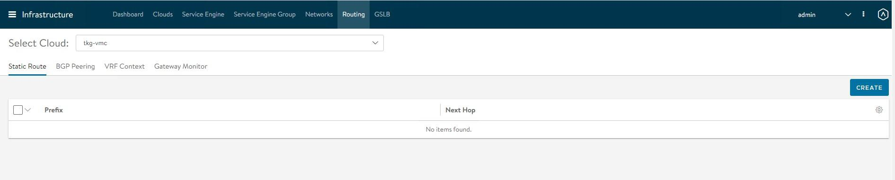

2. Add default routes for the VIP networks.

    

Repeat the process to configure additional routing. A total of three default gateways are configured.


### Configuring IPAM & DNS Profiles

IPAM is required to allocate virtual IP addresses when virtual services are created. NSX Advanced Load Balancer provides IPAM service for TKG Cluster VIP Network, TKG Mgmt VIP Network and TKG Workload VIP Network.

1. To create an IPAM profile, navigate to the **Templates > Profiles > IPAM/DNS Profiles** page, click **Create**, and select **IPAM Profile**.

    

2. Create the profile using the values shown in the following table.

    |**Parameter**|**Value**|
    | --- | --- |
    |Name|Advanced Load Balancer-TKG-IPAM|
    |Type|AVI Vintage IPAM|
    |Cloud for Usable Networks|tkg-vmc|
    |Usable Networks|<p>TKG-Cluster-VIP</p><p>TKG-SS-VIP</p><p>Workload-VIP</p>|

3. Click **Save** to finish the IPAM creation wizard.

    

4. To create a DNS profile, click **Create** again and select **DNS Profile**.

    - Provide a name for the DNS Profile and select **AVI Vantage DNS** as the profile type.
    - Under **Domain Name**, specify the domain that you want to use with NSX Advanced Load Balancer.
   - Optionally, set a new value in **Override Record TTL for this domain**. The default value for all domains is 30 seconds.

    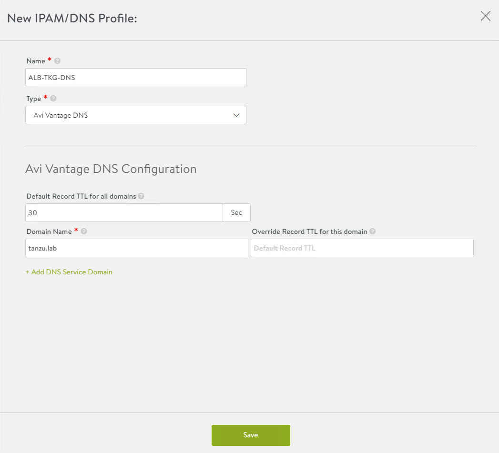

    The newly created IPAM and DNS profiles must be associated with the cloud so they can be leveraged by the NSX Advanced Load Balancer objects created under that cloud.

To assign the IPAM and DNS profile to the cloud, go to the **Infrastructure > Cloud** page and edit the cloud configuration.

1. Under IPAM Profile, select the IPAM profile.

2. Under DNS Profile, select the DNS profile and save the settings.


After configuring the IPAM and DNS profiles, verify that the status of the cloud is green.

### Deploy and Configure Service Engine

Deploying a service engine is a manual process in VMC on AWS environment because NSX Advanced Load Balancer is deployed in the no-orchestrator mode. In this mode, NSX Advanced Load Balancer does not have access to the ESX management plane. Access to the ESX management plane is required for automated service engine deployment.

To download the service engine image for deployment, navigate to the **Infrastructure > Clouds** tab, select your cloud, click the download icon, and select type as OVA.


Wait a few minutes for the image generating task to finish. When the task is finished, the resulting image file is immediately downloaded.

**Import the Service Engine Image File into the Content Library**

You can use the downloaded OVA file directly to create a service engine VM, but bear in mind that this approach requires you to upload the image to vCenter every time you need to create a new service engine VM.

For faster deployment, import the service engine OVA image into the content library and use the "deploy from template" wizard to create new service engine VMs.

**Generate the Cluster UUID and Authentication Token**

Before deploying a service engine VM, you must obtain a cluster UUID and generate an authentication token. A cluster UUID facilitates integrating the service engine with NSX Advanced Load Balancer Controller. Authentication between the two is performed via an authentication token.

To generate a cluster UUID and auth token, navigate to **Infrastructure > Clouds** and click the key icon in front of the cloud that you have created. This opens a new popup window containing both the cluster UUID and the auth token.

**Note:** You need a new auth token every time a new Service Engine instance is deployed.


**Deploy Service Engine VMs for Tanzu Kubernetes Grid Management Cluster**

1. To deploy a service engine VM, log in to the vSphere client and navigate to **Menu > Content Library > Your Content Library**. Navigate to the **Templates** tab and select the service engine template, right-click it, and choose **New VM from this template**.

2. Follow the VM creation wizard. On the networks page, select the management and data networks for the SE VM.

   The Management network label is mapped to the NSX Advanced Load Balancer Management logical segment. The remaining network labels (Data Network 1 – 9) are connected to any of the front-end virtual service’s network or back-end server’s logical network as required. It is left disconnected if not required.

   The service engine for the Tanzu Kubernetes Grid management cluster is connected to the following networks:

   - Management: NSX-Advanced Load Balancer-Mgmt
   - Data Network 1: TKG-Cluster-VIP
   - Data Network 2: TKG-SS-VIP
   - Data Network 3: TKG-Management
   - Data Network 4: TKG-Shared-Services

    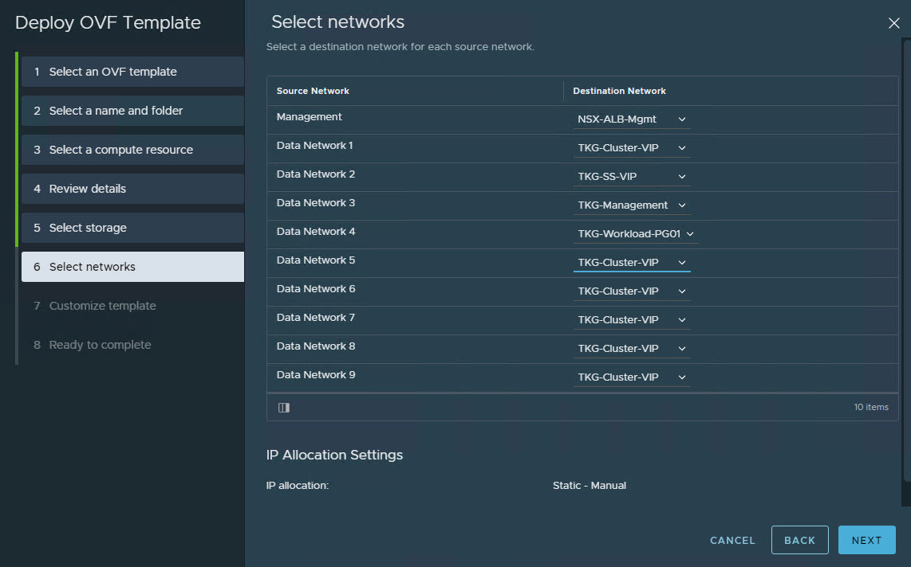

3. Provide the cluster UUID and authentication token that you generated earlier on the **Customize template** page. Configure the service engine VM management network settings as well.

    

1. Repeat the steps to deploy an additional service engine VM for the Tanzu Kubernetes Grid management cluster.

By default, service engine VMs are created in the default Service Engine Group.


To map the service engine VMs to the correct Service Engine Group, 

1. Go to the **Infrastructure > Service Engine** tab, select your cloud, and click the pencil icon to update the settings and link the service engine to the correct SEG.

    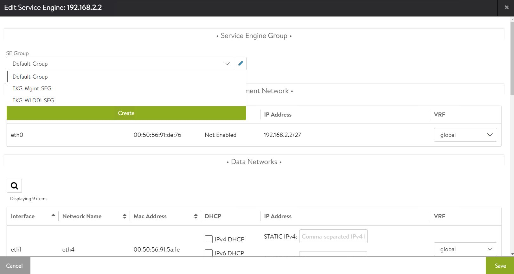

2. Repeat the step for all service engine VMs.

On the **Service Engine Group** page, you can confirm the association of service engines with Service Engine Groups.


**Deploy Service Engines for Tanzu Kubernetes Grid workload cluster**

Service engine VMs deployed for Tanzu Kubernetes Grid workload cluster are connected to the following networks:

- Management: NSX-Advanced Load Balancer-Mgmt
- Data Network 1: Workload-VIP
- Data Network 2: TKG-Workload-PG01


You need to deploy service engine VMs with the above settings.

After deploying the service engines, edit the service engine VMs and associate them with the **TKG-WLD01-SEG** Service Engine Group.


The NSX Advanced Load Balancer configuration is complete.

## <a id="deploy-config-tkg"> </a> Deploy and Configure Tanzu Kubernetes Grid

The deployment of the Tanzu Kubernetes Grid management and workload cluster is facilitated by setting up a bootstrap machine where you install the Tanzu CLI and Kubectl utilities which are used to create and manage the Tanzu Kubernetes Grid instance. This machine also keeps the Tanzu Kubernetes Grid and Kubernetes configuration files for your deployments.

The bootstrap machine runs a local `kind` cluster when Tanzu Kubernetes Grid management cluster deployment is started. Once the `kind` cluster is fully initialized, the configuration is used to deploy the actual management cluster on the backend infrastructure. After the management cluster is fully configured, the local `kind` cluster is deleted and future configurations are performed via the Tanzu CLI.

### Download Kubernetes Templates and Tanzu Kubernetes Grid Tools

To deploy the Tanzu Kubernetes Grid instance, you must first import the supported version of the Kubernetes OVA into your vCenter server and convert the imported OVA into a template. This template will be used by the Tanzu Kubernetes Grid installer to deploy the management and workload clusters.

For importing an OVA template in vCenter, see [these instructions](https://docs.vmware.com/en/VMware-vSphere/7.0/com.vmware.vsphere.vm_admin.doc/GUID-17BEDA21-43F6-41F4-8FB2-E01D275FE9B4.html).

To learn more about the supported Kubernetes version with Tanzu Kubernetes Grid 1.5.1, see the [Tanzu Kubernetes Grid Release Notes](https://docs.vmware.com/en/VMware-Tanzu-Kubernetes-Grid/1.5/rn/vmware-tanzu-kubernetes-grid-15-release-notes/index.html#supported-kubernetes-versions-in-tanzu-kubernetes-grid-v15).

You can download the supported Kubernetes templates for Tanzu Kubernetes Grid 1.5.1 from the VMware [customer connect](https://customerconnect.vmware.com/downloads/details?downloadGroup=TKG-151&productId=1098&rPId=84734) portal.

Download the following items from the portal:

- Photon v3 Kubernetes v1.22.5 or Ubuntu 2004 Kubernetes v1.22.5 OVA
- VMware Tanzu CLI
- kubectl CLI v1.22.5 for Linux

### Configure Bootstrap Environment

In the VMC on AWS environment, the bootstrap machine must be a cloud VM, not a local machine, and should meet the following prerequisites:

- A minimum of 6 GB of RAM and a 2-core CPU.
- System time is synchronized with a Network Time Protocol (NTP) server.
- Docker and containerd binaries are installed. For instructions on how to install Docker, see the official [Docker documentation](https://docs.docker.com/engine/install/).

**Note:** For the purpose of the demonstration, this document refers to a bootstrapper machine as a CentOS-7 instance deployed in VMC SDDC and attached to the logical segment designated for the Tanzu Kubernetes Grid management cluster.

To use the Tanzu Kubernetes Grid installation binaries, upload the Tanzu CLI and Kubectl binary to the bootstrapper machine using WinSCP or a similar utility and unpack them using the system utilities like `tar/unzip/gunzip`.

### Install Tanzu CLI Plugins

After you unpack the Tanzu CLI bundle file, you will see a CLI folder with multiple subfolders and files. Use the following command to install the Tanzu CLI.

```
[root@tkg-bootstrapper ~]# tar -xvf tanzu-cli-bundle-linux-amd64.tar

[root@tkg-bootstrapper ~]# install cli/core/v0.11.1/tanzu-core-linux_amd64 /usr/local/bin/tanzu
```
At the command line, run the `tanzu version` command to check that the correct version of the Tanzu CLI is properly installed. After you have installed the Tanzu CLI, you must install the plugins related to Tanzu Kubernetes cluster management and feature operations.

To install the Tanzu plugins, run the `tanzu plugin sync` command.

```
[root@tkg-bootstrapper ~]# tanzu plugin sync
Checking for required plugins...
Installing plugin 'login:v0.11.1'
Installing plugin 'management-cluster:v0.11.1'
Installing plugin 'package:v0.11.1'
Installing plugin 'pinniped-auth:v0.11.1'
Installing plugin 'secret:v0.11.1'
Successfully installed all required plugins
✔  Done
```

After a successful installation, run the `tanzu plugin list` command to validate that the status of the plugin is showing as installed.

### Install Kubectl

Run the following commands to install the `kubectl` utility:

```
[root@tkg-bootstrapper ~]# gunzip kubectl-linux-v1.22.5+vmware.1.gz

[root@tkg-bootstrapper ~]# mv kubectl-linux-v1.22.5+vmware.1 kubectl

[root@tkg-bootstrapper ~]# chmod +x kubectl

[root@tkg-bootstrapper ~]# mv kubectl /usr/local/bin/
```

After installing `kubectl`, run the `kubectl version` command to validate that `kubectl` is working and that the version reports as 1.22.5.

### Create an SSH Key Pair

An SSH key pair is required for Tanzu CLI to connect to vSphere from the bootstrap machine. The public key part of the generated key will be passed during the deployment of the Tanzu Kubernetes Grid management cluster.

1. To generate a new SSH key pair, execute the ssh-keygen command as shown below:

    ```
    [root@tkg-bootstrapper ~]# ssh-keygen -t rsa -b 4096 -C "email@example.com"
    ```

2. You will be prompted to enter the file in which to save the key. Press **Enter** to accept the default.

3. Enter and repeat a password for the key pair.

4. Add the private key to the SSH agent running on your machine and enter the password you created in the previous step.

    ```
    [root@tkg-bootstrapper ~]# ssh-add ~/.ssh/id_rsa
    ```

    If the `ssh-add` command fails, execute `eval $(ssh-agent)` and then re-run the `ssh-add` command.

5. Make a note of the public key from the file $home/.ssh/id_rsa.pub. You need this while creating a config file for deploying the Tanzu Kubernetes Grid management cluster.

### Install Carvel Tools

Tanzu Kubernetes Grid uses the following tools from the Carvel open-source project:

- **[ytt](https://carvel.dev/ytt/)** - a command-line tool for templating and patching YAML files. You can also use ytt to collect fragments and piles of YAML into modular chunks for easy re-use.

- **[kapp](https://carvel.dev/kapp/)** - the application deployment CLI for Kubernetes. It allows you to install, upgrade, and delete multiple Kubernetes resources as one application.

- **[kbld](https://carvel.dev/kbld/)** - an image-building and resolution tool.

- **[imgpkg](https://carvel.dev/imgpkg/)** - a tool that enables Kubernetes to store configurations and the associated container images as OCI images, and to transfer these images.

**Install ytt**

Navigate to the location on your bootstrap environment machine where you unpacked the Tanzu CLI bundle tar file, `cd` to the `cli` sub-folder, and run the following commands to install and verify `ytt`.

```
[root@tkg-bootstrapper ~]# cd cli
[root@tkg-bootstrapper cli]# gunzip ytt-linux-amd64-v0.35.1+vmware.1.gz
[root@tkg-bootstrapper cli]# chmod +x ytt-linux-amd64-v0.35.1+vmware.1
[root@tkg-bootstrapper cli]# mv ./ytt-linux-amd64-v0.35.1+vmware.1 /usr/local/bin/ytt
```
Check the `ytt` version:
```
[root@tkg-bootstrapper cli]# ytt version
ytt version 0.35.1
```
**Install kapp**
```
[root@tkg-bootstrapper cli]# gunzip kapp-linux-amd64-v0.42.0+vmware.1.gz
[root@tkg-bootstrapper cli]# chmod +x kapp-linux-amd64-v0.42.0+vmware.1
[root@tkg-bootstrapper cli]# mv ./kapp-linux-amd64-v0.42.0+vmware.1 /usr/local/bin/kapp
```
Check the `kapp` version:
```
[root@tkg-bootstrapper cli]# kapp version
kapp version 0.42.0
```

**Install kbld**

```
[root@tkg-bootstrapper cli]# gunzip kbld-linux-amd64-v0.31.0+vmware.1.gz
[root@tkg-bootstrapper cli]# chmod +x kbld-linux-amd64-v0.31.0+vmware.1
[root@tkg-bootstrapper cli]# mv ./kbld-linux-amd64-v0.31.0+vmware.1 /usr/local/bin/kbld
```
Check the `kbld` version:
```
[root@tkg-bootstrapper cli]# kbld version
kbld version 0.31.0
```

**Install imgpkg**

```
[root@tkg-bootstrapper cli]# gunzip imgpkg-linux-amd64-v0.18.0+vmware.1.gz
[root@tkg-bootstrapper cli]# chmod +x imgpkg-linux-amd64-v0.18.0+vmware.1
[root@tkg-bootstrapper cli]# mv ./imgpkg-linux-amd64-v0.18.0+vmware.1 /usr/local/bin/imgpkg
```
Check the `impkg` version:
```
[root@tkg-bootstrapper cli]# imgpkg version
imgpkg version 0.18.0
```

**Install yq**

`yq` a lightweight and portable command-line YAML processor. ``yq`` uses `jq`-like syntax but works with both YAML and JSON files.

```
[root@tkg-bootstrapper cli]# wget https://github.com/mikefarah/yq/releases/download/v4.13.4/yq_linux_amd64.tar.gz
[root@tkg-bootstrapper cli]# tar -xvf yq_linux_amd64.tar.gz
[root@tkg-bootstrapper cli]# mv yq_linux_amd64 /usr/local/bin/yq
```
Check the `yq` version:
```
[root@tkg-bootstrapper ~]# yq --version
yq (https://github.com/mikefarah/yq/) version 4.13.4
```

You are now ready to deploy the Tanzu Kubernetes Grid management cluster.

## <a id="deploy-mgmt-cluster"></a>Deploy Tanzu Kubernetes Grid Management Cluster

The management cluster is a Kubernetes cluster that runs cluster API operations on a specific cloud provider to create and manage workload clusters on that provider. The management cluster is also where you configure the shared and in-cluster services that the workload clusters use.

You can deploy management clusters in two ways:

- Run the Tanzu Kubernetes Grid installer, a wizard interface that guides you through the process of deploying a management cluster.
- Create a deployment YAML configuration file and use it to deploy the management cluster with the Tanzu CLI commands.

The Tanzu Kubernetes Grid installer wizard is an easy way to deploy the cluster. The following steps describe the process.

1. To launch the Tanzu Kubernetes Grid installer wizard, run the following command on the bootstrapper machine:

    ```
    tanzu management-cluster create --ui --bind <bootstrapper-ip>:<port> --browser none
    ```

2. You can access the Tanzu Kubernetes Grid installer wizard by opening a browser and entering `http://<bootstrapper-ip>:port/`

   **Note:** Ensure that the port number that you enter in this command is allowed by the bootstrap machine firewall.

2. From the Tanzu Kubernetes Grid installation user interface, click **Deploy** for VMware vSphere.

    

3. On the **IaaS Provider** page, enter the IP/FQDN and credentials of the vCenter server where the Tanzu Kubernetes Grid management cluster will be deployed. Click **Connect**.

4. To ignore the vCenter SSL thumbprint. select **Disable Verification**.

    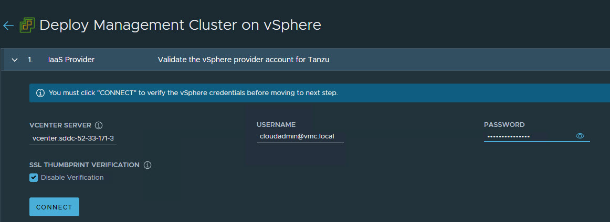

    If you are running a vSphere 7.x environment, the Tanzu Kubernetes Grid installer will detect it and provide a choice between deploying vSphere with Tanzu (TKGS) or the Tanzu Kubernetes Grid management cluster.

5. Select the **Deploy Tanzu Kubernetes Grid Management Cluster** option.

    

6. Select the Virtual Datacenter and enter the SSH public key that you generated earlier.

    

7. On the **Management Cluster Settings** page, select the instance type for the control plane node and worker node and provide the following information:

   - **Management Cluster Name:** Name for your Tanzu Kubernetes Grid management cluster.
   - **Control Plane Endpoint Provider:** Select **NSX Advanced Load Balancer for the Control Plane HA**.
   - **Control Plane Endpoint:** This is an optional field. If left blank, NSX Advanced Load Balancer will assign an IP address from the pool `TKG-Cluster-VIP` which is configured in NSX Advanced Load Balancer. If you need to provide an IP address, pick an unused IP address from the `TKG-Cluster-VIP` static IP pool.
   - **Deployment Type:** Development (recommended for Dev or POC environments)/ Production (recommended for Production environments).
   - **Machine Health Checks:** Enable
   - **Enable Audit Logging:** Enables audit logging for Kubernetes API server and node VMs, choose as per environmental needs. For more information, see [Audit Logging](https://docs.vmware.com/en/VMware-Tanzu-Kubernetes-Grid/1.5/vmware-tanzu-kubernetes-grid-15/GUID-troubleshooting-tkg-audit-logging.html).

    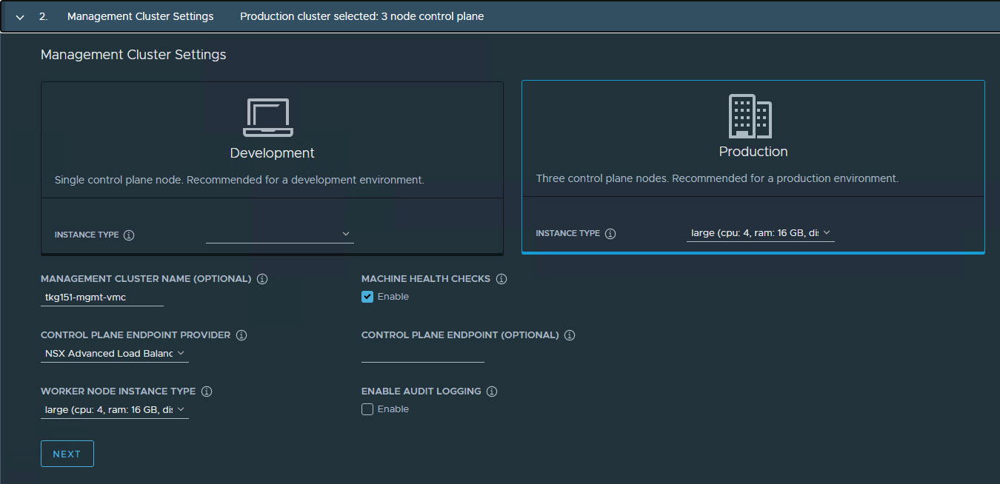

8. On the **NSX Advanced Load Balancer** page, provide the following:

    - NSX Advanced Load Balancer controller cluster IP address.
   - Controller credentials.
   - Controller certificate.

    

9. Click the **Verify Credentials** to select/configure the following:

   - **Cloud Name:** Name of the cloud created while configuring NSX Advanced Load Balancer.
   - **Service Engine Group Name:** Name of the Service Engine Group created for Tanzu Kubernetes Grid management clusters created when configuring NSX Advanced Load Balancer.
   - **Workload VIP Network Name:** Select **TKG-SS-VIP network**.
   - **Workload VIP Network CIDR:** Refer to the [Subnet & CIDR Examples](#subnet-and-cidr-examples) table to fetch the subnet associated with the `Shared-Services-VIP` network.
   - **Management VIP Network Name:** Select **TKG-Cluster-VIP network**.
   - **Management VIP Network CIDR:** Refer to the [Subnet & CIDR Examples](#subnet-and-cidr-examples) table to fetch the subnet associated with the `TKG-Cluster-VIP` network.
   - **Cluster Labels:** To adhere to the architecture, defining a label is mandatory. Provide the required labels, for example, **type:management** 

    **Note:** Based on your requirements, you may specify multiple labels.

  

   **Important:** With the above configurations, when Tanzu Kubernetes Grid clusters (shared services/workload) are tagged with the label "type=management", an AKO pod is deployed on the cluster. Any applications hosted on the cluster that require load balancing service will be exposed via the network "TKG-SS-VIP" and the virtual service will be placed on the SE group "TKG-Mgmt-SEG".

   As per the defined architecture, cluster labels specified here will be applied only on shared services clusters. If no labels are specified in the **Cluster Labels** section, the AKO pod is deployed on all the clusters without any labeling requirement, which deviates from the defined architecture.

10. On the **Metadata** page, you can specify location and labels.

    

11. On the **Resources** page, specify the compute containers for the Tanzu Kubernetes Grid management cluster deployment.

    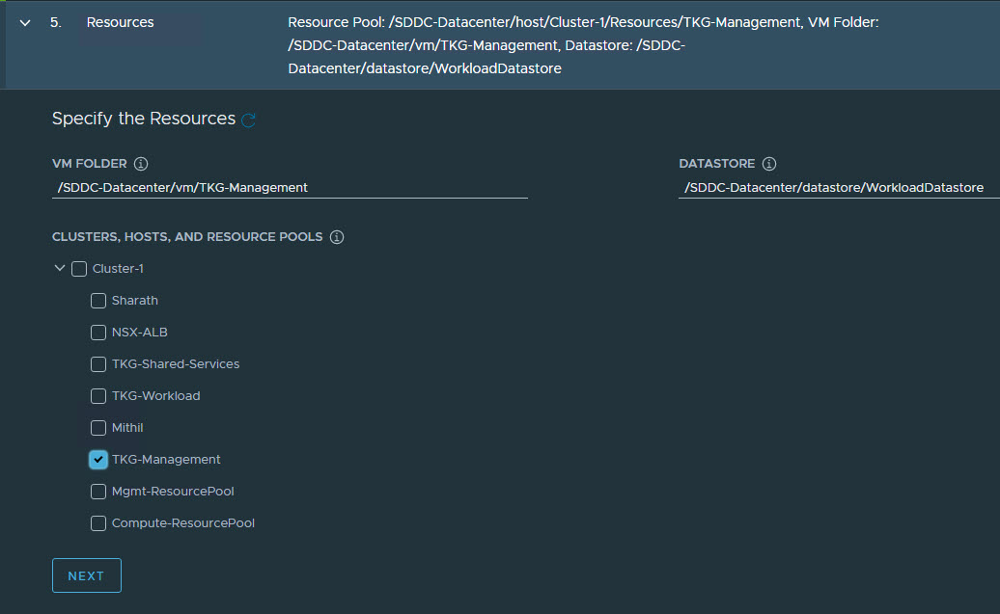

12. On the **Kubernetes Network** page, select the network where the control plane and worker nodes will be placed during management cluster deployment. Ensure that the network has **DHCP** service enabled.

13. If the Tanzu environment is placed behind a proxy, enable the proxy and provide the proxy details.

   **Note:** The procedure shown in this document does not use a proxy to connect to the internet.

    

    If LDAP is configured in your environment, see the [VMware documentation](https://docs.vmware.com/en/VMware-Tanzu-Kubernetes-Grid/1.3/vmware-tanzu-kubernetes-grid-13/GUID-mgmt-clusters-enabling-id-mgmt.html) for instructions on how to integrate an identity management system with Tanzu Kubernetes Grid.

    In this example, identity management integration is disabled.

    

14. Select the OS image to use for the management cluster deployment.

    **Note:** This list appears empty if no compatible template is present in your environment.

    After you import the correct template and click **Refresh**, the installer will detect the image automatically.

    

15.  **(optional):** Select **Participate in the Customer Experience Improvement Program**.

    

16. Click **Review Configuration** to verify your configuration settings.

    

17. After verifying the configuration settings, click **Deploy Management Cluster** to initiate deployment of the management cluster.

    **Note:** You can deploy the management cluster from the CLI by using the command that the installer has generated for you.

    

    When the deployment is started from the UI, the installer wizard displays the deployment logs on the screen.

    Deploying the management cluster takes approximately 20-30 minutes to complete. Close the installer wizard after the deployment is complete. While the management cluster is being deployed, you will find that a virtual service is created in NSX Advanced Load Balancer and placed on one of the service engines created in the "Tanzu Kubernetes Grid-Mgmt-SEG" SE Group.

    The installer automatically sets the context to the management cluster so that you can log in to it and perform additional tasks such as verifying health of the management cluster and deploying the workload clusters.

    

18. After the Tanzu Kubernetes Grid management cluster deployment, run the following command to verify the health status of the cluster:

    ```
    tanzu management-cluster get
    ```

   Ensure that the cluster status reports as `running` and the values in the `Ready` column for nodes, etc., are all `True`.

    

   See [Examine the Management Cluster Deployment](https://docs.vmware.com/en/VMware-Tanzu-Kubernetes-Grid/1.5/vmware-tanzu-kubernetes-grid-15/GUID-mgmt-clusters-verify-deployment.html) to perform additional health checks.

19.  When deployment is completed successfully, run the following command to install the additional Tanzu plugins:

    ```
    [root@tkg-bootstrapper ~]# tanzu plugin sync
    Checking for required plugins...
    Installing plugin 'cluster:v0.11.1'
    Installing plugin 'kubernetes-release:v0.11.1'
    Successfully installed all required plugins
    ✔  Done
    ```

## <a id=tmc-integration> </a> Register Management Cluster with Tanzu Mission Control

After the management cluster is deployed, you must register the management cluster with Tanzu Mission Control and other SaaS products. You can deploy the Tanzu Kubernetes clusters and Tanzu packages directly from the Tanzu Mission Control portal. Refer to the [Integrate Tanzu Kubernetes Clusters with SaaS Endpoints](tko-saas-services.md#a-idtmc-tkg-mgmt-a-register-a-tanzu-kubernetes-grid-management-cluster-with-tanzu-mission-control) page for instructions.

## <a id="set-up-shared-cluster"> </a>Deploy Tanzu Kubernetes Grid Shared Services Cluster

A shared services cluster is just a Tanzu Kubernetes Grid workload cluster used for shared services. It can be provisioned using the standard CLI command tanzu cluster create, or through Tanzu Mission Control. Each Tanzu Kubernetes Grid instance can have only one shared services cluster.

**Note:** This document demonstrates the deployment of shared services and workload clusters through Tanzu Mission Control.

The procedure for deploying a shared service cluster is essentially the same as the procedure for deploying a workload cluster. The only difference is that you will add a `tanzu-services` label to the shared services cluster to indicate its cluster role. This label identifies the shared services cluster to the management cluster and workload clusters.

Another major difference between shared services clusters and workload clusters is that the cluster labels that were defined while deploying the management cluster are applied to shared services clusters. This is to enforce that only shared services clusters will make use of the **TKG-SS-VIP** network for application load balancing and that the virtual services are deployed on the **TKG-SEG01** Service Engine Group. 

1. To deploy a shared services cluster, navigate to the **Clusters** tab and click **Create Cluster**.

    

2. On the **Create cluster** page, select the Tanzu Kubernetes Grid management cluster that you registered in the previous step and click **Continue to create cluster**.

    

3. Select the provisioner for creating the shared services cluster.

    

4. Enter a name for the cluster. Cluster names must be unique within an organization.

5. Select the cluster group to which you want to attach your cluster. Optionally, enter a description and apply labels.

    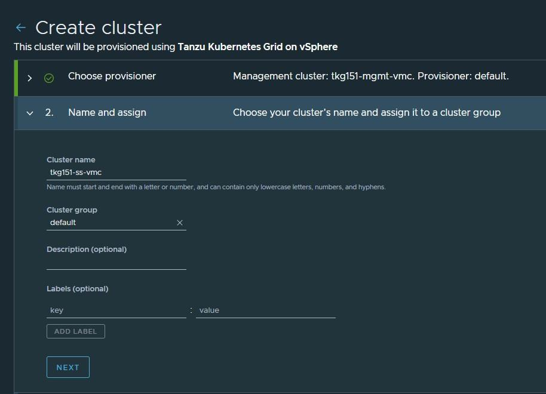

6. On the **Configure** page, specify the following:

   - Select the Kubernetes version to use for the cluster. The latest supported version is preselected. To select an earlier version, click the down arrow.
   - Select the network for the shared services cluster. The control plane nodes and the worker nodes connect to this network.
   - Paste the SSH key that you generated while configuring the bootstrap environment.
   - Optionally, define an alternative CIDR for the pod and service. The Pod CIDR and Service CIDR cannot be changed after the cluster is created.
   - Optionally, specify a proxy configuration to use for this cluster.

    **Note:** This document doesn't cover using a proxy server with Tanzu Kubernetes Grid. If your environment uses a proxy server to connect to the internet, ensure that the proxy configuration object includes the CIDRs for the pod, ingress, and egress from the workload network of the Supervisor Cluster in the **No proxy list**, as described [here](https://docs.vmware.com/en/VMware-Tanzu-Mission-Control/services/tanzumc-using/GUID-AF0B66C8-00D2-46F7-9A62-64C6E279B9A7.html#GUID-AF0B66C8-00D2-46F7-9A62-64C6E279B9A7).

    

1. Specify the placement containers such as Resource pool, VM Folder and datastore for the shared services cluster.

    

8. Select the High Availability mode for the control plane nodes of the workload cluster. For a production deployment, a highly available workload cluster is recommended.

    The control plane endpoint and API server port options are retrieved from the management cluster and are not customizable here.

    

9. You can optionally define the default node pool for your workload cluster.

   - Specify the number of worker nodes to provision.
   - Select the instance type.

10. Click **Create Cluster** to start provisioning your workload cluster.

    

    Cluster creation roughly takes 15-20 minutes to complete. After the cluster deployment completes, ensure that **Agent and extensions health** shows green.

    

    Post deployment of the shared services cluster, execute the following commands to apply the labels to the cluster.

1. Switch to the management cluster context.

    ```
    kubectl config use-context tkg151-mgmt-vmc-admin@tkg151-mgmt-vmc
    ```

2. Apply the `tanzu-services` label to update the cluster role.

    ```
    kubectl label cluster.cluster.x-k8s.io/<shared-services-cluster-name> cluster-role.tkg.tanzu.vmware.com/tanzu-services="" --overwrite=true
    ```

    Example:

    ```
    kubectl label cluster.cluster.x-k8s.io/tkg151-ss-vmc cluster-role.tkg.tanzu.vmware.com/tanzu-services="" --overwrite=true
    ```

3. Apply NSX ALB labels:

    ```
    kubectl label cluster tkg15-ss type=management
    ```

    After NSX Advanced Load Balancer labels are applied to the Tanzu Kubernetes Grid shared services cluster, AKO pods are created in the `avi-system` namespace.

## <a id=deploy-workload-cluster> </a> Deploy Tanzu Kubernetes Clusters (Workload Clusters)

The steps for deploying a workload cluster are almost exactly the same as for a shared services cluster, except that the names of the cluster and the placement containers (Resource pools, VM folder, Network, etc) are different.

After deploying the workload cluster, check that the cluster is healthy.

    

## <a id=integrate-to> </a> Integrate Tanzu Kubernetes clusters with Tanzu Observability

For instructions on enabling Tanzu Observability on your workload cluster, please see [Set up Tanzu Observability to Monitor a Tanzu Kubernetes Clusters](./tko-saas-services.md#set-up-tanzu-observability-to-monitor-a-tanzu-kubernetes-clusters)

## <a id=integrate-tsm> </a> Integrate Tanzu Kubernetes clusters with Tanzu Service Mesh

For instructions on installing Tanzu Service Mesh on your workload cluster, please see [Onboard a Tanzu Kubernetes Cluster to Tanzu Service Mesh](./tko-saas-services.md#onboard-a-tanzu-kubernetes-cluster-to-tanzu-service-mesh)

## <a id=deploy-user-managed-packages> </a> Deploy User-Managed Packages on Tanzu Kubernetes clusters

For instructions on installing user-Managed packages on the Tanzu Kubernetes clusters, see [Deploy User-Managed Packages in Workload Clusters](tkg-package-install.md).

### Create AKO Deployment Config for Tanzu Kubernetes Grid Workload Cluster**

Tanzu Kubernetes Grid v1.5.x management clusters with NSX Advanced Load Balancer have a default `AKODeploymentConfig` object that is deployed during installation. The default `AKODeploymentConfig` is called `install-ako-for-all`.

By default, any clusters that match the cluster labels defined in `install-ako-for-all` will reference this file for their virtual IP networks, Service Engine Groups (SEGs), and L7 ingress.

As part of our architecture, only shared services clusters make use of the configuration defined in the default AKODeploymentConfig `install-ako-for-all`.

As per the defined architecture, workload clusters make use of a separate Service Engine Group (**TKG-WLD01-SEG)** and VIP Network (**Workload-VIP**) for application load balancing. These configurations can be enforced on workload clusters by:

- Creating a new `AKODeploymentConfig` in the Tanzu Kubernetes Grid management cluster. This `AKODeploymentConfig` file dictates which specific Service Engine Group and VIP network the workload clusters can use for load balancing.  
- Applying the new `AKODeploymentConfig`: Label the workload cluster to match the `AKODeploymentConfig.spec.clusterSelector.matchLabels` element in the `AKODeploymentConfig` file.
  Once the labels are applied on the workload cluster, the AKO Operator running in the Tanzu Kubernetes Grid management cluster will deploy the AKO pod on the target workload cluster.

The following is a sample format of the AKODeploymentConfig file:

```yaml
apiVersion: networking.tkg.tanzu.vmware.com/v1alpha1
kind: AKODeploymentConfig
metadata:
  finalizers:
  - ako-operator.networking.tkg.tanzu.vmware.com
  generation: 2
  name: <Unique name of AKODeploymentConfig>
spec:
  adminCredentialRef:
    name: avi-controller-credentials
    namespace: tkg-system-networking
  certificateAuthorityRef:
    name: avi-controller-ca
    namespace: tkg-system-networking
  cloudName: <name of cloud configured in NSX ALB>
  clusterSelector:
    matchLabels:
      <Key>: <Value>
  controlPlaneNetwork:
    cidr: <Control Plane Network CIDR>
    name: <Control Plane Network Name>
  controller: <NSX ALB Controller IP/FQDN>
  dataNetwork:
    cidr: <VIP Network CIDR>
    name: <VIP Network Name>
  extraConfigs:
    cniPlugin: antrea
    disableStaticRouteSync: true
    ingress:
      defaultIngressController: true
      disableIngressClass: true
    l4Config:
      autoFQDN: disabled
    layer7Only: true
    networksConfig:
      enableRHI: false
  serviceEngineGroup: <Workload Cluster SEG Name>
```

The following is the sample `AKODeploymentConfig` used for the workload cluster. As configured, an AKO pod will be deployed on a workload cluster that matches the `type=tkg15-workload` label.

```yaml
apiVersion: networking.tkg.tanzu.vmware.com/v1alpha1
kind: AKODeploymentConfig
metadata:
  finalizers:
    - ako-operator.networking.tkg.tanzu.vmware.com
  generation: 2
  name: ako-for-workload
spec:
  adminCredentialRef:
    name: avi-controller-credentials
    namespace: tkg-system-networking
  certificateAuthorityRef:
    name: avi-controller-ca
    namespace: tkg-system-networking
  cloudName: tkg-vsphere
  clusterSelector:
    matchLabels:
      type: tkg15-workload
  controlPlaneNetwork:
    cidr: 172.16.19.0/26
    name: TKG-WLD-VIP
  controller: alb.tanzu.lab
  dataNetwork:
    cidr: 172.16.19.0/26
    name: TKG-WLD-VIP
  extraConfigs:
    cniPlugin: antrea
    disableStaticRouteSync: true
    ingress:
      defaultIngressController: true
      disableIngressClass: true
    l4Config:
      autoFQDN: disabled
    layer7Only: true
    networksConfig:
      enableRHI: false
  serviceEngineGroup: TKG-WLD-SEG01
```

To create the `AKODeploymentConfig` file, invoke the `kubectl` command as shown:

1. Switch to the management cluster context:
    ```
    kubectl config use-context tkg151-mgmt-vmc-admin@tkg151-mgmt-vmc
    ```
2. Create `AKODeploymentConfig`:
    ```
    kubectl apply -f ako-tkg151-workload.yaml

    akodeploymentconfig.networking.tkg.tanzu.vmware.com/ako-for-workload Created
    ```
3. List `AKODeploymentConfig`:
    ```
    kubectl get adc

    NAME                                 AGE
    ako-for-workload                     5s
    install-ako-for-all                  3h14m
  install-ako-for-management-cluster   3h14m
    ```

After the `AKODeploymentConfig` is created, apply the labels defined in the `AKODeploymentConfig` to any of the Tanzu Kubernetes Grid workload clusters. Once the labels are applied, the AKO pod will be deployed on the target workload cluster.

```
kubectl label cluster tkg151-wld01-vmc type=tkg15-workload

cluster.cluster.x-k8s.io/tkg151-wld01-vmc labeled

## Verify that AKO pod is created in the workload cluster

kubectl config use-context tkg151-wld01-vmc-admin@tkg151-wld01-vmc

kubectl get ns | grep avi-system
avi-system                  Active   41s

kubectl get pod -n avi-system

NAME    READY   STATUS    RESTARTS   AGE
ako-0   1/1     Running   0          47s
```