# Deploy VMware Tanzu for Kubernetes Operations on VMware Cloud on AWS

This document provides step-by-step instructions for deploying VMware Tanzu Kubernetes Operations (informally known as TKO) on VMware Cloud on AWS.

The scope of the document is limited to providing the deployment steps based on the reference design in [VMware Tanzu for Kubernetes Operations on VMware Cloud on AWS Reference Design](../reference-designs/tko-on-vmc-aws.md).

## Deploying with VMware Service Installer for Tanzu

You can use VMware Service Installer for VMware Tanzu to automate this deployment.

VMware Service Installer for Tanzu automates the deployment of the reference designs for Tanzu for Kubernetes Operations. It uses best practices for deploying and configuring the required Tanzu for Kubernetes Operations components.

To use Service Installer to automate this deployment, see [Deploying VMware Tanzu for Kubernetes Operations on VMware Cloud on AWS Using Service Installer for VMware Tanzu](https://docs.vmware.com/en/Service-Installer-for-VMware-Tanzu/2.1/service-installer/GUID-index.html).

Alternatively, if you decide to manually deploy each component, follow the steps provided in this document.

## Prerequisites

These instructions assume that you have the following set up:

* VMware Cloud subscription
* SDDC deployment
* Access to VMware vCenter Server over HTTPs
* NTP configured on all VMware ESXi hosts and vCenter Server

## Supported Component Matrix

|**Software Components**|**Version**|
| --- | --- |
|Tanzu Kubernetes Grid|2.1.x|
|VMware Cloud on AWS SDDC Version|1.18 and later|
|NSX Advanced Load Balancer|22.1.2|

To verify the interoperability of other versions and products, see [VMware Interoperability Matrix](https://interopmatrix.vmware.com/Interoperability?col=551,9293&row=789,%262,%26912).

## Prepare the Environment for Deploying Tanzu for Kubernetes Operations

Before deploying Tanzu Kubernetes Operations on VMC on AWS, ensure that your environment is set up as described in the following:

- [General Requirements](#genreq)
- [Network Requirements](#netreq)
- [Firewall Requirements](#fwreq)
- [Resource Pools and VM Folders](#resource-pools-and-vm-folders)
- [Subnet and CIDR Examples](#subnet-and-cidr-examples)

### <a id="genreq"> </a> General Requirements

Your environment should meet the following general requirements:

- SDDC v1.18 or later deployed in VMC on AWS.
- Your SDDC has the following objects in place:
  - Dedicated resource pools and VM folders for collecting Tanzu Kubernetes Grid and NSX Advanced Load Balancer VMs. Refer to the Resource Pools and VM Folders section for more information.
  - NSX Advanced Load Balancer 22.1.2 OVA downloaded from the [customer connect](https://customerconnect.vmware.com/downloads/info/slug/infrastructure_operations_management/vmware_tanzu_kubernetes_grid/2_x) portal and readily available for deployment.

  - A content library to store NSX Advanced Load Balancer Controller and service engine OVA templates.  
* Depending on the OS flavor of the bootstrap VM, download and configure the following packages from [VMware Customer Connect](https://customerconnect.vmware.com/downloads/info/slug/infrastructure_operations_management/vmware_tanzu_kubernetes_grid/2_x). As part of this documentation, refer to the section to configure required packages on the Photon OS machine.

  * Tanzu CLI 2.1.x
  * kubectl cluster CLI 1.24.9

* A vSphere account with the permissions described in [Required Permissions for the vSphere Account](https://docs.vmware.com/en/VMware-Tanzu-Kubernetes-Grid/2.1/tkg-deploy-mc-21/mgmt-reqs-prep-vsphere.html).
* Download and import NSX Advanced Load Balancer 22.1.2 OVA to Content Library.
* Download the following OVA from [VMware Customer Connect](https://customerconnect.vmware.com/downloads/info/slug/infrastructure_operations_management/vmware_tanzu_kubernetes_grid/2_x) and import to vCenter. Convert the imported VMs to templates.

  * Photon v3 Kubernetes v1.24.9 OVA
  * Ubuntu 2004 Kubernetes v1.24.9 OVA  

> **Note** You can also download supported older versions of Kubernetes from [VMware Customer Connect](https://customerconnect.vmware.com/en/downloads/details?downloadGroup=TKG-160&productId=988&rPId=93384) and import them to deploy workload clusters on the intended Kubernetes versions.

> **Note** In Tanzu Kubernetes Grid nodes, it is recommended to not use hostnames with ".local" domain suffix. For more information, see [KB article](https://kb.vmware.com/s/article/83623).<p>

> **Note** VMC vCenter fqdn should redirect to vCenter local IP.
#### Resource Pools and VM Folders

The sample entries of the resource pools and folders that need to be created are as follows.

|**Resource Type**|**Sample Resource Pool Name**|**Sample Folder Name**|
| --- | --- | --- |
|NSX ALB Components|`tkg-alb-components`|`tkg-alb-components`|
|TKG Management components|`tkg-management-components`|`tkg-management-components`|
|TKG Shared Service Components|`tkg-sharedsvc-components`|`tkg-sharedsvc-components`|
|TKG Workload components|`tkg-workload01-components`|`tkg-workload01-components`|

### <a id="netreq"> </a> Network Requirements

Create NSX-T logical segments for deploying Tanzu for Kubernetes Operations components as per [Network Recommendations](../reference-designs/tko-on-vmc-aws.md#network-recommendations) defined in the reference architecture.

### <a id="fwreq"> </a> Firewall Requirements

Ensure that the firewall is set up as described in [Firewall Recommendations](../reference-designs/tko-on-vmc-aws.md#a-idfirewallafirewall-recommendations).


### <a id=subnet-and-cidr-examples> </a> Subnet and CIDR Examples

For the purpose of demonstration, this document uses the following subnet CIDRs for Tanzu for Kubernetes Operations deployment.

|**Network Type**|**Segment Name**|**Gateway CIDR**|**DHCP Pool**|**NSX Advanced Load Balancer IP Pool**|
| --- | --- | --- | --- | --- |
|NSX ALB Mgmt Network|sfo01-w01-vds01-albmanagement|192.168.11.1/27|192.168.11.15 - 192.168.11.30|NA|
|TKG Management Network|sfo01-w01-vds01-tkgmanagement|192.168.12.1/24|192.168.12.2 - 192.168.12.251|NA|
|TKG Workload Network|sfo01-w01-vds01-tkgworkload01|192.168.13.1/24|192.168.13.2 - 192.168.13.251|NA|
|TKG Cluster VIP Network|sfo01-w01-vds01-tkgclustervip|192.168.14.1/26|192.168.14.2 - 192.168.14.30|192.168.14.31 - 192.168.14.60|
|TKG Mgmt VIP Network|sfo01-w01-vds01-tkgmanagementvip|192.168.15.1/26|192.168.15.2 - 192.168.15.30|192.168.15.31 - 192.168.15.60|
|TKG Workload VIP Network|sfo01-w01-vds01-tkgworkloadvip|192.168.16.1/26|192.168.16.2 - 192.168.16.30|192.168.16.31 - 192.168.16.60|
|TKG Shared Services Network|sfo01-w01-vds01-tkgshared|192.168.17.1/24|192.168.17.2 - 192.168.17.251|NA|

## Tanzu for Kubernetes Operations Deployment Overview

The high-level steps for deploying Tanzu for Kubernetes Operation on VMware Cloud on AWS are as follows:

1. [Deploy and Configure NSX Advanced Load Balancer](#dep-config-nsxalb)
2. [Deploy and Configure Tanzu Kubernetes Grid](#deploy-config-tkg)
3. [Deploy Tanzu Kubernetes Grid Management Cluster](#deploy-mgmt-cluster)
4. [Register Management Cluster with Tanzu Mission Control](#tmc-integration)
5. [Deploy and Configure Shared Services Workload Cluster](#set-up-shared-cluster)
6. [Deploy Tanzu Kubernetes Clusters (Workload Cluster)](#deploy-workload-cluster)
7. [Integrate Tanzu Kubernetes Clusters with Tanzu Observability](#integrate-to)
8. [Integrate Tanzu Kubernetes Clusters with Tanzu Service Mesh](#integrate-tsm)
9. [Deploy User-Managed Packages on Tanzu Kubernetes Grid Clusters](#deploy-user-managed-packages)

## <a id="dep-config-nsxalb"> </a> Deploy and Configure NSX Advanced Load Balancer


NSX Advanced Load Balancer (ALB) is an enterprise-grade integrated load balancer that provides L4 - L7 load balancer support.
NSX Advanced Load Balancer is deployed in No Orchestrator Access Mode in the VMC Environment.in this mode, adding, removing, or modifying properties of a Service Engine requires an administrator to manually perform the changes. For instance, an administrator would need to install a new SE through the orchestrator, such as vCenter, by uploading the OVA and setting the resource and networking properties.

For a production-grade deployment, it is recommended to deploy three instances of the NSX Advanced Load Balancer controller for high availability and resiliency.  

The following table provides a sample IP address and FQDN set for the NSX Advanced Load Balancer controllers:  

The following IP addresses are reserved for NSX Advanced Load Balancer:

|**Controller Node**|**IP Address**|**FQDN**|
| --- | --- | --- |
|Node01 (Primary)|192.168.11.8|sfo01albctlr01a.sfo01.rainpole.local|
|Node02 (Secondary)|192.168.11.9|sfo01albctlr01b.sfo01.rainpole.local|
|Node03 (Secondary) |192.168.11.10|sfo01albctlr01c.sfo01.rainpole.local|
|Controller Cluster IP|192.168.11.11|sfo01albctlr01.sfo01.rainpole.local|

Follow these steps to deploy and configure NSX Advanced Load Balancer:

1. Log in to the vCenter server from the vSphere client.

2. Select the cluster where you want to deploy the NSX Advanced Load Balancer controller node.

3. Right-click the cluster and invoke the **Deploy OVF Template** wizard.

4. Follow the wizard to configure the following:

    - Set the **VM Name** and **Folder Location**.
    - Select the **nsx-alb-components** resource pool as a compute resource.
    - Select the datastore for the controller node deployment.
    - Select the **sfo01-w01-vds01-albmanagement** port group for the Management Network.
    - Customize the configuration by providing the **Management Interface IP Address**, **Subnet Mask**, and **Default Gateway**. The remaining fields are optional and can be left blank.

After the controller VM is deployed and powered on, connect to the URL for the node and configure the node for your Tanzu Kubernetes Grid environment as follows:

1. Create the administrator account by setting the password and optional email address.

    

2. Configure System Settings by specifying the backup passphrase and DNS information.

    

3. (Optional) Configure **Email/SMTP**

    

4. Configure **Multi-Tenant** settings as follows:

      - **IP Route Domain:** Per tenant IP route domain.
      - **Service Engine Context:** Tenant context, (not shared across tenants).

    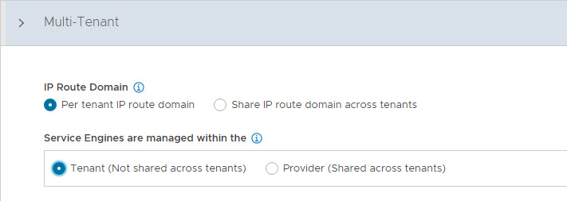

5. Click **Save** to complete the post-deployment configuration wizard.

If you did not select the **Setup Cloud After** option before saving, the initial configuration wizard exits. The Cloud configuration window does not automatically launch and you are directed to a Dashboard view on the controller.


### Configure Licensing

Tanzu for Kubernetes Operations is bundled with a license for NSX Advanced Load Balancer Enterprise. To configure licensing, complete the following steps.

1. Navigate to the **Administration > Settings > Licensing** and click on the gear icon to change the license type to Enterprise.

   

2. Select Enterprise as license type and click **Save**.

   

3. Once the license tier is changed, apply the NSX Advanced Load Balancer Enterprise license key. If you have a license file instead of a license key, apply the license by selecting the **Upload a License File** option.

   

### NSX Advanced Load Balancer: NTP Configuration

To configure NTP, go to **Administration** > **Settings** > **DNS/NTP > Edit** and add your NTP server details and click **Save**.

> **Note** You may also delete the default NTP servers.

   


### <a id="nsx-alb-ha"> </a> NSX Advanced Load Balancer: Controller High Availability

In a production environment, VMware recommends that you deploy additional controller nodes and configure the controller cluster for high availability and disaster recovery. Adding two additional nodes to create a 3-node cluster provides node-level redundancy for the controller and also maximizes performance for CPU-intensive analytics functions.

To run a 3-node controller cluster, you deploy the first node,  perform the initial configuration, and set the cluster IP address. After that, you deploy and power on two more Controller VMs, but you must not run the initial configuration wizard or change the admin password for these controller VMs. The configuration of the first controller VM is assigned to the two new controller VMs.

Repeat the steps provided in the [Deploy NSX Advanced Load Balancer Controller](#dep-config-nsxalb) section to deploy additional controllers.

1. To configure the controller cluster, navigate to the **Administration > Controller > Nodes** page and click **Edit**.

   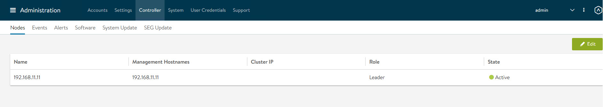

2. Specify the name for the controller cluster and set the **Cluster IP**. This IP address should be from the NSX Advanced Load Balancer management network.

3. Under **Cluster Nodes**, specify the IP addresses of the two additional controllers that you have deployed. Optionally, you can configure the name for the controllers.

4. Click **Save** to complete the cluster configuration.

    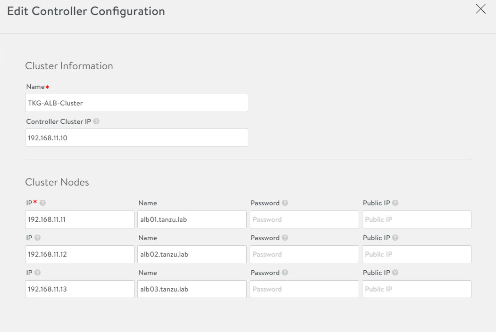

After you click **Save**, the controller cluster setup starts, and the controller nodes are rebooted in the process. It takes approximately 10-15 minutes for cluster formation to complete.

You are automatically logged out of the controller node where you are currently logged in. On entering the cluster IP address in the browser, you can see details about the cluster formation task.


> **Note** Once the controller cluster is deployed, you must use the IP address of the controller cluster, not the IP address of the individual controller node, for any further configuration.

Connect to the NSX Advanced Load Balancer controller cluster IP/FQDN and ensure that all controller nodes are in a healthy state.

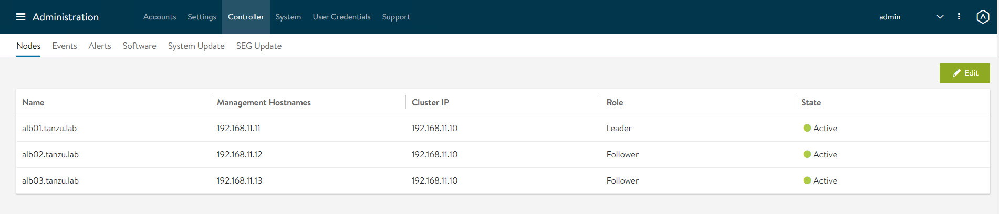

The first controller of the cluster receives the "Leader" role. The second and third controllers work as "Followers".

### Change NSX Advanced Load Balancer Portal Certificate

The controller must send a certificate to clients to establish secure communication. This certificate must have a Subject Alternative Name (SAN) that matches the NSX Advanced Load Balancer controller cluster hostname or IP address.

The controller has a default self-signed certificate, but this certificate does not have the correct SAN. You must replace it with a valid or self-signed certificate that has the correct SAN. You can create a self-signed certificate or upload a CA-signed certificate.

For the purpose of the demonstration, this document uses a self-signed certificate.

1. To replace the default certificate, navigate to the **Templates > Security > SSL/TLS Certificate > Create** and select **Controller Certificate**.

    

2. In the **New Certificate (SSL/TLS)** window, enter a name for the certificate and set the type to **Self Signed**.

3. Enter the following details:

   - **Common Name** - Specify the fully-qualified site name. For the site to be considered trusted, this entry must match the hostname that the client entered in the browser.
   - **Subject Alternate Name (SAN)** - Enter the cluster IP address or FQDN of the controller cluster nodes.
   - **Algorithm** - Select either EC or RSA.
   - **Key Size**

4. Click **Save** to save the certificate.

    
    

5. To change the NSX Advanced Load Balancer portal certificate, navigate to the **Administration** > **Settings** >**Access Settings** page and click the pencil icon to edit the settings.

    

6. Under SSL/TLS Certificate, remove the existing default certificates. From the drop-down menu, select the newly created certificate and click **Save**.

    

7. Refresh the controller portal from the browser and accept the newly created self-signed certificate. Ensure that the certificate reflects the updated information in the browser.

### Export NSX Advanced Load Balancer Certificate

After the certificate is created, export the certificate thumbprint. The thumbprint is required later when you configure the Tanzu Kubernetes Grid management cluster. To export the certificate, complete the following steps.

1. Navigate to the **Templates > Security > SSL/TLS Certificate** page and export the certificate by clicking **Export**.

2. In the **Export Certificate** page, click **Copy to clipboard** against the certificate. Do not copy the key. Save the copied certificate to use later when you enable workload management.

    

### <a id="nsx-alb-vcenter-se"> </a> NSX Advanced Load Balancer: Create No Orchestrator Cloud and SE Groups

1. To configure the No Orchestrator Cloud, navigate to the **Infrastructure > Clouds** tab.

2. Click **Create** and select **No Orchestrator** from the dropdown list.

    

3. Provide a name for the cloud, enable IPv4 DHCP under DHCP settings, and click **Save**.

    

4. After the cloud is created, ensure that the health status of the cloud is green.

    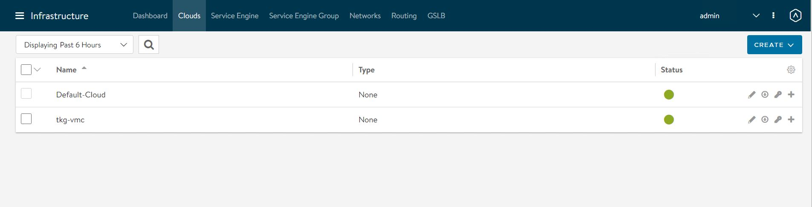


### Configure Service Engine Groups

Tanzu for Kubernetes Operations deployment is based on the use of distinct service engine (SE) groups for the Tanzu Kubernetes Grid management and workload clusters. The service engines for the management cluster are deployed in the Tanzu Kubernetes Grid management SE group, and the service engines for Tanzu Kubernetes Grid workload clusters are deployed in the Tanzu Kubernetes Grid workload SE group.

**TKG-Mgmt-SEG**: The service engines part of this SE group hosts:

- Virtual services for all load balancer functionalities requested by the Tanzu Kubernetes Grid management and shared services clusters.
- Virtual services that load balance control plane nodes of management cluster and shared services cluster.

**TKG-WLD01-SEG**: Service engines part of this SE group host virtual services that load balance control plane nodes and virtual services for all load balancer functionalities requested by the workload clusters mapped to this SE group.

> **Note**
>- Based on your requirements, you can create additional SE groups for the workload clusters.
>- Multiple workload clusters can be mapped to a single SE group.
>- A Tanzu Kubernetes Grid cluster can be mapped to only one SE group for application load balancer services.

To create and configure a new SE group, complete the following steps.
The following components are created in NSX Advanced Load Balancer.

<!-- /* cSpell:disable */ -->

| **Object** | **Sample Name** |
| --- | --- |
| vCenter Cloud | sfo01w01vc01 |
| Service Engine Group 1 | sfo01m01segroup01 |
| Service Engine Group 2 | sfo01w01segroup01 |

1. Go to **Infrastructure > Service Engine Group** under Cloud Resources and click **Create**.
2. Provide a name for the SE group and configure the following settings:

   - **High Availability Mode:** Elastic HA Active/Active
   - **VS Placement across SEs:** Compact
   - **Virtual Service per Service Engine:** 10
   - **SE Self-Election:** Selected


    


3. Repeat the steps to create an SE group for the Tanzu Kubernetes Grid workload cluster. You should have created two service engine groups.

    

### Configure VIP Networks

As per the reference architecture, Tanzu for Kubernetes Operations deployment makes use of three VIP networks:

- **TKG-Cluster-VIP:** This network provides high availability for the control plane nodes of the Tanzu Kubernetes Grid management cluster, shared services cluster, and the workload clusters.
- **TKG-Management-VIP:** This network provides VIP for the extensions (Envoy, Contour, etc.) deployed in the shared services cluster.
- **TKG-Workload-VIP:** This network provides VIP for the applications (of type load balancer) deployed in the workload clusters.

> **Note** You can provision additional VIP networks for the network traffic separation for the applications deployed in various workload clusters. This is a day-2 operation.

To create and configure the VIP networks, complete the following steps.

1. Go to the **Infrastructure > Networks** tab under Cloud Resources and click **Create**. Check that the VIP networks are being created under the correct cloud.

2. Provide a name for the VIP network and uncheck the **DHCP Enabled** and **IPv6 Auto-Configuration** options.

    

3. Click **Add Subnet** and configure the following:

   - **IP Subnet:** Subnet CIDR of the VIP network.
   - **Static IP Address Pool:** Range of IP addresses that is assigned to service engines and the virtual services that are deployed.

4. Click **Save** to continue.

    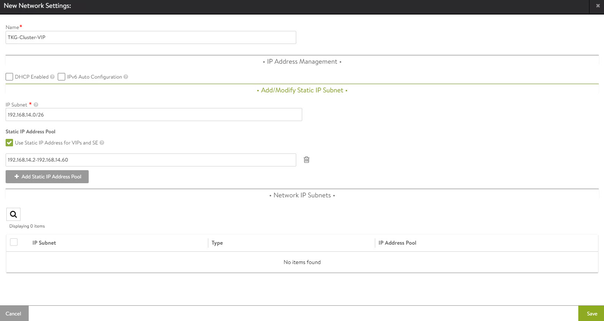

5. Click **Save** again to finish the network configuration.

    

Repeat the steps to create additional VIP networks.


### Configure Routing

After configuring the VIP networks, set the default routes for all VIP/data networks. The following table lists the default routes used in the current environment.

|**Network Name**|**Gateway Subnet Mask**|**Next Hop**|
| --- | --- | --- |
|sfo01-w01-vds01-tkgclustervip|0.0.0.0/0|192.168.14.1|
|sfo01-w01-vds01-tkgmanagementvip|0.0.0.0/0|192.168.15.1|
|sfo01-w01-vds01-tkgworkloadvip|0.0.0.0/0|192.168.16.1|

> **Note** Change the gateway subnet addresses to match your network configuration.

1. Go to the **Infrastructure** > **VRF Context** > Edit **global** and add **Static Route**.

    

### Configuring IPAM and DNS Profiles

IPAM is required to allocate virtual IP addresses when virtual services are created. NSX Advanced Load Balancer provides IPAM service for Tanzu Kubernetes Grid cluster VIP network, Tanzu Kubernetes Grid management VIP network and Tanzu Kubernetes Grid workload VIP network.

To create an IPAM profile, complete the following steps.

1. Navigate to the **Templates > Profiles > IPAM/DNS Profiles** page, click **Create**, and select **IPAM Profile**.


2. Create the profile using the values shown in the following table.

    |**Parameter**|**Value**|
    | --- | --- |
    |Name|sfo01w01ipam01|
    |Type|AVI Vantage IPAM|
    |Cloud for Usable Networks|tkg-vmc|
    |Usable Networks|<p>sfo01-w01-vds01-tkgclustervip</p><p>sfo01-w01-vds01-tkgmanagementvip</p><p>sfo01-w01-vds01-tkgworkloadvip</p>|

3. Click **Save** to finish the IPAM creation wizard.

4. To create a DNS profile, click **Create** again and select **DNS Profile**.

  - Provide a name for the DNS Profile and select **AVI Vantage DNS** as the profile type.
  - Under **Domain Name**, specify the domain that you want to use with NSX Advanced Load Balancer.
  - Optionally, set a new value in **Override Record TTL for this domain**. The default value for all domains is 30 seconds.

    

    The newly created IPAM and DNS profiles must be associated with the cloud so they can be leveraged by the NSX Advanced Load Balancer objects created under that cloud.

To assign the IPAM and DNS profile to the cloud, go to the **Infrastructure > Cloud** page and edit the cloud configuration.

1. Under IPAM Profile, select the IPAM profile.

2. Under DNS Profile, select the DNS profile and save the settings.

   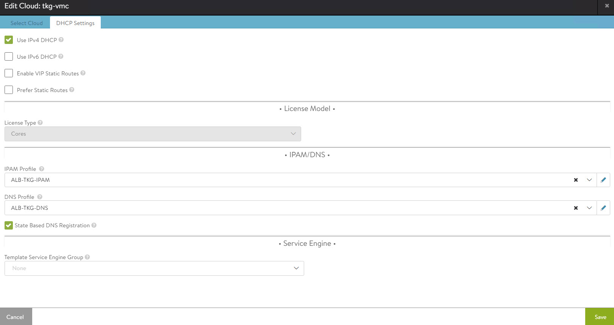

   After configuring the IPAM and DNS profiles, verify that the status of the cloud is green.

### Deploy and Configure Service Engine

Deploying a service engine is a manual process in VMC on AWS environment because NSX Advanced Load Balancer is deployed in the no-orchestrator mode. In this mode, NSX Advanced Load Balancer does not have access to the ESX management plane. Access to the ESX management plane is required for automated service engine deployment.

To download the service engine image for deployment, navigate to the **Infrastructure > Clouds** tab, select your cloud, click the download icon, and select type as OVA.

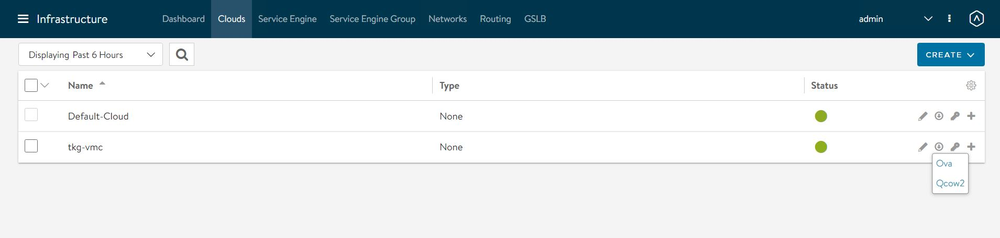

Wait a few minutes for the image generating task to finish. When the task is finished, the resulting image file is immediately downloaded.

#### Import the Service Engine Image File into the Content Library

You can use the downloaded OVA file directly to create a service engine VM, but bear in mind that this approach requires you to upload the image to vCenter every time you need to create a new service engine VM.

For faster deployment, import the service engine OVA image into the content library and use the "deploy from template" wizard to create new service engine VMs.

#### Generate the Cluster UUID and Authentication Token

Before deploying a service engine VM, you must obtain a cluster UUID and generate an authentication token. A cluster UUID facilitates integrating the service engine with NSX Advanced Load Balancer Controller. Authentication between the two is performed via an authentication token.

To generate a cluster UUID and auth token, navigate to **Infrastructure > Clouds** and click the key icon in front of the cloud that you have created. This opens a new popup window containing both the cluster UUID and the auth token.

> **Note** You need a new auth token every time a new Service Engine instance is deployed.

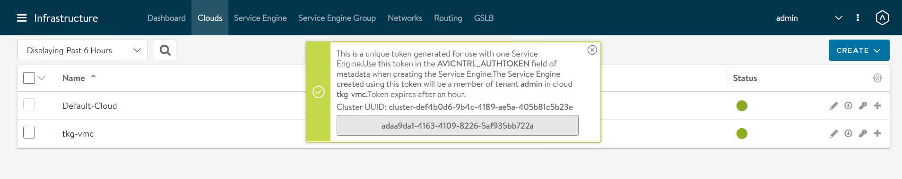

#### Deploy Service Engine VMs for Tanzu Kubernetes Grid Management Cluster

1. To deploy a service engine VM, log in to the vSphere client and navigate to **Menu > Content Library > Your Content Library**. Navigate to the **Templates** tab and select the service engine template, right-click it, and choose **New VM from this template**.

2. Follow the VM creation wizard. On the networks page, select the management and data networks for the SE VM.

   The Management network label is mapped to the NSX Advanced Load Balancer Management logical segment. The remaining network labels (Data Network 1 – 9) are connected to any of the front-end virtual service’s network or back-end server’s logical network as required. It is left disconnected if not required.

   The service engine for the Tanzu Kubernetes Grid management cluster is connected to the following networks:

   - Management: sfo01-w01-vds01-albmanagement
   - Data Network 1: sfo01-w01-vds01-tkgclustervip
   - Data Network 2: sfo01-w01-vds01-tkgmanagementvip
   - Data Network 3: sfo01-w01-vds01-tkgmanagement
   - Data Network 4: sfo01-w01-vds01-tkgshared

    

3. Provide the cluster UUID and authentication token that you generated earlier on the **Customize template** page on the time of SE Deployment. Configure the service engine VM management network settings as well.

    

1. Repeat the steps to deploy an additional service engine VM for the Tanzu Kubernetes Grid management cluster.

By default, service engine VMs are created in the default Service Engine Group.


To map the service engine VMs to the correct Service Engine Group, 

1. Go to the **Infrastructure > Service Engine** tab, select your cloud, and click the pencil icon to update the settings and link the service engine to the correct SEG.

    

2. Repeat the step for all service engine VMs.

On the **Service Engine Group** page, you can confirm the association of service engines with Service Engine Groups.


#### Deploy Service Engines for Tanzu Kubernetes Grid Workload cluster

Service engine VMs deployed for Tanzu Kubernetes Grid workload cluster are connected to the following networks:

- Management: sfo01-w01-vds01-albmanagement
- Data Network 1: sfo01-w01-vds01-tkgworkloadvip
- Data Network 2: sfo01-w01-vds01-tkgworkload
- Data Network 3: sfo01-w01-vds01-tkgclustervip


You need to deploy service engine VMs with the above settings.

After deploying the service engines, edit the service engine VMs and associate them with the **sfo01w01segroup01** Service Engine Group.


The NSX Advanced Load Balancer configuration is complete.

## <a id="deploy-config-tkg"> </a> Deploy and Configure Tanzu Kubernetes Grid

The deployment of the Tanzu Kubernetes Grid management and workload cluster is facilitated by setting up a bootstrap machine where you install the Tanzu CLI and Kubectl utilities which are used to create and manage the Tanzu Kubernetes Grid instance. This machine also keeps the Tanzu Kubernetes Grid and Kubernetes configuration files for your deployments.

The bootstrap machine runs a local `kind` cluster when Tanzu Kubernetes Grid management cluster deployment is started. Once the `kind` cluster is fully initialized, the configuration is used to deploy the actual management cluster on the backend infrastructure. After the management cluster is fully configured, the local `kind` cluster is deleted and future configurations are performed via the Tanzu CLI.

## <a id="bootstrap"> </a> Deploy and Configure Bootstrap Machine

The deployment of the Tanzu Kubernetes Grid management and workload clusters is facilitated by setting up a bootstrap machine where you install the Tanzu CLI and Kubectl utilities which are used to create and manage the Tanzu Kubernetes Grid instance. This machine also keeps the Tanzu Kubernetes Grid and Kubernetes configuration files for your deployments. The bootstrap machine can be a laptop, host, or server running on Linux, macOS, or Windows that you deploy management and workload clusters from.

The bootstrap machine runs a local `kind` cluster when Tanzu Kubernetes Grid management cluster deployment is started. Once the `kind` cluster is fully initialized, the configuration is used to deploy the actual management cluster on the backend infrastructure. After the management cluster is fully configured, the local `kind` cluster is deleted and future configurations are performed with the Tanzu CLI.

For this deployment, a Photon-based virtual machine is used as the bootstrap machine. For information on how to configure for a macOS or Windows machine, see [Install the Tanzu CLI and Other Tools](https://docs.vmware.com/en/VMware-Tanzu-Kubernetes-Grid/2.1/tkg-deploy-mc-21/install-cli.html).

The bootstrap machine must meet the following prerequisites:

   * A minimum of 6 GB of RAM and a 2-core CPU.
   * System time is synchronized with a Network Time Protocol (NTP) server.
   * Docker and containerd binaries are installed. For instructions on how to install Docker, see [Docker documentation](https://docs.docker.com/engine/install/centos/).
   * Ensure that the bootstrap VM is connected to Tanzu Kubernetes Grid management network.

To install Tanzu CLI, Tanzu Plugins, and Kubectl utility on the bootstrap machine, follow the instructions below:

1. Download and unpack the following Linux CLI packages from [VMware Tanzu Kubernetes Grid Download Product page](https://customerconnect.vmware.com/downloads/info/slug/infrastructure_operations_management/vmware_tanzu_kubernetes_grid/2_x).

   * VMware Tanzu CLI 2.1.0 for Linux
   * kubectl cluster cli v1.24.9 for Linux

1. Execute the following commands to install Tanzu Kubernetes Grid CLI, kubectl CLIs, and Carvel tools.
    ```bash
    ## Install required packages
    tdnf install tar zip unzip wget -y

    ## Install Tanzu Kubernetes Grid CLI
    tar -xvf tanzu-cli-bundle-linux-amd64.tar.gz
    cd ./cli/
    sudo install core/v0.28.0/tanzu-core-linux_amd64 /usr/local/bin/tanzu
    chmod +x /usr/local/bin/tanzu

    ## Verify Tanzu CLI version

     [root@tkg160-bootstrap ~] # tanzu version

    version: v0.28.0
    buildDate: 2023-01-20
    sha: 3c34115bc-dirty

    ## Install Tanzu Kubernetes Grid CLI Plugins

    [root@tkg160-bootstrap ~] # tanzu plugin sync

    Checking for required plugins...
    Installing plugin 'login:v0.28.0'
    Installing plugin 'management-cluster:v0.28.0'
    Installing plugin 'package:v0.28.0'
    Installing plugin 'pinniped-auth:v0.28.0'
    Installing plugin 'secret:v0.28.0'
    Installing plugin 'telemetry:v0.28.0'
    Successfully installed all required plugins
    ✔  Done

    ## Verify the plugins are installed

    [root@tkg160-bootstrap ~]# tanzu plugin list
    NAME                DESCRIPTION                                                        SCOPE       DISCOVERY  VERSION  STATUS
    login               Login to the platform                                              Standalone  default    v0.28.0  installed
    management-cluster  Kubernetes management-cluster operations                           Standalone  default    v0.28.0  installed
    package             Tanzu package management                                           Standalone  default    v0.28.0  installed
    pinniped-auth       Pinniped authentication operations (usually not directly invoked)  Standalone  default    v0.25.0  installed
    secret              Tanzu secret management                                            Standalone  default    v0.28.0  installed
    telemetry           Configure cluster-wide telemetry settings                          Standalone  default    v0.28.0  installed


    ## Install Kubectl CLI
    gunzip kubectl-linux-v1.24.9+vmware.1.gz
    mv kubectl-linux-v1.24.9+vmware.1 /usr/local/bin/kubectl && chmod +x /usr/local/bin/kubectl

    # Install Carvel tools

    ##Install ytt
    cd ./cli
    gunzip ytt-linux-amd64-v0.43.1+vmware.1.gz
    chmod ugo+x ytt-linux-amd64-v0.43.1+vmware.1 &&  mv ./ytt-linux-amd64-v0.43.1+vmware.1 /usr/local/bin/ytt

    ##Install kapp

    cd ./cli
    gunzip kapp-linux-amd64-v0.53.2+vmware.1.gz
    chmod ugo+x kapp-linux-amd64-v0.53.2+vmware.1 && mv ./kapp-linux-amd64-v0.53.2+vmware.1 /usr/local/bin/kapp

    ##Install kbld

    cd ./cli
    gunzip kbld-linux-amd64-v0.35.1+vmware.1.gz
    chmod ugo+x kbld-linux-amd64-v0.35.1+vmware.1 && mv ./kbld-linux-amd64-v0.35.1+vmware.1 /usr/local/bin/kbld

    ##Install impkg

    cd ./cli
    gunzip imgpkg-linux-amd64-v0.31.1+vmware.1.gz
    chmod ugo+x imgpkg-linux-amd64-v0.31.1+vmware.1 && mv ./imgpkg-linux-amd64-v0.31.1+vmware.1 /usr/local/bin/imgpkg
    ```

1. Validate Carvel tools installation using the following commands.

    ```bash
    ytt version
    kapp version
    kbld version
    imgpkg version
    ```

1. Install `yq`. `yq` is a lightweight and portable command-line YAML processor. `yq` uses `jq`-like syntax but works with YAML and JSON files.

    ```bash
    wget https://github.com/mikefarah/yq/releases/download/v4.24.5/yq_linux_amd64.tar.gz

    tar -xvf yq_linux_amd64.tar.gz && mv yq_linux_amd64 /usr/local/bin/yq
    ```

1. Install `kind`.

    ```bash
    curl -Lo ./kind https://kind.sigs.k8s.io/dl/v0.11.1/kind-linux-amd64
    chmod +x ./kind
    mv ./kind /usr/local/bin/kind
    ```

1. Execute the following commands to start the Docker service and enable it to start at boot. Photon OS has Docker installed by default.

    ```bash
    ## Check Docker service status
    systemctl status docker

    ## Start Docker Service
    systemctl start docker

    ## To start Docker Service at boot
    systemctl enable docker
    ```

1. Execute the following commands to ensure that the bootstrap machine uses [cgroup v1](https://man7.org/linux/man-pages/man7/cgroups.7.html).

    ```bash
    docker info | grep -i cgroup

    ## You should see the following
    Cgroup Driver: cgroupfs
    ```

1. Create an SSH key pair.

   An SSH key pair is required for Tanzu CLI to connect to vSphere from the bootstrap machine.  

   The public key part of the generated key is passed during the Tanzu Kubernetes Grid management cluster deployment.

   ```bash
   ## Generate SSH key pair
   ## When prompted enter file in which to save the key (/root/.ssh/id_rsa): press Enter to accept the default and provide password
   ssh-keygen -t rsa -b 4096 -C "email@example.com"

   ## Add the private key to the SSH agent running on your machine and enter the password you created in the previous step
   ssh-add ~/.ssh/id_rsa
   ## If the above command fails, execute "eval $(ssh-agent)" and then rerun the command
   ```

1. If your bootstrap machine runs Linux or Windows Subsystem for Linux, and it has a Linux kernel built after the May 2021 Linux security patch, for example Linux 5.11 and 5.12 with Fedora, run the following command.

   ```
    sudo sysctl net/netfilter/nf_conntrack_max=131072
   ```

All required packages are now installed and the required configurations are in place in the bootstrap virtual machine. The next step is to deploy the Tanzu Kubernetes Grid management cluster.

### Import Base Image template for Tanzu Kubernetes Grid Cluster Deployment

Before you proceed with the management cluster creation, ensure that the base image template is imported into vSphere and is available as a template. To import a base image template into vSphere:

1. Go to the [Tanzu Kubernetes Grid downloads page](https://customerconnect.vmware.com/downloads/info/slug/infrastructure_operations_management/vmware_tanzu_kubernetes_grid/2_x) and download a Tanzu Kubernetes Grid OVA for the cluster nodes.

* For the management cluster, this must be either Photon or Ubuntu based Kubernetes v1.24.9 OVA.

     > **Note** Custom OVA with a custom Tanzu Kubernetes release (TKr) is also supported, as described in [Build Machine Images](https://docs.vmware.com/en/VMware-Tanzu-Kubernetes-Grid/2.1/tkg-deploy-mc-21/mgmt-byoi-index.html).
* For workload clusters, OVA can have any supported combination of OS and Kubernetes version, as packaged in a Tanzu Kubernetes release.

    > **Note** Make sure you download the most recent OVA base image templates in the event of security patch releases. You can find updated base image templates that include security patches on the Tanzu Kubernetes Grid product download page.

1. In the vSphere client, right-click an object in the vCenter Server inventory and select **Deploy OVF template**.

1. Select Local file, click the button to upload files, and go to the downloaded OVA file on your local machine.

1. Follow the installer prompts to deploy a VM from the OVA.

1. Click **Finish** to deploy the VM. When the OVA deployment finishes, right-click the VM and select **Template** > **Convert to Template**.

    > **Note** Do not power on the VM before you convert it to a template.

1. **If using non administrator SSO account**: In the VMs and Templates view, right-click the new template, select **Add Permission**, and assign the **tkg-user** to the template with the **TKG role**.

For information about how to create the user and role for Tanzu Kubernetes Grid, see [Required Permissions for the vSphere Account](https://docs.vmware.com/en/VMware-Tanzu-Kubernetes-Grid/2.1/tkg-deploy-mc-21/mgmt-reqs-prep-vsphere.html).

## <a id="deploy-mgmt-cluster"></a>Deploy Tanzu Kubernetes Grid Management Cluster

The management cluster is a Kubernetes cluster that runs cluster API operations on a specific cloud provider to create and manage workload clusters on that provider. The management cluster is also where you configure the shared and in-cluster services that the workload clusters use.

You can deploy management clusters in two ways:

- Run the Tanzu Kubernetes Grid installer, a wizard interface that guides you through the process of deploying a management cluster.
- Create a deployment YAML configuration file and use it to deploy the management cluster with the Tanzu CLI commands.

The Tanzu Kubernetes Grid installer wizard is an easy way to deploy the cluster. The following steps describe the process.

1. To launch the Tanzu Kubernetes Grid installer wizard, run the following command on the bootstrapper machine:

    ```
    tanzu management-cluster create --ui --bind <bootstrapper-ip>:<port> --browser none
    ```

2. Access the Tanzu Kubernetes Grid installer wizard by opening a browser and entering `http://<bootstrapper-ip>:port/`

   > **Note** Ensure that the port number that you enter in this command is allowed by the bootstrap machine firewall.

3. From the Tanzu Kubernetes Grid installation user interface, click **Deploy** for VMware vSphere.

    

4. On the **IaaS Provider** page, enter the IP/FQDN and credentials of the vCenter server where the Tanzu Kubernetes Grid management cluster is to be deployed and click **Connect**.

    

    If you are running a vSphere 7.x environment, the Tanzu Kubernetes Grid installer detects it and provides a choice between deploying vSphere with Tanzu (TKGS) or the Tanzu Kubernetes Grid management cluster.

6. Select the **Deploy Tanzu Kubernetes Grid Management Cluster** option.

    

7. Select the Virtual Datacenter and enter the SSH public key that you generated earlier.

    

8. On the **Management Cluster Settings** page, select the instance type for the control plane node and worker node and provide the following information:

   - **Management Cluster Name:** Name for your Tanzu Kubernetes Grid management cluster.
   - **Control Plane Endpoint Provider:** Select **NSX Advanced Load Balancer for the Control Plane HA**.
   - **Control Plane Endpoint:** This is an optional field. If left blank, NSX Advanced Load Balancer assigns an IP address from the pool `sfo01-w01-vds01-tkgclustervip` which is configured in NSX Advanced Load Balancer. If you need to provide an IP address, pick an unused IP address from the `sfo01-w01-vds01-tkgclustervip` static IP pool.
   - **Deployment Type:** Development (recommended for Dev or POC environments)/ Production (recommended for Production environments).
   - **Machine Health Checks:** Enable 
   - **Enable Audit Logging:** Enables audit logging for Kubernetes API server and node VMs, choose as per environmental needs. For more information, see [Audit Logging](https://docs.vmware.com/en/VMware-Tanzu-Kubernetes-Grid/2.1/using-tkg-21/workload-security-audit-log.html).

    

9. On the **NSX Advanced Load Balancer** page, provide the following information:

   - NSX Advanced Load Balancer controller cluster IP address.
   - Controller credentials.
   - Controller certificate.

    

10. Click the **Verify Credentials** to select/configure the following:

    > **Note** In Tanzu Kubernetes Grid v2.1.x, you can configure the network to separate the endpoint VIP network of the cluster from the external IP network of the load balancer service and the ingress service in the cluster. This feature lets you ensure the security of the clusters by providing you an option to expose the endpoint of your management or the workload cluster and the load balancer service and ingress service in the cluster, in different networks.

    As per the Tanzu for Kubernetes Operations 2.1.x Reference Architecture, all the control plane endpoints connected to Tanzu Kubernetes Grid cluster VIP network and data plane networks are connected to the respective management data VIP network or workload data VIP network.

   - **Cloud Name:** Name of the cloud created while configuring NSX Advanced Load Balancer
     `sfo01w01vc01`.
   - **Workload Cluster Service Engine Group Name:** Name of the service engine group created for Tanzu Kubernetes Grid workload cluster created when configuring NSX Advanced Load Balancer
     `sfo01w01segroup01`.
   - **Workload Cluster Data Plane VIP Network Name & CIDR:** Select `sfo01-w01-vds01-tkgworkloadvip` and subnet
     `192.168.16.0/26`.
   - **Workload Cluster Control Plane VIP Network Name & CIDR:** Select `sfo01-w01-vds01-tkgclustervip` and subnet
    `192.168.14.0/26`.
   - **Management Cluster Service Engine Group Name**: Name of the service engine group created for Tanzu Kubernetes Grid Management Cluster created when configuring NSX Advanced Load Balancer
     `sfo01m01segroup01`.
   - **Management Cluster Data Plane VIP Network Name & CIDR :** Select `sfo01-w01-vds01-tkgmanagementvip` and subnet `192.168.15.0/26`.
   - **Management Cluster Control Plane VIP Network Name & CIDR:** Select `sfo01-w01-vds01-tkgclustervip` and subnet `192.168.14.0/26`.

   - **Cluster Labels:** Optional. Leave the cluster labels section empty to apply the above workload cluster network settings by default. If you specify any label here, you must specify the same values in the configuration YAML file of the workload cluster. Else, the system places the endpoint VIP of your workload cluster in `Management Cluster Data Plane VIP Network` by default.

     

     > **Note** With the above configuration, all the Tanzu workload clusters use `sfo01-w01-vds01-tkgclustervip` for control plane VIP network and `sfo01-w01-vds01-tkgclustervip` for  data plane network by default. If you would like to configure separate VIP networks for workload control plane or data networks, create a custom AKO Deployment Config (ADC) and provide the respective `NSXALB_LABELS` in the workload cluster configuration file. For more information on network separation and custom ADC creation, see [Configure Separate VIP Networks and Service Engine Groups in Different Workload Clusters](https://docs.vmware.com/en/VMware-Tanzu-Kubernetes-Grid/2.1/tkg-deploy-mc-21/mgmt-reqs-network-nsx-alb-cp-endpoint.html).

11. On the **Metadata** page, you can specify location and labels.

    

12. On the **Resources** page, specify the compute containers for the Tanzu Kubernetes Grid management cluster deployment.

    

13. On the **Kubernetes Network** page, select the network where the control plane and worker nodes are placed during management cluster deployment. Ensure that the network has **DHCP** service enabled.<p>If the Tanzu environment is placed behind a proxy, enable the proxy and provide the proxy details.

    > **Note** The procedure shown in this document does not use a proxy to connect to the Internet.

    

14. If LDAP is configured in your environment, see [Configure Identity Management](https://docs.vmware.com/en/VMware-Tanzu-Kubernetes-Grid/2.1/tkg-deploy-mc-21/mgmt-iam-configure-id-mgmt.html) for instructions on how to integrate an identity management system with Tanzu Kubernetes Grid.

    In this example, identity management integration is deactivated.

    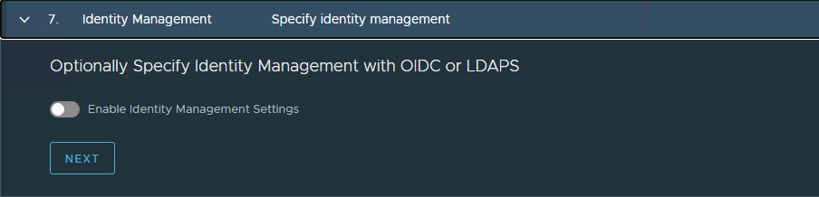

15. Select the OS image to use for the management cluster deployment.

    > **Note** This list appears empty if no compatible template is present in your environment.

    After you import the correct template and click **Refresh**, the installer detects the image automatically.

    

16.  **Optional:** Select **Participate in the Customer Experience Improvement Program**.

     

17. Click **Review Configuration** to verify your configuration settings.

    
    
    When you click **Review Configuration**, the installer populates the cluster configuration file, which is located in the `~/.config/tanzu/tkg/clusterconfigs` subdirectory, with the settings that you specified in the interface. You can optionally export a copy of this configuration file by clicking **Export Configuration**.

    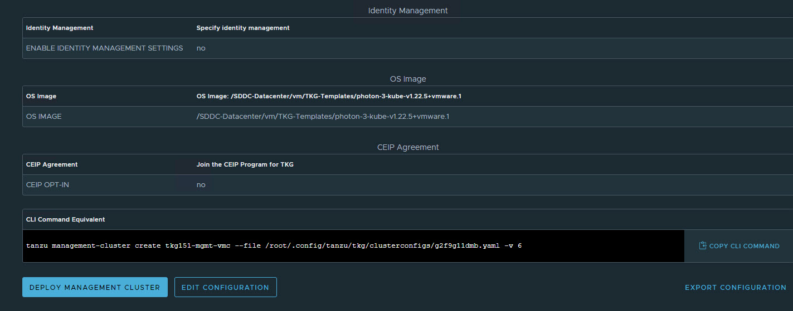

18. Deploy the management cluster from this configuration file by running the command:

    ```
    tanzu management-cluster create -f t4uv9zk25b.yaml  -v 6
    ```

    When the deployment is started from the UI, the installer wizard displays the deployment logs on the screen.

    Deploying the management cluster takes approximately 20-30 minutes to complete. While the management cluster is being deployed, a virtual service is created in NSX Advanced Load Balancer and placed on one of the service engines created in the "sfo01m01segroup01" SE Group.

    The installer automatically sets the context to the management cluster so that you can log in to it and perform additional tasks such as verifying health of the management cluster and deploying the workload clusters.

19. After the Tanzu Kubernetes Grid management cluster deployment, run the following command to verify the health status of the cluster:

    ```
    tanzu management-cluster get
    ```

    Ensure that the cluster status reports as `running` and the values in the `Ready` column for nodes, etc., are `True`.

    

    See [Examine the Management Cluster Deployment](https://docs.vmware.com/en/VMware-Tanzu-Kubernetes-Grid/2.1/tkg-deploy-mc-21/mgmt-deploy-post-deploy.html) to perform additional health checks.

21.  When deployment is completed successfully, run the following command to install the additional Tanzu plugins:

     ```
     [root@tkg-bootstrapper ~]# tanzu plugin sync
     Checking for required plugins...
     Installing plugin 'cluster:v0.28.0'
     Installing plugin 'kubernetes-release:v0.28.0'
     Successfully installed all required plugins
     ✔  Done
     ```

## <a id=tmc-integration> </a> Register Management Cluster with Tanzu Mission Control

After the management cluster is deployed, you must register the management cluster with Tanzu Mission Control and other SaaS products. You can deploy the Tanzu Kubernetes clusters and Tanzu packages directly from the Tanzu Mission Control portal. Refer to the [Integrate Tanzu Kubernetes Clusters with SaaS Endpoints](tko-saas-services.md#a-idtmc-tkg-mgmt-a-register-a-tanzu-kubernetes-grid-management-cluster-with-tanzu-mission-control) page for instructions.

### Create AKO Deployment Config for Tanzu Kubernetes Grid Workload Cluster

Tanzu Kubernetes Grid v2.1.x management clusters with NSX Advanced Load Balancer are deployed with 2 AKODeploymentConfigs.

* `install-ako-for-management-cluster`: default config for management cluster
* `install-ako-for-all`:  default config for all workload clusters. By default, all the workload clusters reference this file for their virtual IP networks, service engine (SE) groups. This ADC configuration does not enable NSX L7 Ingress by default.

As per this Tanzu deployment, create 2 more ADCs:

* `tanzu-ako-for-shared`: Used by shared services cluster to deploy the Virtual services in `TKG Mgmt SE Group` and  the loadbalancer applications in `TKG Management VIP Network`.

* `tanzu-ako-for-workload-L7-ingress`: Use this ADC only if you would like to enable NSX Advanced Load Balancer L7 Ingress on workload cluster, otherwise leave the cluster labels empty to apply the network configuration from default ADC `install-ako-for-all`.

### <a id="sharedako"> </a> Configure AKO Deployment Config (ADC) for Shared Services Cluster

As per the defined architecture, shared services cluster use the same control plane and data plane network as the management cluster. Shared services cluster control plane endpoint uses `TKG Cluster VIP Network`, application load balancing uses `TKG Management Data VIP network`, and the virtual services are deployed in the `TKG-Mgmt-SEG` SE group. This configuration is enforced by creating a custom AKO Deployment Config (ADC) and applying the respective `NSXALB_LABELS` while deploying the shared services cluster.

The format of the AKODeploymentConfig YAML file is as follows.

<!-- /* cSpell:disable */ -->
```yaml
apiVersion: networking.tkg.tanzu.vmware.com/v1alpha1
kind: AKODeploymentConfig
metadata:
  finalizers:
     - ako-operator.networking.tkg.tanzu.vmware.com
  generation: 2
  name: <Unique name of AKODeploymentConfig>
spec:
  adminCredentialRef:
    name: nsx-alb-controller-credentials
    namespace: tkg-system-networking
  certificateAuthorityRef:
    name: nsx-alb-controller-ca
    namespace: tkg-system-networking
  cloudName: <NAME OF THE CLOUD in ALB>
  clusterSelector:
    matchLabels:
      <KEY>: <VALUE>
  controlPlaneNetwork:
    cidr: <TKG-Cluster-VIP-CIDR>
    Name: <TKG-Cluster-VIP-Network>
  controller: <NSX ALB CONTROLLER IP/FQDN>
  dataNetwork:
    cidr: <TKG-Mgmt-Data-VIP-CIDR>
    name: <TKG-Mgmt-Data-VIP-Name>
  extraConfigs:
   cniPlugin: antrea
   disableStaticRouteSync: true
   ingress:
      defaultIngressController: false
      disableIngressClass: true
      nodeNetworkList:
      - networkName: <TKG-Mgmt-Network>     
  serviceEngineGroup: <Mgmt-Cluster-SEG>

```
<!-- /* cSpell:enable */ -->

The sample AKODeploymentConfig with sample values in place is as follows. You should add the respective NSX ALB label `type=shared-services` while deploying shared services cluster to enforce this network configuration.

- cloud: ​`sfo01w01vmcvc01​`
- service engine group: `sfo01m01segroup01`
- Control Plane network: `sfo01-w01-vds01-tkgclustervip`
- VIP/data network: `sfo01-w01-vds01-tkgmanagementvip`
- Node Network: `sfo01-w01-vds01-tkgmanagement`

<!-- /* cSpell:disable */ -->
```yaml
apiVersion: networking.tkg.tanzu.vmware.com/v1alpha1
kind: AKODeploymentConfig
metadata:
  generation: 2
  name: tanzu-ako-for-shared
spec:
  adminCredentialRef:
    name: nsx_alb-controller-credentials
    namespace: tkg-system-networking
  certificateAuthorityRef:
    name: nsx_alb-controller-ca
    namespace: tkg-system-networking
  cloudName: sfo01w01vc01
  clusterSelector:
    matchLabels:
      type: shared-services
  controlPlaneNetwork:
    cidr: 192.168.14.0/26
    name: sfo01-w01-vds01-tkgclustervip
  controller: 192.168.11.8
  dataNetwork:
    cidr: 192.168.16.0/26
    name: sfo01-w01-vds01-tkgmanagementvip
  extraConfigs:
    cniPlugin: antrea
    disableStaticRouteSync: true
    ingress:
      defaultIngressController: false
      disableIngressClass: true
      nodeNetworkList:
      - networkName: sfo01-w01-vds01-tkgmanagement
  serviceEngineGroup: sfo01m01segroup01

```
<!-- /* cSpell:enable */ -->

After you have the AKO configuration file ready, use the `kubectl` command to set the context to Tanzu Kubernetes Grid management cluster and create the ADC:

<!-- /* cSpell:disable */ -->
```
# kubectl config use-context sfo01w01vc01-admin@sfo01w01vc01
Switched to context "sfo01w01vc01-admin@sfo01w01vc01".


# kubectl apply -f ako-shared-services.yaml
akodeploymentconfig.networking.tkg.tanzu.vmware.com/tanzu-ako-for-shared created
```
<!-- /* cSpell:enable */ -->

Use the following command to list all AKODeploymentConfig created under the management cluster:

<!-- /* cSpell:disable */ -->
```
# kubectl get adc
NAME                                 AGE
install-ako-for-all                  21h
install-ako-for-management-cluster   21h
tanzu-ako-for-shared                 113s
```
<!-- /* cSpell:enable */ -->

### <a id="l7workloadako"> </a> Configure AKO Deployment Config (ADC) for Workload Cluster to Enable NSX Advanced Load Balancer L7 Ingress with NodePortLocal Mode

VMware recommends using NSX Advanced Load Balancer L7 ingress with NodePortLocal mode for the L7 application load balancing. This is enabled by creating a custom ADC with ingress settings enabled, and then applying the NSXALB_LABEL while deploying the workload cluster.  

As per the defined architecture, workload cluster control plane endpoint uses `TKG Cluster VIP Network`, application load balancing uses `TKG Workload Data VIP network` and the virtual services are deployed in `sfo01w01segroup01` SE group.

Below are the changes in ADC Ingress section when compare to the default ADC.

* **disableIngressClass**: set to `false` to enable NSX Advanced Load Balancer L7 Ingress.

* **nodeNetworkList**: Provide the values for Tanzu Kubernetes Grid workload network name and CIDR.

* **serviceType**:  L7 Ingress type, recommended to use `NodePortLocal`

* **shardVSSize**: Virtual service size

The format of the AKODeploymentConfig YAML file for enabling NSX Advanced Load Balancer L7 Ingress is as follows.

<!-- /* cSpell:disable */ -->
```yaml
apiVersion: networking.tkg.tanzu.vmware.com/v1alpha1
kind: AKODeploymentConfig
metadata:
  name: <unique-name-for-adc>
spec:
  adminCredentialRef:
    name: nsx_alb-controller-credentials
    namespace: tkg-system-networking
  certificateAuthorityRef:
    name: nsx_alb-controller-ca
    namespace: tkg-system-networking
  cloudName: <cloud name configured in nsx alb>
  clusterSelector:
    matchLabels:
      <KEY>: <value>
  controller: <ALB-Controller-IP/FQDN>
  controlPlaneNetwork:
    cidr: <TKG-Cluster-VIP-Network-CIDR>
    name: <TKG-Cluster-VIP-Network-CIDR>
  dataNetwork:
    cidr: <TKG-Workload-VIP-network-CIDR>
    name: <TKG-Workload-VIP-network-CIDR>
  extraConfigs:
    cniPlugin: antrea
    disableStaticRouteSync: false                               # required
    ingress:
      disableIngressClass: false                                # required
      nodeNetworkList:                                          # required
        - networkName: <TKG-Workload-Network>
          cidrs:
            - <TKG-Workload-Network-CIDR>
      serviceType: NodePortLocal                                # required
      shardVSSize: MEDIUM                                       # required
  serviceEngineGroup: <Workload-Cluster-SEG>


```
<!-- /* cSpell:enable */ -->

The AKODeploymentConfig with sample values in place is as follows. You should add the respective NSX ALB label `workload-l7-enabled=true` while deploying shared services cluster to enforce this network configuration.

- cloud: ​`sfo01w01vc01​`
- service engine group: `sfo01w01segroup01`
- Control Plane network: `sfo01-w01-vds01-tkgclustervip`
- VIP/data network: `sfo01-w01-vds01-tkgworkloadvip`
- Node Network: `sfo01-w01-vds01-tkgworkload`

<!-- /* cSpell:disable */ -->
```yaml
apiVersion: networking.tkg.tanzu.vmware.com/v1alpha1
kind: AKODeploymentConfig
metadata:
  name: tanzu-ako-for-workload-l7-ingress
spec:
  adminCredentialRef:
    name: nsx_alb-controller-credentials
    namespace: tkg-system-networking
  certificateAuthorityRef:
    name: nsx_alb-controller-ca
    namespace: tkg-system-networking
  cloudName: tkg-vmc
  clusterSelector:
    matchLabels:
      workload-l7-enabled: "true"
  controlPlaneNetwork:
    cidr: 192.168.14.0/26
    name: sfo01-w01-vds01-tkgclustervip
  controller: 192.168.11.8
  dataNetwork:
    cidr: 192.168.15.0/26
    name: sfo01-w01-vds01-tkgworkloadvip
  extraConfigs:
    cniPlugin: antrea
    disableStaticRouteSync: false
    ingress:
      disableIngressClass: false
      nodeNetworkList:
        - cidrs:
          - 192.168.13.0/24
          networkName: sfo01-w01-vds01-tkgworkload
      serviceType: NodePortLocal
      shardVSSize: MEDIUM
  serviceEngineGroup: sfo01w01segroup01

```
<!-- /* cSpell:enable */ -->

Use the `kubectl` command to set the context to Tanzu Kubernetes Grid management cluster and create the ADC:

<!-- /* cSpell:disable */ -->
```
# kubectl config use-context tkg149-mgmt-vmc-admin@tkg149-mgmt-vmc
Switched to context "tkg149-mgmt-vmc-admin@tkg149-mgmt-vmc".

# kubectl apply -f workload-adc-l7.yaml
akodeploymentconfig.networking.tkg.tanzu.vmware.com/tanzu-ako-for-workload-l7-ingress created
```
<!-- /* cSpell:enable */ -->

Use the following command to list all AKODeploymentConfig created under the management cluster:

<!-- /* cSpell:disable */ -->
```
# kubectl get adc
NAME                                 AGE
install-ako-for-all                  22h
install-ako-for-management-cluster   22h
tanzu-ako-for-shared                 82m
tanzu-ako-for-workload-l7-ingress    25s

```
<!-- /* cSpell:enable */ -->

Now that you have successfully created the AKO deployment config, you need to apply the cluster labels while deploying the workload clusters to enable NSX Advanced Load Balancer L7 Ingress with NodePortLocal mode.

## <a id="set-up-shared-cluster"> </a>Deploy Tanzu Kubernetes Grid Shared Services Cluster

A shared services cluster is just a Tanzu Kubernetes Grid workload cluster used for shared services. It can be provisioned using the standard CLI command tanzu cluster create, or through Tanzu Mission Control. Each Tanzu Kubernetes Grid instance can have only one shared services cluster.


The procedure for deploying a shared service cluster is essentially the same as the procedure for deploying a workload cluster. The only difference is that you add a `tanzu-services` label to the shared services cluster to indicate its cluster role. This label identifies the shared services cluster to the management cluster and workload clusters.

Shared services cluster use the custom ADC tanzu-ako-for-shared created earlier to apply the network settings similar to management cluster. This is enforced by applying the NSXALB_LABEL `type:shared` while deploying the shared services cluster. <p>     

> **Note** The scope of this document doesn't cover the use of a proxy for Tanzu Kubernetes Grid deployment. If your environment uses a proxy server to connect to the internet, ensure that the proxy configuration object includes the CIDRs for the pod, ingress, and egress from the workload network of the Management Cluster in the **No proxy list**, as described in [Create a Proxy Configuration Object for a Tanzu Kubernetes Grid Service Cluster](https://docs.vmware.com/en/VMware-Tanzu-Mission-Control/services/tanzumc-using/GUID-B4760775-388A-45B5-A707-2191E9E4F41F.html).

1. To deploy a shared services cluster, navigate to the **Clusters** tab and click **Create Cluster**.

    

2. On the **Create cluster** page, select the Tanzu Kubernetes Grid management cluster that you registered in the previous step and click **Continue to create cluster**.

    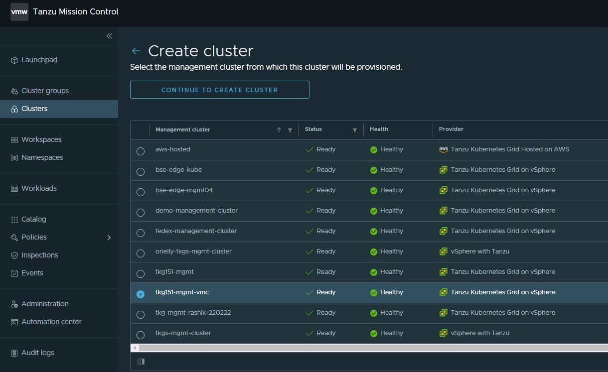

3. Select the provisioner for creating the shared services cluster.

    

4. On the Cluster Details Page 
- Enter a name for the cluster (Cluster names must be unique within an organization).
- select the cluster group to which you want to attach your cluster.
- Select Cluster Class by clicking on the down arrow button.
- Use the NSXALB_Labels created for shared cluster on AKO Deployment.


    

5. On the **Configure** page, specify the following:

   - In the **vCenter** and **tlsThumbprint** fields, enter the details for authentication.
   - From the  **datacenter**, **resourcePool**, **folder**, **network**, and **datastore** drop down, select the required information.
   - From the **template** drop down, select the Kubernetes version.The latest supported version is preselected for you. 
   - In the **sshAuthorizedKeys** field, enter the SSH key that was created earlier.
   - Enable aviAPIServerHAProvider.

    

6. Update POD CIDR and Service CIDR if necessary.

    

7. Select the high availability mode for the control plane nodes of the shared services cluster. For a production deployment, it is recommended to deploy a highly available shared services cluster.

    

8. You can optionally define the default node pool for your workload cluster.

   - Specify the number of worker nodes to provision.
   - Select OS Version.

   
10. Click **Create Cluster** to start provisioning your Shared cluster.

    Cluster creation roughly takes 15-20 minutes to complete. After the cluster deployment completes, ensure that **Agent and extensions health** shows green.

    

1. Connect to the Tanzu Management Cluster context and verify the cluster labels for the workload cluster.
    <!-- /* cSpell:disable */ -->
     ```bash
    ## verify the workload  service cluster creation

    tanzu cluster list
    NAME                  NAMESPACE  STATUS   CONTROLPLANE  WORKERS  KUBERNETES        ROLES   PLAN  TKR
    
    sfo01w0tkgshared01    default    running  3/3           3/3      v1.24.9+vmware.1  <none>  prod  v1.24.9---vmware.1-tkg.1


    ## Connect to tkg management cluster

    kubectl config use-context sfo01w01tkgmgmt01-admin@sfo01w01tkgmgmt01

    ## Add the tanzu-services label to the shared services cluster as its cluster role. In the following command "sfo01w01tkgshared01” is the name of the shared service cluster
    
    kubectl label cluster.cluster.x-k8s.io/sfo01w0tkgshared01 cluster-role.tkg.tanzu.vmware.com/tanzu-services="" --overwrite=true
    cluster.cluster.x-k8s.io/sfo01w0tkgshared01 labeled

    ## Validate that TMC has applied the AVI_LABEL while deploying the cluster

    kubectl get cluster sfo01w0tkgshared01 --show-labels
    NAME                   PHASE         AGE    VERSION   LABELS
    
    sfo01w0tkgshared01   Provisioned   105m             cluster-role.tkg.tanzu.vmware.com/tanzu-services=,networking.tkg.tanzu.vmware.com/avi=tanzu-ako-for-shared,tanzuKubernetesRelease=v1.24.9---vmware.1-tkg.1,tkg.tanzu.vmware.com/cluster-name=sfo01w0tkgshared01,type=shared-services

      ```
    <!-- /* cSpell:enable */ -->

1. Connect to admin context of the workload cluster using the following commands and validate the ako pod status.

    <!-- /* cSpell:disable */ -->
     ```bash
    ## Use the following command to get the admin context of workload Cluster.

    tanzu cluster kubeconfig get sfo01w0tkgshared01 --admin
    
    Credentials of cluster 'sfo01w0tkgshared01' have been saved
    You can now access the cluster by running 'kubectl config use-context sfo01w0tkgshared01-admin@sfo01w0tkgshared01'


    ## Use the following command to use the context of workload Cluster

    kubectl config use-context sfo01w0tkgshared01-admin@sfo01w0tkgshared01
    
    Switched to context "sfo01w0tkgshared01-admin@sfo01w0tkgshared01".
    
    # Verify that ako pod gets deployed in avi-system namespace

     kubectl get pods -n avi-system
    NAME    READY   STATUS    RESTARTS   AGE
    ako-0   1/1     Running   0          73m

    # verify the nodes and pods status by running the command:
    kubectl get nodes -o wide

    kubectl get pods -A 
     ```
    <!-- /* cSpell:enable */ -->

Now that the shared services cluster is successfully created, you may proceed with deploying the Harbor package. For more information, see Install Harbor in [Deploy User-Managed Packages in Workload Clusters](./tkg-package-install.md).

## <a id=deploy-workload-cluster> </a> Deploy Tanzu Kubernetes Clusters (Workload Clusters)

As per the architecture, workload clusters make use of a custom ADC to enable NSX Advanced Load Balancer L7 ingress with NodePortLocal mode. This is enforced by providing the NSXALB_LABEL while deploying the workload cluster.

The steps for deploying a workload cluster are the same as for a shared services cluster. However, in step number 4, use the NSXALB Labels created for the Workload cluster on AKO Deployment.

**After the Workload cluster creation verify the cluster labels and ako pod status**
1. Connect to the Tanzu Management Cluster context and verify the cluster labels for the workload cluster.
    <!-- /* cSpell:disable */ -->
     ```bash
    ## verify the workload  service cluster creation

    tanzu cluster list
    NAME                  NAMESPACE  STATUS   CONTROLPLANE  WORKERS  KUBERNETES        ROLES   PLAN  TKR
    
    sfo01w01shared01    default    running  3/3           3/3      v1.24.9+vmware.1  <none>  prod   v1.24.9---vmware.1-tkg.1

    sfo01w01workload01  default    running  3/3           3/3      v1.24.9+vmware.1  <none>  prod   v1.24.9---vmware.1-tkg.1

    ## Connect to tkg management cluster

    kubectl config use-context sfo01w01vc01-admin@sfo01w01vc01

    ## Validate that TMC has applied the AVI_LABEL while deploying the cluster

    kubectl get cluster sfo01w01workload01 --show-labels
    NAME                   PHASE         AGE    VERSION   LABELS
    
    sfo01w01workload01   Provisioned   105m             networking.tkg.tanzu.vmware.com/avi=tanzu-ako-for-workload-l7-ingress,tanzuKubernetesRelease=v1.249---vmware.1-tkg.1,tkg.tanzu.vmware.com/cluster-name=sfo01w01workload01,workload-l7-enabled=true


      ```
    <!-- /* cSpell:enable */ -->

1. Connect to admin context of the workload cluster using the following commands and validate the ako pod status.

    <!-- /* cSpell:disable */ -->
     ```bash
    ## Use the following command to get the admin context of workload Cluster.

    tanzu cluster kubeconfig get sfo01w01workload01 --admin
    
    Credentials of cluster 'sfo01w01workload01' have been saved
    You can now access the cluster by running 'kubectl config use-context sfo01w01workload01-admin@sfo01w01workload01'


    ## Use the following command to use the context of workload Cluster

    kubectl config use-context sfo01w01workload01-admin@sfo01w01workload01
    
    Switched to context "sfo01w01workload01-admin@sfo01w01workload01".
    
    # Verify that ako pod gets deployed in avi-system namespace

     kubectl get pods -n avi-system
    NAME    READY   STATUS    RESTARTS   AGE
    ako-0   1/1     Running   0          73m

    # verify the nodes and pods status by running the command:
    kubectl get nodes -o wide

    kubectl get pods -A 
     ```
    <!-- /* cSpell:enable */ -->

You can now configure SaaS components and deploy user-managed packages on the cluster.

## <a id=integrate-to> </a> Integrate Tanzu Kubernetes Clusters with Tanzu Observability

For instructions on enabling Tanzu Observability on your workload cluster, see [Set up Tanzu Observability to Monitor a Tanzu Kubernetes Clusters](./tko-saas-services.md#set-up-tanzu-observability-to-monitor-a-tanzu-kubernetes-clusters).

## <a id=integrate-tsm> </a> Integrate Tanzu Kubernetes Clusters with Tanzu Service Mesh

For instructions on installing Tanzu Service Mesh on your workload cluster, see [Onboard a Tanzu Kubernetes Cluster to Tanzu Service Mesh](./tko-saas-services.md#onboard-a-tanzu-kubernetes-cluster-to-tanzu-service-mesh).

## <a id=deploy-user-managed-packages> </a> Deploy User-Managed Packages on Tanzu Kubernetes clusters

For instructions on installing user-managed packages on the Tanzu Kubernetes clusters, see [Deploy User-Managed Packages in Workload Clusters](./tkg-package-install.md).
