# Deploy Tanzu for Kubernetes Operations on VMware Cloud on AWS

This document provides step-by-step instructions for deploying Tanzu Kubernetes Operations on VMware Cloud on AWS.

The scope of the document is limited to providing the deployment steps based on the reference design in [VMware Tanzu Standard on VMware Cloud on AWS Reference Design](../reference-designs/tko-on-vmc-aws.md)

## Prerequisites
The instructions provided in this document assumes that you have the following setup:

* VMware Cloud subscription
* SDDC deployment
* Access to vCenter over HTTPs
* NTP configured on all ESXi hosts and vCenter server

# **Tanzu Kubernetes Grid (multi-cloud) Bill Of Materials**

Below is the validated Bill of Materials (latest) that can be used to install vSphere with Tanzu on your vSphere environment today.

|**Software Components**|**Version**|
| :- | :- |
|Tanzu Kubernetes Grid|1.5.1|
|VMware Cloud on AWS SDDC Version|1.16 and later|
|NSX Advanced Load Balancer|20.1.7|

The Interoperability Matrix can be verified at all times [here](https://interopmatrix.vmware.com/Interoperability?col=551,5305&row=648,&row=1,%262,%26789,)

# **Prepare the Environment for Deployment of the Tanzu Kubernetes Operations** 

Before deploying Tanzu Kubernetes Operations in VMC on AWS, ensure that your environment is set up as described in the following:

- [General Requirements](#genreq)
- [Network Requirements](#netreq)
- [Firewall Requirements](#fwreq)

### <a id=genreq> </a> **General Requirements**

The following are general requirements that your environment should have:

- SDDC v1.16 or later deployed in VMC on AWS.

- Your SDDC has the following objects in place:
  - Dedicated resource pools and VM folders for collecting Tanzu Kubernetes Grid and NSX Advanced Load Balancer VMs. Refer to the Resource Pools and VM Folders section for more information.
  - NSX Advanced Load Balancer 20.1.7 ova downloaded from [customer connect](https://customerconnect.vmware.com/home?bmctx=89E60DF848C641FD518EB9F6B9A6E5334F602FA3A762B409625CD531863AC847&contextType=external&username=string&password=secure_string&challenge_url=https:%2F%2Fcustomerconnect.vmware.com%2Fhome&request_id=-7975651889850440054&authn_try_count=0&locale=en_GB&resource_url=https%253A%252F%252Fcustomerconnect.vmware.com%252Fweb%252Fvmware%252Fchecksession) portal and readily available for deployment. <!-- markdown-link-check-disable-line -->
  - A content library to store NSX Advanced Load Balancer Controller and Service Engine ova templates.  

### <a id=netreq> </a> **Network Requirements**

Create NSX-T logical segments for deploying TKO components as per [Network Recommendations](../reference-designs/tko-on-vmc-aws.md#network-recommendations) defined in the reference architecture.

### <a id=fwreq> </a> **Firewall Requirements**

Ensure that the firewall is set up as described in [Firewall Recommendations](../reference-designs/tko-on-vmc-aws.md#a-idfirewallafirewall-recommendations)

**Resource Pools and VM Folders**

The following table shows sample entries of the resource pools and folders that you should create in your SDDC.

|**Resource Type**|**Resource Pool name**|**Sample Folder name**|
| :- | :- | :- |
|NSX Advanced Load Balancer Components|<p>NSX-Advanced Load Balancer</p><p></p>|NSX-Advanced Load Balancer-VMS|
|TKG Management Components|TKG-Management|TKG-Mgmt-VMS|
|TKG Shared Services Components|TKG-Shared-Services|TKG-Shared-Services-VMS|
|TKG Workload Components|TKG-Workload|TKG-Workload-VMS|

### <a id=subnet-and-cidr-examples> </a> **Subnet and CIDR Examples**

For the purpose of demonstration, this document makes use of the following Subnet CIDR for TKO deployment.

|**Network Type**|**Segment Name**|**Gateway CIDR**|**DHCP Pool**|**NSX Advanced Load Balancer IP Pool**|
| :- | :- | :- | :- | :- |
|NSX ALB Mgmt Network|NSX-ALB-Mgmt|192.168.11.1/27|192.168.11.15 - 192.168.11.20|192.168.11.21 - 192.168.11.30|
|TKG Management Network|TKG-Management|192.168.12.1/24|192.168.12.2 - 192.168.12.251|NA|
|TKG Workload Network|TKG-Workload-PG01|192.168.13.1/24|192.168.13.2 - 192.168.13.251|NA|
|TKG Cluster VIP Network|TKG-Cluster-VIP|192.168.14.1/26|NA|192.168.14.2 - 192.168.14.60|
|TKG Mgmt VIP Network|TKG-SS-VIP|192.168.15.1/26|NA|192.168.15.2 - 192.168.15.60|
|TKG Workload VIP Network|TKG-Workload-VIP|192.168.16.1/26|NA|192.168.16.2 - 192.168.16.60|
|TKG Shared Services Network|TKG-Shared-Service|192.168.17.1/24|192.168.17.2 - 192.168.17.251||

## Deployment Overview

The following are the high-level steps for deploying Tanzu for Kubernetes Operation on VMware Cloud on AWS:

1. [Deploy and Configure NSX Advanced Load Balancer](#dep-config-nsxalb).
2. [Configure Bootstrap Environment](#config-bootstrap).
3. [Deploy Management Cluster](#deploy-mgmt-cluster).
4. [Register Management Cluster with Tanzu Mission Control](#tmc-integration)
5. [Deploy and Configure Shared Services Workload Cluster](#set-up-shared-cluster).
6. [Deploy Tanzu Kubernetes Clusters (Workload Cluster)](#deploy-workload-cluster)

## <a id="dep-config-nsxalb"></a> Deploy and Configure NSX Advanced Load Balancer

We will deploy NSX Advanced Load Balancer as a cluster of three nodes. We will deploy the first, complete the required configuration, then deploy two more nodes to form the cluster. We will reserve the following IP addresses for deploying NSX Advanced Load Balancer:

<!-- /* cSpell:disable */ -->

|**Controller Node**|**IP Address**|**FQDN**|
| :- | :- | :- |
|Node01 (Primary)|192.168.11.11|alb0101.tanzu.lab|
|Node02 (Secondary)|192.168.11.12|alb02.tanzu.lab|
|Node03 (Secondary) |192.168.11.13|alb03.tanzu.lab|
|Controller Cluster IP|192.168.11.10|alb.tanzu.lab|

<!-- /* cSpell:enable */ -->

To deploy NSX Advanced Load Balancer controller nodes:

1. Log in to the vCenter Server by using the vSphere Client.

1. Select the cluster where you want to deploy the NSX Advanced Load Balancer controller node.

1. Right-click on the cluster and invoke the **Deploy OVF Template** wizard. 

1. Follow the wizard to configure the following:

    - VM Name and Folder Location.
    - Select the **NSX-Advanced Load Balancer** resource pool as a compute resource.
    - Select the datastore for the controller node deployment.
    - Select the **NSX-Advanced Load Balancer-Mgmt** port group for the Management Network.
    - Customize the configuration by providing Management Interface IP Address, Subnet Mask, and Default Gateway. The rest of the fields are optional and can be left blank.

Once the controller VM is deployed and powered on, perform the post-deployment  configuration of the controller node by connecting to URL ***https://<alb01.tanzu.lab>/***

Configure the controller node for your Tanzu Kubernetes Grid environment as follows:

- Configure the administrator account by setting up password and email (optional).


- Configure System Settings by specifying the backup passphrase and DNS information.


- (Optional) Configure **Email/SMTP**


- Configure Multi-Tenant settings as follows:

   - **IP Route Domain:** Per tenant IP route domain.
   - **Service Engine Context:** Tenant context, (not shared across tenants).


Click on the Save button to finish the post-deployment configuration wizard. 

If you did not select the Setup Cloud After option before saving, the initial configuration wizard exits. The Cloud configuration window does not automatically launch and you are directed to a Dashboard view on the controller.

### **Configure No Orchestrator Cloud**

To configure the No Orchestrator Cloud, navigate to the **Infrastructure > Clouds** and click on the Create button and select the option No Orchestrator.


Provide a name for the cloud and click on the Next button to continue.


Enable IPv4 DHCP in the cloud settings and click on the Save button to complete the New Cloud creation wizard.


After the cloud is created, ensure that the health status of the cloud is reporting green.


### **Configure Licensing**

Tanzu for Kubernetes Operations is bundled with NSX Advanced Load Balancer Enterprise license. To configure licensing, navigate to the **Administration > Settings > Licensing** and apply the license key. 


**Note:** If you have a license file instead of a license key, assign the license by clicking on the Upload from Computer option. 


### **Configure NTP Settings**

Configure NTP settings if you want to use an internal NTP server. To configure NTP settings, navigate to the **Administration > Settings > DNS/NTP** page.


Edit the settings using the pencil icon to specify the NTP server that you want to use and save the settings.


### **Configure NSX Advanced Load Balancer Controller Cluster**

In a production environment, it is recommended to deploy additional controller nodes and configure the controller cluster for high availability and disaster recovery. Adding 2 additional nodes to create a 3-node cluster provides node-level redundancy for the controller and also maximizes performance for CPU-intensive analytics functions. 

To run a 3 node controller cluster, you deploy the first node and perform the initial configuration, and set the Cluster IP. After that, you deploy and power on two more Controller VMs, but you must not run the initial configuration wizard or change the admin password for these controllers VMs. The configuration of the first controller VM is assigned to the two new Controller VMs.

Repeat the steps provided in the Deploy NSX Advanced Load Balancer Controller section to deploy additional controllers. 

To configure the Controller Cluster, navigate to the **Administration > Controller > Nodes** page and click on the edit button.


Specify the name for the controller cluster and set the Cluster IP. This IP address should be from the NSX Advanced Load Balancer management network. 

Under Cluster Nodes, specify the IP addresses of the 2 additional controllers that you have deployed. Optionally you can configure the name for the controllers. Click on the Save button to finish the cluster configuration wizard.


After hitting the save button, the controller cluster setup kicks in, and the controller nodes are rebooted in the process. It takes approximately 10-15 minutes for cluster formation to complete.

You will be automatically logged out of the controller node where you are currently logged in. On entering the cluster IP in the browser, you can see details about the cluster formation task.


Please note that once the controller cluster is deployed, you must use the controller cluster IP for any further configuration and not the individual controller node IP.

Connect to the NSX Advanced Load Balancer controller cluster IP/FQDN and ensure that all controller nodes are in a healthy state.


The first controller of the cluster receives the "Leader" role. The second and third controllers will work as "Followers". 

### **Change NSX Advanced Load Balancer Portal Certificate**

The Controller must send a certificate to clients to establish secure communication. This certificate must have a Subject Alternative Name (SAN) that matches the NSX Advanced Load Balancer Controller cluster hostname or IP address.

The Controller has a default self-signed certificate. But this certificate does not have the correct SAN. You must replace it with a valid or self-signed certificate that has the correct SAN. You can create a self-signed certificate or upload a CA-signed certificate. 

For the purpose of the demonstration, this document makes use of a self-signed certificate. 

To replace the default certificate, navigate to the **Templates > Security > SSL/TLS Certificate > Create** and select Controller Certificate.


In the New Certificate (SSL/TLS) window, select Type as Self Signed and enter a name for the certificate.

Enter the following details:

- **Common Name** - Specify the fully-qualified name of the site. For the site to be considered trusted, this entry must match the hostname that the client entered in the browser.
- **Subject Alternate Name (SAN)** - Enter the cluster IP address or FQDN of the Controller cluster nodes.
- **Algorithm** - Select either EC or RSA. 
- Key Size

Click on the Save button to save the certificate.


To change the NSX Advanced Load Balancer portal certificate, navigate to the **Administration > Settings > Access Settings** page and edit the System Access Settings by clicking on the pencil icon.


Under SSL/TLS Certificate, remove the existing default certificates and from the drop-down menu, select the newly created certificate and click on the Save button.

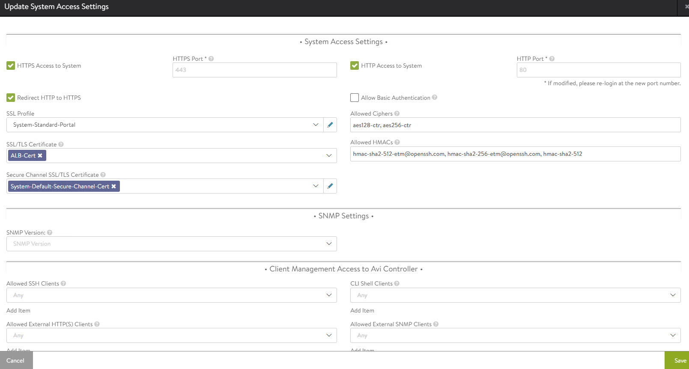

Refresh the controller portal from the browser and accept the newly created self-signed cert and ensure that the certificate is reflecting the updated information in the browser.

### **Export NSX Advanced Load Balancer certificate**

After the certificate is created, export the certificate thumbprint as the thumbprint will be required later when configuring the TKG Management cluster.

To export the certificate, navigate to the **Templates > Security > SSL/TLS Certificate** page and export the certificate by clicking on the export button.

In the Export Certificate page that appears, click Copy to clipboard against the certificate. Do not copy the key. Save the copied certificate for later use when you enable workload management.

### **Configure Service Engine Groups**

TKO deployment is based on the use of distinct Service Engine Groups (SEG) for the TKG management and workload clusters. The management cluster's Service Engines are deployed in the TKG management SEG, and the TKG workload cluster's Service Engines are deployed in the TKG workload SEG.

**TKG-Mgmt-SEG**: Service engines part of this Service Engine group hosts:

- Virtual services for all load balancer functionalities requested by TKG Management and Shared-Services cluster.
- Virtual services that load balances control plane nodes of all TKG clusters

**TKG-WLD01-SEG**: Service engines part of this Service Engine group, hosts virtual services for all load balancer functionalities requested by TKG Workload clusters mapped to this SE group.

**Note:** 

- Based on your requirements, you can create additional Service Engine groups for the workload clusters. 
- Multiple Workload clusters can be mapped to a single SE group.
- A TKG cluster can be mapped to only one SE group for Application load balancer services.

To create a new SEG, navigate to the **Infrastructure > Service Engine Group** and click on the Create button. 


Provide a name for the SEG and configure the following settings:

- **High Availability Mode:** Elastic HA N + M (buffer)
- **VS Placement across SEs:** Compact
- **Virtual Service per Service Engine:** 10
- **SE Self-Election:** Selected


Repeat the process for creating SEG for the TKG workload cluster. Once complete there must be two service engine groups created.


### **Configure VIP Networks**

As per the reference architecture, TKO deployment makes use of three VIP networks:

- **TKG-Cluster-VIP:** This network provides high availability for the control plane nodes of the TKG management cluster, shared services cluster, and the workload clusters.
- **Shared-Services VIP:** This network provides VIP for the extensions (envoy, contour, etc) deployed in the shared-services cluster.
- **TKG-Workload-VIP:** This network provides VIP for the applications (of type load balancer) deployed in the workload clusters.

**Note:** You can provision additional VIP networks for the network traffic separation for the applications deployed in various workload clusters. This will be a day-2 operation.

To configure the VIP networks, navigate to the **Infrastructure > Networks** tab and click on the Create button. Check that the VIP networks are being created under the correct cloud.


Provide a name for the VIP network and uncheck the DHCP Enabled and IPv6 Auto-Configuration options. 

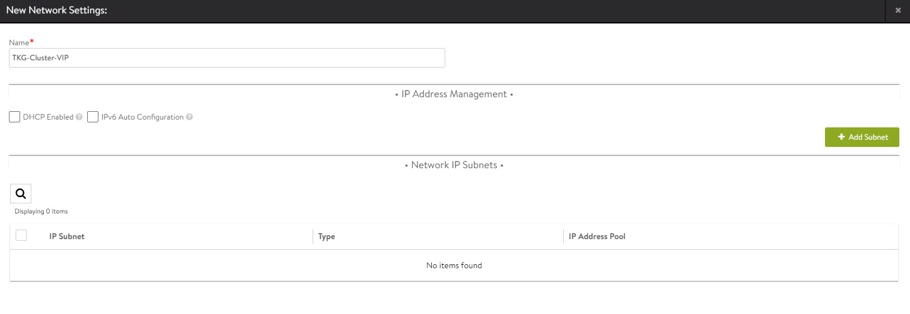

Click on the Add Subnet button and configure the following:

- **IP Subnet:** Subnet CIDR of the VIP network.
- **Static IP Address Pool:** Range of IP addresses that will be assigned to Service Engines and the Virtual Services that will be deployed. 

Click on the Save button to continue. 


Click on the save button again to finish the network configuration wizard. 


Repeat the process to create additional VIP networks.

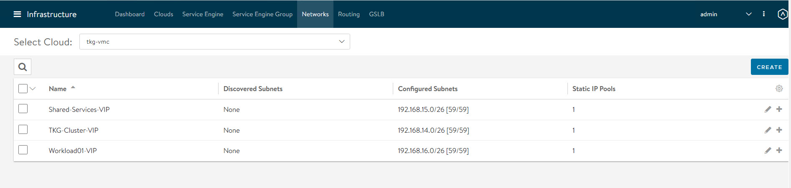

### **Configure Routing**

Once the VIP networks are configured, set the default routes for all VIP/Data networks. The below table lists the default routes used in the current environment.

|**Network Name**|**Gateway Subnet**|**Next Hop**|
| :- | :- | :- |
|TKG-Cluster-VIP|0.0.0.0/0|192.168.14.1|
|TKG-SS-VIP|0.0.0.0/0|192.168.15.1|
|Workload-VIP|0.0.0.0/0|192.168.16.1|

**Note:** Change the gateway for VIP networks as per your network configurations.

Navigate to the **Routing** page and click on the Create button.


Add default routes for the VIP networks.


Repeat the process to configure additional routing. A total of 3 default gateways are configured. 


### **Configuring IPAM & DNS Profile**

IPAM is required to allocate virtual IP addresses when virtual services get created. NSX Advanced Load Balancer provides IPAM service for TKG Cluster VIP Network, TKG Mgmt VIP Network and TKG Workload VIP Network.

To create an IPAM profile, navigate to the **Templates > Profiles > IPAM/DNS Profiles** page, click on the **Create** button, and select IPAM Profile. 

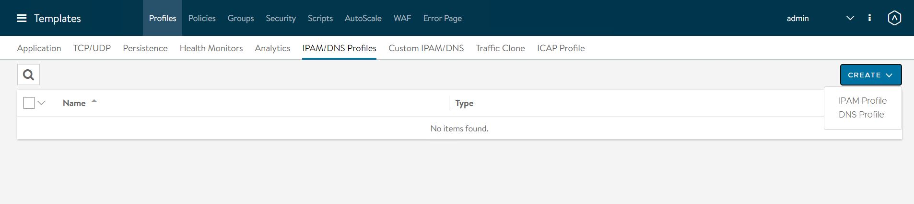

Create the profile using the values as shown in the below table.

|**Parameter**|**Value**|
| :- | :- |
|Name|Advanced Load Balancer-TKG-IPAM|
|Type|AVI Vintage IPAM|
|Cloud for Usable Networks|tkg-vmc|
|Usable Networks|<p>TKG-Cluster-VIP</p><p>TKG-SS-VIP</p><p>Workload-VIP</p>|

Click on the Save button to finish the IPAM creation wizard.


To create a DNS profile, click on the Create button again and select DNS Profile.

- Provide a name for the DNS Profile and select type as AVI Vantage DNS. 
- Under Domain Name specify the domain that you want to use with NSX Advanced Load Balancer.
- Optionally override record TTL value for the domain. The default is 30 seconds for all domains.


The newly created IPAM and DNS profiles need to be associated with the cloud in order to be leveraged by the NSX Advanced Load Balancer objects created under that cloud. 

To assign the IPAM and DNS profile to the cloud, navigate to the **Infrastructure > Cloud** page and edit the cloud configuration.

Under IPAM Profile, select the IPAM profile. 

Under DNS Profile, select the DNS profile and save the settings. 


Verify that the status of the cloud is green after configuring the IPAM and DNS profile.

### **Deploy and Configure Service Engine**

Deployment of the service engine is manual in VMC on AWS environment because NSX Advanced Load Balancer is deployed in the no-orchestrator mode and in this mode, NSX Advanced Load Balancer does not have access to the ESX management plane. Access to the ESX management plane is required for Service Engine automated deployment.

To download the Service Engine image for deployment navigate to the **Infrastructure > Cloud** tab, select your cloud, click on the download icon, and select type as ova.


Wait a few minutes for the image generating task to finish. When the task is finished, the resulting image file is immediately downloaded.

**Import Service Engine image file into the content library**

The downloaded ova file can be used directly to create a Service Engine VM, but this requires uploading the image to vCenter every time a new Service Engine VM needs to be created.

For faster deployment, import the Service Engine ova image in the content library and use the "deploy from template" wizard to create new Service Engine VMs.

**Generate Cluster UUID and Authentication Token**

Before deploying Service Engine VMs, you need to obtain the cluster UUID and generate an authentication token. Cluster UUID facilitates Service Engine Integration with NSX Advanced Load Balancer Controller and authentication between the two is performed via an authentication token.

To generate Cluster UUID and auth token, navigate to **Infrastructure > Clouds** and click on the key icon in front of the cloud that you have created. A new pop window will open and it contains both Cluster UUID and auth token.

**Note:** You need a new auth token every time a new service engine instance is deployed.


**Deploy Service Engine VMs for TKG Management Cluster**

To deploy a Service Engine VM, login to the vSphere client and navigate to **Menu > Content Library > Your Content Library**. Navigate to the **Templates** tab and select the Service Engine template, right-click on it, and choose New VM from this template.

Follow the VM creation wizard and on the networks page, select the management and data networks for the SE VM.

The Management network label is mapped to the NSX Advanced Load Balancer Management logical segment. The remaining network labels (Data Network 1 – 9) are connected to any of the front-end virtual service’s network or back-end server’s logical network as required. It is left disconnected if not required.

Service Engine for the TKG management cluster is connected to the following networks:

- Management: NSX-Advanced Load Balancer-Mgmt
- Data Network 1: TKG-Cluster-VIP
- Data Network 2: TKG-SS-VIP
- Data Network 3: TKG-Management
- Data Network 4: TKG-Shared-Services


Provide the Cluster UUID and Authentication Token that you generated earlier on the customize template page. Configure the Service Engine VM management network settings as well.


Repeat the process to deploy an additional Service Engine VM for the TKG management cluster.

The Service Engine VMs are created by default in the default Service Engine Group. 


To map the Service Engine VMs to the correct Service Engine Group, go to the **Infrastructure > Service Engine** tab, choose your cloud, and then click on the pencil icon to update the settings and link the Service Engine to the correct SEG.


Repeat the same step for the other Service Engine VMs and correct the Service Engine Group association.

Under the Service Engine Group page, you can confirm the Service Engine > Service Engine Group relationship.

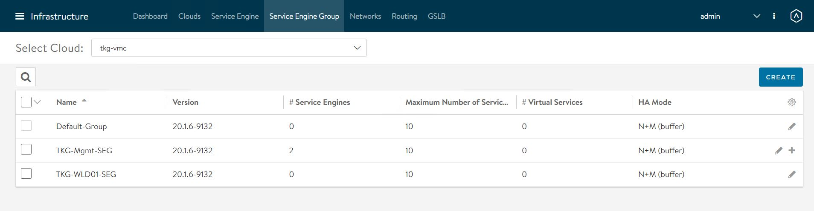

**Deploy Service Engines for TKG workload cluster**

Service Engine VMs deployed for TKG workload cluster is connected to the following networks:

- Management: NSX-Advanced Load Balancer-Mgmt
- Data Network 1: Workload-VIP
- Data Network 2: TKG-Workload-PG01


You need to deploy a couple of Service Engine VMs with above settings.

Post deployment edit the Service Engine VMs and associate it with the **TKG-WLD01-SEG** Service Engine Group. 

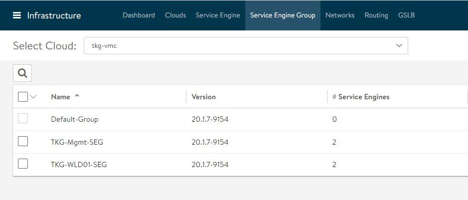

And that concludes the NSX Advanced Load Balancer configuration.

## **Deploy & Configure TKG Bootstrapper**

The deployment of the TKG management & workload cluster is facilitated by setting up a bootstrap machine where you install the Tanzu CLI and Kubectl utilities which are used to create and manage the TKG instance. This machine also keeps the TKG and Kubernetes configuration files of your deployments. 

The bootstrapper runs a local kind cluster when TKG management cluster deployment is triggered and once the kind cluster is fully initialized, the configuration is then used to deploy the actual management cluster on the backend infrastructure. Once the management cluster is fully configured, the local kind cluster is deleted and the future configurations are performed via Tanzu CLI.

### **Download Kubernetes Templates and TKG Tools**

To deploy the TKG instance, you have to first import the supported version of the Kubernetes ova into your vCenter server and convert the imported ova into a template. This template will be used by the TKG installer to deploy the management and workload cluster.

For importing an ova template in vCenter, please refer to the instructions provided [here](https://docs.vmware.com/en/VMware-vSphere/7.0/com.vmware.vsphere.vm_admin.doc/GUID-17BEDA21-43F6-41F4-8FB2-E01D275FE9B4.html) 

To know more about the supported K8’s version with TKG 1.5.1, see the [TKG Release Notes](https://docs.vmware.com/en/VMware-Tanzu-Kubernetes-Grid/1.5/rn/vmware-tanzu-kubernetes-grid-15-release-notes/index.html#supported-kubernetes-versions-in-tanzu-kubernetes-grid-v15).

You can download the supported Kubernetes templates for TKG 1.5.1 from the VMware [customer connect](https://customerconnect.vmware.com/downloads/details?downloadGroup=TKG-151&productId=1098&rPId=84734) portal.

Download the following items from the portal:

- Photon v3 Kubernetes v1.22.5 or Ubuntu 2004 Kubernetes v1.22.5 OVA
- VMware Tanzu CLI
- kubectl cli v1.22.5 for Linux

### **Configure Bootstrap Environment**

In VMC on AWS environment, the bootstrap machine must be a cloud VM, not a local machine, and should meet the following prerequisites.

- A minimum of 6 GB of RAM and a 2-core CPU.
- System time is synchronized with a Network Time Protocol (NTP) server.
- Docker and containerd binaries installed. For instructions on how to install Docker, please refer to the Docker official [documentation](https://docs.docker.com/engine/install/)

**Note:** For the purpose of the demonstration, this document refers to a bootstrapper machine as an CentOS-7 instance deployed in VMC SDDC and attached to the logical segment designated for the TKG management cluster.

To use the TKG installation binaries, upload the Tanzu CLI and Kubectl binary to the bootstrapper machine using WinSCP or a similar utility and unpack them using the system utilities like *tar/unzip/gunzip*.

### **Install Tanzu CLI Plugins**

After you unpack the Tanzu CLI bundle file, you will see a cli folder with multiple subfolders and files. Use the below command to install the Tanzu CLI.

<!-- /* cSpell:disable */ -->
```
[root@tkg-bootstrapper ~]# tar -xvf tanzu-cli-bundle-linux-amd64.tar
 
[root@tkg-bootstrapper ~]# install cli/core/v0.11.1/tanzu-core-linux_amd64 /usr/local/bin/tanzu
```
<!-- /* cSpell:enable */ -->

At the command line, run the Tanzu version command to check that the correct version of the CLI is properly installed. After you have installed the Tanzu CLI, you must install the plugins related to Tanzu Kubernetes cluster management and feature operations.

To install the tanzu plugins, run the **tanzu plugin sync** command. 

<!-- /* cSpell:disable */ -->

```
[root@tkg-bootstrapper ~]# tanzu plugin sync
Checking for required plugins...
Installing plugin 'login:v0.11.1'
Installing plugin 'management-cluster:v0.11.1'
Installing plugin 'package:v0.11.1'
Installing plugin 'pinniped-auth:v0.11.1'
Installing plugin 'secret:v0.11.1'
Successfully installed all required plugins
✔  Done
```
<!-- /* cSpell:enable */ -->

After a successful installation, run the **tanzu plugin list** command to validate that the status of the plugin is showing as installed.

### **Install Kubectl**

Run the following commands to install the Kubectl utility:

<!-- /* cSpell:disable */ -->
```
[root@tkg-bootstrapper ~]# gunzip kubectl-linux-v1.22.5+vmware.1.gz

[root@tkg-bootstrapper ~]# mv kubectl-linux-v1.22.5+vmware.1 kubectl

[root@tkg-bootstrapper ~]# chmod +x kubectl

[root@tkg-bootstrapper ~]# mv kubectl /usr/local/bin/
```
<!-- /* cSpell:enable */ -->

After installing kubectl binary, run the kubectl version to validate that the kubectl command is working and the version reports as 1.22.5

### **Create an SSH Key Pair**

This is required for Tanzu CLI to connect to vSphere from the bootstrap machine. The public key part of the generated key will be passed during the TKG management cluster deployment.

1: To generate a new SSH key pair, execute the ssh-keygen command as shown below:

<!-- /* cSpell:disable */ -->
```
[root@tkg-bootstrapper ~]# ssh-keygen -t rsa -b 4096 -C "email@example.com"
```
<!-- /* cSpell:enable */ -->

2: You will be prompted to enter the file in which to save the key. Press Enter to accept the default.

3: Enter and repeat a password for the key pair.

4: Add the private key to the SSH agent running on your machine, and enter the password you created in the previous step.

<!-- /* cSpell:disable */ -->
```
[root@tkg-bootstrapper ~]# ssh-add ~/.ssh/id_rsa
```
<!-- /* cSpell:enable */ -->

If the above command fails, execute **eval $(ssh-agent)** and then re-run the command.

5: Make a note of the public key from the file $home/.ssh/id\_rsa.pub. You need this while creating a config file for deploying the TKG management cluster.

### **Install carvel Tools**

Tanzu Kubernetes Grid uses the following tools from the Carvel open-source project:

- [ytt](https://carvel.dev/ytt/) - a command-line tool for templating and patching YAML files. You can also use ytt to collect fragments and piles of YAML into modular chunks for easy re-use.

- [kapp](https://carvel.dev/kapp/) - the application deployment CLI for Kubernetes. It allows you to install, upgrade, and delete multiple Kubernetes resources as one application.

- [kbld](https://carvel.dev/kbld/) - an image-building and resolution tool.

- [imgpkg](https://carvel.dev/imgpkg/) - a tool that enables Kubernetes to store configurations and the associated container images as OCI images, and to transfer these images.

**Install ytt**

Navigate to the location on your bootstrap environment machine where you unpacked the Tanzu CLI bundle tar file and cd to the cli sub-folder and run the following command to install and verify ytt.

<!-- /* cSpell:disable */ -->
```
[root@tkg-bootstrapper ~]# cd cli
 
[root@tkg-bootstrapper cli]# gunzip ytt-linux-amd64-v0.35.1+vmware.1.gz
 
[root@tkg-bootstrapper cli]# chmod +x ytt-linux-amd64-v0.35.1+vmware.1
 
[root@tkg-bootstrapper cli]# mv ./ytt-linux-amd64-v0.35.1+vmware.1 /usr/local/bin/ytt

[root@tkg-bootstrapper cli]# ytt version
ytt version 0.35.1
```
<!-- /* cSpell:enable */ -->

**Install kapp**

<!-- /* cSpell:disable */ -->
```
[root@tkg-bootstrapper cli]# gunzip kapp-linux-amd64-v0.42.0+vmware.1.gz
 
[root@tkg-bootstrapper cli]# chmod +x kapp-linux-amd64-v0.42.0+vmware.1
 
[root@tkg-bootstrapper cli]# mv ./kapp-linux-amd64-v0.42.0+vmware.1 /usr/local/bin/kapp
 
[root@tkg-bootstrapper cli]# kapp version
kapp version 0.42.0
```
<!-- /* cSpell:enable */ -->

**Install kbld**

<!-- /* cSpell:disable */ -->
```
[root@tkg-bootstrapper cli]# gunzip kbld-linux-amd64-v0.31.0+vmware.1.gz
 
[root@tkg-bootstrapper cli]# chmod +x kbld-linux-amd64-v0.31.0+vmware.1
 
[root@tkg-bootstrapper cli]# mv ./kbld-linux-amd64-v0.31.0+vmware.1 /usr/local/bin/kbld
 
[root@tkg-bootstrapper cli]# kbld version
kbld version 0.31.0
```
<!-- /* cSpell:enable */ -->

**Install imgpkg**

<!-- /* cSpell:disable */ -->
```
[root@tkg-bootstrapper cli]# gunzip imgpkg-linux-amd64-v0.18.0+vmware.1.gz
 
[root@tkg-bootstrapper cli]# chmod +x imgpkg-linux-amd64-v0.18.0+vmware.1
 
[root@tkg-bootstrapper cli]# mv ./imgpkg-linux-amd64-v0.18.0+vmware.1 /usr/local/bin/imgpkg
 
[root@tkg-bootstrapper cli]# imgpkg version
imgpkg version 0.18.0
```
<!-- /* cSpell:enable */ -->

**Install yq**

yq a lightweight and portable command-line YAML processor. yq uses jq like syntax but works with yaml files as well as json.

<!-- /* cSpell:disable */ -->
```
[root@tkg-bootstrapper cli]# wget https://github.com/mikefarah/yq/releases/download/v4.13.4/yq_linux_amd64.tar.gz

[root@tkg-bootstrapper cli]# tar -xvf yq_linux_amd64.tar.gz

[root@tkg-bootstrapper cli]# mv yq_linux_amd64 /usr/local/bin/yq

[root@tkg-bootstrapper ~]# yq --version
yq (https://github.com/mikefarah/yq/) version 4.13.4
```
<!-- /* cSpell:enable */ -->

You are now ready to deploy the TKG Management cluster.

## **Deploy TKG Management Cluster**

The management cluster is a Kubernetes cluster that runs Cluster API operations on a specific cloud provider to create and manage workload clusters on that provider. The management cluster is also where you configure the shared and in-cluster services that the workload clusters use.

You can deploy management clusters in two ways:

- Run the Tanzu Kubernetes Grid installer, a wizard interface that guides you through the process of deploying a management cluster.
- Create a deployment YAML configuration file and use it to deploy the management cluster with the Tanzu CLI commands.

The UI installer is an easy way to deploy the cluster, the following steps describe the process. 

To launch the UI installer wizard, run the following command on the bootstrapper machine:

<!-- /* cSpell:disable */ -->
```
[root@tkg-bootstrapper ~]# tanzu management-cluster create --ui --bind <bootstrapper-ip>:8080 --browser none
```
<!-- /* cSpell:enable */ -->

You can access the UI wizard by opening a browser and entering http://<bootstrapper-ip>:8080/

**Note:** Ensure that the port number that you have entered in the above command is allowed in the bootstrap machine firewall.

From the TKG Installation user interface, click on the deploy button for VMware vSphere.


On the "IaaS Provider" page, enter the IP/FQDN and credentials of the vCenter server where the TKG management cluster will be deployed and click on the Connect button.

You can ignore the vCenter SSL thumbprint by selecting the “Disable Verification” checkbox.


If you are running a vSphere 7.x environment, the TKG installer will detect it and provide the user a choice to deploy either vSphere with Tanzu (TKGS) or the TKG management cluster. 

Select the "Deploy TKG Management Cluster" option.


Select the Virtual Datacenter and enter the SSH public key that you generated earlier.

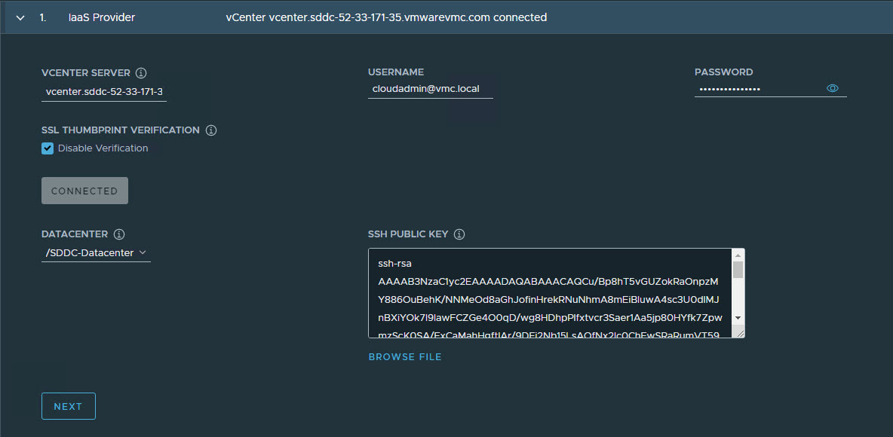

On the Management cluster settings page, select the instance type for the control plane node and worker node and provide the following information:

- Management Cluster Name: Name for your TKG management cluster.
- Control Plane Endpoint Provider: Select NSX Advanced Load Balancer for the Control Plane HA. 
- Control Plane Endpoint: This is an optional field, if left blank NSX Advanced Load Balancer will assign an IP from the pool **"TKG-Cluster-VIP"** which is configured in NSX Advanced Load Balancer. If you need to provide an IP, pick an unused IP address from the "TKG-Cluster-VIP" static IP pool. 
- Deployment Type: Development (Recommended for Dev or POC environments)/ Production (Recommended for Production environments).
- Machine Health Checks: Enable
- Enable Audit Logging: Enables audit logging for Kubernetes API server and node VMs, choose as per environmental needs. For more information see [Audit Logging](https://docs.vmware.com/en/VMware-Tanzu-Kubernetes-Grid/1.5/vmware-tanzu-kubernetes-grid-15/GUID-troubleshooting-tkg-audit-logging.html)


On the NSX Advanced Load Balancer page, provide the following:

- NSX Advanced Load Balancer Controller Cluster IP address.
- Controller credentials.
- Controller certificate.

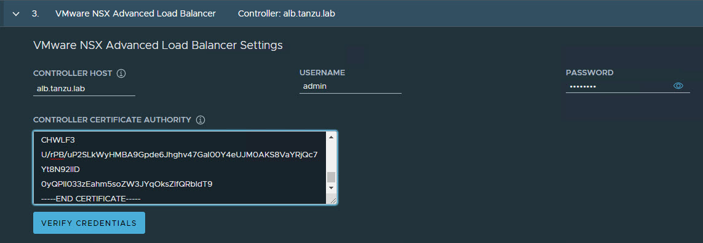

Clicking on the  Verify Credentials button let you select/configure the following:

- **Cloud Name:** Name of the cloud created while configuring NSX Advanced Load Balancer.
- **Service Engine Group Name:** Name of the Service Engine Group created for TKG management clusters created while configuring NSX Advanced Load Balancer.
- **Workload VIP Network Name:** Select TKG-SS-VIP network.
- **Workload VIP Network CIDR:** Refer to the [Subnet & CIDR Examples](#subnet-and-cidr-examples) table to fetch the subnet associated with the network 'Shared-Services-VIP'
- **Management VIP Network Name:** Select “TKG-Cluster-VIP” network. 
- **Management VIP Network CIDR:** Refer to the [Subnet & CIDR Examples](#subnet-and-cidr-examples) table to fetch the subnet associated with the network 'TKG-Cluster-VIP'.
- **Cluster Labels:** To adhere to the architecture defining a label is mandatory. Provide required labels, for example, **type:management**

**Note:** Based on your requirements you may specify multiple labels

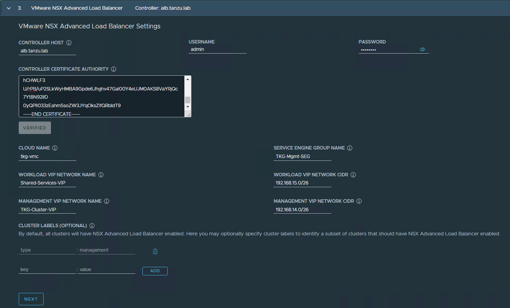

**Important:** With the above configurations, when TKG clusters (Shared service/workload) are tagged with label "type=management", "ako" pod gets deployed on the cluster, and any applications hosted on the cluster that requires load balancing service will be exposed via network "TKG-SS-VIP" and the virtual service will be placed on SE group TKG-Mgmt-SEG.

As per the defined architecture, Cluster Labels specified here will be applied only on shared services clusters. If no labels are specified in the "Cluster Labels" section, ako pod gets deployed on all the clusters without any labeling requirement and this deviates from the defined architecture.

On the Metadata page, you can specify location and labels.


On the Resources page, specify the compute containers for the TKG management cluster deployment.


On the Kubernetes Network page, select the Network where the control plane and worker nodes will be placed during management cluster deployment. Ensure that the network has **DHCP** service enabled.

If the tanzu environment is placed behind a proxy, enable proxy and provide proxy details. 

**Note:** The procedure shown in this document does not make use of a proxy for internet connection.


If you have LDAP configured in your environment, refer to the VMware [documentation](https://docs.vmware.com/en/VMware-Tanzu-Kubernetes-Grid/1.3/vmware-tanzu-kubernetes-grid-13/GUID-mgmt-clusters-enabling-id-mgmt.html) for instructions on how to integrate an identity management system with TKG.

In this example, Identity management integration has been disabled.


Select the OS image that will be used for the management cluster deployment. 

**Note:** This list will appear empty if you don’t have a compatible template present in your environment. Once you have imported the correct template, you can click on the refresh button and the installer will detect the image automatically.

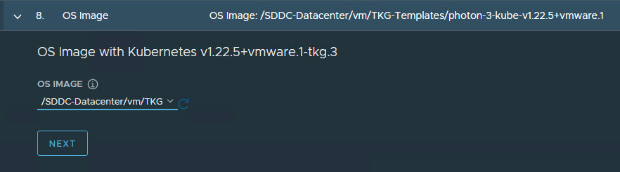

**(optional):** Select the “Participate in the Customer Experience Improvement Program”, if you so desire.


Click on the Review Configuration button to verify your configuration settings.

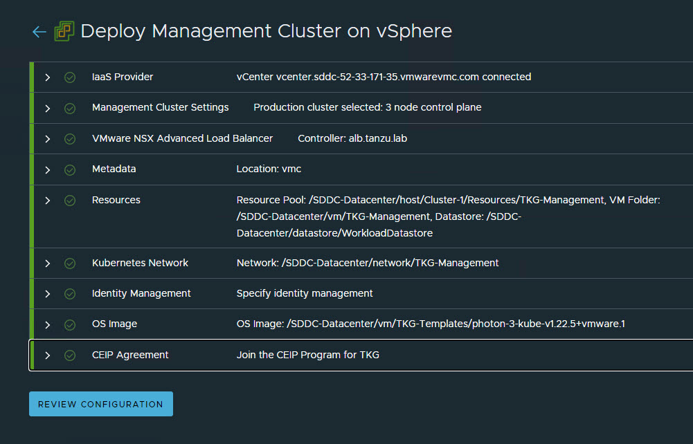

After you have verified the configuration settings, click the Deploy **Management Cluster** button to initiate management cluster deployment.

**Note:**  Deployment of the management cluster can be also triggered from the CLI by using the command that the installer has generated for you.


When the deployment is triggered from the UI, the installer wizard displays the deployment logs on the screen.

The deployment of the management cluster takes approx 20-30 minutes to complete. Close the installer wizard after the deployment is complete. While the Management cluster is being deployed, you will find that a Virtual service will be created in NSX Advanced Load Balancer and it is placed on one of the Service Engine created in the "TKG-Mgmt-SEG" SE Group.

The installer will automatically set the context to the management cluster so that you can log in to it and perform additional tasks such as verifying the management cluster health and deploying the workload clusters etc.


After the management cluster deployment, run the below commands to verify the health status of the cluster:

\# tanzu management-cluster get

Ensure that the cluster status reports as ‘running’ and nodes, etc are in Ready state.

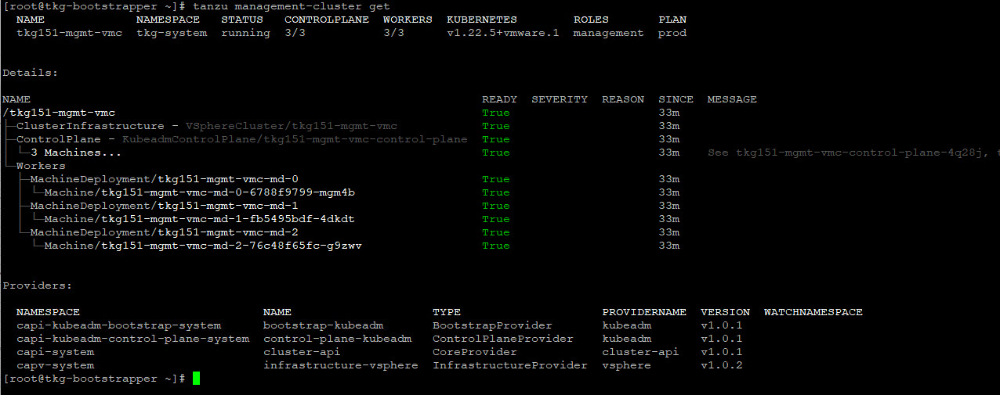

Refer to the [Examine the Management Cluster Deployment](https://docs.vmware.com/en/VMware-Tanzu-Kubernetes-Grid/1.5/vmware-tanzu-kubernetes-grid-15/GUID-mgmt-clusters-verify-deployment.html) page to perform additional health checks. 

After the TKG management cluster is deployed, install the additional tanzu plugins by running the following command:

<!-- /* cSpell:disable */ -->
```
[root@tkg-bootstrapper ~]# tanzu plugin sync
Checking for required plugins...
Installing plugin 'cluster:v0.11.1'
Installing plugin 'kubernetes-release:v0.11.1'
Successfully installed all required plugins
✔  Done
```
<!-- /* cSpell:enable */ -->

## <a id=tmc-integration> </a> Register Management Cluster with Tanzu Mission Control

After the management cluster is deployed, you have to register the management cluster with Tanzu Mission Control and other SaaS products. The deployment of the Tanzu Kubernetes clusters and tanzu packages can be performed directly from the Tanzu Mission Control portal. Refer to the [Integrate Tanzu Kubernetes Clusters with SaaS Endpoints](tko-saas-services.md#a-idtmc-tkg-mgmt-a-register-a-tanzu-kubernetes-grid-management-cluster-with-tanzu-mission-control) page for instructions. 

## **Deploy TKG Shared Services Cluster**

A shared services cluster is just a Tanzu Kubernetes Grid workload cluster used for shared services, it can be provisioned using the standard cli command tanzu cluster create, or through Tanzu Mission Control. Each Tanzu Kubernetes Grid instance can have only one shared services cluster.

**Note:** This document demonstrates the deployment of Shared Services and Workload clusters through Tanzu Mission Control.

The procedure of deploying a Shared service cluster and workload cluster is exactly the same, the only difference is, for the shared service cluster you will be adding a **tanzu-services** label to the shared services cluster, as its cluster role. This label identifies the shared services cluster to the management cluster and workload clusters.

Another major difference with shared services cluster, when compared with workload clusters, is that shared services cluster will be applied with the "Cluster Labels" which were defined while deploying Management Cluster. This is to enforce that only Shared Services Cluster will make use of the “TKG-SS-VIP” Network for application load balancing purposes and the virtual services are deployed on the "TKG-SEG01" service engine group.

Step 1: To deploy a shared-services cluster, Navigate to the Clusters tab and click on the Create Cluster button.


Under the create cluster page, select the TKG management cluster which you registered in the previous step and click on the continue to create cluster button.


Step 2: Select the provisioner for creating the shared-services cluster.


Step 3: Enter a name for the cluster. Cluster names must be unique within an organization.

Select the cluster group to which you want to attach your cluster. You can optionally enter a description and apply labels.


Step 4: On the configure page, specify the following:

- Select the Kubernetes version to use for the cluster. The latest supported version is preselected for you. You can choose the appropriate Kubernetes version by clicking on the down arrow button. 
- Select the network for the shared-services cluster. The control plane nodes and the worker nodes connect to this network.
- Paste the SSH key that you generated while configuring the bootstrap environment. 
- You can optionally define an alternative CIDR for the pod and service. The Pod CIDR and Service CIDR cannot be changed after the cluster is created. 
- You can optionally specify a proxy configuration to use for this cluster.

Please note that the scope of this document doesn't cover the use of a proxy for Tanzu Kubernetes Grid. If your environment uses a proxy server to connect to the internet, please ensure the proxy configuration object includes the CIDRs for the pod, ingress, and egress from the workload network of the Supervisor Cluster in the **No proxy list**, as described [here](https://docs.vmware.com/en/VMware-Tanzu-Mission-Control/services/tanzumc-using/GUID-AF0B66C8-00D2-46F7-9A62-64C6E279B9A7.html#GUID-AF0B66C8-00D2-46F7-9A62-64C6E279B9A7)


Step 5: Specify the placement containers such as Resource pool, VM Folder and datastore for the shared-services cluster. 


Step 6: Select the High Availability mode for the control plane nodes of the workload cluster. For a production deployment, it is recommended to deploy a highly available workload cluster. 

Control plane endpoint and API server port options are not customizable here as they will be retrieved from the management cluster. 


Step 7: You can optionally define the default node pool for your workload cluster.

- Specify the number of worker nodes to provision.
- Select the instance type.

Click on the Create Cluster button to start provisioning your workload cluster. 


Cluster creation roughly takes 15-20 minutes to complete. After the cluster deployment completes, ensure that Agent and extensions health shows green.


Post deployment of the shared-services cluster, execute the following commands to apply the labels to the cluster.

<!-- /* cSpell:disable */ -->
```
1: Switch to the management cluster context

[root@tkg-bootstrapper ~]# kubectl config use-context tkg151-mgmt-vmc-admin@tkg151-mgmt-vmc

2: Apply tanzu-services label to update cluster role

[root@tkg-bootstrapper ~]# kubectl label cluster.cluster.x-k8s.io/<shared-services-cluster-name> cluster-role.tkg.tanzu.vmware.com/tanzu-services="" --overwrite=true

Example: 

[root@tkg-bootstrapper ~]# kubectl label cluster.cluster.x-k8s.io/tkg151-ss-vmc cluster-role.tkg.tanzu.vmware.com/tanzu-services="" --overwrite=true

3: Apply NSX ALB labels

[root@tkg-bootstrapper ~]# kubectl label cluster tkg15-ss type=management
```
<!-- /* cSpell:enable */ -->

After NSX Advanced Load Balancer labels are applied to the TKG shared-services cluster, ako pods get created in the avi-system namespace.

## <a id=deploy-workload-cluster> </a> Deploy Tanzu Kubernetes clusters (Workload Cluster)

The steps of deploying a workload cluster is exactly the same as a shared services cluster. The only difference is the name of the cluster and the placement containers (Resource pools, VM folder, Network, etc)

Post deployment of the workload cluster, ensure that the cluster is healthy.

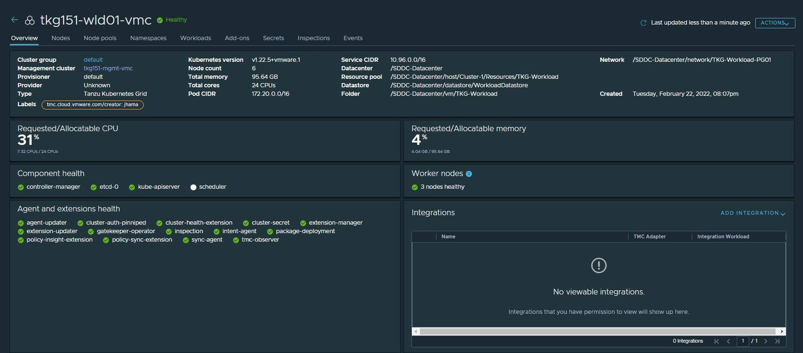

### **Create AKO Deployment Config for TKG Workload Cluster**

Tanzu Kubernetes Grid v1.5.x management clusters with NSX Advanced Load Balancer have a default AKODeploymentConfig that is deployed during installation. It is called install-ako-for-all. 


By default, any clusters that match the cluster labels defined in install-ako-for-all will reference this file for their virtual IP networks, service engine (SE) groups, and L7 ingress. 

As part of our architecture, only shared service cluster makes use of the configuration defined in the default AKODeploymentConfig “install-ako-for-all”

As per the defined architecture, workload clusters make use of a separate SE group (**TKG-WLD01-SEG)** and VIP Network (**Workload-VIP**) for application load balancing. These configurations can be enforced on workload clusters by:

- Creating a new AKODeploymentConfig in the TKG management cluster. This AKODeploymentConfig file dictates which specific SE group and VIP network that the workload clusters can use for load balancer functionalities  
- Apply the new AKODeploymentConfig:  Label the workload cluster to match the AKODeploymentConfig.spec.clusterSelector.matchLabels element in the AKODeploymentConfig file. 
  Once the labels are applied on the workload cluster, the AKO Operator running in the TKG management cluster will deploy the AKO pod on the target workload cluster. 


A sample format of the AKODeploymentConfig file is shown below for the reference.

<!-- /* cSpell:disable */ -->
```yaml
apiVersion: networking.tkg.tanzu.vmware.com/v1alpha1
kind: AKODeploymentConfig
metadata:
  finalizers:
  - ako-operator.networking.tkg.tanzu.vmware.com
  generation: 2
  name: <Unique name of AKODeploymentConfig>
spec:
  adminCredentialRef:
    name: avi-controller-credentials
    namespace: tkg-system-networking
  certificateAuthorityRef:
    name: avi-controller-ca
    namespace: tkg-system-networking
  cloudName: <name of cloud configured in NSX ALB>
  clusterSelector:
    matchLabels:
      <Key>: <Value>
  controlPlaneNetwork:
    cidr: <Control Plane Network CIDR>
    name: <Control Plane Network Name>
  controller: <NSX ALB Controller IP/FQDN>
  dataNetwork:
    cidr: <VIP Network CIDR>
    name: <VIP Network Name>
  extraConfigs:
    cniPlugin: antrea
    disableStaticRouteSync: true
    ingress:
      defaultIngressController: true
      disableIngressClass: true
    l4Config:
      autoFQDN: disabled
    layer7Only: true
    networksConfig:
      enableRHI: false
  serviceEngineGroup: <Workload Cluster SEG Name>
```
<!-- /* cSpell:enable */ -->

Below is the sample AKODeploymentConfig used for the workload cluster. As per the below configuration, AKO pod will be deployed on a workload cluster that matches the **label** “**type=tkg15-workload”**

<!-- /* cSpell:disable */ -->
```yaml
apiVersion: networking.tkg.tanzu.vmware.com/v1alpha1
kind: AKODeploymentConfig
metadata:
  finalizers:
    - ako-operator.networking.tkg.tanzu.vmware.com
  generation: 2
  name: ako-for-workload
spec:
  adminCredentialRef:
    name: avi-controller-credentials
    namespace: tkg-system-networking
  certificateAuthorityRef:
    name: avi-controller-ca
    namespace: tkg-system-networking
  cloudName: tkg-vsphere
  clusterSelector:
    matchLabels:
      type: tkg15-workload
  controlPlaneNetwork:
    cidr: 172.16.19.0/26
    name: TKG-WLD-VIP
  controller: alb.tanzu.lab
  dataNetwork:
    cidr: 172.16.19.0/26
    name: TKG-WLD-VIP
  extraConfigs:
    cniPlugin: antrea
    disableStaticRouteSync: true
    ingress:
      defaultIngressController: true
      disableIngressClass: true
    l4Config:
      autoFQDN: disabled
    layer7Only: true
    networksConfig:
      enableRHI: false
  serviceEngineGroup: TKG-WLD-SEG01
```
<!-- /* cSpell:enable */ -->

To create the AKODeploymentConfig, invoke the kubectl command as show below

<!-- /* cSpell:disable */ -->
```
1: Switch to the management cluster context

[root@tkg-bootstrapper ~]# kubectl config use-context tkg151-mgmt-vmc-admin@tkg151-mgmt-vmc

2: Create AKODeploymentConfig

[root@tkg-bootstrapper ~]# kubectl apply -f ako-tkg151-workload.yaml

akodeploymentconfig.networking.tkg.tanzu.vmware.com/ako-for-workload 
Created

3: List AKODeploymentConfig

[root@tkg-bootstrapper ~]# kubectl get adc
NAME                                 AGE
ako-for-workload                     5s
install-ako-for-all                  3h14m
install-ako-for-management-cluster   3h14m
```
<!-- /* cSpell:enable */ -->

Post creation of the AKODeploymentConfig, apply the labels defined in the AKODeploymentConfig to any of the TKG workload clusters. Once the labels are applied, AKO pod will be deployed on the target workload cluster.

<!-- /* cSpell:disable */ -->
```
[root@tkg-bootstrapper ~]# kubectl label cluster tkg151-wld01-vmc type=tkg15-workload
cluster.cluster.x-k8s.io/tkg151-wld01-vmc labeled

## Verify that AKO pod is created in the workload cluster

[root@tkg-bootstrapper ~]# kubectl config use-context tkg151-wld01-vmc-admin@tkg151-wld01-vmc

[root@tkg-bootstrapper ~]# kubectl get ns | grep avi-system
avi-system                  Active   41s

[root@tkg-bootstrapper ~]# kubectl get pod -n avi-system

NAME    READY   STATUS    RESTARTS   AGE
ako-0   1/1     Running   0          47s
```
<!-- /* cSpell:enable */ -->