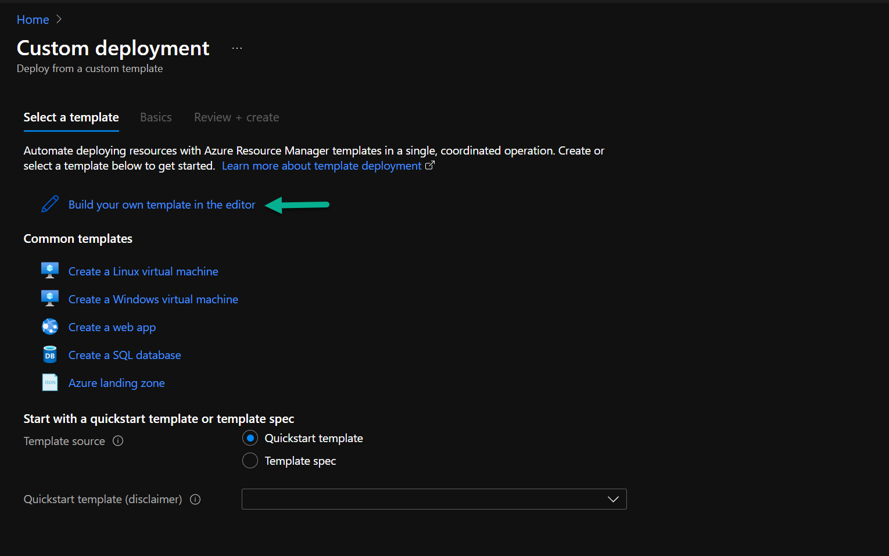
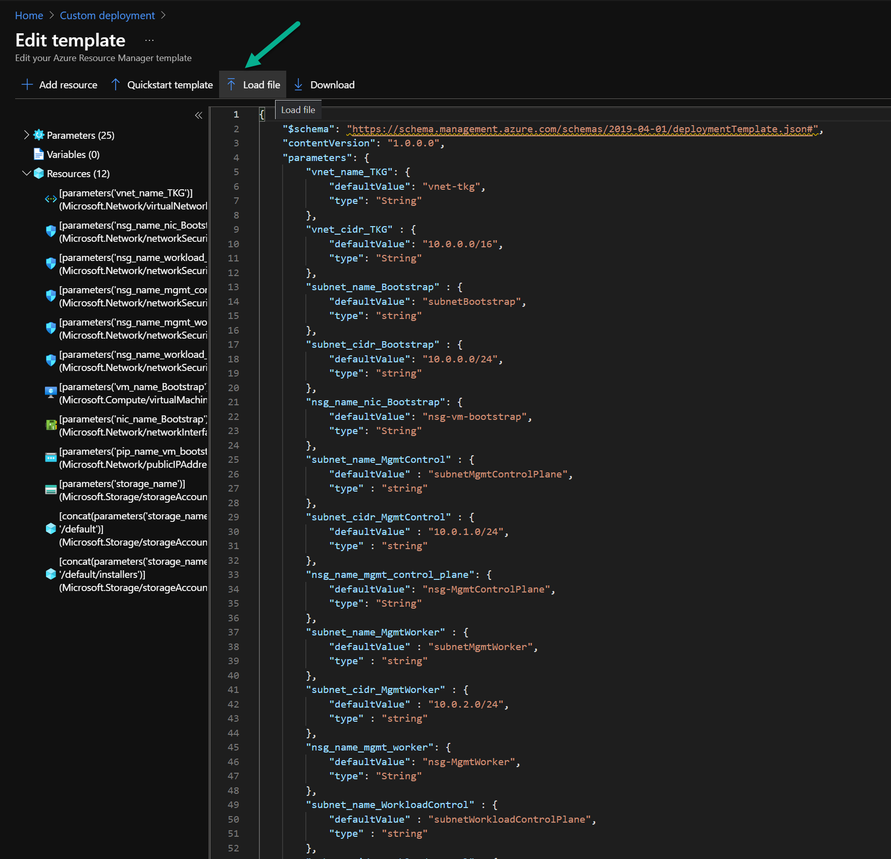
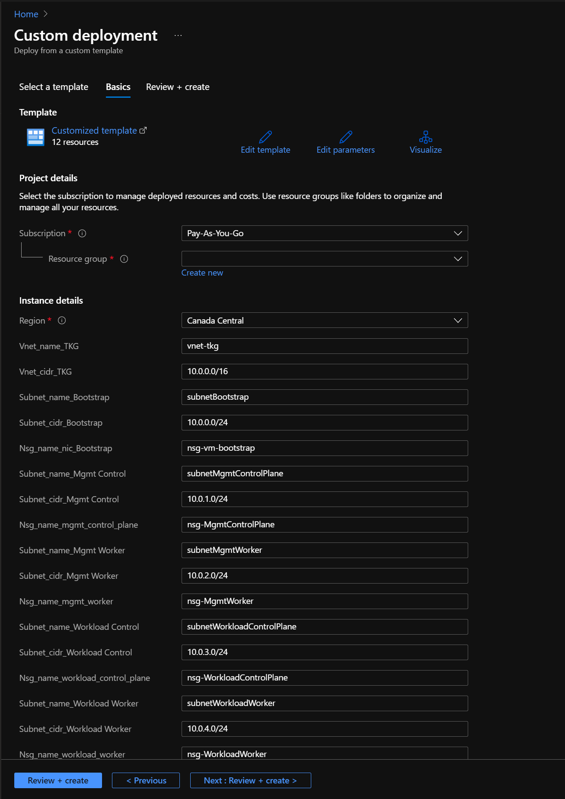
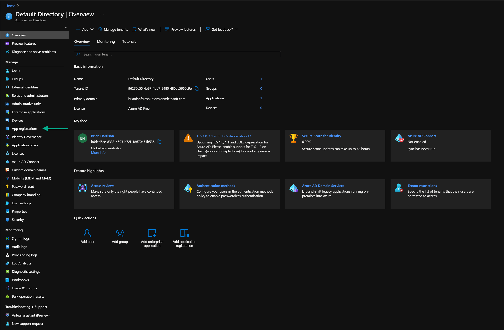
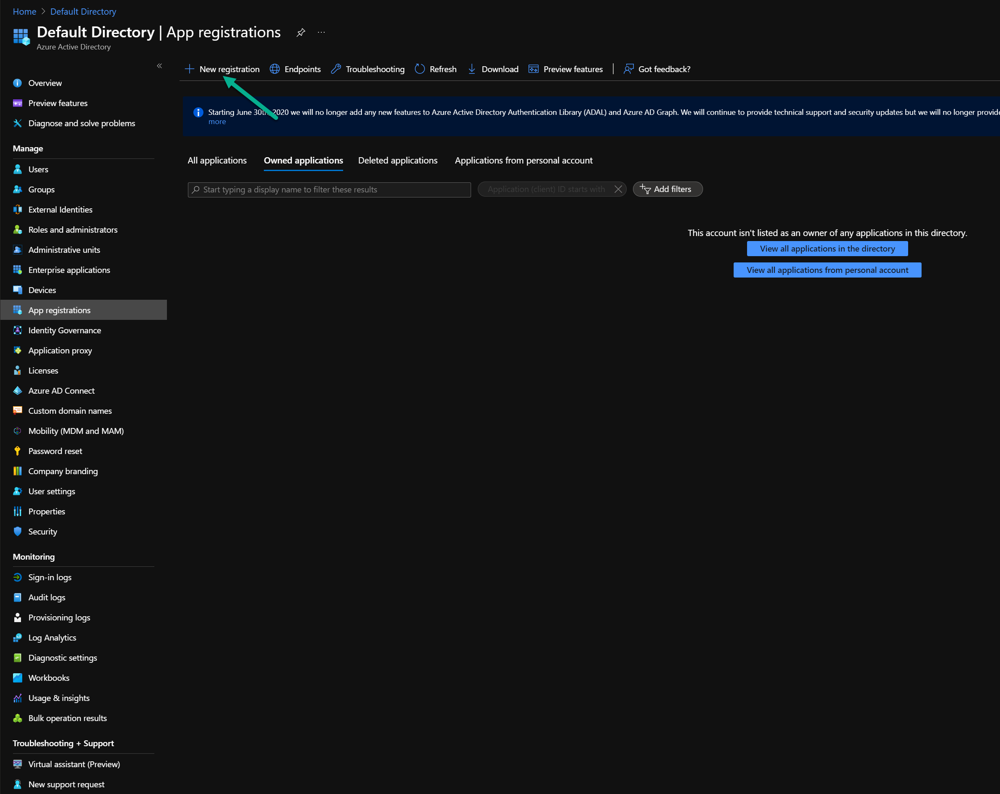
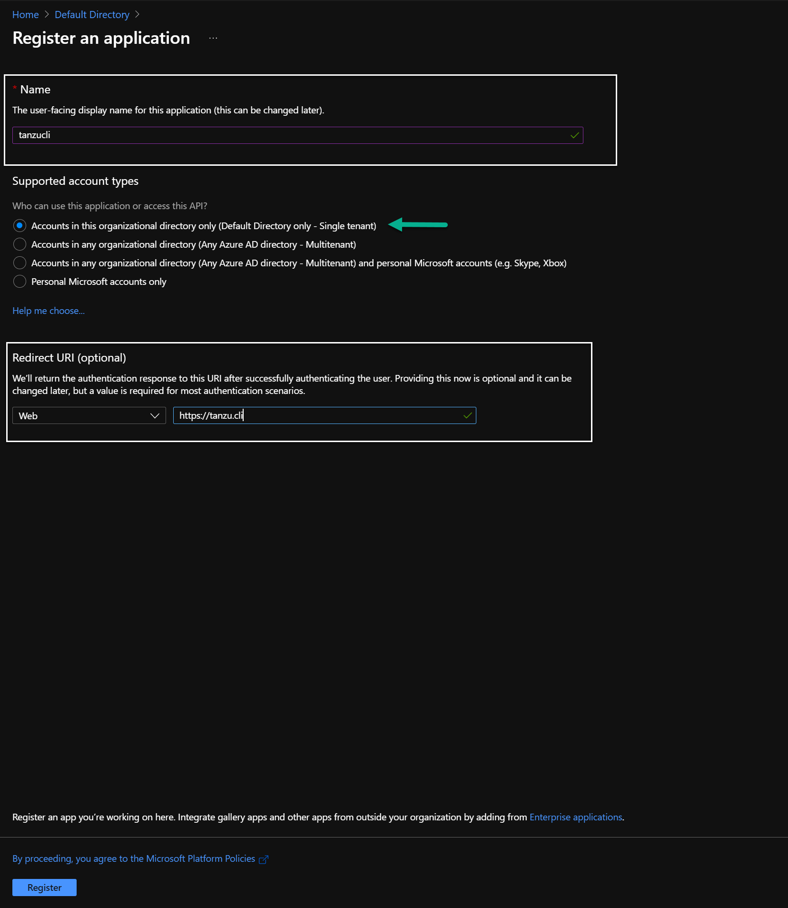
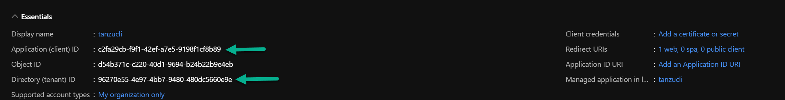
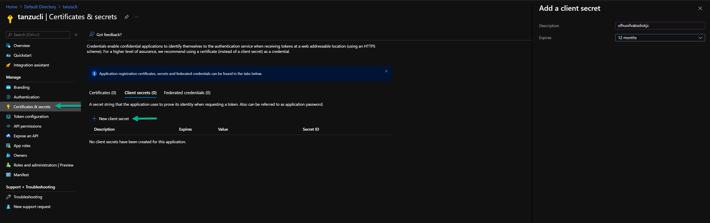
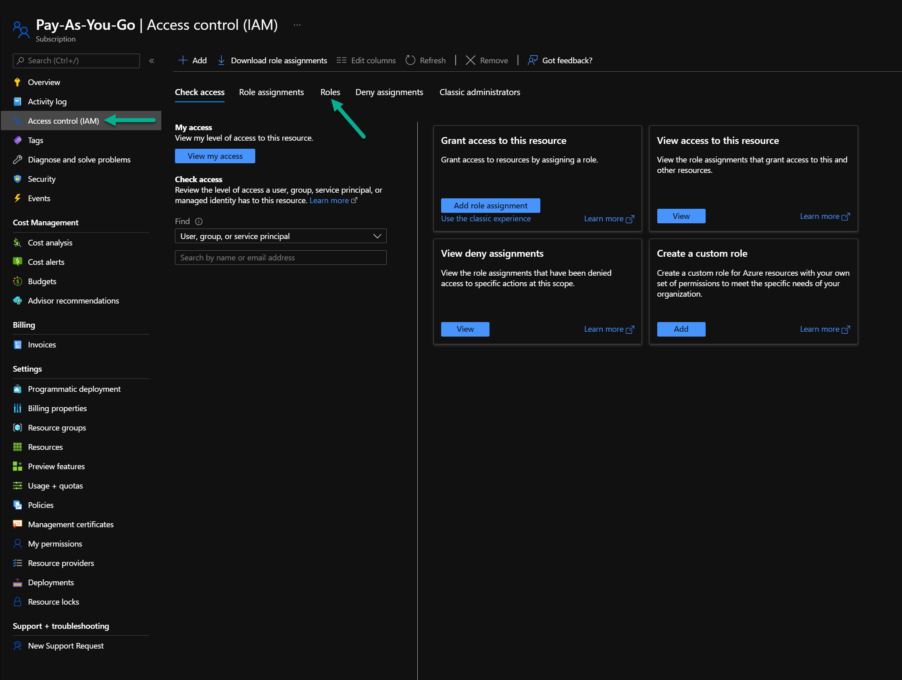
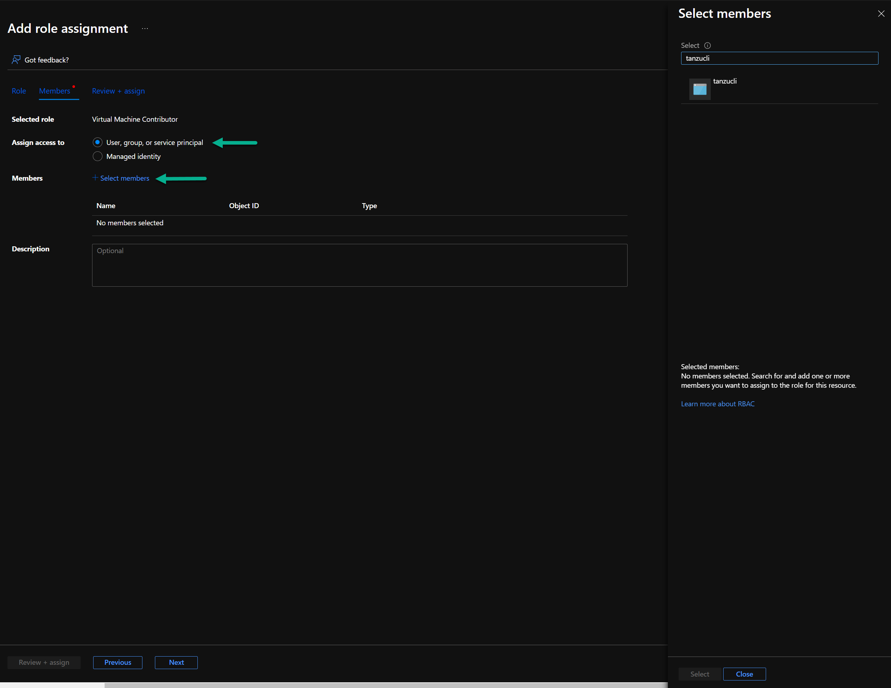

# Deploy Tanzu for Kubernetes Operations on Microsoft Azure
VMware Tanzu simplifies the operations of Kubernetes for multi-cloud deployments by centralizing management and governance for clusters and teams across on-premises, public clouds, and the edge. It delivers an open source aligned Kubernetes distribution with consistent operations and management to support infrastructure and app modernization.

This document provides a step-by-step guide for how to install and deploy Tanzu for Kubernetes operations on Microsoft Azure.

The scope of this document is limited to providing the deployment steps based on the following reference design. The reference design represents one of the two production-level reference designs described in [VMware Tanzu for Kubernetes Operations on Azure Reference Design](../reference-designs/tko-on-azure.md).


 This design shows both the Tanzu Kubernetes Grid management cluster and workload clusters in the same virtual network along with the bootstrap machine. However, each cluster is placed in its own subnet. In addition, the control plane and worker nodes of each cluster are also separated by a subnet.

1. The reference design shows the deployment of only the base components within Tanzu Kubernetes Grid.

2. The reference design fits in with any production-level design that a customer may have in place, such as a Hub and Spoke, Global WAN Peering, or just a simple DMZ based implementation.

3. This guide does not make any assumptions about your chosen tooling for security or DevOps, other than what is available with a default Azure subscription.

**Note:** You can use this guide to deploy additional workload clusters and workload clusters of a different size. However, you'll need to make additional configuration changes. You can make these configuration changes after you have gone through the deployment steps provided in this document.

## Prerequisites
Ensure that you have:

* Read [VMware Tanzu for Kubernetes Operations on Azure Reference Design](../reference-designs/tko-on-azure.md).
* A Microsoft Azure subscription.
* Owner-level access to the subscription.
* To deploy the ARM template in Microsoft Azure, you'll need:
    - Contributor role in Microsoft Azure.
    - Resource group in Microsoft Azure.
- An SSH key and the Base 64 encoded value of the public key. You will configure the Base 64 encoded value for the AZURE_SSH_PUBLIC_KEY_B64 parameter of the configuration file for deploying Tanzu Kubernetes Grid. How you generate the SSH key and how you encode the entire public key is up to you. However, you will need to encode the public key before storing it in the Tanzu Kubernetes Grid deployment configuration file.
* Access to Customer Connect and the available downloads for Tanzu Kubernetes Grid. To verify that you have access, go to [VMware Tanzu Kubernetes Grid Download Product](https://customerconnect.vmware.com/en/downloads/details?downloadGroup=TKG-140&productId=988&rPId=73652).

## Overview of the Deployment steps
1. [Set up your Microsoft Azure environment](#azure-environment)
1. [Set up Bootstrap VM](#set-up-bootstrap)
1. [Deploy Tanzu Kubernetes Grid](#deploy-TKG)
1. [Configure SaaS Services](#config-saas)
1. [(Optional) Deploy Tanzu Kubernetes Grid Packages](#deploy-user-managed-packages)

## <a id=azure-environment> </a> Set up your Microsoft Azure Environment
Before deploying Tanzu for Kubernetes operations and the actual Kubernetes clusters, ensure that your Azure environment is set up as described in this section.

### Azure ARM Template
The deployment detailed in this document uses the following resources:

- [ARM Template](./resources/tko-on-azure/azure-deploy.json)
- [Parameters](./resources/tko-on-azure/azure-deploy-parameters.json)

The ARM template contains parameters that you can populate or customize so that your Azure environment uses your naming standards and networking requirements.

The ARM template deploys the following items:

* Virtual Network
* 5 Subnets
    - Bootstrap
    - Management Cluster Control Plane (API Servers)
    - Management Cluster Worker Nodes
    - Workload Cluster Control Plane (API Servers)
    - Workload Cluster Worker Nodes
* Network Security Group for Bootstrap Machine NIC
* Network Security Groups for each of the Cluster Subnets
* Public IP Address attached to Bootstrap Machine
* Virtual Machine for Bootstrap (Ubuntu 20.0.4)

In addition, the ARM template,

* Uses the Region where the Resource Group is located to specify where the resources should be deployed.
* Contains security rules for each of the Network Security Groups attached to the Control Plane clusters. These rules allow for SSH and secure kubectl access from the public Internet. Access from the public Internet makes troubleshooting easier while you deploy your management and workload clusters. You can remove these rules after you complete your deployment.

### Quotas
To successfully deploy Tanzu Kubernetes Grid to Azure, ensure that the quotas are sufficient to support both the management cluster and workload cluster deployments. Otherwise, the deployments will fail.

Review the quotas for the following resources, which are included in the ARM template, and increase their values as needed. Increase the quotas for every region to which you plan to deploy Tanzu Kubernetes Grid.

* Total Regional vCPUs
* Family vCPUs based on your chosen virtual machine family (D, E, F, etc.)
* Static Public IP Addresses
* Public IP Addresses - Standard

Based on the recommended minimum virtual machine size of D2s_v3, the following minimum quotas are required per cluster:

* Total Regional vCPUs = 24
* Family vCPUs for D Family = 24
* Static Public IP Addresses = 6
* Public IP Addresses - Standard = 6

Ensure that you increase the quotas if you make changes to the basic configuration of the clusters.

### ARM Template Deployment
####Deploy ARM Template
There are multiple methods to deploy an ARM template on Azure. If you are experienced with Azure, you can deploy the ARM template in a method that is comfortable to you.

Otherwise, you can use the example Azure CLI commands locally or in Azure Cloud Shell. If you prefer to use Azure PowerShell, use the example command for Azure PowerShell.

Ensure that you have the following to deploy the ARM template in Microsoft Azure:

- Contributor role in Microsoft Azure.
- Resource group in Microsoft Azure.

#### Azure CLI
Run the following example Azure CLI command locally or in Azure Cloud Shell to deploy the ARM template.

```bash
az deployment create –template-file azure-deploy.json –parameters azure-deploy-parameters.json –resource-group <Resource Group Name>
```

#### Azure PowerShell
Alternatively, run the following example command in Azure PowerShell to deploy the ARM template.

```bash
New-AzResourceGroupDeployment -ResourceGroupName <Resource Group Name> -TemplateFile azure-deploy.json -TemplateParameterFile azure-deploy-parameters.json
```

#### Azure Portal
If you prefer to use the Azure Portal, do the following to process an ARM template directly on the Azure Portal.

1. Search and click **Deploy a Custom Template > Build your own template in the editor**.
    

1. Click **Load file** to upload the ARM template, `azuredeploy.json`.
    

1. Fill in the parameter values so that the values are specific to your deployment.
    

### Azure Service Principal/Application Registration Creation
The Tanzu CLI requires access to an Azure Service Principal (SP) or Application Registration to programmatically configure the Tanzu cluster’s infrastructure during deployment and during auto-scale events.

VMware recommends that you create the SP on the Azure Portal. However, if you prefer to use either the Azure CLI or Azure PowerShell, see the following Microsoft product documentation:

* [Azure CLI](https://docs.microsoft.com/en-us/cli/azure/create-an-azure-service-principal-azure-cli)
* [Azure PowerShell](https://docs.microsoft.com/en-us/powershell/azure/create-azure-service-principal-azureps?view=azps-6.6.0)

**Important:** To create an Azure Service Principal or Application Registration, you must be an **Administrator** in your Azure Active Directory tenant. Alternatively, all Users must have **App Registrations** set to **Yes**, which allows all Users to create an Azure Service Principal.

Do the following on the Azure portal to create an Azure Service Principal:

1. Go to **Azure Active Directory > Application Registrations**.
  

1. Click **New App Registration**.
  

1. Enter the following:

   - **Name**: Enter a name that reflects what the App Registration is being used for. <br>
        Example: `tanzucli`
   - **URL**: Enter any URL. <br>
        In this deployment, the App Registration is used for programmatic purposes only. In such cases, the URL can be anything. However, the field is required.
   - **Supported Account Type**: (Optional) By default, **Accounts in this organizational directory only (Default Directory only - Single tenant)** is selected. <br>
   In the default case, the new App Registration is used for a Single Azure Active Directory tenant and for development clusters. Depending on the size of the organization that Tanzu is deployed in, the App Registration may need to be available across one-to-many Azure Active Directory tenants. For such cases, select the appropriate multi-tenant option.

    

   After the Application Registration is created, an **Overview** page appears.

1. Copy the values for the **Application client ID** and **Directory (tenant) ID** from the **Overview** page. You will need the IDs for running the Tanzu CLI.

      

1. Add a Key to the Application Registration.

    You will use the key for programmatic authentication and execution.

      1. Click **Certificates & secrets > Client secrets > New client secret**.
         

      1. Choose the expiration date.

      1. Store the randomly generated key so that it can be used later.

1. Assign **VM Contributor** and **Network Contributor** roles to the Azure SP.

      The roles provide the minimum level of permissions required for the Tanzu CLI to function properly within Azure.

      Assign the roles through the Subscription scope. Depending on your security boundaries, you can also assign it at the Resource Group scope.

      **Important:** To assign a role to the SP, you must have either the **Owner** role or **User Access Administration** role within the scope of the Azure subscription.

      1. Find your specific Subscription on the Azure Portal and go to **Access Control (IAM) > Roles**.

         

      1. Click **Add role assignment**.
      1. In the **Add role assignment** page, select **User, group, or service principal**.
         

      1. For **Select Members**, search for the new SP name you created.

1. Make a note of the following information. You will need the information to create the configuration files to set up the Bootstrap machine and Tanzu CLI.

      - Azure Subscription ID
      - Azure Active Directory Tenant ID
      - Azure Application ID (ServicePrincipal)
      - Azure Application Key

## <a id=set-up-bootstrap> </a> Set Up Bootstrap VM
You will use the bootstrap VM to deploy the Tanzu Kubernetes Grid management and workload clusters. Create the bootstrap VM after you have set up your Microsoft Azure environment.  

You will set up the bootstrap VM with the following:

- Authentication and access to VMware Customer Connect<br>
  You will download the required Tanzu components from VMware Customer Connect.
- Azure Tenant, subscription, and client IDs<br>
  The IDs are for the Azure subscription on which you created resources using the ARM template.
- Docker
- Azure CLI
- Tanzu CLI
- Tanzu Kubectl

To set up the bootstrap VM:

1. Verify that the VM is up and running.
1. Connect to the VM through a standard SSH connection.
1. Run the following Shell commands to set up the bootstrap VM.
    Replace the variables with the VMware account information needed to access VMware Customer Connect and Azure IDs for the Azure subscription on which you created resources using the ARM template and Application Registration/Service Principal.

```bash
# Variables
export VMWUSER = "<CUSTOMER_CONNECT_USERID>"
export VMWPASS = "<CUSTOMER_CONNECT_PWD>"
export AZURETENANTID = "<AAD Tenant ID>"
export AZURESUBSCRIPTION = "<Subscription GUID>"
export AZURECLIENTID = "<Service Principal ID>"
export AZURECLIENTSECRET = "<Service Principal Secret>"

sudo apt-get update
sudo apt-get upgrade

# Docker Install & Verify
sudo apt-get install \
    apt-transport-https \
    ca-certificates \
    curl \
    gnupg \
    lsb-release

curl -fsSL https://download.docker.com/linux/ubuntu/gpg | sudo gpg --dearmor -o /usr/share/keyrings/docker-archive-keyring.gpg

echo \
  "deb [arch=$(dpkg --print-architecture) signed-by=/usr/share/keyrings/docker-archive-keyring.gpg] https://download.docker.com/linux/ubuntu \
  $(lsb_release -cs) stable" | sudo tee /etc/apt/sources.list.d/docker.list > /dev/null

sudo apt-get update
sudo apt-get install docker-ce docker-ce-cli containerd.io

sudo groupadd docker
sudo usermod -aG docker $USER

# Optional Verification
# docker run hello-world

# Downloading and Installing Tanzu CLI
git clone https://github.com/z4ce/vmw-cli
curl -o tmc 'https://tmc-cli.s3-us-west-2.amazonaws.com/tmc/0.4.0-fdabbe74/linux/x64/tmc'
./vmw-cli/vmw-cli ls vmware_tanzu_kubernetes_grid
./vmw-cli/vmw-cli cp tanzu-cli-bundle-linux-amd64.tar
./vmw-cli/vmw-cli cp kubectl-linux-v1.21.2+vmware.1.gz

tar -xvf tanzu-cli-bundle-linux-amd64.tar
gzip -d kubectl-linux-v1.21.2+vmware.1.gz

sudo install cli/core/v1.4.0/tanzu-core-linux_amd64 /usr/local/bin/tanzu
tanzu plugin install --local cli all
sudo install kubectl-linux-v1.21.2+vmware.1 /usr/local/bin/kubectl

# Azure CLI Install and VM Acceptance
curl -sL https://aka.ms/InstallAzureCLIDeb | sudo bash

az login --service-principal --username $AZURECLIENTID --password $AZURECLIENTSECRET --tenant $AZURETENANTID
az vm image terms accept --publisher vmware-inc --offer tkg-capi --plan k8s-1dot21dot2-ubuntu-2004 --subscription $AZURESUBSCRIPTION
```

**Note:** Because of permission issues, you will have to log out and log in to the bootstrap VM after installing Docker and before you download and install the Tanzu components.

If you prefer not to copy paste code, you can use the following sample script files:

  - [`bootstrapsetup.sh`](./resources/tko-on-azure/bootstrapsetup.sh)
  - [`bootstraptanzu.sh`](./resources/tko-on-azure/bootstraptanzu.sh)

## <a id=deploy-TKG> </a> Deploy Tanzu Kubernetes Grid
Deploy Tanzu Kubernetes Grid after you set up your Azure environment and bootstrap VM.
You will use Tanzu CLI to deploy a management cluster and workload cluster.

1. Create a YAML file that contains the required configuration details.

   The [ex-config.yaml](./resources/tko-on-azure/ex-config.yaml) sample YAML file contains the minimum configuration needed to deploy a management cluster and workload clusters. <_Added the word 'cluster' after 'management' because the syntax was awkward, as though a word is missing_> The configuration contains the default values used in the ARM template. Change the values in the YAML as needed for your deployment. For example, replace the values for the Azure IDs, Application Registration/Service Principal, cluster name, and the Base 64 encoded value of the public key.

2. Run the following commands from your bootstrap VM to create the management and workload clusters.

    ```bash
    tanzu management-cluster create --file config.yaml -v 0-9

    tanzu cluster create –file config.yaml -v 0-9
    ```

For additional product documentation on how to create the YAML configuration file and what each value corresponds to in Azure, see [Management Cluster Configuration for Microsoft Azure](https://docs.vmware.com/en/VMware-Tanzu-Kubernetes-Grid/1.4/vmware-tanzu-kubernetes-grid-14/GUID-mgmt-clusters-config-azure.html).

## <a id=config-saas> </a> Configure SaaS Services
The following VMware SaaS services provide additional Kubernetes lifecycle management, observability, and service mesh features.

* Tanzu Mission Control (TMC)
* Tanzu Observability (TO)
* Tanzu Service Mesh (TSM)

For configuration information, see [Configure SaaS Services](./tko-saas-services.md).

## <a id=deploy-user-managed-packages> (Optional) Deploy Tanzu Kubernetes Grid Packages
A package in Tanzu Kubernetes Grid is a collection of related software that supports or extends the core functionality of the Kubernetes cluster in which the package is installed.

These packages are available for deployment in each workload cluster that you deploy, but they are not automatically installed and working as pods.<_Is this syntax correct? Not sure what it means._>

Tanzu Kubernetes Grid includes two types of packages, core packages and user-managed packages.

#### Core Packages

Tanzu Kubernetes Grid automatically installs the core packages during cluster creation. For more information about core packages, see [Core Packages](https://docs.vmware.com/en/VMware-Tanzu-Kubernetes-Grid/1.4/vmware-tanzu-kubernetes-grid-14/GUID-packages-core-index.html).

#### User-Managed Packages

A user-managed package is an optional component of a Kubernetes cluster that you can install and manage with the Tanzu CLI. These packages are installed after cluster creation. User-managed packages are grouped into package repositories in the Tanzu CLI. If a package repository that contains user-managed packages is available in the target cluster, you can use the Tanzu CLI to install and manage any of the packages from that repository.

Using the Tanzu CLI, you can install user-managed packages from the built-in `tanzu-standard` package repository or from package repositories that you add to your target cluster. From the `tanzu-standard` package repository, you can install the Cert Manager, Contour, External DNS, Fluent Bit, Grafana, Harbor, Multus CNI, and Prometheus packages. For more information about user-managed packages, see [User-Managed Packages](https://docs.vmware.com/en/VMware-Tanzu-Kubernetes-Grid/1.4/vmware-tanzu-kubernetes-grid-14/GUID-packages-cli-reference-packages.html).

VMware recommends: <_Changed because the syntax of the bullet points didn't work with the lead-in phrase_>

* [Installing Cert Manager](https://docs.vmware.com/en/VMware-Tanzu-Kubernetes-Grid/1.4/vmware-tanzu-kubernetes-grid-14/GUID-packages-cert-manager.html)

* [Implementing Ingress Control with Contour](https://docs.vmware.com/en/VMware-Tanzu-Kubernetes-Grid/1.4/vmware-tanzu-kubernetes-grid-14/GUID-packages-ingress-contour.html)

* [Implementing Log Forwarding with Fluent Bit](https://docs.vmware.com/en/VMware-Tanzu-Kubernetes-Grid/1.4/vmware-tanzu-kubernetes-grid-14/GUID-packages-logging-fluentbit.html)

* [Implementing Monitoring with Prometheus and Grafana](https://docs.vmware.com/en/VMware-Tanzu-Kubernetes-Grid/1.4/vmware-tanzu-kubernetes-grid-14/GUID-packages-monitoring.html)

* [Implementing Multiple Pod Network Interfaces with Multus](https://docs.vmware.com/en/VMware-Tanzu-Kubernetes-Grid/1.4/vmware-tanzu-kubernetes-grid-14/GUID-packages-cni-multus.html)

* [Implementing Service Discovery with ExternalDNS](https://docs.vmware.com/en/VMware-Tanzu-Kubernetes-Grid/1.4/vmware-tanzu-kubernetes-grid-14/GUID-packages-external-dns.html)

* [Deploying Harbor Registry as a Shared Service](https://docs.vmware.com/en/VMware-Tanzu-Kubernetes-Grid/1.4/vmware-tanzu-kubernetes-grid-14/GUID-packages-harbor-registry.html)

If you need Harbor to take on a heavy load and store large images in the registry, you can install Harbor into a separate workload cluster.
