# Deploy VMware Tanzu for Kubernetes Operations on VMware vSphere with VMware NSX-T

This document provides step-by-step instructions for deploying VMware Tanzu for Kubernetes Operations on a vSphere environment backed by NSX-T Data Center, also known as NSX-T. The deployment is based on the reference design provided in [VMware Tanzu for Kubernetes Operations on vSphere with NSX-T Reference Design](../reference-designs/tko-on-vsphere-nsx.md). This document does not provide instructions for deploying the underlying SDDC components.

## Prepare Your Environment for Deploying Tanzu Kubernetes Operations

Before you start the deployment ensure that your environment meets the prerequisites described in the following sections.

### General Requirements

- An NSX-T backed vSphere environment.

- If your environment does not use VMware Cloud Foundation (VCF), ensure the following NSX-T configurations:

  **Note:** The following provides only a high level overview of the required NSX-T configurations. For more information, see [VMware NSX-T Data Center Installation Guide](https://docs.vmware.com/en/VMware-NSX-T-Data-Center/3.1/installation/GUID-3E0C4CEC-D593-4395-84C4-150CD6285963.html) and [VMware NSX-T Data Center Product Documentation](https://docs.vmware.com/en/VMware-NSX-T-Data-Center/index.html)

  - NSX-T manager instance is deployed and configured with Advanced or higher license.

  - vCenter Server that is associated with the NSX-T is configured as Compute Manager.

  - Required overlay and vLAN transport zones are created.

  - IP pools for host and edge tunnel endpoints (TEP) are created.

  - Host and edge uplink profiles are in place.

  - Do one of the following:

    - Create a Transport node profile and apply it to the vSphere cluster or clusters.

    Or

    - Configure NSX-T on all ESXi hosts part of the vSphere cluster or clusters.

  - Edge transport nodes and at least one edge cluster is created.

  - Tier-0 uplink segments and tier-0 gateway is created.

  - Tier-0 router is peered with uplink L3 switch.

- SDDC environment has the following objects in place:

  - A vSphere cluster with at least three hosts. vSphere DRS is enabled and NSX-T is successfully configured on the cluster.

  - A dedicated resource pool to deploy the following:

    - Tanzu Kubernetes Grid management cluster

    - Tanzu Kubernetes Grid shared services cluster

    - Tanzu Kubernetes Grid workload clusters

      The number of required resource pools depends on the number of workload clusters to be deployed.

  - VM folders in which to collect the Tanzu Kubernetes Grid VMs.

  - A datastore with sufficient capacity for the control plane and worker node VM files.

  - Network Time Protocol (NTP) service running on all hosts and vCenter.

  - A host/server/VM based on Linux/MAC/Windows that has Docker installed. The VM acts as your bootstrap machine. This deployment described in this document uses a VM based on Photon OS.

  - Depending on the OS flavor of the bootstrap VM, [download](https://customerconnect.vmware.com/en/downloads/details?downloadGroup=TKG-140&productId=988&rPId=49705) and configure the following packages. As part of this documentation, refer to the section [Deploy and Configure bootstrap machine](#deploy-and-configure-bootstrap-machine) to configure required packages on the bootstrap VM.

    - Tanzu CLI 1.4.0

    - kubectl cluster CLI 1.21.2

  - A vSphere account with the permissions described in [Required Permissions for the vSphere Account](https://docs.vmware.com/en/VMware-Tanzu-Kubernetes-Grid/1.4/vmware-tanzu-kubernetes-grid-14/GUID-mgmt-clusters-vsphere.html#vsphere-permissions).

  - If you are working in an Internet-Restricted environment with a centralized image repository is required, see [prepare an Internet-Restricted Environment](https://docs.vmware.com/en/VMware-Tanzu-Kubernetes-Grid/1.4/vmware-tanzu-kubernetes-grid-14/GUID-mgmt-clusters-airgapped-environments.html) for more information on setting up a centralized image repository

  - [Download](https://customerconnect.vmware.com/downloads/details?downloadGroup=NSX-ALB-10&productId=988&rPId=86183) and import NSX Advanced Load Balancer 20.1.6 OVA to Content Library.

  - [Download](https://customerconnect.vmware.com/en/downloads/details?downloadGroup=TKG-140&productId=988&rPId=49705) the following and import to vCenter.

    - Photon v3 Kubernetes v1.21.2 OVA and/or

    - Ubuntu 2004 Kubernetes v1.21.2 OVA
  - After importing to vCenter, convert the OVAs to templates.

  **Note:** You can also [download](https://customerconnect.vmware.com/en/downloads/details?downloadGroup=TKG-140&productId=988&rPId=49705) and import supported older versions of Kubernetes in order to deploy workload clusters on the intended Kubernetes versions.

### Resource Pools

Before you start with the deployment, ensure that the required resource pools and folders are created.  
Following are sample entries of the resource pools and folders.

| Resource Type                 | Sample Resource Pool Name | Sample Folder Name        |
| ----------------------------- | ------------------------- | ------------------------- |
| NSX Advanced Load Balancer Components            | `nsx-alb-components`        | `nsx-alb-components`        |
| Tanzu Kubernetes Grid Management Components     | `tkg-management-components` | `tkg-management-components` |
| Tanzu Kubernetes Grid Shared Service Components | `tkg-sharedsvc-components`  | `tkg-sharedsvc-components`  |
| Tanzu Kubernetes Grid Workload Components       | `tkg-workload01-components` | `tkg-workload01-components` |

The following picture is an example of resource pools in a vSphere environment:  

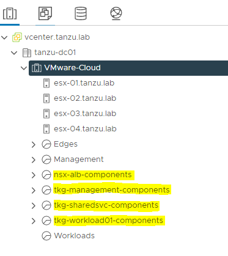

The following picture is an example of VM folders in a vSphere environment:
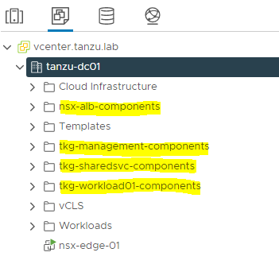


## Overview of the Deployment Steps

The following is an overview of the main steps for deploying Tanzu Kubernetes Operations on vSphere backed by NSX-T:

1. [Configure Tier-1 and Logical Segments in NSX-T](#configure-t1-gateway-and-logical-segments-in-nsx-t)

1. [Deploy and Configure NSX Advanced Load Balancer](#deploy-and-configure-nsx-advanced-load-balancer)

1. [Deploy and Configure Bootstrap Virtual Machine](#deploy-and-configure-bootstrap-machine)

1. [Deploy Tanzu Kubernetes Grid Management Cluster](#deploy-tanzu-kubernetes-grid-tkg-management-cluster)

1. [Deploy Tanzu Kubernetes Grid Shared Services Cluster](#deploy-tanzu-shared-service-cluster)

1. [Create a AKODeploymentConfig File](#create-akodeploymentconfig-file)

1. [Deploy Tanzu Kubernetes Grid Workload Cluster](#deploy-tanzu-workload-clusters)

1. [Deploy User-Managed Packages on Tanzu Kubernetes Grid Clusters](#deploy-user-managed-packages-on-tkg-clusters)

1. [Configure SaaS Services](#config-saas-services)


## <a id="configure-t1-gateway-and-logical-segments-in-nsx-t"> </a> Configure Tier-1 Gateway and Logical Segments in NSX-T

A tier-1 gateway performs the functions of a tier-1 logical router. It has downlink connections to segments and uplink connections to tier-0 gateways. Before configuring a tier-1 gateway, ensure that your NSX-T backed vSphere environment has at least one tier-0 gateway configured.

A tier-0 gateway performs the functions of a tier-0 logical router. It processes traffic between the logical and physical networks. For more information on creating and configuring tier-0 gateway, see [NSX-T documentation](https://docs.vmware.com/en/VMware-NSX-T-Data-Center/3.2/administration/GUID-E9E62E02-C226-457D-B3A6-FE71E45628F7.html)

This sections describes the following:

- [Required Overlay Backed Segments](#overlay-backed-segments)
- [Add a Tier-1 Gateway](#add-tier-1-gateway)
- [Configure DHCP on Tier-1 Gateway](#config-dhcp-tier-1-gateway)
- [Add or Create Overlay-Backed Segments](#add-overlay-backed-segments)

### <a id="overlay-backed-segments"> </a>Required Overlay Backed Segments

The following table provides sample entries of the required overlay-backed logical segments. Change the segment name and CIDRs for your environment.

| Network Type               | Sample Segment Name      | Sample Gateway CIDR | DHCP Enabled | DHCP Range configured in NSX-T | Static IP Pool reserved for NSX ALB SE/VIP |
| -------------------------- | ------------------------ | ------------------- | ------------ | ----------------------------- | ------------------------------------------ |
| NSX ALB Management Network       | alb-management-segment   | 172.16.10.1/24      | No           | N/A                           | 172.16.10.100 - 172.16.10.200              |
| TKG Management Network     | tkg-mgmt-segment         | 172.16.40.1/24      | Yes          | 172.16.40.100-172.16.40.200   | N/A                                        |
| TKG Shared Service Network | tkg-ss-segment           | 172.16.41.1/24      | Yes          | 172.16.41.100-172.16.41.200   | N/A                                        |
| TKG Management VIP Network       | tkg-mgmt-vip-segment     | 172.16.50.1/24      | No           | N/A                           | 172.16.50.100 - 172.16.50.200              |
| TKG Cluster VIP Network    | tkg-cluster-vip-segment  | 172.16.80.1/24      | No           | N/A                           | 172.16.80.100 - 172.16.80.200              |
| TKG Workload VIP Network   | tkg-workload-vip-segment | 172.16.70.1/24      | No           | N/A                           | 172.16.70.100 - 172.16.70.200              |
| TKG Workload Network       | tkg-workload-segment     | 172.16.60.1/24      | Yes          | 172.16.60.100-172.16.60.200   | N/A                                        |

### <a id="add-tier-1-gateway"> </a>Add a Tier-1 Gateway

The following steps provide the minimum configuration required to create a tier-1 gateway and connect it to a tier-o gateway. The tier-1 logical router must be connected to the tier-0 logical router to get the northbound physical router access.

The configuration provided here is sufficient to successfully deploy Tanzu for Kubernetes Operations. For a more information about configuring tier-1 gateways, see [Add a Tier-1 Gateway](https://docs.vmware.com/en/VMware-NSX-T-Data-Center/3.1/administration/GUID-EEBA627A-0860-477A-95A7-7645BA562D62.html).

1.  With administrator privileges, log in to NSX Manager.

2.  Select **Networking** > **Tier-1 Gateways**.

3.  Click **Add Tier-1 Gateway**.

    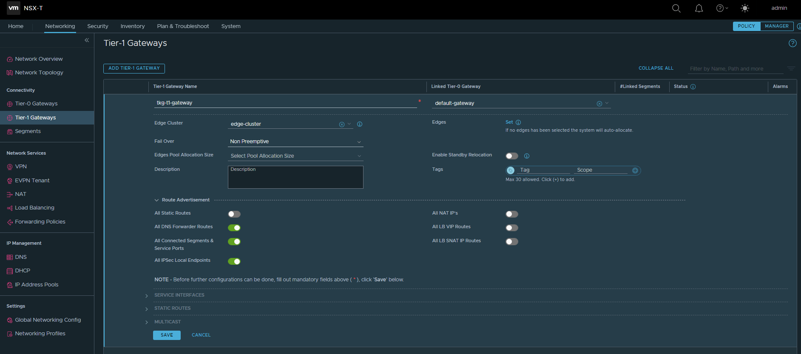

4.  Enter a name for the gateway.

5.  Select a tier-0 gateway to connect to this tier-1 gateway to create a multi-tier topology.

6.  Select an NSX Edge cluster.

   This is required for the tier-1 gateway to host stateful services such as NAT, load balancer, or firewall.

7.  (Optional) In the Edges field, click **Set** to select an NSX Edge node.

8.  Select a failover mode or accept the default.

   The default option is **Non-preemptive**.

9.  Enable **Standby Relocation**.

10. Click **Route Advertisement** and ensure that the following routes are enabled:

    - **All DNS Forwarder Routes**

    - **All Connected Segments and Service Ports**

    - **All IPSec Local Endpoints**

11. Click **Save**.

For information about NSX-T, see [VMware NSX-T Data Center Documentation](https://docs.vmware.com/en/VMware-NSX-T-Data-Center/index.html).


### <a id="config-dhcp-tier-1-gateway"> </a> Configure DHCP on Tier-1 Gateway
Some of the network segments in the sample [Required Overlay-Backed Segments](#overlay-backed-segments) table require DHCP. You can use of NSX-T to provide DHCP services for the networks.  

NSX-T supports three types of DHCP on a segment: DHCP local server, Gateway DHCP, and DHCP relay. For the purposes of this deployment, we will use Gateway DHCP.

Before creating overlay-backed segments, set DHCP configuration on the Tier-1 Gateway.

1.  With administrator privileges, log in to NSX Manager.

2.  Select **Networking** > **Tier-1 Gateways**.

3.  On the tier-1 gateway created earlier, click the **menu** icon (3 dots) and select **Edit**.

    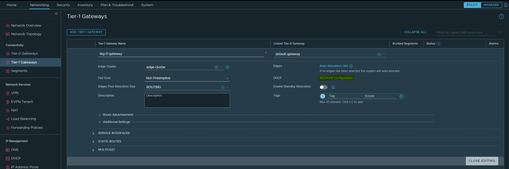

4.  Click **Set DHCP Configuration**.

5.  In the **Set DHCP Configuration** pop-up window, set **Type** to **DHCP Server**.
    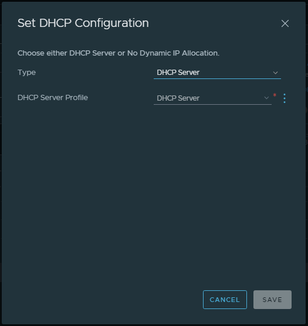

6.  If you have not created a DHCP server profile, click the **menu** icon (3 dots) and select **Create New**.  
    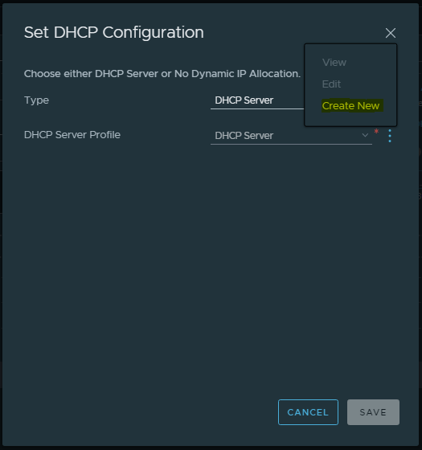

7.  In the **Create DHCP Profile** page,
    1. Enter a **Name** for DHCP profile.
    1. Select the **Edge Cluster**.
    1. Click **Save**.  
    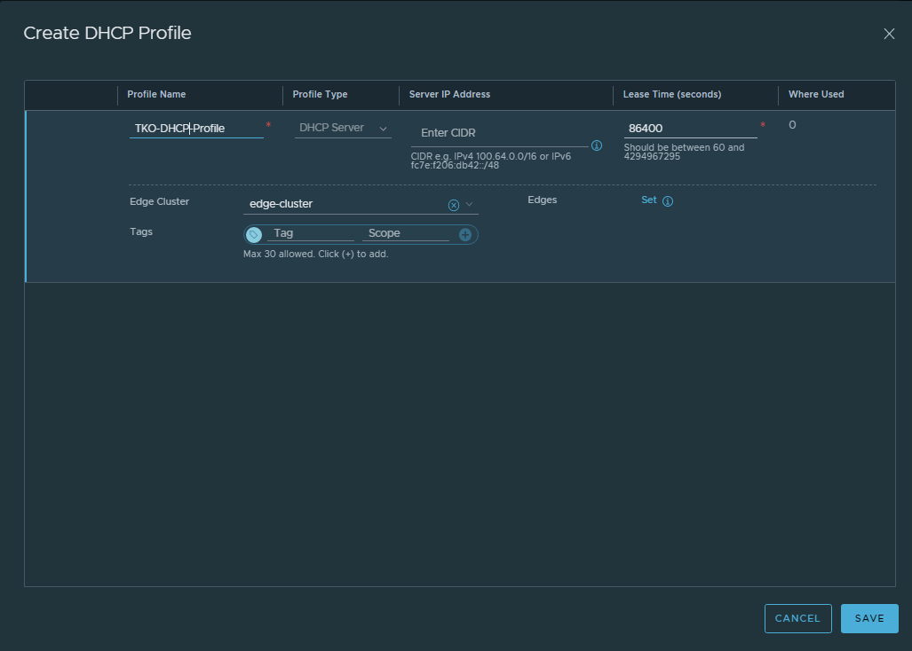

8.  Click **Save** in the **Set DHCP Configuration** window.
    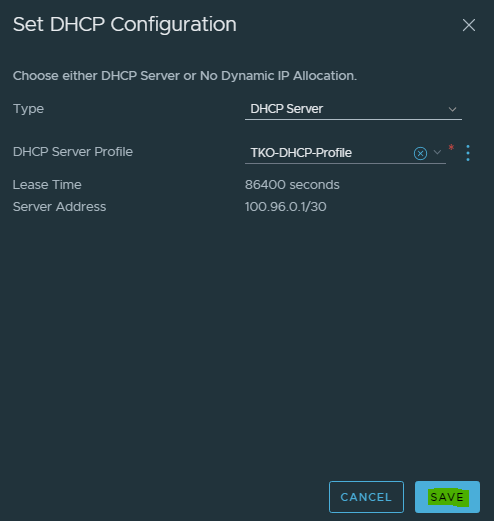

    The DHCP configuration in for the tier-1 gateway is set to **Local**.

9. Click **Save** and **Close Editing**.  
    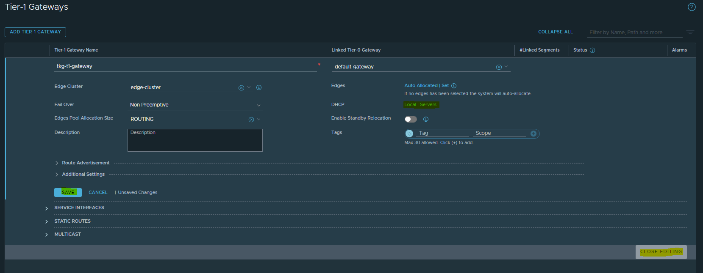

### <a id="add-overlay-backed-segments"> </a> Add or Create Overlay-Backed Segments

Based on the sample entries in the [Required Overlay-Backed Segments](#overlay-backed-segments) table, you will create seven overlay-backed logical segments. The segments are part of the same overlay transport zone and must be connected to the tier-1 gateway.  

The following steps provide the required details to create an overlay-backed network for this deployment:

1.  With admin privileges, log in to NSX Manager.

2.  Select **Networking** > **Segments**.

3.  Click **Add Segment**.

1.  Enter a name for the segment.

    Example: `tkg-mgmt-segment`

4.  Under “**Connected Gateway**”, select the tier-1 gateway you created.

5.  Select an overlay transport zone.

6.  Enter the **Gateway IP address** of the subnet in CIDR format.

    Example: `172.16.40.1/24`

    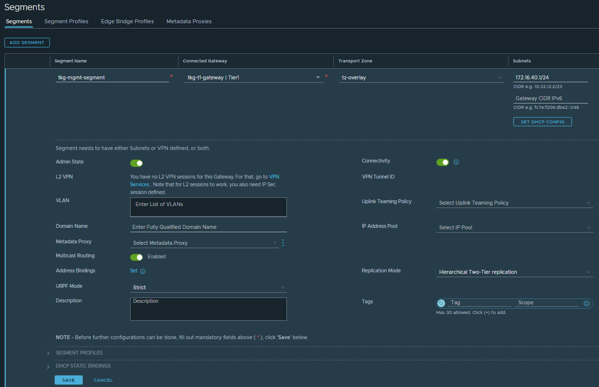

7.  Click **Set DHCP Config**.

    **Note:** Based on the sample entries in in the [Required Overlay-Backed Segments](#overlay-backed-segments) table, **Set DHCP Config** is required only for `TKG Management Network`, `TKG Shared Network`, and `TKG Workload Network`.

    - You may note that the “DHCP type” is set to “Gateway DHCP Server” and DHCP Profile is set to the profile created while creating the tier-1 gateway.

    - Under **Settings**,

        - Enable **DHCP Config**.
        - Enter an IP range in **Enter DHCP Ranges**.

      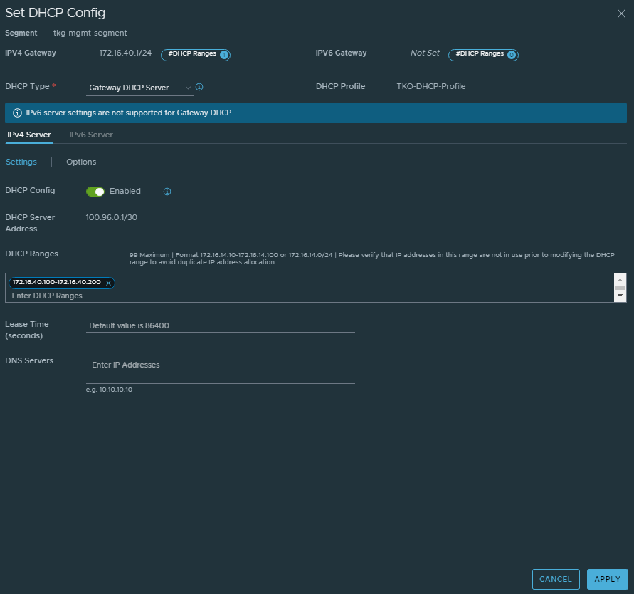

    - Click **Options**.

        - For **Select DHCP Option**, choose **GENERIC OPTIONS**.

        - Click **ADD GENERIC OPTION** and choose **NTP servers (42)**.

        - Enter the NTP server details and click **ADD**.

        - Click **Apply**.  

          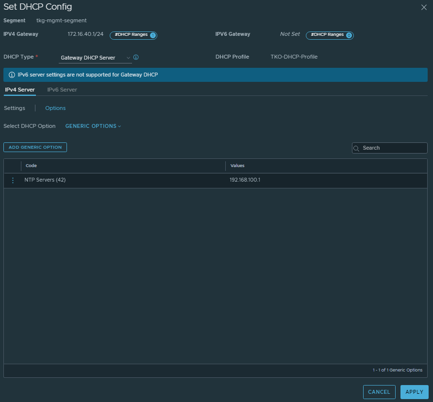

    - Click **Save**

8. Repeat the steps to create additional required overlay-backed segments.

   After you have created all the required overlay-backed segments, you will see a list similar to the following screen capture.

   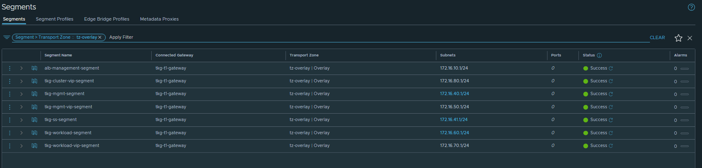

   The following screen capture shows what you see in the vCenter Networking section.

   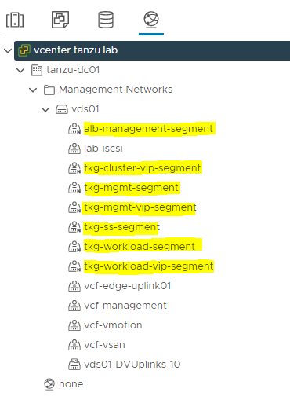

Additionally, you can create required Inventory groups and Firewall rules.
- For information about adding inventory groups, see [Add a Group](https://docs.vmware.com/en/VMware-NSX-T-Data-Center/3.2/administration/GUID-9DFF6EE2-2E00-4097-A412-B72472596E4D.html).
- For information about adding firewall rules, see
  - [Distributed Firewall](https://docs.vmware.com/en/VMware-NSX-T-Data-Center/3.2/administration/GUID-6AB240DB-949C-4E95-A9A7-4AC6EF5E3036.html)
  - [Gateway Firewall](https://docs.vmware.com/en/VMware-NSX-T-Data-Center/3.2/administration/GUID-A52E1A6F-F27D-41D9-9493-E3A75EC35481.html).
- For information about NSX-T, see [NSX-T Product Documentation](https://docs.vmware.com/en/VMware-NSX-T-Data-Center/index.html).

## <a id="deploy-and-configure-nsx-advanced-load-balancer"> </a> Deploy and Configure NSX Advanced Load Balancer

NSX Advanced Load Balancer is an enterprise-grade integrated load balancer that provides L4- L7 load balancer support.

For a production-grade deployment, we recommend deploying three instances of the NSX Advanced Load Balancer Controller for high availability and resiliency.

This deployment uses the following sample IP and FQDN set for the NSX Advanced Load Balancer. controllers:

| Controller Node  | IP Address   | FQDN           |
| ---------------- | ------------ | -------------- |
| Node 1 Primary   | 172.16.10.10 | avi01.lab.vmw  |
| Node 2 Secondary | 172.16.10.28 | avi02.lab.vmw  |
| Node 3 Secondary | 172.16.10.29 | avi03.lab.vmw  |
| HA Address       | 172.16.10.30 | avi-ha.lab.vmw |

### Deploy NSX Advanced Load Balancer

Before you begin, download and import the NSX Advanced Load Balancer 20.1.6 OVA to the content library. You will deploy the NSX Advanced Load Balancer under the resource pool **nsx-alb-components** and place it in the **nsx-alb-components** folder.

1. Log in to **vCenter**.

1. Go to **Home** > **Content Libraries**.

1. Select the **Content Library** under which the NSX-ALB OVA is placed.

1. Click on **OVA & OVF Templates**.

1. Right-click on **NSX ALB Image** and select **New VM from this Template**.

1. On the **Select a name and folder** page, enter a name and for folder for the NSX Advanced Load Balancer VM, select **nsx-alb-components**.

1. On the **Select a compute resource** page, for **resource pool** select **nsx-alb-components**.

1. On the **Review details** page, verify the template details and click **Next**.

1. On the **Select storage** page,

   - Select a storage policy from the VM Storage Policy drop-down menu.
   - Choose the datastore location where you want to store the virtual machine files.

1. On the **Select networks** page, select the network **alb-management-segment** and click **Next**

1. On the **Customize template** page, provide the NSX Advanced Load Balancer Management network details, such as IP Address, Subnet Mask, and Gateway, and click **Next**.

  **Note:** If you choose to use DHCP, these entries can be left blank

1. On the **Ready to complete** page, review the details and click **Finish**.

  

  A new task for creating the virtual machine appears in the **Recent Tasks** pane. After the task is complete, the NSX Advanced Load Balancer virtual machine is created on the selected resource.

1. Power on the VM.

   The system takes a few minutes to boot. After a successful boot up, navigate to NSX Advanced Load Balancer on your browser.  

   **Note:** While the system is booting up, a blank web page or a 503 status code may appear.

### NSX Advanced Load Balancer: Initial setup

After the NSX Advanced Load Balancer successfully boots up, navigate to NSX Advanced Load Balancer on your browser using the URL “https://\<AVI_IP/FQDN\>”. Configure the following basic system settings:

1. Administrator account setup.  
   Set administrator password and click **Create Account**.  
   

1. On the Welcome page enter the following:

   - **System Settings**: Enter a backup **Passphrase**, DNS information, and click **Next**.

     

   - **Email/SMTP**: Enter **Email** or **SMTP** information and click **Next**.  

     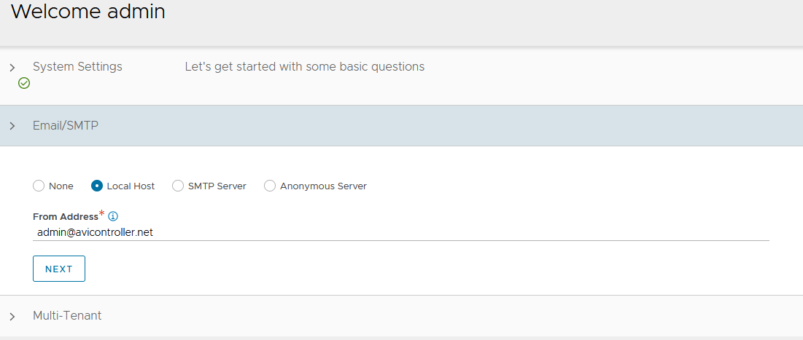

  - **Multi-Tenant**: Configure the following settings and click **Save**.  

    **IP Route Domain**: Select **Share IP route domain across tenants**.  

    **Service Engines are managed within the**: Select **Provider (Shared across tenants)**.  

    **Tenant Access to Service Engine**: Select **Read Access**.  

    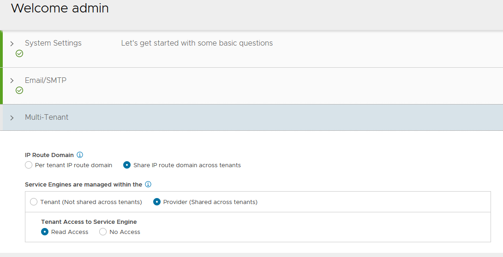

1. Navigate to **Administration** > **Settings** > **DNS/NTP**.

1. Click **Edit** to add your NTP server details.

   **Note:** You can delete the default NTP servers.  

1. Click **Save** .

    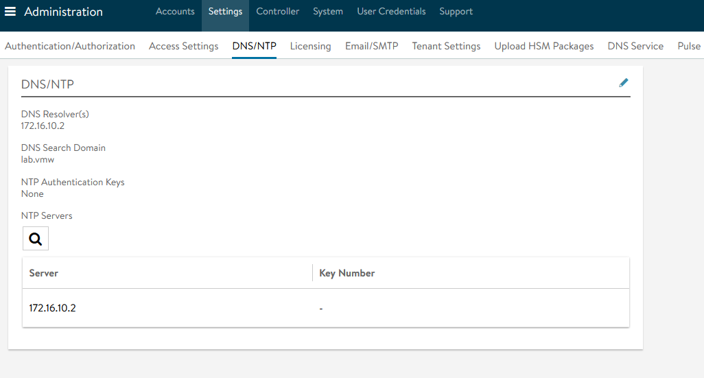

### NSX Advanced Load Balancer: Licensing

By default the evaluation license gets all the features provided in an Enterprise license. If you have an Enterprise License, add your enterprise license key in the licensing section.

See [NSX Advanced Load balancer Editions](https://avinetworks.com/docs/21.1/nsx-license-editions/) for comparison of available editions.

**Note:** Tanzu for Kubernetes Operations requires an NSX Advanced Load Balancer Enterprise License.

### NSX Advanced Load Balancer: Controller High Availability

NSX Advanced Load Balancer can run with a single Controller (single-node deployment) or with a 3-node Controller cluster. In a deployment that uses a single controller, that controller performs all administrative functions as well as all analytics data gathering and processing.

Adding two additional nodes to create a three-node cluster provides node-level redundancy for the controller and maximizes performance for CPU-intensive analytics functions.

In a 3-node NSX Advanced Load Balancer Controller cluster, one node is the primary (leader) node and performs the administrative functions. The other two nodes are followers (secondary) and perform data collection for analytics, in addition to standing by as backups for the leader.  

Do the following to configure NSX Advanced Load Balancer HA:

1. Set the cluster IP address for the NSX Advanced Load Balancer Controller.
    1. Log in to the primary NSX Advanced Load Balancer controller.
    1. Navigate to **Administration > Controller > Nodes**.
    1. Select the node and click **Edit**.

        The **Edit Controller Configuration** popup appears.

    1. In the **Controller Cluster IP** field, enter the IP address for the Controller.
    1. Click **Save**.  
       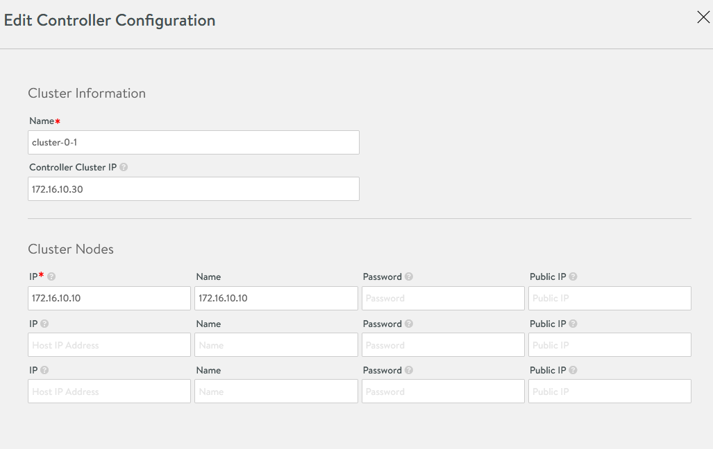

1. Deploy the 2nd and 3rd NSX Advanced Load Balancer nodes, using steps provided [here](#deploy-nsx-advanced-load-balancer)

1. Log in to the primary NSX Advanced Load Balancer Controller using the IP address or FQDN for the Controller.

   1. Navigate to **Administration > Controller > Nodes**.
   1. Select the node and click **Edit**.

      The **Edit Controller Configuration** popup appears.

   1. In the **Controller Cluster IP** field, enter the IP address for the 2nd and 3rd controller.
   2. (Optional) Provide a friendly name for each cluster node.
   1. Click **Save**.
      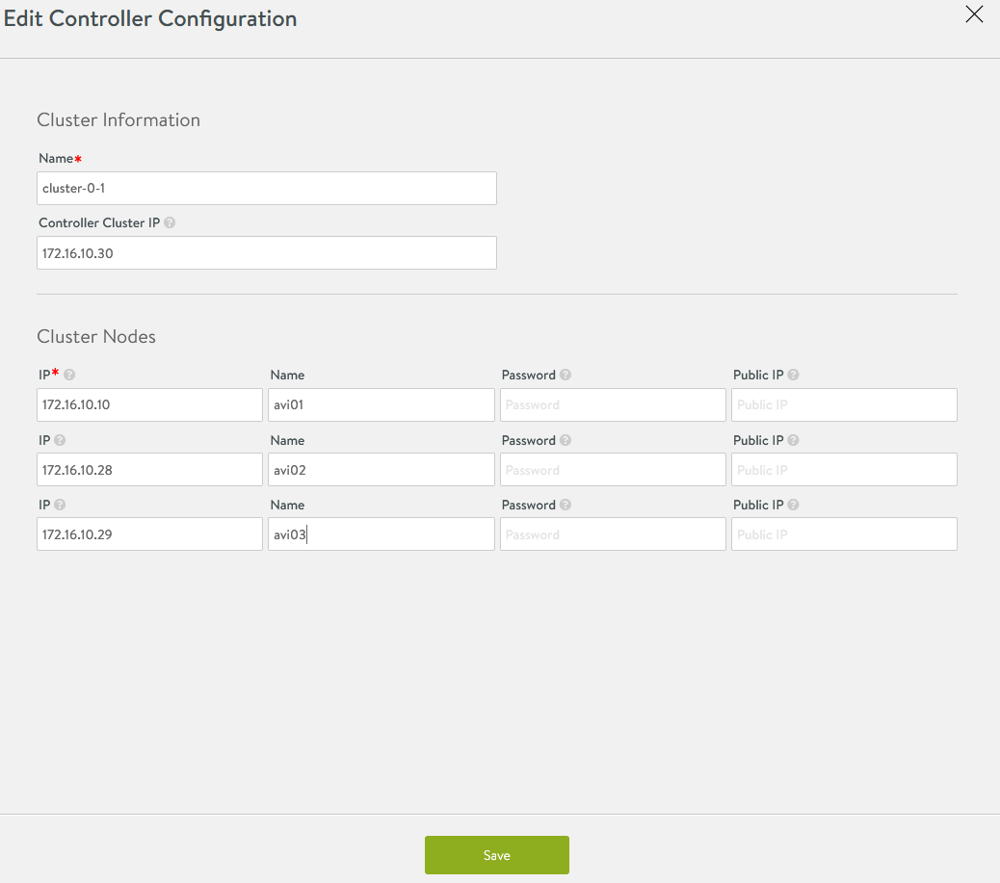

The primary Controller becomes the leader for the cluster and invites the other controllers to the cluster as members. NSX Advanced Load Balancer then performs a warm reboot of the cluster. This process can take 2-3 minutes. The configuration of the primary (leader) Controller is synchronized to the new member nodes when the cluster comes online following the reboot.

After the cluster is successfully formed you will see the following status:  


**Note:** After the cluster is formed, all NSX Advanced Load Balancer configurations are done by connecting to the NSX Advanced Load Balancer Controller Cluster IP/FQDN.

### NSX Advanced Load Balancer: Certificate Management

The default system-generated controller certificate generated for SSL/TSL connections will not have the required SAN entries. Do the following to create a Controller certificate and replace the default system-generated certificate:

1. Log in to NSX Advanced Load Balancer Controller.

1. Navigate to **Templates** > **Security** > **SSL/TLS Certificates**.

1. Click on **Create** and select **Controller Certificate**.

   You can either generate a self-signed certificate, CSR, or import a certificate.  
   This deployment uses a self-signed certificate.

1. Enter the required details that are specific to your infrastructure.

1. Under the **Subject Alternate Name (SAN)** section, enter the IP address and FQDN of all NSX Advanced Load Balancer controllers and the NSX Advanced Load Balancer cluster IP address and FQDN.
  

1. Click **Save**.

1. Copy the certificate contents. You will use the certificate contents when deploying the Tanzu Kubernetes Grid management cluster.  
   1. Click on the **Download** icon next to the certificate.
   1. Click **Copy to clipboard** next to the **Certificate** section.

      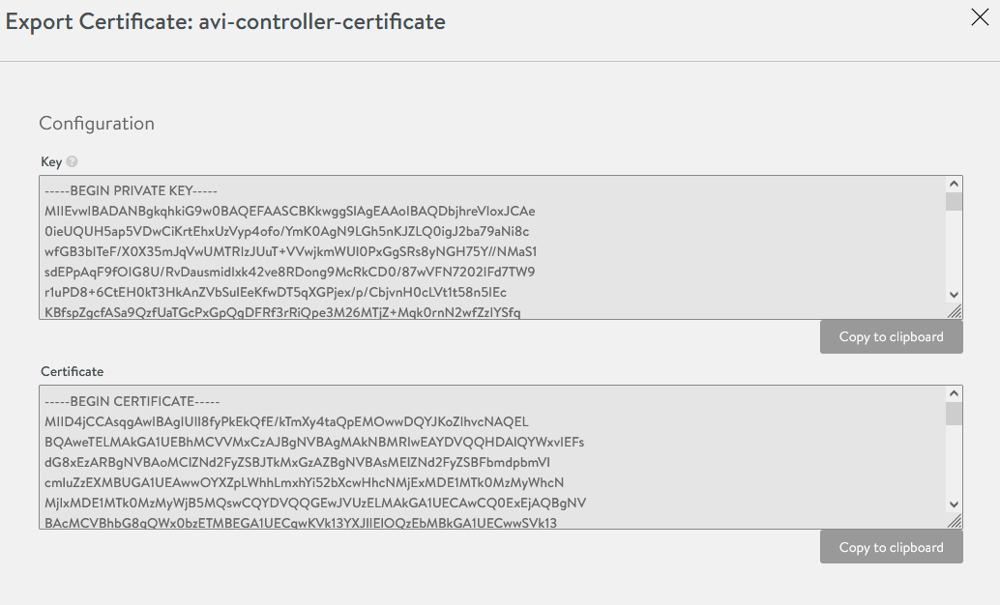

1. Replace the default system-generated certificate.
   1. Navigate to **Administration** > **Settings** > **Access Settings**.
   1. Click the pencil icon at the top right to edit the System Access Settings.
   1. Replace the **SSL/TSL certificate**.
   1. Click **Save**.  
      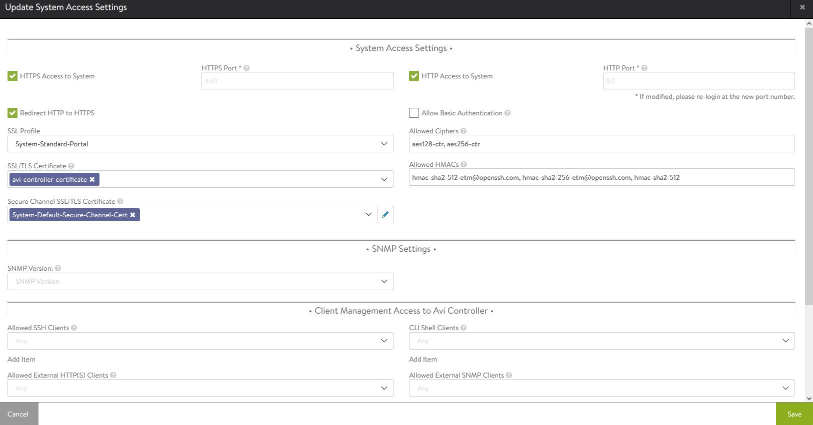  
   1. Log out and log in to the NSX Advanced Load Balancer.

### NSX Advanced Load Balancer: Create vCenter Cloud and SE Groups

Avi Vantage can be deployed in multiple environments for the same system. Each environment is called a cloud. Do the following to create a VMware vCenter cloud and two Service Engine (SE) Groups.

**Service Engine Group 1**: Service engines part of this Service Engine group hosts:

  - Virtual services for all load balancer functionalities requested by Tanzu Kubernetes Grid Management Cluster and Workload

  - Virtual services that load balances control plane nodes of all Tanzu Kubernetes Grid kubernetes clusters

**Service Engine Group 2**: Service engines part of this Service Engine group hosts virtual services for all load balancer functionalities requested by Tanzu Kubernetes Grid Workload clusters mapped to this SE group.  

Based on your requirements, you can create additional Service Engine groups for the workload clusters. Multiple workload clusters can be mapped to a single SE group. However, a Tanzu Kubernetes Grid cluster can be mapped to only one SE group for application load balancer services. See [Configure NSX Advanced Load Balancer in Tanzu Kubernetes Grid Workload Cluster](#configure-nsx-advanced-load-balancer-in-tkg-workload-cluster) for information on mapping a specific SE group to Tanzu Kubernetes Grid workload cluster.

The following table shows the components that are created in NSX Advanced Load Balancer.

| Object                 | Sample Name           |
| ---------------------- | --------------------- |
| vCenter Cloud          | `tanzu-vcenter01`       |
| Service Engine Group 1 | `tanzu-mgmt-segroup-01` |
| Service Engine Group 2 | `tanzu-wkld-segroup-01` |

1.  Login to NSX Advanced Load Balancer.

1. Navigate to **Infrastructure > Clouds**.
    

1. Click **Create > VMware vCenter/vSphere ESX**.  

2. Enter a name for the Cloud and click **Next**.  
    

3.  For **Infrastructure**, enter the following,
   - **vCenter Address**
   - **Username**
   - **Password**
   - Set **Access Permission** to **Write**  
    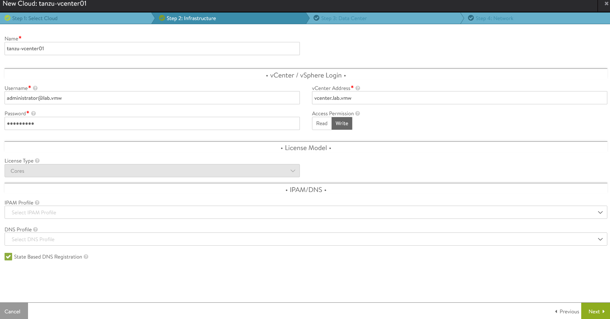

1. Click **Next**.     

4.  For **Datacenter**, choose the data center for NSX Advanced Load Balancer to discover infrastructure resources  
    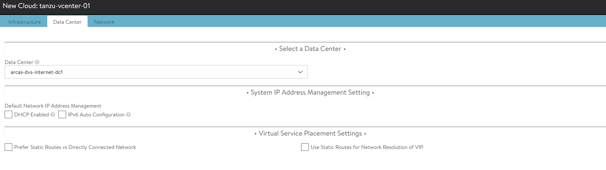

1. Click **Next**.         

5. For **Network**,
   - Choose the NSX Advanced Load Balancer **Management Network** : **alb-management-segment** for Service Engines.
   - Enter a **Static IP Address Pool** for SEs and VIP

    

1. Click **Complete**.   

6. Wait for the status of the Cloud to configure and **Status** to turn green.  
    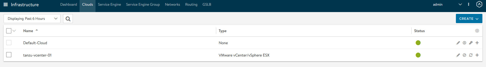

7. Create an SE group for Tanzu Kubernetes Grid management clusters.

   1. Click on the **Service Engine Group** tab.
   1. Under **Select Cloud**, choose the Cloud created in the previous step.
   1. Click **Create**.

   1. Provide a name for the Tanzu Kubernetes Grid management Service Engine group.
   1. Enter the  parameters in the following table. Keep all other default parameters.

      | Parameter                 | Value                                                                      |
      | ------------------------- | -------------------------------------------------------------------------- |
      | High availability mode    | Active/Standby (Tanzu Essentials License supports only Active/Standby Mode |
      | Memory per Service Engine | 4                                                                          |
      | vCPU per Service Engine   | 2                                                                          |

      

    1. On the **Advanced** tab, enter a specific cluster and datastore for service engine placement, change the AVI SE folder name and Service engine name prefix.

      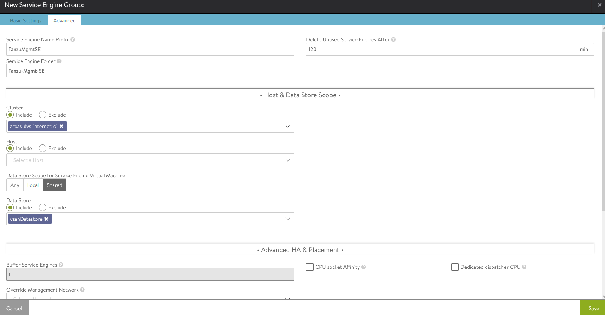

    1. Click **Save**.  

9.  Repeat the steps to create another Service Engine group for Tanzu Kubernetes Grid workload clusters.  
    

### NSX Advanced Load Balancer: Configure Network

Only the NSX Advanced Load Balancer management network is configured when you create the vCenter Cloud. This section describes how to configure the following Tanzu Kubernetes Grid networks in NSX Advance Load Balancer:  

- Tanzu Kubernetes Grid Management Network  
- Tanzu Kubernetes Grid Workload Network  
- Tanzu Kubernetes Grid Cluster VIP/Data Network  
- Tanzu Kubernetes Grid Management VIP/Data Network  
- Tanzu Kubernetes Grid Workload VIP/Data Network

Do the following to configure the networks on NSX Advanced Load Balancer:

1. Log in to NSX Advanced Load Balancer.
1. Navigate to **Infrastructure** > **Networks**.
1. Select the appropriate Cloud.
   All the networks available in vCenter are listed .
   

1. Click on the edit icon next to the network.
1. Enter the configuration information based on your SDDC configuration.
   The following table provides sample entries for each network.
   **Note:** Not all networks will be auto-discovered. For networks that are not auto-discovered, add the subnet.

   | Network Name             | DHCP | Subnet         | Static IP Pool                |
   | ------------------------ | ---- | -------------- | ----------------------------- |
   | tkg-mgmt-segment         | Yes  | 172.16.40.0/24 | NA                            |
   | tkg-ss-segment           | Yes  | 172.16.41.0/24 | NA                            |
   | tkg-workload-segment     | Yes  | 172.16.60.0/24 | NA                            |
   | tkg-cluster-vip-segment  | No   | 172.16.80.0/24 | 172.16.80.100 - 172.16.80.200 |
   | tkg-mgmt-vip-segment     | No   | 172.16.50.0/24 | 172.16.50.100 - 172.16.50.200 |
   | tkg-workload-vip-segment | No   | 172.16.70.0/24 | 172.16.70.100 - 172.16.70.200 |

   The following screen capture shows an example configuration for tkg-cluster-vip-segment.  

   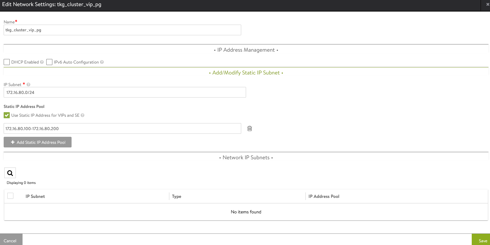

   The following screen capture shows the view in **Infrastructure > Networks** after the networks are configured.  

   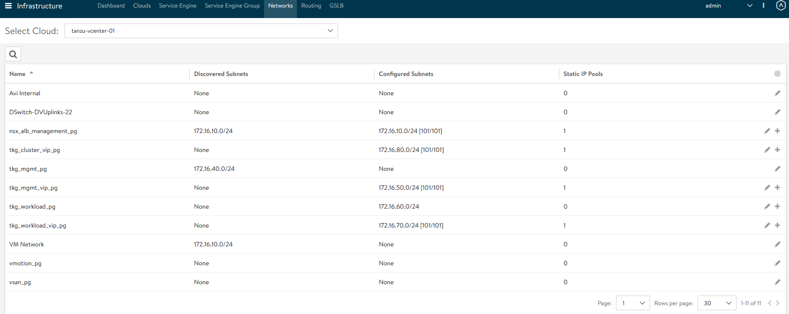

### NSX Advanced Load Balancer: Configure IPAM Profile

NSX Advanced Load Balancer provides IPAM service for Tanzu Kubernetes Grid Cluster VIP Network, Tanzu Kubernetes Grid Management VIP Network, and Tanzu Kubernetes Grid Workload VIP Network.  

Do the following to create an IPAM profile and attach it to the vCenter cloud created earlier:

1. Log in to NSX Advanced Load Balancer.
1. Navigate to **Infrastructure** > **Templates** > **IPAM/DNS Profiles** > **Create** > **IPAM Profile**.
1. Enter the details provided in the following table.

   | Parameter                 | Value                                                                         |
   | ------------------------- | ----------------------------------------------------------------------------- |
   | Name                      | tanzu-vcenter-ipam-01                                                         |
   | Type                      | AVI Vintage IPAM                                                              |
   | Cloud for Usable Networks | Tanzu-vcenter-01, created here                                                |
   | Usable Networks           | tkg-cluster-vip-segment</br>tkg-mgmt-vip-segment</br>tkg-workload-vip-segment |

   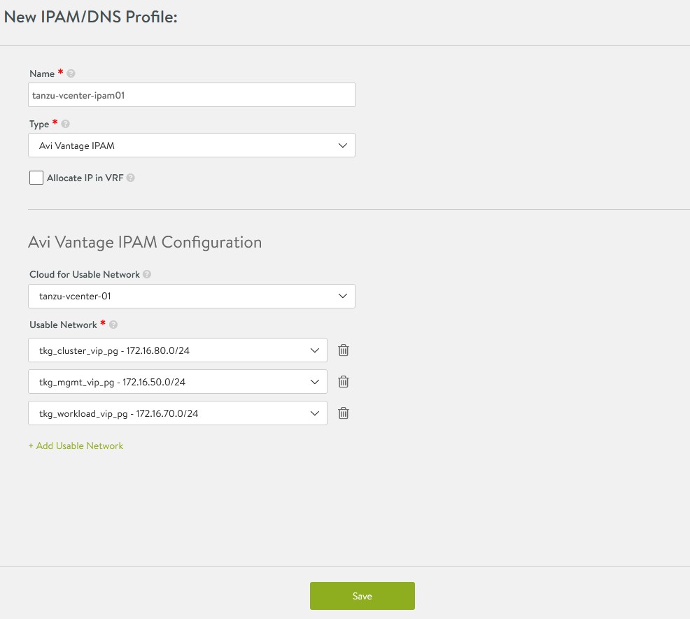
1. Click **Save**.

1. Attach the IPAM profile to the “tanzu-vcenter-01” cloud.  
   1. Navigate to **Infrastructure** > **Clouds**.
   1. Edit the **tanzu-vcenter-01** cloud.
   1. In the **IPAM/DNS** section, for **IPAM Profile** choose the profile created in previous step.
   1. Click **Save**.

   

This completes the NSX Advanced Load Balancer configuration. The next step is to deploy and configure the bootstrap machine, which will be used to deploy the Tanzu Kubernetes clusters.

## <a id="deploy-and-configure-bootstrap-machine"> Deploy and Configure Bootstrap Machine

The bootstrap machine can be a laptop, host, or server (running on Linux/MAC/Windows platform) that you deploy management and workload clusters from, and that keeps the Tanzu and Kubernetes configuration files for your deployments, the bootstrap machine is typically local.

For this deployment, we use a Photon-based virtual machine as the bootstrap machine. For information on how to configure for a Mac or Windows machine, see [Install the Tanzu CLI and Other Tools](https://docs.vmware.com/en/VMware-Tanzu-Kubernetes-Grid/1.4/vmware-tanzu-kubernetes-grid-14/GUID-install-cli.html).

1. Ensure that the bootstrap VM is connected to Tanzu Kubernetes Grid Management network `tkg-mgmt-segment`.

1. [Configure NTP](https://kb.vmware.com/s/article/76088) on your bootstrap machine.

1. Download and unpack the following Linux CLI packages from [VMware Tanzu Kubernetes Grid Download Product](https://customerconnect.vmware.com/en/downloads/details?downloadGroup=TKG-140&productId=988&rPId=49705).

  - VMware Tanzu CLI for Linux

  - kubectl cluster cli v1.21.2 for Linux

1. Execute the following commands to install Tanzu Kubernetes Grid CLI, Kubectl CLIs, and Carvel tools
  ```bash
  ## Install required packages
  tdnf install tar zip unzip wget -y

  ## Install Tanzu Kubernetes Grid CLI
  tar -xvf tanzu-cli-bundle-linux-amd64.tar
  cd ./cli/
  sudo install core/v1.4.0/tanzu-core-linux_amd64 /usr/local/bin/tanzu
  chmod +x /usr/local/bin/tanzu

  ## Install Tanzu Kubernetes Grid CLI Plugins
  tanzu plugin install --local ./cli all

  ## Install Kubectl CLI
  gunzip kubectl-linux-v1.21.2+vmware.1.gz
  mv kubectl-linux-v1.21.2+vmware.1 /usr/local/bin/kubectl && chmod +x /usr/local/bin/kubectl

  # Instal Carvel tools
  cd ./cli
  gunzip ytt-linux-amd64-v0.34.0+vmware.1.gz
  chmod ugo+x ytt-linux-amd64-v0.34.0+vmware.1 && mv ./ytt-linux-amd64-v0.34.0+vmware.1 /usr/local/bin/ytt

  cd ./cli
  gunzip kapp-linux-amd64-v0.37.0+vmware.1.gz
  chmod ugo+x kapp-linux-amd64-v0.37.0+vmware.1 && mv ./kapp-linux-amd64-v0.37.0+vmware.1 /usr/local/bin/kapp

  cd ./cli
  gunzip kbld-linux-amd64-v0.30.0+vmware.1.gz
  chmod ugo+x kbld-linux-amd64-v0.30.0+vmware.1 && mv ./kbld-linux-amd64-v0.30.0+vmware.1 /usr/local/bin/kbld

  cd ./cli
  gunzip imgpkg-linux-amd64-v0.10.0+vmware.1.gz
  chmod ugo+x imgpkg-linux-amd64-v0.10.0+vmware.1 && mv ./imgpkg-linux-amd64-v0.10.0+vmware.1 /usr/local/bin/imgpkg
  ```

1. Validate Carvel tools installation using the following commands:
    ```bash
    ytt version
    kapp version
    kbld version
    imgpkg version
    ```
1. Install `yq`. `yq` is a lightweight and portable command-line YAML processor. `yq` uses `jq`-like syntax but works with YAML and JSON files.
  ```bash
  wget https://github.com/mikefarah/yq/releases/download/v4.13.4/yq_linux_amd64.tar.gz
  tar -xvf yq_linux_amd64.tar && mv yq_linux_amd64 /usr/local/bin/yq
  ```
1. Photon OS has Docker installed by default. Execute the following commands to start the service and enable it to start at boot.
  ```bash
  ## Check Docker service status
  systemctl status docker

  ## Start Docker Service
  systemctl start docker

  ## To start Docker Service at boot
  systemctl enable docker
  ```
1. Execute the following commands to ensure that the bootstrap machine uses [cgroup v1](https://man7.org/linux/man-pages/man7/cgroups.7.html).
  ```bash
  docker info | grep -i cgroup

  ## You should see the following
  Cgroup Driver: cgroupfs
  ```
1. Create an SSH key pair.

   An SSH key pair is required for Tanzu CLI to connect to vSphere from the bootstrap machine.  

   The public key part of the generated key is passed during the Tanzu Kubernetes Grid management cluster deployment.
   ```bash
   ## Generate SSH key pair
   ## When prompted enter file in which to save the key (/root/.ssh/id_rsa): press Enter to accept the default and provide password
   ssh-keygen -t rsa -b 4096 -C "email@example.com"

   ## Add the private key to the SSH agent running on your machine and enter the password you created in the previous step
   ssh-add ~/.ssh/id_rsa
   ## If the above command fails, execute "eval $(ssh-agent)" and then rerun the command
   ```
1. If your bootstrap machine runs Linux or Windows Subsystem for Linux, and it has a Linux kernel built after the May 2021 Linux security patch, for example Linux 5.11 and 5.12 with Fedora, run the following command:

  `sudo sysctl net/netfilter/nf_conntrack_max=131072`

All required packages are now installed and the required configurations are in place in the bootstrap virtual machine. The next step is to deploy the Tanzu Kubernetes Grid management cluster.

## <a id="deploy-tanzu-kubernetes-grid-tkg-management-cluster"> </a>Deploy Tanzu Kubernetes Grid Management Cluster

After you have performed the steps described in [Deploy and Configure Bootstrap Machine](#deploy-and-configure-bootstrap-machine), you can deploy the management cluster.  

The management cluster is a Kubernetes cluster that runs Cluster API operations on a specific cloud provider to create and manage workload clusters on that provider.

The management cluster is also where you configure the shared and in-cluster services that the workload clusters utilize. You may deploy management clusters in two ways:

- Run the Tanzu Kubernetes Grid installer, a wizard interface that guides you through the process of deploying a management cluster. This is the recommended method.

- Create and edit YAML configuration files, and use them to deploy a management cluster with CLI commands.

You can deploy and manage Tanzu Kubernetes Grid management clusters on:

- vSphere 6.7u3

- vSphere 7, if vSphere with Tanzu is not enabled.

### <a id="import-base-image-template-for-tkg-cluster-deployment"> </a>Import Base Image template for Tanzu Kubernetes Grid Cluster Deployment

Before you proceed with the management cluster creation, ensure that the base image template is imported into vSphere and is available as a template. To import a base image template into vSphere:

1. Go to the [Tanzu Kubernetes Grid downloads](https://customerconnect.vmware.com/en/downloads/details?downloadGroup=TKG-140&productId=988&rPId=49705) page, and download a Tanzu Kubernetes Grid OVA for the cluster nodes.

  - For the **management cluster**, download either Photon or Ubuntu based Kubernetes v1.21.2 OVA.  
    **Note:** Custom OVA with a custom Tanzu Kubernetes release (TKr) is also support, as described in [Build Machine Images](https://docs.vmware.com/en/VMware-Tanzu-Kubernetes-Grid/1.4/vmware-tanzu-kubernetes-grid-14/GUID-build-images-index.html)

  - For **workload clusters,** the OVA can have any supported combination of OS and Kubernetes version as packaged in a Tanzu Kubernetes release.

    **Important**: Make sure you download the most recent OVA base image templates in the event of security patch releases. You can find updated base image templates that include security patches on the Tanzu Kubernetes Grid product download page.

1. In the vSphere Client, right-click an object in the vCenter Server inventory, select Deploy OVF template.

1. Select Local file, click the button to upload files, and navigate to the downloaded OVA file on your local machine.

1. Follow the installer prompts to deploy a VM from the OVA.

1. Click **Finish** to deploy the VM.

1. After the OVA deploys, right-click the VM and click **Template** > **Convert to Template**.  

  **NOTE:** Do not power on the VM before you convert it to a template.

1. If you are using a non administrator SSO account, in the VMs and Templates view, right-click the new template, select **Add Permission**, and assign the **tkg-user** to the template with the **TKG role**.

  For information about how to create the user and role for Tanzu Kubernetes Grid, see [Required Permissions for the vSphere Account](https://docs.vmware.com/en/VMware-Tanzu-Kubernetes-Grid/1.4/vmware-tanzu-kubernetes-grid-14/GUID-mgmt-clusters-vsphere.html#vsphere-permissions).

### Deploy Tanzu Kubernetes Grid Management Cluster using the Installer Wizard UI

**Important**: If you are deploying Tanzu Kubernetes Grid clusters in an Internet-restricted environment ensure that the local image repository is accessible from the bootstrap machine and Tanzu Kubernetes Grid management and workload Networks.  

1. To allow the bootstrap machine to pull images from the private image repository, set the following environment variable `TKG_CUSTOM_IMAGE_REPOSITORY`

  After the variable is set, Tanzu Kubernetes Grid pulls images from your local private registry rather than from the external public registry. To ensure that Tanzu Kubernetes Grid always pulls images from the local private registry, add “TKG_CUSTOM_IMAGE_REPOSITORY” to the global cluster configuration file, `~/.config/tanzu/tkg/config.yaml`.

  If your local image repository uses self-signed certificates, also add `TKG_CUSTOM_IMAGE_REPOSITORY_CA_CERTIFICATE` to the global cluster configuration file. Provide the CA certificate in `base64` encoded format by executing the command `base64 -w 0 your-ca.crt`.
  ```bash
  TKG_CUSTOM_IMAGE_REPOSITORY: custom-image-repository.io/yourproject
  TKG_CUSTOM_IMAGE_REPOSITORY_SKIP_TLS_VERIFY: false
  TKG_CUSTOM_IMAGE_REPOSITORY_CA_CERTIFICATE: LS0t[...]tLS0tLQ==
  ```
1. Run the following command on the bootstrap machine to launch the installer wizard UI.
  ```bash
  tanzu management-cluster create --ui --bind <bootstrapper-ip>:<port> --browser none

  ## For example
  tanzu management-cluster create --ui --bind 172.16.40.135:8000 --browser none
  ```
1. In a browser, enter `http://<bootstrapper-ip>:port/` to access the installer wizard UI  

  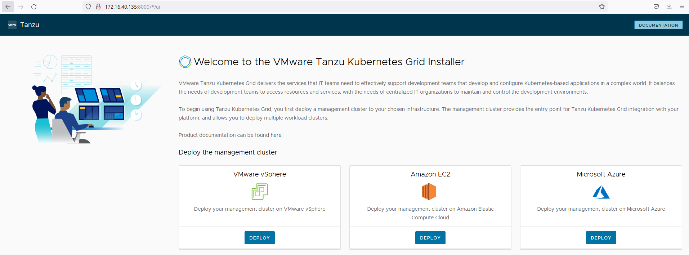

1. Click **Deploy** on the **VMware vSphere** tile.

1. In the **IaaS Provider** section, enter the IP/FQDN and credentials of the vCenter server where the Tanzu Kubernetes Grid management cluster will be deployed.

  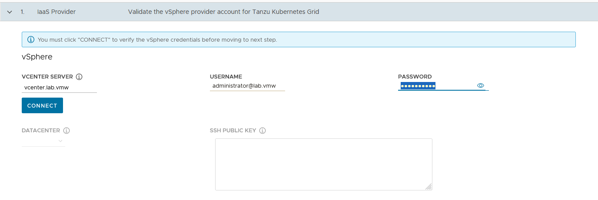

1. Click **Connect**.

1. Accept the vCenter Server SSL thumbprint.

1. If you are running on a vCenter 7.x environment, you will see the following popup.

  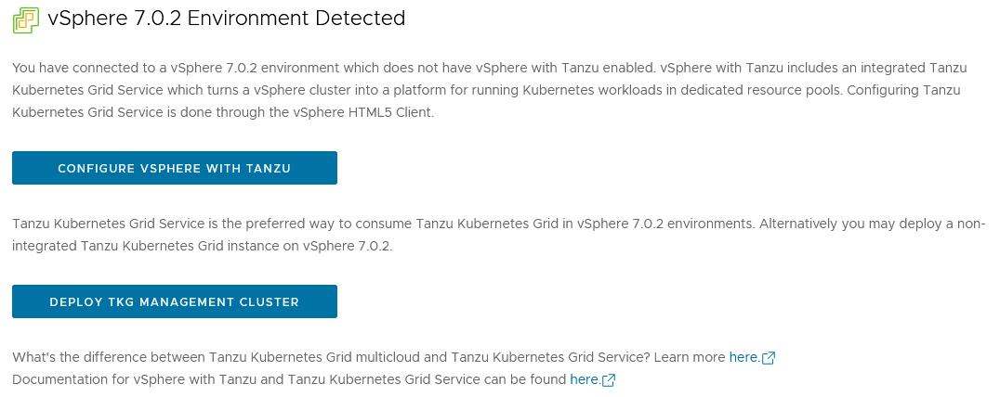

1. Click **Deploy TKG Management Cluster**.   

1. Select the **Datacenter** and provide the **SSH Public Key** generated while configuring the bootstrap VM.

  If you have saved the SSH key in the default location, execute the following command in you bootstrap machine to get the SSH public key `cat /root/.ssh/id_rsa.pub`.

1. Click **Next**.

   

1. In the **Management cluster settings** section,

  - Based on your environment requirements, select the appropriate deployment type for the Tanzu Kubernetes Grid Management cluster.

    - **Development**: Recommended for Development or POC environments.

    - **Production**: Recommended for Production environments.

    We recommended that you to set the **Instance Type** to **large** or above.  

    This deployment uses **Development** and **Instance Type** as **large**.

   - **Management Cluster Name**: Name for your management cluster.

   - **Control Plane Endpoint Provider**: Select NSX Advanced Load Balancer for the Control Plane HA.

   - **Control Plane Endpoint**: This is an optional field. If left blank, NSX Advanced Load Balancer assigns an IP from the pool **tkg-cluster-vip-segment** we created earlier.  

     If you need to provide an IP, pick an unused IP address from **tkg-cluster-vip-segment** static IP address pools configured in AVI.

     - **Machine Health Checks**: Enable

     - **Enable Audit Logging**: Enables to audit logging for Kubernetes API server and node VMs, choose as per environmental needs. For more information see [Audit Logging](https://docs.vmware.com/en/VMware-Tanzu-Kubernetes-Grid/1.4/vmware-tanzu-kubernetes-grid-14/GUID-troubleshooting-tkg-audit-logging.html)

1. Click **Next**.

  

1. In the **NSX Advanced Load Balancer** section, provide the following:

  - **Controller Host**: NSX Advanced Load Balancer Controller IP/FQDN (NSX Advanced Load Balancer Controller cluster IP/FQDN of the controller cluster is configured)

  - Controller credentials: **Username** and **Password** of NSX Advanced Load Balancer

  - **Controller certificate**

1. Click **Verify Credentials**.

1. Configure the following parameters:

   - **Cloud Name**: Name of the cloud created while configuring NSX Advanced Load Balancer `tanzu-vcenter-01`

   - **Service Engine Group Name**: Name of the Service Engine Group created for Tanzu Kubernetes Grid management clusters created while configuring NSX Advanced Load Balancer `tanzu-mgmt-segroup-01`

   - **Workload VIP Network Name**: Select Tanzu Kubernetes Grid Management VIP/Data Network network `tkg-mgmt-vip-segment` and select the discovered subnet

   - **Workload VIP Network CIDR**: Select the discovered subnet, in our case `172.16.50.0/24`​

   - **Management VIP Network Name**: Select Tanzu Kubernetes Grid Cluster VIP/Data Network network `tkg-cluster-vip-segment`

   - **Cluster Labels**: Enter required labels.

      Example:
      **type**:**management  

      **Note:** Based on your requirements you can specify multiple labels.

          

    **Important**: When a Tanzu Kubernetes Grid cluster, shared or workload cluster, is tagged with label the `type=management`, an `ako` pod is deployed on the cluster. Any applications hosted on the cluster that require load balancing services are exposed via the network `tkg-mgmt-vip-segment` and the virtual service is placed on the SE group `tanzu-mgmt-segroup-01`.  

    Based on the reference design, the **Cluster Labels** specified here are applied only on the shared service cluster.  

    **Note:** If a cluster label is not specified, `ako` pods are deployed on all the clusters. This deviates from the reference design.

1. Click **Next**.

1. (Optional) On the **Metadata** page, enter the location and labels.
   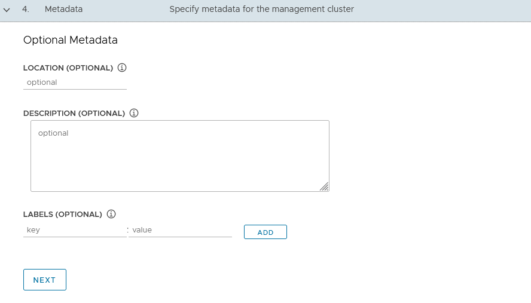

1. Click **Next**.     

1. In the **Resources** section, specify the resources for the Tanzu Kubernetes Grid management cluster and click **Next**.  
  

1. In the **Kubernetes Network** section, select the TKG Management Network, **tkg-mgmt-segment**. The control plane and worker nodes will be placed in the TKG Management Network during management cluster deployment.  

  Optionally, change the **Pod** and **Service CIDR** if the default provided network is already in use in your environment

  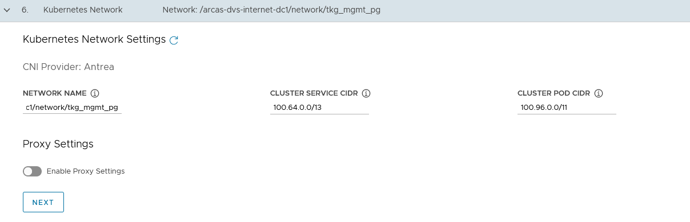

1. If the Tanzu environment is behind a proxy, enable proxy settings and provide proxy details.

   - If you set http-proxy, you must also set https-proxy and vice-versa.

   - For the no-proxy section:

      - For Tanzu Kubernetes Grid management and workload clusters, localhost, 127.0.0.1, the values of CLUSTER_CIDR and SERVICE_CIDR, .svc, and .svc.cluster.local values are appended along with the user specified values.

    **Important**: If the Kubernetes cluster needs to communicate with external services and infrastructure endpoints in your Tanzu Kubernetes Grid environment, ensure that those endpoints are reachable by your proxies or add them to TKG_NO_PROXY. Depending on your environment configuration, this may include, but is not limited to, your OIDC or LDAP server, Harbor, NSX-T, NSX Advanced Load Balancer, and vCenter.

    - For vSphere, you must manually add the CIDR of Tanzu Kubernetes Grid Management Network and Cluster VIP networks to TKG_NO_PROXY.

1. (Optional) **Identity Management with OIDC or LDAPs**.

   For this deployment, Identity management integration is **disabled** .
  

1. Click **Next**.

1. Select the **OS Image** to use for the management cluster deployment.  

  **Note**: The OS image list is empty if you don’t have a compatible template present in your environment. See [Import Base Image template for Tanzu Kubernetes Grid Cluster Deployment](#import-base-image-template-for-tkg-cluster-deployment) for instruction on importing the base image into vSphere and making it available as a template.

  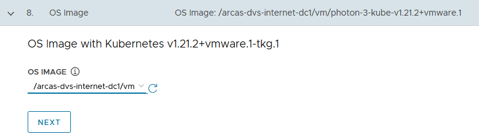

1. Click **Next**.  

1. **Register TMC**: Skip this section and click **Next**.

   VMware Tanzu Kubernetes Grid 1.4 does not support registering the management cluster in Tanzu Mission Control.

1. (Optional) Select **Participate in the Customer Experience Improvement Program**.

1. Click **Review Configuration**.

1. Review the configurations and click **Deploy Management Cluster**.

   The installer wizard displays the deployment logs on the screen.  

   

   Alternatively, you can copy and execute the provided command to deploy the management cluster.   

While the Tanzu Kubernetes Grid management Cluster deploys:
- A virtual service is created in NSX Advanced Load Balancer.

- New service engines are deployed in vCenter. The following picture shows the SEs.

  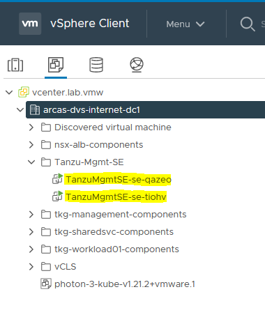

  The service engines are mapped to the SE Group `tanzu-mgmt-segroup-01`. This task is orchestrated by the NSX Advanced Load Balancer Controller.

- The following snippet shows that the first service engine is initialized successfully and a second SE is initializing.

  

- In NSX Advanced Load Balancer, we can see that the virtual service required for Tanzu Kubernetes Grid clusters control plane HA is hosted on the service engine group `tgk-mgmt-segroup-01`.  

  

- You can also view the Virtual Service status in NSX Advanced Load Balancer, in **Applications > Dashboard**, and in **Applications > Virtual Services**.

  

  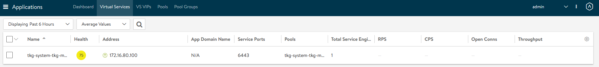

- The virtual service health is impacted as the second SE is still being initialized. You can ignore the virtual service health status.

- After the Tanzu Kubernetes Grid management cluster successfully deploys, you will see an installation complete message in the Tanzu Bootstrap UI.  

  

- The installer automatically sets the context to the Tanzu Kubernetes Grid management cluster in the bootstrap machine.  
- You can now access the Tanzu Kubernetes Grid management cluster from the bootstrap machine and perform additional tasks such as verifying the management cluster health and deploying the workload clusters.

- To get the status of Tanzu Kubernetes Grid Management cluster execute the following command:

  `tanzu management-cluster get`

  

- Use `kubectl` to get the status of the Tanzu Kubernetes Grid management cluster nodes  
  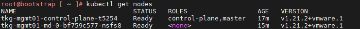

After the Tanzu Kubernetes Grid management cluster is successfully deployed, you can create the shared service cluster and workload clusters.

## <a id="deploy-tanzu-shared-service-cluster"> </a> Deploy Tanzu Shared Services Cluster

Each Tanzu Kubernetes Grid instance can have only one shared services cluster. Create a shared services cluster if you intend to deploy Harbor.

Deploying a shared services cluster and workload cluster is exactly the same, except for the following:

- You will add a `tanzu-services` label to the shared services cluster as its cluster role. The label identifies the shared services cluster to the management cluster and workload clusters.  
- The shared service cluster will be applied with the **Cluster Labels**, which were defined while deploying management Cluster. This enforces that the shared service cluster will make use of the **TKG Cluster VIP/Data Network** for application load balancing purposes and that the virtual services are deployed on **Service Engine Group 1**.

### Shared Services Cluster Configuration File

To deploy a shared service cluster, create a cluster configuration file. The cluster configuration file specifies the options to connect to vCenter Server and identifies the vSphere resources that the cluster will use.  

You can also specify standard sizes for the control plane and worker node VMs, or configure the CPU, memory, and disk sizes for control plane and worker nodes explicitly. If you use custom image templates, you can identify which template to use to create node VMs.

Following is a sample file with the minimum required configurations. For a complete list of the configuration file variables, see [Tanzu CLI Configuration File Variable Reference](https://docs.vmware.com/en/VMware-Tanzu-Kubernetes-Grid/1.4/vmware-tanzu-kubernetes-grid-14/GUID-tanzu-config-reference.html).  

Modify the parameters for your requirements.
```bash
CLUSTER_CIDR: <Network-CIDR>
SERVICE_CIDR: <Network-CIDR>
CLUSTER_PLAN: <prod/dev>
ENABLE_CEIP_PARTICIPATION: 'true'
ENABLE_MHC: 'true'
IDENTITY_MANAGEMENT_TYPE: none
INFRASTRUCTURE_PROVIDER: vsphere
TKG_HTTP_PROXY_ENABLED: 'false'
AVI_CONTROL_PLANE_HA_PROVIDER: "true"
CLUSTER_NAME: <Provide a Name For the TKG Cluster>
DEPLOY_TKG_ON_VSPHERE7: 'true'
VSPHERE_DATACENTER: /<DC-Name>
VSPHERE_DATASTORE: /<DC-Name>/datastore/<Datastore-Name>
VSPHERE_FOLDER: /<DC-Name>/vm/<Folder_Name>
VSPHERE_NETWORK: /<DC-Name>/network/<Network-Name>
VSPHERE_RESOURCE_POOL: /<DC-Name>/host/<Cluster-Name>/Resources/<Resource-Pool-Name>
VSPHERE_SERVER: <vCenter-Address>
VSPHERE_SSH_AUTHORIZED_KEY: "<SSH-Public-Key>"
VSPHERE_USERNAME: <vCenter-SSO-Username>
VSPHERE_PASSWORD: <SSO-User-Password>
VSPHERE_TLS_THUMBPRINT: <vCenter Server Thumbprint>
ENABLE_AUDIT_LOGGING: <true/false>
ENABLE_DEFAULT_STORAGE_CLASS: <true/false>
ENABLE_AUTOSCALER: <true/false>
CONTROLPLANE_SIZE: <small/medium/large/extra-large>
WORKER_SIZE: <small/medium/large/extra-large>
WORKER_MACHINE_COUNT: <number of worker nodes to be deployed>
```
The following table captures the key considerations for the Shared Service cluster configuration file.

|Variables|Value|
|--- |--- |
|`CLUSTER_PLAN`|prod : For all production deployments</br>dev: for POC/Dev environments|
|`IDENTITY_MANAGEMENT_TYPE`|Match the value set for the management cluster, oidc, ldap, or none.</br>Note: You do not need to configure additional OIDC or LDAP settings in the configuration file for workload clusters|
|`TKG_HTTP_PROXY_ENABLED`|true/false</br>If true below additional variables needs to be provided</br>`TKG_HTTP_PROXY`</br>`TKG_HTTPS_PROXY`</br>`TKG_NO_PROXY`|
|`VSPHERE_NETWORK`|As per the architecture, TKG Shared service cluster has dedicated overlay segment (tkg-ss-segment)|
|`CONTROLPLANE_SIZE` & `WORKER_SIZE`|Consider extra-large, as Harbor will be deployed on this cluster and this cluster may be attached to TMC and TO.</br>To define custom size, remove `CONTROLPLANE_SIZE` and `WORKER_SIZE` variable from the config file and add below variables with required resource allocation</br>For Control Plane Nodes:</br>​​`VSPHERE_CONTROL_PLANE_NUM_CPUS`</br>`VSPHERE_CONTROL_PLANE_MEM_MIB`</br>`VSPHERE_CONTROL_PLANE_DISK_GIB`</br>For Worker Nodes:</br>`VSPHERE_WORKER_NUM_CPUS`</br>`VSPHERE_WORKER_MEM_MIB`</br>`VSPHERE_WORKER_DISK_GIB`|
|`VSPHERE_CONTROL_PLANE_ENDPOINT`|This is optional, if left blank NSX Advanced Load Balancer will assign an IP from the pool `tkg-cluster-vip-segment` we created earlier.</br>If you need to provide an IP, pick an IP address from “TKG Cluster VIP/Data Network” static IP pools configured in NSX Advanced Load Balancer and ensure that the IP address is unused.|

Following is the sample Tanzu Kubernetes Grid shared service configuration file with sample values.

Update the values before using the file.
```bash
CLUSTER_CIDR: 100.96.0.0/11
SERVICE_CIDR: 100.64.0.0/13
CLUSTER_PLAN: dev
ENABLE_CEIP_PARTICIPATION: 'true'
ENABLE_MHC: 'true'
IDENTITY_MANAGEMENT_TYPE: none
INFRASTRUCTURE_PROVIDER: vsphere
TKG_HTTP_PROXY_ENABLED: 'false'
AVI_CONTROL_PLANE_HA_PROVIDER: "true"
CLUSTER_NAME: tkg-shared-svc
DEPLOY_TKG_ON_VSPHERE7: 'true'
VSPHERE_DATACENTER: /arcas-dvs-internet-dc1
VSPHERE_DATASTORE: /arcas-dvs-internet-dc1/datastore/vsanDatastore
VSPHERE_FOLDER: /arcas-dvs-internet-dc1/vm/tkg-sharedsvc-components
VSPHERE_NETWORK: /arcas-dvs-internet-dc1/network/tkg-ss-segment
VSPHERE_RESOURCE_POOL: /arcas-dvs-internet-dc1/host/arcas-dvs-internet-c1/Resources/tkg-sharedsvc-components
VSPHERE_SERVER: vcenter.lab.vmw
VSPHERE_SSH_AUTHORIZED_KEY: ssh-rsa AAAAB3NzaC1yc2EAAAADAQABAAACAQC6l1Tnp3EQ24cqskvTi9EXA/1pL/NYSJoT0q+qwTp8jUA1LBo9pV8cu/HmnnA/5gsO/OEefMCfz+CGPOo1mH596EdA/rUQo5K2rqhuNwlA+i+hU87dxQ8KJYhjPOT/lGHQm8VpzNQrF3b0Cq5WEV8b81X/J+H3i57ply2BhC3BE7B0lKbuegnb5aaqvZC+Ig97j1gt5riV/aZg400c3YGJl9pmYpMbyEeJ8xd86wXXyx8X1xp6XIdwLyWGu6zAYYqN4+1pqjV5IBovu6M6rITS0DlgFEFhihZwXxCGyCpshSM2TsIJ1uqdX8zUlhlaQKyAt+2V29nnHDHG1WfMYQG2ypajmE1r4vOkS+C7yUbOTZn9sP7b2m7iDnCG0GvCUT+lNQy8WdFC/Gm0V6+5DeBY790y1NEsl+9RSNNL+MzT/18Yqiq8XIvwT2qs7d5GpSablsITBUNB5YqXNEaf76ro0fZcQNAPfZ67lCTlZFP8v/S5NExqn6P4EHht0m1hZm1FhGdY7pQe8dLz/74MLTEQlP7toOp2ywoArYno8cFVl3PT8YR3TVQARvkS2pfNOquc5iU0r1FXOCrEc3d+LvJYmalmquvghZjblvxQKwguLFIodzdO/3CcpJvwGg0PiANvYZRqVNfTDCjtrN+lFXurlm2pSsA+YI5cbRtZ1ADaPw== administrator@lab.vmw
VSPHERE_USERNAME: administrator@lab.vmw
VSPHERE_PASSWORD: VMware@123
VSPHERE_TLS_THUMBPRINT: 40:1E:6D:30:4C:72:A6:8E:9D:AE:A8:67:DE:DA:C9:CA:B3:A6:C6:C2
ENABLE_AUDIT_LOGGING: true
ENABLE_DEFAULT_STORAGE_CLASS: true
ENABLE_AUTOSCALER: false
CONTROLPLANE_SIZE: large
WORKER_SIZE: extra-large
WORKER_MACHINE_COUNT: 1
```
### Deploy Shared Services Cluster

1. After creating the the configuration file for the shared services cluster, execute the following command to initiate the cluster deployment:

  `tanzu cluster create -f <path-to-config.yaml> -v 6`

  After the cluster successfully deploys, you will see the following output.   
  

2. Connect to the Tanzu Management Cluster context and apply labels.
  ```bash
  ## Add the tanzu-services label to the shared services cluster as its cluster role, in below command “tkg-shared-svc” is the name of the shared service cluster
  kubectl label cluster.cluster.x-k8s.io/tkg-shared-svc cluster-role.tkg.tanzu.vmware.com/tanzu-services="" --overwrite=true

  ## Tag shared service cluster with all “Cluster Labels” defined while deploying Management Cluster, once the “Cluster Labels” are applied AKO pod will be deployed on the Shared Service Cluster
  kubectl label cluster tkg-shared-svc type=management
  ```
3. Get the admin context of the shared service cluster and switch the context to the shared services cluster.
  ```bash
  ## Use below command to get the admin context of Shared Service Cluster,in below command “tkg-shared-svc” is the name of the shared service cluster tanzu cluster kubeconfig get tkg-shared-svc --admin
  ## Use below to use the context of Shared Service Cluster
  kubectl config use-context tkg-shared-svc-admin@tkg-shared-svc
  ```
  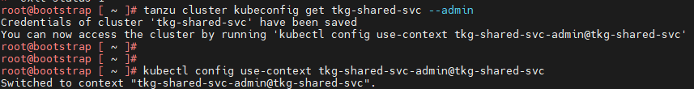

4. Deploy the Harbor.

   Before deploying Harbor, ensure that the Cert-manager and Contour user packages are installed. Deploy Harbor in the following order:

   1. [Install Cert-manager User package](#install-cert-manager-user-package)

   1. [Install Contour User package](#install-contour-user-package)

   1. [Install Harbor User package](#install-harbor-user-package)

   For more information, see [Deploy User-Managed Packages on Tanzu Kubernetes Grid Clusters](#deploy-user-managed-packages-on-tkg-clusters)

## <a id="create-akodeploymentconfig-file"> </a>Create a AKODeploymentConfig File    
Based on the reference design, the workload clusters in this deployment use a separate SE group (Service Engine Group 2) and VIP Network (TKG Workload VIP/Data Network) for application load balancing. To make use of a separate SE group and VIP Network, create a new **AKODeploymentConfig**.

The format of the AKODeploymentConfig YAML file is as follows:
```yaml
apiVersion: networking.tkg.tanzu.vmware.com/v1alpha1
kind: AKODeploymentConfig
metadata:
  finalizers:
     - ako-operator.networking.tkg.tanzu.vmware.com
  generation: 2
  name: <Unique name of AKODeploymentConfig>
spec:
  adminCredentialRef:
    name: avi-controller-credentials
    namespace: tkg-system-networking
  certificateAuthorityRef:
    name: avi-controller-ca
    namespace: tkg-system-networking
  cloudName: <NAME OF THE CLOUD>
  clusterSelector:
    matchLabels:
      <KEY>: <VALUE>
  controller: <NSX ALB CONTROLLER IP/FQDN>
  dataNetwork:
    cidr: <VIP NETWORK CIDR>
    name: <VIP NETWORK NAME>
  extraConfigs:
    image:
      pullPolicy: IfNotPresent
      repository: projects.registry.vmware.com/tkg/ako
      version: v1.3.2_vmware.1
    ingress:
      defaultIngressController: false
      disableIngressClass: true
  serviceEngineGroup: <SERVICE ENGINE NAME>
```


The following AKODeploymentConfig includes sample date. Replace the sample data with values for your environment. With the new AKODeploymentConfig, the Tanzu Kubernetes Grid management cluster deploys an AKO pod on any workload cluster that matches the label `type=workloadset01`.

   - Cloud: ​`tanzu-vcenter-01​`

   - Service Engine Group: `tanzu-wkld-segroup-01`

   - VIP/data Network: `tkg-cluster-vip-segment`

   ```yaml
   apiVersion: networking.tkg.tanzu.vmware.com/v1alpha1
   kind: AKODeploymentConfig
   metadata:
     finalizers:
        - ako-operator.networking.tkg.tanzu.vmware.com
     generation: 2
     name: tanzu-ako-workload-set01
   spec:
     adminCredentialRef:
       name: avi-controller-credentials
       namespace: tkg-system-networking
     certificateAuthorityRef:
       name: avi-controller-ca
       namespace: tkg-system-networking
     cloudName: tanzu-vcenter-01
     clusterSelector:
       matchLabels:
         type: workloadset01
     controller: avi-ha.lab.vmw
     dataNetwork:
       cidr: tkg-workload-vip-segment
       name: 172.16.70.0/24
     extraConfigs:
       image:
         pullPolicy: IfNotPresent
         repository: projects.registry.vmware.com/tkg/ako
         version: v1.3.2_vmware.1
       ingress:
         defaultIngressController: false
         disableIngressClass: true
     serviceEngineGroup: tanzu-wkld-segroup-01
   ```

## <a id="deploy-tanzu-workload-clusters"> </a>Deploy Tanzu Workload Clusters

To deploy a workload cluster, create a cluster configuration file. The cluster configuration file specifies the options to connect to vCenter Server and identifies the vSphere resources that the cluster will use.  

You can also specify standard sizes for the control plane and worker node VMs, or configure the CPU, memory, and disk sizes for control plane and worker nodes explicitly. If you use custom image templates, you can identify which template to use to create node VMs.

The following sample provides the minimum required configurations to create a Tanzu Kubernetes Grid workload cluster. For a complete list of the configuration file variables, see [Tanzu CLI Configuration File Variable Reference](https://docs.vmware.com/en/VMware-Tanzu-Kubernetes-Grid/1.4/vmware-tanzu-kubernetes-grid-14/GUID-tanzu-config-reference.html).  

Modify the parameters for your requirements.
```bash
CLUSTER_CIDR: 100.96.0.0/11
SERVICE_CIDR: 100.64.0.0/13
CLUSTER_PLAN: <prod/dev>
ENABLE_CEIP_PARTICIPATION: 'true'
ENABLE_MHC: 'true'
IDENTITY_MANAGEMENT_TYPE: none
INFRASTRUCTURE_PROVIDER: vsphere
TKG_HTTP_PROXY_ENABLED: 'false'
AVI_CONTROL_PLANE_HA_PROVIDER: "true"
CLUSTER_NAME: <Provide a Name For the TKG Cluster>
DEPLOY_TKG_ON_VSPHERE7: 'true'
VSPHERE_DATACENTER: /<DC-Name>
VSPHERE_DATASTORE: /<DC-Name>/datastore/<Datastore-Name>
VSPHERE_FOLDER: /<DC-Name>/vm/<Folder_Name>
VSPHERE_NETWORK: /<DC-Name>/network/<Network-Name>
VSPHERE_RESOURCE_POOL: /<DC-Name>/host/<Cluster-Name>/Resources/<Resource-Pool-Name>
VSPHERE_SERVER: <vCenter-Address>
VSPHERE_SSH_AUTHORIZED_KEY: "ssh-rsa Nc2EA [...] h2X8uPYqw== email@example.com"
VSPHERE_USERNAME: <vCenter-SSO-Username>
VSPHERE_PASSWORD: <SSO-User-Password>
VSPHERE_TLS_THUMBPRINT: <vCenter Server Thumbprint>
ENABLE_AUDIT_LOGGING: true/false
ENABLE_DEFAULT_STORAGE_CLASS: true/false
ENABLE_AUTOSCALER: true/false
CONTROLPLANE_SIZE: small/medium/large/extra-large
WORKER_SIZE: small/medium/large/extra-large
WORKER_MACHINE_COUNT: <# of worker nodes to be deployed>
```
The following table captures the key considerations for the workload cluster configuration file.

|Variables|Value|
|--- |--- |
|`CLUSTER_PLAN`|prod : For all production deployments</br>dev: for POC/Dev environments|
|`IDENTITY_MANAGEMENT_TYPE`|Match the value set for the management cluster, oidc, ldap, or none.</br>Note: You do not need to configure additional OIDC or LDAP settings in the configuration file for workload clusters|
|`TKG_HTTP_PROXY_ENABLED`|true/false</br>If true below additional variables needs to be provided</br>`TKG_HTTP_PROXY`</br>`TKG_HTTPS_PROXY`</br>`TKG_NO_PROXY`|
|`VSPHERE_NETWORK`|As per the architecture, TKG workload cluster will be attached to “TKG Workload Network”.</br>Note:The architecture supports multiple TKG workload clusters on the same network and/or separate networks for each Workload Clusters|
|`CONTROLPLANE_SIZE` & `WORKER_SIZE`|Consider extra-large, as Harbor will be deployed on this cluster and this cluster may be attached to TMC and TO.</br>To define custom size, remove `CONTROLPLANE_SIZE` and `WORKER_SIZE` variable from the config file and add below variables with required resource allocation</br>For Control Plane Nodes:</br>​​`VSPHERE_CONTROL_PLANE_NUM_CPUS`</br>`VSPHERE_CONTROL_PLANE_MEM_MIB`</br>`VSPHERE_CONTROL_PLANE_DISK_GIB`</br>For Worker Nodes:</br>`VSPHERE_WORKER_NUM_CPUS`</br>`VSPHERE_WORKER_MEM_MIB`</br>`VSPHERE_WORKER_DISK_GIB`|
|`VSPHERE_CONTROL_PLANE_ENDPOINT`|This is optional, if left blank NSX Advanced Load Balancer will assign an IP from the pool `tkg-cluster-vip-segment` we created earlier.</br>If you need to provide an IP, pick an IP address from “TKG Cluster VIP/Data Network” static IP pools configured in NSX Advanced Load Balancer and ensure that the IP address is unused.|
|`ENABLE_AUTOSCALER`|This is an optional parameter, set if you want to override the default value. The default value is false, if set to true, you must include additional variables</br>`AUTOSCALER_MAX_NODES_TOTAL`</br>`AUTOSCALER_SCALE_DOWN_DELAY_AFTER_ADD`</br>`AUTOSCALER_SCALE_DOWN_DELAY_AFTER_DELETE`</br>`AUTOSCALER_SCALE_DOWN_DELAY_AFTER_FAILURE`</br>`AUTOSCALER_SCALE_DOWN_UNNEEDED_TIME`</br>`AUTOSCALER_MAX_NODE_PROVISION_TIME`</br>`AUTOSCALER_MIN_SIZE_0`</br>`AUTOSCALER_MAX_SIZE_0`</br>For more details see Cluster Autoscaler|
|WORKER_MACHINE_COUNT|Consider setting the value to 3 or above if the cluster needs to be part of Tanzu Service Mesh(TSM)|

Following is a modified sample Tanzu Kubernetes Grid workload configuration file.
```bash
CLUSTER_CIDR: 100.96.0.0/11
SERVICE_CIDR: 100.64.0.0/13
CLUSTER_PLAN: dev
ENABLE_CEIP_PARTICIPATION: 'true'
ENABLE_MHC: 'true'
IDENTITY_MANAGEMENT_TYPE: none
INFRASTRUCTURE_PROVIDER: vsphere
TKG_HTTP_PROXY_ENABLED: 'false'
AVI_CONTROL_PLANE_HA_PROVIDER: "true"
CLUSTER_NAME: tkg-workload-dev
DEPLOY_TKG_ON_VSPHERE7: 'true'
VSPHERE_DATACENTER: /arcas-dvs-internet-dc1
VSPHERE_DATASTORE: /arcas-dvs-internet-dc1/datastore/vsanDatastore
VSPHERE_FOLDER: /arcas-dvs-internet-dc1/vm/tkg-workload01-components
VSPHERE_NETWORK: /arcas-dvs-internet-dc1/network/tkg-workload-segment
VSPHERE_RESOURCE_POOL: /arcas-dvs-internet-dc1/host/arcas-dvs-internet-c1/Resources/tkg-workload01-components
VSPHERE_SERVER: vcenter.lab.vmw
VSPHERE_SSH_AUTHORIZED_KEY: ssh-rsa AAAAB3NzaC1yc2EAAAADAQABAAACAQC6l1Tnp3EQ24cqskvTi9EXA/1pL/NYSJoT0q+qwTp8jUA1LBo9pV8cu/HmnnA/5gsO/OEefMCfz+CGPOo1mH596EdA/rUQo5K2rqhuNwlA+i+hU87dxQ8KJYhjPOT/lGHQm8VpzNQrF3b0Cq5WEV8b81X/J+H3i57ply2BhC3BE7B0lKbuegnb5aaqvZC+Ig97j1gt5riV/aZg400c3YGJl9pmYpMbyEeJ8xd86wXXyx8X1xp6XIdwLyWGu6zAYYqN4+1pqjV5IBovu6M6rITS0DlgFEFhihZwXxCGyCpshSM2TsIJ1uqdX8zUlhlaQKyAt+2V29nnHDHG1WfMYQG2ypajmE1r4vOkS+C7yUbOTZn9sP7b2m7iDnCG0GvCUT+lNQy8WdFC/Gm0V6+5DeBY790y1NEsl+9RSNNL+MzT/18Yqiq8XIvwT2qs7d5GpSablsITBUNB5YqXNEaf76ro0fZcQNAPfZ67lCTlZFP8v/S5NExqn6P4EHht0m1hZm1FhGdY7pQe8dLz/74MLTEQlP7toOp2ywoArYno8cFVl3PT8YR3TVQARvkS2pfNOquc5iU0r1FXOCrEc3d+LvJYmalmquvghZjblvxQKwguLFIodzdO/3CcpJvwGg0PiANvYZRqVNfTDCjtrN+lFXurlm2pSsA+YI5cbRtZ1ADaPw== administrator@lab.vmw
VSPHERE_USERNAME: administrator@lab.vmw
VSPHERE_PASSWORD: VMware@123
VSPHERE_TLS_THUMBPRINT: 40:1E:6D:30:4C:72:A6:8E:9D:AE:A8:67:DE:DA:C9:CA:B3:A6:C6:C2
ENABLE_AUDIT_LOGGING: true
ENABLE_DEFAULT_STORAGE_CLASS: true
ENABLE_AUTOSCALER: false
CONTROLPLANE_SIZE: large
WORKER_SIZE: extra-large
WORKER_MACHINE_COUNT: 3
```
After creating the the configuration file for the workload cluster, execute the following command to initiate the cluster deployment:

`tanzu cluster create -f <path-to-config.yaml> -v 6`

After the cluster is successfully deploys, you will see the following output.

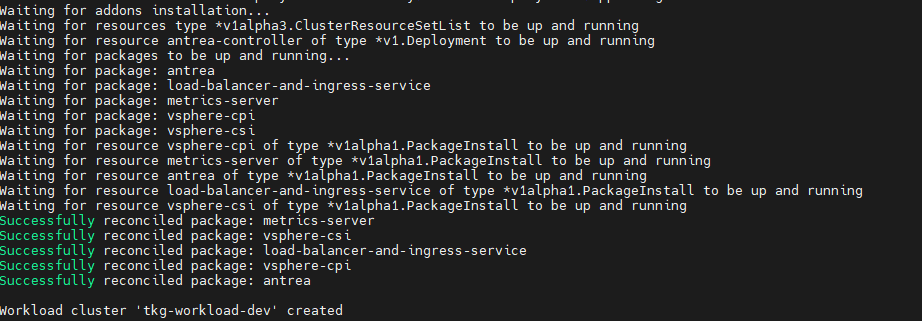

### Configure NSX Advanced Load Balancer in Tanzu Kubernetes Grid Workload Cluster

Tanzu Kubernetes Grid v1.4.x management clusters with NSX Advanced Load Balancer have a default AKODeploymentConfig file `install-ako-for-all` that is deployed during installation.

By default, any cluster that matches the cluster labels defined in `install-ako-for-all` references the file for its virtual IP networks, service engine (SE) groups, and L7 ingress. Based on the reference design, only the shared service cluster makes use of the configuration defined in the default AKODeploymentConfig `install-ako-for-all`.

To deploy the reference design, workload clusters must not make use of **Service Engine Group 1** and VIP Network **TKG Cluster VIP/Data Network** for application load balancer services.  

The workload clusters use a separate SE group **(Service Engine Group 2)** and VIP Network (**TKG Workload VIP/Data Network**). These configurations can be enforced on workload clusters by:

- Creating a new AKODeploymentConfig in the Tanzu Kubernetes Grid management cluster. This AKODeploymentConfig file specifies the SE group and VIP network that the workload clusters can use for load balancing. You created the new AKODeploymentConfig in [Create a AKODeploymentConfig File](#create-akodeploymentconfig-file).

- Applying the new AKODeploymentConfig. Label the workload cluster to match the AKODeploymentConfig.spec.clusterSelector.matchLabels element in the AKODeploymentConfig file.  
  Apply the label on the workload cluster. The Tanzu Kubernetes Grid management cluster deploys an AKO pod on the target workload cluster that has the configuration defined in the new AKODeploymentConfig.


1. Use kubectl to set the context to the Tanzu Kubernetes Grid management cluster and run the following commands to list the available `AKODeploymentConfig`.

  `kubectl apply -f <path_to_akodeploymentconfig.yaml>`

  

  Use the following command to list all AKODeploymentConfig created under the management cluster.

  `kubectl get adc`
  or
  `kubectl get akodeploymentconfig`

  

1. Apply the cluster labels defined in AKODeploymentConfig to the Tanzu Kubernetes Grid workload clusters.

  `kubectl label cluster <cluster name>\<label>`

  

  The Tanzu Kubernetes Grid management cluster will now deploy an AKO pod on the target workload clusters.

### Connect to Tanzu Kubernetes Grid Workload Cluster and Validate the Deployment

1. After the Tanzu Kubernetes Grid workload cluster is created and the required AKO configurations are applied, run the following command to get the admin context of the Tanzu Kubernetes Grid workload cluster.

  `tanzu cluster kubeconfig get <cluster-name> --admin`

  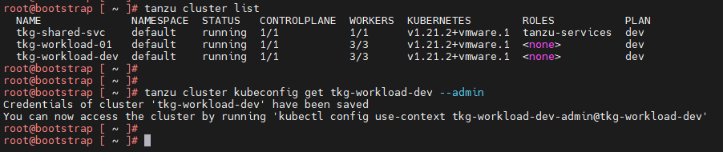

2. Connect to the Tanzu Kubernetes Grid workload cluster using kubectl and run the following commands to check the status of AKO and other components.
  ```bash
  kubectl get nodes # List all nodes with status  
  kubectl get pods -n avi-system # To check the status of AKO pod  
  kubectl get pods -A # Lists all pods and it’s status
  ```
  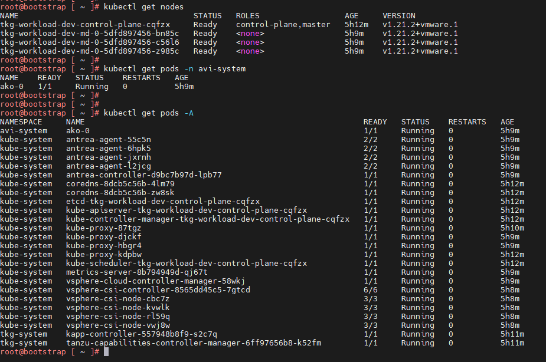


  The workload cluster is successfully deployed and AKO pod is deployed on the cluster. You can now [Configure SaaS Services</span>](#section-5) for the cluster and [Deploy User-Managed Packages](#deploy-user-managed-packages-on-tkg-clusters) on this cluster.


## <a id="deploy-user-managed-packages-on-tkg-clusters"> </a>Deploy User-Managed Packages on Tanzu Kubernetes Grid Clusters

Tanzu Kubernetes Grid includes the following user-managed packages. These packages provide in-cluster and shared services to the Kubernetes clusters that are running in your Tanzu Kubernetes Grid environment.

|Function|Package|Location|
|--- |--- |--- |
|Certificate Management|cert-manager|Workload or shared services cluster|
|Container networking|multus-cni|Workload cluster|
|Container registry|harbor|Shared services cluster|
|Ingress control|contour|Workload or shared services cluster|
|Log forwarding|fluent-bit|Workload cluster|
|Monitoring|grafana</br>prometheus|Workload cluster|
|Service discovery|external-dns|Workload or shared services cluster|

### Install Cert-Manager

Cert-manager is required for Contour, Harbor, Prometheus, and Grafana packages.

1.  Switch the context to the cluster and capture the available cert-manager version.

    `tanzu package available list cert-manager.tanzu.vmware.com -A`

2.  Install the Cert-Manager.

    `tanzu package install cert-manager --package-name cert-manager.tanzu.vmware.com --namespace cert-manager --version \<AVAILABLE-PACKAGE-VERSION\--create-namespace`

3.  Validate the Cert-manager package installation. The status changes to **Reconcile succeeded**.

    `tanzu package installed list -A | grep cert-manager`

### Install Contour

Contour is required for the Harbor, Prometheus, and Grafana packages.

1. Switch context to the cluster, and ensure that the AKO pod is in a running state.  
   `kubectl get pods -A | grep ako`

2. Create the following configuration file, and name the file contour-data-values.yaml.
  ```yaml
  ---
  infrastructure_provider: vsphere
  namespace: tanzu-system-ingress
  contour:
    configFileContents: {}
    useProxyProtocol: false
    replicas: 2
    pspNames: "vmware-system-restricted"
    logLevel: info
  envoy:
    service:
      type: LoadBalancer
      annotations: {}
      nodePorts:
        http: null
        https: null
      externalTrafficPolicy: Cluster
      disableWait: false
    hostPorts:
      enable: true
      http: 80
      https: 443
    hostNetwork: false
    terminationGracePeriodSeconds: 300
    logLevel: info
    pspNames: null
  certificates:
    duration: 8760h
    renewBefore: 360h
  ```
3.  Run the following command to capture the available Contour version.

    `tanzu package available list contour.tanzu.vmware.com -A`

4.  Install the Contour.

    `tanzu package install contour --package-name contour.tanzu.vmware.com --version <avaiable package version> --values-file <path_to_contour-data-values.yaml_file> --namespace tanzu-system-contour --create-namespace`

5.  Validate the Contour package installation. The status changes to **Reconcile succeeded**.
    `tanzu package installed list -A | grep contour`

### Install Harbor

Before you install Harbor, ensure that Cert-Manager and Contour are installed on the cluster.

1.  Check if the Cert-Manager and Contour are installed on the cluster.

    `tanzu package installed list -A`

    In the output, check that the status for `cert-manager` and `contour` **Reconcile succeeded**.

2.  Capture the available Harbor version.

    `tanzu package available list harbor.tanzu.vmware.com -A`

3.  Obtain the `harbor-data-values.yaml` file.
    ```bash
    image_url=$(kubectl -n tanzu-package-repo-global get packages harbor.tanzu.vmware.com.<package version> -o jsonpath='{.spec.template.spec.fetch[0].imgpkgBundle.image}')
    imgpkg pull -b</strong$image_url -o /tmp/harbor-package
    cp /tmp/harbor-package/config/values.yaml <path to save harbor-data-values.yaml>
    ```
4.  Set the mandatory passwords and secrets in the `harbor-data-values.yaml` file.
    `bash /tmp/harbor-package/config/scripts/generate-passwords.sh ./harbor-data-values.yaml`
5.  Update the following sections and remove comments in the `harbor-data-values.yaml` file.
    ```bash
    ##Update required fields
    hostname: <Harbor Registry FQDN>
    tls.crt: <Full Chain cert> (Optional, only if provided)
    tls.key: <Cert Key> (Optional, only if provided)
    ##Delete the auto generated password and replace it with the user provided value
    harborAdminPassword: <Set admin password>
    ## Remove all comments in the harbor-data-values.yaml file:
    yq -i eval '... comments=""' ./harbor-data-values.yaml
    ```

6.  Run the following command to install Harbor:

    `tanzu package install harbor --package-name harbor.tanzu.vmware.com --version <available package version> --values-file <path to harbor-data-values.yaml> --namespace tanzu-system-registry --create-namespace`

7.  To address a known issue, patch the Harbor package by following the steps in the Knowledge Base article, [The harbor-notary-signer pod fails to start in a Harbor installation under Tanzu Kubernetes Grid 1.4](https://kb.vmware.com/s/article/85725).

8.  Verify that Harbor is installed. The status changes to **Reconcile succeeded**.

    `tanzu package installed list -A | grep harbor`

## <a id="config-saas-services"></a> Configure SaaS Services

The following VMware SaaS services provide additional Kubernetes lifecycle management, observability, and service mesh features.

* Tanzu Mission Control (TMC)
* Tanzu Observability (TO)
* Tanzu Service Mesh (TSM)

For configuration information, see [Configure SaaS Services](tko-saas-services.md).
