#  Deploy Tanzu for Kubernetes Operations on vSphere with VMware VDS

This document provides step-by-step instructions for installing and configuring Tanzu for Kubernetes Operations on a vSphere environment backed by a Virtual Distributed Switch (VDS). The deployment is based on the reference design provided in [VMware Tanzu for Kubernetes Operations on vSphere Reference Design](../reference-designs/tko-on-vsphere.md). This document does not provide instructions for deploying the underlying SDDC components.

## Deploying with VMware Service Installer for Tanzu
 
You can use VMware Service Installer for VMware Tanzu to automate this deployment.
 
VMware Service Installer for Tanzu automates the deployment of the reference designs for Tanzu for Kubernetes Operations. It uses best practices for deploying and configuring the required Tanzu for Kubernetes Operations components.
 
To use Service Installer to automate this deployment, see [Deploying VMware Tanzu for Kubernetes Operations on vSphere with vSphere Distributed Switch Using Service Installer for VMware Tanzu](https://docs.vmware.com/en/Service-Installer-for-VMware-Tanzu/1.3/service-installer/GUID-vSphere%20-%20Backed%20by%20VDS-TKGm-TKOonVsphereVDStkg.html).
 
Alternatively, if you decide to manually deploy each component, follow the steps provided in this document.

## Prepare Your Environment for Deploying Tanzu for Kubernetes Operations

Before you start the deployment, ensure that the required resource pools and folders are created.
Following are sample entries of the resource pools and folders.

| Resource Type                 | Sample Resource Pool Name   | Sample Folder Name          |
| ----------------------------- | --------------------------- | --------------------------- |
| NSX Advanced Load Balancer Components            | `nsx-alb-components`        | `nsx-alb-components`        |
| TKG Management Components     | `tkg-management-components` | `tkg-management-components` |
| TKG Shared Service Components | `tkg-sharedsvc-components`  | `tkg-sharedsvc-components`  |
| TKG Workload components       | `tkg-workload01-components` | `tkg-workload01-components` |

The following picture is an example of resource pools in a vSphere environment:


The following picture is an example of VM folders in a vSphere environment:

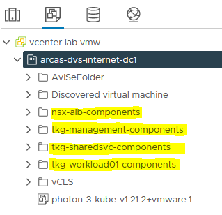

## Overview  of the Deployment Steps
The following is an overview of the main steps for deploying Tanzu Kubernetes Operations on vSphere backed by VDS:

1. [Deploy and Configure NSX Advanced Load Balancer](#deploy-and-configure-nsx-advanced-load-balancer)

1. [Deploy and Configure Bootstrap Machine](#deploy-and-configure-bootstrap-machine)

1. [Deploy Tanzu Kubernetes Grid Management Cluster](#deploy-tanzu-kubernetes-grid-tkg-management-cluster)

1. [Deploy Tanzu Kubernetes Grid Shared Service Cluster](#deploy-tanzu-shared-service-cluster)

1. [Deploy Tanzu Kubernetes Grid Workload Cluster](#deploy-tanzu-workload-clusters)

1. [Deploy User-Managed Packages on Tanzu Kubernetes Grid Clusters](#deploy-user-managed-packages-on-tkg-clusters)


## <a id=deploy-and-configure-nsx-advanced-load-balancer> </a> Deploy and Configure NSX Advanced Load Balancer

NSX Advanced Load Balancer is an enterprise-grade integrated load balancer that provides L4-L7 Load Balancer support. NSX Advanced Load Balancer is recommended for vSphere deployments without NSX-T, or when there are unique scaling requirements.

For a production-grade deployment, VMware recommends that you deploy 3 instances of the NSX Advanced Load Balancer Controller for high availability and resiliency.

The following is the sample IP address and FQDN set for the NSX Advanced Load Balancer controllers:

| Controller Node  | IP Address   | FQDN           |
| ---------------- | ------------ | -------------- |
| Node 1 Primary   | 172.16.10.10 | avi01.lab.vmw  |
| Node 2 Secondary | 172.16.10.28 | avi02.lab.vmw  |
| Node 3 Secondary | 172.16.10.29 | avi03.lab.vmw  |
| HA Address       | 172.16.10.30 | avi-ha.lab.vmw |

### <a id=deploy-nsx-advanced-load-balancer> </a> Deploy NSX Advanced Load Balancer

As one of the prerequisites, you must have downloaded the NSX Advanced Load Balancer 20.1.6 Open Virtual Appliance (OVA) and imported it to the content library. Deploy the NSX Advanced Load Balancer under the **resource pool “nsx-alb-components”** and place it in the **“nsx-alb-components”** **folder**.

To deploy NSX Advanced Load Balancer:

1. Log in to **vCenter** **Home** **Content** **Libraries**.

1. **Select the Content Library** under which the NSX-ALB OVA is placed.

1. Click **OVA & OVF Templates**.

1. Right-click **NSX ALB Image** and select **New VM from this Template**.

1. On the **Select name and folder** page, enter a **name** and select a **folder** for the NSX Advanced Load Balancer VM as **nsx-alb-components**.

1. On the **Select a compute resource** page, select the **resource pool** as **nsx-alb-components**.

1. On the **Review details** page, verify the template details and click **Next**.

1. On the **Select storage** page, select a storage policy from the VM Storage Policy drop-down menu and choose the datastore location where you want to store the virtual machine files.

1. On the **Select networks** page, select the `nsx_alb_management_pg` network and click **Next**.

1. On the **Customize Template** page, provide the NSX Advanced Load Balancer Management **network details**, such as IP Address, Subnet Mask, and Gateway, and click **Next**.
  **Note:** If you choose to use DHCP, you can leave these entries blank.

1. On the **Ready to complete** page, review the page and click **Finish**.


A new task for creating the virtual machine appears in the Recent Tasks pane. After the task is complete, the NSX Advanced Load Balancer virtual machine is created on the selected resource. Power on the virtual machine and give it few minutes for the system to boot.

**Note:** While the system is booting up, a blank web page or a 503 status code may appear.

### NSX Advanced Load Balancer: Initial setup

Once the NSX Advanced Load Balancer is successfully deployed and boots up, navigate to NSX Advanced Load Balancer on your browser using the URL “https://\<AVI_IP/FQDN\>” and configure the basic system settings:

1. Administrator account setup.
  Set an admin password and click **Create Account**.
  

1. On the **Welcome admin** page:

  1. Under **System Settings**: Set backup **Passphrase** and provide **DNS** information and click **Next**.
    

  1. Under **Email/SMTP**: Provide **Email** or **SMTP** information.
    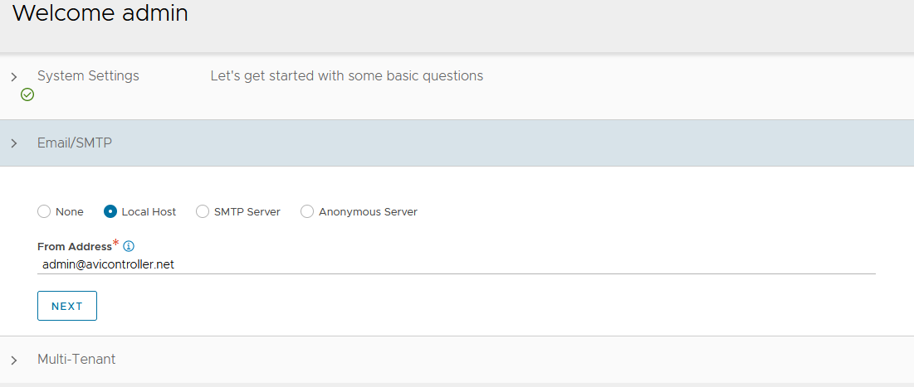

  1. Under **Multi-Tenant**: Configure settings as shown and click **Save
    IP Route Domain**: Share IP route domain across tenants
    **Service Engines are managed within the**: Provider (Shared across tenants)
    **Tenant Access to Service Engine**: Read Access
    

1. Go to **Administration** **Settings** **DNS/NTP Edit** to add your NTP server details and **Save**.
    
    **Note:** You may also delete the default NTP servers.

    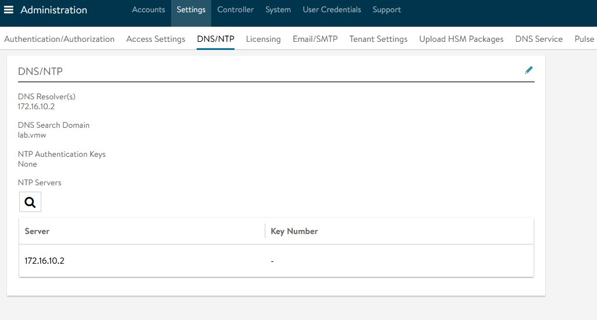

### NSX Advanced Load Balancer: Licensing

By default, the evaluation license uses Enterprise licensing. If you plan to use the Enterprise Licensing for your deployment, you may add your license key in the licensing section. If not, change the license model to Essentials.

See [NSX Advanced Load Balancer Editions](https://avinetworks.com/docs/21.1/nsx-license-editions/) for a comparison of available licensing editions.

To change the license edition to Essentials:

1. Log in to NSX Advanced Load Balancer **Administration** **Settings** **Licensing**. On the **Licensing** page, click **gear** **icon** next to Licensing\*\*.
  \*\*

1. Select **Essentials License** and click **Save**.
  

### NSX Advanced Load Balancer: Controller High Availability

NSX Advanced Load Balancer can run with a single controller (single-node deployment) or with a 3-node controller cluster. In a deployment that uses a single controller, that controller performs all administrative functions as well as all analytics data gathering and processing.

Adding 2 additional nodes to create a 3-node cluster provides node-level redundancy for the controller and also maximizes performance for CPU-intensive analytics functions.

In a 3-node NSX Advanced Load Balancer Controller cluster, one node is the primary (leader) node and performs the administrative functions. The other two nodes are followers (secondaries) and perform data collection for analytics, in addition to standing by as backups for the leader.
Perform the following steps to configure AVI Advanced Load Balancer HA:

1. **Set the Cluster IP for the NSX Advanced Load Balancer controller**
  Log in to the primary NSX Advanced Load Balancer controller. Navigate to **Administrator** **Controller** **Nodes,** and click **Edit**. The Edit Controller Configuration popup appears

1. In the Controller Cluster IP field, enter the **Controller Cluster IP** for the controller and click **Save**.
  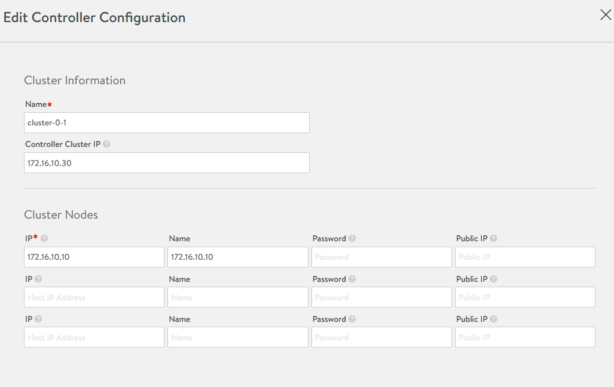

1. Deploy the 2nd and 3rd NSX Advanced Load Balancer nodes, following the steps provided in [Deploy NSX Advanced Load Balancer](#deploy-nsx-advanced-load-balancer).

1. Log in to the Primary NSX Advanced Load Balancer controller using the Controller Cluster IP/FQDN, navigate to **Administrator** **Controller** **Nodes,** and click **Edit**. The **Edit Controller** Configuration popup appears.

1. In the **Cluster Nodes** field, enter the IP address for the 2nd and 3rd controllers and click **Save**.

  **Optional:** Provide a friendly name for all 3 nodes.
  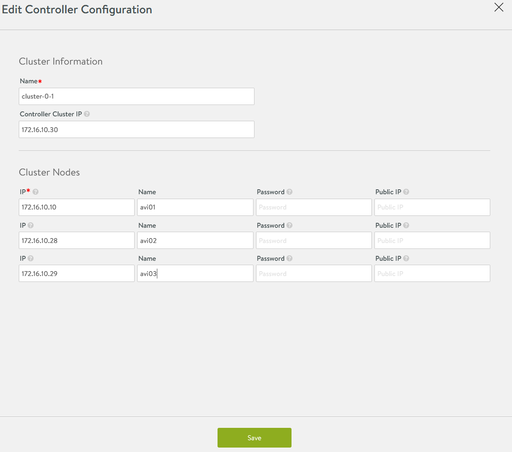

After these steps, the primary Avi Controller becomes the leader for the cluster and invites the other controllers to the cluster as members.

NSX Advanced Load Balancer then performs a warm reboot of the cluster. This process can take 2-3 minutes. The configuration of the primary (leader) controller is synchronized to the new member nodes when the cluster comes online following the reboot.

Once the cluster is successfully formed, you should see the following status:


**Note:** After the cluster is formed, all NSX Advanced Load Balancer configurations are done by connecting to the NSX Advanced Load Balancer Controller Cluster IP/FQDN.

### NSX Advanced Load Balancer: Certificate Management

The default system-generated controller certificate generated for SSL/TSL connections will not have required SAN entries. Follow the following steps to create a Controller certificate:

1. Log in to NSX Advanced Load Balancer Controller **Templates** **Security** **SSL/TLS Certificates**

1. Click **Create** and select **Controller Certificate**

1. You can either generate a Self-Signed certificate, generate a Certificate Signing Request (CSR), or import a certificate.
  For the purpose of this document, a self-signed certificate will be generated.

1. Provide all required details as per your infrastructure requirements. Under **the Subject Alternate Name** (SAN) section, provide the IP address and Fully Qualified Domain Name (FQDN) of all NSX Advanced Load Balancer controllers, including the IP address and FQDN of the NSX Advanced Load Balancer cluster, and click **Save**.
  

1. Once the certificate is created, capture the certificate contents. You will need this when you deploy the Tanzu Kubernetes Grid management cluster.
  
  To capture the certificate content, click the “Download” icon next to the certificate, and then click “Copy to clipboard” under the **Certificate** section.
  

1. To replace the certificate, navigate to **Administration** **Settings** **Access** **Settings**, and click the pencil icon at the top right to **edit** the System Access Settings, replace the SSL/TSL certificate, and click **Save**.
  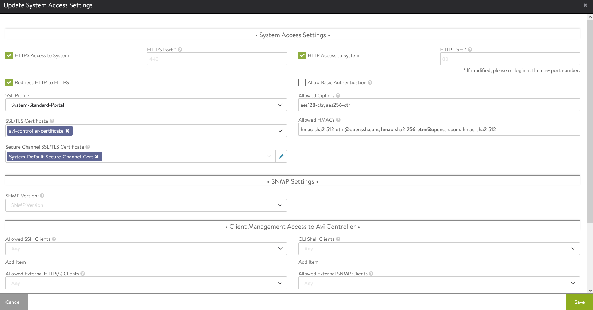

1. To complete the certificate configuration, log out and log back in to the NSX Advanced Load Balancer.

### NSX Advanced Load Balancer: Create vCenter Cloud and SE Groups

Avi Vantage may be deployed in multiple environments for the same system. Each environment is called a cloud. The following procedure provides steps on how to create a VMware vCenter cloud. As shown in the architecture, two Service Engine (SE) Groups will be created:
**Service Engine Group 1**: Service engines in this group host:

  - Virtual services for all load balancer functionalities requested by the Tanzu Kubernetes Grid management and workload clusters

  - Virtual services that load balance the control plane nodes of all Tanzu Kubernetes Grid Kubernetes clusters

**Service Engine Group 2**: Service engines part of this Service Engine group hosts virtual services for all load balancer functionalities requested by Tanzu Kubernetes Grid Workload clusters mapped to this SE group.

  - Based on your requirements, you can create additional Service Engine groups for the workload clusters.

  - Multiple Workload clusters can be mapped to a single SE group.

  - A Tanzu Kubernetes Grid cluster can be mapped to only one SE group for Advanced Load Balancer services.
  See [Configure NSX Advanced Load Balancer in Tanzu Kubernetes Grid Workload Cluster](#configure-nsx-advanced-load-balancer-in-tkg-workload-cluster) for more details on mapping a specific SE group to a Tanzu Kubernetes Grid workload cluster.

  The following components will be created in NSX Advanced Load Balancer:

  | Object                 | Sample Name             |
  | ---------------------- | ----------------------- |
  | vCenter Cloud          | `tanzu-vcenter01`       |
  | Service Engine Group 1 | `tanzu-mgmt-segroup-01` |
  | Service Engine Group 2 | `tanzu-wkld-segroup-01` |

1.  Log in to **NSX ALB > Infrastructure > Clouds > Create  > VMware vCenter/vSphere ESX**
    

2.  Provide the cloud name and click **Next**.
    

3.  Under the **Infrastructure** pane, provide **vCenter Address**, **username**, and **password**. Set **Access** **Permission** to "**Write**" and click **Next**.
    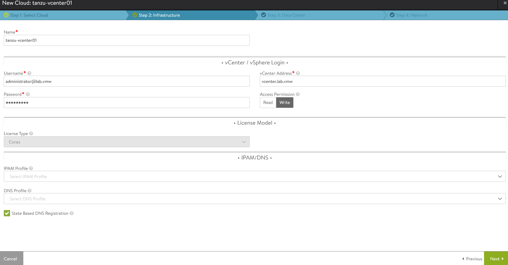

4.  Under the **Datacenter** pane, choose the datacenter for NSX Advanced Load Balancer to discover infrastructure resources.
    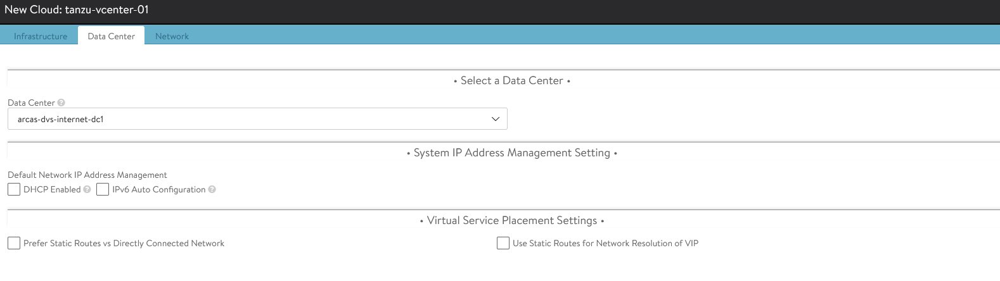

5.  Under the **Network** pane, choose the NSX Advanced Load Balancer **Management** **Network** for Service Engines and provide a **Static** **IP** **pool** for SEs and VIP and click **Complete**.
    

6.  Wait for the cloud to configure and the cloud status indicator to turn green.
    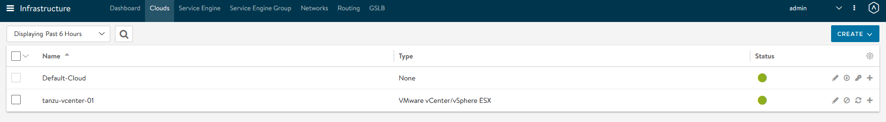

7.  To create a Service Engine group for Tanzu Kubernetes Grid management clusters, click the **Service Engine Group** tab. Under **Select Cloud**, choose the cloud created in the previous step, and click **Create**.

8.  Provide a name for the Tanzu Kubernetes Grid management Service Engine group and set the following parameters:

   | Parameter                 | Value                                                                      |
   | ------------------------- | -------------------------------------------------------------------------- |
   | High availability mode    | Active/Standby (Tanzu Essentials License supports only Active/Standby Mode |
   | Memory per Service Engine | 4                                                                          |
   | vCPU per Service Engine   | 2                                                                          |

   Leave the remaining parameters at their default settings.


9. For advanced configuration, click the **Advanced** tab. Here you can set the AVI service engine folder and service engine name prefix and select a specific cluster and datastore for service engine placement. Click **Save** when you are done.


10.  Follow steps 7 and 8 to create another SE group for Tanzu Kubernetes Grid workload clusters. Once complete, there will be two SE groups created.
    

### NSX Advanced Load Balancer: Configure Network and IPAM Profile

#### Configure Tanzu Kubernetes Grid Networks in NSX Advanced Load Balancer

As part of the cloud creation in NSX Advanced Load Balancer, only the Management Network has been configured in NSX Advanced Load Balancer. Follow this procedure to configure these networks:

- TKG Management Network
- TKG Workload Network
- TKG Cluster VIP/Data Network
- TKG Management VIP/Data Network
- TKG Workload VIP/Data Network

1. Log in to NSX Advanced Load Balancer **Infrastructure** **Networks**

1. Select the appropriate Cloud

  All the networks available in vCenter will be listed.
  

1. Click the edit icon for the network and configure as shown. Change the details provided in the table according to your SDDC configuration.
  **Note:** Not all networks will be auto-discovered. For those that are not, add the subnet manually.

  | Network Name        | DHCP | Subnet         | Static IP Pool                |
  | ------------------- | ---- | -------------- | ----------------------------- |
  | `tkg_mgmt_pg`         | Yes  | 172.16.40.0/24 | NA                            |
  | `tkg_workload_pg`     | Yes  | 172.16.60.0/24 | NA                            |
  | `tkg_cluster_vip_pg`  | No   | 172.16.80.0/24 | 172.16.80.100 - 172.16.80.200 |
  | `tkg_mgmt_vip_pg`     | No   | 172.16.50.0/24 | 172.16.50.100 - 172.16.50.200 |
  | `tkg_workload_vip_pg` | No   | 172.16.70.0/24 | 172.16.70.100 - 172.16.70.200 |

  The following snippet shows the configuration of one of the networks, for example: `tkg_cluster_vip_pg`:
  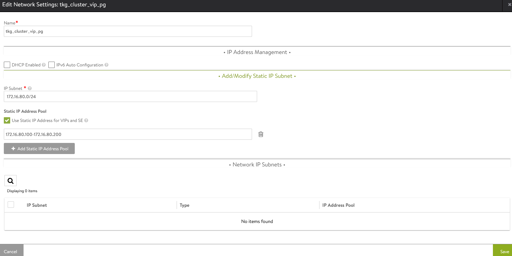

  Once the networks are configured, the configuration must look as shown:
  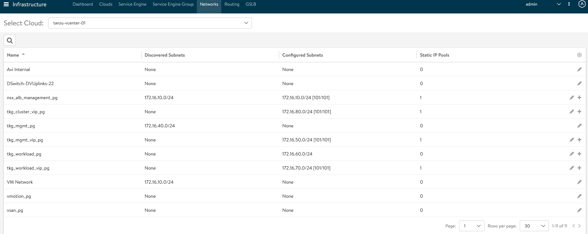

1. After the networks are configured, set the default routes for all VIP/Data networks. Click **Routing**. Create and add default routes for following networks. Change the gateway subnet to match your network configuration:

  | Network Name        | Gateway Subnet | Next Hop    |
  | ------------------- | -------------- | ----------- |
  | tkg_cluster_vip_pg  | 0.0.0.0/0      | 172.16.80.1 |
  | tkg_mgmt_vip_pg     | 0.0.0.0/0      | 172.16.50.1 |
  | tkg_workload_vip_pg | 0.0.0.0/0      | 172.16.70.1 |


#### Create IPAM Profile in NSX Advanced Load Balancer and Attach it to Cloud

At this point, all the networks required for Tanzu functionality are configured in NSX Advanced Load Balancer, except for the TKG Management and Workload Networks, which use DHCP. NSX Advanced Load Balancer provides IPAM service for the TKG Cluster VIP network, the TKG Management VIP network, and the TKG Workload VIP network.
The following procedure creates an IPAM profile and attaches it to the vCenter cloud created earlier.

1. Log in to NSX Advanced Load Balancer **Infrastructure** **Templates** **IPAM/DNS Profiles** **Create** **IPAM Profile** and provide the following details and click  **Save**.

  | Parameter                 | Value                                                          |
  | ------------------------- | -------------------------------------------------------------- |
  | Name                      | tanzu-vcenter-ipam-01                                          |
  | Type                      | AVI Vintage IPAM                                               |
  | Cloud for Usable Networks | Tanzu-vcenter-01, created here                                 |
  | Usable Networks           | tkg_cluster_vip_pg</br>tkg_mgmt_vip_pg</br>tkg_workload_vip_pg |

  

2. Attach the IPAM profile to the “tanzu-vcenter-01” cloud:

  1. Navigate to **Infrastructure** **Clouds**.
  1. Edit the **tanzu-vcenter-01** cloud.
  1. Under **IPAM Profile**, choose the profile created in the previous step and **Save** the configuration,

  

This completes the NSX Advanced Load Balancer configuration. Next is to deploy and configure the bootstrap machine that will be used to deploy and manage Tanzu Kubernetes clusters.

## <a id=deploy-and-configure-bootstrap-machine></a>Deploy and Configure Bootstrap Machine

The bootstrap machine can be a laptop, host, or server (running on a Linux/MAC/Windows platform) that you deploy management and workload clusters from, and that keeps the Tanzu and Kubernetes configuration files for your deployments. The bootstrap machine is typically local.

For the purpose of this document, the bootstrap server is a Photon-based virtual machine. See [Install the Tanzu CLI and Other Tools](https://docs.vmware.com/en/VMware-Tanzu-Kubernetes-Grid/1.5/vmware-tanzu-kubernetes-grid-15/GUID-install-cli.html) to configure MAC/Windows machines.

1. Ensure that the bootstrap VM is connected to TKG Management Network `tkg_mgmt_pg`.

1. [Configure NTP](https://kb.vmware.com/s/article/76088) on your bootstrap machine.

1. For this example using the Photon OS, download and unpack following Linux CLI packages from [myvmware](https://customerconnect.vmware.com/en/downloads/details?downloadGroup=TKG-140&productId=988&rPId=49705)

   - VMware Tanzu CLI for Linux

   - kubectl cluster cli v1.21.2 for Linux

2. Execute the following commands to install the Tanzu Kubernetes Grid CLI, Kubectl CLIs, and Carvel tools:

    ```bash
    ## Install required packages
    tdnf install tar zip unzip wget -y

    ## Install TKG CLI
    tar -xvf tanzu-cli-bundle-linux-amd64.tar
    cd ./cli/
    sudo install core/v1.5.0/tanzu-core-linux_amd64 /usr/local/bin/tanzu
    chmod +x /usr/local/bin/tanzu

    ## Install TKG CLI Plugins
    tanzu plugin install --local ./cli all

    ## Install Kubectl CLI
    gunzip kubectl-linux-v1.21.2+vmware.1.gz
    mv kubectl-linux-v1.21.2+vmware.1 /usr/local/bin/kubectl && chmod +x /usr/local/bin/kubectl

    # Instal Carvel tools
    cd ./cli
    gunzip ytt-linux-amd64-v0.34.0+vmware.1.gz
    chmod ugo+x ytt-linux-amd64-v0.34.0+vmware.1 && mv ./ytt-linux-amd64-v0.34.0+vmware.1 /usr/local/bin/ytt

    cd ./cli
    gunzip kapp-linux-amd64-v0.37.0+vmware.1.gz
    chmod ugo+x kapp-linux-amd64-v0.37.0+vmware.1 && mv ./kapp-linux-amd64-v0.37.0+vmware.1 /usr/local/bin/kapp

    cd ./cli
    gunzip kbld-linux-amd64-v0.30.0+vmware.1.gz
    chmod ugo+x kbld-linux-amd64-v0.30.0+vmware.1 && mv ./kbld-linux-amd64-v0.30.0+vmware.1 /usr/local/bin/kbld

    cd ./cli
    gunzip imgpkg-linux-amd64-v0.10.0+vmware.1.gz
    chmod ugo+x imgpkg-linux-amd64-v0.10.0+vmware.1 && mv ./imgpkg-linux-amd64-v0.10.0+vmware.1 /usr/local/bin/imgpkg
    ```

1. Validate the Carvel tools installation using the following commands:

    ```bash
    ytt version
    kapp version
    kbld version
    imgpkg version
    ```

1. Install `yq`. `yq` is a lightweight and portable command-line YAML processor. `yq` uses `jq`-like syntax but works with yaml files as well as json.

    ```bash
    wget https://github.com/mikefarah/yq/releases/download/v4.13.4/yq_linux_amd64.tar.gz
    tar -xvf yq_linux_amd64.tar && mv yq_linux_amd64 /usr/local/bin/yq
    ```

1. By default, Photon OS has Docker installed. Use the following commands to start the Docker service and enable it to start at boot.

    ```bash
    ## Check Docker service status
    systemctl status docker

    ## Start Docker Service
    systemctl start docker

    ## To start Docker Service at boot
    systemctl enable docker
    ```

1. Ensure that the bootstrap machine is using [cgroup v1](https://man7.org/linux/man-pages/man7/cgroups.7.html) by running the following command:

    ```bash
    docker info | grep -i cgroup

    ## You should see the following:
    Cgroup Driver: cgroupfs
    ```

1. Create an SSH Key Pair. This is required for Tanzu CLI to connect to vSphere from the bootstrap machine.
  The public key part of the generated key will be passed during the Tanzu Kubernetes Grid management cluster deployment.

    ```bash
    ## Generate SSH key pair
    ## When prompted enter file in which to save the key (/root/.ssh/id_rsa): press Enter to accept the default and provide password
    ssh-keygen -t rsa -b 4096 -C "email@example.com"

    ## Add the private key to the SSH agent running on your machine, and enter the password you created in the previous step.
    ssh-add ~/.ssh/id_rsa
    ## If this command fails, execute "eval $(ssh-agent)" and then rerun the command.
    ```

1. If your bootstrap machine runs Linux or Windows Subsystem for Linux, and it has a Linux kernel built after the May 2021 Linux security patch, for example Linux 5.11 and 5.12 with Fedora, run the following:

    `sudo sysctl net/netfilter/nf_conntrack_max=131072`

Now all the required packages are installed and the required configurations are in place in the bootstrap virtual machines. Proceed to the next section to deploy the Tanzu Kubernetes Grid management cluster.

## <a id=deploy-tanzu-kubernetes-grid-tkg-management-cluster> </a> Deploy Tanzu Kubernetes Grid Management Cluster

After you have performed the steps described in [deploy and configure bootstrap machine](#deploy-and-configure-bootstrap-machine), you can deploy the Tanzu Kubernetes Grid management cluster.

The management cluster is a Kubernetes cluster that runs cluster API operations on a specific cloud provider to create and manage workload clusters on that provider.

The management cluster is also where you configure the shared and in-cluster services utilized by the workload clusters. You may deploy management clusters in two ways:

1. Run the Tanzu Kubernetes Grid installer, a wizard interface that guides you through the process of deploying a management cluster. This is the recommended method.

1. Create and edit YAML configuration files, and use them with CLI commands to deploy a management cluster.

You may deploy and manage Tanzu Kubernetes Grid management clusters on:

  - vSphere 6.7u3

  - vSphere 7, if vSphere with Tanzu is not enabled.

### <a id=import-base-image-template-for-tkg-cluster-deployment> </a> Import Base Image template for Tanzu Kubernetes Grid Cluster Deployment

Before create the management cluster, ensure that the base image template is imported into vSphere and is available as a template. To import a base image template into vSphere:

1. Go to the [Tanzu Kubernetes Grid downloads](https://customerconnect.vmware.com/en/downloads/details?downloadGroup=TKG-154&productId=988&rPId=49705) page, and download a Tanzu Kubernetes Grid OVA for the cluster nodes.

   1. For the management cluster, this must be either a Photon- or Ubuntu-based Kubernetes v1.21.2 OVA.

      **Note:** Custom OVA with a custom Tanzu Kubernetes release (TKr) is also supported, as described in [Build Machine Images](https://docs.vmware.com/en/VMware-Tanzu-Kubernetes-Grid/1.5/vmware-tanzu-kubernetes-grid-15/GUID-build-images-index.html).

   1. For **workload clusters,** OVA can have any supported combination of OS and Kubernetes versions, as packaged in a Tanzu Kubernetes release

    **Important**: Make sure you download the most recent OVA base image templates in the event of security patch releases. You can find updated base image templates that include security patches on the Tanzu Kubernetes Grid product download page.

1. In the vSphere Client, right-click an object in the vCenter Server inventory, select **Deploy OVF template**.

1. Select **Local file**, click the button to upload files, and navigate to the downloaded OVA file on your local machine.

1. Follow the installer prompts to deploy a VM from the OVA.

1. Click **Finish** to deploy the VM. When the OVA deployment finishes, right-click the VM and select **Template** **Convert to Template**.
  **NOTE:** Do not power on the VM before you convert it to a template.

1. **If using non administrator SSO account**: In the VMs and Templates view, right-click the new template, select **Add Permission**, and assign the **tkg-user** to the template with the **TKG role**.
  For information about how to create the user and role for Tanzu Kubernetes Grid, see [Required Permissions for the vSphere Account](https://docs.vmware.com/en/VMware-Tanzu-Kubernetes-Grid/1.5/vmware-tanzu-kubernetes-grid-15/GUID-mgmt-clusters-vsphere.html#required-permissions-for-the-vsphere-account-5).

### Deploy Tanzu Kubernetes Grid Management Cluster from the UI

**Important**: If you are deploying Tanzu Kubernetes Grid clusters in an Internet- restricted environment, ensure that the local image repository is accessible from the boot strap machine and the TKG Management and Workload Networks.
For the boot strap machine to pull images from the private image repository, set the `TKG_CUSTOM_IMAGE_REPOSITORY` environment variable tpo point to the repository.

Once this is set, Tanzu Kubernetes Grid will pull images from your local private registry rather than from the external public registry. To make sure that Tanzu Kubernetes Grid always pulls images from the local private registry, add “TKG_CUSTOM_IMAGE_REPOSITORY” to the global cluster configuration file, `~/.config/tanzu/tkg/config.yaml`.

If your local image repository uses self-signed certificates, also add `TKG_CUSTOM_IMAGE_REPOSITORY_CA_CERTIFICATE` to the global cluster configuration file. Provide the CA certificate in `base64` encoded format by executing `base64 -w 0 your-ca.crt`.

```bash
TKG_CUSTOM_IMAGE_REPOSITORY: custom-image-repository.io/yourproject
TKG_CUSTOM_IMAGE_REPOSITORY_SKIP_TLS_VERIFY: false
TKG_CUSTOM_IMAGE_REPOSITORY_CA_CERTIFICATE: LS0t[...]tLS0tLQ==
```

Do the following to deploy the Tanzu Kubernetes Grid management cluster using the Installer Interface:

1. To launch the installer wizard UI, run the following command on the bootstrap machine:

    ```bash
    tanzu management-cluster create --ui --bind <bootstrapper-ip>:<port> --browser none

    ## For example
    tanzu management-cluster create --ui --bind 172.16.40.135:8000 --browser none
    ```

1. Access the Tanzu UI wizard by opening a browser and entering `http://<bootstrapper-ip>:port/`.

   

1. Click **Deploy** on the **VMware vSphere** tile

1. On the "**IaaS Provider**" section, enter the IP/FQDN and credentials of the vCenter server where the Tanzu Kubernetes Grid management cluster will be deployed
  
   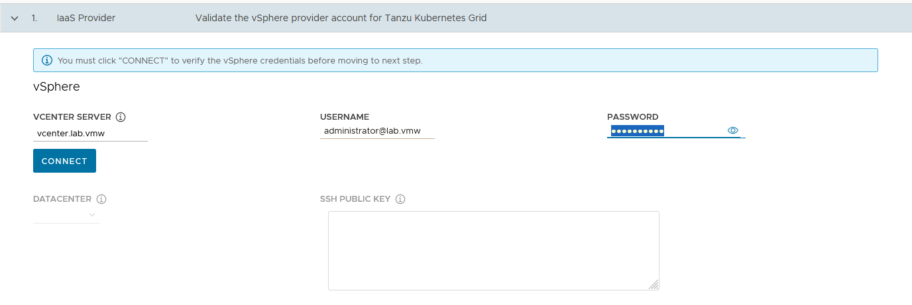

1. Click **Connect** and accept the vCenter Server SSL thumbprint

1. If you are running on a vCenter 7.x environment, you would get the following popup. Select “DEPLOY TKG MANAGEMENT CLUSTER” to continue.
   

1. Select the **Datacenter** and provide the **SSH Public Key** generated while configuring the Bootstrap VM .
  
   If you have saved the SSH key in the default location, execute the following command in your bootstrap machine to get the SSH public key:
  `cat /root/.ssh/id_rsa.pub`

1. Click **Next**

   

1. On the **Management cluster settings** section, provide the following details.

   1. Based on your environment requirements, select the appropriate **deployment type** for the Tanzu Kubernetes Grid management cluster

       - **Development**: Recommended for Dev or POC environments

       - **Production**: Recommended for Production environments

   2. VMware recommends that you set the **instance** **type** to **Large** or greater.

   For the purpose of this document, the deployment type is **Development** and instance type is **Large**.

1. **Management Cluster Name**: Name for your management cluster.

1. **Control Plane Endpoint Provider**: Select NSX Advanced Load Balancer for the Control Plane HA.

1. **Control Plane Endpoint**: This field is optional. If left blank, NSX Advanced Load Balancer will assign an IP address from the `tkg_cluster_vip_pg` pool created earlier.
  
    If you need to provide an IP address, pick an unused IP address from the `tkg_cluster_vip_pg` static IP pools configured in AVI.

1. **Machine Health Checks**: Enable

1. **Enable Audit Logging**: Enables audit logging for Kubernetes API server and node VMs. Set according to your environmental needs. For more information, see [Audit Logging](https://docs.vmware.com/en/VMware-Tanzu-Kubernetes-Grid/1.5/vmware-tanzu-kubernetes-grid-15/GUID-troubleshooting-tkg-audit-logging.html)

1. Click **Next**

    

1. In the **NSX Advanced Load Balancer** section, provide the following:

     - **Controller Host**: NSX Advanced Load Balancer Controller IP/FQDN (Advanced Load Balancer Controller cluster IP/FQDN of the controller cluster is configured)

     - Controller credentials: **Username** and **Password** of NSX Advanced Load Balancer

     - **Controller certificate**

1. Click “**Verify Credentials**” and set the following parameters:

     - **Cloud Name**: Name of the cloud created while configuring NSX Advanced Load Balancer `tanzu-vcenter-01`

     - **Service Engine Group Name**: Name of the Service Engine Group created for Tanzu Kubernetes Grid management clusters created while configuring NSX Advanced Load Balancer `tanzu-mgmt-segroup-01`

     - **Workload VIP Network Name**: Select `tkg_mgmt_vip_pg` as the TKG Management VIP/Data Network network and select the discovered subnet.

     - **Workload VIP network CIDR**: Select the discovered subnet. In our example, `172.16.50.0/24`

     - **Management VIP network Name**: Select `tkg_cluster_vip_pg` as the TKG Cluster VIP/Data Network network.

     - **Cluster Labels**: To adhere to the architecture, defining a label is **mandatory**. Provide the required labels, for example, **type**:**management**
  **Note:** Based on your requirements, you may specify multiple labels.

1. Click **Next**.

    

    **Important**: With the above configurations, when Tanzu Kubernetes Grid clusters (shared service/workload) are tagged with the label `type=management`, an `ako` pod is deployed on the cluster. Any applications hosted on the cluster that require load balancing will be exposed via the `tkg_mgmt_vip_pg` network, and the virtual service will be placed in the `tanzu-mgmt-segroup-01` SE group.

    As defined in the architecture, the **Cluster Labels** specified here will be applied **only on shared service clusters**.

    If no labels are specified in the “Cluster Labels” section, an AKO pod is deployed on all clusters without any labeling requirement, which deviates from the defined architecture.

1. On the **Metadata** page, you can specify location and labels and click **Next**. These are **optional**.
    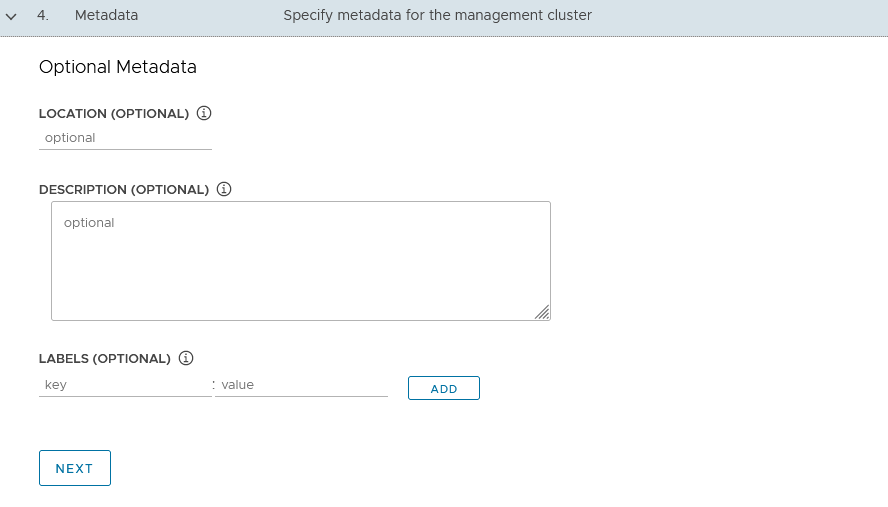

1. On the **Resources** section, specify the resources to be consumed by Tanzu Kubernetes Grid management cluster and click **Next**.
    

1. On the Kubernetes Network section, select the **TKG Management Network (“tkg_mgmt_pg”)** where the control plane and worker nodes will be placed during management cluster deployment. Ensure that the network has **DHCP** service enabled.
  
    Optionally, change the **Pod** and **Service CIDR** if the default provided network is already in use in your environment.

1. If the Tanzu environment is placed behind a proxy, enable the proxy and provide the proxy details.
  If using a **proxy**, the following details are the **key points**:

     -  If you set http-proxy, you must also set https-proxy and vice-versa.

1. For the no-proxy section:

     - For Tanzu Kubernetes Grid management and workload clusters, localhost, 127.0.0.1, the values of CLUSTER_CIDR and SERVICE_CIDR, .svc, and .svc.cluster.local values are appended along with the user-specified values.

     - **Important**: If the Kubernetes cluster needs to communicate with external services and infrastructure endpoints in your Tanzu Kubernetes Grid environment, ensure that those endpoints are reachable by your proxies or add them to TKG_NO_PROXY. Depending on your environment configuration, this may include, but is not limited to, your OIDC or LDAP server, Harbor, NSX-T, and NSX Advanced Load Balancer, and vCenter.

     - For vSphere, you must manually add the CIDR of the TKG Management Network and Cluster VIP networks which includes the IP address of your control plane endpoints, to TKG_NO_PROXY.

    

1. Optionally, specify **Identity Management with OIDC or LDAPs** - This is not covered in this document and will be documented separately.
  For the purpose of this document, identity management integration has been deactivated .
  
    

2. Select the **OS image** that will be used for the management cluster deployment.
  **Note**: This list will appear empty if you don’t have a compatible template present in your environment. See the steps provided in [Import Base Image template for TKG Cluster deployment](#import-base-image-template-for-tkg-cluster-deployment).
  
    

1. **Register Tanzu Mission Control**: Registering Tanzu Kubernetes Grid management clusters with Tanzu Mission Control allows you to provision and manage Tanzu Kubernetes clusters by using the Tanzu Mission Control dashboard interface..

1. Check the **Participate in the Customer Experience Improvement Program**, if you so desire and click **Review Configuration**

1. Review the entire configuration. After reviewing it, you can either copy the command provided and execute it on the CLI or proceed with UI to **Deploy Management Cluster**.
  
    When the deployment is triggered from the UI, the installer wizard displays the deployment logs on the screen.
  
    

While the cluster is being deployed, you will find that a virtual service will be created in NSX Advanced Load Balancer and new service engines will be deployed in vCenter by NSX Advanced Load Balancer. The service engines will be mapped to the SE Group `tanzu-mgmt-segroup-01`.

Behind the scenes when the Tanzu Kubernetes Grid management cluster is being deployed:

- NSX Advanced Load Balancer service engines are deployed in vCenter. This task is orchestrated by the NSX Advanced Load Balancer controller.
  
  

- Service engine status in NSX Advanced Load Balancer: The following snippet shows that the first service engine has been initialized successfully and the second service engine is initializing.
  

- Service Engine Group Status in NSX Advanced Load Balancer: In our configuration, the virtual service required for the Tanzu Kubernetes Grid clusters control plane High Availability (HA) will be hosted on the `tgk-mgmt-segroup-01` service engine group.
  

- Virtual Service status in NSX Advanced Load Balancer
  

  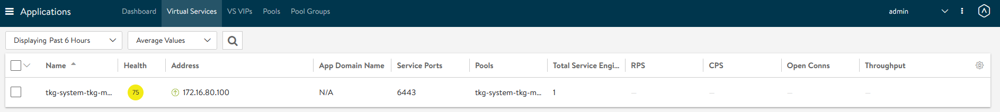

  The virtual service health is impacted because the second service engine is still being initialized; you can ignore this.

- After the Tanzu Kubernetes Grid management cluster is successfully deployed, you will see this in the Tanzu Bootstrap UI:
  

- The installer will automatically set the context to the Tanzu Kubernetes Grid management cluster in the bootstrap machine.
  
  Now you can access the Tanzu Kubernetes Grid management cluster from the bootstrap machine and perform additional tasks, such as verifying the management cluster health and deploying the workload clusters.

  To get the status of Tanzu Kubernetes Grid management cluster, execute the following command:

  `tanzu management-cluster get`

  

- Use `kubectl` to get the status of the Tanzu Kubernetes Grid management cluster nodes
  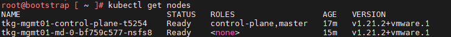

The Tanzu Kubernetes Grid management cluster is successfully deployed. Now you can create shared service and workload clusters.

## <a id=deploy-tanzu-shared-service-cluster> </a> Deploy Tanzu Kubernetes Grid Shared Service Cluster

Each Tanzu Kubernetes Grid instance can have only one shared services cluster. Create a shared services cluster if you intend to deploy Harbor.

Deploying a shared service cluster is exactly the same as deploying a workload cluster, except that you will add the **tanzu-services** label to the shared services cluster as its cluster role. This label identifies the shared services cluster to the management cluster and workload clusters.
Another **major difference** between shared service clusters and  workload clusters is that the “**Cluster Labels**” that were defined while deploying the management cluster will be applied to shared service clusters. This is to ensure that only shared service clusters will make use of the **TKG Cluster VIP/Data Network** for application load balancing and that virtual services are deployed on “**Service Engine Group 1**”.

In order to deploy a shared service cluster, you need to create a cluster config file in which you specify options to connect the shared service cluster to the vCenter server and to identify the vSphere resources that the cluster will use.
You can also specify standard sizes for the control plane and worker node VMs, or configure the CPU, memory, and disk sizes for control plane and worker nodes explicitly. If you use custom image templates, you can identify which template to use to create node VMs.

The following sample file includes the minimum required configurations. For information about all configuration file variables, see the [Tanzu CLI Configuration File Variable Reference](https://docs.vmware.com/en/VMware-Tanzu-Kubernetes-Grid/1.5/vmware-tanzu-kubernetes-grid-15/GUID-tanzu-config-reference.html).
Modify the parameters according to your requirements.

```bash
CLUSTER_CIDR: 100.96.0.0/11
SERVICE_CIDR: 100.64.0.0/13
CLUSTER_PLAN: <prod/dev>
ENABLE_CEIP_PARTICIPATION: 'true'
ENABLE_MHC: 'true'
IDENTITY_MANAGEMENT_TYPE: none
INFRASTRUCTURE_PROVIDER: vsphere
TKG_HTTP_PROXY_ENABLED: 'false'
AVI_CONTROL_PLANE_HA_PROVIDER: "true"
CLUSTER_NAME: <Provide a Name For the TKG Cluster>
DEPLOY_TKG_ON_VSPHERE7: 'true'
VSPHERE_DATACENTER: /<DC-Name>
VSPHERE_DATASTORE: /<DC-Name>/datastore/<Datastore-Name>
VSPHERE_FOLDER: /<DC-Name>/vm/<Folder_Name>
VSPHERE_NETWORK: /<DC-Name>/network/<Network-Name>
VSPHERE_RESOURCE_POOL: /<DC-Name>/host/<Cluster-Name>/Resources/<Resource-Pool-Name>
VSPHERE_SERVER: <vCenter-Address>
VSPHERE_SSH_AUTHORIZED_KEY: "ssh-rsa Nc2EA [...] h2X8uPYqw== email@example.com"
VSPHERE_USERNAME: <vCenter-SSO-Username>
VSPHERE_PASSWORD: <SSO-User-Password>
VSPHERE_TLS_THUMBPRINT: <vCenter Server Thumbprint>
ENABLE_AUDIT_LOGGING: true/false
ENABLE_DEFAULT_STORAGE_CLASS: true/false
ENABLE_AUTOSCALER: true/false
CONTROLPLANE_SIZE: small/medium/large/extra-large
WORKER_SIZE: small/medium/large/extra-large
WORKER_MACHINE_COUNT: <number of worker nodes to be deployed>
```

Key considerations when creating your Shared Service cluster config file:

| Variables                           | Value                                                                                                                                                                                                                                                                                                                                                                                                                                                                                                                                        |
| ----------------------------------- | -------------------------------------------------------------------------------------------------------------------------------------------------------------------------------------------------------------------------------------------------------------------------------------------------------------------------------------------------------------------------------------------------------------------------------------------------------------------------------------------------------------------------------------------- |
| `CLUSTER_PLAN`                      | prod : For all production deployments</br>dev: for POC/Dev environments                                                                                                                                                                                                                                                                                                                                                                                                                                                                      |
| `IDENTITY_MANAGEMENT_TYPE`          | Match the value set for the management cluster, oidc, ldap, or none.</br>Note: You do not need to configure additional OIDC or LDAP settings in the configuration file for workload clusters                                                                                                                                                                                                                                                                                                                                                 |
| `TKG_HTTP_PROXY_ENABLED`            | true/false</br>If true, the following additional variables needs to be provided</br>`TKG_HTTP_PROXY`</br>`TKG_HTTPS_PROXY`</br>`TKG_NO_PROXY`                                                                                                                                                                                                                                                                                                                                                                                                         |
| `VSPHERE_NETWORK`                   | As per the architecture, TKG Shared service cluster has dedicated overlay segment (tkg-ss-segment)                                                                                                                                                                                                                                                                                                                                                                                                                                           |
| `CONTROLPLANE_SIZE` & `WORKER_SIZE` | Consider extra-large, as Harbor will be deployed on this cluster and this cluster may be attached to TMC and TO.</br>To define a custom size, remove the `CONTROLPLANE_SIZE` and `WORKER_SIZE` variables from the config file and add the following variables with the required resource allocation.</br>For Control Plane Nodes:</br>​​`VSPHERE_CONTROL_PLANE_NUM_CPUS`</br>`VSPHERE_CONTROL_PLANE_MEM_MIB`</br>`VSPHERE_CONTROL_PLANE_DISK_GIB`</br>For Worker Nodes:</br>`VSPHERE_WORKER_NUM_CPUS`<C7yUbOTZn9sP7b2m7iDnCG0GvCUTbr>`VSPHERE_WORKER_MEM_MIB`</br>`VSPHERE_WORKER_DISK_GIB` |
| `VSPHERE_CONTROL_PLANE_ENDPOINT`    | This is optional. If left blank, NSX ALB will assign an IP address from the `tkg-cluster-vip-segment` pool created earlier.</br>If you need to provide an IP address, pick an unused address from the “TKG Cluster VIP/Data Network” static IP pools configured in NSX ALB.                                                                                                                                                                                                                                               |

The following is the modified Tanzu Kubernetes Grid shared service config file:

```bash
CLUSTER_CIDR: 100.96.0.0/11
SERVICE_CIDR: 100.64.0.0/13
CLUSTER_PLAN: dev
ENABLE_CEIP_PARTICIPATION: 'true'
ENABLE_MHC: 'true'
IDENTITY_MANAGEMENT_TYPE: none
INFRASTRUCTURE_PROVIDER: vsphere
TKG_HTTP_PROXY_ENABLED: 'false'
AVI_CONTROL_PLANE_HA_PROVIDER: "true"
CLUSTER_NAME: tkg-shared-svc
DEPLOY_TKG_ON_VSPHERE7: 'true'
VSPHERE_DATACENTER: /arcas-dvs-internet-dc1
VSPHERE_DATASTORE: /arcas-dvs-internet-dc1/datastore/vsanDatastore
VSPHERE_FOLDER: /arcas-dvs-internet-dc1/vm/tkg-sharedsvc-components
VSPHERE_NETWORK: /arcas-dvs-internet-dc1/network/tkg-ss-segment
VSPHERE_RESOURCE_POOL: /arcas-dvs-internet-dc1/host/arcas-dvs-internet-c1/Resources/tkg-sharedsvc-components
VSPHERE_SERVER: vcenter.lab.vmw
VSPHERE_SSH_AUTHORIZED_KEY: ssh-rsa AAAAB3NzaC1yc2EAAAADAQABAAACAQC6l1Tnp3EQ24cqskvTi9EXA/1pL/NYSJoT0q+qwTp8jUA1LBo9pV8cu/HmnnA/5gsO/OEefMCfz+CGPOo1mH596EdA/rUQo5K2rqhuNwlA+i+hU87dxQ8KJYhjPOT/lGHQm8VpzNQrF3b0Cq5WEV8b81X/J+H3i57ply2BhC3BE7B0lKbuegnb5aaqvZC+Ig97j1gt5riV/aZg400c3YGJl9pmYpMbyEeJ8xd86wXXyx8X1xp6XIdwLyWGu6zAYYqN4+1pqjV5IBovu6M6rITS0DlgFEFhihZwXxCGyCpshSM2TsIJ1uqdX8zUlhlaQKyAt+2V29nnHDHG1WfMYQG2ypajmE1r4vOkS+C7yUbOTZn9sP7b2m7iDnCG0GvCUT+lNQy8WdFC/Gm0V6+5DeBY790y1NEsl+9RSNNL+MzT/18Yqiq8XIvwT2qs7d5GpSablsITBUNB5YqXNEaf76ro0fZcQNAPfZ67lCTlZFP8v/S5NExqn6P4EHht0m1hZm1FhGdY7pQe8dLz/74MLTEQlP7toOp2ywoArYno8cFVl3PT8YR3TVQARvkS2pfNOquc5iU0r1FXOCrEc3d+LvJYmalmquvghZjblvxQKwguLFIodzdO/3CcpJvwGg0PiANvYZRqVNfTDCjtrN+lFXurlm2pSsA+YI5cbRtZ1ADaPw== administrator@lab.vmw
VSPHERE_USERNAME: administrator@lab.vmw
VSPHERE_PASSWORD: VMware@123
VSPHERE_TLS_THUMBPRINT: 40:1E:6D:30:4C:72:A6:8E:9D:AE:A8:67:DE:DA:C9:CA:B3:A6:C6:C2
ENABLE_AUDIT_LOGGING: true
ENABLE_DEFAULT_STORAGE_CLASS: true
ENABLE_AUTOSCALER: false
CONTROLPLANE_SIZE: large
WORKER_SIZE: extra-large
WORKER_MACHINE_COUNT: 1
```

After creating the cluster configuration file, execute the following command to initiate the cluster deployment:

`tanzu cluster create -f <path-to-config.yaml> -v 6`

When the cluster is successfully deployed, you will see the following results:


Now, connect to the Tanzu management cluster context and apply the following labels:

```bash
## Add the tanzu-services label to the shared services cluster as its cluster role. In the following command, “tkg-shared-svc” is the name of the shared service cluster.
kubectl label cluster.cluster.x-k8s.io/tkg-shared-svc cluster-role.tkg.tanzu.vmware.com/tanzu-services="" --overwrite=true

## Tag shared service cluster with all “Cluster Labels” defined while deploying the management cluster. Once the “Cluster Labels” are applied, the AKO pod will be deployed on the Shared Service Cluster.
kubectl label cluster tkg-shared-svc type=management
```

Get the admin context of the shared service cluster using the following commands and switch the context to the Shared Service cluster:

```bash
## Use the following command to get the admin context of Shared Service Cluster. In this command, “tkg-shared-svc” is the name of the shared service cluster.
<_Added line break above. Is this correct?_>
tanzu cluster kubeconfig get tkg-shared-svc --admin
## Use the following to use the context of Shared Service Cluster
kubectl config use-context tkg-shared-svc-admin@tkg-shared-svc
```


After the shared service cluster is successfully created, you are ready to deploy the Harbor package. See [Deploy User-Managed Packages on Tanzu Kubernetes Grid Clusters](#deploy-user-managed-packages-on-tkg-clusters).

You must ensure that the “cert-manager” and “contour” user packages are installed before deploying Harbor. Deploy in the following order:

1.  [Install Cert-Manager User Package](#install-cert-manager-user-package)

2.  [Install Contour User Package](#install-contour-user-package)

3.  [Install Harbor User Package](#install-harbor-user-package)

## <a id=deploy-tanzu-workload-clusters> </a> Deploy Tanzu Kubernetes Grid Workload Clusters

In order to deploy a workload cluster, you need to create a cluster config file in which you specify options for connecting to vCenter Server and for identifying the vSphere resources that the cluster will use.

You can also specify standard sizes for the control plane and worker node VMs, or you can configure the CPU, memory, and disk sizes for control plane and worker nodes explicitly. If you use custom image templates, you can identify which template to use to create node VMs.

As per the architecture, workload clusters make use of a separate SE group (**Service Engine Group 2)** and VIP Network (**TKG Workload VIP/Data Network**) for application load balancing. You can control the SE group by creating a new AKODeploymentConfig. For more details, see [Create and deploy AKO Deployment Config for Tanzu Kubernetes Grid Workload Cluster](#configure-nsx-advanced-load-balancer-in-tkg-workload-cluster)

The following sample cluster config file includes the minimum required configuration parameters to create a Tanzu Kubernetes Grid workload cluster. To learn about all configuration file parameters, see the [Tanzu CLI Configuration File Variable Reference](https://docs.vmware.com/en/VMware-Tanzu-Kubernetes-Grid/1.5/vmware-tanzu-kubernetes-grid-15/GUID-tanzu-config-reference.html).
Modify the config file according to your requirements.

```bash
CLUSTER_CIDR: 100.96.0.0/11
SERVICE_CIDR: 100.64.0.0/13
CLUSTER_PLAN: <prod/dev>
ENABLE_CEIP_PARTICIPATION: 'true'
ENABLE_MHC: 'true'
IDENTITY_MANAGEMENT_TYPE: none
INFRASTRUCTURE_PROVIDER: vsphere
TKG_HTTP_PROXY_ENABLED: 'false'
AVI_CONTROL_PLANE_HA_PROVIDER: "true"
CLUSTER_NAME: <Provide a Name For the TKG Cluster>
DEPLOY_TKG_ON_VSPHERE7: 'true'
VSPHERE_DATACENTER: /<DC-Name>
VSPHERE_DATASTORE: /<DC-Name>/datastore/<Datastore-Name>
VSPHERE_FOLDER: /<DC-Name>/vm/<Folder_Name>
VSPHERE_NETWORK: /<DC-Name>/network/<Network-Name>
VSPHERE_RESOURCE_POOL: /<DC-Name>/host/<Cluster-Name>/Resources/<Resource-Pool-Name>
VSPHERE_SERVER: <vCenter-Address>
VSPHERE_SSH_AUTHORIZED_KEY: "ssh-rsa Nc2EA [...] h2X8uPYqw== email@example.com"
VSPHERE_USERNAME: <vCenter-SSO-Username>
VSPHERE_PASSWORD: <SSO-User-Password>
VSPHERE_TLS_THUMBPRINT: <vCenter Server Thumbprint>
ENABLE_AUDIT_LOGGING: true/false
ENABLE_DEFAULT_STORAGE_CLASS: true/false
ENABLE_AUTOSCALER: true/false
CONTROLPLANE_SIZE: small/medium/large/extra-large
WORKER_SIZE: small/medium/large/extra-large
WORKER_MACHINE_COUNT: <# of worker nodes to be deployed>
```

Key considerations when creating workload cluster config files:

| Variables                           | Value                                                                                                                                                                                                                                                                                                                                                                                                                                                                                                                                        |
| ----------------------------------- | -------------------------------------------------------------------------------------------------------------------------------------------------------------------------------------------------------------------------------------------------------------------------------------------------------------------------------------------------------------------------------------------------------------------------------------------------------------------------------------------------------------------------------------------- |
| `CLUSTER_PLAN`                      | prod : For all production deployments</br>dev: for POC/Dev environments                                                                                                                                                                                                                                                                                                                                                                                                                                                                      |
| `IDENTITY_MANAGEMENT_TYPE`          | Match the value set for the management cluster, oidc, ldap, or none.</br>Note: You do not need to configure additional OIDC or LDAP settings in the workload cluster configuration file.                                                                                                                                                                                                                                                                                                                                       |
| `TKG_HTTP_PROXY_ENABLED`            | true/false</br>If true, the following additional variables need to be provided/</br>`TKG_HTTP_PROXY`</br>`TKG_HTTPS_PROXY`</br>`TKG_NO_PROXY`                                                                                                                                                                                                                                                                                                                                                                                                         |
| `VSPHERE_NETWORK`                   | As per the architecture, the TKG workload cluster will be attached to “TKG Workload Network”.</br>**Note:** The architecture supports multiple TKG workload clusters on the same network and/or separate networks for each workload cluster.                                                                                                                                                                                                                                                                                                          |
| `CONTROLPLANE_SIZE` & `WORKER_SIZE` | Consider setting this to extra-large, as Harbor will be deployed on this cluster and this cluster may be attached to TMC and TO.</br>To define custom sizes, remove the `CONTROLPLANE_SIZE` and `WORKER_SIZE` variables from the config file and add the following variables with required resource allocation</br>For Control Plane Nodes:</br>​​`VSPHERE_CONTROL_PLANE_NUM_CPUS`</br>`VSPHERE_CONTROL_PLANE_MEM_MIB`</br>`VSPHERE_CONTROL_PLANE_DISK_GIB`</br>For Worker Nodes:</br>`VSPHERE_WORKER_NUM_CPUS`</br>`VSPHERE_WORKER_MEM_MIB`</br>`VSPHERE_WORKER_DISK_GIB` |
| `VSPHERE_CONTROL_PLANE_ENDPOINT`    | This is optional; if left blank, NSX ALB will assign an IP address from the `tkg-cluster-vip-segment` pool created earlier.</br>If you need to provide an IP address, pick an unused address from the “TKG Cluster VIP/Data Network” static IP pools configured in NSX ALB.                                                                                                                                                                    |
| `ENABLE_AUTOSCALER`                 | This is an optional parameter. Set if you want to override the default value. The default value is false; if set to true, you must include the following additional variables:</br>`AUTOSCALER_MAX_NODES_TOTAL`</br>`AUTOSCALER_SCALE_DOWN_DELAY_AFTER_ADD`</br>`AUTOSCALER_SCALE_DOWN_DELAY_AFTER_DELETE`</br>`AUTOSCALER_SCALE_DOWN_DELAY_AFTER_FAILURE`</br>`AUTOSCALER_SCALE_DOWN_UNNEEDED_TIME`</br>`AUTOSCALER_MAX_NODE_PROVISION_TIME`</br>`AUTOSCALER_MIN_SIZE_0`</br>`AUTOSCALER_MAX_SIZE_0`</br>For more details see Cluster Autoscaler           |
| WORKER_MACHINE_COUNT                | Consider setting the value to 3 or above if the cluster needs to be part of Tanzu Service Mesh (TSM)                                                                                                                                                                                                                                                                                                                                                                                                                                          |

The modified Tanzu Kubernetes Grid shared service config file is as follows:

```bash
CLUSTER_CIDR: 100.96.0.0/11
SERVICE_CIDR: 100.64.0.0/13
CLUSTER_PLAN: dev
ENABLE_CEIP_PARTICIPATION: 'true'
ENABLE_MHC: 'true'
IDENTITY_MANAGEMENT_TYPE: none
INFRASTRUCTURE_PROVIDER: vsphere
TKG_HTTP_PROXY_ENABLED: 'false'
AVI_CONTROL_PLANE_HA_PROVIDER: "true"
CLUSTER_NAME: tkg-workload-dev
DEPLOY_TKG_ON_VSPHERE7: 'true'
VSPHERE_DATACENTER: /arcas-dvs-internet-dc1
VSPHERE_DATASTORE: /arcas-dvs-internet-dc1/datastore/vsanDatastore
VSPHERE_FOLDER: /arcas-dvs-internet-dc1/vm/tkg-workload01-components
VSPHERE_NETWORK: /arcas-dvs-internet-dc1/network/tkg-workload-segment
VSPHERE_RESOURCE_POOL: /arcas-dvs-internet-dc1/host/arcas-dvs-internet-c1/Resources/tkg-workload01-components
VSPHERE_SERVER: vcenter.lab.vmw
VSPHERE_SSH_AUTHORIZED_KEY: ssh-rsa AAAAB3NzaC1yc2EAAAADAQABAAACAQC6l1Tnp3EQ24cqskvTi9EXA/1pL/NYSJoT0q+qwTp8jUA1LBo9pV8cu/HmnnA/5gsO/OEefMCfz+CGPOo1mH596EdA/rUQo5K2rqhuNwlA+i+hU87dxQ8KJYhjPOT/lGHQm8VpzNQrF3b0Cq5WEV8b81X/J+H3i57ply2BhC3BE7B0lKbuegnb5aaqvZC+Ig97j1gt5riV/aZg400c3YGJl9pmYpMbyEeJ8xd86wXXyx8X1xp6XIdwLyWGu6zAYYqN4+1pqjV5IBovu6M6rITS0DlgFEFhihZwXxCGyCpshSM2TsIJ1uqdX8zUlhlaQKyAt+2V29nnHDHG1WfMYQG2ypajmE1r4vOkS+C7yUbOTZn9sP7b2m7iDnCG0GvCUT+lNQy8WdFC/Gm0V6+5DeBY790y1NEsl+9RSNNL+MzT/18Yqiq8XIvwT2qs7d5GpSablsITBUNB5YqXNEaf76ro0fZcQNAPfZ67lCTlZFP8v/S5NExqn6P4EHht0m1hZm1FhGdY7pQe8dLz/74MLTEQlP7toOp2ywoArYno8cFVl3PT8YR3TVQARvkS2pfNOquc5iU0r1FXOCrEc3d+LvJYmalmquvghZjblvxQKwguLFIodzdO/3CcpJvwGg0PiANvYZRqVNfTDCjtrN+lFXurlm2pSsA+YI5cbRtZ1ADaPw== administrator@lab.vmw
VSPHERE_USERNAME: administrator@lab.vmw
VSPHERE_PASSWORD: VMware@123
VSPHERE_TLS_THUMBPRINT: 40:1E:6D:30:4C:72:A6:8E:9D:AE:A8:67:DE:DA:C9:CA:B3:A6:C6:C2
ENABLE_AUDIT_LOGGING: true
ENABLE_DEFAULT_STORAGE_CLASS: true
ENABLE_AUTOSCALER: false
CONTROLPLANE_SIZE: large
WORKER_SIZE: extra-large
WORKER_MACHINE_COUNT: 3
```

After preparing the cluster configuration file, execute the following command to initiate the cluster deployment:

`tanzu cluster create -f <path-to-config.yaml> -v 6`

Once the cluster is successfully deployed, you will see the following results:
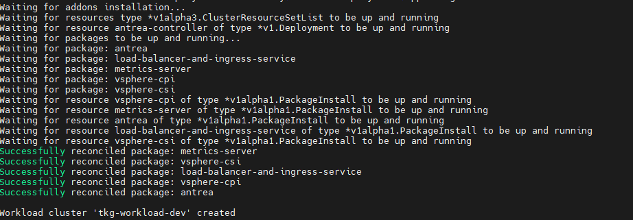

### <a id=configure-nsx-advanced-load-balancer-in-tkg-workload-cluster> </a> Configure NSX Advanced Load Balancer in Tanzu Kubernetes Grid Workload Cluster

Tanzu Kubernetes Grid management clusters with NSX Advanced Load Balancer have a default AKODeploymentConfig that is deployed during installation. It is called install-ako-for-all.

By default, any clusters that match the cluster labels defined in install-ako-for-all will reference this file for their virtual IP networks, service engine (SE) groups, and L7 ingress. As part of our architecture, only shared service cluster makes use of the configuration defined in the default AKODeploymentConfig install-ako-for-all.

As per the defined **architecture**, workload clusters must **not** make **use** of **Service Engine Group 1** and VIP Network **TKG Cluster VIP/Data Network** for application load balancer services**.
**A separate SE group (**Service Engine Group 2)** and VIP Network (**TKG Workload VIP/Data Network**) will be used by the workload clusters, These configurations can be enforced on workload clusters by:

- Creating a new AKODeploymentConfig in the Tanzu Kubernetes Grid management cluster. This AKODeploymentConfig file dictates which specific SE group and VIP network that the workload clusters can use for load balancing.

- Apply the new AKODeploymentConfig: Label the workload cluster to match the AKODeploymentConfig.spec.clusterSelector.matchLabels element in the AKODeploymentConfig file.
  Once the labels are applied on the workload cluster, Tanzu Kubernetes Grid management cluster will deploy the AKO pod on the target workload cluster that has the configuration defined in the new AKODeploymentConfig.

The following is the format of the `AKODeploymentConfig yaml` file.

```yaml
apiVersion: networking.tkg.tanzu.vmware.com/v1alpha1
kind: AKODeploymentConfig
metadata:
  finalizers:
    - ako-operator.networking.tkg.tanzu.vmware.com
  generation: 2
  name: <Unique name of AKODeploymentConfig>
spec:
  adminCredentialRef:
    name: avi-controller-credentials
    namespace: tkg-system-networking
  certificateAuthorityRef:
    name: avi-controller-ca
    namespace: tkg-system-networking
  cloudName: <NAME OF THE CLOUD>
  clusterSelector:
    matchLabels:
      <KEY>: <VALUE>
  controller: <NSX ALB CONTROLLER IP/FQDN>
  dataNetwork:
    cidr: <VIP NETWORK CIDR>
    name: <VIP NETWORK NAME>
  extraConfigs:
    image:
      pullPolicy: IfNotPresent
      repository: projects.registry.vmware.com/tkg/ako
      version: v1.3.2_vmware.1
    ingress:
      defaultIngressController: false
      disableIngressClass: true
  serviceEngineGroup: <SERVICE ENGINE NAME>
```

The following is a sample AKODeploymentConfig file with sample values in place. In this example, the Tanzu Kubernetes Grid management cluster will deploy AKO pod on any workload cluster that matches the **label** `type=workloadset01`. The AKO configuration will be as follows:

- cloud: ​`tanzu-vcenter-01​`

- service engine Group: `tanzu-wkld-segroup-01`

- VIP/data network: `tkg-cluster-vip-segment`

```yaml
apiVersion: networking.tkg.tanzu.vmware.com/v1alpha1
kind: AKODeploymentConfig
metadata:
  finalizers:
    - ako-operator.networking.tkg.tanzu.vmware.com
  generation: 2
  name: tanzu-ako-workload-set01
spec:
  adminCredentialRef:
    name: avi-controller-credentials
    namespace: tkg-system-networking
  certificateAuthorityRef:
    name: avi-controller-ca
    namespace: tkg-system-networking
  cloudName: tanzu-vcenter-01
  clusterSelector:
    matchLabels:
      type: workloadset01
  controller: avi-ha.lab.vmw
  dataNetwork:
    cidr: tkg-workload-vip-segment
    name: 172.16.70.0/24
  extraConfigs:
    image:
      pullPolicy: IfNotPresent
      repository: projects.registry.vmware.com/tkg/ako
      version: v1.3.2_vmware.1
    ingress:
      defaultIngressController: false
      disableIngressClass: true
  serviceEngineGroup: tanzu-wkld-segroup-01
```

Once you have the AKO configuration file ready, use the `kubectl` command to set the context to Tanzu Kubernetes Grid management cluster. Use the following command to list the available `AKODeploymentConfig`:

`kubectl apply -f <path_to_akodeploymentconfig.yaml>`


Use the following command to list all AKODeploymentConfig created under the management cluster:

`kubectl get adc`
or
`kubectl get akodeploymentconfig`


Now that you have successfully created the AKO deployment config, you need to apply the cluster labels defined in the AKODeploymentConfig to any of the Tanzu Kubernetes Grid workload clusters. Once the labels are applied, the Tanzu Kubernetes Grid management cluster will deploy the AKO pod on the target workload cluster.

`kubectl label cluster <cluster name>\<label>`


---

### Connect to Tanzu Kubernetes Grid Workload Cluster and Validate the Deployment

Now that the Tanzu Kubernetes Grid workload cluster is created and the required AKO configurations are applied, use the following command to get the admin context of the Tanzu Kubernetes Grid workload cluster.

`tanzu cluster kubeconfig get <cluster-name> --admin`

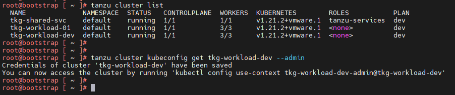

Now connect to the Tanzu Kubernetes Grid workload cluster using the `kubectl` command and run the following commands to check the status of AKO and other components:

```bash
kubectl get nodes # List all nodes with status
kubectl get pods -n avi-system # To check the status of AKO pod
kubectl get pods -A # Lists all pods and its status
```


You can see that the workload cluster is successfully deployed and AKO pod is deployed on the cluster. You can now [configure SaaS services](#config-saas-services) for the cluster and/or [deploy user managed packages](#deploy-user-managed-packages-on-tkg-clusters) on this cluster.

## <a id=deploy-user-managed-packages-on-tkg-clusters></a> Deploy User-Managed Packages on Tanzu Kubernetes Grid Clusters

Tanzu Kubernetes Grid includes the following user-managed packages. These packages provide in-cluster and shared services to the Kubernetes clusters that are running in your Tanzu Kubernetes Grid environment.


| Function               | Package                | Location                            |
| ---------------------- | ---------------------- | ----------------------------------- |
| Certificate Management | cert-manager           | Workload or shared services cluster |
| Container networking   | multus-cni             | Workload cluster                    |
| Container registry     | harbor                 | Shared services cluster             |
| Ingress control        | contour                | Workload or shared services cluster |
| Log forwarding         | fluent-bit             | Workload cluster                    |
| Monitoring             | grafana</br>prometheus | Workload cluster                    |
| Service discovery      | external-dns           | Workload or shared services cluster |

### <a id=install-cert-manager-user-package> </a> Install Cert-Manager User Package

Cert-Manager is required for the Contour, Harbor, Prometheus, and Grafana packages.

1.  Switch the context to the respective cluster and capture the available Cert-Manager version

    `tanzu package available list cert-manager.tanzu.vmware.com -A`

2.  Install the Cert-Manager package.

    `tanzu package install cert-manager --package-name cert-manager.tanzu.vmware.com --namespace cert-manager --version <AVAILABLE-PACKAGE-VERSION> --create-namespace`

3.  Validate the Cert-Manager package installation. The status must change to “**Reconcile succeeded**”
    `tanzu package installed list -A | grep cert-manager`

### <a id=install-contour-user-package> </a> Install the Contour User Package

Contour is required for the Harbor, Prometheus, and Grafana packages.

1.  Switch context to the respective cluster, and ensure that the AKO pod is in a running state.
    `kubectl get pods -A | grep ako`

2.  Create the following configuration file named contour-data-values.yaml.

    ```yaml
     ---
      infrastructure_provider: vsphere
      namespace: tanzu-system-ingress
      contour:
        configFileContents: {}
        useProxyProtocol: false
        replicas: 2
        pspNames: "vmware-system-restricted"
        logLevel: info
      envoy:
        service:
          type: LoadBalancer
          annotations: {}
          nodePorts:
            http: null
            https: null
          externalTrafficPolicy: Cluster
          disableWait: false
        hostPorts:
          enable: true
          http: 80
          https: 443
        hostNetwork: false
        terminationGracePeriodSeconds: 300
        logLevel: info
        pspNames: null
      certificates:
        duration: 8760h
        renewBefore: 360h
    ```

3. Use the following command to capture the available Contour version:

    `tanzu package available list contour.tanzu.vmware.com -A`

4.  Install the Contour Package

    `tanzu package install contour --package-name contour.tanzu.vmware.com --version <AVAILABLE-PACKAGE-VERSION> --values-file <path_to_contour-data-values.yaml_file> --namespace tanzu-system-contour --create-namespace`

5.  Validate the Contour package installation. The status must change to “Reconcile succeeded”.
    `tanzu package installed list -A | grep contour`

### <a id=install-harbor-user-package> </a> Install Harbor User Package

In order to install Harbor, ensure that Cert-Manager and Contour user packages are installed on the cluster.

1.  Check if the prerequisite packages are installed on the cluster

    `tanzu package installed list -A`

    Ensure that the status of `cert-manager` and `contour` is "Reconcile succeeded".

2.  Capture the available Harbor version

    `tanzu package available list harbor.tanzu.vmware.com -A`

3.  Obtain the "harbor-data-values.yaml" file

    ```bash
    image_url=$(kubectl -n tanzu-package-repo-global get packages harbor.tanzu.vmware.com.<package version> -o jsonpath='{.spec.template.spec.fetch[0].imgpkgBundle.image}')
    imgpkg pull -b $image_url -o /tmp/harbor-package
    cp /tmp/harbor-package/config/values.yaml <path to save harbor-data-values.yaml>
    ```

4.  Set the mandatory passwords and secrets in the `harbor-data-values.yaml` file.

    `bash /tmp/harbor-package/config/scripts/generate-passwords.sh ./harbor-data-values.yaml`

5.  **Update** the following sections and remove comments in the **harbor-data-values.yaml** file.

    ```bash
    ##Update required fields
    hostname: <Harbor Registry FQDN>
    tls.crt: <Full Chain cert> (Optional, only if provided)
    tls.key: <Cert Key> (Optional, only if provided)
    ##Delete the auto generated password and replace it with the user provided value
    harborAdminPassword: <Set admin password>
    ## Remove all comments in the harbor-data-values.yaml file:
    yq -i eval '... comments=""' ./harbor-data-values.yaml
    ```

6.  Install the Harbor Package using the following command:

    `tanzu package install harbor --package-name harbor.tanzu.vmware.com --version <available package version> --values-file <path to harbor-data-values.yaml> --namespace tanzu-system-registry --create-namespace`

7.  To address a known issue, patch the Harbor package by following the steps in the Knowledge Base article: The [harbor-notary-signer pod fails to start](https://kb.vmware.com/s/article/85725)

8.  Confirm that the harbor package has been installed. The status must change to “Reconcile succeeded”.
    `tanzu package installed list -A | grep harbor`

## <a id="config-saas-services"></a> Configure SaaS Services

The following VMware SaaS services provide additional Kubernetes lifecycle management, observability, and service mesh features.

* Tanzu Mission Control (TMC)
* Tanzu Observability (TO)
* Tanzu Service Mesh (TSM)

For configuration information, see [Configure SaaS Services](tko-saas-services.md).
