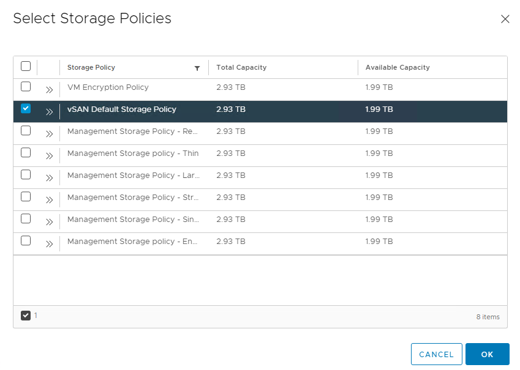

# Deploy VMware vSphere with Tanzu on VMware VDS Networking in an Air-Gapped Environment

This document outlines the steps for deploying VMware vSphere with Tanzu backed by a vSphere Distributed Switch (VDS) Networking and leveraging NSX Advanced Load Balancer (ALB) Enterprise Edition for L4/L7 load balancing and ingress.

An air-gap installation method is used when the Tanzu Kubernetes Grid bootstrapper, vSphere Environment and K8S Cluster nodes are unable to connect to the Internet to download the installation binaries from the public [VMware Registry](https://projects.registry.vmware.com/) during vSphere with Tanzu installation or upgrades.

The scope of the document is limited to providing deployment steps based on the reference design in [VMware Tanzu for Kubernetes Operations using vSphere with Tanzu Reference Design](../reference-designs/tko-on-vsphere-with-tanzu.md). This document does not cover any deployment procedures for the underlying SDDC components.

## Deploying with VMware Service Installer for Tanzu
 
You can use VMware Service Installer for VMware Tanzu to automate this deployment.
 
VMware Service Installer for Tanzu automates the deployment of the reference designs for Tanzu for Kubernetes Operations. It uses best practices for deploying and configuring the required Tanzu for Kubernetes Operations components.
 
To use Service Installer to automate this deployment, see [Deploying VMware Tanzu for Kubernetes Operations on vSphere with Tanzu and vSphere Distributed Switch Using Service Installer for VMware Tanzu](https://docs.vmware.com/en/Service-Installer-for-VMware-Tanzu/2.1/service-installer/GUID-index.html).
 
Alternatively, if you decide to manually deploy each component, follow the steps provided in this document.

## Supported Component Matrix

The following table provides the component versions and interoperability matrix supported with the reference design:

|**Software Components**|**Version**|
| ---| --- |
| VMware vSphere ESXi | 8.0.1c |
| VMware vCenter Server | 8.0.1c |
| Tanzu Kubernetes Grid | 2.2.0 |
| VMware Tanzu Cli | v0.29.0 | 
| Tanzu Package Repository | v2.2.x |
| Supervisor TKR | 1.25 |
| VMware NSX Advanced Load Balancer | 22.1.3 |

For more information, see `What's New` section in [VMware vSphere with Tanzu 8.0 Release Notes](https://docs.vmware.com/en/VMware-vSphere/8.0/rn/vmware-vsphere-with-tanzu-80-release-notes/index.html#What's%20New) and `Supervisor Version Requirements` section in [Prepare to Install Tanzu Packages](https://docs.vmware.com/en/VMware-Tanzu-Packages/2023.9.19/tanzu-packages/prep.html#supervisor-version-requirements-4)

## Prepare your Environment for Deploying Tanzu Kubernetes Grid

Before deploying Tanzu Kubernetes Operations using vSphere with Tanzu on VMware VDS networking, ensure that your environment is set up as described in the following:

*   [General Requirements](#general-requirements)
*   [Network Requirements](#network-requirements)
*   [Firewall Requirements](#firewall-requirements)
*   [Resource Pools](#resource-pools)

### <a id=general-requirements> </a> General Requirements

Ensure that your environment meets the following general requirements:

- vSphere 8.0.1c instance with an Enterprise Plus license.
- Your vSphere environment has the following objects in place:
  - A vSphere cluster with at least 3 hosts on which vSphere HA & DRS is enabled. If you are using vSAN for shared storage, it is recommended that you use 4 ESXi hosts.
  - A distributed switch with port groups for TKO components. See [Network Requirements](#network-requirements) for the required port groups.
  - All ESXi hosts of the cluster on which VMware vSphere with Tanzu will be enabled should be part of the distributed switch.
  - Dedicated resource pools and VM folder for collecting NSX Advanced Load Balancer VMs.
  - A shared datastore with sufficient capacity for the control plane and worker node VM files.
  - Network Time Protocol (NTP) service is running on all ESXi hosts and vCenter, and time is synchronized from the centralized NTP servers.
  - Create a local content library and manually import each Tanzu Kubernetes release.
  - An internal Harbor registry for hosting the images required for installing Tanzu plugins and Tanzu packages. 
  - A host/server/VM based on Linux that acts as your bastion host and is located outside the Internet-restricted environment (i.e. connected to the Internet). Tanzu CLI and Package Repository binaries will be downloaded on this machine and will be transferred to your internal Harbor registry.
  - A host/server/VM inside your Internet-restricted environment based on Linux/Windows, which acts as your bootstrap machine and has Tanzu CLI, Kubectl, kubectl-vsphere and docker installed. This document uses a virtual machine based on Photon.
- A user account with **Modify cluster-wide configuration** permissions.
- NSX Advanced Load Balancer 22.1.3 OVA downloaded from [customer connect](https://customerconnect.vmware.com/) portal and readily available for deployment.

> **Note** For VMware vSphere with Tanzu installation, it is recommended to not to use hostnames with “.local” domain suffix. For more information, see [KB article](https://kb.vmware.com/s/article/83623).

For additional information on general prerequisites, see [vSphere with Tanzu product documentation](https://docs.vmware.com/en/VMware-vSphere/8.0/vsphere-with-tanzu-concepts-planning/GUID-7FF30A74-DDDD-4231-AAAE-0A92828B93CD.html).

### <a id=network-requirements> </a> Network Requirements

The following table provides example entries for the required port groups. Create network entries with the port group name, VLAN ID, and CIDRs that are specific to your environment.

| Network Type                 | DHCP Service              | Description & Recommendations            |
| ---------------------------- | ------------------------- | --------------------------------------------------------------------------------------------------------------------------------------------------------------------------------------------------------------------------------------------------------------- |
| NSX ALB Management Network   | Optional                  | NSX ALB controllers and SEs will be attached to this network. <br> Use static IPs for the NSX ALB controllers. <br>                                                                       |
| TKG Management Network       | IP Pool | Supervisor Cluster nodes will be attached to this network. <br> When an IP Pool is used, ensure that the block has 5 consecutive free IPs.                                                                                                                          |
| TKG Workload Network         | IP Pool | Control plane and worker nodes of TKG Workload Clusters will be attached to this network.                                                                                                                                                                        |
| TKG Cluster VIP/Data Network | No                        | Virtual services for Control plane HA of all TKG clusters (Supervisor and Workload). <br>Reserve sufficient IPs depending on the number of TKG clusters planned to be deployed in the environment, NSX ALB handles IP address management on this network via IPAM. |

For the purpose of this demonstration, this document uses the following CIDR for TKO deployment, replace these with values that are specific to your environment.  Plan network subnet sizes according to applications need and future requirement.

| Network Type               | Port Group Name | VLAN | Gateway CIDR   | DHCP Enabled | IP Pool for SE/VIP in NSX ALB       |
| -------------------------- | --------------- | ---- | -------------- | ------------ | ----------------------------------- |
| NSX ALB Management Network | sfo01-w01-vds01-albmanagement   | 1680 | 192.168.10.1/27 | No           | 192.168.10.14 - 192.168.10.30       |
| TKG Management Network     | sfo01-w01-vds01-tkgmanagement   | 1681 | 192.168.40.1/28 | Yes          | No                                  |
| TKG Workload Network01     | sfo01-w01-vds01-tkgworkload     | 1682 | 192.168.60.1/24 | Yes          | No                                  |
| TKG VIP Network            | sfo01-w01-vds01-tkgclustervip   | 1683 | 192.168.80.1/26 | No           | SE Pool:192.168.80.2 - 192.168.80.20 <br> TKG Cluster VIP Range: 192.168.80.21 - 192.168.80.60|

### <a id=firewall-requirements> </a> Firewall Requirements

Ensure that the firewall is set up as described in [Firewall Requirements](../reference-designs/tko-on-vsphere-with-tanzu.md#firewall-requirements).

### <a id=resource-pools> </a>Resource Pools

Ensure that resource pools and folders are created in vCenter. The following table shows a sample entry for the resource pool and folder. Customize the resource pool and folder name for your environment.

| Resource Type      | Resource Pool name                    | Sample Folder name                |
| ------------------ | ------------------------------------- | --------------------------------- |
| NSX ALB Components | tkg-vsphere-alb-components            | tkg-vsphere-alb-components        |

## Deployment Overview

Here are the high-level steps for deploying Tanzu Kubernetes operations on vSphere networking backed by VDS:

1. [Create a Local Content Library for Tanzu Kubernetes releases](#config-content-library)
1. [Install Harbor Image Registry](#install-harbor)
1. [Deploy and Configure Bastion Host](#configure-bastion)
1. [Deploy and Configure NSX Advanced Load Balancer](#config-nsxalb)
1. [Deploy Tanzu Kubernetes Grid Supervisor Cluster](#deployTKGS)
1. [Deploy and Configure Bootstrap VM](#configure-bootstrap)
1. [Create and Configure vSphere Namespaces](#create-namespace)
1. [Deploy Tanzu Kubernetes Clusters (Workload Clusters)](#deploy-workload-cluster)
1. [Deploy User-Managed Packages on Tanzu Kubernetes Grid Clusters](#deploy-user-managed-packages)

> **Note** Starting with vSphere 8, when you enable vSphere with Tanzu, you can configure either one-zone Supervisor mapped to one vSphere cluster or three-zone Supervisor mapped to three vSphere clusters.
This document covers One-Zone supervisor deployment with VMware VDS Networking and VMware NSX Advanced Load Balancer. [Requirements for Cluster Supervisor Deployment with NSX Advanced Load Balancer and VDS Networking](https://docs.vmware.com/en/VMware-vSphere/8.0/vsphere-with-tanzu-concepts-planning/GUID-7FF30A74-DDDD-4231-AAAE-0A92828B93CD.html).

## <a id=config-content-library> </a> Create a Local Content Library for Tanzu Kubernetes releases

To provision a Tanzu Kubernetes cluster in an internet restricted ("air-gapped") environment, create a local content library and manually import each Tanzu Kubernetes release. Creating a local content library involves configuring the library, downloading the OVA files, and importing them to the local content library. For more information, see [Create, Secure, and Synchronize a Local Content Library for Tanzu Kubernetes releases](https://docs.vmware.com/en/VMware-vSphere/7.0/vmware-vsphere-with-tanzu/GUID-E8C37D8A-E261-44F0-9947-45ABAB526CF3.html)

### Create a local content library

1. Log in to the vCenter Server using the vSphere Client.
1. Click **Menu** > **Content Library** > **Create**. System displays the **New Content Library** wizard.
1. Specify the **Name and location** of the content library and click **Next** when you are done.
1. At the **Configure content library** page, select the **Local content library** option and click **Next**.
1. Do not select any option at the **Apply security policy** page and click **Next**. 
1. At the **Add storage** page, select a datastore as a storage location for the content library contents and click **Next**.
1. On the **Ready to complete** page, review the details and click **Finish**.
1. At the **Content Libraries** page, verify that new content library is created.

### Download OVA files for Tanzu Kubernetes Releases

Download the OVA files for each Tanzu Kubernetes release you want import to the local content library.

1. Using a browser, navigate to the following URL: <br>
https://wp-content.vmware.com/v2/latest/
1. Click the directory for the image you want. Typically this directory is the latest or most recent version of the Kubernetes distribution. <br> 
For example: `ob-21961079-ubuntu-2004-amd64-vmi-k8s-v1.25.7---vmware.3-fips.1-tkg.1` <br><br>
**Note**: The distribution name is needed to import the files to the local content library, so you might want to copy it to a file or keep the browser open until you complete the procedure.

1. For each of the following files, right-click and select Save link as and download them to your local file system.
   - photon-ova-disk1.vmdk
   - photon-ova.cert
   - photon-ova.mf
   - photon-ova.ovf

    


With TKG on vSphere 8 Supervisor, you can provision two types of workload clusters: Legacy Tanzu Kubernetes clusters and Clusters based on a ClusterClass. This deployment guide demonstrates the provusuining of Tanzu cluster using clusterclass method only as the legacy cluster support will be deprecated in the future versions.

Note that legacy TKR images are not supported for ClusterClass based provisioning. You can get the legacy images info by running the below command on Supervisor cluster after importing all the TKR images to local content library.

```
kubectl get tkr --show-labels | grep -v legacy | grep True
```
Currently, below are the few supported images for ClusterClass provisioning.

```
ob-20611023-photon-3-amd64-vmi-k8s-v1.23.8---vmware.2-tkg.1-zshippable 
ob-21554036-ubuntu-2004-amd64-vmi-k8s-v1.23.15---vmware.1-tkg.4 
ob-21552850-ubuntu-2004-amd64-vmi-k8s-v1.24.9---vmware.1-tkg.4 
ob-21961079-ubuntu-2004-amd64-vmi-k8s-v1.25.7---vmware.3-fips.1-tkg.1
```
### Import the OVA files to local content library:

1. Login to vCenter and navigate to **Menu** > **Content Libraries** and click on the local content library you created.
1. Click **Actions** and select **Import Item**.
1. In the **Import Library item** window, select **Local File** and click on **Upload Files**.
1. Select both files `photon-ova.ovf` and `photon-ova-disk1.vmdk`. <br>
You see the message 2 files ready to import. Each file is listed with a green check mark beside its name.
1. Change the **Destination Item name** to be the Photon image version plus the Kubernetes version from the directory where you downloaded the files. <br>
For example: `ubuntu-2004-amd64-vmi-k8s-v1.25.7---vmware.3-fips.1-tkg.1` <br> <br>
  

1. Click on **Import**
1. Verify that template is imported to content library under **Templates** > **OVF & OVA Templates**


## <a id=install-harbor> </a> Install Harbor Image Registry

Install Harbor only if you don’t have any existing image repository in your environment. 

 For more information about deploying and configuring Harbor, see [Deploy an Offline Harbor Registry on vSphere](https://docs.vmware.com/en/VMware-Tanzu-Kubernetes-Grid/2.3/tkg-deploy-mc/mgmt-reqs-harbor.html).

 >**Note** This VM-based harbor deployment is only supported for hosting the TKG system images in an internet-restricted or air-gapped environment. To deploy a scalable and highly-available Harbor that can manage large numbers of images for hosted apps in a production environment, deploy the Harbor package to TKG clusters.

### Configure Bastion Host

vCenter/ESXi is shipped with required images by default for configuring the Supervisor cluster. Additionally, you download the required Tanzu Kubernetes Release images and manually upload them to local content library for deploying the Tanzu Workload Clusters. In addition to these, you need below images to install Tanzu plugins, bom files on bootstrap machine and install Tanzu Packages on Workload clusters.

- Binaries required for Tanzu plugins from context(Supervisor)
- TKG-BOM files
- TKR-BOM files
- Tanzu Provider Templates
- Tanzu Standard Package Repository

Bastion host is used to download and push these images to Harbor private registry. The Carvel `imgpkg` command lets you browse package repositories and helps with download and pushing images to Harbor.

1. Install Carvel `imgpkg`, run the below commands:
   ```bash
   wget -O- https://carvel.dev/install.sh > install.sh
   sudo bash install.sh
   ```
1. Connect to your private harbor registry from the Bastion host:
   ```
   docker login tkgs-harbor.sfo01.rainpole.vmw
   ```
   > **Note**: Ensure to place the Harbor ca cert under Bastion host(/etc/docker/certs.d/<harbor-fqdn>/ca.crt) to avoid the insecure cert login issues.

3. Create a project in Harbor repository and set the variable as below to save the images to this repository:
   ```
   export TKG_CUSTOM_IMAGE_REPOSITORY="tkgs-harbor.sfo01.rainpole.vmw/tkgs-airgap"
   ```
1. Download and push the Tanzu standalone plugins (feature,cluster,kubernetes-release,namespace):
   - List the versions available for each plugin by running the below commands:
      ```
      - imgpkg tag list -i projects.registry.vmware.com/tkg/tanzu_core/tanzu-cli-plugins/feature-linux-amd64
      - imgpkg tag list -i projects.registry.vmware.com/tkg/tanzu_core/tanzu-cli-plugins/kubernetes-release-linux-amd64
      - imgpkg tag list -i projects.registry.vmware.com/tkg/tanzu_core/tanzu-cli-plugins/cluster-linux-amd64
      - imgpkg tag list -i projects.registry.vmware.com/vsphere/tanzu-namespaces-linux_amd64
      ```
   - Choose the compatible plugin version and use imgpkg to download and push the images. For this tanzu cli version all plugin versions are of 0.29, except 'namespace' plugin which has only one version of `1.0'`

      ```
      imgpkg copy -i projects.registry.vmware.com/tkg/tanzu_core/tanzu-cli-plugins/feature-linux-amd64:v0.29 --to-repo $TKG_CUSTOM_IMAGE_REPOSITORY/tanzu_core/tanzu-cli-plugins/feature-linux-amd64 --registry-verify-certs=False
      imgpkg copy -i projects.registry.vmware.com/tkg/tanzu_core/tanzu-cli-plugins/feature-darwin-amd64:v0.29 --to-repo $TKG_CUSTOM_IMAGE_REPOSITORY/tanzu_core/tanzu-cli-plugins/feature-darwin-amd64 --registry-verify-certs=False
      imgpkg copy -i projects.registry.vmware.com/tkg/tanzu_core/tanzu-cli-plugins/feature-windows-amd64:v0.29 --to-repo $TKG_CUSTOM_IMAGE_REPOSITORY/tanzu_core/tanzu-cli-plugins/feature-windows-amd64 --registry-verify-certs=False


      imgpkg copy -i projects.registry.vmware.com/tkg/tanzu_core/tanzu-cli-plugins/kubernetes-release-linux-amd64:v0.29 --to-repo $TKG_CUSTOM_IMAGE_REPOSITORY/tanzu_core/tanzu-cli-plugins/kubernetes-release-linux-amd64 --registry-verify-certs=False
      imgpkg copy -i projects.registry.vmware.com/tkg/tanzu_core/tanzu-cli-plugins/kubernetes-release-darwin-amd64:v0.29 --to-repo $TKG_CUSTOM_IMAGE_REPOSITORY/tanzu_core/tanzu-cli-plugins/kubernetes-release-darwin-amd64 --registry-verify-certs=False
      imgpkg copy -i projects.registry.vmware.com/tkg/tanzu_core/tanzu-cli-plugins/kubernetes-release-windows-amd64:v0.29 --to-repo $TKG_CUSTOM_IMAGE_REPOSITORY/tanzu_core/tanzu-cli-plugins/kubernetes-release-windows-amd64 --registry-verify-certs=False

      imgpkg copy -i projects.registry.vmware.com/tkg/tanzu_core/tanzu-cli-plugins/cluster-linux-amd64:v0.29 --to-repo $TKG_CUSTOM_IMAGE_REPOSITORY/tanzu_core/tanzu-cli-plugins/cluster-linux-amd64 --registry-verify-certs=False
      imgpkg copy -i projects.registry.vmware.com/tkg/tanzu_core/tanzu-cli-plugins/cluster-darwin-amd64:v0.29 --to-repo $TKG_CUSTOM_IMAGE_REPOSITORY/tanzu_core/tanzu-cli-plugins/cluster-darwin-amd64 --registry-verify-certs=False
      imgpkg copy -i projects.registry.vmware.com/tkg/tanzu_core/tanzu-cli-plugins/cluster-windows-amd64:v0.29 --to-repo $TKG_CUSTOM_IMAGE_REPOSITORY/tanzu_core/tanzu-cli-plugins/cluster-windows-amd64 --registry-verify-certs=False

      imgpkg copy -i projects.registry.vmware.com/vsphere/tanzu-namespaces-darwin_amd64:v1.0.0 --to-repo $TKG_CUSTOM_IMAGE_REPOSITORY/vsphere/tanzu-namespaces-darwin_amd64 --registry-verify-certs=False
      imgpkg copy -i projects.registry.vmware.com/vsphere/tanzu-namespaces-linux_amd64:v1.0.0 --to-repo $TKG_CUSTOM_IMAGE_REPOSITORY/vsphere/tanzu-namespaces-linux_amd64 --registry-verify-certs=False
      imgpkg copy -i projects.registry.vmware.com/vsphere/tanzu-namespaces-windows_amd64:v1.0.0 --to-repo $TKG_CUSTOM_IMAGE_REPOSITORY/vsphere/tanzu-namespaces-windows_amd64 --registry-verify-certs=False
      ```
1. Download and push tkg-bom:
   - List the tkg-bom versions available:
      ```bash
      imgpkg tag list -i projects.registry.vmware.com/tkg/tkg-bom
      ```
   - vSphere 8.0.1c supports TKG 2.2.x, download the tkg-bom available for the respective version.
      ```bash
      imgpkg copy -i projects.registry.vmware.com/tkg/tkg-bom:v2.2.0 --to-repo $TKG_CUSTOM_IMAGE_REPOSITORY/tkg-bom   --registry-verify-certs=False
      ```
1. Download and push tkr-bom:
   - List the tkg-bom versions available:
      ```bash
      tkr-bom versions available: imgpkg tag list -i projects.registry.vmware.com/tkg/tkr-bom
      ```
   - vSphere 8.0.1c supports 1.25.x for Supervisor cluster. Dowload the available tkr-bom for 1.25.x
      ```bash
      imgpkg copy -i projects.registry.vmware.com/tkg/tkr-bom:v1.25.7_vmware.2-tkg.1 --to-repo $TKG_CUSTOM_IMAGE_REPOSITORY/tkr-bom --registry-verify-certs=False
      ```
1. Download and push Tanzu Provider Templates:
   - List the provider template versions available
      ```bash
      imgpkg tag list -i projects.registry.vmware.com/tkg/tanzu_core/provider/provider-templates
      ```
    - Download the provider-template compatible with Tanzu cli
      ```bash
      imgpkg copy -i projects.registry.vmware.com/tkg/tanzu_core/provider/provider-templates:v0.29.0 --to-repo $TKG_CUSTOM_IMAGE_REPOSITORY/tanzu_core/provider/provider-templates --registry-verify-certs=False
      ```
8. Download and push Tanzu Package Repository binaries
   - List the avilable Tanzu package repository versions
      ```bash
      imgpkg tag list -i projects.registry.vmware.com/tkg/packages/standard/repo
      ```
   - vSphere 8.0.1c with TKR 1.25 supports Tanzu package repository 2.2.x, and the latest available repo is v2.2.0_update.2. For more information on TKR compatibility with Package repo, see [Supervisor Version Requirements](https://docs.vmware.com/en/VMware-Tanzu-Packages/2023.9.19/tanzu-packages/prep.html#supervisor-tkr)

   - Download the latest compatible Tanzu package repository by running the below command:
      ```bash
      imgpkg copy -b projects.registry.vmware.com/tkg/packages/standard/repo:v2.2.0_update.2 --to-repo $TKG_CUSTOM_IMAGE_REPOSITORY/packages/standard/repo --registry-verify-certs=False
      ```
## <a id="config-nsxalb"> </a> Deploy and Configure NSX Advanced Load Balancer

NSX Advanced Load Balancer is an enterprise-grade integrated load balancer that provides L4-L7 load balancer support. VMware recommends deploying NSX Advanced Load Balancer for vSphere deployments without NSX-T, or when there are unique scaling requirements.

NSX Advanced Load Balancer is deployed in write access mode in the vSphere environment. This mode grants NSX Advanced Load Balancer controllers full write access to the vCenter. Full write access allows automatically creating, modifying, and removing Service Engines and other resources as needed to adapt to changing traffic needs.

For a production-grade deployment, VMware recommends deploying three instances of the NSX Advanced Load Balancer controller for high availability and resiliency.

The following table provides a sample IP address and FQDN set for the NSX Advanced Load Balancer controllers:

| Controller Node    | IP Address  | FQDN                               |
| ------------------ | ------------| -----------------------------------|
| Node01 (Primary)   | 192.168.10.3 | sfo01albctlr01a.sfo01.rainpole.vmw |
| Node02 (Secondary) | 192.168.10.4 | sfo01albctlr01b.sfo01.rainpole.vmw |
| Node03 (Secondary) | 192.168.10.5 | sfo01albctlr01c.sfo01.rainpole.vmw |
| Controller Cluster | 192.168.10.2 | sfo01albctlr01.sfo01.rainpole.vmw  |

### Deploy NSX Advance Load Balancer Controller Node

Do the following to deploy NSX Advanced Load Balancer controller node:

1.  Log in to the vCenter Server by using the vSphere Client.
2.  Select the cluster where you want to deploy the NSX Advanced Load Balancer controller node.
3.  Right-click on the cluster and invoke the Deploy OVF Template wizard.
4.  Follow the wizard to configure the following:

   - VM Name and Folder Location.
   - Select the tkg-vsphere-alb-components resource pool as a compute resource.
   - Select the datastore for the controller node deployment.
   - Select the sfo01-w01-vds01-albmanagement port group for the Management Network.
   - Customize the configuration by providing Management Interface IP Address, Subnet Mask, and Default Gateway. The remaining fields are optional and can be left blank.

   Complete the configuration and deploy NSX Advanced Load Balancer controller node.


 For more information, see the product documentation [Deploy the Controller](https://docs.vmware.com/en/VMware-vSphere/8.0/vsphere-with-tanzu-installation-configuration/GUID-CBA041AB-DC1D-4EEC-8047-184F2CF2FE0F.html).

### Configure the Controller Node for your vSphere with Tanzu Environment

After NSX Advanced Load Balancer is successfully deployed and running, go to NSX Advanced Load Balancer on your browser using the URL https://<IP/FQDN> and configure the basic system settings:


1. Configure an **Administrator Account** by setting up a password and optionally, an email address.

  

2. Configure **System Settings** by specifying the backup passphrase and DNS information.

  

3. (Optional) Configure **Email/SMTP**.

  

4. Configure **Multi-Tenant** settings as follows:

   - IP Route Domain: Share IP route domain across tenants.
   - Service Engine Context: Service Engines are managed within the tenant context, not shared across tenants.


5. Click on **Save** to finish the post-deployment configuration wizard.

If you did not select the **Setup Cloud After** option before saving, the initial configuration wizard exits. The Cloud configuration window does not automatically launch and you are directed to a Dashboard view on the controller.

### Configure Default-Cloud

1. Navigate to **Infrastructure > Clouds** and edit **Default-Cloud**.

  

2. Select **VMware vCenter/vSphere ESX** as the infrastructure type and click **Next**.

  

3. On the **vCenter/vSphere** tab, click **SET CREDENTIALS** and configure the following:

  - vCenter Address: vCenter IP address or fqdn.
  - vCenter Credentials: Username/password of the vCenter account to use for NSX ALB integration.
  - Access Permission: Write

  

4. Select the **Data Center** and configure the following:

   - Select the vSphere **Data Center** where you want to enable **Workload Management**.
   - Select Content library which holds tanzu kubernetes release ova templates.
   - Click **SAVE & RELAUNCH**


11. Configure the **Network** settings as follows:

   - Select the **sfo01-w01-vds01-albmanagement** as **Management Network**. This network interface is used by the Service Engines to connect with the controller.
   - **IP Address Management for Management Network**: Select **DHCP Enabled** if DHCP is available on the vSphere port groups.
   - If DHCP is not available, enter the **IP Subnet**, IP address range (**Add Static IP Address Pool**), **Default Gateway** for the Management Network, then click **Save**.

   

2. Ensure that the health of the Default-Cloud is green after configuration.


### Configure Licensing

Tanzu for Kubernetes Operations requires an NSX Advanced Load Balancer Enterprise license. 

1. Go to **Administration > Licensing**.
2. Click **gear** icon. 

  

3. Select Enterprise Tier

  

4. Provide the license key and click **Apply Key**.

  

### Configure NTP Settings

  Configure NTP settings if you want to use an internal NTP server.

 1. Go to the **Administration > Settings > DNS/NTP** page.

    

 2. Click the pencil icon on the upper right corner to enter edit mode. 

3. .  On the **Update System Settings** dialog, edit the settings for the NTP server that you want to use.


4.  Click **Save** to save the settings.

### Deploy NSX Advanced Load Balancer Controller Cluster

In a production environment, VMware recommends that you deploy additional controller nodes and configure the controller cluster for high availability and disaster recovery.

To run a three-node controller cluster, you deploy the first node and perform the initial configuration, and set the Cluster IP. After that, you deploy and power on two more controller VMs. However, do not run the initial configuration wizard or change the administrator password for the two additional controllers VMs. The configuration of the first controller VM is assigned to the two new controller VMs.

To configure the Controller cluster:

1. Navigate to **Administration > Controller**

1. Select **Nodes** and click **Edit**.

1. Specify a name for the controller cluster and set the cluster IP address. This IP address should be from the NSX Advanced Load Balancer management network.


2. In **Cluster Nodes**, specify the IP addresses of the two additional controllers that you have deployed.

   Leave the name and password fields empty.

   

3. Click **Save**.

The controller cluster setup starts. The controller nodes are rebooted in the process. It takes approximately 10-15 minutes for cluster formation to complete.

You are automatically logged out of the controller node you are currently logged in. Enter the cluster IP address in a browser to see the cluster formation task details.

   

The first controller of the cluster receives the "Leader" role. The second and third controllers will work as "Follower".


After the controller cluster is deployed, use the controller cluster IP address for doing any additional configuration. Do not use the individual controller node IP address.

  For additional product documentation, see [Deploy a Controller Cluster](https://docs.vmware.com/en/VMware-vSphere/8.0/vsphere-with-tanzu-installation-configuration/GUID-CBA041AB-DC1D-4EEC-8047-184F2CF2FE0F.html).

### Change NSX Advanced Load Balancer Portal Default Certificate

The controller must send a certificate to clients to establish secure communication. This certificate must have a Subject Alternative Name (SAN) that matches the NSX Advanced Load Balancer controller cluster hostname or IP address.

The controller has a default self-signed certificate. But this certificate does not have the correct SAN. You must replace it with a valid or self-signed certificate that has the correct SAN. You can create a self-signed certificate or upload a CA-signed certificate.

> **Note** This document makes use of a self-signed certificate.

To replace the default certificate:

1. Navigate to the **Templates > Security > SSL/TLS Certificate >** and click **Create** and select **Controller Certificate**.

   

1. The **New Certificate (SSL/TLS)** window appears. Enter a name for the certificate.

To add a self-signed certificate:

1. For **Type** select **Self Signed** and enter the following details:

   - **Common Name:** Specify the fully-qualified name of the site **sfo01albctlr01.sfo01.rainpole.vmw**. For the site to be considered trusted, this entry must match the hostname that the client entered in the browser.

   - **Subject Alternate Name (SAN):** Enter the cluster IP address or FQDN of the controller cluster and all controller nodes.

   - **Algorithm:** Select either EC or RSA.

   - **Key Size**

2. Click **Save**.

    

3. Change the NSX Advanced Load Balancer portal certificate.

   - Navigate to the **Administration > Settings > Access Settings**.

   - Clicking the pencil icon to edit the access settings.

   - Verify that **Allow Basic Authentication** is enabled.

   - From **SSL/TLS Certificate**, remove the existing default portal certificates

   - From the drop-down list, select the newly created certificate

   - Click **Save**.

   

For additional product documentation, see [Assign a Certificate to the Controller](https://docs.vmware.com/en/VMware-vSphere/8.0/vsphere-with-tanzu-installation-configuration/GUID-CBA041AB-DC1D-4EEC-8047-184F2CF2FE0F.html).

### Export NSX Advanced Load Balancer Certificate

You need the newly created certificate when you configure the Supervisor cluster to enable **Workload Management**.

To export the certificate, navigate to the **Templates > Security > SSL/TLS Certificate** page and export the certificate by clicking **Export**.

On the **Export Certificate** page, click **Copy to clipboard** against the certificate. Do not copy the key. Save the copied certificate to use when you enable workload management.

### Configure a Service Engine Group

vSphere with Tanzu uses the Default Service Engine Group. Ensure that the HA mode for the default-Group is set to N + M (buffer).

Optionally, you can reconfigure the Default-Group to define the placement and number of Service Engine VMs settings.

This document uses the Default Service Engine Group without modification.

For more information, see the product documentation [Configure a Service Engine Group](https://docs.vmware.com/en/VMware-vSphere/8.0/vsphere-with-tanzu-installation-configuration/GUID-14A98969-3115-45AC-9F0D-AA5A8EA6E16D.html).

### <a id=config-vip> </a> Configure a Virtual IP Subnet for the Data Network

You can configure the virtual IP (VIP) range to use when a virtual service is placed on the specific VIP network. You can configure DHCP for the Service Engines.

Optionally, if DHCP is unavailable, you can configure a pool of IP addresses to assign to the Service Engine interface on that network.

This document uses an IP pool for the VIP network.

To configure the VIP network:

1. Navigate to **Infrastructure > Cloud Resources > Networks** and locate the network that provides the virtual IP addresses.

2. Click the edit icon to edit the network settings.

3. Click **Add Subnet**.

4. In **IP Subnet**, specify the VIP network subnet CIDR.

5. Click **Add Static IP Address Pool** to specify the IP address pool for the VIPs and Service Engine. The range must be a subset of the network CIDR configured in **IP Subnet**.

   

6. Click **Save** to close the VIP network configuration wizard.

For more information, see the product documentation [Configure a Virtual IP Network](https://docs.vmware.com/en/VMware-vSphere/8.0/vsphere-with-tanzu-installation-configuration/GUID-14A98969-3115-45AC-9F0D-AA5A8EA6E16D.html).

### Configure Default Gateway

A default gateway enables the service engine to route traffic to the pool servers on the Workload Network. You must configure the VIP Network gateway IP address as the default gateway.

To configure the default gateway:

1. Navigate to **Infrastructure > Cloud Resources > VRF Context** 

2. Click **Create**.

  

3. Under **Static Route**, click **ADD**

4. In **Gateway Subnet**, enter 0.0.0.0/0

4. In **Next Hop**, enter the gateway IP address of the VIP network.

5. Click **Save**.

  

For additional product documentation, see [Configure Default Gateway](https://docs.vmware.com/en/VMware-vSphere/8.0/vsphere-with-tanzu-installation-configuration/GUID-14A98969-3115-45AC-9F0D-AA5A8EA6E16D.html)

### Configure IPAM and DNS Profile

IPAM is required to allocate virtual IP addresses when virtual services get created. Configure IPAM for the NSX Advanced Load Balancer controller and assign it to the Default-Cloud.

1. Navigate to the **Templates > Profiles > IPAM/DNS Profiles**.

2. Click **Create** and select **IPAM Profile** from the dropdown menu.

  

1. Enter the following to configure the IPAM profile:  

   - A name for the IPAM Profile.
   - Select type as **AVI Vantage IPAM**.
   - Deselect the **Allocate IP in VRF** option.

1. Click **Add Usable Network**.

   - Select **Default-Cloud**.
   - Choose the VIP network that you have created in [Configure a Virtual IP Subnet for the Data Network](#config-vip).

   

5. Click **Save**.
 
6. Click on the Create button again and select DNS Profile

   - Provide a name for the profile.
   - Add your domain name under **Domain Name**
   - (Optionally) set the TTL for the domain.

   

7. Assign the IPAM and DNS profile to the Default-Cloud configuration.
    - Navigate to the **Infrastructure > Cloud**
    - Edit the **Default-Cloud** configuration as follows:
       -  **IPAM Profile**: Select the newly created profile.
       -  **DNS Profile**: Select the newly created profile.
    - Click **Save**

   

8. Verify that the status of the Default-Cloud configuration is green.

For additional product documentation, see [Configure IPAM](https://docs.vmware.com/en/VMware-vSphere/8.0/vsphere-with-tanzu-installation-configuration/GUID-14A98969-3115-45AC-9F0D-AA5A8EA6E16D.html).

## <a id=deployTKGS> </a> Deploy Tanzu Kubernetes Grid Supervisor Cluster

As a vSphere administrator, you enable a vSphere cluster for Workload Management by creating a Supervisor Cluster. After you deploy the Supervisor Cluster, you can use the vSphere Client to manage and monitor the cluster.

Before deploying the Supervisor Cluster, ensure the following:

*   You have created a vSphere cluster with at least three ESXi hosts. If you are using vSAN you need a minimum of four ESXi hosts.
*   The vSphere cluster is configured with shared storage such as vSAN.
*   The vSphere cluster has HA & DRS enabled and DRS is configured in the fully-automated mode.
*   The required port groups have been created on the distributed switch to provide networking to the Supervisor and workload clusters.
*   Your vSphere cluster is licensed for Supervisor Cluster deployment.
*   You have created a local content library and uploaded the required Tanzu Kubernetes releases from the VMware repository.
*   You have created a [storage policy](https://docs.vmware.com/en/VMware-vSphere/8.0/vsphere-with-tanzu-installation-configuration/GUID-544286A2-A403-4CA5-9C73-8EFF261545E7.html) that will determine the datastore placement of the Kubernetes control plane VMs, containers, and images.
* A user account with **Modify cluster-wide configuration** permissions is available.
* NSX Advanced Load Balancer is deployed and configured as per instructions provided earlier.

To deploy the Supervisor Cluster:

1. Log in to the vSphere client and navigate to **Menu > Workload Management** and click **Get Started**.

  

2. Select the vCenter Server and Networking stack.

   - Select a vCenter server system.
   - Select **vSphere Distributed Switch (VDS)** for the networking stack.

   

3. Select **CLUSTER DEPLOYMENT** and a cluster from the list of compatible clusters, provide supervisor name and click **Next**.

   

4. Select the **Control Plane Storage Policy** for the nodes from the drop-down menu and click **Next**.

   

5. On the **Load Balancer** screen, select **Load Balancer Type** as **NSX Advanced Load Balancer** and provide the following details: 

   - **Name**: Friendly name for the load balancer. Only small letters are supported in the name field.

   - **NSX Advanced Load Balancer Controller IP**: If the NSX Advanced Load Balancer self-signed certificate is configured with the hostname in the SAN field, use the same hostname here. If the SAN is configured with an IP address, provide the controller cluster IP address. The default port of NSX Advanced Load Balancer is 443.

   - **NSX Advanced Load Balancer Credentials**: Provide the NSX Advanced Load Balancer administrator credentials.

   - **Server Certificate**: Use the content of the controller certificate that you exported earlier while configuring certificates for the controller.

      

6. Click **Next**.   

7. On the **Management Network** screen, select the port group that you created on the distributed switch and provide the required networking details.

   - If DHCP is enabled for the port group, set the **Network Mode** to **DHCP**.

    Ensure that the DHCP server is configured to hand over the DNS server address, DNS search domain, and NTP server address via DHCP.

    

8. Click **Next**.   

9. On the **Workload Network** screen, select the network that will handle the networking traffic for Kubernetes workloads running on the Supervisor cluster.

    - Set the **Network Mode**  to **DHCP** if the port group is configured for DHCP.

   

10. Click **Next**.   

11. On the **Review and Confirm** screen, select the size for the Kubernetes control plane VMs that are created on each host from the cluster. For production deployments, VMware recommends a large form factor.

     

12. Click **Finish**. This triggers the Supervisor Cluster deployment.


The Workload Management task takes approximately 30 minutes to complete. After the task completes, three Kubernetes control plane VMs are created on the hosts that are part of the vSphere cluster.

The Supervisor Cluster gets an IP address from the VIP network that you configured in the NSX Advanced Load Balancer. This IP address is also called the Control Plane HA IP address.

   


In the backend, three supervisor Control Plane VMs are deployed in the vSphere namespace. A Virtual Service is created in the NSX Advanced Load Balancer with three Supervisor Control Plane nodes that are deployed in the process.

For additional product documentation, see [Enable Workload Management with vSphere Networking](https://docs.vmware.com/en/VMware-vSphere/8.0/vsphere-with-tanzu-installation-configuration/GUID-8D7D292B-43E9-4CB8-9E20-E4039B80BF9B.html).

## <a id=configure-bootstrap> </a> Deploy and Configure Bootstrap VM

The deployment of the Tanzu Kubernetes Grid clusters is facilitated by setting up a bootstrap machine where you install the Kubectl, Kubectl-vsphere and Tanzu CLI utilities which are used to connect to Supervisor Cluster and create Tanzu Kubernetes Clusters. The bootstrap machine can be a laptop, host, or server running on Linux, macOS, or Windows from where you deploy the management and the workload clusters.

For this deployment, a Photon-based virtual machine is used as the bootstrap machine. For more information about how configuring a macOS or a Windows machine, see [Install the Tanzu CLI and Other Tools](https://docs.vmware.com/en/VMware-Tanzu-Kubernetes-Grid/2.3/tkg-deploy-mc/install-cli.html).

The bootstrap machine must meet the following prerequisites:

   * A minimum of 6 GB of RAM, 2-core CPU, 50 GB storage.
   * System time is synchronized with a Network Time Protocol (NTP) server.
   * Docker and containerd binaries are installed. For instructions on how to install Docker, see [Docker documentation](https://docs.docker.com/engine/install/centos/).
   * Ensure that the bootstrap VM is connected to the Tanzu Kubernetes Grid management network, `sfo01-w01-vds01-tkgmanagement`.

On this bootstrap machine, you will install
- Docker client
- Kubernetes CLI Tools for vSphere
- Tanzu CLI
- Carvel Tools
- Tanzu Isolated Plugins
- Tanzu Plugins from Supervisor Context

### Install Docker client

1. Run the following commands to start the Docker service and enable it to start at boot. The Photon OS has Docker installed by default.

    ```bash
    ## Check Docker service status
    systemctl status docker

    ## Start Docker Service
    systemctl start docker

    ## To start Docker Service at boot
    systemctl enable docker
    ```
1. Execute the following commands to ensure that the bootstrap machine uses [cgroup v1](https://man7.org/linux/man-pages/man7/cgroups.7.html).

    ```bash
    docker info | grep -i cgroup

    ## You should see the following
    Cgroup Driver: cgroupfs
    ```

### Download and Install the Kubernetes CLI Tools for vSphere

You can use Kubernetes CLI Tools for vSphere to view and control vSphere with Tanzu namespaces and clusters.

The Kubernetes CLI Tools download package includes two executables: the standard open-source kubectl and the vSphere Plugin for kubectl. The vSphere Plugin for kubectl extends the commands available to kubectl so that you connect to the Supervisor Cluster and to Tanzu Kubernetes clusters using vCenter Single Sign-On credentials.

To download the Kubernetes CLI tool, connect to the URL https://<_control-plane-vip_>/


For additional product documentation, see [Download and Install the Kubernetes CLI Tools for vSphere](https://docs.vmware.com/en/VMware-vSphere/8.0/vsphere-with-tanzu-installation-configuration/GUID-0F6E45C4-3CB1-4562-9370-686668519FCA.html).


After installing the CLI tool of your choice, connect to the Supervisor Cluster by running the following command:

```
kubectl vsphere login --vsphere-username=administrator@vsphere.local --server=<control-plane-vip>
```

The command prompts for the vSphere administrator password.

After your connection to the Supervisor Cluster is established you can switch to the Supervisor context by running the command:

```
kubectl config use-context <supervisor-context-name>
```

where the `<supervisor-context-name>` is the IP address of the control plane VIP.

### Install Tanzu CLI

The vSphere with Tanzu Supervisor in vSphere 8.0.1c and later runs TKG v2.2. You need to use the Tanzu CLI version compatible with respective TKG version. For more information on Tanzu CLI compatibility, see [Tanzu CLI Release notes](https://docs.vmware.com/en/VMware-Tanzu-CLI/index.html#compatibility-with-vmware-tanzu-products-1).

Download the Tanzu Cli from internet connected Bastion host and copy it to Bootstrap machine. To install Tanzu CLI, execute the following commands:
1. Ensure that Tanzu CLI binary `tanzu-cli-bundle-linux-amd64.tar.gz` is copied to bootstrap vm.
1. Extract the Tanzu binary by running the command:
   ```
   tar -xzvf tanzu-cli-linux-amd64.tar
   ```
1. Install the Tanzu cli by running the command:
   ```
   install install cli/core/v0.29.0/tanzu-core-linux_amd64 /usr/local/bin/tanzu
   ```
1. Verify the Tanzu cli version:
   ```
   # tanzu version
   version: v0.29.0
   buildDate: 2023-05-02
   sha: b25b198b0-dirty
   ```

### Install Carvel Tools
Tanzu Kubernetes Grid uses the following tools from the Carvel open-source project. These binaries are shipped with Tanzu Cli bundle.

 - [ytt](https://carvel.dev/ytt/) - a command-line tool for templating and patching YAML files. You can also use ytt to collect fragments and piles of YAML into modular chunks for easy re-use.
 - [kapp](https://carvel.dev/kapp/) - the application deployment CLI for Kubernetes. It allows you to install, upgrade, and delete multiple Kubernetes resources as one application.
 - [kbld](https://carvel.dev/kbld/) - an image-building and resolution tool.
 - [imgpkg](https://carvel.dev/imgpkg/) - a tool that enables Kubernetes to store configurations and the associated container images as OCI images, and to transfer these images.

 1. Install ytt.
      ```bash
      gunzip ytt-linux-amd64-v0.43.1+vmware.1.gz

      chmod ugo+x ytt-linux-amd64-v0.43.1+vmware.1 &&  mv ./ytt-linux-amd64-v0.43.1+vmware.1 /usr/local/bin/ytt
      ```
     Run `ytt --version` to check that the correct version of ytt is installed and executable.

 1. Install kapp.
     ```bash
      gunzip kapp-linux-amd64-v0.53.2+vmware.1.gz

      chmod ugo+x kapp-linux-amd64-v0.53.2+vmware.1 && mv ./kapp-linux-amd64-v0.53.2+vmware.1 /usr/local/bin/kapp
      ```

      Run `kapp --version` to check that the correct version of kapp is installed and executable.

 2. Install kbld.

      ```bash
      gunzip kbld-linux-amd64-v0.35.1+vmware.1.gz

      chmod ugo+x kbld-linux-amd64-v0.35.1+vmware.1 && mv ./kbld-linux-amd64-v0.35.1+vmware.1 /usr/local/bin/kbld
      ```

      Run `kbld --version` to check that the correct version of kbld is installed and executable.

 3. Install imgpkg.

      ```bash
      gunzip imgpkg-linux-amd64-v0.31.1+vmware.1.gz
      chmod ugo+x imgpkg-linux-amd64-v0.31.1+vmware.1 && mv ./imgpkg-linux-amd64-v0.31.1+vmware.1 /usr/local/bin/imgpkg
      ```

      Run `imgpkg --version` to check that the correct version of imgpkg is installed and executable.

1. Install yq.

    yq is a lightweight and portable command-line YAML processor. You can download yq by clicking [here](https://github.com/mikefarah/yq/releases/download/v4.25.2/yq_linux_amd64.tar.gz).

    ```bash
    tar -zxvf yq_linux_amd64.tar.gz

    mv yq_linux_amd64 /usr/local/bin/yq
    ```
    Run the `yq -V` command to check that the correct version of yq is installed and executable.

### Install Tanzu Isolated Plugins

Tanzu Cli bundle shipped with `tanzu-framework-plugins-standalone-linux-amd64.tar.gz` which contains all the offline binaries required to install Tanzu isolated plugins.

- To Install the isolated plugins, untar the above mentioned offline bundle and run the commands mentioned below:
   ```bash
   # tanzu plugin install isolated-cluster --local standalone-plugins
   ℹ  Installing plugin 'isolated-cluster:v0.29.0'
   ✔  successfully installed 'isolated-cluster' plugin

   # tanzu plugin install login --local standalone-plugins
   ℹ  Installing plugin 'login:v0.29.0'
   ✔  successfully installed 'login' plugin

   # tanzu plugin install secret --local standalone-plugins
   ℹ  Installing plugin 'secret:v0.29.0'
   ✔  successfully installed 'secret' plugin

   # tanzu plugin install telemetry --local standalone-plugins
   ℹ  Installing plugin 'telemetry:v0.29.0'
   ✔  successfully installed 'telemetry' plugin

   # tanzu plugin install management-cluster --local standalone-plugins
   ℹ  Installing plugin 'management-cluster:v0.29.0'
   !  Warning: Failed to initialize plugin '"management-cluster"' after installation. Downloading TKG compatibility file from 'tkgs-harbor.sfo01.rainpole.vmw/tkgs-airgap/tkg-compatibility'
   Error: unable to ensure prerequisites: unable to ensure tkg BOM file: failed to download TKG compatibility file from the registry: failed to list TKG compatibility image tags: GET https://tkgs-harbor.sfo01.rainpole.vmw/v2/tkgs-airgap/tkg-compatibility/tags/list?n=1000: NOT_FOUND: repository tkgs-airgap/tkg-compatibility not found

   ✔  successfully installed 'management-cluster' plugin


   # tanzu plugin install package --local standalone-plugins
   ℹ  Installing plugin 'package:v0.29.0'
   ✔  successfully installed 'package' plugin

   # tanzu plugin install pinniped-auth --local standalone-plugins
   ℹ  Installing plugin 'pinniped-auth:v0.29.0'
   ✔  successfully installed 'pinniped-auth' plugin

   ```
- Validate Tanzu isolated plugin installation:
   ```bash
   # tanzu plugin list
   Standalone Plugins
   NAME                DESCRIPTION                                                        TARGET      DISCOVERY  VERSION  STATUS
   isolated-cluster    isolated-cluster operations                                                    default    v0.29.0  installed
   login               Login to the platform                                                          default    v0.29.0  installed
   pinniped-auth       Pinniped authentication operations (usually not directly invoked)              default    v0.29.0  installed
   management-cluster  Kubernetes management-cluster operations                           kubernetes  default    v0.29.0  installed
   package             Tanzu package management                                           kubernetes  default    v0.29.0  installed
   secret              Tanzu secret management                                            kubernetes  default    v0.29.0  installed
   telemetry           Configure cluster-wide telemetry settings                          kubernetes  default    v0.29.0  installed
   ```

### Install Tanzu Plugins from Supervisor Context

To install Tanzu plugins from Supervisor context, you need to connect to Supervisor cluster context and override the cli plugin image repository to internal Harbor registry.

1. connect to the Supervisor Cluster by running the following command:
   ```
   kubectl vsphere login --vsphere-username=administrator@vsphere.local --server=<control-plane-vip>
   ```
1. The command prompts for the vSphere administrator password.
1. After your connection to the Supervisor Cluster is established you can switch to the Supervisor context by running the command:
   ```
   kubectl config use-context <supervisor-context-name>
   ```
1. Create the below configmap in Supervisor cluster to override the cli plugin image repository.
   ```bash
   # cat configmap.yaml
   apiVersion: v1
   kind: ConfigMap
   metadata:
   name: context-plugin-repository-override
   namespace: tanzu-cli-system
   labels:
      cli.tanzu.vmware.com/cliplugin-image-repository-override: ""
   data:
   imageRepoMap: |-
      projects.registry.vmware.com/tkg: tkgs-harbor.sfo01.rainpole.vmw/tkgs-airgap
      projects.registry.vmware.com/vsphere: tkgs-harbor.sfo01.rainpole.vmw/tkgs-airgap/vsphere

   # kubectl apply -f configmap.yaml
    configmap/context-plugin-repository-override modified
   ```
1. Export the Harbor registry config variable on bootstrap machine.
   ```bash
   export TKG_CUSTOM_IMAGE_REPOSITORY=tkgs-harbor.sfo01.rainpole.vmw/tkgs-airgap

   export TKG_CUSTOM_IMAGE_REPOSITORY_SKIP_TLS_VERIFY=false

   export TKG_CUSTOM_IMAGE_REPOSITORY_CA_CERTIFICATE=<base64-encoded-cert>
   ```
1. Run `tanzu plugin sync` to sync the plugins from Supervisor context
   ```bash
   # tanzu plugin sync
   ℹ  Checking for required plugins...
   ℹ  Installing plugin 'kubernetes-release:v0.29' with target 'kubernetes'
   ℹ  Installing plugin 'cluster:v0.29' with target 'kubernetes'
   ℹ  Installing plugin 'feature:v0.29' with target 'kubernetes'
   ℹ  Successfully installed all required plugins
   ✔  Done
   ```
1. Validate the Tanzu plugin status:
   ```bash
   # tanzu plugin list
   Standalone Plugins
   NAME                DESCRIPTION                                                        TARGET      DISCOVERY  VERSION  STATUS
   isolated-cluster    isolated-cluster operations                                                    default    v0.29.0  installed
   login               Login to the platform                                                          default    v0.29.0  installed
   pinniped-auth       Pinniped authentication operations (usually not directly invoked)              default    v0.29.0  installed
   management-cluster  Kubernetes management-cluster operations                           kubernetes  default    v0.29.0  installed
   package             Tanzu package management                                           kubernetes  default    v0.29.0  installed
   secret              Tanzu secret management                                            kubernetes  default    v0.29.0  installed
   telemetry           Configure cluster-wide telemetry settings                          kubernetes  default    v0.29.0  installed

   Plugins from Context:  supervisor
   NAME                DESCRIPTION                                                TARGET      VERSION  STATUS
   cluster             Kubernetes cluster operations                              kubernetes  v0.29.0  installed
   feature             Operate on features and featuregates                       kubernetes  v0.29.0  installed
   kubernetes-release  Kubernetes release operations                              kubernetes  v0.29.0  installed
   namespaces          Discover vSphere Supervisor namespaces you have access to  kubernetes  v1.0.0   installed

   ```

## <a id=create-namespace> </a> Create and Configure vSphere Namespaces

A vSphere Namespace is a tenancy boundary within vSphere with Tanzu and allows for sharing vSphere resources (computer, networking, storage) and enforcing resources limits with the underlying objects such as Tanzu Kubernetes Clusters. It also allows you to attach policies and permissions.

Every workload cluster that you deploy runs in a Supervisor namespace. To learn more about namespaces, see the [vSphere with Tanzu documentation](https://docs.vmware.com/en/VMware-vSphere/8.0/vsphere-with-tanzu-concepts-planning/GUID-28B0AEA2-2947-4FDD-AA71-51E46E24BF53.html)

To create a new Supervisor namespace:

1. Log in to the vSphere Client.

2. Navigate to **Home > Workload Management > Namespaces**.

3. Click **Create Namespace**.

  

4. Select the **Cluster** that is enabled for **Workload Management**.

5. Enter a name for the namespace and select the workload network for the namespace.

   > **Note** The **Name** field accepts only lower case letters and hyphens.

6. Click **Create**. The namespace is created on the Supervisor Cluster.

   

For additional product documentation, see [Create and Configure a vSphere Namespace](https://docs.vmware.com/en/VMware-vSphere/8.0/vsphere-with-tanzu-services-workloads/GUID-177C23C4-ED81-4ADD-89A2-61654C18201B.html).   

### Configure Permissions for the Namespace

To access a namespace, you have to add permissions to the namespace. To configure permissions, click on the newly created namespace, navigate to the **Summary** tab, and click **Add Permissions**.


Choose the **Identity source**, search for the User/Group that will have access to the namespace, and define the **Role** for the selected User/Group.


### Set Persistent Storage to the Namespace

Certain Kubernetes workloads require persistent storage to store data permanently. Storage policies that you assign to the namespace control how persistent volumes and Tanzu Kubernetes cluster nodes are placed within datastores in the vSphere storage environment.

To assign a storage policy to the namespace, on the **Summary** tab, click **Add Storage**.

From the list of storage policies, select the appropriate storage policy and click **OK**.



After the storage policy is assigned to a namespace, vSphere with Tanzu creates a matching Kubernetes storage class in the vSphere Namespace.

### Specify Namespace Capacity Limits

When initially created, the namespace has unlimited resources within the Supervisor Cluster. The vSphere administrator defines the limits for CPU, memory, storage, as well as the number of Kubernetes objects that can run within the namespace. These limits are configured for each vSphere Namespace.

To configure resource limitations for the namespace, on the **Summary** tab, click **Edit Limits** for **Capacity and Usage**.


The storage limit determines the overall amount of storage that is available to the namespace.

### Associate the Content Library with the vSphere Namespace
To associate the content library created for Tanzu Kubernetes releases with a vSphere Namespace:

1. login to vCenter sever using web client.
1. Select **Menu** > **Workload Management**.
1. Select the **Namespaces** tab.
1. Select the target vSphere Namespace.
1. Locate the Tanzu Kubernetes Grid Service tile.
1. Click **Edit* beside the **Content Library** label.
1. Select the content library for Tanzu Kubernetes releases.
1. Click **OK**.

**Note**: After you associate the content library with the vSphere Namespace, it can take several minutes for the virtual machine templates to be available for provisioning Tanzu Kubernetes clusters

### Associate VM Class with Namespace

The VM class is a VM specification that can be used to request a set of resources for a VM. The VM class defines parameters such as the number of virtual CPUs, memory capacity, and reservation settings.

vSphere with Tanzu includes several default VM classes and each class has two editions: guaranteed and best effort. A guaranteed edition fully reserves the resources that a VM specification requests. A best-effort class edition does not and allows resources to be overcommitted.

More than one VM Class can be associated with a namespace. To learn more about VM classes, see the [vSphere with Tanzu documentation](https://docs.vmware.com/en/VMware-vSphere/8.0/vsphere-with-tanzu-tkg/GUID-5AC24EB3-30B2-4C9B-8AA5-9918665AD451.html).

To add a VM class to a namespace,

1. Click **Add VM Class** for **VM Service.**

   

1. From the list of the VM Classes, select the classes that you want to include in your namespace.

   

   

1. Click **Ok**.  

The namespace is fully configured now. You can proceed with provisioning TKG Cluster on Supervisor.

## Provisioning TKG Clusters on Supervisor

TKG on vSphere 8 Supervisor provides two APIs for managing the lifecycle of TKG clusters: v1alpha3 and v1beta1. Both APIs are declarative in nature, similar to the Kubernetes API. v1beta1 is the new API for managing the lifecycle of a Cluster based on a Cluster Class, whereas v1alpha3 is the continuation of the v1alpha2 legacy API. All features supported by the API v1alpha2 are supported by the v1alpha3 API. 

It is recommended to use v1beta1 for deploying TKG clusters on vSphere 8. For more information, see [About TKG Cluster Provisioning on Supervisor](https://docs.vmware.com/en/VMware-vSphere/8.0/vsphere-with-tanzu-tkg/GUID-C39463EE-17D1-43AF-9373-068DE3CDE8D7.html) and [Using the Cluster v1beta1 API](https://docs.vmware.com/en/VMware-vSphere/8.0/vsphere-with-tanzu-tkg/GUID-CDF0C2A1-54E8-483F-935A-71D64CA7921C.html)

Follow this workflow to provision a TKG cluster declaratively using kubectl commands and a cluster specification defined in YAML.

1. Authenticate with Supervisor using kubectl.
   ```bash
   # kubectl vsphere login --vsphere-username=administrator@vsphere.local --server=172.16.80.3 --insecure-skip-tls-verify    

   KUBECTL_VSPHERE_PASSWORD environment variable is not set. Please enter the password below
   Password:
   Logged in successfully.

   You have access to the following contexts:
      172.16.80.101
      sfo01w01namespace01

   If the context you wish to use is not in this list, you may need to try
   logging in again later, or contact your cluster administrator.

   To change context, use `kubectl config use-context <workload name>`
   ```
1. Switch to the vSphere Namespace context where you plan to provision the TKG cluster.
   ```bash
   # kubectl config use-context sfo01w01namespace01
   Switched to context "sfo01w01namespace01".
   ```
1. List the virtual machine class bindings that are available in the target vSphere Namespace.
   ```bash
   # kubectl get virtualmachineclassbindings
   NAME                  AGE
   best-effort-2xlarge   4h7m
   .
   .
   .
   guaranteed-medium     4h7m
   guaranteed-xlarge     4h7m
   ```
   You can only use those VM classes that are bound to the target namespace. If you do not see any VM classes, check that the vSphere Namespace has the default VM classes added to it.
1. Get the available persistent volume storage classes.
   ```bash
   ]# kubectl get storageclass
   NAME                          PROVISIONER              RECLAIMPOLICY   VOLUMEBINDINGMODE   ALLOWVOLUMEEXPANSION   AGE
   vsan-default-storage-policy   csi.vsphere.vmware.com   Delete          Immediate           true                   4h10m
   ```
1. List the available Tanzu Kubernetes releases. This command returns the TKRs that are available in the local content library and shows their compatibility with Supervisor you are deploying on
   ```bash
   # kubectl get tkr
   NAME                                  VERSION                             READY   COMPATIBLE   CREATED
   v1.23.8---vmware.2-tkg.2-zshippable   v1.23.8+vmware.2-tkg.2-zshippable   True    True         3h59m
   v1.24.9---vmware.1-tkg.4              v1.24.9+vmware.1-tkg.4              True    True         3h58m
   v1.25.7---vmware.3-fips.1-tkg.1       v1.25.7+vmware.3-fips.1-tkg.1       True    True         3h59m
   ```
1. Craft the YAML file for provisioning the TKG cluster.
   - Generate the TKG cluster yaml by using the examples provided in the documentation [Using the Cluster v1beta1 API](https://docs.vmware.com/en/VMware-vSphere/8.0/vsphere-with-tanzu-tkg/GUID-CDF0C2A1-54E8-483F-935A-71D64CA7921C.html)
   - As part of this demonstration, we are proceeding with a Ubuntu TKR and crafting the yaml file using the example yamls provided at [v1beta1 Example: Cluster with Ubuntu TKR](https://docs.vmware.com/en/VMware-vSphere/8.0/vsphere-with-tanzu-tkg/GUID-D2FE9149-5158-4AFD-88AC-0889B3D19B66.html)

   - To install Tanzu packages in the air-gapped environment, TKG Clusters should trust the Harbor registry certificate to pull the images from internal Harbor repository. You can add the Harbor registry certificate to TKG nodes using the below variables in clusterclass:

      - **defaultRegistrySecret**: use variable to configure a default container registry for the cluster. For more information, see `defaultRegistrySecret` section in [Cluster v1beta1 API](https://docs.vmware.com/en/VMware-vSphere/8.0/vsphere-with-tanzu-tkg/GUID-69E52B31-6DEC-412D-B60E-FE733156F708.html#defaultregistrysecret-6)
      - **trust** : Use the trust variable to specify one or more trusted CA certificates for the cluster. For more information, see `trust` section in [Cluster v1beta1 API](https://docs.vmware.com/en/VMware-vSphere/8.0/vsphere-with-tanzu-tkg/GUID-69E52B31-6DEC-412D-B60E-FE733156F708.html#trust-17)
   - Customize the TKG Cluster YAML as needed. Here is the TKG Cluster yaml used for this demonstration
      ```yaml
      apiVersion: cluster.x-k8s.io/v1beta1
      kind: Cluster
      metadata:
      name: sfo01w01cluster01
      namespace: sfo01w01namespace01
      spec:
      clusterNetwork:
         services:
            cidrBlocks: ["198.51.100.0/12"]
         pods:
            cidrBlocks: ["192.0.2.0/16"]
         serviceDomain: "cluster.local"
      topology:
         class: tanzukubernetescluster
         version: v1.24.9---vmware.1-tkg.4
         controlPlane:
            replicas: 1
            metadata:
            annotations:
               run.tanzu.vmware.com/resolve-os-image: os-name=ubuntu
         workers:
            machineDeployments:
            - class: node-pool
               name: node-pool-1
               replicas: 3
               metadata:
                  annotations:
                     run.tanzu.vmware.com/resolve-os-image: os-name=ubuntu
         variables:
            - name: vmClass
            value: guaranteed-medium
            - name: storageClass
            value: vsan-default-storage-policy
            - name: defaultStorageClass
            value: vsan-default-storage-policy
            - name: defaultRegistrySecret
            value:
               data: <base64 encoded cert>
               name: harbor-ca-cert
               namespace: sfo01w01namespace01

         
      ```
1. Provision the TKG cluster by running the following command.
   ```bash
   kubectl apply -f tkg-v1beta1-sfo01w01cluster01.yaml
   ```
1. Monitor the provisioning of the TKG cluster.
   ```bash
   # kubectl get cluster sfo01w01cluster01
   NAME                PHASE         AGE    VERSION
   sfo01w01cluster01   Provisioned   146m   v1.25.7+vmware.3-fips.1
   ```
1. Run additional commands to view details about the cluster.
   ```bash
   kubectl get tanzukubernetescluster,cluster,virtualmachinesetresourcepolicy,virtualmachineservice,kubeadmcontrolplane,machinedeployment,machine,virtualmachine

   kubectl describe tanzukubernetescluster sfo01w01cluster01
   ```
1. Once all TKG cluster nodes are in a READY state, log in to the cluster using the vSphere Plugin for kubectl
   ```bash
   # kubectl vsphere login --vsphere-username=administrator@vsphere.local --server=172.16.80.101 --tanzu-kubernetes-cluster-name sfo01w01cluster01 --tanzu-kubernetes-cluster-namespace sfo01w01namespace01 --insecure-skip-tls-verify


   KUBECTL_VSPHERE_PASSWORD environment variable is not set. Please enter the password below
   Password:
   Logged in successfully.

   You have access to the following contexts:
      172.16.80.101
      sfo01w01cluster01
      sfo01w01namespace01

   If the context you wish to use is not in this list, you may need to try
   logging in again later, or contact your cluster administrator.

   To change context, use `kubectl config use-context <workload name>`
   ```
1. Switch to the TKG cluster context.
   ```bash
   kubectl config use-context sfo01w01cluster01
   ```
1. Check TKG cluster resources.
   ```bash
   kubectl get nodes

   kubectl get namespaces

   kubectl get pods -A

   kubectl cluster-info

   kubectl cluster-info

   kubectl api-resources
   ```

## Installing VMware Tanzu Packages on TKG Clusters

VMware Tanzu packages are service add-ons for Tanzu products that distributed as Carvel packages for easy and standardized installation and management.

You can install packages to:
- Make services available to apps hosted on Kubernetes workload clusters, to help developers
- Install platform intelligence or other services, to help platform operators

The Tanzu Standard package repository contains CLI-managed packages that platform operators install for their own use or to provide services that application developers can use. For a list of packages that the Tanzu Standard repository contains and how to install them in clusters, see [Tanzu Standard Repository Packages](https://docs.vmware.com/en/VMware-Tanzu-Packages/2023.9.19/tanzu-packages/ts-packages.html) 

### Add the Tanzu Package Repository to the Cluster
Before you can install Tanzu packages to a cluster, you need to add the package repository from which the cluster downloads the package images. In an air-gapped environmeny, you access these from the internal registry where you stored the required images.

Kapp controller deployed automatically on classy clusters provisioned on vSphere 8. To add the Tanzu package repository from an internal registry, you need ensure kapp controller trust the registry by creating  the kapp-controller-config with the registry cert information.

```bash
#kubectl create secret generic kapp-controller-config --namespace tkg-system --from-file caCerts=/etc/docker/certs.d/tkgs-harbor.sfo01.rainpole.vmw/ca.crt
secret/kapp-controller-config created
```
Supervisor cluster 1.25 supports package repository version v2.2.x and latest is v2.2.0_update.2. For more information on Tanzu package repository compatibility, see [Supervisor version requirements](https://docs.vmware.com/en/VMware-Tanzu-Packages/2023.9.19/tanzu-packages/prep.html#supervisor-tkr). Add the package repository and validate by following the below commands.
```bash
# tanzu package repository add tanzu-standard --url tkgs-harbor.sfo01.rainpole.vmw/tkgs-airgap/packages/standard/repo:v2.2.0_update.2 --namespace tkg-system

Waiting for package repository to be updated

4:41:24AM: Waiting for package repository reconciliation for 'tanzu-standard'
4:41:18AM: Fetching (7s ago)
            | apiVersion: vendir.k14s.io/v1alpha1
            | directories:
			.
			.
			.
         .		
            | Succeeded
4:41:23AM: Deploy succeeded (2s ago)

]# tanzu package repository get tanzu-standard -n tkg-system

NAMESPACE:               tkg-system
NAME:                    tanzu-standard
SOURCE:                  (imgpkg) tkgs-harbor.sfo01.rainpole.vmw/tkgs-airgap/packages/standard/repo:v2.2.0_update.2
STATUS:                  Reconcile succeeded
CONDITIONS:              - type: ReconcileSucceeded
  status: "True"
  reason: ""
  message: ""
USEFUL-ERROR-MESSAGE:
```

### Install Cert Manager

The first package that you should install on your cluster is the [**cert-manager**](https://github.com/cert-manager/cert-manager) package which adds certificates and certificate issuers as resource types in Kubernetes clusters and simplifies the process of obtaining, renewing and using those certificates.

1. Capture the available Cert Manager package versions.
   ```bash
   # tanzu package available list cert-manager.tanzu.vmware.com -A

   NAMESPACE   NAME                           VERSION                RELEASED-AT
   tkg-system  cert-manager.tanzu.vmware.com  1.1.0+vmware.1-tkg.2   2020-11-24 18:00:00 +0000 UTC
   tkg-system  cert-manager.tanzu.vmware.com  1.1.0+vmware.2-tkg.1   2020-11-24 18:00:00 +0000 UTC
   tkg-system  cert-manager.tanzu.vmware.com  1.10.1+vmware.1-tkg.1  2021-10-29 12:00:00 +0000 UTC
   tkg-system  cert-manager.tanzu.vmware.com  1.10.1+vmware.1-tkg.2  2021-10-29 12:00:00 +0000 UTC
   tkg-system  cert-manager.tanzu.vmware.com  1.10.2+vmware.1-tkg.1  2023-01-11 12:00:00 +0000 UTC
   tkg-system  cert-manager.tanzu.vmware.com  1.5.3+vmware.2-tkg.1   2021-08-23 17:22:51 +0000 UTC
   tkg-system  cert-manager.tanzu.vmware.com  1.5.3+vmware.4-tkg.1   2021-08-23 17:22:51 +0000 UTC
   tkg-system  cert-manager.tanzu.vmware.com  1.5.3+vmware.6-tkg.1   2021-08-23 17:22:51 +0000 UTC
   tkg-system  cert-manager.tanzu.vmware.com  1.5.3+vmware.7-tkg.1   2021-08-23 17:22:51 +0000 UTC
   tkg-system  cert-manager.tanzu.vmware.com  1.5.3+vmware.7-tkg.2   2021-08-23 17:22:51 +0000 UTC
   tkg-system  cert-manager.tanzu.vmware.com  1.5.3+vmware.7-tkg.3   2021-08-23 17:22:51 +0000 UTC
   tkg-system  cert-manager.tanzu.vmware.com  1.7.2+vmware.1-tkg.1   2021-10-29 12:00:00 +0000 UTC
   tkg-system  cert-manager.tanzu.vmware.com  1.7.2+vmware.3-tkg.1   2021-10-29 12:00:00 +0000 UTC
   tkg-system  cert-manager.tanzu.vmware.com  1.7.2+vmware.3-tkg.2   2021-10-29 12:00:00 +0000 UTC
   tkg-system  cert-manager.tanzu.vmware.com  1.7.2+vmware.3-tkg.3   2021-10-29 12:00:00 +0000 UTC
   ```

1. Create the namespace by running `kubectl create ns cert-manager`.
2. Install the `cert-manager` package.

    Capture the latest version from the previous command, if there are multiple versions available, check the **RELEASED-AT** to collect the version of the latest one. This document uses the version 1.10.2+vmware.1-tkg.1 for installation.

    The following command installs the `cert-manager` package:
   ```bash
   # tanzu package install cert-manager -p cert-manager.tanzu.vmware.com -n cert-manager -v 1.10.2+vmware.1-tkg.1

   4:45:05AM: Creating service account 'cert-manager-cert-manager-sa'
   4:45:05AM: Creating cluster admin role 'cert-manager-cert-manager-cluster-role'
   4:45:05AM: Creating cluster role binding 'cert-manager-cert-manager-cluster-rolebinding'
   4:45:05AM: Creating overlay secrets
   4:45:05AM: Creating package install resource
   4:45:05AM: Waiting for PackageInstall reconciliation for 'cert-manager'
   4:45:03AM: Fetch started (3s ago)
   4:45:03AM: Fetching (3s ago)
               | apiVersion: vendir.k14s.io/v1alpha1
               | directories:
   .
   .
   .
               | 4:45:27AM: ---- waiting complete [47/47 done] ----
               | Succeeded
   4:45:27AM: Deploy succeeded (3s ago)
   ```

1. Confirm that the `cert-manager` package has been installed successfully and the status is `Reconcile succeeded`.

   ```bash
   # tanzu package installed get cert-manager -n cert-manager

   NAMESPACE:          cert-manager
   NAME:               cert-manager
   PACKAGE-NAME:       cert-manager.tanzu.vmware.com
   PACKAGE-VERSION:    1.10.2+vmware.1-tkg.1
   STATUS:             Reconcile succeeded
   CONDITIONS:         - type: ReconcileSucceeded
   status: "True"
   reason: ""
   message: ""
   ```

### Install Contour

[Contour](https://projectcontour.io/) is a Kubernetes ingress controller that uses the Envoy reverse HTTP proxy. Contour with Envoy is commonly used with other packages, such as External DNS, Prometheus, and Harbor.

The Contour package includes the Contour ingress controller and the Envoy reverse HTTP proxy.

After you have set up the cluster, you must first create the configuration file that is used when you install the Contour package and then install the package.

Package installation can be customized by entering the user-configurable values in YAML format. Following is an example YAML for customizing Contour installation. For more information on configurable variables, see [Install Contour for Ingress Control](https://docs.vmware.com/en/VMware-Tanzu-Packages/2023.9.19/tanzu-packages/packages-contour.html)

   ```yaml
   infrastructure_provider: vsphere
   namespace: tanzu-system-ingress
   contour:
   configFileContents: {}
   useProxyProtocol: false
   replicas: 2
   pspNames: "vmware-system-restricted"
   logLevel: info
   envoy:
   service:
      type: LoadBalancer
      annotations: {}
      nodePorts:
      http: null
      https: null
      externalTrafficPolicy: Cluster
      disableWait: false
   hostPorts:
      enable: true
      http: 80
      https: 443
   hostNetwork: false
   terminationGracePeriodSeconds: 300
   logLevel: info
   pspNames: null
   certificates:
   duration: 8760h
   renewBefore: 360h

   ```

For a full list of user-configurable values, see [Contour: Ingress Control](https://docs.vmware.com/en/VMware-Tanzu-Packages/2023.9.19/tanzu-packages/packages-contour.html).

1. Capture the available Contour package versions.

   ```bash
   # tanzu package available list contour.tanzu.vmware.com -A

   NAMESPACE   NAME                      VERSION                RELEASED-AT
   tkg-system  contour.tanzu.vmware.com  1.17.1+vmware.1-tkg.1  2021-07-23 18:00:00 +0000 UTC
   tkg-system  contour.tanzu.vmware.com  1.17.2+vmware.1-tkg.2  2021-07-23 18:00:00 +0000 UTC
   tkg-system  contour.tanzu.vmware.com  1.17.2+vmware.1-tkg.3  2021-07-23 18:00:00 +0000 UTC
   tkg-system  contour.tanzu.vmware.com  1.18.2+vmware.1-tkg.1  2021-10-05 00:00:00 +0000 UTC
   tkg-system  contour.tanzu.vmware.com  1.20.2+vmware.1-tkg.1  2022-06-14 00:00:00 +0000 UTC
   tkg-system  contour.tanzu.vmware.com  1.20.2+vmware.2-tkg.1  2022-06-14 00:00:00 +0000 UTC
   tkg-system  contour.tanzu.vmware.com  1.22.3+vmware.1-tkg.1  2022-12-12 00:00:00 +0000 UTC
   tkg-system  contour.tanzu.vmware.com  1.23.5+vmware.1-tkg.1  2023-04-05 00:00:00 +0000 UTC
   ```
1. Create the namespace to install contour package: `kubectl create ns tanzu-system-ingress`
1. Install the Contour package.
   ```bash
   # tanzu package install contour -p contour.tanzu.vmware.com -v 1.23.5+vmware.1-tkg.1 --values-file contour-data-values.yaml -n tanzu-system-ingress

   4:48:19AM: Creating service account 'contour-tanzu-system-ingress-sa'
   4:48:19AM: Creating cluster admin role 'contour-tanzu-system-ingress-cluster-role'
   4:48:19AM: Creating cluster role binding 'contour-tanzu-system-ingress-cluster-rolebinding'
   4:48:19AM: Creating secret 'contour-tanzu-system-ingress-values'
   4:48:19AM: Creating overlay secrets
   4:48:19AM: Creating package install resource
   4:48:19AM: Waiting for PackageInstall reconciliation for 'contour'
   4:48:17AM: Fetch started (3s ago)
   4:48:17AM: Fetching (3s ago)
               | apiVersion: vendir.k14s.io/v1alpha1
               | directories:
               | - contents:
   .
   .
   .            | 4:48:47AM: ---- waiting complete [25/25 done] ----
               | Succeeded
   4:48:47AM: Deploy succeeded (3s ago)
   ```

3. Confirm that the Contour package has been installed and the status is `Reconcile succeeded`.

   ```bash
   # tanzu package installed get contour -n tanzu-system-ingress

   NAMESPACE:          tanzu-system-ingresss
   NAME:               contour
   PACKAGE-NAME:       contour.tanzu.vmware.com
   PACKAGE-VERSION:    1.23.5+vmware.1-tkg.1
   STATUS:             Reconcile succeeded
   CONDITIONS:         - type: ReconcileSucceeded
   status: "True"
   reason: ""
   message: ""
   ```

### Install Harbor 
Harbor is an open-source, enterprise-ready container registry system that provides an image repository, image vulnerability scanning, and project administration.

Perform the following procedure to deploy Harbor to Tanzu Kubernetes Grid (TKG) workload clusters deployed to vSphere by a vSphere with Tanzu Supervisor.

1. Create the namespace for Harbor.
   ```bash
   kubectl create ns tanzu-system-registry
   ```
1. 1. Confirm that the Harbor package is available in the cluster and retrieve the version of the available package.

   ```bash
   # tanzu package available list harbor.tanzu.vmware.com -A

   NAMESPACE   NAME                     VERSION               RELEASED-AT
   tkg-system  harbor.tanzu.vmware.com  2.2.3+vmware.1-tkg.1  2021-07-07 18:00:00 +0000 UTC
   tkg-system  harbor.tanzu.vmware.com  2.2.3+vmware.1-tkg.2  2021-07-07 18:00:00 +0000 UTC
   tkg-system  harbor.tanzu.vmware.com  2.3.3+vmware.1-tkg.1  2021-09-28 06:05:00 +0000 UTC
   tkg-system  harbor.tanzu.vmware.com  2.5.3+vmware.1-tkg.1  2021-09-28 06:05:00 +0000 UTC
   tkg-system  harbor.tanzu.vmware.com  2.6.1+vmware.1-tkg.1  2021-09-28 06:05:00 +0000 UTC
   tkg-system  harbor.tanzu.vmware.com  2.6.3+vmware.1-tkg.1  2021-09-28 06:05:00 +0000 UTC
   tkg-system  harbor.tanzu.vmware.com  2.7.1+vmware.1-tkg.1  2021-09-28 06:05:00 +0000 UTC
   ```

1. Create a configuration file named `harbor-data-values.yaml` by executing the following commands:

    ```bash
    image_url=$(kubectl -n tkg-system get packages harbor.tanzu.vmware.com.2.6.3+vmware.1-tkg.1 -o jsonpath='{.spec.template.spec.fetch[0].imgpkgBundle.image}')
    
    imgpkg pull -b $image_url -o /tmp/harbor-package --registry-ca-cert-path /etc/docker/certs.d/harbor.tanzu.lab/ca.crt

    cp /tmp/harbor-package/config/values.yaml harbor-data-values.yaml
    ```

    **Note**: Harbor version 2.7.2 has some overlay issues with this specific Tanzu cli version which will be fixed in later version. So Harbor 2.6.3 is used for the demonstration purpose.

1. Set the mandatory passwords and secrets in the `harbor-data-values.yaml` file.

    ```bash
    bash /tmp/harbor-package/config/scripts/generate-passwords.sh harbor-data-values.yaml
    ```

1. Edit the `harbor-data-values.yaml` file and configure the values for the following mandatory parameters. 

      - hostname
      - harborAdminPassword
      - storage class names for databse, jobservice ,redis, registry and trivy config
      - tls certificate labels

    You can also change the values for other parameters to meet the requirements for your deployment. For the full list of the user-configurable values, see [Install Harbor for Service registry](https://docs.vmware.com/en/VMware-Tanzu-Packages/2023.9.19/tanzu-packages/packages-harbor.html#harbor-configuration-parameters-3).

1. Remove the comments in the `harbor-data-values.yaml` file.

    ```bash
    yq -i eval '... comments=""' harbor-data-values.yaml
    ```

1. Install the Harbor package by executing the following command:

   ```bash
   # tanzu package install harbor --package harbor.tanzu.vmware.com --version 2.6.3+vmware.1-tkg.1 --values-file ./harbor-data-values.yaml --namespace tanzu-system-registry

   5:40:51AM: Creating service account 'harbor-tanzu-system-registry-sa'
   5:40:51AM: Creating cluster admin role 'harbor-tanzu-system-registry-cluster-role'
   5:40:51AM: Creating cluster role binding 'harbor-tanzu-system-registry-cluster-rolebinding'
   5:40:51AM: Creating secret 'harbor-tanzu-system-registry-values'
   5:40:51AM: Creating overlay secrets
   5:40:51AM: Creating package install resource
   5:40:51AM: Waiting for PackageInstall reconciliation for 'harbor'
   5:40:49AM: Fetch started (3s ago)
   5:40:49AM: Fetching (3s ago)
               | apiVersion: vendir.k14s.io/v1alpha1
               | directories:
   .
   .
   .
               | 5:42:29AM: ---- applying complete [50/50 done] ----
               | 5:42:29AM: ---- waiting complete [50/50 done] ----
               | Succeeded
   5:42:29AM: Deploy succeeded (3s ago)
   ```

7. Confirm that the Harbor package has been installed and the status is `Reconcile succeeded`.

   ```bash
   # tanzu package installed get harbor -n tanzu-system-registry

   NAMESPACE:          tanzu-system-registry
   NAME:               harbor
   PACKAGE-NAME:       harbor.tanzu.vmware.com
   PACKAGE-VERSION:    2.6.3+vmware.1-tkg.1
   STATUS:             Reconcile succeeded
   CONDITIONS:         - type: ReconcileSucceeded
   status: "True"
   reason: ""
   message: ""
   ```


### Install Prometheus

Prometheus is an open-source systems monitoring and alerting toolkit. It can collect metrics from target clusters at specified intervals, evaluate rule expressions, display the results, and trigger alerts if certain conditions arise. For more information about Prometheus, see the [Prometheus Overview](https://www.prometheus.io/docs/introduction/overview/). The Tanzu Kubernetes Grid implementation of Prometheus includes Alert Manager, which you can configure to notify you when certain events occur.

Complete these steps to install the Prometheus package.

1. Create the namespace.
   ```bash
   kubectl create ns tanzu-system-monitoring
   ```
1. Get the latest Prometheus package version for your repository.
   ```bash
   # tanzu package available list prometheus.tanzu.vmware.com -A

   NAMESPACE   NAME                         VERSION                RELEASED-AT
   tkg-system  prometheus.tanzu.vmware.com  2.27.0+vmware.1-tkg.1  2021-05-12 18:00:00 +0000 UTC
   tkg-system  prometheus.tanzu.vmware.com  2.27.0+vmware.2-tkg.1  2021-05-12 18:00:00 +0000 UTC
   tkg-system  prometheus.tanzu.vmware.com  2.36.2+vmware.1-tkg.1  2022-06-23 18:00:00 +0000 UTC
   tkg-system  prometheus.tanzu.vmware.com  2.37.0+vmware.1-tkg.1  2022-10-25 18:00:00 +0000 UTC
   tkg-system  prometheus.tanzu.vmware.com  2.37.0+vmware.2-tkg.1  2022-10-25 18:00:00 +0000 UTC
   tkg-system  prometheus.tanzu.vmware.com  2.37.0+vmware.3-tkg.1  2022-10-25 18:00:00 +0000 UTC
   ```
1. Create the `prometheus-data-values.yaml` file by running the below command:
   ```bash
   tanzu package available get prometheus.tanzu.vmware.com/2.37.0+vmware.3-tkg.1 --default-values-file-output prometheus-data-values.yaml
   ```
1. Edit the `prometheus-data-values.yaml` file and configure the following values. These values are required to access the Prometheus dashboard. For more information, see `Prometheus Data Values` section in [Install Prometheus and Grafana for Monitoring](https://docs.vmware.com/en/VMware-Tanzu-Packages/2023.9.19/tanzu-packages/packages-monitoring.html#prometheus-data-values-2)

    |**Key**|**Default Value**|**Modified value**|
    | --- | --- | --- |
    |Ingress.tlsCertificate.tls.crt|Null|<p><Full chain cert provided in Input file></p><p></p><p>Note: This is optional.</p>|
    |ingress.tlsCertificate.tls.key|Null|<p>Cert Key provided in Input file.</p><p></p><p>Note: This is optional.</p>|
    |ingress.enabled|false|true|
    |ingress.virtual_host_fqdn|prometheus.system.tanzu|prometheus.your-domain|
    |alertmanager.pvc.storageClassName|default|vsan-default-storage-policy|
  
1. Install the Prometheus package by running the command:
   ```bash
   # tanzu package install prometheus -p prometheus.tanzu.vmware.com -v 2.37.0+vmware.3-tkg.1 --values-file prometheus-data-values.yaml -n tanzu-system-monitoring
   ```
1. If the tanzu package install prometheus operation returns the error `Failed to get final advertise address: No private IP address found, and explicit IP not provided` apply a package overlay to reconfigure the alertmanager component.
   -  Create the file `overlay-alertmanager.yaml`.
      ```bash
      ---
      #@ load("@ytt:overlay", "overlay")

      #@overlay/match by=overlay.and_op(overlay.subset({"kind": "Deployment"}), overlay.subset({"metadata": {"name": "alertmanager"}}))
      ---
      spec:
      template:
         spec:
            containers:
            #@overlay/match by="name",expects="0+"
            - name: alertmanager
               args:
                  - --cluster.listen-address=
      ```
   - Use Kubectl to create a secret from the file `overlay-alertmanager.yaml`.
      ```bash
      # kubectl create secret generic alertmanager-overlay -n tanzu-system-monitoring -o yaml --dry-run=client --from-file=overlay-alertmanager.yaml | kubectl apply -f -
      secret/alertmanager-overlay created
      ```
   - Use Kubectl to annotate the Prometheus package with the overlay secret.
      ```bash
      # kubectl annotate PackageInstall prometheus -n tanzu-system-monitoring ext.packaging.carvel.dev/ytt-paths-from-secret-name.1=alertmanager-overlay
      packageinstall.packaging.carvel.dev/prometheus annotated
      ```
1. Run the Prometheus installation command again:
   ```bash
   # tanzu package install prometheus -p prometheus.tanzu.vmware.com -v 2.37.0+vmware.3-tkg.1 --values-file prometheus-data-values.yaml -n tanzu-system-monitoring

   5:00:53AM: Pausing reconciliation for package installation 'prometheus' in namespace 'tanzu-system-monitoring'
   5:02:32AM: Updating secret 'prometheus-tanzu-system-monitoring-values'
   5:02:32AM: Creating overlay secrets
   5:02:32AM: Resuming reconciliation for package installation 'prometheus' in namespace 'tanzu-system-monitoring'
   5:02:32AM: Waiting for PackageInstall reconciliation for 'prometheus'
   5:02:32AM: Waiting for generation 4 to be observed
   5:02:30AM: Fetch started (3s ago)
   5:02:30AM: Fetching (3s ago)
               | apiVersion: vendir.k14s.io/v1alpha1
               | directories:
   .
   .
               | 5:03:20AM: ok: reconcile deployment/alertmanager (apps/v1) namespace: tanzu-system-monitoring
               | 5:03:20AM: ---- applying complete [3/3 done] ----
               | 5:03:20AM: ---- waiting complete [3/3 done] ----
               | Succeeded
   5:03:21AM: Deploy succeeded (2s ago)
   ```
1. Verify Prometheus installation using the Tanzu CLI.
   ```bash
   # tanzu package installed get prometheus -n tanzu-system-monitoring

   NAMESPACE:          tanzu-system-monitoring
   NAME:               prometheus
   PACKAGE-NAME:       prometheus.tanzu.vmware.com
   PACKAGE-VERSION:    2.37.0+vmware.3-tkg.1
   STATUS:             Reconcile succeeded
   OVERLAY-SECRETS:    - alertmanager-overlay
   CONDITIONS:         - type: ReconcileSucceeded
   status: "True"
   reason: ""
   message: ""
   ```

### Install Grafana

[Grafana](https://grafana.com/) allows you to query, visualize, alert on, and explore metrics irrespective of their storage location. Grafana provides tools to form graphs and visualizations from application data. 

> **Note** Grafana is configured with Prometheus as a default data source. If you have customized the Prometheus deployment namespace and it is not deployed in the default namespace, `tanzu-system-monitoring`, you need to change the Grafana data source configuration in the following code.

Complete these steps to install the Grafana package.

1. Create the namespace for Grafana.
   ```bash
   # kubectl create ns tanzu-system-dashboards
   namespace/tanzu-system-dashboards created
   ```
1. Get the latest Grafana package version for your repo.
   ```bash
   # tanzu package available list grafana.tanzu.vmware.com -A

   NAMESPACE   NAME                      VERSION                RELEASED-AT
   tkg-system  grafana.tanzu.vmware.com  7.5.16+vmware.1-tkg.1  2022-05-19 18:00:00 +0000 UTC
   tkg-system  grafana.tanzu.vmware.com  7.5.16+vmware.1-tkg.2  2022-05-19 18:00:00 +0000 UTC
   tkg-system  grafana.tanzu.vmware.com  7.5.17+vmware.1-tkg.1  2022-05-19 18:00:00 +0000 UTC
   tkg-system  grafana.tanzu.vmware.com  7.5.17+vmware.2-tkg.1  2022-05-19 18:00:00 +0000 UTC
   tkg-system  grafana.tanzu.vmware.com  7.5.7+vmware.1-tkg.1   2021-05-19 18:00:00 +0000 UTC
   tkg-system  grafana.tanzu.vmware.com  7.5.7+vmware.2-tkg.1   2021-05-19 18:00:00 +0000 UTC
   ```
1. Generate a `grafana-default-values.yaml` file by running the command:
   ```bash
   # tanzu package available get grafana.tanzu.vmware.com/7.5.17+vmware.2-tkg.1 --default-values-file-output grafana-data-values.yaml

   Created default values file at grafana-data-values.yaml
   ```
1. Edit the grafana-data-values.yaml file and update the values as needed. 
   > **Note**: To avoid a common error, remove the secret from the data values file and manually create the secret. See [Secret not created when installing Grafana from default YAML file](https://docs.vmware.com/en/VMware-Tanzu-Kubernetes-Grid/2.3/using-tkg/workload-troubleshoot-index.html#TKG-16132) in Troubleshooting Workload Cluster Issues.
   ```bash
   # kubectl create secret generic grafana -n tanzu-system-dashboards  --from-literal=admin=admin
   secret/grafana created
   ```

1. Here is a minimal grafandata-values.yaml used for this deployment. For more information on Grafana variables, see see `Grafana Data Values` section in [Install Prometheus and Grafana for Monitoring](https://docs.vmware.com/en/VMware-Tanzu-Packages/2023.9.19/tanzu-packages/packages-monitoring.html#config-grafana)

   ```yaml
   # grafana:
   #   deployment:
   #     replicas: 1
   #     updateStrategy: Recreate
   #   pvc:
   #     accessMode: ReadWriteOnce
   #     storage: 2Gi
   #   secret:
   #     admin_password: admin
   #     admin_user: admin
   #     type: Opaque
   #   service:
   #     port: 80
   #     targetPort: 3000
   #     type: LoadBalancer
   # ingress:
   #   enabled: true
   #   prefix: /
   #   servicePort: 80
   #   virtual_host_fqdn: grafana.sfo01.rainpole.vmw
   # namespace: grafana
   ```
1. Install the Grafana package using the Tanzu CLI.
   ```bash
   # tanzu package install grafana -p grafana.tanzu.vmware.com -v 7.5.17+vmware.2-tkg.1 --values-file grafana-data-values.yaml -n tanzu-system-dashboards

   5:08:39AM: Creating service account 'grafana-tanzu-system-dashboards-sa'
   5:08:39AM: Creating cluster admin role 'grafana-tanzu-system-dashboards-cluster-role'
   5:08:39AM: Creating cluster role binding 'grafana-tanzu-system-dashboards-cluster-rolebinding'
   5:08:39AM: Creating secret 'grafana-tanzu-system-dashboards-values'
   5:08:39AM: Creating overlay secrets
   5:08:39AM: Creating package install resource
   5:08:39AM: Waiting for PackageInstall reconciliation for 'grafana'
   5:08:37AM: Fetch started (3s ago)
   5:08:38AM: Fetching (2s ago)
               | apiVersion: vendir.k14s.io/v1alpha1
               | directories:
   .
   .
   .
               | 5:09:32AM: ---- waiting complete [19/19 done] ----
               | Succeeded
   5:09:32AM: Deploy succeeded (2s ago)
   ```

1. Verify Grafana installation using the Tanzu CLI.
   ```bash
   # tanzu package installed get grafana -n tanzu-system-dashboards

   NAMESPACE:          tanzu-system-dashboards
   NAME:               grafana
   PACKAGE-NAME:       grafana.tanzu.vmware.com
   PACKAGE-VERSION:    7.5.17+vmware.2-tkg.1
   STATUS:             Reconcile succeeded
   CONDITIONS:         - type: ReconcileSucceeded
   status: "True"
   reason: ""
   message: ""
   ```
