# Deploy Tanzu for Kubernetes Operations using vSphere with Tanzu

This document outlines the steps for deploying Tanzu for Kubernetes Operations using vSphere with Tanzu in a vSphere environment backed by a Virtual Distributed Switch (VDS) and leveraging NSX Advanced Load Balancer (ALB) for L4/L7 load balancing & ingress.

The scope of the document is limited to providing deployment steps based on the reference design in [VMware Tanzu for Kubernetes Operations using vSphere with Tanzu Reference Design](../reference-designs/tko-on-vsphere-with-tanzu.md). This document does not cover any deployment procedures for the underlying SDDC components.

## Prerequisites

Before deploying Tanzu Kubernetes operations using vSphere with Tanzu on vSphere networking, ensure that your environment is set up as described in the following:

*   [General Requirements](#general-requirements)
*   [Network Requirements](#network-requirements)
*   [Firewall Requirements](#firewall-requirements)
*   [Resource Pools](#resource-pools)

### <a id=general-requirements> </a> General Requirements

Ensure that your environment has the following general requirements:

*   A vSphere 7.0 u3 or greater instance with an Enterprise Plus license.
*   Your vSphere environment has the following objects in place:
  - A vSphere cluster with at least 3 hosts, on which vSphere HA and DRS is enabled.
  - A distributed switch with port groups for Tanzu for Kubernetes Operations components. See [Network Requirements](#network-requirements) for the required port groups.
  - All ESXi hosts of the cluster on which vSphere with Tanzu will be enabled are part of the distributed switch.
  - Dedicated resource pools and VM folder for collecting NSX Advanced Load Balancer VMs.
  - A datastore with sufficient capacity for the control plane and worker node VM files.
*   A Network Time Protocol (NTP) service running on all hosts and vCenter.
*   A  user account that has vSphere Administrator permissions.
*   A NSX Advanced Load Balancer 20.1.6 or later OVA downloaded from [Customer Connect](https://customerconnect.vmware.com/) and readily available for deployment. <!-- markdown-link-check-disable-line -->

### <a id=network-requirements> </a> Network Requirements

The following table provides example entries for the required port groups. Create network entries with the port group name, VLAN ID, and CIDRs that are specific to your environment.


| Network Type                 | DHCP Service              | Description & Recommendations            |
| ---------------------------- | ------------------------- | --------------------------------------------------------------------------------------------------------------------------------------------------------------------------------------------------------------------------------------------------------------- |
| NSX ALB Management Network   | Optional                  | NSX ALB controllers and SEs will be attached to this network. <br> Use static IPs for the NSX ALB controllers. <br> The Service Engine’s management network can obtain IP from DHCP.                                                                                  |
| TKG Management Network       | IP Pool/DHCP can be used. | Supervisor Cluster nodes will be attached to this network. <br> When an IP Pool is used, ensure that the block has 5 consecutive free IPs.                                                                                                                          |
| TKG Workload Network         | IP Pool/DHCP can be used. | Control plane and worker nodes of TKG Workload Clusters will be attached to this network                                                                                                                                                                        |
| TKG Cluster VIP/Data Network | No                        | Virtual services for Control plane HA of all TKG clusters (Supervisor and Workload). <br>Reserve sufficient IPs depending on the number of TKG clusters planned to be deployed in the environment, NSX ALB handles IP address management on this network via IPAM. |

This document uses the following port groups, subnet CIDR’s and VLANs. Replace these with values that are specific to your environment.

| Network Type               | Port Group Name | VLAN | Gateway CIDR   | DHCP Enabled | IP Pool for SE/VIP in NSX ALB       |
| -------------------------- | --------------- | ---- | -------------- | ------------ | ----------------------------------- |
| NSX ALB Management Network | NSX-ALB-Mgmt    | 1680 | 172.16.80.1/27 | No           | 172.16.80.11 - 172.16.80.30         |
| TKG Management Network     | TKG-Management  | 1681 | 172.16.81.1/27 | Yes          | No                                  |
| TKG Workload Network01     | TKG-Workload    | 1682 | 172.16.82.1/24 | Yes          | No                                  |
| TKG VIP Network            | TKG-Cluster-VIP | 1683 | 172.16.83.1/24 | No           | 172.16.83.101 - 172.16.83.250|


After you have created the required networks, the network section in your vSphere environment must have the port groups as shown in the following screen capture:

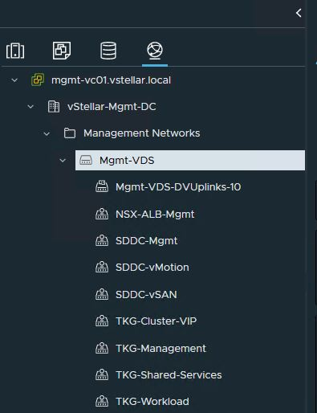

### <a id=firewall-requirements> </a> Firewall Requirements

Ensure that the firewall is set up as described in [Firewall Recommendations](../reference-designs/tko-on-vsphere-with-tanzu.md#firewall-recommendations).


### <a id=resource-pools> </a>Resource Pools

Ensure that resource pools and folders are created in vCenter. The following table shows a sample entry for the resource pool and folder. Customize the resource pool and folder name for your environment.

| Resource Type      | Resource Pool name | Sample Folder name |
| ------------------ | ------------------ | ------------------ |
| NSX ALB Components | NSX-ALB            | NSX-ALB-VMS        |

## Deployment Overview

The following are the high-level steps for deploying Tanzu Kubernetes operations on vSphere networking backed by VDS:

1.  [Deploy and Configure NSX Advanced Load Balancer](#config-nsxalb)
2.  [Deploy Tanzu Kubernetes Grid Supervisor Cluster](#deployTKGS)
3.  [Create and Configure vSphere Namespaces](#create-namespace)
4.  [Deploy Tanzu Kubernetes Clusters (Workload Clusters)](#deploy-workload-cluster)
5.  [Integrate Tanzu Kubernetes Clusters with SaaS Endpoints](#integrate-saas)
6.  [Deploy User-Managed Packages on Tanzu Kubernetes Grid Clusters](#deploy-user-managed-packages)

## <a id="config-nsxalb"> </a> Deploy and Configure NSX Advanced Load Balancer

NSX Advanced Load Balancer is an enterprise-grade integrated load balancer that provides L4- L7 load balancer support. We recommended deploying NSX Advanced Load Balancer for vSphere deployments without NSX-T, or when there are unique scaling requirements.

NSX Advanced Load Balancer is deployed in write access mode in the vSphere environment. This mode grants NSX Advanced Load Balancer Controllers full write access to the vCenter. Full write access allows automatically creating, modifying, and removing Service Engines and other resources as needed to adapt to changing traffic needs.

For a production-grade deployment, we recommend deploying three instances of the NSX Advanced Load Balancer Controller for high availability and resiliency.

The following table provides a sample IP address and FQDN set for the NSX Advanced Load Balancer controllers:

<!-- /* cSpell:disable */ -->

| Controller Node    | IP Address   | FQDN                   |
| ------------------ | ------------ | ---------------------- |
| Node01 (Primary)   | 172.16.80.11 | alb-ctlr01.your-domain |
| Node02 (Secondary) | 172.16.80.12 | alb-ctlr02.your-domain |
| Node03 (Secondary) | 172.16.80.13 | alb-ctlr03.your-domain |
| Controller Cluster | 172.16.80.10 | alb.your-domain        |

<!-- /* cSpell:enable */ -->

### Deploy NSX Advance Load Balancer Controller Node

Do the following to deploy NSX Advanced Load Balancer Controller node:

1.  Log in to the vCenter Server by using the vSphere Client.
2.  Select the cluster where you want to deploy the NSX Advanced Load Balancer controller node.
3.  Right-click on the cluster and invoke the Deploy OVF Template wizard.
4.  Follow the wizard to configure the following:

   - VM Name and Folder Location.
   - Select the NSX-ALB resource pool as a compute resource.
   - Select the datastore for the controller node deployment.
   - Select the NSX-ALB-Mgmt port group for the Management Network.
   - Customize the configuration by providing Management Interface IP Address, Subnet Mask, and Default Gateway. The rest of the fields are optional and can be left blank.

   The following example shows the final configuration of the NSX Advanced Load Balancer Controller node.

   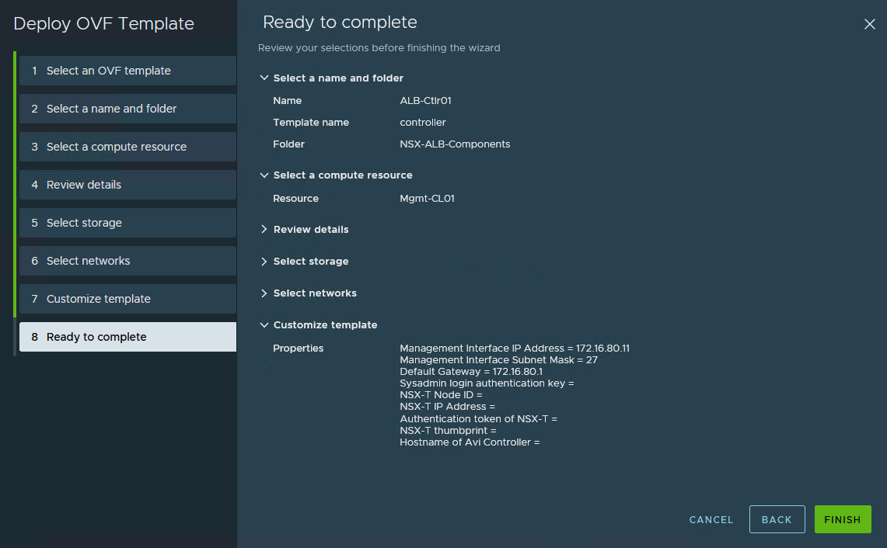

 For more information, see the product documentation [Deploy the Controller](https://docs.vmware.com/en/VMware-vSphere/7.0/vmware-vsphere-with-tanzu/GUID-CBA041AB-DC1D-4EEC-8047-184F2CF2FE0F.html).

### Configure the Controller Node for your vSphere with Tanzu Environment

After the Controller VM is deployed and powered-on, configure the Controller VM for your vSphere with Tanzu environment. The Controller requires several post-deployment configuration parameters.

1. On a browser, go to https://<_controller node01-fqdn_>/.

1. Configure an **Administrator Account** by setting up a password and optionally, an email address.

  

1. Configure **System Settings** by specifying the backup passphrase and DNS information.

  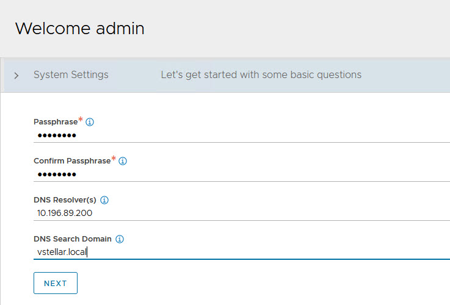

1. (Optional) Configure **Email/SMTP**.

  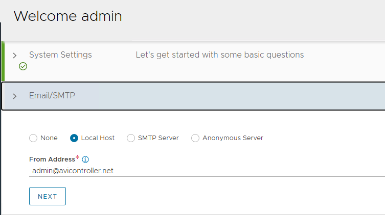

1. Configure Multi-Tenant settings as follows:

   - IP Route Domain: Share IP route domain across tenants.
   - Service Engine Context: Service Engines are managed within the tenant context, not shared across tenants.

   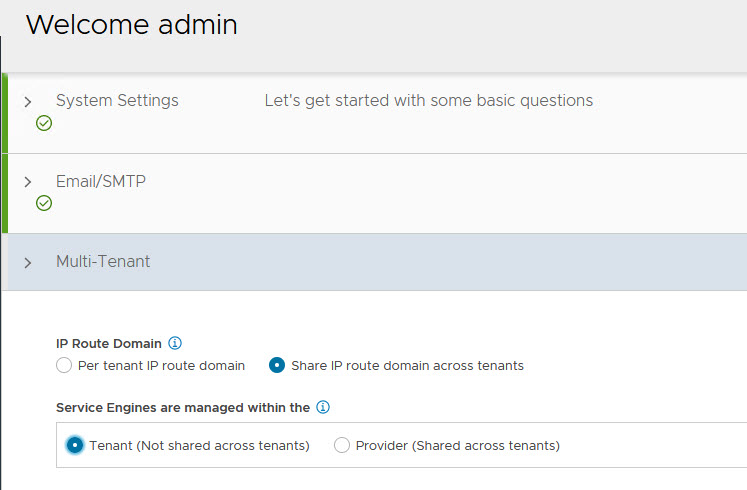

1. Click **Save** to exit the post-deployment configuration wizard.
   You are directed to a Dashboard view on the controller.

1. Navigate to **Infrastructure > Clouds** and click on the gear to convert the Cloud Type **Default-Cloud**.
   Select **VMware vCenter/vSphere ESX** as the infrastructure type and click **Yes, Continue**.

  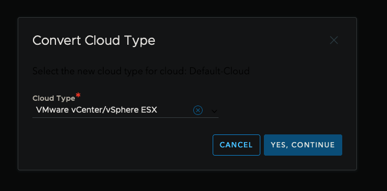

1. Configure the Infrastructure settings.
   1. Provide the Username, Password, and DNS or IP address for your vCenter
      instance.
   2. Leave everything else as is, then click "Next"

   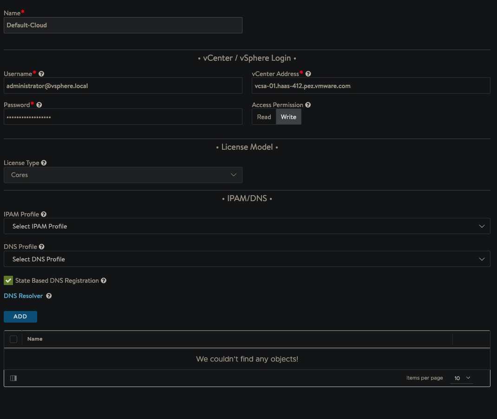

1. Configure the Data Center settings.

   1. Select the vSphere **Data Center** where you want to enable **Workload Management**.
   1. Select the Default Network IP Address Management mode.

      - Select **DHCP Enabled** if DHCP is available on the vSphere port groups.
      - Leave the option unselected if you want the Service Engine interfaces to use only static IP addresses. You can configure them individually for each network.

   1. For Virtual Service Placement, select **Prefer Static Routes vs Directly Connected Network**, then click **Next**.

    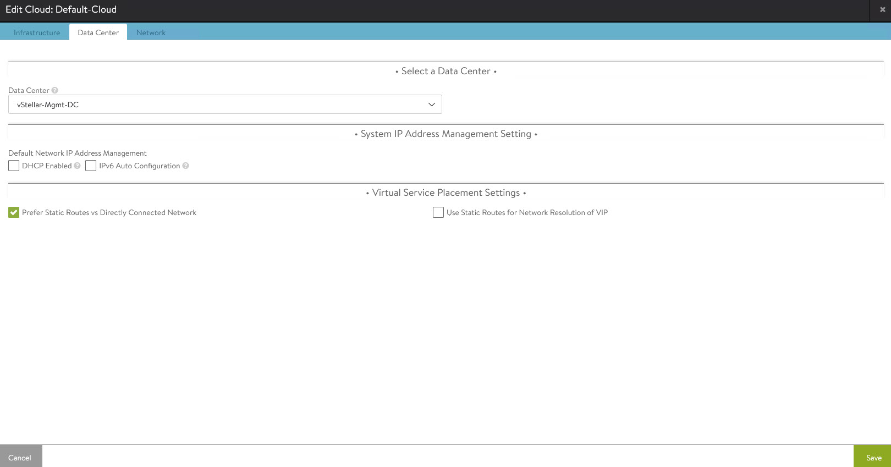

1. Configure the **Network** settings as follows:

   - Select the **Management Network**. This network interface is used by the Service Engines to connect with the Controller.
   - Leave the **Template Service Engine Group** empty.
   - **Management Network IP Address Management**: Select **DHCP Enabled** if DHCP is available on the vSphere port groups.
   - If DHCP is not available, enter the **IP Subnet**, IP address range (**Add Static IP Address Pool**), **Default Gateway** for the Management Network, then click **Next**.

   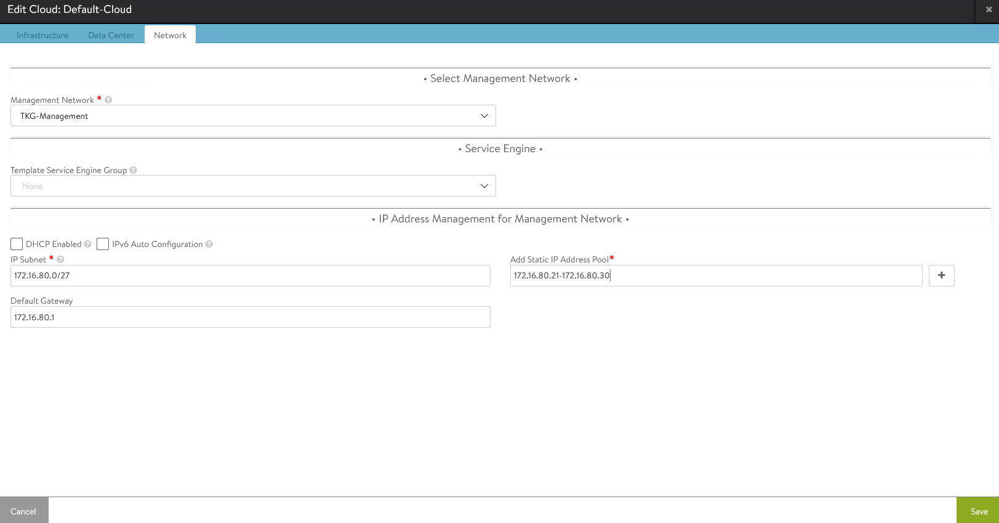

1. Verify that the health of Default-Cloud is green.

   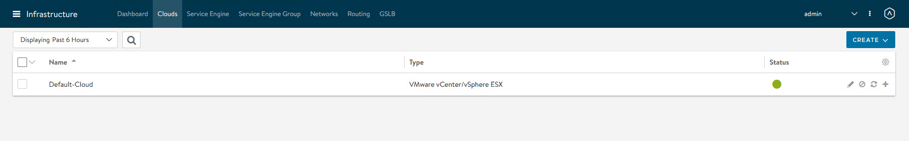

1. Configure Licensing.

  Tanzu for Kubernetes Operations requires an NSX Advanced Load Balancer Enterprise license. To configure licensing, navigate to the **Administration > Settings > Licensing** and apply the license key. If you have a license file instead of a license key, click the **Upload from Computer** link.

  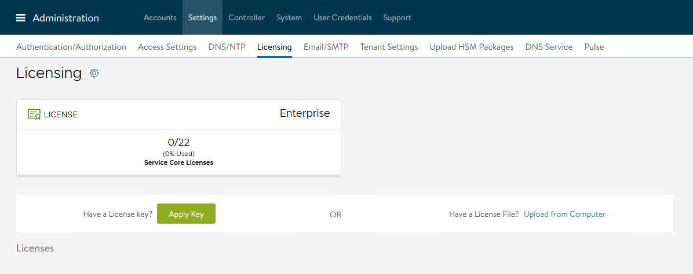


  > If you are running through this guide in a test environment and do not have
  > a license to apply, select "Enterprise Tier" to use a 60-day trial license.
  >
  > 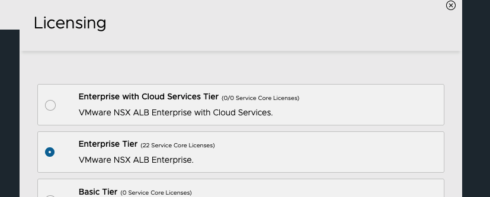

1. Configure NTP settings if you want to use an internal NTP server.

   1. Navigate to **Administration > Settings > DNS/NTP**.
   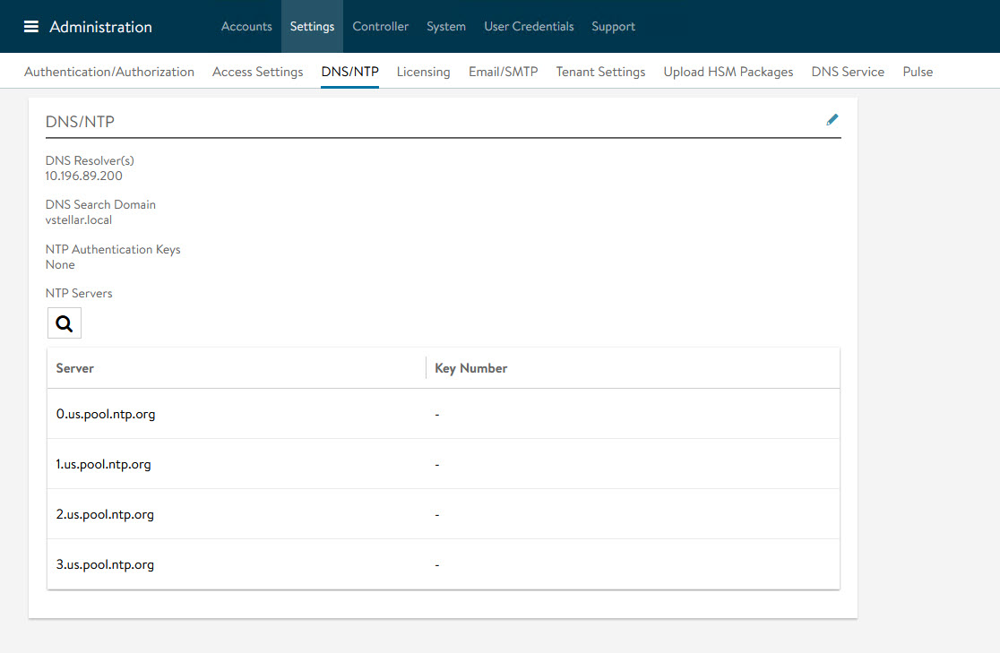

   1. Click the pencil icon to edit the settings and specify the NTP server that you want to use.
   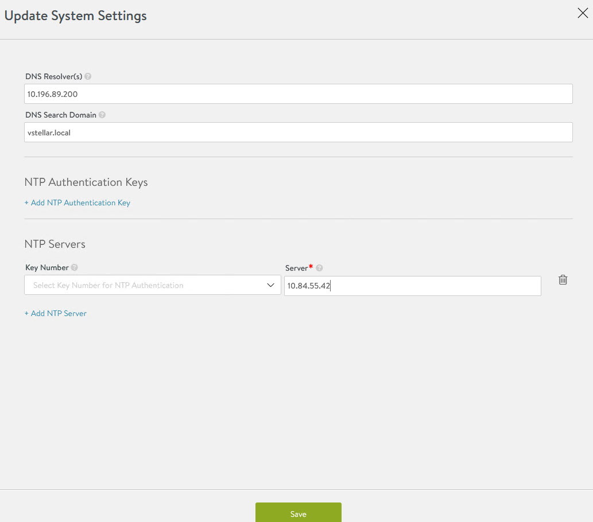

   1. Click **Save** to save the settings.

For additional product documentation, see the following:

- [Configure the Controller](https://docs.vmware.com/en/VMware-vSphere/7.0/vmware-vsphere-with-tanzu/GUID-DC6F2219-D683-40A9-AC76-1B4A71422B2F.html).
- [Add a License](https://docs.vmware.com/en/VMware-vSphere/7.0/vmware-vsphere-with-tanzu/GUID-3E886C84-D636-4965-9276-78E5C3099ABE.html).

### Deploy NSX Advanced Load Balancer Controller Cluster

In a production environment, we recommended that you deploy additional controller nodes and configure the controller cluster for high availability and disaster recovery.

To run a three node controller cluster, you deploy the first node and perform the initial configuration, and set the Cluster IP. After that, you deploy and power on two more Controller VMs. However, do not run the initial configuration wizard or change the administrator password for the two additional Controllers VMs. The configuration of the first Controller VM is assigned to the two new Controller VMs.

The first controller of the cluster receives the "Leader" role. The second and third controllers work as "Follower".

To configure the Controller cluster,

1. Navigate to **Administration > Controller**

1. Select **Nodes** and click **Edit**.

  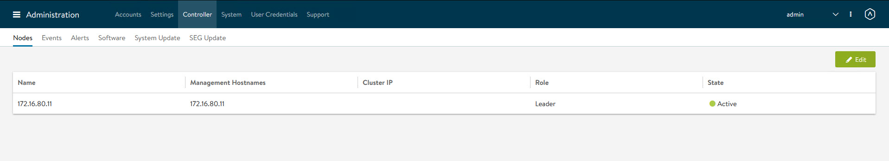

1. Specify a name for the controller cluster and set the Cluster IP.

   This IP address should be from the NSX Advanced Load Balancer management network.

1. In **Cluster Nodes**, specify the IP addresses of the two additional controllers that you have deployed.

  Leave the name and password fields empty.

  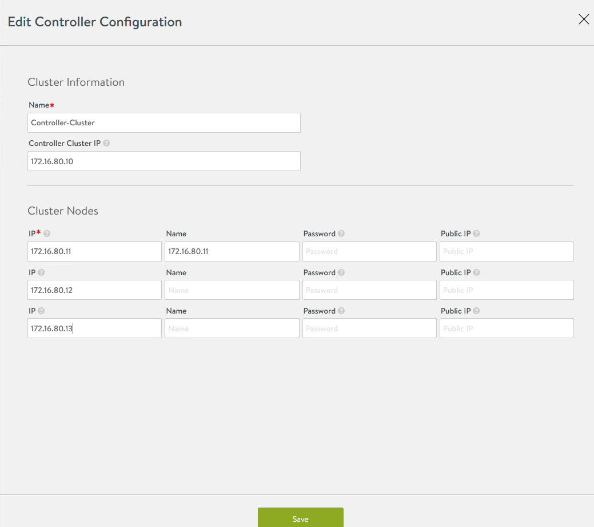

1. Click **Save**.

  The Controller cluster setup starts. The Controller nodes are rebooted in the process. It takes approximately 10-15 minutes for cluster formation to complete.

  You are automatically logged out of the controller node you are currently logged into. Enter the cluster IP in a browser to see the cluster formation task details.

  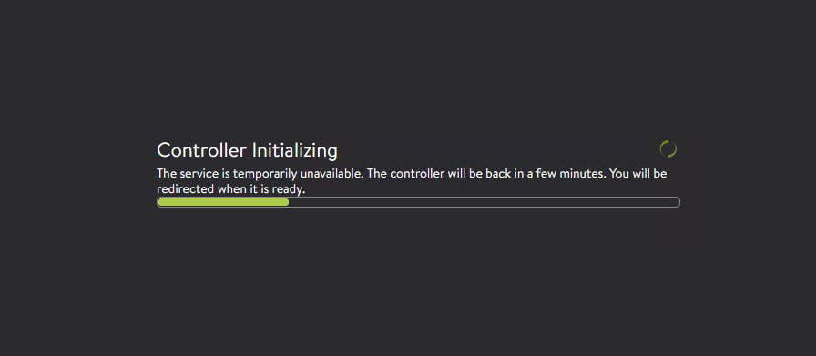

  > ✅ You might not see the image above while the cluster initializes. This is
  > okay. You can use this terminal command to wait for the controller to become
  > available:
  >
  > ```sh
  > # Replace with your actual cluster IP
  > controller_cluster_ip=172.16.80.10 
  >
  > while ! nc -z "$controller_cluster_ip";
  > do
  >   idx=$((idx+1));
  >   printf "INFO: Waiting for Avi cluster to become available \
  > (%s secs)\r" "$idx";
  >   sleep 1;
  > done
  > printf "\n"
  > ```

  Once the controller cluster has been deployed, visit **Administration** >
  **Controller** > **Nodes** to ensure that all nodes are green.

  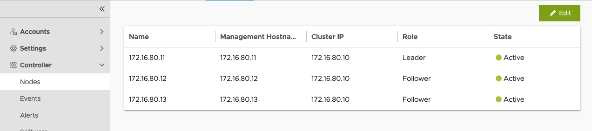

  After the Controller cluster is deployed, use the Controller cluster IP for doing any additional configuration. Do not use the individual Controller node IP.

For additional product documentation, see [Deploy a Controller Cluster](https://docs.vmware.com/en/VMware-vSphere/7.0/vmware-vsphere-with-tanzu/GUID-A51FAF35-D604-4883-A93D-58463B404C4E.html).

### Change NSX Advanced Load Balancer Portal Default Certificate

The Controller must send a certificate to clients to establish secure communication. This certificate must have a Subject Alternative Name (SAN) that matches the NSX Advanced Load Balancer Controller cluster hostname or IP address.

The Controller has a default self-signed certificate. But this certificate does not have the correct SAN. You must replace it with a valid or self-signed certificate that has the correct SAN. You can create a self-signed certificate or upload a CA-signed certificate.

This document makes use of a self-signed certificate.

To replace the default certificate,

1. Create a self-signed certificate.

   1. Navigate to the **Templates > Security > SSL/TLS Certificate >**

      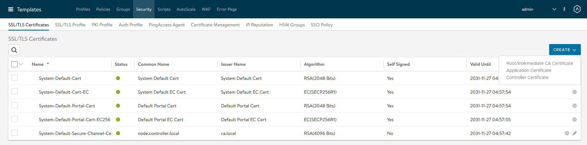

   1. Click **Create** and select **Controller Certificate**.

      The **New Certificate (SSL/TLS)** window appears.

   1. Enter a name for the certificate.

   1. To add a self-signed certificate, for **Type** select **Self Signed**.

   1. Enter the following details:

      - Common Name: Specify the fully-qualified name of the site. For the site to be considered trusted, this entry must match the hostname that the client entered in the browser.
      - Subject Alternate Name (SAN): Enter the cluster IP address or FQDN of the Controller cluster.
      - Algorithm: Select either EC or RSA.
      - Key Size

  1. Click **Save**.

      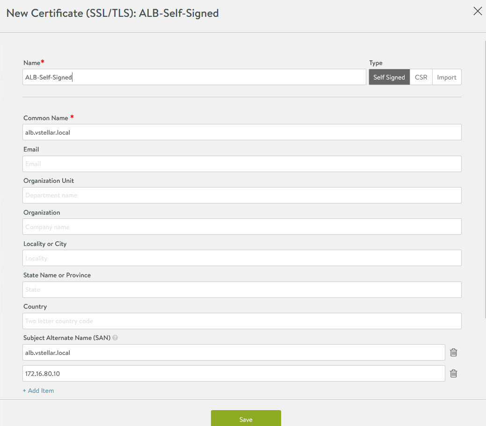

1. Change the NSX Advanced Load Balancer portal certificate.

   1. Navigate to the **Administration > Settings > Access Settings**.

   1. Clicking the pencil icon to edit the access settings.
   1. Verify that **Allow Basic Authentication** is enabled.

   1. From **SSL/TLS Certificate**, remove the existing default portal certificates

   1. From the drop-down list, select the newly created certificate

   1. Click **Save**.
   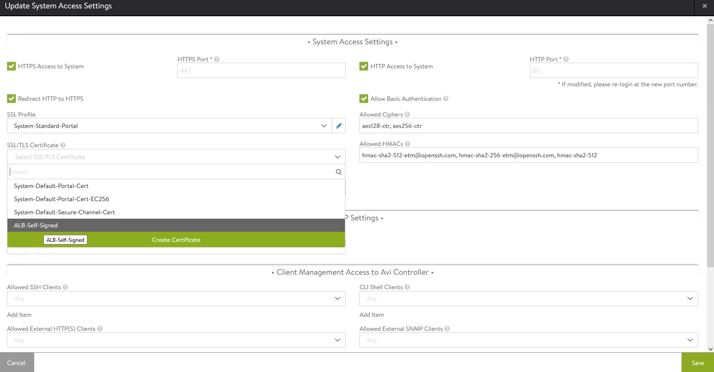

For additional product documentation, see [Assign a Certificate to the Controller](https://docs.vmware.com/en/VMware-vSphere/7.0/vmware-vsphere-with-tanzu/GUID-9435390C-E04C-43E7-B87F-910453AED797.html).

### Export NSX Advanced Load Balancer certificate

You need the newly created certificate when you configure the Supervisor Cluster to enable **Workload Management**.

To export the certificate, navigate to the **Templates > Security > SSL/TLS Certificate** page and export the certificate by clicking on the export button.

In the **Export Certificate** page that appears, click **Copy to clipboard** against the certificate. Do not copy the key. Save the copied certificate for later use when you enable workload management.

### Configure a Service Engine Group

vSphere with Tanzu uses the Default Service Engine Group. Ensure that the HA mode for the default-Group is set to N + M (buffer).

Optionally, you can reconfigure the Default-Group to define the placement and number of Service Engine VMs settings.

This document uses the Default Service Engine Group as is.

For more information, see the product documentation [Configure a Service Engine Group](https://docs.vmware.com/en/VMware-vSphere/7.0/vmware-vsphere-with-tanzu/GUID-14A98969-3115-45AC-9F0D-AA5A8EA6E16D.html).

### <a id=config-vip> </a> Configure a Virtual IP Subnet for the Data Network

You can configure the virtual IP (VIP) range to use when a virtual service is placed on the specific VIP network. You can configure DHCP for the Service Engines.

Optionally, if DHCP is unavailable, you can configure a pool of IP addresses to assign to the Service Engine interface on that network.

This document uses an IP pool for the VIP network.

To configure the VIP network,

1. Navigate to **Infrastructure > Networks** and locate the network that provides the virtual IP addresses.

> Navigate to **Infrastructure** > **Cloud Resources** > **Networks** if you do
> not see **Networks** in the top-level left nav.

1. Click the edit icon to edit the network settings.

  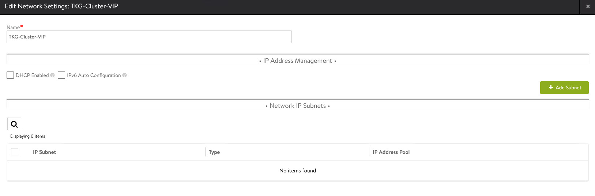

1. Click **Add Subnet**.

1. In **IP Subnet**, specify the VIP network subnet CIDR.

> ✅ The Avi controller will attempt to find a subnet corresponding to the
> network selected. There is a chance that its CIDR range or netmask
> might be incorrect.
>
> If that's the case, check the
> "Exclude Discovered Subnets for Virtual Service Placement" checkbox
> to remove this discovered subnet from the list of available subnets.

1. Click **Add Static IP Address Pool** to specify the IP address pool for the VIPs and Service Engine. The range must be a subset of the network CIDR configured in **IP Subnet**.
  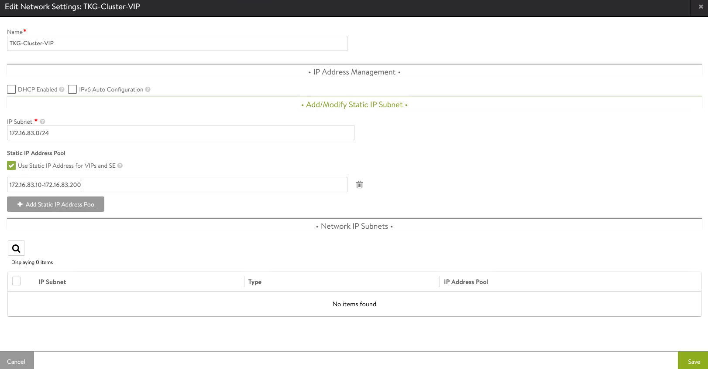

1. Click **Save** to close the VIP network configuration wizard.

For more information, see the product documentation [Configure a Virtual IP Network](https://docs.vmware.com/en/VMware-vSphere/7.0/vmware-vsphere-with-tanzu/GUID-29ACB562-2E80-4C28-AE63-8EB9DAF1A67F.html).

### Configure Default Gateway

A default gateway enables the Service Engine to route traffic to the pool servers on the Workload Network. You must configure the VIP Network gateway IP as the default gateway.

To configure the Default gateway,
1. Navigate to **Infrastructure > Routing > Static Route**.

1. Click **Create**.

  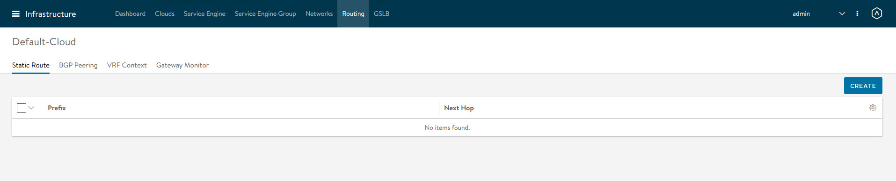

1. In **Gateway Subnet**, enter 0.0.0.0/0.

1. In **Next Hop**, enter the gateway IP address of the VIP network.

1. Click **Save**.

  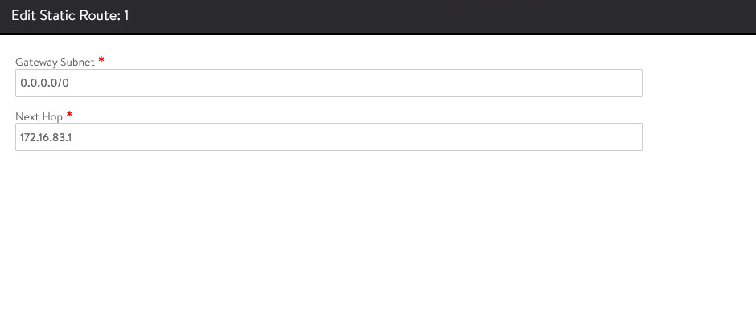

For additional product documentation, see [Configure Default Gateway](https://docs.vmware.com/en/VMware-vSphere/7.0/vmware-vsphere-with-tanzu/GUID-AB96BE48-D5B3-4B88-A92E-5A083472C56D.html)

### Configure IPAM

IPAM is required to allocate virtual IP addresses when virtual services get created. Configure IPAM for the NSX Advanced Load Balancer Controller and assign it to the Default-Cloud.

1. Navigate to the **Templates > Profiles > IPAM/DNS Profiles**.
1. Click **Create** and select **IPAM Profile** from the drop-down menu.

  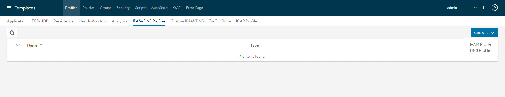

1. Enter the following to configure the IPAM profile:  

   - A name for the IPAM Profile.
   - Select type as **AVI Vantage IPAM**.
   - Deselect the **Allocate IP in VRF** option.

		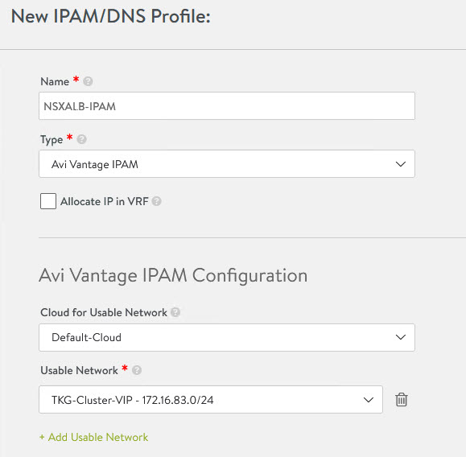

1. Click **Add Usable Network**.

   - Select **Default-Cloud**.
   - Choose the VIP network that you have created in [Configure a Virtual IP Subnet for the Data Network](#config-vip).

1. Click **Save**.

1. Assign the IPAM profile to the Default-Cloud configuration.
   1. Navigate to the **Infrastructure > Cloud**.
   1. Edit the **Default-Cloud** configuration as follows:
      -  **IPAM Profile**: Select the newly created profile.
   1. Click **Save**.
   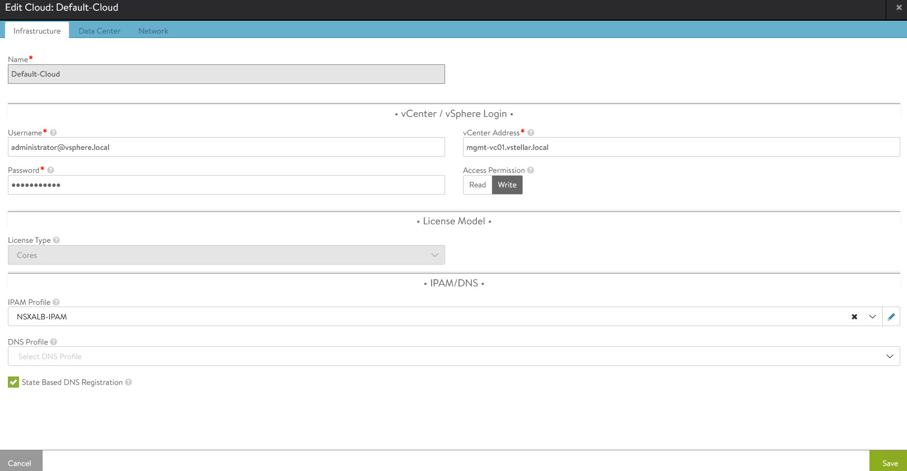

1. Verify that the status of the Default-Cloud configuration is green.

For additional product documentation, see [Configure IPAM](https://docs.vmware.com/en/VMware-vSphere/7.0/vmware-vsphere-with-tanzu/GUID-6ECC7035-BC0C-4197-A3DF-E92365A95A9F.html).

## <a id=deployTKGS> </a> Deploy Tanzu Kubernetes Grid Supervisor Cluster

As a vSphere administrator, you enable a vSphere cluster for Workload Management by creating a Supervisor Cluster. After you deploy the Supervisor Cluster, you can use the vSphere Client to manage and monitor the cluster.

Before deploying the Supervisor Cluster, ensure the following:

*   You have created a vSphere cluster with at least three ESXi hosts. If you are using vSAN you need a minimum of four ESXi hosts.
*   The vSphere cluster is configured with shared storage such as vSAN.
*   The vSphere cluster has HA & DRS enabled and DRS is configured in the fully-automated mode.
*   The required port groups have been created on the distributed switch to provide networking to the Supervisor and workload clusters.
*   Your vSphere cluster is licensed for Supervisor Cluster deployment.
*   You have created a [Subscribed Content Library](https://docs.vmware.com/en/VMware-vSphere/7.0/vmware-vsphere-with-tanzu/GUID-209AAB32-B2ED-4CDF-AE62-B0FAD9D34C2F.html) to automatically pull the latest Tanzu Kubernetes releases from the VMware repository.
*   You have created a [storage policy](https://docs.vmware.com/en/VMware-vSphere/7.0/vmware-vsphere-with-tanzu/GUID-544286A2-A403-4CA5-9C73-8EFF261545E7.html) that will determine the datastore placement of the Kubernetes control plane VMs, containers, and images.

To deploy the Supervisor Cluster,

1. Log in to the vSphere client and navigate to **Menu > Workload Management** and click **Get Started**.

  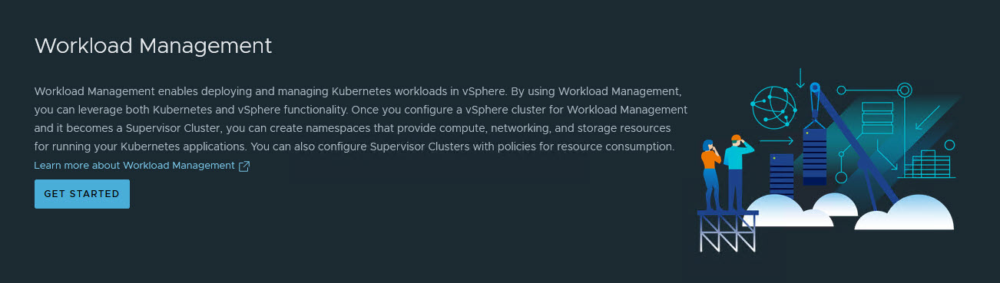

  > ✅ Add the license key for your vSphere with Tanzu installation above the
  > Get Started box if prompted, or provide your information below if you do not
  > have one yet to enable a trial license.

1. Select the vCenter Server and Network.

   1. Select a vCenter server system.
   1. Select **vSphere Distributed Switch (VDS)** for the networking stack.
   1. Click **Next**.

   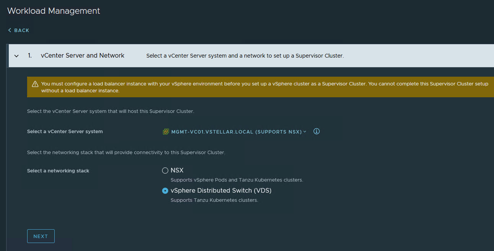

1. Select a cluster from the list of compatible clusters and click **Next**.

  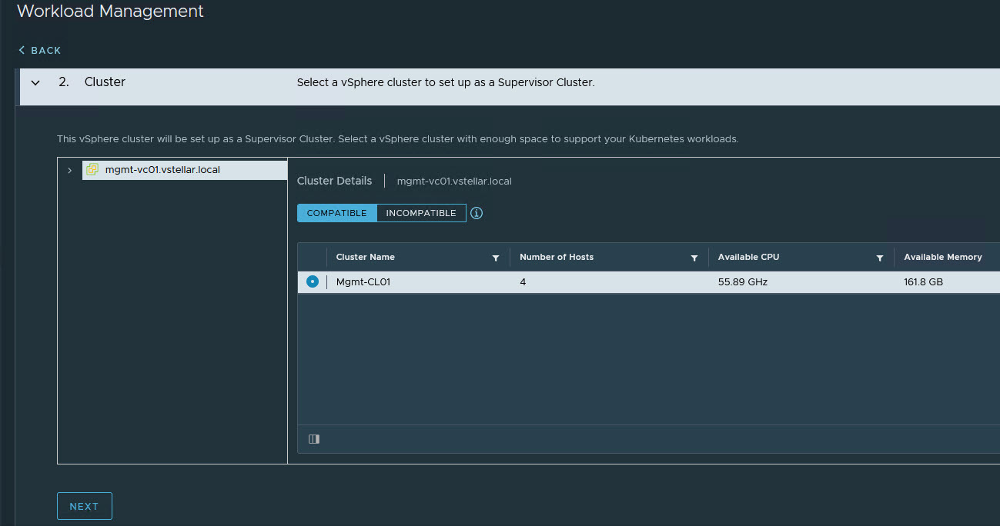

1. Select the **Control Plane Storage Policy** for the nodes from the drop-down menu and click **Next**.

  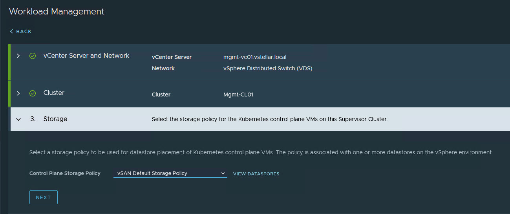

1. On the **Load Balancer** screen, select **Load Balancer Type** as **NSX Advanced Load Balancer** and provide the following details:

   - **Name**: Friendly name for the load balancer. Only small letters are supported in the name field.
   - **NSX Advanced Load Balancer Controller IP**: If the NSX Advanced Load Balancer self-signed certificate is configured with the hostname in the SAN field, use the same hostname here. If the SAN is configured with an IP address, provide the Controller cluster IP address. The default port of NSX Advanced Load Balancer is 443.
   - **NSX Advanced Load Balancer Credentials**: Provide the NSX Advanced Load Balancer administrator credentials.
   - **Server Certificate**: Use the content of the Controller certificate that you exported earlier while configuring certificates for the Controller.

   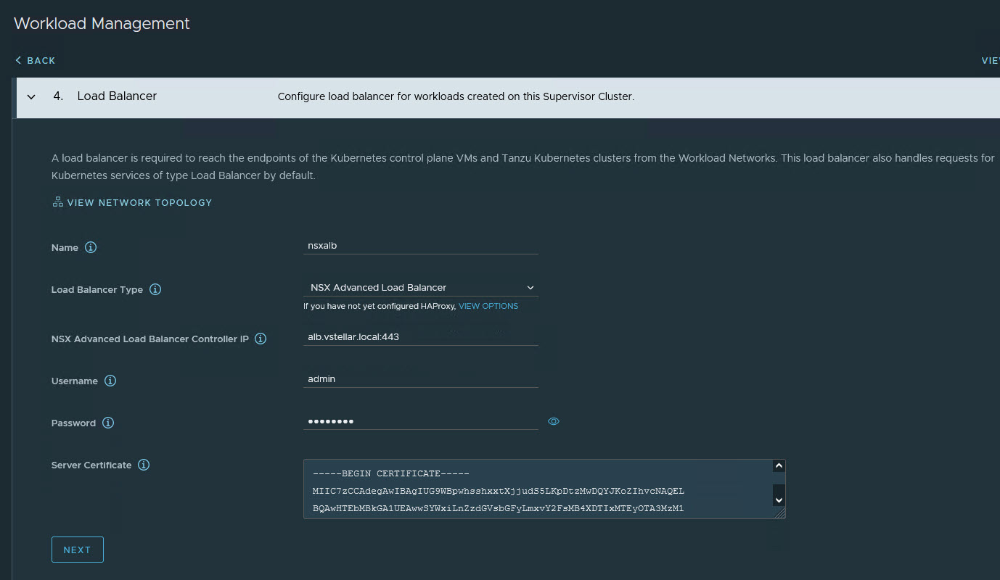

1. Click **Next**.   

1. On **Management Network** screen, select the port group that you created on the distributed switch. If DHCP is enabled for the port group, set the **Network Mode** to **DHCP**.

  Ensure that the DHCP server is configured to hand over DNS server address, DNS search domain, and NTP server address via DHCP.

  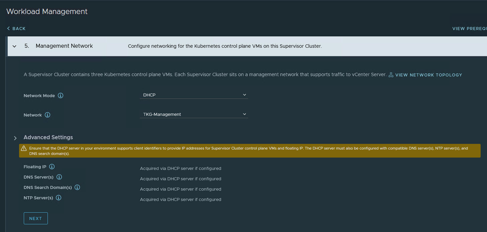

1. Click **Next**.   

1. On the **Workload Network** screen,
   - Select the network that will handle the networking traffic for Kubernetes workloads running on the Supervisor Cluster
   - Set the IP mode to DHCP if the port group is configured for DHCP.

   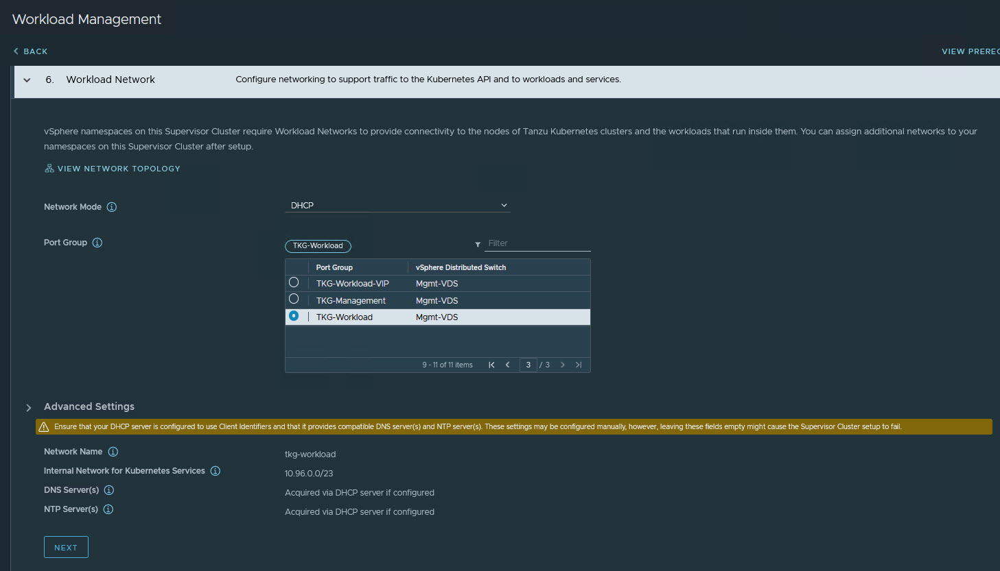

1. On the **Tanzu Kubernetes Grid Service** screen, select the subscribed content library that contains the Kubernetes images released by VMware.

  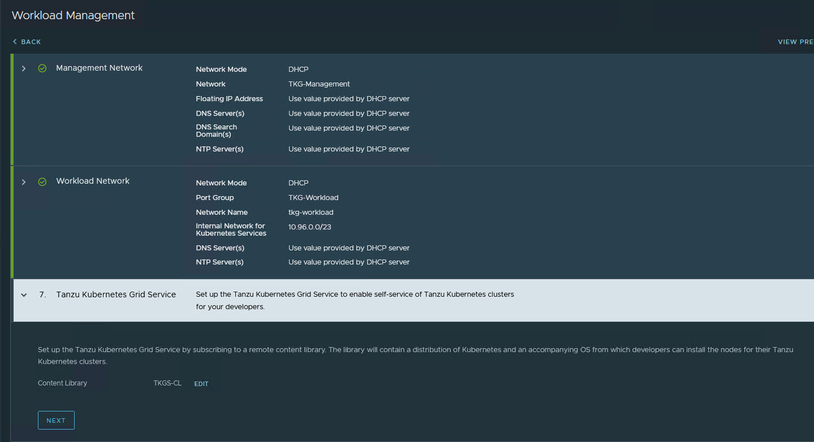

1. On the **Review and Confirm** screen, select the size for the Kubernetes control plane VMs that are created on each host from the cluster. For production deployments, we recommend a large form factor.

1. Click **Finish**. This triggers the Supervisor Cluster deployment.

  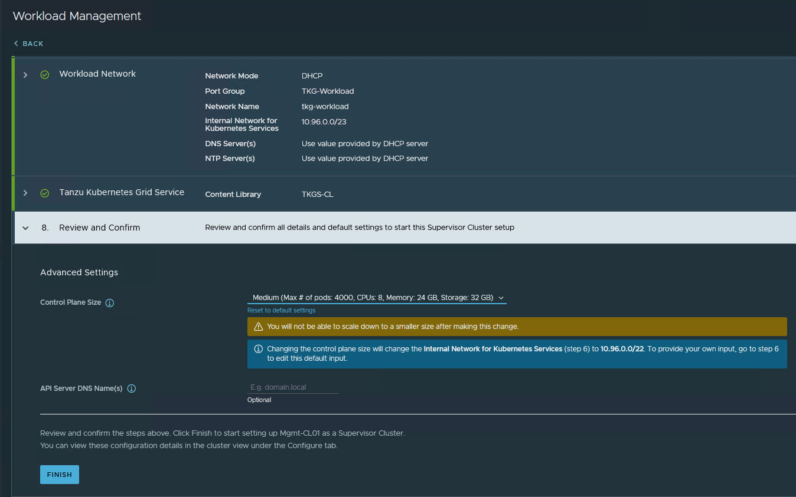

The Workload Management task takes approximately 30 minutes to complete. After the task completes, three Kubernetes control plane VMs are created on the hosts that are part of the vSphere cluster.

The Supervisor Cluster gets an IP address from the VIP network that you configured in the NSX Advanced Load Balancer. This IP address is also called the Control Plane HA IP address.

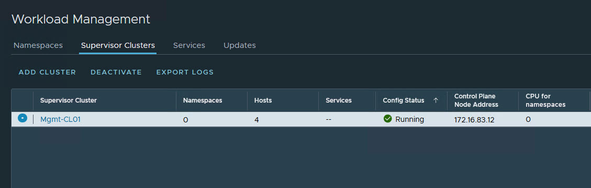

In the backend, three supervisor Control Plane VMs are deployed in the vSphere namespace.

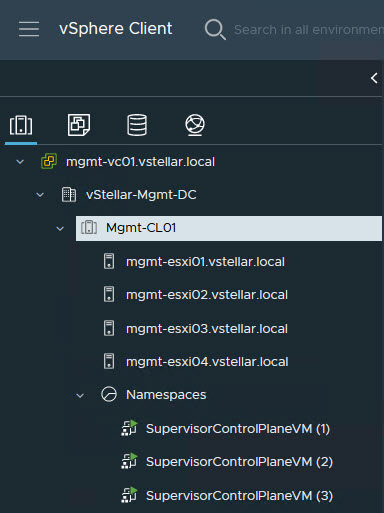

A Virtual Service is created in the NSX Advanced Load Balancer with three Supervisor Control Plane nodes that are deployed in the process.

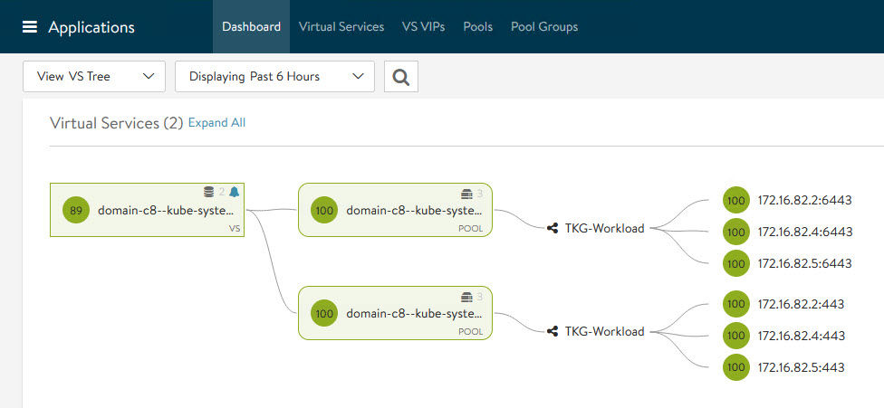

For additional product documentation, see [Enable Workload Management with vSphere Networking](https://docs.vmware.com/en/VMware-vSphere/7.0/vmware-vsphere-with-tanzu/GUID-8D7D292B-43E9-4CB8-9E20-E4039B80BF9B.html).


### Download and Install the Kubernetes CLI Tools for vSphere

You can use Kubernetes CLI Tools for vSphere to view and control vSphere with Tanzu namespaces and clusters.

The Kubernetes CLI Tools download package includes two executables: the standard open-source kubectl and the vSphere Plugin for kubectl. The vSphere Plugin for kubectl extends the commands available to kubectl so that you connect to the Supervisor Cluster and to Tanzu Kubernetes clusters using vCenter Single Sign-On credentials.

To download the Kubernetes CLI tool, connect to the URL https://<_control-plane-vip_>/

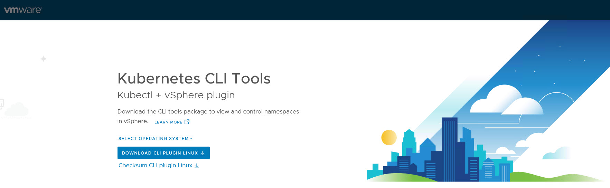

For additional product documentation, see [Download and Install the Kubernetes CLI Tools for vSphere](https://docs.vmware.com/en/VMware-vSphere/7.0/vmware-vsphere-with-tanzu/GUID-0F6E45C4-3CB1-4562-9370-686668519FCA.html).

### Connect to the Supervisor Cluster

After installing the CLI tool of your choice, connect to the Supervisor Cluster by running the following command:

`kubectl vsphere login --vsphere-username=administrator@vsphere.local --server=<control-plane-vip>  --insecure-skip-tls-verify`

The command prompts for the vSphere administrator password.

After your connection to the Supervisor Cluster is established you can switch to the Supervisor context by running the command:

`kubectl config use-context <supervisor-context-name>`

Where, the `<supervisor-context-name>` is the IP address of the control plane VIP.

## <a id=create-namespace> </a> Create and Configure vSphere Namespaces

A vSphere Namespace is a tenancy boundary within vSphere with Tanzu and allows for sharing vSphere resources (computer, networking, storage) and enforcing resources limits with the underlying objects such as Tanzu Kubernetes Clusters. It also allows you to attach policies and permissions.

Every workload cluster that you deploy runs in a Supervisor namespace.

To create a new Supervisor namespace,

1. Log in to the vSphere Client.

1. Navigate to **Home > Workload Management > Namespaces**.

1. Click **Create Namespace**.

  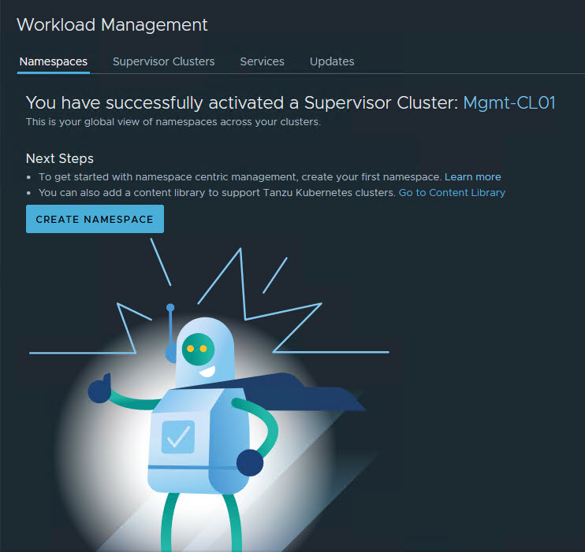

1. Select the **Cluster** that is enabled for **Workload Management**.

1. Enter a name for the namespace and select the workload network for the namespace.

  **Note:** The **Name** field accepts only lower case letters and hyphens.

1. Click **Create**.

	The namespace is created on the Supervisor Cluster.

   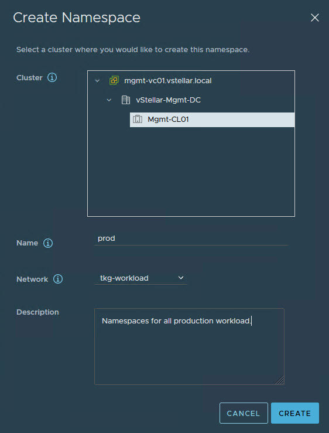

For additional product documentation, see [Create and Configure a vSphere Namespace](https://docs.vmware.com/en/VMware-vSphere/7.0/vmware-vsphere-with-tanzu/GUID-177C23C4-ED81-4ADD-89A2-61654C18201B.html).   

### Configure Permissions for the Namespace

To access a namespace, you have to add permissions to the namespace. To configure permissions, click on the newly created namespace, navigate to the **Summary** tab, and click **Add Permissions**.

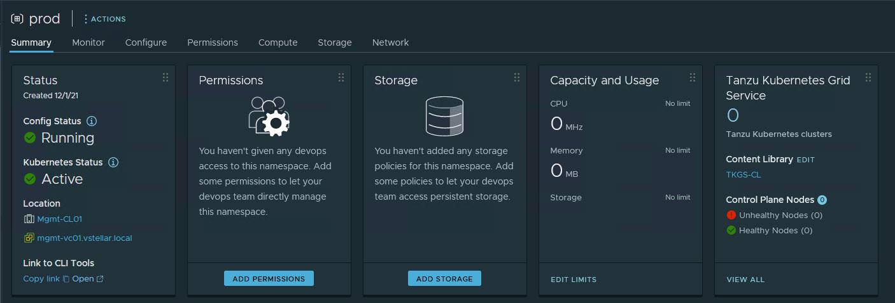

Choose the **Identity source**, search for the User/Group that will have access to the namespace, and define the **Role** for the selected User/Group.

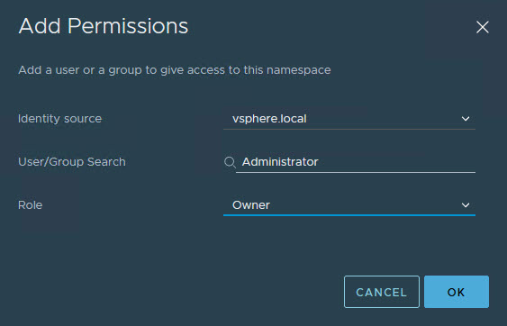

### Set Persistent Storage to the Namespace

Certain Kubernetes workloads require persistent storage to store data permanently. Storage policies that you assign to the namespace control how persistent volumes and Tanzu Kubernetes cluster nodes are placed within datastores in the vSphere storage environment.

To assign a storage policy to the namespace, on the **Summary** tab, click **Add Storage**.

From the list of storage policies, select the appropriate storage policy and click **OK**.

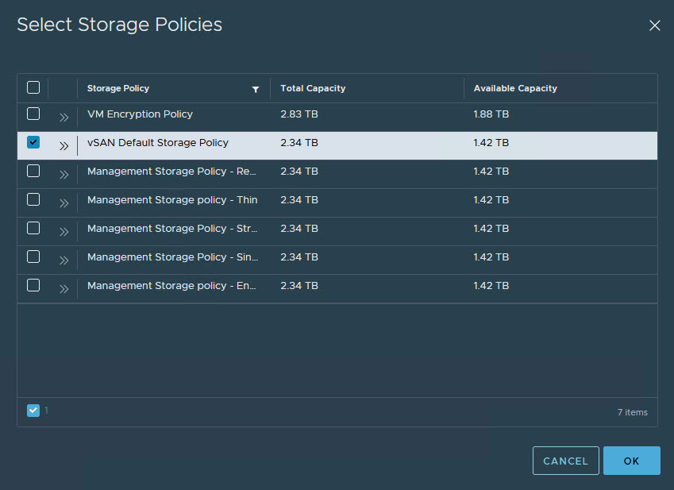

After the storage policy is assigned to a namespace, vSphere with Tanzu creates a matching Kubernetes storage class in the vSphere Namespace.

### Specify Namespace Capacity Limits

When initially created, the namespace has unlimited resources within the Supervisor Cluster. The vSphere administrator defines the limits for CPU, memory, storage, as well as the number of Kubernetes objects that can run within the namespace. These limits are configured for each vSphere Namespace.

To configure resource limitations for the namespace, on the **Summary** tab, click **Edit Limits** for **Capacity and Usage**.

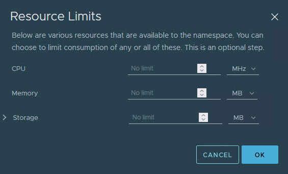

When limits are configured on the namespace, a resource pool for the namespace is created in the vCenter Server. The storage limitation determines the overall amount of storage that is available to the namespace.

### Associate VM Class with Namespace

The VM class is a VM specification that can be used to request a set of resources for a VM. The VM class defines parameters such as the number of virtual CPUs, memory capacity, and reservation settings.

vSphere with Tanzu includes several default VM classes and each class has two editions: guaranteed and best effort. A guaranteed edition fully reserves the resources that a VM specification requests. A best-effort class edition does not and allows resources to be overcommitted.

More than one VM Class can be associated with a namespace.

To add a VM class to a namespace,

1. Click **Add VM Class** for **VM Service.**

    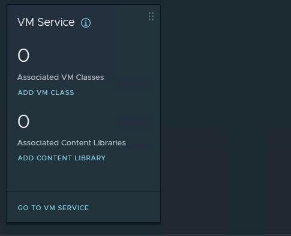

1. From the list of the VM Classes, select the classes that you want to include in your namespace.

   > ⚠️  Do not select the `small` or `xsmall` classes, as these are not large
   > enough to run Tanzu Service Mesh components.

   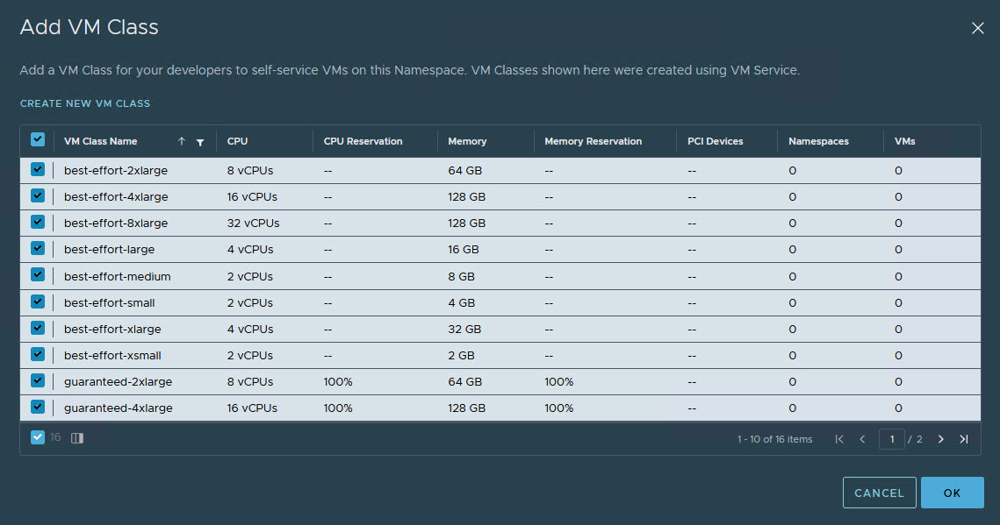 

1. Click **Ok**.  

  The namespace is fully configured now. You are ready to deploy your first Tanzu Kubernetes Cluster.

## <a id=prepare-deploy-workload-cluster> </a> Prepare to Deploy Tanzu Kubernetes Clusters (Workload Cluster)

Tanzu Kubernetes Clusters are created by invoking the Tanzu Kubernetes Grid Service declarative API using kubectl and a cluster specification defined using YAML. After you provision a cluster, you operate it and deploy workloads to it using kubectl.

Before you construct a YAML file for Tanzu Kubernetes Cluster deployment, gather information such as virtual machine class bindings, storage class, and the available Tanzu Kubernetes release that can be used.

You can gather this information by running the following commands:

1. Connect to the Supervisor Cluster using vSphere Plugin for kubectl.

   `kubectl vsphere login --server=<Supervisor Cluster Control Plane VIP> --vsphere-username USERNAME`

1. Switch context to the vSphere Namespace where you plan to provision the Tanzu Kubernetes cluster.

   `kubectl config get-contexts`

   `kubectl config use-context <vSphere-Namespace>`

   Example: **kubectl config use-context prod**

1. List the available virtual machine class bindings

   `kubectl get virtualmachineclassbindings`

   The output of the command list all VM class bindings that are available in the vSphere Namespace where you are deploying the Tanzu Kubernetes Cluster.

   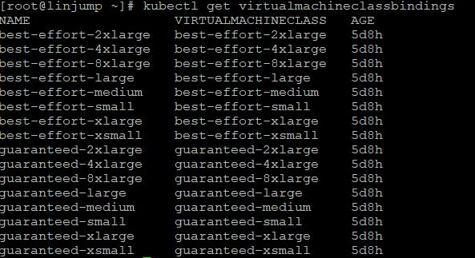

1. List the available storage class in the namespace.

   `kubectl get storageclass`

   The output of the command list all storage classes that are available in the vSphere Namespace.

   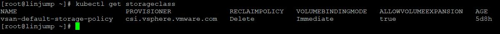

1. List the available Tanzu Kubernetes releases (TKR)

   `kubectl get tanzukubernetesreleases`

   The command's output lists the TKR versions that are available in the vSphere Namespace. You can only deploy Tanzu Kubernetes Cluster with TKR versions that have compatible=true.

   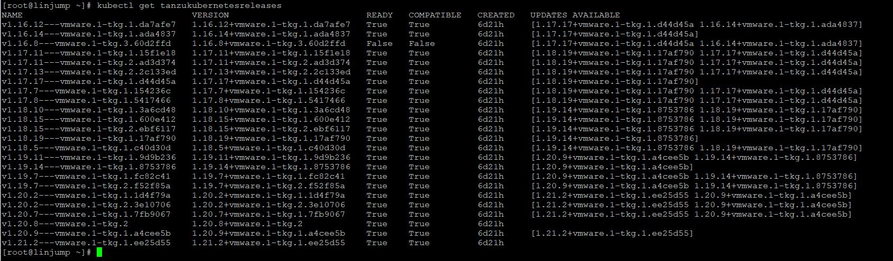

1. Construct the YAML file for provisioning a Tanzu Kubernetes cluster.

  Tanzu Kubernetes Clusters can be deployed using Tanzu Kubernetes Grid Service API. There are 2 versions of the API that you can use:

   - [Tanzu Kubernetes Grid Service v1alpha2 API](https://docs.vmware.com/en/VMware-vSphere/7.0/vmware-vsphere-with-tanzu/GUID-0CA8BF39-0D7E-4335-9D5B-7C80ED90D4D8.html)
   - [Tanzu Kubernetes Grid Service v1alpha1 API](https://docs.vmware.com/en/VMware-vSphere/7.0/vmware-vsphere-with-tanzu/GUID-BD132505-263E-40CF-82D4-B759C491AD23.html)

   This documentation makes use of v1alpha2 API to provision the Tanzu Kubernetes Clusters.

   The following example YAML is the minimal configuration required to provision a Tanzu Kubernetes cluster.

   ```yaml
  apiVersion: run.tanzu.vmware.com/v1alpha2
  kind: TanzuKubernetesCluster
  metadata:
    name: prod-1
    namespace: prod
  spec:
    topology:
      controlPlane:
        replicas: 3
        vmClass: best-effort-large # or the VM class binding you'd like to use.
        storageClass: vsan-default-storage-policy # or the storage class you'd like to use.
        tkr:
          reference:
          name: v1.21.2---vmware.1-tkg.1.ee25d55
      nodePools:
       - name: worker-pool01
         replicas: 6
         vmClass: best-effort-large # or the VM class binding you'd like to use.
         storageClass: vsan-default-storage-policy # or the storage class you'd like to use.
         tkr:
           reference:
             name: v1.21.2---vmware.1-tkg.1.ee25d55
  ```

  > ⚠️  If you receive `this request is invalid` after applying this YAML with
  > `kubectl apply`, ensure that your TKr release, virtual machine class, and
  > storage class are valid.

  > ⚠️  If you receive `this request is invalid` after applying this YAML with
  > `kubectl apply`, ensure that your TKr release, virtual machine class, and
  > storage class are valid.

## <a id=deploy-workload-cluster> </a>Deploy Tanzu Kubernetes Clusters (Workload Cluster)
1. Customize the cluster as needed by referring to the full list of [cluster configuration parameters](https://docs.vmware.com/en/VMware-vSphere/7.0/vmware-vsphere-with-tanzu/GUID-31BF8166-5FC8-4D43-933D-5797F3BE4A36.html)

1. To deploy the cluster, run the command:

   `kubectl apply -f <name>.yaml`

1. Monitor the deployment of cluster using the command:

   `kubectl get tanzukubernetesclusters`

   Sample result:

   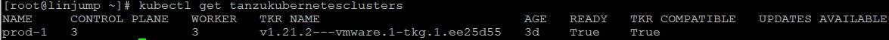

   You can also review the status of the cluster from vSphere Client by clicking on the namespace where the cluster is deployed and navigating to **Compute > VMware Resources > Tanzu Kubernetes Clusters**.

   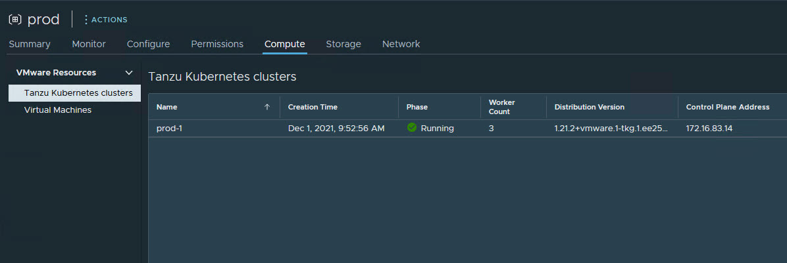

   The **Virtual Machines** tab displays the list of the control plane and worker nodes that are deployed during the cluster creation.

   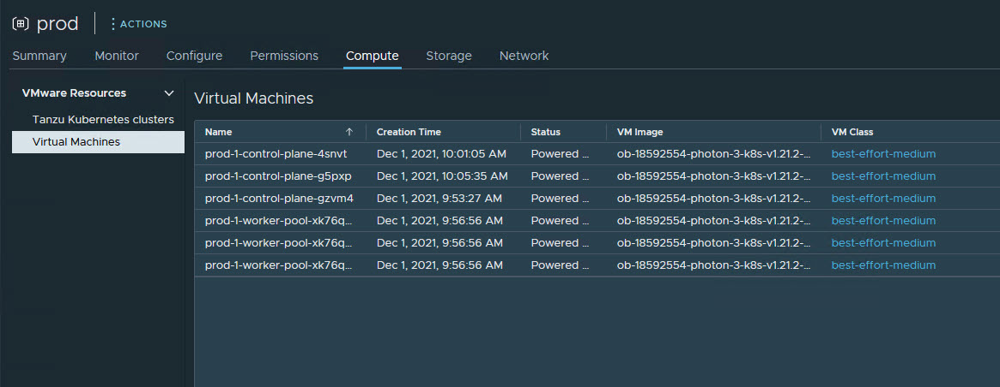

   For the Control-Plane HA, a virtual service is created in NSX Advanced Load Balancer with the pool members as the three control plane nodes that got deployed during the cluster creation.

   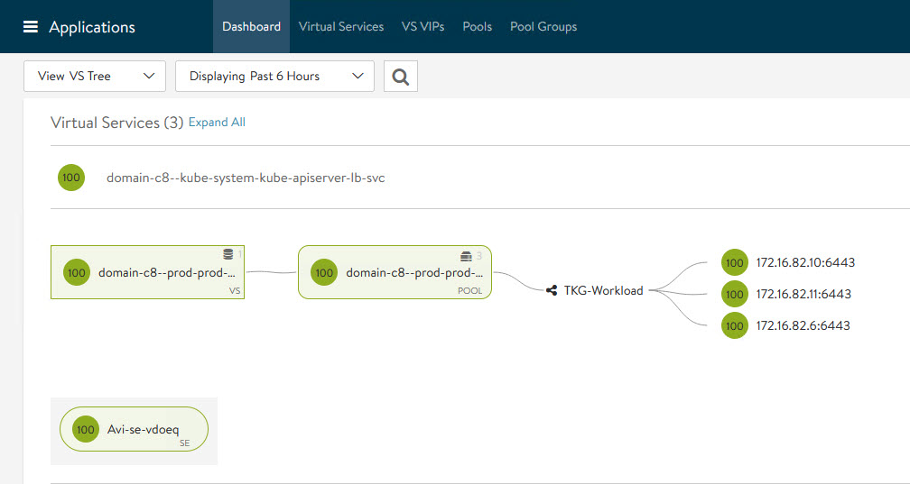

For additional product documentation, see [Configuring and Managing vSphere Namespaces](https://docs.vmware.com/en/VMware-vSphere/7.0/vmware-vsphere-with-tanzu/GUID-1544C9FE-0B23-434E-B823-C59EFC2F7309.html).   

## <a id=integrate-saas> </a> Integrate Tanzu Kubernetes Clusters with SaaS Endpoints

By integrating Supervisor Cluster and Tanzu Kubernetes Clusters with Tanzu Mission Control (TMC) you are provided a centralized administrative interface that enables you to manage your global portfolio of Kubernetes clusters.

### Tanzu Mission Control

Tanzu Mission Control is a centralized management platform for consistently operating and securing your Kubernetes infrastructure and modern applications across multiple teams and clouds.

#### Register Supervisor Cluster with Tanzu Mission Control

This section describes how to register the Supervisor Cluster with Tanzu Mission Control.

The terms Supervisor Cluster and management cluster are used interchangeably.

Before you register the Supervisor Cluster with Tanzu Mission Control, ensure you have the following:

*   A cluster group in Tanzu Mission Control.
*   A workspace in Tanzu Mission Control.
*   Policies that are appropriate for your Tanzu Kubernetes Grid deployment.
*   A provisioner. A provisioner helps you to deploy Tanzu Kubernetes Grid clusters across multiple/different platforms, such as AWS, VMware vSphere, etc.

Do the following to register the Supervisor Cluster with Tanzu Mission Control:

1.  Log in to Tanzu Mission Control and navigate to **Administration > Management clusters**.

1.  Click **Register Management Cluster** and select **vSphere with Tanzu**.

  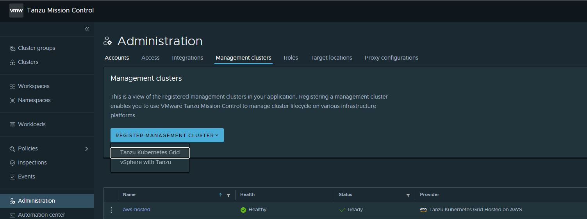

1. On the **Register management cluster** page, provide a name for the management cluster, and choose a cluster group.

  Optionally, you can provide a description and labels for the management cluster.

  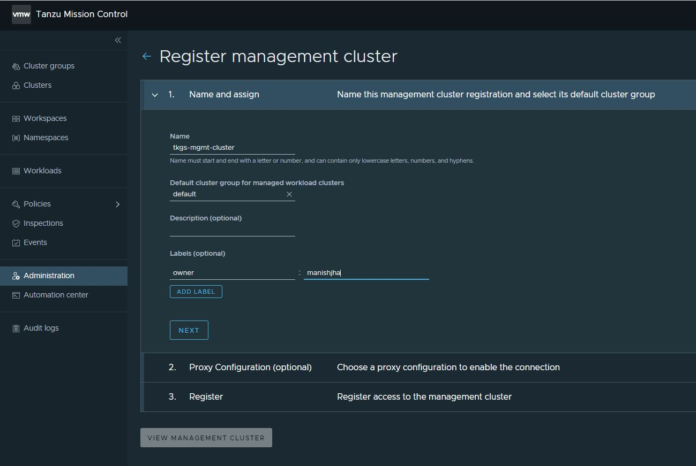

1. If you are using a proxy to connect to the Internet, you can configure the proxy settings by toggling **Set proxy for the management cluster** to **Yes**.

  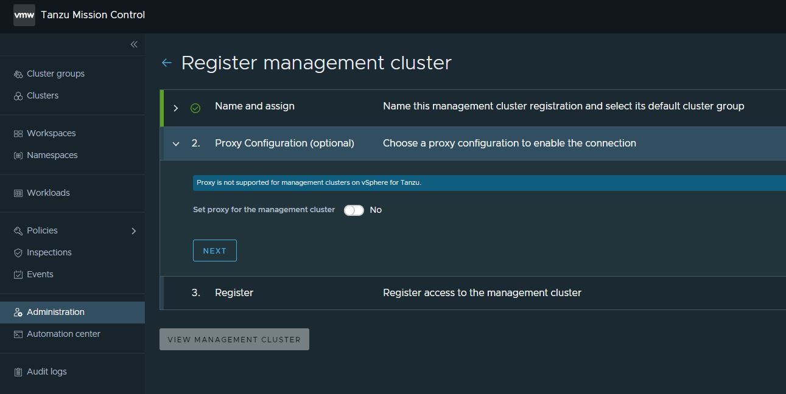

1. On the **Register** page, Tanzu Mission Control generates a YAML file that defines how the management cluster connects to Tanzu Mission Control for registration. The credentials provided in the YAML expire after 48 hours.

  Copy the URL provided on the **Register** page. This URL is needed to install the Tanzu Mission Control agent on your management cluster and complete the registration process.

  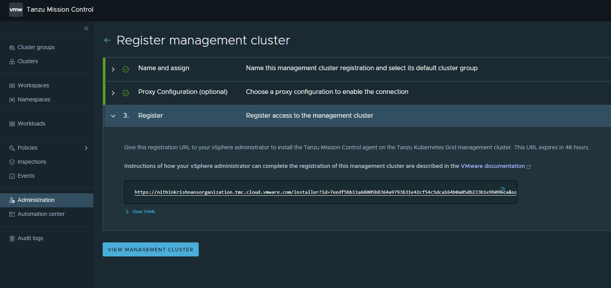

  When the Supervisor Cluster is registered with Tanzu Mission Control, the Tanzu Mission Control agent is installed in the **svc-tmc-cXX** namespace, which is included with the Supervisor Cluster by default. After installing the agent, you can use the Tanzu Mission Control web interface to provision and manage Tanzu Kubernetes clusters.

1. Connect to the management cluster and obtain the name of the namespace where you will install the Tanzu Mission Control agent.

  `kubectl vsphere login --server=<Supervisor Cluster Control Plane VIP> --vsphere-username USERNAME`

  `kubectl get namespaces`

  Look for the namespace name starting with **svc-tmc-xxx**

  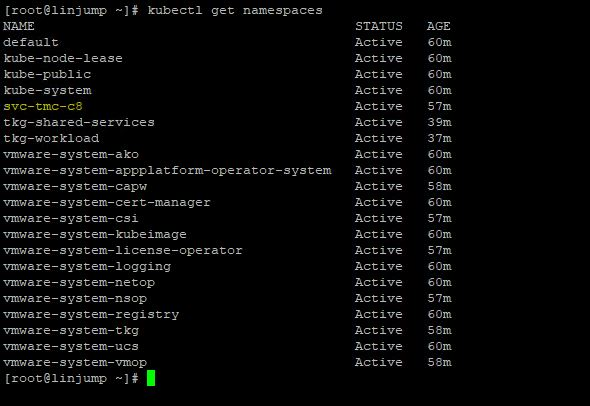

1. Prepare a YAML file with the following content to install the Tanzu Mission Control agent on the management cluster.
  ```yaml
  # vi tmc-registration.yaml
  apiVersion: installers.tmc.cloud.vmware.com/v1alpha1
  kind: AgentInstall
  metadata:
      name: tmc-agent-installer-config
      namespace: <tmc namespace>
  spec:
      operation: INSTALL
      registrationLink: <TMC-REGISTRATION-URL>
  ```

1. Install the Tanzu Mission Control agent using kubectl.

  `kubectl create -f tmc-registration.yaml`

  The Tanzu Mission Control cluster agent is installed on the Supervisor Cluster. The resulting output looks similar to the following:

  `agentinstall.installers.tmc.cloud.vmware.com/tmc-agent-installer-config created`

  Optionally, you can check the progress of the agent installation by running the following command:

  `kubectl describe agentinstall tmc-agent-installer-config -n <tmc namespace>`

  The installation is complete when the status: line at the bottom of the output changes from `INSTALLATION\_IN\_PROGRESS` to `INSTALLED`.

  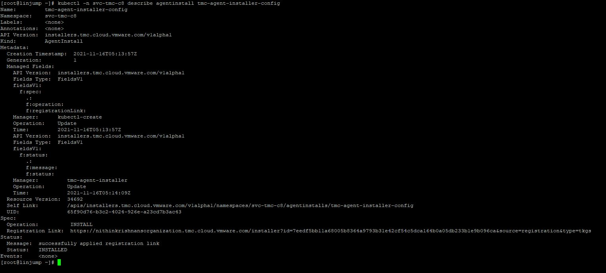

1. Return to the Tanzu Mission Control console and click **Verify Connection**.

  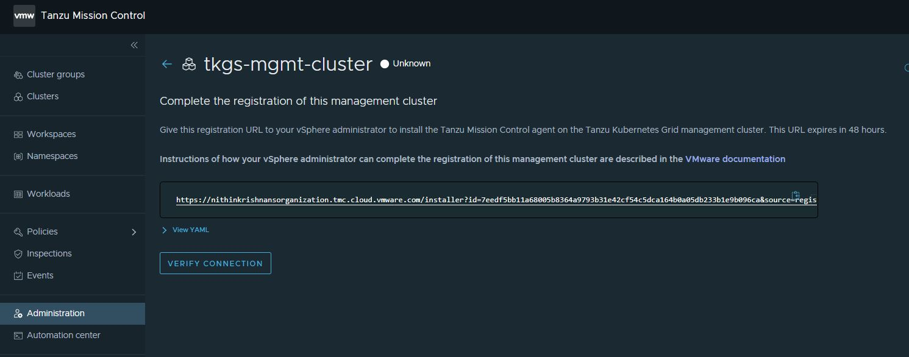

1. Clicking on Verify Connection takes you to an overview page that displays the health of the cluster and its components.

  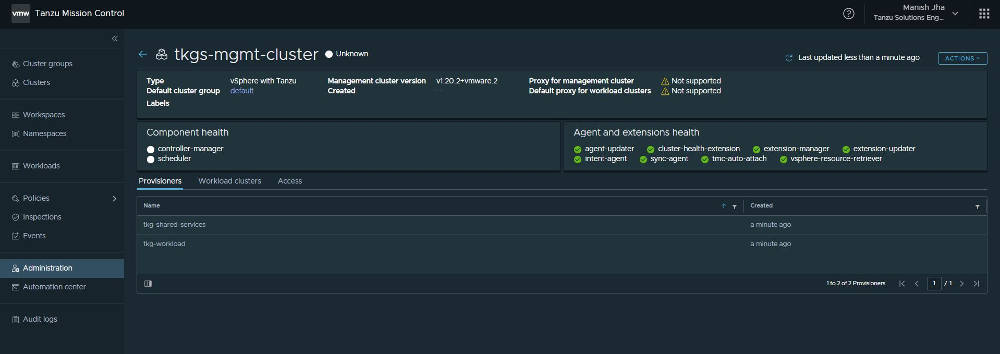

For additional product documentation, see [Integrate the Tanzu Kubernetes Grid Service on the Supervisor Cluster with Tanzu Mission Control](https://docs.vmware.com/en/VMware-vSphere/7.0/vmware-vsphere-with-tanzu/GUID-ED4417DC-592C-454A-8292-97F93BD76957.html).  

#### Register Tanzu Kubernetes Cluster (Workload Cluster) with Tanzu Mission Control

If you have deployed Tanzu Kubernetes Cluster manually, you can register it in Tanzu Mission Control for life-cycle management and policy enforcement.

You can view the workload clusters associated with a Supervisor Cluster under the **Workload clusters** tab on the overview page of the Supervisor Cluster.

1. Select the workload cluster that you want to integrate with Tanzu Mission Control and click **Manage Cluster**.

  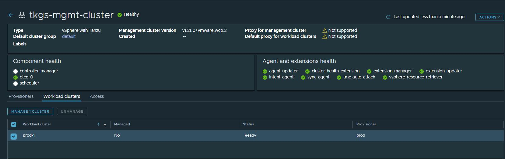

1. Select the **Cluster group** for the workload cluster and click **Manage**.

  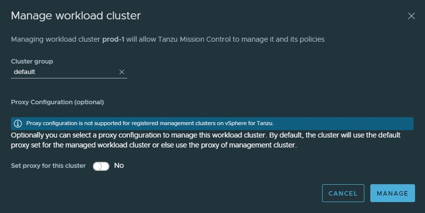

1. Verify that the workload cluster is in a ready state and showing as a managed cluster.

  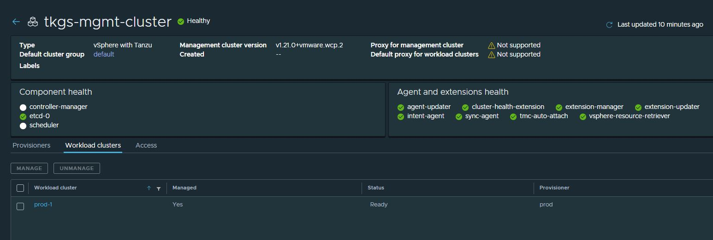

#### Allow TMC-created service accounts to create `Pod`s

> [Source](https://www.unknownfault.com/posts/podsecuritypolicy-unable-to-admit-pod/)

Tanzu Kubernetes Clusters come with a `vmware-system-privileged`
`PodSecurityPolicy` (PSP) that prevents `Pod`s from being scheduled except by service
accounts that are bound to this PSP by way of a namespaced `RoleBinding` or a
cluster-wide `ClusterRoleBinding`. Tanzu Mission Control allows you to create
service accounts for packages installed through it. However, because these
accounts are not bound to this PSP, `Pod`s provisioned by these packages never
get scheduled, causing TMC to time out during the installation.

As a workaround, create a `ClusterRoleBinding` allowing any authenticated
service accounts to access the `vmware-system-privileged` PodSecurityPolicy:

```sh
kubectl apply -f <<-EOF
apiVersion: rbac.authorization.k8s.io/v1
kind: ClusterRoleBinding
metadata:
  name: administrator-cluster-role-binding
roleRef:
  kind: ClusterRole
  name: psp:vmware-system-privileged
  apiGroup: rbac.authorization.k8s.io
subjects:
- kind: Group
  name: system:authenticated
  apiGroup: rbac.authorization.k8s.io
EOF
```

If this is too permissive, you can also create a namespace into which your
package will be installed, then use a `RoleBinding` to bind the namespace's
`default` service account to this PSP:

```sh
kubectl create ns package-namespace &&
  kubectl apply -f <<-EOF
kind: RoleBinding
apiVersion: rbac.authorization.k8s.io/v1
metadata:
  name: rolebinding-cluster-user-administrator
  namespace: package-namespace
roleRef:
  kind: ClusterRole
  name: edit
  apiGroup: rbac.authorization.k8s.io
subjects:
- kind: ServiceAccount
  name: default
EOF
```

Note that you'll need to provide the namespace and service account when
installing the package. This is demonstrated in the image below.

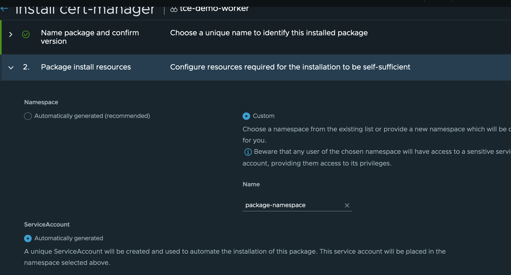

If you are not able to provide the name of a service account in advance,
list the service accounts in the namespace with `kubectl get sa -n $NAMESPACE`,
select the most recently created service account, then run the commands above,
replacing `default` with the service account you selected.

### Tanzu Observability

Tanzu Observability (TO) delivers full-stack observability across containerized cloud applications, Kubernetes health, and cloud infrastructure. The solution is consumed through a Software-as-a-Service (SaaS) subscription model, managed by VMware. This SaaS model allows the solution to scale to meet metrics requirements without the need for customers to maintain the solution itself.

Tanzu Observability by Wavefront significantly enhances observability for your workloads running in Tanzu Kubernetes Grid clusters.

Do the following to enable Tanzu Observability on the Tanzu Kubernetes Grid cluster:

1. Log in to the Tanzu Mission control console and ensure that the Tanzu Observability is enabled on your org.  If it is not enabled, enable it by navigating to the **Administration > Integrations**.

  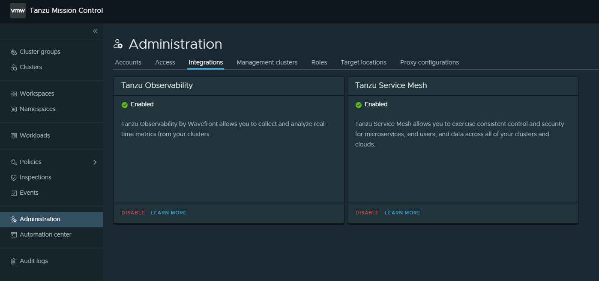

1. Create a Service Account in Tanzu Observability (TO) to enable communication between Tanzu Observability and Tanzu Mission Control.

  1. Log in to Tanzu Observability.
  1. Click on the gear icon to open Account Management settings.
  1. Navigate to the service accounts tab.
  1. Click **Create New Account** to create a service account and an associated API Token.

  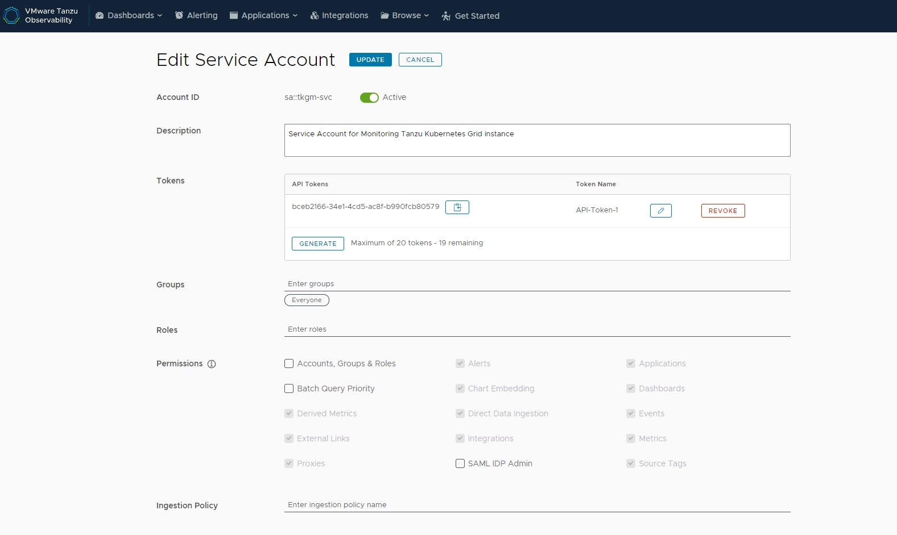

1. To deploy the Tanzu Observability collectors,
  1. Go to the Tanzu Mission Control portal.
  1. Select the cluster to enable.
  1. Click **Actions**.
  1. From the dropdown list, select **Tanzu Observability** and click **Add**.

     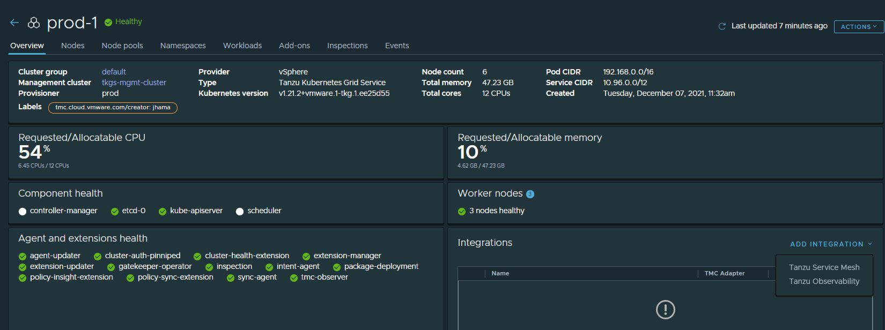

  1. Click **Setup New Credentials**.

     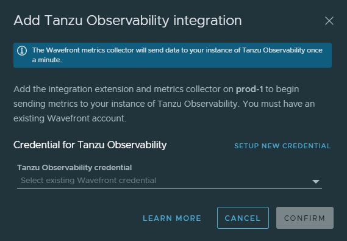

  1. Enter the Tanzu Observability URL and API token and click **Confirm**.

     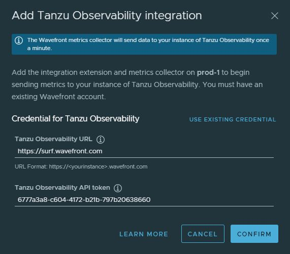

     Tanzu Mission Control installs an extension on your cluster to collect data from the cluster and send it to your Wavefront account in one-minute intervals.

     In about five minutes, the Tanzu Observability status on your cluster displays as **OK**.

     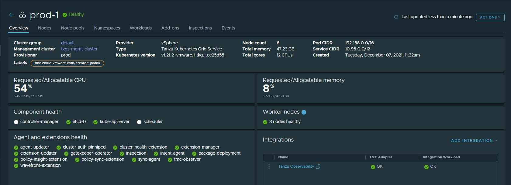

1. Log in to the Tanzu Observability portal to view the metrics collection for the cluster.

  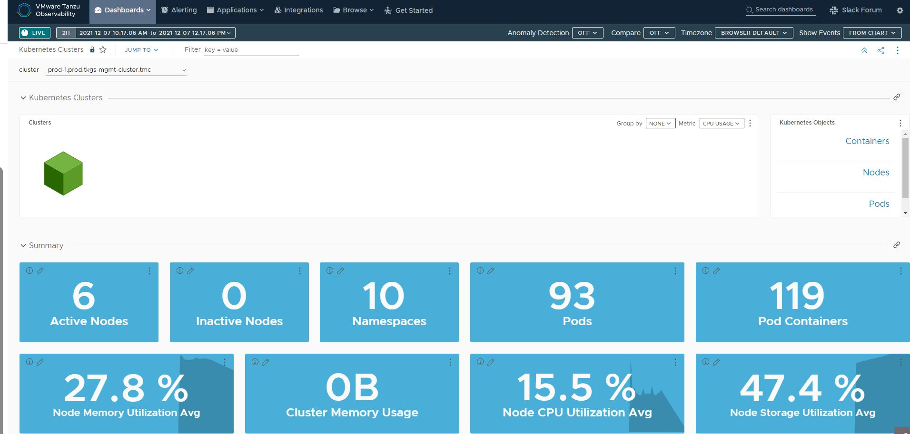

For additional product documentation, see [Enable Observability for Your Organization](https://docs.vmware.com/en/VMware-Tanzu-Mission-Control/services/tanzumc-using/GUID-E448F0BD-1DAB-4AAE-851D-0501CB3AA7AE.html).  

### Tanzu Service Mesh

VMware Tanzu Service Mesh (TSM) is an enterprise-class service mesh solution that provides consistent control and security for microservices, end users, and data across all your clusters and clouds in the most demanding multi-cluster and multi-cloud environments.

Do the following to enable Tanzu Service Mesh and add Tanzu Kubernetes Grid clusters:

1. Log in to the Tanzu Mission Control console and verify that the Tanzu Service Mesh is enabled on your org.  If it is not enabled, enable it by navigating to **Administration > Integrations**.

  

1. Navigate to the cluster you want to integrate with Tanzu Service Mesh.

1. On the cluster detail **Overview** page, click **Add Integrations > Tanzu Service Mesh > Add**.

  

1. Select **Enable Tanzu Service Mesh on all namespaces**.

1. If there are specific namespaces that you want to exclude, select the **Exclude namespaces...** and choose namespaces to add to the exclusion list.

  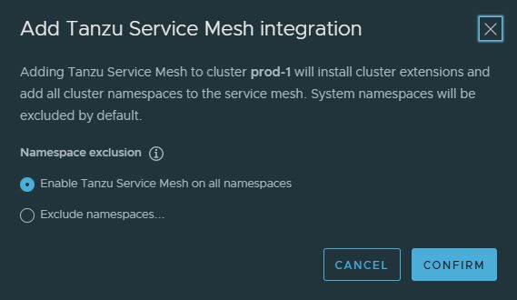

1. Click **Confirm**.

1. Log in to Tanzu Service Mesh to check the status of the installation.

  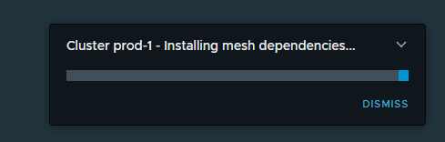

1. After the Tanzu Service Mesh extension is installed, you can access the Tanzu Service Mesh console through the **Integrations** tile on **the Overview** tab of the cluster in the Tanzu Mission Control console.

  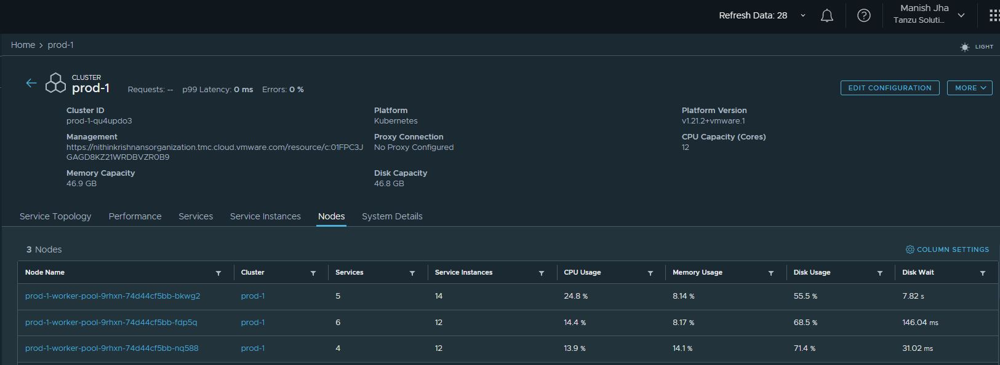

## <a id=deploy-user-managed-packages> </a> Deploy User-Managed Packages on Tanzu Kubernetes Grid Clusters

This section provides the steps for installing user-managed packages in a Tanzu Kubernetes (workload) cluster created by the Tanzu Kubernetes Grid Service.

Before you install user-managed packages on a workload cluster, ensure the following:

*   A vSphere 7.0 U2 (or later) workload cluster created by using Tanzu Kubernetes Grid Service.
*   A bootstrap machine with the following installed:

  - [Kubernetes CLI Tools for vSphere](https://docs.vmware.com/en/VMware-vSphere/7.0/vmware-vsphere-with-tanzu/GUID-0F6E45C4-3CB1-4562-9370-686668519FCA.html)
  - [Tanzu CLI v1.4 or later](https://docs.vmware.com/en/VMware-Tanzu-Kubernetes-Grid/1.4/vmware-tanzu-kubernetes-grid-14/GUID-install-cli.html)

The following steps describe the workflow for installing the user-managed packages:

1. Add the Supervisor Cluster as a management cluster to Tanzu CLI by running the following commands:

  `kubectl vsphere login --server=<Supervisor Cluster VIP> --vsphere-username USERNAME --insecure-skip-tls-verify`

  `kubectl config use-context <Supervisor VIP>`

  `tanzu login --kubeconfig ~/.kube/config --context <SUPERVISOR-VIP>`

1. Prepare the workload cluster for installing the user-managed packages.

   1. Change context to the workload cluster by running commands similar to the following:

      `kubectl vsphere login --vsphere-username=administrator@vsphere.local --server=<Supervisor Cluster VIP> --insecure-skip-tls-verify --tanzu-kubernetes-cluster-name=WORKLOAD-CLUSTER-NAME --tanzu-kubernetes-cluster-namespace WORKLOAD-CLUSTER-NAMESPACE`

      `kubectl config use-context WORKLOAD-CLUSTER-NAME`

   1. Check if a default storage class is defined.

      `kubectl get storageclass`

   1. If no default storage class is listed, edit the Tanzu Kubernetes Cluster and specify the same.

      `kubectl config use-context <Supervisor VIP>`

      `kubectl edit tkc <workload-cluster>`

      Locate the lines that read `topology: controlPlane` and add the storage policy above that as shown in the following sample screen capture.

      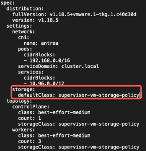

1. Create cluster role bindings for installing the user-managed packages.

  By default, the newly created workload cluster does not have a cluster role binding that grants access to authenticated users to install packages using the default PSP `vmware-system-privileged`.

   1. Create a role binding deployment YAML as follows:
      ``` yaml
      kind: ClusterRoleBinding
      apiVersion: rbac.authorization.k8s.io/v1
      metadata:
          name: tkgs-rbac
      roleRef:
          kind: ClusterRole
          name: psp:vmware-system-privileged
          apiGroup: rbac.authorization.k8s.io
      subjects:
        - kind: Group
          apiGroup: rbac.authorization.k8s.io
          name: system:authenticated    
      ```

  1. Apply role binding.

      `kubectl apply -f rbac.yaml`

      You will see the following output, which indicates that the command is successfully executed.

      `clusterrolebinding.rbac.authorization.k8s.io/tkgs-rbac created`

      The value `tkgs-rbac` is just a name. It can be replaced with a name of your choice.

1. Install [kapp-controller](https://carvel.dev/kapp-controller/).

   1. Create a file kapp-controller.yaml containing the [Kapp Controller Manifest](https://docs.vmware.com/en/VMware-Tanzu-Kubernetes-Grid/1.4/vmware-tanzu-kubernetes-grid-14/GUID-packages-prep-tkgs-kapp.html) code.

   1. Apply the kapp-controller.yaml file to the workload cluster

      `kubectl apply -f kapp-controller.yaml`

   1. Verify that kapp-controller pods are created in the tkg-system namespace and are in a running state.

      `kubectl get pods -n tkg-system | grep kapp-controller`

1. Add the standard packages repository to the Tanzu CLI.

   1. Add tanzu package repository

      `tanzu package repository add tkgs-repo --url projects.registry.vmware.com/tkg/packages/standard/repo:v1.4.0 -n tanzu-package-repo-global`

   1. Verify that the package repository has been added and Reconciliation is successful.

      `tanzu package repository list -A`

      If the repository is successfully added, the status reads as `Reconcile succeeded`.

1. [Install Cert Manager](https://docs.vmware.com/en/VMware-Tanzu-Kubernetes-Grid/1.4/vmware-tanzu-kubernetes-grid-14/GUID-packages-cert-manager.html).

1. [Install Contour](https://docs.vmware.com/en/VMware-Tanzu-Kubernetes-Grid/1.4/vmware-tanzu-kubernetes-grid-14/GUID-packages-ingress-contour.html).

1. [Install Prometheus and Grafana](https://docs.vmware.com/en/VMware-Tanzu-Kubernetes-Grid/1.4/vmware-tanzu-kubernetes-grid-14/GUID-packages-monitoring.html).

1. [Install Harbor Registry](https://docs.vmware.com/en/VMware-Tanzu-Kubernetes-Grid/1.4/vmware-tanzu-kubernetes-grid-14/GUID-packages-harbor-registry.html).

## Troubleshooting

### The Supervisor Cluster does not come online

The Supervisor Cluster (SV) provisioning process is orchestrated by vCenter itself.
When one creates a new SV from the Workload Management pane, the `wcp` service
in the vCenter appliance initiates a workflow that confirms credentials, uses
the ESX Agent Manager to provision the control plane VMs, and monitors the
configuration of Kubernetes components within the control plane as well as the
creation of any load balancer VIPs assigned to the cluster.

Unfortunately, the UI does not provide a view into this process. To see and
troubleshoot this process for yourself, you will need to SSH into the vCenter
appliance and watch the following logs:

- `/var/log/vmware/wcp/wcpsvc.log`
- `/var/log/vmware/vpxd/vpxd.log`.

If you are using Avi as your load balancer, you can also view the log files
within `/opt/avi/log` to view information about Service Engine provisioning and
VIP assignment.

Common causes for the SV not coming up are:

- Lack of resources within the vSphere cluster into which SV control plane VMs
  are getting placed
- Incorrect Avi credentials or certificate
- An invalid IPAM profile was provided to the Avi Service Engine group
- Firewall preventing TCP/6443 within the management cluster network from being
  reachable within the Cluster VIP or Avi networks.
