# Deploy Tanzu for Kubernetes Operations using vSphere with Tanzu

This document outlines the steps for deploying Tanzu for Kubernetes Operations using vSphere with Tanzu in a vSphere environment backed by a Virtual Distributed Switch (VDS) and leveraging NSX Advanced Load Balancer (ALB) for L4/L7 load balancing & ingress.

The scope of the document is limited to providing deployment steps based on the reference design in [VMware Tanzu for Kubernetes Operations using vSphere with Tanzu Reference Design](../reference-designs/tko-on-vsphere-with-tanzu.md). This document does not cover any deployment procedures for the underlying SDDC components.

## Prerequisites

Before deploying Tanzu Kubernetes operations using vSphere with Tanzu on vSphere networking, ensure that your environment is set up as described in the following:

*   [General Requirements](#general-requirements)
*   [Network Requirements](#network-requirements)
*   [Firewall Requirements](#firewall-requirements)
*   [Resource Pools](#resource-pools)

### <a id=general-requirements> </a> General Requirements

Ensure that your environment has the following general requirements:

- vSphere 7.0 u3 instance with an Enterprise Plus license.
- Your vSphere environment has the following objects in place:
  - A vSphere cluster with at least 3 hosts, on which vSphere HA & DRS is enabled. If you are using vSAN for shared storage, it is recommended that you use 4 ESXi hosts.
  - A distributed switch with port groups for TKO components. Please refer to the [Network Requirements](#network-requirements) section for the required port groups.
  - All ESXi hosts of the cluster on which vSphere with Tanzu will be enabled should be part of the distributed switch.
  - Dedicated resource pools and VM folder for collecting NSX Advanced Load Balancer VMs.
  - A shared datastore with sufficient capacity for the control plane and worker node VM files.
- Network Time Protocol (NTP) service running on all hosts and vCenter.
- A user account with **Modify cluster-wide configuration** permissions.
- NSX Advanced Load Balancer 20.1.7 ova downloaded from [customer connect](https://customerconnect.vmware.com/home?bmctx=89E60DF848C641FD518EB9F6B9A6E5334F602FA3A762B409625CD531863AC847&contextType=external&username=string&password=secure_string&challenge_url=https:%2F%2Fcustomerconnect.vmware.com%2Fhome&request_id=-7975651889850440054&authn_try_count=0&locale=en_GB&resource_url=https%253A%252F%252Fcustomerconnect.vmware.com%252Fweb%252Fvmware%252Fchecksession) portal and readily available for deployment. <!-- markdown-link-check-disable-line -->

For additional information on general prerequisites, please refer to vSphere with Tanzu product [documentation](https://docs.vmware.com/en/VMware-vSphere/7.0/vmware-vsphere-with-tanzu/GUID-EE236215-DA4D-4579-8BEB-A693D1882C77.html)

### <a id=network-requirements> </a> Network Requirements

The following table provides example entries for the required port groups. Create network entries with the port group name, VLAN ID, and CIDRs that are specific to your environment.

| Network Type                 | DHCP Service              | Description & Recommendations            |
| ---------------------------- | ------------------------- | --------------------------------------------------------------------------------------------------------------------------------------------------------------------------------------------------------------------------------------------------------------- |
| NSX ALB Management Network   | Optional                  | NSX ALB controllers and SEs will be attached to this network. <br> Use static IPs for the NSX ALB controllers. <br> The Service Engine’s management network can obtain IP from DHCP.                                                                                  |
| TKG Management Network       | IP Pool/DHCP can be used. | Supervisor Cluster nodes will be attached to this network. <br> When an IP Pool is used, ensure that the block has 5 consecutive free IPs.                                                                                                                          |
| TKG Workload Network         | IP Pool/DHCP can be used. | Control plane and worker nodes of TKG Workload Clusters will be attached to this network                                                                                                                                                                        |
| TKG Cluster VIP/Data Network | No                        | Virtual services for Control plane HA of all TKG clusters (Supervisor and Workload). <br>Reserve sufficient IPs depending on the number of TKG clusters planned to be deployed in the environment, NSX ALB handles IP address management on this network via IPAM. |

This document uses the following port groups, subnet CIDR’s and VLANs. Replace these with values that are specific to your environment.

| Network Type               | Port Group Name | VLAN | Gateway CIDR   | DHCP Enabled | IP Pool for SE/VIP in NSX ALB       |
| -------------------------- | --------------- | ---- | -------------- | ------------ | ----------------------------------- |
| NSX ALB Management Network | NSX-ALB-Mgmt    | 1680 | 172.16.80.1/27 | No           | 172.16.80.6 - 172.16.80.30         |
| TKG Management Network     | TKG-Management  | 1681 | 172.16.81.1/27 | Yes          | No                                  |
| TKG Workload Network01     | TKG-Workload    | 1682 | 172.16.82.1/24 | Yes          | No                                  |
| TKG VIP Network            | TKG-Cluster-VIP | 1683 | 172.16.83.1/26 | No           | 172.16.83.2 - 172.16.83.62|

### <a id=firewall-requirements> </a> Firewall Requirements

Ensure that the firewall is set up as described in [Firewall Recommendations](../reference-designs/tko-on-vsphere-with-tanzu.md/#firewall-requirements).

### <a id=resource-pools> </a>Resource Pools

Ensure that resource pools and folders are created in vCenter. The following table shows a sample entry for the resource pool and folder. Customize the resource pool and folder name for your environment.

| Resource Type      | Resource Pool name | Sample Folder name |
| ------------------ | ------------------ | ------------------ |
| NSX ALB Components | NSX-ALB            | NSX-ALB-VMS        |

## Deployment Overview

The following are the high-level steps for deploying Tanzu Kubernetes operations on vSphere networking backed by VDS:

1.  [Deploy and Configure NSX Advanced Load Balancer](#config-nsxalb)
2.  [Deploy Tanzu Kubernetes Grid Supervisor Cluster](#deployTKGS)
3.  [Create and Configure vSphere Namespaces](#create-namespace)
4.  [Register Supervisor Cluster with Tanzu Mission Control](#integrate-supervisor-tmc)
5.  [Deploy Tanzu Kubernetes Clusters (Workload Clusters)](#deploy-workload-cluster)
6.  [Integrate Tanzu Kubernetes Clusters with Tanzu Observability](#integrate-to)
7.  [Integrate Tanzu Kubernetes Clusters with Tanzu Service Mesh](#integrate-tsm)
8.  [Deploy User-Managed Packages on Tanzu Kubernetes Grid Clusters](#deploy-user-managed-packages)

## <a id="config-nsxalb"> </a> Deploy and Configure NSX Advanced Load Balancer

NSX Advanced Load Balancer is an enterprise-grade integrated load balancer that provides L4- L7 load balancer support. We recommended deploying NSX Advanced Load Balancer for vSphere deployments without NSX-T, or when there are unique scaling requirements.

NSX Advanced Load Balancer is deployed in write access mode in the vSphere environment. This mode grants NSX Advanced Load Balancer Controllers full write access to the vCenter. Full write access allows automatically creating, modifying, and removing Service Engines and other resources as needed to adapt to changing traffic needs.

For a production-grade deployment, we recommend deploying three instances of the NSX Advanced Load Balancer Controller for high availability and resiliency.

The following table provides a sample IP address and FQDN set for the NSX Advanced Load Balancer controllers:

<!-- /* cSpell:disable */ -->

| Controller Node    | IP Address   | FQDN                   |
| ------------------ | ------------ | ---------------------- |
| Node01 (Primary)   | 172.16.80.3 | alb01.tanzu.lab |
| Node02 (Secondary) | 172.16.80.4 | alb02.tanzu.lab |
| Node03 (Secondary) | 172.16.80.5 | alb03.tanzu.lab |
| Controller Cluster | 172.16.80.2 | alb.tanzu.lab   |

<!-- /* cSpell:enable */ -->

### Deploy NSX Advance Load Balancer Controller Node

Do the following to deploy NSX Advanced Load Balancer Controller node:

1.  Log in to the vCenter Server by using the vSphere Client.
2.  Select the cluster where you want to deploy the NSX Advanced Load Balancer controller node.
3.  Right-click on the cluster and invoke the Deploy OVF Template wizard.
4.  Follow the wizard to configure the following:

   - VM Name and Folder Location.
   - Select the NSX-ALB resource pool as a compute resource.
   - Select the datastore for the controller node deployment.
   - Select the NSX-ALB-Mgmt port group for the Management Network.
   - Customize the configuration by providing Management Interface IP Address, Subnet Mask, and Default Gateway. The rest of the fields are optional and can be left blank.

   The following example shows the final configuration of the NSX Advanced Load Balancer Controller node.

   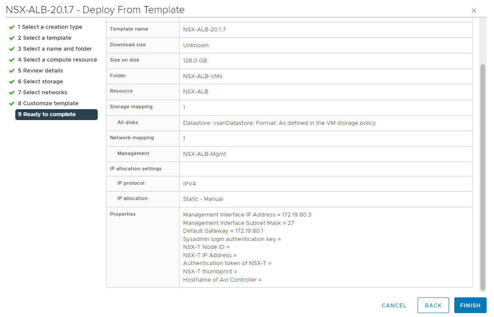

 For more information, see the product documentation [Deploy the Controller](https://docs.vmware.com/en/VMware-vSphere/7.0/vmware-vsphere-with-tanzu/GUID-CBA041AB-DC1D-4EEC-8047-184F2CF2FE0F.html).

### Configure the Controller Node for your vSphere with Tanzu Environment

After the Controller VM is deployed and powered-on, configure the Controller VM for your vSphere with Tanzu environment. The Controller requires several post-deployment configuration parameters.

On a browser, go to https://<https://<alb-ctlr01.tanzu.lab>/.

1. Configure an **Administrator Account** by setting up a password and optionally, an email address.

  

2. Configure **System Settings** by specifying the backup passphrase and DNS information.

  

3. (Optional) Configure **Email/SMTP**.

  

4. Configure Multi-Tenant settings as follows:

   - IP Route Domain: Share IP route domain across tenants.
   - Service Engine Context: Service Engines are managed within the tenant context, not shared across tenants.

   

5. Click on the Save button to finish the post-deployment configuration wizard.

   If you did not select the Setup Cloud After option before saving, the initial configuration wizard exits. The Cloud configuration window does not automatically launch and you are directed to a Dashboard view on the controller.

### Configure Default-Cloud

1. Navigate to **Infrastructure > Clouds** and edit **Default-Cloud**.

  

2. Select **VMware vCenter/vSphere ESX** as the infrastructure type and click **Next**.

  

3. Under the Infrastructure tab, configure the following:

  - vCenter Address: vCenter IP address or fqdn.
  - vCenter Credentials: Username/password of the vCenter account to use for NSX ALB integration.
  - Access Permission: Write


4. Configure the Data Center settings.

   - Select the vSphere **Data Center** where you want to enable **Workload Management**.
   - Select the Default Network IP Address Management mode.

      - Select **DHCP Enabled** if DHCP is available on the vSphere port groups.
      - Leave the option unselected if you want the Service Engine interfaces to use only static IP addresses. You can configure them individually for each network.

   - For Virtual Service Placement, Unselect **Prefer Static Routes vs Directly Connected Network***

    

1. Configure the **Network** settings as follows:

   - Select the NSX ALB **Management Network**. This network interface is used by the Service Engines to connect with the Controller.
   - Leave the **Template Service Engine Group** empty.
   - **Management Network IP Address Management**: Select **DHCP Enabled** if DHCP is available on the vSphere port groups.
   - If DHCP is not available, enter the **IP Subnet**, IP address range (**Add Static IP Address Pool**), **Default Gateway** for the Management Network.

   

1. Ensure that the health of the Default-Cloud is green post configuration.

   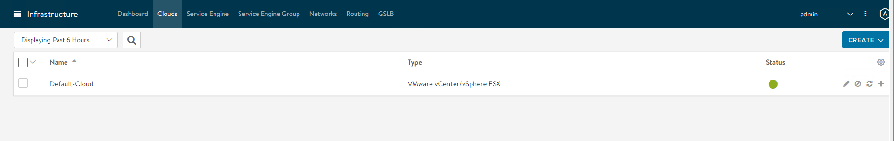

## Configure Licensing.

  Tanzu for Kubernetes Operations requires an NSX Advanced Load Balancer Enterprise license. To configure licensing, navigate to the **Administration > Settings > Licensing** and apply the license key. If you have a license file instead of a license key, click the **Upload from Computer** link.

  

  

### Configure NTP Settings

  Configure NTP settings if you want to use an internal NTP server.

  - Navigate to the **Administration > Settings > DNS/NTP** page.

    

  - Edit the settings using the pencil icon to specify the NTP server that you want to use and save the settings.

    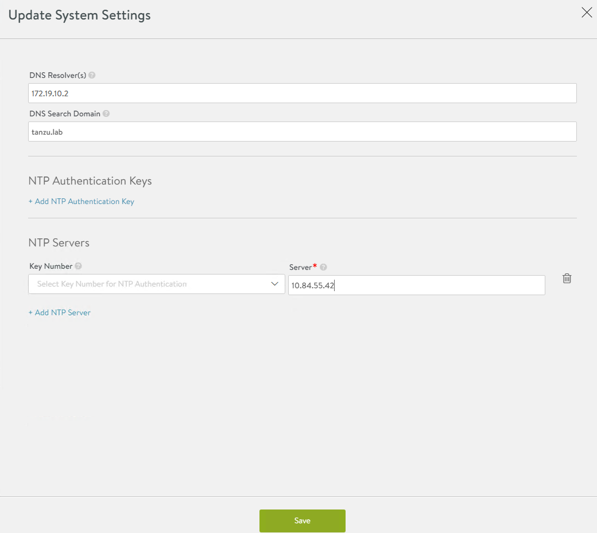

  - Click **Save** to save the settings.

### Deploy NSX Advanced Load Balancer Controller Cluster

In a production environment, we recommended that you deploy additional controller nodes and configure the controller cluster for high availability and disaster recovery.

To run a three node controller cluster, you deploy the first node and perform the initial configuration, and set the Cluster IP. After that, you deploy and power on two more Controller VMs. However, do not run the initial configuration wizard or change the administrator password for the two additional Controllers VMs. The configuration of the first Controller VM is assigned to the two new Controller VMs.

To configure the Controller cluster,

1. Navigate to **Administration > Controller**

1. Select **Nodes** and click **Edit**.

1. Specify a name for the controller cluster and set the Cluster IP. This IP address should be from the NSX Advanced Load Balancer management network.

   

4. In **Cluster Nodes**, specify the IP addresses of the two additional controllers that you have deployed.

   Leave the name and password fields empty.

   

1. Click **Save**.

The Controller cluster setup starts. The Controller nodes are rebooted in the process. It takes approximately 10-15 minutes for cluster formation to complete.

You are automatically logged out of the controller node you are currently logged in. Enter the cluster IP in a browser to see the cluster formation task details.

   

The first controller of the cluster receives the "Leader" role. The second and third controllers will work as "Follower".

   

After the Controller cluster is deployed, use the Controller cluster IP for doing any additional configuration. Do not use the individual Controller node IP.

For additional product documentation, see [Deploy a Controller Cluster](https://docs.vmware.com/en/VMware-vSphere/7.0/vmware-vsphere-with-tanzu/GUID-A51FAF35-D604-4883-A93D-58463B404C4E.html).

### Change NSX Advanced Load Balancer Portal Default Certificate

The Controller must send a certificate to clients to establish secure communication. This certificate must have a Subject Alternative Name (SAN) that matches the NSX Advanced Load Balancer Controller cluster hostname or IP address.

The Controller has a default self-signed certificate. But this certificate does not have the correct SAN. You must replace it with a valid or self-signed certificate that has the correct SAN. You can create a self-signed certificate or upload a CA-signed certificate.

**Note -** This document makes use of a self-signed certificate.

1. To replace the default certificate,

  - Navigate to the **Templates > Security > SSL/TLS Certificate >** and Click on the **Create** button and select **Controller Certificate**.

   

  - The **New Certificate (SSL/TLS)** window appears. Enter a name for the certificate.

  - To add a self-signed certificate, for **Type** select **Self Signed** and Enter the following details:

    - Common Name: Specify the fully-qualified name of the site. For the site to be considered trusted, this entry must match the hostname that the client entered in the browser.

    - Subject Alternate Name (SAN): Enter the cluster IP address or FQDN of the Controller cluster and all controller nodes.

    - Algorithm: Select either EC or RSA.

    - Key Size

  - Click **Save**.

    

2. Change the NSX Advanced Load Balancer portal certificate.

   - Navigate to the **Administration > Settings > Access Settings**.

   - Clicking the pencil icon to edit the access settings.

   - Verify that **Allow Basic Authentication** is enabled.

   - From **SSL/TLS Certificate**, remove the existing default portal certificates

   - From the drop-down list, select the newly created certificate

   - Click **Save**.

   

For additional product documentation, see [Assign a Certificate to the Controller](https://docs.vmware.com/en/VMware-vSphere/7.0/vmware-vsphere-with-tanzu/GUID-9435390C-E04C-43E7-B87F-910453AED797.html).

### Export NSX Advanced Load Balancer certificate

You need the newly created certificate when you configure the Supervisor Cluster to enable **Workload Management**.

To export the certificate, navigate to the **Templates > Security > SSL/TLS Certificate** page and export the certificate by clicking on the export button.

In the **Export Certificate** page that appears, click **Copy to clipboard** against the certificate. Do not copy the key. Save the copied certificate for later use when you enable workload management.

### Configure a Service Engine Group

vSphere with Tanzu uses the Default Service Engine Group. Ensure that the HA mode for the default-Group is set to N + M (buffer).

Optionally, you can reconfigure the Default-Group to define the placement and number of Service Engine VMs settings.

This document uses the Default Service Engine Group as is.

For more information, see the product documentation [Configure a Service Engine Group](https://docs.vmware.com/en/VMware-vSphere/7.0/vmware-vsphere-with-tanzu/GUID-14A98969-3115-45AC-9F0D-AA5A8EA6E16D.html).

### <a id=config-vip> </a> Configure a Virtual IP Subnet for the Data Network

You can configure the virtual IP (VIP) range to use when a virtual service is placed on the specific VIP network. You can configure DHCP for the Service Engines.

Optionally, if DHCP is unavailable, you can configure a pool of IP addresses to assign to the Service Engine interface on that network.

This document uses an IP pool for the VIP network.

To configure the VIP network,

1. Navigate to **Infrastructure > Networks** and locate the network that provides the virtual IP addresses.

1. Click the edit icon to edit the network settings.

1. Click **Add Subnet**.

1. In **IP Subnet**, specify the VIP network subnet CIDR.

1. Click **Add Static IP Address Pool** to specify the IP address pool for the VIPs and Service Engine. The range must be a subset of the network CIDR configured in **IP Subnet**.

   

1. Click **Save** to close the VIP network configuration wizard.

For more information, see the product documentation [Configure a Virtual IP Network](https://docs.vmware.com/en/VMware-vSphere/7.0/vmware-vsphere-with-tanzu/GUID-29ACB562-2E80-4C28-AE63-8EB9DAF1A67F.html).

### Configure Default Gateway

A default gateway enables the Service Engine to route traffic to the pool servers on the Workload Network. You must configure the VIP Network gateway IP as the default gateway.

To configure the Default gateway,

1. Navigate to **Infrastructure > Routing > Static Route**.

1. Click **Create**.

  

1. In **Gateway Subnet**, enter 0.0.0.0/0.

1. In **Next Hop**, enter the gateway IP address of the VIP network.

1. Click **Save**.

  

For additional product documentation, see [Configure Default Gateway](https://docs.vmware.com/en/VMware-vSphere/7.0/vmware-vsphere-with-tanzu/GUID-AB96BE48-D5B3-4B88-A92E-5A083472C56D.html)

### Configure IPAM

IPAM is required to allocate virtual IP addresses when virtual services get created. Configure IPAM for the NSX Advanced Load Balancer Controller and assign it to the Default-Cloud.

1. Navigate to the **Templates > Profiles > IPAM/DNS Profiles**.

1. Click **Create** and select **IPAM Profile** from the drop-down menu.

  

1. Enter the following to configure the IPAM profile:  

   - A name for the IPAM Profile.
   - Select type as **AVI Vantage IPAM**.
   - Deselect the **Allocate IP in VRF** option.

1. Click **Add Usable Network**.

   - Select **Default-Cloud**.
   - Choose the VIP network that you have created in [Configure a Virtual IP Subnet for the Data Network](#config-vip).

   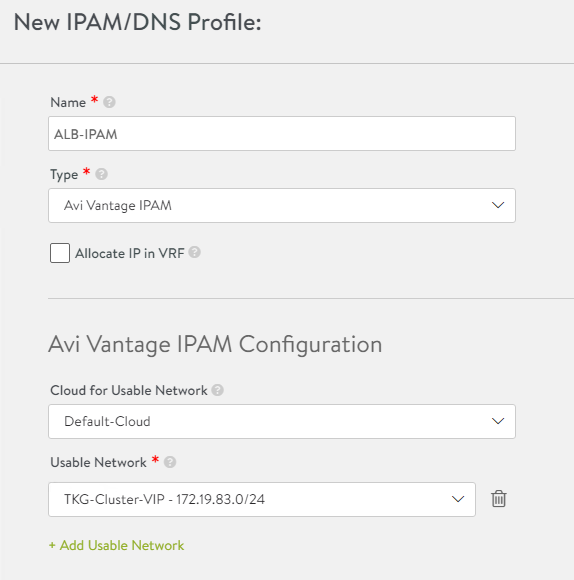

1. Click **Save**.

1. Assign the IPAM profile to the Default-Cloud configuration.
    - Navigate to the **Infrastructure > Cloud**
    - Edit the **Default-Cloud** configuration as follows:
       -  **IPAM Profile**: Select the newly created profile.
    - Click **Save**

   

1. Verify that the status of the Default-Cloud configuration is green.

For additional product documentation, see [Configure IPAM](https://docs.vmware.com/en/VMware-vSphere/7.0/vmware-vsphere-with-tanzu/GUID-6ECC7035-BC0C-4197-A3DF-E92365A95A9F.html).

## <a id=deployTKGS> </a> Deploy Tanzu Kubernetes Grid Supervisor Cluster

As a vSphere administrator, you enable a vSphere cluster for Workload Management by creating a Supervisor Cluster. After you deploy the Supervisor Cluster, you can use the vSphere Client to manage and monitor the cluster.

Before deploying the Supervisor Cluster, ensure the following:

*   You have created a vSphere cluster with at least three ESXi hosts. If you are using vSAN you need a minimum of four ESXi hosts.
*   The vSphere cluster is configured with shared storage such as vSAN.
*   The vSphere cluster has HA & DRS enabled and DRS is configured in the fully-automated mode.
*   The required port groups have been created on the distributed switch to provide networking to the Supervisor and workload clusters.
*   Your vSphere cluster is licensed for Supervisor Cluster deployment.
*   You have created a [Subscribed Content Library](https://docs.vmware.com/en/VMware-vSphere/7.0/vmware-vsphere-with-tanzu/GUID-209AAB32-B2ED-4CDF-AE62-B0FAD9D34C2F.html) to automatically pull the latest Tanzu Kubernetes releases from the VMware repository.
*   You have created a [storage policy](https://docs.vmware.com/en/VMware-vSphere/7.0/vmware-vsphere-with-tanzu/GUID-544286A2-A403-4CA5-9C73-8EFF261545E7.html) that will determine the datastore placement of the Kubernetes control plane VMs, containers, and images.
* A user account with **Modify cluster-wide configuration** permissions is available.
* NSX Advanced Load Balancer is deployed and configured as per instructions provided earlier.

To deploy the Supervisor Cluster,

1. Log in to the vSphere client and navigate to **Menu > Workload Management** and click **Get Started**.

  

2. Select the vCenter Server and Networking stack.

   - Select a vCenter server system.
   - Select **vSphere Distributed Switch (VDS)** for the networking stack.

   

3. Select a cluster from the list of compatible clusters and click **Next**.

   

4. Select the **Control Plane Storage Policy** for the nodes from the drop-down menu and click **Next**.

   

5. On the **Load Balancer** screen, select **Load Balancer Type** as **NSX Advanced Load Balancer** and provide the following details:

   - **Name**: Friendly name for the load balancer. Only small letters are supported in the name field.

   - **NSX Advanced Load Balancer Controller IP**: If the NSX Advanced Load Balancer self-signed certificate is configured with the hostname in the SAN field, use the same hostname here. If the SAN is configured with an IP address, provide the Controller cluster IP address. The default port of NSX Advanced Load Balancer is 443.

   - **NSX Advanced Load Balancer Credentials**: Provide the NSX Advanced Load Balancer administrator credentials.

   - **Server Certificate**: Use the content of the Controller certificate that you exported earlier while configuring certificates for the Controller.

      

6. On **Management Network** screen,

   - select the port group that you created on the distributed switch.

   - If DHCP is enabled for the port group, set the **Network Mode** to **DHCP**.

    Ensure that the DHCP server is configured to hand over DNS server address, DNS search domain, and NTP server address via DHCP.

    

 7. On the **Workload Network** screen,

    - Select the network that will handle the networking traffic for Kubernetes workloads running on the Supervisor Cluster

    - Set the IP mode to DHCP if the port group is configured for DHCP.

     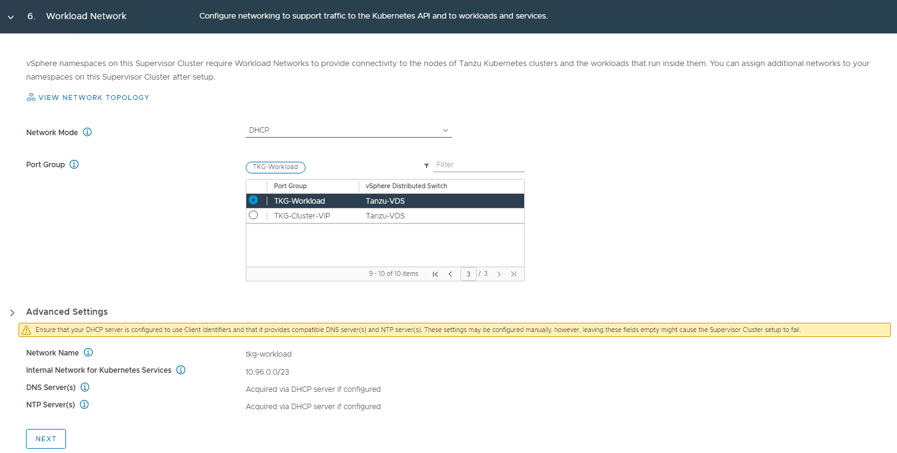

8. On the **Tanzu Kubernetes Grid Service** screen, select the subscribed content library that contains the Kubernetes images released by VMware.

     

9. On the **Review and Confirm** screen, select the size for the Kubernetes control plane VMs that are created on each host from the cluster. For production deployments, we recommend a large form factor.

1. Click **Finish**. This triggers the Supervisor Cluster deployment.

     

The Workload Management task takes approximately 30 minutes to complete. After the task completes, three Kubernetes control plane VMs are created on the hosts that are part of the vSphere cluster.

The Supervisor Cluster gets an IP address from the VIP network that you configured in the NSX Advanced Load Balancer. This IP address is also called the Control Plane HA IP address.


In the backend, three supervisor Control Plane VMs are deployed in the vSphere namespace. A Virtual Service is created in the NSX Advanced Load Balancer with three Supervisor Control Plane nodes that are deployed in the process.

For additional product documentation, see [Enable Workload Management with vSphere Networking](https://docs.vmware.com/en/VMware-vSphere/7.0/vmware-vsphere-with-tanzu/GUID-8D7D292B-43E9-4CB8-9E20-E4039B80BF9B.html).

### Download and Install the Kubernetes CLI Tools for vSphere

You can use Kubernetes CLI Tools for vSphere to view and control vSphere with Tanzu namespaces and clusters.

The Kubernetes CLI Tools download package includes two executables: the standard open-source kubectl and the vSphere Plugin for kubectl. The vSphere Plugin for kubectl extends the commands available to kubectl so that you connect to the Supervisor Cluster and to Tanzu Kubernetes clusters using vCenter Single Sign-On credentials.

To download the Kubernetes CLI tool, connect to the URL https://<_control-plane-vip_>/


For additional product documentation, see [Download and Install the Kubernetes CLI Tools for vSphere](https://docs.vmware.com/en/VMware-vSphere/7.0/vmware-vsphere-with-tanzu/GUID-0F6E45C4-3CB1-4562-9370-686668519FCA.html).

### Connect to the Supervisor Cluster

After installing the CLI tool of your choice, connect to the Supervisor Cluster by running the following command:

<!-- /* cSpell:disable */ -->
```
kubectl vsphere login --vsphere-username=administrator@vsphere.local --server=<control-plane-vip>
```
<!-- /* cSpell:enable */ -->

The command prompts for the vSphere administrator password.

After your connection to the Supervisor Cluster is established you can switch to the Supervisor context by running the command:

<!-- /* cSpell:disable */ -->
```
kubectl config use-context <supervisor-context-name>
```
<!-- /* cSpell:enable */ -->

Where, the `<supervisor-context-name>` is the IP address of the control plane VIP.

## <a id=create-namespace> </a> Create and Configure vSphere Namespaces

A vSphere Namespace is a tenancy boundary within vSphere with Tanzu and allows for sharing vSphere resources (computer, networking, storage) and enforcing resources limits with the underlying objects such as Tanzu Kubernetes Clusters. It also allows you to attach policies and permissions.

Every workload cluster that you deploy runs in a Supervisor namespace. To learn more about namespaces, please refer to the vSphere with Tanzu [documentation](https://docs.vmware.com/en/VMware-vSphere/7.0/vmware-vsphere-with-tanzu/GUID-1544C9FE-0B23-434E-B823-C59EFC2F7309.html)

To create a new Supervisor namespace,

1. Log in to the vSphere Client.

2. Navigate to **Home > Workload Management > Namespaces**.

3. Click **Create Namespace**.

  

4. Select the **Cluster** that is enabled for **Workload Management**.

5. Enter a name for the namespace and select the workload network for the namespace.

   **Note:** The **Name** field accepts only lower case letters and hyphens.

1. Click **Create**.

	The namespace is created on the Supervisor Cluster.

   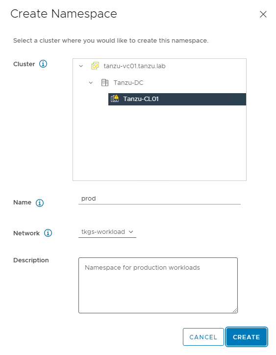

For additional product documentation, see [Create and Configure a vSphere Namespace](https://docs.vmware.com/en/VMware-vSphere/7.0/vmware-vsphere-with-tanzu/GUID-177C23C4-ED81-4ADD-89A2-61654C18201B.html).   

### Configure Permissions for the Namespace

To access a namespace, you have to add permissions to the namespace. To configure permissions, click on the newly created namespace, navigate to the **Summary** tab, and click **Add Permissions**.


Choose the **Identity source**, search for the User/Group that will have access to the namespace, and define the **Role** for the selected User/Group.


### Set Persistent Storage to the Namespace

Certain Kubernetes workloads require persistent storage to store data permanently. Storage policies that you assign to the namespace control how persistent volumes and Tanzu Kubernetes cluster nodes are placed within datastores in the vSphere storage environment.

To assign a storage policy to the namespace, on the **Summary** tab, click **Add Storage**.

From the list of storage policies, select the appropriate storage policy and click **OK**.


After the storage policy is assigned to a namespace, vSphere with Tanzu creates a matching Kubernetes storage class in the vSphere Namespace.

### Specify Namespace Capacity Limits

When initially created, the namespace has unlimited resources within the Supervisor Cluster. The vSphere administrator defines the limits for CPU, memory, storage, as well as the number of Kubernetes objects that can run within the namespace. These limits are configured for each vSphere Namespace.

To configure resource limitations for the namespace, on the **Summary** tab, click **Edit Limits** for **Capacity and Usage**.


The storage limit determines the overall amount of storage that is available to the namespace.

### Associate VM Class with Namespace

The VM class is a VM specification that can be used to request a set of resources for a VM. The VM class defines parameters such as the number of virtual CPUs, memory capacity, and reservation settings.

vSphere with Tanzu includes several default VM classes and each class has two editions: guaranteed and best effort. A guaranteed edition fully reserves the resources that a VM specification requests. A best-effort class edition does not and allows resources to be overcommitted.

More than one VM Class can be associated with a namespace. To learn more about VM classes, please refer to the vSphere with Tanzu [documentation](https://docs.vmware.com/en/VMware-vSphere/7.0/vmware-vsphere-with-tanzu/GUID-7351EEFF-4EF0-468F-A19B-6CEA40983D3D.html)

To add a VM class to a namespace,

1. Click **Add VM Class** for **VM Service.**

   

1. From the list of the VM Classes, select the classes that you want to include in your namespace.

   

   

1. Click **Ok**.  

The namespace is fully configured now. You are ready to register your supervisor cluster with Tanzu Mission Control and deploy your first Tanzu Kubernetes Cluster.

## <a id=integrate-supervisor-tmc> </a> **Register Supervisor Cluster with Tanzu Mission Control**

Tanzu Mission Control is a centralized management platform for consistently operating and securing your Kubernetes infrastructure and modern applications across multiple teams and clouds.

By integrating Supervisor Cluster with Tanzu Mission Control (TMC) you are provided a centralized administrative interface that enables you to manage your global portfolio of Kubernetes clusters. It also allows you to deploy Tanzu Kubernetes clusters directly from Tanzu Mission Control portal and install user-managed packages leveraging the [TMC Catalog](https://docs.vmware.com/en/VMware-Tanzu-Mission-Control/services/tanzumc-using/GUID-EF35646D-8762-41F1-95E5-D2F35ED71BA1.html) feature.

Please follow the steps below to register the supervisor cluster with Tanzu Mission Control.

Please note that this section uses Supervisor Cluster and management cluster terms interchangeably.

**Prerequisites**

There are a few items that need to be configured in advance before attempting to integrate Tanzu Kubernetes grid clusters with TMC.

- A cluster group is created in TMC.

- A workspace has been created in the TMC portal.

- You must create the policies that are appropriate for your TKG deployment.

- Create a provisioner. A provisioner helps you to deploy TKG clusters across multiple/different platforms, such as AWS, VMware vSphere, etc.

1: Login to Tanzu Mission Control console and navigate to **Administration > Management clusters > Register Management Cluster** tab and select vSphere with Tanzu.


2: On the Register management cluster page, provide a name for the management cluster, and choose a cluster group.

You can optionally provide a description and labels for the management cluster.

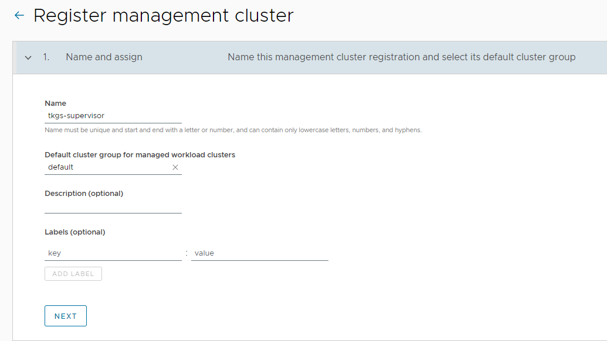

3: If you are using a proxy to connect to the internet, you can configure the proxy settings by toggling the Set proxy option to yes.


4: On the Register page, Tanzu Mission Control generates a YAML file that defines how the management cluster connects to Tanzu Mission Control for registration. The credential provided in the YAML expires after 48 hours.

Copy the URL provided on the Register page. This URL is needed to install the TMC agent on your management cluster and complete the registration process.


5: Login to vSphere Client and select the Cluster which is enabled for Workload Management and navigate to the **Configure > TKG Service > Tanzu Mission Control** tab and enter the registration URL in the box provided and click on the Register button.


When the Supervisor Cluster is registered with Tanzu Mission Control, the TMC agent is installed in the svc-tmc-cXX namespace, which is included with the Supervisor Cluster by default.

Once the tmc agent is installed on the Supervisor cluster and all pods are running in the svc-tmc-cXX namespace, the registration status shows “Installation successful”.


6: Return to the Tanzu Mission Control console and click on the Verify Connection button.

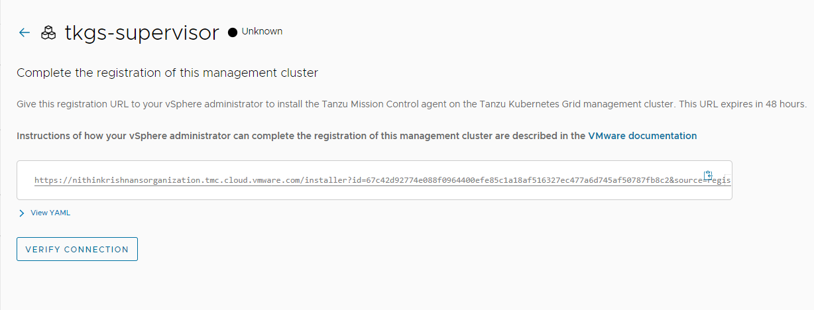

7: Clicking on the View Management Cluster button, takes you to the overview page which displays the health of the cluster and its components.

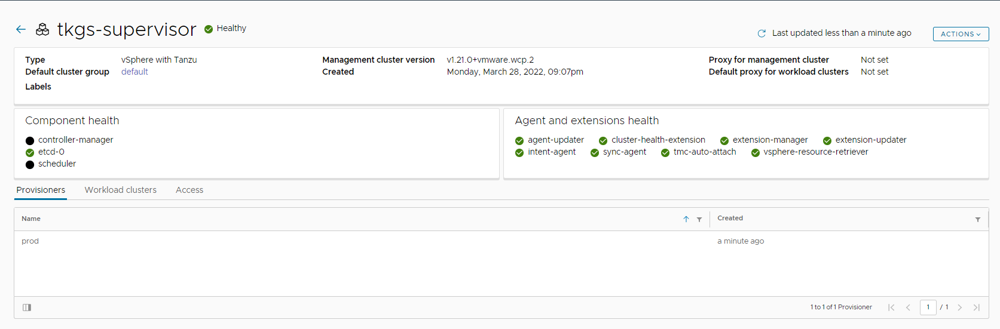

After installing the agent, you can use the Tanzu Mission Control web interface to provision and manage Tanzu Kubernetes clusters.

For additional product documentation, see [Integrate the Tanzu Kubernetes Grid Service on the Supervisor Cluster with Tanzu Mission Control](https://docs.vmware.com/en/VMware-vSphere/7.0/vmware-vsphere-with-tanzu/GUID-ED4417DC-592C-454A-8292-97F93BD76957.html).

## <a id=deploy-workload-cluster> </a>Deploy Tanzu Kubernetes Clusters (Workload Cluster)

After Supervisor Cluster is registered with Tanzu Mission Control, deployment of the Tanzu Kubernetes clusters can be done in just a few clicks. The procedure for creating Tanzu Kubernetes clusters is shown below.

Step 1: Navigate to the Clusters tab and click on the Create Cluster button.


Under the create cluster page, select the Supervisor cluster which you registered in the previous step and click on the continue to create cluster button.

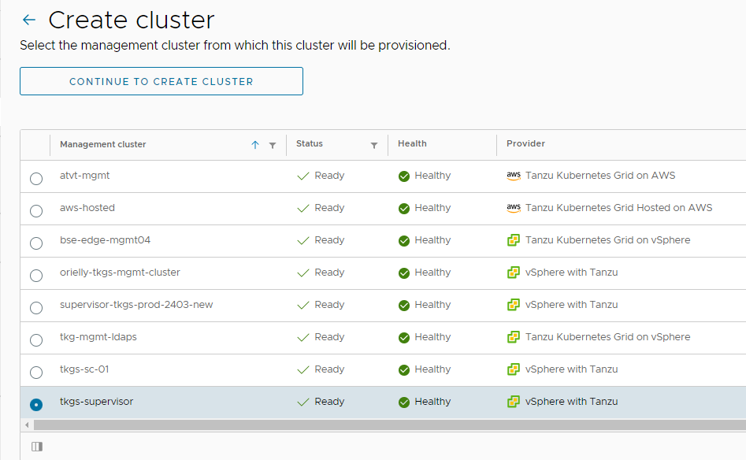

Step 2: Select the provisioner for creating the workload cluster. Provisioner reflects the vSphere namespaces that you have created and associated with the Supervisor cluster.

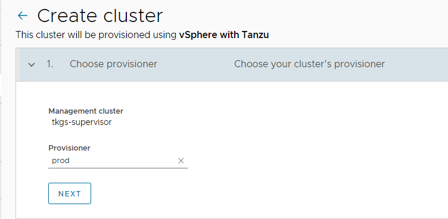

Step 3: Enter a name for the cluster. Cluster names must be unique within an organization.

Select the cluster group to which you want to attach your cluster. You can optionally enter a description and apply labels.


Step 4: On the configure page, specify the following:

- Select the Kubernetes version to use for the cluster. The latest supported version is preselected for you. You can choose the appropriate Kubernetes version by clicking on the down arrow button.

- You can optionally define an alternative CIDR for the pod and service. The Pod CIDR and Service CIDR cannot be changed after the cluster is created.

- You can optionally specify a proxy configuration to use for this cluster.

- You can optionally select the default storage class for the cluster and allowed storage classes. The list of storage classes that you can choose from is taken from your vSphere namespace.

Please note that the scope of this document doesn't cover the use of a proxy for vSphere with Tanzu. If your environment uses a proxy server to connect to the internet, please ensure the proxy configuration object includes the CIDRs for the pod, ingress, and egress from the workload network of the Supervisor Cluster in the **No proxy list**, as described [here](https://docs.vmware.com/en/VMware-Tanzu-Mission-Control/services/tanzumc-using/GUID-B4760775-388A-45B5-A707-2191E9E4F41F.html#GUID-B4760775-388A-45B5-A707-2191E9E4F41F)


Step 5: Select the High Availability mode for the control plane nodes of the workload cluster. For a production deployment, it is recommended to deploy a highly available workload cluster.

You can optionally select a different instance type for the cluster's control plane node and its storage class. Control plane endpoint and API server port options are not customizable here as they will be retrieved from the management cluster.

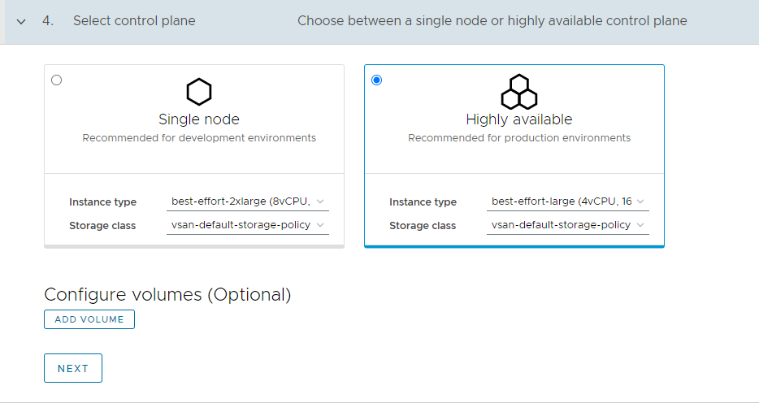

Step 6: You can optionally define the default node pool for your workload cluster.

- Specify the number of worker nodes to provision.
- Select the instance type.

Click on the Create Cluster button to start provisioning your workload cluster.

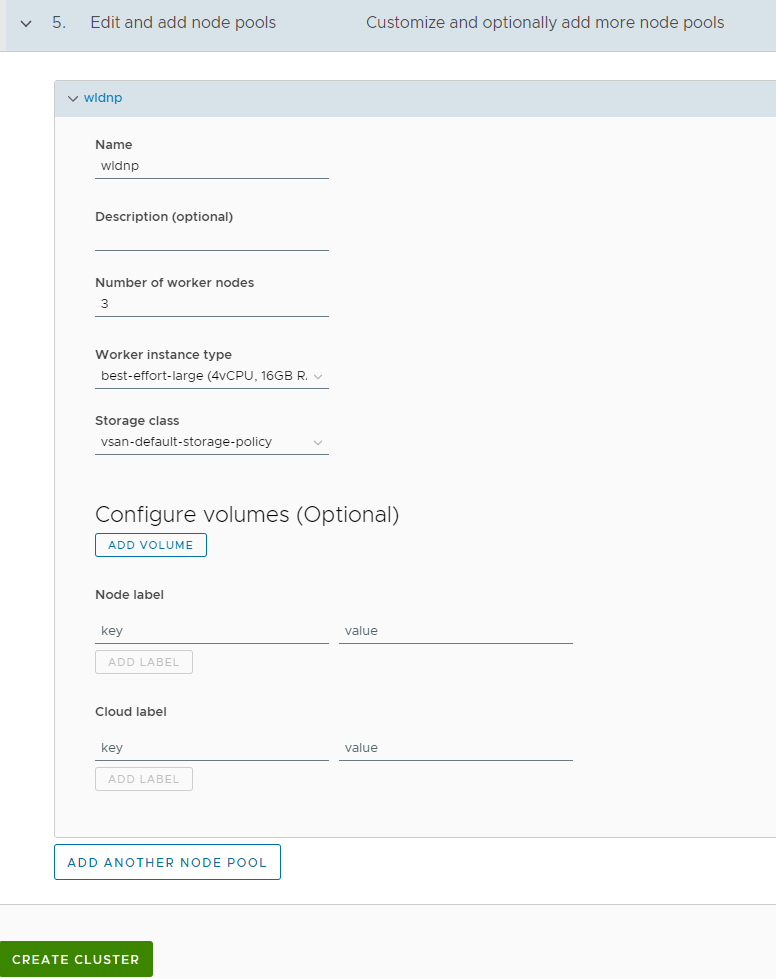

Cluster creation roughly takes 15-20 minutes to complete. After the cluster deployment completes, ensure that Agent and extensions health shows green.


## <a id=integrate-to> </a> Integrate Tanzu Kubernetes Clusters with Tanzu Observability

Tanzu Observability (TO) delivers full-stack observability across containerized cloud applications, Kubernetes health, and cloud infrastructure. The solution is consumed through a Software-as-a-Service (SaaS) subscription model, managed by VMware. This SaaS model allows the solution to scale to meet metrics requirements without the need for customers to maintain the solution itself.

## <a id=integrate-tsm> </a> Integrate Tanzu Kubernetes Clusters with Tanzu Service Mesh

## <a id=deploy-user-managed-packages> </a> Deploy User-Managed Packages on Tanzu Kubernetes Grid Clusters

## **Appendix A**

### **Self-Service Namespace in vSphere with Tanzu**

Typically creating and configuring vSphere namespaces (permissions, limits, etc) is a vSphere Administrator task. But this model doesn’t allow flexibility in a DevOps model. Every time a developer/cluster-admin needs a new namespace for deploying Kubernetes clusters, the task of creating a namespace has to be completed by the vSphere Administrator, and once permissions, authentication, etc are configured for the namespace, then only it can be consumed.

A self-Service namespace is a new feature that is available with vSphere 7.0 U2 and later versions and allows users with DevOps persona to create and consume vSphere namespaces in a self-service fashion.

But before a DevOps user can start creating namespace on his own, the vSphere Administrator has to enable Namespace service on the supervisor cluster; this will build a template that will be used over and over again whenever a developer requests a new Namespace.

The below steps demonstrate the workflow for enabling Namespace service on the supervisor cluster.

1: Login to the vSphere client and select the cluster configured for workload management.

Navigate to the **Configure > Supervisor Cluster > General** page and enable the Namespace Service using the toggle button and setting the status to Active.


2: Configure the quota for the CPU/Memory/Storage and select the storage policy for the namespace.


3: On the permissions page, select the identity source (AD, LDAP, etc) where you have created the users and groups for the Developer/Cluster Administrator. On selecting the identity source, you can search for the user/groups in that identity source.


4: Review the settings and click on the finish button to complete the namespace service enable wizard.

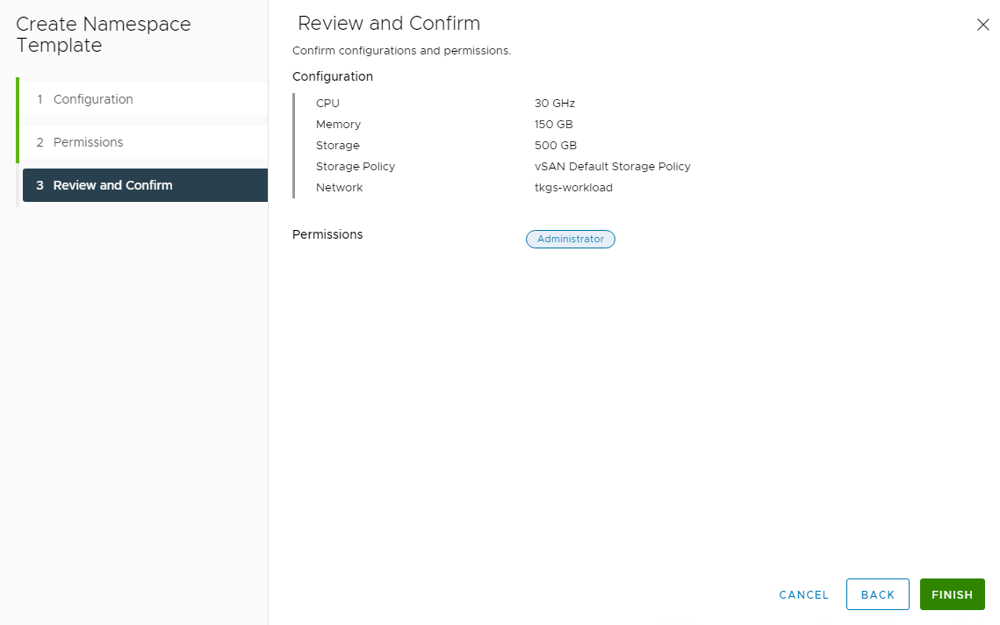

The Namespace Self-Service is now activated and ready to be consumed.

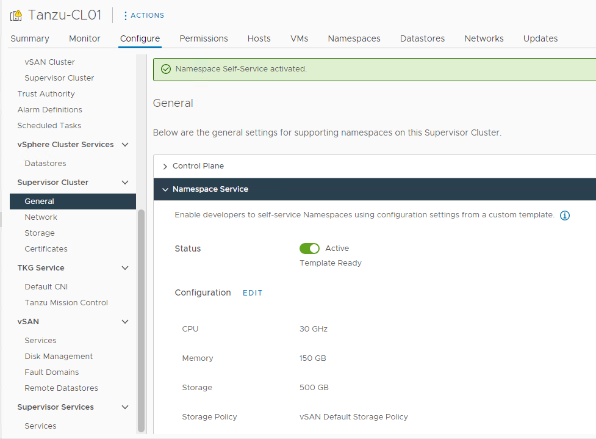
