# Deploy Tanzu for Kubernetes Operations on vSphere

This document provides step-by-step instructions for deploying and configuring Tanzu for Kubernetes Operations on a vSphere environment backed by a Virtual Distributed Switch (VDS).  

The scope of the document is limited to providing the deployment steps based on the reference design in [VMware Tanzu for Kubernetes Operations on vSphere Reference Design](../reference-designs/tko-on-vsphere.md). This document does not cover any deployment procedures for the underlying SDDC components.

## Prepare your Environment for Deploying Tanzu Kubernetes Operations

Before deploying Tanzu Kubernetes Operations on vSphere, ensure that your environment is set up as described in the following:

* [General Requirements](#gen-requirements)
* [Example Network Entries](#ex-net-entr)
* [Firewall Requirements](#firewall-req)

### <a id="gen-requirements"> </a>General Requirements
The following are general requirements that your environment should have:

* vSphere 6.7u3 or greater instance with an Enterprise Plus license.
* Your SDDC environment has the following objects in place:
	* A vSphere cluster with at least two hosts, on which vSphere DRS is enabled
	* Dedicated resource pool in which to deploy the Tanzu Kubernetes Grid management cluster, shared services cluster, and workload clusters.
The number of resource pools depends on the number of workload clusters to be deployed.
* VM folders in which to collect the Tanzu Kubernetes Grid VMs.
* A datastore with sufficient capacity for the control plane and worker node VM files.
* Network Time Protocol (NTP) service running on all hosts and vCenter.
* A host/server/VM based on Linux/MAC/Windows that acts as your bootstrap machine and has docker installed. For this deployment, we will use a virtual machine based on Photon OS.
* Depending on the OS flavor of the bootstrap VM, [download](https://customerconnect.vmware.com/en/downloads/details?downloadGroup=TKG-140&productId=988&rPId=49705)and configure the following packages. As part of this documentation, refer to the section to configure required packages on Photon Machine.

	* Tanzu CLI 1.4.0
	* kubectl cluster CLI 1.21.2

* A vSphere account with the permissions described in [Required Permissions for the vSphere Account](https://docs.vmware.com/en/VMware-Tanzu-Kubernetes-Grid/1.4/vmware-tanzu-kubernetes-grid-14/GUID-mgmt-clusters-vsphere.html#vsphere-permissions).
* If you are working in an Internet-restricted environment that requires a centralized image repository, see [Prepare an Internet-Restricted Environment](https://docs.vmware.com/en/VMware-Tanzu-Kubernetes-Grid/1.4/vmware-tanzu-kubernetes-grid-14/GUID-mgmt-clusters-airgapped-environments.html) for more information on setting up a centralized image repository.
* Download and import NSX ALB 20.1.6 OVA to Content Library.
* [Download](https://customerconnect.vmware.com/en/downloads/details?downloadGroup=TKG-140&productId=988&rPId=49705) the following OVA and import to vCenter. Convert the imported VMs to templates.

	* Photon v3 Kubernetes v1.21.2 OVA and/or
	* Ubuntu 2004 Kubernetes v1.21.2 OVA  

**Note**: You can also [download](https://customerconnect.vmware.com/en/downloads/details?downloadGroup) and import supported older versions of Kubernetes in order to deploy workload clusters on the intended Kubernetes versions

### <a id="ex-net-entr"> </a>Example Network Entries

The following table provides example entries for the required port groups. Create network entries with the Portgroup Name, vLAN ID, and CIDRs that are specific to your environment.

<!-- /* cSpell:disable */ -->
| Network Type | Sample Port Group Name | Sample vLAN ID | Sample Gateway CIDR | DHCP Enabled | Static IP Pool reserved for NSX ALB SE/VIP |
| --- | --- | --- | --- | --- | --- |
| NSX ALB Mgmt Network | nsx_alb_management_pg | 1010 | 172.16.10.1/24 | No  | 172.16.10.100 - 172.16.10.200 |
| TKG Management Network | tkg_mgmt_pg | 1040 | 172.16.40.1/24 | Yes | No  |
| TKG Mgmt VIP Network | tkg_mgmt_vip_pg | 1050 | 172.16.50.1/24 | No  | 172.16.50.100 - 172.16.50.200 |
| TKG Cluster VIP Network | tkg_cluster_vip_pg | 1080 | 172.16.80.1/24 | No  | 172.16.80.100 - 172.16.80.200 |
| TKG Workload VIP Network | tkg_workload_vip_pg | 1070 | 172.16.70.1/24 | No  | 172.16.70.100 - 172.16.70.200 |
| TKG Workload Segment | tkg_workload_pg | 1060 | 172.16.60.1/24 | Yes | No  |
<!-- /* cSpell:enable */ -->

After you have created the network entries, the network section in your SDDC must have the following port groups created as shown in the following screen capture:

  

### <a id="firewall-req"></a>Firewall Requirements

Ensure that the firewall is set up as described in [Firewall Recommendations](../reference-designs/tko-on-vsphere.md#firewall).

### Resource Pools
Ensure that resource pools and folders are created in vCenter. The following table shows sample entries of the resource pools and folders. Customize the Portgroup Name, vLAN ID, and CIDRs for your environment.

<!-- /* cSpell:disable */ -->
| Resource Type | Sample Resource Pool Name | Sample Folder Name |
| --- | --- | --- |
| NSX ALB Components | nsx-alb-components | nsx-alb-components |
| TKG Management components | tkg-management-components | tkg-management-components |
| TKG Shared Service Components | tkg-sharedsvc-components | tkg-sharedsvc-components |
| TKG Workload components | tkg-workload01-components | tkg-workload01-components |
<!-- /* cSpell:enable */ -->

  

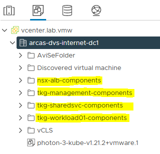  


## Deployment Overview

The following are the high-level steps for deploying Tanzu Kubernetes operations on vSphere backed by VDS:

1. [Deploy and Configure NSX Advanced Load Balancer](#dep-config-nsx-alb)
1. [Deploy and Configure Bootstrap Machine](#bootstrap)
1. [Deploy Tanzu Kubernetes Grid Management Cluster](#deploy-mgmg-cluster)
1. [Deploy Tanzu Workload Clusters](#dep-workload-cluster)
1. [Deploy User-Managed Packages on TKG Clusters](#dep-user-mgd-packages)

## <a id="dep-config-nsx-alb"> </a>Deploy and Configure NSX Advanced Load Balancer

NSX ALB is an enterprise-grade integrated load balancer that provides L4- L7 Load Balancer support. It is recommended for vSphere deployments without NSX-T, or when there are unique scaling requirements.

For a production-grade deployment, we recommend deploying three instances of the NSX Advanced Load Balancer Controller for high availability and resiliency.  

**Note:**Tanzu Essential licensing only supports single node deployment of NSX Advanced Load Balancer. This deployment uses Tanzu Essential licensing for NSX Advance Load Balancer.

The following table provides a sample IP and FQDN set for the NSX Advanced Load Balancer controllers:  

| Controller Node | IP Address | FQDN |
| --- | --- | --- |
| Node 1 Primary | 172.16.10.10 | avi01.lab.vmw |
| Node 2 Secondary | 172.16.10.28 | avi02.lab.vmw |
| Node 3 Secondary | 172.16.10.29 | avi03.lab.vmw |
| HA Address | 172.16.10.30 | avi-ha.lab.vmw |

Follow these steps to deploy and configure NSX Advanced Load Balancer:

1. [Deploy NSX Advanced Load Balancer](#dep-nsx-alb)
1. [NSX Advanced Load Balancer: Initial setup](#nsx-alb-init)
1. [NSX Advanced Load Balancer: Licensing](#nsx-alb-license)
1. [NSX Advanced Load Balancer: Controller High Availability](#nsx-alb-ha)
1. [NSX Advanced Load Balancer: Certificate Management](#nsx-alb-cert-mgmt)
1. [NSX Advanced Load Balancer: Create vCenter Cloud and SE Groups](#nsx-alb-vcenter-se)
1. [NSX Advanced Load Balancer: Configure Network and IPAM Profile](#nsx-alb-net-ipam)


### <a id="dep-nsx-alb"> </a>Deploy NSX Advanced Load Balancer

As part of the pre-requisites, you must have the NSX ALB 20.1.6 OVA downloaded and imported to the content library. Deploy the NSX ALB under the resource pool “nsx-alb-components”and place it under the folder“nsx-alb-components” .  
To deploy NSX ALB,

1. Login to vCenter> Home> ContentLibraries
1. Select the Content Library under which the NSX-ALB OVA is placed
1. Click on OVA & OVF Templates
1. Right-click on NSX ALB Image and select New VM from this Template
1. On the Select name and Folder page, enter a name and select a Folder for the NSX ALB VM as `nsx-alb-components`
1. On the Select a Compute resource page, select the resource pool `nsx-alb-components`
1. On the Review details page, verify the template details and click Next.
1. On the Select Storage page, select a storage policy from the VM Storage Policy drop-down menu and choose the  datastore location where you want to store the virtual machine files
1. On the Select networks page, select the network `nsx_alb_management_pg` and click Next
1. On the Customize Template page, provide the NSX ALB Management network details, such as IP Address, Subnet Mask, and Gateway, and click on Next  
    Note: If you choose to use DHCP, these entries can be left blank
1. On the Ready to complete page, review the page and click Finish

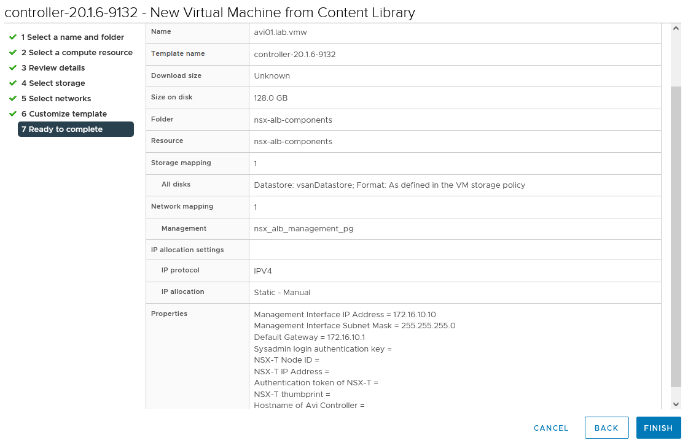

A new task for creating the virtual machine appears in the Recent Tasks pane. After the task is complete, the NSX ALB virtual machine is created on the selected resource. Power on the Virtual Machine and give it few minutes for the system to boot, upon successful boot up navigate to NSX ALB on your browser.  
Note: While the system is booting up, a blank web page or a 503 status code may appear.  

### <a id="nsx-alb-init"> </a>NSX Advanced Load Balancer: Initial setup

Once the NSX ALB is successfully deployed and boots up, navigate to NSX ALB on your browser using the URL https://*<AVI_IP/FQDN>* and configure the basic system settings:

* Administrator account setup.  
    Set admin password and click on Create Account.  
    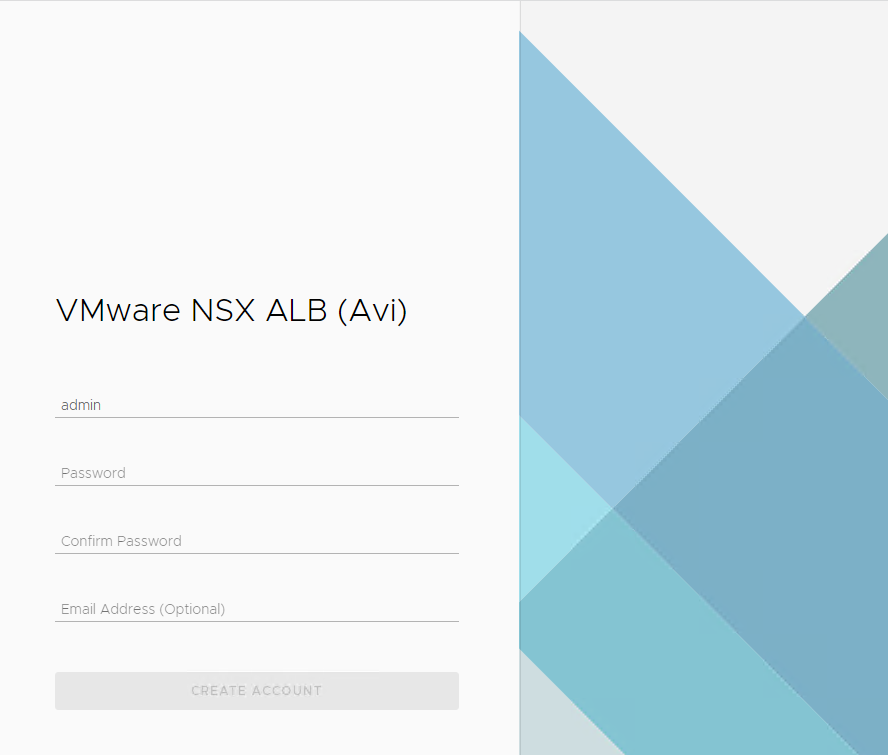  

* On the Welcome page,

* Under System Settings: Set backup Passphrase and provide DNS information and click Next  
    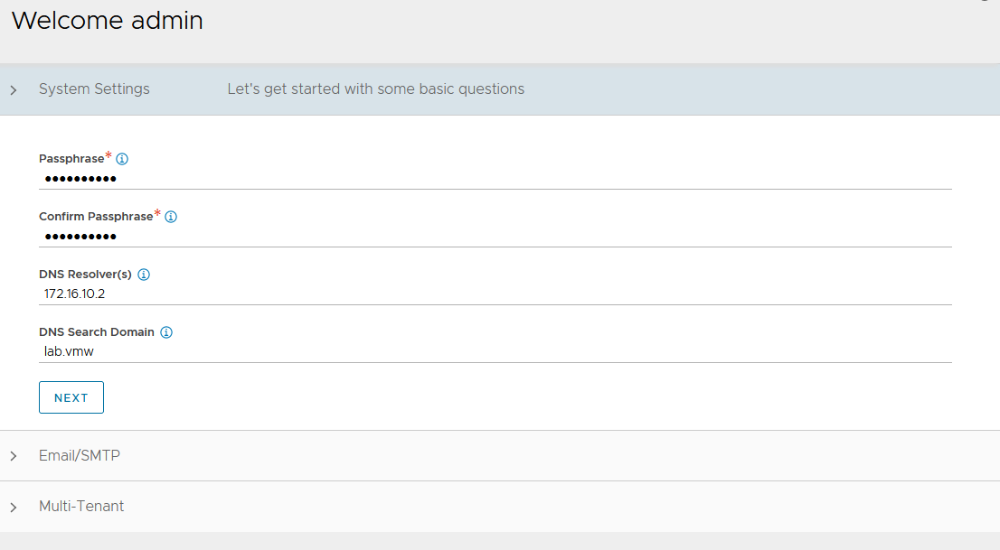
* Under Email/SMTP: Provide Email or SMTP information  
    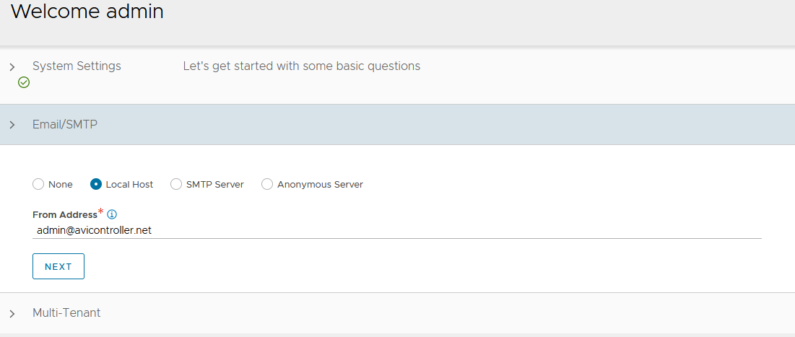
* Under Multi-Tenant: Configure settings as shown below and click on Save  
    IP Route Domain: Share IP route domain across tenants  
    Service Engines are managed within the: Provider (Shared across tenants)  
    Tenant Access to Service Engine: Read  
    
* To Configure NTP, navigate to Administration> Settings> DNS/NTP > Edit and add your NTP server details and Save  
    **Note:** You may also delete the default NTP servers  
    

### <a id="nsx-alb-license"></a>NSX Advanced Load Balancer: Licensing

This document focuses on enabling NSX ALB using the license model: Essentials License (NSX ALB essentials for Tanzu)  
By default evaluation license will be making use of Enterprise license, if you intend to use the Enterprise Licensing features, you may add your license key in the licensing section or change the license model to “Essentials”  
Refer [NSX Advanced Load balancer Editions](https://avinetworks.com/docs/21.1/nsx-license-editions/) for comparison of available editions.

To change the license edition to Essentials,

* Login to NSX ALB > Administration> Settings> Licensing, on licensing page click on the gear icon next to Licensing  
    
* Select Essentials License and click on Save  
    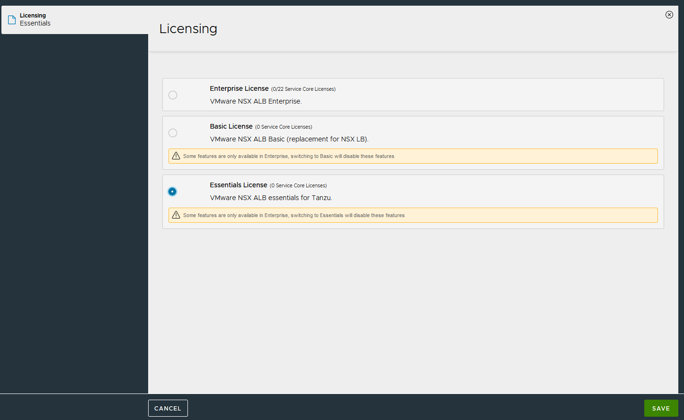

### <a id="nsx-alb-ha"> </a>NSX Advanced Load Balancer: Controller High Availability

NSX ALB can run with a single Controller (single-node deployment) or with a 3-node Controller cluster. In a deployment that uses a single controller, that controller performs all administrative functions as well as all analytics data gathering and processing.

Adding 2 additional nodes to create a 3-node cluster provides node-level redundancy for the controller and also maximizes performance for CPU-intensive analytics functions.

In a 3-node NSX ALB Controller cluster, one node is the primary (leader) node and performs the administrative functions. The other two nodes are followers (secondaries) and perform data collection for analytics, in addition to standing by as backups for the leader.  

Perform the below steps to configure AVI ALB HA:

* Set the Cluster IP for the NSX ALB controllerLog in to the primary NSX ALB controller > Navigate to Administrator > Controller > Nodes, and click Edit. The Edit Controller Configuration popup appears.
* In the Controller Cluster IP field, enter the Controller Cluster IP for the Controller and click on save.
    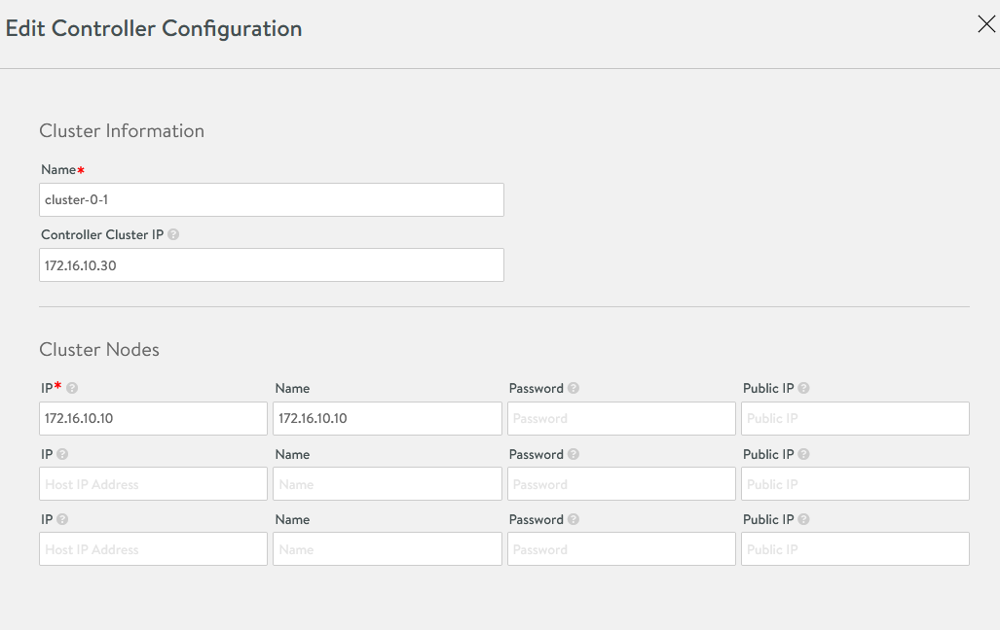
* Now deploy 2nd and 3rd NSX ALB Node, using steps provided [here](#h.hj0v6pbwmsx2)
* Log into the Primary NSX ALB controller using the Controller Cluster IP/FQDN, navigate to Administrator > Controller  > Nodes, and click Edit. The Edit Controller Configuration popup appears.
* In the Cluster Nodes field, enter the IP address for the 2nd and 3rd controller and click on Save  
    Optional - Provide a friendly name for all 3 Nodes  
    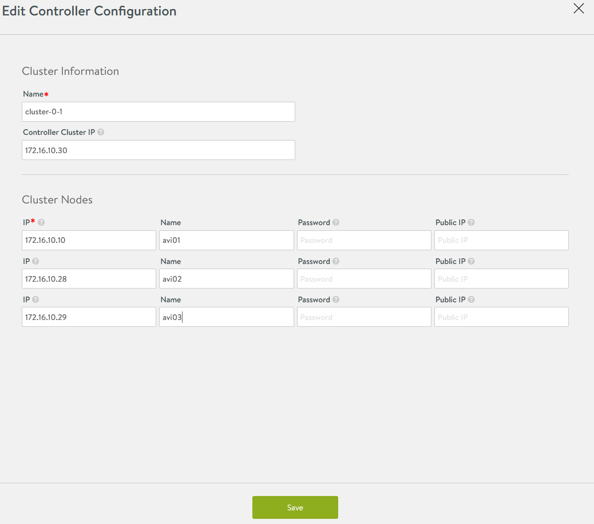      

After these steps, the primary Avi Controller becomes the leader for the cluster and invites the other controllers to the cluster as members. NSX ALB then performs a warm reboot of the cluster. This process can take 2-3 minutes. The configuration of the primary (leader) Controller is synchronized to the new member nodes when the cluster comes online following the reboot.  

Once the cluster is successfully formed we should see the following status:  
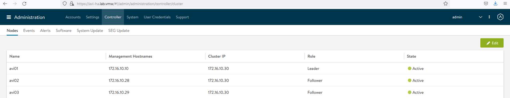  

Note: Going forward all NSX ALB configurations will be configured by connecting to the NSX ALB Controller Cluster IP/FQDN  

### <a id="nsx-alb-cert-mgmt"> </a>NSX Advanced Load Balancer: Certificate Management

The default system-generated controller certificate generated for SSL/TSL connections will not have required SAN entries. Follow the below steps to create a Controller certificate

* Login to NSX ALB Controller > Templates > Security > SSL/TLS Certificates
* Click on Create and Select Controller Certificate
* You can either generate a Self-Signed certificate, generate CSR or import a certificate.  
    For the purpose of this document, a self-signed certificate will be generated,
* Provide all required details as per your infrastructure requirements, and under the Subject Alternate Name (SAN) section, provide IP and FQDN of all NSX ALB controllers including NSX ALB cluster IP and FQDN, and click on Save  
    
* Once the certificate is created, capture the certificate contents as this is required while deploying the TKG management cluster.  
    To capture the certificate content, click on the “Download” icon next to the certificate, and then click on “Copy to clipboard” under the certificate section  
      

* To replace the certificate navigate to Administration> Settings> AccessSettings, and click the pencil icon at the top right to edit the System Access Settings, replace the SSL/TSL certificate and click on Save  
    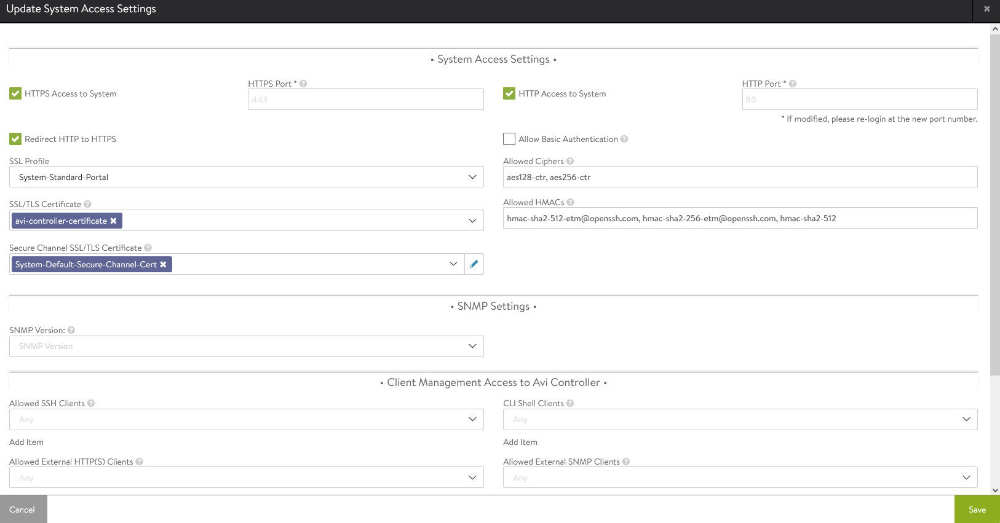  
    Now, logout and login back to the NSX ALB

### <a id="nsx-alb-vcenter-se"> </a>NSX Advanced Load Balancer: Create vCenter Cloud and SE Groups

Avi Vantage may be deployed in multiple environments for the same system. Each environment is called a “cloud”. Below procedure provides steps on how to create a VMware vCenter cloud, and as shown in the architecture two Service Engine Groups will be created  
Service Engine Group 1: Service engines part of this Service Engine group hosts:

* Virtual services for all load balancer functionalities requested by TKG Management Cluster and Workload
* Virtual services that load balances control plane nodes of all TKG kubernetes clusters

Service Engine Group 2: Service engines part of this Service Engine group, hosts virtual services for all load balancer functionalities requested by TKG Workload clusters mapped to this SE group.  
Note:

* Based on your requirements, you can create additional Service Engine groups for the workload clusters.
* Multiple Workload clusters can be mapped to a single SE group
* A TKG cluster can be mapped to only one SE group for Application load balancer services    
    Refer [Configure NSX Advanced Load Balancer in TKG Workload Cluster](#h.8mw4r95iln0n) for more details on mapping a specific Service engine group to TKG workload cluster  

    The following components are created in NSX ALB.

<!-- /* cSpell:disable */ -->
| Object | Sample Name |
| --- | --- |
| vCenter Cloud | tanzu-vcenter01 |
| Service Engine Group 1 | tanzu-mgmt-segroup-01 |
| Service Engine Group 2 | tanzu-wkld-segroup-01 |
<!-- /* cSpell:enable */ -->

1.  Login to NSX ALB > Infrastructure > Clouds > Create > VMware vCenter/vSphere ESX  
    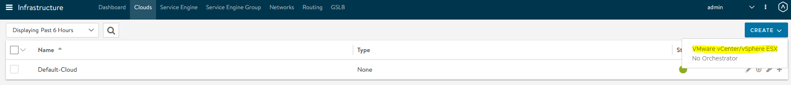
2.  Provide Cloud Name and click on Next  
    
3.  Under the Infrastructure pane, provide vCenter Address, username, and password and set AccessPermission to "Write" and click on Next  
    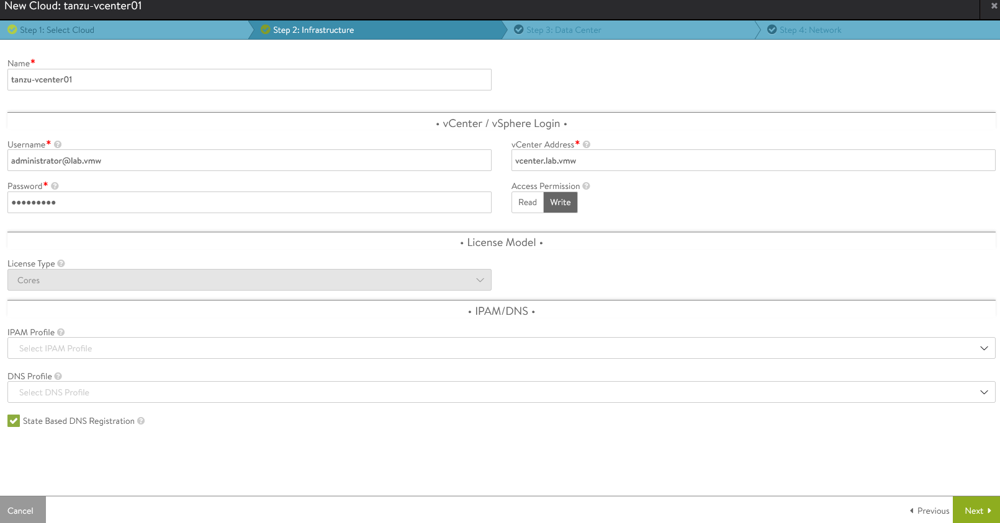
4.  Under the Datacenter pane, Choose the Datacenter for NSX ALB to discover Infrastructure resources  
    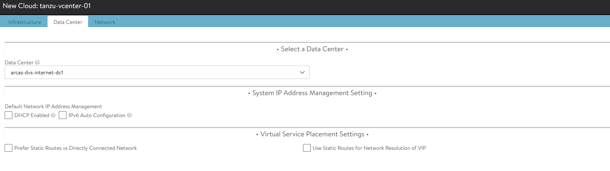
5.  Under the Network pane, choose the NSX ALB ManagementNetwork for Service Engines and provide a StaticIPpool for SEs and VIP and click on Complete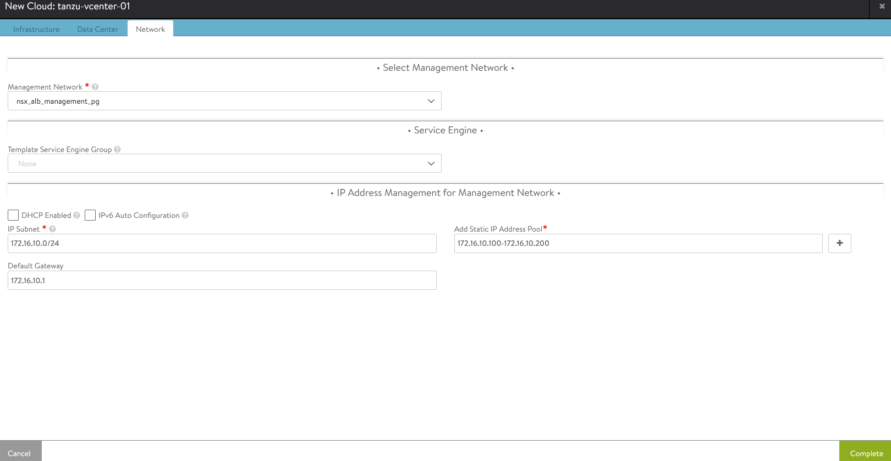
6.  Wait for the status of the Cloud to configure and status to turn Green  
    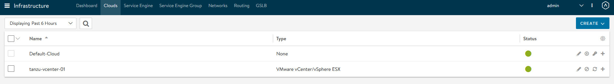
7.  To create a Service Engine group for TKG management clusters, click on the Service Engine Group tab, under Select Cloud, choose the Cloud created in the previous step, and click Create
8.  Provide a name for the TKG management Service Engine group and set below parameters  

| Parameter | Value |
| --- | --- |
| High availability mode | Active/Standby (Tanzu Essentials License supports only Active/Standby Mode |
| Memory per Service Engine | 4   |
| vCPU per Service Engine | 2   |

The rest of the parameters can be left as default  
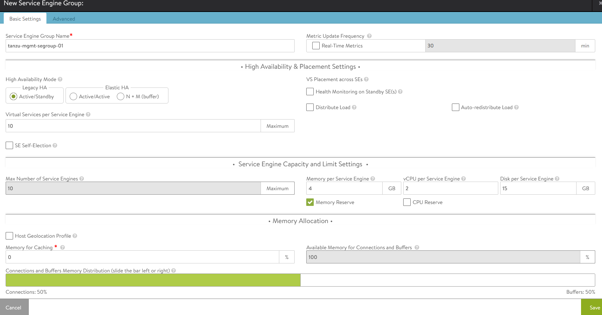For advanced configuration click on the Advanced tab, to specify a specific cluster and datastore for service engine placement, to change the AVI SE folder name and Service engine name prefix and, click on Save  
  

9.  Follow steps 7 and 8 to create another Service Engine group for TKG workload clusters. Once complete there must be two service engine groups created  
    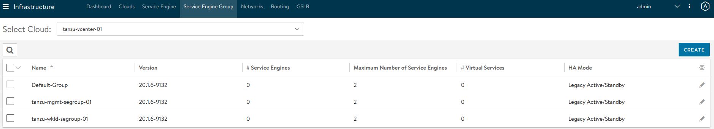

### <a id="nsx-alb-net-ipam"> </a> NSX Advanced Load Balancer: Configure Network and IPAM Profile

#### Configure TKG Networks in NSX ALB

As part of the Cloud creation in NSX ALB, only management Network has been configured in NSX ALB, follow the below procedure to configure the following networks:  
TKG Management Network  
TKG Workload Network  
TKG Cluster VIP/Data Network  
TKG Management VIP/Data Network  
TKG Workload VIP/Data Network

* Login to NSX ALB > Infrastructure > Networks
* Select the appropriate Cloud
* All the networks available in vCenter will be listed  
    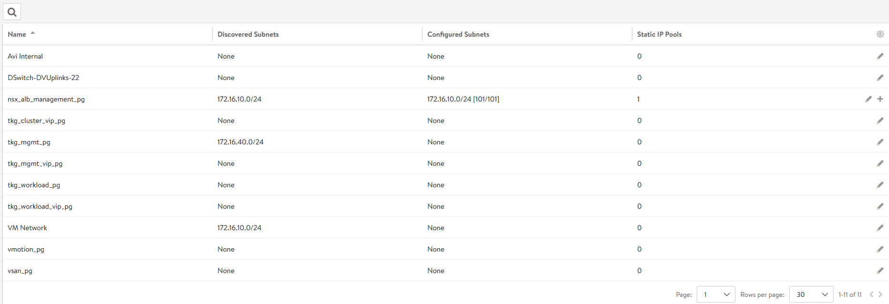

* Click on the edit icon next for the network and configure as below. Change the details provided below as per tour SDDC configuration  
    Note: Not all networks will be auto-discovered and for those networks, manually add the subnet.  

<!-- /* cSpell:disable */ -->
|     |     |     |     |
| --- | --- | --- | --- |
| Network Name | DHCP | Subnet | Static IP Pool |
| tkg_mgmt_pg | Yes | 172.16.40.0/24 | NA  |
| tkg_workload_pg | Yes | 172.16.60.0/24 | NA  |
| tkg_cluster_vip_pg | No  | 172.16.80.0/24 | 172.16.80.100 - 172.16.80.200 |
| tkg_mgmt_vip_pg | No  | 172.16.50.0/24 | 172.16.50.100 - 172.16.50.200 |
| tkg_workload_vip_pg | No  | 172.16.70.0/24 | 172.16.70.100 - 172.16.70.200 |
<!-- /* cSpell:enable */ -->

Below is the snippet of configuring one of the networks, for example: `tkg_cluster_vip_pg`  
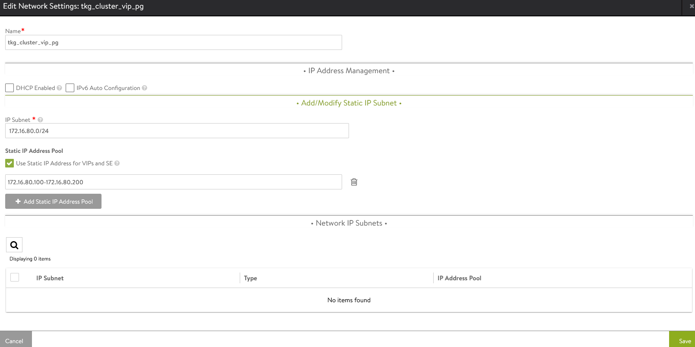  

* Once the networks configured, the configuration must look like below  
    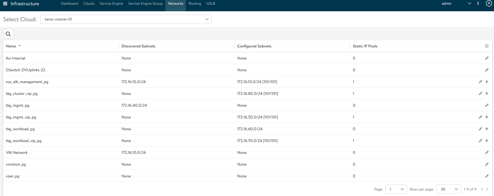
* Once the networks are configured, set the default routes for all VIP/Data networks  
    Click on Routing > Create and add default routes for below networks  
    Change the gateway for VIP networks as per your network configurations  

<!-- /* cSpell:disable */ -->
| Network Name | Gateway Subnet | Next Hop |
| --- | --- | --- |
| tkg_cluster_vip_pg | 0.0.0.0/0 | 172.16.80.1 |
| tkg_mgmt_vip_pg | 0.0.0.0/0 | 172.16.50.1 |
| tkg_workload_vip_pg | 0.0.0.0/0 | 172.16.70.1 |
<!-- /* cSpell:enable */ -->

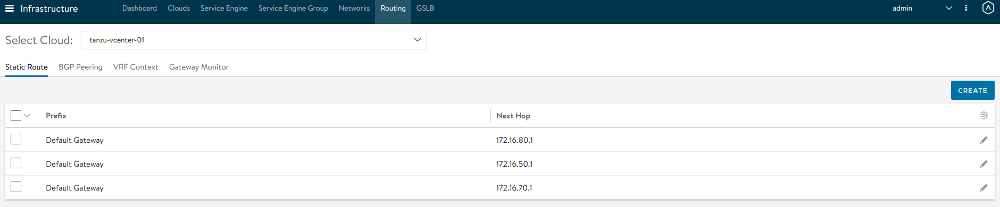  


#### Create IPAM Profile in NSX ALB and attach it to Cloud

At this point all the required networks related to Tanzu functionality are configured in NSX ALB, expect for TKG Management and Workload Network which uses DHCP, NSX ALB provides IPAM service for TKG Cluster VIP Network, TKG Management VIP Network and TKG Workload VIP Network  
Follow below procedure to create IPAM profile and once created attach it to the vCenter cloud created earlier  

* Login to NSX ALB > Infrastructure> Templates> IPAM/DNS Profiles> Create > IPAM Profile and provide below details and click on Save  

<!-- /* cSpell:disable */ -->
| Parameter | Value |
| --- | --- |
| Name | tanzu-vcenter-ipam-01 |
| Type | AVI Vintage IPAM |
| Cloud for Usable Networks | Tanzu-vcenter-01, created [here](#h.fqdv2dq2hz0q) |
| Usable Networks | tkg_cluster_vip_pg  <br>tkg_mgmt_vip_pg  <br>tkg_workload_vip_pg |
<!-- /* cSpell:enable */ -->


* Now attach the IPAM profile to the “tanzu-vcenter-01” cloud  
    Navigate to Infrastructure> Clouds> Edit the tanzu-vcenter-01cloud > Under IPAM Profile choose the profile created in previous step and Save the configuration  
      


This completes NSX ALB configuration. Next is to deploy and configured Bootstrap Machine which will be used to deploy and management Tanzu Kubernetes clusters

## <a id="bootstrap"> </a>Deploy and Configure Bootstrap Machine

The bootstrap machine can be a laptop, host, or server (running on Linux/MAC/Windows platform) that you deploy management and workload clusters from, and that keeps the Tanzu and Kubernetes configuration files for your deployments, the bootstrap machine is typically local.  

Below procedure provides steps to configure bootstrap virtual machines based on Photon OS, refer [here](https://docs.vmware.com/en/VMware-Tanzu-Kubernetes-Grid/1.4/vmware-tanzu-kubernetes-grid-14/GUID-install-cli.html) to configure MAC/Windows machines

* Ensure that the bootstrap VM is connected to TKG Management Network `tkg_mgmt_pg`
* [Configure NTP](https://kb.vmware.com/s/article/76088) on your bootstrap machine
* As we are working on photon OS , download and unpack below Linux CLI packages from [myvmware](https://customerconnect.vmware.com/en/downloads/details?downloadGroup=TKG-140&productId=988&rPId=49705)

* VMware Tanzu CLI for Linux
* kubectl cluster cli v1.21.2 for Linux

* Execute  below commands to install TKG CLI, Kubectl CLIs and Carvel tools  

<!-- /* cSpell:disable */ -->    
```bash
# Install required packages  
dnf install tar zip unzip wget -y

# Install TKG CLI
tar -xvf tanzu-cli-bundle-linux-amd64.tar

cd ./cli/  
sudo install core/v1.4.0/tanzu-core-linux_amd64 /usr/local/bin/tanzu
chmod +x /usr/local/bin/tanzu  

# Install TKG CLI Plugins  
tanzu plugin install --local ./cli all

# Install Kubectl CLI
gunzip kubectl-linux-v1.21.2+vmware.1.gz
mv kubectl-linux-v1.21.2+vmware.1 /usr/local/bin/kubectl && chmod +x /usr/local/bin/kubectl  

# Install Carvel tools
# ytt
cd ./cli
gunzip ytt-linux-amd64-v0.34.0+vmware.1.gz
chmod ugo+x ytt-linux-amd64-v0.34.0+vmware.1 && mv ./ytt-linux-amd64-v0.34.0+vmware.1 /usr/local/bin/ytt

# kapp
cd ./cli
gunzip kapp-linux-amd64-v0.37.0+vmware.1.gz
chmod ugo+x kapp-linux-amd64-v0.37.0+vmware.1 && mv ./kapp-linux-amd64-v0.37.0+vmware.1 /usr/local/bin/kapp

# kbld
cd ./cli
gunzip kbld-linux-amd64-v0.30.0+vmware.1.gz
chmod ugo+x kbld-linux-amd64-v0.30.0+vmware.1 && mv ./kbld-linux-amd64-v0.30.0+vmware.1 /usr/local/bin/kbld

# impkg
cd ./cli
gunzip imgpkg-linux-amd64-v0.10.0+vmware.1.gz
chmod ugo+x imgpkg-linux-amd64-v0.10.0+vmware.1 && mv ./imgpkg-linux-amd64-v0.10.0+vmware.1/usr/local/bin/imgpkg
```
<!-- /* cSpell:enable */ -->

* Validate carvel tools installation using below commands  
    ytt version  
    kapp version  
    kbld version  
    imgpkg version  

* Install yq: yq a lightweight and portable command-line YAML processor. yq uses jq like syntax but works with yaml files as well as json

<!-- /* cSpell:disable */ -->
```bash
wget https://github.com/mikefarah/yq/releases/download/v4.13.4/yq_linux_amd64.tar.gz  
tar-xvfyq_linux_amd64.tar&&mvyq_linux_amd64/usr/local/bin/yq
```
<!-- /* cSpell:enable */ -->

* Photon OS has docker installed by default, use below commands to start the service and enable it to start at system boot.

<!-- /* cSpell:disable */ -->
```bash
# Check Docker service status  
systemctl status docker   
   
# Start Docker Service  
systemctl start docker     

# To start Docker Service at boot  
systemctl enable docker
```
<!-- /* cSpell:enable */ -->

* Ensure that the bootstrap machine is using [cgroup v1](https://man7.org/linux/man-pages/man7/cgroups.7.html) by running below command  

<!-- /* cSpell:disable */ -->
```bash
dockerinfo| grep -i cgroup  

# You should see the following output:
#  Cgroup Driver: cgroupfs
```
<!-- /* cSpell:enable */ -->


* Create an SSH Key Pair: This is required for Tanzu CLI to connect to vSphere from the bootstrap machine. The public key part of the generated key will be passed during the TKG management cluster deployment.    

```bash
# Generate SSH key pair  
# When prompted enter file in which to save the key (/home/user/.ssh/id_rsa): press Enter to accept the default and provide password

ssh-keygen -t rsa -b 4096 -C "[email@example.com](mailto:email@example.com)"  

# Add the private key to the SSH agent running on your machine, and enter the password you created in the previous step

ssh-add ~/.ssh/id_rsa

# If the above command fails, execute `eval $(ssh-agent)` and then rerun the command.
```

* If your bootstrap machine runs Linux or Windows Subsystem for Linux, and it has a Linux kernel built after the May 2021 Linux security patch, for example Linux 5.11 and 5.12 with Fedora, run the following:  

`sudo sysctl net.netfilter.nf_conntrack_max = 131072`

Now all the required packages are installed and required configurations are in place in the bootstrap virtual machines, proceed to next section to deploy TKG management cluster

## <a id="deploy-mgmg-cluster"> </a>Deploy Tanzu Kubernetes Grid Management Cluster

After setting up the bootstrap machine, you can deploy the management cluster.  The management cluster is a Kubernetes cluster that runs Cluster API operations on a specific cloud provider to create and manage workload clusters on that provider.

The management cluster is also where you configure the shared and in-cluster services that the workload clusters use . You can deploy management clusters in two ways:

* Run the Tanzu Kubernetes Grid installer, a wizard interface that guides you through the process of deploying a management cluster. This is the recommended method.
* Create and edit YAML configuration files, and use them to deploy a management cluster with CLI commands.

You can deploy and manage Tanzu Kubernetes Grid management clusters on:

* vSphere 6.7u3
* vSphere 7, if vSphere with Tanzu is not enabled.


### Import Base Image template for TKG Cluster Deployment

Before you proceed with the management cluster creation, ensure that the base image template is imported into vSphere and is available as a template. To import a base image template into vSphere:  

* Go to the [Tanzu Kubernetes Grid downloads](https://customerconnect.vmware.com/en/downloads/details?downloadGroup=TKG-140&productId=988&rPId=49705) page, and download a Tanzu Kubernetes Grid OVA for the cluster nodes.

* For the management cluster, this must be either Photon or Ubuntu based Kubernetes v1.21.2 OVA    
    Note: Custom OVA with a custom Tanzu Kubernetes release (TKr) is also support, as described in [Build Machine Images](https://docs.vmware.com/en/VMware-Tanzu-Kubernetes-Grid/1.4/vmware-tanzu-kubernetes-grid-14/GUID-build-images-index.html)

* For workload clusters, OVA can have any supported combination of OS and Kubernetes version, as packaged in a Tanzu Kubernetes release

Important: Make sure you download the most recent OVA base image templates in the event of security patch releases. You can find updated base image templates that include security patches on the Tanzu Kubernetes Grid product download page.

* In the vSphere Client, right-click an object in the vCenter Server inventory, select Deploy OVF template.
* Select Local file, click the button to upload files, and navigate to the downloaded OVA file on your local machine.
* Follow the installer prompts to deploy a VM from the OVA.
* Click Finish to deploy the VM. When the OVA deployment finishes, right-click the VM and select Template> Convert to Template.  
    NOTE: Do not power on the VM before you convert it to a template.
* If using non administrator SSO account: In the VMs and Templates view, right-click the new template, select Add Permission, and assign the TKG user to the template with the TKG role.  
    For information about how to create the user and role for Tanzu Kubernetes Grid, see [Required Permissions for the vSphere Account](https://docs.vmware.com/en/VMware-Tanzu-Kubernetes-Grid/1.4/vmware-tanzu-kubernetes-grid-14/GUID-mgmt-clusters-vsphere.html#vsphere-permissions).

### Deploy TKG Management Cluster using UI

**Important:** If you are deploying TKG clusters in an internet restricted environment, ensure that the local image repository is accessible from the boot strap machine, TKG Management and Workload Networks.  

For the bootstrap machine to pull images from private image repository, the `TKG_CUSTOM_IMAGE_REPOSITORY` variable must be set. Once this is set, Tanzu Kubernetes Grid will pull images from your local private registry rather than from the external public registry. To make sure that Tanzu Kubernetes Grid always pulls images from the local private registry, add `TKG_CUSTOM_IMAGE_REPOSITORY` to the global cluster configuration file, `~/.config/tanzu/tkg/config.yaml`.  

If your local image repository uses self-signed certificates, also add `TKG_CUSTOM_IMAGE_REPOSITORY_CA_CERTIFICATE` to the global cluster configuration file. Provide the CA certificate in base64encoded format by executing `base64 -w 0 your-ca.crt`.  

 <!-- /* cSpell:disable */ -->
```bash
TKG_CUSTOM_IMAGE_REPOSITORY: custom-image-repository.io/yourproject
TKG_CUSTOM_IMAGE_REPOSITORY_SKIP_TLS_VERIFY: false
TKG_CUSTOM_IMAGE_REPOSITORY_CA_CERTIFICATE: LS0t\[...\]tLS0tLQ==
```
 <!-- /* cSpell:enable */ -->


Deploying a management cluster may be accomplished by utilizing the Installer interface:

* To launch the UI installer wizard, run the following command on the bootstrapper machine:  

  `tanzu management-cluster create --ui --bind <bootstrapper-ip>:<port> --browser none`  

  For example  
  `tanzu management-cluster create --ui --bind 172.16.40.135:8000 --browser none`  

* Access Tanzu UI wizard by opening a browser and entering http://<bootstrapper-ip>:port/  
    
* Click Deploy on the VMware vSphere tile
* On the "IaaS Provider" section, enter the IP/FQDN and credentials of the vCenter server where the TKG management cluster will be deployed  
    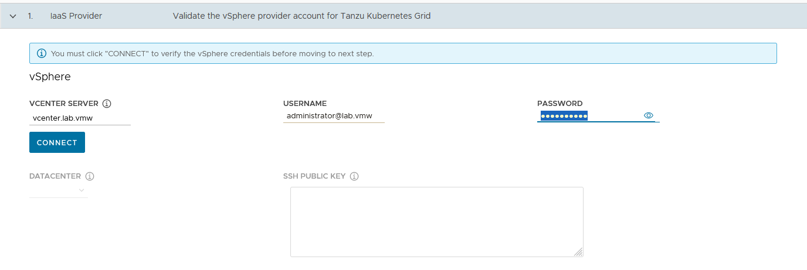
* Click on connect and accept the vCenter Server SSL thumbprint
* If you are running on a vCenter 7.x environment, you would get below popup, select “DEPLOY TKG MANAGEMENT CLUSTER” to proceed further  
    
* Select the Datacenter and provide the SSH Public Key generated while configuring the Bootstrap VM  
    If you have saved the SSH key in the default location, execute the  following command in you bootstrap machine to get the SSH public key “cat /root/.ssh/id_rsa.pub”
* Click Next  

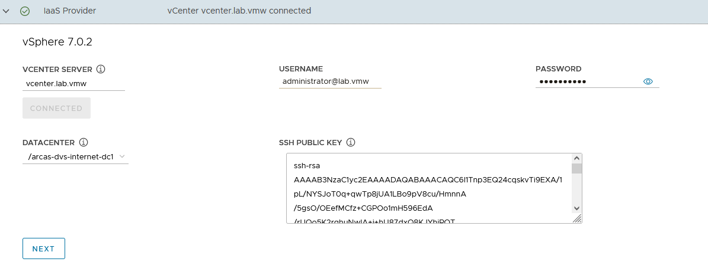  

* On the Management cluster settings section provide the following details,

* Based on the environment requirements select appropriate deployment type for the TKG Management cluster

* Development: Recommended for Dev or POC environments
* Production: Recommended for Production environments

It is recommended to set the instance type to `Large` or above. For the purpose of this document, we will proceed with deployment type `Development` and instance type `Large`.

* Management Cluster Name: Name for your management cluster.
* Control Plane Endpoint Provider: Select NSX ALB for the Control Plane HA.
* Control Plane Endpoint: This is an optional field, if left blank NSX ALB will assign an IP from the pool “tkg_cluster_vip_pg” we created earlier.  
    If you need to provide an IP, pick an IP address from “tkg_cluster_vip_pg”  static IP pools configured in AVI and ensure that the IP address is unused.
* Machine Health Checks: Enable
* Enable Audit Logging: Enables to audit logging for Kubernetes API server and node VMs, choose as per environmental needs. For more information see [Audit Logging](https://docs.vmware.com/en/VMware-Tanzu-Kubernetes-Grid/1.4/vmware-tanzu-kubernetes-grid-14/GUID-troubleshooting-tkg-audit-logging.html)
* Click Next

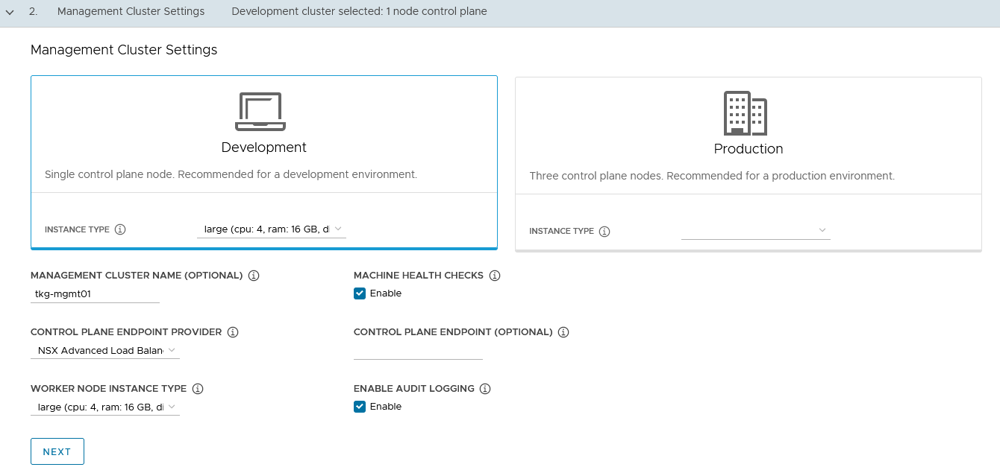

* On the NSX Advanced Load Balancer section, provide the following:

* Controller Host: NSX ALB Controller IP/FQDN (ALB Controller cluster IP/FQDN of the controller cluster is configured)
* Controller credentials: Username and Password of NSX ALB
* Controller certificate

Once the above details are provided, click on “Verify Credentials” and choose the below parameters

* Cloud Name: Name of the cloud created while configuring NSX ALB `tanzu-vcenter-01`.
* Service Engine Group Name: Name of the Service Engine Group created for TKG management clusters created while configuring NSX ALB `tanzu-mgmt-segroup-01`.
* Workload VIP Network Name: Select TKG Management VIP/Data Network network `tkg_mgmt_vip_pg` and select the discovered subnet.
* Workload VIP network CIDR:  Select the discovered subnet, `172.16.50.0/24`
* Management VIP network Name: Select TKG Cluster VIP/Data Network network `tkg_cluster_vip_pg`.
* Cluster Labels: To adhere to the architecture defining a label is mandatory. Provide required labels, for example, `type: management`.
    **Note:** Based on your requirements you may specify multiple labels
* Click Next.


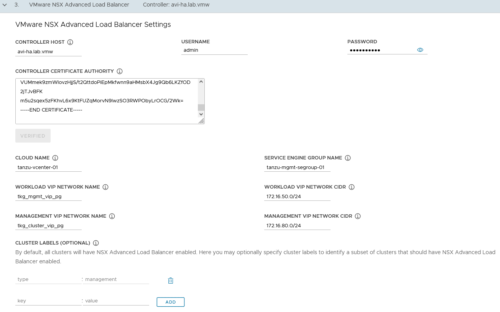

**Important:** With above configurations, when a TKG clusters (Shared service/workload) are tagged with label `type: management`, `ako` pod gets deployed on the cluster,and any applications hosted on the cluster that requires Load Balancing service will be exposed via network `tkg_mgmt_vip_pg` and the virtual service will be placed on SE group `tanzu-mgmt-segroup-01`.  
As per the defined in the architecture, Cluster Labels specified here will be applied only on shared service cluster  
If no labels are specified in the “Cluster Labels” section, ako pod gets deployed on all the clusters without any labeling requirement and this deviates from the defined architecture  
                
* On the Metadata page, you can specify location and labels and click Next, this is optional  
    
* On the Resources section, specify the resources to be consumed by TKG management cluster and click on Next  
    

* On the Kubernetes Network section, select the TKG Management Network (`tkg_mgmt_pg`) where the control plane and worker nodes will be placed during management cluster deployment. Ensure that the network has DHCPservice enabled.
    Optionally, change the Pod and Service CIDR.

    If the tanzu environment is placed behind a proxy, enable proxy and provide proxy details:

    * If you set `http-proxy`, you must also set `https-proxy` and vice-versa
    * For the `no-proxy` section:

      * For TKG management and workload clusters, `localhost`, `127.0.0.1`, the values of `CLUSTER_CIDR` and `SERVICE_CIDR`, `.svc`, and `.svc.cluster.local` values are appended along with the user specified values.
    * Important: If the kubernetes cluster needs to communicate with external services and infrastructure endpoints in your Tanzu Kubernetes Grid environment, ensure that those endpoints are reachable by your proxies or add them to `TKG_NO_PROXY`. Depending on your environment configuration, this may include, but is not limited to, your OIDC or LDAP server, Harbor, NSX-T, and NSX Advanced Load Balancer, vCenter.
    * For vSphere, you must manually add the CIDR of TKG Management Network and Cluster VIP networks which includes the IP address of your control plane endpoints, to `TKG_NO_PROXY`.


* Optionally Specify Identity Management with OIDC or LDAP - This is not covered as part of this document and will have a separate section for this  
    For the purpose of this document, Identity management integration has been disabled  
    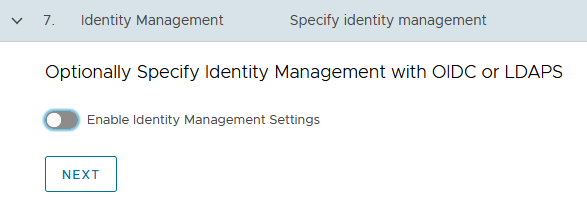  

* Select the OS image that will be used for the management cluster deployment.  
    Note: This list will appear empty if you don’t have a compatible template present in your environment. Refer steps provided in [Import Base Image template for TKG Cluster deployment](#h.5x1m5pqg5sz8).
    
* Register TMC: Currently Tanzu 1.4 does not support registering Management cluster in TMC and only support attaching Workload clusters, this section needs to skipped for the current release  

* Check the “Participate in the Customer Experience Improvement Program”, if you so desire and click Review Configuration
* Review all the configuration, once reviewed, you can either copy the command provided and execute it in CLI or proceed with UI to Deploy Management Cluster.  
    When the deployment is triggered from the UI, the installer wizard displays the deployment logs on the screen.  
    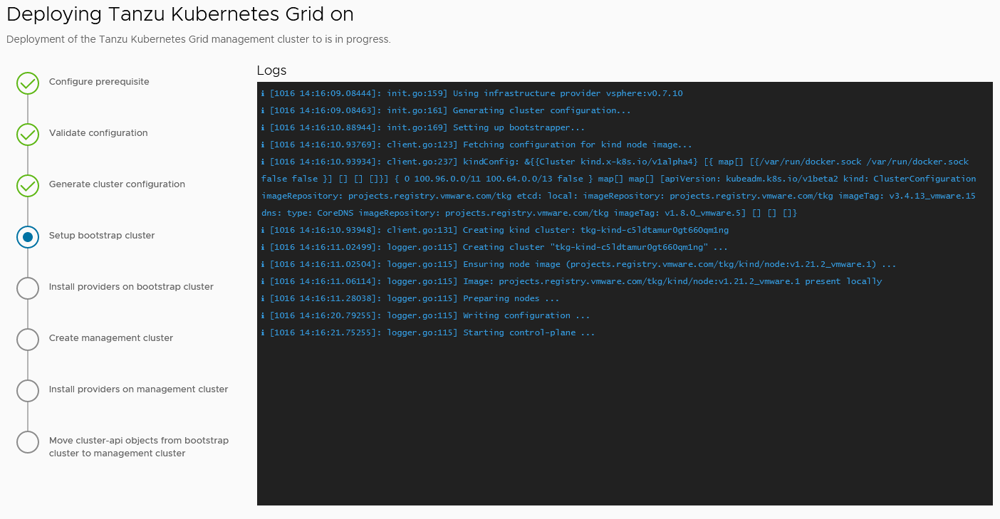


While the cluster is being deployed, you will find that a Virtual service will be created in NSX Advanced Load Balancer and new service engines will be deployed in vCenter by NSX ALB and the service engines will be mapped to the SE Group `tanzu-mgmt-segroup-01`.​​

Behind the scenes when TKG management Cluster is being deployed:  

* NSX ALB Service engines gets deployed in vCenter and this task is orchestrated by NSX ALB controller  
    
* Service engine status in NSX ALB: Below snippet shows that the first service engine has been initialized successfully and the 2nd one is in Initializing state  
    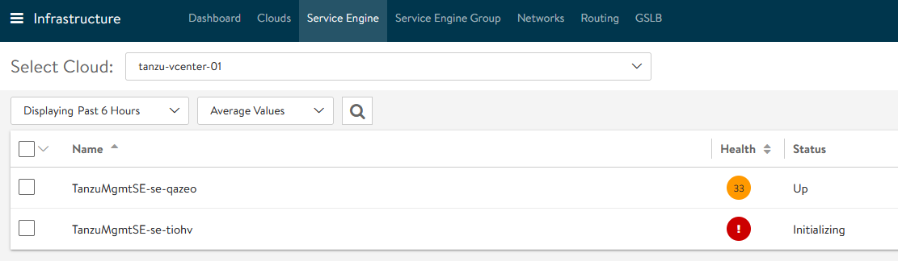
* Service Engine Group Status in NSX ALB: As per our configuration, we can see that the virtual service required for TKG clusters control plane HA will be hosted on service engine group `tkg-mgmt-segroup-01`.  
    
* VIrtual Service status in NSX ALB  
    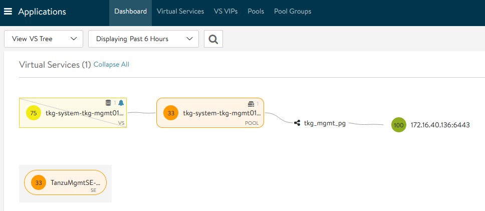


The virtual service health is impacted as the 2nd Service engine is still being initialized and this can be ignored.

* Once the TKG management cluster is successfully deployed, you will find this in the Tanzu Bootstrap UI  
    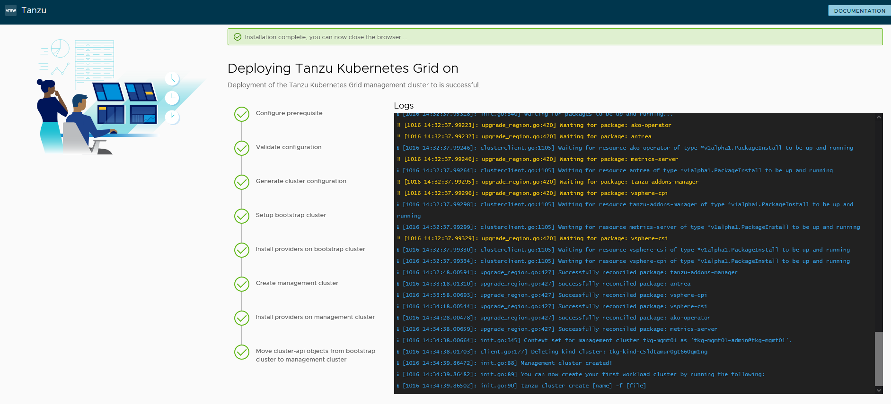

* The installer will automatically set the context to the TKG Management Cluster on the bootstrap machine. Now you can access the TKG management cluster from the bootstrap machine and perform additional tasks such as verifying the management cluster health and deploy the workload clusters, etc.

To get the status of TKG Management cluster execute the following command:

`tanzu management-cluster get`

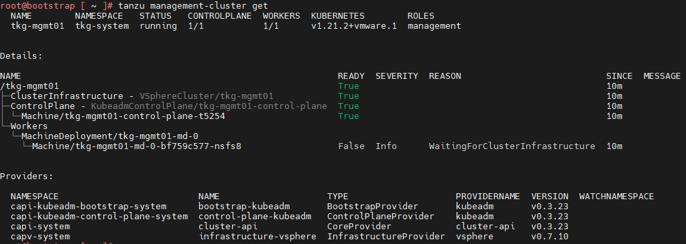

* Use kubectl to get the status of the TKG Management cluster nodes  
    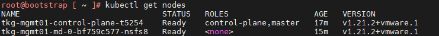

The TKG management cluster is successfully deployed and now you can created Shared Service and workload clusters  

## Deploy Tanzu Shared Service Cluster  

Each Tanzu Kubernetes Grid instance can have only one shared services cluster. Create a shared services cluster if you intend to deploy Harbor.  

Deploying a Shared service cluster and workload cluster is exactly the same, the only difference is, for the shared service cluster you will be adding the `tanzu-services` label to the shared services cluster, as its cluster role. This label identifies the shared services cluster to the management cluster and workload clusters.  

Another difference with the shared services cluster when compared with Workload clusters is that, Shared Services clusters will be applied with the “Cluster Labels” which were defined while deploying Management Cluster. This is to enforce only Shared Service Cluster will make use of the TKG Cluster VIP/Data Network for application load balancing purposes and the virtual services are deployed on “Service Engine Group 1”

In order to deploy a shared service cluster you need to create a cluster config, in the cluster config file you must specify options in the cluster configuration file to connect to vCenter Server and identify the vSphere resources that the cluster will use.  
You can also specify standard sizes for the control plane and worker node VMs, or configure the CPU, memory, and disk sizes for control plane and worker nodes explicitly. If you use custom image templates, you can identify which template to use to create node VMs.  

Below is a sample file with the minimum required configurations. To know about all configuration file variables, see the Tanzu CLI Configuration File Variable Reference[https://docs.vmware.com/en/VMware-Tanzu-Kubernetes-Grid/1.4/vmware-tanzu-kubernetes-grid-14/GUID-tanzu-config-reference.html](https://docs.vmware.com/en/VMware-Tanzu-Kubernetes-Grid/1.4/vmware-tanzu-kubernetes-grid-14/GUID-tanzu-config-reference.html)  
Modify the parameters as per your requirements.  

<!-- /* cSpell:disable */ -->
```bash
CLUSTER_CIDR: 100.96.0.0/11
SERVICE_CIDR: 100.64.0.0/13
CLUSTER_PLAN: <prod/dev>
ENABLE_CEIP_PARTICIPATION: 'true'
ENABLE_MHC: 'true'
IDENTITY_MANAGEMENT_TYPE: none
INFRASTRUCTURE_PROVIDER: vsphere
TKG_HTTP_PROXY_ENABLED: 'false'
AVI_CONTROL_PLANE_HA_PROVIDER: "true"
CLUSTER_NAME: <Provide a Name For the TKG Cluster>
DEPLOY_TKG_ON_VSPHERE7: 'true'
VSPHERE_DATACENTER: /<DC-Name>
VSPHERE_DATASTORE: /<DC-Name>/datastore/<Datastore-Name>
VSPHERE_FOLDER: /<DC-Name>/vm/<Folder_Name>
VSPHERE_NETWORK: /<DC-Name>/network/<Network-Name>
VSPHERE_RESOURCE_POOL: /<DC-Name>/host/<Cluster-Name>/Resources/<Resource-Pool-Name>
VSPHERE_SERVER: <vCenter-Address>
VSPHERE_SSH_AUTHORIZED_KEY: "ssh-rsa Nc2EA \[...\] h2X8uPYqw== email@example.com"
VSPHERE_USERNAME: <vCenter-SSO-Username>
VSPHERE_PASSWORD: <SSO-User-Password>
VSPHERE_TLS_THUMBPRINT: <vCenter Server Thumbprint>
ENABLE_AUDIT_LOGGING: true/false
ENABLE_DEFAULT_STORAGE_CLASS: true/false
ENABLE_AUTOSCALER: true/false
CONTROLPLANE_SIZE: small/medium/large/extra-large
WORKER_SIZE: small/medium/large/extra-large
WORKER_MACHINE_COUNT: <# of worker nodes to be deployed>
```
<!-- /* cSpell:enable */ -->

Key configuration considerations while creating  Shared Service cluster config file

<!-- /* cSpell:disable */ -->
|     |     |
| --- | --- |
| Variables | Value |
| CLUSTER_PLAN | prod : For all production deployments  <br>dev: for POC/Dev environments |
| IDENTITY_MANAGEMENT_TYPE | Match the value set for the management cluster, oidc, ldap, or none.  <br>Note: You do not need to configure additional OIDC or LDAP settings in the configuration file for workload clusters |
| TKG_HTTP_PROXY_ENABLED | true/false  <br>If true, the following additional variables needs to be provided  <br>TKG_HTTP_PROXY  <br>TKG_HTTPS_PROXY  <br>TKG_NO_PROXY |
| VSPHERE_NETWORK | As per the architecture, TKG Shared service cluster will share the network on which the TKG Management Cluster is deployed (TKG Management Network).  <br>This is not a hard ruler as the architecture also support Shared service cluster deployed on a dedicated Network |
| CONTROLPLANE_SIZE & WORKER_SIZE | Consider extra-large, as Harbor will be deployed on this cluster and this cluster may be attached to TMC and TO.  <br>To define custom size, remove “CONTROLPLANE_SIZE” and “WORKER_SIZE” variable from the config file and add the following variables with required resource allocation  <br>For Control Plane Nodes:  <br>​​VSPHERE_CONTROL_PLANE_NUM_CPUS<br><br>VSPHERE_CONTROL_PLANE_MEM_MIB<br><br>VSPHERE_CONTROL_PLANE_DISK_GIB<br><br>For Worker Nodes:<br><br>VSPHERE_WORKER_NUM_CPUS<br><br>VSPHERE_WORKER_MEM_MIB<br><br>VSPHERE_WORKER_DISK_GIB |
| VSPHERE_CONTROL_PLANE_ENDPOINT | This is optional, if left blank NSX ALB will assign an IP from the pool “tkg_cluster_vip_pg” we created earlier.  <br>If you need to provide an IP, pick an IP address from “TKG Cluster VIP/Data Network” static IP pools configured in NSX ALB and ensure that the IP address is unused. |
<!-- /* cSpell:enable */ -->

Following is an example of a modified Tanzu Kubernetes Grid shared service configuration file:

<!-- /* cSpell:disable */ -->
```bash
CLUSTER_CIDR: 100.96.0.0/11
SERVICE_CIDR: 100.64.0.0/13
CLUSTER_PLAN: dev
ENABLE_CEIP_PARTICIPATION: 'true'
ENABLE_MHC: 'true'
IDENTITY_MANAGEMENT_TYPE: none
INFRASTRUCTURE_PROVIDER: vsphere
TKG_HTTP_PROXY_ENABLED: 'false'
AVI_CONTROL_PLANE_HA_PROVIDER: "true"
CLUSTER_NAME: tkg-shared-svc
DEPLOY_TKG_ON_VSPHERE7: 'true'
VSPHERE_DATACENTER: /arcas-dvs-internet-dc1
VSPHERE_DATASTORE: /arcas-dvs-internet-dc1/datastore/vsanDatastore
VSPHERE_FOLDER: /arcas-dvs-internet-dc1/vm/tkg-sharedsvc-components
VSPHERE_NETWORK: /arcas-dvs-internet-dc1/network/tkg_mgmt_pg
VSPHERE_RESOURCE_POOL: /arcas-dvs-internet-dc1/host/arcas-dvs-internet-c1/Resources/tkg-sharedsvc-components
VSPHERE_SERVER: vcenter.lab.vmw
VSPHERE_SSH_AUTHORIZED_KEY: ssh-rsaAAAAB3NzaC1yc2EAAAADAQABAAACAQC6l1Tnp3EQ24cqskvTi9EXA/1pL/NYSJoT0q+qwTp8jUA1LBo9pV8cu/HmnnA/5gsO/OEefMCfz+CGPOo1mH596EdA/rUQo5K2rqhuNwlA+i+hU87dxQ8KJYhjPOT/lGHQm8VpzNQrF3b0Cq5WEV8b81X/J+H3i57ply2BhC3BE7B0lKbuegnb5aaqvZC+Ig97j1gt5riV/aZg400c3YGJl9pmYpMbyEeJ8xd86wXXyx8X1xp6XIdwLyWGu6zAYYqN4+1pqjV5IBovu6M6rITS0DlgFEFhihZwXxCGyCpshSM2TsIJ1uqdX8zUlhlaQKyAt+2V29nnHDHG1WfMYQG2ypajmE1r4vOkS+C7yUbOTZn9sP7b2m7iDnCG0GvCUT+lNQy8WdFC/Gm0V6+5DeBY790y1NEsl+9RSNNL+MzT/18Yqiq8XIvwT2qs7d5GpSablsITBUNB5YqXNEaf76ro0fZcQNAPfZ67lCTlZFP8v/S5NExqn6P4EHht0m1hZm1FhGdY7pQe8dLz/74MLTEQlP7toOp2ywoArYno8cFVl3PT8YR3TVQARvkS2pfNOquc5iU0r1FXOCrEc3d+LvJYmalmquvghZjblvxQKwguLFIodzdO/3CcpJvwGg0PiANvYZRqVNfTDCjtrN+lFXurlm2pSsA+YI5cbRtZ1ADaPw==administrator@lab.vmw
VSPHERE_USERNAME: administrator@lab.vmw
VSPHERE_PASSWORD: VMware@123
VSPHERE_TLS_THUMBPRINT: 40:1E:6D:30:4C:72:A6:8E:9D:AE:A8:67:DE:DA:C9:CA:B3:A6:C6:C2
ENABLE_AUDIT_LOGGING: true
ENABLE_DEFAULT_STORAGE_CLASS: true
ENABLE_AUTOSCALER: false
CONTROLPLANE_SIZE: large
WORKER_SIZE: extra-large
WORKER_MACHINE_COUNT: 1
```
<!-- /* cSpell:enable */ -->

Upon preparing the cluster configuration file, execute the following command to initiate the cluster deployment:

`tanzu cluster create -f <path-to-config.yaml> -v 6`  

Once the cluster is successfully deployed,  you will see the following results  
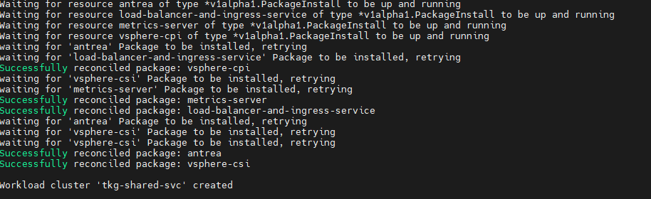  


Now, connect to the Tanzu Management Cluster context and apply following labels:

* Add the tanzu-services label to the shared services cluster as its cluster role. In following command “tkg-shared-svc” is the name of the shared service cluster

  `kubectl label cluster.cluster.x-k8s.io/tkg-shared-svc cluster-role.tkg.tanzu.vmware.com/tanzu-services="" --overwrite=true`

* Tag shared service cluster with all “Cluster Labels” defined while deploying Management Cluster, once the “Cluster Labels” are applied AKO pod will be deployed on the Shared Service Cluster

  `kubectl label cluster tkg-shared-svc type=management`

Get the admin context of the shared service cluster using the following commands and switch the context to the Shared Service cluster  

* Use following command to get the admin context of Shared Service Cluster, in following command `tkg-shared-svc` is the name of the shared service cluster:

  `tanzu cluster kubeconfig get tkg-shared-svc --admin`

* Use the following command to use the context of Shared Service Cluster:

  `kubectl config use-context tkg-shared-svc-admin@tkg-shared-svc`

  

After successfully creating a shared service cluster, you can deploy Harbor. However, before you deploy Harbor, deploy the cert-manager and Contour user packages. Deploy the packages in the following order.   

1.  Install Cert-manager User package
2.  Install Contour User package
3.  Install Harbor User package

To deploy the packages see [Deploy User-Managed Packages on TKG Clusters](#h.wmtc9ocmzfk5)  


## <a id="dep-workload-cluster"> </a>Deploy Tanzu Workload Clusters

In order to deploy a Workload cluster you need to create a cluster config, in the cluster config file you must specify options in the cluster configuration file to connect to vCenter Server and identify the vSphere resources that the cluster will use.  
You can also specify standard sizes for the control plane and worker node VMs, or configure the CPU, memory, and disk sizes for control plane and worker nodes explicitly. If you use custom image templates, you can identify which template to use to create node VMs.  

As per the architecture, workload clusters make use of a separate SE group (Service Engine Group 2) and VIP Network (TKG Workload VIP/Data Network) for application load balancing, this can be controlled by creating a new AKODeploymentConfig. For more details refer [Create and deploy AKO Deployment Config for TKG Workload Cluster](#h.8mw4r95iln0n)  

Below is a sample file with the minimum required configurations to create a TKG workload cluster. To know about all configuration file variables, see the Tanzu CLI Configuration File Variable Reference[https://docs.vmware.com/en/VMware-Tanzu-Kubernetes-Grid/1.4/vmware-tanzu-kubernetes-grid-14/GUID-tanzu-config-reference.html](https://docs.vmware.com/en/VMware-Tanzu-Kubernetes-Grid/1.4/vmware-tanzu-kubernetes-grid-14/GUID-tanzu-config-reference.html)  
Modify the parameters as per your requirements.

<!-- /* cSpell:disable */ -->
```bash
CLUSTER_CIDR: 100.96.0.0/11
SERVICE_CIDR: 100.64.0.0/13
CLUSTER_PLAN: <prod/dev>
ENABLE_CEIP_PARTICIPATION: 'true'
ENABLE_MHC: 'true'
IDENTITY_MANAGEMENT_TYPE: none
INFRASTRUCTURE_PROVIDER: vsphere
TKG_HTTP_PROXY_ENABLED: 'false'
AVI_CONTROL_PLANE_HA_PROVIDER: "true"
CLUSTER_NAME: <Provide a Name For the TKG Cluster>
DEPLOY_TKG_ON_VSPHERE7: 'true'
VSPHERE_DATACENTER: /<DC-Name>
VSPHERE_DATASTORE: /<DC-Name>/datastore/<Datastore-Name>
VSPHERE_FOLDER: /<DC-Name>/vm/<Folder_Name>
VSPHERE_NETWORK: /<DC-Name>/network/<Network-Name>
VSPHERE_RESOURCE_POOL: /<DC-Name>/host/<Cluster-Name>/Resources/<Resource-Pool-Name>
VSPHERE_SERVER: <vCenter-Address>
VSPHERE_SSH_AUTHORIZED_KEY: "ssh-rsa Nc2EA \[...\] h2X8uPYqw== email@example.com"
VSPHERE_USERNAME: <vCenter-SSO-Username>
VSPHERE_PASSWORD: <SSO-User-Password>
VSPHERE_TLS_THUMBPRINT: <vCenter Server Thumbprint>
ENABLE_AUDIT_LOGGING: true/false
ENABLE_DEFAULT_STORAGE_CLASS: true/false
ENABLE_AUTOSCALER: true/false
CONTROLPLANE_SIZE: small/medium/large/extra-large
WORKER_SIZE: small/medium/large/extra-large
WORKER_MACHINE_COUNT: # of worker nodes to be deployed>
```
<!-- /* cSpell:enable */ -->

Key config considerations while creating  Workload cluster config file

<!-- /* cSpell:disable */ -->
|     |     |
| --- | --- |
| Variables | Value |
| CLUSTER_PLAN | prod : For all production deployments  <br>dev: for POC/Dev environments |
| IDENTITY_MANAGEMENT_TYPE | Match the value set for the management cluster, oidc, ldap, or none.  <br>Note: You do not need to configure additional OIDC or LDAP settings in the configuration file for workload clusters |
| TKG_HTTP_PROXY_ENABLED | true/false  <br>If true below additional variables needs to be provided  <br>TKG_HTTP_PROXY  <br>TKG_HTTPS_PROXY  <br>TKG_NO_PROXY |
| VSPHERE_NETWORK | As per the architecture, TKG workload cluster will be attached to “TKG Workload Network”.  <br>  <br>Note: Based on your requirements, you may create additional networks for new TKG workload clusters.  <br>The architecture supports multiple TKG workload clusters on the same network and/or separate networks for each Workload Clusters |
| CONTROLPLANE_SIZE & WORKER_SIZE | Consider extra-large, as Harbor will be deployed on this cluster and this cluster may be attached to TMC and TO.  <br>To define custom size, remove “CONTROLPLANE_SIZE” and “WORKER_SIZE” variable from the config file and add below variables with required resource allocation  <br>For Control Plane Nodes:  <br>​​VSPHERE_CONTROL_PLANE_NUM_CPUS<br><br>VSPHERE_CONTROL_PLANE_MEM_MIB<br><br>VSPHERE_CONTROL_PLANE_DISK_GIB<br><br>For Worker Nodes:<br><br>VSPHERE_WORKER_NUM_CPUS<br><br>VSPHERE_WORKER_MEM_MIB<br><br>VSPHERE_WORKER_DISK_GIB |
| VSPHERE_CONTROL_PLANE_ENDPOINT | This is optional, if left blank NSX ALB will assign an IP from the pool “tkg_cluster_vip_pg” we created earlier.  <br>If you need to provide an IP, pick an IP address from “TKG Cluster VIP/Data Network” static IP pools configured in NSX ALB and ensure that the IP address is unused. |
| ENABLE_AUTOSCALER | This is an optional parameter, set if you want to override the default value. The default value is false, if set to true,you must include additional variables  <br>AUTOSCALER_MAX_NODES_TOTAL  <br>AUTOSCALER_SCALE_DOWN_DELAY_AFTER_ADD  <br>AUTOSCALER_SCALE_DOWN_DELAY_AFTER_DELETE  <br>AUTOSCALER_SCALE_DOWN_DELAY_AFTER_FAILURE  <br>AUTOSCALER_SCALE_DOWN_UNNEEDED_TIME  <br>AUTOSCALER_MAX_NODE_PROVISION_TIME  <br>AUTOSCALER_MIN_SIZE_0  <br>AUTOSCALER_MAX_SIZE_0<br><br>For more details see [Cluster Autoscalar](https://docs.vmware.com/en/VMware-Tanzu-Kubernetes-Grid/1.4/vmware-tanzu-kubernetes-grid-14/GUID-tanzu-config-reference.html#cluster-autoscaler-4) |
| WORKER_MACHINE_COUNT | Consider setting the value to 3 or above if the cluster needs to be part of Tanzu Service Mesh(TSM) |
<!-- /* cSpell:enable */ -->

Below is the modified TKG shared service config file  

<!-- /* cSpell:disable */ -->
```bash
CLUSTER_CIDR: 100.96.0.0/11  
SERVICE_CIDR: 100.64.0.0/13
CLUSTER_PLAN: dev
ENABLE_CEIP_PARTICIPATION: 'true'
ENABLE_MHC: 'true'
IDENTITY_MANAGEMENT_TYPE: none
INFRASTRUCTURE_PROVIDER: vsphere
TKG_HTTP_PROXY_ENABLED: 'false'
AVI_CONTROL_PLANE_HA_PROVIDER: "true"
CLUSTER_NAME: tkg-workload-dev
DEPLOY_TKG_ON_VSPHERE7: 'true'
VSPHERE_DATACENTER: /arcas-dvs-internet-dc1
VSPHERE_DATASTORE: /arcas-dvs-internet-dc1/datastore/vsanDatastore
VSPHERE_FOLDER: /arcas-dvs-internet-dc1/vm/tkg-workload01-components
VSPHERE_NETWORK: /arcas-dvs-internet-dc1/network/tkg_workload_pg
VSPHERE_RESOURCE_POOL: /arcas-dvs-internet-dc1/host/arcas-dvs-internet-c1/Resources/tkg-workload01-components
VSPHERE_SERVER: vcenter.lab.vmw
VSPHERE_SSH_AUTHORIZED_KEY: ssh-rsaAAAAB3NzaC1yc2EAAAADAQABAAACAQC6l1Tnp3EQ24cqskvTi9EXA/1pL/NYSJoT0q+qwTp8jUA1LBo9pV8cu/HmnnA/5gsO/OEefMCfz+CGPOo1mH596EdA/rUQo5K2rqhuNwlA+i+hU87dxQ8KJYhjPOT/lGHQm8VpzNQrF3b0Cq5WEV8b81X/J+H3i57ply2BhC3BE7B0lKbuegnb5aaqvZC+Ig97j1gt5riV/aZg400c3YGJl9pmYpMbyEeJ8xd86wXXyx8X1xp6XIdwLyWGu6zAYYqN4+1pqjV5IBovu6M6rITS0DlgFEFhihZwXxCGyCpshSM2TsIJ1uqdX8zUlhlaQKyAt+2V29nnHDHG1WfMYQG2ypajmE1r4vOkS+C7yUbOTZn9sP7b2m7iDnCG0GvCUT+lNQy8WdFC/Gm0V6+5DeBY790y1NEsl+9RSNNL+MzT/18Yqiq8XIvwT2qs7d5GpSablsITBUNB5YqXNEaf76ro0fZcQNAPfZ67lCTlZFP8v/S5NExqn6P4EHht0m1hZm1FhGdY7pQe8dLz/74MLTEQlP7toOp2ywoArYno8cFVl3PT8YR3TVQARvkS2pfNOquc5iU0r1FXOCrEc3d+LvJYmalmquvghZjblvxQKwguLFIodzdO/3CcpJvwGg0PiANvYZRqVNfTDCjtrN+lFXurlm2pSsA+YI5cbRtZ1ADaPw==administrator@lab.vmw
VSPHERE_USERNAME: administrator@lab.vmw
VSPHERE_PASSWORD: VMware@123  
VSPHERE_TLS_THUMBPRINT: 40:1E:6D:30:4C:72:A6:8E:9D:AE:A8:67:DE:DA:C9:CA:B3:A6:C6:C2
ENABLE_AUDIT_LOGGING: true
ENABLE_DEFAULT_STORAGE_CLASS: true
ENABLE_AUTOSCALER: false
CONTROLPLANE_SIZE: large
WORKER_SIZE: extra-large  
WORKER_MACHINE_COUNT: 3
```
<!-- /* cSpell:enable */ -->

Upon preparing the cluster configuration file, execute the following command to initiate the cluster deployment:

`tanzu cluster create -f <path-to-config.yaml> -v 6`

Once the cluster is successfully deployed,  you will see below results  
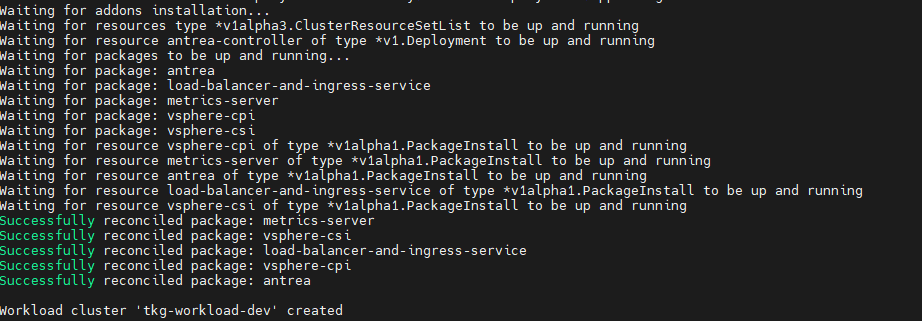

### Configure NSX Advanced Load Balancer in TKG Workload Cluster

Tanzu Kubernetes Grid v1.4.x management clusters with NSX Advanced Load Balancer have a default `AKODeploymentConfig` that is deployed during installation. It is called `install-ako-for-all`.  
By default, any clusters that match the cluster labels defined in `install-ako-for-all` will reference this file for their virtual IP networks, service engine (SE) groups, and L7 ingress. As part of our architecture, only shared service cluster makes use of the configuration defined in the default `AKODeploymentConfig` `install-ako-for-all`.  

As per the defined architecture, workload clusters must not make use of Service Engine Group 1 and VIP NetworkTKG Cluster VIP/Data Network for application load balancer services.  
A separate SE group (Service Engine Group 2) and VIP Network (TKG Workload VIP/Data Network) will be used by the workload clusters, These configurations can be enforced on workload clusters by:

* Creating a new `AKODeploymentConfig` in the TKG management cluster. This `AKODeploymentConfig` file dictates which specific SE group and VIP network that the workload clusters can use for load balancer functionalities  
* Apply the new `AKODeploymentConfig`:  Label the workload cluster to match the `AKODeploymentConfig` `.spec.clusterSelector.matchLabels` element in the `AKODeploymentConfig` file.  
    Once the labels are applied on the workload cluster, TKG management cluster will deploy AKO pod on the target workload cluster which has the configuration defined in the new `AKODeploymentConfig`.

Below is the format of the AKODeploymentConfig yaml file.  

<!-- /* cSpell:disable */ -->
```yaml
apiVersion: networking.tkg.tanzu.vmware.com/v1alpha1
kind: AKODeploymentConfig  
metadata:  
 finalizers:  
     -ako-operator.networking.tkg.tanzu.vmware.comgeneration: 2  
 name: <Unique name of AKODeploymentConfig>
spec:  
 adminCredentialRef:  
   name: avi-controller-credentials
   namespace: tkg-system-networking
 certificateAuthorityRef:  
   name: avi-controller-ca
   namespace: tkg-system-networking
 cloudName: <NAME OF THE CLOUD>
 clusterSelector:  
   matchLabels:  
     <KEY>: <VALUE>
     controller: <NSX ALB CONTROLLER IP/FQDN>
  dataNetwork:  
    cidr: <VIP NETWORK CIDR>
    name: <VIP NETWORK NAME>
  extraConfigs:  
   image:  
     pullPolicy: IfNotPresent
     repository: projects.registry.vmware.com/tkg/
     akoversion: v1.3.2_vmware.1
  ingress:  
     defaultIngressController: false
  disableIngressClass: true
  serviceEngineGroup: <SERVICE ENGINE NAME>
```
<!-- /* cSpell:enable */ -->

Below is the sample AKODeploymentConfig with sample values in place, as per the below configuration, TKG management cluster will deploy AKO pod on any workload cluster that matches the label `type=workloadset01` and the AKO configuration will be as below

* cloud: ​tanzu-vcenter-01​
* service engine Group: `tanzu-wkld-segroup-01`
* VIP/data network: tkg_workload_vip_pg

<!-- /* cSpell:disable */ -->
```yaml
apiVersion: networking.tkg.tanzu.vmware.com/v1alpha1kind: AKODeploymentConfig  
metadata:  
 finalizers:  
     -ako-operator.networking.tkg.tanzu.vmware.comgeneration: 2  
 name: tanzu-ako-workload-set01spec:  
 adminCredentialRef:  
   name: avi-controller-credentialsnamespace: tkg-system-networkingcertificateAuthorityRef:  
   name: avi-controller-canamespace: tkg-system-networkingcloudName: tanzu-vcenter-01clusterSelector:  
   matchLabels:  
     type: workloadset01controller: avi-ha.lab.vmwdataNetwork:  
   cidr: tkg_workload_vip_pg   
   name: 172.16.70.0/24extraConfigs:  
   image:  
     pullPolicy: IfNotPresentrepository: projects.registry.vmware.com/tkg/akoversion: v1.3.2_vmware.1ingress:  
     defaultIngressController: falsedisableIngressClass: trueserviceEngineGroup: tanzu-wkld-segroup-01
```
<!-- /* cSpell:enable */ -->


Once you have the AKO configuration file ready, use kubectl command to set the context to TKG management cluster and use below command to list the available `AKODeploymentConfig`.  

`kubectl apply -f <path_to_akodeploymentconfig.yaml>`

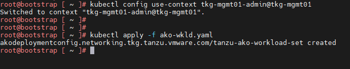

Use below command to list all AKODeploymentConfig created under management cluster

`kubectl get akodeploymentconfig`

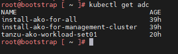  

Now that you have successfully created the AKO deployment config, you need to apply the cluster labels defined in the AKODeploymentConfig to any of the TKG workload clusters , once the labels are applied TKG management cluster will deploy  AKO pod on the target workload cluster.  

`kubectl label cluster <cluster-name> <label>`

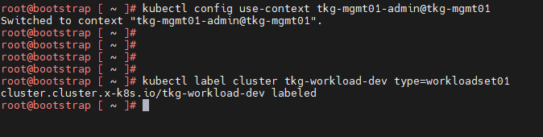  

### Connect to TKG Workload Cluster and validate the deployment

Now that you have the TKG workload cluster is created and required AKO configurations are applied, use the below command to get the admin context of the TKG workload cluster.

`tanzu cluster kubeconfig get <cluster-name> --admin`

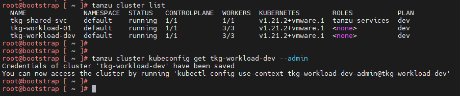


Now connect to the TKG workload cluster using the kubectl command and run below commands to check the status of AKO and other components

```bash
kubectl get nodes               # List all nodes with status  
kubectl get pods -n avi-system  # To check the status of AKO pod  
kubectl get pods -A             # Lists all pods and their status
```

  

You can see that the workload cluster is successfully deployed and AKO pod is deployed on the cluster. You can now [configure SaaS services](#h.jucrzgpgsxn)for the cluster and/or [deploy user managed packages](#h.wmtc9ocmzfk5) on this cluster.  

## <a id="dep-user-mgd-packages"> </a>Deploy User-Managed Packages on TKG Clusters

Tanzu Kubernetes Grid includes the following user-managed packages. These packages provide in-cluster and shared services to the Kubernetes clusters that are running in your Tanzu Kubernetes Grid environment.

<!-- /* cSpell:disable */ -->
| Function | Package | Location |
| --- | --- | --- |
| Certificate Management | cert-manager | Workload or shared services cluster |
| Container networking | multus-cni | Workload cluster |
| Container registry | harbor | Shared services cluster |
| Ingress control | contour | Workload or shared services cluster |
| Log forwarding | fluent-bit | Workload cluster |
| Monitoring | grafana  <br>prometheus | Workload cluster |
| Service discovery | external-dns | Workload or shared services cluster |
<!-- /* cSpell:enable */ -->

### Install Cert-Manager User Package

Cert manager is required for contour, harbor, and Prometheus and Grafana packages  

1.  Switch the context to the respective cluster and capture the available cert-manager version  

    `tanzu package available list cert-manager.tanzu.vmware.com -A`  

2.  Install the Cert-Manager Package  

    `tanzu package install cert-manager --package-name cert-manager.tanzu.vmware.com --namespace cert-manager --version <AVAILABLE-PACKAGE-VERSION> --create-namespace`  

3.  Validate the cert-manager package installation, the status must change to “Reconcile succeeded”  

    `tanzu package installed list -A | grep cert-manager`

### Install Contour User Package

Contour is required for the harbor, and Prometheus and Grafana packages  

1.  Switch context to the respective cluster, and ensure that the AKO pod is in a running state  
    `kubectl get pods -A | grep ako`

2.  Create below configuration file named `contour-data-values.yaml`  

<!-- /* cSpell:disable */ -->    
```yaml
---
infrastructure_provider: vspherenamespace: tanzu-system-ingresscontour:  
configFileContents: {}useProxyProtocol: falsereplicas: 2  
pspNames: "vmware-system-restricted"logLevel: infoenvoy:  
service:  
  type: LoadBalancerannotations: {}nodePorts:  
    http: nullhttps: nullexternalTrafficPolicy: ClusterdisableWait: falsehostPorts:  
  enable: truehttp: 80  
  https: 443  
hostNetwork: falseterminationGracePeriodSeconds: 300  
logLevel: infopspNames: null  
certificates:  
duration: 8760h  
renewBefore: 360h  
```
<!-- /* cSpell:enable */ -->

3.  Using below command to capture the available Contour version  

    `tanzu package available list contour.tanzu.vmware.com -A`

4.  Install the Contour Package  

    `tanzu package install contour --package-name contour.tanzu.vmware.com --version <AVAILABLE-PACKAGE-VERSION> --values-file <Path_to_contour-data-values.yaml_file> --namespace tanzu-system-contour --create-namespace`

5.  Validate the Contour package installation, the status must change to “Reconcile succeeded”  

    `tanzu package installed list -A | grep contour`  


### Install Harbor User Package

In order to install Harbor, ensure that cert-manager and contour user packages are installed on the cluster  

1.  Check if the prerequisites packages are installed on the cluster  

    `tanzu package installed list -A`  

    From the output ensure that packages cert-manager and contour status is "Reconcile succeeded"   

2.  Capture the available Harbor version  

    `tanzu package available list harbor.tanzu.vmware.com -A`  

3.  Obtain the `harbor-data-values.yaml` file  

```bash
image_url=$(kubectl -n tanzu-package-repo-global get packages harbor.tanzu.vmware.com.<Package_Version> -o jsonpath='{.spec.template.spec.fetch\[0\].imgpkgBundle.image}')  

imgpkg pull -b$image_url -o /tmp/harbor-package  

cp /tmp/harbor-package/config/values.yaml <path to harbor-data-values.yaml>
```

4.  Set the mandatory passwords and secrets in the `harbor-data-values.yaml` file  

    `bash /tmp/harbor-package/config/scripts/generate-passwords.sh ./harbor-data-values.yaml``


5.  Update below sections and remove comments in the harbor-data-values.yaml file:

    * Update required fields
    <!-- /* cSpell:disable */ -->
    ```bash
    hostname: <Harbor Registry FQDN>  
    tls.crt:<FullChaincert(Optional,onlyifprovided>  
    tls.key:<CertKey(Optional,onlyifprovided>  
    ```
    <!-- /* cSpell:enable */ -->

    * Delete the auto generated password and replace it with the user provided value
    ```bash
    harborAdminPassword: <admin password>
    ```

    * Remove all comments in the harbor-data-values.yaml file:  
    `yq -i eval '... comments=""' ./harbor-data-values.yaml`

6.  Install the Harbor Package using below command:  

    `tanzu package install harbor --package-name harbor.tanzu.vmware.com --version <AVAILABLE-PACKAGE-VERSION> --values-file < path to harbor-data-values.yaml> --namespace tanzu-system-registry --create-namespace `

7.  To address a known issue, patch the Harbor package by following the steps in the Knowledge Base article The [harbor-notary-signer pod fails to start](https://kb.vmware.com/s/article/85725)  

8.  Confirm that the harbor package has been installed, the status must change to “Reconcile succeeded”  

    `tanzu package installed list -A | grep harbor`

* * *

Workload CLuster

* * *

## <a id="config-saas"> </a>Configure SaaS Service

Cert manager This section describes and provides required procedure to configure below SaaS Services  

* Tanzu Mission Control (TMC)
* Tanzu Observability (TO)
* Tanzu Service Mesh (TSM)

### Tanzu Mission Control

Tanzu Mission Control is a centralized management platform for consistently operating and securing your Kubernetes infrastructure and modern applications across multiple teams and clouds. It provides operators with a single control point to give developers the independence they need to drive business forward, while enabling consistent management and operations across environments for increased security and governance.

It is recommended to attach the shared service and workload clusters into Tanzu Mission Control (TMC) as it provides a centralized administrative interface that enables you to manage your global portfolio of Kubernetes clusters.  
If the TKG clusters are behind a proxy, import the proxy configuration to TMC and then attach the cluster using TMC UI/CLI  
Note: Registering TKGm 1.4 Management cluster to TMC is not supported in the current release.

#### Attaching a Tanzu Kubernetes Cluster to Tanzu Mission Control

Attaching a workload or shared services cluster involves registering the cluster name with the Tanzu Mission Control cluster agent service, and then installing the cluster agent extensions on the cluster.

##### Prerequisites

You must also have the appropriate permissions to attach the cluster

* To attach a cluster, you must be associated with the cluster group. Edit role on the cluster group in which you want to put the new cluster.
* On the cluster, you must have admin permissions to install and run the cluster agent extensions
* [Create a proxy configuration object](#h.gaiwqktehiy6) in TMC If the cluster is sitting behind a proxy for outbound connectivity

##### Procedure

1.  Login to Tanzu Mission Control via [VMware Cloud Services](https://console.cloud.vmware.com) page
2.  In the left navigation pane of the Tanzu Mission Control console, click Clusters, click Attach Cluster.  
    
3.  Enter a name for the cluster and select the cluster group in which you want to register the cluster, and enter a name for the cluster. You can optionally provide a description and one or more labels and click Next  
    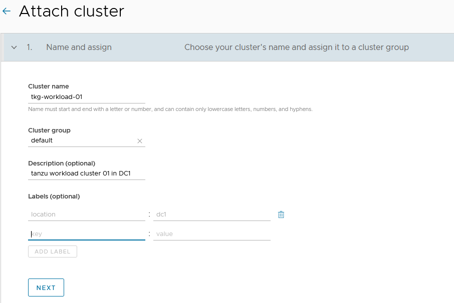
4.  You can optionally select a proxy configuration for the cluster

1.  Click to toggle the Set proxy option to Yes.
2.  Select the proxy configuration you defined for this cluster.


5.  Click Next. When you click Next, Tanzu Mission Control generates a YAML manifest specifically for your cluster, and displays the kubectl/tmc command to run the manifest.
6.  Copy the provided command, switch to the bootstrap machine (or any other machine which has kubectl/tmc installed and has connectivity to the cluster, and then run the command.

1.  If you attach using a proxy configuration, make sure you have the latest version of the Tanzu Mission Control CLI (tmc) installed, and then run the tmc command, replacing &`<kubeconfig>` with the appropriate `kubeconfig` for the cluster.
2.  If you attach without a proxy configuration, connect to the cluster with kubectl, and then run the kubectl command.

To obtain admin `kubeconfig` of a cluster, execute below command on the bootstrap machine:

`tanzu cluster kubeconfig get <cluster-name> --admin --export-file <file-name.yaml>`  

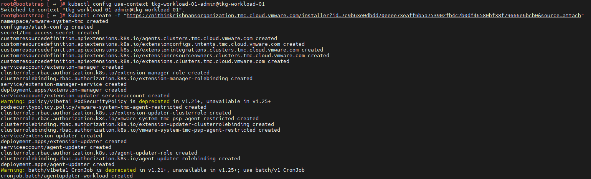

7.  Once the command is applied, wait for all pods to initialize in the namespace `vmware-system-tmc`. Monitor the pods status using the command:
    `kubectl get pods -n vmware-system-tmc`

    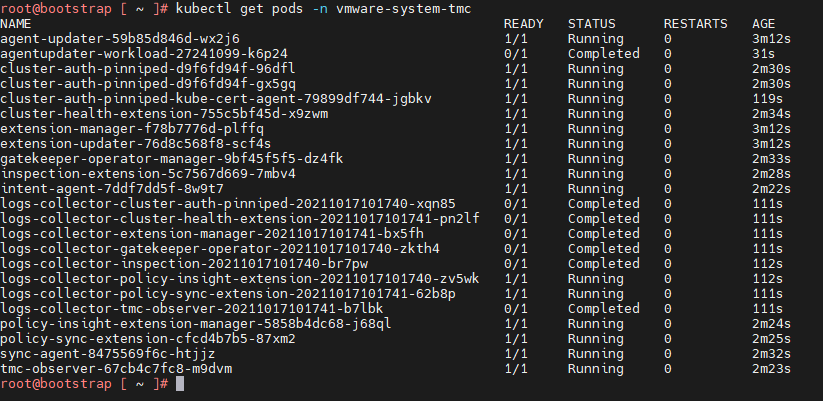  
     
8.  Now back in TMC console, click on “Verify Connection” and you will see the Success message  
    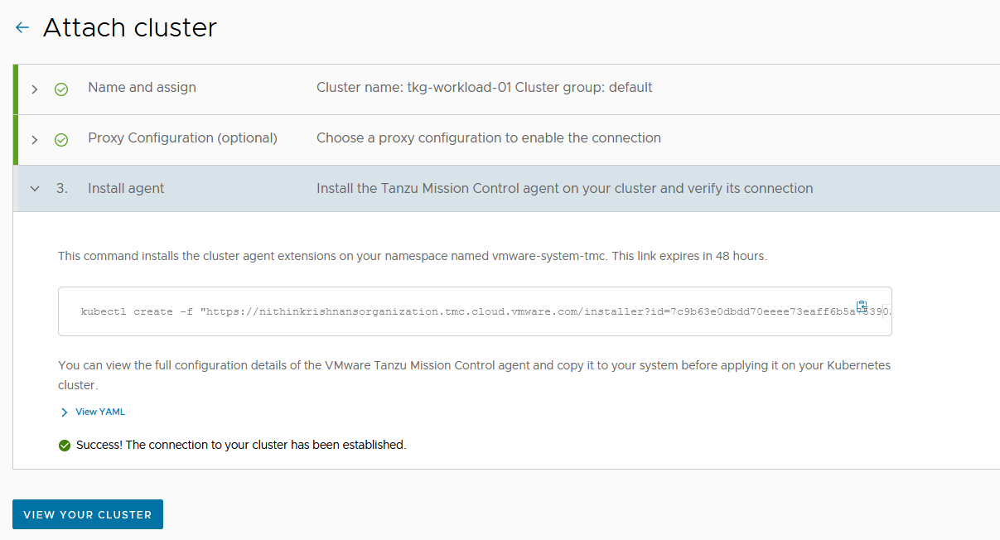
9.  Click on “View your Cluster” to get more details  
    

##### Create a Proxy Configuration Object in TMC

Follow below steps to create a proxy configuration object in TMC

1.  In the left navigation pane of the Tanzu Mission Control console, click Administration.
2.  On the Administration page, click theProxy Configuration tab.  
    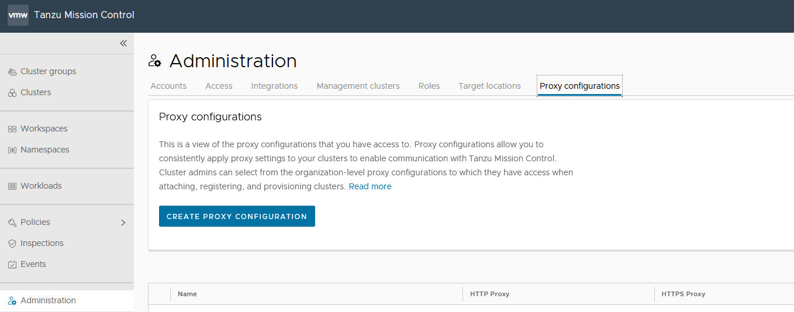
3.  Click Create Proxy Configuration.
4.  On the Create proxy page, enter a name for the proxy configuration.
5.  You can optionally provide a description.
6.  Specify the URL or IP address of the proxy server, and the port on which outbound traffic is allowed.
7.  Enter the credentials (username and password) that permit outbound traffic through the proxy server.
8.  You can optionally enter an alternative server/port and username/password for HTTPS traffic.
9.  In No proxy list, you can optionally specify a comma-separated list of outbound destinations that must bypass the proxy server.  
    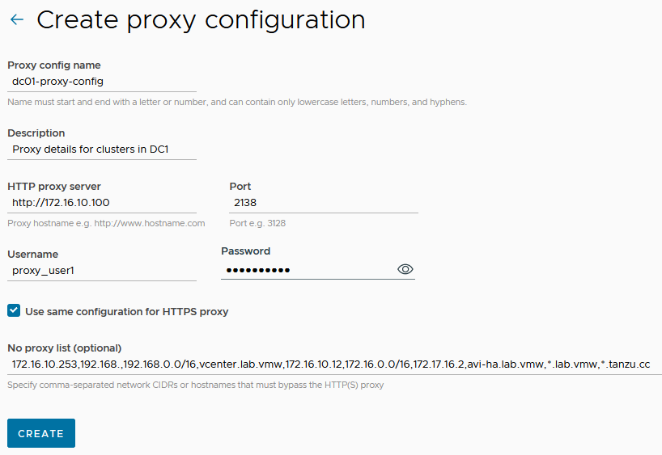
10. Click Create. You will find that the proxy configuration is added to TMC and this can be used while adding the cluster which is sitting behind the added proxy. Based on your environmental needs, you may add multiple proxies in TMC  
      


### Tanzu Observability(TO)


Tanzu Observability delivers full-stack observability across containerized cloud applications, Kubernetes health, and cloud infrastructure. The solution is consumed through a Software-as-a-Service (SaaS) subscription model, managed by VMware. This SaaS model allows the solution to scale to meet our metrics requirements without the need for customers to maintain the solution itself.

#### Monitoring a Tanzu Kubernetes Cluster Workload/Shared Service Cluster using Tanzu Observability (TO)

##### Prerequisites

* An active Tanzu Mission Control subscription.
* Tanzu Observability instance provisioned for your organization

Not only that TMC provides a common management layer across your Kubernetes clusters to configure multiple policies, it also helps you to integrate the clusters with other SaaS solutions such as Tanzu Observability and Tanzu Service Mesh.

##### Procedure  

To integrate Tanzu Observability on a cluster attached to TMC, follow below steps:  

1.  A Service Account  needs to be created in Tanzu Observability (TO) to enable communication between TO and TMC. To create a service account in Tanzu Observability

1.  Log in to your Tanzu Observability instance (<instance_name>.wavefront.com) as a user with Accounts, Groups & Roles permission
2.  From the gear icon in the top right, select Account Management
3.  Click on the Service Accounts tab and click Create New Account to create a service account and an associated API Token.  
    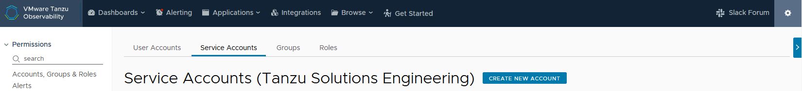
4.  Specify the service account name, optionally provide description and click Create  
    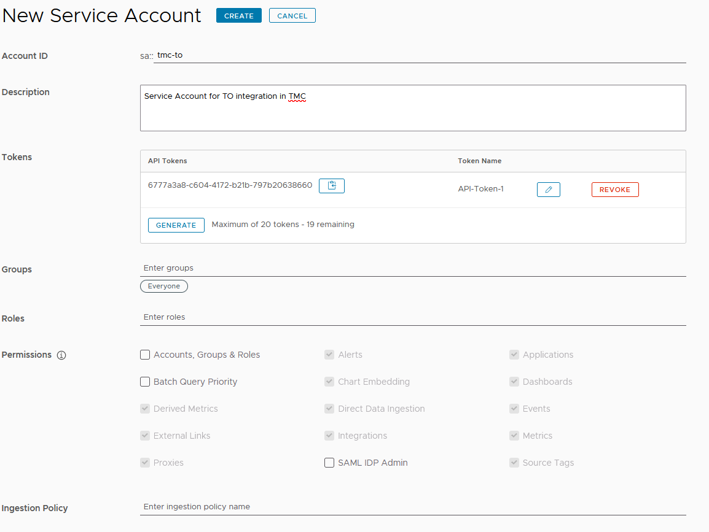
5.  Select the newly created account and click the Copy to Clipboard icon in the Tokens row. You can now paste this token into the Credentials field inside Tanzu Mission Control  


2.  Login to Tanzu Mission Control, In the left navigation pane of the Tanzu Mission Control console, click Administration and click on IntegrationsTile. You will find the available integrations options, and enable the Tanzu Observability if not yet enabled  
    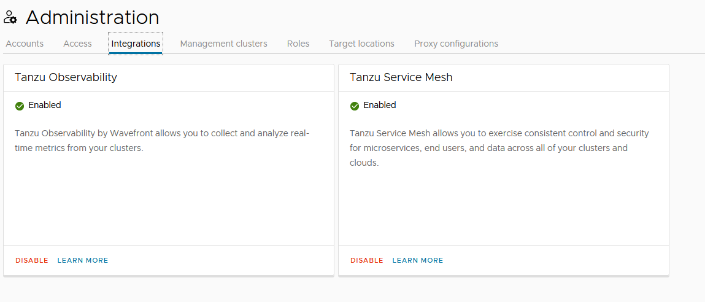
3.  Under Administration switch to Accounts, click onCreate Account Credentials and select Tanzu Observability credential and provide the

1.  Credential Name
2.  Tanzu Observability URL
3.  Tanzu Observability API Token obtained in step 1 and click on Create  
      


4.  Once the required account for Tanzu Observability is created, on the  left navigation pane of the Tanzu Mission Control console, click Clusters and click on the intended cluster that needs to be integrated with Tanzu Observability
5.  On the cluster page, click on Add Integration and select Tanzu Observability  
    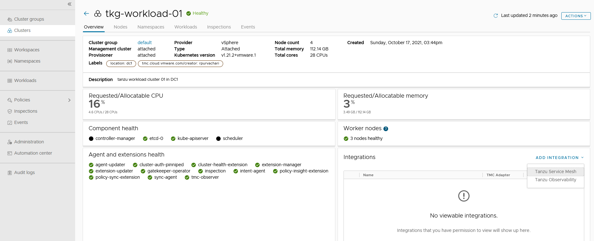
6.  Select the Tanzu Observability Credentials and click Confirm   
    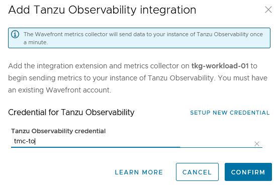  
    You will find that the TMC adapter for TO in unhealthy state for few minutes, this is because required objects are yet to be/being created on the cluster  
    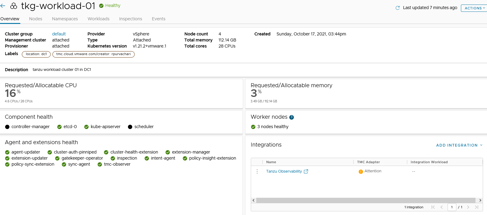  

7.  You will see a new namespace `tanzu-observability-saas` and required objects will be created in the target cluster.  
      
    Wait for all the pods to successfully initialize  
    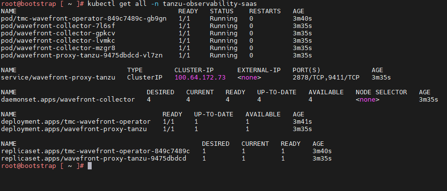
8.  Once all the pods are initialized, in the TMC console you would see the TMC adapter in healthy state  
    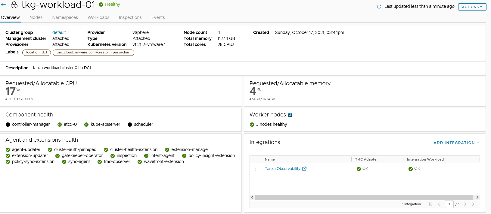  
    This confirms that the integration has been completed and the cluster can be monitored via Tanzu Observability
9.  Either click on the Tanzu Observability link provided in TMC or Log in to your Tanzu Observability instance (<instance_name>.wavefront.com) to ensure that the metrics are being collected in Tanzu Observability  
    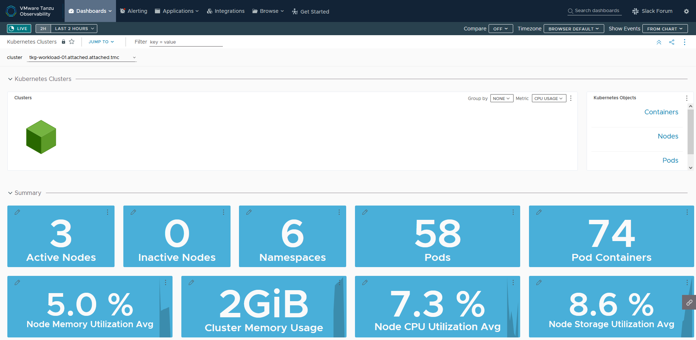  

    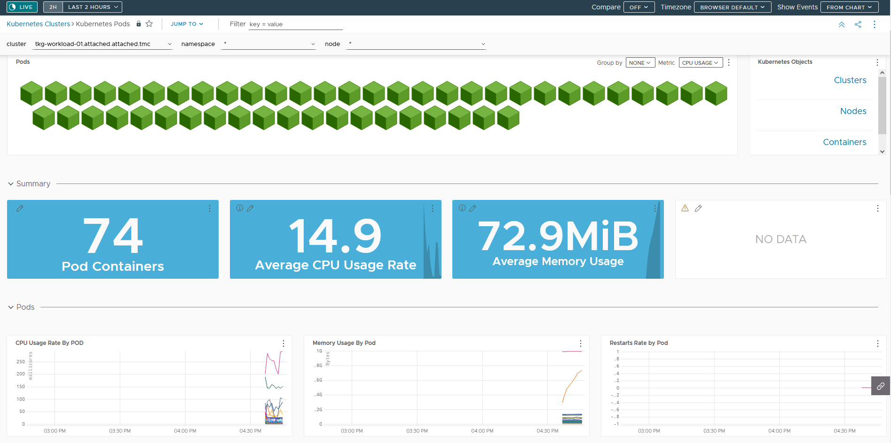

### Tanzu Service Mesh(TSM)

Tanzu Service Mesh is VMware’s enterprise-class service mesh solution that provides consistent control and security for microservices, end users, and data across all your clusters and clouds in the most demanding multi-cluster and multi-cloud environments.

Key Benefits of TSM:

* Extends the service mesh capability (discovery, connectivity, control, security, and observability) to users and data.
* Facilitates the development and management of distributed applications across multiple clusters, multiple clouds, and in hybrid-cloud environments with Global Namespaces, supporting federation across organizational boundaries, technologies, and service meshes
* Implements consistent application-layer traffic management and security policies across all your clusters and clouds
* Integrates with VMware Tanzu™ Mission Control™ , VMware® Enterprise PKS, and VMware Tanzu™ Kubernetes Grid™ to provide a seamless user experience.

#### Onboard a Cluster to Tanzu Service Mesh

##### Prerequisites

* An active Tanzu Mission Control subscription - This is an optional if you intend to onboard a cluster to TSM directly and not
* An active Tanzu Service Mesh subscription
* Workload cluster resource requirements

* Nodes: At least 3 worker nodes, each with at least 3,000 `milliCPU` (3 CPUs) of allocatable CPU and 6 GB of allocatable memory.
* DaemonSets: The DaemonSets instantiate a pod on every node on the cluster. To run the DaemonSets, Tanzu Service Mesh requires that every node in the cluster have at least 250 `milliCPU` and 650 MB of memory available.
* Ephemeral storage: 24 GB for the whole cluster and additionally 1 GB for each node.
* Pods: Tanzu Service Mesh requires a quota of at least 3 pods for each node on the cluster and additionally at least 30 pods for the whole cluster

* If you want to install Tanzu Service Mesh only in some of the namespaces of the cluster, decide beforehand which namespaces you want to exclude from Tanzu Service Mesh
* If you want the cluster to connect to Tanzu Service Mesh through a proxy server, make sure that you know the details of the proxy configuration, such as the type of proxy in use (transparent or explicit), the protocol (HTTP or HTTPS), the host name or IP address of the proxy server, and the port number
* If your corporate proxy server is configured to use a certificate for secure TLS connections, make sure that you know the location of the certificate file. The Tanzu Service Mesh agent on the cluster will use the certificate to connect to the proxy server and trust the connection.

Not only that TMC provides a common management layer across your Kubernetes clusters to configure multiple policies, it also helps you to integrate the clusters with other SaaS solutions such as Tanzu Observability and Tanzu Service Mesh.

#### Procedure - Onboarding without TMC

Below steps provides step by step instructions to onboard a cluster to Tanzu Service Mesh without using TMC integration  

1.  Log into Tanzu Mission Control via [VMware Cloud Services](https://console.cloud.vmware.com) page
2.  In the upper-left corner of the Tanzu Service Mesh Console, click Add New and then Onboard New Cluster to open the Onboard Clusters panel  
    Note: If you're onboarding your first cluster to Tanzu Service Mesh, the Onboard Clusters panel appears automatically when you login to TSM
3.  In the Onboard Clusters panel, enter a name for the cluster that you want to onboard  
    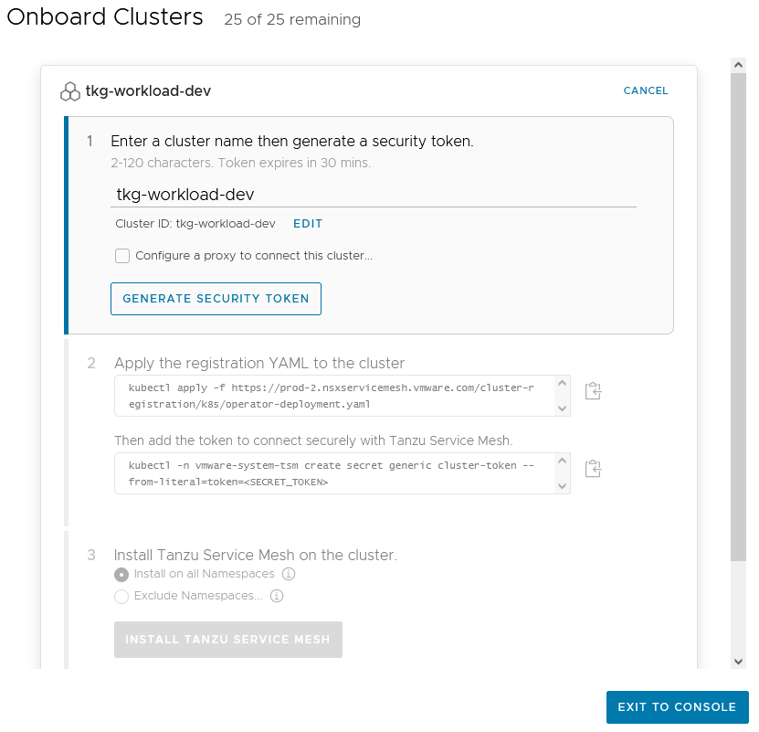
4.  If the cluster that’s being onboarded has to to connect to Tanzu Service Mesh through a proxy server, check the “Configure a proxy to connect this cluster..” box and provide the required proxy details and pass the certificate of the proxy server  
    Note: If your proxy server uses a globally trusted certificate, you don't need to provide the proxy configuration in Tanzu Service Mesh. Deselect the Configure a proxy to connect this cluster check box  
    For the purpose of this document we will proceed without proxy settings
5.  Click Generate Security Token to generate a security token
6.  You will now be provided with 2 kubectl commands:

1.  First one is to apply “operator-deployment.yaml” file which created all required TSM objects, such as Namespace, CRDs, Service Account, RoleBinding, deployments, secret etc. on the target cluster
2.  The second one will create the required secret named “​​generic” under the namespace “vmware-system-tsm”

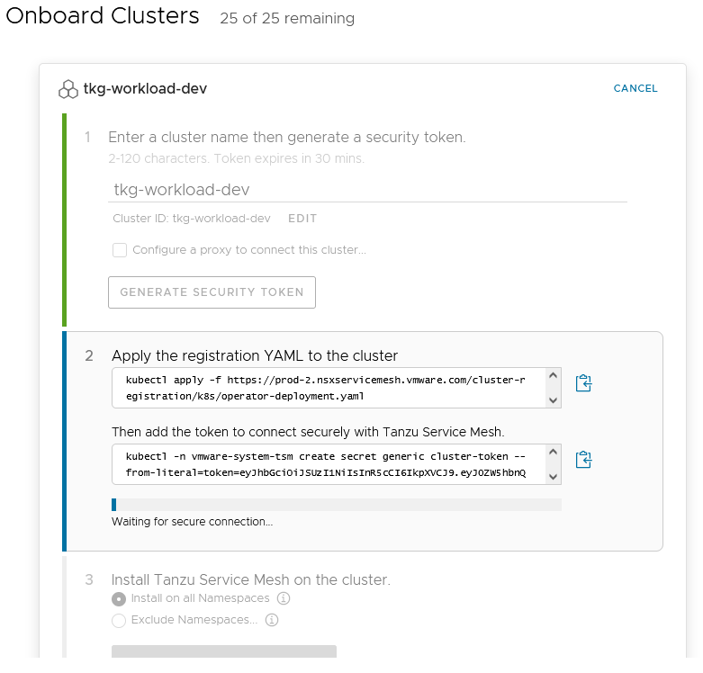

7.  Now you must connect to the target TKG workload cluster and run the commands obtained from previous step  
    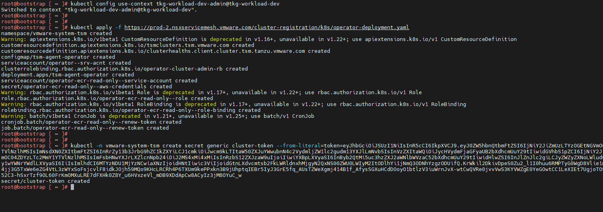  

    Using below command check if all pods under the namespace “vmware-system-tsm” is created successfully  

    kubectl get pods -n vmware-system-tsm  

    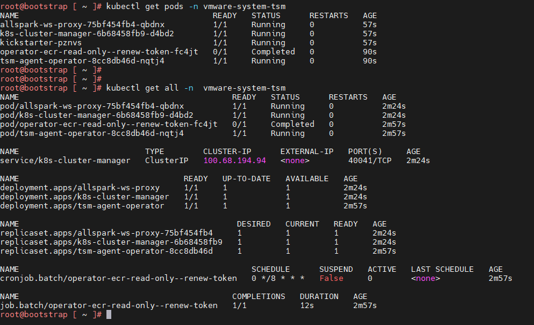successfully
8.  Once we have all the required objects created on the cluster, the Tanzu Service Mesh console will prompt you to “Install Tanzu Service Mesh on the cluster”. For the purpose of this document TSM will be installed on all namespaces.  
    Note:

1.  To install Tanzu Service Mesh in all the namespaces, click Install on all Namespaces. The system namespaces on the cluster, such as kube-system, kube-public, and istio-system, are excluded from Tanzu Service Mesh by default.
2.  To exclude a specific namespace from Tanzu Service Mesh, click Exclude Namespaces, select Is Exactly from the left drop-down menu under Exclude Namespaces, and then enter or select the name of the namespace from the right drop-down menu.
3.  You can also specify the name of a namespace that you plan to create in the cluster at some point in the future  

    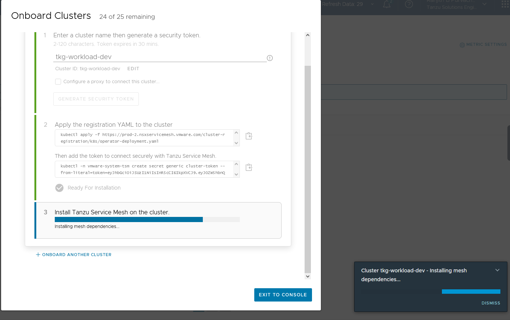

9.  When the installation is complete, `Successfully Onboarded` appears next to the cluster name.  
    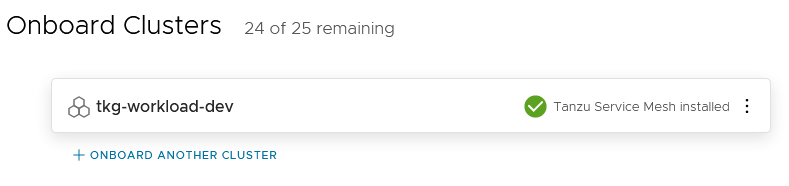
10. Now, the Tanzu Service Mesh Console UI displays information about the infrastructure of the onboarded cluster and the microservices deployed there (if any). Tanzu Service Mesh also starts monitoring and collecting infrastructure and service metrics from the cluster (such as number of nodes and services, requests per second, latency, and CPU usage). The Home page of the Tanzu Service Mesh Console provides summary information about the cluster's infrastructure, a topology view of the services in the cluster, and key metrics

Now, If you have a multi-cluster or hybrid-cloud application, you can connect, secure, and manage the services in the application across the clusters with a global namespace. For more information, see [Connect Services with a Global Namespace](https://docs.vmware.com/en/VMware-Tanzu-Service-Mesh/services/using-tanzu-service-mesh-guide/GUID-8D483355-6F58-4AAD-9EAF-3B8E0A87B474.html).

#### Procedure - Onboarding via TMC

Below steps provides step by step instructions to onboard a cluster to Tanzu Service Mesh using using TMC integration  

1.  Log into Tanzu Mission Control via [VMware Cloud Services](https://console.cloud.vmware.com)page, In the left navigation pane of the Tanzu Mission Control console, click Clusters, and ensure that the cluster that needs to be onboarded to TSM is attached to TMC.  
    To attached a cluster to TMC, refer [Attaching a Tanzu Kubernetes Cluster Workload/Shared Service Cluster to TMC](#h.c4wsd0fsoloe)  

2.  Click on the Target Cluster name, under integration click on Add Integrations, and select Tanzu Service Mesh  

    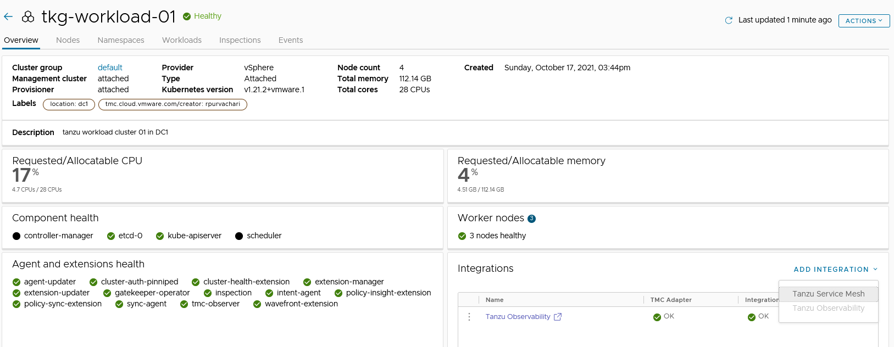Note: If you attached a cluster that is running behind a proxy server to Tanzu Mission Control and enabled Tanzu Service Mesh on that cluster, Tanzu Mission Control automatically forwards the proxy configuration to Tanzu Service Mesh. The Tanzu Service Mesh agent on the cluster uses the proxy configuration to connect the cluster to Tanzu Service Mesh through the proxy server. You don't need to provide proxy configuration settings for clusters managed by Tanzu Mission Control in Tanzu Service Mesh.  

3.  In the “Add Tanzu Service Mesh integration”​​ you can choose to install Tanzu Service mesh on all namespaces or exclude any. For the purpose of this document TSM will be installed on all namespaces.  
    Note:

1.  To install Tanzu Service Mesh in all the namespaces, click Install on all Namespaces. The system namespaces on the cluster, such as kube-system, kube-public, and istio-system, are excluded from Tanzu Service Mesh by default.
2.  To exclude a specific namespace from Tanzu Service Mesh, click Exclude Namespaces, select Is Exactly from the left drop-down menu under Exclude Namespaces, and then enter or select the name of the namespace from the right drop-down menu.
3.  You can also specify the name of a namespace that you plan to create in the cluster at some point in the future  
    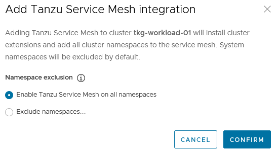

4.  Click on Confirm , you will find that the TMC adapter for TSM in unhealthy state for few minutes, this is because required objects are yet to be/being created on the cluster
5.  On the target cluster, you will see a new namespace “vmware-system-tsm” and required objects are being created.  
    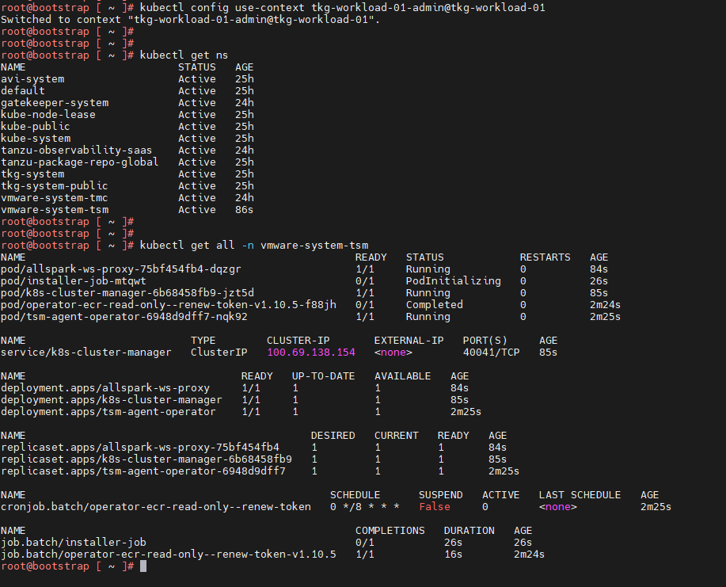  
    Meanwhile you see the progress bar of the TSM installation in Tanzu Service Mesh console  
    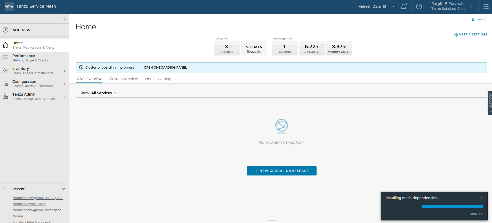  

6.  Once all the required objects and dependencies are created, TSM integration status for the cluster in TMC will show healthy  
    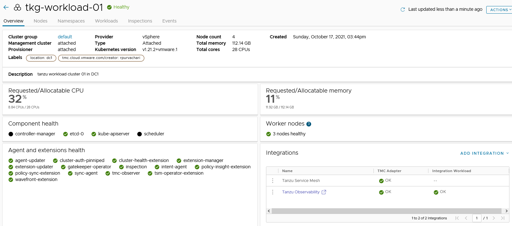  
    And in TSM console you will find that the cluster is successfully onboarded  
    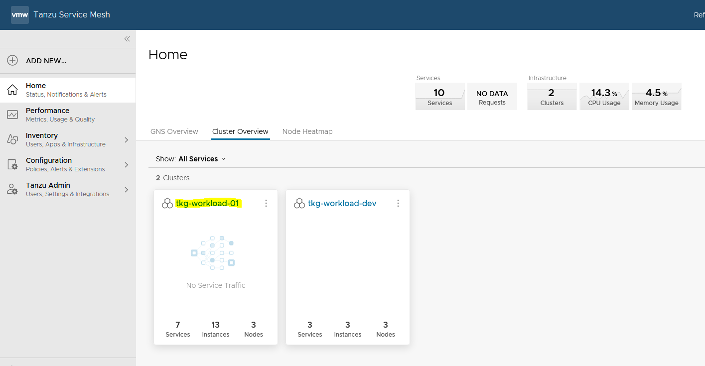

Now, If you have a multi-cluster or hybrid-cloud application, you can connect, secure, and manage the services in the application across the clusters with a global namespace. For more information, see [Connect Services with a Global Namespace](https://docs.vmware.com/en/VMware-Tanzu-Service-Mesh/services/using-tanzu-service-mesh-guide/GUID-8D483355-6F58-4AAD-9EAF-3B8E0A87B474.html).
