# Deploy VMware Tanzu for Kubernetes Operations on vSphere

This document provides step-by-step instructions for deploying and configuring VMware Tanzu for Kubernetes Operations (informally known as TKO) on a vSphere environment backed by a Virtual Distributed Switch (VDS).  

The scope of the document is limited to providing the deployment steps based on the reference design in [VMware Tanzu for Kubernetes Operations on vSphere Reference Design](../reference-designs/tko-on-vsphere.md). This document does not cover any deployment procedures for the underlying SDDC components.

## Deploying with VMware Service Installer for Tanzu

You can use VMware Service Installer for VMware Tanzu to automate this deployment.

VMware Service Installer for Tanzu automates the deployment of the reference designs for Tanzu for Kubernetes Operations. It uses best practices for deploying and configuring the required Tanzu for Kubernetes Operations components.

To use Service Installer to automate this deployment, see [Deploying VMware Tanzu for Kubernetes Operations on vSphere with vSphere Distributed Switch Using Service Installer for VMware Tanzu](https://docs.vmware.com/en/Service-Installer-for-VMware-Tanzu/2.1/service-installer/GUID-index.html).

Alternatively, if you decide to manually deploy each component, follow the steps provided in this document.

## Supported Component Matrix

The following table provides the validated component versions for this deployment.

|**Software Components**|**Version**|
| ---| --- |
|Tanzu Kubernetes Grid|2.1.x|
|VMware vSphere ESXi|7.0U3 and later|
|VMware vCenter (VCSA)|7.0U3 and later|
|VMware vSAN|7.0U3 and later|
|NSX Advanced LB|22.1.2 |

For the latest information, see [VMware Product Interoperability Matrix](https://interopmatrix.vmware.com/Interoperability?col=551,9293&row=789,%262,%26912).

## Prepare your Environment for Deploying Tanzu for Kubernetes Operations

Before deploying Tanzu for Kubernetes Operations on vSphere, ensure that your environment is set up as described in the following requirements:

* [General Requirements](#gen-requirements)
* [Network Requirements](#network-req)
* [Firewall Requirements](#firewall-req)

### <a id="gen-requirements"> </a> General Requirements

The general requirements for deploying Tanzu for Kubernetes Operations on vSphere in your environment are as follows:

* vSphere 7.0 U3 or later with an Enterprise Plus license.
* Your SDDC environment has the following objects:
  * A vSphere cluster with at least 3 hosts, on which vSphere DRS is enabled
  * A dedicated resource pool to deploy the Tanzu Kubernetes Grid management cluster, shared services cluster, and workload clusters. The number of resource pools depends on the number of workload clusters to be deployed.
* VM folders to collect the Tanzu Kubernetes Grid VMs.
* A datastore with sufficient capacity for the control plane and worker node VM files.
* Network Time Protocol (NTP) service running on all hosts and vCenter.
* A host, server, or VM based on Linux, MacOS, or Windows that acts as your bootstrap machine and that has docker installed. For this deployment, a virtual machine based on Photon OS is used.
* Depending on the OS flavor of the bootstrap VM, download and configure the following packages from [VMware Customer Connect](https://customerconnect.vmware.com/downloads/info/slug/infrastructure_operations_management/vmware_tanzu_kubernetes_grid/2_x). As part of this documentation, refer to the section to configure required packages on the Photon OS machine.

  * Tanzu CLI 2.1.0
  * kubectl cluster CLI 1.24.9

* A vSphere account with the permissions described in [Required Permissions for the vSphere Account](https://docs.vmware.com/en/VMware-Tanzu-Kubernetes-Grid/2.1/tkg-deploy-mc-21/mgmt-reqs-prep-vsphere.html).
* Download and import NSX Advanced Load Balancer 22.1.2 OVA to Content Library.
* Download the following OVA from [VMware Customer Connect](https://customerconnect.vmware.com/downloads/info/slug/infrastructure_operations_management/vmware_tanzu_kubernetes_grid/2_x) and import to vCenter. Convert the imported VMs to templates.

  * Photon v3 Kubernetes v1.24.9 OVA
  * Ubuntu 2004 Kubernetes v1.24.9 OVA  

> **Note** You can also download supported older versions of Kubernetes from [VMware Customer Connect](https://customerconnect.vmware.com/downloads/info/slug/infrastructure_operations_management/vmware_tanzu_kubernetes_grid/2_x) and import them to deploy workload clusters on the intended Kubernetes versions.

> **Note** In Tanzu Kubernetes Grid nodes, it is recommended to not use hostnames with ".local" domain suffix. For more information, see [KB article](https://kb.vmware.com/s/article/83623). 

#### Resource Pools and VM Folders

The sample entries of the resource pools and folders that need to be created are as follows.

|**Resource Type**|**Sample Resource Pool Name**|**Sample Folder Name**|
| --- | --- | --- |
|NSX ALB Components|`tkg-alb-components`|`tkg-alb-components`|
|TKG Management components|`tkg-management-components`|`tkg-management-components`|
|TKG Shared Service Components|`tkg-sharedsvc-components`|`tkg-sharedsvc-components`|
|TKG Workload components|`tkg-workload01-components`|`tkg-workload01-components`|

### <a id="network-req"> </a> Network Requirements

Create port groups on vSphere DVSwitch for deploying Tanzu for Kubernetes Operations components as per [Network Requirements](https://docs.vmware.com/en/VMware-Tanzu-for-Kubernetes-Operations/2.1/tko-reference-architecture/GUID-reference-designs-tko-on-vsphere.html#network-requirements-8) defined in the reference architecture.

### <a id="firewall-req"></a> Firewall Requirements

Ensure that the firewall is set up as described in [Firewall Requirements](https://docs.vmware.com/en/VMware-Tanzu/services/tanzu-reference-architecture/GUID-reference-designs-tko-on-vsphere.html#firewall-recommendations-4).

## Subnet and CIDR Examples

For this demonstration, this document makes use of the following CIDR for Tanzu for Kubernetes Operations deployment.

|**Network Type**|**Port Group Name**|**Gateway CIDR**|**DHCP Pool**|**NSX ALB IP Pool**|
| --- | --- | --- | --- | --- |
|NSX ALB Management Network|sfo01-w01-vds01-albmanagement|172.16.10.1/24|N/A|172.16.10.100- 172.16.10.200|
|TKG Management Network|sfo01-w01-vds01-tkgmanagement|172.16.40.1/24|172.16.40.100- 172.16.40.200|N/A|
|TKG Management VIP Network|sfo01-w01-vds01-tkgmanagementvip|172.16.50.1/24|N/A|172.16.50.100- 172.16.50.200|
|TKG Cluster VIP Network|sfo01-w01-vds01-tkgclustervip|172.16.80.1/24|N/A|172.16.80.100- 172.16.80.200|
|TKG Workload VIP Network|sfo01-w01-vds01-tkgworkloadvip|172.16.70.1/24|N/A|172.16.70.100 - 172.16.70.200|
|TKG Workload Segment|sfo01-w01-vds01-tkgworkload|172.16.60.1/24|172.16.60.100- 172.16.60.200|N/A|

## Tanzu for Kubernetes Operations Deployment Overview

The high-level steps for deploying Tanzu for Kubernetes Operations on vSphere backed by VDS are as follows:

1. [Deploy and Configure NSX Advanced Load Balancer](#dep-config-nsx-alb)
1. [Deploy and Configure Bootstrap Machine](#bootstrap)
1. [Deploy Tanzu Kubernetes Grid Management Cluster](#deploy-mgmg-cluster)
1. [Register Management Cluster with Tanzu Mission Control](#register-tmc)
1. [Deploy Tanzu Kubernetes Grid Shared Services Cluster](#dep-shared-cluster)
1. [Deploy Tanzu Kubernetes Grid Workload Clusters](#dep-workload-cluster)
1. [Configure Tanzu SaaS Components and Deploy User-Managed Packages](#dep-user-mgd-packages)

## <a id="dep-config-nsx-alb"> </a> Deploy and Configure NSX Advanced Load Balancer

NSX Advanced Load Balancer (ALB) is an enterprise-grade integrated load balancer that provides L4 - L7 load balancer support. It is recommended for vSphere deployments without NSX-T, or when there are unique scaling requirements.

NSX Advanced Load Balancer is deployed in Write Access Mode in the vSphere Environment. This mode grants NSX Advanced Load Balancer controllers full write access to vCenter that helps in automatically creating, modifying, and removing service engines (SEs) and other resources as needed to adapt to changing traffic needs.

For a production-grade deployment, it is recommended to deploy three instances of the NSX Advanced Load Balancer controller for high availability and resiliency.  

The following table provides a sample IP address and FQDN set for the NSX Advanced Load Balancer controllers:  

|**Controller Node**|**IP Address**|**FQDN**|
| --- | --- | --- |
|Node 1 Primary|172.16.10.11|`sfo01albctlr01a.sfo01.rainpole.local`|
|Node 2 Secondary|172.16.10.12|`sfo01albctlr01b.sfo01.rainpole.local`|
|Node 3 Secondary |172.16.10.13|`sfo01albctlr01c.sfo01.rainpole.local`|
|HA Address|172.16.10.10|`sfo01albctlr01.sfo01.rainpole.local`|

Follow these steps to deploy and configure NSX Advanced Load Balancer:

1. [Deploy NSX Advanced Load Balancer](#dep-nsx-alb)
1. [NSX Advanced Load Balancer: Initial setup](#nsx-alb-init)
1. [NSX Advanced Load Balancer: Licensing](#nsx-alb-license)
1. [NSX Advanced Load Balancer: Controller High Availability](#nsx-alb-ha)
1. [NSX Advanced Load Balancer: Certificate Management](#nsx-alb-cert-mgmt)
1. [NSX Advanced Load Balancer: Create vCenter Cloud and SE Groups](#nsx-alb-vcenter-se)
1. [NSX Advanced Load Balancer: Configure Network and IPAM & DNS Profiles](#nsx-alb-net-ipam)

### <a id="dep-nsx-alb"> </a> Deploy NSX Advanced Load Balancer

As a prerequisites, you must have the NSX Advanced Load Balancer 22.1.2 OVA downloaded and imported to the content library. Deploy the NSX Advanced Load Balancer under the resource pool **“nsx-alb-components”**  and place it under the folder **“nsx-alb-components”**.

To deploy NSX Advanced Load Balancer, complete the following steps.

1. Log in to **vCenter** and go to **Home** > **Content Libraries**.
1. Select the content library under which the NSX Advanced Load Balancer OVA is placed.
1. Click on **OVA & OVF Templates**.
1. Right-click the NSX Advanced Load Balancer image and select **New VM from this Template**.
1. On the Select name and folder page, enter a name and select a folder for the NSX Advanced Load Balancer VM as **nsx-alb-components**.
1. On the Select a compute resource page, select the resource pool **nsx-alb-components**.
1. On the Review details page, verify the template details and click **Next**.
1. On the Select storage page, select a storage policy from the VM Storage Policy drop-down menu and choose the  datastore location where you want to store the virtual machine files.
1. On the Select networks page, select the network **sfo01-w01-vds01-albmanagement** and click **Next**.
1. On the Customize template page, provide the NSX Advanced Load Balancer management network details such as IP address, subnet mask, and gateway, and click **Next**.
1. On the Ready to complete page, review the page and click **Finish**.

    

A new task for creating the virtual machine appears in the **Recent Tasks** pane. After the task is complete, the NSX Advanced Load Balancer virtual machine is created on the selected resource. Power on the virtual machine and give it a few minutes for the system to boot. Upon successful boot up, go to NSX Advanced Load Balancer on your browser.  
> **Note** While the system is booting up, a blank web page or a 503 status code may appear.  

### <a id="nsx-alb-init"> </a> NSX Advanced Load Balancer: Initial Setup

After NSX Advanced Load Balancer is successfully deployed and running, go to NSX Advanced Load Balancer on your browser using the URL https://<em><IP/FQDN></em> and configure the basic system settings:

1. Set admin password and click on **Create Account**.

    


2. On the Welcome page, under **System Settings**, set backup passphrase and provide DNS information, and click **Next**.

    

3. Under **Email/SMTP**, provide email and SMTP information, and click **Next**.

    

4. Under **Multi-Tenant**, configure settings as follows and click **Save**.
    - IP Route Domain: Share IP route domain across tenants  
    - Service Engines are managed within the: Provider (Shared across tenants)  
    - Tenant Access to Service Engine: Read Access

    

If you did not select the **Setup Cloud After** option before saving, the initial configuration wizard exits. The Cloud configuration window does not automatically launch and you are directed to a dashboard view on the controller.

### NSX Advanced Load Balancer: NTP Configuration

To configure NTP, go to **Administration** > **Settings** > **DNS/NTP > Edit** and add your NTP server details and click **Save**.

> **Note** You may also delete the default NTP servers.

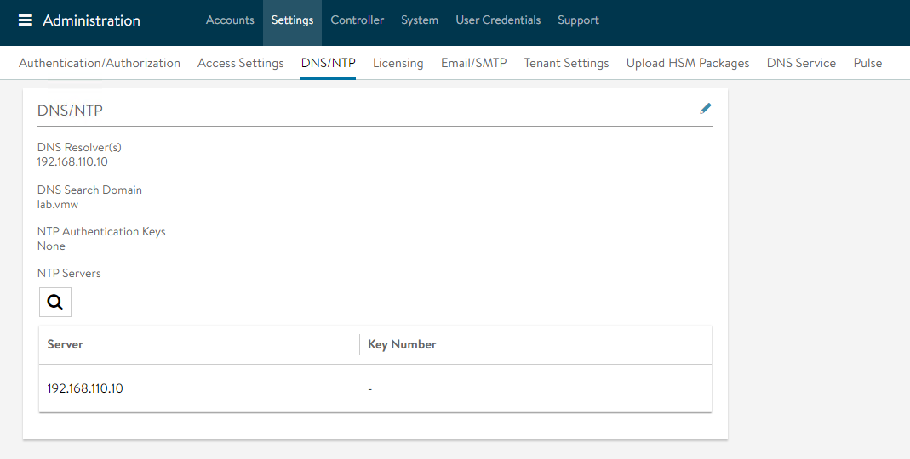

### <a id="nsx-alb-license"></a> NSX Advanced Load Balancer: Licensing

 You can configure the license tier as NSX ALB Enterprise or NSX ALB Essentials for VMware Tanzu as per the feature requirement. This section focuses on enabling NSX Advanced Load Balancer using **Enterprise Tier (VMware NSX ALB Enterprise)** license model.
 
1. To configure licensing, go to **Administration**  > **Licensing** and click on the gear icon to change the license type to Enterprise. 

    

1. Select Enterprise Tier as the license type and click **Save**.

    

1. Once the license tier is changed, apply the NSX Advanced Load Balancer Enterprise license key. If you have a license file instead of a license key, apply the license by clicking on the **Upload a License File(.lic)** option.

    

### <a id="nsx-alb-ha"> </a> NSX Advanced Load Balancer: Controller High Availability

In a production environment, it is recommended to deploy additional controller nodes and configure the controller cluster for high availability and disaster recovery. Adding 2 additional nodes to create a 3-node cluster provides node-level redundancy for the controller and also maximizes performance for CPU-intensive analytics functions.

To run a 3-node controller cluster, you deploy the first node and perform the initial configuration, and set the cluster IP address. After that, you deploy and power on two more controller VMs, but you must not run the initial configuration wizard or change the admin password for these controllers VMs. The configuration of the first controller VM is assigned to the two new controller VMs.

The first controller of the cluster receives the Leader role. The second and third controllers work as Follower.

Complete the following steps to configure NSX Advanced Load Balancer cluster.

1. Log in to the primary NSX Advanced Load Balancer controller and go to **Administrator** > **Controller** > **Nodes**, and click **Edit**.

    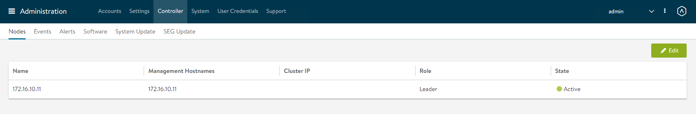

2. Specify **Name** and **Controller Cluster IP**, and click **Save**. This IP address must be from the NSX Advanced Load Balancer management network.

    

3. Deploy the 2nd and 3rd NSX Advanced Load Balancer controller nodes by using steps in [Deploy NSX Advanced Load Balancer](#dep-nsx-alb).

4. Log into the primary NSX Advanced Load Balancer controller using the Controller Cluster IP/FQDN and go to **Administrator** > **Controller** >  **Nodes**, and click **Edit**. The Edit Controller Configuration popup appears.

5. In the **Cluster Nodes** field, enter the IP address for the 2nd and 3rd controller, and click **Save**.

    

    After you complete these steps, the primary NSX Advanced Load Balancer controller becomes the leader for the cluster and invites the other controllers to the cluster as members.

    NSX Advanced Load Balancer then performs a warm reboot of the cluster. This process can take approximately 10-15 minutes. You are automatically logged out of the controller node where you are currently logged in. Enter the cluster IP address in the browser, to see details about the cluster formation task.

    

The configuration of the primary (leader) controller is synchronized to the new member nodes when the cluster comes online following the reboot. After the cluster is successfully formed, you can see the following status:


> **Note** In the following tasks, all NSX Advanced Load Balancer configurations are done by connecting to the NSX ALB Controller Cluster IP/FQDN.

### <a id="nsx-alb-cert-mgmt"> </a> NSX Advanced Load Balancer: Certificate Management

The default system-generated controller certificate generated for SSL/TSL connections will not have the required subject alternate name (SAN) entries. Complete the following steps to create a controller certificate:

1. Log in to the NSX Advanced Load Balancer controller and go to **Templates** > **Security** > **SSL/TLS Certificates**.

1. Click **Create** and select **Controller Certificate**. You can either generate a self-signed certificate, generate CSR, or import a certificate. For the purpose of this document, a self-signed certificate is generated.

1. Provide all required details as per your infrastructure requirements and in the **Subject Alternate Name (SAN)** field, provide IP address and FQDN of all NSX Advanced Load Balancer controllers including NSX Advanced Load Balancer cluster IP and FQDN, and click **Save**.

    
    

1. After the certificate is created, capture the certificate contents as this is required while deploying the Tanzu Kubernetes Grid management cluster.
  To capture the certificate content, click on the Download icon next to the certificate, and click **Copy to clipboard** under **Certificate**.

    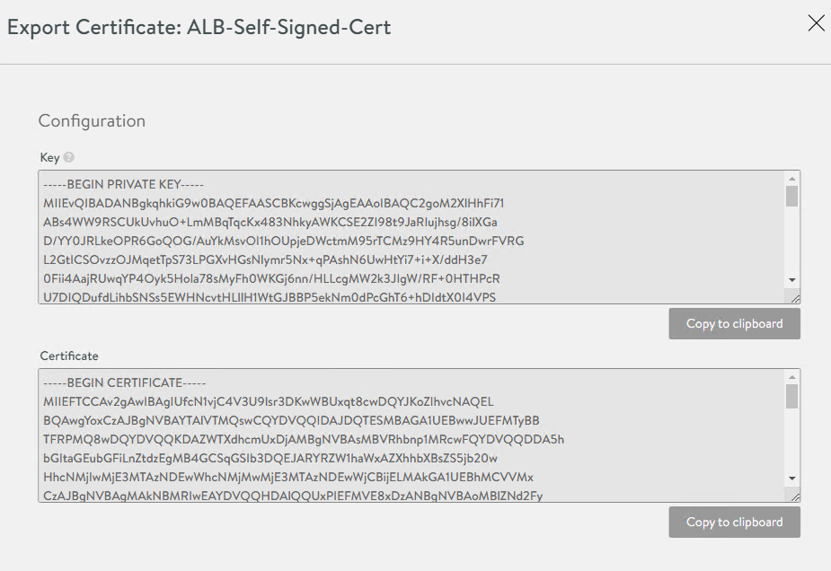

1. To replace the certificate, go to **Administration** > **Settings** > **Access Settings**, and click the pencil icon at the top right to edit the system access settings, and then replace the SSL/TSL certificate and click **Save**.

    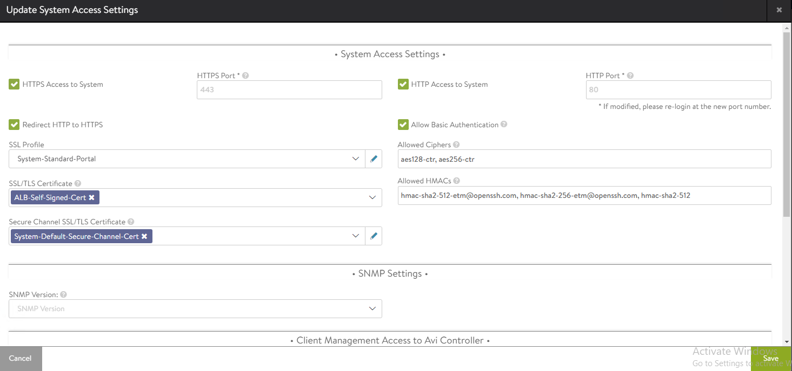

1. Log out and log in to NSX Advanced Load Balancer.

### <a id="nsx-alb-vcenter-se"> </a> NSX Advanced Load Balancer: Create vCenter Cloud and SE Groups

NSX Advanced Load Balancer can be deployed in multiple environments for the same system. Each environment is called a cloud. The following procedure provides steps on how to create a VMware vCenter cloud, and as shown in the architecture two service engine (SE) groups are created.

**Service Engine Group 1**: Service engines part of this service engine group hosts:

* Virtual services that load balances control plane nodes of Management Cluster and Shared services cluster.
* Virtual services for all load balancer functionalities requested by Tanzu Kubernetes Grid management cluster and Shared services cluster.

**Service Engine Group 2**: Service engines part of this service engine group hosts virtual services that load balances control plane nodes and virtual services for all load balancer functionalities requested by the workload clusters mapped to this SE group. 

> **Note**
* Based on your requirements, you can create additional SE groups for the workload clusters.
* Multiple workload clusters can be mapped to a single SE group.
* A Tanzu Kubernetes Grid cluster can be mapped to only one SE group for application load balancer services.
* Control plane VIP for the workload clusters will be placed on the respective Service Engine group assigned through AKO Deployment Config (ADC) during cluster creation.

For information about mapping a specific service engine group to Tanzu Kubernetes Grid workload cluster, see [Configure NSX Advanced Load Balancer in Tanzu Kubernetes Grid Workload Cluster](#workloadalb).


1. Log in to NSX Advanced Load Balancer and go to **Infrastructure** > **Clouds** > **Create** > **VMware vCenter/vSphere ESX**.

    

1. Under **General** pane, in the **Name** field, enter a Cloud name. 

    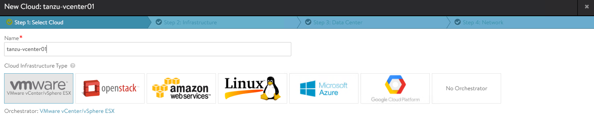

1. Under the **vCenter/vSphere** pane, specify the vCenter address*, Username, and Password, and  click **CONNECT**.

    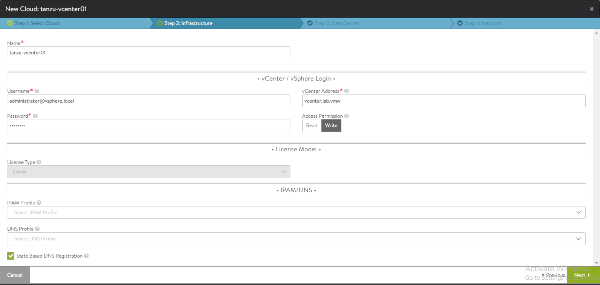

1. Under the **Data Center** pane, choose the data center from the Data Center drop-down menu. Select **Content Library** for SE template and click **SAVE & LAUNCH**.

    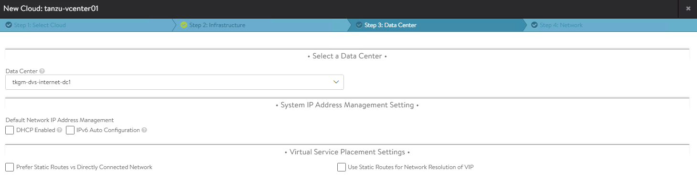

1. To choose the NSX Advanced Load Balancer management network for service engines, select the Management Network from the **Management Network** drop-down menu. Enter a static IP address pool for SEs and VIP, and click **Complete**.
    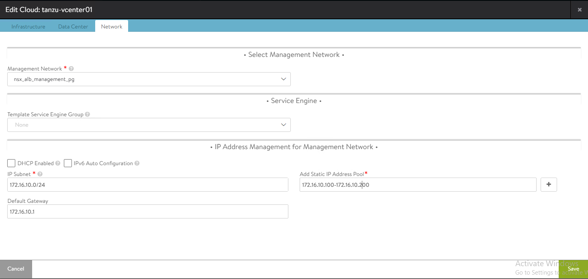

1. Wait for the cloud to get configured and the status to turn green.

    

1. To create a service engine group for Tanzu Kubernetes Grid management clusters, under the **Infrastructure** tab, go to **Cloud Resources** > **Service Engine Group**.
From the **Select Cloud** drop-down menu, select the cloud created in the previous step and click **Create**.<p>
The following components are created in NSX Advanced Load Balancer.

   | **Object** | **Sample Name** |
   | --- | --- |
   | vCenter Cloud | sfo01w01vc01 |
   | Service Engine Group 1 | sfo01m01segroup01 |
   | Service Engine Group 2 | sfo01w01segroup01 |


1. Enter a name for the Tanzu Kubernetes Grid management service engine group and set the following parameters:  

    | **Parameter** | **Value** |
    | --- | --- |
    | High availability mode | Active/Active - NSX ALB Enterprise edition  <br> Active/Standby - NSX ALB Essentials for Tanzu edition.|
    | Enable Service Engine Self Election | Supported with NSX ALB Enterprise edition.|
    | Memory for caching | Supported with NSX ALB Enterprise edition. You must set value to `0` for essentials.|
    | Memory per Service Engine | 4   |
    | vCPU per Service Engine | 2   |

    Use the default values for the rest of the parameters.

    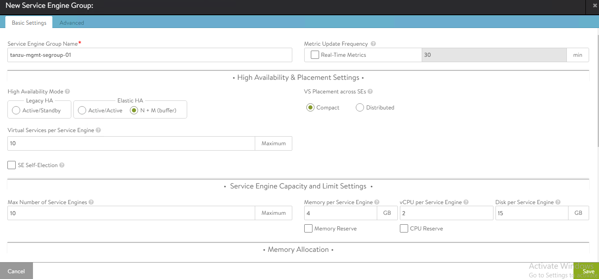

    For advanced configuration, click on the Advanced tab, specify a specific cluster and datastore for service engine placement. After that, change the NSX_ALB SE folder name and service engine name prefix, and click **Save**.

      

1. Repeat steps 7 and 8 to create another service engine group for Tanzu Kubernetes Grid workload clusters. After completing this step, you will have two service engine groups created.  
    

### <a id="nsx-alb-net-ipam"> </a> NSX Advanced Load Balancer: Configure Network and IPAM Profile

#### Configure Tanzu Kubernetes Grid Networks in NSX Advanced Load Balancer

As part of the cloud creation in NSX Advanced Load Balancer, only management network has been configured in NSX Advanced Load Balancer. Complete the following steps to configure these networks:

   * TKG Management Network
   * TKG Workload Network
   * TKG Cluster VIP/Data Network
   * TKG Management VIP/Data Network
   * TKG Workload VIP/Data Network

1. Log in to NSX Advanced Load Balancer and go to **Infrastructure** > **Cloud Resources** > **Networks**.

1. Select the desired cloud. All the networks available in vCenter are listed.

1. Click on the edit icon next for the network and configure as follows. Change the provided details as per your SDDC configuration.

    > **Note** Not all networks are auto-discovered. For those networks, manually add the subnet.

    <!-- /* cSpell:disable */ -->

    | **Network Name** | **DHCP** | **Subnet** | **Static IP Pool** |
    | --- | --- | --- | --- |
    | sfo01-w01-vds01-tkgmanagement | Yes | 172.16.40.0/24 | NA  |
    | sfo01-w01-vds01-tkgworkload | Yes | 172.16.60.0/24 | NA  |
    | sfo01-w01-vds01-tkgclustervip | No  | 172.16.80.0/24 | 172.16.80.100 - 172.16.80.200 |
    | sfo01-w01-vds01-tkgmanagementvip | No  | 172.16.50.0/24 | 172.16.50.100 - 172.16.50.200 |
    | sfo01-w01-vds01-tkgworkloadvip | No  | 172.16.70.0/24 | 172.16.70.100 - 172.16.70.200 |
    <!-- /* cSpell:enable */ -->

    The following snippet shows an example network configuration: `sfo01-w01-vds01-tkgclustervip` , Same configuration should be applied in sfo01-w01-vds01-tkgmanagementvip and sfo01-w01-vds01-tkgworkloadvip

    

    sfo01-w01-vds01-tkgmanagement and sfo01-w01-vds01-tkgworkload network should be enabled with DHCP

    After the networks are configured, the configuration must look like the following image.
    

#### Create IPAM and DNS Profile in NSX Advanced Load Balancer and Attach it to Cloud

At this point, all the required networks related to Tanzu functionality are configured in NSX Advanced Load Balancer, except for Tanzu Kubernetes Grid management and workload network which uses DHCP. NSX Advanced Load Balancer provides IPAM service for Tanzu Kubernetes Grid cluster VIP network, management VIP network, and workload VIP network.  

Complete the following steps to create an IPAM profile and attach it to the vCenter cloud created earlier.  

1. Log in to NSX Advanced Load Balancer and go to **Templates** > **Profiles** >  **IPAM/DNS Profiles** > **Create** > **IPAM Profile**, provide the following details, and click **Save**.  

    <!-- /* cSpell:disable */ -->

    | **Parameter** | **Value** |
    | --- | --- |
    | Name | sfo01-w01-vcenter-ipam-01 |
    | Type | AVI Vintage IPAM |
    | Cloud for Usable Networks | Tanzu-vcenter-01 (created earlier in this deployment) |
    | Usable Networks | sfo01-w01-vds01-tkgclustervip  <br>sfo01-w01-vds01-tkgmanagementvip  <br>sfo01-w01-vds01-tkgworkloadvip |

    <!-- /* cSpell:enable */ -->

    

1. Click **Create** > **DNS Profile** and provide the domain name.

    

1. Attach the IPAM and DNS profiles to the `sfo01w01vc01` cloud.
    1. Navigate to **Infrastructure** > **Clouds**.
    2. Edit the sfo01w01vc01 cloud.
    3. Under IPAM/DNS section, choose the IPAM and DNS profiles created earlier and save the updated configuration.  
      

This completes the NSX Advanced Load Balancer configuration. The next step is to deploy and configure a bootstrap machine. The bootstrap machine is used to deploy and manage Tanzu Kubernetes clusters.

## <a id="bootstrap"> </a> Deploy and Configure Bootstrap Machine

The deployment of the Tanzu Kubernetes Grid management and workload clusters is facilitated by setting up a bootstrap machine where you install the Tanzu CLI and Kubectl utilities which are used to create and manage the Tanzu Kubernetes Grid instance. This machine also keeps the Tanzu Kubernetes Grid and Kubernetes configuration files for your deployments. The bootstrap machine can be a laptop, host, or server running on Linux, macOS, or Windows that you deploy management and workload clusters from.

The bootstrap machine runs a local `kind` cluster when Tanzu Kubernetes Grid management cluster deployment is started. Once the `kind` cluster is fully initialized, the configuration is used to deploy the actual management cluster on the backend infrastructure. After the management cluster is fully configured, the local `kind` cluster is deleted and future configurations are performed with the Tanzu CLI.

For this deployment, a Photon-based virtual machine is used as the bootstrap machine. For information on how to configure for a macOS or Windows machine, see [Install the Tanzu CLI and Other Tools](https://docs.vmware.com/en/VMware-Tanzu-Kubernetes-Grid/2.1/tkg-deploy-mc-21/install-cli.html).

The bootstrap machine must meet the following prerequisites:

   * A minimum of 6 GB of RAM and a 2-core CPU.
   * System time is synchronized with a Network Time Protocol (NTP) server.
   * Docker and containerd binaries are installed. For instructions on how to install Docker, see [Docker documentation](https://docs.docker.com/engine/install/centos/).
   * Ensure that the bootstrap VM is connected to Tanzu Kubernetes Grid management network, `sfo01-w01-vds01-tkgmanagement`.

To install Tanzu CLI, Tanzu Plugins, and Kubectl utility on the bootstrap machine, follow the instructions below:

1. Download and unpack the following Linux CLI packages from [VMware Tanzu Kubernetes Grid Download Product page](https://customerconnect.vmware.com/downloads/info/slug/infrastructure_operations_management/vmware_tanzu_kubernetes_grid/2_x).

   * VMware Tanzu CLI 2.1.0 for Linux
   * kubectl cluster cli v1.24.9 for Linux

1. Execute the following commands to install Tanzu Kubernetes Grid CLI, kubectl CLIs, and Carvel tools.
    ```bash
    ## Install required packages
    tdnf install tar zip unzip wget -y

    ## Install Tanzu Kubernetes Grid CLI
    tar -xvf tanzu-cli-bundle-linux-amd64.tar.gz
    cd ./cli/
    sudo install core/v0.28.0/tanzu-core-linux_amd64 /usr/local/bin/tanzu
    chmod +x /usr/local/bin/tanzu

    ## Verify Tanzu CLI version

     [root@tkg160-bootstrap ~] # tanzu version

    version: v0.28.0
    buildDate: 2023-01-20
    sha: 3c34115bc-dirty

    ## Install Tanzu Kubernetes Grid CLI Plugins

    [root@tkg160-bootstrap ~] # tanzu plugin sync

    Checking for required plugins...
    Installing plugin 'login:v0.28.0'
    Installing plugin 'management-cluster:v0.28.0'
    Installing plugin 'package:v0.28.0'
    Installing plugin 'pinniped-auth:v0.28.0'
    Installing plugin 'secret:v0.28.0'
    Installing plugin 'telemetry:v0.28.0'
    Successfully installed all required plugins
    ✔  Done

    ## Verify the plugins are installed

    [root@tkg160-bootstrap ~]# tanzu plugin list
    NAME                DESCRIPTION                                                        SCOPE       DISCOVERY  VERSION  STATUS
    login               Login to the platform                                              Standalone  default    v0.28.0  installed
    management-cluster  Kubernetes management-cluster operations                           Standalone  default    v0.28.0  installed
    package             Tanzu package management                                           Standalone  default    v0.28.0  installed
    pinniped-auth       Pinniped authentication operations (usually not directly invoked)  Standalone  default    v0.25.0  installed
    secret              Tanzu secret management                                            Standalone  default    v0.28.0  installed
    telemetry           Configure cluster-wide telemetry settings                          Standalone  default    v0.28.0  installed


    ## Install Kubectl CLI
    gunzip kubectl-linux-v1.24.9+vmware.1.gz
    mv kubectl-linux-v1.24.9+vmware.1 /usr/local/bin/kubectl && chmod +x /usr/local/bin/kubectl

    # Install Carvel tools

    ##Install ytt
    cd ./cli
    gunzip ytt-linux-amd64-v0.43.1+vmware.1.gz
    chmod ugo+x ytt-linux-amd64-v0.43.1+vmware.1 &&  mv ./ytt-linux-amd64-v0.43.1+vmware.1 /usr/local/bin/ytt

    ##Install kapp

    cd ./cli
    gunzip kapp-linux-amd64-v0.53.2+vmware.1.gz
    chmod ugo+x kapp-linux-amd64-v0.53.2+vmware.1 && mv ./kapp-linux-amd64-v0.53.2+vmware.1 /usr/local/bin/kapp

    ##Install kbld

    cd ./cli
    gunzip kbld-linux-amd64-v0.35.1+vmware.1.gz
    chmod ugo+x kbld-linux-amd64-v0.35.1+vmware.1 && mv ./kbld-linux-amd64-v0.35.1+vmware.1 /usr/local/bin/kbld

    ##Install impkg

    cd ./cli
    gunzip imgpkg-linux-amd64-v0.31.1+vmware.1.gz
    chmod ugo+x imgpkg-linux-amd64-v0.31.1+vmware.1 && mv ./imgpkg-linux-amd64-v0.31.1+vmware.1 /usr/local/bin/imgpkg
    ```

1. Validate Carvel tools installation using the following commands.

    ```bash
    ytt version
    kapp version
    kbld version
    imgpkg version
    ```

1. Install `yq`. `yq` is a lightweight and portable command-line YAML processor. `yq` uses `jq`-like syntax but works with YAML and JSON files.

    ```bash
    wget https://github.com/mikefarah/yq/releases/download/v4.24.5/yq_linux_amd64.tar.gz

    tar -xvf yq_linux_amd64.tar.gz && mv yq_linux_amd64 /usr/local/bin/yq
    ```

1. Install `kind`.

    ```bash
    curl -Lo ./kind https://kind.sigs.k8s.io/dl/v0.11.1/kind-linux-amd64
    chmod +x ./kind
    mv ./kind /usr/local/bin/kind
    ```

1. Execute the following commands to start the Docker service and enable it to start at boot. Photon OS has Docker installed by default.

    ```bash
    ## Check Docker service status
    systemctl status docker

    ## Start Docker Service
    systemctl start docker

    ## To start Docker Service at boot
    systemctl enable docker
    ```

1. Execute the following commands to ensure that the bootstrap machine uses [cgroup v1](https://man7.org/linux/man-pages/man7/cgroups.7.html).

    ```bash
    docker info | grep -i cgroup

    ## You should see the following
    Cgroup Driver: cgroupfs
    ```

1. Create an SSH key pair.

   An SSH key pair is required for Tanzu CLI to connect to vSphere from the bootstrap machine.  

   The public key part of the generated key is passed during the Tanzu Kubernetes Grid management cluster deployment.

   ```bash
   ## Generate SSH key pair
   ## When prompted enter file in which to save the key (/root/.ssh/id_rsa): press Enter to accept the default and provide password
   ssh-keygen -t rsa -b 4096 -C "email@example.com"

   ## Add the private key to the SSH agent running on your machine and enter the password you created in the previous step
   ssh-add ~/.ssh/id_rsa
   ## If the above command fails, execute "eval $(ssh-agent)" and then rerun the command
   ```

1. If your bootstrap machine runs Linux or Windows Subsystem for Linux, and it has a Linux kernel built after the May 2021 Linux security patch, for example Linux 5.11 and 5.12 with Fedora, run the following command.

   ```
    sudo sysctl net/netfilter/nf_conntrack_max=131072
   ```

All required packages are now installed and the required configurations are in place in the bootstrap virtual machine. The next step is to deploy the Tanzu Kubernetes Grid management cluster.

### Import Base Image template for Tanzu Kubernetes Grid Cluster Deployment

Before you proceed with the management cluster creation, ensure that the base image template is imported into vSphere and is available as a template. To import a base image template into vSphere:

1. Go to the [Tanzu Kubernetes Grid downloads page](https://customerconnect.vmware.com/downloads/info/slug/infrastructure_operations_management/vmware_tanzu_kubernetes_grid/2_x) and download a Tanzu Kubernetes Grid OVA for the cluster nodes.

* For the management cluster, this must be either Photon or Ubuntu based Kubernetes v1.24.9 OVA.

     > **Note** Custom OVA with a custom Tanzu Kubernetes release (TKr) is also supported, as described in [Build Machine Images](https://docs.vmware.com/en/VMware-Tanzu-Kubernetes-Grid/2.1/tkg-deploy-mc-21/mgmt-byoi-index.html).
* For workload clusters, OVA can have any supported combination of OS and Kubernetes version, as packaged in a Tanzu Kubernetes release.

    > > **Note** Make sure you download the most recent OVA base image templates in the event of security patch releases. You can find updated base image templates that include security patches on the Tanzu Kubernetes Grid product download page.

1. In the vSphere client, right-click an object in the vCenter Server inventory and select **Deploy OVF template**.

1. Select Local file, click the button to upload files, and go to the downloaded OVA file on your local machine.

1. Follow the installer prompts to deploy a VM from the OVA.

1. Click **Finish** to deploy the VM. When the OVA deployment finishes, right-click the VM and select **Template** > **Convert to Template**.

    > **Note** Do not power on the VM before you convert it to a template.

1. **If using non administrator SSO account**: In the VMs and Templates view, right-click the new template, select **Add Permission**, and assign the **tkg-user** to the template with the **TKG role**.

For information about how to create the user and role for Tanzu Kubernetes Grid, see [Required Permissions for the vSphere Account](https://docs.vmware.com/en/VMware-Tanzu-Kubernetes-Grid/2.1/tkg-deploy-mc-21/mgmt-reqs-prep-vsphere.html).

## <a id="deploy-mgmg-cluster"> </a> Deploy Tanzu Kubernetes Grid (TKG) Management Cluster

The management cluster is a Kubernetes cluster that runs Cluster API operations on a specific cloud provider to create and manage workload clusters on that provider.

The management cluster is also where you configure the shared and in-cluster services that the workload clusters use.

You can deploy management clusters in two ways:

* Run the Tanzu Kubernetes Grid installer, a wizard interface that guides you through the process of deploying a management cluster. This is the recommended method.
* Create and edit YAML configuration files, and use them to deploy a management cluster with the CLI commands.

The following procedure provides the required steps to deploy Tanzu Kubernetes Grid management cluster using the installer interface.

1. To launch the UI installer wizard, run the following command on the bootstrap machine:  

    ```
    tanzu management-cluster create --ui --bind <bootstrapper-ip>:<port> --browser none  
    ```

    For example:  

    ```
    tanzu management-cluster create --ui --bind 172.16.40.6:8000 --browser none
    ```

1. Access Tanzu UI wizard by opening a browser and entering: `http://<bootstrapper-ip:port/`  

	

1. Click the Deploy on the VMware vSphere tile.

1. In the IaaS Provider section, enter the IP/FQDN and credentials of the vCenter server where the Tanzu Kubernetes Grid management cluster is deployed.

   > **Note** Do not provide a vSphere administrator account to Tanzu Kubernetes Grid. Instead, create a custom role and user account with the required permissions specified in [Required Permissions for the vSphere Account](https://docs.vmware.com/en/VMware-Tanzu-Kubernetes-Grid/2.1/tkg-deploy-mc-21/mgmt-reqs-prep-vsphere.html).<p> 

    

1. Click **Connect** and accept the vCenter Server SSL thumbprint.

    If you are running on a vCenter 7.x environment, the following screen displays.

    

1. Select **DEPLOY TKG MANAGEMENT CLUSTER**.

1. Select the data center and provide the SSH public Key generated while configuring the bootstrap VM.  
    If you have saved the SSH key in the default location, run the  following command in you bootstrap machine to get the SSH public key.

    ```
     cat /root/.ssh/id_rsa.pub
    ```

1. Click **Next**.  

    

1. On the Management Cluster Settings section, provide the following details and click **Next**.

    * Based on the environment requirements, select appropriate deployment type for the Tanzu Kubernetes Grid Management cluster:

        * Development: Recommended for Dev or POC environments
        * Production: Recommended for Production environments

        It is recommended to set the instance type to `Large` or above. For the purpose of this document, we will proceed with deployment type `Production` and instance type `Medium`.

    * Management Cluster Name: Name for your management cluster.
    * Control Plane Endpoint Provider: Select NSX Advanced Load Balancer for Control Plane HA.
    * Control Plane Endpoint: This is an optional field. If left blank, NSX Advanced Load Balancer will assign an IP address from the pool “sfo01-w01-vds01-tkgclustervip” created earlier.  
        If you need to provide an IP address, pick an IP address from “sfo01-w01-vds01-tkgclustervip”  static IP pools configured in NSX_ALB and ensure that the IP address is unused.
    * Machine Health Checks: Enable. You can activate or deactivate MachineHealthCheck on clusters after deployment by using the CLI. For instructions, see [Configure Machine Health Checks for Workload Clusters](https://docs.vmware.com/en/VMware-Tanzu-Kubernetes-Grid/2.1/using-tkg-21/workload-clusters-mhc.html).

    * Enable Audit Logging: Enable for audit logging for Kubernetes API server and node VMs. Choose as per your environment needs. For more information, see [Audit Logging](https://docs.vmware.com/en/VMware-Tanzu-Kubernetes-Grid/2.1/tkg-deploy-mc-21/mgmt-troubleshoot-audit-logging.html?hWord=N4IghgNiBcIIIFcAmBLALgAgDIHsDmeKAdniAL5A).

     

1. On the NSX Advanced Load Balancer section, provide the following information and click **Next**.

    * Controller Host: NSX Advanced Load Balancer Controller IP/FQDN (IP/FQDN of the Advanced Load Balancer controller cluster configured)
    * Controller credentials: Username and Password of NSX Advanced Load Balancer
    * Controller certificate: Paste the contents of the Certificate Authority that is used to generate your controller certificate into the `Controller Certificate Authority` text box.

        

1. After these details are provided, click **Verify Credentials** and choose the following parameters.

    > **Note** In Tanzu Kubernetes Grid v2.1.0, you can configure the network to separate the endpoint VIP network of the cluster from the external IP network of the load balancer service and the ingress service in the cluster. This feature lets you ensure the security of the clusters by providing you an option to expose the endpoint of your management or the workload cluster and the load balancer service and ingress service in the cluster, in different networks.

    As per the Tanzu for Kubernetes Operations 2.1 Reference Architecture, all the control plane endpoints connected to Tanzu Kubernetes Grid cluster VIP network and data plane networks are connected to respective management data VIP network or workload data VIP network.

    * **Cloud Name**: Name of the cloud created while configuring NSX Advanced Load Balancer `sfo01w01vc01`.
    * **Workload Cluster service Engine Group Name**: Name of the service engine group created for Tanzu Kubernetes Grid workload clusters created while configuring NSX Advanced Load Balancer `sfo01w01segroup01`.
    * **Workload Cluster Data Plane VIP Network Name & CIDR**: Select Tanzu Kubernetes Grid workload data network `sfo01-w01-vds01-tkgworkloadvip` and the subnet `172.16.70.0/24` associated with it.
    * **Workload Cluster Control Plane VIP Network Name & CIDR**: Select Tanzu Kubernetes Grid cluster VIP network `sfo01-w01-vds01-tkgclustervip` and the subnet `172.16.80.0/24` associated with it.

    * **Management Cluster service Engine Group Name**: Name of the service engine group created for Tanzu Kubernetes Grid management cluster created while configuring NSX Advanced Load Balancer `sfo01m01segroup01`.
    * **Management Cluster Data Plane VIP Network Name & CIDR**: Select Tanzu Kubernetes Grid management data network `sfo01-w01-vds01-tkgmanagementvip` and the subnet `172.16.50.0/24` associated with it.
    * **Management Cluster Control Plane VIP Network Name & CIDR**: Select Tanzu Kubernetes Grid cluster VIP network `sfo01-w01-vds01-tkgclustervip` and the subnet `172.16.80.0/24` associated with it.

    * **Cluster Labels**: Optional. Leave the cluster labels section empty to apply the above workload cluster network settings by default. If you specify any label here, you must specify the same values in the configuration YAML file of the workload cluster. Else, the system places the endpoint VIP of your workload cluster in `Management Cluster Data Plane VIP Network` by default.

        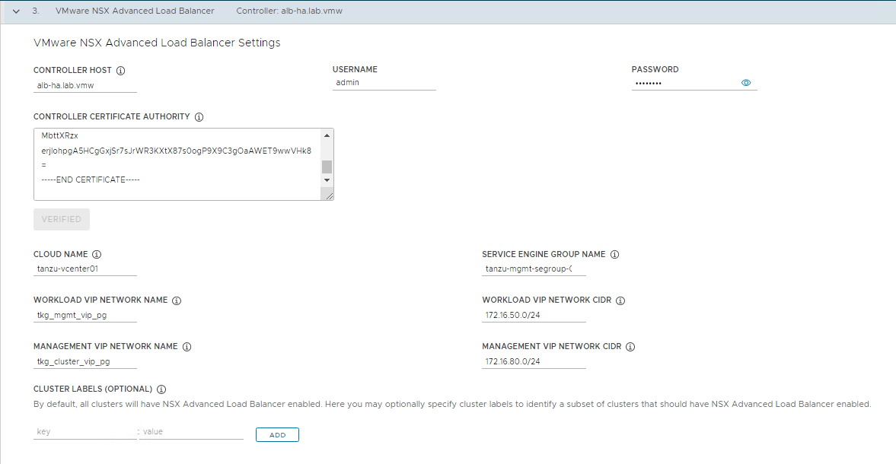

    > **Note** With the above configuration, all the Tanzu workload clusters use `sfo01-w01-vds01-tkgclustervip` for control plane VIP network and `sfo01-w01-vds01-tkgworkloadvip` for  data plane network by default. If you would like to configure separate VIP networks for workload control plane/data networks, create a custom AKO Deployment Config (ADC) and provide the respective `NSXALB_LABELS` in the workload cluster config file. For more information on network separation and custom ADC creation, see [Configure Separate VIP Networks and Service Engine Groups in Different Workload Clusters](https://docs.vmware.com/en/VMware-Tanzu-Kubernetes-Grid/2.1/tkg-deploy-mc-21/mgmt-reqs-network-nsx-alb-cp-endpoint.html).

1. (Optional) On the Metadata page, you can specify location and labels and click **Next**.

    

1. On the Resources section, specify the resources to be consumed by Tanzu Kubernetes Grid management cluster and click **Next**.  
    

1. On the Kubernetes Network section, select the Tanzu Kubernetes Grid management network (`sfo01-w01-vds01-tkgmanagement`) where the control plane and worker nodes are placed during management cluster deployment. Ensure that the network has DHCP service enabled. Optionally, change the pod and service CIDR.

    If the Tanzu environment is placed behind a proxy, enable proxy and provide proxy details:

    * If you set `http-proxy`, you must also set `https-proxy` and vice-versa. You can choose to use one proxy for HTTP traffic and another proxy for HTTPS traffic or to use the same proxy for both HTTP and HTTPS traffic.

    * Under the `no-proxy` section, enter a comma-separated list of network CIDRs or host names that must bypass the HTTP(S) proxy.

        Your **No Proxy** list must include the following:
      * The IP address or hostname for vCenter. Traffic to vCenter cannot be proxied.

      * The CIDR of the vSphere network that you selected under Network Name. The vSphere network CIDR includes the IP address of your control plane endpoint. If you entered an FQDN under control plane endpoint, add both the FQDN and the vSphere network CIDR to the `no-proxy` section.

      * Internally, Tanzu Kubernetes Grid appends `localhost`, `127.0.0.1`, the values of `Cluster Pod CIDR` and `Cluster Service CIDR`, `.svc`, and `.svc.cluster.local` to the list that you enter in this field.

      > **Note** If the Kubernetes cluster needs to communicate with external services and infrastructure endpoints in your Tanzu Kubernetes Grid environment, ensure that those endpoints are reachable by your proxies or add them to the `no-proxy` section. Depending on your environment configuration, this may include, but is not limited to, your OIDC or LDAP server, Harbor, NSX-T, NSX Advanced Load Balancer.

        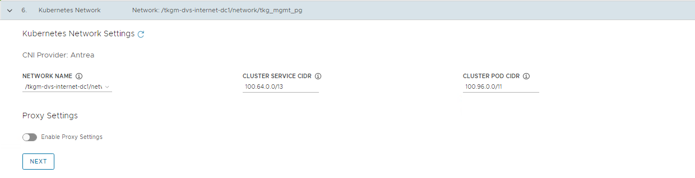

1. (Optional) Specify identity management with OIDC or LDAP. For this deployment, identity management is not enabled.

    If you would like to enable identity management, see [Enable and Configure Identity Management During Management Cluster Deployment](https://docs.vmware.com/en/VMware-Tanzu-Kubernetes-Grid/2.1/tkg-deploy-mc-21/mgmt-index.html).

      

1. Select the OS image to use for deploying the management cluster

    > **Note** This list appears empty if you don’t have a compatible template present in your environment. See the steps provided in [Import Base Image Template into vSphere](https://docs.vmware.com/en/VMware-Tanzu-Kubernetes-Grid/2.1/tkg-deploy-mc-21/mgmt-reqs-prep-vsphere.html).

    

1. Check the “Participate in the Customer Experience Improvement Program”, if you so desire, and click **Review Configuration**.

    > **Note** Tanzu Kubernetes Grid v2.1.0 has a known issue that installer UI populates an empty `NSXALB_LABEL` in the cluster configuration and leads to management cluster creation failure. It is recommended to export the cluster configuration to a file, delete the empty label, and run the cluster creation command from CLI instead of deploying the cluster from UI.

1. When you click on **Review Configuration**, the installer populates the cluster configuration file, which is located in the `~/.config/tanzu/tkg/clusterconfigs` subdirectory, with the settings that you specified in the interface. You can optionally export a copy of this configuration file by clicking **Export Configuration**.

    


1. Click **Deploy the Management cluster** 


    While the cluster is being deployed, you will find that a virtual service is created in NSX Advanced Load Balancer and new service engines are deployed in vCenter by NSX Advanced Load Balancer and the service engines are mapped to the SE Group `sfo01m01segroup01`.​​

When Tanzu Kubernetes Grid management cluster is being deployed, behind the scenes:  

* NSX Advanced Load Balancer service engines get deployed in vCenter and this task is orchestrated by the NSX Advanced Load Balancer controller.
* Service engine status in NSX Advanced Load Balancer: The following snippet shows the service engines status. They are in the initializing state for sometime and then the status changes to Up.

    

* Service engine group status in NSX Advanced Load Balancer: As per the configuration, the virtual service required for Tanzu Kubernetes Grid clusters control plane HA are hosted on service engine group `sfo01m01segroup01`.  

    

* Virtual service status in NSX Advanced Load Balancer: The cluster is configured with Production type that deployed 3 control plane nodes, which are placed behind the cluster VIP.

    

    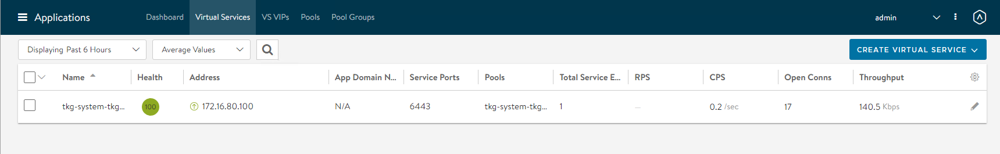

* The installer automatically sets the context to the Tanzu Kubernetes Grid management cluster on the bootstrap machine. Now you can access the Tanzu Kubernetes Grid management cluster from the bootstrap machine and perform additional tasks such as verifying the management cluster health and deploying the workload clusters, etc.

    To get the status of Tanzu Kubernetes Grid management cluster, run the following command:

    ```
    tanzu management-cluster get
    ```

    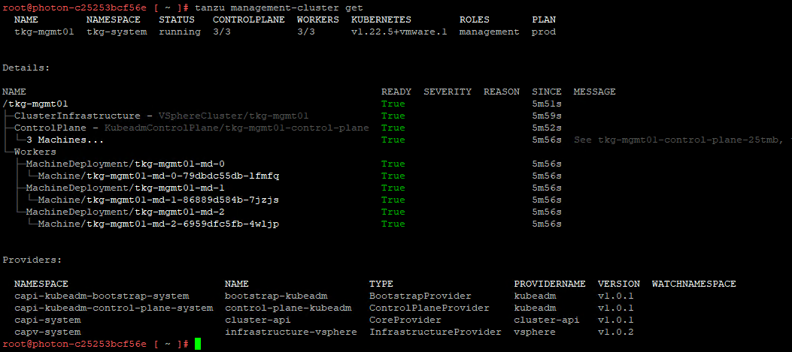

   Use `kubectl` to get the status of the Tanzu Kubernetes Grid management cluster nodes.

    

## <a id="register-tmc"> </a> Register Management Cluster with Tanzu Mission Control

 If you want to register your management cluster with Tanzu Mission Control, see [Register Your Management Cluster with Tanzu Mission Control](./tko-saas-services.md#a-idtmc-a-tanzu-mission-control).

## <a id="workloadalb"> </a> Configure AKO Deployment Config (ADC) for Workload Clusters

Tanzu Kubernetes Grid v2.1.0 management clusters with NSX Advanced Load Balancer are deployed with 2 AKODeploymentConfigs.

* `install-ako-for-management-cluster`: default configuration for management cluster
* `install-ako-for-all`:  default configuration for all workload clusters. By default, all the workload clusters reference this file for their virtual IP networks and service engine (SE) groups. This ADC configuration does not enable NSX L7 Ingress by default.

As per this Tanzu deployment, create 2 more ADCs:

* `tanzu-ako-for-shared`: Used by shared services cluster to deploy the virtual services in `TKG Mgmt SE Group` and  the loadbalancer applications in `TKG Management VIP Network`.

* `tanzu-ako-for-workload-L7-ingress`: Use this ADC only if you would like to enable NSX Advanced Load Balancer L7 ingress on workload cluster. Otherwise, leave the cluster labels empty to apply the network configuration from default ADC `install-ako-for-all`.

### <a id="sharedako"> </a> Configure AKODeploymentConfig (ADC) for Shared Services Cluster

As per the defined architecture, shared services cluster uses the same control plane and data plane network as the management cluster. Shared services cluster control plane endpoint uses `TKG Cluster VIP Network`, application loadbalancing uses `TKG Management Data VIP network` and the virtual services are deployed in `sfo01m01segroup01` SE group. This configuration is enforced by creating a custom AKO Deployment Config (ADC) and applying the respective `NSXALB_LABELS` while deploying the shared services cluster.

The format of the AKODeploymentConfig YAML file is as follows.

<!-- /* cSpell:disable */ -->
```yaml
apiVersion: networking.tkg.tanzu.vmware.com/v1alpha1
kind: AKODeploymentConfig
metadata:
  finalizers:
     - ako-operator.networking.tkg.tanzu.vmware.com
  generation: 2
  name: <Unique name of AKODeploymentConfig>
spec:
  adminCredentialRef:
    name: nsx-alb-controller-credentials
    namespace: tkg-system-networking
  certificateAuthorityRef:
    name: nsx-alb-controller-ca
    namespace: tkg-system-networking
  cloudName: <NAME OF THE CLOUD in ALB>
  clusterSelector:
    matchLabels:
      <KEY>: <VALUE>
  controlPlaneNetwork:
    cidr: <TKG-Cluster-VIP-CIDR>
    Name: <TKG-Cluster-VIP-Network>
  controller: <NSX ALB CONTROLLER IP/FQDN>
  dataNetwork:
    cidr: <TKG-Mgmt-Data-VIP-CIDR>
    name: <TKG-Mgmt-Data-VIP-Name>
  extraConfigs:
   cniPlugin: antrea
   disableStaticRouteSync: true
   ingress:
      defaultIngressController: false
      disableIngressClass: true
      nodeNetworkList:
      - networkName: <TKG-Mgmt-Network>     
  serviceEngineGroup: <Mgmt-Cluster-SEG>

```
<!-- /* cSpell:enable */ -->

The sample AKODeploymentConfig with sample values in place is as follows. You should add the respective NSX_ALB label `type=shared-services` while deploying shared services cluster to enforce this network configuration.

* cloud: ​`sfo01w01vc01​`
* service engine group: `sfo01m01segroup01`
* Control Plane network: `sfo01-w01-vds01-tkgclustervip`
* VIP/data network: `sfo01-w01-vds01-tkgmanagementvip`
* Node Network: `sfo01-w01-vds01-tkgmanagement`

<!-- /* cSpell:disable */ -->
```yaml
apiVersion: networking.tkg.tanzu.vmware.com/v1alpha1
kind: AKODeploymentConfig
metadata:
  finalizers:
  - ako-operator.networking.tkg.tanzu.vmware.com
  generation: 2
  labels:
  name: tanzu-ako-for-shared
spec:
  adminCredentialRef:
    name: NSX_ALB-controller-credentials
    namespace: tkg-system-networking
  certificateAuthorityRef:
    name: NSX_ALB-controller-ca
    namespace: tkg-system-networking
  cloudName: sfo01w01vc01
  clusterSelector:
    matchLabels:
      type: shared-services
  controlPlaneNetwork:
    cidr: 172.16.80.0/24
    name: sfo01-w01-vds01-tkgclustervip
  controller: sfo01albctlr01.sfo01.rainpole.local
  dataNetwork:
    cidr: 172.16.50.0/24
    name: sfo01-w01-vds01-tkgmanagementvip
  extraConfigs:
    cniPlugin: antrea
    disableStaticRouteSync: true
    ingress:
      defaultIngressController: false
      disableIngressClass: true
      nodeNetworkList:
      - networkName: sfo01-w01-vds01-tkgmanagement
  serviceEngineGroup: sfo01m01segroup01
```
<!-- /* cSpell:enable */ -->

After you have the AKO configuration file ready, use the `kubectl` command to set the context to Tanzu Kubernetes Grid management cluster and create the ADC:

<!-- /* cSpell:disable */ -->
```
# kubectl config use-context sfo01w01vc01-admin@sfo01w01vc01
Switched to context "sfo01w01vc01-admin@sfo01w01vc01".


# kubectl apply -f ako-shared-services.yaml
akodeploymentconfig.networking.tkg.tanzu.vmware.com/tanzu-ako-for-shared created
```
<!-- /* cSpell:enable */ -->

Use the following command to list all AKODeploymentConfig created under the management cluster:

<!-- /* cSpell:disable */ -->
```
# kubectl get adc
NAME                                 AGE
install-ako-for-all                  21h
install-ako-for-management-cluster   21h
tanzu-ako-for-shared                 113s
```
<!-- /* cSpell:enable */ -->

### <a id="l7workloadako"> </a> Configure AKO Deployment Config (ADC) for Workload Cluster to Enable NSX ALB L7 Ingress with NodePortLocal Mode

VMware recommends using NSX Advanced Load Balancer L7 ingress with NodePortLocal mode for the L7 application load balancing. This is enabled by creating a custom ADC with ingress settings enabled, and then applying the NSX_ALB LABEL while deploying the workload cluster.  

As per the defined architecture, workload cluster cluster control plane endpoint uses `TKG Cluster VIP Network`, application loadbalancing uses `TKG Workload Data VIP network` and the virtual services are deployed in `sfo01w01segroup01` SE group. 

Below are the changes in ADC Ingress section when compare to the default ADC. 

* **disableIngressClass**: set to `false` to enable NSX ALB L7 Ingress.

* **nodeNetworkList**: Provide the values for TKG workload network name and CIDR.

* **serviceType**:  L7 Ingress type, recommended to use `NodePortLocal`

* **shardVSSize**: Virtual service size

> **Note** The NSX ALB L7 Ingress feature requires Enterprise edition license. If you do not wish to enable L7 feature/applied with ALB essentials for Tanzu license, disable the L7 feature by setting the value `disableIngressClass` to `true`.

The format of the AKODeploymentConfig YAML file for enabling NSX ALB L7 Ingress is as follows.

<!-- /* cSpell:disable */ -->
```yaml
apiVersion: networking.tkg.tanzu.vmware.com/v1alpha1
kind: AKODeploymentConfig
metadata:
  name: <unique-name-for-adc>
spec:
  adminCredentialRef:
    name: NSX_ALB-controller-credentials
    namespace: tkg-system-networking
  certificateAuthorityRef:
    name: NSX_ALB-controller-ca
    namespace: tkg-system-networking
  cloudName: <cloud name configured in nsx alb>
  clusterSelector:
    matchLabels:
      <KEY>: <value>
  controller: <ALB-Controller-IP/FQDN>
  controlPlaneNetwork:
    cidr: <TKG-Cluster-VIP-Network-CIDR>
    name: <TKG-Cluster-VIP-Network-CIDR>
  dataNetwork:
    cidr: <TKG-Workload-VIP-network-CIDR>
    name: <TKG-Workload-VIP-network-CIDR>
  serviceEngineGroup: <Workload-Cluster-SEG>
  extraConfigs:
    cniPlugin: antrea
    disableStaticRouteSync: false                               # required
    ingress:
      disableIngressClass: false                                # required
      nodeNetworkList:                                          # required
        - networkName: <TKG-Workload-Network>
          cidrs:
            - <TKG-Workload-Network-CIDR>
      serviceType: NodePortLocal                                # required
      shardVSSize: MEDIUM                                       # required

```
<!-- /* cSpell:enable */ -->

The AKODeploymentConfig with sample values in place is as follows. You should add the respective NSX ALB label `workload-l7-enabled=true` while deploying workload cluster to enforce this network configuration.

* cloud: ​`sfo01w01vc01​`
* service engine group: `sfo01w01segroup01`
* Control Plane network: `sfo01-w01-vds01-tkgclustervip`
* VIP/data network: `sfo01-w01-vds01-tkgworkloadvip`
* Node Network: `sfo01-w01-vds01-tkgworkload`

<!-- /* cSpell:disable */ -->
```yaml
apiVersion: networking.tkg.tanzu.vmware.com/v1alpha1
kind: AKODeploymentConfig
metadata:
  name: tanzu-ako-for-workload-l7-ingress
spec:
  adminCredentialRef:
    name: NSX_ALB-controller-credentials
    namespace: tkg-system-networking
  certificateAuthorityRef:
    name: NSX_ALB-controller-ca
    namespace: tkg-system-networking
  cloudName: sfo01w01vc01
  clusterSelector:
    matchLabels:
      workload-l7-enabled: "true"
  controller: sfo01albctlr01.sfo01.rainpole.local
  controlPlaneNetwork:
    cidr: 172.16.80.0/24
    name: sfo01-w01-vds01-tkgclustervip
  dataNetwork:
    cidr: 172.16.70.0/24
    name: sfo01-w01-vds01-tkgworkloadvip
  serviceEngineGroup: sfo01w01segroup01
  extraConfigs:
    cniPlugin: antrea
    disableStaticRouteSync: false                               # required
    ingress:
      disableIngressClass: false                                # required
      nodeNetworkList:                                          # required
        - networkName: sfo01-w01-vds01-tkgworkload
          cidrs:
            - 172.16.60.0/24
      serviceType: NodePortLocal                                # required
      shardVSSize: MEDIUM                                       # required
```
<!-- /* cSpell:enable */ -->

Use the `kubectl` command to set the context to Tanzu Kubernetes Grid management cluster and create the ADC:

<!-- /* cSpell:disable */ -->
```
# kubectl config use-context sfo01w01vc01-admin@sfo01w01vc01
Switched to context "sfo01w01vc01-admin@sfo01w01vc01".

# kubectl apply -f workload-adc-l7.yaml
akodeploymentconfig.networking.tkg.tanzu.vmware.com/tanzu-ako-for-workload-l7-ingress created
```
<!-- /* cSpell:enable */ -->

Use the following command to list all AKODeploymentConfig created under the management cluster:

<!-- /* cSpell:disable */ -->
```
# kubectl get adc
NAME                                 AGE
install-ako-for-all                  22h
install-ako-for-management-cluster   22h
tanzu-ako-for-shared                 82m
tanzu-ako-for-workload-l7-ingress    25s

```
<!-- /* cSpell:enable */ -->

Now that you have successfully created the AKO deployment config, you need to apply the cluster labels while deploying the workload clusters to enable NSX Advanced Load Balancer L7 Ingress with NodePortLocal mode.

## <a id="dep-shared-cluster"> </a> Deploy Tanzu Kubernetes Grid Shared Services Cluster  

Each Tanzu Kubernetes Grid instance can have only one shared services cluster. Create a shared services cluster if you intend to deploy Harbor.  

The procedures for deploying a shared services cluster and workload cluster are almost the same. A key difference is that for the shared service cluster you add the `tanzu-services` label to the shared services cluster, as its cluster role. This label identifies the shared services cluster to the management cluster and workload clusters.  

Shared services cluster uses the custom ADC `tanzu-ako-for-shared` created earlier to apply the network settings similar to the management cluster. This is enforced by applying the NSXALB_LABEL `type:shared-services` while deploying the shared services cluster.

After the management cluster is registered with Tanzu Mission Control, the deployment of the Tanzu Kubernetes clusters can be done in just a few clicks. The procedure for creating Tanzu Kubernetes clusters is as follows. 

> **Note** The scope of this document doesn't cover the use of a proxy for Tanzu Kubernetes Grid deployment. If your environment uses a proxy server to connect to the internet, ensure that the proxy configuration object includes the CIDRs for the pod, ingress, and egress from the workload network of the Management Cluster in the **No proxy list**, as described in [Create a Proxy Configuration Object for a Tanzu Kubernetes Grid Service Cluster Running in vSphere with Tanzu](https://docs.vmware.com/en/VMware-Tanzu-Mission-Control/services/tanzumc-using/GUID-B4760775-388A-45B5-A707-2191E9E4F41F.html).

1. Navigate to the Clusters tab and click **Create Cluster** and select **Create Tanzu Kubernetes Grid cluster**.

1. Under the Create cluster page, select the management cluster which you registered in the previous step and click **Continue to create cluster**.

    

1. Select the provisioner for creating the shared services cluster. Provisioner reflects the vSphere namespaces that you have created and associated with the management cluster.

    

1. On the **Cluster Details** page, do the following: 
- Enter a name for the cluster (Cluster names must be unique within an organization).
- Select the cluster group to which you want to attach your cluster.
- Select Cluster Class from the drop down.
- Use the NSXALB_Labels created for shared cluster on AKO Deployment.

    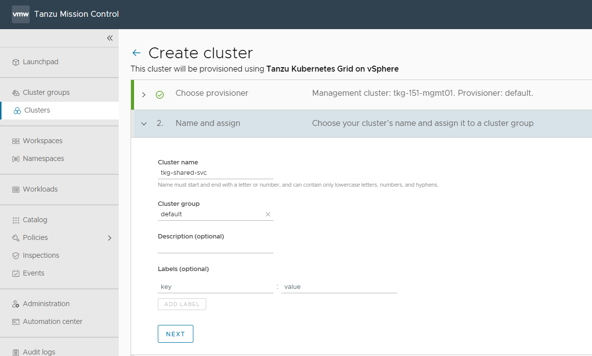

5. On the **Configure** page, specify the following:

   - In the **vCenter** and **tlsThumbprint** fields, enter the details for authentication.
   - From the  **datacenter**, **resourcePool**, **folder**, **network**, and **datastore** drop down, select the required information.
   - From the **template** drop down, select the Kubernetes version.The latest supported version is preselected for you. 
   - In the **sshAuthorizedKeys** field, enter the SSH key that was created earlier.
   - Enable aviAPIServerHAProvider.

    

1. Update POD CIDR and Service CIDR if necessary.

    

1. Select the high availability mode for the control plane nodes of the shared services cluster. For a production deployment, it is recommended to deploy a highly available shared services cluster.

    

1. Customize the default node pool for your workload cluster.

    * Specify the number of worker nodes to provision.
    * Select OS Version.

1. Click **Create Cluster** to start provisioning your workload cluster.

1. 
    Cluster creation takes approximately 15-20 minutes to complete. After the cluster deployment completes, ensure that agent and extensions health shows green.

    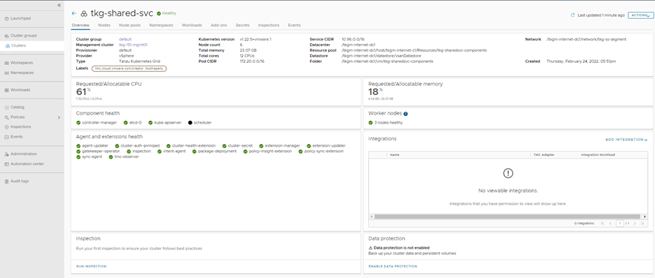

Now that the shared services cluster is successfully created, you may proceed with deploying the Harbor package. For more information, see Install Harbor in [Deploy User-Managed Packages in Workload Clusters](./tkg-package-install.md).

1. Connect to the Tanzu Management Cluster context and verify the cluster labels for the workload cluster.
    <!-- /* cSpell:disable */ -->
     ```bash
    ## verify the workload  service cluster creation

    tanzu cluster list
    NAME                  NAMESPACE  STATUS   CONTROLPLANE  WORKERS  KUBERNETES        ROLES   PLAN  TKR
    
    sfo01w0tkgshared01    default    running  3/3           3/3      v1.24.9+vmware.1  <none>  prod  v1.24.9---vmware.1-tkg.1


    ## Connect to tkg management cluster

    kubectl config use-context sfo01w01tkgmgmt01-admin@sfo01w01tkgmgmt01

    ## Add the tanzu-services label to the shared services cluster as its cluster role. In the following command "sfo01w01tkgshared01” is the name of the shared service cluster
    
    kubectl label cluster.cluster.x-k8s.io/sfo01w0tkgshared01 cluster-role.tkg.tanzu.vmware.com/tanzu-services="" --overwrite=true
    cluster.cluster.x-k8s.io/sfo01w0tkgshared01 labeled

    ## Validate that TMC has applied the AVI_LABEL while deploying the cluster

    kubectl get cluster sfo01w0tkgshared01 --show-labels
    NAME                   PHASE         AGE    VERSION   LABELS
    
    sfo01w0tkgshared01   Provisioned   105m             cluster-role.tkg.tanzu.vmware.com/tanzu-services=,networking.tkg.tanzu.vmware.com/avi=tanzu-ako-for-shared,tanzuKubernetesRelease=v1.24.9---vmware.1-tkg.1,tkg.tanzu.vmware.com/cluster-name=sfo01w0tkgshared01,type=shared-services

      ```
    <!-- /* cSpell:enable */ -->

1. Connect to admin context of the workload cluster using the following commands and validate the ako pod status.

    <!-- /* cSpell:disable */ -->
     ```bash
    ## Use the following command to get the admin context of workload Cluster.

    tanzu cluster kubeconfig get sfo01w0tkgshared01 --admin
    
    Credentials of cluster 'sfo01w0tkgshared01' have been saved
    You can now access the cluster by running 'kubectl config use-context sfo01w0tkgshared01-admin@sfo01w0tkgshared01'


    ## Use the following command to use the context of workload Cluster

    kubectl config use-context sfo01w0tkgshared01-admin@sfo01w0tkgshared01
    
    Switched to context "sfo01w0tkgshared01-admin@sfo01w0tkgshared01".
    
    # Verify that ako pod gets deployed in avi-system namespace

     kubectl get pods -n avi-system
    NAME    READY   STATUS    RESTARTS   AGE
    ako-0   1/1     Running   0          73m

    # verify the nodes and pods status by running the command:
    kubectl get nodes -o wide

    kubectl get pods -A 
     ```
    <!-- /* cSpell:enable */ -->

Now that the shared services cluster is successfully created, you may proceed with deploying the Harbor package. For more information, see Install [Harbor in Deploy User-Managed Packages in Workload Clusters](https://docs.vmware.com/en/VMware-Tanzu-Kubernetes-Grid/2.1/using-tkg-21/workload-packages-harbor.html)

## <a id="dep-workload-cluster"> </a> Deploy Tanzu Kubernetes Grid Workload Clusters

As per the architecture, workload clusters make use of a custom ADC to enable NSX Advanced Load Balancer L7 ingress with NodePortLocal mode. This is enforced by providing the NSXALB_LABEL while deploying the workload cluster.

The steps for deploying a workload cluster are the same as for a shared services cluster. except use the NSX ALB Labels created for the Workload cluster on AKO Deployment in step number 4.<p>
**After the Workload cluster creation verify the cluster labels and ako pod status**
1. Connect to the Tanzu Management Cluster context and verify the cluster labels for the workload cluster.
    <!-- /* cSpell:disable */ -->
     ```bash
    ## verify the workload  service cluster creation

    tanzu cluster list
    NAME                  NAMESPACE  STATUS   CONTROLPLANE  WORKERS  KUBERNETES        ROLES   PLAN  TKR
    
    sfo01w01shared01    default    running  3/3           3/3      v1.24.9+vmware.1  <none>  prod   v1.24.9---vmware.1-tkg.1

    sfo01w01workload01  default    running  3/3           3/3      v1.24.9+vmware.1  <none>  prod   v1.24.9---vmware.1-tkg.1

    ## Connect to tkg management cluster

    kubectl config use-context sfo01w01vc01-admin@sfo01w01vc01

    ## Validate that TMC has applied the AVI_LABEL while deploying the cluster

    kubectl get cluster sfo01w01workload01 --show-labels
    NAME                   PHASE         AGE    VERSION   LABELS
    
    sfo01w01workload01   Provisioned   105m             networking.tkg.tanzu.vmware.com/avi=tanzu-ako-for-workload-l7-ingress,tanzuKubernetesRelease=v1.249---vmware.1-tkg.1,tkg.tanzu.vmware.com/cluster-name=sfo01w01workload01,workload-l7-enabled=true


      ```
    <!-- /* cSpell:enable */ -->

1. Connect to admin context of the workload cluster using the following commands and validate the ako pod status.

    <!-- /* cSpell:disable */ -->
     ```bash
    ## Use the following command to get the admin context of workload Cluster.

    tanzu cluster kubeconfig get sfo01w01workload01 --admin
    
    Credentials of cluster 'sfo01w01workload01' have been saved
    You can now access the cluster by running 'kubectl config use-context sfo01w01workload01-admin@sfo01w01workload01'


    ## Use the following command to use the context of workload Cluster

    kubectl config use-context sfo01w01workload01-admin@sfo01w01workload01
    
    Switched to context "sfo01w01workload01-admin@sfo01w01workload01".
    
    # Verify that ako pod gets deployed in avi-system namespace

     kubectl get pods -n avi-system
    NAME    READY   STATUS    RESTARTS   AGE
    ako-0   1/1     Running   0          73m

    # verify the nodes and pods status by running the command:
    kubectl get nodes -o wide

    kubectl get pods -A 
     ```
    <!-- /* cSpell:enable */ -->

You can now configure SaaS components and deploy user-managed packages on the cluster.

## <a id=dep-user-mgd-packages></a> Configure Tanzu SaaS Components and Deploy User-Managed Packages

For information on how to configure the SaaS components, see [Configure Tanzu SaaS Components for Tanzu for Kubernetes Operations](./tko-saas-services.md).

For information on how to deploy user-managed packages, see [Deploy User-Managed Packages in Workload Clusters](./tkg-package-install.md).
