# Deploy Tanzu for Kubernetes Operations on vSphere

This document provides step-by-step instructions for deploying and configuring Tanzu for Kubernetes Operations on a vSphere environment backed by a Virtual Distributed Switch (VDS).  

The scope of the document is limited to providing the deployment steps based on the reference design in [VMware Tanzu for Kubernetes Operations on vSphere Reference Design](../reference-designs/tko-on-vsphere.md). This document does not cover any deployment procedures for the underlying SDDC components.

## Tanzu Kubernetes Grid - Bill of Materials

The validated Bill of Materials that can be used to install Tanzu Kubernetes Grid on your vSphere environment is as follows:

|**Software Components**|**Version**|
| ---| --- |
|Tanzu Kubernetes Grid|1.5.1|
|VMware vSphere ESXi|7.0U2 and later|
|VMware vCenter (VCSA)|7.0U2 and later|
|VMware vSAN|7.0U2 and later|
|NSX Advanced LB|20.1.7 and later|

For the latest information, see [VMware Product Interoperability Matrix](https://interopmatrix.vmware.com/#/Interoperability?isHideGenSupported=true&isHideTechSupported=true&isHideCompatible=false&isHideIncompatible=false&isHideNTCompatible=true&isHideNotSupported=true&isCollection=false&col=551,5305&row=551,5305%262,5088,3457%26789,5823).

## Prepare your Environment for Deploying Tanzu for Kubernetes Operations

Before deploying Tanzu for Kubernetes Operations on vSphere, ensure that your environment is set up as described in the following requirements:

* [General Requirements](#gen-requirements)
* [Network Requirements](#network-req)
* [Firewall Requirements](#firewall-req)

### <a id="gen-requirements"> </a>General Requirements
The general requirements for deploying Tanzu for Kubernetes Operations on vSphere in your environment are as follows:

* vSphere 7.0 U2 or later with an Enterprise Plus license.
* Your SDDC environment has the following objects:
	* A vSphere cluster with at least 3 hosts, on which vSphere DRS is enabled
	* A dedicated resource pool to deploy the Tanzu Kubernetes Grid management cluster, shared services cluster, and workload clusters.
The number of resource pools depends on the number of workload clusters to be deployed.
* VM folders to collect the Tanzu Kubernetes Grid VMs.
* A datastore with sufficient capacity for the control plane and worker node VM files.
* Network Time Protocol (NTP) service running on all hosts and vCenter.
* A host, server, or VM based on Linux, MacOS, or Windows that acts as your bootstrap machine and that has docker installed. For this deployment, a virtual machine based on Photon OS will be used.
* Depending on the OS flavor of the bootstrap VM, download and configure the following packages from [VMware Customer Connect](https://customerconnect.vmware.com/en/downloads/details?downloadGroup=TKG-151&productId=988&rPId=49705). As part of this documentation, refer to the section to configure required packages on the Photon OS machine.

	* Tanzu CLI 1.5.1
	* kubectl cluster CLI 1.22.5

* A vSphere account with the permissions described in [Required Permissions for the vSphere Account](https://docs.vmware.com/en/VMware-Tanzu-Kubernetes-Grid/1.5/vmware-tanzu-kubernetes-grid-15/GUID-mgmt-clusters-vsphere.html#required-permissions-for-the-vsphere-account-5).
* Download and import NSX ALB 20.1.7 OVA to Content Library.
* Download the following OVA from [VMware Customer Connect](https://customerconnect.vmware.com/en/downloads/details?downloadGroup=TKG-151&productId=988&rPId=49705) and import to vCenter. Convert the imported VMs to templates.

	* Photon v3 Kubernetes v1.22.5 OVA
	* Ubuntu 2004 Kubernetes v1.22.5 OVA  

**Note**: You can also download supported older versions of Kubernetes from [VMware Customer Connect](https://customerconnect.vmware.com/en/downloads/details?downloadGroup=TKG-151&productId=988&rPId=49705) and import them to deploy workload clusters on the intended Kubernetes versions.

**Resource Pools and VM Folders**

The sample entries of the resource pools and folders that need to be created are as follows.

|**Resource Type**|**Sample Resource Pool Name**|**Sample Folder Name**|
| :- | :- | :- |
|NSX ALB Components|`nsx-alb-components`|`nsx-alb-components`|
|TKG Management components|`tkg-management-components`|`tkg-management-components`|
|TKG Shared Service Components|`tkg-sharedsvc-components`|`tkg-sharedsvc-components`|
|TKG Workload components|`tkg-workload01-components`|`tkg-workload01-components`|

### <a id="network-req"> </a>Network Requirements

Create Port groups on vSphere DVSwitch for deploying Tanzu for Kubernetes Operations components as per [Network Requirements](https://docs.vmware.com/en/VMware-Tanzu/services/tanzu-reference-architecture/GUID-reference-designs-tko-on-vsphere.html#network-recommendations-3) defined in the reference architecture.

### <a id="firewall-req"></a>Firewall Requirements

Ensure that the firewall is set up as described in [Firewall Requirements](https://docs.vmware.com/en/VMware-Tanzu/services/tanzu-reference-architecture/GUID-reference-designs-tko-on-vsphere.html#firewall-recommendations-4).

## Subnet and CIDR Examples

For this demonstration, this document makes use of the following CIDR for Tanzu for Kubernetes Operations deployment.

|**Network Type**|**Port Group Name**|**Gateway CIDR**|**DHCP Pool**|**NSX ALB IP Pool**|
| :- | :- | :- | :- | :- |
|NSX ALB Management Network|nsx_alb_management_pg|172.16.10.1/24|N/A|172.16.10.100- 172.16.10.200|
|TKG Management Network|tkg_mgmt_pg|172.16.40.1/24|172.16.40.100- 172.16.40.200|N/A|
|TKG Management VIP Network|tkg_mgmt_vip_pg|172.16.50.1/24|N/A|172.16.50.100- 172.16.50.200|
|TKG Cluster VIP Network|tkg_cluster_vip_pg|172.16.80.1/24|N/A|172.16.80.100- 172.16.80.200|
|TKG Workload VIP Network|tkg_workload_vip_pg|172.16.70.1/24|N/A|172.16.70.100 - 172.16.70.200|
|TKG Workload Segment|tkg_workload_pg|172.16.60.1/24|172.16.60.100- 172.16.60.200|N/A|

## Tanzu for Kubernetes Operations: Deployment Overview

The high-level steps for deploying Tanzu for Kubernetes Operations on vSphere backed by VDS are as follows:

1. [Deploy and Configure NSX Advanced Load Balancer](#dep-config-nsx-alb)
1. [Deploy and Configure Bootstrap Machine](#bootstrap)
1. [Deploy Tanzu Kubernetes Grid Management Cluster](#deploy-mgmg-cluster)
1. [Deploy Shared Service Cluster](#deploy-shared-cluster)
1. [Deploy Tanzu Workload Clusters](#dep-workload-cluster)
1. [Deploy User-Managed Packages on TKG Clusters](#dep-user-mgd-packages)

## <a id="dep-config-nsx-alb"> </a>Deploy and Configure NSX Advanced Load Balancer

NSX Advanced Load Balancer (ALB) is an enterprise-grade integrated load balancer that provides L4 - L7 load balancer support. It is recommended for vSphere deployments without NSX-T, or when there are unique scaling requirements.

NSX ALB is deployed in Write Access Mode in the vSphere Environment. This mode grants NSX ALB controllers full write access to vCenter that helps in automatically creating, modifying, and removing service engines (SEs) and other resources as needed to adapt to changing traffic needs.

For a production-grade deployment, it is recommended to deploy three instances of the NSX ALB controller for high availability and resiliency.  


The following table provides a sample IP address and FQDN set for the NSX ALB controllers:  

|**Controller Node**|**IP Address**|**FQDN**|
| :- | :- | :- |
|Node 1 Primary|172.16.10.11|`alb-ctlr01.lab.vmw`|
|Node 2 Secondary|172.16.10.12|`alb-ctlr02.lab.vmw`|
|Node 3 Secondary |172.16.10.13|`alb-ctlr03.lab.vmw`|
|HA Address|172.16.10.10|`alb-ha.lab.vmw`|


Follow these steps to deploy and configure NSX Advanced Load Balancer:

1. [Deploy NSX Advanced Load Balancer](#dep-nsx-alb)
1. [NSX Advanced Load Balancer: Initial setup](#nsx-alb-init)
1. [NSX Advanced Load Balancer: Licensing](#nsx-alb-license)
1. [NSX Advanced Load Balancer: Controller High Availability](#nsx-alb-ha)
1. [NSX Advanced Load Balancer: Certificate Management](#nsx-alb-cert-mgmt)
1. [NSX Advanced Load Balancer: Create vCenter Cloud and SE Groups](#nsx-alb-vcenter-se)
1. [NSX Advanced Load Balancer: Configure Network and IPAM & DNS Profiles](#nsx-alb-net-ipam)


### <a id="dep-nsx-alb"> </a>Deploy NSX Advanced Load Balancer

As part of the prerequisites, you must have the NSX ALB 20.1.7 OVA downloaded and imported to the content library. Deploy the NSX ALB under the resource pool **“nsx-alb-components”**  and place it under the folder **“nsx-alb-components”**.

To deploy NSX ALB, complete the following steps.

1. Log in to **vCenter** and navigate to **Home** > **Content Libraries**.
1. Select the content library under which the NSX-ALB OVA is placed.
1. Click on **OVA & OVF Templates**.
1. Right-click the NSX ALB image and select **New VM from this Template**.
1. On the Select name and folder page, enter a name and select a folder for the NSX ALB VM as **nsx-alb-components**.
1. On the Select a compute resource page, select the resource pool **nsx-alb-components**.
1. On the Review details page, verify the template details and click **Next**.
1. On the Select storage page, select a storage policy from the VM Storage Policy drop-down menu and choose the  datastore location where you want to store the virtual machine files.
1. On the Select networks page, select the network **nsx_alb_management_pg** and click **Next**.
1. On the Customize template page, provide the NSX ALB management network details such as IP address, subnet mask, and gateway, and then click **Next**.
1. On the Ready to complete page, review the page and click **Finish**.

    

	Figure 1  - NSX ALB deployment

A new task for creating the virtual machine appears in the **Recent Tasks** pane. After the task is complete, the NSX ALB virtual machine is created on the selected resource. Power on the virtual machine and give it a few minutes for the system to boot. Upon successful boot up, navigate to NSX ALB on your browser.  
**Note**: While the system is booting up, a blank web page or a 503 status code may appear.  

### <a id="nsx-alb-init"> </a>NSX Advanced Load Balancer: Initial Setup

Once NSX ALB is successfully deployed and running, navigate to NSX ALB on your browser using the URL https://<em><IP/FQDN></em> and configure the basic system settings:

1. Set admin password and click on **Create Account**.

    

	Figure 2 - Admin password and create account

1. On the Welcome page, under **System Settings**, set backup passphrase and provide DNS information, and then click **Next**.

    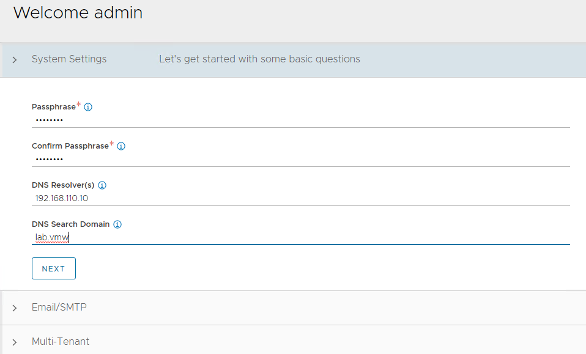

	Figure 3 - Backup passphrase and DNS information
1. Under **Email/SMTP**, provide email and SMTP information, and then click **Next**.

    

	Figure 4 - Email and SMTP information
1. Under **Multi-Tenant**, configure settings as follows and click **Save**.
    - IP Route Domain: Share IP route domain across tenants  
    - Service Engines are managed within the: Provider (Shared across tenants)  
    - Tenant Access to Service Engine: Read

    

	Figure 5 - Multi-tenant settings

If you did not select the **Setup Cloud After** option before saving, the initial configuration wizard exits. The Cloud configuration window does not automatically launch and you are directed to a dashboard view on the controller.

### **NSX Advanced Load Balancer: NTP Configuration**

To configure NTP, navigate to **Administration** > **Settings** > **DNS/NTP > Edit** and add your NTP server details and then click **Save**.

**Note:** You may also delete the default NTP servers.


Figure 6 - NTP server configuration

### <a id="nsx-alb-license"></a>NSX Advanced Load Balancer: Licensing

This document focuses on enabling NSX ALB using the license model: **Enterprise License (VMware NSX ALB Enterprise)**.

To configure licensing, navigate to **Administration** > **Settings** > **Licensing** and apply the license key. If you have a license file instead of a license key, apply the license by clicking on the **Upload from Computer** option.


Figure 7 - License configuration

### <a id="nsx-alb-ha"> </a>NSX Advanced Load Balancer: Controller High Availability

In a production environment, it is recommended to deploy additional controller nodes and configure the controller cluster for high availability and disaster recovery. Adding 2 additional nodes to create a 3-node cluster provides node-level redundancy for the controller and also maximizes performance for CPU-intensive analytics functions.

To run a 3-node controller cluster, you deploy the first node and perform the initial configuration, and set the cluster IP address. After that, you deploy and power on two more controller VMs, but you must not run the initial configuration wizard or change the admin password for these controllers VMs. The configuration of the first controller VM is assigned to the two new controller VMs.

The first controller of the cluster receives the Leader role. The second and third controllers work as Follower.

Complete the following steps to configure NSX ALB cluster.

1. Log in to the primary NSX ALB controller and navigate to **Administrator** > **Controller** > **Nodes**, and then click **Edit**.

    

	Figure 8 - NSX ALB controller node configuration

1. Specify **Name** and **Controller Cluster IP**, and then click **Save**. This IP address must be from the NSX ALB management network.

  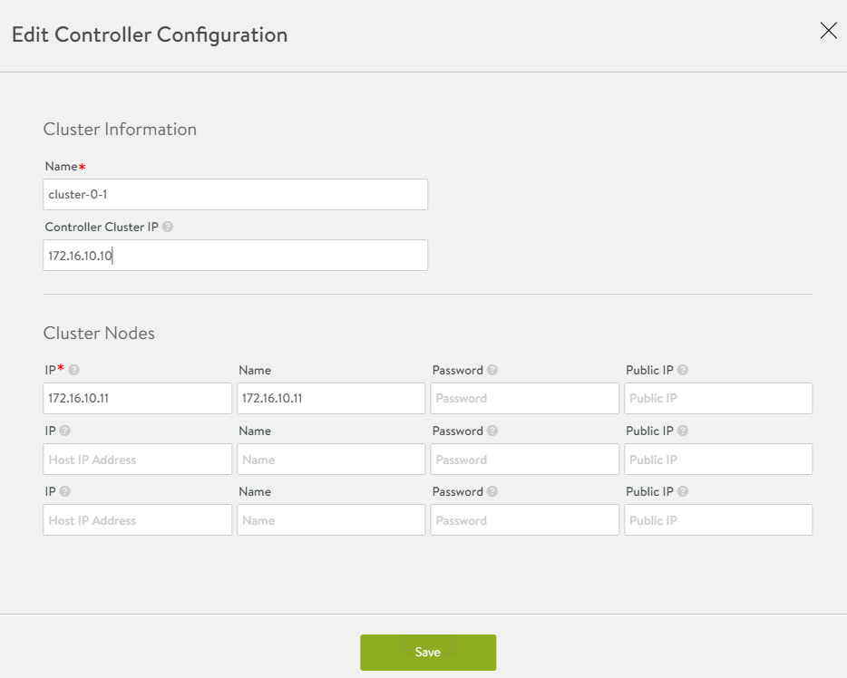

	Figure 9 - NSX ALB controller node name and IP address

1. Deploy the 2nd and 3rd NSX ALB controller nodes by using steps in [Deploy NSX Advanced Load Balancer](#dep-nsx-alb).

1. Log into the primary NSX ALB controller using the Controller Cluster IP/FQDN and navigate to **Administrator** > **Controller** >  **Nodes**, and then click **Edit**. The Edit Controller Configuration popup appears.

1. In the **Cluster Nodes** field, enter the IP address for the 2nd and 3rd controller, and then click **Save**.

    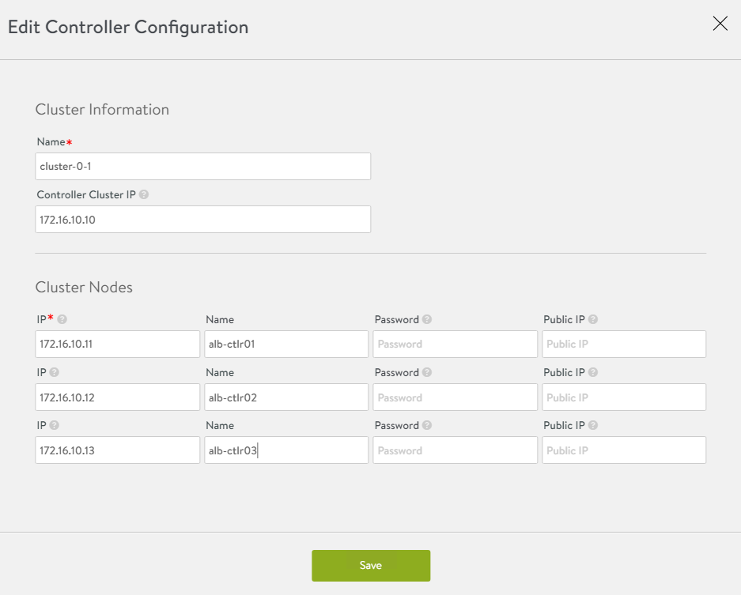

	Figure 10 - Cluster node IP address in controller configuration

    After you complete these steps, the primary NSX ALB controller becomes the leader for the cluster and invites the other controllers to the cluster as members.

    NSX ALB then performs a warm reboot of the cluster. This process can take approximately 10-15 minutes. You will be automatically logged out of the controller node where you are currently logged in. On entering the cluster IP address in the browser, you can see details about the cluster formation task.

    

	 Figure 11 - Controller initialization

The configuration of the primary (leader) controller is synchronized to the new member nodes when the cluster comes online following the reboot. Once the cluster is successfully formed, you can see the following status:

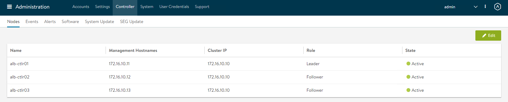
Figure 12 - Controller status

**Note:** In the following tasks, all NSX ALB configurations will be done by connecting to the NSX ALB Controller Cluster IP/FQDN.

### <a id="nsx-alb-cert-mgmt"> </a>NSX Advanced Load Balancer: Certificate Management

The default system-generated controller certificate generated for SSL/TSL connections will not have the required subject alternate name (SAN) entries. Complete the following steps to create a controller certificate:

1. Log in to the NSX ALB controller and navigate to **Templates** > **Security** > **SSL/TLS Certificates**.

1. Click **Create** and select **Controller Certificate**. You can either generate a self-signed certificate, generate CSR, or import a certificate. For the purpose of this document, a self-signed certificate will be generated.

1. Provide all required details as per your infrastructure requirements and in the **Subject Alternate Name (SAN)** field, provide IP address and FQDN of all NSX ALB controllers including NSX ALB cluster IP and FQDN, and then click **Save**.

    

	 Figure 13 - Self-signed certificate generation
1. Once the certificate is created, capture the certificate contents as this is required while deploying the Tanzu Kubernetes Grid management cluster.
  To capture the certificate content, click on the Download icon next to the certificate, and then click **Copy to clipboard** under **Certificate**.

    

	Figure 14 - Copy certificate contents

1. To replace the certificate, navigate to **Administration** > **Settings** > **Access Settings**, and click the pencil icon at the top right to edit the system access settings, and then replace the SSL/TSL certificate and click **Save**.

    
   Figure 15 - Replace certificate

1. Log out and log in to NSX ALB.

### <a id="nsx-alb-vcenter-se"> </a>NSX Advanced Load Balancer: Create vCenter Cloud and SE Groups

NSX ALB may be deployed in multiple environments for the same system. Each environment is called a cloud. The following procedure provides steps on how to create a VMware vCenter cloud, and as shown in the architecture two service engine (SE) groups will be created.

**Service Engine Group 1**: Service engines part of this service engine group hosts:

* Virtual services for all load balancer functionalities requested by Tanzu Kubernetes Grid management cluster and workload.
* Virtual services that load balances control plane nodes of all TKG Kubernetes clusters.

**Service Engine Group 2**: Service engines part of this service engine group hosts virtual services for all load balancer functionalities requested by Tanzu Kubernetes Grid workload clusters mapped to this SE group.  

**Note**:
* Based on your requirements, you can create additional SE groups for the workload clusters.
* Multiple workload clusters can be mapped to a single SE group.
* A Tanzu Kubernetes Grid cluster can be mapped to only one SE group for application load balancer services.

For information about mapping a specific service engine group to Tanzu Kubernetes Grid workload cluster, see [Configure NSX Advanced Load Balancer in TKG Workload Cluster](#workloadalb).

The following components are created in NSX ALB.

<!-- /* cSpell:disable */ -->
| Object | Sample Name |
| --- | --- |
| vCenter Cloud | tanzu-vcenter01 |
| Service Engine Group 1 | tanzu-mgmt-segroup-01 |
| Service Engine Group 2 | tanzu-wkld-segroup-01 |

<!-- /* cSpell:enable */ -->

1.  Log in to NSX ALB and navigate to **Infrastructure** > **Clouds** > **Create** > **VMware vCenter/vSphere ESX**.

    
   Figure 16 - vCenter cloud
2.  Enter cloud name and click **Next**.

    
   Figure 17 - vCenter cloud name
3.  Under the **Infrastructure** pane, enter vCenter address, username, and password, set **Access Permission** to Write and click **Next**.

    
   Figure 18 - vCenter cloud infrastructure information

4.  Under the **Data Center** pane, choose the data center for NSX ALB to discover infrastructure resources.

    
   Figure 19 - vCenter cloud - select data center
5.  Under the **Network** pane, choose the NSX ALB management network for service engines and enter a static IP address pool for SEs and VIP, and then click **Complete**.
    
	Figure 20 - vCenter cloud network information

6.  Wait for the cloud to get configured and the status to turn green.

    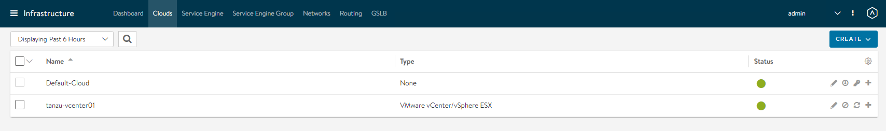
   Figure 21 - vCenter cloud configuration
7.  To create a service engine group for Tanzu Kubernetes Grid management clusters, click on the Service Engine Group tab, under Select Cloud, choose the cloud created in the previous step, and then click **Create**.

8.  Enter a name for the Tanzu Kubernetes Grid management service engine group and set the following parameters:  

    | Parameter | Value |
    | --- | --- |
    | High availability mode | N+M (buffer) |
    | Memory per Service Engine | 4   |
    | vCPU per Service Engine | 2   |

    Use the default values for the rest of the parameters.

    
   Figure 22 - Service engine group

	For advanced configuration, click on the Advanced tab, specify a specific cluster and datastore for service engine placement, change the AVI SE folder name, and service engine name prefix, and then click **Save**.

      
   Figure 23 - Service engine group advanced settings

9.  Repeat steps 7 and 8 to create another service engine group for Tanzu Kubernetes Grid workload clusters. Once complete, there must be two service engine groups created.  
    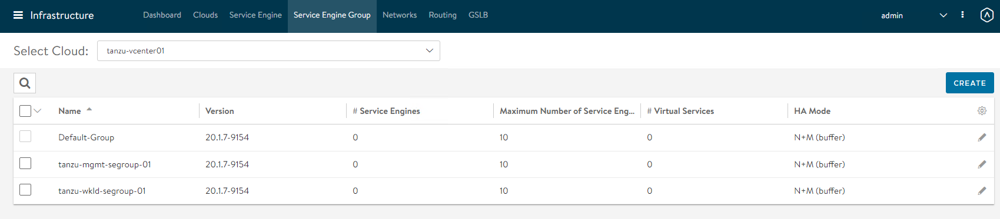
   Figure 24 -Created service engine groups

### <a id="nsx-alb-net-ipam"> </a> NSX Advanced Load Balancer: Configure Network and IPAM Profile

#### Configure TKG Networks in NSX ALB

As part of the cloud creation in NSX ALB, only management network has been configured in NSX ALB. Complete the following procedure to configure these networks:
  * TKG Management Network
  * TKG Workload Network
  * TKG Cluster VIP/Data Network
  * TKG Management VIP/Data Network
  * TKG Workload VIP/Data Network

1. Log in to NSX ALB and navigate to **Infrastructure** > **Networks**.
1. Select the desired cloud. All the networks available in vCenter are listed.

    
   Figure 25 - Available networks
1. Click on the edit icon next for the network and configure as follows. Change the provided details as per your SDDC configuration.

    **Note:** Not all networks will be auto-discovered. For those networks, manually add the subnet.

    <!-- /* cSpell:disable */ -->
    |     |     |     |     |
    | --- | --- | --- | --- |
    | Network Name | DHCP | Subnet | Static IP Pool |
    | tkg_mgmt_pg | Yes | 172.16.40.0/24 | NA  |
    | tkg_workload_pg | Yes | 172.16.60.0/24 | NA  |
    | tkg_cluster_vip_pg | No  | 172.16.80.0/24 | 172.16.80.100 - 172.16.80.200 |
    | tkg_mgmt_vip_pg | No  | 172.16.50.0/24 | 172.16.50.100 - 172.16.50.200 |
    | tkg_workload_vip_pg | No  | 172.16.70.0/24 | 172.16.70.100 - 172.16.70.200 |

		<!-- /* cSpell:enable */ -->

    The following snippet shows configuring one of the networks. For example: `tkg_cluster_vip_pg`

    
   Figure 26 - Network configuration

	Once the networks are configured, the configuration must look like the following image.
    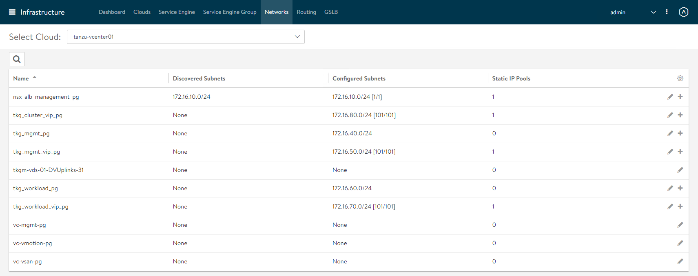
   Figure 27 - Network list after configuration

1. Once the networks are configured, set the default routes for all VIP/data networks.
  1. Click **Routing** > **Create** and add default routes for following networks.  
  2. Change the gateway for VIP networks as per your network configurations.

    <!-- /* cSpell:disable */ -->
    | Network Name | Gateway Subnet | Next Hop |
    | --- | --- | --- |
    | tkg_cluster_vip_pg | 0.0.0.0/0 | 172.16.80.1 |
    | tkg_mgmt_vip_pg | 0.0.0.0/0 | 172.16.50.1 |
    | tkg_workload_vip_pg | 0.0.0.0/0 | 172.16.70.1 |

		<!-- /* cSpell:enable */ -->

      
   Figure 28 - Routes in network configuration

#### Create IPAM and DNS Profile in NSX ALB and attach it to Cloud

At this point, all the required networks related to Tanzu functionality are configured in NSX ALB, except for Tanzu Kubernetes Grid management and workload network which uses DHCP. NSX ALB provides IPAM service for Tanzu Kubernetes Grid cluster VIP network, management VIP network, and workload VIP network.  

Complete the following steps to create an IPAM profile and once created attach it to the vCenter cloud created earlier.  

1. Log in to NSX ALB and navigate to **Templates** > **IPAM/DNS Profiles** > **Create** > **IPAM Profile**, and provide the following details, and then click **Save**.  

    <!-- /* cSpell:disable */ -->
    | Parameter | Value |
    | --- | --- |
    | Name | tanzu-vcenter-ipam-01 |
    | Type | AVI Vintage IPAM |
    | Cloud for Usable Networks | Tanzu-vcenter-01 (created earlier in this deployment) |
    | Usable Networks | tkg_cluster_vip_pg  <br>tkg_mgmt_vip_pg  <br>tkg_workload_vip_pg |

	<!-- /* cSpell:enable */ -->

    

	 Figure 29 - IPAM profile

1. Click **Create** > **DNS Profile** and provide the domain name.

    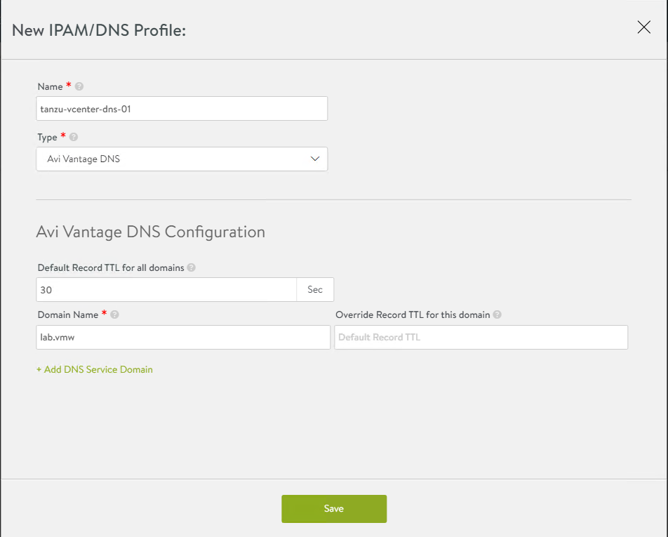

	Figure 30 - Domain name
1. Attach the IPAM and DNS profiles to the `tanzu-vcenter-01` cloud.
 1. Navigate to **Infrastructure** > **Clouds**.
 1. Edit the tanzu-vcenter-01 cloud.
 1. Under IPAM/DNS section, choose the IPAM and DNS profiles created earlier and save the updated configuration.  
    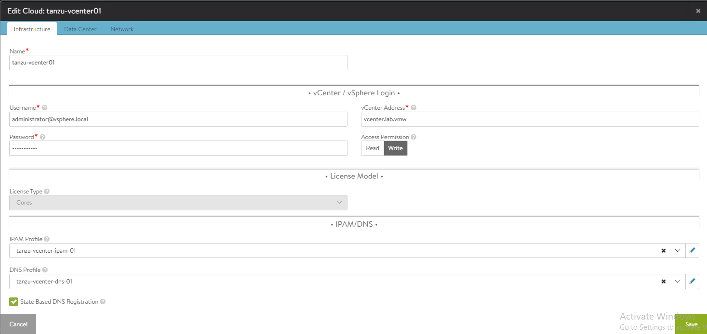  
  Figure 31 - IPAM and DNS profiles  

This completes NSX ALB configuration. Next step is to deploy and configure a bootstrap machine which will be used to deploy and manage Tanzu Kubernetes clusters.

## <a id="bootstrap"> </a>Deploy and Configure Bootstrap Machine

The bootstrap machine can be a laptop, host, or server running on Linux, MacOS, or Windows that you deploy management and workload clusters from. The bootstrap machine keeps the Tanzu and Kubernetes configuration files for your deployments and it is typically local.  

For this deployment, a Photon-based virtual machine is used as the bootstrap machine. For information on how to configure for a MacOS or Windows machine, see [Install the Tanzu CLI and Other Tools](https://docs.vmware.com/en/VMware-Tanzu-Kubernetes-Grid/1.5/vmware-tanzu-kubernetes-grid-15/GUID-install-cli.html).

1. Ensure that the bootstrap VM is connected to Tanzu Kubernetes Grid Management network `tkg-mgmt-pg`.

1. [Configure NTP](https://kb.vmware.com/s/article/76088) on your bootstrap machine.

1. Download and unpack the following Linux CLI packages from [VMware Tanzu Kubernetes Grid Download Product page](https://customerconnect.vmware.com/en/downloads/details?downloadGroup=TKG-151&productId=988&rPId=49705).

    - VMware Tanzu CLI 1.5.1 for Linux

    - kubectl cluster cli v1.22.5 for Linux

1. Execute the following commands to install Tanzu Kubernetes Grid CLI, kubectl CLIs, and Carvel tools.
    ```bash
    ## Install required packages
    tdnf install tar zip unzip wget -y

    ## Install Tanzu Kubernetes Grid CLI
    tar -xvf tanzu-cli-bundle-linux-amd64.tar.gz
    cd ./cli/
    sudo install core/v0.11.1/tanzu-core-linux_amd64 /usr/local/bin/tanzu
    chmod +x /usr/local/bin/tanzu

    ## Install Tanzu Kubernetes Grid CLI Plugins
    tanzu plugin sync

    ##verify the plugins are installed

    tanzu plugin list

    ## Install Kubectl CLI
    gunzip kubectl-linux-v1.22.5+vmware.1.gz
    mv kubectl-linux-v1.22.5+vmware.1 /usr/local/bin/kubectl && chmod +x /usr/local/bin/kubectl

    # Install Carvel tools

    ##Install ytt
    cd ./cli
    gunzip ytt-linux-amd64-v0.35.1+vmware.1.gz
    chmod ugo+x ytt-linux-amd64-v0.35.1+vmware.1 && mv ./ytt-linux-amd64-v0.35.1+vmware.1 /usr/local/bin/ytt

    ##Install kapp

    cd ./cli
    gunzip kapp-linux-amd64-v0.42.0+vmware.1.gz
    chmod ugo+x kapp-linux-amd64-v0.42.0+vmware.1 && mv ./kapp-linux-amd64-v0.42.0+vmware.1 /usr/local/bin/kapp

    ##Install kbld

    cd ./cli
    gunzip kbld-linux-amd64-v0.31.0+vmware.1.gz
    chmod ugo+x kbld-linux-amd64-v0.31.0+vmware.1 && mv ./kbld-linux-amd64-v0.31.0+vmware.1 /usr/local/bin/kbld

    ##Install impkg

    cd ./cli
    gunzip imgpkg-linux-amd64-v0.18.0+vmware.1.gz
    chmod ugo+x imgpkg-linux-amd64-v0.18.0+vmware.1 && mv ./imgpkg-linux-amd64-v0.18.0+vmware.1 /usr/local/bin/imgpkg
    ```

1. Validate Carvel tools installation using the following commands.
    ```bash
    ytt version
    kapp -version
    kbld version
    imgpkg version
    ```
1. Install `yq`. `yq` is a lightweight and portable command-line YAML processor. `yq` uses `jq`-like syntax but works with YAML and JSON files.
    ```bash
    wget https://github.com/mikefarah/yq/releases/download/v4.2.0/yq_linux_amd64.tar.gz

    tar -xvf yq_linux_amd64.tar.gz && mv yq_linux_amd64 /usr/local/bin/yq
    ```
1. Install kind.
    ```bash
    curl -Lo ./kind https://kind.sigs.k8s.io/dl/v0.11.1/kind-linux-amd64
    chmod +x ./kind
    mv ./kind /usr/local/bin/kind
    ```
1. Execute the following commands to start the Docker service and enable it to start at boot. Photon OS has Docker installed by default.
    ```bash
    ## Check Docker service status
    systemctl status docker

    ## Start Docker Service
    systemctl start docker

    ## To start Docker Service at boot
    systemctl enable docker
    ```
1. Execute the following commands to ensure that the bootstrap machine uses [cgroup v1](https://man7.org/linux/man-pages/man7/cgroups.7.html).
    ```bash
    docker info | grep -i cgroup

    ## You should see the following
    Cgroup Driver: cgroupfs
    ```
1. Create an SSH key pair.

   An SSH key pair is required for Tanzu CLI to connect to vSphere from the bootstrap machine.  

   The public key part of the generated key is passed during the Tanzu Kubernetes Grid management cluster deployment.
   ```bash
   ## Generate SSH key pair
   ## When prompted enter file in which to save the key (/root/.ssh/id_rsa): press Enter to accept the default and provide password
   ssh-keygen -t rsa -b 4096 -C "email@example.com"

   ## Add the private key to the SSH agent running on your machine and enter the password you created in the previous step
   ssh-add ~/.ssh/id_rsa
   ## If the above command fails, execute "eval $(ssh-agent)" and then rerun the command
   ```
1. If your bootstrap machine runs Linux or Windows Subsystem for Linux, and it has a Linux kernel built after the May 2021 Linux security patch, for example Linux 5.11 and 5.12 with Fedora, run the following command.

    `sudo sysctl net/netfilter/nf_conntrack_max=131072`

All required packages are now installed and the required configurations are in place in the bootstrap virtual machine. The next step is to deploy the Tanzu Kubernetes Grid management cluster.

### Import Base Image template for Tanzu Kubernetes Grid Cluster Deployment

Before you proceed with the management cluster creation, ensure that the base image template is imported into vSphere and is available as a template. To import a base image template into vSphere:

1. Go to the [Tanzu Kubernetes Grid downloads page](https://customerconnect.vmware.com/en/downloads/details?downloadGroup=TKG-151&productId=988&rPId=49705) and download a Tanzu Kubernetes Grid OVA for the cluster nodes.
  - For the management cluster, this must be either Photon or Ubuntu based Kubernetes v1.22.5 OVA.
    Note: Custom OVA with a custom Tanzu Kubernetes release (TKr) is also supported, as described in [Build Machine Images](https://docs.vmware.com/en/VMware-Tanzu-Kubernetes-Grid/1.5/vmware-tanzu-kubernetes-grid-15/GUID-build-images-index.html).
  - For workload clusters, OVA can have any supported combination of OS and Kubernetes version, as packaged in a Tanzu Kubernetes release.

  **Note**: Make sure you download the most recent OVA base image templates in the event of security patch releases. You can find updated base image templates that include security patches on the Tanzu Kubernetes Grid product download page.

1. In the vSphere client, right-click an object in the vCenter Server inventory and select **Deploy OVF template**.

1. Select Local file, click the button to upload files, and navigate to the downloaded OVA file on your local machine.

1. Follow the installer prompts to deploy a VM from the OVA.

1. Click **Finish** to deploy the VM. When the OVA deployment finishes, right-click the VM and select **Template** > **Convert to Template**.

  **Note:** Do not power on the VM before you convert it to a template.

1. **If using non administrator SSO account**: In the VMs and Templates view, right-click the new template, select **Add Permission**, and assign the **tkg-user** to the template with the **TKG role**.

For information about how to create the user and role for Tanzu Kubernetes Grid, see [Required Permissions for the vSphere Account](https://docs.vmware.com/en/VMware-Tanzu-Kubernetes-Grid/1.5/vmware-tanzu-kubernetes-grid-15/GUID-mgmt-clusters-vsphere.html#required-permissions-for-the-vsphere-account-5).

## **Deploy Tanzu Kubernetes Grid (TKG) Management Cluster**

The management cluster is a Kubernetes cluster that runs Cluster API operations on a specific cloud provider to create and manage workload clusters on that provider.

The management cluster is also where you configure the shared and in-cluster services that the workload clusters use.

You can deploy management clusters in two ways:

- Run the Tanzu Kubernetes Grid installer, a wizard interface that guides you through the process of deploying a management cluster. This is the recommended method.
- Create and edit YAML configuration files, and use them to deploy a management cluster with the CLI commands.

The following procedure provides the required steps to deploy Tanzu Kubernetes Grid management cluster using the installer interface.

1. To launch the UI installer wizard, run the following command on the bootstrap machine:  

    `tanzu management-cluster create --ui --bind <bootstrapper-ip>:<port> --browser none`  

    For example:  
    `tanzu management-cluster create --ui --bind 172.16.40.6:8000 --browser none`  

1. Access Tanzu UI wizard by opening a browser and entering: http://<bootstrapper-ip:port/  

	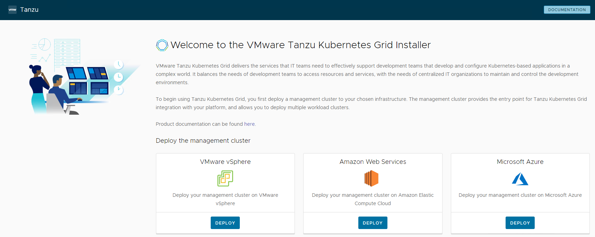
Figure 32 - Tanzu Kubernetes Grid installer UI

1. Click Deploy on the VMware vSphere tile.
1. In the IaaS Provider section, enter the IP/FQDN and credentials of the vCenter server where the TKG management cluster will be deployed.

 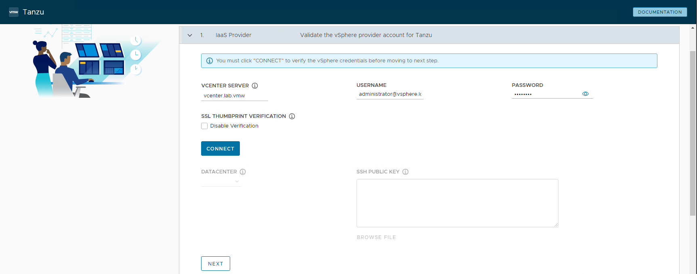
 Figure 33 - IaaS provider

1. Click **Connect** and accept the vCenter Server SSL thumbprint.

  If you are running on a vCenter 7.x environment, the following screen will be displayed.

    

	 Figure 34 - vCenter 7.x environment detected

1. Select **DEPLOY TKG MANAGEMENT CLUSTER**.
1. Select the data center and provide the SSH public Key generated while configuring the bootstrap VM.  
    If you have saved the SSH key in the default location, execute the  following command in you bootstrap machine to get the SSH public key.
		cat /root/.ssh/id_rsa.pub
1. Click **Next**.  

    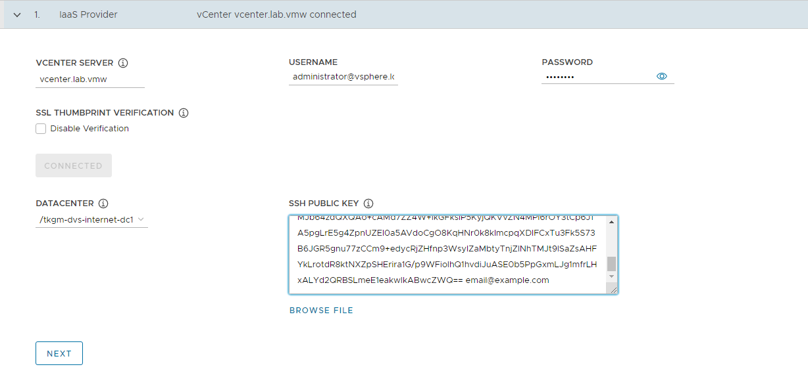

	Figure 35 - IaaS provider after connection 	  

1. On the Management Cluster Settings section, provide the following details and click **Next**.

    * Based on the environment requirements, select appropriate deployment type for the TKG Management cluster:

        * Development: Recommended for Dev or POC environments
        * Production: Recommended for Production environments

        It is recommended to set the instance type to `Large` or above. For the purpose of this document, we will proceed with deployment type `Production` and instance type `Medium`.

    * Management Cluster Name: Name for your management cluster.
    * Control Plane Endpoint Provider: Select NSX ALB for Control Plane HA.
    * Control Plane Endpoint: This is an optional field. If left blank, NSX ALB will assign an IP address from the pool “tkg_cluster_vip_pg” created earlier.  
        If you need to provide an IP address, pick an IP address from “tkg_cluster_vip_pg”  static IP pools configured in AVI and ensure that the IP address is unused.
    * Machine Health Checks: Enable
    * Enable Audit Logging: Enable for audit logging for Kubernetes API server and node VMs. Choose as per your environment needs. For more information, see [Audit Logging](https://docs.vmware.com/en/VMware-Tanzu-Kubernetes-Grid/1.5/vmware-tanzu-kubernetes-grid-15/GUID-troubleshooting-tkg-audit-logging.html).

    

	Figure 36 - Management cluster settings
1. On the NSX Advanced Load Balancer section, provide the following information and click **Next**.

    * Controller Host: NSX ALB Controller IP/FQDN (ALB Controller cluster IP/FQDN of the controller cluster is configured)
    * Controller credentials: Username and Password of NSX ALB
    * Controller certificate: Paste the contents of the Certificate Authority that is used to generate your controller certificate into the `Controller Certificate Authority` text box.

1. Once these details are provided, click **Verify Credentials** and choose the following parameters.

    * Cloud Name: Name of the cloud created while configuring NSX ALB `tanzu-vcenter-01`.
    * Service Engine Group Name: Name of the service engine group created for Tanzu Kubernetes Grid management clusters created while configuring NSX ALB `tanzu-mgmt-segroup-01`.
    * Workload VIP Network Name: Select TKG Management VIP/Data network `tkg_mgmt_vip_pg` and select the discovered subnet.
    * Workload VIP network CIDR: Select the discovered subnet, `172.16.50.0/24`
    * Management VIP network Name: Select TKG Cluster VIP/Data network `tkg_cluster_vip_pg`.
    * Cluster Labels: To adhere to the architecture defining a label is mandatory. Provide required labels, for example, `type: management`.

		**Note:** Based on your requirements, you may specify multiple labels.

    

	Figure 37 - NSX ALB settings for management cluster

  **Note:** With above configurations, when Tanzu Kubernetes Grid clusters (shared service/workload) are tagged with label `type: management`, `ako` pod gets deployed on the cluster, and any applications hosted on the cluster that requires the load balancing service will be exposed through network `tkg_mgmt_vip_pg` and the virtual service will be placed on SE group `tanzu-mgmt-segroup-01`.  

As defined in the architecture, cluster labels specified here will be applied only on shared service cluster. If no labels are specified in the “Cluster Labels” section, `ako` pod gets deployed on all the clusters without any labeling requirement and this is a deviation from the defined architecture.
                
1. (Optional) On the Metadata page, you can specify location and labels and click **Next**.

    

	Figure 38 - Management cluster metadata
1. On the Resources section, specify the resources to be consumed by Tanzu Kubernetes Grid management cluster and click **Next**.  
    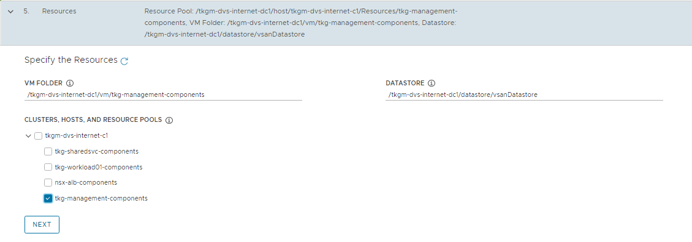

	 Figure 39 - Management cluster resources
1. On the Kubernetes Network section, select the Tanzu Kubernetes Grid management network (`tkg_mgmt_pg`) where the control plane and worker nodes will be placed during management cluster deployment. Ensure that the network has DHCP service enabled. Optionally, change the pod and service CIDR.

    If the Tanzu environment is placed behind a proxy, enable proxy and provide proxy details:

    * If you set `http-proxy`, you must also set `https-proxy` and vice-versa.
    * For the `no-proxy` section:

      * For TKG management and workload clusters, `localhost`, `127.0.0.1`, the values of `CLUSTER_CIDR` and `SERVICE_CIDR`, `.svc`, and `.svc.cluster.local` are appended along with the user specified values.
    * **Note**: If the Kubernetes cluster needs to communicate with external services and infrastructure endpoints in your Tanzu Kubernetes Grid environment, ensure that those endpoints are reachable by your proxies or add them to `TKG_NO_PROXY`. Depending on your environment configuration, this may include, but is not limited to, your OIDC or LDAP server, Harbor, NSX-T, NSX Advanced Load Balancer, and vCenter.
    * For vSphere, you must manually add the CIDR of Tanzu Kubernetes Grid management network and Cluster VIP networks that includes the IP address of your control plane endpoints, to `TKG_NO_PROXY`.

    

	Figure 40 - Management cluster Kubernetes network configuration
1. (Optional) Specify identity management with OIDC or LDAP. For the purpose of this document, identity management integration has been disabled.

    If you would like to enable Identity Management, see **Enable and Configure Identity Management During Management Cluster Deployment** section in the Tanzu Kubernetes Grid Integration with Pinniped Deployment Guide.

      
   Figure 41 - Management identity management
1. Select the OS image that will be used for the management cluster deployment.  
    Note: This list will appear empty if you don’t have a compatible template present in your environment. Refer steps provided in [Import Base Image template for TKG Cluster deployment](https://docs.vmware.com/en/VMware-Tanzu-Kubernetes-Grid/1.5/vmware-tanzu-kubernetes-grid-15/GUID-mgmt-clusters-vsphere.html#import-a-base-image-template-into-vsphere-4).
    

	Figure 42 - Management cluster OS image

1. Check the “Participate in the Customer Experience Improvement Program”, if you so desire, and click **Review Configuration**.
1. Review all the configuration. Once reviewed, you can either copy the command provided and execute it in CLI or proceed with UI to deploy the management cluster.  
    When the deployment is triggered from the UI, the installer wizard displays the deployment logs on the screen.

    
   Figure 43 - Deployment logs in installer UI

While the cluster is being deployed, you will find that a virtual service is created in NSX Advanced Load Balancer and new service engines are deployed in vCenter by NSX ALB and the service engines are mapped to the SE Group `tanzu-mgmt-segroup-01`.​​

When Tanzu Kubernetes Grid management cluster is being deployed, behind the scenes:  

* NSX ALB service engines get deployed in vCenter and this task is orchestrated by the NSX ALB controller.
* Service engine status in NSX ALB: The following snippet shows the service engines status. They are in the initializing state for sometime and then the status changes to Up.

    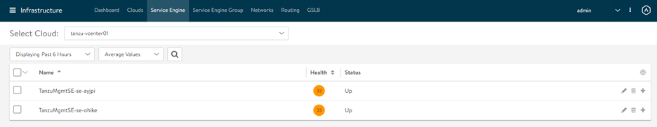

	 Figure 44 - Service engine status
* Service engine group status in NSX ALB: As per the configuration, the virtual service required for Tanzu Kubernetes Grid clusters control plane HA will be hosted on service engine group `tkg-mgmt-segroup-01`.  

    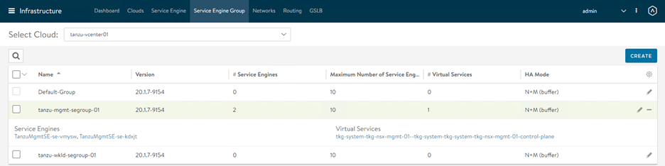

	 Figure 45 - Service engine group status
* Virtual service status in NSX ALB: The cluster is configured with Production type that deployed 3 control plane nodes, which are placed behind the cluster VIP.

    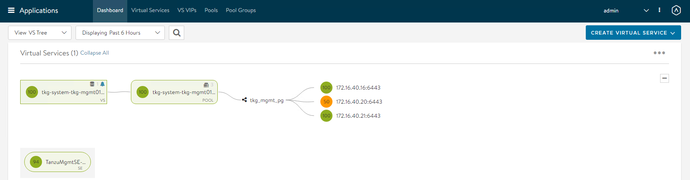
	Figure 46 - Virtual service status dashboard

    
   Figure 47 - Virtual service status
* Once the Tanzu Kubernetes Grid management cluster is successfully deployed, the Tanzu Bootstrap UI displays the following status.
    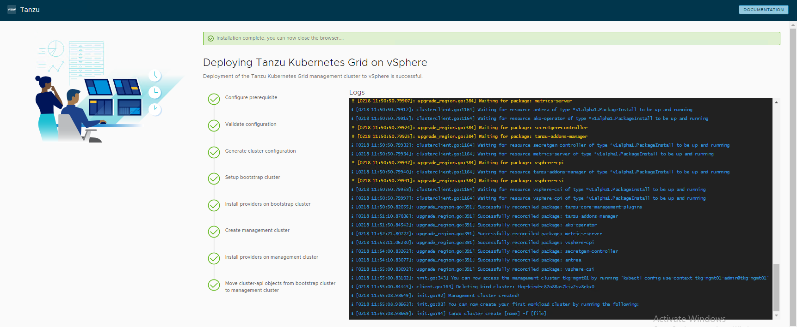
   Figure 48 - Deployment completion
* The installer will automatically set the context to the Tanzu Kubernetes Grid management cluster on the bootstrap machine. Now you can access the Tanzu Kubernetes Grid management cluster from the bootstrap machine and perform additional tasks such as verifying the management cluster health and deploying the workload clusters, etc.

    To get the status of Tanzu Kubernetes Grid management cluster, execute the following command:

    `tanzu management-cluster get`

    

   Use `kubectl` to get the status of the Tanzu Kubernetes Grid management cluster nodes.

    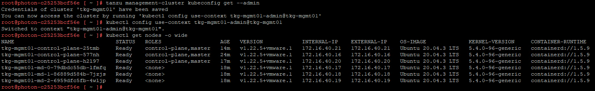


## What to Do Next

Register your management cluster with Tanzu Mission Control: If you want to register your management cluster with Tanzu Mission Control, see [Register Your Management Cluster with Tanzu Mission Control](./tko-saas-services.md/#a-idtmc-a-tanzu-mission-control).

## Deploy Tanzu Shared Service Cluster  

Each Tanzu Kubernetes Grid instance can have only one shared services cluster. Create a shared services cluster if you intend to deploy Harbor.  

The procedures for deploying a shared service cluster and workload cluster are almost the same. A key difference is that for the shared service cluster you add the `tanzu-services` label to the shared services cluster, as its cluster role. This label identifies the shared services cluster to the management cluster and workload clusters.  

Another difference between the shared services cluster and workload clusters is that shared services clusters will be applied with the “Cluster Labels” which were defined while deploying the management cluster. This is to enforce that only shared service cluster will make use of the Tanzu Kubernetes Grid cluster VIP or data network for application load balancing purposes and the virtual services are deployed on “Service Engine Group 1”.

After the management cluster is registered with Tanzu Mission Control, the deployment of the Tanzu Kubernetes clusters can be done in just a few clicks. The procedure for creating Tanzu Kubernetes clusters is as follows.

1. Navigate to the Clusters tab and click **Create Cluster**.

1. Under the Create cluster page, select the management cluster which you registered in the previous step and click **Continue to create cluster**.

    

	 Figure 49 - Shared services cluster - management cluster
1. Select the provisioner for creating the workload cluster (shared services cluster). Provisioner reflects the vSphere namespaces that you have created and associated with the management cluster.

    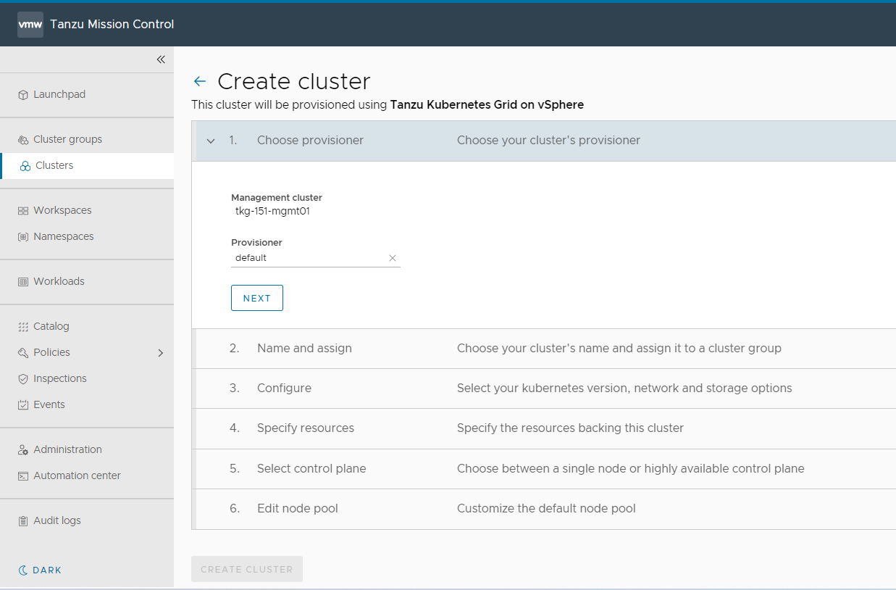

	 Figure 50 - Shared services cluster - provisioner
1. Enter a name for the cluster and select the cluster group to which you want to attach your cluster. Cluster names must be unique within an organization. For the cluster group, you can optionally enter a description and apply labels.

    

	 Figure 51 - Shared services cluster - name and cluster group
1. On the Configure page, specify the following items:

 * Select the Kubernetes version to use for the cluster. The latest supported version is preselected for you. You can choose the desired Kubernetes version by clicking on the down arrow button.
 * You can optionally define an alternative CIDR for the pod and the service. The pod CIDR and service CIDR cannot be changed after the cluster is created.
 * You can optionally specify a proxy configuration to use for this cluster.

    **Note:** The scope of this document doesn't cover the use of a proxy for Tanzu Kubernetes Grid deployment. If your environment uses a proxy server to connect to the internet, ensure that the proxy configuration object includes the CIDRs for the pod, ingress, and egress from the workload network of the Management Cluster in the **No proxy list**, as described in [Create a Proxy Configuration Object for a Tanzu Kubernetes Grid Service Cluster Running in vSphere with Tanzu](https://docs.vmware.com/en/VMware-Tanzu-Mission-Control/services/tanzumc-using/GUID-B4760775-388A-45B5-A707-2191E9E4F41F.html#GUID-B4760775-388A-45B5-A707-2191E9E4F41F).

    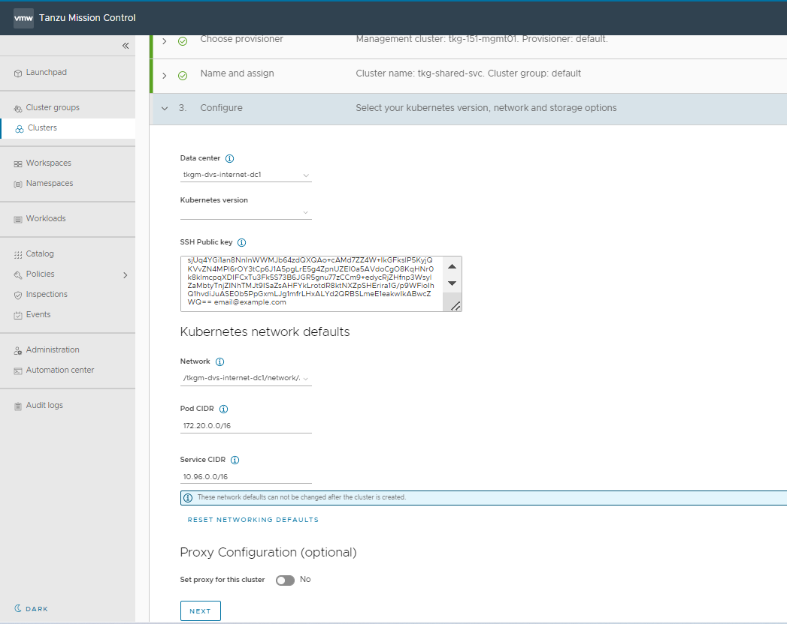

	Figure 52 - Shared services cluster - Kubernetes version, network and storage options

1.  Select the resources for backing this cluster. Provide the resource pool, VM folder, and datastore information.

    

	 Figure 53 - Shared services cluster - resources
1. Select the high availability mode for the control plane nodes of the workload cluster. For a production deployment, it is recommended to deploy a highly available workload cluster.

    

	 Figure 54 - Shared services cluster - control plane
1.  Customize the default node pool for your workload cluster.

 * Specify the number of worker nodes to provision.
 * Select the instance type.

1. Click **CREATE CLUSTER** to start provisioning your workload cluster.

    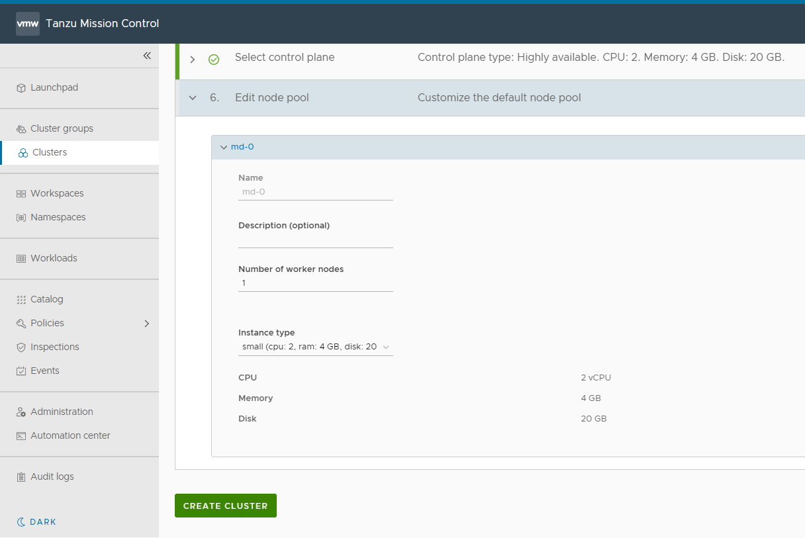

	 Figure 55 - Shared services cluster - start cluster creation
1. Once the cluster is created, you can check the status from Tanzu Mission Control.

    

	 Figure 56 - Shared services cluster - cluster status

	Cluster creation roughly takes 15-20 minutes to complete. After the cluster deployment completes, ensure that agent and extensions health shows green.

    

	 Figure 57 - Shared services cluster - agent and extensions status
1. Connect to the Tanzu Management Cluster context and apply the following labels.
<!-- /* cSpell:disable */ -->
  ```bash
  ## Connect to tkg management cluster

  kubectl config use-context tkg-mgmt01-admin@tkg-mgmt01

  ## verify the shared service cluster creation

  tanzu cluster list
  NAME            NAMESPACE  STATUS   CONTROLPLANE  WORKERS  KUBERNETES        ROLES   PLAN
  tkg-shared-svc  default    running  3/3           3/3      v1.22.5+vmware.1  <none>  prod

  ## Add the tanzu-services label to the shared services cluster as its cluster role. In the following command “tkg-shared-svc” is the name of the shared service cluster

  kubectl label cluster.cluster.x-k8s.io/tkg-shared-svc cluster-role.tkg.tanzu.vmware.com/tanzu-services="" --overwrite=true

  ## Tag shared service cluster with all “Cluster Labels” defined while deploying Management Cluster, once the “Cluster Labels” are applied AKO pod will be deployed on the Shared Service Cluster

  kubectl label cluster tkg-shared-svc type=management

  ```
<!-- /* cSpell:enable */ -->

12. Get the admin context of the shared service cluster using the following commands and switch the context to the shared service cluster.
<!-- /* cSpell:disable */ -->
  ```bash
  ## Use the following command to get the admin context of Shared Service Cluster. In the following command “tkg-shared-svc” is the name of the shared service cluster

  tanzu cluster kubeconfig get tkg-shared-svc --admin

  ## Use the following command to use the context of Shared Service Cluster

  kubectl config use-context tkg-shared-svc-admin@tkg-shared-svc

  # Verify that ako pod gets deployed in avi-system namespace

  kubectl get pods -n avi-system
  NAME    READY   STATUS    RESTARTS   AGE
  ako-0   1/1     Running   0          41s

  ```
<!-- /* cSpell:enable */ -->

Now that the shared service cluster is successfully created, you may proceed with deploying the Harbor package.


## <a id="dep-workload-cluster"> </a>Deploy Tanzu Workload Clusters

As per the architecture, workload clusters make use of a separate SE group (**Service Engine Group 2)** and VIP Network (**TKG Workload VIP/Data Network**) for application load balancing. This can be controlled by creating a new **AKODeploymentConfig**. For more information, see [Create and deploy AKO Deployment Config for TKG Workload Cluster](#configure-nsx-advanced-load-balancer-in-tkg-workload-cluster).

Complete the following steps to deploy workload clusters from Tanzu Mission Control:

1.  Navigate to the Clusters tab and click **Create Cluster**.

1. Under the create cluster page, select the management cluster which you registered in the previous step and click **Continue to create cluster**.

    
   Figure 58 - Workload cluster - management cluster
1. Select the provisioner for creating the workload cluster. Provisioner reflects the vSphere namespaces that you have created and that are associated with the management cluster.

    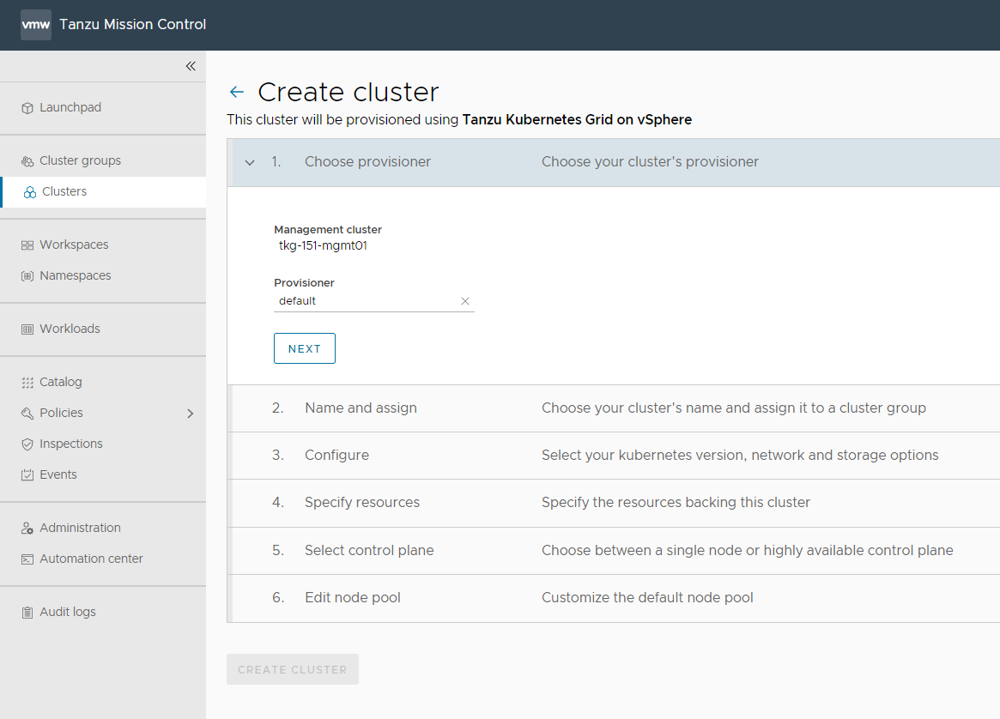

	 Figure 59 - Workload cluster - provisioner
1. Enter a name for the cluster and select the cluster group  to which you want to attach your cluster. Cluster names must be unique within an organization. For cluster groups, you can optionally enter a description and apply labels.

    

	 Figure 60 - Workload cluster - name and cluster group
1.  On the Configure page, specify the following items:

 * Select the Kubernetes version to use for the cluster. The latest supported version is preselected for you. You can choose the appropriate Kubernetes version by clicking on the down arrow button.
 * You can optionally define an alternative CIDR for the pod and service. The Pod CIDR and Service CIDR cannot be changed after the cluster is created.
 * You can optionally specify a proxy configuration to use for this cluster.

    **Note:** The scope of this document doesn't cover the use of a proxy for vSphere with Tanzu. If your environment uses a proxy server to connect to the internet, ensure that the proxy configuration object includes the CIDRs for the pod, ingress, and egress from the workload network of the supervisor cluster in the **No proxy list** as described in [Create a Proxy Configuration Object for a Tanzu Kubernetes Grid Service Cluster Running in vSphere with Tanzu](https://docs.vmware.com/en/VMware-Tanzu-Mission-Control/services/tanzumc-using/GUID-B4760775-388A-45B5-A707-2191E9E4F41F.html#GUID-B4760775-388A-45B5-A707-2191E9E4F41F).

    

	 Figure 61 - Workload cluster - Kubernetes version, network and storage options
1. Select the resources for backing this cluster. Provide the Resource Pool, VM folder and Datastore information.

    

	 Figure 62 - Workload cluster - resources
1. Select the high availability mode for the control plane nodes of the workload cluster. For a production deployment, it is recommended to deploy a highly available workload cluster.

    

	 Figure 63 - Workload cluster - control plane
1. Customize the default node pool for your workload cluster.

 * Specify the number of worker nodes to provision.
 * Select the instance type.

1. Click **CREATE CLUSTER** to start provisioning your workload cluster.

    

	Figure 64 - Workload cluster - start creation
1. You can monitor the workload cluster creation from the Tanzu Mission Control console.
    

	 Figure 65 - Workload cluster - status
 Cluster creation roughly takes 15-20 minutes to complete.
1. After the cluster deployment completes, ensure that agent and extensions health shows green.

    

	 Figure 66 - Workload cluster - agent and extensions status
### <a id="workloadalb"> </a> Configure NSX Advanced Load Balancer in TKG Workload Cluster

Tanzu Kubernetes Grid v1.5.x management clusters with NSX Advanced Load Balancer are deployed with 2 AKODeploymentConfigs.

* `install-ako-for-management-cluster`: default config for management cluster
* `install-ako-for-all`:  default config for all Tanzu Kubernetes Grid clusters. By default, any clusters that match the cluster labels defined in `install-ako-for-all` will reference this file for their virtual IP networks, service engine (SE) groups, and L7 ingress. As part of this architecture, only shared service cluster makes use of the configuration defined in the default AKODeploymentConfig `install-ako-for-all`.

As per the defined architecture, workload clusters must not make use of **Service Engine Group 1** and VIP Network **TKG Cluster VIP/Data Network** for application load balancer services.
A separate SE group (**Service Engine Group 2)** and VIP Network (**TKG Workload VIP/Data Network**) will be used by the workload clusters, These configurations can be enforced on workload clusters by:

* Creating a new AKODeploymentConfig in the Tanzu Kubernetes Grid management cluster. This AKODeploymentConfig file dictates which specific SE group and VIP network that the workload clusters can use for load balancer functionalities  
* Apply the new AKODeploymentConfig:  Label the workload cluster to match the `AKODeploymentConfig.spec.clusterSelector.matchLabels` element in the AKODeploymentConfig file.
  Once the labels are applied on the workload cluster, Tanzu Kubernetes Grid management cluster will deploy AKO pod on the target workload cluster which has the configuration defined in the new AKODeploymentConfig.

The format of the AKODeploymentConfig yaml file is as follows.

<!-- /* cSpell:disable */ -->
```yaml
apiVersion: networking.tkg.tanzu.vmware.com/v1alpha1
kind: AKODeploymentConfig
metadata:
  finalizers:
     - ako-operator.networking.tkg.tanzu.vmware.com
  generation: 1
  labels:
  name: <Unique name of AKODeploymentConfig>
spec:
  adminCredentialRef:
    name: nsx-alb-controller-credentials
    namespace: tkg-system-networking
  certificateAuthorityRef:
    name: nsx-alb-controller-ca
    namespace: tkg-system-networking
  cloudName: <NAME OF THE CLOUD in ALB>
  clusterSelector:
    matchLabels:
      <KEY>: <VALUE>
  controlPlaneNetwork:
    cidr: <WORKLOAD NETWORK CIDR>
    Name: <WORKLOAD NETWORK NAME>
  controller: <NSX ALB CONTROLLER IP/FQDN>
  dataNetwork:
    cidr: <VIP NETWORK CIDR>
    name: <VIP NETWORK NAME>
  extraConfigs:
   cniPlugin: antrea
   disableStaticRouteSync: true
   enableEVH: false
   ingress:
      defaultIngressController: false
      disableIngressClass: true
      noPGForSNI: false
    l4Config:
      advancedL4: false
      autoFQDN: disabled
    layer7Only: false
    networksConfig:
      enableRHI: false
    servicesAPI: false
  serviceEngineGroup: <SERVICE ENGINE NAME>

```
<!-- /* cSpell:enable */ -->

The sample AKODeploymentConfig with sample values in place is as follows. As per the following configuration, Tanzu Kubernetes Grid management cluster will deploy AKO pod on any workload cluster that matches the label `type=workloadset01` and the AKO configuration will be as follows:

- cloud: ​`tanzu-vcenter-01​`
- service engine group: `tanzu-wkld-segroup-01`
- Control Plane network: `tkg_workload_pg`
- VIP/data network: `tkg_workload_vip_pg`

<!-- /* cSpell:disable */ -->
```yaml
apiVersion: networking.tkg.tanzu.vmware.com/v1alpha1
kind: AKODeploymentConfig
metadata:
  finalizers:
  - ako-operator.networking.tkg.tanzu.vmware.com
  generation: 1
  labels:
  name: tanzu-ako-workload-set01
spec:
  adminCredentialRef:
    name: avi-controller-credentials
    namespace: tkg-system-networking
  certificateAuthorityRef:
    name: avi-controller-ca
    namespace: tkg-system-networking
  cloudName: tanzu-vcenter01
  clusterSelector:
    matchLabels:
      type: workloadset01
  controlPlaneNetwork:
    cidr: 172.16.60.0/24
    name: tkg_workload_pg
  controller: alb-ha.lab.vmw
  dataNetwork:
    cidr: 172.16.70.0/24
    name: tkg_workload_vip_pg
  extraConfigs:
    cniPlugin: antrea
    disableStaticRouteSync: true
    enableEVH: false
    ingress:
      defaultIngressController: false
      disableIngressClass: true
      noPGForSNI: false
    l4Config:
      advancedL4: false
      autoFQDN: disabled
    layer7Only: false
    networksConfig:
      enableRHI: false
    servicesAPI: false
  serviceEngineGroup: tanzu-wkld-segroup-01
```
<!-- /* cSpell:enable */ -->

Once you have the AKO configuration file ready, use the `kubectl` command to set the context to Tanzu Kubernetes Grid management cluster and use the following command to list the available AKODeploymentConfig:

<!-- /* cSpell:disable */ -->
```
kubectl apply -f <path_to_akodeploymentconfig.yaml>
```
<!-- /* cSpell:enable */ -->

Use the following command to list all AKODeploymentConfig created under the management cluster:

<!-- /* cSpell:disable */ -->
```
kubectl get adc  or
kubectl get akodeploymentconfig
```
<!-- /* cSpell:enable */ -->


Now that you have successfully created the AKO deployment config, you need to apply the cluster labels defined in the AKODeploymentConfig to any of the Tanzu Kubernetes Grid workload clusters. Once the labels are applied, Tanzu Kubernetes Grid management cluster will deploy AKO pod on the target workload cluster.

<!-- /* cSpell:disable */ -->
```
kubectl label cluster <Cluster_Name> <label>
```
<!-- /* cSpell:enable */ -->


### Connect to TKG Workload Cluster and Validate the Deployment

Now that you have the Tanzu Kubernetes Grid workload cluster is created and required AKO configurations are applied, use the following command to get the admin context of the TKG workload cluster.

<!-- /* cSpell:disable */ -->
```
tanzu cluster kubeconfig get <cluster-name> --admin
```
<!-- /* cSpell:enable */ -->


Connect to the Tanzu Kubernetes Grid workload cluster using the `kubectl` command and run the following commands to check the status of AKO and other components.

<!-- /* cSpell:disable */ -->
```bash
## List all nodes with status

kubectl get nodes  

## To check the status of AKO pod

kubectl get pods -n avi-system

## Lists all pods and it’s status

kubectl get pods -A   
```
<!-- /* cSpell:enable */ -->


You can now [configure SaaS services](./tko-saas-services.md/#configure-tanzu-saas-components-for-tanzu-for-kubernetes-operations) for the cluster and deploy user managed packages on this cluster.