# Configure Tanzu SaaS Components for Tanzu for Kubernetes Operations 

The following VMware SaaS services provide additional Kubernetes lifecycle management, observability, and service mesh features. This document outlines the configuration needed to set up the VMware SaaS services for Tanzu for Kubernetes operations. 

* [Tanzu Mission Control](#tmc) (TMC)
* [Tanzu Observability](#to) (TO)
* [Tanzu Service Mesh](#tsm) (TSM)

## <a id=tmc> </a> Tanzu Mission Control

Tanzu Mission Control (TMC) is a centralized management platform for consistently operating and securing your Kubernetes infrastructure and modern applications across multiple teams and clouds. It provides operators with a single control point to give developers the independence they need to drive business forward, while enabling consistent management and operations across environments for increased security and governance.

We recommended attaching the shared services and workload clusters to Tanzu Mission Control as it enables you to manage your global portfolio of Kubernetes clusters from a centralized a centralized administrative interface.
  
If the Tanzu Kubernetes Grid clusters are behind a proxy, import the proxy configuration to Tanzu Mission Control and then attach the cluster using Tanzu Mission Control. 

### Attach a Tanzu Kubernetes Cluster to Tanzu Mission Control

Attaching a workload or shared services cluster involves the following:

1. Register the cluster name with the Tanzu Mission Control cluster agent service.
2. Install the cluster agent extensions on the cluster.

#### Prerequisites
Before attaching a Tanzu Kubernetes Grid cluster in Tanzu Mission Control, complete the following:

- Review [About Getting Started with VMware Tanzu Mission Control](https://docs.vmware.com/en/VMware-Tanzu-Mission-Control/services/tanzumc-getstart/GUID-6BCCD353-CE6A-494B-A1E4-72304DC9FA7F.html) for information about setting up and using VMware Tanzu Mission Control.
* You have a subscription to Tanzu Mission Control.
* Create a cluster group in Tanzu Mission Control.
* Create a workspace in the Tanzu Mission Control.
* Create the policies that are appropriate for your Tanzu Kubernetes Grid deployment.
* Create a provisioner. A provisioner helps you deploy Tanzu Kubernetes Grid clusters across multiple different platforms, such as AWS and VMware vSphere.
* Deploy Tanzu Kubernetes Grid workload clusters with the production plan.

### Attach a Tanzu Kubernetes Grid Workload Cluster in Tanzu Mission Control
Registering a Tanzu Kubernetes Grid management cluster in Tanzu Mission Control is not supported. However, you can register Tanzu Kubernetes Grid workload clusters for life-cycle management.

1.  Log in to Tanzu Mission Control from [VMware Cloud Services](https://www.google.com/url?q=https://console.cloud.vmware.com&sa=D&source=editors&ust=1635189098078000&usg=AOvVaw2GaFsuoFDISaBEcqqJJ0iE).
2.  In the left navigation pane of the Tanzu Mission Control console, click **Clusters > Attach Cluster**.  
    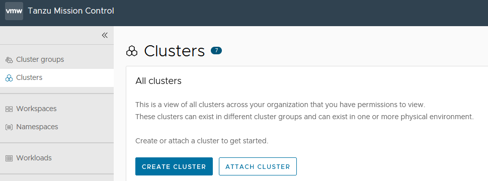

3.  Enter a name for the cluster and select the cluster group in which you want to register the cluster. Optionally, provide a description and one or more labels. 
    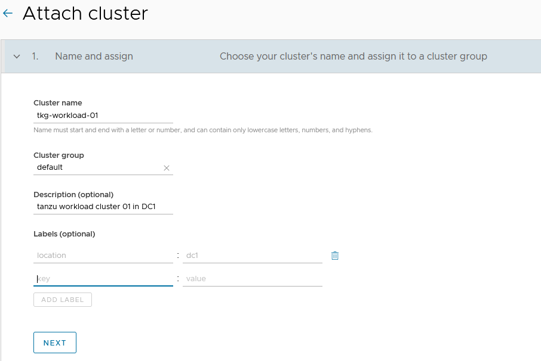

1. Click **Next**.

4. (Optional) Select a proxy configuration for the cluster.

	1. Click to toggle the **Set proxy for this cluster** option to **Yes**.
	
		**Note**: For instructions on the proxy configuration, see [Appendix A](#appendix-a).
	
	6. Select the proxy configuration you defined for this cluster.

		

7. Click **Next**. 
	
	Tanzu Mission Control generates a YAML manifest specifically for your cluster, and displays the kubectl/tmc command to run the manifest.

8.  Copy the provided command, switch to the bootstrap machine or any other machine which has kubectl/tmc installed and has connectivity to the cluster, and then run the command.

	- If you attach using a proxy configuration, make sure you have the latest version of the Tanzu Mission Control CLI (tmc) installed, and then run the tmc command, replacing &`<kubeconfig>` with the appropriate `kubeconfig` for the cluster.
	
		To obtain admin `kubeconfig` of a cluster, execute the following command on the bootstrap machine: 

		`tanzu cluster kubeconfig get <cluster-name> --admin --export-file <file-name.yaml>`  

		

	- If you attach without a proxy configuration, connect to the cluster with `kubectl`, and then run the `kubectl` command.


11.  After the command is applied, wait for all pods to initialize in the namespace `vmware-system-tmc`. To monitor the pods status, use the following command:

    `kubectl get pods -n vmware-system-tmc`
     
12.  In Tanzu Mission Control console, click **Verify Connection**. You will see the success message.  
    
    
13.  Click **View your Cluster** to see the cluster details.  
    

### <a id=appendix-a> </a>Appendix (A) -  Create a Proxy Configuration Object in Tanzu Mission Control

Do the following steps to create a proxy configuration object in Tanzu Mission Control.

1.  In the left navigation pane of the Tanzu Mission Control console, click Administration.
2.  On the Administration page, click the Proxy Configuration tab.  
    
3.  Click **Create Proxy Configuration**.
4.  On the Create proxy page, enter a name for the proxy configuration.
5.  (Optional) Provide a description.
6.  Specify the URL or IP address of the proxy server, and the port on which outbound traffic is allowed.
7.  Enter the credentials (username and password) that permit outbound traffic through the proxy server.
8.  (Optional) Enter an alternative server/port and username/password for HTTPS traffic.
9.  (Optional) In **No proxy list**, specify a comma-separated list of outbound destinations that must bypass the proxy server.  
    
10. Click **Create**. The proxy configuration is added to Tanzu Mission Control. Use this proxy configuration when you add a cluster that is sitting behind the proxy. Based on your environment, you can add multiple proxies in Tanzu Mission Control.  
    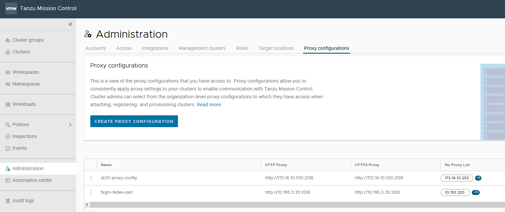  
    

## <a id=to> </a> Tanzu Observability
  
Tanzu Observability (TO) delivers full-stack observability across containerized cloud applications, Kubernetes health, and cloud infrastructure. The solution is consumed through a software-as-a-Service (SaaS) subscription model managed by VMware. This SaaS model allows the solution to scale to meet your metrics requirements without the need to maintain the solution itself.

### Set up Tanzu Observability to Monitor a Tanzu Kubernetes Clusters

This setup for monitoring Tanzu Kubernetes Grid clusters with Tanzu Observability is done on Tanzu Mission Control. Tanzu Mission Control provides a common management layer across Kubernetes clusters to configure multiple policies. Tanzu Mission Control also enables the integration of the Kubernetes clusters with other SaaS solutions Tanzu Service Mesh.

#### Prerequisites
Before doing the setup, ensure the following:

* An active Tanzu Mission Control subscription.
* Tanzu Observability integration is enabled in Tanzu Mission Control.
* Tanzu Observability instance is provisioned for your organization.
* A Service Account in Tanzu Observability to enable communication between Tanzu Observability and Tanzu Mission Control.
* Tanzu Observability is enabled on your organization. If Tanzu Observability is not enabled, enable it by navigating to the **Administration > Integrations** tab in Tanzu Mission Control.  

#### Register Tanzu Kubernetes Grid Workload Cluster with Tanzu Observability 

To integrate Tanzu Observability on a cluster attached to Tanzu Mission Control, do the following:  

1.  Create a service account in Tanzu Observability (TO) to enable communication between Tanzu Observability and Tanzu Mission Control. 
	1. Log in to your Tanzu Observability instance (<instance_name>.wavefront.com) as a user with Accounts, Groups & Roles permission.
	2. From the gear icon on the top right, select **Account Management**.
	3. Click on the **Service Accounts** tab and click **Create New Account** to create a service account and an associated API token.  
    	
	4. Specify the service account name, optionally, provide a description, and click **Create**. 
    	
	5. Select the newly created account and click the Copy to Clipboard icon in the **Tokens** row. You will paste this token into the **Credentials** field on Tanzu Mission Control.  
   
2.  Enable Tanzu Observability in Tanzu Mission Control.
	1. Login to Tanzu Mission Control.
	1. In the left navigation pane of the Tanzu Mission Control console, click **Administration**.
	2. Click on the **Integrations** tile. 
	3. From the available integrations options, enable **Tanzu Observability** if not yet enabled.  
    
	3. Under **Administration** switch to **Accounts**, click **Create Account Credentials** and select **Tanzu Observability credential**. 
	4. Enter the following and click **Create**:

		- Credential Name
		- Tanzu Observability URL
		- Tanzu Observability API Token obtained in step 1  
    		  

4. On the Tanzu Mission Control console, click **Clusters** on the left navigation pane. 
1. Click on the cluster you want to add to Tanzu Observability.
5. On the cluster page, click **Add Integration**, and select **Tanzu Observability**.  
    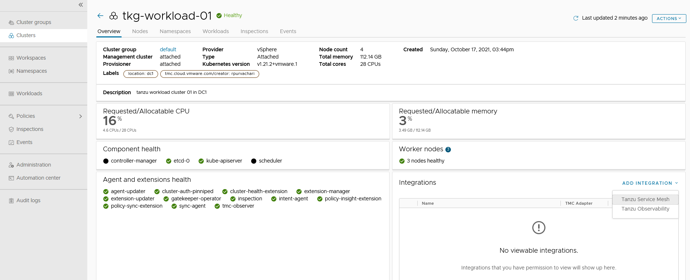
6. Select the Tanzu Observability credentials and click **Confirm**.   
      
    The Tanzu Mission Control adapter for Tanzu Observability appears in an unhealthy state for a few minutes because the required objects are being created on the cluster.  
    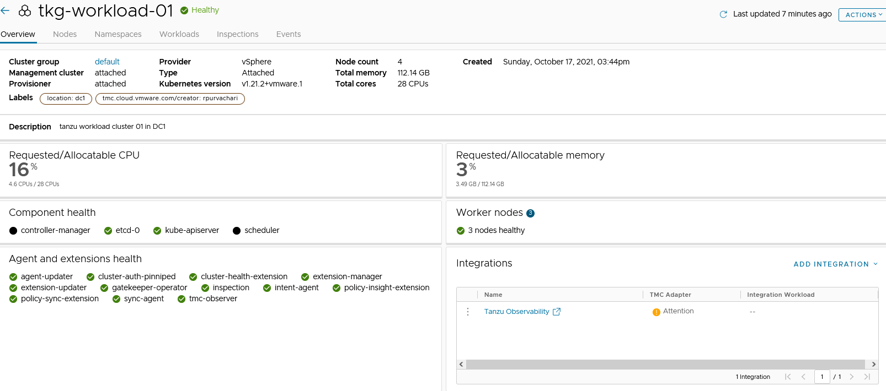  
    
7. On the target cluster, you will see a new namespace, `tanzu-observability-saas` and the required objects being created.  
      
1. Wait for all the pods to successfully initialize.  
    
8. After all the pods are initialized, the Tanzu Mission Control adapter in the Tanzu Mission Control console appears in a healthy state.  
      
    This confirms that the integration is completed and the cluster can be monitored with Tanzu Observability.
9. Click on the Tanzu Observability link provided in Tanzu Mission Control or Log in to your Tanzu Observability instance (<instance_name>.wavefront.com) to ensure that the metrics are being collected in Tanzu Observability.  
    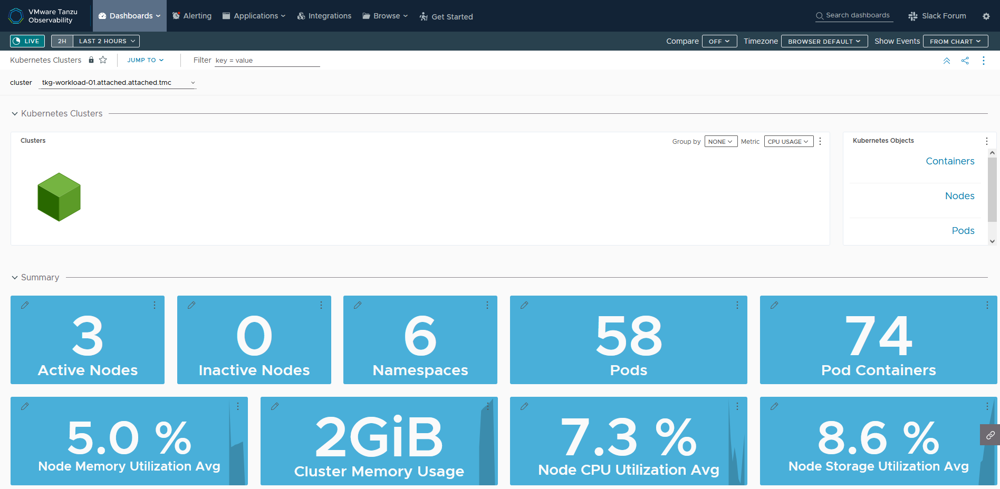  
      
    

## <a id=tsm> </a>Tanzu Service Mesh
VMware Tanzu Service Mesh (TSM) is an enterprise-class service mesh solution that provides consistent control and security for microservices, end-users, and data across all your clusters and clouds in the most demanding multi-cluster and multi-cloud environments.

### Onboard a Tanzu Kubernetes Cluster to Tanzu Service Mesh
You can onboard Tanzu Service Mesh with or without Tanzu Mission Control. 

#### Prerequisites

* (Optional) An active Tanzu Mission Control subscription.  Required only if you intend to onboard a cluster to Tanzu Service Mesh via Tanzu Mission Control.
	* Ensure that the cluster to be onboarded to Tanzu Service Mesh is attached to Tanzu Mission Control.
* An active Tanzu Service Mesh subscription.
* Workload cluster resource requirements:
    - **Nodes**: At least 3 worker nodes, each with at least 3,000 milliCPU (3 CPUs) of allocatable CPU and 6 GB of allocatable memory.
    - **DaemonSets**: The DaemonSets instantiate a pod on every node on the cluster. To run the DaemonSets, Tanzu Service Mesh requires that every node in the cluster have at least 250 milliCPU and 650 MB of memory available.
    - **Ephemeral storage**: 24 GB for the whole cluster and additionally 1 GB for each node.
    - **Pods**: Tanzu Service Mesh requires a quota of at least 3 pods for each node on the cluster and additionally at least 30 pods for the whole cluster.
* If you want to install Tanzu Service Mesh only in some of the namespaces of the cluster, decide which namespaces you want to exclude from Tanzu Service Mesh.
* If you want the cluster to connect to Tanzu Service Mesh through a proxy server, make sure that you know the details of the proxy configuration, such as the type of proxy in use (transparent or explicit), the protocol (HTTP or HTTPS), the host name or IP address of the proxy server, and the port number.
* If your corporate proxy server is configured to use a certificate for secure TLS connections, make sure that you know the location of the certificate file. The Tanzu Service Mesh agent on the cluster will use the certificate to connect to the proxy server and trust the connection.

#### Onboard without Tanzu Mission Control

Do the following to onboard a cluster to Tanzu Service Mesh without Tanzu Mission Control integration.

1. Login to Tanzu Mission Control via [VMware Cloud Services](https://console.cloud.vmware.com/csp/gateway/portal/#/consumer/services/organization) page.

2. In the upper-left corner of the Tanzu Service Mesh console, click **Add New** and then **Onboard New Cluster** to open the Onboard Clusters panel.

	**Note**: If you're onboarding your first cluster to Tanzu Service Mesh, the **Onboard Clusters** panel appears automatically when you log in to Tanzu Service Mesh console.

3. In the **Onboard Clusters** panel, enter a name for the cluster that you want to onboard.

   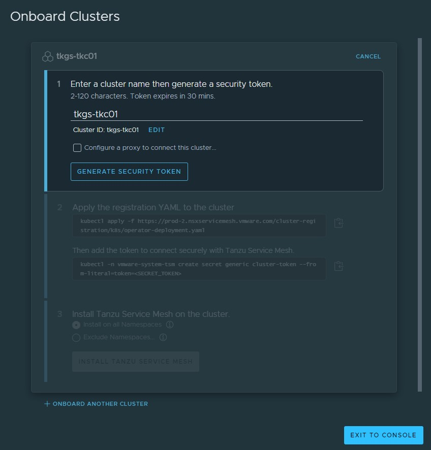

4. If the cluster that’s being onboarded has to connect to Tanzu Service Mesh through a proxy server, select the **Configure a proxy to connect this cluster** check box and provide the required proxy details and pass the certificate of the proxy server.

	**Note:** If your proxy server uses a globally trusted certificate, you don't need to provide the proxy configuration in Tanzu Service Mesh. Deselect the **Configure a proxy to connect this cluster** check box.

	This article does not make use of proxy settings for demonstration purposes.

5. Click **Generate Security Token** to generate a security token. You are provided two `kubectl` commands: 

    - The first one applies the `operator-deployment.yaml` file to create the required Tanzu Service Mesh objects, such as Namespace, Service Account, RoleBinding, deployments, and secret on the target cluster
    - The second one creates the required secret named `generic` under the namespace `vmware-system-tsm`

     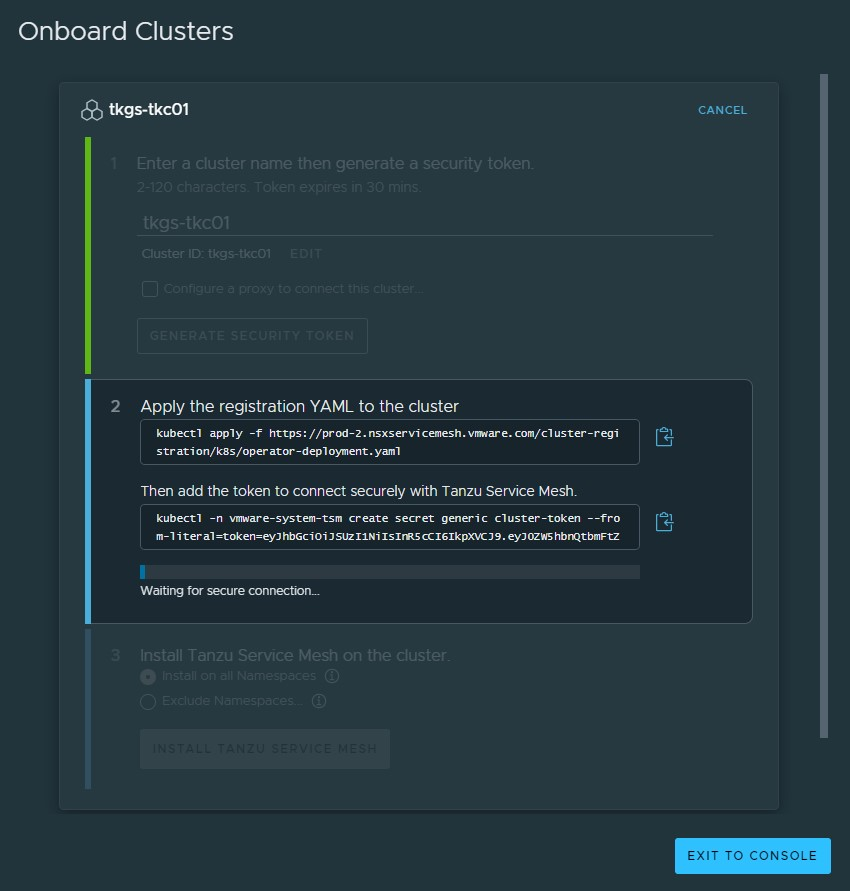

6. Connect to the target Tanzu Kubernetes Cluster and execute the commands obtained from previous step. A new namespace `vmware-system-tsm` is created on the target cluster. 

	<!-- /* cSpell:disable */ -->

	```
	# kubectl get pods -n vmware-system-tsm
	NAME                                        READY   STATUS      RESTARTS   AGE
	allspark-ws-proxy-6d58bb4665-5q998          1/1     Running     1          24m
	installer-job-7jjqr                         0/1     Completed   0          22m
	k8s-cluster-manager-7b446cd99b-v2jk8        1/1     Running     1          24m
	operator-ecr-read-only--renew-token-6nd5f   0/1     Completed   0          25m
	telegraf-istio-75b8547675-nmzkr             1/1     Running     0          15m
	tsm-agent-operator-548f8997c9-5l67z         1/1     Running     0          25m
	```
	<!-- /* cSpell:enable */ -->

7. After all the required objects are created on the cluster, the Tanzu Service Mesh console prompts you to **Install Tanzu Service Mesh on the cluster**. For this deployment, Tanzu Service Mesh is installed on all namespaces.
   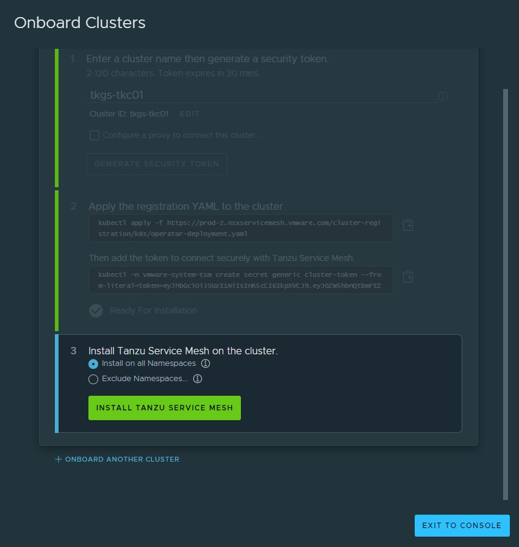

   **Note**: 
   
    - To install Tanzu Service Mesh in all the namespaces, click Install on all Namespaces. The system namespaces on the cluster, such as kube-system, kube-public, and istio-system, are excluded from Tanzu Service Mesh by default.
    - To exclude a specific namespace from Tanzu Service Mesh, click Exclude Namespaces, select Is Exactly from the left drop-down menu under Exclude Namespaces, and then enter or select the name of the namespace from the right drop-down menu.
    - You can also specify the name of a namespace that you plan to create in the cluster at some point in the future.
    
    

8. When the installation is complete, **Successfully Onboarded** appears next to the cluster name.

    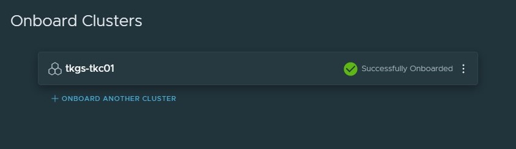

The Tanzu Service Mesh console displays information about the infrastructure of the onboarded cluster and any microservices deployed on the cluster. Tanzu Service Mesh also starts monitoring and collecting infrastructure and service metrics, such as the number of nodes and services, requests per second, latency, and CPU usage, from the cluster. The Home page of the Tanzu Service Mesh console provides summary information about the cluster's infrastructure, a topology view of the services in the cluster, and key metrics.

If you have a multi-cluster or hybrid-cloud application, you can connect, secure, and manage the services in the application across the clusters with a global namespace. For more information, see [Connect Services with a Global Namespace](https://docs.vmware.com/en/VMware-Tanzu-Service-Mesh/services/using-tanzu-service-mesh-guide/GUID-8D483355-6F58-4AAD-9EAF-3B8E0A87B474.html).

#### Onboard with Tanzu Mission Control

Do the following to onboard a Tanzu Kubernetes Cluster to Tanzu Service Mesh using Tanzu Mission Control:

1. Login to Tanzu Mission Control via [VMware Cloud Services](https://console.cloud.vmware.com/csp/gateway/portal/#/consumer/services/organization) page.
2. In the left navigation pane of the Tanzu Mission Control console, click **Clusters**. 
2. Click on the Target Cluster name, under integration click on Add Integrations, and select Tanzu Service Mesh.

  	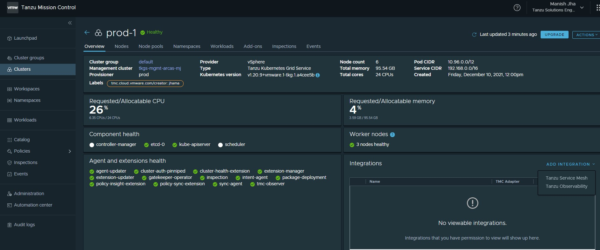

	**Note**: You don't need to provide proxy configuration settings for clusters managed by Tanzu Mission Control in Tanzu Service Mesh. If you attached a cluster that is running behind a proxy server to Tanzu Mission Control and enabled Tanzu Service Mesh on that cluster, Tanzu Mission Control automatically forwards the proxy configuration to Tanzu Service Mesh. The Tanzu Service Mesh agent on the cluster uses the proxy configuration to connect the cluster to Tanzu Service Mesh through the proxy server. 

4. In **Add Tanzu Service Mesh integration** you can choose to install Tanzu Service mesh on all namespaces or exclude specific namespaces. 

	In this deployment, Tanzu Service Mesh is installed on all namespaces.

	**Note:**
	
	* To install Tanzu Service Mesh in all the namespaces, select  "Enable Tanzu Service Mesh on all Namespaces". The system namespaces on the cluster, such as kube-system, kube-public, and istio-system, are excluded from Tanzu Service Mesh by default.

	* To exclude a specific namespace from Tanzu Service Mesh, choose Exclude Namespaces, select "Is Exactly" from the left drop-down menu under Exclude Namespaces, and then enter or select the name of the namespace from the right drop-down menu.

	* You can also specify the name of a namespace that you plan to create in the cluster at some point in the future.

   	

5. Click **Confirm**. The Tanzu Mission Control adapter for Tanzu Observability appears in an unhealthy state for a few minutes because the required objects are being created on the cluster.  

6. On the target cluster, you will see a new namespace `vmware-system-tsm` and required objects being created.

7. To view the status of the Tanzu Service Mesh installation, log in to the Tanzu Service Mesh portal. 

	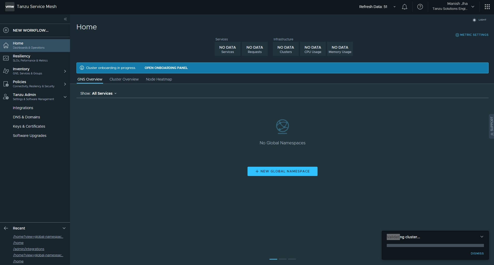

8. After all the required objects and dependencies are created, the Tanzu Service Mesh integration status for the cluster in Tanzu Mission Control console changes to healthy.

	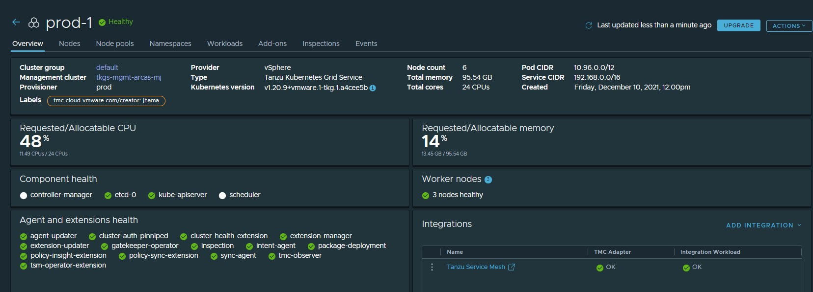

9. In the Tanzu Service Mesh console, go to **Cluster Overview** to validate the status of the cluster onboarding.

	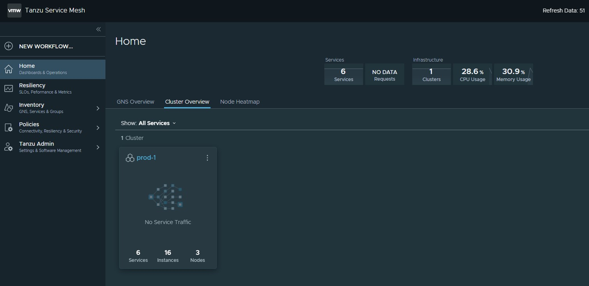

If you have a multi-cluster or hybrid-cloud application, you can connect, secure, and manage the services in the application across the clusters with a global namespace. For more information, see [Connect Services with a Global Namespace](https://docs.vmware.com/en/VMware-Tanzu-Service-Mesh/services/using-tanzu-service-mesh-guide/GUID-8D483355-6F58-4AAD-9EAF-3B8E0A87B474.html).
