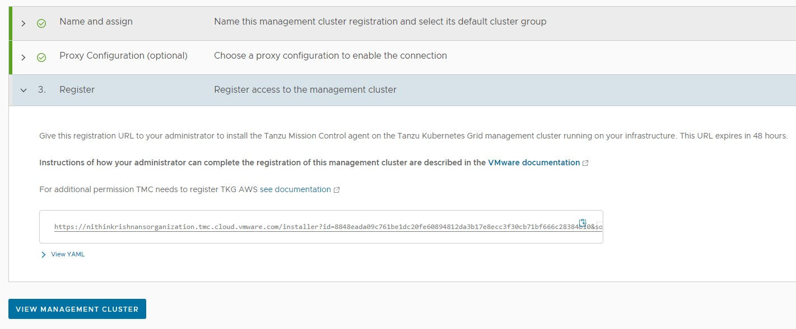
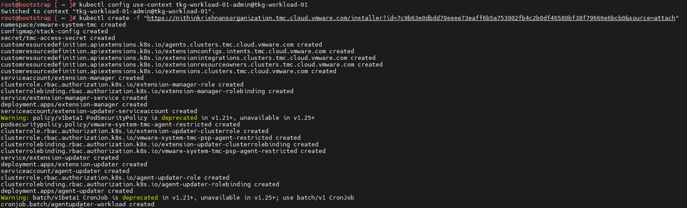
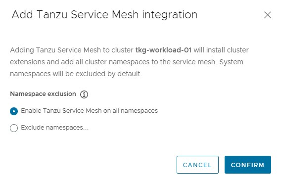
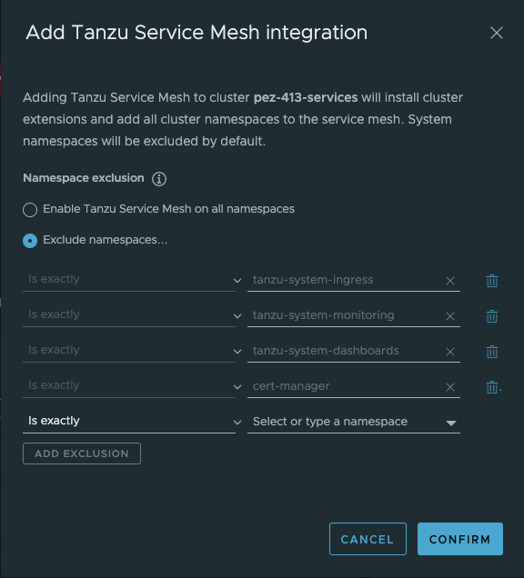

# Configure Tanzu SaaS Components for VMware Tanzu for Kubernetes Operations

VMware SaaS services for Tanzu for Kubernetes Operations (informally known as TKO) provide additional Kubernetes lifecycle management, observability, and service mesh features. This document outlines the configuration needed to set up the following VMware SaaS services.

* [Tanzu Mission Control](#tmc) (TMC)
* [Tanzu Observability](#to) (TO)
* [Tanzu Service Mesh](#tsm) (TSM)

## <a id=tmc> </a> Tanzu Mission Control

Tanzu Mission Control (TMC) is a centralized management platform for operating and securing your Kubernetes infrastructure and modern applications across multiple teams and clouds.

You can manage your global portfolio of Kubernetes clusters from a centralized administrative interface by performing the following Tanzu Mission Control operations.
* [Registering Tanzu Kubernetes Grid management cluster](#tmc-tkg-mgmt)
* [Attaching the shared services and workload clusters](#tmc-tkg-wl)

  > **Note** If the Tanzu Kubernetes Grid clusters are behind a proxy server, you'll need to import the proxy configuration object to Tanzu Mission Control before attaching the cluster.

### Manage Tanzu Kubernetes Cluster Lifecycle from Tanzu Mission Control

Managing Tanzu Kubernetes Clusters lifecycle from Tanzu Mission Control involves the following:

1. Registering the cluster name with the Tanzu Mission Control cluster agent service.
2. Installing the cluster agent extensions on the cluster.

### Prerequisites

Before managing Tanzu Kubernetes Grid clusters lifecycle from Tanzu Mission Control, complete the following:

* Review [About Getting Started with VMware Tanzu Mission Control](https://docs.vmware.com/en/VMware-Tanzu-Mission-Control/services/tanzumc-getstart/GUID-6BCCD353-CE6A-494B-A1E4-72304DC9FA7F.html) for information about setting up and using VMware Tanzu Mission Control.
* Ensure you have a subscription to Tanzu Mission Control.
* Create a cluster group in Tanzu Mission Control.
* Create a workspace in the Tanzu Mission Control.
* Create the policies that are appropriate for your Tanzu Kubernetes Grid deployment.
* Create a provisioner. A provisioner helps you deploy Tanzu Kubernetes Grid clusters across multiple different platforms, such as AWS and VMware vSphere.
* Deploy Tanzu Kubernetes Grid management and workload clusters with the production plan.

### <a id=tmc-tkg-mgmt> </a>  Register a Tanzu Kubernetes Grid Management Cluster with Tanzu Mission Control

After deploying your management cluster through the Tanzu Kubernetes Grid installer interface or the Tanzu CLI, follow these instructions in Tanzu Mission Control.

1. Log in to Tanzu Mission Control from [VMware Cloud Services](https://console.cloud.vmware.com).

2. In the left navigation pane of the Tanzu Mission Control console, click **Administration > Management clusters > Register Management Cluster** and select Tanzu Kubernetes Grid.
    

3. Enter a name for the cluster and select the cluster group in which you want to register the cluster. Optionally, provide a description and one or more labels.
    

4. (Optional) If you are using a proxy to connect to the internet, you can configure the proxy settings by toggling the Set proxy option to yes, otherwise leave it disabled.
    

   For information on registering a cluster that is behind a proxy with Tanzu Mission Control, please see the [Create a Proxy Configuration Object in Tanzu Mission Control](#configproxy)

5. On the Register page, Tanzu Mission Control generates a URL and a YAML file that defines how the management cluster connects to Tanzu Mission Control for registration. The credential provided in the YAML expires after 48 hours.

    

6.  Copy the provided command, switch to the bootstrap machine or any other machine which has kubectl/tmc installed and has connectivity to the management cluster, and then run the command.

	- To obtain admin `kubeconfig` of a cluster, execute the following command on the bootstrap machine:

		`tanzu cluster kubeconfig get <cluster-name> -n <namespace> --admin`

	     Example:

        ```
        tanzu cluster kubeconfig get tkg-mgmt -n tkg-system --admin

        Credentials of cluster 'tkg-mgmt' have been saved

        You can now access the cluster by running 'kubectl config use-context tkg-mgmt-admin@tkg-mgmt'
	    ```

	- Switch to the management cluster context

		`kubectl config use-context tkg-mgmt-admin@tkg-mgmt`

	- Register the management cluster with Tanzu Mission Control

	    `kubectl apply -f "<TMC-Generated-URL>"`

	  This command creates a namespace `vmware-system-tmc` and installs a set of cluster agent extensions, custom resource definitions, role bindings, services & deployments, etc into your cluster, which enables cluster communication with the Tanzu Mission Control.

	  

7.  After the command is applied, wait for all pods to initialize in the namespace `vmware-system-tmc`. To monitor the pods status, use the following command:

      `kubectl get pods -n vmware-system-tmc`
     
8.  In Tanzu Mission Control console, click **View Management Cluster**.  

    

9.  Click on the **Verify Connection** button to validate that connection between the Workload cluster and Tanzu Mission Control portal has been established.

    

10.  After the connection is verified, the management cluster details page is displayed. It might take a few minutes for Tanzu Mission Control to start receiving health information from the management cluster.
    

* (Optional) After you successfully register a management cluster, you can add any of the existing Tanzu Kubernetes Grid clusters that it manages to Tanzu Mission Control.

### <a id=tmc-tkg-wl> </a>  Attach a Tanzu Kubernetes Grid Workload Cluster in Tanzu Mission Control

You can register Tanzu Kubernetes Grid workload clusters for lifecycle management. Follow these steps to attach a workload cluster:

1.  Log in to Tanzu Mission Control from [VMware Cloud Services](https://console.cloud.vmware.com).

1.  In the left navigation pane of the Tanzu Mission Control console, click **Clusters > Attach Cluster**.  

    

1.  Enter a name for the cluster and select the cluster group in which you want to register the cluster. Optionally, provide a description and one or more labels.
    

1. Click **Next**.

2. (Conditionally required) Select a proxy configuration object for the cluster. You'll need to communicate through a proxy configuration object if the clusters are behind a proxy server.

	> **Note** For instructions on configuring the proxy, see [Create a Proxy Configuration Object in Tanzu Mission Control](#configproxy)

	> **Note** This document does not make use of proxy for workload clusters.

2. Click to toggle the **Set proxy for this cluster** option to **No**.

	

1. Click **Next**.

	Tanzu Mission Control generates a YAML manifest specifically for your cluster and displays the kubectl/tmc command to run the manifest.

1.  Copy the provided command, switch to the bootstrap machine or any other machine that has kubectl/tmc installed and has connectivity to the cluster, and then run the command.

	- If you attach using a proxy configuration object, make sure you have the latest version of the Tanzu Mission Control CLI (tmc) installed. Then run the `tmc` command, replacing &`<kubeconfig>` with the appropriate `kubeconfig` for the cluster.

		To obtain the admin `kubeconfig` of a cluster, execute the following command on the bootstrap machine:  

		`tanzu cluster kubeconfig get <cluster-name> --admin --export-file <file-name.yaml>`  

		

2.  After executing the command, wait for all pods to initialize in the namespace `vmware-system-tmc`. To monitor the status of the pods, run the following command:  
`kubectl get pods -n vmware-system-tmc`
     
1.  In Tanzu Mission Control console, click **Verify Connection**. You'll see a message confirming that the cluster was connection successfully.  
    
    

2.  Click **View your Cluster** to see the cluster details.  

    

### <a id="configproxy"> </a>Supplemental Information: Create a Proxy Configuration Object in Tanzu Mission Control

  If your Kubernetes clusters are behind a proxy server, you'll need a proxy configuration object to communicate with them. To create a proxy configuration object in Tanzu Mission Control, follow these steps:

  1.  In the left navigation pane of the Tanzu Mission Control console, click **Administration**.
  2.  On the **Administration** page, click the **Proxy Configuration** tab.  
  3.  Click **Create Proxy Configuration**.
        
  4.  On the **Create proxy** page, enter a name for the proxy configuration.
  5.  (Optional) Provide a description.
  6.  Specify the URL or IP address of the proxy server and the port for outbound traffic.
  7.  Enter the credentials (username and password) to use to permit outbound traffic through the proxy server.
  8.  (Optional) Enter an alternative server/port and username/password for HTTPS traffic.
  9.  (Optional) In **No proxy list**, specify a comma-separated list of outbound destinations that must bypass the proxy server.  
      
  10. Click **Create**. The proxy configuration is added to Tanzu Mission Control. Use this proxy configuration when you add a cluster that is sitting behind the proxy. Based on your environment, you can add multiple proxies in Tanzu Mission Control.  
        

## <a id=to> </a> Tanzu Observability

Tanzu Observability (TO) delivers full-stack observability across containerized cloud applications, Kubernetes health, and cloud infrastructure through a Software-as-a-Service (SaaS) subscription model managed by VMware. The SaaS delivery model allows the solution to scale to meet your metrics requirements without the need to maintain the solution itself.

### Set up Tanzu Observability to Monitor a Tanzu Kubernetes Clusters

Setting up Tanzu Observability to monitor Tanzu Kubernetes Grid clusters is done through Tanzu Mission Control. Tanzu Mission Control provides a common management layer across Kubernetes clusters to configure multiple policies and make it possible to integrate the Kubernetes clusters with other SaaS solutions such as Tanzu Service Mesh.

### Prerequisites
Before setting up Tanzu Observability, ensure that:

* You have an active Tanzu Mission Control subscription.
* Tanzu Observability integration is enabled in Tanzu Mission Control.
* A Tanzu Observability instance is provisioned for your organization.
* A Service Account is created in Tanzu Observability to enable communication between Tanzu Observability and Tanzu Mission Control.
* Tanzu Observability is enabled for your organization. If Tanzu Observability is not enabled, enable it by navigating to the **Administration > Integrations** tab in Tanzu Mission Control.  

### Register Tanzu Kubernetes Grid Workload Cluster with Tanzu Observability

To integrate Tanzu Observability on a cluster attached to Tanzu Mission Control, do the following:  

1.  Create a service account in Tanzu Observability (TO) to enable communication between Tanzu Observability and Tanzu Mission Control.
	1. Log in to your Tanzu Observability instance (<instance_name>.wavefront.com) as a user with Accounts, Groups & Roles permission.
	2. From the gear icon on the top right, select **Account Management**.
	3. Click the **Service Accounts** tab, then click **Create New Account** to create a service account and an associated API token.  
	4. Specify the service account name, optionally, provide a description, and click **Create**.
    	
	5. Select the newly created account and click the **Copy to Clipboard** icon in the **Tokens** row. You will paste this token into the **Credentials** field on Tanzu Mission Control.  

1.  Enable Tanzu Observability in Tanzu Mission Control.
	1. Login to Tanzu Mission Control.
	1. In the left navigation pane of the Tanzu Mission Control console, click **Administration**.
	2. Click the **Integrations** tile.
	3. From the available integrations options, enable **Tanzu Observability** if not yet enabled.  
    
	3. Under **Administration** switch to **Accounts**, click **Create Account Credentials** and select **Tanzu Observability credential**.
	4. Enter the following and click **Create**:

		- Credential Name
		- Tanzu Observability URL
		- Tanzu Observability API Token obtained in step 1  
    		

1. On the Tanzu Mission Control console, click **Clusters** on the left navigation pane.

1. Click the cluster you want to add to Tanzu Observability.

1. On the cluster page, click **Add Integration**, and select **Tanzu Observability**.  

    

1. Select the Tanzu Observability credentials and click **Confirm**.   

     

    The Tanzu Mission Control adapter for Tanzu Observability appears in an unhealthy state for a few minutes while the required objects are being created on the cluster.  
    

   On the target cluster, you will see a new namespace, `tanzu-observability-saas`, and the required objects being created.  
      

1. Wait for all the pods to successfully initialize.  

    

1. After all the pods are initialized, the Tanzu Mission Control adapter in the Tanzu Mission Control console appears in a healthy state.  

    

    This confirms that the integration is completed and the cluster can be monitored with Tanzu Observability.

1. Click the Tanzu Observability link provided in Tanzu Mission Control or log in to your Tanzu Observability instance (<instance_name>.wavefront.com) to ensure that the metrics are being collected in Tanzu Observability.  

    

    

### Customize Tanzu Observability Dashboards

Tanzu Observability provides various out-of-the-box dashboards. You can customize the dashboards for your particular deployment. For information on how to customize Tanzu Observability dashboards for Tanzu for Kubernetes Operations, see [Customize Tanzu Observability Dashboard for Tanzu for Kubernetes Operations](tko-to-customized-dashboard.md).

## <a id=tsm> </a>Tanzu Service Mesh
VMware Tanzu Service Mesh (TSM) is an enterprise-class service mesh solution that provides consistent control and security for microservices, end-users, and data across all your clusters and clouds in multi-cluster and multi-cloud environments.

### Onboard a Tanzu Kubernetes Cluster to Tanzu Service Mesh
You can onboard Tanzu Service Mesh with or without Tanzu Mission Control.

If you are installing user-managed packages, install them before onboarding your cluster in Tanzu Service Mesh or there may be issues with reconciling. Make sure to exclude the namespaces where you will be installing user-managed packages and other namespaces where you don't need istio injection by Tanzu Service Mesh.

### Prerequisites

* (Conditionally required) An active Tanzu Mission Control subscription.  Required only if you intend to onboard a cluster to Tanzu Service Mesh via Tanzu Mission Control.
	* Ensure that the cluster to be onboarded to Tanzu Service Mesh is attached to Tanzu Mission Control.
* An active Tanzu Service Mesh subscription.
* For workload cluster resource requirements, see [TSM requirements](https://docs.vmware.com/en/VMware-Tanzu-Service-Mesh/services/tanzu-service-mesh-environment-requirements-and-supported-platforms/GUID-D0B939BE-474E-4075-9A65-3D72B5B9F237.html)*
    - **Nodes**: At least 3 worker nodes, each with at least 4,000 milliCPU (4 CPUs) of allocatable CPU and 6 GB of allocatable memory. 
    - **DaemonSets**: The DaemonSets instantiate a pod on every node on the cluster. To run the DaemonSets, Tanzu Service Mesh requires that every node in the cluster have at least 250 milliCPU and 650 MB of memory available.
    - **Ephemeral storage**: 24 GB for the whole cluster and additionally 1 GB for each node.
    - **Pods**: Tanzu Service Mesh requires a quota of at least 3 pods for each node on the cluster and additionally at least 30 pods for the whole cluster.
* If you want to install Tanzu Service Mesh only in some of the namespaces of the cluster, decide which namespaces you want to exclude from Tanzu Service Mesh.
* If you want the cluster to connect to Tanzu Service Mesh through a proxy server, make sure that you know the details of the proxy configuration, such as the type of proxy in use (transparent or explicit), the protocol (HTTP or HTTPS), the host name or IP address of the proxy server, and the port number.
* If your corporate proxy server is configured to use a certificate for secure TLS connections, make sure that you know the location of the certificate file. The Tanzu Service Mesh agent on the cluster will use the certificate to connect to the proxy server and trust the connection.

Do the following to onboard a Tanzu Kubernetes Cluster to Tanzu Service Mesh using Tanzu Mission Control:

 1. Login to Tanzu Mission Control via VMware Cloud Services page.
 2. In the left navigation pane of the Tanzu Mission Control console, click Clusters.
 3. Click on the Target Cluster name, under integration click on Add Integrations, and select Tanzu Service Mesh.

     

     > **Note** You don't need to provide proxy configuration settings for clusters managed by Tanzu Mission Control in Tanzu Service Mesh. If you attached a cluster that is running behind a proxy server to Tanzu Mission Control and enabled Tanzu Service Mesh on that cluster, Tanzu Mission Control automatically forwards the proxy configuration to Tanzu Service Mesh. The Tanzu Service Mesh agent on the cluster uses the proxy configuration to connect the cluster to Tanzu Service Mesh through the proxy server.

4. In Add Tanzu Service Mesh integration you can choose to install Tanzu Service mesh on all namespaces or exclude specific namespaces.

    > **Note**
      >- To install Tanzu Service Mesh in all the namespaces, select `Enable Tanzu Service Mesh on all Namespaces`. The system namespaces on the cluster, such as kube-system, kube-public, and istio-system, are excluded from Tanzu Service Mesh by default.
      >- To exclude a specific namespace from Tanzu Service Mesh, choose Exclude Namespaces, select "Is Exactly" from the left drop-down menu under Exclude Namespaces, and then enter or select the name of the namespace from the right drop-down menu.
      >- You can also specify the name of a namespace that you plan to create in the cluster at some point in the future.

    

   - If you install user-managed packages such as Cert Manager, Contour, Prometheus, and Grafana, exclude the related namespaces for the user-managed packages:
     - cert-manager
     - tanzu-system-monitoring
     - tanzu-system-dashboards
     - tanzu-system-ingress

   

5. Click Confirm. 
  - The Tanzu Mission Control adapter for Tanzu Observability appears in an unhealthy state for a few minutes because the required objects are being created on the cluster.
  - On the target cluster, you will see a new namespace vmware-system-tsm and required objects being created. When all the required Kubernetes objects are created and are in a running state, status of the Tanzu Mission Control adapter changes to OK.

    

7. In the Tanzu Service Mesh console, go to Cluster Overview to validate the status of the cluster onboarding.

    

The Tanzu Service Mesh console displays information about the infrastructure of the onboarded cluster and any microservices deployed on the cluster. Tanzu Service Mesh also starts monitoring and collecting infrastructure and service metrics, such as the number of nodes and services, requests per second, latency, and CPU usage, from the cluster. The Home page of the Tanzu Service Mesh console provides summary information about the cluster's infrastructure, a topology view of the services in the cluster, and key metrics.

If you have a multi-cluster or hybrid-cloud application, you can connect, secure, and manage the services in the application across the clusters with a global namespace. For more information, see [Connect Services with a Global Namespace](https://docs.vmware.com/en/VMware-Tanzu-Service-Mesh/services/using-tanzu-service-mesh-guide/GUID-8D483355-6F58-4AAD-9EAF-3B8E0A87B474.html).
