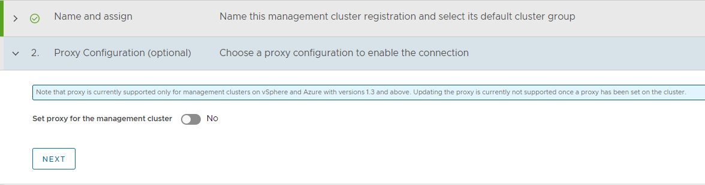
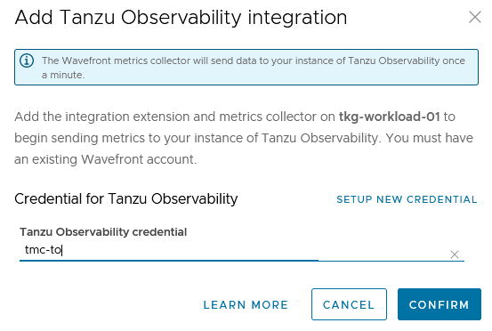

# Configure Tanzu SaaS Components for Tanzu for Kubernetes Operations

The following VMware SaaS services provide additional Kubernetes lifecycle management, observability, and service mesh features. This document outlines the configuration needed to set up the VMware SaaS services for Tanzu for Kubernetes Operations.

* [Tanzu Mission Control](#tmc) (TMC)
* [Tanzu Observability](#to) (TO)
* [Tanzu Service Mesh](#tsm) (TSM)

## <a id=tmc> </a> Tanzu Mission Control

Tanzu Mission Control (TMC) is a centralized management platform for consistently operating and securing your Kubernetes infrastructure and modern applications across multiple teams and clouds. It provides operators with a single control point to give developers the independence they need to drive business forward, while enabling consistent management and operations across environments for increased security and governance.

It also allows you to deploy Tanzu Kubernetes clusters directly from TMC and install user-managed Packages leveraging the [TMC Catalog](https://docs.vmware.com/en/VMware-Tanzu-Mission-Control/services/tanzumc-using/GUID-EF35646D-8762-41F1-95E5-D2F35ED71BA1.html) feature. 

We recommended registering the management, shared services and workload clusters with Tanzu Mission Control as it enables you to manage your global portfolio of Kubernetes clusters from a centralized administrative interface.

If the Tanzu Kubernetes Grid clusters are behind a proxy, import the proxy configuration to Tanzu Mission Control and then attach the cluster using Tanzu Mission Control.

### Register Tanzu Kubernetes Grid Management Cluster to Tanzu Mission Control

Registering a Management cluster involves the following:

1. Register the cluster name with the Tanzu Mission Control cluster agent service.
2. Install the cluster agent extensions on the cluster.

#### Prerequisites

Before attaching a Tanzu Kubernetes Grid cluster in Tanzu Mission Control, complete the following:

- Review [About Getting Started with VMware Tanzu Mission Control](https://docs.vmware.com/en/VMware-Tanzu-Mission-Control/services/tanzumc-getstart/GUID-6BCCD353-CE6A-494B-A1E4-72304DC9FA7F.html) for information about setting up and using VMware Tanzu Mission Control.
* You have a subscription to Tanzu Mission Control.
* Create a cluster group in Tanzu Mission Control.
* Create a workspace in the Tanzu Mission Control.
* Create the policies that are appropriate for your Tanzu Kubernetes Grid deployment.
* Create a provisioner. A provisioner helps you deploy Tanzu Kubernetes Grid clusters across multiple different platforms, such as AWS and VMware vSphere.
* Deploy Tanzu Kubernetes Grid workload clusters with the production plan.

### Attach a Tanzu Kubernetes Grid Workload Cluster in Tanzu Mission Control
Registering a Tanzu Kubernetes Grid management cluster in Tanzu Mission Control is not supported. However, you can register Tanzu Kubernetes Grid workload clusters for life-cycle management.

1. Log in to Tanzu Mission Control from [VMware Cloud Services](https://console.cloud.vmware.com).

2. In the left navigation pane of the Tanzu Mission Control console, click **Administration > Management clusters > Register Management Cluster** and select Tanzu Kubernetes Grid.
    

3. Enter a name for the cluster and select the cluster group in which you want to register the cluster. Optionally, provide a description and one or more labels.
    

4. (Optional) If you are using a proxy to connect to the internet, you can configure the proxy settings by toggling the Set proxy option to yes, otherwise leave it disabled.
    

   For information on registering a cluster that is behind a proxy with Tanzu Mission Control, please see the product [documentation](https://docs.vmware.com/en/VMware-Tanzu-Mission-Control/services/tanzumc-using/GUID-AF0B66C8-00D2-46F7-9A62-64C6E279B9A7.html)

5. On the Register page, Tanzu Mission Control generates a URL and a YAML file that defines how the management cluster connects to Tanzu Mission Control for registration. The credential provided in the YAML expires after 48 hours.
    

6.  Copy the provided command, switch to the bootstrap machine or any other machine which has kubectl/tmc installed and has connectivity to the management cluster, and then run the command.

	- To obtain admin `kubeconfig` of a cluster, execute the following command on the bootstrap machine:

		`tanzu cluster kubeconfig get <cluster-name> -n <namespace> --admin`

	     Example:

	     <!-- /* cSpell:disable */ -->
         ```
         tanzu cluster kubeconfig get tkg-mgmt -n tkg-system --admin

        Credentials of cluster 'tkg-mgmt' have been saved

        You can now access the cluster by running 'kubectl config use-context tkg-mgmt-admin@tkg-mgmt'
	    ```
	    <!-- /* cSpell:enable */ -->

	- Switch to the management cluster context
	    
		`kubectl config use-context tkg-mgmt-admin@tkg-mgmt`

	- Register the management cluster with Tanzu Mission Control

	    `kubectl apply -f "<TMC-Generated-URL>"`

	  This command creates a namespace `vmware-system-tmc` and installs a set of cluster agent extensions, custom resource definitions, role bindings, services & deployments, etc into your cluster, which enables cluster communication with the Tanzu Mission Control.
	  

7.  After the command is applied, wait for all pods to initialize in the namespace `vmware-system-tmc`. To monitor the pods status, use the following command:

      `kubectl get pods -n vmware-system-tmc`
     
8.  In Tanzu Mission Control console, click **View Management Cluster**.  
    

9.  Click on the **Verify Connection** button to validate that connection between the Workload cluster and Tanzu Mission Control portal has been established.
    

10.  After the connection is verified, the management cluster details page is displayed. It might take a few minutes for Tanzu Mission Control to start receiving health information from the management cluster.
    

#
# <a id=to> </a> Set up Tanzu Observability to Monitor a Tanzu Kubernetes Clusters

Tanzu Observability delivers full-stack observability across containerized cloud applications, Kubernetes health, and cloud infrastructure. The solution is consumed through a Software-as-a-Service (SaaS) subscription model, managed by VMware. This SaaS model allows the solution to scale to meet metrics requirements without the need for customers to maintain the solution itself.

Prerequisites

Before doing the setup, ensure the following:

- An active Tanzu Mission Control subscription.

- Tanzu Observability integration is enabled in Tanzu Mission Control.

- Tanzu Observability instance is provisioned for your organization.

- A Service Account in Tanzu Observability to enable communication between Tanzu Observability and Tanzu Mission Control.

- Tanzu Observability is enabled on your organization. If Tanzu Observability is not enabled, enable it by navigating to the **Administration > Integrations** tab in Tanzu Mission Control.

## Register Tanzu Kubernetes Grid Workload Cluster with Tanzu Observability

To integrate Tanzu Observability on a cluster attached to Tanzu Mission Control, do the following:

1: Create a Service Account in Tanzu Observability (TO) to enable communication between Tanzu Observability and Tanzu Mission Control.

Log in to the Tanzu Observability instance and click on the gear icon to open Account Management settings and navigate to the service accounts tab. Click "Create New Account" to create a service account and an associated API Token.


Select the newly created account and click the Copy to Clipboard icon in the Tokens row. You will paste this token into the Credentials field on Tanzu Mission Control.

2: Enable Tanzu Observability in Tanzu Mission Control.

   1. Login to Tanzu Mission Control.
   2. In the left navigation pane of the Tanzu Mission Control console, click Administration.
   3. Click on the Integrations tile.
   4. From the available integrations options, enable Tanzu Observability if not yet enabled.


   5. Under Administration switch to Accounts, click Create Account Credentials and select Tanzu Observability credential.
   6. Enter the following and click Create:
      - Credential Name.
      - Tanzu Observability URL.
      - Tanzu Observability API Token obtained in step 1.

      

3: On the Tanzu Mission Control console, click Clusters on the left navigation pane.

4: Click on the cluster you want to add to Tanzu Observability.

5: On the cluster page, click Add Integration, and select Tanzu Observability.


6: Select the Tanzu Observability credentials and click Confirm.



The Tanzu Mission Control adapter for Tanzu Observability appears in an unhealthy state for a few minutes because the required objects are being created on the cluster.


7: On the target cluster, you will see a new namespace, tanzu-observability-saas and the required objects being created.


8: Wait for all the pods to successfully initialize.


9: After all the pods are initialized, the Tanzu Mission Control adapter in the Tanzu Mission Control console appears in a healthy state.


This confirms that the integration is completed and the cluster can be monitored with Tanzu Observability.

On logging into the Tanzu Observability portal, you can view the metrics collection against your cluster.

10: Click on the Tanzu Observability link provided in Tanzu Mission Control or Log in to your Tanzu Observability instance (<instance_name>.wavefront.com) to ensure that the metrics are being collected in Tanzu Observability.


#
# <a id=tsm> </a> Tanzu Service Mesh

VMware Tanzu Service Mesh (TSM) is an enterprise-class service mesh solution that provides consistent control and security for microservices, end-users, and data across all your clusters and clouds in the most demanding multi-cluster and multi-cloud environments.

## Onboard a Tanzu Kubernetes Cluster to Tanzu Service Mesh

You can onboard Tanzu Service Mesh with or without Tanzu Mission Control.

**Prerequisites**

- (Optional) An active Tanzu Mission Control subscription. Required only if you intend to onboard a cluster to Tanzu Service Mesh via Tanzu Mission Control.

- Ensure that the cluster to be onboarded to Tanzu Service Mesh is attached to Tanzu Mission Control.

- An active Tanzu Service Mesh subscription.

- Workload cluster resource requirements:

    - Nodes: At least 3 worker nodes, each with at least 3,000 milliCPU (3 CPUs) of allocatable CPU and 6 GB of allocatable memory.
    - DaemonSets: The DaemonSets instantiate a pod on every node on the cluster. To run the DaemonSets, Tanzu Service Mesh requires that every node in the cluster have at least 250 milliCPU and 650 MB of memory available.
    - Ephemeral storage: 24 GB for the whole cluster and additionally 1 GB for each node.
    - Pods: Tanzu Service Mesh requires a quota of at least 3 pods for each node on the cluster and additionally at least 30 pods for the whole cluster.

- If you want to install Tanzu Service Mesh only in some of the namespaces of the cluster, decide which namespaces you want to exclude from Tanzu Service Mesh.

- If you want the cluster to connect to Tanzu Service Mesh through a proxy server, make sure that you know the details of the proxy configuration, such as the type of proxy in use (transparent or explicit), the protocol (HTTP or HTTPS), the host name or IP address of the proxy server, and the port number.

- If your corporate proxy server is configured to use a certificate for secure TLS connections, make sure that you know the location of the certificate file. The Tanzu Service Mesh agent on the cluster will use the certificate to connect to the proxy server and trust the connection.

Do the following to onboard a Tanzu Kubernetes Cluster to Tanzu Service Mesh using Tanzu Mission Control:

 1. Login to Tanzu Mission Control via VMware Cloud Services page.
 2. In the left navigation pane of the Tanzu Mission Control console, click Clusters.
 3. Click on the Target Cluster name, under integration click on Add Integrations, and select Tanzu Service Mesh.

 

Note: You don't need to provide proxy configuration settings for clusters managed by Tanzu Mission Control in Tanzu Service Mesh. If you attached a cluster that is running behind a proxy server to Tanzu Mission Control and enabled Tanzu Service Mesh on that cluster, Tanzu Mission Control automatically forwards the proxy configuration to Tanzu Service Mesh. The Tanzu Service Mesh agent on the cluster uses the proxy configuration to connect the cluster to Tanzu Service Mesh through the proxy server.

4. In Add Tanzu Service Mesh integration you can choose to install Tanzu Service mesh on all namespaces or exclude specific namespaces.

Note:
   - To install Tanzu Service Mesh in all the namespaces, select `Enable Tanzu Service Mesh on all Namespaces`. The system namespaces on the cluster, such as kube-system, kube-public, and istio-system, are excluded from Tanzu Service Mesh by default.

   - To exclude a specific namespace from Tanzu Service Mesh, choose Exclude Namespaces, select "Is Exactly" from the left drop-down menu under Exclude Namespaces, and then enter or select the name of the namespace from the right drop-down menu.

   - You can also specify the name of a namespace that you plan to create in the cluster at some point in the future.

   

5. Click Confirm. The Tanzu Mission Control adapter for Tanzu Observability appears in an unhealthy state for a few minutes because the required objects are being created on the cluster.

6. On the target cluster, you will see a new namespace vmware-system-tsm and required objects being created. When all the required Kubernetes objects are created and are in a running state, status of the Tanzu Mission Control adapter changes to OK.


7. In the Tanzu Service Mesh console, go to Cluster Overview to validate the status of the cluster onboarding.


The Tanzu Service Mesh console displays information about the infrastructure of the onboarded cluster and any microservices deployed on the cluster. Tanzu Service Mesh also starts monitoring and collecting infrastructure and service metrics, such as the number of nodes and services, requests per second, latency, and CPU usage, from the cluster. The Home page of the Tanzu Service Mesh console provides summary information about the cluster's infrastructure, a topology view of the services in the cluster, and key metrics.

If you have a multi-cluster or hybrid-cloud application, you can connect, secure, and manage the services in the application across the clusters with a global namespace. For more information, see Connect Services with a Global Namespace.