
# Customize Tanzu Observability Dashboard for VMware Tanzu for Kubernetes Operations

Tanzu Observability provides various out-of-the-box dashboards. You can customize the dashboards for your specific deployment. This document provides the steps to customize the dashboards to monitor the following Tanzu for Kubernetes Operations (informally known as TKO) components:

- Tanzu Kubernetes Grid Clusters
- VMware vSphere
- NSX Advanced Load Balancer

We will customize the following dashboards:

- Summary Dashboard
- Resource Utilization Dashboard
- Health Check Dashboard
- Network Dashboard

## Prerequisites

Ensure that Tanzu Observability is fetching data from the following: Tanzu Kubernetes Grid Clusters, NSX Advanced Load Balancer, and VMware vSphere.

## Summary Dashboard for Tanzu for Kubernetes Operations on vSphere
 
The summary dashboard for Tanzu for Kubernetes Operations on vSphere displays the charts and analytics data for Tanzu Kubernetes Grid clusters,NSX Advanced Load Balancer, and vSphere.

This dashboard is combination of the following out-of-the-box dashboards: Kubernetes Summary Dashboard, Avi Summary Dashboard, and VMware vSphere Dashboard.

Click the link to view the summary metrics from that component.

## Resource Utilization Dashboards

This section consists of 3 dashboards which will show the resource utilization of Kubernetes cluster:

### Kubernetes Resource Utilization Dashboard
The K8s dashboard provides an overview of the resource utilization at the cluster, node, namespace, and container levels.

**Cluster Resource Utilization Overview**

**Nodes Resource Utilization Overview**

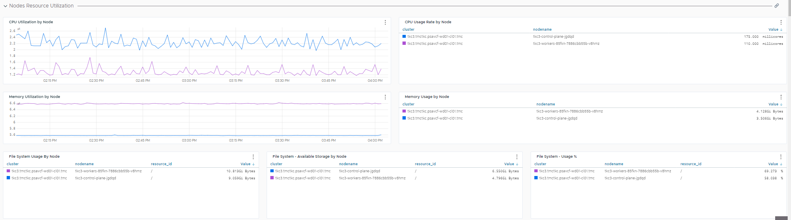

**Namespace Resource Utilization Overview**

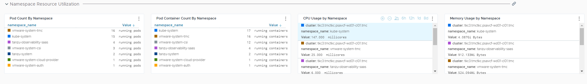

**Pods Resource Utilization Overview**

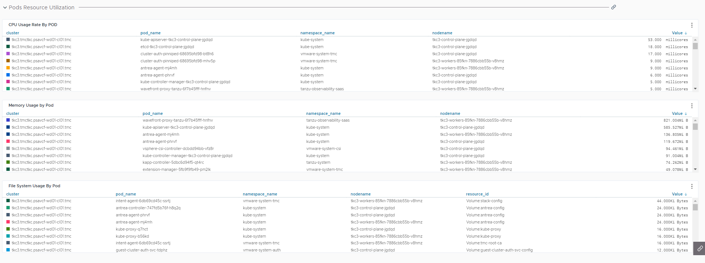

**Containers Resource Utilization Overview**

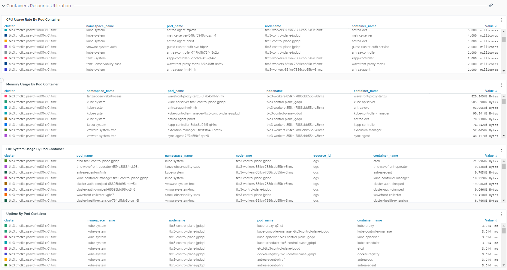

### Kubernetes Resource Utilization Dashboard
The Kubernetes resource utilization dashboard provides data that can be used for resource utilization and capacity planning across clusters, nodes, and pods. 

**Cluster Resources Utilization**

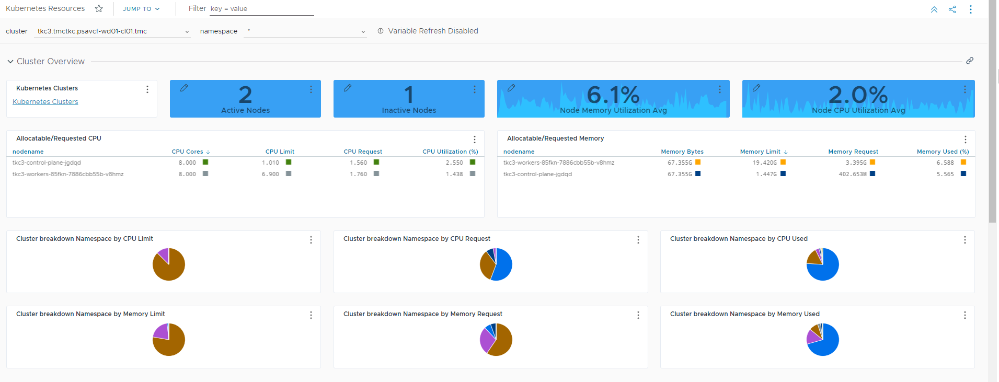

**CPU and Memory Resources Utilization Per Pod**

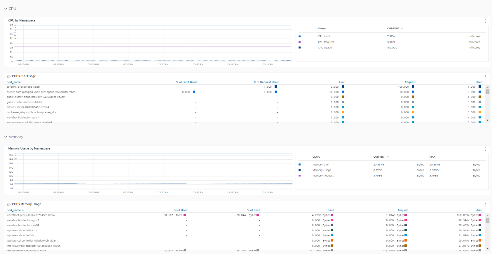

### Kubernetes Resources Deployments/DaemonSets 
The following dashboards show Kubernetes resources deployments/DaemonSets.

**Terminated Pods Status**

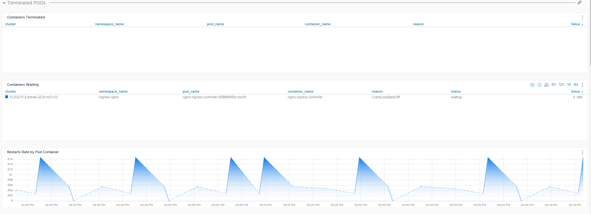

**Container CPU Usage Status**

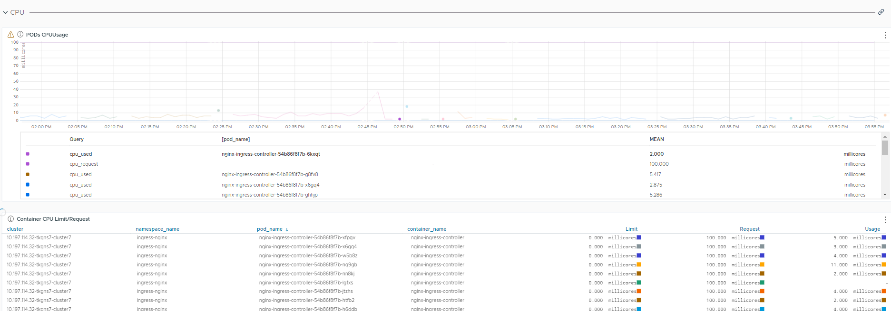

**Container Memory Usage Status**

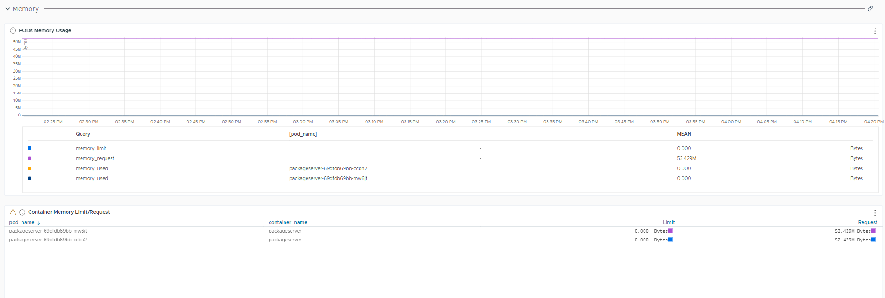

## Health Check Dashboard

The health check dashboard displays charts and analytics data captured from Tanzu Kubernetes clusters.

The dashboard includes health and status level metrics from Kubernetes clusters.

**Cluster Health**

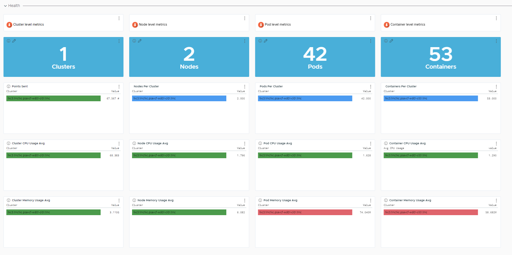

**Cluster Resources Overview**

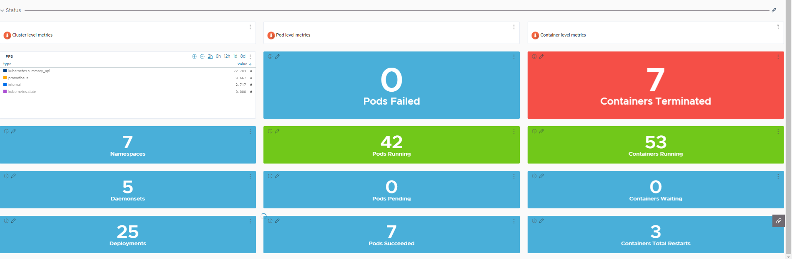

## Kubernetes Node Network Dashboard

The K8s node network dashboard displays network data at the node level.

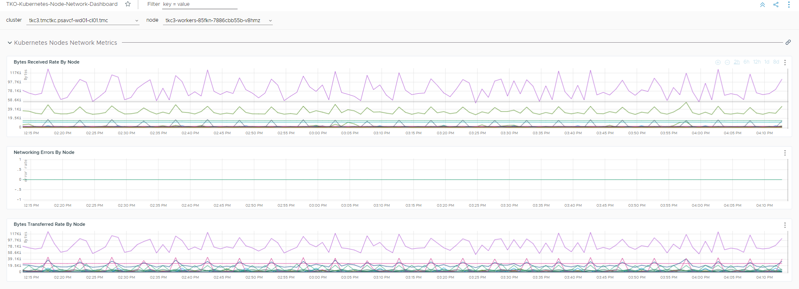

## Create Tanzu for Kubernetes Operations Dashboards

To create the Tanzu for Kubernetes Operations dashboards in Tanzu Observability, run the following  curl command:

`curl -X 'POST' 'https://<wavefront-instance\_url>/api/v2/dashboard' -H 'accept: application/json' -H 'Content-Type: application/json' -H 'Authorization: Bearer <wavefront API access token>’ -d '@dashboard-reference.json'`

>**Note** For information about how to generate a Wavefront API Access token, see [Managing API Tokens.](https://docs.wavefront.com/wavefront_api.html#generating-an-api-token).

JSON files to create the Tanzu for Kubernetes Operations dashboards described in this document are available [here](https://github.com/vmware-tanzu-labs/tanzu-validated-solutions/tree/main/automation/tko-to-customized-dashboards-json-scripts).
