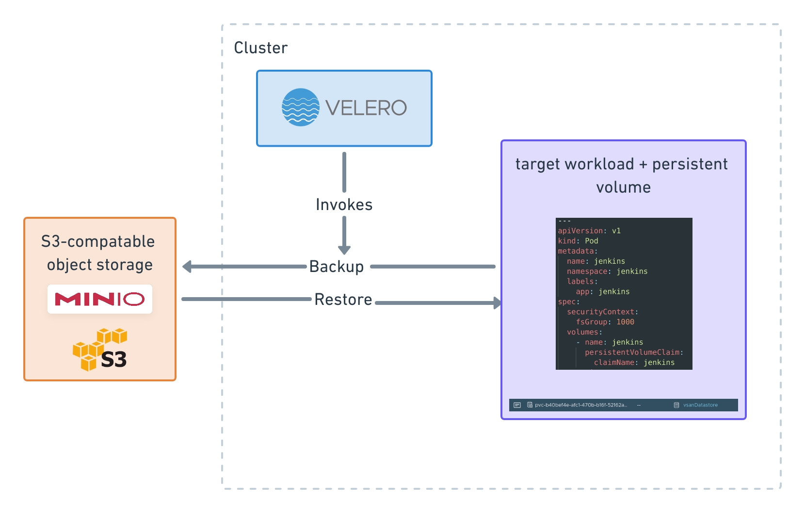

# Tanzu Kubernetes Grid Backup Operations with Velero vSphere Plugin

[Velero](https://github.com/vmware-tanzu/velero) is an open-source project from VMware enabling robust backup operations for Kubernetes clusters. Instead of infrastructure-centric backup strategies such as manual etcd snapshots, Velero targets Kubernetes objects and volumes via a set of controllers and custom resource definitions. This allows targeting Kubernetes-centric items such as namespaces, deployments and other cluster workloads, which can then be easily restored or even imported to different clusters.  

In addition to Kubernetes objects, volumes can also be targeted for backup via cloud-provider specific plugins such as the `velero-vsphere` plugin.  

This allows Velero to perform volume snapshots, storing the contents in object storage for future restoration.
The following guide describes the installation and backup workflow of a Tanzu Kubernetes Grid workload via the `vsphere-velero` plugin.  




## Cluster Bootstrap and Storage Classes

After bootstrapping a cluster with the `tanzu` CLI, the vsphere-csi controller and `DaemonSets` should be running.

<!-- /* cSpell:disable */ -->
```bash
kubectl get pods -A | grep csi

kube-system                         vsphere-csi-controller-c74d4578-jmr54                            6/6     Running     4          47h
kube-system                         vsphere-csi-node-kmf8g                                           3/3     Running     0          47h
kube-system                         vsphere-csi-node-lsbgw                                           3/3     Running     0          47h
```
<!-- /* cSpell:enable */ -->

CNS provides both block storage (ReadWriteOnce) and file storage (ReadWriteMany) via appropriately configured storage classes referencing the filesystem type and backing datastore. Examples for both backed by `vSAN` are included below.

<!-- /* cSpell:disable */ -->
```yaml
---
kind: StorageClass
apiVersion: storage.k8s.io/v1
metadata:
  name: cns-file
  annotations:
    storageclass.kubernetes.io/is-default-class: "false"
provisioner: csi.vsphere.vmware.com
parameters:
  storagepolicyname: "vSAN Default Storage Policy"
  csi.storage.k8s.io/fstype: "nfs4"
---
kind: StorageClass
apiVersion: storage.k8s.io/v1
metadata:
  name: cns-block
  annotations:
    storageclass.kubernetes.io/is-default-class: "true"
provisioner: csi.vsphere.vmware.com
parameters:
  storagepolicyname: "vSAN Default Storage Policy"
  csi.storage.k8s.io/fstype: "ext4"
```
<!-- /* cSpell:enable */ -->

This guide will leverage the `cns-file` class to back the Velero object storage (minio) and the `cns-block` class to back the workload to be backed up.  

## Install Velero


### Velero CLI Components and Plugins

The `velero` cli is a helper utility for installation of the Velero components as well as performing backup operations.  

The CLI should be installed on the same workstation where `kubectl` is used to interact with your cluster. Releases for MacOS, Linux and Windows are available [here](https://github.com/vmware-tanzu/velero/releases/tag/v1.6.2).

If golang v1.16+ is installed, installation can be performed via the following command:

```bash
go install github.com/vmware-tanzu/velero/cmd/velero@v1.6.2
```

### Velero Object Storage with Minio

Velero requires S3 compatible object storage as the destination for object and volume backup. This can be provided by S3 itself or any object storage server compatible with the S3 API. This guide uses `minio`, an S3 compatible object storage server which is hosted in-cluster. In practice this could be hosted elsewhere, as long as the Velero controller can talk to the destination S3 endpoint.  

The following manifests create a namespace for Velero, along with the minio deployment, service and job that handles bucket creation:

```yaml
---
apiVersion: v1
kind: Namespace
metadata:
  name: velero
---
apiVersion: v1
kind: PersistentVolumeClaim
metadata:
  name: minio-storage
  namespace: velero
spec:
  accessModes:
  - ReadWriteMany
  resources:
    requests:
      storage: 10Gi
  storageClassName: cns-file
---
apiVersion: apps/v1
kind: Deployment
metadata:
  namespace: velero
  name: minio
  labels:
    component: minio
spec:
  strategy:
    type: Recreate
  selector:
    matchLabels:
      component: minio
  template:
    metadata:
      labels:
        component: minio
    spec:
      volumes:
      - name: storage
        persistentVolumeClaim:
          claimName: minio-storage
      - name: config
        emptyDir: {}
      containers:
      - name: minio
        image: minio/minio:latest
        imagePullPolicy: IfNotPresent
        args:
        - server
        - /storage
        - --config-dir=/config
        env:
        - name: MINIO_ACCESS_KEY
          value: "minio"
        - name: MINIO_SECRET_KEY
          value: "minio123"
        ports:
        - containerPort: 9000
        volumeMounts:
        - name: storage
          mountPath: "/storage"
        - name: config
          mountPath: "/config"
---
apiVersion: v1
kind: Service
metadata:
  namespace: velero
  name: minio
  labels:
    component: minio
spec:
  type: NodePort
  ports:
    - port: 9000
      targetPort: 9000
      nodePort: 30900
      protocol: TCP
  selector:
    component: minio
---
apiVersion: batch/v1
kind: Job
metadata:
  namespace: velero
  name: minio-setup
  labels:
    component: minio
spec:
  template:
    metadata:
      name: minio-setup
    spec:
      restartPolicy: OnFailure
      volumes:
      - name: config
        emptyDir: {}
      containers:
      - name: mc
        image: minio/mc:latest
        imagePullPolicy: IfNotPresent
        command:
        - /bin/sh
        - -c
        - "mc --config-dir=/config config host add velero http://minio:9000 minio minio123 && mc --config-dir=/config mb -p velero/velero"
        volumeMounts:
        - name: config
          mountPath: /config
```

As mentioned previously, `minio` is backed by the `cns-file` storage class. The minio service is also exposed by a `NodePort` service, after the deployment rolls out the minio ui can be viewed via a node IP on port 30900.

```bash
echo "http://$(kubectl get nodes -o wide | grep control | awk '{print $7}'):30900"
```

Logging in with `minio` and `minio123` should reveal the bucket named `velero` created by the job above.


Next, create a file to describe the s3 api credentials for minio:

```bash
cat > /tmp/credentials-velero << -------
[default]
aws_access_key_id = minio
aws_secret_access_key = minio123
------
```

Velero installation is now ready to proceed via the following command:

<!-- /* cSpell:disable */ -->
```bash
velero install  \
--provider aws \
--bucket velero \
--secret-file /tmp/credentials-velero \
--snapshot-location-config region=minio \
--plugins velero/velero-plugin-for-aws:v1.2.0,vsphereveleroplugin/velero-plugin-for-vsphere:v1.1.1 \
--use-restic \
--backup-location-config region=minio,s3ForcePathStyle="true",s3Url=http://minio.velero.svc:9000 \
--wait
```
<!-- /* cSpell:enable */ -->


### Velero Object Storage with AWS S3

An alternative to using minio for object storage is to directly leverage S3 on AWS. 

Create a S3 bucket on AWS, along with API credentials to access it. The AWS API credentials should be saved to a local file `credentials-velero` as seen below

<!-- /* cSpell:disable */ -->
```bash
cat > credentials-velero <<EOF
[default]
aws_access_key_id=xxx
aws_secret_access_key=xxx
EOF
```
<!-- /* cSpell:enable */ -->

Next, install velero via the cli. The example below reads the `credentials-velero` file created above, with a bucket name `my-backup-bucket` and region `us-east-1`

<!-- /* cSpell:disable */ -->
```bash
velero install \
--provider aws \
--plugins velero/velero-plugin-for-aws:v1.2.0,vsphereveleroplugin/velero-plugin-for-vsphere:v1.1.1 \
--bucket=my-backup-bucket \
--backup-location-config region=us-east-1,profile=default \
--secret-file ./credentials-velero \
--snapshot-location-config=region=us-east-1,profile=default \
--wait
```
<!-- /* cSpell:enable */ -->

### Confirming Installation


The install command above references two plugins, `velero/velero-plugin-for-aws:v1.2.0` and v`sphereveleroplugin/velero-plugin-for-vsphere:v1.1.1`. These correspond to docker containers by default hosted at the `docker.io` registry. If required, the plugins can be hosted on an alternative registry by specifying the registry FQDN. For example: `my-registry.com/vsphereveleroplugin/velero-plugin-for-vsphere:v1.1.1`  

The aws plugin corresponds to the object storage destination, in this case minio. `s3Url=http://minio.velero.svc:9000` is the internal minio ClusterIP service.  

Inspecting the Velero namespace should show all components running:  

<!-- /* cSpell:disable */ -->
```bash
kubectl get pods -n velero
NAME                               READY   STATUS      RESTARTS   AGE
backup-driver-7ff4c9849c-46rwj     1/1     Running     0          4h5m
datamgr-for-vsphere-plugin-mccdh   1/1     Running     0          4h5m
minio-66fdbffd87-8g49q             1/1     Running     0          42h
minio-setup-tjcg6                  0/1     Completed   3          42h
restic-8p9d9                       1/1     Running     0          4h5m
velero-74f5f89899-grks8            1/1     Running     0          4h5m
```
<!-- /* cSpell:enable */ -->


## Example workload

Next, an example workload will be deployed that can be targeted for backup. This workload is a pod running Jenkins, with the application home directory backed by a RWO volume via the `cns-block` StorageClass. The pod is deployed in it's own namespace named `jenkins`:

```yaml
---
apiVersion: v1
kind: Namespace
metadata:
  name: jenkins
---
apiVersion: v1
kind: PersistentVolumeClaim
metadata:
  name: jenkins
  namespace: jenkins
spec:
  storageClassName: cns-block
  accessModes:
    - ReadWriteOnce
  resources:
    requests:
      storage: 2Gi
---
apiVersion: v1
kind: Pod
metadata:
  name: jenkins
  namespace: jenkins
  labels:
    app: jenkins
spec:
  securityContext:
    fsGroup: 1000
  volumes:
    - name: jenkins
      persistentVolumeClaim:
        claimName: jenkins
  containers:
    - name: jenkins
      image: jenkins/jenkins:latest
      ports:
        - containerPort: 8080
          name: http
      volumeMounts:
        - mountPath: "/var/jenkins_home"
          name: jenkins
---
apiVersion: v1
kind: Service
metadata:
  labels:
    app: jenkins
  name: jenkins
  namespace: jenkins
spec:
  ports:
  - port: 8080
    protocol: TCP
    targetPort: 8080
    nodePort: 31080
  selector:
    app: jenkins
  type: NodePort
```

Once deployed, inspecting the namespace should show the running pod and associated PV and PVC.  

<!-- /* cSpell:disable */ -->
```bash
kubectl get pod,pvc -n jenkins
NAME          READY   STATUS    RESTARTS   AGE
pod/jenkins   1/1     Running   0          3h28m

NAME                            STATUS   VOLUME                                     CAPACITY   ACCESS MODES   STORAGECLASS   AGE
persistentvolumeclaim/jenkins   Bound    pvc-b40bef4e-afc1-470b-b16f-52162a70eeb5   2Gi        RWO            cns-block      3h30m
```
<!-- /* cSpell:enable */ -->

The bound volumes are also visible in the vSphere Client UI.  

Next, visit the Jenkins UI on the `NodePort` to initialize the application. This will demonstrate the volume snapshot functionality of Velero when the backup is performed. The Jenkins admin token can be found by running:  

```bash
kubectl exec -n jenkins jenkins -- cat /var/jenkins_home/secrets/initialAdminPassword
```

Once configured the workload is now ready to be targeted for backup.


## Perform Backup

Target the `jenkins` namespace for backup. The following command will invoke the backup operation of the Jenkins workload including snapshot of the persistent volume.  

```bash
velero backup create jenkins-backup --include-namespaces jenkins --wait
```

The backup can be listed and described along with the resulting snapshot resource:

<!-- /* cSpell:disable */ -->
```bash
velero backup describe jenkins-backup
kubectl get snapshots.backupdriver.cnsdp.vmware.com  -A
kubectl get uploads.datamover.cnsdp.vmware.com  -A
```
<!-- /* cSpell:enable */ -->

The uploads resource describes the action of exporting the snapshot from vSphere into object storage (minio).


## Simulate data loss

With the backup complete, the example workload can now be destroyed by deleting the namespace. Note this also removes the associated volume in vSphere:

```bash
kubectl delete ns jenkins
namespace "jenkins" deleted

kubectl get pods -n jenkins
No resources found in jenkins namespace.
```

## Restore backup data

The entire jenkins namespace including pv can now be restored with the following command:

```bash
velero restore create --from-backup jenkins-backup --wait
Restore request "jenkins-backup-20210609073253" submitted successfully.
Waiting for restore to complete. You may safely press ctrl-c to stop waiting - your restore will continue in the background.
...............................
Restore completed with status: Completed. You may check for more information using the commands `velero restore describe jenkins-backup-20210609073253` and `velero restore logs jenkins-backup-20210609073253`.
```

Inspect the `jenkins` namespace to confirm the workload along with its persistent volume has been restored:

 <!-- /* cSpell:disable */ -->
 ```bash
kubectl get pods,pvc,pv -n jenkins
NAME          READY   STATUS    RESTARTS   AGE
pod/jenkins   1/1     Running   0          22s

NAME                            STATUS   VOLUME                                     CAPACITY   ACCESS MODES   STORAGECLASS   AGE
persistentvolumeclaim/jenkins   Bound    pvc-fe9a941b-d446-4b3d-ac71-d64a43333cad   2Gi        RWO            cns-block      53s
```
 <!-- /* cSpell:enable */ -->