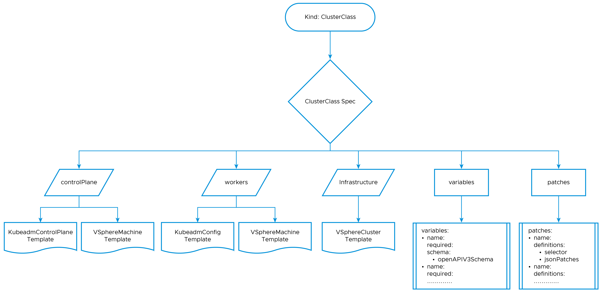

# ClusterClass Overview

ClusterClass in the Kubernetes Cluster API project allows you to define the shape of your clusters. You can determine the shape of the cluster only once, and use them  multiple times. The ClusterClass consists of collection of templates that define the topology and configuration of a Kubernetes cluster. The templates can be used to create new clusters, or to update existing clusters. 

ClusterClass helps you simplifying the process of creating and managing multiple Kubernetes clusters, and to make your clusters more consistent and reliable.

The [ClusterClass CRD](https://doc.crds.dev/github.com/kubernetes-sigs/cluster-api/cluster.x-k8s.io/ClusterClass/v1beta1) contains the following components:

- **ControlPlane**: This includes the reference to the `VSphereMachineTemplate` used when creating the machines for the cluster’s control plane, and the `KubeadmControlPlaneTemplate` containing the `KubeadmConfigSpec` for initializing the control plane machines.
- **Workers**: This includes the reference to the `VSphereMachineTemplate` used when creating the machines for the cluster’s worker machines and the `KubeadmConfigTemplate` containing the `KubeadmConfigSpec` for initializing and joining the worker machines to the control plane.
- **Infrastructure**: This includes the reference to the `VSphereClusterTemplate` that contains the vCenter details(vCenter Server endpoint, SSL thumbprint etc) used when creating the cluster.
- **Variables**: A list of variable definitions, where each variable is defined using the [OpenAPI Schema definition](https://github.com/kubernetes/apiextensions-apiserver/blob/master/pkg/apis/apiextensions/types_jsonschema.go).

- **Patches**: A list of patches, used to change the above mentioned templates for each specific cluster. Varibale definitions defined in the Variables section can also be used in the patches section.

## Benefits of using ClusterClass:

- **Simplified cluster creation**: ClusterClass templates can be used to create new clusters with a single command to save time and effort.
- **Consistent clusters**: All clusters that are created from the same ClusterClass will have the same topology and configuration. This helps ensuring that your clusters are reliable and predictable.
- **Extensible cluster templates**: ClusterClass templates can be customized to create clusters that meet the specific needs of your applications.
- **Managed clusters**: ClusterClass can be used to manage the lifecycle of your clusters. This help you automating the process of creating, updating, and deleting clusters.

## Cluster 

[Cluster CRD](https://doc.crds.dev/github.com/kubernetes-sigs/cluster-api/cluster.x-k8s.io/Cluster/v1beta1) is used to create and manage the cluster's configuration and state, and delete Kubernetes clusters. For example, you can use the cluster object to update the Kubernetes version, the network configuration, or the number of nodes in the cluster.

## Configuration of the Cluster topology
The configuration of cluster topology contains the following options:

- A reference to the ClusterClass CRD.
- Define the attributes that governs the Cluster's control plane. These attributes contain parameters such as, the count of replicas, alongside provisions for overriding or appending values to control plane metadata, nodeDrainTimeout, and control plane's MachineHealthCheck.
- A list of machine deployments slated for creation, with each deployment uniquely characterized by:
  - The reference to the MachineDeployment class, which defines the templates to be used this specific MachineDeployment.
  - The number of replicas designated for this MachineDeployment, along with other parameters such as node deployment strategy, machineHealthCheck, nodeDrainTimeout values.
- Specification of the intended Kubernetes version for both the Cluster, encompassing both the control plane and worker nodes.
- The Cluster Topology and MachineDeployments can also be customised using a set of variables through patches as defined the ClusterClass CRD. 

## ClusterClass and Cluster CRD use cases in TKGm:
- Private Image Repo Configuration
  - [For New Clusters](https://techdocs.broadcom.com/us/en/vmware-tanzu/standalone-components/tanzu-kubernetes-grid/2-5/tkg/workload-clusters-secret.html#custom-ca) 
   
  - [For Existing Clusters](https://techdocs.broadcom.com/us/en/vmware-tanzu/standalone-components/tanzu-kubernetes-grid/2-5/tkg/workload-clusters-secret.html#add-custom-ca)

- [Node Resizing/Vertical Scaling (CPU, Memory)](https://techdocs.broadcom.com/us/en/vmware-tanzu/standalone-components/tanzu-kubernetes-grid/2-5/tkg/workload-clusters-scale.html#class-topology)

- [Creating Clusters using Custom ClusterClass](https://techdocs.broadcom.com/us/en/vmware-tanzu/standalone-components/tanzu-kubernetes-grid/2-5/tkg/workload-clusters-cclass.html)

