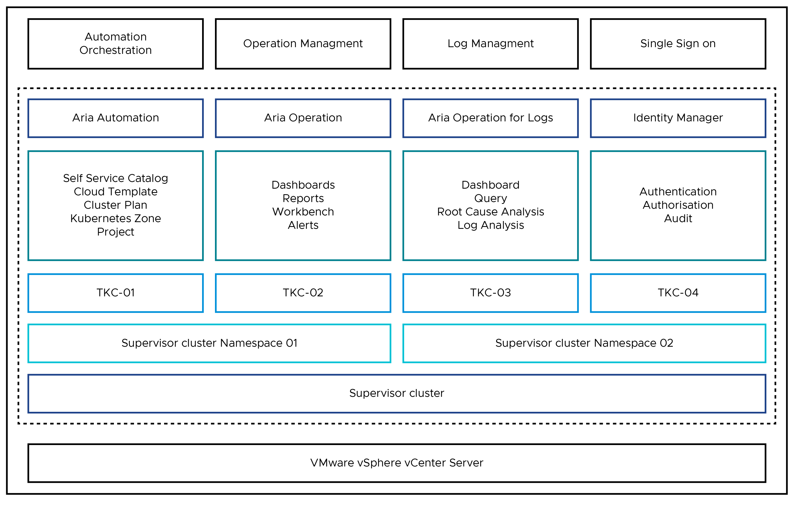

# VMware Aria Portfolio for vSphere with Tanzu

VMware Aria portfolio for Modern Applications simplifies operating Kubernetes (K8s) for multi-cloud deployment by centralizing management and governance for clusters and teams across on-premises, public clouds, and edge. VMware Aria delivers an open source aligned Kubernetes distribution with consistent operations and management to support infrastructure and app modernization

vSphere with Tanzu transforms the vSphere cluster into a platform for running Kubernetes workloads in dedicated resource pools. When vSphere with Tanzu is enabled, it creates a Kubernetes control plane directly in the hypervisor layer. You can then run the Kubernetes containers by creating an upstream highly-available Kubernetes cluster through VMware Tanzu Kubernetes Grid Service (informally known as TKGS), and run your applications inside these clusters.

When vSphere with Tanzu is integrated with Aria Portfolio, you can achieve Unified Management using Aria Automation, Enterprise Level Monitoring with Aria operations, and Enterprise Level Log using Aria Operation for Logs. 

**[VMware Aria Automation](#aria-automation)** 

VMware Aria Automation is a modern infrastructure automation platform with event-driven state management. It is designed to help organizations control and secure self-service multi-cloud with governance and DevOps-based infrastructure delivery.

**[VMware Aria Operations for Monitoring](#aria-operations-monitor)**  

This service uses artificial intelligence and machine learning (AI/ML) to help you optimize, plan, and scale the applications and infrastructure. In VMware Aria Operations, you can view AI/ML-powered optimization recommendations for performance and capacity.

**[VMware Aria Operations for Logs](#aria-operations-logs)** 

VMware Aria Operations for Logs is a log analysis tool that delivers heterogeneous and highly-scalable log management with intuitive, actionable dashboards, sophisticated analytics providing deep operational visibility and faster troubleshooting.

This document explains how the VMware Aria portfolio works with VMware vSphere with Tanzu to take a smart approach for modern application delivery. You must have VMware Aria Portfolio and vSphere with Tanzu environment ready.

**VMware Identity Manager** 

VMware Identity Manager(vIDM), formerly known as VMware Workspace Portal, can be integrated to LDAP/Active Directory, and will closely work with VMware Aria Automation for controlling the role-based-access-control (RBAC) for users. vIDM increases security and improves productivity by providing Single Sign-On(SSO).

**Aria Tanzu Portfolio Architecture**

The following diagram explains the VMware Aria Portfolio architecture for vSphere with Tanzu.

   

## Supported Component Matrix

|**Software Components**|**Version**|
| :- | :- |
|VMware Aria Suite Lifecycle|8\.12|
|VMware Aria Automation|8\.12|
|VMware Aria Operation|8\.12|
|VMware Aria Operations for Logs |8\.12|
|VMware vCenter (VCSA)|8\.0|
|Tanzu Kubernetes Release|1\.23.8|

## Aria Components

- **Aria Automation Cloud Account:** Cloud accounts are the configured permissions that Aria Automation Cloud Assembly uses to collect data from the regions or data centers, and to deploy blueprints to those regions. 
  The collected data includes the regions that you later associate with zones.
  When you configure zones, mappings, and profiles, you select the cloud account to which they are associated.
  As a cloud administrator, you create cloud accounts for the projects in which team members work. 

- **Project:** By using projects, you can organize and govern what business users can do and what zones they can use to deploy templates in your infrastructure. You create a project for which you manage memberships, such as project administrators, project members, and project viewers. You also manage the Kubernetes zones so that the project members can deploy their workloads to the associated zones. Project administrators use the infrastructure that is created by the administrator to ensure that project members have the resources they need while project members are users who create, iterate, and deploy Tanzu Kubernetes Clusters. Project viewers have read-only access to the project.
  While creating a project, you can also specify the users and administrators that are part of the project.

- **Kubernetes Zone:** A Kubernetes Zone defines a set of compute resources that can be used for provisioning of Tanzu Kubernetes clusters and namespaces. Kubernetes zones enable cloud administrators to define policy-based placement of Kubernetes clusters and namespaces and supervisor namespaces used in Automation Assembler deployments. An administrator can use this page to specify the clusters that are available for provisioning of Kubernetes namespaces and the properties that are acceptable for clusters.

- **Cluster Plan:** A cluster plan defines a configuration mapping, similar to a flavor-mapping, for a set of vSphere cloud account instances. Generally, a cluster plan encodes a meaningful set of configuration properties, such as virtual machine classes, storage classes, and so on. These cluster plans are used when provisioning Tanzu Kubernetes clusters on a particular vSphere server cloud account.
  You must create a cluster plan to use with vSphere with Tanzu Kubernetes deployments in VMware Aria Automation. A cluster plan functions as a configuration template for provisioning Tanzu Kubernetes cluster instances on a particular vSphere cloud account instance.
- **Catalogs:** Cloud Template is the foundation that leads to Infrastructure as Code. Tanzu Kubernetes Clusters or Namespace configuration can be saved as a Cloud Template which can be published as a component called catalog in Service Broker.

- **Service Broker:** Service Broker aggregates content from multiple resources and platforms, including Cloud Assembly into a common catalog accessible via a graphical interface or APIs. It provides a self-service model with flexible, policy-based governance to regulate service and resource consumption.

- **VMware Aria Operations Management Pack for Kubernetes:** The VMware Aria Operations Management Pack for Kubernetes provides end-to-end visibility for Kubernetes and its resources. By using VMware Aria Operations Management Pack for Kubernetes, you can visualize, monitor, and troubleshoot your Kubernetes ecosystem effectively.

**Firewall Requirements with respect to vSphere with Tanzu**

|Source|Destination|Protocol:Port|Description     |
| :- | :- | :- | :- |
|VMware Aria Automation Management IP|Tanzu Kubernetes Clusters Control Plane VIP Range|
TCP:6443

TCP:443

TCP:80
|Aria Automation to Supervisor connectivity.|
|VMware Aria Operation Primary/Replica/Data nodes/Remote Collectors.|Tanzu Kubernetes Clusters Control Plane VIP Range.|
TCP:6443

TCP:443

TCP:80

cAdvisor – DaemonSet Port

(Default Port 31194)
|Aria Operation to TKC for data collection using cAdvisor.|
|VMware Aria Operation Primary/Replica/Data nodes/Remote Collectors.|Tanzu Kubernetes Clusters Control Plane VIP Range.|
TCP:6443

TCP:443

TCP:80

 
|Aria Operation to Tanzu Kubernetes Clusters for data collection using Prometheus.|
|Tanzu Kubernetes Workload Cluster CIDR|vRealize Log Insight appliance|UDP:514|To collect logs from clusters using syslog protocol.|

For more information about Port requirements, see  [Product documentation](https://ports.esp.vmware.com/home/vRealize-Automation+VMware-Aria-Operations+VMware-Aria-Operations-for-Logs).

## Identity and Access Management

When vSphere with Tanzu is enabled on a vSphere cluster, it creates a Kubernetes control plane inside the hypervisor layer. A cluster that is enabled for vSphere with Tanzu is called a Supervisor Cluster. Supervisor Cluster is a single point of access that needs to be protected from everyone.

Mostly, you need Tanzu Kubernetes Clusters on demand. You need to login to Supervisor cluster manually for creating a managing Tanzu Kubernetes clusters. VMware Aria Automation can simplify the process by giving a single click creation and management of Tanzu Kubernetes Clusters with a GUI experience.

You do not need access to Supervisor Cluster for creating Tanzu Kubernetes Clusters and Namespaces through Aria Automation.

You can segregate the access of your users so that they can only login to Service Broker for Creating/Updating/Deleting Tanzu Kubernetes Clusters.

You can have Namespace Admins who can create Supervisor Cluster Namespaces from Aria Automation Console and assign it to the Required Kubernetes Zones without login into to vCenter.

Tanzu Kubernetes Cluster Access is controlled in the `admin config` file available in Aria Automation Console. Only the authorized users will be able to download the admin config file. 

There are the following two levels of access controls that you need to define in Aria Automation:

- **Projects:** You define the access for project administrators to create catalogs.
- **Catalogs:** You define the access for users/groups on catalogs. This is to create and update Tanzu Supervisor cluster and Supervisor Namespaces from catalogs.

It is recommended not to perform any operation like scale/upgrade/update on Tanzu Kubernetes Cluster or Supervisor Cluster Namespaces from the Supervisor cluster if it is created from Aria Automation.

VMware Identity Manager (vIDM) can be integrated to LDAP/Active Directory and works closely with VMware Aria Automation to provide RBAC functionality for users. 

You can use the LDAP/Active Directory groups in Projects/Catalogs for controlling user access.

Aria Automation uses the same service account that is used to add Cloud Account to perform all Supervisor cluster operations.

The service account needs the following vCenter Roles for integrating  vSphere with Tanzu with Aria Automation:

- Allows disk decommission operations
- Modify cluster-wide configuration
- Modify cluster-wide namespace self-service configuration
- Modify namespace configuration
- Upgrade clusters to newer versions

For More information, see [vSphere Namespaces Privileges](https://docs.vmware.com/en/VMware-vSphere/8.0/vsphere-security/GUID-CDE2EC09-B46D-4911-BCB9-7F78994D9D53.html) and [Credentials required for working with cloud accounts in VMware Aria Automation](https://docs.vmware.com/en/VMware-Aria-Automation/8.12/Using-Automation-Assembler/GUID-F58886C2-D5DF-4878-B9F4-515FBB363E4D.html).

## <a id="aria-automation">VMware Aria Automation</a>

Aria Automation is used to provision Tanzu Kubernetes Clusters (TKCs) and Supervisor Cluster Namespaces in vSphere with Tanzu from Cloud Assembly by leveraging the vSphere native capabilities to deploy and manage Tanzu Kubernetes clusters. This provides an infrastructure-agnostic layer for provisioning and management of Tanzu Kubernetes infrastructure.

You can create, delete, scale, and upgrade Tanzu Kubernetes clusters from Aria Automation UI without having access to vCenter or Supervisor Cluster.

VMware Aria Automation has multiple  types of user roles. These different roles control access to the organization, the services, the projects that produce or consume the cloud templates, and the catalog items. These roles also have the ability for users to use or see individual parts of the user interface. For example, you will have access only to Service Broker catalogs while creating Tanzu Kubernetes Clusters.

With the Help of VMware Aria automation, you can login with your defined credentials and create or access Tanzu Kubernetes clusters or Supervisor Namespace without knowing underlying Supervisor clusters. Users/Groups will be given access to the respective catalog where they will be able to create/view Tanzu Kubernetes Clusters from Aria service broker.

### Prerequisite:

- VMware Aria Automation 8.12.
- vSphere with Tanzu should be activated from the vCenter server. 
- Create a Supervisor Namespace where you can deploy Tanzu Kubernetes clusters. You can create a namespace from Aria Automation using Cloud Templates.

**Note:** The above namespace needs a VM Class and a Storage Policy attached to it.

### VMware Aria Automation Deployment Concept

1. Create a Kubernetes Zone which can be tagged to a Project.
1. Create Kubernetes Cluster Plans for Production Clusters and Development Clusters.
   We recommend that you use three control plane nodes in Production Cluster Plans.
1. Create Cloud Template and associated with the respective project and Cluster Plan.
1. Release Cloud Template to Catalog so that users can consume it from Service Broker.

### Operations Performed From Aria Automation

Perform the following day-1 tasks:

- **Create Supervisor Cluster Namespace:** A vSphere Namespace is a tenancy boundary within vSphere with Tanzu. A vSphere Namespace allows you to share vSphere resources (compute, networking, and storage), and enforce resource limits within the underlying objects such as Tanzu Kubernetes clusters. For each namespace, you configure role-based access control (policies and permissions), image library, and virtual machine classes.
  Namespace Cloud Templates can be created with VM Class and Storage Policy attached. This Cloud Template will be released to Service Broker as a catalog. You can use the catalog to create Namespace once it is created. Namespace needs to be attached to the Kubernetes Zone as a Resource for Consumption. 

- **Create Tanzu Supervisor Cluster:** Tanzu Kubernetes clusters are Kubernetes workload clusters in which your application workloads run. These clusters can be attached to SaaS solutions such as Tanzu Mission Control, Tanzu Observability, and Tanzu Service Mesh, which are part of Tanzu for Kubernetes Operations.
 
Once the Aria Automation integration completes, you will be able to create Tanzu Kubernetes Clusters seamlessly using catalog requests without loggin in to the Supervisor Cluster . 

Perform the following day-2 tasks on Tanzu Kubernetes Clusters in Aria Automation:

- **Scale Tanzu Kubernetes Cluster worker nodes:** You can scale a Tanzu Kubernetes cluster horizontally by changing the number of nodes or vertically by changing the virtual machine class hosting the nodes. You can do this from Aria Automation Service Broker.

- **Upgrade kubernetes version for TKC Clusters:** You can initiate a rolling update of a Tanzu Kubernetes cluster for the Kubernetes version by updating the Tanzu Kubernetes release from Aria Console.

For more information about VMware Aria Automation deployment, see the [Deployment guide](https://docs.vmware.com/en/VMware-Aria-Automation/8.12/installing-automation-easy-installer/GUID-77B713C5-0CD5-40C6-ADA0-9FAE84766661.html).

## <a id="aria-operations-monitor">VMware Aria Operations</a>

VMware Aria Operations integration with vCenter discovers and monitors the vSphere with Tanzu components. The Aria Operations Management Pack for Kubernetes can be used in addition to monitor pods and containers deployed in the Guest Clusters. Monitoring via cAdvisor and Prometheus is supported with this integration.

The key day-2 tasks for an enterprise running Tanzu and/or Kubernetes clusters would typically include monitoring and troubleshooting the management, and the Tanzu Kubernetes Clusters. With the radical and exponential increase in the amount of traffic and interconnected flows and relationships between containerized workloads, you need the most powerful and insightful monitoring tools.

VMware Aria Operations For Monitoring provides insightful monitoring for your Tanzu and upstream Kubernetes clusters. This allows you to monitor your containerized clusters from a single pane of glass alongside the rest of your infrastructure.

Aria Operations Management Pack for Kubernetes on boards Tanzu and Kubernetes clusters seamlessly onto Aria Operations expanding monitoring, troubleshooting, and capacity planning capabilities to Tanzu and Kubernetes deployments.

The Aria Operations delivers intelligent operations management with application-to-storage visibility across physical, virtual, cloud, and Kubernetes infrastructure. You can automate key processes and improve the infrastructure efficiency.

### Prerequisites:

- Aria Operations 8.12.
- Install [Aria Operations Management Pack for Kubernetes](https://docs.vmware.com/en/VMware-Aria-Operations-for-Integrations/1.9/Management-Pack-for-Kubernetes.pdf).
- Ensure to have the Kubernetes clusters deployed by vSphere with Tanzu.
- VMware Aria Operations Manager retrieves the metrics directly from Prometheus or Container Advisor Daemonset. For more information, see  [Product documentation](https://docs.vmware.com/en/VMware-Aria-Operations-for-Integrations/1.9/Management-Pack-for-Kubernetes/GUID-BD6B5510-4A16-412D-B5AD-43F74C300C91.html).

### Collecting Metrics Using Container Advisor Daemonset

Container Advisor (cAdvisor) helps you in understanding the resource usage and performance characteristics of the running containers. The cAdvisor collects, aggregates, processes, and exports information about running containers. For each container, cAdvisor stores resource isolation parameters, historical resource usage, histograms of complete historical resource usage, and network statistics. cAdvisor also supports multiple runtime such as CRI-O, Docker, and container for metrics collection. cAdvisor can also be installed as a DaemonSet or kubelet.

### Collecting Metrics  Using Prometheus

In the existing Kubernetes environment, you might leverage Prometheus to collect metrics for your applications, containers, pods, namespaces, and nodes. By integrating vRealize Operations (vROPS) with Prometheus, you do not need to deploy any new services to get insights into Kubernetes. You can leverage existing metrics collection tools and get data that is consistent with the data of your developers and application teams. As infrastructure and platform operators, you must be able to consume these metrics within vRealize Operations. This can significantly reduce the resolution time by reducing the friction between multiple teams and being able to see the full Kubernetes landscape without learning new tools. If the Kubernetes platform is running on top of vSphere, vRealize Operations can map the relationships between vSphere objects and your Kubernetes environments. 

However, Prometheus collects metrics differently than vRealize Operations. Instead of querying objects directly using their API’s, Prometheus pulls data from exporters that leverage a common API. The exporters are responsible for the collection of metrics from the various objects. There are many exporters available for Prometheus.

For more information about cAdvisor and Prometheus, see [Monitoring Kubernetes](https://docs.vmware.com/en/VMware-Aria-Operations-for-Integrations/1.9/Management-Pack-for-Kubernetes/GUID-C8B74A17-1811-40C3-A1CC-EAD8613DA8FC.html).

**Note:** Prometheus is available as a Tanzu Package where the binaries are signed by VMware.

For more information about VMware Aria Operation deployment, see the [Deployment guide](https://docs.vmware.com/en/VMware-Aria-Operations/8.12/Getting-Started-Operations/GUID-7FFC61A0-7562-465C-A0DC-46D092533984.html).

## <a id="aria-operations-logs">VMware Aria Operations for Logs</a>

VMware Aria Operations for Logs can be used as a log analysis tool that delivers heterogeneous and highly-scalable log management with intuitive, actionable dashboards, sophisticated analytics, and broad third-party extensibility, providing deep operational visibility and faster troubleshooting.

VMware Aria Operations for Logs (formerly known as vRealize Log Insight) provides intelligent log management for infrastructure and applications in any environment. This highly-scalable log management solution delivers intuitive, actionable dashboards, sophisticated analytics, and broad third-party extensibility across physical, virtual, and cloud environments.

You can use kubectl logs in real time for troubleshooting and debugging purposes. This usually does not scale beyond a couple of Kubernetes (K8s) Clusters. Even then, you will not retain any of the historical logs which might be required for deeper analysis or for auditing purposes. This is usually solved by having a centralized log management platform.

FluentBit is one the most popular and utilized log processors for Kubernetes. it is an open source data collector integrated with VMware Aria Operations for Logs, which lets you unify the data collection and consumption for a better understanding of the data.

Fluentbit collects log events from log files and forwards the logs to a VMware Aria Operations for Logs server using the syslog protocol. VMware Aria Operations for Logs can analyze and store it.

For more information about configuring log sources, see the [Product documentation](https://docs.vmware.com/en/VMware-Aria-Operations-for-Logs/8.12/Using-Operations-for-Logs/GUID-B53E2A9D-22A8-4E51-ADAF-FB4B70BC755C.html).

### Prerequisites:

- Tanzu Supervisor cluster and workload cluster.
- The Fluentbit package should be deployed in Tanzu Kubernetes Clusters.

For more information about VMware Aria Operation for logs deployment, see the [Deployment guide](https://docs.vmware.com/en/VMware-Aria-Operations-for-Logs/8.12/Getting-Started-Operations-for-Logs/GUID-F73595DC-1511-4A19-9AE4-02C8FEDF5CF5.html).

