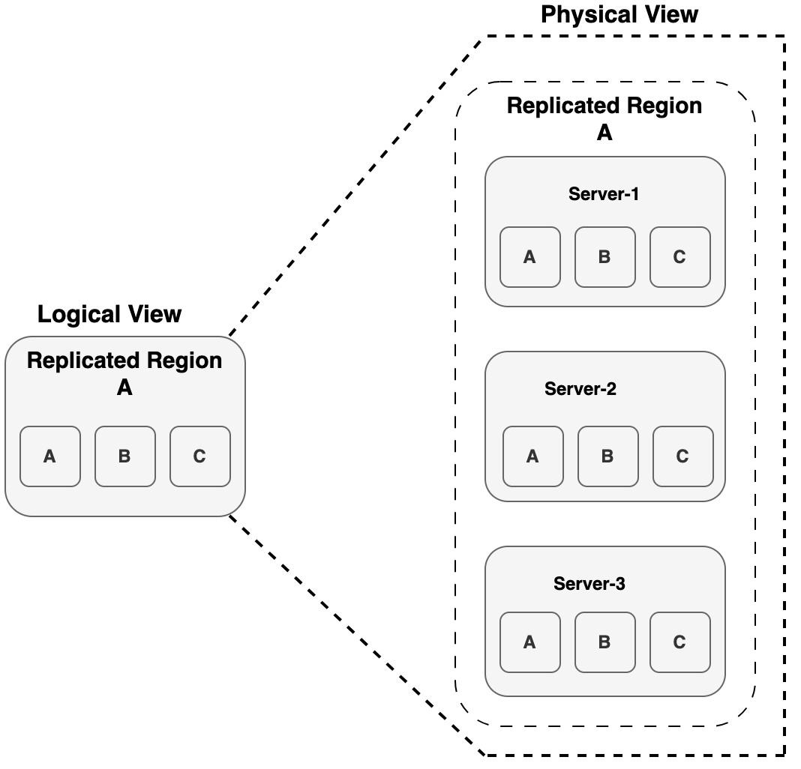

# VMware Tanzu GemFire on vSphere Deployment and Operations Guide

This document focuses on the deployment and management of Tanzu GemFire on a self-managed vSphere infrastructure spanning multiple regions. It leverages vSphere Distributed Switch (vDS) for network virtualization and NSX Advanced Load Balancer (NSX ALB) for traffic distribution and high availability. The guide provides architectural best practices, deployment strategies and operational recommendations to support a scalable, high-performance and fault-tolerant GemFire deployment within an enterprise-grade vSphere environment.

## Audience

This document is intended for a broad range of stakeholders involved in the adoption and management of Tanzu GemFire, including:

* Executives and IT Decision-Makers seeking to align in-memory data management strategies with business objectives and digital transformation initiatives.

* Infrastructure and Cloud Architects responsible for designing resilient, scalable, and secure platforms to support distributed caching, real-time analytics, and data replication across environments.

* Platform Engineering and DevOps Teams tasked with deploying, operating, and maintaining Tanzu GemFire on Kubernetes and virtualized infrastructure.

* Application Owners and Developers focused on leveraging in-memory data grids to enhance application speed, fault tolerance, and horizontal scalability.

* Enterprise Modernization Teams engaged in transforming legacy architectures by introducing low-latency, high-availability data layers to support modern, cloud-native workloads.

This document also supports individuals driving strategic efforts to improve data availability, performance and operational efficiency across hybrid and multi-site deployments.

Below is the validated Bill of Materials (BoM) that can be used to install Tanzu GemFire on your vSphere environment today:

## Bill Of Materials

| Software Components  | Version  |
| :---- | :---- |
| vSphere ESXi | 8.0.3 |
| vCenter | 8.0.3 |
| NSX Advanced Load balancer | 22.1.5 |
| GemFire | 10.1.3 |

## Introduction to Tanzu GemFire

VMware GemFire is a high-performance in-memory data grid that enables applications to access and process large amounts of data with ultra-low latency. Designed for real-time transactional and analytical workloads, it ensures fast data access, fault tolerance and scalability across distributed environments. By keeping data in memory instead of relying on traditional disk storage, GemFire significantly speeds up processing times, making it ideal for industries like finance, e-commerce, where real-time insights and rapid decision-making are crucial.

One of the most powerful features of VMware GemFire is its ability to replicate and distribute data across multiple nodes, ensuring high availability and resilience. It supports multi-region replication (WAN) and primary-standby setups, allowing businesses to maintain synchronized data across different locations. This ensures business continuity and disaster recovery, even in the event of network failures. GemFire’s partitioned regions allow large datasets to be efficiently spread across multiple servers, making horizontal scaling seamless and efficient.

### Key Components of Tanzu GemFire

Tanzu GemFire is an in-memory, distributed data grid that provides high-performance data storage, real-time querying and seamless scalability.


This diagram illustrates the architecture of a Tanzu GemFire distributed system, showcasing the interaction between cache clients, servers and locators. The cache clients maintain a local cache and connect to the server farm, where multiple GemFire servers store and manage distributed cache data. The locator plays a crucial role in load balancing and discovery, as it keeps track of active servers and directs clients to the least-loaded server. Clients request server information from the locator, which responds with optimal server details. Once connected, clients send and receive cache data while also receiving server events. The servers, in turn, share address and load information with the locator to ensure efficient client routing and system scalability.

**Note**: In GemFire, a member refers to any process locator, server, or client that participates in the distributed system. Members collaborate to manage data, distribute load, and maintain cluster state through coordinated communication.

* Locators**

  * Locators help with member discovery and load balancing within a Tanzu GemFire cluster.

  * Clients connect to a list of locators, which dynamically maintain a list of active servers for efficient request routing.
    For more information on Locators refer: [Locators](#locators)

* Servers**

  * Store and manage data, execute queries, and handle transactions.

  * Participate in distributed caching and data partitioning.

  * Can be scaled horizontally to improve performance and ensure high availability.

    For more information on Servers refer: [Servers](#server)

* Gateway Sender and Receiver**

  * Enable cross-cluster data replication in Tanzu GemFire WAN deployments.

  * Gateway Senders queue and transmit region events to remote clusters, while Gateway Receivers accept and apply those events to local regions.

  * They support serial and parallel modes to balance between event ordering and throughput.

  * Together, they enable real-time data synchronization, disaster recovery, and multi-site availability across geographically distributed environments.

    For more information refer: [Gateway Sender and Receiver](#gateway-senders-and-receivers)

* Management and Monitoring tools**

  * Tanzu GemFire provides several tools for administration and monitoring:

    * gfsh (GemFire Shell)**

      * Command-line tool for managing Tanzu GemFire applications.

      * Supports scripting, debugging, and administration.

      * Can execute commands from within applications.

    * Tanzu GemFire Pulse**

      * Web-based UI for monitoring deployments.

      * Provides an integrated view of all cluster members.
        **Note**: Tanzu GemFire 10.1 deprecates Pulse in favor of the VMware Tanzu GemFire Management Console, which will replace it in a future release.

    * Pulse Data Browser**

      * A visual tool for executing OQL queries on Tanzu GemFire data.
        **Note:** In Tanzu GemFire 10.1, Pulse is deprecated and has been integrated into the VMware Tanzu GemFire Management Console. Pulse is scheduled to be removed in a future release.

  * Tanzu GemFire Management Console**

    * Gain full visibility and control over multiple clusters through a unified UI. Easily monitor cluster health, visualize topology, configure regions, and manage disk stores for streamlined operations.

    * Accelerate deployment and troubleshooting with the ability to deploy or remove JAR files, execute functions, access a web-based GemFire Shell (gfsh), manage gateways and senders and quickly search and review cluster logs.

  * For more information, refer to the [official Tanzu GemFire documentation.](https://techdocs.broadcom.com/us/en/vmware-tanzu/data-solutions/tanzu-gemfire/10-0/gf/managing-management-mm_overview.html)

### Key Features of Tanzu GemFire**

* High Read-and-Write Throughput: Tanzu GemFire supports high throughput with fast data access, concurrent memory structures and optimized distribution. Data can be replicated or partitioned across systems to improve read and write speeds. This setup boosts overall throughput, with limits only dependent on network capacity.

* Low and Predictable Latency:: With a streamlined caching layer, Tanzu GemFire minimizes delays by reducing context switches between threads. Data is efficiently distributed, and subscription management ensures better CPU and bandwidth usage, resulting in faster response times and lower latency.

* High Scalability: Tanzu GemFire can scale easily by distributing data across multiple servers, ensuring balanced load and consistent performance. As demand grows, the system can dynamically add servers, manage data copies, and handle bursts of traffic without sacrificing response time.

* Continuous Availability: Tanzu GemFire ensures high availability with data replication and failover mechanisms. Data can be saved on disk synchronously or asynchronously, and if a server fails, another takes over to ensure continuous service without data loss or interruptions.

* Reliable Event Notifications: Tanzu GemFire provides a reliable publish/subscribe system that ensures events are delivered with the related data to subscribers. This eliminates the need for separate database access, offering faster, more efficient event processing.

* Parallelized Application Behavior on Data Stores: You can execute business logic across multiple system members, improving efficiency by processing data where it is stored. This reduces network traffic and speeds up calculations, making operations faster, especially for data-heavy tasks.

* Shared-Nothing Disk Persistence: Each Tanzu GemFire member manages its own data storage, ensuring that disk or cache failures in one member don’t affect others. This “shared nothing” approach increases performance and reliability by isolating disk management.

* Reduced Cost of Ownership: With tiered caching, Tanzu GemFire reduces costs by using local memory caches and minimizing the need for frequent database access. This lowers overall transaction costs and improves efficiency by avoiding costly database operations.

* Single-Hop Capability for Client/Server: Tanzu GemFire allows clients to directly access the server holding their data, avoiding multiple hops. This improves performance by making data access quicker and more efficient.

* Client/Server Security: Each user in a client application is given access to a specific subset of data, enhancing security and control. Users are authenticated with their own credentials, ensuring data privacy and proper access levels across the system.

* Multisite Data Distribution: Tanzu GemFire supports data distribution across geographically dispersed sites. Using gateway sender configurations, the system ensures reliable communication between data centers, allowing scalability without sacrificing performance or data consistency.

* Continuous Querying: Tanzu GemFire allows complex queries to run continuously, enabling real-time data updates for applications. This is achieved through Object Query Language, which simplifies querying for dynamic, real-time data processing.

* Heterogeneous Data Sharing: Applications written in different languages (C\#, C++, Java) can share business objects seamlessly without needing complex transformation layers. Changes in one application automatically trigger updates in others, facilitating smooth integration between different platforms.

### Supported Platforms for Tanzu GemFire

Tanzu GemFire production systems can be run on the following platforms:

* Linux: Recent versions with kernel 4.18 or higher.

* Windows Server: Versions including 2012 R2, 2016, 2019, and 2022\.

For cloud environments, you can run VMware Tanzu GemFire on:

* Amazon Web Services (AWS)

* Microsoft Azure

* Google Cloud Platform

* Tanzu Application Service (TAS)

* Kubernetes

For development environments, VMware Tanzu GemFire is supported on:

* macOS

* Windows 10 and Windows 11

## High-Level Architecture of Tanzu GemFire Deployment

  

The diagram above illustrates a Tanzu GemFire deployment on vSphere with WAN replication enabled, designed to support a highly available, fault-tolerant Active-Standby topology across two independent vSphere regions.

**Key Points:**

* vSphere Clusters:

  * This setup consists of two independent vSphere clusters, each representing a distinct region (Site 01 and Site 02).

  * This design ensures fault isolation, allowing workloads to remain resilient and recoverable across Availability Zones (AZs).

* Network Configuration:

  * Each vSphere cluster is connected to a dedicated vSphere Distributed Switch (vDS) to manage network traffic within that Region.

  * The VIP network must be stretched across Availability Zones (AZs) if the GemFire deployment spans multiple AZs within the same region. However, extending the VIP network across regions is not required.

* Storage Considerations:

  * Each cluster has its own vSphere Datastore (Block/NFS) to store workload and infrastructure data.

  * Storage is not stretched between zones, ensuring independence and reducing cross-site dependencies.

* Workload Management:

  * The workload domains manage both Tanzu GemFire clusters and NSX ALB Service Engines (SEs).

  * By leveraging separate Clusters, workloads benefit from isolation, scalability and simplified management.

* Workloads and Load Balancing:

  * The workloads include Tanzu GemFire VMs and NSX Advanced Load Balancer (AVI SEs) to handle traffic distribution.

  * Each region deploys its own NSX Advanced Load Balancer instance to provide L4/L7 load balancing for workloads.

* Site-Level Deployment Details**
  * Site 01 (Primary \- AZ01)**
    * Two Locator VMs for peer discovery and cluster coordination
    * Two Cache Server VMs that host data regions and serve client requests
    * Gateway Sender/Receiver component to transmit region events to Site 02
    * Managed by vCenter Server-01, with compute resources provisioned via ESXi transport nodes in a dedicated Workload Cluster

  * Site 02 (Standby \- AZ02)**
    * One Locator VM and Two Cache Server VMs, mirroring the primary site's configuration
    * Gateway Receiver/Sender component to receive WAN updates and optionally support reverse replication
    * Managed independently by vCenter Server-02, with its own Workload Cluster (AZ02)

* WAN Replication and High Availability**
  * Gateway Sender in Site 01 transmits region events to the Gateway Receiver in Site 02\.
  * This supports Active-Standby replication, ensuring that critical data is mirrored across regions for disaster recovery.
  * Site 02 remains on standby and can quickly become active if Site 01 experiences downtime.
  * The use of Receiver/Sender roles on both ends also supports bidirectional replication if required in future.

This architecture provides high availability, fault tolerance and scalability by distributing workloads across independent regions, ensuring efficient network and storage management.

## Network Requirements**

As per the proposed deployment architecture, all GemFire VMs will be provisioned on VLAN-backed port groups. This setup ensures proper isolation, segmentation and high availability across multiple regions.

For the purpose of this document, we are assuming that NSX Advanced Load Balancer (NSX ALB) will be used as the load balancer for GemFire clusters. During failover scenarios, NSX ALB will facilitate seamless traffic redirection between active and standby GemFire nodes.

Below is a breakdown of the recommended subnet sizing and purpose of each required network segment.

| Network | Minimum/ Recommended Subnet Requirement | Description |
| :---- | :---- | :---- |
| GemFire Network | /24 | For the purpose of this document, all Tanzu GemFire components are deployed within the same network. However, for enhanced security and improved network isolation, it is recommended to consider placing Locators and Cache Servers on separate networks. Furthermore, depending on the use case, server groups participating in a data region can be distributed across multiple networks or port groups to support segmentation, scalability, or tenant-level isolation. |
| NSX ALB Management Network | /27 | Hosts NSX ALB controllers and the management interfaces of Service Engines (SEs). Recommended: One management network per region. Note:  If the management domain is not stretched and a dedicated management domain is used per site, two separate networks must be configured, one at each site. This document does not cover scenarios with a stretched management domain in a multi-site environment. |
| VIP Network  | /28 | Used to host L4 Virtual Services (e.g., Locators, Gateway Senders) for GemFire WAN replication. Recommended: One network per region for redundancy. |

## Firewall Requirements**

The table below lists the minimum firewall rules needed to support communication between components in the architecture:
**Note:** Below firewall requirements are provided assuming that all GemFire Components are on a single network, if your design make use of multiple networks, refer to the next section on  [Port Configuration for Tanzu GemFire](#port-configuration-for-tanzu-gemfire)

| Source | Destination | Protocol:Port | Description |
| ----- | ----- | ----- | ----- |
| GemFire Network NSX ALB Management Network | DNS Server/s | TCP/UDP:53 | Allow DNS resolution for GemFire and NSX ALB components. |
| GemFire Network NSX ALB Management Network | NTP Server/s | UDP:123 | Time synchronization for distributed consistency and logging. |
| NSX ALB Management Network | vCenter Server | TCP:443 | Required for NSX ALB to discover vCenter inventory and manage Service Engine lifecycle. |
|  NSX ALB Management Network | AD/LDAP Servers | TCP/UDP: 389/636 | Enable authentication and directory access for NSX ALB management and user login integrations. |
| Developer network/ Client or App network CIDR(s) | LB Network  | TCP: 443  | Allow application access to GemFire APIs and Database |
| DB Admin  | GemFire Network | TCP:443 | Allow DB admin/Platform admin  to perform LCM and troubleshooting GemFire components. |

### Port Configuration for Tanzu GemFire

If your environment uses segmented or isolated networks, ensure the following port configurations are in place for Tanzu GemFire to function correctly.

| Name | Source | Destination | Protocol | Description |
| ----- | ----- | ----- | ----- | ----- |
| Cache Server Port | Client Applications | GemFire Server | TCP | Default: 40404\. Accepts client connections and supports server-to-server communication. Configurable via XML, API or GFSH. |
| HTTP Service Port | Admin UI, REST Clients | GemFire Server (HTTP) | HTTP | Default: 7070\. Used for REST APIs and Pulse UI access. Must be open if HTTP-based services are used. |
| Locator Port | Cluster Members, Clients | Locator | TCP | Default: 10334\. Used for cluster discovery and client/server connection routing. Required for clients and members to locate servers. |
| Membership Port Range | Servers and Locators | Servers and Locators | TCP | Range: 41000–61000. Ephemeral ports for internal cluster communication. Must be accessible between servers and locators within and across sites. |
| Memcached Port | Memcached Clients | GemFire Server (Memcached) | TCP | Optional. Not set by default. Must be enabled explicitly to support Memcached protocol access. |
| JMX Manager Port | Admin Tools (e.g., JConsole) | Locator / JMX Manager | RMI/TCP | Default: 1099\. Used for exposing JMX metrics to external tools for monitoring and diagnostics. |
| Internal TCP Port | Servers and Locators | Servers and Locators | TCP | Ephemeral or configured tcp-port. Used for internal TCP-based messaging. Firewalls must allow the assigned ports. |
| Gateway Sender Connection | Gateway Sender (Active Site) | Gateway Receiver (Standby Site) | TCP | Uses hostname-for-senders. Defines where senders initiate WAN event transfer. |
| Remote Locator Discovery | Locator (Active Site) | Locator (Standby Site) | TCP | Uses remote-locators. Enables WAN site discovery between locators. |
| Gateway Receiver Port Range | Gateway Sender (Standby Site) | Gateway Receiver (Active Site) | TCP | Ports defined by \--start-port / \--end-port to accept WAN traffic. |

This configuration ensures that Tanzu GemFire can securely and efficiently communicate across client-server and multi-site (WAN) topologies, even in highly restricted or segmented network environments. Proper firewall rules and port allowances are essential for seamless peer discovery, data replication and client interactions.

## Locators

A Tanzu GemFire Locator is a lightweight process that plays a central role in system coordination. It helps new members (servers, locators, or clients) discover existing members of the cluster and provides load balancing for client connections to servers.

At its core, a GemFire Locator is responsible for two key functions:

* Cluster Member Discovery
  Helps new servers discover and join the existing distributed system by providing information about active cluster members.
* Client Connection Routing
  Guides clients to connect with the most suitable (often least-loaded) cache server, enabling load balancing and high availability.

GemFire locators can operate in different modes depending on your setup:

* Peer Locator
  * Used for member discovery.
  * Helps new servers or locators find and connect to the existing cluster.
  * Maintains a membership list and shared view of the distributed system.
* Server Locator
  * Used for client connection discovery and load balancing.
  * Helps clients locate least-loaded servers.
  * Enables high availability for client-to-server connections.

### Recommendations for Installing Locators

* Always install at least two locators in each cluster to keep the system available, even if one locator goes down.
* In production, run locators on separate VMs or containers instead of placing them on the same machines as data-heavy servers.
* For WAN environments, make sure the network connection between locators in different sites is stable and low-latency to ensure smooth communication.

By acting as the discovery, coordination and client routing layer, the GemFire Locator forms the backbone of your cluster’s connectivity. A well-configured locator setup ensures your distributed system remains connected, balanced and resilient, even as it scales across regions and data centers.

## Server

Server is a process that hosts data regions, handles read and write operations, and serves requests from both clients and peer members in the cluster.
A Tanzu GemFire Server:

* Hosts data regions,the in-memory equivalent of tables or datasets.
* Accepts client connections, processes queries, and returns results.
* Participates in distributed caching, function execution, event propagation, and WAN replication.
* Works with locators to ensure high availability and scalability.

## Regions

A region in GemFire is a distributed, in-memory data structure similar to a map. Cache servers host regions, which store and serve your application’s data.
There are two primary types of regions, based on how data is distributed across servers:

### Partitioned Region

A Partitioned Region divides its data across multiple servers in the cluster. Each server holds only a subset (or partition) of the data, and optionally, redundant copies of other partitions for fault tolerance.


From the application’s perspective, this partitioned structure is invisible. The region appears as a single logical dataset, accessible in full from any member even if that member stores only part of the data locally. For each server where the region is defined, you can configure how much memory it uses. A server can also host the region with no local data, acting purely as a read/write proxy.

A single cluster can host multiple partitioned regions, and servers can host multiple regions simultaneously. Partitioned and replicated regions can also coexist in the same cluster.

Summary:

* Data is divided (partitioned) across multiple servers.
* Can support data redundancy with backup copies.
* Scales well for large datasets and write-heavy workloads.

Other variations exist (like PARTITION\_PERSISTENT, REPLICATE\_PERSISTENT, LOCAL), but all are based on these two fundamental designs.

### High Availability for Partitioned Regions

In a highly available partitioned region, each member (server) holds a mix of primary and secondary (redundant) data copies to ensure continuous operation even if a member fails. If a server hosting a primary copy goes down, Tanzu GemFire automatically promotes a secondary copy to primary, avoiding service interruption. Although this may temporarily reduce redundancy, no data is lost. The system then works to restore redundancy by copying the data to another available member. However, if too many members fail within a short time, there is still a risk of data loss despite redundancy being enabled.

**Read and Write Behavior in HA Regions**
GemFire handles reads and writes differently in partitioned regions with redundancy:

* Read Operations: GemFire first attempts to read from the local cache if the data is available. If not, it retrieves the data from another member that holds a copy typically chosen at random. This approach supports efficient scaling for read-heavy workloads across multiple members.
  For example, in the figure below, M1 is reading keys A, C, and D. It retrieves A from its local cache, while C and D are fetched from other members that hold those keys, selected at random.
  

* Write Operations (put/create): Write requests are directed to the primary copy of the key. The data is then synchronously replicated to all designated secondary copies. Additionally, events are delivered to clients according to their configured subscription attributes.


This approach enables high availability and strong consistency without sacrificing performance.

### Replicated Region

A Replicated Region ensures that every server that hosts the region contains a full copy of the data. When an entry is created or updated in one server, that change is automatically propagated to all other servers hosting that region.



This model provides strong availability and fast reads, since every hosting server has a complete view of the dataset. However, it’s best suited for smaller datasets, as replicating large data across many servers can consume memory and bandwidth.

**Summary**:

* The entire dataset is replicated across all hosting members.
* Provides high availability and low-latency reads.
* Suitable for read-heavy or globally needed datasets.
* Best for small to medium-sized data.

All region types in GemFire are based on Partitioned or Replicated modes, with added capabilities. Some common variants include:

* PARTITION\_PERSISTENT: Partitioned region with disk persistence.
* REPLICATE\_PERSISTENT: Replicated region with disk persistence.
* LOCAL: Region is confined to one server, not distributed.
  For more information on Region refer: [Creating Regions in Tanzu GemFire](#creating-regions-in-tanzu-gemfire)

### Best Practices for Cache Servers

* Design region types based on data volume and access patterns.
* Use redundant partitioned regions for high availability and scalability.
* Monitor heap usage and configure eviction policies to prevent memory overuse.
* Enable JMX metrics and statistics for observability and performance tuning.
* In production, run servers on dedicated nodes; avoid colocating with locators unless in test or dev environments.

A Tanzu GemFire Cache Server is where your data lives and operates. Each server joins as a member, connects via locators, and hosts one or more regions which are the primary interface for your application’s data.


## Gateway Senders and Receivers

In a WAN (Wide Area Network) configuration, Gateway Senders are the core components that enable cross-site data replication in Tanzu GemFire. These senders act as outbound data pipelines, transmitting region events from one cluster to another. On the receiving end, Gateway Receivers process those incoming events and apply changes to the appropriate regions.

You can configure:

* Multiple gateway senders to replicate data to different remote clusters.
* Parallel gateway senders to improve throughput and concurrency.
* Serial gateway senders to maintain strict event ordering.

Depending on your replication strategy, GemFire supports two sender modes:

### Serial Gateway Senders

Serial Gateway Senders send region events through a single, ordered queue to a remote site. This ensures that events are delivered in the exact order they were created, which is important when the sequence of updates matters. However, since all events go through one queue, performance may slow down under heavy load. To improve scalability, you can assign different regions to separate serial senders. This spreads the load while still keeping the correct event order within each region.


### Parallel Gateway Senders**

Parallel Gateway Senders let each server that hosts a partitioned region send its own events to a remote site. Each server uses its own queue, allowing multiple servers to send data at the same time. This setup scales easily and works well for high-speed data use cases where event order across partitions doesn’t need to be preserved. As you add more servers, both storage and replication capacity grow with little extra effort.


### High Availability

High availability is built into GemFire’s WAN architecture. For serial gateway senders, only one primary sender is active at a time, while backup instances stand by. If the primary fails, GemFire automatically promotes a secondary without disrupting replication. Parallel senders offer even greater resilience; each server with a primary partition sends events independently. If one fails, a redundant partition owner takes over seamlessly, keeping data replication smooth and fault-tolerant.

### Gateway Receiver**

A Gateway Receiver in Tanzu GemFire is a server-side component that listens for incoming region events from remote clusters and applies them to local regions. Each member can host one receiver, and having multiple receivers across a cluster enables load balancing and high availability. Senders connect automatically to any available receiver without explicit bindings, and connections can be rebalanced using the rebalance gateway-sender command or the GatewaySender.rebalance() API. For successful replication, both clusters must have matching region definitions. If a region is missing on the receiving side, incoming events will fail. Gateway Receivers play a vital role in completing the WAN replication flow by ensuring seamless and distributed data ingestion across sites.

##  ​Cluster Sizing Considerations for Tanzu GemFire**

Sizing a Tanzu GemFire deployment involves both calculation and practical testing. While estimates can be made, experimentation is necessary to determine accurate values for key sizing parameters that work well in real-world scenarios. This process requires testing with representative data and workloads, starting with a small scale to understand how the system behaves. Testing is essential because memory overhead can vary significantly depending on the data and workload, making it difficult to calculate precisely. The overhead is influenced by many factors, including the Java runtime environment (JVM) and its memory management system.

### Resource Considerations**

Memory is the primary resource for storing data in Tanzu GemFire and should be the first factor considered when sizing your deployment. As memory requirements are met, horizontal scaling will also scale other resources, such as CPU, network, and disk. Once the memory requirements are determined and the cluster size is set, only minor adjustments may be needed to account for these other resources. While memory typically drives horizontal scaling, it’s important to also consider other hardware and software resources, such as file descriptors (for sockets) and threads (processes).

### Sizing Process**

To size a GemFire cluster effectively, follow these steps:

1. Domain Object Sizing: Estimate the size of your domain objects, then calculate total memory requirements based on the number of entries.

2. Estimating Total Memory and System Requirements: Use tools like the [sizing spreadsheet](https://techdocs.broadcom.com/content/dam/broadcom/techdocs/us/en/assets/vmware-tanzu/data-solutions/tanzu-gemfire/10-1/gf/attachments-system_sizing_worksheet.xlsx) to estimate memory needs and system resources, accounting for GemFire region overhead. This does not account for other overhead, but provides a starting point.

3. Vertical Sizing: Begin by configuring a three-node cluster and test the "building block" for a single node. This helps determine the appropriate node size and workload configuration.

4. Scale-Out Validation: Test and adjust the configuration to ensure the system scales linearly and performs well as you expand.

5. Projection to Full Scale: Use the results from scale-out testing to finalize the configuration for your desired capacity and service-level agreement (SLA).


### Sizing Quick Reference**

Here are some general recommendations to guide your capacity planning:

* Data Node Heap Size:

  * Up to 32GB: Smaller data volumes (a few hundred GB) with low latency requirements.

  * 64GB+: Larger data volumes (500GB or more).

* CPU Cores per Data Node:

  * 2 to 4 cores: Development and smaller heaps.

  * 6 to 8 cores: Production, performance testing, and larger heaps.

* Network Bandwidth:

  * 1GbE: Development.

  * High bandwidth (10GbE or more): Production and performance testing.

* Disk Storage:

  * DAS or SAN: Recommended for all environments.

  * NAS: Not recommended due to performance and resilience issues.

More information on Sizing refer: [https://techdocs.broadcom.com/us/en/vmware-tanzu/data-solutions/tanzu-GemFire/10-1/gf/configuring-cluster\_config-cluster\_sizing.html\#vertical-sizing](https://techdocs.broadcom.com/us/en/vmware-tanzu/data-solutions/tanzu-gemfire/10-1/gf/configuring-cluster_config-cluster_sizing.html#vertical-sizing)

## Management and Monitoring Tools

Tanzu GemFire provides powerful tools for managing and monitoring your distributed data grid environment. The two primary tools are the GFSH command-line interface and the Tanzu GemFire Management Console (GMC)**.

### GFSH Command-Line Tool

The GemFire Shell (gfsh) is the recommended command-line interface for configuring, managing and monitoring the Tanzu GemFire cluster. It allows you to:

* Start and stop locators and cache servers
* Create, modify, or destroy regions
* Deploy and manage application JARs
* Execute user-defined functions
* Manage disk stores and perform data import/export
* Monitor members and system metrics
* Launch monitoring tools and shut down the cluster
* Save and manage shared cluster configurations

GFSH can be run in its own interactive shell or invoked from the operating system's command line. It supports scripting for automation and can connect to remote clusters using HTTP. With shared configuration support, GFSH enables defining reusable settings across the cluster, which are stored and synchronized by locators in files like cluster.xml and cluster.properties.
More information on GFSH refer:

* [Running gfsh Commands on the OS Command Line](https://techdocs.broadcom.com/us/en/vmware-tanzu/data-solutions/tanzu-GemFire/10-0/gf/tools_modules-gfsh-os_command_line_execution.html#topic_fpf_y1g_tp)
* [Using gfsh to Manage a Remote Cluster Over HTTP or HTTPS](https://techdocs.broadcom.com/us/en/vmware-tanzu/data-solutions/tanzu-GemFire/10-0/gf/configuring-cluster_config-gfsh_remote.html)
* [Creating and Running gfsh Command Scripts](https://techdocs.broadcom.com/us/en/vmware-tanzu/data-solutions/tanzu-GemFire/10-0/gf/tools_modules-gfsh-command_scripting.html#concept_9B2F7550F16C4717831AD40A56922259)

### Tanzu GemFire Management Console

The Tanzu GemFire Management Console (GMC) is a browser-based interface that simplifies day-to-day operations and provides visual insights into your GemFire clusters. With GMC, you can:

* Monitor multiple clusters in a single UI
* View and manage regions and disk stores
* Deploy or remove JARs
* Search and analyze cluster logs
* Execute commands using a built-in web-based GFSH
* Manage WAN components like Gateway Senders
* Visualize cluster topology in real time

The console is ideal for both routine operations and troubleshooting, providing an intuitive experience for administrators.

More information on GMC refer: [https://techdocs.broadcom.com/us/en/vmware-tanzu/data-solutions/tanzu-GemFire-management-console/1-3/gf-mc/index.html](https://techdocs.broadcom.com/us/en/vmware-tanzu/data-solutions/tanzu-gemfire-management-console/1-3/gf-mc/index.html)

##  References

* About Tanzu GemFire: [Tanzu GemFire Overview – Broadcom Docs](https://techdocs.broadcom.com/us/en/vmware-tanzu/data-solutions/tanzu-gemfire/10-1/gf/getting_started-gemfire_overview.html)
* Installing GemFire on Linux (TAR File):  [Install GemFire Using a Compressed TAR – Broadcom Docs](https://techdocs.broadcom.com/us/en/vmware-tanzu/data-solutions/tanzu-gemfire/10-1/gf/getting_started-installation-install_standalone.html)
* Installing the GemFire Management Console (GMC): [GMC Installation Guide – Broadcom Docs](https://techdocs.broadcom.com/us/en/vmware-tanzu/data-solutions/tanzu-gemfire-management-console/1-3/gf-mc/install.html)
* Installing Java (Oracle JDK Manual Download): [Java Manual Installation – Oracle](https://www.java.com/en/download/help/windows_manual_download.html)
* Installing Apache Maven: [Maven Installation Guide – Apache](https://maven.apache.org/install.html)

## Appendix

### Running a Tanzu GemFire Locator

To start a Tanzu GemFire cluster, the first component you bring up is the locator. It acts as the cluster coordinator, helping all other members find each other and join the system. Run a locator as a standalone process, typically using the GemFire Shell (gfsh) and configure it to support both peer discovery and client load balancing.

#### Start a locator using gfsh

```shell
gfsh> start locator --name=locator1 --port=10334 --dir=locator1
```

This command:

* Starts the locator with the name locator1
* Listens on port 10334 (default)
* Uses the specified working directory locator1

The locator creates a locator.dat file in its directory, which stores membership and configuration data. This file is important for rejoining or recovering the cluster if the locator is restarted.

Note:

* Only one locator can run per process instance.
* The locator must be started before any servers to allow them to discover and join the system.

#### Locator Configuration and Log Files

When you start a locator using gfsh, a working directory is specified using the \--dir option. This directory holds critical files:

| File | Description |
| ----- | ----- |
| locator.log | Main log file for the locator process. All startup info, warnings, and errors are logged here. |
| locator.dat | Stores cluster membership information and state. Used for reconnection after restarts. |
| statArchive.gfs | Contains performance statistics, useful for monitoring and analysis. |

Always retain locator.dat if you plan to restart a locator in the same cluster. Deleting it may cause cluster inconsistency.

#### Restarting Locators

If you restart a locator, make sure the same working directory is used to maintain the cluster state via the persisted locator.dat file. In production, always run multiple locators for redundancy. If one goes down, others can still coordinate cluster discovery.

#### Managing Tanzu GemFire Locators

Check the status of a locator using the status locator command:

```shell
gfsh> status locator --dir=locator1
```

This will tell you if the locator is currently running, along with its process ID and other metadata.

It's helpful for:

* Verifying startup
* Diagnosing issues after crashes
* Integrating with automation and monitoring tools

#### Stopping the Locator

To shut down a locator gracefully, use the stop locator command:

```shell
gfsh> stop locator --name=locator1
```

If needed, you can also stop it by pointing to its directory:

```shell
gfsh> stop locator --dir=locator1
```

Avoid killing the locator process directly that may prevent it from cleaning up internal metadata and files like locator.dat.

### Locators in Multi-Site (WAN) Deployments

In WAN (multi-site) setups, locators play a critical role in cross-cluster discovery. Each cluster must be aware of remote site locators to establish gateway communication.

To enable this, configure remote-locators:

```shell
gfsh> start locator --name=locator1 --dir=locator1 --J=-DGemFire.remote-locators=remote-site-host[10334]
```

This allows:

* Gateway senders in one site to find receivers in another site
* Automatic failover and recovery of gateway connections
* Scalability across geographically distributed clusters

**Best Practice**: Run at least two locators per site, and ensure proper network connectivity between remote locators for resilience.

Tanzu GemFire Locators may be lightweight, but they are mission-critical for keeping your cluster running, scalable, and highly available. From local server discovery to global WAN replication, the locator is the backbone of your system’s coordination.

Be sure to:

* Maintain clean log directories
* Monitor locator status regularly
* Stop and restart them gracefully
* Configure remote locators in WAN setups

### Running a Tanzu GemFire Server

After starting the locator, the next step in building your Tanzu GemFire cluster is to bring up one or more servers. A GemFire server is where your application data resides; it hosts regions, responds to client operations and participates in distributed caching.

**Start a Server with gfsh**

To start a server using the GemFire Shell (gfsh), use the following command:

```shell
gfsh> start server --name=server1 --locators=localhost[10334] --dir=server1
```

This does the following:

* Starts a server named server1
* Connects it to a locator at localhost on port 10334
* Stores server-specific files in the working directory server1

Optionally, you can include region definitions, JAR files, or custom JVM arguments using \--classpath and \--J options. Always point your server to a running locator to join the cluster correctly.

#### Default Server Configuration and Log Files

Once started, the server creates a set of files in the specified directory. These files help monitor the server’s health and behavior, especially in debugging or performance tuning scenarios.

| File | Description |
| ----- | ----- |
| server.log | The main log file for all server events and diagnostics. |
| statArchive.gfs | Performance statistics and runtime metrics. |
| server.pid | Contains the process ID of the running server (useful for monitoring or termination). |
| GemFire.properties | Optional configuration overrides (if present). |

#### Check Server Status

Check if a server is currently running by using:

```shell
gfsh> status server --dir=server1
```

This command returns the status of the server process, including whether it's running, its PID and its uptime. Use this command during automated deployments or to troubleshoot server crashes.

#### Stop a Server

To stop a running server gracefully, use:

```shell
gfsh> stop server --name=server1
```

Or, if you prefer to reference the directory instead:

```shell
gfsh> stop server --dir=server1
```

Gracefully stopping the server ensures that all in-flight operations are completed and internal state is saved cleanly. Avoid killing the process manually unless absolutely necessary. Use stop server to avoid region corruption or loss of queued events in WAN or async setups.

A Tanzu GemFire server is where your application’s data lives. It’s designed for performance, scalability, and reliability but it’s important to manage it correctly.

Be sure to:

* Always connect servers to a running locator.
* Keep an eye on log and stats files for insight into server performance.
* Use status server and stop server for safe lifecycle management.
* Store each server in a dedicated working directory.

### Configuring Gateway Senders and Receivers for WAN Replication

When you're building multi-site deployments with Tanzu GemFire, enabling data replication across geographically distributed clusters is critical. That’s where gateway senders and gateway receivers come in. They form the backbone of WAN (Wide Area Network) replication in GemFire, allowing region events to flow from one site to another.

#### Creating Gateway Sender

To create a gateway sender using gfsh, you must be connected to a JMX manager:

```shell
gfsh> create gateway-sender --id=sender1 --remote-distributed-system-id=2 --members=server1
```

This command:
* Creates a sender with ID sender1
* Points it to remote distributed system ID 2
* Installs the sender on member server1

**Important**: The configuration for a given \--id must be identical across all servers hosting that gateway sender.

**Key Gateway Sender Options**

| Parameter | Description |
| ----- | ----- |
| \--parallel | Enables parallel (region-wise) replication; default is serial. |
| \--batch-size | Max number of events per batch (default: 100). |
| \--batch-time-interval | Time in ms before sending partial batches (default: 1000 ms). |
| \--enable-persistence | If true, persist the queue to disk. |
| \--disk-store-name | Disk store to use for queue persistence/overflow. |
| \--dispatcher-threads | Number of threads to dispatch events (default: 5). |
| \--order-policy | Defines how ordering is preserved with multiple dispatcher threads. |
| \--gateway-event-filter | Optional custom filter class to skip events. |
| \--group-transaction-events | Ensures all events from a transaction are sent in the same batch. |

These settings allow you to fine-tune how the sender queues, processes and delivers data to the remote site.

**Example**:

```shell
gfsh> create gateway-sender --id=sender1 --remote-distributed-system-id=2 --members=server1 --parallel=true --batch-size=500 --dispatcher-threads=4
```

#### Creating Gateway Receiver

A gateway receiver is the receiving end of WAN replication. It listens for incoming data from gateway senders at a remote site.
You can create a receiver using:

```shell
gfsh> create gateway-receiver --members=server2
```

This creates a receiver on server2, ready to accept events from a remote sender.
**Note:** You can have only one receiver per member and the port is selected from a default or configured range.

**Key Gateway Receiver Options**

| Parameter | Description |
| ----- | ----- |
| \--start-port / \--end-port | Port range the receiver listens on (default: 5000–5500). |
| \--bind-address | Network interface for binding incoming sender connections. |
| \--hostname-for-senders | Hostname/IP that the locator advertises to senders. |
| \--socket-buffer-size | Buffer size in bytes (should match sender config). |
| \--maximum-time-between-pings | Ping timeout (default: 60 seconds). |
| \--gateway-transport-filter | Optional custom transport filter class. |

 Example:

```shell
gfsh> create gateway-receiver --members=server2 --start-port=50510 --end-port=50520
```

#### Stopping Gateway Senders and Receivers

To stop a sender:

```shell
gfsh> stop gateway-sender --id=sender1 --members=server1
```

To stop a receiver (by stopping the server it's on):

```shell
gfsh> stop server --name=server2
```

There’s no separate stop command for receivers since they are tightly coupled to the server lifecycle. Gateway senders and receivers are essential for enabling WAN replication between GemFire clusters. They offer flexible configurations to optimize throughput, event batching, ordering, and persistence.

**Best Practices**:

* Always use identical configuration across all members hosting a given sender.
* Ensure sender and receiver buffer sizes match.
* Use batching and persistence features for better performance and reliability.
* Monitor queues using JMX beans to detect issues like queue growth or lag.

### Creating Regions in Tanzu GemFire

In Tanzu GemFire, a region is a fundamental data container that stores key/value pairs and supports distributed caching, querying, and data replication across cluster members. Regions can be configured for different use cases, including partitioned caching for scalability or replicated caching for redundancy.

#### Create a Region with gfsh

To create a region using the gfsh, use the following basic command:

```
gfsh> create region --name=exampleRegion --type=PARTITION
```

This command:

* Creates a region named exampleRegion.
* Uses the PARTITION type, where data is split across multiple servers for scalability.

#### Commonly Used Region Types:

| Region Type | Description |
| ----- | ----- |
| PARTITION | Data is distributed across servers; scales horizontally. |
| PARTITION\_REDUNDANT | Like PARTITION but with redundancy for high availability. |
| REPLICATE | Full copy of data on each server; good for small datasets. |
| REPLICATE\_PERSISTENT | Replicated with disk persistence for durability. |

**Key Options:

| Option | Purpose |
| ----- | ----- |
| \--name | Name of the region. |
| \--type | Type of region: PARTITION, REPLICATE, etc. |
| \--redundant-copies | Number of extra copies for failover (for partitioned regions). |
| \--total-max-memory | Memory (MB) allocated across all members. |
| \--total-num-buckets | Number of data buckets (controls partition granularity). |
| \--disk-store | Disk store name for persistence or overflow. |
| \--eviction-max-memory | Threshold (MB) for memory eviction. |
| \--eviction-action | Action on eviction: overflow-to-disk or local-destroy. |
| \--cache-loader | Java class to load data when not in cache. |
| \--cache-writer | Java class to intercept write operations. |
| \--cache-listener | Java class to listen to region events. |
| \--gateway-sender-id | For WAN replication. |
| \--async-event-queue-id | For write-behind/async event processing. |
| \--off-heap | Store values off-heap for larger datasets. |

#### Partitioned Region with Redundancy

```
gfsh> create region --name=CustomerData --type=PARTITION_REDUNDANT --redundant-copies=1  --total-max-memory=1024 --total-num-buckets=113
```

This creates a partitioned region with one redundant copy of each data bucket, ensuring that the system can tolerate node failures without data loss.

#### Region Lifecycle Management

List existing regions:

```
gfsh> list regions
```

To destroy a region:

```
gfsh> destroy region --name=myRegion
```

Deleting a region removes all its data and configuration from the cluster.

A Tanzu GemFire region is the foundation of your caching architecture. It’s built for scalability, performance, and fault tolerance, but it’s essential to choose the right region type and redundancy based on your business requirements.

**Best Practices**:

* Use PARTITION\_REDUNDANT for production workloads needing high availability.
* Set memory limits and eviction policies to avoid resource exhaustions.
* Monitor region health and performance through built-in statistics.
