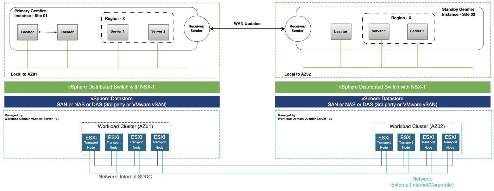

# High-Level Architecture of Tanzu GemFire Deployment

This topic outlines a high-level VMware Tanzu GemFire deployment on vSphere with WAN replication, highlighting architecture, cluster setup, and strategies for high availability and scalability across multiple regions.

## Deployment Architecture Diagram

The diagram above illustrates a Tanzu GemFire deployment on vSphere with WAN replication enabled, designed to support a highly available, fault-tolerant Active-Standby topology across two independent vSphere regions.

  

## Architecture Summary

This section provides a high-level overview of the Tanzu GemFire deployment architecture, detailing cluster setup, network and storage configuration, workload management, site-level deployment, and WAN replication for high availability.

### vSphere Clusters

  * This setup consists of two independent vSphere clusters, each representing a distinct region (Site 01 and Site 02).

  * This design ensures fault isolation, allowing workloads to remain resilient and recoverable across Availability Zones (AZs).

### Network Configuration

  * Each vSphere cluster is connected to a dedicated vSphere Distributed Switch (vDS) to manage network traffic within that region.

  * The VIP network must be stretched across Availability Zones (AZs) if the Tanzu GemFire deployment spans multiple AZs within the same region. However, extending the VIP network across regions is not required.

### Storage Considerations

  * Each cluster has its own vSphere Datastore (Block/NFS) to store workload and infrastructure data.

  * Storage is not stretched between zones, ensuring independence and reducing cross-site dependencies.

### Workload Management

  * The workload domains manage both Tanzu GemFire clusters and NSX ALB Service Engines (SEs).

  * By leveraging separate clusters, workloads benefit from isolation, scalability, and simplified management.

### Workloads and Load Balancing

  * The workloads include Tanzu GemFire VMs and NSX Advanced Load Balancer (AVI SEs) to handle traffic distribution.

  * Each region deploys its own NSX Advanced Load Balancer instance to provide L4/L7 load balancing for workloads.

### Site-Level Deployment Details

    | Feature                  | Site 01 (Primary – AZ01)                                                                 | Site 02 (Standby – AZ02)                                                       |
    |---------------------------|------------------------------------------------------------------------------------------|--------------------------------------------------------------------------------|
    | **Locators**              | Two Locator VMs for peer discovery and cluster coordination                              | One Locator VM                                                                 |
    | **Cache Servers**         | Two Cache Server VMs that host data regions and serve client requests                    | Two Cache Server VMs, mirroring the primary site’s configuration               |
    | **Gateway Components**    | Gateway Sender/Receiver to transmit region events to Site 02                         | Gateway Receiver/Sender to receive WAN updates and optionally support reverse replication |
    | **Management**            | Managed by vCenter Server-01, with compute resources via ESXi transport nodes in a dedicated Workload Cluster | Managed independently by vCenter Server-02, with its own Workload Cluster (AZ02) |

### WAN Replication and High Availability

  * Gateway Sender in Site 01 transmits region events to the Gateway Receiver in Site 02\.
  * This supports Active-Standby replication, ensuring that critical data is mirrored across regions for disaster recovery.
  * Site 02 remains on standby and can quickly become active if Site 01 experiences downtime.
  * The use of Receiver/Sender roles on both ends also supports bidirectional replication if required in future.

This architecture provides high availability, fault tolerance, and scalability by distributing workloads across independent regions, ensuring efficient network and storage management.

## Network Requirements

As per the proposed deployment architecture, all Tanzu GemFire VMs will be provisioned on VLAN-backed port groups. This setup ensures proper isolation, segmentation, and high availability across multiple regions.

For the purpose of this document, we are assuming that NSX Advanced Load Balancer (NSX ALB) will be used as the load balancer for Tanzu GemFire clusters. During failover scenarios, NSX ALB will facilitate seamless traffic redirection between active and standby Tanzu GemFire nodes.

Below is a breakdown of the recommended subnet sizing and purpose of each required network segment.

| Network | Minimum/ Recommended Subnet Requirement | Description |
| :---- | :---- | :---- |
| Tanzu GemFire Network | /24 | All Tanzu GemFire components are deployed within the same network. However, for enhanced security and improved network isolation, consider placing Locators and Cache Servers on separate networks. Depending on the use case, server groups participating in a data region can be distributed across multiple networks or port groups to support segmentation, scalability, or tenant-level isolation. |
| NSX ALB Management Network | /27 | Hosts NSX ALB controllers and the management interfaces of Service Engines (SEs). Recommended: One management network per region. Note: If the management domain is not stretched and a dedicated management domain is used per site, two separate networks must be configured, one at each site. This document does not cover scenarios with a stretched management domain in a multi-site environment. |
| VIP Network  | /28 | Used to host L4 Virtual Services such as Locators, Gateway Senders) for Tanzu GemFire WAN replication. Recommended: One network per region for redundancy. |

## Firewall Requirements

The table below lists the minimum firewall rules needed to support communication between components in the architecture.
These requirements assume all Tanzu GemFire components are on a single network; if your design uses multiple networks,
see the next section [Port Configuration for Tanzu GemFire](#port-configuration-for-tanzu-gemfire).

| Source | Destination | Protocol:Port | Description |
| ----- | ----- | ----- | ----- |
| GemFire Network NSX ALB Management Network | DNS Server/s | TCP/UDP:53 | Allow DNS resolution for GemFire and NSX ALB components. |
| GemFire Network NSX ALB Management Network | NTP Server/s | UDP:123 | Time synchronization for distributed consistency and logging. |
| NSX ALB Management Network | vCenter Server | TCP:443 | Required for NSX ALB to discover vCenter inventory and manage Service Engine lifecycle. |
| NSX ALB Management Network | AD/LDAP Servers | TCP/UDP: 389/636 | Enable authentication and directory access for NSX ALB management and user logins. |
| Developer network, Client, or App network CIDR(s) | LB Network  | TCP: 443 | Allow application access to GemFire APIs and database. |
| DB Admin  | GemFire Network | TCP:443 | Allow DB admin/platform admin to perform LCM and troubleshooting GemFire components. |

## Port Configuration for Tanzu GemFire

If your environment uses segmented or isolated networks, ensure the following port configurations are in place for Tanzu GemFire to function correctly.

| Name | Source | Destination | Protocol | Description |
| ----- | ----- | ----- | ----- | ----- |
| Cache Server Port | Client Applications | Tanzu GemFire Server | TCP | Default: 40404\. Accepts client connections and supports server-to-server communication. Configurable via XML, API, or GFSH. |
| HTTP Service Port | Admin UI, REST Clients | Tanzu GemFire Server (HTTP) | HTTP | Default: 7070\. Used for REST APIs and Pulse UI access. Must be open if HTTP-based services are used. |
| Locator Port | Cluster Members, Clients | Locator | TCP | Default: 10334\. Used for cluster discovery and client/server connection routing. Required for clients and members to locate servers. |
| Membership Port Range | Servers and Locators | Servers and Locators | TCP | Range: 41000–61000. Ephemeral ports for internal cluster communication. Must be accessible between servers and locators within and across sites. |
| Memcached Port | Memcached Clients | Tanzu GemFire Server (Memcached) | TCP | Optional. Not set by default. Must be enabled explicitly to support Memcached protocol access. |
| JMX Manager Port | Admin Tools (e.g., JConsole) | Locator / JMX Manager | RMI/TCP | Default: 1099\. Used for exposing JMX metrics to external tools for monitoring and diagnostics. |
| Internal TCP Port | Servers and Locators | Servers and Locators | TCP | Ephemeral or configured TCP port. Used for internal TCP-based messaging. Firewalls must allow the assigned ports. |
| Gateway Sender Connection | Gateway Sender (Active Site) | Gateway Receiver (Standby Site) | TCP | Uses hostname-for-senders. Defines where senders initiate WAN event transfer. |
| Remote Locator Discovery | Locator (Active Site) | Locator (Standby Site) | TCP | Uses remote-locators. Enables WAN site discovery between locators. |
| Gateway Receiver Port Range | Gateway Sender (Standby Site) | Gateway Receiver (Active Site) | TCP | Ports defined by \--start-port / \--end-port to accept WAN traffic. |

This configuration ensures that Tanzu GemFire can securely and efficiently communicate across client-server and multi-site (WAN) topologies, even in highly restricted or segmented network environments. Proper firewall rules and port allowances are essential for seamless peer discovery, data replication, and client interactions.