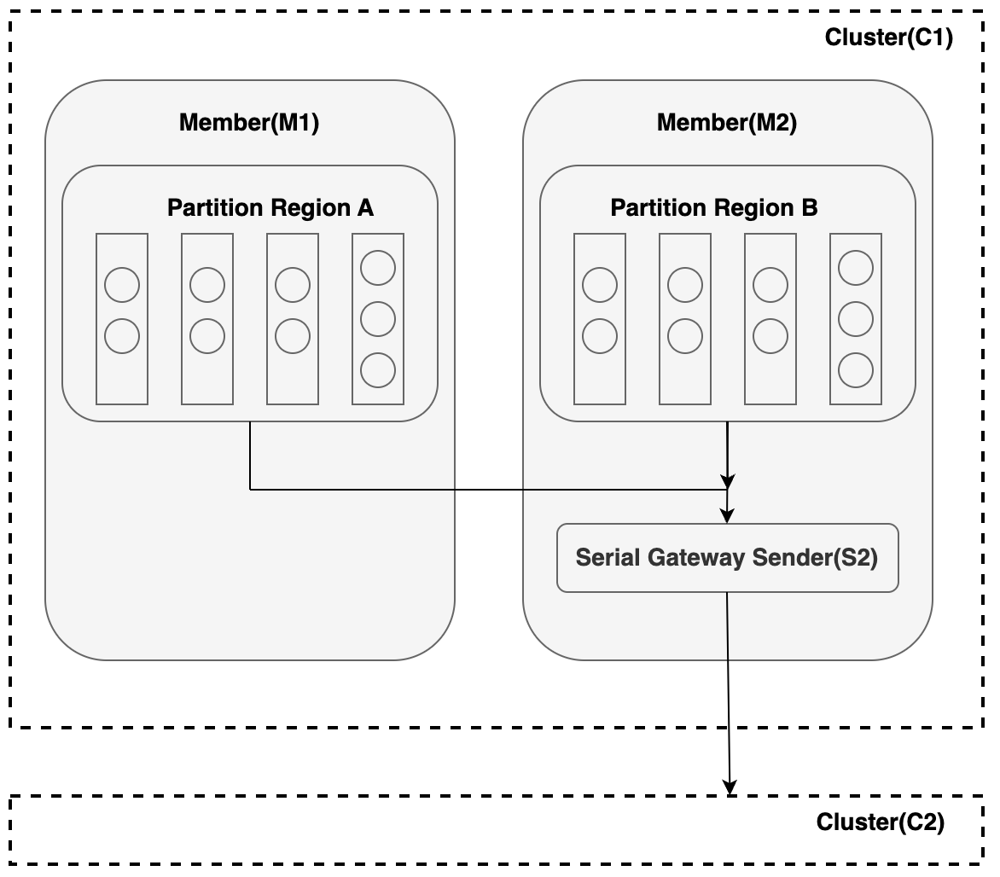

# Gateway Senders and Receivers

This topic explains VMware Tanzu GemFire Gateway Senders and Receivers, the key components for WAN replication. It covers how senders transmit region events to remote clusters, how receivers apply those events locally, and how different sender modes support scalability, ordering, and high availability.

In a WAN (Wide Area Network) configuration, Gateway Senders are the core components that enable cross-site data replication in Tanzu GemFire. These senders act as outbound data pipelines, transmitting region events from one cluster to another. On the receiving end, Gateway Receivers process those incoming events and apply changes to the appropriate regions.

You can configure:

* Multiple gateway senders to replicate data to different remote clusters.
* Parallel gateway senders to improve throughput and concurrency.
* Serial gateway senders to maintain strict event ordering.

Depending on your replication strategy, Tanzu GemFire supports two sender modes:

## Serial Gateway Senders

Serial Gateway Senders send region events through a single, ordered queue to a remote site. This ensures that events are delivered in the exact order they were created, which is important when the sequence of updates matters. However, since all events go through one queue, performance may slow down under heavy load. To improve scalability, you can assign different regions to separate serial senders. This spreads the load while still keeping the correct event order within each region.

## Parallel Gateway Senders

Parallel Gateway Senders allow each server that hosts a partitioned region to send its own events to a remote site using a dedicated queue. This enables concurrent replication, making the setup highly scalable for high-throughput use cases where preserving event order across partitions is not required. As you add more servers, both storage and replication capacity increase with minimal additional configuration.

## High Availability

High availability is built into the Tanzu GemFire WAN architecture. With serial gateway senders, only one primary sender is active at a time, while backup instances stand by. If the primary fails, Tanzu GemFire automatically promotes a secondary without disrupting replication. Parallel senders offer even greater resilience. Each server with a primary partition sends events independently, and if a server fails, a redundant partition owner takes over seamlessly, preserving continuous replication and fault tolerance.

## Gateway Receiver

A Gateway Receiver in Tanzu GemFire is a server-side component that listens for incoming region events from remote clusters and applies them to local regions. Each member can host one receiver. Multiple receivers across a cluster enable load balancing and high availability. Senders connect automatically to any available receiver without explicit bindings, and connections can be rebalanced using the `rebalance gateway-sender` command or the `GatewaySender.rebalance()` API. For successful replication, both clusters must have matching region definitions. If a region is missing on the receiving side, incoming events will fail. Gateway Receivers play a vital role in completing the WAN replication flow by ensuring seamless and distributed data ingestion across sites.

