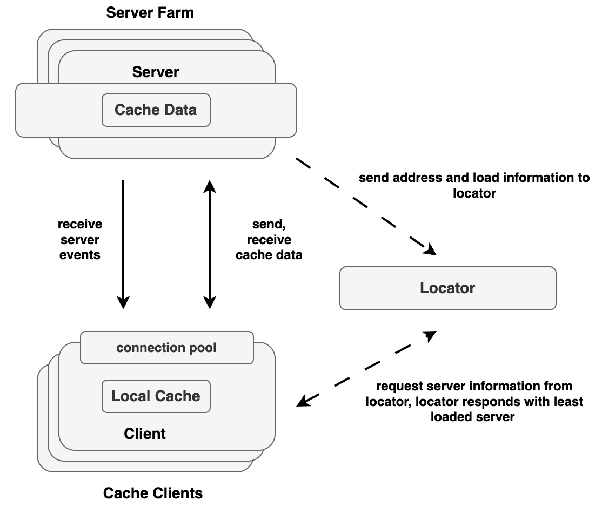

# Introduction to Tanzu GemFire

VMware GemFire is a high-performance in-memory data grid that enables applications to access and process large amounts of data with ultra-low latency. Designed for real-time transactional and analytical workloads, it ensures fast data access, fault tolerance and scalability across distributed environments. By keeping data in memory instead of relying on traditional disk storage, GemFire significantly speeds up processing times, making it ideal for industries like finance, e-commerce, where real-time insights and rapid decision-making are crucial.

One of the most powerful features of VMware GemFire is its ability to replicate and distribute data across multiple nodes, ensuring high availability and resilience. It supports multi-region replication (WAN) and primary-standby setups, allowing businesses to maintain synchronized data across different locations. This ensures business continuity and disaster recovery, even in the event of network failures. GemFire’s partitioned regions allow large datasets to be efficiently spread across multiple servers, making horizontal scaling seamless and efficient.

## Key Components of Tanzu GemFire

Tanzu GemFire is an in-memory, distributed data grid that provides high-performance data storage, real-time querying and seamless scalability.

This diagram illustrates the architecture of a Tanzu GemFire distributed system, showcasing the interaction between cache clients, servers and locators. The cache clients maintain a local cache and connect to the server farm, where multiple GemFire servers store and manage distributed cache data. The locator plays a crucial role in load balancing and discovery, as it keeps track of active servers and directs clients to the least-loaded server. Clients request server information from the locator, which responds with optimal server details. Once connected, clients send and receive cache data while also receiving server events. The servers, in turn, share address and load information with the locator to ensure efficient client routing and system scalability.

**Note**: In GemFire, a member refers to any process locator, server, or client that participates in the distributed system. Members collaborate to manage data, distribute load, and maintain cluster state through coordinated communication.

* Locators**

  * Locators help with member discovery and load balancing within a Tanzu GemFire cluster.

  * Clients connect to a list of locators, which dynamically maintain a list of active servers for efficient request routing.
    For more information on Locators refer: [Locators](#locators)

* Servers**

  * Store and manage data, execute queries, and handle transactions.

  * Participate in distributed caching and data partitioning.

  * Can be scaled horizontally to improve performance and ensure high availability.

    For more information on Servers refer: [Servers](#server)

* Gateway Sender and Receiver**

  * Enable cross-cluster data replication in Tanzu GemFire WAN deployments.

  * Gateway Senders queue and transmit region events to remote clusters, while Gateway Receivers accept and apply those events to local regions.

  * They support serial and parallel modes to balance between event ordering and throughput.

  * Together, they enable real-time data synchronization, disaster recovery, and multi-site availability across geographically distributed environments.

    For more information refer: [Gateway Sender and Receiver](#gateway-senders-and-receivers)

* Management and Monitoring tools**

  * Tanzu GemFire provides several tools for administration and monitoring:

    * gfsh (GemFire Shell)**

      * Command-line tool for managing Tanzu GemFire applications.

      * Supports scripting, debugging, and administration.

      * Can execute commands from within applications.

    * Tanzu GemFire Pulse**

      * Web-based UI for monitoring deployments.

      * Provides an integrated view of all cluster members.
        **Note**: Tanzu GemFire 10.1 deprecates Pulse in favor of the VMware Tanzu GemFire Management Console, which will replace it in a future release.

    * Pulse Data Browser**

      * A visual tool for executing OQL queries on Tanzu GemFire data.
        **Note:** In Tanzu GemFire 10.1, Pulse is deprecated and has been integrated into the VMware Tanzu GemFire Management Console. Pulse is scheduled to be removed in a future release.

  * Tanzu GemFire Management Console**

    * Gain full visibility and control over multiple clusters through a unified UI. Easily monitor cluster health, visualize topology, configure regions, and manage disk stores for streamlined operations.

    * Accelerate deployment and troubleshooting with the ability to deploy or remove JAR files, execute functions, access a web-based GemFire Shell (gfsh), manage gateways and senders and quickly search and review cluster logs.

  * For more information, refer to the [official Tanzu GemFire documentation.](https://techdocs.broadcom.com/us/en/vmware-tanzu/data-solutions/tanzu-gemfire/10-0/gf/managing-management-mm_overview.html)

## Key Features of Tanzu GemFire**

* High Read-and-Write Throughput: Tanzu GemFire supports high throughput with fast data access, concurrent memory structures and optimized distribution. Data can be replicated or partitioned across systems to improve read and write speeds. This setup boosts overall throughput, with limits only dependent on network capacity.

* Low and Predictable Latency:: With a streamlined caching layer, Tanzu GemFire minimizes delays by reducing context switches between threads. Data is efficiently distributed, and subscription management ensures better CPU and bandwidth usage, resulting in faster response times and lower latency.

* High Scalability: Tanzu GemFire can scale easily by distributing data across multiple servers, ensuring balanced load and consistent performance. As demand grows, the system can dynamically add servers, manage data copies, and handle bursts of traffic without sacrificing response time.

* Continuous Availability: Tanzu GemFire ensures high availability with data replication and failover mechanisms. Data can be saved on disk synchronously or asynchronously, and if a server fails, another takes over to ensure continuous service without data loss or interruptions.

* Reliable Event Notifications: Tanzu GemFire provides a reliable publish/subscribe system that ensures events are delivered with the related data to subscribers. This eliminates the need for separate database access, offering faster, more efficient event processing.

* Parallelized Application Behavior on Data Stores: You can execute business logic across multiple system members, improving efficiency by processing data where it is stored. This reduces network traffic and speeds up calculations, making operations faster, especially for data-heavy tasks.

* Shared-Nothing Disk Persistence: Each Tanzu GemFire member manages its own data storage, ensuring that disk or cache failures in one member don’t affect others. This “shared nothing” approach increases performance and reliability by isolating disk management.

* Reduced Cost of Ownership: With tiered caching, Tanzu GemFire reduces costs by using local memory caches and minimizing the need for frequent database access. This lowers overall transaction costs and improves efficiency by avoiding costly database operations.

* Single-Hop Capability for Client/Server: Tanzu GemFire allows clients to directly access the server holding their data, avoiding multiple hops. This improves performance by making data access quicker and more efficient.

* Client/Server Security: Each user in a client application is given access to a specific subset of data, enhancing security and control. Users are authenticated with their own credentials, ensuring data privacy and proper access levels across the system.

* Multisite Data Distribution: Tanzu GemFire supports data distribution across geographically dispersed sites. Using gateway sender configurations, the system ensures reliable communication between data centers, allowing scalability without sacrificing performance or data consistency.

* Continuous Querying: Tanzu GemFire allows complex queries to run continuously, enabling real-time data updates for applications. This is achieved through Object Query Language, which simplifies querying for dynamic, real-time data processing.

* Heterogeneous Data Sharing: Applications written in different languages (C\#, C++, Java) can share business objects seamlessly without needing complex transformation layers. Changes in one application automatically trigger updates in others, facilitating smooth integration between different platforms.

## Supported Platforms for Tanzu GemFire

Tanzu GemFire production systems can be run on the following platforms:

* Linux: Recent versions with kernel 4.18 or higher.

* Windows Server: Versions including 2012 R2, 2016, 2019, and 2022\.

For cloud environments, you can run VMware Tanzu GemFire on:

* Amazon Web Services (AWS)

* Microsoft Azure

* Google Cloud Platform

* Tanzu Application Service (TAS)

* Kubernetes

For development environments, VMware Tanzu GemFire is supported on:

* macOS

* Windows 10 and Windows 11