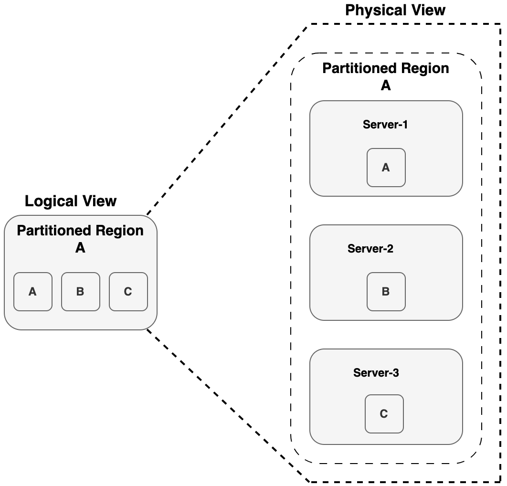
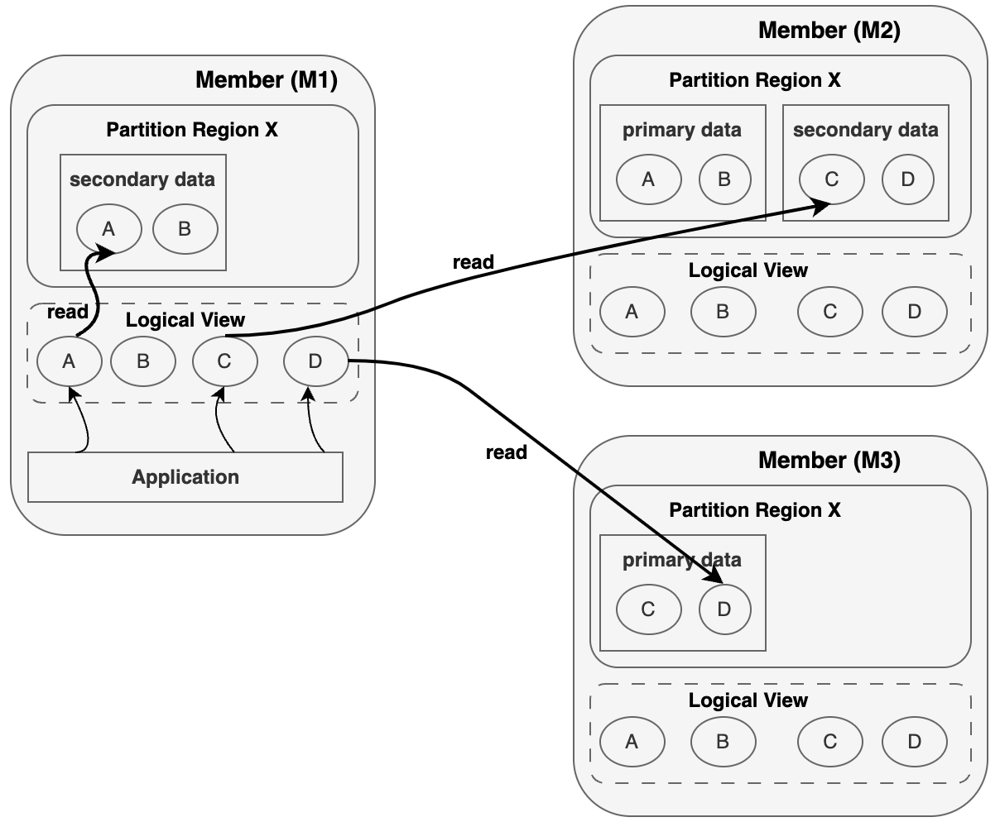
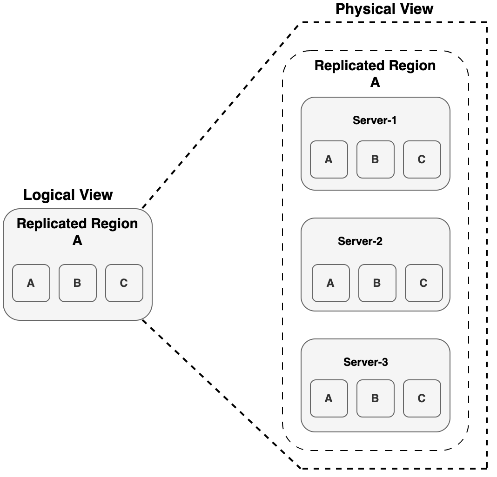

# Regions

This topic introduces VMware Tanzu GemFire regions, explaining how partitioned and replicated regions manage data across servers for scalability, high availability, and performance.

A region in Tanzu GemFire is a distributed, in-memory data structure similar to a map. Cache servers host regions, which store and serve your application’s data.
There are two primary types of regions, based on how data is distributed across servers:

## Partitioned Region

A Partitioned Region divides its data across multiple servers in the cluster. Each server holds only a subset (or partition) of the data, and optionally, redundant copies of other partitions for fault tolerance.

To the application, this partitioned structure is invisible. The region appears as a single logical dataset, accessible in full from any member even if that member stores only part of the data locally. For each server where the region is defined, you can configure how much memory it uses. A server can also host the region with no local data, acting purely as a read/write proxy.

A single cluster can host multiple partitioned regions, and servers can host multiple regions simultaneously. Partitioned and replicated regions can also coexist in the same cluster.

### Summary: Partitioned Region

* Data is divided (partitioned) across multiple servers.
* Can support data redundancy with backup copies.
* Scales well for large datasets and write-heavy workloads.

Other variations exist such as `PARTITION\_PERSISTENT, REPLICATE\_PERSISTENT, LOCAL`, but they are all based on these two fundamental designs.

### High Availability for Partitioned Regions

In a highly available partitioned region, each member (server) holds a mix of primary and secondary (redundant) data copies to ensure continuous operation even if a member fails. If a server hosting a primary copy fails, Tanzu GemFire automatically promotes a secondary copy to primary, avoiding service interruption. While this temporarily reduces redundancy, no data is lost. The system restores redundancy by copying the data to another available member. However, if too many members fail within a short time, there is still a risk of data loss despite redundancy being enabled.

### Read and Write Behavior in HA Regions

Tanzu GemFire handles reads and writes differently in partitioned regions with redundancy:

* Read Operations: Tanzu GemFire first attempts to read from the local cache if the data is available. If not, it retrieves the data from another member that holds a copy, typically chosen at random. This approach supports efficient scaling for read-heavy workloads across multiple members.
  For example, in the figure below, M1 is reading keys A, C, and D. It retrieves A from its local cache, while C and D are fetched from other members that hold those keys, selected at random.
  

* Write Operations (put/create): Write requests are directed to the primary copy of the key. The data is then synchronously replicated to all designated secondary copies. Additionally, events are delivered to clients according to their configured subscription attributes.

This approach enables high availability and strong consistency without sacrificing performance.

## Replicated Regions

A Replicated Region ensures that every server that hosts the region contains a full copy of the data. When an entry is created or updated in one server, that change is automatically propagated to all other servers hosting that region.

This model provides strong availability and fast reads, since every hosting server has a complete view of the dataset. However, it’s best suited for smaller datasets, as replicating large data across many servers can consume memory and bandwidth.

### Summary: Replicated Regions

* The entire dataset is replicated across all hosting members.
* Provides high availability and low-latency reads.
* Suitable for read-heavy or globally needed datasets.
* Best for small to medium-sized data.

All region types in Tanzu GemFire are based on Partitioned or Replicated modes, with added capabilities. Some common variants include:

* PARTITION\_PERSISTENT: Partitioned region with disk persistence.
* REPLICATE\_PERSISTENT: Replicated region with disk persistence.
* LOCAL: Region is confined to one server, not distributed.
  For more information on Region refer: [Creating Regions in Tanzu GemFire](#creating-regions-in-tanzu-gemfire)

## Best Practices for Cache Servers

* Design region types based on data volume and access patterns.
* Use redundant partitioned regions for high availability and scalability.
* Monitor heap usage and configure eviction policies to prevent memory overuse.
* Enable JMX metrics and statistics for observability and performance tuning.
* In production, run servers on dedicated nodes; avoid co-locating with locators unless in test or dev environments.

A Tanzu GemFire Cache Server is where your data lives and operates. Each server joins as a member, connects via locators, and hosts one or more regions which are the primary interface for your application’s data.