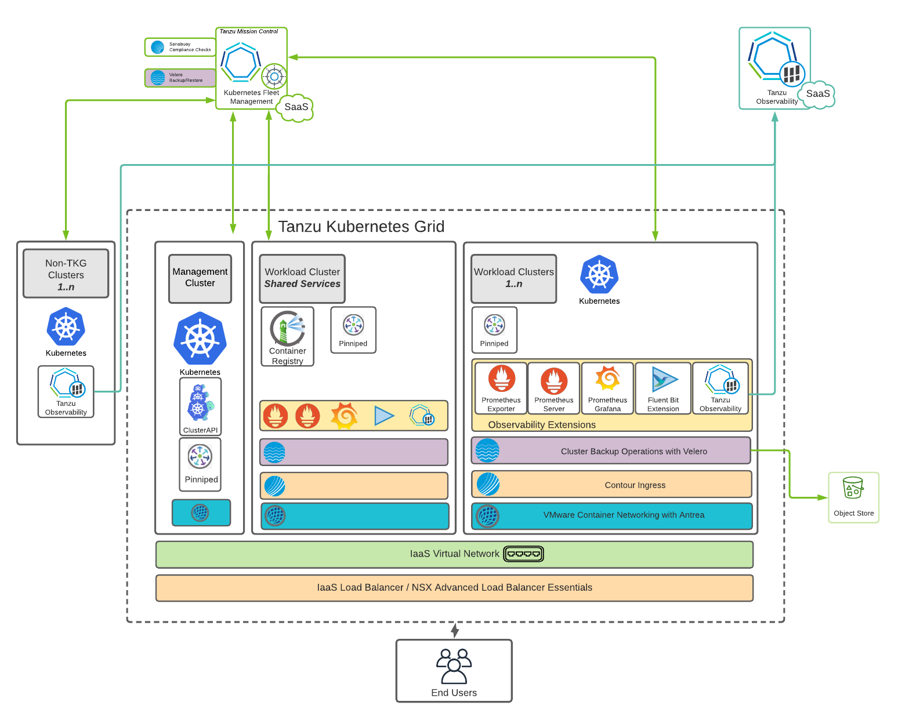

# VMware Tanzu for Kubernetes Operations Reference Architecture 1.6

Kubernetes is a great platform that provides development teams with a single API to deploy, manage, and run applications. However, running, maintaining, and securing Kubernetes is a complex task. VMware Tanzu for Kubernetes Operations simplifies Kubernetes operations. It determines what base OS instances to use, which Kubernetes Container Network Interface (CNI) and Container Storage Interfaces (CSI) to use, how to secure the Kubernetes API, and much more.  It monitors, upgrades, and backs up clusters and helps teams provision, manage, secure, and maintain Kubernetes clusters on a day-to-day basis.

**Note:** This reference architecture is tested to work with Tanzu Kubernetes Grid 1.6. This reference architecture will be refreshed shortly to capture new features and capabilities introduced in Tanzu Kubernetes Grid 1.6.

The following diagram provides a high-level reference architecture for deploying the components available with Tanzu for Kubernetes Operations as a solution.

The reference architecture documentation provides several reference designs and the instructions for deploying the reference designs. The reference designs are based on the high-level reference architecture and they are tailored for deploying Tanzu for Kubernetes Operations on your IaaS or infrastructure of choice.

The reference architecture and the reference designs are tested and supported by VMware.

## Components
The following components are used in the reference architecture:

**[VMware Tanzu Kubernetes Grid](https://docs.vmware.com/en/VMware-Tanzu-Kubernetes-Grid/index.html)** - Enables creation and lifecycle management operations of Kubernetes clusters.  

**[vSphere with Tanzu](https://www.vmware.com/in/products/vsphere/vsphere-with-tanzu.html)** - Transforms vSphere into a platform for running Kubernetes workloads natively on the hypervisor layer. When enabled on a vSphere cluster, vSphere with Tanzu provides the capability to run Kubernetes workloads directly on ESXi hosts and to create upstream Kubernetes clusters within dedicated resource pools.

**[VMware Tanzu Mission Control](https://docs.vmware.com/en/VMware-Tanzu-Mission-Control/index.html)** - Provides a global view of Kubernetes clusters and allows for centralized policy management across all deployed and attached clusters.  

**[VMware Tanzu Observability by Wavefront](https://docs.wavefront.com)** - Provides a centralized management platform for consistently operating and securing your Kubernetes infrastructure and modern applications across multiple teams and clouds.

**[VMware Tanzu Service Mesh](https://docs.vmware.com/en/VMware-Tanzu-Service-Mesh/index.html)** - Provides consistent control and security for microservices, end users, and data, across all your clusters and clouds.

**[VMware NSX Advanced Load Balancer Enterprise Edition](https://docs.vmware.com/en/VMware-NSX-Advanced-Load-Balancer/index.html)** - Provides layer 4 service type load balancer support. NSX Advanced Load Balancer is recommended for vSphere deployments without NSX-T, or which have unique scale requirements.  

**[Pinniped](https://docs.vmware.com/en/VMware-Tanzu-Kubernetes-Grid/1.4/vmware-tanzu-kubernetes-grid-14/GUID-mgmt-clusters-enabling-id-mgmt.html)** - Provides identity services to Kubernetes. It is an authentication service for Kubernetes to set up integration with identity providers such as OKTA, Dex, and LDAP.

**[User-managed packages](https://docs.vmware.com/en/VMware-Tanzu-Kubernetes-Grid/1.6/vmware-tanzu-kubernetes-grid-16/GUID-packages-user-managed-index.html)** - Provides in-cluster and shared services to the Kubernetes clusters that are running in your Tanzu Kubernetes Grid environment.

* **[Cert Manager](https://docs.vmware.com/en/VMware-Tanzu-Kubernetes-Grid/1.6/vmware-tanzu-kubernetes-grid-16/GUID-packages-cert-manager.html)** - Provides automated certificate management. It runs by default in management clusters.
* **[Contour](https://docs.vmware.com/en/VMware-Tanzu-Kubernetes-Grid/1.6/vmware-tanzu-kubernetes-grid-16/GUID-packages-ingress-contour.html)** - Provides layer 7 ingress control to deployed HTTP(S) applications. Tanzu Kubernetes Grid includes signed binaries for Contour. Deploying Contour is a prerequisite for deploying the Prometheus, Grafana, and Harbor extensions.
* **[ExternalDNS](https://docs.vmware.com/en/VMware-Tanzu-Kubernetes-Grid/1.6/vmware-tanzu-kubernetes-grid-16/GUID-packages-external-dns.html)** - Publishes DNS records for applications to DNS servers. It uses a declarative Kubernetes-native interface.
* **[Fluent Bit](https://docs.vmware.com/en/VMware-Tanzu-Kubernetes-Grid/1.6/vmware-tanzu-kubernetes-grid-16/GUID-packages-logging-fluentbit.html)** - Collects data and logs from different sources, unifies them, and sends them to multiple destinations. Tanzu Kubernetes Grid includes signed binaries for Fluent Bit.
* **[Prometheus](https://docs.vmware.com/en/VMware-Tanzu-Kubernetes-Grid/1.6/vmware-tanzu-kubernetes-grid-16/GUID-packages-monitoring.html)** - Provides out-of-the-box health monitoring of Kubernetes clusters. The Tanzu Kubernetes Grid implementation of Prometheus includes Alert Manager.  You can configure Alert Manager to notify you when certain events occur.
* **[Grafana](https://docs.vmware.com/en/VMware-Tanzu-Kubernetes-Grid/1.6/vmware-tanzu-kubernetes-grid-16/GUID-packages-monitoring.html)** - Provides monitoring dashboards for displaying key health metrics of Kubernetes clusters. Tanzu Kubernetes Grid includes an implementation of Grafana.   
* **[Harbor Image Registry](https://docs.vmware.com/en/VMware-Tanzu-Kubernetes-Grid/1.6/vmware-tanzu-kubernetes-grid-16/GUID-packages-harbor-registry.html)** - Provides a centralized location to push, pull, store, and scan container images used in Kubernetes workloads. It supports storing artifacts such as Helm Charts and includes enterprise-grade features such as RBAC, retention policies, automated garbage cleanup, and docker hub proxying.
* **[Multus CNI](https://docs.vmware.com/en/VMware-Tanzu-Kubernetes-Grid/1.6/vmware-tanzu-kubernetes-grid-16/GUID-packages-cni-multus.html)** - Enables attaching multiple network interfaces to pods. Multus CNI is a container network interface (CNI) plugin for Kubernetes that lets you attach multiple network interfaces to a single pod and associate each with a different address range.  
