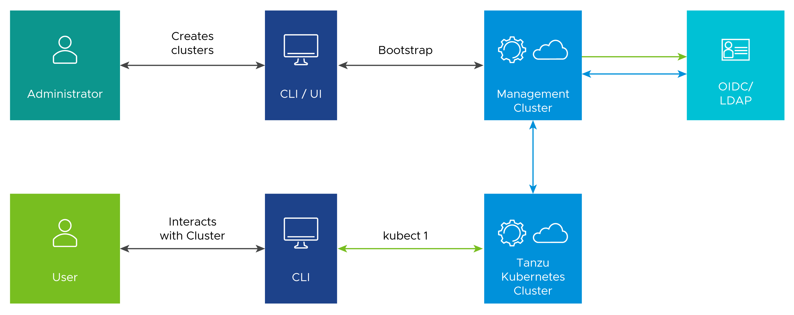

# Authentication with Pinniped

Tanzu Kubernetes Grid implements user authentication with [Pinniped](https://pinniped.dev/), an open-source authentication service for Kubernetes clusters. Pinniped allows you to plug external OpenID Connect (OIDC) or LDAP identity providers (IdP) into Tanzu Kubernetes (workload) clusters so that you can control user access to those clusters.

- For LDAP authentication, Pinniped uses [Dex](https://github.com/dexidp/dex/blob/master/README.md) as the endpoint to connect to your upstream LDAP IdP.
- If you use OIDC, Pinniped provides its own endpoint, so Dex is not required. 

Pinniped and Dex run automatically as in-cluster services in your management clusters if you enable identity management. For instructions on how to enable identity management in Tanzu Kubernetes Grid, see [Configure Identity Management](https://docs.vmware.com/en/VMware-Tanzu-Kubernetes-Grid/1.5/vmware-tanzu-kubernetes-grid-15/GUID-iam-configure-id-mgmt.html).

## Authentication Flow

The authentication flow between the management and workload clusters includes the following:

- The Tanzu Kubernetes Grid administrator enables and configures identity management on the management cluster, specifying an external LDAP or OIDC IdP.
- Authentication service components are deployed into the management cluster, using the LDAP or OIDC IdP details specified by the administrator.
- The administrator creates a Tanzu Kubernetes (workload) cluster. The workload cluster inherits the authentication configuration from the management cluster.
- The administrator creates a role binding to associate a given user with a given role on the workload cluster.
- The administrator provides the `kubeconfig` for the workload cluster to the user.
- A user uses the `kubeconfig` to connect to the workload cluster, for example, by running kubectl get pods `--kubeconfig`.
- The management cluster authenticates the user with the IdP.
- The workload cluster either allows or denies the kubectl get pods request, depending on the permissions of the user’s role.

In the following image, the blue arrows represent the authentication flow between the workload cluster, the management cluster, and the external IdP. The green arrows represent Tanzu CLI and kubectl traffic between the workload cluster, the management cluster, and the external IdP.

We recommend the following best practices for managing identities in Tanzu Kubernetes Grid provisioned clusters:

- Configure Pinniped services during management cluster creation.
- Limit access to management clusters to the appropriate set of users. For example, provide access only to users who are responsible for managing infrastructure and cloud resources but not to application developers. This is especially important because access to the management cluster inherently provides access to all workload clusters.
- Limit cluster administrator access for workload clusters to the appropriate set of users. For example, provide access to users who are responsible for managing infrastructure and platform resources in your organization, but not to application developers.
- Connect to an [identity provider](https://csrc.nist.gov/glossary/term/identity_provider) to manage the user identities allowed to access cluster resources instead of relying on administrator-generated `kubeconfig` files.
