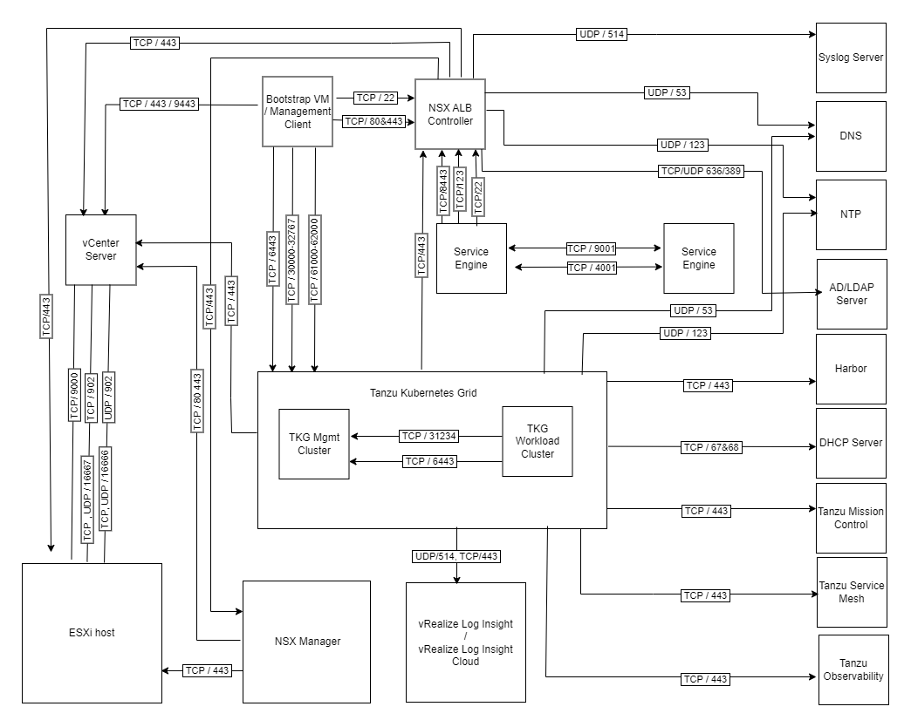

# VMware Tanzu for Kubernetes Operations Ports Requirement

Kubernetes is a great platform that provides development teams with a single API to deploy, manage, and run applications. However, running, maintaining, and securing Kubernetes is a complex task. VMware Tanzu for Kubernetes Operations (informally known as TKO) simplifies Kubernetes operations. It determines what base OS instances to use, which Kubernetes Container Network Interface (CNI) and Container Storage Interfaces (CSI) to use, how to secure the Kubernetes API, and much more. It monitors, upgrades, and backs up clusters and helps teams provision, manage, secure, and maintain Kubernetes clusters on a day-to-day basis.

The following diagram provides a high-level ports requirement for deploying the components available with Tanzu for Kubernetes Operations as a solution.

