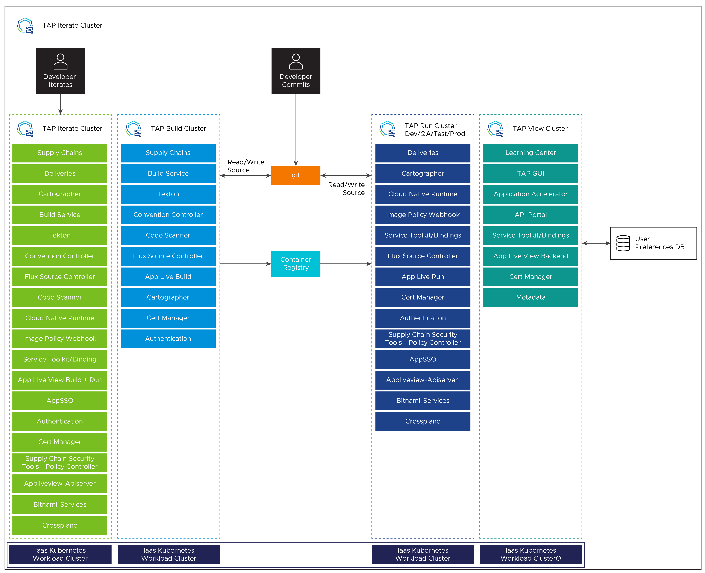
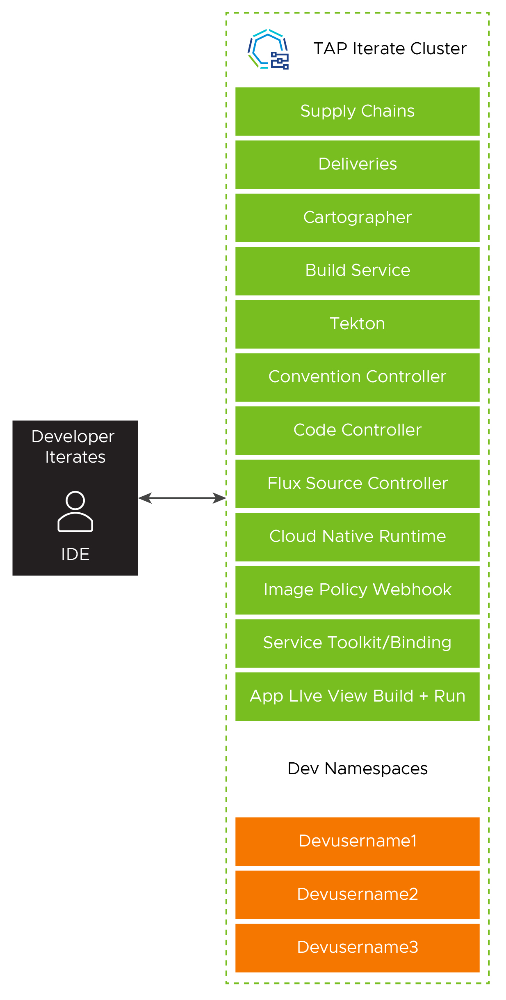
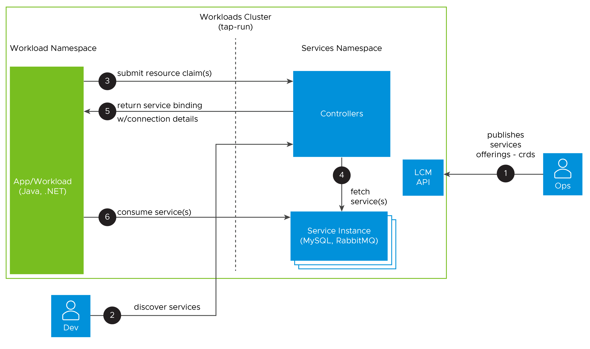
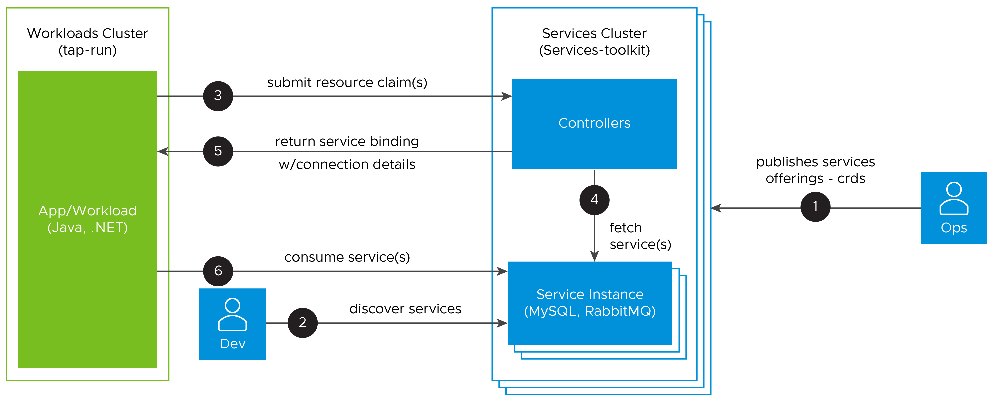
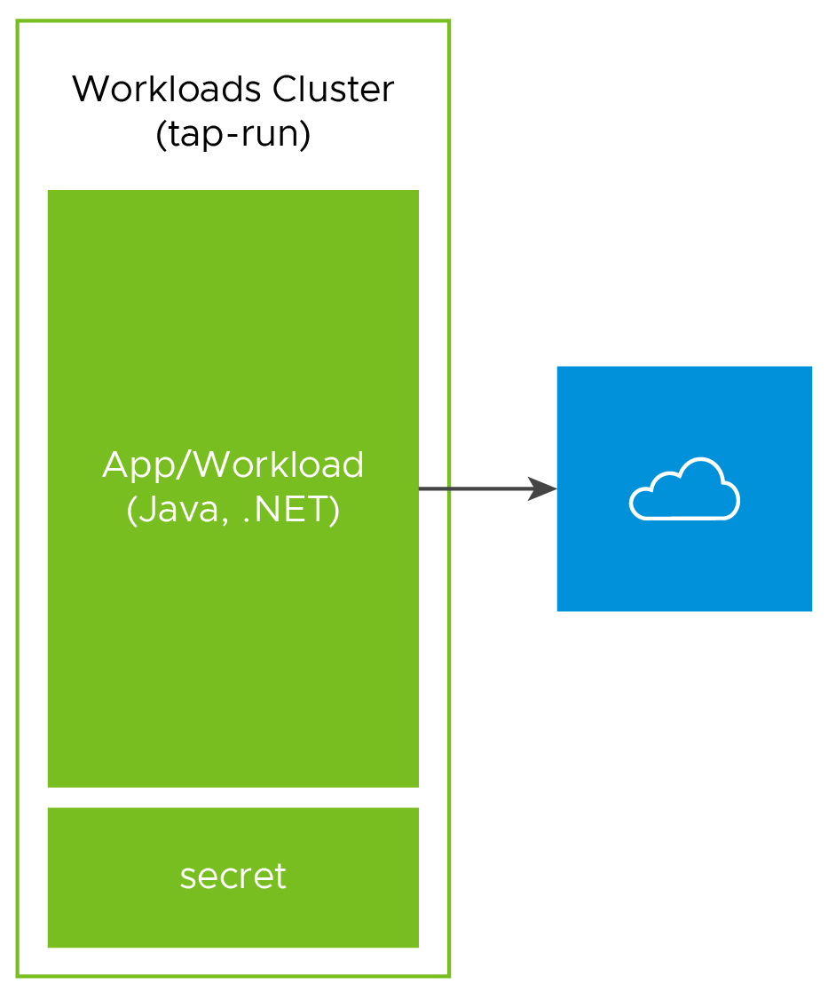

# Architecture Overview

This architecture gives you a path to creating a production deployment of Tanzu Application Platform 1.5. However, do not feel constrained to follow this exact path if your specific use cases warrant a different architecture.

Design decisions enumerated in this document exemplify the main design issues you will encounter in planning your Tanzu Application Platform environment and the rationale behind a chosen solution path. Understanding these decisions can help provide a rationale for any necessary deviation from this architecture.




## Cluster Layout

For production deployments, VMware recommends two fully independent instances of Tanzu Application Platform. One instance for operators to conduct their own reliability tests, and the other instance hosts development, test, QA, and production environments isolated by separate clusters.

| Decision ID   | Design Decision   | Justification | Implication
|---            |---                |---            |---
|TAP-001  | Install using multiple clusters.         |  Utilizing multiple clusters allows you to separate your workloads and environments while still leveraging combined build infrastructure.   |  Multiple cluster design requires more installation effort and possibly more maintenance versus a single cluster design.
|TAP-002  | Create an operator sandbox environment.  |  An operator sandbox environment allows platform operators to test upgrades and architectural changes before introducing them to production. |  An operator sandbox requires additional computer resources.
|TAP-003  | Utilize a single Build Cluster and multiple Run Clusters  | Utilizing a single Build Cluster with multiple Run Clusters creates the correct production environment for the build system vs separating into dev/test/qa/prod build systems. Additionally, a single Build Cluster ensures that the container image does not change between environments.  A single Build Cluster is also easier to manage than separate components. |  *Changes lower environments are not as separated as having separate build environments.*
|TAP-004  | Utilize a View Cluster  | Utilizing a single View Cluster with multiple Run Clusters creates the correct production perception for the common systems like learning portal, GUI, app resource monitoring, etc. |  None

## Build Cluster Requirements

The Build Cluster is responsible for taking a developer's source code commits and applying a supply chain that will produce a container image and Kubernetes manifests for deploying on a Run Cluster.

The Kubernetes Build Cluster will see bursty workloads as each build or series of builds kicks off. The Build Cluster will see very high pod scheduling loads as these events happen. The amount of resources assigned to the Build Cluster will directly correlate to how quickly parallel builds are able to be completed.

### Kubernetes Requirements - Build Cluster

* Supported Kubernetes versions are 1.24,1.25,1.26.
* Default storage class.
* At least 16 GB available memory that is allocatable across clusters, with at least 8 GB per node.
* Logging is enabled and targets the desired application logging platform.
* Monitoring is enabled and targets the desired application observability platform.
* Container Storage Interface (CSI) Driver is installed.


### Recommendations - Build Cluster

* Spread across three availability zones (AZs) for high availability.


The Build Cluster includes the following packages (exact list may differ based on supply chain choice):
```
buildservice.tanzu.vmware.com
cartographer.tanzu.vmware.com
cert-manager.tanzu.vmware.com
contour.tanzu.vmware.com
controller.conventions.apps.tanzu.vmware.com
controller.source.apps.tanzu.vmware.com
conventions.appliveview.tanzu.vmware.com
fluxcd.source.controller.tanzu.vmware.com
grype.scanning.apps.tanzu.vmware.com
namespace-provisioner.apps.tanzu.vmware.com 
ootb-supply-chain-testing-scanning.tanzu.vmware.com
ootb-templates.tanzu.vmware.com
scanning.apps.tanzu.vmware.com
spring-boot-conventions.tanzu.vmware.com
tap-auth.tanzu.vmware.com
tap-telemetry.tanzu.vmware.com
tap.tanzu.vmware.com
tekton.tanzu.vmware.com

```
To install a Build Cluster, use the following `build` profile template:
```yaml
profile: build
ceip_policy_disclosed: FALSE-OR-TRUE-VALUE # Installation fails if this is not set to true. Not a string.

shared:
  ingress_domain: "INGRESS-DOMAIN"
  kubernetes_distribution: "openshift" # To be passed only for Openshift. Defaults to "".
  kubernetes_version: "K8S-VERSION"
  image_registry:
    project_path: "SERVER-NAME/REPO-NAME" # To be used by Build Service by appending "/buildservice" and used by Supply chain by appending "/workloads".
    secret:
      name: "KP-DEFAULT-REPO-SECRET"
      namespace: "KP-DEFAULT-REPO-SECRET-NAMESPACE"
  ca_cert_data: | # To be passed if using custom certificates.
    -----BEGIN CERTIFICATE-----
    MIIFXzCCA0egAwIBAgIJAJYm37SFocjlMA0GCSqGSIb3DQEBDQUAMEY...
    -----END CERTIFICATE-----

# The above shared keys can be overridden in the below section.

buildservice:
# Takes the value from the shared section by default, but can be overridden by setting a different value.
  kp_default_repository: "KP-DEFAULT-REPO"
  kp_default_repository_secret:
    name: "KP-DEFAULT-REPO-SECRET"
    namespace: "KP-DEFAULT-REPO-SECRET-NAMESPACE"
supply_chain: testing_scanning
ootb_supply_chain_testing_scanning: # Optional if the corresponding shared keys are provided.
  registry:
    server: "SERVER-NAME"
    repository: "REPO-NAME"
  gitops:
    ssh_secret: "SSH-SECRET-KEY" # (Optional) Defaults to "".
grype:
  namespace: "MY-DEV-NAMESPACE" # (Optional) Defaults to default namespace.
  targetImagePullSecret: "TARGET-REGISTRY-CREDENTIALS-SECRET"
  metadataStore:
    url: METADATA-STORE-URL-ON-VIEW-CLUSTER
    caSecret:
        name: store-ca-cert
        importFromNamespace: metadata-store-secrets
    authSecret:
        name: store-auth-token
        importFromNamespace: metadata-store-secrets
scanning:
  metadataStore: {} # Deactivate the Supply Chain Security Tools - Store integration.
tap_telemetry:
  customer_entitlement_account_number: "CUSTOMER-ENTITLEMENT-ACCOUNT-NUMBER" # (Optional) Identify data for creating Tanzu Application Platform usage reports.
 ```

## Run Cluster Requirements

The Run Cluster reads the container image and Kubernetes resources created by the Build Cluster and runs them as defined in the `Deliverable` object for each application.

The Run Cluster's requirements are driven primarily by the applications that it will run.  Horizontal and vertical scale is determined based on the type of applications that will be scheduled.

### Kubernetes Requirements - Run Cluster

* Supported Kubernetes versions are 1.24,1.25,1.26.
* LoadBalancer for ingress controller (requires 1 external IP address).
* Default storage class.
* At least 16 GB available memory that is allocatable across clusters, with at least 16 GB per node.
* Logging is enabled and targets the desired application logging platform.
* Monitoring is enabled and targets the desired application observability platform.
* Container Storage Interface (CSI) Driver is installed.
* A subdomain for the host name that you point at the tanzu-shared-ingress service’s external IP address.

### Recommendations - Run Cluster

* Spread across three AZs for high availability.

The Run Cluster includes the following packages:
```
apis.apps.tanzu.vmware.com 
apiserver.appliveview.tanzu.vmware.com 
bitnami.services.tanzu.vmware.com
cartographer.tanzu.vmware.com
cert-manager.tanzu.vmware.com
cnrs.tanzu.vmware.com
connector.appliveview.tanzu.vmware.com
contour.tanzu.vmware.com
controller.source.apps.tanzu.vmware.com
crossplane.tanzu.vmware.com 
eventing.tanzu.vmware.com 
fluxcd.source.controller.tanzu.vmware.com
image-policy-webhook.signing.apps.tanzu.vmware.com
namespace-provisioner.apps.tanzu.vmware.com
ootb-delivery-basic.tanzu.vmware.com
ootb-templates.tanzu.vmware.com
policy.apps.tanzu.vmware.com 
sso.apps.tanzu.vmware.com
service-bindings.labs.vmware.com
services-toolkit.tanzu.vmware.com
tap-auth.tanzu.vmware.com
tap-telemetry.tanzu.vmware.com
tap.tanzu.vmware.com

```

To install a Run Cluster, use the following `run` profile template:
```yaml
profile: run
ceip_policy_disclosed: FALSE-OR-TRUE-VALUE # Installation fails if this is not set to true. Not a string.

shared:
  ingress_domain: INGRESS-DOMAIN
  kubernetes_distribution: "openshift" # To be passed only for Openshift. Defaults to "".
  kubernetes_version: "K8S-VERSION"
  ca_cert_data: | # To be passed if using custom certificates.
    -----BEGIN CERTIFICATE-----
    MIIFXzCCA0egAwIBAgIJAJYm37SFocjlMA0GCSqGSIb3DQEBDQUAMEY...
    -----END CERTIFICATE-----
supply_chain: basic

contour:
  envoy:
    service:
      type: LoadBalancer # NodePort can be used if your Kubernetes cluster doesn't support LoadBalancing.

appliveview_connector:
  backend:
    sslDeactivated: TRUE-OR-FALSE-VALUE
    ingressEnabled: true
    host: appliveview.VIEW-CLUSTER-INGRESS-DOMAIN

tap_telemetry:
  customer_entitlement_account_number: "CUSTOMER-ENTITLEMENT-ACCOUNT-NUMBER" # (Optional) Identify data for creating Tanzu Application Platform usage reports.

```

## View Cluster Requirements

The View Cluster is designed to run the web applications for Tanzu Application Platform. specifically, Tanzu Learning Center, Tanzu Application Portal GUI, and Tanzu API Portal.

The View Cluster's requirements are driven primarily by the respective applications that it will be running.

### Kubernetes Requirements - View Cluster

* Supported Kubernetes versions are 1.24,1.25,1.26.
* LoadBalancer for ingress controller (requires 1 external IP address).
* Default storage class.
* At least 16 GB available memory that is allocatable across clusters, with at least 8 GB per node.
* Logging is enabled and targets the desired application logging platform.
* Monitoring is enabled and targets the desired application observability platform.
* Container Storage Interface (CSI) Driver is installed.
* A subdomain for the host name that you point at the tanzu-shared-ingress service’s external IP address.

### Recommendations - View Cluster

* Spread across three AZs for high availability.
* Utilize a PostgreSQL database for storing user preferences and manually created entities.
* Add Build and all Run Clusters service accounts into View Cluster config yaml to monitor runtime resources of apps in Tanzu Application Platform GUI.

The View Cluster includes the following packages:

```
accelerator.apps.tanzu.vmware.com
api-portal.tanzu.vmware.com
backend.appliveview.tanzu.vmware.com
cert-manager.tanzu.vmware.com
contour.tanzu.vmware.com
controller.source.apps.tanzu.vmware.com
fluxcd.source.controller.tanzu.vmware.com
learningcenter.tanzu.vmware.com
metadata-store.apps.tanzu.vmware.com
tap-auth.tanzu.vmware.com
tap-gui.tanzu.vmware.com
tap-telemetry.tanzu.vmware.com
tap.tanzu.vmware.com
workshops.learningcenter.tanzu.vmware.com

```

To install a View Cluster, use the following `view` profile template:
```yaml
profile: view
ceip_policy_disclosed: FALSE-OR-TRUE-VALUE # Installation fails if this is not set to true. Not a string.

shared:
  ingress_domain: "INGRESS-DOMAIN"
  kubernetes_distribution: "openshift" # To be passed only for Openshift. Defaults to "".
  kubernetes_version: "K8S-VERSION"
  ca_cert_data: | # To be passed if using custom certificates.
    -----BEGIN CERTIFICATE-----
    MIIFXzCCA0egAwIBAgIJAJYm37SFocjlMA0GCSqGSIb3DQEBDQUAMEY...
    -----END CERTIFICATE-----

contour:
  envoy:
    service:
      type: LoadBalancer # NodePort can be used if your Kubernetes cluster doesn't support LoadBalancing.

tap_gui:
  service_type: ClusterIP
  app_config:
    catalog:
      locations:
        - type: url
          target: https://GIT-CATALOG-URL/catalog-info.yaml
    kubernetes:
      serviceLocatorMethod:
        type: 'multiTenant'
      clusterLocatorMethods:
        - type: 'config'
          clusters:
            - url: CLUSTER-URL
              name: CLUSTER-NAME # Build profile cluster can go here.
              authProvider: serviceAccount
              serviceAccountToken: CLUSTER-TOKEN
              skipTLSVerify: TRUE-OR-FALSE-VALUE
            - url: CLUSTER-URL
              name: CLUSTER-NAME # Run profile cluster can go here.
              authProvider: serviceAccount
              serviceAccountToken: CLUSTER-TOKEN
              skipTLSVerify: TRUE-OR-FALSE-VALUE

appliveview:
  ingressEnabled: true

tap_telemetry:
  customer_entitlement_account_number: "CUSTOMER-ENTITLEMENT-ACCOUNT-NUMBER" # (Optional) Identify data for creating Tanzu Application Platform usage reports.
 ```

## Iterate Cluster Requirements

The Iterate Cluster is for "inner loop" development iteration. Developers connect to the Iterate Cluster via their IDE to rapidly iterate on new software features. The Iterate Cluster operates distinctly from the outer loop infrastructure. Each developer should be given their own namespace within the Iterate Cluster during their platform onboarding.


<!-- https://lucid.app/lucidchart/40663cc1-55aa-4892-ae23-1f462d39f262 -->

### Kubernetes Requirements - Iterate Cluster

* Supported Kubernetes versions are 1.24,1.25,1.26.
* LoadBalancer for ingress controller (2 external IP addresses).
* Default storage class.
* At least 16 GB available memory that is allocatable across clusters, with at least 8 GB per node.
* Logging is enabled and targets the desired application logging platform.
* Monitoring is enabled and targets the desired application observability platform.
* Container Storage Interface (CSI) Driver is installed.
* A subdomain for the host name that you point at the tanzu-shared-ingress service’s external IP address.


### Recommendations - Iterate Cluster

* Spread across three AZs for high availability.
* Install build profile build service with lite descriptor such as `descriptor_name: "lite"`.

The Iterate Cluster includes the following packages:
```
apis.apps.tanzu.vmware.com
apiserver.appliveview.tanzu.vmware.com
bitnami.services.tanzu.vmware.com   
buildservice.tanzu.vmware.com
apiserver.appliveview.tanzu.vmware.com 
cartographer.tanzu.vmware.com
cert-manager.tanzu.vmware.com
cnrs.tanzu.vmware.com
connector.appliveview.tanzu.vmware.com
conventions.appliveview.tanzu.vmware.com
contour.tanzu.vmware.com
controller.conventions.apps.tanzu.vmware.com
controller.source.apps.tanzu.vmware.com
crossplane.tanzu.vmware.com
developer-conventions.tanzu.vmware.com
eventing.tanzu.vmware.com 
fluxcd.source.controller.tanzu.vmware.com
grype.scanning.apps.tanzu.vmware.com
image-policy-webhook.signing.apps.tanzu.vmware.com
namespace-provisioner.apps.tanzu.vmware.com 
ootb-delivery-basic.tanzu.vmware.com
ootb-supply-chain-basic.tanzu.vmware.com
ootb-templates.tanzu.vmware.com
policy.apps.tanzu.vmware.com     
sso.apps.tanzu.vmware.com
service-bindings.labs.vmware.com
services-toolkit.tanzu.vmware.com
spring-boot-conventions.tanzu.vmware.com
tap-auth.tanzu.vmware.com
tap-telemetry.tanzu.vmware.com
tap.tanzu.vmware.com
tekton.tanzu.vmware.com

```

To install a Iterate Cluster, use the following `iterate` profile template:
```yaml
profile: iterate

shared:
  ingress_domain: "INGRESS-DOMAIN"
  kubernetes_distribution: "openshift" # To be passed only for OpenShift. Defaults to "".
  kubernetes_version: "K8S-VERSION"
  image_registry:
    project_path: "SERVER-NAME/REPO-NAME" # To be used by Build Service by appending "/buildservice" and used by Supply chain by appending "/workloads"
    secret:
      name: "KP-DEFAULT-REPO-SECRET"
      namespace: "KP-DEFAULT-REPO-SECRET-NAMESPACE"
  ca_cert_data: | # To be passed if using custom certificates
  -----BEGIN CERTIFICATE-----
  MIIFXzCCA0egAwIBAgIJAJYm37SFocjlMA0GCSqGSIb3DQEBDQUAMEY...
  -----END CERTIFICATE-----

ceip_policy_disclosed: FALSE-OR-TRUE-VALUE # Installation fails if this is not set to true. Not a string.

# The above shared keys may be overridden in the below section.

buildservice:
# Takes the value from the shared section by default, but can be overridden by setting a different value.
  kp_default_repository: "KP-DEFAULT-REPO"
  kp_default_repository_secret:
    name: "KP-DEFAULT-REPO-SECRET"
    namespace: "KP-DEFAULT-REPO-SECRET-NAMESPACE"

supply_chain: basic
ootb_supply_chain_basic: # Optional if the shared above mentioned shared keys are provided.
  registry:
    server: "SERVER-NAME"
    repository: "REPO-NAME"
  gitops:
    ssh_secret: "SSH-SECRET-KEY" # (Optional) Defaults to "".

image_policy_webhook:
  allow_unmatched_tags: true

contour:
  envoy:
    service:
      type: LoadBalancer # (Optional) Defaults to LoadBalancer.

cnrs:
  domain_name: "TAP-ITERATE-CNRS-DOMAIN" # Optional if the shared.ingress_domain is provided.

appliveview_connector:
  backend:
    sslDeactivated: TRUE-OR-FALSE-VALUE
    ingressEnabled: true
    host: appliveview.VIEW-CLUSTER-INGRESS-DOMAIN

tap_telemetry:
  customer_entitlement_account_number: "CUSTOMER-ENTITLEMENT-ACCOUNT-NUMBER" # (Optional) Identify data for creating Tanzu Application Platform usage reports.
```

## Tanzu Application Platform Upgrade Approach

When a new version of Tanzu Application Platform is released, we recommend that you first upgrade the operator sandbox environment.

Before upgrading the production environment, install a sample subset of applications and perform any applicable platform tests specific to your organization in the sandbox. Such tests may include building a representative set of applications and verifying that they still deploy successfully to your sandbox Run Cluster.

The following upgrade sequence is recommended:

* Sandbox
  * View
  * Build
  * Run  
* Production
  * Iterate
  * View
  * Build
  * Run (dev)
  * Run (test)
  * Run (QA)
  * Run (prod)

| Decision ID   | Design Decision   | Justification | Implication
|---            |---                |---            |---
|TAP-006  | Follow the upgrade order specified.         |  Upgrading in order promotes confidence in that software, configuration, and architecture is stable and reliable.   |  None

## Tanzu Application Platform Networking

To learn more about the most common cross-cluster and external-services networking scenarios in a multi-cluster Tanzu Application Platform Kubernetes environment, see [Tanzu Application Platform Networking](tap-networking.md)

## Services Architecture

The primary ways to consume services are In-Cluster, External Cluster, and External Injected. Services are consumed by applications via the 'workload.yaml'. The request is presented to the system as a ServiceClaim. The preferred method of service integration is the external cluster.

External Cluster provides services operations with their specific life cycle and performance requirements and separates the stateless and stateful workloads.

| Decision ID   | Design Decision   | Justification | Implication
|---            |---                |---            |---
|TAP-007  | Use external services and service clusters.         |  Utilizing external services allows the service operators to customize their cluster parameters for their specific services and manage their respective life cycles independently.   | Utilizing external clusters adds some technical complexity.

### In-Cluster

Services can be deployed directly into the same cluster running Tanzu Application Platform. This kind of deployment is more suited to iterate and run cluster environments using `crossplane` package. Possible implementations include:

  - same namespace
  - different namespaces

The following diagram shows In-Cluster services with different namespaces.


<!-- slides 80-82 https://onevmw-my.sharepoint.com/:p:/g/personal/mijames_vmware_com/EYK5tKWk83RFia7QHHkaAj0BUnnhenCjlto4qpYDY_ZyFw?e=NhmLnZ -->

### External Cluster

External clusters allow services to have different infrastructure, security, and scaling requirements. External services clusters are the recommended way to provide rapid service provisioning to platform users.



### External Injected

Applications that consume services that do not adhere to the Kubernetes service binding specification require the usage of a K8s secret, implemented in the same app deployment containing the necessary connection details. This method provides the most flexibility and makes it possible to consume legacy services.



## Monitoring

The following metrics should be observed. If the values exceed service level objectives, the clusters should be scaled or other actions taken.

### Build Cluster

* Number of pods waiting to be scheduled
* Number of builds completed in the last 60 minutes
* Maximum number of seconds that any pod has waited for scheduling

### Run Cluster

* Number of pods waiting to be scheduled
* Maximum number of seconds that any pod has waited for scheduling
* Remaining allottable memory and CPU

### View Components

* Response time
* Runtime resource monitoring
* Availability

| Decision ID   | Design Decision   | Justification | Implication
|---            |---                |---            |---
|TAP-008  | Monitor platform KPIs and setup alerts.         |  An external monitoring platform will keep metrics for the duration of their retention window. Further alerts will allow rapid response to issues before they impact developers and users.   | None

## Logging

Logging for Tanzu Application Platform is handled by the upstream Kubernetes integration for both applications and internal system components. An external logging platform should be used for storing and searching those logs.  For logging integration, see the reference architecture of your platform or logging platform.

| Decision ID   | Design Decision   | Justification | Implication
|---            |---                |---            |---
|TAP-009  |Use an external logging platform.          |  An external logging platform will keep logs for the duration of their retention window and offer superior searching capabilities.  | None

## Authentication

There are multiple ways to set up authentication in a Tanzu Application Platform deployment. You can manage authentication at the infrastructure level with your Kubernetes provider. VMware recommends Pinniped for integrating your identity provider into Tanzu Application Platform.

To use Pinniped, see [Installing Pinniped on Tanzu Application Platform](https://docs.vmware.com/en/VMware-Tanzu-Application-Platform/1.5/tap/authn-authz-pinniped-install-guide.html) and [Login using Pinniped](https://docs.vmware.com/en/VMware-Tanzu-Application-Platform/1.5/tap/authn-authz-pinniped-login.html).

| Decision ID   | Design Decision   | Justification | Implication
|---            |---                |---            |---
|TAP-010 |Install Pinniped Supervisor into View Cluster. | View Cluster is the place to host all common components of Tanzu Application Platform. | None

## Authorization

Tanzu Application Platform supports RBAC (role-based access control) authorization. It provide six default roles to set up permissions for users and service accounts within a namespace on a cluster that runs one of the Tanzu Application Platform profiles. Following are the default roles.

Four roles are for users:
 * `app-editor`
 * `app-viewertekton`
 * `app-operator`
 * `service-operator`

Two roles are for service accounts associated with the Tanzu Supply Chain:
* `workload`
* `deliverable`

See [Tanzu Application Platform authorization](https://docs.vmware.com/en/VMware-Tanzu-Application-Platform/1.5/tap/authn-authz-overview.html) for more information.

## Developer tools (Inner-Loop)

Tanzu Application Platform allows developers to quickly build and test applications and provide many in-built developer friendly platform capabilities. To learn more about these capabilities, see [Tanzu Application Platform Developer Components](tap-architecture-dev-components.md).

## Deployment Instructions

For instructions on how to deploy this reference design, see [Deploy multi-cluster Tanzu Application Platform profiles](https://docs.vmware.com/en/VMware-Tanzu-Application-Platform/1.5/tap/multicluster-installing-multicluster.html).
