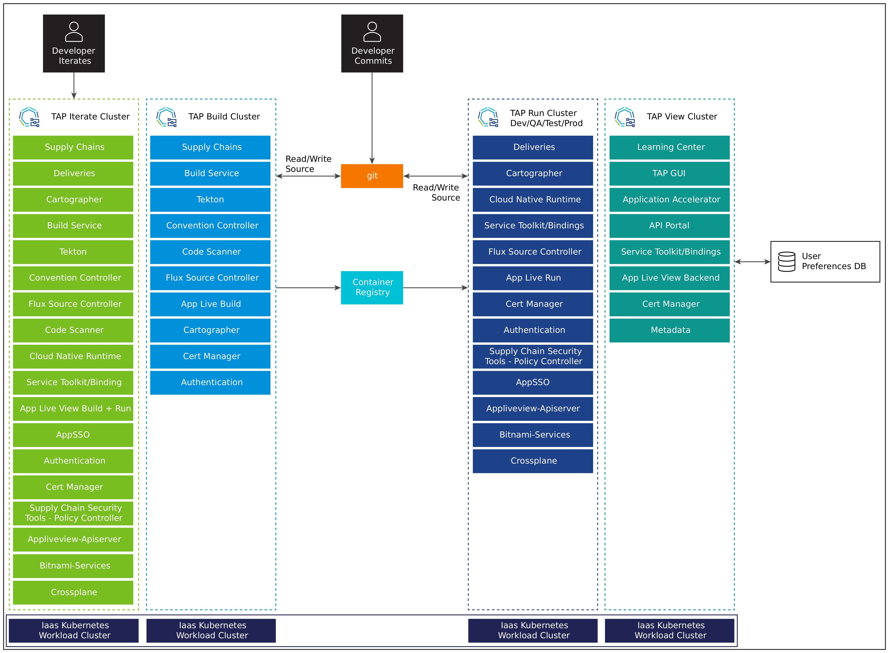

# Architecture Overview
This architecture gives you a path to creating a production deployment of Tanzu Application Platform 1.2. However, do not feel constrained to follow this exact path if your specific use cases warrant a different architecture.

Design decisions enumerated in this document exemplify the main design issues you will encounter in planning your Tanzu Application Platform environment and the rationale behind a chosen solution path. Understanding these decisions can help provide a rationale for any necessary deviation from this architecture.


<!-- https://lucid.app/lucidchart/313468a7-da40-4872-9075-cd37224c5e2f/edit -->

## Cluster Layout
For production deployments, VMware recommends two fully independent instances of Tanzu Application Platform. One instance for operators to conduct their own reliability tests, and the other instance hosts development, test, QA, and production environments isolated by separate clusters.

| Decision ID   | Design Decision   | Justification | Implication
|---            |---                |---            |---
|TAP-001  | Install using multiple clusters.         |  Utilizing multiple clusters allows you to separate your workloads and environments while still leveraging combined build infrastructure.   |  Multiple cluster design requires more installation effort and possibly more maintenance versus a single cluster design.
|TAP-002  | Create an operator sandbox environment.  |  An operator sandbox environment allows platform operators to test upgrades and architectural changes before introducing them to production. |  An operator sandbox requires additional computer resources.
|TAP-003  | Utilize a single Build Cluster and multiple Run Clusters  | Utilizing a single Build Cluster with multiple Run Clusters creates the correct production environment for the build system vs separating into dev/test/qa/prod build systems. Additionally, a single Build Cluster ensures that the container image does not change between environments.  A single Build Cluster is also easier to manage than separate components. |  *Changes lower environments are not as separated as having separate build environments.*
|TAP-004  | Utilize a View Cluster  | Utilizing a single Build Cluster with multiple Run Clusters creates the correct production perception for the build system vs separating into dev/test/qa/prod build systems. Additionally, it raises confidence that the container image does not change between environments.  It also enhances manageability versus having separate components. |  None

## Build Cluster Requirements
The Build Cluster is responsible for taking a developer's source code commits and applying a supply chain that will produce a container image and Kubernetes manifests for deploying on a Run Cluster.

The Kubernetes Build Cluster will see bursty workloads as each build or series of builds kicks off. The Build Cluster will see very high pod scheduling loads as these events happen. The amount of resources assigned to the Build Cluster will directly correlate to how quickly parallel builds are able to be completed.

### Kubernetes Requirements
* LoadBalancer for ingress controller (requires one external IP address)
* Default storage class
* At least 16 GB available memory that is allocatable across clusters, with at least 8 GB per node
* Logging is enabled and targets the desired application logging platform
* Monitoring is enabled and targets the desired application observability platform

### Recommendations
* Spread across three Availability Zones (AZs) for high availability
* Tanzu Service Mesh (TSM) is not installed or is restricted namespaces that are not Tanzu Application Platform

The Build Cluster includes the following packages (exact list may differ based on supply chain choice):
```
buildservice.tanzu.vmware.com
cartographer.tanzu.vmware.com
cert-manager.tanzu.vmware.com
contour.tanzu.vmware.com
controller.conventions.apps.tanzu.vmware.com
controller.source.apps.tanzu.vmware.com
conventions.appliveview.tanzu.vmware.com
fluxcd.source.controller.tanzu.vmware.com
grype.scanning.apps.tanzu.vmware.com
ootb-supply-chain-testing-scanning.tanzu.vmware.com
ootb-templates.tanzu.vmware.com
scanning.apps.tanzu.vmware.com
spring-boot-conventions.tanzu.vmware.com
tap-auth.tanzu.vmware.com
tap-telemetry.tanzu.vmware.com
tap.tanzu.vmware.com
tekton.tanzu.vmware.com
```
To install a Build Cluster, use the following package definition:
```yaml
profile: build
 ```
## Run Cluster Requirements

The Run Cluster reads the container image and Kubernetes resources created by the Build Cluster and runs them as defined in the `Deliverable` object for each application.

The Run Cluster's requirements are driven primarily by the applications that it will run.  Horizontal and vertical scale is determined based on the type of applications that will be scheduled.

### Kubernetes Requirements
* LoadBalancer for ingress controller (requires 1 external IP address)
* Default storage class
* At least 16 GB available memory that is allocatable across clusters, with at least 8 GB per node
* Logging is enabled and targets the desired application logging platform
* Monitoring is enabled and targets the desired application observability platform

### Recommendations
* Spread across three AZs for high availability
* Tanzu Service Mesh (TSM) is not installed or is restricted to namespaces that are not for Tanzu Application Platform

The Run Cluster includes the following packages:
```
cartographer.tanzu.vmware.com
cert-manager.tanzu.vmware.com
cnrs.tanzu.vmware.com
connector.appliveview.tanzu.vmware.com
contour.tanzu.vmware.com
controller.source.apps.tanzu.vmware.com
fluxcd.source.controller.tanzu.vmware.com
image-policy-webhook.signing.apps.tanzu.vmware.com
ootb-delivery-basic.tanzu.vmware.com
ootb-templates.tanzu.vmware.com
service-bindings.labs.vmware.com
services-toolkit.tanzu.vmware.com
tap-auth.tanzu.vmware.com
tap-telemetry.tanzu.vmware.com
tap.tanzu.vmware.com
sso.apps.tanzu.vmware.com
```

To install a Run Cluster, use the following package definition:
```yaml
profile: run
```
## View Cluster Requirements
The View Cluster is designed to run the web applications for Tanzu Application Platform. specifically, Tanzu Learning Center, Tanzu Application Portal GUI, and Tanzu API Portal.

The View Cluster's requirements are driven primarily by the respective applications that it will be running.

### Kubernetes Requirements
* LoadBalancer for ingress controller (requires 3 external IP addresses)
* Default storage class
* At least 16 GB available memory that is allocatable across clusters, with at least 8 GB per node
* Logging is enabled and targets the desired application logging platform
* Monitoring is enabled and targets the desired application observability platform

### Recommendations
* Spread across three AZs for high availability
* Tanzu Service Mesh (TSM) is not installed or is restricted namespaces that are not for Tanzu Application Platform
* Utilize a PostgreSQL database for storing user preferences and manually created entities

The View Cluster includes the following packages:

```
accelerator.apps.tanzu.vmware.com
api-portal.tanzu.vmware.com
backend.appliveview.tanzu.vmware.com
cert-manager.tanzu.vmware.com
contour.tanzu.vmware.com
controller.source.apps.tanzu.vmware.com
fluxcd.source.controller.tanzu.vmware.com
learningcenter.tanzu.vmware.com
metadata-store.apps.tanzu.vmware.com
tap-auth.tanzu.vmware.com
tap-gui.tanzu.vmware.com
tap-telemetry.tanzu.vmware.com
tap.tanzu.vmware.com
workshops.learningcenter.tanzu.vmware.com
```

To install a View Cluster, use the following package definition:
```yaml
profile: view
 ```
## Iterate Cluster Requirements
The Iterate Cluster is for "inner loop" development iteration. Developers connect to the Iterate Cluster via their IDE to rapidly iterate on new software features. The Iterate Cluster operates distinctly from the outer loop infrastructure. Each developer should be given their own namespace within the Iterate Cluster during their platform onboarding.


<!-- https://lucid.app/lucidchart/40663cc1-55aa-4892-ae23-1f462d39f262 -->

### Kubernetes Requirements
* LoadBalancer for ingress controller (2 external IP addresses)
* Default storage class
* At least 16 GB available memory that is allocatable across clusters, with at least 8 GB per node
* Logging is enabled and targets the desired application logging platform
* Monitoring is enabled and targets the desired application observability platform

### Recommendations
* Spread across three AZs for high availability
* Tanzu Service Mesh (TSM) is not installed or is restricted to namespaces that are not for Tanzu Application Platform

The Iterate Cluster includes the following packages:
```
backend.appliveview.tanzu.vmware.com
buildservice.tanzu.vmware.com
cartographer.tanzu.vmware.com
cert-manager.tanzu.vmware.com
cnrs.tanzu.vmware.com
connector.appliveview.tanzu.vmware.com
contour.tanzu.vmware.com
controller.conventions.apps.tanzu.vmware.com
controller.source.apps.tanzu.vmware.com
conventions.appliveview.tanzu.vmware.com
fluxcd.source.controller.tanzu.vmware.com
grype.scanning.apps.tanzu.vmware.com
image-policy-webhook.signing.apps.tanzu.vmware.com
ootb-delivery-basic.tanzu.vmware.com
ootb-supply-chain-basic.tanzu.vmware.com
ootb-templates.tanzu.vmware.com
run.appliveview.tanzu.vmware.com
scanning.apps.tanzu.vmware.com
service-bindings.labs.vmware.com
services-toolkit.tanzu.vmware.com
spring-boot-conventions.tanzu.vmware.com
tap-auth.tanzu.vmware.com
tap-telemetry.tanzu.vmware.com
tap.tanzu.vmware.com
tekton.tanzu.vmware.com
sso.apps.tanzu.vmware.com
```

To install a Iterate Cluster, use the following package definition:
```yaml
profile: iterate
```

## Tanzu Application Platform Upgrade Approach
When a new version of Tanzu Application Platform is released, we recommended that you first upgrade the operator sandbox environment.

Before upgrading the production environment, install a sample subset of applications and perform any applicable platform tests specific to your organization in the sandbox. Such tests may include building a representative set of applications and verifying that they still deploy successfully to your sandbox Run Cluster.

The following upgrade sequence is recommended:

* Sandbox
    * View
    * Build
    * Run  
* Production
    * Iterate
    * View
    * Build
    * Run (dev)
    * Run (test)
    * Run (QA)
    * Run (prod)


| Decision ID   | Design Decision   | Justification | Implication
|---            |---                |---            |---
|TAP-006  | Follow the upgrade order specified.         |  Upgrading in order promotes confidence in that software, configuration, and architecture is stable and reliable.   |  None

## Services Architecture
The primary ways to consume services are In-Cluster, External Cluster, and External Injected. Services are consumed by applications via the 'workload.yaml'. The request is presented to the system as a ServiceClaim. The preferred method of service integration is the external cluster.

External Cluster provides services operations with their specific life cycle and performance requirements and separates the stateless and stateful workloads.


| Decision ID   | Design Decision   | Justification | Implication
|---            |---                |---            |---
|TAP-007  | Use external services and service clusters.         |  Utilizing external services allows the service operators to customize their cluster parameters for their specific services and manage their respective life cycles independently.   | Utilizing external clusters adds some technical complexity.

### In-Cluster
Services can be deployed directly into the same cluster running Tanzu Application Service. This kind of deployment is more suited to iterate cluster environments. Possible implementations include:

  - same namespace
  - different namespaces

The following diagram shows In-Cluster services with different namespaces.


<!-- slides 80-82 https://onevmw-my.sharepoint.com/:p:/g/personal/mijames_vmware_com/EYK5tKWk83RFia7QHHkaAj0BUnnhenCjlto4qpYDY_ZyFw?e=NhmLnZ -->

### External Cluster
External clusters allow services to have different infrastructure, security, and scaling requirements. External services clusters are the recommended way to provide rapid service provisioning to platform users.


### External Injected
Applications that consume services that do not adhere to the Kubernetes service binding specification require the usage of a K8s secret, implemented in the same app deployment containing the necessary connection details. This method provides the most flexibility and makes it possible to consume legacy services.


## Monitoring
The following metrics should be observed. If the values exceed service level objectives, the clusters should be scaled or other actions taken.

### Build Cluster
* Number of pods waiting to be scheduled
* Number of builds completed in the last 60 minutes
* Maximum number of seconds that any pod has waited for scheduling

### Run Cluster
* Number of pods waiting to be scheduled
* Maximum number of seconds that any pod has waited for scheduling
* Remaining allottable memory and CPU

### View Components
* Response time
* Availability

| Decision ID   | Design Decision   | Justification | Implication
|---            |---                |---            |---
|TAP-008  | Monitor platform KPIs and setup alerts.         |  An external monitoring platform will keep metrics for the duration of their retention window. Further alerts will allow rapid response to issues before they impact developers and users.   | None

## Logging
Logging for Tanzu Application Platform is handled by the upstream Kubernetes integration for both applications and internal system components. An external logging platform should be used for storing and searching those logs.  For logging integration, refer to the reference architecture of your platform or logging platform.

| Decision ID   | Design Decision   | Justification | Implication
|---            |---                |---            |---
|TAP-009  |Use an external logging platform.          |  An external logging platform will keep logs for the duration of their retention window and offer superior searching capabilities.  | None

## Deployment Instructions
For instructions on how to deploy this reference design, see [Deploy multi-cluster Tanzu Application Platform profiles](https://docs.vmware.com/en/VMware-Tanzu-Application-Platform/1.2/tap/GUID-multicluster-installing-multicluster.html).
