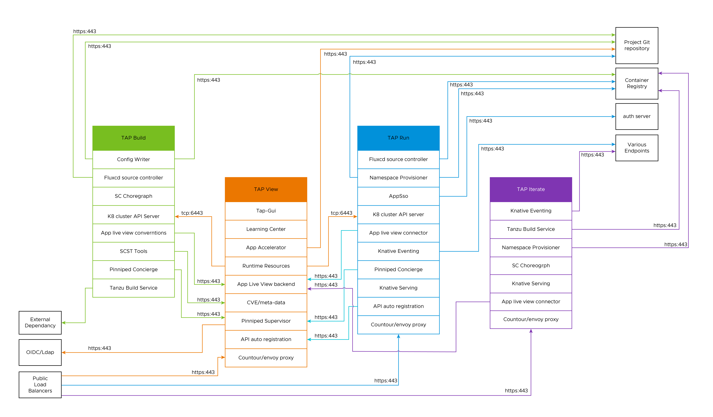

# Tanzu Application Platform Networking

Tanzu Application Platform Networking diagram describes the Tanzu Application Platform most common cross clusters and external services scenarios networking in multi cluster kubernetes environment. It describes high level egress and ingress networking flows between the Tanzu Application Platform components and with the external services. 

Table describe the Tanzu Application Platform networking flow, shows in above diagram. 

| Component / External Service | Source   | Destination | Port | Protocol | Description
|---                             |---       |---          |---   |---       |---
|Authentication (Pinniped Supervisor is an external Component, not part of Tanzu Application Platform. Coexist in same cluster)  |  View (Pinniped Supervisor) |  Ldap/OIDC providers  |  443 | https | Traffic between pinniped supervisor to oidc provider /ldap from internet egress.
|Authentication (Pinniped concierge is an external Component, not part of Tanzu Application Platform.Coexist in same cluster)  | View,Build ,Run Cluster | View (Pinniped Supervisor)  |  443 | https | Traffic between pinniped supervisor to pinniped concierge and vice versa.
|API Auto Registration  | Run  | View |  443 | https | Traffic routes through shared ingress.
|Application Accelerator  | Git Repo  | View |  443 | https | Traffic to create app accelerator from git from internet egress.
|Application Accelerator  | Contour ingress  | View |  443 | https | Download templated app, traffic routes through shared ingress. Contour/envoy proxy access Accelerator service inside cluster.
|Application Live view | Build(app live view conventions) | View (App live view Backend) | 443 | https | Traffic between appliveview conventions and backend.
|Application Live view | Run/Iterate (app live view connector) | View (App live view Backend) | 443 | https | Traffic between appliveview connector backend.
|AppSso | Run (appsso)| View (App live view Backend) | 443 | https | Traffic between external auth server and appsso.
|AppSso | Contour ingress | Run, Iterate | 443 | https | User request to AppSSO with login token (via shared ingress).Contour/envoy proxy access appsso service inside cluster.
|Contour ingress /Envoy proxy | External Load Balancer | Run,View,Iterate | 443,80 | https(443) , http(80) | Shared ingress for view/run/iterate cluster.
|Fluxcd source controller | Run,Build | External git/helm repository | 443,80 | https(443) , http(80) | Traffic to pull or push from git repo from internet egress.
|Learning Center | Contour ingress| View (Learning Center package)  | 443,80 | https(443) , http(80) | Traffic routes through shared ingress.Contour/envoy proxy access learning center service inside cluster.
|Supply Chain Security Tools/Metadata| Build (security scan plugin)| View (Gui CVE Dashboard)  | 443 | https | Traffic routes through shared ingress to report the scan results to view gui cve’s dashboard.
|Tanzu Application Platform Gui web| Contour ingress| View (tap-gui package)  | 443 | https | Traffic routes through shared ingress for external web url. Contour/envoy proxy access tap-gui service inside cluster.
|Gui backend| View | Gui backend DB(postgres)  | 5432 | tcp | Gui backend DB within the k8s cluster to persist tap gui data (read/write), this traffic remains in-cluster if the database is hosted inside the same cluster.
|Tanzu Build Service| Build | Third party dependencies repositories  | 443 | https | Downloading artifacts necessary to compile applications in different languages (Python, Java, .NET, JavaScript, golang, etc.).
|Tanzu Build Service| Build | Container images used for compilation of developer’s custom containers repository  | 443 | https | Container images from the relocated Tanzu Build Service buildpacks designated container repository.
|Config Writer (Tekton task in OOTB supply chain)| Build | Container Registry  | 443 | https / registry v2 protocol (imgpkg) | Push app configuration to registry for later deployment.
|Knative Serving (Cloud Native Runtimes)| Run, Iterate | Container Registry  | 443 | https / registry v2 protocol (imgpkg) | Resolve tagged images to digests.
|Namespace Provisioner| Run, Iterate | Container Registry  | 443 | https / registry v2 protocol (imgpkg) | Read TAP default per-namespace configuration.
|Namespace Provisioner| Run, Iterate | Git Repository  | 443 ,22 | https(443) , ssh(22) / git fetch protocol | Read user customized additional per-namespace resources from internet egress.
|Knative Eventing| Run, Iterate | Various endpoints  | 443 | https | Eventing sources include cloud providers from internet egress
|View Gui Runtime Resources plugin| View k8 cluster | Build,Run k8 API server | 6443 | tcp | To access Build, Run clusters k8 resources in tap gui runtime resource plugin