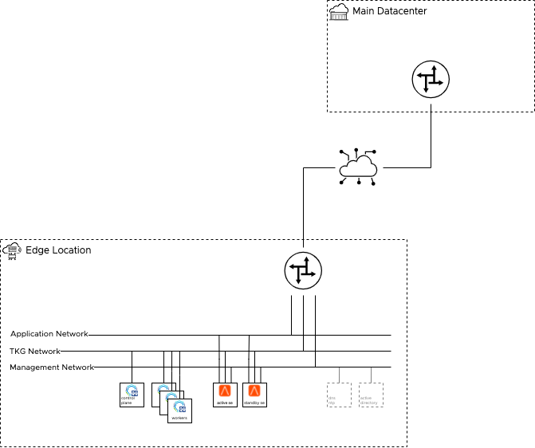
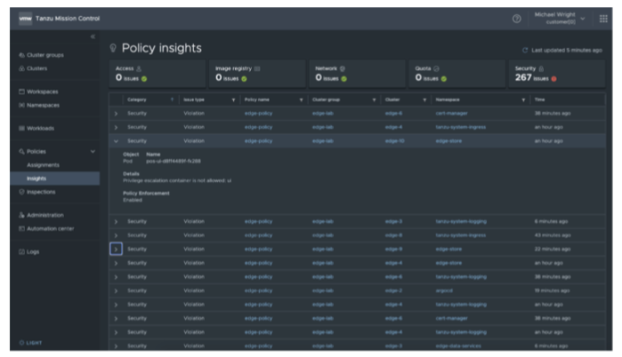

# Architecture Overview

This solution architecture is intended for anyone responsible for designing, implementing, managing, and securing edge sites, including DevOps administrators, VI administrators, platform operators, and security teams.

## Topology

Multiple topologies are possible for edge deployments. Some of the topologies are described in this section. However, the VMware Tanzu Edge Solution Architecture uses a centralized or hub and spoke topology, where a vCenter is deployed at the main data center location and a vSphere cluster is deployed in the data center at each edge site. This design document assumes that the vSphere infrastructure is already deployed.
An edge site can be a storefront (point of sale), manufacturing facility, medical office, or other IT infrastructure located in a remote, distributed site. Although these sites are important to your organization, they usually run up to 100 tenant virtual machines. Because of the critical nature of the workloads, dependencies on a Wide Area Network (WAN) connection must be limited.

### Hub and Spoke

In this topology, the management plane resides entirely in the main data center. The centralized management plane composed of vCenter, NSX Advanced Load Balancer Controller, and Tanzu Kubernetes Grid management cluster are all in the same central location. Only the Tanzu Kubernetes Grid workload clusters and NSX Advanced Load Balancer Service Engines (SEs) are created at the edge. This design provides a minimal footprint at the edge.

Once the edge site is deployed, Tanzu Mission Control is used for fleet management, allowing an easy way to manage and lifecycle Tanzu Kubernetes Grid workload clusters at the edge. Additional components for monitoring, backup, and log management can also be present in the main data center.


#### Key Features

- Minimal footprint.
- Limited recoverability when site is disconnected.
- Quick and easy to deploy.

### Hybrid

In this topology, only the Tanzu Kubernetes Grid management cluster is located in a central location.
Each edge site has the infrastructure management plane (vCenter, and NSX Advanced Load Balancer controllers, DNS servers and NTP server). This design provides a better availability when the edge site gets disconnected from the main data center.
Additional component for monitoring, backup, and log management can also be installed at the edge site to provide the functionality locally.


#### Key Features

- Better availability during edge disconnection.
- Provides more management control at the edge site allowing the edge site to be managed by a 3rd party provider while keeping the control of the Tanzu Kubernetes Grid management cluster.
- Management overhead.

### Data Center Fleet

In this topology, each edge site has a full-stack infrastructure management plane which includes vCenter, NSX Advanced Load Balancer Controllers and Tanzu Kubernetes Grid management cluster. Each edge site is considered as a separate data center and can operate independently.
Tanzu Mission Control is used for fleet management, allowing an easy way to create, manage and lifecycle Tanzu Kubernetes Grid workload clusters at the edge.


#### Key Features

- Edge site can be considered an independent data center.
- Tanzu Mission Control use used for fleet management.

This topology is not covered in this design as it is covered by the [TKO Reference Architecture on vSphere][611].

## Business Expectations

The design is expected to answer the following business requirements. The key expectations being around availability and recoverability.

### Availability / Recoverability

An edge site can be considered like any other data center except when it comes to availability and recoverability. This is because, an edge site, such as a retail store or an office, is usually tied to business hours. Additionally, there is a need to keep cost of the edge site low. Even though the RPO at an edge site can be  critical (sales transactions), the RTO is not as critical as a normal data center.

The following sections describe the expectations depending on the type of outage.

#### Edge Site Disconnected from Main Site

It is expected that the application running at the edge site should continue to run even if the connectivity with the main data center is lost. Management of the site might not be possible.

It is assumed that they do not require access to components outside of the edge site

|     | Hub and Spoke | Hybrid | Data Center Fleet |
| --- | --- | --- | --- |
| Run existing application | Yes | Yes | Yes |
| Deploy new application | No | Only if packages are available locally | Only if packages are available locally |
| Upgrade the cluster | No | No | Only if a local registry is configured |
| Scale the cluster | No | No | Only if a local registry is configured |
| Authenticate with pinniped | No<br />(pinniped needs access to the TKG management cluster) | No<br />(pinniped needs access to the TKG management cluster) | Yes |
| Create or Move Persistent Volumes using vSphere CSI driver | No | Yes | Yes |
| Impact of a single node failure (assuming there are more than one node) | Unpredictable | Application might have a short disruption but will be able to recover | No impact |

#### Local Hardware Failure

It is expected that the application running at the edge site should continue to run even in the case where there are some hardware failures such as host failure or disk failure.

|     | Hub and Spoke | Hybrid | Data Center Fleet |
| --- | --- | --- | --- |
| Running application | Potentially unavailable for few seconds | No impact | No impact |
| Kubernetes API availability | Potentially unavailable for few minutes | Potentially unavailable for few minutes (if a single control plane node is used) | No impact |

#### Loss of Site

If the site is irremediably lost (from an IT standpoint), after the hardware and the base infrastructure has been rebuilt/recovered, the Tanzu stack can be rebuilt in a matter of hours.

|     | Hub and Spoke | Hybrid | Data Center Fleet |
| --- | --- | --- | --- |
| Time to rebuild the site | Short | Medium | Long |

### Performance

- The application should perform as good as if it was running in the main data center.

### Manageability

- Scale to 100s edge sites
- Global view

### Security

- Access to the management is segregated and secured.
- Network access to the main data center is secured.
- Authentication can be performed through a centralized authentication system.

## Edge Site Infrastructure

### Physical Servers

Tanzu Kubernetes Grid doesn’t require a specific number of physical servers since all its components are running either in VMs or containers. If the resources are sufficient, the number of physical servers is driven by availability and cost.

Availability should be considered during normal operations but also during maintenance. The following table provides a quick summary about how the number of physical servers impacts availability.

| Number of servers | Availability during operations | Availability during maintenance |
| --- | --- | --- |
| 1   | Loss of one server will cause a major outage | Maintenance can only be conducted when application is down |
| 2   | Tolerant to one minor outage | Maintenance will increase risk of major outage (a minor outage during maintenance will cause a major outage) |
| 3   | Tolerant to minor outages | No major impact to be expected on availability |
| 4+  | Tolerant to minor outages | Best for N+1 type application as there will be always 3 (2+1) hosts available during maintenance |

### Networking and Security

Tanzu Kubernetes Grid can work on a flat Layer-2 network. However, for better security, we recommend using multiple networks, such as VLANs. Multiple networks help segregate traffic and isolate components that are publicly exposed as opposed to management components. Because distributed load balancing is not provided at the edge, using different networks is the simplest option to ensure security for the management components.

A /24 network can be split in smaller networks if needed.



#### List of networks at the Edge
The following table provides a list of the networks at the edge site.

| Network | Usage | IP Addresses | Accessibility | Proposed Subnet Size | Network Feature |
| --- | --- | --- | --- | --- | --- |
| Application | Where the business application is accessible | Minimum 3 IP addresses:<br />\- 1 per LB (can be down to 1 if Ingress controller is used)<br />\- 1 for each NSX ALB SE | By end user. Do not need to be routed/accessible from the main data center | /27 (32 IPs) | No  |
| Tanzu Kubernetes Grid | Where the TKG Nodes are connected. CNI is built on top of this network to provide connectivity between pods. | Minimum 4 IP addresses:<br />\- 1 per TKG nodes<br />\- 1 for each NSX ALB SE | \- Outbound internet access. (to pull containers)<br />\- Routed to/from main data center (to connect to management components) | /26 (64 IPs) | DHCP enabled with the following configuration:<br />\- provide DNS Servers<br />\- provide NTP Servers (Option)<br />\- Leases time greater than the maximum time the site can be down |
| Management | Where the local management components are connected to | Minimum 2 IP addresses:<br />\- 1 for each NSX ALB SE | Routed to/from main data center | /26 (64 IPs) | .   |

The management cluster is separated from the Tanzu Kubernetes Grid network to accommodate the fact that many organizations will not allow DHCP on a network where management components are connected, hence the need of a dedicated network for Tanzu Kubernetes Grid nodes.
The DHCP lease time is quite important if the edge site can be down for few days. If the Control Plane node doesn’t get the same IP address when it restarts, the cluster won’t restart properly and a manual action will be required. With Tanzu Kubernetes Grid, the etcd component is bound to the first IP address the control plane node gets and doesn’t support any change dynamically.

#### Connectivity to the Main Data Center (Hub)

The design assumes that there is a routed connectivity from the edge site to the main data center without any NAT. A bandwidth of at least 10 Mbps must be available with maximum latency of 50ms and a minimal packet loss of <1%.

This connection is heavily used during deployment and upgrade (Tanzu Kubernetes Grid OVA templates copy, containers pulled from global registry).

If the connectivity doesn’t meet the bandwidth or latency requirement, the Tanzu Edge topology is still possible, however the edge site should be considered an air-gapped data center (see [air-gap design][211]) in terms of deployment and lifecycle.

#### Connectivity and Infrastructure Services at the Edge Site

The hosts are connected with at least a 1 Gbps connection to each other with latency <1ms. 10Gbps is recommended if vSAN is used.

The following infrastructure services are required at the edge site.

- DHCP server. A DHCP service is mandatory on Tanzu Kubernetes Grid cluster networks.
- NTP server. Tanzu components are sensitive to time and need to be in sync to work properly.
- DNS server. Optionally with a delegated zone that can leveraged by External DNS.

#### Internet Access

It is assumed that Internet access is provided through the main site, hence, is dependent to WAN connectivity.

#### Proxy

Proxy can be configured individually on a per-cluster basis at deployment time.

- Pull package from Internet.
- Connection to Tanzu Mission Control.
- Connection to Tanzu Observability.


#### Network Security

The VMware Edge Compute Stack doesn’t provide network security. If any hardening is necessary,  implement it outside of the VMware Edge Compute Stack.

| Source | Destination | Protocol:Port | Description |
| --- | --- | --- | --- |
| TKG Edge Nodes | DNS Server, NTP Server | UDP:53, UDP:123 | DNS Service, Time Synchronization |
| TKG Edge Nodes | DHCP Server | UDP: 67, 68 | Allows hosts to get DHCP addresses |
| TKG Edge Nodes | vCenter IP | TCP:443 | Allows components to access vCenter to create VMs and Storage Volumes |
| TKG Edge Nodes | Harbor Registry | TCP:443 | Allows components to retrieve container images. This registry can be a local or a public image registry (projects.registry.vmware.com) |
| TKG Management Cluster | TKG Edge Nodes | TCP:6443 | For management cluster to configure workload cluster |
| TKG Edge Nodes | TKG Management Cluster | TCP:6443 | Allow workload cluster to register with management cluster |
| TKG Edge Nodes | TKG Management Cluster | TCP:31234 | Allow Pinniped concierge on workload cluster to access Pinniped supervisor on management cluster |
| TKG Edge Nodes | NSX ALB Controllers | TCP:443 | Allow Avi Kubernetes Operator (AKO) and AKO Operator (AKOO) access to Avi Controller |
| NSX ALB Controllers | vCenter and ESXi Hosts | TCP:443 | Allow NSX ALB to discover vCenter objects and deploy SEs as required |
| TKG Edge Nodes | Tanzu Mission Control service | TCP:443 (*.tmc.cloud.vmware.com) | Tanzu Mission Control communications |

### Storage

Storage is required at the edge site in order to store Tanzu Kubernetes Grid nodes (VMs), other VMs required at the site as well as all the persistent data (stored in Kubernetes Persistent Volumes) necessary for the applications to run.

If more than one host is used, shared storage is required to ensure high availability of the VM and load balancing of the resources. To support Kubernetes persistent volumes of ReadWriteMany (RWM) type, the shared storage must be file-based (most likely NFS).

vSAN is the preferred option because it simplifies overall management (configured and managed from vCenter) and onsite deployment (only servers and networking). It also provides the vSAN file service that can be consumed by persistent volumes of ReadWriteMany (RWM) type.

#### vSAN General Considerations

- 2-node and 3-node configurations can only tolerate 1 host failure.
- VMware recommends deploying ESXi hosts with similar or identical configurations across all cluster members, including similar or identical storage configurations. This ensures an even balance of virtual machine storage components across the disks and hosts cluster.
- In vSAN hybrid configurations, VMware supports 1 GB, but the 1 GB NIC must be dedicated for vSAN. If 10 GB or higher bandwidth NICs are used, these can be shared with other network traffic types. vSAN all-flash configurations are only supported with a 10 GB or higher connections.
- vSAN file service offers vSAN file shares that are consumed by persistent volumes of the ReadWriteMany (RWM) type. A single RWM volume can be mounted by multiple nodes. The volume can be shared between multiple pods or applications running across Kubernetes nodes or across Kubernetes clusters.

#### vSAN 2-Node Considerations

vSAN 2-node is particularly appealing for edge site as it provides high-availability with a minimal footprint. Here are some key considerations for Tanzu Edge, more details can be found in the [vSAN 2-node Cluster Guide][210]

- A vSAN 2-node requires a witness host (virtual machine) to be set up at the main data center in the same vCenter as the vSAN cluster.
- Bandwidth between vSAN nodes hosting VM objects and the witness host is dependent on the number of objects residing on vSAN. Ensure that the bandwidth between the data site to the witness host is appropriately sized for both availability and growth. A standard rule is 2 Mbps for every 1000 components on vSAN. Because vSAN nodes have a maximum number of 9000 components per host, the maximum bandwidth requirement is 9 Mbps per host.
- In a vSAN 2-node cluster, all read operations occur in the site the VM resides on. This aligns with the behavior of vSAN stretched clusters. Read locality overrides the `NumberOfFailuresToTolerate=1` policy’s behavior to distribute reads across the components. The vSAN `DOMOwnerForceWarmCache` setting can be configured to force reads on both Node 1 and Node 2 in a 2-node configuration.
- The ability to connect 2 nodes directly removes the requirement for a high speed switch. This design can be significantly more cost effective when deploying tens or hundreds sites.
- In typical 2-node configurations, such as Edge deployments, the latency or RTT between the main data center and the edge site is supported up to 500ms (250ms one-way).

### Other Considerations

#### Backup

Using Velero to backup the kubernetes cluster or its deployed applications and persistent volumes requires S3-compatible storage. Since this is very unlikely that such storage is available at the edge site, it is assumed that stateful data will be backed up by a native mechanism outside of the Kubernetes cluster (for example database backup for a database) and stored offsite.

#### Anti-Affinity Rules

All redundant components should be evenly spread across the available ESX hosts.

#### GPU Consideration

A common reason for having computing power at the edge is the ability to process data before sending it back to the main data center. GPU capabilities play a key role in data processing, and being able to leverage this compute capacity at the edge helps improve performance, latency, and save on network bandwidth. While this design does not explore GPU compute power, the Edge Compute Stack has the ability to provide GPU compute power to workloads at the edge. 

The following can be used at the edge for consuming GPU: GPU Passthrough, BitFusion, NVIDIA GRID.

While the solutions work with Tanzu Kubernetes Grid, they require VMware Professional Services engagement.

##### GPU Passthrough


The entire GPU card is passed to the VM. It requires the GPU card to be present in the server where the VM runs. With this configuration, virtual machines cannot migrate between servers.

##### BitFusion


One or multiple servers servers with GPU are present at the edge site. Through Bitfusion technology, the GPU can be remotely consumed through the network by workloads located on other servers at the Edge.

##### NVIDIA GRID


One or multiple GPU cards are shared by VMs running on the same server. This configuration leverages the NVIDIA GRID Virtual GPU Manager to share GRID-supported GPU amongst multiple virtual machines. Virtual machines may be migrated between servers as long as the hardware supports it.

## Components at the Edge

The primary component at the edge is the Tanzu Kubernetes Grid workload cluster that will support all of the containerized workloads. Along with the workload cluster, depending on the topology and the capabilities required at the edge, other components are installed.
Additionally, if resources permit, we recommend deploying two workload clusters. This allows you to use the Blue/Green change management strategy and helps reduce risk during upgrade and application deployment.

### Design Decisions for the components at the edge (all topologies)

| Decision ID | Design Decision | Design Justification | Design Implication |
| --- | --- | --- | --- |
| `TZEDG-ALL-EDGE-TKG-01` | Use a single node control plane (dev plan) for Tanzu Kubernetes Grid Workload cluster. | Applications at the Edge being mostly static, the impact of the unavailability of the control plane is low. vSphere HA can bring back up the control plane reasonably quickly to not be noticed.<br />It reduces the resource overhead.<br />It is safer when there are less than 3 physical hosts (with multiple control plane nodes, the loss of 2 nodes, hosted on one physical host, would result in the loss of the cluster due to etcd quorum loss) | A physical host failure could result in the temporary unavailability of the Kubernetes control plane until the control plane node is restarted by vSphere HA. Data corruption of the control plane node will result in the loss of the Kubernetes cluster. |
| `TZEDG-ALL-EDGE-LB-01` | Use a pair of NSX ALB Service Engine in Active/Passive mode | This is the only configuration supported with [NSX ALB Essentials for Tanzu license][200] | No Active/Active deployments, BGP and ECMP support or automatic scaling of load balancers. Consider [NSX ALB Enterprise license][200] for these features |

### Hub and Spoke Topology

With the hub and spoke topology, the management plane is located in a central location. Only the following components are deployed at the edge:

- Tanzu Kubernetes Grid workload cluster
- Load Balancer Service (NSX Advanced Load Balancer)

The following table describes the minimum footprint for edge components in a hub and spoke topology.

| Amount | Machine usage | vCPU | Memory (GB) | Disk (GB) |
| --- | --- | --- | --- | --- |
| 1   | TKG Workload Cluster<br />Control Plane Node (small) | 2   | 4   | 40  |
| 1 * host num | TKG Workload Cluster<br />Worker Node (small) | 2   | 4   | 40  |
| 2   | NSX ALB Service Engine | 1   | 1   | 15  |
| 1 * host num | vSAN File services | 4   | 8   | 12  |

For example, the following is the minimum footprint required for an edge site with two hosts and vSAN:

- 16 vCPU
- 30 GB of memory
- 164 GB of storage (could be less if thin provisioning and deduplication/compression is used)

### Hybrid Topology

With the hybrid topology, the infrastructure management plane is deployed at the edge along with the workloads:

- Tanzu Kubernetes Grid workload cluster
- Load Balancer Service (NSX Advanced Load Balancer)
- vCenter
- NSX Advanced Load Balancer Controller

The following table describes the minimum footprint for edge components in a hybrid topology.

| Amount | Machine usage | vCPU | Memory (GB) | Disk (GB) |
| --- | --- | --- | --- | --- |
| 1   | TKG Workload Cluster<br />Control Plane Node (small) | 2   | 4   | 40  |
| 1 * host num | TKG Workload Cluster<br />Worker Node (small) | 2   | 4   | 40  |
| 2   | NSX ALB Service Engine | 1   | 1   | 15  |
| 1 * host num | vSAN File services | 4   | 8   | 12  |
| 1   | vCenter Server 7 ([tiny][204]) | 2   | 12  | 579 |
| 1   | NSX ALB Controller (tiny) | 4   | 12  | 128 |

For example, the following minimum footprint is required for an edge site with three hosts and vSAN:

- 28 vCPU
- 66 GB of memory
- 933 GB of storage

#### Design Decisions for the components at the edge for the Hybrid Topology

| Decision ID | Design Decision | Design Justification | Design Implication |
| --- | --- | --- | --- |
| `TZEDG-HYBRID-EDGE-LB-01` | Use a dedicated NSX-ALB controller per edge site | Provide management capabilities at the edge when the edge site is disconnected. Without the controller at the edge, AKO cannot perform any changes. | Management & Resource overhead. Can be mitigated through automation |
| `TZEDG-HYBRID-EDGE-LB-02` | Use 1x NSX-ALB controller in the [smallest form factor][201] | Deploying and managing a 3-node NSX-ALB controller cluster represent a huge overhead in term of resources and management. Having one node with vSphere HA provides the right level of availability for an edge site. The | 1x node with vSphere HA doesn’t protect against data corruption. In this case, it will requires to redeploy and reconfigure the NSX ALB controller. This can be mitigated by regularly backing up the controller configuration on the main data center |
| `TZEDG-HYBRID-EDGE-INFRA-01` | Deploy vCenter at the edge site | Provide management capabilities at the edge when the edge site is disconnected. CSI requires access to vCenter to work. | Management & Resource overhead. Can be mitigated through automation |

### Containerized Tools

Additional containerized applications can be deployed at the edge through Tanzu packaging. This may require additional worker nodes or increasing the size of the existing worker nodes.

- **Contour** for ingress
- **Harbor** for container registry
- **Pinniped** for authentication
- **Prometheus / Grafana** for metric collection and monitoring

## Ingress and Load-Balancing at the Edge

Ingress and load balancing are very important aspects of any Kubernetes deployment. It defines the quality of access to applications as well as the availability of the control plane.

### Control Plane Load Balancing

NSX Advanced Load Balancer or Kube-Vip can be used to provide HA for control plane endpoints of Tanzu Kubernetes Grid clusters.

#### Hub and Spoke Topology

Kube-Vip is recommended over NSX Advanced Load Balancer to be used at the Edge site for the Hub and Spoke Topology. With this configuration, the edge site doesn’t rely on a component in the main data center for the control-plane access that might be impacted by connectivity issues.

#### Hybrid Topology

NSX Advanced Load Balancer can be used to provide HA for control plane endpoints of Tanzu Kubernetes Grid clusters with a hybrid topology.

### Workloads Load Balancing

As time of writing the only supported solution to provide Load-Balancing with Tanzu Kubernetes Grid deployed on vSphere is NSX Advanced Load Balancer. Through the AKO architecture it easy and efficient to create and manage load balancer services across Workload Clusters.


#### Considerations for NSX Advanced Load Balancer Service Engines

- NSX Advanced Load Balancer Service Engines (SEs) are deployed manually as virtual machines (VMs) and are joined to the NSX Advanced Load Balancer Controller (on the main data center).
- Depending on the network configuration, the management interface of the service engine (SE) can be configured through DHCP or with a pre-defined range defined in the controller.
- Legacy HA Active/Standby Mode is used primarily due to NSX Advanced Load Balancer Essential license limitation. Only two Service Engines may be created. For every virtual service active on one, there is a standby on the other, configured and ready to take over in the event of a failure of the active SE. There is no Service Engine scale out in this HA mode.
- If the connectivity to the main data center is lost, SEs continue to run headless. The SEs cannot receive configuration updates until connectivity is restored..
- The latency between an NSX Advanced Load Balancer Controller and an NSX Advanced Load Balancer Service Engine should be less than 75 ms.

##### Service Engine Configuration

| Service Engine Configuration | Minimal Specification |
| --- | --- |
| vCPUs | 1   |
| Memory (GB) | 1   |
| Hard disk (GB) | 15  |
| Number of connected network adapters | 2   |
| Number of service engines per Service Engine Group | 2   |

See [Sizing Service Engines][410] for guidance on sizing your SEs. In summary, for Intel v4 CPUs, for example Intel® Xeon® CPU E5-2686 v4 @ 2.30GHz:

| Performance metric | 1 vCPU core |
| --- | --- |
| Throughput | 4 Gb/s |
| Connections/s | 40k |
| SSL Throughput | 1 Gb/s |
| SSL TPS (RSA2K) | ~600 |
| SSL TPS (ECC) | 2500 |

Multiple performance vectors or features may have an impact on performance. For instance, to achieve 1 Gb/s of SSL throughput and 2000 TPS of SSL with EC certificates, VMware recommends two cores.

NSX Advanced Load Balancer Service Engines may be configured with as little as 1 vCPU core and 1 GB RAM, or up to 36 vCPU cores and 128 GB RAM.

### Contour for Kubernetes Ingress Routing

Tanzu Editions also includes [Contour](https://projectcontour.io/) for Kubernetes Ingress routing. Contour and can be installed on any Tanzu Kubernetes Grid cluster with ease. For more information, see [Implementing Ingress Control with Contour](https://docs.vmware.com/en/VMware-Tanzu-Kubernetes-Grid/1.4/vmware-tanzu-kubernetes-grid-14/GUID-packages-ingress-contour.html). Contour provides **Layer 7 based routing** to Kubernetes services.

## Container Registry

### Main Data Center

[Harbor Container Registry](https://goharbor.io/) can be deployed to both the centralized data center as well as to each edge site.  Using Harbor, replications can be configured such that all container images which get pushed into the centralized harbor are automatically replicated to each edge. Each edge deployment can reference its local harbor for efficient network resource utilization.


[Replications](https://goharbor.io/docs/2.0.0/administration/configuring-replication/create-replication-rules/) can be defined as manual, scheduled, or event-based.  Manual or scheduled are best suited for initial bulk syncs, where-as event-based can be used to replicate changes on-going.

Schedule replication during low activity (outside of working hours).


### At the Edge

Design Decisions on Container Registry configuration

| Decision ID | Design Decision | Design Justification | Design Implication |
| --- | --- | --- | --- |
| `TZEDG-EDGE-REG-01` | Use Pull | more resilient, since the edge Harbors can pull in their own time, and it keeps configuration simple | configuration needs to be done at the edge site which might implies |

## Initial Deployment

The initial deployment is done through a GitOps process. Leveraging GitOps will allow deployment at scale as well as easy rebuild in case of loss of an edge location. Once the infrastructure has been setup, the Tanzu Design can be deployed remotely using Tanzu CLI and automation tools to perform NSX ALB configuration and Kubernetes configuration.

### Supported Component Matrix

- vSphere 6.7+
- vSphere 7 is recommended to get vSAN File Service for RWM volumes
- Tanzu Kubernetes Grid 1.5.2
- NSX Advanced Load Balancer 20.1.7
- Tanzu Mission Control
- S3 storage for backup

### Infrastructure Considerations

#### Design Decision for vCenter Configuration
The following table describes the justification and implication for the design decisions.

| Decision ID | Design Decision | Design Justification | Design Implication |
| --- | --- | --- | --- |
| `TZEDG-ALL-EDGE-INFRA-02` | Separate each edge site in a different vSphere data center | A vSphere data center provides a clear boundary in vCenter at the folder level (host, vm, datastore, network). This boundary avoid name collision and ensure resources stay local to the site like templates. It is also easier to segregate access if needed. | NSX ALB considers a vSphere data center as a hard boundary that requires the creation of an endpoint for each one. |

#### Template Management

Tanzu Kubernetes Grid expects the template OVA to be present in the vSphere data center where the Kubernetes cluster is created.
Content library can be used to sync the templates across the various edge site but automation is required to convert a content library item into a vSphere template. Tanzu Kubernetes Grid only consumes vSphere template.

#### Multi-vCenter

The vCenter configuration can be different for each edge site, hence allowing the support of multiple vCenters.
However the use of multiple vCenters will impact the ability of Tanzu Mission Control to create and lifecycle clusters. Tanzu Mission Control only supports one vCenter server per Tanzu Kubernetes Grid management cluster.

#### High-Availability Considerations

In order to ensure the best availability, the number of worker nodes should be a multiple of the number of ESX hosts in the vSphere cluster.
Additionally, to maximize the availability of the application at the edge, the worker nodes should be evenly spread across the ESX hosts as well as the pods. To achieve this, it is possible to leverage the Availability Zones feature in Tanzu Kubernetes Grid.
One AZ is created per ESX Hosts, the same number of worker nodes are deployed AZ / ESX hosts. As time of writing [this feature][610] is still experimental and won't be considered in the design.

### Deployment of the Main Data Center

The deployment of the main data center is no different from the [TKO Reference Architecture on vSphere][611] deployment.

Only the management cluster and the shared services cluster are deployed.

### Deployment of the Edge Site

#### Infrastructure Requirements

This design assumes that the following components are already installed and configured at the edge site:

- vSphere data center with one cluster
- Appropriate networking
- Appropriate shared storage
- vSphere templates
- Tanzu Kubernetes Grid OVA templates
- NSX Advanced Load Balancer Service Engines

#### NSX Advanced Load Balancer Configuration for the Edge site

The NSX Advanced Load Balancer configuration at the Edge site consists of the creation or the configuration of the following:

- One cloud endpoint configured to use the resources at the edge location
- One IPAM configuration for the edge site
- Networks configured with IP Ranges to be used by VIP and SE nodes at the edge site
- One Service Engine Group (SEG) using the newly created cloud endpoint
- 2x Service Engines to be deployed
- a new AKODeploymentConfig to be created on the Tanzu Kubernetes Grid management cluster

#### Sample of the AKODeploymentConfig for the Edge Site `edge33`

<!-- /* cSpell:disable */ -->

```bash
apiVersion: networking.tkg.tanzu.vmware.com/v1alpha1
kind: AKODeploymentConfig
metadata:
  name: install-ako-for-edge33
spec:
  adminCredentialRef:
    name: avi-controller-credentials
    namespace: tkg-system-networking
  certificateAuthorityRef:
    name: avi-controller-ca
    namespace: tkg-system-networking
  cloudName: edge33-cloud
  clusterSelector:
    matchLabels:
      edge-location: "edge33"
  controller: 192.168.110.40
  dataNetwork:
    cidr: 172.33.31.0/24
    name: edge33-vds01-tkg-data
  extraConfigs:
    cniPlugin: antrea
    disableStaticRouteSync: true
    enableEVH: false
    ingress:
      defaultIngressController: false
      disableIngressClass: true
      noPGForSNI: false
    l4Config:
      advancedL4: false
      autoFQDN: disabled
    layer7Only: false
    networksConfig:
      enableRHI: false
    servicesAPI: false
  serviceEngineGroup: tkg-edge33
```
<!-- /* cSpell:enable */ -->

These newly created NSX Advanced Load Balancer configuration elements should be used to deploy the Tanzu Kubernetes Grid cluster in the subsequent section

##### Design Decisions for Hub and Spoke Topology

| Decision ID | Design Decision | Design Justification | Design Implication |
| --- | --- | --- | --- |
| `TZEDG-HUBSPOK-EDGE-LB-01` | Create a no-orchestrator cloud endpoint in central NSX ALB controller for each edge location | Scalability with vCenter cloud endpoint is limited to 10 endpoints while no-orchestrator endpoint scale up to 100. <br />No-orchestrator cloud endpoint is less impacted by latency, unreliable network nor disconnection. | NSX ALB Service Engines have to be managed outside of NSX ALB. |

##### Design Decisions for Hybrid Topology

| Decision ID | Design Decision | Design Justification | Design Implication |
| --- | --- | --- | --- |
| `TZEDG-HYB-EDGE-LB-01` | Create a vCenter-orchestrated cloud endpoint in NSX ALB | vCenter-orchestrated cloud endpoint will simplify the deployment and the lifecycle of Service Engine. Since each Edge location has its own NSX ALB controller, there are no concerns regarding scalability and availability during network disconnection | N/A |

#### Design Decision for Tanzu Kubernetes Grid workload cluster deployment

| Decision ID | Design Decision | Design Justification | Design Implication |
| --- | --- | --- | --- |
| `TZEDG-ALL-EDGE-TKG-02` | Deactivate MHC | After the Edge location is network isolated from the main data center, the TKG Management cluster might recreate the whole cluster causing an outage at the edge | Kubernetes node that are stopped or unresponsive won't be automatically replaced |
| `TZEDG-ALL-EDGE-TKG-03` | Use Kube-VIP for the control plane API endpoint | Avoid unnecessary complexity since we have only one control-plane node. <br />Eliminate the network dependency to the main site (AKO needs connectivity to the main site) | N/A |
| `TZEDG-ALL-EDGE-TKG-04` | Create one namespace per edge site in the TKG management cluster and creates TKG workload cluster(s) in them | Isolate each edge site for better role base access control. Simplify destruction and creation of an edge site. Avoid mass destructive actions across all edge sites.  | Manual operations are more complex as it is required to switch between namespaces to perform operations across edge sites. |

#### Sample of a workload cluster deployment at the edge site `edge33`

<!-- /* cSpell:disable */ -->

```bash
#! ---------------------------------------------------------------------
#! Basic cluster creation configuration
#! ---------------------------------------------------------------------

CLUSTER_NAME: tkg-edge33-wld01
CLUSTER_PLAN: dev
NAMESPACE: edge33
# CNI: antrea
# IDENTITY_MANAGEMENT_TYPE: oidc

#! ---------------------------------------------------------------------
#! Node configuration
#! ---------------------------------------------------------------------

# SIZE:
CONTROLPLANE_SIZE: small
WORKER_SIZE: medium
WORKER_MACHINE_COUNT: 2

#! ---------------------------------------------------------------------
#! vSphere configuration
#! ---------------------------------------------------------------------
VSPHERE_SERVER: vcenter-edge.tanzu.lab
VSPHERE_DATACENTER: /edge33-dc
VSPHERE_DATASTORE: /edge33-dc/datastore/edge33-vsan
VSPHERE_FOLDER: /edge33-dc/vm
VSPHERE_NETWORK: /edge33-dc/network/edge33-vds01-tkg
VSPHERE_RESOURCE_POOL: /edge33-dc/host/edge33-cloud/Resources
VSPHERE_SSH_AUTHORIZED_KEY: "ssh-rsa AAAA[...]="
VSPHERE_USERNAME: administrator@vsphere.local
VSPHERE_PASSWORD: <encoded:Vk13YXJlMSE=>
VSPHERE_INSECURE: true
VSPHERE_CONTROL_PLANE_ENDPOINT: 172.33.20.10
AVI_CONTROL_PLANE_HA_PROVIDER: 'false'

#! ---------------------------------------------------------------------
#! Machine Health Check configuration
#! ---------------------------------------------------------------------

ENABLE_MHC:
ENABLE_MHC_CONTROL_PLANE: false
ENABLE_MHC_WORKER_NODE: false
MHC_UNKNOWN_STATUS_TIMEOUT: 5m
MHC_FALSE_STATUS_TIMEOUT: 12m

#! ---------------------------------------------------------------------
#! Common configuration
#! ---------------------------------------------------------------------

# TKG_CUSTOM_IMAGE_REPOSITORY: ""

# TKG_HTTP_PROXY: ""
# TKG_HTTPS_PROXY: ""
# TKG_NO_PROXY: ""

ENABLE_AUDIT_LOGGING: true
ENABLE_DEFAULT_STORAGE_CLASS: true

CLUSTER_CIDR: 100.96.0.0/11
SERVICE_CIDR: 100.64.0.0/13

OS_NAME: photon
OS_VERSION: 3
OS_ARCH: amd64

#! ---------------------------------------------------------------------
#! Autoscaler configuration
#! ---------------------------------------------------------------------

ENABLE_AUTOSCALER: false
```
<!-- /* cSpell:enable */ -->

#### Tanzu Kubernetes Grid Cluster post-deployment configuration

Label the cluster to enable AKO

<!-- /* cSpell:disable */ -->

```bash
kubectl -n edge33 label cluster tkg-edge33-wld01 edge-location=edge33
```
<!-- /* cSpell:enable */ -->

[Install Cert Manager][620]

<!-- /* cSpell:disable */ -->

```bash
tanzu package install cert-manager --namespace cert-manager --create-namespace --package-name cert-manager.tanzu.vmware.com --version 1.5.3+vmware.2-tkg.1
```
<!-- /* cSpell:enable */ -->

[Install Contour][621]

<!-- /* cSpell:disable */ -->

```bash
tanzu package install contour --namespace tanzu-system-contour --create-namespace --package-name contour.tanzu.vmware.com --version 1.18.2+vmware.1-tkg.1 --values-file contour-data-values.yaml
```
<!-- /* cSpell:enable */ -->

[Install Harbor][622]

<!-- /* cSpell:disable */ -->

```bash
tanzu package install harbor --namespace tanzu-system-registry --create-namespace --package-name harbor.tanzu.vmware.com --version 2.3.3+vmware.1-tkg.1 --values-file harbor-data-values.yaml 
```
<!-- /* cSpell:enable */ -->

#### DNS Delegation

Optionally a dedicated DNS zone can be delegated to NSX Advanced Load Balancer to facilitate further GSLB configuration.

## Lifecycle Management

### vSphere Infrastructure

The physical infrastructure is managed centrally from one or multiple vCenter servers. The management of such an infrastructure should not differ from any other vSphere based infrastructure.

#### Upgrade

vSphere infrastructure can easily and seamlessly be upgraded as long as there are enough ESX hosts remaining to support the workloads.

### Tanzu Kubernetes Grid Infrastructure

#### Scale

When the workloads on the Tanzu Kubernetes Grid Workloads cluster will get added, it might be needed to scale the cluster by adding more nodes.
Tanzu Kubernetes Grid Workload Cluster can be [scaled horizontally][701] using the Tanzu CLI.

<!-- /* cSpell:disable */ -->

```bash
tanzu cluster scale tkg-edge33-wld01 --worker-machine-count 4 --namespace edge33
```
<!-- /* cSpell:enable */ -->

Furthermore, it is possible to change the size of the existing nodes by performing vertical scaling but it requires [updating Infrastructure Machine Template][702]

#### Upgrade

First, the Tanzu Kubernetes Grid Management has to be upgraded to the new version, the Tanzu Kubernetes Grid OVA templates requires to be imported at the edge site. This can be performed at any time since it doesn't impact running Tanzu Kubernetes Grid workload clusters.
When the time is right, each Tanzu Kubernetes Grid workload cluster at each edge site can be independently [upgraded][704]

<!-- /* cSpell:disable */ -->

```bash
tanzu cluster upgrade tkg-edge33-wld01 --namespace edge33
```
<!-- /* cSpell:enable */ -->

Finally, user-managed package (such as Contour, Harbor, ...) can be [updated][705] as well.

#### Backup and Restore

To [back up and restore the workloads][707] hosted by Tanzu Kubernetes Grid Workload clusters, you can use [Velero][706], an open source community standard tool for backing up and restoring Kubernetes cluster objects and persistent volumes. Velero supports a variety of storage providers to store its backups.

You can use Velero to back up and restore a workload cluster’s current workloads and persistent volumes state, for entire clusters or specific namespaces. You can configure pre- and post-hooks for backup and restore to run custom processes before or after backup and restore events. If some aspects of workload or cluster state are not well suited to backup/restore, you can exclude them.

For the Tanzu Edge architecture, we recommend that you backup the stateful workloads on the main data center. The main data center should have S3 storage since Velero requires S3 storage to be used as a target for the backup.

While Velero can be setup manually through its CLI, for fleet management it is recommended to use Tanzu Mission Control and its Data Protection capability to perform such a task.

#### Loss of Physical Host

The impact of the loss of a host is highly dependent on the workloads that are running on the host at the time of the outage. The workloads are automatically restarted by vSphere HA, however minor disruptions might occur.

Here are some examples depending on the workload impacted:

- Active NSX Advanced Load Balancer Service Engine: Applications using a load balancer may not be available for a few seconds until the standby load balancer service engine takes over.
- Control plane node: In case of a Kubernetes cluster with a single control plane node, the management of the cluster will be unavailable for few minutes until the control plane is restarted and all the Kubernetes components are back up and running.
- Worker node with application pods and persistent volumes: If the application is deployed in a highly available fashion, there should not be any disruption.

### Centralized Control Plane

For enterprises modernizing their application estate, it is not uncommon to have cloud native deployments across many sites. They will run Kubernetes clusters in their core data centers (in the 10s), mini data centers away from the core data center (in the 100s), and thousands of smaller 2 to 3 server deployments at sites like stores, like what we are testing here. To be able to manage at scale this vast Kubernetes estate you need a centralized control plane that can help you deploy, manage, secure and provide insights into kubernetes deployments. For this reason, a centralized control plane in public cloud, private data center, or a hybrid environment is a requirement. One way to solve this is via Tanzu Mission Control.

Tanzu Mission Control is a centralized management platform for consistently operating and securing your Kubernetes infrastructure and modern applications across multiple teams and clouds. It can manage and ensure operations across a large fleet of edge Kubernetes clusters consistently with the capabilities described below

- **Centralized lifecycle management:** Managing the creation and deletion of workload clusters using registered management clusters.

- **Centralized monitoring:** Viewing the inventory of clusters and the health of clusters and their components.

- **Authorization:** Centralized authentication and authorization, with federated identity from multiple sources (eg. AD, LDAP or SAML), plus an easy-to-use policy engine for granting the right access to the right users across teams.

- **Compliance:** Enforcing the same set of polices to all clusters.

- **Data protection:** Using Velero through Tanzu Mission Control to verify that your workloads and persistent volumes are being backed up. For more information about Velero, see the [Velero site](https://velero.io/).

#### Policy-Driven Cluster Management

Tanzu Mission Control allows the creation of policies of various types to manage the operation and security posture of your Kubernetes clusters and other organizational objects.

Policies provide a set of rules that govern your organization and all the objects it contains. The policy types available in Tanzu Mission Control include the following:

- Access Policy: Access policies allow the use of predefined roles to specify which identities (individuals and groups) have what level of access to a given resource. For more information, see [Access Control](https://docs.vmware.com/en/VMware-Tanzu-Mission-Control/services/tanzumc-concepts/GUID-EB9C6D83-1132-444F-8218-F264E43F25BD.html#GUID-EB9C6D83-1132-444F-8218-F264E43F25BD).
- Image Registry Policy: Image registry policies allow you to specify the source registries from which an image can be pulled.
- Network Policy: Network policies allow you to use preconfigured templates to define how pods communicate with each other and other network endpoints.
- Quota Policy: Quota policies allow you to constrain the resources used in your clusters as aggregate quantities across specified namespaces, using pre-configured and custom templates. For more information, see [Managing Resource Consumption](https://docs.vmware.com/en/VMware-Tanzu-Mission-Control/services/tanzumc-using/GUID-1905352C-856F-4D06-BB86-426F90486C32.html).
- Security Policy: Security policies allow you to manage the security context in which deployed pods operate in your clusters by imposing constraints on your clusters that define what pods can do and which resources they have access to. For more information, see [Pod Security Management](https://docs.vmware.com/en/VMware-Tanzu-Mission-Control/services/tanzumc-concepts/GUID-6C65B33B-C1EA-465D-B909-3C4F51704C1A.html).
- Custom Policy: Custom policies allow you to implement additional business rules, using templates that you define, to enforce policies that are not already addressed using the other built-in policy types. For more information, see [Creating Custom Policies](https://docs.vmware.com/en/VMware-Tanzu-Mission-Control/services/tanzumc-using/GUID-1FF7A1E5-8456-4EF4-A532-9CF31BE88EAA.html).

Some policies mentioned here are not available in Tanzu Mission Control Standard edition. For more information, see the [VMware Tanzu Mission Control Feature Comparison Chart](https://tanzu.vmware.com/content/tanzu-mission-control/tmc-comparison-chart).

#### Policy Inheritance

In the Tanzu Mission Control resource hierarchy, you can specify policies at the following three levels:

- Organization
- Object groups (cluster groups and workspaces)
- Kubernetes objects (clusters and namespaces)

#### Global Visibility example

With Tanzu Mission Control you can group clusters based on different types of sites and manage fleets of clusters instead of managing them individually. When we are dealing with large scale edge deployments this becomes very critical as customers might have two or three different types of sites. Being able to group them with cluster groups, looking at individual fleet health, performing collective operations is key for edge deployments. Figure X shows an overview of the cluster group.


#### Policy Management Example

Policies allow you to provide a set of rules that govern your organization and all the objects it contains. Policies can be applied to fleets of clusters by defining once to ensure that the kubernetes clusters and applications are secure, compliant while enabling self service which makes it very appealing for edge scale.  Tanzu mission control provides following policy types that can be applied to fleets of clusters:

1. Access policy
2. Image registry policy
3. Network policy
4. Quota policy
5. Pod Security Policy.

The following figures showcase how customers can create policies and use the policy insights page to review if any of the policies are violated across all the edge deployments.




#### Usage Considerations

[Tanzu Mission Control][701] requires,  at least, ~1.5GB of memory and ~1 vCPU per managed cluster to operate.
The following table describes the resources used by Tanzu Mission Control components.

<!-- /* cSpell:disable */ -->

| Extension | Memory Reservation | Memory Limit | CPU Reservation | CPU Limit |
| --- | --- | --- | --- | --- |
| agent-updater | 100Mi | 150Mi | 100m | 100m |
| agentupdater-workload | 100Mi | 150Mi | 100m | 100m |
| cluster-health-extension | 128Mi | 2Gi | 100m | 1 |
| manager (data-protection) | 128Mi | 512Mi | 50m | 100m |
| extension-manager | 100Mi | 150Mi | 100m | 100m |
| extension-updater | 128Mi | 512Mi | 50m | 100m |
| manager (inspection-extension) | 128Mi | 256Mi | 10m | 500m |
| intent-agent | 150Mi | 150Mi | 100m | 100m |
| manager (policy-sync-extension) | 128Mi | 256Mi | 10m | 500m |
| manager (policy-webhook) | 128Mi | 256Mi | 100m | 100m |
| sync-agent | 128Mi | 2Gi | 100m | 2 |
| tmc-observer | 100Mi | 150Mi | 50m | 100m |
| Total | 1446Mi | 2546Mi | 870m | 1803m |

<!-- /* cSpell:enable */ -->

### Authentication with Pinniped

The Pinniped authentication and authorization service components are deployed into the management cluster. Pinniped uses the OIDC or LDAP identity provider (IDP) configurations specified during the management cluster deployment. The workload cluster inherits its authentication configurations from its management cluster. With authentication in place, a Kubernetes administrator can enforce role-based access control (RBAC) with Kubernetes RoleBinding resources. These resources associate an identity provider user with a given Kubernetes role on the workload cluster.

Pinniped consists of following components:

- **The Pinniped Supervisor** is an OIDC server that authenticates users through an external identity provider (IDP)/LDAP, and then issues its own federation ID tokens to be passed on to clusters based on the user information from the IDP.
- **The Pinniped Concierge** is a credential exchange API which takes as input a credential from an identity source (e.g., Pinniped Supervisor, proprietary IDP), authenticates the user via that credential, and returns another credential which is understood by the host Kubernetes cluster or by an impersonation proxy which acts on behalf of the user.
- **Dex** Pinniped uses Dex as a broker for your upstream LDAP identity provider. Dex is only deployed when LDAP is selected as the OIDC backend during Tanzu Kubernetes Grid management cluster creation.

The following diagram shows the Pinniped authentication flow with an external IDP. In the diagram, the blue arrows represent the authentication flow between the workload cluster, the management cluster and the external IDP. The green arrows represent Tanzu CLI and `kubectl` traffic between the workload cluster, the management cluster and the external IDP.

See the [Pinniped docs](https://pinniped.dev/docs/) for more information on how to integrate Pinniped into Tanzu Kubernetes Grid with OIDC providers and LDAP.

We recommend the following best practices for managing identities in Tanzu Kubernetes Grid provisioned clusters:

- Configure Pinniped services during management cluster creation.
- Limit access to cluster resources following the [least privilege](https://csrc.nist.gov/glossary/term/least_privilege) principle.
- Limit access to management clusters to the appropriate set of users. For example, provide access only to users who are responsible for managing infrastructure and cloud resources but not to application developers. This is especially important because access to the management cluster inherently provides access to all workload clusters.
- Limit cluster administrator access for workload clusters to the appropriate set of users. For example, provide access to users who are responsible for managing infrastructure and platform resources in your organization, but not to application developers.
- Connect to an [identity provider](https://csrc.nist.gov/glossary/term/identity_provider) to manage the user identities allowed to access cluster resources instead of relying on administrator-generated `kubeconfig` files.

## Monitoring, Logging, and Observability

Understanding what’s going on at any given moment across so many deployments in all sites is a daunting task. From physical infrastructure to applications to network and everything in between really requires a single pane of glass for it all with drill down and alerting. To do this reliably, you must consider the quality of the network over which metrics and filtered logs get shipped out over. In some cases this information can’t tolerate much or any lost data.

### Monitoring and Observability

With a centralized control plane, the observability solutions need to be able to store-and-forward from edge sites and need to be configurable for things like frequency, filtering, local storage for buffering, prioritization, and more. At the same time, collector agents and proxies need to consume the least amount of CPU and Mem, allowing business applications the most space to operate. In some cases, local access to logs/metrics needs also to be available especially in cases where outbound network connectivity is lost.  

VMware Tanzu Observability by Wavefront addresses the concerns mentioned above and significantly enhances observability. This SaaS offering collects and displays metrics and trace data from the full stack platform, as well as from applications. It provides the ability to create alerts tuned by advanced analytics, assist in the troubleshooting of systems, and help you understand the impact of running production code.

The metrics can originate from your infrastructure or application. Kubernetes clusters at edge sites can install the Tanzu Observability collector as an extension in Tanzu Kubernetes Grid to provide visibility into cluster operation and workload characteristics. This helps operators ensure a large fleet of clusters remain healthy, and enables rapid response when health characteristics change.

Tanzu Observability is operated following a SaaS model, so outbound internet connectivity is required at edge sites.


Tanzu Kubernetes Grid also supports Grafana and Prometheus as alternative on premises solutions that can be used for monitoring.

### Log Aggregation

vRealize Log Insight (vRLI) provides real-time log management and log analysis with machine learning based intelligent grouping, high-performance searching, and troubleshooting across physical, virtual, and cloud environments. vRLI already has a deep integration with the vSphere platform where you can get key actionable insights, and it can be extended to include the cloud native stack as well.

Kubernetes clusters at edge sites can install the Fluent-bit logging extension and send cluster log data to a centralized log store, such as a vRealize Log Insights appliance. This allows for granular troubleshooting and analysis to be conducted from a centralized and searchable log indexer.

vRealize Log Insight appliance is available as a separate on-prem deployable product. You can also choose to go with the SaaS version vRealize Log Insight Cloud.

Fluent Bit is particularly well suited for an edge use case with its [buffering][802] capability that can be used to retain logs until the main data center reconnects.

## Summary

Tanzu Kubernetes Grid on top of the VMware Edge Compute stack provides an efficient way to deploy and manage Kubernetes infrastructure at the edge at scale. Integrated with Tanzu Mission Control and Tanzu Observability, it allows enterprises to focus on developing and deploying applications and features for their customers rather than managing infrastructure.


[200]: https://avinetworks.com/docs/latest/nsx-alb-license-editions/
[201]: https://avinetworks.com/docs/latest/avi-controller-sizing/
[204]: https://docs.vmware.com/en/VMware-vSphere/7.0/com.vmware.vcenter.install.doc/GUID-88571D8A-46E1-464D-A349-4DC43DCAF320.html
[210]: https://core.vmware.com/resource/vsan-2-node-cluster-guide
[211]: https://docs.vmware.com/en/VMware-Tanzu/services/tanzu-reference-architecture/GUID-reference-designs-index.html
[212]: https://core.vmware.com/resource/vsan-2-node-cluster-guide

[410]: https://avinetworks.com/docs/20.1/sizing-service-engines

[610]: https://docs.vmware.com/en/VMware-Tanzu-Kubernetes-Grid/1.4/vmware-tanzu-kubernetes-grid-14/GUID-tanzu-k8s-clusters-multi-az-vsphere.html#single-cluster
[611]: https://docs.vmware.com/en/VMware-Tanzu/services/tanzu-reference-architecture/GUID-reference-designs-tko-on-vsphere.html

[620]: https://docs.vmware.com/en/VMware-Tanzu-Kubernetes-Grid/1.5/vmware-tanzu-kubernetes-grid-15/GUID-packages-cert-manager.html
[621]: https://docs.vmware.com/en/VMware-Tanzu-Kubernetes-Grid/1.5/vmware-tanzu-kubernetes-grid-15/GUID-packages-ingress-contour.html
[622]: https://docs.vmware.com/en/VMware-Tanzu-Kubernetes-Grid/1.5/vmware-tanzu-kubernetes-grid-15/GUID-packages-harbor-registry.html

[701]: https://docs.vmware.com/en/VMware-Tanzu-Kubernetes-Grid/1.5/vmware-tanzu-kubernetes-grid-15/GUID-cluster-lifecycle-scale-cluster.html
[702]: https://cluster-api.sigs.k8s.io/tasks/updating-machine-templates.html#updating-infrastructure-machine-templates
[704]: https://docs.vmware.com/en/VMware-Tanzu-Kubernetes-Grid/1.5/vmware-tanzu-kubernetes-grid-15/GUID-upgrade-tkg-workload-clusters.html
[705]: https://docs.vmware.com/en/VMware-Tanzu-Kubernetes-Grid/1.5/vmware-tanzu-kubernetes-grid-15/GUID-packages-cli-reference-packages.html#update-package
[706]: https://velero.io/docs
[707]: https://docs.vmware.com/en/VMware-Tanzu-Kubernetes-Grid/1.5/vmware-tanzu-kubernetes-grid-15/GUID-cluster-lifecycle-backup-restore-mgmt-cluster.html?

[710]: https://docs.vmware.com/en/VMware-Tanzu-Mission-Control/services/tanzumc-concepts/GUID-CBD262E5-D1DD-4164-A5EE-28CED39BD202.html

[802]: https://docs.fluentbit.io/manual/administration/buffering-and-storage
