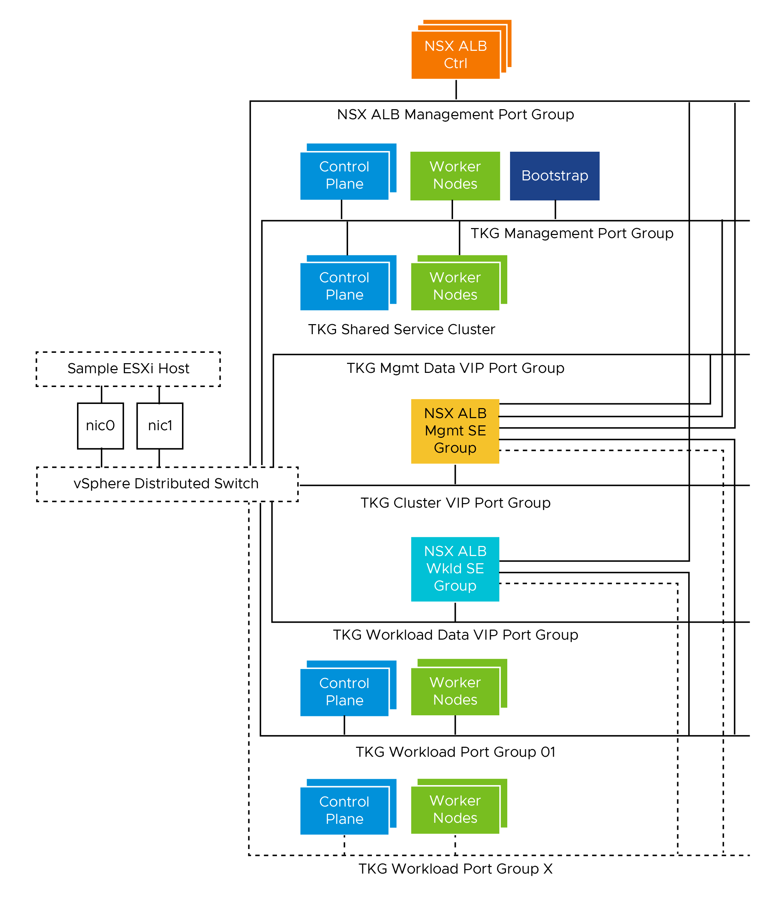
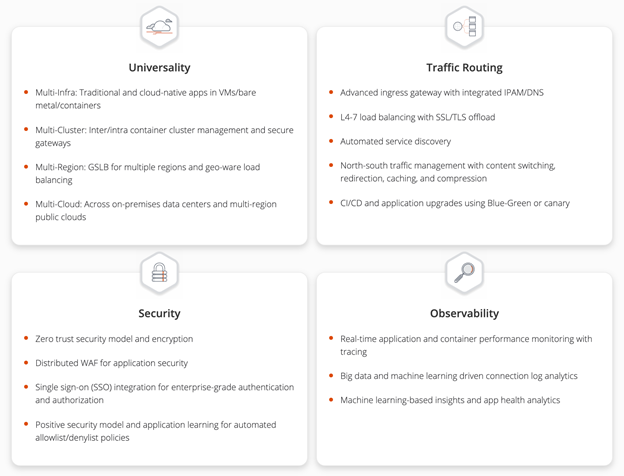
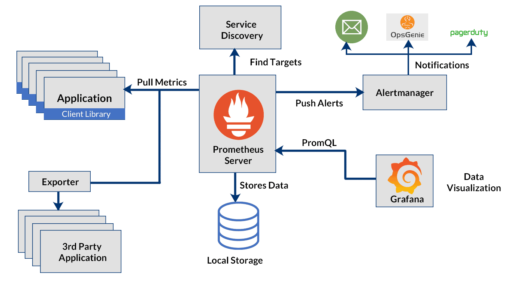
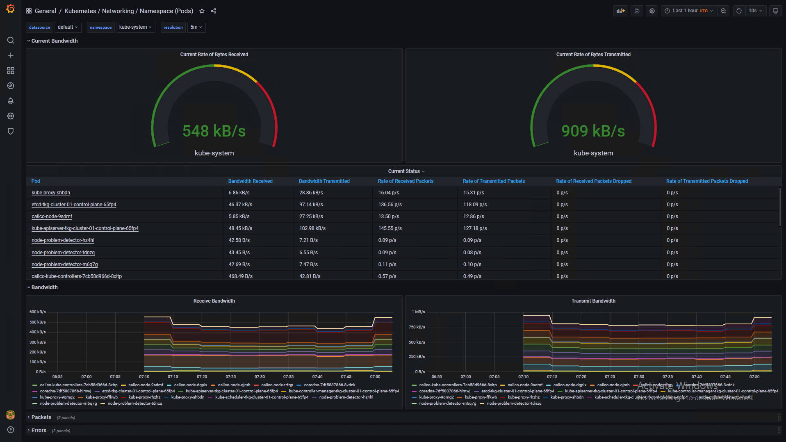
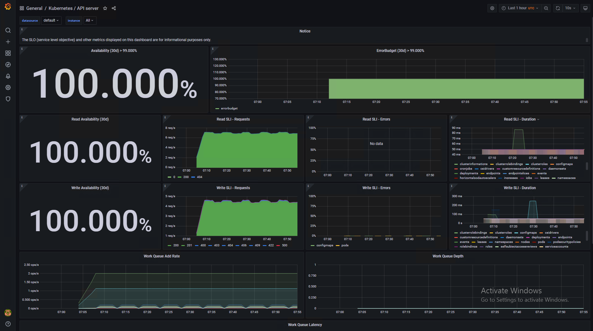
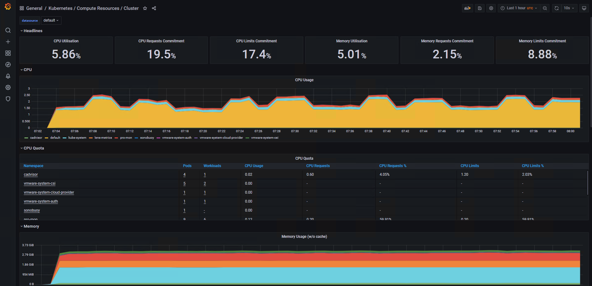

# Tanzu Kubernetes Grid on vSphere Networking in an Air-Gapped Environment Reference Design

VMware Tanzu Kubernetes Grid (multi-cloud) provides organizations with a consistent, upstream-compatible, regional Kubernetes substrate that is ready for end-user workloads and ecosystem integrations. 

An air-gapped environment is a network security measure employed to ensure a computer or computer network is secure by physically isolating it from unsecured networks, such as the public Internet or an unsecured local area network. This means a computer or network is disconnected from all other systems. 

This document lays out a reference design for deploying Tanzu Kubernetes Grid on vSphere Networking in an air-gapped environment and offers a high-level overview of the different components required for setting up a Tanzu Kubernetes Grid environment. 

## Components

The following components are used in the reference architecture:

- **Tanzu Kubernetes Grid (TKG)** - Enables creation and lifecycle management of Kubernetes clusters.

- **NSX Advanced Load Balancer Enterprise Edition** - Provides layer 4 service type load balancer and layer 7 ingress support. NSX Advanced Load Balancer is recommended for vSphere deployments without NSX-T, or which have unique scale requirements.

- **User-Managed Tanzu Packages:**
  - [**Cert Manager**](https://docs.vmware.com/en/VMware-Tanzu-Kubernetes-Grid/1.5/vmware-tanzu-kubernetes-grid-15/GUID-packages-cert-manager.html) - Provides automated certificate management. It runs by default in management clusters.

  - [**Contour**](https://docs.vmware.com/en/VMware-Tanzu-Kubernetes-Grid/1.5/vmware-tanzu-kubernetes-grid-15/GUID-packages-ingress-contour.html) - Provides layer 7 ingress control to deployed HTTP(S) applications. Tanzu Kubernetes Grid includes signed binaries for Contour. Deploying Contour is a prerequisite for deploying the Prometheus, Grafana, and Harbor extensions.

  - [**Fluent Bit**](https://docs.vmware.com/en/VMware-Tanzu-Kubernetes-Grid/1.5/vmware-tanzu-kubernetes-grid-15/GUID-packages-logging-fluentbit.html) - Collects data and logs from different sources, unifies them, and sends them to multiple destinations. Tanzu Kubernetes Grid includes signed binaries for Fluent Bit.

  - [**Prometheus**](https://docs.vmware.com/en/VMware-Tanzu-Kubernetes-Grid/1.5/vmware-tanzu-kubernetes-grid-15/GUID-packages-monitoring.html) - Provides out-of-the-box health monitoring of Kubernetes clusters. The Tanzu Kubernetes Grid implementation of Prometheus includes Alert Manager. You can configure Alert Manager to notify you when certain events occur.

  - [**Grafana**](https://docs.vmware.com/en/VMware-Tanzu-Kubernetes-Grid/1.5/vmware-tanzu-kubernetes-grid-15/GUID-packages-monitoring.html) - Provides monitoring dashboards for displaying key health metrics of Kubernetes clusters. Tanzu Kubernetes Grid includes an implementation of Grafana.

  - [**Harbor Image Registry**](https://docs.vmware.com/en/VMware-Tanzu-Kubernetes-Grid/1.5/vmware-tanzu-kubernetes-grid-15/GUID-packages-harbor-registry.html) - Provides a centralized location to push, pull, store, and scan container images used in Kubernetes workloads. It supports storing artifacts and includes enterprise-grade features such as role-based access control (RBAC), retention policies, automated garbage cleanup, and Docker hub proxying.

  - [**Multus CNI**](https://github.com/k8snetworkplumbingwg/multus-cni) - Enables attaching multiple network interfaces to pods. Multus CNI is a container network interface (CNI) plugin for Kubernetes that lets you attach multiple network interfaces to a single pod and associate each with a different address range.

- **Bastion Host -** Bastion host is the physical/virtual machine where you download the required installation images/binaries (for TKG installation) from the internet. This machine needs to be outside the air-gapped environment. The downloaded items then need to be shipped to the bootstrap machine which is inside the air-gapped environment.

- **Jumpbox/Bootstrap Machine -** The bootstrap machine is the machine on which you run the Tanzu CLI and other utilities such as [Kubectl](https://kubernetes.io/docs/reference/kubectl/kubectl/), [Kind](https://kind.sigs.k8s.io/), etc. This is where the initial bootstrapping of a management cluster occurs before it is pushed to the platform where it will run. 

  The installation binaries for TKG installation are made available in iso/tarball format on this machine. This machine should have access to the infrastructure components such as the vCenter server and the components that will be deployed during the installation of Tanzu Kubernetes Grid. This machine should have a browser installed to access the UI of the components described above.

- **Local Image Registry -** An image registry provides a location for pushing, pulling, storing, and scanning container images used in the Tanzu Kubernetes Grid environment. The image registry is also used for day-2 operations of the Tanzu Kubernetes clusters, such as storing application images, upgrading Tanzu Kubernetes clusters, and so forth. 

In an air-gapped environment, there are two ways to deploy an image registry:

- **Existing Image Registry -** An image registry pre-existing in the environment with a project created for storing TKG binaries. The bootstrap machine has access to this registry. After unzipping the tarball present at the bootstrap machine, the operator uses a script included in the tarball to push the TKG binaries to the TKG project. This registry can be a [Harbor](https://goharbor.io/) registry or any other container registry solution.

- **New Image Registry -** If there is no pre-existing image registry in the environment, a new registry instance can be deployed. The easiest way to create a new image registry instance is to install Harbor using the `docker-compose` method and then push the TKG binaries to the appropriate project.

## Supported Component Matrix

The following table provides the component versions and interoperability matrix supported with the reference design:

|**Software Components**|**Version**|
| --- | --- |
|Tanzu Kubernetes Grid|1.6.0|
|VMware vSphere ESXi|7.0 U3 |
|VMware vCenter (VCSA)|7.0 U3 |
|VMware vSAN|7.0 U3 |
|NSX Advanced LB|21.1.4|

For the latest information, see [VMware Product Interoperability Matrix](https://interopmatrix.vmware.com/Interoperability?col=551,8803&row=789,%262,%26912,).

## Tanzu Kubernetes Grid Components

VMware Tanzu Kubernetes Grid (TKG) provides organizations with a consistent, upstream-compatible, regional Kubernetes substrate that is ready for end-user workloads and ecosystem integrations. You can deploy Tanzu Kubernetes Grid across software-defined datacenters (SDDC) and public cloud environments, including vSphere, Microsoft Azure, and Amazon EC2.

Tanzu Kubernetes Grid comprises the following components:

**Management Cluster -** A management cluster is the first element that you deploy when you create a Tanzu Kubernetes Grid instance. The management cluster is a Kubernetes cluster that performs the role of the primary management and operational center for the Tanzu Kubernetes Grid instance. The management cluster is purpose-built for operating the platform and managing the lifecycle of Tanzu Kubernetes clusters.

**Cluster API -** TKG functions through the creation of a Management Kubernetes cluster that houses the [Cluster API](https://cluster-api.sigs.k8s.io/). The Cluster API then interacts with the infrastructure provider to service workload Kubernetes cluster lifecycle requests.

**Workload Clusters -** Workload clusters are the Kubernetes clusters in which your application workloads run. Workload clusters can run different versions of Kubernetes, depending on the needs of the applications they run.

**Shared Service Cluster -**  Each Tanzu Kubernetes Grid instance can only have one shared services cluster. You will deploy this cluster only if you intend to deploy shared services such as Contour and Harbor. 

**Tanzu Kubernetes Cluster Plans -** A cluster plan is a blueprint that describes the configuration with which to deploy a Tanzu Kubernetes cluster. It provides a set of configurable values that describe settings like the number of control plane machines, worker machines, VM types, and so on.

This current release of Tanzu Kubernetes Grid provides two default templates, dev, and prod. You can create and use custom plans to meet your requirements.

**Tanzu Kubernetes Grid Instance -** A Tanzu Kubernetes Grid instance is the full deployment of Tanzu Kubernetes Grid, including the management cluster, the workload clusters, and the shared services cluster that you configure.

**Tanzu CLI -** A command-line utility that provides the necessary commands to build and operate Tanzu management and tanzu Kubernetes clusters. 

**Carvel Tools** **-** Carvel is an open-source suite of reliable, single-purpose, composable tools that aid in building, configuring, and deploying applications to Kubernetes. Tanzu Kubernetes Grid uses the following Carvel tools:

- **ytt -** a command-line tool for templating and patching YAML files. You can also use `ytt` to collect fragments and piles of YAML into re-usable modules.
- **kapp -** the application deployment CLI for Kubernetes. It allows you to install, upgrade, and delete multiple Kubernetes resources as one application.
- **kbld -** an image-building and resolution tool.
- **imgpkg -** a tool that enables Kubernetes to store configurations and the associated container images as Open Container Initiative (OCI) images, and to transfer these images.
- **yq -** a lightweight and portable command-line YAML, JSON, and XML processor. `yq` uses `jq`-like syntax but works with YAML files as well as JSON and XML.

**Tanzu Kubernetes Grid Installer -** The Tanzu Kubernetes Grid installer is a CLI/graphical wizard that provides an option to deploy a management cluster. You launch locally on the bootstrap machine by running the `tanzu management-cluster create` command.

## Tanzu Kubernetes Grid Storage
Tanzu Kubernetes Grid integrates with shared datastores available in the vSphere infrastructure. The following types of shared datastores are supported:

- vSAN
- VMFS
- NFS
- vVols 

Tanzu Kubernetes Grid uses storage policies to integrate with shared datastores. The policies represent datastores and manage the storage placement of such objects as control plane VMs, container images, and persistent storage volumes.

Tanzu Kubernetes Grid Cluster Plans can be defined by operators to use a certain vSphere Datastore when creating new workload clusters. All developers would then have the ability to provision container-backed persistent volumes from that underlying datastore.

Tanzu Kubernetes Grid is agnostic about which option you choose. For Kubernetes stateful workloads, TKG installs the [vSphere Container Storage interface (vSphere CSI)](https://github.com/container-storage-interface/spec/blob/master/spec.md) to automatically provision Kubernetes persistent volumes for pods. 

[VMware vSAN](https://docs.vmware.com/en/VMware-vSAN/index.html) is a recommended storage solution for deploying Tanzu Kubernetes Grid clusters on vSphere. 

|**Decision ID**|**Design Decision**|**Design Justification**|**Design Implications**|
| --- | --- | --- | --- |
|TKO-STG-001|Use vSAN storage for TKO|By using vSAN as the shared storage solution, you can take advantage of local storage.|Adds additional cost as you have to procure vSAN license before you can use. |
|TKO-STG-002|Use vSAN storage for TKO|vSAN supports NFS volumes in ReadWriteMany access modes.|vSAN File Services need to be configured to leverage this.vSAN File Service is available only in vSAN Enterprise and Enterprise Plus editions|

While the default vSAN storage policy can be used, administrators should evaluate the needs of their applications and craft a specific [vSphere Storage Policy](https://docs.vmware.com/en/VMware-vSphere/6.7/com.vmware.vsphere.storage.doc/GUID-89091D59-D844-46B2-94C2-35A3961D23E7.html). vSAN storage policies describe classes of storage (e.g. SSD, NVME, etc.) along with quotas for your clusters. For more information on this, see [vSAN Policy Design](https://docs.vmware.com/en/VMware-Validated-Design/6.2/sddc-architecture-and-design-for-the-management-domain/GUID-450DFB03-1882-4A2A-B09F-2C7627095FD3.html#vsan-policy-design-3)


Starting with vSphere 7.0 environments with vSAN, the vSphere CSI driver for Kubernetes also supports the creation of NFS File Volumes, which support ReadWriteMany access modes. This allows for provisioning volumes, which can be read and written from multiple pods simultaneously. To support this, you must enable vSAN File Service.

**Note:** vSAN File Service is available only in the vSAN Enterprise and Enterprise Plus editions.

## Tanzu Kubernetes Clusters Networking

A Tanzu Kubernetes cluster provisioned by the Tanzu Kubernetes Grid supports two Container Network Interface (CNI) options: 

- [Antrea](https://antrea.io/)

- [Calico](https://www.tigera.io/project-calico/)

Both are open-source software that provides networking for cluster pods, services, and ingress. When you deploy a Tanzu Kubernetes cluster using Tanzu CLI using the default configuration, Antrea CNI is automatically enabled in the cluster. 

Tanzu Kubernetes Grid also supports [Multus](https://github.com/k8snetworkplumbingwg/multus-cni) CNI which can be installed through Tanzu user-managed packages. Multus CNI lets you attach multiple network interfaces to a single pod and associate each with a different address range.

To provision a Tanzu Kubernetes cluster using a non-default CNI, see the following instructions:
- [Deploy Tanzu Kubernetes clusters with calico](https://docs.vmware.com/en/VMware-Tanzu-Kubernetes-Grid/1.6/vmware-tanzu-kubernetes-grid-16/GUID-tanzu-k8s-clusters-networking.html#enable-calico-2)

- [Implement Multiple Pod Network Interfaces with Multus](https://docs.vmware.com/en/VMware-Tanzu-Kubernetes-Grid/1.6/vmware-tanzu-kubernetes-grid-16/GUID-packages-cni-multus.html)

Each CNI is suitable for a different use case. The following table lists common use cases for the three CNIs that Tanzu Kubernetes Grid supports. This table will help you with information on selecting the right CNI in your Tanzu Kubernetes Grid implementation.

|**CNI**|**Use Case**|**Pros and Cons**|
| --- | --- | --- |
|Antrea|<p>Enable Kubernetes pod networking with IP overlay networks using VXLAN or Geneve for encapsulation. Optionally encrypt node-to-node communication using IPSec packet encryption.</p><p></p><p>Antrea supports advanced network use cases like kernel bypass and network service mesh.</p>|<p>**Pros:**</p><p>- Provide an option to Configure Egress IP Pool or Static Egress IP for the Kubernetes Workloads.</p>|
|Calico|<p>Calico is used in environments where factors like network performance, flexibility, and power are essential.</p><p></p><p>For routing packets between nodes, Calico leverages the BGP routing protocol instead of an overlay network. This eliminates the need to wrap packets with an encapsulation layer resulting in increased network performance for Kubernetes workloads.</p>|<p>**Pros:**</p><p>- Support for Network Policies.</p><p>- High network performance.</p><p>- SCTP Support.</p><p>**Cons:**</p><p>- No multicast support.</p>|
|Multus|Multus CNI provides multiple interfaces per each Kubernetes pod. Using Multus CRDs, you can specify which pods get which interfaces and allow different interfaces depending on the use case.|<p>Pros</p><p>- Separation of data/control planes.</p><p>- Separate security policies can be used for separate interfaces. </p><p>- Supports SR-IOV, DPDK, OVS-DPDK, and VPP workloads in Kubernetes with both cloud native and NFV based applications in Kubernetes.</p>|

## Tanzu Kubernetes Grid Infrastructure Networking
Tanzu Kubernetes Grid on vSphere can be deployed on various networking stacks including

* VMware NSX-T Data Center Networking.
* vSphere Networking (VDS).

**Note:** The scope of this document is limited to vSphere Networking.

## TKG on vSphere Networking with NSX Advanced Load Balancer
Tanzu Kubernetes Grid when deployed on the vSphere networking uses the distributed port groups to provide connectivity to Kubernetes control plane VMs, worker nodes, services, and applications. All hosts from the cluster where Tanzu Kubernetes clusters are deployed are connected to the distributed switch that provides connectivity to the Kubernetes environment.

You can configure NSX Advanced Load Balancer in Tanzu Kubernetes Grid as:

- A load balancer for workloads in the clusters that are deployed on vSphere.
- The L7 ingress service provider for the workloads in the clusters that are deployed on vSphere.
- The VIP endpoint provider for the control plane API server.

Each workload cluster integrates with NSX Advanced Load Balancer by running an Avi Kubernetes Operator (AKO) on one of its nodes. The cluster’s AKO calls the Kubernetes API to manage the lifecycle of load balancing and ingress resources for its workloads.

## NSX Advanced Load Balancer Components
NSX Advanced Load Balancer is deployed in Write Access Mode in the vSphere environment. This mode grants NSX Advanced Load Balancer Controller full write access to the vCenter which helps in automatically creating, modifying, and removing service engines (SEs) and other resources as needed to adapt to changing traffic needs. The core components of NSX Advanced Load Balancer are as follows:

- **NSX Advanced Load Balancer Controller** - NSX Advanced Load Balancer Controller manages Virtual Service objects and interacts with the vCenter Server infrastructure to manage the lifecycle of the service engines (SEs). It is the central repository for the configurations and policies related to services and management, and it provides the portal for viewing the health of VirtualServices and SEs and the associated analytics that NSX Advanced Load Balancer provides.
- **NSX Advanced Load Balancer Service Engine** - The service engines (SEs) are lightweight VMs that handle all data plane operations by receiving and executing instructions from the controller. The SEs perform load balancing and all client- and server-facing network interactions.

- **Cloud -** Clouds are containers for the environment that NSX Advanced Load Balancer is installed or operating within. During initial setup of NSX Advanced Load Balancer, a default cloud, named Default-Cloud, is created. This is where the first controller is deployed into Default-Cloud. Additional clouds may be added, containing SEs and virtual services.

- **Avi Kubernetes Operator (AKO)** - It is a Kubernetes operator that runs as a pod in the Supervisor Cluster and Tanzu Kubernetes clusters, and it provides ingress and load balancing functionality. AKO translates the required Kubernetes objects to NSX Advanced Load Balancer objects and automates the implementation of ingresses, routes, and services on the service engines (SE) through the NSX Advanced Load Balancer Controller.
- **AKO Operator (AKOO)** - This is an operator which is used to deploy, manage, and remove the AKO pod in Kubernetes clusters. This operator when deployed creates an instance of the AKO controller and installs all the relevant objects like:
  - AKO `StatefulSet`
  - `ClusterRole` and `ClusterRoleBinding`
  - `ConfigMap` required for the AKO controller and other artifacts.

Tanzu Kubernetes Grid management clusters have an AKO operator installed out of the box during cluster deployment. By default, a Tanzu Kubernetes Grid management cluster has a couple of AkoDeploymentConfig created which dictates when and how AKO pods are created in the workload clusters. For more information, see [AKO Operator documentation](https://github.com/vmware/load-balancer-and-ingress-services-for-kubernetes/tree/master/ako-operator).

Each environment configured in NSX Advanced Load Balancer is referred to as a cloud. Each cloud in NSX Advanced Load Balancer maintains networking and NSX Advanced Load Balancer Service Engine settings. The cloud is configured with one or more VIP networks to provide IP addresses to load balancing (L4 or L7) virtual services created under that cloud.

The virtual services can span across multiple service engines if the associated Service Engine Group is configured in the Active/Active HA mode. A service engine can belong to only one Service Engine group at a time.

IP address allocation for virtual services can be over DHCP or using NSX Advanced Load Balancer in-built IPAM functionality. The VIP networks created or configured in NSX Advanced Load Balancer are associated with the IPAM profile.

# Network Architecture

For the deployment of Tanzu Kubernetes Grid in the vSphere environment, it is required to build separate networks for the Tanzu Kubernetes Grid management cluster and workload clusters, NSX Advanced Load Balancer management, cluster-VIP network for control plane HA, Tanzu Kubernetes Grid management VIP or data network, and Tanzu Kubernetes Grid workload data or VIP network.

The network reference design can be mapped into this general framework.



This topology enables the following benefits:

- Isolate and separate SDDC management components (vCenter, ESX) from the Tanzu Kubernetes Grid components. This reference design allows only the minimum connectivity between the Tanzu Kubernetes Grid clusters and NSX Advanced Load Balancer to the vCenter Server.
- Isolate and separate NSX Advanced Load Balancer management network from the Tanzu Kubernetes Grid management segment and the Tanzu Kubernetes Grid workload segments.
- Depending on the workload cluster type and use case, multiple workload clusters may leverage the same workload network or new networks can be used for each workload cluster. To isolate and separate Tanzu Kubernetes Grid workload cluster networking from each other it’s recommended to make use of separate networks for each workload cluster and configure the required firewall between these networks. For more information, see [Firewall Requirements](#firewall-requirements).
- Separate provider and tenant access to the Tanzu Kubernetes Grid environment.
  - Only provider administrators need access to the Tanzu Kubernetes Grid management cluster. This prevents tenants from attempting to connect to the TKG management cluster.
- Only allow tenants to access their Tanzu Kubernetes Grid workload clusters and restrict access to this cluster from other tenants.

## Network Requirements

As per the defined architecture, the list of required networks is as follows:

|**Network Type**|**DHCP Service**|<p>**Description & Recommendations**</p><p></p>|
| --- | --- | --- |
|NSX ALB Management Network|Optional|<p>NSX ALB controllers and SEs will be attached to this network. </p><p></p><p>DHCP is not a mandatory requirement on this network as NSX ALB can take care of IPAM. </p>|
|TKG Management Network|Yes|Control plane and worker nodes of the TKG Management cluster and Shared Service cluster will be attached to this network.<br><br>Creating a shared service cluster on a separate network is also supported.|
|TKG Workload Network|Yes|Control plane and worker nodes of TKG Workload Clusters will be attached to this network.|
|TKG Cluster VIP/Data Network|No|<p>Virtual services for Control plane HA of all TKG clusters (Management, Shared service, and Workload).</p><p><br>Reserve sufficient IPs depending on the number of TKG clusters planned to be deployed in the environment, NSX ALB takes care of IPAM on this network.</p>|
|TKG Management VIP/Data Network|No|Virtual services for all user-managed packages (such as Contour and Harbor) hosted on the Shared service cluster.|
|TKG Workload VIP/Data Network|No|<p>Virtual services for all applications hosted on the Workload clusters.</p><p><br>Reserve sufficient IPs depending on the number of applications that are planned to be hosted on the Workload clusters along with scalability considerations.</p>|

## Subnet and CIDR Examples

The deployment described in this document makes use of the following CIDR.

|**Network Type**|**Port Group Name**|**Gateway CIDR**|**DHCP Pool**|**NSX ALB IP Pool**|
| --- | --- | --- | --- | --- |
|NSX ALB Mgmt Network|`nsx_alb_management_pg`|172.16.10.1/24|N/A|172.16.10.100- 172.16.10.200|
|TKG Management Network|`tkg_mgmt_pg`|172.16.40.1/24|172.16.40.100- 172.16.40.200|N/A|
|TKG Mgmt VIP Network|`tkg_mgmt_vip_pg`|172.16.50.1/24|N/A|172.16.50.100- 172.16.50.200|
|TKG Cluster VIP Network|`tkg_cluster_vip_pg`|172.16.80.1/24|N/A|172.16.80.100- 172.16.80.200|
|TKG Workload VIP Network|`tkg_workload_vip_pg`|172.16.70.1/24|N/A|172.16.70.100 - 172.16.70.200|
|TKG Workload Segment|`tkg_workload_pg`|172.16.60.1/24|172.16.60.100- 172.16.60.200|N/A|


## <a id=ra-firewall-requirements> </a> Firewall Requirements

To prepare the firewall, you need to gather the following information:

1. NSX ALB Controller nodes and Cluster IP address.
1. NSX ALB Management Network CIDR
1. TKG Management Network CIDR.
1. TKG Workload Network CIDR.
1. TKG Cluster VIP Range.
1. TKG Management VIP Range.
1. TKG Workload VIP Range.
1. Bastion host IP address.
1. Bootstrap machine IP address.
1. VMware Harbor registry IP
1. vCenter Server IP
1. DNS server IP(s)
1. NTP Server IP(s)
1. DHCP Server IP(s)

The following table provides a list of firewall rules based on the assumption that there is no firewall within a subnet/VLAN. 

|**Source**|**Destination**|**Protocol:Port**|**Description**|
| --- | --- | --- | --- |
|Bastion Host|Internet|TCP:80/443|To download installation binaries required for TKG installation.|
|Bootstrap VM|vCenter Server|TCP:443|To create resource pools, VM folders, etc, in vCenter.|
|Bootstrap VM|NSX ALB Controller nodes and Cluster IP Address.|TCP:443|To access the NSX ALB portal for configuration.|
|<p>TKG Management Network CIDR</p><p></p><p>TKG Workload Network CIDR.</p>|<p>DNS Server</p><p><br></p><p>NTP Server</p>|<p>UDP:53</p><p><br></p><p>UDP:123</p>|<p>DNS Service </p><p><br></p><p>Time Synchronization</p>|
|<p>TKG Management Network CIDR</p><p></p><p>TKG Workload Network CIDR.</p>|DHCP Server|UDP: 67, 68|Allows TKG nodes to get DHCP addresses.|
|<p>TKG Management Network CIDR</p><p></p><p>TKG Workload Network CIDR.</p>|vCenter IP|TCP:443|Allows components to access vCenter to create VMs and Storage Volumes|
|<p>TKG Management Network CIDR</p><p></p><p>TKG Workload Network CIDR.</p>|Harbor Registry|TCP:443|<p>Allows components to retrieve container images. </p><p>This registry needs to be a private registry.  </p>|
|<p>TKG Management Network CIDR</p><p></p><p></p><p></p><p>TKG Workload Network CIDR.</p>|TKG Cluster VIP Range. |TCP:6443|<p>For the management cluster to configure shared services and workload clusters.</p><p></p><p>Allow Workload cluster to register with management cluster</p>|
|<p>TKG Management Network CIDR</p><p></p><p>TKG Workload Network CIDR.</p>|NSX ALB Controllers and Cluster IP Address.|TCP:443|Allow Avi Kubernetes Operator (AKO) and AKO Operator (AKOO) access to Avi Controller|
|NSX Advanced Load Balancer Management Network |vCenter and ESXi Hosts|TCP:443|Allow NSX Advanced Load Balancer to discover vCenter objects and deploy SEs as required|
|NSX Advanced Load Balancer Controller Nodes |DNS server <br> NTP Server|TCP/UDP:53 <br> UDP:123|DNS Service <br> Time Synchronization|
|Admin network|Bootstrap VM|SSH:22|To deploy, manage  and configure TKG clusters|
|deny-all|any|any|deny|


## Installation Experience

Tanzu Kubernetes Grid management cluster is the first component that you deploy to get started with Tanzu Kubernetes Grid.

You can deploy the management cluster in two ways:

- Run the Tanzu Kubernetes Grid installer, a wizard interface that guides you through the process of deploying a management cluster. 
- Create and edit YAML configuration files, and use them to deploy a management cluster with the CLI commands. This is the recommended method if you are installing a TKG Management cluster in an air-gapped environment.

See supplemental information [Cluster Deployment Parameters](#deployment-parameters) for a sample YAML file used for management cluster deployment.

The installation process takes you through the setup of a **Management Cluster** on your vSphere environment. Once the management cluster is deployed, you can use Tanzu CLI to deploy Tanzu Kubernetes Shared Services and workload clusters and install user-managed packages.

# Kubernetes Ingress Routing

The default installation of Tanzu Kubernetes Grid does not have any ingress controller installed. Users can use Contour (available for installation through Tanzu Packages) or any third-party ingress controller of their choice.

Contour is an open-source controller for Kubernetes ingress routing. Contour can be installed in the shared services cluster on any Tanzu Kubernetes Cluster. Deploying Contour is a prerequisite if you want to deploy the Prometheus, Grafana, and Harbor Packages on a workload cluster.

For more information about Contour, see the [Contour](https://projectcontour.io/) site and [Implementing Ingress Control with Contour](https://docs.vmware.com/en/VMware-Tanzu-Kubernetes-Grid/1.6/vmware-tanzu-kubernetes-grid-16/GUID-packages-ingress-contour.html).

Another option is to use the NSX Advanced Load Balancer Kubernetes ingress controller (available only with the NSX ALB Enterprise license) which offers an advanced L7 ingress for containerized applications that are deployed in the Tanzu Kubernetes workload cluster. 



For more information about the NSX Advanced Load Balancer ingress controller, see [Configuring L7 Ingress with NSX Advanced Load Balancer](https://docs.vmware.com/en/VMware-Tanzu-Kubernetes-Grid/1.6/vmware-tanzu-kubernetes-grid-16/GUID-networking-configure-l7.html).

[Tanzu Service Mesh](https://tanzu.vmware.com/service-mesh), which is a SaaS offering for modern applications running across multi-cluster, multi-clouds, also offers an ingress controller based on [Istio](https://istio.io/).


The following table provides general recommendations on when you should use a specific ingress controller for your Kubernetes environment.

|**Ingress Controller**|**Use Cases**|
| --- | --- |
|Contour|<p>Use contour when only north-south traffic is needed in a Kubernetes cluster. You can apply security policies for north-south traffic by defining the policies in the applications manifest file.</p><p></p><p>Contour is a reliable solution for simple Kubernetes workloads. </p>|
|NSX ALB Ingress controller|Use the NSX ALB ingress controller when a containerized application requires features like local and global server load balancing (GSLB), web application firewall, performance monitoring, direct routing from LB to pod, etc.|
|Istio|Use Istio ingress controller when you intend to provide security, traffic direction, and insights within the cluster (east-west traffic) and between the cluster and the outside world (north-south traffic).|

### NSX ALB as in L4+L7 Ingress Service Provider

As a load balancer, NSX Advanced Load Balancer provides an L4+L7 load balancing solution for vSphere. It includes a Kubernetes operator that integrates with the Kubernetes API to manage the lifecycle of load balancing and ingress resources for workloads.

Legacy ingress services for Kubernetes include multiple disparate solutions. The services and products contain independent components that are difficult to manage and troubleshoot. The ingress services have reduced observability capabilities with little analytics, and they lack comprehensive visibility into the applications that run on the system. Cloud-native automation is difficult in the legacy ingress services.

In comparison to the legacy Kubernetes ingress services, NSX Advanced Load Balancer has comprehensive load balancing and ingress services features. As a single solution with a central control, NSX Advanced Load Balancer is easy to manage and troubleshoot. NSX Advanced Load Balancer supports real-time telemetry with an insight into the applications that run on the system. The elastic auto-scaling and the decision automation features highlight the cloud-native automation capabilities of NSX Advanced Load Balancer.

NSX Advanced Load Balancer also lets you configure L7 ingress for your workload clusters by using one of the following options:

- L7 ingress in ClusterIP mode
- L7 ingress in NodePortLocal mode
- L7 ingress in NodePort mode
- NSX ALB L4 ingress with Contour L7 ingress

#### L7 Ingress in ClusterIP Mode

This option enables NSX Advanced Load Balancer L7 ingress capabilities, including sending traffic directly from the service engines (SEs) to the pods, preventing multiple hops that other ingress solutions need when sending packets from the load balancer to the right node where the pod runs. The ALB controller creates a virtual service with a backend pool with the pod IP addresses which helps to send the traffic directly to the pods.

However, each workload cluster needs a dedicated SE group for Avi Kubernetes Operator (AKO) to work, which could increase the number of SEs you need for your environment. This mode is used when you have a small number of workload clusters.

#### L7 Ingress in NodePort Mode

The NodePort mode is the default mode when AKO is installed on Tanzu Kubernetes Grid. This option allows your workload clusters to share SE groups and is fully supported by VMware. With this option, the services of your workloads must be set to NodePort instead of ClusterIP even when accompanied by an ingress object. This ensures that NodePorts are created on the worker nodes and traffic can flow through the SEs to the pods via the NodePorts. Kube-Proxy, which runs on each node as DaemonSet, creates network rules to expose the application endpoints to each of the nodes in the format “NodeIP:NodePort”. The NodePort value is the same for a service on all the nodes. It exposes the port on all the nodes of the Kubernetes Cluster, even if the pods are not running on it.

#### L7 Ingress in NodePortLocal Mode

This feature is supported only with Antrea CNI. The primary difference between this mode and the NodePort mode is that the traffic is sent directly to the pods in your workload cluster through node ports without interfering Kube-proxy. With this option, the workload clusters can share SE groups. Similar to the ClusterIP Mode, this option avoids the potential extra hop when sending traffic from the NSX Advanced Load Balancer SEs to the pod by targeting the right nodes where the pods run.

Antrea agent configures NodePortLocal port mapping rules at the node in the format “NodeIP:Unique Port” to expose each pod on the node on which the pod of the service is running. The default range of the port number is 61000-62000. Even if the pods of the service are running on the same Kubernetes node, Antrea agent publishes unique ports to expose the pods at the node level to integrate with the load balancer.

#### NSX ALB L4 Ingress with Contour L7 Ingress

This option does not have all the NSX Advanced Load Balancer L7 ingress capabilities but uses it for L4 load balancing only and leverages Contour for L7 Ingress. This also allows sharing SE groups across workload clusters. This option is supported by VMware and it requires minimal setup.

# Tanzu Kubernetes Grid Monitoring

In an air-gapped environment, monitoring for the Tanzu Kubernetes clusters is provided via [Prometheus](https://prometheus.io/) and [Grafana](https://grafana.com/). Tanzu Kubernetes Grid includes signed binaries for Prometheus and Grafana that you can deploy on Tanzu Kubernetes clusters to monitor cluster health and services

- Prometheus is an open-source system monitoring and alerting toolkit. It can collect metrics from target clusters at specified intervals, evaluate rule expressions, display the results, and trigger alerts if certain conditions arise. The Tanzu Kubernetes Grid implementation of Prometheus includes **Alert Manager**, which you can configure to notify you when certain events occur.
- Grafana is open-source visualization and analytics software. It allows you to query, visualize, alert on, and explore your metrics no matter where they are stored. 

Both Prometheus and Grafana are installed via user-managed Tanzu packages by creating the deployment manifests and invoking the kubectl command to deploy the packages in the Tanzu Kubernetes clusters.

The following diagram shows how the monitoring components on a cluster interact.



You can use out-of-the-box Kubernetes dashboards or can create new dashboards to monitor compute/network/storage utilization of Kubernetes objects such as Clusters, Namespaces, Pods, etc. See the sample dashboards shown below:

**Namespace (Pods) Compute Resources Utilization Dashboard**


**Namespace (Pods) Networking Utilization Dashboard**



**API Server Availability Dashboard**



**Cluster Compute Resources Utilization Dashboard**



## Tanzu Kubernetes Grid Logging

[Fluent Bit](https://fluentbit.io/)  is a lightweight log processor and forwarder that allows you to collect data and logs from different sources, unify them, and send them to multiple destinations. Tanzu Kubernetes Grid includes signed binaries for Fluent Bit that you can deploy on management clusters and on Tanzu Kubernetes clusters to provide a log-forwarding service.

Tanzu Standard Runtime includes Fluent Bit as a user-managed package for the integration with logging platforms such as **vRealize LogInsight, Elasticsearch, Splunk, or other logging solutions**. For information about configuring Fluent Bit to your logging provider, see [Implement Log Forwarding with Fluent Bit](https://docs.vmware.com/en/VMware-Tanzu-Kubernetes-Grid/1.6/vmware-tanzu-kubernetes-grid-16/GUID-packages-logging-fluentbit.html).

You can deploy Fluent Bit on any management cluster or Tanzu Kubernetes clusters from which you want to collect logs. First, you configure an output plugin on the cluster from which you want to gather logs, depending on the endpoint that you use. Then, you deploy Fluent Bit on the cluster as a package.

vRealize Log Insight (vRLI) provides real-time log management and log analysis with machine learning-based intelligent grouping, high-performance searching, and troubleshooting across physical, virtual, and cloud environments. vRealize Log Insight already has a deep integration with the vSphere platform where you can get key actionable insights and it can be extended to include the cloud native stack as well. 

vRealize Log Insight appliance is available as a separate on-prem deployable product. You can also choose to go with the SaaS version vRealize Log Insight Cloud.


# Design Recommendations

## NSX ALB Recommendations

The following table provides the recommendations for configuring NSX Advanced Load Balancer in a Tanzu Kubernetes Grid environment.

|**Decision ID**|**Design Decision**|**Design Justification**|**Design Implications**|
| --- | --- | --- | --- |
|TKO-ALB-001|Deploy NSX ALB controller cluster nodes on a network dedicated to NSX-ALB|Isolate NSX ALB traffic from infrastructure management traffic and Kubernetes workloads.|Using the same network for NSX ALB Controller Cluster nodes allows for configuring a floating cluster IP address that will be assigned to the cluster leader.|
|TKO-ALB-002|Deploy 3 NSX ALB controller nodes.|To achieve high availability for the NSX ALB platform.|In clustered mode, NSX ALB availability is not impacted by an individual controller node failure. The failed node can be removed from the cluster and redeployed if recovery is not possible. |
|TKO-ALB-003|Use static IPs for the NSX ALB controllers if DHCP cannot guarantee a permanent lease.|NSX ALB Controller cluster uses management IPs to form and maintain quorum for the control plane cluster. Any changes would be disruptive.|NSX ALB Controller control plane might go down if the management IPs of the controller node changes.|
|TKO-ALB-004|Use NSX ALB IPAM for Service Engine data network and virtual services. |Guarantees IP address assignment for Service Engine Data NICs and Virtual Services.|Remove the corner case scenario when the DHCP server runs out of the lease or is down.|
|TKO-ALB-005|Reserve an IP in the NSX ALB management subnet to be used as the Cluster IP for the Controller Cluster.|NSX ALB portal is always accessible over Cluster IP regardless of a specific individual controller node failure.|NSX ALB administration is not affected by an individual controller node failure.|
|TKO-ALB-006|Use separate VIP networks for application load balancing per TKC.|Separate dev/test and prod workloads load balancer traffic from each other.|This is achieved by creating AkoDeploymentConfig per TKC. |
|TKO-ALB-007|Use separate TKG workload networks for isolating the different applications|Separate workload clusters as per the application workloads running, i.e general applications, PCI Apps, or DMZ Apps, etc. |Use different networks for workload clusters|
|TKO-ALB-008|Create separate Service Engine Groups for TKG management and workload clusters.|This allows isolating load balancing traffic of the management and shared services cluster from workload clusters.|Create dedicated Service Engine Groups under the vCenter cloud configured manually.|
|TKO-ALB-009|Share Service Engines for the same type of workload (dev/test/prod)clusters.|Minimize the licensing cost|<p>Each Service Engine contributes to the CPU core capacity associated with a license.</p><p></p><p>Sharing Service Engines can help reduce the licensing cost. </p>|

### NSX Advanced Load Balancer Service Engine Recommendations

|**Decision ID**|**Design Decision**|**Design Justification**|**Design Implications**|
| --- | --- | --- | --- |
|TKO-ALB-SE-001|Configure SE group for Active/Active HA mode.|Provides optimum resiliency, performance, and utilization.|Certain applications might not work in Active/Active HA mode. For instance, applications that require preserving client IP address. In such cases, use the legacy Active/Standby HA mode.|
|TKO-ALB-SE-002|Configure anti-affinity rule for the SE VMs.|This is ensure that no two SEs in the same SE group end up on same ESXi Host and thus avoid single point of failure.|DRS must be enabled on vSphere cluster where SE VMs will be deployed.|
|TKO-ALB-SE-003|Configure CPU and memory reservation for the SE VMs.|This is to ensure that service engines don’t compete with other VMs during resource contention.|CPU and memory reservation is configured at SE group level.|
|TKO-ALB-SE-004|Enable 'Dedicated dispatcher CPU' on SE groups that contain the SE VMs of 4 or more vCPUs. **Note:** This setting should be enabled on SE groups that are servicing applications that have high network requirement. |This will enable a dedicated core for packet processing enabling high packet pipeline on the SE VMs.|None.|
|TKO-ALB-SE-005|Create multiple SE Groups as desired to isolate applications.|Allows efficient isolation of applications and allows for better capacity planning. Allows flexibility of life-cycle-management.|None|
|TKO-ALB-SE-006|Create separate service engine groups for TKG management and workload clusters.|This allows isolating load balancing traffic of the management cluster from shared services cluster ad workload clusters.|None.|

### NSX Advanced Load Balancer L7 Ingress Recommendations

|**Decision ID**|**Design Decision**|**Design Justification**|**Design Implications**|
| --- | --- | --- | --- |
|TKO-ALB-L7-001|Deploy NSX ALB L7 ingress in ClusterIP mode.|1. Leverage NSX-ALB L7 ingress capabilities with direct routing from SE to pod. <br> 2. Use this mode when you have a small number of clusters.|1. SE groups cannot be shared across clusters. <br> 2. Dedicated SE group per cluster increases the license consumption of NSX ALB SE cores.|
|TKO-ALB-L7-002|Deploy NSX ALB L7 ingress in NodePort mode.|1. Default supported configuration of most of the CNI providers. <br> 2. TKG clusters can share SE groups, optimizing/maximizing capacity and license consumption. <br> 3. This mode is suitable when you have a large number of workload clusters.|1. Kube-Proxy does secondary hop of load balancing to re-distribute the traffic amongst the Pods and increases the east-west traffic in the Cluster. <br> 2. For load balancers that perform SNAT on the incoming traffic, session persistence does not work. <br> 3. NodePort configuration exposes a range of ports on all Kubernetes nodes irrespective of the Pod scheduling. It may hit the port range limitations as the number of services (of type nodePort) increases.|
|TKO-ALB-L7-003|Deploy NSX ALB L7 ingress in NodePortLocal mode.|1. Network hop efficiency is gained by by-passing the kube-proxy to receive external traffic to applications. <br> 2. TKG clusters can share SE groups, optimizing/maximizing capacity and license consumption. <br>3. Pod's node port will only exist on nodes where the Pod is running, and it helps to reduce the east-west traffic and encapsulation overhead. <br> 4. Better session persistence.|1. This is supported only with Antrea CNI. <br>2. NodePortLocal mode currently only supported for Nodes running Linux or Windows with IPv4 addresses. Only TCP and UDP service ports are supported (not SCTP). For more information, see [Antrea NodePortLocal Documentation](https://antrea.io/docs/v1.8.0/docs/node-port-local/).|

VMware recommends using NSX Advanced Load Balancer L7 ingress with the NodePortLocal mode as it gives you a distinct advantage over other modes as mentioned below:

- Although there is a constraint of one SE group per Tanzu Kubernetes Grid cluster, which results in increased license capacity, ClusterIP provides direct communication to the Kubernetes pods, enabling persistence and direct monitoring of individual pods.

- NodePort resolves the issue for needing a SE group per workload cluster, but a kube-proxy is created on each and every workload node even if the pod doesn’t exist in it, and there’s no direct connectivity. Persistence is then broken.

- NodePortLocal is the best of both use cases. Traffic is sent directly to the pods in your workload cluster through node ports without interfering with kube-proxy. SE groups can be shared and load balancing persistence is supported.

## Network Recommendations

The key network recommendations for a production-grade Tanzu Kubernetes Grid deployment with vSphere Networking are as follows:

|**Decision ID**|**Design Decision**|**Design Justification**|**Design Implications**|
| --- | --- | --- | --- |
|TKO-NET-001|Use separate networks for Management cluster and workload clusters|To have a flexible firewall and security policies|Sharing the same network for multiple clusters can complicate firewall rules creation. |
|TKO-NET-002|Use separate networks for workload clusters based on their usage.|Isolate production Kubernetes clusters from dev/test clusters.|<p>A separate set of Service Engines can be used for separating dev/test workload clusters from prod clusters.</p><p></p>|
|TKO-NET-003|Configure DHCP  for each TKG Cluster Network|Tanzu Kubernetes Grid does not support static IP assignments for Kubernetes VM components|IP Pool can be used for the TKG clusters in absence of the DHCP.|

## TKG Clusters Recommendations

|**Decision ID**|**Design Decision**|**Design Justification**|**Design Implications**|
| --- | --- | --- | --- |
|TKO-TKG-001|Deploy TKG Management cluster from CLI|UI doesn’t provide an option of specifying an internal registry to use for TKG installation.|Additional parameters are required to be passed in the cluster deployment file. Using the UI, you can’t pass these additional parameters. |
|TKO-TKG-002|Use NSX Advanced Load Balancer as your Control Plane Endpoint Provider and  application load balancing|Eliminates the requirement for an external load balancer and additional configuration changes on your Tanzu Kubernetes Grid clusters|NSX ALB is a true SDN solution and offers a flexible deployment model and automated way of scaling load balancer objects when needed.|
|TKO-TKG-003|Deploy Tanzu Kubernetes clusters with Prod plan.|This deploys multiple control plane nodes and provides High Availability for the control plane.|TKG infrastructure is not impacted by single node failure. |
|TKO-TKG-004|Enable identity management for Tanzu Kubernetes Grid clusters.|To avoid usage of administrator credentials and ensure that required users with the right roles have access to Tanzu Kubernetes Grid clusters|<p>Pinniped package helps with integrating the TKG Management cluster with LDAPS/OIDC Authentication.</p><p></p><p>Workload cluster inherits the authentication configuration from the management cluster</p>|
|TKO-TKG-005|Enable Machine Health Checks for TKG clusters|vSphere HA and Machine Health Checks interoperably work together to enhance workload resiliency|A MachineHealthCheck is a resource within the Cluster API that allows users to define conditions under which machines within a Cluster should be considered unhealthy. Remediation actions can be taken when MachineHealthCheck has identified a node as unhealthy.|

# Bring Your Own Images for Tanzu Kubernetes Grid Deployment

You can build custom machine images for Tanzu Kubernetes Grid to use as a VM template for the management and Tanzu Kubernetes (workload) cluster nodes that it creates. Each custom machine image packages a base operating system (OS) version and a Kubernetes version, along with any additional customizations, into an image that runs on vSphere, Microsoft Azure infrastructure, and AWS (EC2) environments.

A custom image must be based on the operating system (OS) versions that are supported by Tanzu Kubernetes Grid. The table below provides a list of the operating systems that are supported for building custom images for TKG.

|**vSphere**|**AWS**|**Azure**|
| --- | --- | --- |
|<p>- Ubuntu 20.04</p><p>- Ubuntu 18.04</p><p>- RHEL 7</p><p>- Photon OS 3</p>|<p>- Ubuntu 20.04</p><p>- Ubuntu 18.04</p><p>- Amazon Linux 2</p>|<p>- Ubuntu 20.04</p><p>- Ubuntu 18.04</p>|

For additional information on building custom images for Tanzu Kubernetes Grid, see the [Build Machine Images](https://docs.vmware.com/en/VMware-Tanzu-Kubernetes-Grid/1.6/vmware-tanzu-kubernetes-grid-16/GUID-build-images-index.html)

- [Linux Custom Machine Images](https://docs.vmware.com/en/VMware-Tanzu-Kubernetes-Grid/1.6/vmware-tanzu-kubernetes-grid-16/GUID-build-images-linux.html)
- [Windows Custom Machine Images](https://docs.vmware.com/en/VMware-Tanzu-Kubernetes-Grid/1.6/vmware-tanzu-kubernetes-grid-16/GUID-build-images-windows.html)

# Compliance and Security

VMware published Tanzu Kubernetes releases (TKrs), along with compatible versions of Kubernetes and supporting components, uses the latest stable and generally-available update of the OS version that it packages, containing all current CVE and USN fixes, as of the day that the image is built. The image files are signed by VMware and have filenames that contain a unique hash identifier.

VMware provides FIPS-Capable Kubernetes ova which can be used to deploy FIPS compliant TKG management and workload clusters. TKG core components, such as Kubelet, Kube-apiserver, Kube-controller manager, Kube-proxy, Kube-scheduler, Kubectl, Etcd, Coredns, Containerd, and Cri-tool are made FIPS compliant by compiling them with the [BoringCrypto](https://csrc.nist.gov/projects/cryptographic-module-validation-program/certificate/2964) FIPS modules, an open-source cryptographic library that provides [FIPS 140-2](https://www.nist.gov/standardsgov/compliance-faqs-federal-information-processing-standards-fips) approved algorithms. 

# Supplemental Information

## <a id=deployment-parameters> </a> **Cluster Deployment Parameters**

The following sample below provides the bare minimum input needed to deploy a Tanzu Kubernetes Grid management cluster in an air-gapped environment. 

```yaml
# NSX Advanced Load Balancer details

AVI_CA_DATA_B64: # NSX Advanced Load Balancer Controller Certificate in base64 encoded format.
AVI_CLOUD_NAME: # Name of the cloud that you created in your NSX Advanced Load Balancer deployment.
AVI_CONTROL_PLANE_HA_PROVIDER: "true/false" # Set to true to enable NSX Advanced Load Balancer as the control plane API server endpoint
AVI_CONTROLLER: # The IP or hostname of the NSX Advanced Load Balancer controller.
AVI_DATA_NETWORK:  # The network’s name on which the floating IP subnet or IP Pool is assigned to a load balancer for traffic to applications hosted on workload clusters. This network must be present in the same vCenter Server instance as the Kubernetes network that Tanzu Kubernetes Grid uses
AVI_DATA_NETWORK_CIDR: # The CIDR of the subnet to use for the load balancer VIP. This comes from one of the VIP network’s configured subnets.
AVI_ENABLE: "true/false" # Set to true or false. Enables NSX Advanced Load Balancer as a load balancer for workloads.
AVI_LABELS: # Optional labels in the format key: value. When set, NSX Advanced Load Balancer is enabled only on workload clusters that have this label.
AVI_MANAGEMENT_CLUSTER_VIP_NETWORK_CIDR: # The CIDR of the subnet to use for the management cluster and workload cluster’s control plane (if using NSX ALB to provide control plane HA) load balancer VIP.
AVI_MANAGEMENT_CLUSTER_VIP_NETWORK_NAME: # The network’s name where you assign a floating IP subnet or IP pool to a load balancer for management cluster and workload cluster control plane (if using NSX ALB to provide control plane HA).
AVI_PASSWORD: # Password of the NSX ALB Controller admin user in th base 64 encoded format
AVI_SERVICE_ENGINE_GROUP: # Name of the Service Engine Group configured in NSX ALB
AVI_USERNAME: admin

# Common Variables

CLUSTER_CIDR: # The CIDR range to use for pods.
SERVICE_CIDR: # The CIDR range to use for the Kubernetes services.
CLUSTER_NAME: # The name of the TKG Management Cluster that must comply with DNS hostname requirements as outlined in https://datatracker.ietf.org/doc/html/rfc952
CLUSTER_PLAN: # Can be set to dev, prod or custom. The dev plan deploys a cluster with a single control plane node. The prod plan deploys a highly available cluster with three control plane nodes.
ENABLE_AUDIT_LOGGING: # Audit logging for the Kubernetes API server. The default value is false. To enable audit logging, set the variable to true.
ENABLE_CEIP_PARTICIPATION: #The default value is true. false opts out of the VMware Customer Experience Improvement Program.
ENABLE_MHC: "true/false" # When set to true, machine health checks are enabled for management cluster control plane and worker nodes. For more information on machine health checks, see https://docs.vmware.com/en/VMware-Tanzu-Kubernetes-Grid/1.5/vmware-tanzu-kubernetes-grid-15/GUID-tanzu-config-reference.html#machine-health-checks-7
IDENTITY_MANAGEMENT_TYPE: <none/oidc/ldap> # Set oidc or ldap when enabling centralized authentication for management cluster access.
INFRASTRUCTURE_PROVIDER: # For vSphere platform set this value to vsphere

# Node Configuration

OS_ARCH: amd64
OS_NAME: # Defaults to ubuntu for Ubuntu LTS. Can also be photon for Photon OS on vSphere
OS_VERSION: "3"

# Proxy Configuration

TKG_HTTP_PROXY_ENABLED: "true/false" # To send outgoing HTTP(S) traffic from the management cluster to a proxy, for example in an internet-restricted environment, set this to true.
TKG_IP_FAMILY: ipv4
VSPHERE_CONTROL_PLANE_ENDPOINT: "" # If you use NSX Advanced Load Balancer, leave this field blank.

# Control Plane and Worker VM sizing

VSPHERE_CONTROL_PLANE_DISK_GIB: "40" # The size in gigabytes of the disk for the control plane node VMs. Include the quotes ("")
VSPHERE_CONTROL_PLANE_MEM_MIB: "16384" # The amount of memory in megabytes for the control plane node VMs
VSPHERE_CONTROL_PLANE_NUM_CPUS: "4" # The number of CPUs for the control plane node VMs. Include the quotes (""). Must be at least 2.
VSPHERE_WORKER_DISK_GIB: "40" # The size in gigabytes of the disk for the worker node VMs. Include the quotes ("")
VSPHERE_WORKER_MEM_MIB: "16384" # The amount of memory in megabytes for the worker node VMs. Include the quotes ("")
VSPHERE_WORKER_NUM_CPUS: "4" # The number of CPUs for the worker node VMs. Include the quotes (””). Must be at least 2.

# vSphere Infrastructure details

VSPHERE_DATACENTER: # The name of the datacenter in which to deploy the TKG management cluster.
VSPHERE_DATASTORE: # The name of the vSphere datastore where TKG cluster VMs will be stored.
VSPHERE_FOLDER: # The name of an existing VM folder in which to place TKG VMs.
VSPHERE_INSECURE: # Optional. Set to true or false to bypass thumbprint verification. If false, set VSPHERE_TLS_THUMBPRINT
VSPHERE_NETWORK: # The name of an existing vSphere network where TKG management cluster control plane and worker VMs will be connected.
VSPHERE_PASSWORD: # The password for the vSphere user account in base64 encoded format.
VSPHERE_RESOURCE_POOL: # The name of an existing resource pool in which to place TKG cluster.
VSPHERE_SERVER: # The IP address or FQDN of the vCenter Server instance on which to deploy the Tanzu Kubernetes cluster.
VSPHERE_SSH_AUTHORIZED_KEY: # Paste in the contents of the SSH public key that you created in on the bootstrap machine.
VSPHERE_TLS_THUMBPRINT: # if VSPHERE_INSECURE is false. The thumbprint of the vCenter Server certificate.
VSPHERE_USERNAME: # A vSphere user account, including the domain name, with the required privileges for Tanzu Kubernetes Grid operation
TKG_CUSTOM_IMAGE_REPOSITORY: # IP address or FQDN of your private registry
TKG_CUSTOM_IMAGE_REPOSITORY_CA_CERTIFICATE: #Set if your private image registry uses a self-signed certificate. Provide the CA certificate in base64 encoded format
  ```
  <!-- /* cSpell:enable */ -->

For a full list of configurable values, see [Tanzu CLI Configuration File Variable Reference](https://docs.vmware.com/en/VMware-Tanzu-Kubernetes-Grid/1.6/vmware-tanzu-kubernetes-grid-16/GUID-tanzu-config-reference.html).

## Configure Node Sizes

The Tanzu CLI creates the individual nodes of management clusters and Tanzu Kubernetes clusters according to the settings that you provide in the configuration file. 

On vSphere, you can configure all node VMs to have the same predefined configurations, set different predefined configurations for control plane and worker nodes, or customize the configurations of the nodes. By using these settings, you can create clusters that have nodes with different configurations from the management cluster nodes. You can also create clusters in which the control plane nodes and worker nodes have different configurations.

**Use Predefined Node Configurations**

The Tanzu CLI provides the following predefined configurations for cluster nodes:

|**Size**|**CPU**|**Memory (in GB)**|**Disk (in GB)**|
| --- | --- | --- | --- |
|Small|2|4|20|
|Medium|2|8|40|
|Large|4|16|40|
|Extra-large|8|32|80|

To create a cluster in which all of the control plane and worker node VMs are the same size, specify the `SIZE` variable. If you set the `SIZE` variable, all nodes will be created with the configuration that you set.

  ```yaml
  SIZE: "large"
  ```

To create a cluster in which the control plane and worker node VMs are different sizes, specify the `CONTROLPLANE_SIZE` and `WORKER_SIZE` options.

  ```yaml
  CONTROLPLANE_SIZE: "medium"
  WORKER_SIZE: "large"
  ```

You can combine the `CONTROLPLANE_SIZE` and `WORKER_SIZE` options with the `SIZE` option. For example, if you specify `SIZE: "large"` with `WORKER_SIZE: "extra-large"`, the control plane nodes will be set to large and worker nodes will be set to extra-large.

  ```yaml
  SIZE: "large"
  WORKER_SIZE: "extra-large"
  ```

**Define Custom Node Configurations**

You can customize the configuration of the nodes rather than using the predefined configurations. 

To use the same custom configuration for all nodes, specify the `VSPHERE_NUM_CPUS`, `VSPHERE_DISK_GIB`, and `VSPHERE_MEM_MIB` options.

  ```yaml
  VSPHERE_NUM_CPUS: 2
  VSPHERE_DISK_GIB: 40
  VSPHERE_MEM_MIB: 4096
  ```

To define different custom configurations for control plane nodes and worker nodes, specify the `VSPHERE_CONTROL_PLANE_*` and `VSPHERE_WORKER_*`

```yaml
VSPHERE_CONTROL_PLANE_NUM_CPUS: 2
VSPHERE_CONTROL_PLANE_DISK_GIB: 20
VSPHERE_CONTROL_PLANE_MEM_MIB: 8192
VSPHERE_WORKER_NUM_CPUS: 4
VSPHERE_WORKER_DISK_GIB: 40
VSPHERE_WORKER_MEM_MIB: 4096
```

## NSX ALB Sizing Guidelines

### NSX ALB Controller Sizing Guidelines

Regardless of NSX Advanced Load Balancer Controller configuration, each controller cluster can achieve up to 5000 virtual services, which is a hard limit. For further details, refer to [Sizing Compute and Storage Resources for NSX Advanced Load Balancer Controller(s)](https://docs.vmware.com/en/VMware-Cloud-Foundation/services/vcf-nsx-advanced-load-balancer-v1/GUID-0B159D7A-E9ED-4C3C-B959-AC09877D26CE.html).

|**Controller Size**|**VM Configuration**|**Virtual Services**|**NSX ALB SE Scale**|
| --- | --- | --- | --- |
|Small|4 vCPUS, 12 GB RAM|0-50|0-10|
|Medium|8 vCPUS, 24 GB RAM|0-200|0-100|
|Large|16 vCPUS, 32 GB RAM|200-1000|100-200|
|Extra Large|24 vCPUS, 48 GB RAM|1000-5000|200-400|

### Service Engine Sizing Guidelines

For guidance on sizing your service engines (SEs), see [Sizing Compute and Storage Resources for NSX Advanced Load Balancer Service Engine(s)](https://docs.vmware.com/en/VMware-Cloud-Foundation/services/vcf-nsx-advanced-load-balancer-v1/GUID-149D3FFA-BF77-4B6F-B73D-A42D5375E9CF.html). 

|**Performance metric**|**1 vCPU core**|
| --- | --- |
|Throughput|4 Gb/s|
|Connections/s|40k|
|SSL Throughput|1 Gb/s|
|SSL TPS (RSA2K)|~600|
|SSL TPS (ECC)|2500|

Multiple performance vectors or features may have an impact on performance.  For instance, to achieve 1 Gb/s of SSL throughput and 2000 TPS of SSL with EC certificates, NSX ALB recommends two cores.

NSX ALB Service Engines may be configured with as little as 1 vCPU core and 1 GB RAM, or up to 36 vCPU cores and 128 GB RAM. Service Engines can be deployed in Active/Active or Active/Standby mode depending on the license tier used. NSX ALB Essentials license doesn’t support Active/Active HA mode for SE. 


## Summary
Tanzu Kubernetes Grid on vSphere on hyper-converged hardware offers high-performance potential, convenience, and addresses the challenges of creating, testing, and updating on-premises Kubernetes platforms in a consolidated production environment. This validated approach will result in a near-production quality installation with all the application services needed to serve combined or uniquely separated workload types through a combined infrastructure solution.

This plan meets many Day 0 needs for quickly aligning product capabilities to full stack infrastructure, including networking, firewalling, load balancing, workload compute alignment, and other capabilities.