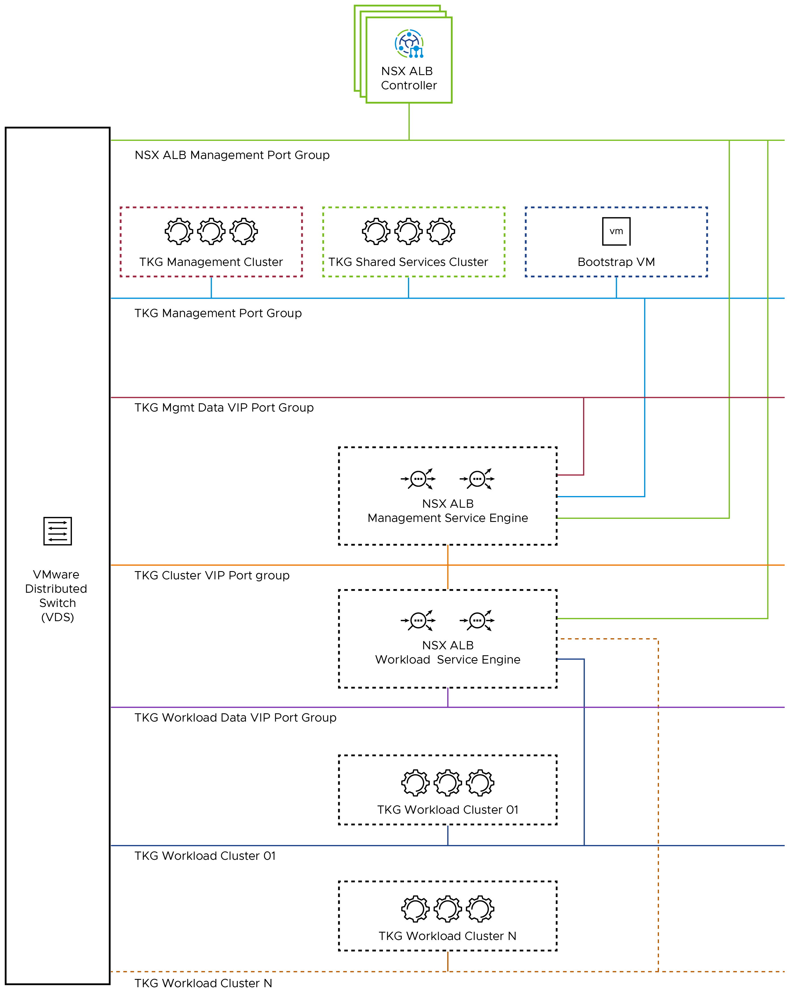
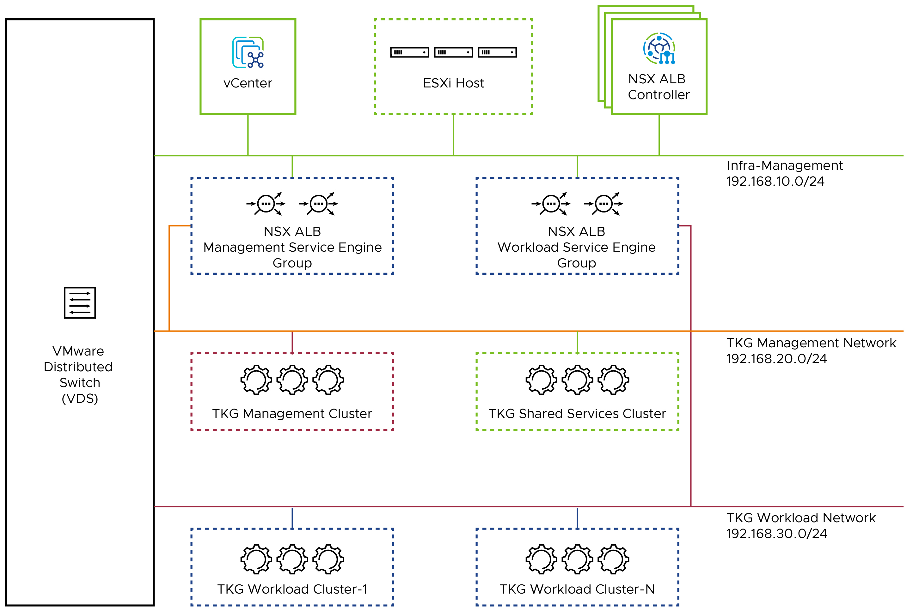

# VMware Tanzu Kubernetes Grid on vSphere Networking in an Air-Gapped Environment Reference Design

VMware Tanzu for Kubernetes Operations (informally known as TKO) simplifies operating Kubernetes for multi-cloud deployment by centralizing management and governance for clusters and teams across on-premises, public clouds, and edge. Tanzu for Kubernetes Operations delivers an open-source aligned Kubernetes distribution with consistent operations and management to support infrastructure and application modernization.

An air-gapped environment is a network security measure employed to ensure a computer or computer network is secure by physically isolating it from unsecured networks, such as the public Internet or an unsecured local area network. This means a computer or network is disconnected from all other systems.

This document lays out a reference design for deploying Tanzu Kubernetes Grid on vSphere Networking in an air-gapped environment and offers a high-level overview of the different components required for setting up a Tanzu Kubernetes Grid environment.

## Supported Component Matrix

The following table provides the component versions and interoperability matrix supported with the reference design:

|**Software Components**|**Version**|
| --- | --- |
|Tanzu Kubernetes Grid|2.1.x|
|VMware vSphere ESXi|7.0 U3 |
|VMware vCenter (VCSA)|7.0 U3 |
|VMware vSAN|7.0 U3 |
|NSX Advanced LB|22.1.2|

For the latest information, see [VMware Product Interoperability Matrix](https://interopmatrix.vmware.com/Interoperability?col=551,9293&row=789,%262,%26912).

## Infrastructure Components

The following components are used in the reference architecture:

- **[Tanzu Kubernetes Grid Instance (TKG)](https://tanzu.vmware.com/kubernetes-grid)** - A Tanzu Kubernetes Grid instance is a full deployment of Tanzu Kubernetes Grid, including the management cluster, the deployed workload clusters, and the shared and in-cluster services that you configure..

- **NSX Advanced Load Balancer** - Tanzu Kubernetes Grid leverages NSX Advanced Load Balancer to provide L4 load balancing for the Tanzu Kubernetes Clusters Control-Plane HA, and L4/L7 ingress to the applications deployed in the Tanzu Kubernetes Clusters. Users access the applications by connecting to the Virtual IP address (VIP) of the Virtual Service provisioned by NSX ALB

- **User-Managed Tanzu Packages:**
  - [**Cert Manager**](https://docs.vmware.com/en/VMware-Tanzu-Kubernetes-Grid/2.1/using-tkg-21/workload-packages-cert-mgr.html) - Provides automated certificate management. It runs by default in management clusters.

  - [**Contour**](https://docs.vmware.com/en/VMware-Tanzu-Kubernetes-Grid/2.1/using-tkg-21/workload-packages-contour.html) - Provides layer 7 ingress control to deployed HTTP(S) applications. Tanzu Kubernetes Grid includes signed binaries for Contour. Deploying Contour is a prerequisite for deploying the Prometheus, Grafana, and Harbor extensions.

  - [**Fluent Bit**](https://docs.vmware.com/en/VMware-Tanzu-Kubernetes-Grid/2.1/using-tkg-21/workload-packages-fluentbit.html) - Collects data and logs from different sources, unifies them, and sends them to multiple destinations. Tanzu Kubernetes Grid includes signed binaries for Fluent Bit.

  - [**Prometheus**](https://docs.vmware.com/en/VMware-Tanzu-Kubernetes-Grid/2.1/using-tkg-21/workload-packages-prometheus.html) - Provides out-of-the-box health monitoring of Kubernetes clusters. The Tanzu Kubernetes Grid implementation of Prometheus includes Alert Manager. You can configure Alert Manager to notify you when certain events occur.

  - [**Grafana**](https://docs.vmware.com/en/VMware-Tanzu-Kubernetes-Grid/2.1/using-tkg-21/workload-packages-grafana.html) - Provides monitoring dashboards for displaying key health metrics of Kubernetes clusters. Tanzu Kubernetes Grid includes an implementation of Grafana.

  - [**Harbor Image Registry**](https://docs.vmware.com/en/VMware-Tanzu-Kubernetes-Grid/2.1/using-tkg-21/workload-packages-harbor.html) - Provides a centralized location to push, pull, store, and scan container images used in Kubernetes workloads. It supports storing artifacts and includes enterprise-grade features such as role-based access control (RBAC), retention policies, automated garbage cleanup, and Docker hub proxying.

  - [**Multus CNI**](https://docs.vmware.com/en/VMware-Tanzu-Kubernetes-Grid/2.1/using-tkg-21/workload-packages-multus.html) - Enables attaching multiple network interfaces to pods. Multus CNI is a container network interface (CNI) plugin for Kubernetes that lets you attach multiple network interfaces to a single pod and associate each with a different address range.

- **Bastion Host -** Bastion host is the physical/virtual machine where you download the required installation images/binaries (for TKG installation) from the internet. This machine needs to be outside the air-gapped environment. The downloaded items then need to be shipped to the bootstrap machine which is inside the air-gapped environment.

- **Local Image Registry -** An image registry provides a location for pushing, pulling, storing, and scanning container images used in the Tanzu Kubernetes Grid environment. The image registry is also used for day-2 operations of the Tanzu Kubernetes clusters, such as storing application images, upgrading Tanzu Kubernetes clusters, and so forth.

In an air-gapped environment, there are two ways to deploy an image registry:

- **Existing Image Registry -** An image registry pre-existing in the environment with a project created for storing TKG binaries. The bootstrap machine has access to this registry. After unzipping the tarball present at the bootstrap machine, the operator uses a script included in the tarball to push the TKG binaries to the TKG project. This registry can be a [Harbor](https://goharbor.io/) registry or any other container registry solution.

- **New Image Registry -** If there is no pre-existing image registry in the environment, a new registry instance can be deployed. The easiest way to create a new image registry instance is to install Harbor using the `docker-compose` method and then push the TKG binaries to the appropriate project.

## Tanzu Kubernetes Grid Components

VMware Tanzu Kubernetes Grid (TKG) provides organizations with a consistent, upstream-compatible, regional Kubernetes substrate that is ready for end-user workloads and ecosystem integrations. You can deploy Tanzu Kubernetes Grid across software-defined datacenters (SDDC) and public cloud environments, including vSphere, Microsoft Azure, and Amazon EC2.

Tanzu Kubernetes Grid comprises the following components:

**Management Cluster -** A management cluster is the first element that you deploy when you create a Tanzu Kubernetes Grid instance. The management cluster is a Kubernetes cluster that performs the role of the primary management and operational center for the Tanzu Kubernetes Grid instance. The management cluster is purpose-built for operating the platform and managing the lifecycle of Tanzu Kubernetes clusters.

**ClusterClass API -** Tanzu Kubernetes Grid 2 functions through the creation of a management Kubernetes cluster which houses [ClusterClass API](https://kubernetes.io/blog/2021/10/08/capi-clusterclass-and-managed-topologies/). The ClusterClass API then interacts with the infrastructure provider to service workload Kubernetes cluster lifecycle requests.The earlier primitives of Tanzu Kubernetes Clusters will still exist for Tanzu Kubernetes Grid 1.X . A new feature has been introduced as a part of Cluster API called ClusterClass which reduces the need for redundant templating and enables powerful customization of clusters. The whole process for creating a cluster using ClusterClass is the same as before but with slightly different parameters. 

**Workload Clusters -** Workload Clusters are the Kubernetes clusters in which your application workloads run. These clusters are also referred to as Tanzu Kubernetes clusters. Workload Clusters can run different versions of Kubernetes, depending on the needs of the applications they run.

**Shared Service Cluster -**  Each Tanzu Kubernetes Grid instance can only have one shared services cluster. You will deploy this cluster only if you intend to deploy shared services such as Contour and Harbor.

**Tanzu Kubernetes Cluster Plans -** A cluster plan is a blueprint that describes the configuration with which to deploy a Tanzu Kubernetes cluster. It provides a set of configurable values that describe settings like the number of control plane machines, worker machines, VM types, and so on. This release of Tanzu Kubernetes Grid provides two default templates, dev and prod.

**Tanzu Kubernetes Grid Instance -** A Tanzu Kubernetes Grid instance is the full deployment of Tanzu Kubernetes Grid, including the management cluster, the workload clusters, and the shared services cluster that you configure.

**Tanzu CLI -** A command-line utility that provides the necessary commands to build and operate Tanzu management and Tanzu Kubernetes clusters.

**Carvel Tools -** Carvel is an open-source suite of reliable, single-purpose, composable tools that aid in building, configuring, and deploying applications to Kubernetes. Tanzu Kubernetes Grid uses the following Carvel tools:

- **ytt -** A command-line tool for templating and patching YAML files. You can also use `ytt` to collect fragments and piles of YAML into modular chunks for reuse.

- **kapp -** The application deployment CLI for Kubernetes. It allows you to install, upgrade, and delete multiple Kubernetes resources as one application.

- **kbld -** An image-building and resolution tool.

- **imgpkg -** A tool that enables Kubernetes to store configurations and the associated container images as OCI images, and to transfer these images.

- **yq -** a lightweight and portable command-line YAML, JSON, and XML processor. `yq` uses `jq`-like syntax but works with YAML files as well as JSON and XML.

**Bootstrap Machine -** The bootstrap machine is the laptop, host, or server on which you download and run the Tanzu CLI. This is where the initial bootstrapping of a management cluster occurs before it is pushed to the platform where it will run.

**Tanzu Kubernetes Grid Installer -** The Tanzu Kubernetes Grid installer is a graphical wizard that you launch by running the `tanzu management-cluster create --ui` command. The installer wizard runs locally on the bootstrap machine and provides a user interface to guide you through the process of deploying a management cluster.**Carvel Tools -** Carvel is an open-source suite of reliable, single-purpose, composable tools that aid in building, configuring, and deploying applications to Kubernetes.

## Tanzu Kubernetes Grid Storage

Many storage options are available and Kubernetes is agnostic about which option you choose.

For Kubernetes stateful workloads, Tanzu Kubernetes Grid installs the vSphere Container Storage interface (vSphere CSI) to provision Kubernetes persistent volumes for pods automatically. While the default vSAN storage policy can be used, site reliability engineers (SREs) and administrators should evaluate the needs of their applications and craft a specific vSphere Storage Policy. vSAN storage policies describe classes of storage such as SSD and NVME, as well as cluster quotas.

In vSphere 7u1+ environments with vSAN, the vSphere CSI driver for Kubernetes also supports creating NFS File Volumes, which support ReadWriteMany access modes. This allows for provisioning volumes which can be read and written from multiple pods simultaneously. To support this, the vSAN File Service must be enabled.

You can also use other types of vSphere datastores. There are Tanzu Kubernetes Grid Cluster Plans that operators can define to use a certain vSphere datastore when creating new workload clusters. All developers would then have the ability to provision container-backed persistent volumes from that underlying datastore.

## Tanzu Kubernetes Clusters Networking

A Tanzu Kubernetes cluster provisioned by the Tanzu Kubernetes Grid supports two Container Network Interface (CNI) options:

- [Antrea](https://antrea.io/)

- [Calico](https://www.tigera.io/project-calico/)

Both are open-source software that provide networking for cluster pods, services, and ingress. When you deploy a Tanzu Kubernetes cluster using Tanzu CLI with the default configuration, Antrea CNI is automatically enabled in the cluster.

Tanzu Kubernetes Grid also supports [Multus CNI](https://github.com/k8snetworkplumbingwg/multus-cni) that can be installed through Tanzu user-managed packages. Multus CNI lets you attach multiple network interfaces to a single pod and associate each interface with a different address range.

To provision a Tanzu Kubernetes cluster using a non-default CNI, see the following instructions:

- [Deploy Tanzu Kubernetes clusters with calico](https://docs.vmware.com/en/VMware-Tanzu-Kubernetes-Grid/2.1/using-tkg-21/workload-clusters-networking.html#calico)

- [Implement Multiple Pod Network Interfaces with Multus](https://docs.vmware.com/en/VMware-Tanzu-Kubernetes-Grid/2.1/using-tkg-21/workload-packages-multus.html)

Each CNI is suitable for a different use case. The following table lists common use cases for the three CNIs that Tanzu Kubernetes Grid supports. This table will help you with information on selecting the right CNI in your Tanzu Kubernetes Grid implementation.

|**CNI**|**Use Case**|**Pros and Cons**|
| --- | --- | --- |
|Antrea|
Enable Kubernetes pod networking with IP overlay networks using VXLAN or Geneve for encapsulation. Optionally encrypt node-to-node communication using IPSec packet encryption.

Antrea supports advanced network use cases like kernel bypass and network service mesh.
|
**Pros:**

- Provide an option to Configure Egress IP Pool or Static Egress IP for the Kubernetes Workloads.
|
|Calico|
Calico is used in environments where factors like network performance, flexibility, and power are essential.

For routing packets between nodes, Calico leverages the BGP routing protocol instead of an overlay network. This eliminates the need to wrap packets with an encapsulation layer resulting in increased network performance for Kubernetes workloads.
|
**Pros:**

- Support for Network Policies.

- High network performance.

- SCTP Support.

**Cons:**

- No multicast support.
|
|Multus|Multus CNI provides multiple interfaces per each Kubernetes pod. Using Multus CRDs, you can specify which pods get which interfaces and allow different interfaces depending on the use case.|
Pros

- Separation of data/control planes.

- Separate security policies can be used for separate interfaces. 

- Supports SR-IOV, DPDK, OVS-DPDK, and VPP workloads in Kubernetes with both cloud native and NFV based applications in Kubernetes.
|

## Tanzu Kubernetes Grid Infrastructure Networking

Tanzu Kubernetes Grid on vSphere can be deployed on various networking stacks including

* VMware NSX-T Data Center Networking.
* vSphere Networking (VDS).

>**Note** The scope of this document is limited to vSphere Networking.

## TKG on vSphere Networking with NSX Advanced Load Balancer

Tanzu Kubernetes Grid when deployed on the vSphere networking uses the distributed port groups to provide connectivity to Kubernetes control plane VMs, worker nodes, services, and applications. All hosts from the cluster where Tanzu Kubernetes clusters are deployed are connected to the distributed switch that provides connectivity to the Kubernetes environment.

You can configure NSX Advanced Load Balancer in Tanzu Kubernetes Grid as:

- L4 load balancer for an application hosted on the TKG cluster.
- The L7 ingress service provider for the application hosted on the TKG cluster.
- L4 load balancer for the Kubernetes cluster control plane API server.

Each workload cluster integrates with NSX Advanced Load Balancer by running an Avi Kubernetes Operator (AKO) on one of its nodes. The cluster’s AKO calls the Kubernetes API to manage the lifecycle of load balancing and ingress resources for its workloads.

## NSX Advanced Load Balancer Licensing

NSX ALB requires a license to enable and utilize the available load balancing features. VMware Tanzu for Kubernetes Operations supports the following license editions:

- VMware NSX Advance Load Balancer Enterprise Edition.
- VMware NSX Advanced Load Balancer essentials for Tanzu.

The Enterprise Edition is the default licensing tier for an Avi Controller. A new Avi Controller is set up in the Enterprise Edition licensing tier, and the Controller can be switched from one edition to another. For more information about NSX ALB Feature comparison, see [NSX Advanced Load Balancer Editions](https://avinetworks.com/docs/latest/nsx-alb-license-editions/#feature-comparison).

### VMware NSX ALB Enterprise Edition

The VMware NSX ALB Enterprise Edition is a full-featured Avi Vantage license that includes load balancing, GSLB, WAF, and so on.

For more information about VMware NSX ALB Enterprise edition, see [VMware NSX ALB Enterprise Edition](https://avinetworks.com/docs/22.1/license-management-starting-with-release-20.1.1/#enterprise-edition-license/).

### VMware NSX Advanced Load Balancer essentials for Tanzu
Starting with Avi Vantage release 20.1.2, VMware NSX ALB essentials for Tanzu edition is supported on Avi Vantage. NSX ALB essentials for Tanzu has been introduced to provide basic Layer 4 load balancing services for Tanzu Basic and Standard edition customers.

For more information on VMware NSX ALB essentials for Tanzu edition, see [VMware NSX ALB essentials for Tanzu](https://avinetworks.com/docs/22.1/nsx-alb-essentials-for-tanzu/).

## NSX Advanced Load Balancer Components

NSX Advanced Load Balancer is deployed in Write Access Mode in the vSphere environment. This mode grants NSX Advanced Load Balancer Controller full write access to the vCenter which helps in automatically creating, modifying, and removing service engines (SEs) and other resources as needed to adapt to changing traffic needs. The core components of NSX Advanced Load Balancer are as follows:

- **NSX Advanced Load Balancer Controller** - NSX Advanced Load Balancer Controller manages Virtual Service objects and interacts with the vCenter Server infrastructure to manage the lifecycle of the service engines (SEs). It is the central repository for the configurations and policies related to services and management, and it provides the portal for viewing the health of VirtualServices and SEs and the associated analytics that NSX Advanced Load Balancer provides.

- **NSX Advanced Load Balancer Service Engine** - The service engines (SEs) are lightweight VMs that handle all data plane operations by receiving and executing instructions from the controller. The SEs perform load balancing and all client- and server-facing network interactions.

- **Cloud -** Clouds are containers for the environment that NSX Advanced Load Balancer is installed or operating within. During initial setup of NSX Advanced Load Balancer, a default cloud, named Default-Cloud, is created. This is where the first controller is deployed into Default-Cloud. Additional clouds may be added, containing SEs and virtual services.

- **Avi Kubernetes Operator (AKO)** - It is a Kubernetes operator that runs as a pod in the Supervisor Cluster and Tanzu Kubernetes clusters, and it provides ingress and load balancing functionality. AKO translates the required Kubernetes objects to NSX Advanced Load Balancer objects and automates the implementation of ingresses, routes, and services on the service engines (SE) through the NSX Advanced Load Balancer Controller.

- **AKO Operator (AKOO)** - This is an operator which is used to deploy, manage, and remove the AKO pod in Kubernetes clusters. This operator when deployed creates an instance of the AKO controller and installs all the relevant objects like:
  - AKO `StatefulSet`
  - `ClusterRole` and `ClusterRoleBinding`
  - `ConfigMap` required for the AKO controller and other artifacts.

Tanzu Kubernetes Grid management clusters have an AKO operator installed out of the box during cluster deployment. By default, a Tanzu Kubernetes Grid management cluster has a couple of AkoDeploymentConfig created which dictates when and how AKO pods are created in the workload clusters. For more information, see [AKO Operator documentation](https://github.com/vmware/load-balancer-and-ingress-services-for-kubernetes/tree/master/ako-operator).

Each environment configured in NSX Advanced Load Balancer is referred to as a cloud. Each cloud in NSX Advanced Load Balancer maintains networking and NSX Advanced Load Balancer Service Engine settings. The cloud is configured with one or more VIP networks to provide IP addresses to load balancing (L4 or L7) virtual services created under that cloud.

The virtual services can span across multiple service engines if the associated Service Engine Group is configured in the Active/Active HA mode. A service engine can belong to only one Service Engine group at a time.

IP address allocation for virtual services can be over DHCP or using NSX Advanced Load Balancer in-built IPAM functionality. The VIP networks created or configured in NSX Advanced Load Balancer are associated with the IPAM profile.

### Tanzu Kubernetes Grid Clusters Recommendations

|**Decision ID**|**Design Decision**|**Design Justification**|**Design Implications**|
| --- | --- | --- | --- |
|TKO-TKG-001|Use NSX Advanced Load Balancer as your control plane endpoint provider and for application load balancing.|AVI is tightly coupled with TKG and vSphere.  Since AVI is a VMware product customers will have single point of contact for Support.| Adds NSX Advanced Load Balancer  License Cost to the solution  |
|TKO-TKG-002|Deploy Tanzu Kubernetes Management clusters in large form factor|Large form factor should suffice for pinniped and velero deployment. This must be capable of accommodating 100+ Tanzu Workload Clusters|
 Consume more Resources from Infrastructure. 

|
|TKO-TKG-003|Deploy Tanzu Kubernetes clusters with prod plan.|This deploys multiple control plane nodes and provides high availability for the control plane.|Consume more Resources from Infrastructure. |
|TKO-TKG-004|Enable identity management for Tanzu Kubernetes Grid clusters.|Role-based access control to Tanzu Kubernetes Grid clusters.| Required External Identity Management
|
|TKO-TKG-005|Enable Machine Health Checks for TKG clusters.|MachineHealthCheck controller helps to provide health monitoring and auto-repair for management and workload clusters Machines.| NA|

## Generic Network Architecture

For the deployment of Tanzu Kubernetes Grid in the vSphere environment, it is required to build separate networks for the Tanzu Kubernetes Grid management cluster and workload clusters, NSX Advanced Load Balancer management, cluster-VIP network for control plane HA, Tanzu Kubernetes Grid management VIP or data network, and Tanzu Kubernetes Grid workload data or VIP network.

The network reference design can be mapped into this general framework:

This topology enables the following benefits:

- Isolate and separate SDDC management components (vCenter, ESX) from the Tanzu Kubernetes Grid components. This reference design allows only the minimum connectivity between the Tanzu Kubernetes Grid clusters and NSX Advanced Load Balancer to the vCenter Server.
- Isolate and separate NSX Advanced Load Balancer management network from the Tanzu Kubernetes Grid management segment and the Tanzu Kubernetes Grid workload segments.
- Depending on the workload cluster type and use case, multiple workload clusters may leverage the same workload network or new networks can be used for each workload cluster. To isolate and separate Tanzu Kubernetes Grid workload cluster networking from each other it’s recommended to make use of separate networks for each workload cluster and configure the required firewall between these networks. For more information, see [Firewall Requirements](#firewall-requirements).
- Separate provider and tenant access to the Tanzu Kubernetes Grid environment.
  - Only provider administrators need access to the Tanzu Kubernetes Grid management cluster. This prevents tenants from attempting to connect to the TKG management cluster.
- Only allow tenants to access their Tanzu Kubernetes Grid workload clusters and restrict access to this cluster from other tenants. network-architecture

## Network Requirements

As per the defined architecture, the list of required networks is as follows:

|**Network Type**|**DHCP Service**|
**Description & Recommendations**

|
| --- | --- | --- |
|NSX ALB Management Network|Optional|
NSX ALB controllers and SEs will be attached to this network. 

DHCP is not a mandatory requirement on this network as NSX ALB can take care of IPAM. 
|
|TKG Management Network|Yes|Control plane and worker nodes of the TKG Management cluster and Shared Service cluster will be attached to this network.  Creating a shared service cluster on a separate network is also supported.|
|TKG Workload Network|Yes|Control plane and worker nodes of TKG Workload Clusters will be attached to this network.|
|TKG Cluster VIP/Data Network|No|
Virtual services for Control plane HA of all TKG clusters (Management, Shared service, and Workload).

 Reserve sufficient IPs depending on the number of TKG clusters planned to be deployed in the environment, NSX ALB takes care of IPAM on this network.
|
|TKG Management VIP/Data Network|No|Virtual services for all user-managed packages (such as Contour and Harbor) hosted on the Shared service cluster.|
|TKG Workload VIP/Data Network|No|
Virtual services for all applications hosted on the Workload clusters.

 Reserve sufficient IPs depending on the number of applications that are planned to be hosted on the Workload clusters along with scalability considerations.
|
### Network Recommendations

The key network recommendations for a production-grade Tanzu Kubernetes Grid deployment with NSX-T Data Center Networking are as follows:

|**Decision ID**|**Design Decision**|**Design Justification**|**Design Implications**|
| --- | --- | --- | --- |
|TKO-NET-001|Use Dedicated networks for the Management Cluster Nodes and Workload Cluster Nodes.  | To have a flexible firewall and security policies.|Additional VLAN Required (OPEX overhead)|
|TKO-NET-002| Use Dedicated VIP network for the Application Hosted in Management and Workload Cluster.|To have a flexible firewall and security policies.| Additional VLAN Required (OPEX overhead)|
|TKO-NET-003|Shared Service Cluster uses Management network and Application VIP network of Management Cluster.| Host Shared Services like Harbor.| VLAN Based Firewall Policies are not possible  |

## Subnet and CIDR Examples

For the purpose of demonstration, this document makes use of the following Subnet CIDR for TKO deployment:

|**Network Type**|**Port Group Name**|**Gateway CIDR**|**DHCP Pool**|**NSX ALB IP Pool**|
| --- | --- | --- | --- | --- |
|NSX ALB Management Network|`sfo01-w01-vds01-albmanagement`|172.16.10.1/24|N/A|172.16.10.100- 172.16.10.200|
|TKG Management Network|`sfo01-w01-vds01-tkgmanagement`|172.16.40.1/24|172.16.40.100- 172.16.40.200|N/A|
|TKG Management VIP Network|`sfo01-w01-vds01-tkgmanagementvip`|172.16.50.1/24|N/A|172.16.50.100- 172.16.50.200|
|TKG Cluster VIP Network|`sfo01-w01-vds01-tkgclustervip`|172.16.80.1/24|N/A|172.16.80.100- 172.16.80.200|
|TKG Workload VIP Network|`sfo01-w01-vds01-tkgworkloadvip`|172.16.70.1/24|N/A|172.16.70.100 - 172.16.70.200|
|TKG Workload Segment|`sfo01-w01-vds01-tkgshared	`|172.16.60.1/24|172.16.60.100- 172.16.60.200|N/A|
## 3-Network Architecture

For POC environments and minimal networks requirement, you can proceed with 3 network architecture. In this design, we deploy the Tanzu Kubernetes Grid into 3 networks as Infrastructure Management Network, TKG Management Network and TKG Workload Network. This design allows us to use only 3 networks and ensures the isolation between Infra VMs, TKG Management and TKG Workload components.   

This network reference design can be mapped into this general framework:

This topology enables the following benefits:
- Deploy the NSX ALB components on the existing infrastructure management network which reduces an additional network usage. 
- Isolate and separate the NSX ALB, SDDC management components (vCenter and ESX) from the VMware Tanzu Kubernetes Grid components.
- Club TKG Mgmt Cluster VIP, TKG Mgmt Data VIP, TKG Mgmt into a single network `TKG-Mgmt-Network`, that ensures that the TKG Management components are deployed in a common network, and removes additional network overhead and firewall rules.
- Club TKG Workload Cluster VIP, TKG Workload Data VIP, TKG Workload into a single network `TKG-Workload-Network`, that ensures that the TKG Workload components are deployed in a common network.
- Separate the Management control plane/Data VIP and the Workload control plane/Data VIP into different networks to enhance the isolation and security. 

### Network Requirements 

|**Network Type**

|**DHCP Service**|
**Description**

|
| --- | --- | --- |
|Infrastructure Management Network| Optional | NSX ALB controllers and Service Engines (SE) are attached to this network. DHCP is not a mandatory requirement on this network as NSX ALB manages the SE networking with IPAM. 
This network also hosts core infrastructure components such as, vCenter, ESXi hosts, DNS, NTP, and so on. |
|TKG Management Network| Yes | Control plane and worker nodes of the TKG Management cluster and the shared services clusters are attached to this network. The IP Assignment is managed through DHCP. 
 TKG Management cluster VIP and TKG Management Data VIP assignment is also managed from the same network using NSX ALB Static IP pool. 
 Ensure that DHCP range does not interfere with the NSX ALB IP Block reservation.|
|TKG Workload Network | Yes | Control plane and worker nodes of the TKG Workload cluster and the shared services clusters are attached to this network. IP Assignment is managed done through DHCP. 
 TKG Workload cluster VIP and TKG Workload Data VIP assignment is also managed from the same network using NSX ALB Static IP pool. 
 Ensure that DHCP range does not interfere with the NSX ALB IP Block reservation.|

### Subnet and CIDR Examples:

|**Network Type**|**Gateway CIDR**|**DHCP Pool**|**NSX ALB IP Pool**|
| --- | --- | --- | --- |
|Infrastructure Management | 192.168.10.1/24 | N/A |192.168.10.101-192.168.10.200 | 
|TKG Management Network | 192.168.20.1/24 | 192.168.20.2 - 192.168.20.100 | 192.168.20.101 - 192.168.20.200 |
|TKG Workload Network | 192.168.30.1/24 | 192.168.30.2 - 192.168.30.100 | 192.168.30.101 - 192.168.30.200 |

##  Firewall Requirements

To prepare the firewall, you need to gather the following information:

1. NSX ALB Controller nodes and Cluster IP address.
1. NSX ALB Management Network CIDR
1. TKG Management Network CIDR.
1. TKG Workload Network CIDR.
1. TKG Cluster VIP Range.
1. TKG Management VIP Range.
1. TKG Workload VIP Range.
1. Bastion host IP address.
1. Bootstrap machine IP address.
1. VMware Harbor registry IP
1. vCenter Server IP
1. DNS server IP(s)
1. NTP Server IP(s)
1. DHCP Server IP(s)

The following table provides a list of firewall rules based on the assumption that there is no firewall within a subnet/VLAN. 

|**Source**|**Destination**|**Protocol:Port**|**Description**|
| --- | --- | --- | --- |
|Bastion Host|Internet|TCP:80/443|To download installation binaries required for TKG installation.|
|Bootstrap VM|vCenter Server|TCP:443|To create resource pools, VM folders and so on in vCenter.|
|Bootstrap VM|NSX ALB Controller nodes and Cluster IP Address.|TCP:443|To access the NSX ALB portal for configuration.|
|
TKG Management Network CIDR

TKG Workload Network CIDR.
|
DNS Server

 

NTP Server
|
UDP:53

 

UDP:123
|
DNS Service 

 

Time Synchronization
|
|
TKG Management Network CIDR

TKG Workload Network CIDR.
|DHCP Server|UDP: 67, 68|Allows TKG nodes to get DHCP addresses.|
|
TKG Management Network CIDR

TKG Workload Network CIDR.
|vCenter IP|TCP:443|Allows components to access vCenter to create VMs and Storage Volumes.|
|
TKG Management Network CIDR

TKG Workload Network CIDR.
|Harbor Registry|TCP:443|
Allows components to retrieve container images. 

This registry needs to be a private registry.  
|
|
TKG Management Network CIDR

TKG Workload Network CIDR.
|TKG Cluster VIP Range. p>
  **Note:** In a 3 Network design, destination network is "TKG Mgmt Network" |TCP:6443|
For the management cluster to configure shared services and workload clusters.

Allow Workload cluster to register with management cluster.
|
|
TKG Management Network CIDR

TKG Workload Network CIDR.
|NSX ALB Controllers and Cluster IP Address.|TCP:443|Allow Avi Kubernetes Operator (AKO) and AKO Operator (AKOO) access to Avi Controller.|
|NSX Advanced Load Balancer Management Network |vCenter and ESXi Hosts|TCP:443|Allow NSX Advanced Load Balancer to discover vCenter objects and deploy SEs as required.|
|NSX Advanced Load Balancer Controller Nodes |DNS server   NTP Server|TCP/UDP:53   UDP:123|DNS Service   Time Synchronization|
|Admin network|Bootstrap VM|SSH:22|To deploy, manage, and configure TKG clusters.|
|deny-all|any|any|deny|

### NSX Advanced Load Balancer Recommendations

The following table provides the recommendations for configuring NSX Advanced Load Balancer in a vSphere with Tanzu environment.

|**Decision ID**|**Design Decision**|**Design Justification**|**Design Implications**|
| --- | --- | --- | --- |
|TKO-ALB-001|Deploy NSX ALB controller cluster nodes on a network dedicated to NSX-ALB.|Isolate NSX ALB traffic from infrastructure management traffic and Kubernetes workloads.|Additional Network (VLAN ) is required|
|TKO-ALB-002|Deploy 3 NSX ALB controllers nodes.|To achieve high availability for the NSX ALB platform. In clustered mode, NSX ALB availability is not impacted by an individual controller node failure. The failed node can be removed from the cluster and redeployed if recovery is not possible. Provides the highest level of uptime for a site|Additional resource requirements |
|TKO-ALB-003|Under Compute policies Create ‘VM-VM anti-affinity’ rule that prevents collocation of the NSX ALB Controllers VMs on the same host.|vSphere will take care of placing the NSX Advanced Load Balancer Controller VMs in a way that always ensures maximum HA.|Affinity Rules needs to be configured manually.
TKO-ALB-004|Use static IP addresses for the NSX ALB controllers.|NSX ALB Controller cluster uses management IP addresses to form and maintain quorum for the control plane cluster. Any changes to management IP addresses will be disruptive.|None|
|TKO-ALB-005|Use NSX ALB IPAM for service engine data network and virtual services. |Simplify the IP address management for Virtual Service and Service engine from NSX ALB|None|
TKO-ALB-006|Reserve an IP address in the NSX ALB management subnet to be used as the cluster IP address for the controller cluster.|NSX ALB portal is always accessible over cluster IP address regardless of a specific individual controller node failure.|Additional IP is required.|
|TKO-ALB-007|Create a dedicated resource pool with appropriate reservations for NSX ALB controllers.|Guarantees the CPU and Memory allocation for NSX ALB Controllers and avoids performance degradation in case of resource contention.| None|
|TKO-ALB-008|Replace default NSX ALB certificates with Custom CA or Public CA-signed certificates that contains  SAN entries of all Controller nodes |To establish a trusted connection with other infra components, and the default certificate doesn’t include SAN entries which is not acceptable by Tanzu. | None,   SAN entries are not applicable if using wild card certificate   |
|TKO-ALB-009|Configure NSX ALB backup with a remote server as backup location|Periodic backup of NSX ALB configuration database is recommended. The database defines all clouds, all virtual services, all users, and others. As best practice store backups in an external location to provide backup capabilities in case of entire cluster failure| Additional Operational Overhead.  Additional infrastructure Resource.|
|TKO-ALB-010|Configure Remote logging for NSX ALB Controller to send events on Syslog.|For operations teams to be able to centrally monitor NSX ALB and escalate alerts events must be sent from the NSX ALB Controller|  Additional Operational Overhead.  Additional infrastructure Resource.|
|TKO-ALB-011|Use LDAP/SAML based Authentication for NSX ALB| Helps to Maintain Role based Access Control | Additional Configuration is required |

### NSX Advanced Load Balancer Service Engine Recommendations

|**Decision ID**|**Design Decision**|**Design Justification**|**Design Implications**|
| --- | --- | --- | --- |
|TKO-ALB-SE-001|NSX ALB Service Engine High Availability set to Active/Active|Provides higher resiliency, optimum performance, and utilization compared to N+M and/or Active/Standby.|Requires NSX ALB Enterprise Licensing. Only the Active/Standby mode is supported with NSX ALB essentials for Tanzu license.     Certain applications might not work in the Active/Active mode. For example, applications that  preserve the client IP use the Legacy Active/Standby HA mode.|
|TKO-ALB-SE-002|Dedicated Service Engine Group for the TKG Management|SE resources are guaranteed for TKG Management Stack and provides data path segregation for Management and Tenant Application |Dedicated service engine Groups increase licensing cost. 
||
|TKO-ALB-SE-003|Dedicated Service Engine Group for the TKG Workload Clusters Depending on the nature and type of workloads (dev/prod/test)|SE resources are guaranteed for single or set of workload clusters and provides data path segregation for Tenant Application hosted on workload clusters |Dedicated service engine Groups increase licensing cost. 
|
|TKO-ALB-SE-004|Enable ALB Service Engine Self Elections|Enable SEs to elect a primary amongst themselves in the absence of connectivity to the NSX ALB controller| Requires NSX ALB Enterprise Licensing. This feature is not supported with NSX ALB essentials for Tanzu license. |
|TKO-ALB-SE-005|Enable 'Dedicated dispatcher CPU' on Service Engine Groups that contain the Service Engine VMs of 4 or more vCPUs. **Note:** This setting should be enabled on SE Groups that are servicing applications and has high network requirements.|This will enable a dedicated core for packet processing enabling high packet pipeline on the Service Engine VMs. **Note:** By default, the packet processing core also processes load-balancing flows.| Consume more Resources from Infrastructure.|
|TKO-ALB-SE-006|Set 'Placement across the Service Engines' setting to 'Compact'.|This allows maximum utilization of capacity (Service Engine ).| None |
|TKO-ALB-SE-007|Set the SE size to a minimum 2vCPU and 4GB of Memory|This configuration should meet the most generic use case | For services that require higher throughput, these configuration needs to be investigated and modified accordingly.|
|TKO-ALB-SE-008|Under Compute policies Create a ‘VM-VM anti-affinity rule for SE engines part of the same SE group that prevents collocation of the Service Engine VMs on the same host.|vSphere will take care of placing the Service Engine VMs in a way that always ensures maximum HA for the Service Engines part of a Service Engine group|Affinity Rules needs to be configured manually.|
|TKO-ALB-SE-009|Reserve Memory and CPU for Service Engines.|The Service Engines are a critical infrastructure component providing load-balancing services to mission-critical applications. Guarantees the CPU and Memory allocation for SE VM and avoids performance degradation in case of resource contention| You must perform additional configuration to set up the reservations.|

## Kubernetes Ingress Routing

The default installation of Tanzu Kubernetes Grid does not have any ingress controller installed. Users can use Contour (available for installation through Tanzu Packages) or any third-party ingress controller of their choice.

Contour is an open-source controller for Kubernetes ingress routing. Contour can be installed in the shared services cluster on any Tanzu Kubernetes Cluster. Deploying Contour is a prerequisite if you want to deploy the Prometheus, Grafana, and Harbor Packages on a workload cluster.

For more information about Contour, see the [Contour](https://projectcontour.io/) site and [Implementing Ingress Control with Contour](https://docs.vmware.com/en/VMware-Tanzu-Kubernetes-Grid/2.1/using-tkg-21/workload-packages-index.html).

Another option is to use the NSX Advanced Load Balancer Kubernetes ingress controller (available only with the NSX ALB Enterprise license) which offers an advanced L7 ingress for containerized applications that are deployed in the Tanzu Kubernetes workload cluster.

For more information about the NSX Advanced Load Balancer ingress controller, see [Configuring L7 Ingress with NSX Advanced Load Balancer](https://docs.vmware.com/en/VMware-Tanzu-Kubernetes-Grid/2.1/tkg-deploy-mc-21/mgmt-reqs-network-nsx-alb-ingress.html).

[Tanzu Service Mesh](https://tanzu.vmware.com/service-mesh), which is a SaaS offering for modern applications running across multi-cluster, multi-clouds, also offers an ingress controller based on [Istio](https://istio.io/).

The following table provides general recommendations on when you should use a specific ingress controller for your Kubernetes environment.

|**Ingress Controller**|**Use Cases**|
| --- | --- |
|Contour|
Use contour when only north-south traffic is needed in a Kubernetes cluster. You can apply security policies for north-south traffic by defining the policies in the applications manifest file.

Contour is a reliable solution for simple Kubernetes workloads. 
|
|NSX ALB Ingress controller|Use the NSX ALB ingress controller when a containerized application requires features like local and global server load balancing (GSLB), web application firewall, performance monitoring, direct routing from LB to pod and so on.|
|Istio|Use Istio ingress controller when you intend to provide security, traffic direction, and insights within the cluster (east-west traffic) and between the cluster and the outside world (north-south traffic).|

### NSX ALB as in L4+L7 Ingress Service Provider

As a load balancer, NSX Advanced Load Balancer provides an L4+L7 load balancing solution for vSphere. It includes a Kubernetes operator that integrates with the Kubernetes API to manage the lifecycle of load balancing and ingress resources for workloads.

Legacy ingress services for Kubernetes include multiple disparate solutions. The services and products contain independent components that are difficult to manage and troubleshoot. The ingress services have reduced observability capabilities with little analytics, and they lack comprehensive visibility into the applications that run on the system. Cloud-native automation is difficult in the legacy ingress services.

In comparison to the legacy Kubernetes ingress services, NSX Advanced Load Balancer has comprehensive load balancing and ingress services features. As a single solution with a central control, NSX Advanced Load Balancer is easy to manage and troubleshoot. NSX Advanced Load Balancer supports real-time telemetry with an insight into the applications that run on the system. The elastic auto-scaling and the decision automation features highlight the cloud-native automation capabilities of NSX Advanced Load Balancer.

NSX ALB with Enterprise Licensing also lets you configure L7 ingress for your workload clusters by using one of the following options:

- L7 ingress in ClusterIP mode
- L7 ingress in NodePortLocal mode
- L7 ingress in NodePort mode
- NSX ALB L4 ingress with Contour L7 ingress

#### L7 Ingress in ClusterIP Mode

This option enables NSX Advanced Load Balancer L7 ingress capabilities, including sending traffic directly from the service engines (SEs) to the pods, preventing multiple hops that other ingress solutions need when sending packets from the load balancer to the right node where the pod runs. The ALB controller creates a virtual service with a backend pool with the pod IP addresses which helps to send the traffic directly to the pods.

However, each workload cluster needs a dedicated SE group for Avi Kubernetes Operator (AKO) to work, which could increase the number of SEs you need for your environment. This mode is used when you have a small number of workload clusters.

#### L7 Ingress in NodePort Mode

The NodePort mode is the default mode when AKO is installed on Tanzu Kubernetes Grid. This option allows your workload clusters to share SE groups and is fully supported by VMware. With this option, the services of your workloads must be set to NodePort instead of ClusterIP even when accompanied by an ingress object. This ensures that NodePorts are created on the worker nodes and traffic can flow through the SEs to the pods via the NodePorts. Kube-Proxy, which runs on each node as DaemonSet, creates network rules to expose the application endpoints to each of the nodes in the format “NodeIP:NodePort”. The NodePort value is the same for a service on all the nodes. It exposes the port on all the nodes of the Kubernetes Cluster, even if the pods are not running on it.

#### L7 Ingress in NodePortLocal Mode

This feature is supported only with Antrea CNI. The primary difference between this mode and the NodePort mode is that the traffic is sent directly to the pods in your workload cluster through node ports without interfering Kube-proxy. With this option, the workload clusters can share SE groups. Similar to the ClusterIP mode, this option avoids the potential extra hop when sending traffic from the NSX Advanced Load Balancer SEs to the pod by targeting the right nodes where the pods run.

Antrea agent configures NodePortLocal port mapping rules at the node in the format “NodeIP:Unique Port” to expose each pod on the node on which the pod of the service is running. The default range of the port number is 61000-62000. Even if the pods of the service are running on the same Kubernetes node, Antrea agent publishes unique ports to expose the pods at the node level to integrate with the load balancer.

#### NSX ALB L4 Ingress with Contour L7 Ingress

This option does not have all the NSX Advanced Load Balancer L7 ingress capabilities but uses it for L4 load balancing only and leverages Contour for L7 Ingress. This also allows sharing SE groups across workload clusters. This option is supported by VMware and it requires minimal setup.

### NSX Advanced Load Balancer L7 Ingress Recommendations

|**Decision ID**|**Design Decision**|**Design Justification**|**Design Implications**|
| --- | --- | --- | --- |
TKO-ALB-L7-001|Deploy NSX ALB L7 ingress in NodePortLocal mode.|1. Gives good Network hop efficiency.   2. Helps to reduce the east-west traffic and encapsulation overhead.   3.Service Engine groups are shared across clusters and the load-balancing persistence is also supported. | Supported only with Antrea CNI with IPV4 addressing.     To configure L7 Ingress, you need NSX ALB Enterprise Licensing.
 

## Container Registry

VMware Tanzu for Kubernetes Operations using Tanzu Kubernetes Grid includes Harbor as a container registry. Harbor provides a location for pushing, pulling, storing, and scanning container images used in your Kubernetes clusters.

Harbor registry is used for day-2 operations of the Tanzu Kubernetes workload clusters. Typical day-2 operations include tasks such as pulling images from Harbor for application deployment, pushing custom images to Harbor and so on.

You may use one of the following methods to install Harbor:

- [**Tanzu Kubernetes Grid Package deployment**](https://docs.vmware.com/en/VMware-Tanzu-Kubernetes-Grid/2.1/using-tkg-21/workload-packages-harbor.html) - VMware recommends this installation method for general use cases. The Tanzu packages, including Harbor, must either be pulled directly from VMware or be hosted in an internal registry.
 
- [**VM-based deployment using OVA**](https://docs.vmware.com/en/VMware-Tanzu-Kubernetes-Grid/2.1/tkg-deploy-mc-21/mgmt-reqs-harbor.html) - VMware recommends this installation method in cases where Tanzu Kubernetes Grid is being installed in an air-gapped or Internet-restricted environment, and no pre-existing image registry exists to host the Tanzu Kubernetes Grid system images. VM-based deployments are only supported by VMware Global Support Services to host the system images for air-gapped or Internet-restricted deployments. Do not use this method for hosting application images.

If you are deploying Harbor without a publicly signed certificate, you must include the Harbor root CA in your Tanzu Kubernetes Grid clusters. To do so, follow the procedure in [Trust Custom CA Certificates on Cluster Nodes](https://docs.vmware.com/en/VMware-Tanzu-Kubernetes-Grid/2.1/using-tkg-21/workload-clusters-secret.html).

## Tanzu Kubernetes Grid Monitoring

In an air-gapped environment, monitoring for the Tanzu Kubernetes clusters is provided through [Prometheus](https://prometheus.io/) and [Grafana](https://grafana.com/). Tanzu Kubernetes Grid includes signed binaries for Prometheus and Grafana that you can deploy on Tanzu Kubernetes clusters to monitor cluster health and services

- Prometheus is an open-source system monitoring and alerting toolkit. It can collect metrics from target clusters at specified intervals, evaluate rule expressions, display the results, and trigger alerts if certain conditions arise. The Tanzu Kubernetes Grid implementation of Prometheus includes **Alert Manager**, which you can configure to notify you when certain events occur.
- Grafana is open-source visualization and analytics software. It allows you to query, visualize, alert on, and explore your metrics no matter where they are stored. 

Both Prometheus and Grafana are installed via user-managed Tanzu packages by creating the deployment manifests and invoking the kubectl command to deploy the packages in the Tanzu Kubernetes clusters.

The following diagram shows how the monitoring components on a cluster interact.

You can use out-of-the-box Kubernetes dashboards or can create new dashboards to monitor compute, network, or storage utilization of Kubernetes objects such as Clusters, Namespaces, Pods and so on. 

## Tanzu Kubernetes Grid Logging

Metrics and logs are critical for any system or application as they provide insights into the system's or application's activity. It is important to have a central place to observe a multitude of metrics and log sources from multiple endpoints.
 
Log processing and forwarding in Tanzu Kubernetes Grid is provided via [Fluent Bit](https://fluentbit.io/). Fluent bit binaries are available as part of extensions and can be installed on management cluster or in workload cluster. Fluent Bit is a light-weight log processor and forwarder that allows you to collect data and logs from different sources, unify them, and send them to multiple destinations. VMware Tanzu Kubernetes Grid includes signed binaries for Fluent Bit that you can deploy on management clusters and on Tanzu Kubernetes clusters to provide a log-forwarding service.
 
Fluent Bit makes use of the Input Plug-ins, the filters, and the Output Plug-ins. The Input Plug-ins define the source from where it can collect data, and the
Output plug-ins define the destination where it should send the information. The Kubernetes filter will enrich the logs with Kubernetes metadata, specifically labels and annotations. Once you configure Input and Output plug-ins on the Tanzu Kubernetes Grid cluster. Fluent Bit is installed as a user-managed package.
 
Fluent Bit integrates with logging platforms such as VMware Aria Operations for Logs, Elasticsearch, Kafka, Splunk, or an HTTP endpoint. For more details about configuring Fluent Bit to your logging provider, see [Implement Log Forwarding with Fluent Bit](https://docs.vmware.com/en/VMware-Tanzu-Kubernetes-Grid/2.1/using-tkg-21/workload-packages-fluentbit.html).

## Bring Your Own Images for Tanzu Kubernetes Grid Deployment

You can build custom machine images for Tanzu Kubernetes Grid to use as a VM template for the management and Tanzu Kubernetes (workload) cluster nodes that it creates. Each custom machine image packages a base operating system (OS) version and a Kubernetes version, along with any additional customizations, into an image that runs on vSphere, Microsoft Azure infrastructure, and AWS (EC2) environments.

A custom image must be based on the operating system (OS) versions that are supported by Tanzu Kubernetes Grid. The table below provides a list of the operating systems that are supported for building custom images for TKG.

|**vSphere**|**AWS**|**Azure**|
| --- | --- | --- |
|
- Ubuntu 20.04

- Ubuntu 18.04

- RHEL 7

- Photon OS 3
|
- Ubuntu 20.04

- Ubuntu 18.04

- Amazon Linux 2
|
- Ubuntu 20.04

- Ubuntu 18.04
|

For additional information on building custom images for Tanzu Kubernetes Grid, see the [Build Machine Images](https://docs.vmware.com/en/VMware-Tanzu-Kubernetes-Grid/2.1/tkg-deploy-mc-21/mgmt-byoi-index.html)

- [Linux Custom Machine Images](https://docs.vmware.com/en/VMware-Tanzu-Kubernetes-Grid/2.1/tkg-deploy-mc-21/mgmt-byoi-linux.html)
- [Windows Custom Machine Images](https://docs.vmware.com/en/VMware-Tanzu-Kubernetes-Grid/2.1/tkg-deploy-mc-21/mgmt-byoi-windows.html)

## Compliance and Security

VMware published Tanzu Kubernetes releases (TKrs), along with compatible versions of Kubernetes and supporting components. Use the latest stable and generally-available update of the OS version that it packages, containing all current CVE and USN fixes, as of the day that the image is built. The image files are signed by VMware and have file names that contain a unique hash identifier.

VMware provides FIPS-capable Kubernetes OVA which can be used to deploy FIPS compliant TKG management and workload clusters. Tanzu Kubernetes Grid core components such as Kubelet, Kube-apiserver, Kube-controller manager, Kube-proxy, Kube-scheduler, Kubectl, Etcd, Coredns, Containerd, and Cri-tool are made FIPS compliant by compiling them with the [BoringCrypto](https://csrc.nist.gov/projects/cryptographic-module-validation-program/certificate/2964) FIPS modules, an open-source cryptographic library that provides [FIPS 140-2](https://www.nist.gov/standardsgov/compliance-faqs-federal-information-processing-standards-fips) approved algorithms.

## Summary

Tanzu Kubernetes Grid on vSphere on hyper-converged hardware offers high-performance potential, convenience, and addresses the challenges of creating, testing, and updating on-premises Kubernetes platforms in a consolidated production environment. This validated approach will result in a near-production quality installation with all the application services needed to serve combined or uniquely separated workload types through a combined infrastructure solution.

This plan meets many Day-0 needs for quickly aligning product capabilities to full stack infrastructure, including networking, firewalling, load balancing, workload compute alignment, and other capabilities.

## Appendix A - Configure Node Sizes

The Tanzu CLI creates the individual nodes of management clusters and Tanzu Kubernetes clusters according to the settings that you provide in the configuration file.

On vSphere, you can configure all node VMs to have the same predefined configurations, set different predefined configurations for control plane and worker nodes, or customize the configurations of the nodes. By using these settings, you can create clusters that have nodes with different configurations to the management cluster nodes. You can also create clusters in which the control plane nodes and worker nodes have different configurations.

### Use Predefined Node Configurations

The Tanzu CLI provides the following predefined configurations for cluster nodes:

|**Size**|**CPU**|**Memory (in GB)**|**Disk (in GB)**|
| --- | --- | --- | --- |
|Small|2|4|20|
|Medium|2|8|40|
|Large|4|16|40|
|Extra-large|8|32|80|

To create a cluster in which all of the control plane and worker node VMs are the same size, specify the `SIZE` variable. If you set the `SIZE` variable, all nodes will be created with the configuration that you set.

- `SIZE: "large"`

To create a cluster in which the control plane and worker node VMs are different sizes, specify the `CONTROLPLANE_SIZE` and `WORKER_SIZE` options.

- `CONTROLPLANE_SIZE: "medium"`
- `WORKER_SIZE: "large"`

You can combine the `CONTROLPLANE_SIZE` and `WORKER_SIZE` options with the `SIZE` option. For example, if you specify `SIZE: "large"` with `WORKER_SIZE: "extra-large"`, the control plane nodes will be set to large and worker nodes will be set to extra-large.

- `SIZE: "large"`
- `WORKER_SIZE: "extra-large"`

### Define Custom Node Configurations

You can customize the configuration of the nodes rather than using the predefined configurations.

To use the same custom configuration for all nodes, specify the `VSPHERE_NUM_CPUS`, `VSPHERE_DISK_GIB`, and `VSPHERE_MEM_MIB` options.

- `VSPHERE_NUM_CPUS: 2`
- `VSPHERE_DISK_GIB: 40`
- `VSPHERE_MEM_MIB: 4096`

To define different custom configurations for control plane nodes and worker nodes, specify the `VSPHERE_CONTROL_PLANE_*` and `VSPHERE_WORKER_*`

- `VSPHERE_CONTROL_PLANE_NUM_CPUS: 2`
- `VSPHERE_CONTROL_PLANE_DISK_GIB: 20`
- `VSPHERE_CONTROL_PLANE_MEM_MIB: 8192`
- `VSPHERE_WORKER_NUM_CPUS: 4`
- `VSPHERE_WORKER_DISK_GIB: 40`
- `VSPHERE_WORKER_MEM_MIB: 4096`

## Appendix B - NSX Advanced Load Balancer Sizing Guidelines

### NSX Advanced Load Balancer Controller Sizing Guidelines

Controllers are classified into the following categories:

| **Classification** | **vCPUs** | **Memory (GB)** | **Virtual Services** | **Avi SE Scale** 
| -------------------- | ----------- | ----------------- | ----------- | -------|
| Essentials         | 4         | 12              |  0-50          |   0-10
| Small              | 8         | 24              |  0-200         |  0-100
| Medium             | 16        | 32              | 200-1000       |100-200
| Large              | 24        | 48              |1000-5000       |200-400

The number of virtual services that can be deployed per controller cluster is directly proportional to the controller cluster size. See the NSX Advanced Load Balancer [Configuration Maximums Guide](https://configmax.esp.vmware.com/guest?vmwareproduct=NSX%20Advanced%20Load%20Balancer&release=22.1.2&categories=119-110,119-101) for more information.

### Service Engine Sizing Guidelines

The service engines can be configured with a minimum of 1 vCPU core and 2 GB RAM up to a maximum of 64 vCPU cores and 256 GB RAM. The following table provides guidance for sizing a service engine VM with regards to performance:

| **Performance metric**   | **Per core performance** | **Maximum performance on a single Service Engine VM** |
| -------------------------- | -------------------------- | ------------------------------------------------------- |
| HTTP Throughput          | 5 Gbps                   | 7 Gbps                                                |
| HTTP requests per second | 50k                      | 175k                                                  |
| SSL Throughput           | 1 Gbps                   | 7 Gbps                                                |
| SSL TPS (RSA2K)          | 750                      | 40K                                                   |
| SSL TPS (ECC)            | 2000                     | 40K                                                   |

Multiple performance vectors or features may have an impact on performance. For instance, to achieve 1 Gb/s of SSL throughput and 2000 TPS of SSL with EC certificates, NSX Advanced Load Balancer recommends two cores.