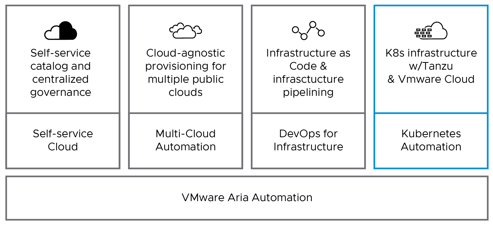
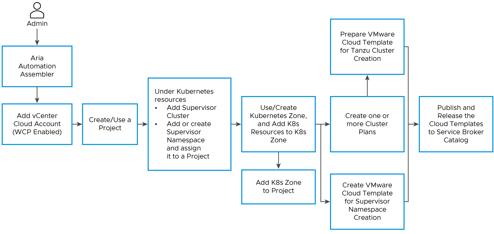
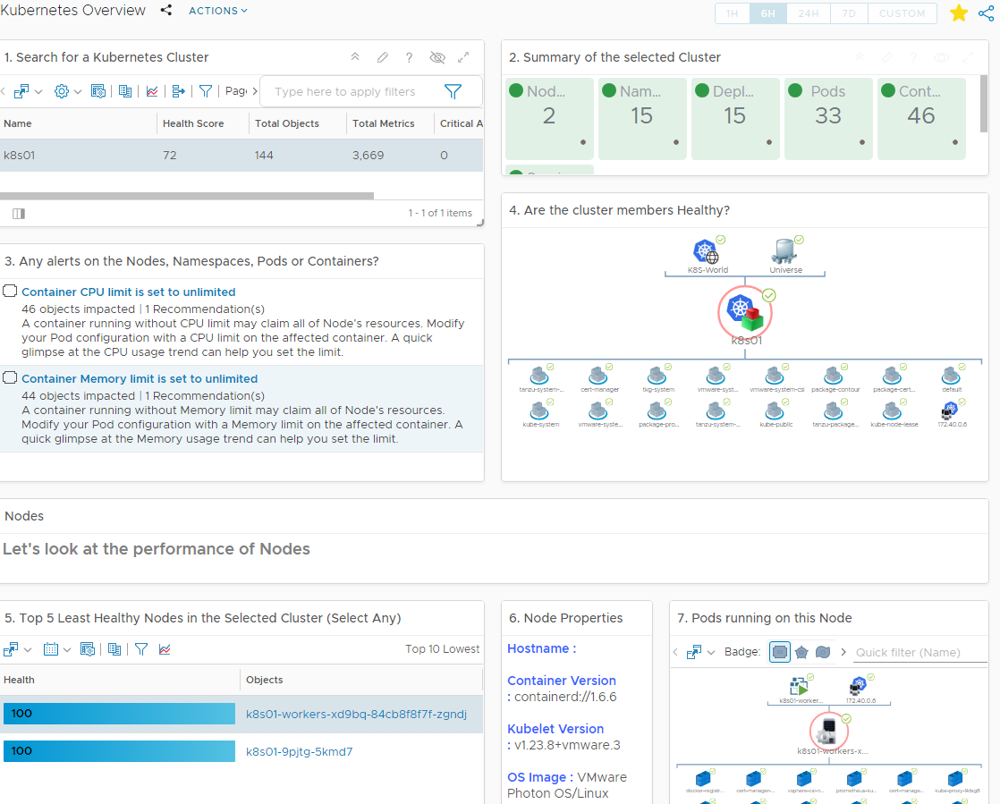

# Tanzu Integration with VMware Aria Stack

vSphere with Tanzu is a VMware solution that combines vSphere, the industry-leading virtualization platform, with Tanzu Kubernetes Grid (TKG) to provide an integrated platform for running and managing Kubernetes workloads, on the other hand VMware Aria Suite comprises several powerful VMware products designed to enhance and optimize various aspects of IT infrastructure and operations. This document lays out a detailed overview on how vSphere with Tanzu integrates with Aria Suite of products.


This document mainly focuses on Aria integration with VMware Tanzu and any recommendation on the below components is not under the scope of this documentation:

- Underlying SDDC Infrastructure
- VMware Aria Solution planning and sizing
- Configuring VMware Aria Solution
- vSphere with Tanzu deployment and configuration

## Introduction

### vSphere with Tanzu

vSphere with Tanzu is a comprehensive VMware solution designed to streamline the deployment and management of Kubernetes clusters directly on the vSphere infrastructure. This capability empowers IT operators to leverage their existing expertise in VMware tools and technologies, enabling them to effortlessly create, run, and manage Kubernetes clusters and modern cloud-native applications.

In essence, vSphere with Tanzu provides an end-to-end solution that seamlessly bridges the gap between IT operations and developers, offering an advanced infrastructure for modern cloud-native applications. This solution empowers developers with a secure, self-service experience, granting full access to a compliant and conformant Kubernetes API, thus facilitating streamlined application development and deployment. At the same time, IT operators can gain visibility into Kubernetes workloads and clusters, effectively managing policies across virtual machines and containers through a unified platform.


#### vSphere with Tanzu Key Components:

- **Supervisor Cluster:** vSphere with Tanzu introduces the concept of a Supervisor Cluster, which is responsible for managing and orchestrating the Kubernetes infrastructure. The Supervisor Cluster provides the control plane for Tanzu Kubernetes clusters and manages the underlying resources, including compute, storage, and networking.
- **Tanzu Kubernetes Grid Service:** vSphere with Tanzu includes Tanzu Kubernetes Grid Service, which simplifies the deployment and lifecycle management of Tanzu Kubernetes clusters. It provides a consistent and standardized approach to creating and managing multiple Kubernetes clusters across the vSphere infrastructure.
- **vSphere Namespaces:** A vSphere Namespace is a tenancy boundary within vSphere with Tanzu. A vSphere Namespace allows for sharing vSphere resources (computer, networking, storage) and enforcing resource limits with the underlying objects such as Tanzu Kubernetes clusters. For each namespace, you configure role-based access control ( policies and permissions ), images library amd virtual machine classes.
- **Tanzu Kubernetes Cluster (Workload Cluster):** Tanzu Kubernetes clusters are Kubernetes workload clusters in which your application workloads run. These clusters can be attached to SaaS solutions such as Tanzu Mission Control, Tanzu Observability, and Tanzu Service Mesh, which are part of Tanzu for Kubernetes Operations.
- **VM Classes:** A VM class is a template that defines CPU, memory, and reservations for VMs. VM classes are used for VM deployment in a Supervisor Namespace. VM classes can be used by standalone VMs that run in a Supervisor Namespace and by VMs hosting a Tanzu Kubernetes cluster. vSphere with Tanzu offers several default VM classes. You can use them as is or you can create new VM classes. <br> 
VM classes in vSphere with Tanzu are broadly categorized into two groups.
  - guaranteed: The guaranteed class fully reserves its configured resources.
  - best-effort: The best-effort class allows resources to be overcommitted.
- **Storage Classes:** A StorageClass provides a way for administrators to describe the classes of storage they offer. Different classes can map to quality-of-service levels, to backup policies, or to arbitrary policies determined by the cluster administrators.
- **vSphere Pod:** A vSphere Pod is a VM with a small footprint that runs one or more Linux containers. Each vSphere Pod is sized precisely for the workload that it accommodates and has explicit resource reservations for that workload. It allocates the exact amount of storage, memory, and CPU resources required for the workload to run. vSphere Pods are only supported with Supervisor Clusters that are configured with NSX-T Data Center as the networking stack.

### VMware Aria 

The VMware Aria Suite comprises several powerful VMware products designed to enhance and optimize various aspects of IT infrastructure and operations. These products include:

#### Aria Automation

Aria Automation (formerly called as vRealize Automation) on the other hand is a versatile multi-cloud platform, equipped with an event-driven state management system, specifically designed to assist organizations in achieving control and security while enabling self-service capabilities for private, hybrid, and public cloud automation with a governance framework. Adopting a DevOps-based infrastructure delivery approach, Aria Automation aids in enhancing IT agility, productivity, and efficiency, empowering businesses to proactively prepare for future demands.

By providing a unified automation solution across various cloud environments and on-premises data centers, Aria Automation ensures consistency and standardization, simplifying the management of complex IT operations. This comprehensive platform enables organizations to efficiently handle cloud deployments, efficiently govern resource usage, and optimize application delivery, all while adhering to compliance and security guidelines. By leveraging Aria Automation, businesses can better align IT resources with business objectives and embrace a more dynamic and responsive IT infrastructure.

Below diagram shows the modern automation use cases of aria automation, focus of this documentation is on **Kubernetes Automation**



This document will showcase the out-of-the-box integration of vSphere with Tanzu and Aria Automation using below specific modules selected from the available vRealize Automation Modules.

- **Cloud Assembly:** Cloud Assembly plays a pivotal role in Aria Automation, serving as a robust cloud orchestration and infrastructure-as-code (IaC) engine. This module empowers users to provision and effectively manage cloud resources and applications across various cloud environments. By employing Cloud Assembly, organizations can define infrastructure and application blueprints in a declarative manner, facilitating automated deployment and scalability of workloads. <br>
Within Cloud Assembly, administrators and users can effortlessly create and design Tanzu Kubernetes Cluster templates using an intuitive drag-and-drop interface. These blueprints precisely outline the desired state of Tanzu Kubernetes Cluster resources and their configurations. Additionally, Cloud Assembly extends support for the complete lifecycle management of deployed Tanzu Kubernetes Clusters, encompassing scaling, upgrades, and decommissioning processes.
- **Service Broker:** Service Broker aggregates native content from multiple clouds and platform into a single catalog with tag-based policies. Service Broker is a crucial component that enables end-users to access and consume various cloud services and resources through a self-service catalog. It acts as an interface between the end-users and the underlying cloud infrastructure, providing a user-friendly portal to request and manage cloud services and applications.
- **VMware Aria Automation Orchestrator:** VMware Aria Automation Orchestrator, formerly known as vRealize Orchestrator, is an integral and essential component within Aria Automation. It serves as a potent workflow automation tool, empowering users to create, automate, and manage complex workflows and tasks across diverse IT systems and cloud environments. <br>
Leveraging VMware Aria Automation Orchestrator, users can effortlessly generate new cloud templates by utilizing pre-built content and packages that offer readily deployable workflows for creating Supervisor Namespace and Tanzu Kubernetes Clusters. Additionally, the Orchestrator supports version control, enabling users to effectively oversee workflow changes and maintain a comprehensive history of modifications. Regular backups are also facilitated to safeguard critical automation content. 
- **Workspace One Access:** Integrating Workspace ONE Access with Aria Automation allows organizations to achieve seamless Single Sign-On (SSO) and enhanced security for accessing Aria Automation's self-service portal and the resources provisioned through it. This integration ensures that users can use their existing corporate credentials to log in to Aria Automation and access their entitled services, promoting a unified and user-friendly experience.

##### Aria Automation Key Components

This documentation will utilize the following essential components of Aria Automation to achieve a successful Tanzu Integration

- **Cloud Account:** "Cloud Account" is a fundamental configuration that establishes a connection to a specific cloud provider or platform. By configuring a Cloud Account in Aria Automation, administrators can enable the platform to interact with and manage resources in the target cloud environment. <br>
The Cloud Account serves as the bridge between Aria Automation and various cloud providers, enabling seamless integration and resource provisioning across multiple clouds. By defining authentication credentials and settings specific to each cloud environment, vRA gains the ability to deploy, scale, and manage virtual machines and other cloud resources in a consistent and automated manner. <br>
Key aspects of a Cloud Account in vRealize Automation may include: <br> 
  - **Cloud Provider:** The Cloud Account specifies the cloud provider or platform it connects to, such as VMware vSphere, AWS, Azure, Google Cloud, or others.
  - **Authentication:** It includes the necessary credentials, such as API keys, access tokens, or service accounts, to authenticate and authorize Aria Automation to access and manage resources in the cloud environment.
  - **Region/Zone/Location:** Depending on the cloud provider, the Cloud Account may also specify the geographic region or availability zone to direct resource provisioning.
  - **Networking Configuration:** It may include network settings and configurations relevant to the cloud environment, such as virtual network settings, subnets, and security groups.
  - **Resource Quotas:** Some cloud providers may have resource quotas and limits. The Cloud Account may include settings to enforce and manage these quotas to prevent over provisioning.
- **Resources:**  "Resources" refer to the various entities that can be provisioned and managed within the cloud environment. These resources can include virtual machines, storage volumes, networks, load balancers, security groups, kubernetes and other components that make up an application stack. Aria Automation allows you to define and manage these resources through blueprints and automation, enabling users to request and deploy them in a self-service manner.
- **Project:** "Project" is a fundamental organizational construct used to manage and organize resources, policies, and permissions within the Aria Automation environment. A Project provides a logical boundary that allows administrators to control user access, enforce governance policies, and tailor the Aria Automation experience for specific environments or use cases. <br>
Key aspects and functionalities of a Project in vRealize Automation include: <br>
  - **Resource Isolation:** A Project allows for resource isolation, meaning that resources created or managed within a specific Project are segregated from resources in other Projects. This isolation helps maintain security and prevents cross-contamination of resources between different user groups or use cases.
  - **User Access Control:** Administrators can assign users or user groups specific roles and permissions within a Project. This fine-grained access control ensures that users only have access to the resources and actions they are authorized to use.
  - **Policies and Governance:** Projects enable administrators to enforce governance policies, such as resource quotas, lease durations, and approval workflows, specific to the resources within the Project. This helps organizations maintain control over resource consumption and adhere to compliance requirements.
  - **Resource Management:** Resources provisioned within a Project are managed and governed within the context of that Project. This includes Kubernetes Namespaces, virtual machines, applications, networking, and other infrastructure components.
  - **Blueprints and Catalog Items:** Administrators can define and publish blueprints and catalog items that are available for provisioning within a Project. This allows different Projects to have access to different sets of resources and services.
  - **Customization:** Each Project can be customized with its specific branding, providing a personalized experience for users accessing resources within that Project.
  - **Cost Management:** Projects can be configured with cost profiles and business groups, allowing organizations to track and report resource consumption and associated costs for each Project.
- **Kubernetes Zone:** By leveraging Kubernetes Zones in vRealize Automation, administrators can define policy-based resource allocation and placement for Tanzu Kubernetes clusters and supervisor namespaces. This allows for efficient utilization of compute resources, adherence to governance policies, and effective management of Kubernetes workloads within the vSphere environment. Kubernetes Zones are assigned as resources to projects within Aria Automation. <br>
"Kubernetes Zone" is a critical configuration element used to define and manage policy-based resource allocation and placement for Tanzu Kubernetes clusters and supervisor namespaces. Tanzu Kubernetes Grid (TKG) integration in Aria Automation allows for seamless provisioning and management of Kubernetes workloads within the vSphere environment. <br> 
Key aspects and functionalities of a Kubernetes Zone in Aria Automation include:
  - **Resource Allocation:** The Kubernetes Zone allows administrators to specify resource quotas and limits for Tanzu Kubernetes clusters and supervisor namespaces within the vSphere environment. This helps ensure efficient utilization of compute resources and prevents over provisioning.
  - **Placement Policies:** Administrators can define placement policies within the Kubernetes Zone to determine where Tanzu Kubernetes clusters and supervisor namespaces are provisioned in the vSphere cluster. These policies may be based on factors such as resource availability, performance characteristics, or custom tags.
  - **Integration with vSphere:** The Kubernetes Zone seamlessly integrates with the vSphere infrastructure, allowing Aria Automation to leverage the underlying vSphere resources and virtual machines to deploy and manage Tanzu Kubernetes clusters.
  - **Scalability and Availability:** Kubernetes Zones in Aria Automation support the scalability and high availability requirements of Kubernetes workloads. This ensures that the environment can accommodate the growing demands of containerized applications.
  - **Policy Enforcement:** The Kubernetes Zone enforces policies set by administrators, ensuring that Tanzu Kubernetes clusters and supervisor namespaces adhere to the defined configurations and constraints.
  - **Resource Allocation to Projects:** Kubernetes Zones are assigned as resources to Projects within Aria Automation. This allows administrators to allocate specific Kubernetes Zones to different Projects, providing resource isolation and governance at the Project level.
- **Cluster Plan:** A cluster plan functions as a configuration template for provisioning Tanzu Kubernetes cluster instances on a particular vSphere cloud account instance. Generally, a cluster plan encodes a meaningful set of configuration properties, such as virtual machine classes, storage classes, Kubernetes version, that are used when provisioning Tanzu kubernetes clusters on a particular vSphere server cloud account.
- **Aria Cloud Assembly:** Aria Cloud Assembly is a component of VMware Aria Automation that focuses on cloud infrastructure and application delivery. It provides a unified platform for deploying, managing, and governing applications across multiple cloud environments, including private, public, and hybrid clouds.
- **Aria Service Catalogs:** By leveraging Aria Service Catalogs, organizations can empower users to self-service their IT needs, reducing the dependency on manual provisioning processes. By publishing Tanzu Kubernetes Cluster or Namespace templates as catalog components, Aria Automation simplifies and standardizes the process of provisioning and managing these resources. <br>
Users can easily select and request the desired configuration from the service catalog, while Cloud administrators can enforce governance and manage the resources effectively.
- **Aria Service Broker:** Aria Automation Service Broker is a component of Aria Automation that provides a self-service interface and catalog for users. It serves as a central hub where users can browse through a wide range of available IT services and resources. By selecting the desired services from the catalog, users can easily request and initiate the provisioning process, streamlining the consumption of IT services within the organization.


#### VMware Aria Operations

VMware Aria Operations formerly called as vRealize Operations is a comprehensive and intelligent operations management platform. It offers advanced analytics, performance monitoring, capacity planning, and automation capabilities for virtualized and cloud environments. The primary goal of Aria Operations is to ensure the optimal performance, availability, and efficiency of IT infrastructure and applications. 

Aria Operations Management Pack for Kubernetes is a solution provided by VMware that facilitates the integration between Aria Operations and Kubernetes environments. This management pack enables administrators to gain deeper insights into the performance, health, and capacity of Kubernetes clusters and workloads, allowing for effective management and optimization.

Key features and benefits of the Aria Management Pack for Kubernetes include:

- **Kubernetes Cluster Monitoring:** The management pack offers comprehensive monitoring capabilities for Kubernetes clusters. It provides visibility into cluster health, resource usage, and performance metrics, allowing administrators to proactively address potential issues.

- **Workload Monitoring:** Administrators can monitor individual workloads running in Kubernetes, such as pods, containers, and services. This level of monitoring helps in identifying resource bottlenecks and optimizing workload performance.

- **Performance Analytics:** The management pack provides performance analytics for Kubernetes components, helping administrators analyze and optimize the efficiency of Kubernetes infrastructure.

- **Capacity Planning:** Capacity planning capabilities allow administrators to forecast resource requirements for Kubernetes clusters and workloads. This helps in effective resource allocation and ensures optimal utilization.

- **Troubleshooting and Root Cause Analysis:** The management pack facilitates troubleshooting by offering insights into events and anomalies within Kubernetes environments. It aids in identifying root causes and resolving issues quickly.

- **Dashboards and Reporting:** Pre-built dashboards and reports offer a consolidated view of Kubernetes environments, making it easier for administrators to monitor and analyze the health and performance of Kubernetes resources.

By deploying the Aria Management Pack for Kubernetes, organizations can ensure optimal performance, resource utilization, and health of their Kubernetes clusters, leading to enhanced overall efficiency and productivity in managing modern containerized


#### VMware Aria Operations for Logs

VMware Aria Operations for Logs is a log management and analytics solution. It collects, analyzes, and provides insights from logs generated by various components and applications within an IT infrastructure. Aria Operations for Logs helps IT administrators and DevOps teams to troubleshoot issues, monitor events in real-time, and gain valuable insights into the performance and health of their environment through log analysis. 

Benefits of Aria Operation for Logs.

- **Centralized Log Management:** Aria Operation for logs provides a centralized platform for collecting, analyzing, and storing logs from various sources across your infrastructure. It consolidates log data from different systems, applications, and devices, making it easier to manage and search logs from a single interface.

- **Real-time Log Monitoring:** It enables real-time log monitoring and alerting. It analyzes log data as it is collected, allowing you to detect and respond to issues promptly. With customizable alerts and notifications, you can proactively address potential problems and minimize downtime.

- **Advanced Log Analytics:** The solution includes powerful log analytics capabilities. It can automatically parse and structure log data, making it easier to search, filter, and analyze logs. Advanced querying, filtering, and correlation features help identify patterns, anomalies, and trends within log data, enabling faster troubleshooting and problem resolution.

- **Intelligent Log Insight:** Aria Operation for Logs leverages machine learning and intelligent algorithms to provide insights and context from log data. It can detect and highlight potential issues, anomalies, or security threats hidden within log events, helping administrators and IT teams focus on critical areas that require attention.

- **Scalability:** It is designed to handle large-scale log data environments. It can scale horizontally by adding additional nodes for increased log ingestion and analysis capacity.

- **Compliance and Auditing:** With Aria Operation for Logs, you can maintain a comprehensive log repository for compliance and auditing purposes. The solution helps you meet regulatory requirements by providing historical log data and supporting log retention policies. It allows for easy retrieval of logs for audits or investigations.


## Firewall Requirements

|**Source**|**Destination**|**Protocol:Port**| **Description**|
| -------------- | ----------------------- | ------------- | ---------|
|VMware Aria Automation Appliance Load Balanced VIP or FQDN | Supervisor Cluster (Ingress Network configured in Supervisor Cluster) |TCP:6443 <br> TCP:443 | Aria Automation to Supervisor connectivity.|
|VMware Aria Operation Primary, Replica, Data nodes, Remote Collectors | Tanzu Kubernetes Clusters Control Plane VIP Range (Ingress Network configured in Supervisor Cluster) | TCP:6443 <br> TCP:443 | Collect Tanzu Kubernetes Cluster Metrics via Prometheus, an open-source systems monitoring and alerting toolkit <br> TCP:443 is applicable when Prometheus is exposed over Ingress or LoadBalancer |
|Tanzu Kubernetes Workload Clusters (Egress Network configured in Supervisor Cluster) | VMware Aria Operations for Logs | UDP:514 | Forward logs to VMware Aria Operations for Logs |

## Tanzu Integration with Aria

Below section provides detailed overview on Integrating:

- vSphere with Tanzu with Aria Automation Cloud Assembly
- Monitoring Tanzu Clusters with VMware Aria Operations
- Centralized Logging using VMware Aria Operations for Logs

### Tanzu with VMware Aria Automation

Starting from vSphere 7.x it contains significant enhancements that enable you to work with Kubernetes natively to manage both virtual machines and containers from one interface. Automation Assembler offers several options for configuring, managing and deploying Kubernetes virtual workloads. Automation Assembler enables users to leverage the vSphere with Tanzu Kubernetes capabilities embedded within vSphere. You can access vSphere with Tanzu Kubernetes functionality via a vCenter cloud account with a vSphere implementation that contains supervisor clusters.

#### Prerequisites

- You must have access to vSphere 7.x or later environment
- The target vSphere environment must have at-least one Supervisor Cluster

#### Cloud Admin Workflow

Below are the list of activities that must to be performed by an Cloud Administrator:



1. Create a **vCenter Cloud Account:**  
To provision a vSphere with Tanzu Kubernetes deployment with Automation Assembler, you must have access to vSphere 7.x or later environment. In VMware Aria Automation, vSphere is available as part of a vCenter cloud account. To ad a vCenter Cloud Account see Create a vCenter cloud account in VMware Aria Automation. <br>
**Note:** After adding the vSphere Cloud account, it is essential to check the status "Available for Kubernetes Deployment." A green check in this status indicates that the target vSphere environment has one or more supervisor clusters, making it capable of effectively handling Tanzu Kubernetes clusters and modern cloud-native applications

    

    In addition to the standard privileges needed for a service account to add a vCenter Cloud in VMware Aria Automation, the service account must also possess permissions for the following:

    - vSphere Namespace
    - VM Classes
    - Storage Views <br>

    For a comprehensive list of the supplementary privileges required to achieve successful integration of Tanzu with Aria Automation, please refer to the "vSphere with Tanzu Identity and Access Management vSphere Namespaces Privileges" documentation.
1. Add **Kubernetes Resources:** <br>
Cloud administrators can add, view, and manage the configuration of deployed clusters and namespaces, in Automation Assembler. Users with cloud administrator privileges can view, add, and manage Kubernetes clusters and namespaces to which you are entitled access on the **Infrastructure** > **Resources** > **Kubernetes** page. <br>
This page contains tabs for Clusters, Namespaces, Supervisor Clusters and Supervisor Namespaces. For the purpose of this document we will be focusing on **Supervisor Clusters** and **Supervisor Namespaces**.
    - To Add Supervisor Clusters, navigate to: **Infrastructure** > **Resources** > **Kubernetes** > **Supervisor Clusters** > **Add Supervisor Cluster**
    - To Add/Create Supervisor Namespace, navigate to: **Infrastructure** > **Resources** > **Kubernetes** > **Supervisor Namespace**

    **Note:** <br>
    - Given the available options in Aria 8.12.2, it is not recommended to create a Supervisor Namespace directly from the Resources tab. <br>
    This is because this method does not offer the required capability to add one or more VM Classes to the Supervisor Namespace. Instead, it is advisable to employ Cloud Templates to set up the Supervisor Namespace. Refer **Appendix A** which provides a sample VMware Cloud Template that allows you to define the cluster class during the creation of the Supervisor Namespace, ensuring a more efficient and controlled deployment.
    - When creating a Kubernetes Resource backed by a Supervisor Namespace, it is highly advisable to specify limits for CPU, Memory, and Storage. Administrators possess the flexibility to incorporate one, multiple, or all available storage policies into this resource. These storage policies will be utilized while defining the Cluster Plans, which, in turn, determine the backend storage policies applied to Nodes and PVCs (Persistent Volume Claims).
    - Each Supervisor Namespace within the Kubernetes Resource in Aria is inherently linked to a particular Project. A user's access to the Project directly influences their ability to access the corresponding Supervisor Namespace through the "kubectl vsphere" plugin. To ensure the seamless functioning of this feature, it is vital that both your vCenter and VMware Aria Automation deployment employ the same Active Directory for user synchronization. This synchronization ensures proper authentication and access control for users across the integrated environments. <br> 
    Without the synchronization, while the provisioning of the Namespace will still operate, VMware Aria Automation Project users will not be automatically granted access to the namespace. <br> 
    
    For further clarity, the table below illustrates the mapping of user roles and their corresponding access levels. <br>
    |**User Group Role**|**Supervisor Namespace Access**| **Description**|
    | -------------- | ----------------------- | ---------|
    | Project Owner | Owner | This user group will be granted `Owner` access, providing them with full control over the Supervisor Namespace created within the project |
    | Project Member | Can Edit | This user group will be given `Edit` access to the Supervisor Namespace created within the project. |
    | Project Viewer | Can View | This user group will be granted `View Only` access, enabling them to observe and inspect the contents of the Supervisor Namespace created within the project without the ability to make changes or modifications. |
    | Project Supervisor | No Access | This user group have no access to the Supervisor Namespace created under the project. |

1. Create **Kubernetes Zone**: <br>
Kubernetes zones enable cloud administrators to define policy-based placement of Tanzu Kubernetes clusters and supervisor namespaces used in Automation Assembler deployments. An administrator can navigate to **Infrastructure** > **Configure** > **Kubernetes Zone** use this page to specify what Supervisor clusters are available for provisioning of Supervisor namespaces and what properties are acceptable. Tagging the kubernetes zones appropriately is key to make use of policy-based placements of Supervisor Namespaces and Tanzu Kubernetes Clusters.  A Kubernetes Zone may point to Supervisor Cluster and/or Supervisor Namespaces. <br> 
Add supervisor clusters to enable supervisor namespace provisioning via this zone. And/Or add supervisor namespaces to enable kubernetes cluster provisioning <br> 
A cloud administrator can assign priorities on multiple levels. <br>
    - Kubernetes zone priority within a project.
    - Resource priority within a Kubernetes zone.
    - Cluster priority within a Kubernetes zone. <br>
    
    The cloud administrator can also assign tags on multiple levels:
    - Capability tags per Kubernetes zone.
    - Tags per resource assignment.
    - Tags per cluster assignment

1. Add Kubernetes Zone to Project: After creating the Kubernetes Zones, administrators have the option to associate these Zones with a project. This association enables project users to independently provision necessary resources, such as Supervisor Namespaces and Tanzu Kubernetes Clusters. <br>
Additionally, administrators have the flexibility to set a limit on the maximum number of Supervisor Namespaces that can be created within the project. 

1. Create **Cluster Plans**:
You must create a cluster plan for use with vSphere with Tanzu Kubernetes deployments in VMware Aria Automation. A cluster plan functions as a configuration template for provisioning Tanzu Kubernetes cluster instances on a particular vSphere cloud account instance. Generally, the cluster plan encodes a meaningful set of configuration properties, such as virtual machine classes, storage classes, etc, that are used when provisioning Tanzu kubernetes clusters on a particular vSphere server cloud account. <br>
After a cluster plan is created for one or more vSphere instance, all eligible supervisor namespaces, that an administrator assigns to host a Tanzu Kubernetes cluster using a Kubernetes zone assignment, should be aligned with respect to the configuration defined in the cluster plan specification. For example, the storage policy specified in the cluster plan should be added as a storage class to all vSphere supervisor namespaces dedicated for provisioning of Tanzu clusters. <br>
**Note:** <br>
While creating a Cluster plan, you will be able to define:
    - Kubernetes Version
    - Size and number of Control Plane and Worker Nodes
    - Storage class for Control Plane and Worker Nodes
    - Default PVC (Based on the available storage policies defined in Kubernetes Zone)
    - Additional Storage Classes for PVCs (Based on the available storage policies defined in Kubernetes Zone)
    - Use Default or override default Network Settings. Override Network option provides you to define below properties:
        - Choose Default CNI: Antrea is the default CNI, you can override this to Calico
        - Customize POD and Service CIDR blocks
        - Provide HTTP and HTTPs proxy details
        - Add additional Certificates to the Cluster Trust store

1. Create **VMware Cloud Templates**: <br>
When adding Kubernetes components to an Automation Assembler cloud template, you can enable users to create supervisor namespaces and Tanzu Kubernetes Clusters in various configurations. Typically, this choice depends on your access control requirements, how you have configured your Kubernetes components, and your deployment requirements. 
    - **Template to create Supervisor Namespace:** These templates enables admins and users to create Supervisor Namespace on demand. The Supervisor namespace is always tied to a Project, based on the user access to the project, the respective user will be able to access the Supervisor names space using "kubectl vsphere" plugin. Refer "Appendix A" for a Sample Super Namespace Template <br> 
    **Note:** Both your vCenter and your VMware Aria Automation deployment should use the same Active Directory for users to be synched. Though provisioning will still function if this is not the case, VMware Aria Automation users will not get automatic access to the namespace. 
    - **Template to create Tanzu Kubernetes Cluster Creation:** These templates enables admins and users to create Tanzu Kubernetes Clusters. Depending on the template format, the users will be able to make choose the required cluster plan, # of Worker Nodes, Storage options and others. Refer `Appendix B` for a Sample Tanzu Kubernetes Cluster Template 

1. Publish and Release the Cloud Templates to Service Broker Catalog: <br>
Upon finalizing the Cloud Template and preparing to provide access to users, it is necessary to create a version of the Cloud Template and release it to the Service Broker catalog. By doing so, the Cloud Template becomes available through the Aria self-service portal, enabling users to request and provision the service specified in the Cloud Template. <br>
**Note:** In the event that the Content Source is not configured within the Service Broker, it becomes necessary to create one and integrate it with the project where you have created the Cloud Template. A Content Source in the Service Broker serves as a definition for a collection of Cloud Templates (along with other options), which can then be utilized as catalog items within the Service Broker


#### Developer/User Workflow

Below are the list of activities that the Developer/User can work on

- Provisioning and Accessing Supervisor Namespace
- Provisioning and Accessing Tanzu Kubernetes Clusters


##### Provisioning and Accessing Supervisor Namespace

Using the catalog service offered by the Service Broker, developers have the capability to create Supervisor Namespaces dynamically as needed. Each Supervisor Namespace is intrinsically linked to a particular Project, and user access to that Project determines their privileges to access the corresponding Supervisor Namespace via the kubectl vsphere plugin. The table below illustrates the mapping of user roles:

|**User Group Role**|**Supervisor Namespace Access**| **Description**|
| -------------- | ----------------------- | ---------|
| Project Owner | Owner | This user group will be granted `Owner` access, providing them with full control over the Supervisor Namespace created within the project |
| Project Member | Can Edit | This user group will be given `Edit` access to the Supervisor Namespace created within the project. |
| Project Viewer | Can View | This user group will be granted `View Only` access, enabling them to observe and inspect the contents of the Supervisor Namespace created within the project without the ability to make changes or modifications. |
| Project Supervisor | No Access | This user group have no access to the Supervisor Namespace created under the project. |

**Note:** To ensure this functionality works as expected, it is crucial that both your vCenter and VMware Aria Automation deployment utilize the same Active Directory for user synchronization. <br>

Below is a snippet of users who possess access to the Project:


Once a Supervisor Namespace is created and associated with the project, the following snippet illustrates the user privileges on the Supervisor Namespace (as viewed in vCenter):


Upon successful creation of a Supervisor Namespace, users can acquire the `kubectl vsphere` plugin binaries and access details for the Supervisor Namespace from the deployment topology accessible within the Service Broker.


By obtaining direct access to the Supervisor Namespace, developers can carry out the following actions:

- **Deploy Tanzu Kubernetes Clusters:** This allows administrators and developers to easily create and manage Kubernetes clusters, providing a robust and scalable platform for container orchestration and modern application deployment practices.

- **Deploy vSphere Pods:** Developers can deploy vSphere Pods to run applications in the vSphere infrastructure, enabling efficient utilization of resources and isolation.

- **Install required Tanzu Packages on the Tanzu Kubernetes Clusters:** Developers can install essential Tanzu Packages on the Kubernetes clusters to enable additional functionalities and features.

- **Perform Day 2 operations, such as Upgrades and Scaling (out or up):** This includes actions like upgrading Kubernetes versions or scaling the cluster nodes to accommodate increased workloads.

- **Deploy and access Applications:** With direct access to the Supervisor Namespace, developers can seamlessly deploy and access applications

For further information regarding the aforementioned activities, please refer to the vSphere with Tanzu product documentation.


##### Provisioning and Accessing Tanzu Kubernetes Clusters

VMware Aria Automation enables you to provision a vSphere with Tanzu Kubernetes deployment from Automation Assembler to leverage the vSphere 7.x or later native capabilities to deploy and manage Tanzu Kubernetes clusters. Through the catalog service provided by the Service Broker, developers can dynamically create and access Tanzu Kubernetes Clusters. 

Once the cluster is successfully provisioned, users will be able to download the "admin" kube config file and can access the cluster using `kubectl` utility


Through the Aria Portal, users now have the capability to perform the following Lifecycle Management (LCM) operations on the Tanzu Cluster:


- **Apply YAML to create Kubernetes Objects:** Users can deploy and manage Kubernetes resources by applying YAML manifests directly from the Aria Portal.

- **Scale Worker Nodes (Scale Out):** Users have the ability to horizontally scale the Tanzu Cluster by adding more worker nodes to meet changing demands and workloads.

- **Modify VM Classes (Scale Up/Down):** Users can adjust the VM Classes, effectively scaling up or down the resources allocated to the Tanzu Cluster based on workload requirements.

These LCM operations offer increased flexibility and control to users when managing and optimizing the Tanzu Cluster directly from the Aria Portal.


### Monitoring Tanzu Clusters with VMware Aria Operations

The Aria Operations For Monitoring solution offers a single pane of glass view, allowing you to monitor your Tanzu Kuberentes clusters alongside the rest of your infrastructure. This unified monitoring approach enables you to gain visibility into the performance, health, and resource utilization of your entire infrastructure. In addition to monitoring, Aria Operations delivers intelligent operations management with application-to-storage visibility across various infrastructure layers, including physical, virtual , and Kubernetes.

Its ability to monitor and collect data on objects in your systems environment makes VMware Aria Operations a critical tool in maintaining system uptime and ensuring ongoing good health for all system resources from virtual machines to applications to storage - across physical, virtual, and cloud infrastructures.


#### Workload Management Inventory Objects

VMware Aria Operations discovers the following workload management objects and their child objects using the vCenter adapter:

- Tanzu Kubernetes cluster
- vSphere Pods
- Supervisor Namespace

In the VMware Aria Operations inventory, the summary tab of the Supervisor Cluster indicates that it has workload management activated. The Supervisor Cluster contains specific objects that activate the capability to run Kubernetes workloads within ESXi. VMware Aria Operations collects metrics and data for the Supervisor Cluster. 

- Namespaces contain virtual machines with k8s activated. They are called k8s control VMs. These VMs are managed by vSphere. Therefore, you cannot take action on these VMs from within VMware Aria Operations.
- DevOps engineers can run workloads on containers running inside vSphere Pods. They can create Tanzu Kubernetes cluster inside a Supervisor Namespace.
  - A vSphere Pod is a VM with a small footprint that runs one or more Linux containers. It is the equivalent of a Kubernetes pod.
  - A Tanzu Kubernetes cluster is a full distribution of the open-source Kubernetes container orchestration software that is packaged, signed, and supported by VMware.
- Workload management objects are excluded from the following workflows:
  - Compliance
  - Reclaim
  - Right sizing
  - Workload optimization

##### Workload Management Dashboard

VMware Aria Operations includes a broad set of simple to use, but customizable dashboards to get you started with monitoring your VMware environment. The predefined dashboards address several key questions including how you can troubleshoot your VMs, the workload distribution of your hosts, clusters, and datastores, the capacity of your data center, and information about the VMs. You can also view log details. 

For the purpose of this document we will be focusing on below dashboards:

- *Workload Management Inventory Dashboard:* <br>
The Workload Management Inventory dashboards curates the Kubernetes inventory across all the Workload Management activated vSphere environments and displays it here. This includes an end to end topology map showcasing the health of all the objectes along with upstream and downstream dependencies. Upon clicking any object in the relationship tree, the related inventorty of Supervisor Clusters, Namespaces, Pods, Developer Managed VMs and Tanzu Kubernetes clusters can be viewed and exported from this dashboard. You can use the dashboard widgets in several ways.
<br>
  - Environment Summary: Provides a summary of the supervisor cluster and the child objects.
  - Relationships: An interactive canvas where you can view the relationship between the different objects in the workload management inventory.
  - Properties: View the properties related to the object in the environment.
  - Metrics: View the metrics of the object.
  - Supervisor Clusters: View the supervisor cluster functionality.
  - Tanzu Kubernetes cluster: View the Tanzu Kubernetes cluster functionality.
  - Virtual Machines: View VMs that belong to the object.
  - vSphere Pods: View information about vSphere Pods.
<br> <br>
  

- *Workload Management Configuration Dashboard:* <br>
This dashboard provides a quick configuration summary of all the key objects associated with workload management such as Supervisor Clusters, Namespaces, vSphere Pods and Tanzu Kubernetes clusters. It is essential that the configuration is consistent across all the objects. Configuration drifts may result in inconsistent performance or availability of the applications leveraging workload management Kubernetes constructs. You can view the following widgets in the dashboard.
  - Environment Summary
  - Supervisor Cluster Versions
  - Cluster Status
  - Pod Data
  - Supervisor Cluster Configuration Summary
  - Pod Configuration Summary
  - Kubernetes cluster Configuration Summary
  - Namespace Configuration Summary
  <br> <br>


#### Aria Operations Management Pack for Kubernetes

In addition to the native vCenter integration, you can enhance the monitoring capabilities by utilizing the Aria Operations Management Pack for Kubernetes. 

Before you can use the VMware Aria Operations Management Pack for Kubernetes to monitor the Kubernetes clusters, you must prepare your VMware Aria Operations environment. You must make sure that VMware Aria Operations meets the following general requirements.

- Ensure that you have installed VMware Aria Operations 8.1 or later.
- Verify that you have installed VMware Aria Operations Management Pack for Kubernetes.
- Ensure that you have a Kubernetes cluster deployed in your environment.
- Ensure you have a service account created to access the cluster and obtain the inventory with read permissions.
- Decide the mode of authentication for your Kubernetes cluster.
- Decide if you want to use cAdvisor or Prometheus to monitor your Kubernetes environment.
  - If you choose cAdvisor, then ensure that cAdvisor is running as a Kubelet or DaemonSet.
  - If you choose Prometheus, then ensure that you have deployed a Prometheus in-cluster or have a separate instance of Prometheus deployed outside the cluster.

Prometheus is an open-source systems monitoring and alerting toolkit. Tanzu Kubernetes Grid includes signed binaries for Prometheus that you can deploy on workload clusters to monitor cluster health and services. Refer [Deploy Prometheus on Workload Clusters](https://docs.vmware.com/en/VMware-Tanzu-Kubernetes-Grid/2.2/using-tkg-22/workload-packages-prometheus.html) for more details on deploying Prometheus.

Aria Operations Management Pack for Kubernetes include custom dashboards, alerts and reports tailored to Kubernetes Environment. Refer [Alerts in VMware Aria Operations Management Pack for Kubernetes](https://docs.vmware.com/en/VMware-Aria-Operations-for-Integrations/1.9/Management-Pack-for-Kubernetes/GUID-8F0DF700-9FCD-40F9-8015-D4704E74B406.html), and [Reports in VMware Aria Operations Management Pack for Kubernetes](https://docs.vmware.com/en/VMware-Aria-Operations-for-Integrations/1.9/Management-Pack-for-Kubernetes/GUID-5BA3759F-7786-4BEF-93B9-30FA8BDD93A0.html) for more details.


#### Dashboards in VMware Aria Operations Management Pack for Kubernetes

You can use the dashboards to view and troubleshoot objects in your Kubernetes cluster eco-system that are monitored by VMware Aria Operations Management Pack for Kubernetes.

- *Kubernetes Overview Dashboard:* <br>
The overview dashboard provides an overall representation of Kubernetes environment, nodes, pods, and containers. The overview provides information of the overall health status of clusters, nodes, and pods with their respective historical trend and metric chart.
  - Environment: The Kubernetes overview environment widget provides an overall view of Kubernetes adapter instances, its associated objects information, alerts, and health status of objects
  - Nodes: The Kubernetes overview nodes widget provides detailed set of information of nodes, node properties, health status, metrics, and hierarchical representation of pod relationship
  - Pods and Containers: The Kubernetes Overview pods and container widget provides detailed set of information of pods health status, hierarchical representation of pod relationship, metrics and so on
  <br>
  
  <br>

- *Kubernetes POD and Container Availability:* <br>
This dashboard offers a heat map visualization that provides comprehensive details about the PODs and Containers within a cluster. By using this heat map, you can quickly and easily view important information about all the PODs and Containers associated with the entire cluster. <br>

  

- *Kubernetes Infrastructure Inventory Dashboard:* <br>
This dashboard offers a comprehensive view of Kubernetes clusters and node inventory across all Kubernetes environments. It presents detailed information about the clusters, including their health status, resource utilization, and workload distribution. <br> 
  

- *Kubernetes Application Performance:* <br>
This dashboard offers a detailed inventory of Kubernetes clusters, namespaces, and pods across all Kubernetes environments. It provides a comprehensive view of the current state of the Kubernetes infrastructure, including information on resource allocation, health status, and deployment details.
  

- *Kubernetes Application Inventory:* <br>
With the help of this dashboard, you can gain valuable insights into the performance of your Kubernetes environment. It provides a clear and comprehensive view of key metrics, such as resource utilization, container health, and application performance. By monitoring these critical aspects, you can identify potential bottlenecks, optimize resource allocation, and ensure the overall efficiency and reliability of your Kubernetes infrastructure. 

  


### Centralized Logging for Tanzu Clusters with VMware Aria Operations for Logs

VMware Aria Operations for Logs, formerly known as vRealize Log Insight (vRLI), is a robust log management and analytics solution. It is designed to gather, analyze, and present logs from diverse sources within your environment. By aggregating log data from various systems, applications, and devices, Aria Operations for Logs empowers administrators and operators to gain valuable insights into the overall performance and health of their infrastructure and applications.. 

As part of the Tanzu package, one of the components that can be installed on Tanzu Kubernetes Clusters is Fluent Bit. Fluent Bit is a log forwarder that efficiently collects log data from various sources within the Kubernetes environment, including containers, applications, and system components. One of the key strengths of Fluent Bit is its support for multiple output endpoints. It allows log data to be forwarded to various destinations for further processing and analysis.

  

Fluent Bit can be seamlessly integrated with VMware Aria Operations for Logs by configuring it to use the syslog output endpoint. Syslog, a standard protocol for transmitting log messages over IP networks, is extensively supported by a range of log management and analytics solutions, including VMware Aria Operations for Logs. The integration between Fluent Bit and VMware Aria Operations for Logs enables administrators and developers to gain valuable insights into the performance and health of their Tanzu Kubernetes Clusters. Log data is seamlessly forwarded to VMware Aria Operations for Logs, where it can be analyzed, visualized, and monitored in real-time. This centralized logging approach simplifies log management and facilitates efficient troubleshooting and monitoring of the Tanzu Kubernetes environment, promoting a more robust and reliable application deployment. <br> 

Key features and functionalities of Fluent Bit include:

- **Log Collection:** Fluent Bit can collect log data from various sources, such as files, standard input, syslog, and container logs, making it versatile for different types of applications and environments.

- **Parsing and Filtering:** It supports powerful log parsing and filtering capabilities, allowing users to extract relevant information from log messages and apply filters to include or exclude specific logs based on criteria.

- **Output Integration:** Fluent Bit can forward log data to multiple destinations, including Arai Operation for Logs, Aria Operations for Logs Cloud, Elasticsearch, Kafka, Amazon S3, and many others. This flexibility enables seamless integration with various log storage and analytics platforms.

- **Lightweight and Efficient:** Fluent Bit is designed to be lightweight and efficient, making it suitable for resource-constrained environments like edge devices and containers.

- **Container Logging:** Fluent Bit is commonly used to collect and forward logs from containers, facilitating centralized log management and analysis in containerized environments.

- **Scalability:** Fluent Bit is designed to handle high log volumes efficiently, making it suitable for large-scale and distributed environments.

Refer the Tanzu documentation to Install FluentBit for log forwarding, which provides detailed instructions on how to install FluentBit. Additionally, to streamline the configuration process, you can refer to `Appendix C`, where a sample FluentBit data values file is available for your reference. This file offers a practical example of how to set up FluentBit with the appropriate data values to efficiently forward logs from Tanzu clusters to the desired log management destination. By following the documentation and utilizing the provided sample data values file, you can seamlessly implement log forwarding using FluentBit in your Tanzu environment.


## Appendix

### Appendix A

Presented below is a sample Cloud Template designed to create a Supervisor Namespace, offering the following properties to the user:

- Name for the Supervisor Namespace
- CPU Limit, with default values set to 1000 MHz, and a minimum and maximum range of 1000 MHz and 20000 MHz, respectively.
- Memory Limit, with default values set to 1000 MB, and a minimum and maximum range of 1000 MB and 40000 MB, respectively.

Furthermore, this template ensures that the Supervisor Namespace is created on the Kubernetes Zone, which bears the `kzone:vc01-wcp01` tag. 

Additionally, the template assigns two Storage Policies to the Namespace, with one storage policy having a 20000 MB limit, and the other with no limit. By making slight modifications, storage profiles and storage requirements can be obtained as user inputs.

<!-- /* cSpell:disable */ -->
```yaml
formatVersion: 1
inputs:
  SupversiorNamespace:
    type: string
    title: Supervisor Namespace
    description: Provide a DNS compliant Name for the Supervisor Namespace
  CpuLimit:
    type: number
    title: Supervisor Namespace CPU Limit
    description: CPU Limit in MHz
    default: 1000
    minimum: 1000
    maximum: 20000
  MemLimit:
    type: number
    title: Supervisor Namespace Memory Limit
    description: Memory Limit in MB
    default: 1000
    minimum: 1000
    maximum: 40000
resources:
  Cloud_SV_Namespace_1:
    type: Cloud.SV.Namespace
    properties:
      name: ${input.SupversiorNamespace}
      constraints:
        - tag: kzone:vc01-wcp01
      storage:
        - profile:
            limitMb: 20000
            constraints:
              - tag: storage:custom
        - profile:
            constraints:
              - tag: storage:test
      vm_classes:
        - name: best-effort-medium
        - name: best-effort-large
      limits:
        cpu_limit: ${input.CpuLimit}
        memory_limit: ${input.MemLimit}
```
<!-- /* cSpell:enable */ -->

For more configurable options, refer [Supervisor Namespaces in VMware Cloud Templates](https://docs.vmware.com/en/VMware-Aria-Automation/8.12/Using-Automation-Assembler/GUID-7BD71D53-A67B-4E3A-9E1C-7AA71C4F6B70.html#supervisor-namespaces-in-vmware-cloud-templates-1)


### Appendix B

Presented here is a sample Cloud Template for creating a Tanzu Kubernetes Cluster, providing the following properties to the user: Name for the Tanzu Kubernetes Cluster. 

- Name for the Tanzu Kubernetes Cluster.
- Option to choose from exposed Cluster Plans. In this example, the available cluster plans are `k8sv1.23-dev-medium` and `k8sv1.24-prod-medium` <br> 
Please ensure that the desired cluster plans created. A sample snippet of a Cluster Plan is depicted below:

    

- This sample Cloud Template provides the user with the ability to specify the number of Worker Nodes, with a maximum limit of 3.
- Additionally, the template utilizes tagging to place the created Tanzu Kubernetes Cluster in the intended namespace. In this sample template,
    - If the user selects the "k8sv1.23-dev-medium" cluster plan, the Tanzu Kubernetes Cluster will be deployed in the Kubernetes zone tagged with `k8s-ns:dev-ns`.
    - Alternatively, if the user opts for the "k8sv1.24-prod-medium" cluster plan, the Tanzu Kubernetes Cluster will be deployed in the Kubernetes zone tagged with `k8s-ns:prod-ns`.

    <!-- /* cSpell:disable */ -->
    ```yaml
    formatVersion: 1
    inputs:
     name:
        type: string
        title: Cluster Name
        description: DNS-compliant cluster name
      clusterplan:
        type: string
        title: Cluster Plan
        enum:
          - k8sv1.23-dev-medium
          - k8sv1.24-prod-medium
      workers:
        type: integer
        title: Worker Node Count
        default: 1
        enum:
          - 1
          - 2
          - 3
    resources:
      Cloud_Tanzu_Cluster_1:
        type: Cloud.Tanzu.Cluster
        properties:
          name: ${input.name}
          plan: ${input.clusterplan}
          workers: ${input.workers}
          constraints:
            - tag: k8s-ns:${input.clusterplan == "k8sv1.23-dev-medium" ? "dev-ns" : "prod-ns"}'
    ```
    <!-- /* cSpell:enable */ -->

For more configurable options, refer [Using arbitrary YAMLs with self-service namespace or cluster VCTs](https://docs.vmware.com/en/VMware-Aria-Automation/8.12/Using-Automation-Assembler/GUID-7BD71D53-A67B-4E3A-9E1C-7AA71C4F6B70.html#using-arbitrary-yamls-with-selfservice-namespace-or-cluster-vcts-2)


### Appendix C

Below is a sample FluentBit data values file for reference. This file provides a practical illustration of configuring FluentBit with the necessary data values to effectively forward logs from Tanzu clusters to the Aria Operations for Logs. <br>
**Note:** Please make adjustments to the sections labeled `Record tkg_cluster` and `Record tkg_instance` within the `record_modifier` under `Filters` to ensure that the logs are appropriately tagged with the respective Cluster and Instance names.


<!-- /* cSpell:disable */ -->
```yaml

namespace: "tanzu-system-logging"
fluent_bit:
  config:
    service: |
      [Service]
        Flush         1
        Log_Level     info
        Daemon        off
        Parsers_File  parsers.conf
        HTTP_Server   On
        HTTP_Listen   0.0.0.0
        HTTP_Port     2020     
     inputs: |
      #see https://docs.fluentbit.io/manual/pipeline/inputs
      [INPUT]
        Name              tail
        Tag               kube.*
        Path              /var/log/containers/*.log
        Parser            cri
        DB                /var/log/flb_kube.db
        Mem_Buf_Limit     5MB
        Skip_Long_Lines   On
        Refresh_Interval  10
 
      [INPUT]
        Name                systemd
        Tag                 kube_systemd.*
        Path                /var/log/journal
        DB                  /var/log/flb_kube_systemd.db
        Systemd_Filter      _SYSTEMD_UNIT=kubelet.service
        Systemd_Filter      _SYSTEMD_UNIT=containerd.service
        Read_From_Tail      On
        Strip_Underscores   On
 
      [INPUT]
        Name              tail
        Tag               apiserver_audit.*
        Path              /var/log/kubernetes/audit.log
        Parser            json
        DB                /var/log/flb_kube_audit.db
        Mem_Buf_Limit     50MB
        Refresh_Interval  10
        Skip_Long_Lines   On
 
      [INPUT]
        Name              tail
        Tag               audit.*
        Path              /var/log/audit/audit.log
        Parser            logfmt
        DB                /var/log/flb_system_audit.db
        Mem_Buf_Limit     50MB
        Refresh_Interval  10
        Skip_Long_Lines   On 
    outputs: |
      # see https://docs.fluentbit.io/manual/pipeline/outputs
      [OUTPUT]
        Name              http
        Match             *
        Host              data.mgmt.cloud.vmware.com
        Port              443
        URI               /le-mans/v1/streams/ingestion-pipeline-stream
        Header            Authorization Bearer <My API Key>
        Format            json
        tls               On
        tls.verify        On     
      
    filters: |
      #see https://docs.fluentbit.io/manual/pipeline/filters
      [FILTER]
        Name                record_modifier
        Match               *
        Record environment  tanzu_k8s_grid
        Record log_type     kubernetes
        Record tkg_cluster  <Cluster Name>
        Record tkg_instance <vCenter Name>
 
      [FILTER]
        Name                kubernetes
        Match               kube.*
        Kube_URL            https://kubernetes.default.svc:443
        Kube_CA_File        /var/run/secrets/kubernetes.io/serviceaccount/ca.crt
        Kube_Token_File     /var/run/secrets/kubernetes.io/serviceaccount/token
        Kube_Tag_Prefix     kube.var.log.containers.
        Merge_Log           On
        Merge_Log_Key       log_processed
        K8S-Logging.Parser  On
        K8S-Logging.Exclude Off
 
      [FILTER]
        Name                  modify
        Match                 kube.*
        Copy                  kubernetes k8s
 
      [FILTER]
        Name                  nest
        Match                 kube.*
        Operation             lift
        Nested_Under          kubernetes     
    parsers: |
      # see https://docs.fluentbit.io/manual/pipeline/parsers
      # see https://github.com/fluent/fluent-bit/blob/v1.8.15/conf/parsers.conf
      [PARSER]
          Name   apache
          Format regex
          Regex  ^(?<host>[^ ]*) [^ ]* (?<user>[^ ]*) \[(?<time>[^\]]*)\] "(?<method>\S+)(?: +(?<path>[^\"]*?)(?: +\S*)?)?" (?<code>[^ ]*) (?<size>[^ ]*)(?: "(?<referer>[^\"]*)" "(?<agent>[^\"]*)")?$
          Time_Key time
          Time_Format %d/%b/%Y:%H:%M:%S %z
 
      [PARSER]
          Name   apache2
          Format regex
          Regex  ^(?<host>[^ ]*) [^ ]* (?<user>[^ ]*) \[(?<time>[^\]]*)\] "(?<method>\S+)(?: +(?<path>[^ ]*) +\S*)?" (?<code>[^ ]*) (?<size>[^ ]*)(?: "(?<referer>[^\"]*)" "(?<agent>[^\"]*)")?$
          Time_Key time
          Time_Format %d/%b/%Y:%H:%M:%S %z
 
      [PARSER]
          Name   apache_error
          Format regex
          Regex  ^\[[^ ]* (?<time>[^\]]*)\] \[(?<level>[^\]]*)\](?: \[pid (?<pid>[^\]]*)\])?( \[client (?<client>[^\]]*)\])? (?<message>.*)$
 
      [PARSER]
          Name   nginx
          Format regex
          Regex ^(?<remote>[^ ]*) (?<host>[^ ]*) (?<user>[^ ]*) \[(?<time>[^\]]*)\] "(?<method>\S+)(?: +(?<path>[^\"]*?)(?: +\S*)?)?" (?<code>[^ ]*) (?<size>[^ ]*)(?: "(?<referer>[^\"]*)" "(?<agent>[^\"]*)")?$
          Time_Key time
          Time_Format %d/%b/%Y:%H:%M:%S %z
 
      [PARSER]
          Name   json
          Format json
          Time_Key time
          Time_Format %d/%b/%Y:%H:%M:%S %z
 
      [PARSER]
          Name        docker
          Format      json
          Time_Key    time
          Time_Format %Y-%m-%dT%H:%M:%S.%L
          Time_Keep   On
 
      [PARSER]
          Name        docker-daemon
          Format      regex
          Regex       time="(?<time>[^ ]*)" level=(?<level>[^ ]*) msg="(?<msg>[^ ].*)"
          Time_Key    time
          Time_Format %Y-%m-%dT%H:%M:%S.%L
          Time_Keep   On
 
      [PARSER]
          # http://rubular.com/r/tjUt3Awgg4
          Name cri
          Format regex
          Regex ^(?<time>[^ ]+) (?<stream>stdout|stderr) (?<logtag>[^ ]*) (?<message>.*)$
          Time_Key    time
          Time_Format %Y-%m-%dT%H:%M:%S.%L%z
 
      [PARSER]
          Name        logfmt
          Format      logfmt
 
      [PARSER]
          Name        syslog-rfc5424
          Format      regex
          Regex       ^\<(?<pri>[0-9]{1,5})\>1 (?<time>[^ ]+) (?<host>[^ ]+) (?<ident>[^ ]+) (?<pid>[-0-9]+) (?<msgid>[^ ]+) (?<extradata>(\[(.*)\]|-)) (?<message>.+)$
          Time_Key    time
          Time_Format %Y-%m-%dT%H:%M:%S.%L
          Time_Keep   On
 
      [PARSER]
          Name        syslog-rfc3164-local
          Format      regex
          Regex       ^\<(?<pri>[0-9]+)\>(?<time>[^ ]* {1,2}[^ ]* [^ ]*) (?<ident>[a-zA-Z0-9_\/\.\-]*)(?:\[(?<pid>[0-9]+)\])?(?:[^\:]*\:)? *(?<message>.*)$
          Time_Key    time
          Time_Format %b %d %H:%M:%S
          Time_Keep   On
 
      [PARSER]
          Name        syslog-rfc3164
          Format      regex
          Regex       /^\<(?<pri>[0-9]+)\>(?<time>[^ ]* {1,2}[^ ]* [^ ]*) (?<host>[^ ]*) (?<ident>[a-zA-Z0-9_\/\.\-]*)(?:\[(?<pid>[0-9]+)\])?(?:[^\:]*\:)? *(?<message>.*)$/
          Time_Key    time
          Time_Format %b %d %H:%M:%S
          Time_Format %Y-%m-%dT%H:%M:%S.%L
          Time_Keep   On
 
      [PARSER]
          Name    kube-custom
          Format  regex
          Regex   (?<tag>[^.]+)?\.?(?<pod_name>[a-z0-9](?:[-a-z0-9]*[a-z0-9])?(?:\.[a-z0-9]([-a-z0-9]*[a-z0-9])?)*)_(?<namespace_name>[^_]+)_(?<container_name>.+)-(?<docker_id>[a-z0-9]{64})\.log$     
    streams: ""
    plugins: ""
  daemonset:
    resources: { }
    podAnnotations: { }
    podLabels: { }
```
<!-- /* cSpell:enable */ -->

Refer [Install Fluent Bit on Tanzu Kubrenetes Clusters for Log Forwarding](https://docs.vmware.com/en/VMware-Tanzu-Kubernetes-Grid/2.2/using-tkg-22/workload-packages-fluentbit.html) and [Fluent Bit Official Documentation](https://docs.fluentbit.io/manual) for installing Fluent Bit on your Tanzu Kubernetes Cluster and for making any additional modifications to the data values file.

