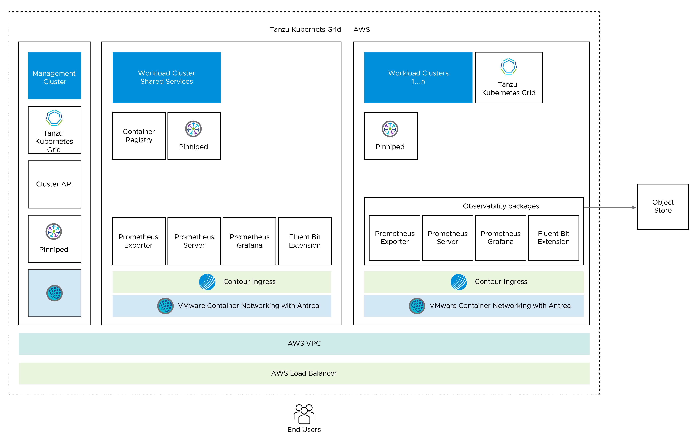
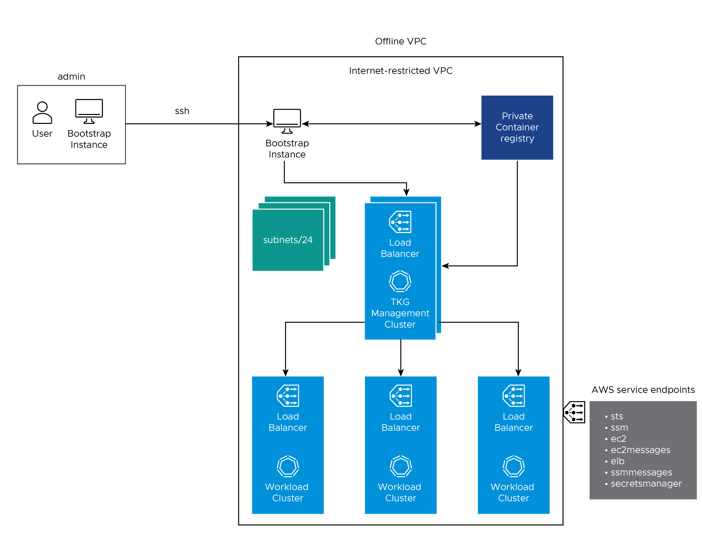
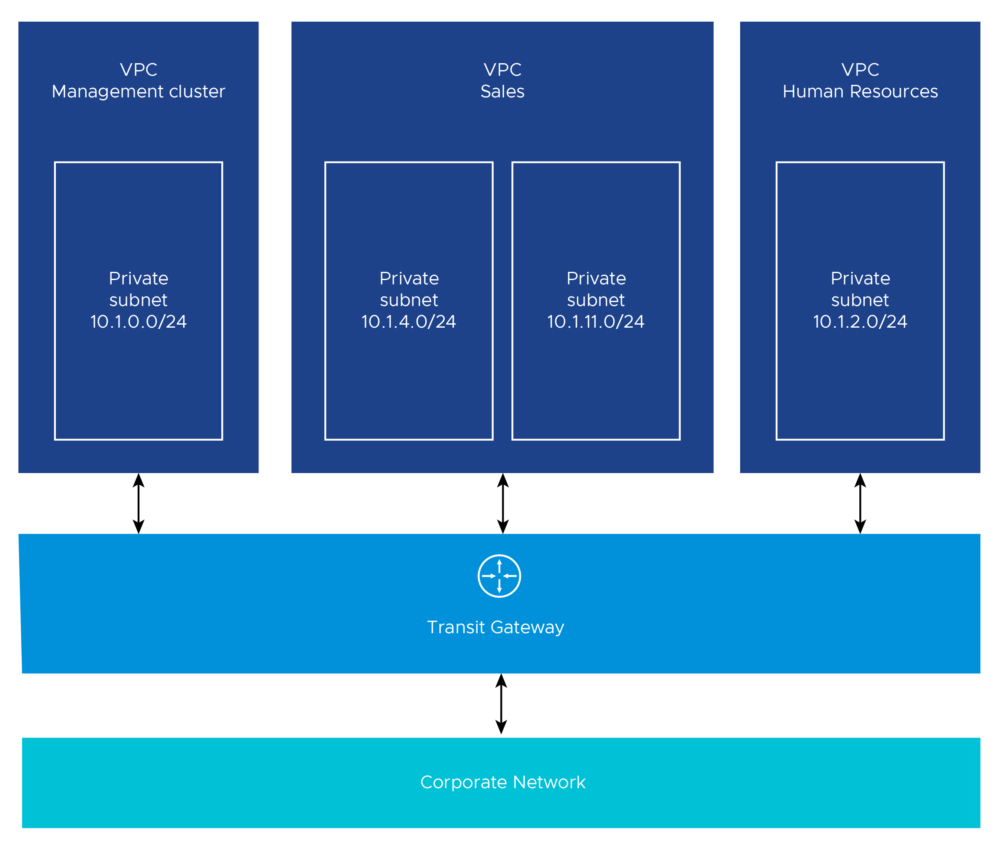

# VMware Tanzu for Kubernetes Operations on AWS Reference Design


VMware Tanzu for Kubernetes operations simplifies operation of Kubernetes for multi-cloud deployment by centralizing management and governance for clusters and teams across on-premises, public clouds, internet restricted environments and edge. Tanzu for Kubernetes operations delivers an open source aligned Kubernetes distribution with consistent operations and management to support infrastructure and application modernization.

This document lays out a reference design for deploying VMware Tanzu for Kubernetes grid on AWS Networking in an air-gap environment with Tanzu components on AWS.

An air-gapped environment is a network security measure employed to ensure a computer or computer network is secure by physically isolating it from unsecured networks, such as the public Internet or an unsecured local area network. 

The following reference design is based on the architecture and components described in [Tanzu Solution Reference Architecture Overview](index.md).





## Network Overview

The following network diagram shows the network layout used with this reference design. It shows the layout for a single virtual private cloud (VPC). The network layout uses the following -

* One private subnet for each AWS availability zone (AZ). These subnets are allocated a private IP address. 

* Internet-connected bootstrap machine with access on IP addresses within this internet restricted VPCs.

* A bootstrap VM running within your internet restricted VPC, provisioned similarly to the internet-connected machine to install Tanzu Kubernetes Grid.

* A private Docker-compatible container registry such as Harbor, Docker, or Artifactory installed and configured . This registry runs outside of Tanzu Kubernetes Grid and is separate from any registry deployed as a shared service for clusters.



### Network Recommendations

This reference design uses Tanzu Kubernetes Grid to manage the lifecycle of multiple Kubernetes workload clusters by bootstrapping a Kubernetes management cluster with the Tanzu command line tool. Consider the following when configuring the network for Tanzu Kubernetes Grid:

* Create internet restricted VPCs with no internet gateway (“offline VPCs”) for Tanzu Kubernetes Grid management and workload clusters.
 Internet-connected bootstrap machine must be able to access IP addresses within this internet restricted VPCs. 

* Create AWS Transit Gateway for Multiple VPC with Multiple Availability Zones network architecture. AWS Transit Gateway connects all your VPCs and on-premises networks through a central hub. This simplifies your network and puts an end to complex peering relationships. It acts as a cloud router – each new connection is only made once.

* Use an internal load balancer scheme. A best practice is to create an internal load balancer as a best practice to avoid exposing the Kubernetes API to the public Internet. To avoid creating a public-facing load balancer, you can set AWS_LOAD_BALANCER_SCHEME_INTERNAL to true in the cluster configuration file `AWS_LOAD_BALANCER_SCHEME_INTERNAL: true`
This setting customizes the management cluster’s load balancer to use an internal scheme, which means that its Kubernetes API server will not be accessible and routed over the Internet. If you use an internal load balancer, run Tanzu Kubernetes Grid from a machine with access to the target VPC private IP space.


* Beware that 172.17.0.0/16 is the default docker subnet. If you are going to use that for a VPC deployment, you must change your docker container subnet.

## Storage

Tanzu Kubernetes Grid ships with the AWS cloud storage driver, which allows you to provision stateful storage volumes in your Tanzu Kubernetes Grid cluster. The following storage classes are available:

  * gp2 - General Purpose SSD (default storage class)
  * io1 - IOPS provisioned SSD
  * st1 - Throughput Optimized HHD
  * sc1 - Cold HDD

For more information on the available storage options see [Amazon EBS volume types](https://docs.aws.amazon.com/AWSEC2/latest/UserGuide/ebs-volume-types.html).  

## VPC Architectures
In a production deployment, Tanzu Kubernetes Grid creates a multi-AZ deployment.

We recommend that you create the VPCs before you deploy Tanzu Kubernetes Grid. Also, make sure that you tag a private subnet in each AZ, including the control plane cluster, with a key of `kubernetes.io/cluster/<cluster_name>`. As a best practice, ensure that the value you use for the private subnets for an AZ can easily identify the subnets as belonging to the same AZ. For example,

```
aws ec2 create-subnet --vpc-id $vpcId --cidr-block <ip_address>  --availability-zone ${AWS_REGION}b  --tag-specifications ‘ResourceType=subnet, Tags=[{Key=Name,Value=priv-b}]’ --output json > $WORKING_DIR/subnet-priv-b

```

Alternatively if you use an internal load balancer scheme and enable AWS_LOAD_BALANCER_SCHEME_INTERNAL to true Tanzu Kubernetes Grid can create internet restricted infra (vpc etc) for you. 

All internet restricted VPCs must add following endpoints to it (VPC endpoint enables private connections between your VPC and supported AWS services):

* Service endpoints:
* sts
* ssm
* ec2
* ec2messages
* elasticloadbalancing
* secretsmanager
* ssmmessages

Based on your application needs and desired outcomes, you can organize your workloads using one of the following VPC architectures.

### Single VPC with Multiple Availability Zones

Most use cases require only a single VPC spread across multiple AZs. If more separation is needed within one VPC, more subnets can be used to provide better IP based visibility to corporate firewalls.


### Multiple VPC with Multiple Availability Zones

For more separation of application workloads on AWS, you can deploy separate Kubernetes clusters to independent private VPCs. This separation might be desirable for workloads with different compliance requirements, across different business units, or with different levels of Internet ingress and egress. By default, Tanzu Kubernetes Grid creates a VPC per cluster.

The following diagram shows an example architecture with multiple VPCs. The control plane load balancers in the example architecture are configured as internal load balancers.




Another variant of multiple VPC and multiple AZ design is to have one VPC for the control plane and another for just workload clusters. The following diagram shows such a design.


## Availability

We recommend deploying your Tanzu Kubernetes Grid cluster in an odd number of AZs to ensure high availability of components that require consensus to operate in failure modes.  

The Tanzu Kubernetes Grid management cluster performs [Machine Health Checks](https://cluster-api.sigs.k8s.io/tasks/healthcheck.html) on all Kubernetes worker VMs.  This ensures workload remain in a functional state, and can remediate issues such as:

  * Worker VM is accidentally deleted or corrupted.
  * Kubelet process on worker VM is accidentally stopped or corrupted.

This health check ensures that your worker capacity remains stable and can be  scheduled for workloads.  This health check, however, does not apply to the control plane or the load balancer VMs. The health check does not recreate VMs due to physical host failure.


### Quotas

Provide sufficient quotas to support both the management cluster and the workload clusters in your deployment. Otherwise, the cluster deployments will fail. Depending on the number of workload clusters you will deploy, you may need to increase the AWS services quotas from their default values. You will need to increase the quota in every region in which you plan to deploy Tanzu Kubernetes Grid.

See [Tanzu Kubernetes Grid resources in AWS account](https://docs.vmware.com/en/VMware-Tanzu-Kubernetes-Grid/1.5/vmware-tanzu-kubernetes-grid-15/GUID-mgmt-clusters-aws.html#aws-resources) for more details.

**Note** : The number of VPCs will depend on the VPC architecture you have selected.

See [AWS service quotas](https://docs.aws.amazon.com/general/latest/gr/aws_service_limits.html) for more information on AWS services default quotas.

## [FIPS](https://www.nist.gov/standardsgov/compliance-faqs-federal-information-processing-standards-fips)-Capable Version
You can install and run a FIPS(Federal Information Processing Standards)-capable version of Tanzu Kubernetes Grid, in which core components use cryptographic primitives provided by a FIPS-compliant library based on the [BoringCrypto](https://csrc.nist.gov/projects/cryptographic-module-validation-program/certificate/2964) / Boring SSL module. These core components include components of Kubernetes, [Containerd and CRI](https://github.com/containerd/containerd), [CNI plugins](https://www.cni.dev/docs/), [CoreDNS](https://coredns.io/), and [etcd](https://etcd.io/).

## Private Registry for Tanzu kubernetes grid installation into air-gapped environment 

Before installing Tanzu kubernetes grid into air-gapped environment a private Docker-compatible container registry such as [Harbor](https://goharbor.io/), [Docker](https://www.docker.com/), or [Artifactory](https://jfrog.com/artifactory/) installed and configured as follows - 

 * This registry should runs outside of Tanzu Kubernetes Grid and is separate from any registry deployed as a shared service for clusters:
 * Should Install the registry within your firewall.
 * Should configure the container registry with SSL certificates signed by a trusted CA.
 * The registry must not implement user authentication. For example, if you use a Harbor registry, the project must be public, and not private.
 * Private registry must have all the Tanzu kubernetes grid images uploaded before you start installing Tanzu kubernetes grid.See [Copy installing Tanzu kubernetes grid Images into an Air-gapped Environment](https://docs.vmware.com/en/VMware-Tanzu-Kubernetes-Grid/1.5/vmware-tanzu-kubernetes-grid-15/GUID-mgmt-clusters-image-copy-airgapped.html) for more details.


## Cluster Creation and Management

This reference design uses Tanzu Kubernetes Grid to create and manage ubiquitous Kubernetes clusters on AWS using Kubernetes [Cluster API](https://cluster-api.sigs.k8s.io/). Tanzu Kubernetes Grid functions through the creation of a management cluster which houses the Cluster API.  The Cluster API then interacts with the infrastructure provider to service workload Kubernetes cluster lifecycle requests.  

  

Tanzu Editions includes components for observability, as well as container registry.  We recommended installing the necessary components into a centralized shared services cluster.


## Ingress and Load Balancing

Tanzu Kubernetes Grid requires load balancing for both the control plane and the workload clusters. Tanzu Kubernetes Grid for AWS uses elastic load balancers for the control plane and workload clusters.

Default installation of Tanzu Kubernetes Grid does not have any default ingress controller deployed. Users can use Contour (available for installation through Tanzu Packages) or any Third-party ingress controller of their choice.
Contour is an open-source controller for Kubernetes Ingress routing and can be used for layer 7 load balancing. Contour can be installed in the Shared Services cluster on any Tanzu Kubernetes Cluster. Deploying Contour is a prerequisite if you want to deploy the Prometheus, Grafana, and Harbor Packages on a workload cluster.
For more information about [Contour](https://projectcontour.io/), see the Contour site and [Implementing Ingress Control with Contour](https://docs.vmware.com/en/VMware-Tanzu-Kubernetes-Grid/1.5/vmware-tanzu-kubernetes-grid-15/GUID-packages-ingress-contour.html).

For private load balancer, you can specifically request one by setting `service.beta.kubernetes.io/aws-load-balancer-internal: "true"` in the annotations of the service. This setting also applies to the Contour ingress and controls.

## Authentication with Pinniped

The Pinniped authentication and authorization service components are deployed into the management cluster. Pinniped uses the LDAP identity provider (IDP) configurations specified during the management cluster deployment. The workload cluster inherits its authentication configurations from its management cluster. With authentication in place, a Kubernetes administrator can enforce role-based access control (RBAC) with Kubernetes RoleBinding resources. These resources associate an identity provider user with a given Kubernetes role on the workload cluster.

Pinniped consists of following components:

  * **The Pinniped Supervisor** is an OIDC server that authenticates users through an external identity provider (IDP)/LDAP, and then issues its own federation ID tokens to be passed on to clusters based on the user information from the IDP.
  * **The Pinniped Concierge** is a credential exchange API which takes as input a credential from an identity source (e.g., Pinniped Supervisor, proprietary IDP), authenticates the user via that credential, and returns another credential which is understood by the host Kubernetes cluster or by an impersonation proxy which acts on behalf of the user.
  * **Dex** Pinniped uses Dex as a broker for your upstream LDAP identity provider. Dex is only deployed when LDAP is selected as the OIDC backend during Tanzu Kubernetes Grid management cluster creation.

The following diagram shows the Pinniped authentication flow with an LDAP. In the diagram, the blue arrows represent the authentication flow between the workload cluster, the management cluster and the LDAP. The green arrows represent Tanzu CLI and `kubectl` traffic between the workload cluster, the management cluster and the external IDP.


See the [Pinniped docs](https://pinniped.dev/docs/) for more information on how to integrate Pinniped into Tanzu Kubernetes Grid with LDAP.

We recommend the following best practices for managing identities in Tanzu Kubernetes Grid provisioned clusters:

* Configure Pinniped services during management cluster creation.
* Limit access to cluster resources following the [least privilege](https://csrc.nist.gov/glossary/term/least_privilege) principle.
* Limit access to management clusters to the appropriate set of users. For example, provide access only to users who are responsible for managing infrastructure and cloud resources but not to application developers. This is especially important because access to the management cluster inherently provides access to all workload clusters.
* Limit cluster administrator access for workload clusters to the appropriate set of users. For example, provide access to users who are responsible for managing infrastructure and platform resources in your organization, but not to application developers.


## Observability

### Metrics Monitoring with Prometheus and Grafana 

Tanzu Kubernetes Grid also supports [Prometheus](https://docs.vmware.com/en/VMware-Tanzu-Kubernetes-Grid/1.5/vmware-tanzu-kubernetes-grid-15/GUID-packages-prometheus.html) and [Grafana](https://docs.vmware.com/en/VMware-Tanzu-Kubernetes-Grid/1.5/vmware-tanzu-kubernetes-grid-15/GUID-packages-grafana.html) as an alternative on-premises solution for monitoring Kubernetes clusters.

Prometheus exposes scrapable metrics endpoints for various monitoring targets throughout your cluster. Metrics are ingested by polling the endpoints at a set interval. The metrics are then stored in a time-series database. You use the [Prometheus Query Language interface](https://prometheus.io/docs/prometheus/latest/querying/basics/) to explore the metrics.  

Grafana is responsible for visualizing Prometheus metrics without the need to manually write the `PromQL` queries. You can create custom charts and graphs in addition to the pre-packaged options.


Prometheus and Grafana are user-managed packages available with Tanzu Kubernetes Grid. For more information about packages bundled with Tanzu Kubernetes Grid, see [Install and Configure Packages](https://docs.vmware.com/en/VMware-Tanzu-Kubernetes-Grid/1.5/vmware-tanzu-kubernetes-grid-15/GUID-packages-index.html). For more information about user-managed packages, see [User-Managed Packages](https://docs.vmware.com/en/VMware-Tanzu-Kubernetes-Grid/1.5/vmware-tanzu-kubernetes-grid-15/GUID-packages-user-managed-index.html)


### Log Forwarding

Tanzu also includes Fluent Bit for integration with logging platforms such as vRealize, Log Insight Cloud, and Elasticsearch. See [Fluent Bit Documentation](https://docs.vmware.com/en/VMware-Tanzu-Kubernetes-Grid/1.5/vmware-tanzu-kubernetes-grid-15/GUID-packages-logging-fluentbit.html) for various logging providers.  

## Summary

Tanzu Kubernetes Grid on AWS  offers high-performance potential, convenience, and addresses the challenges of creating, testing, and updating cloud based Kubernetes platforms in a consolidated production environment. This validated approach will result in a production quality installation with all the application services needed to serve combined or uniquely separated workload types via a combined infrastructure solution.  

This plan meets many Day 0 needs for quickly aligning product capabilities to full stack infrastructure, including networking, configuring your firewall, load balancing, workload compute alignment and other capabilities. Observability and Metrics Monitoring  can be quickly established with Prometheus and Grafana.


