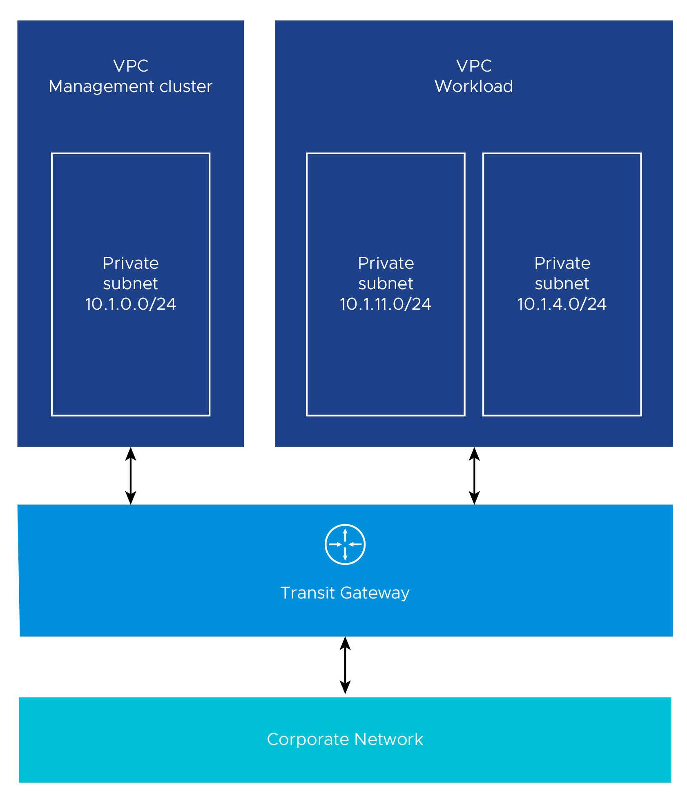
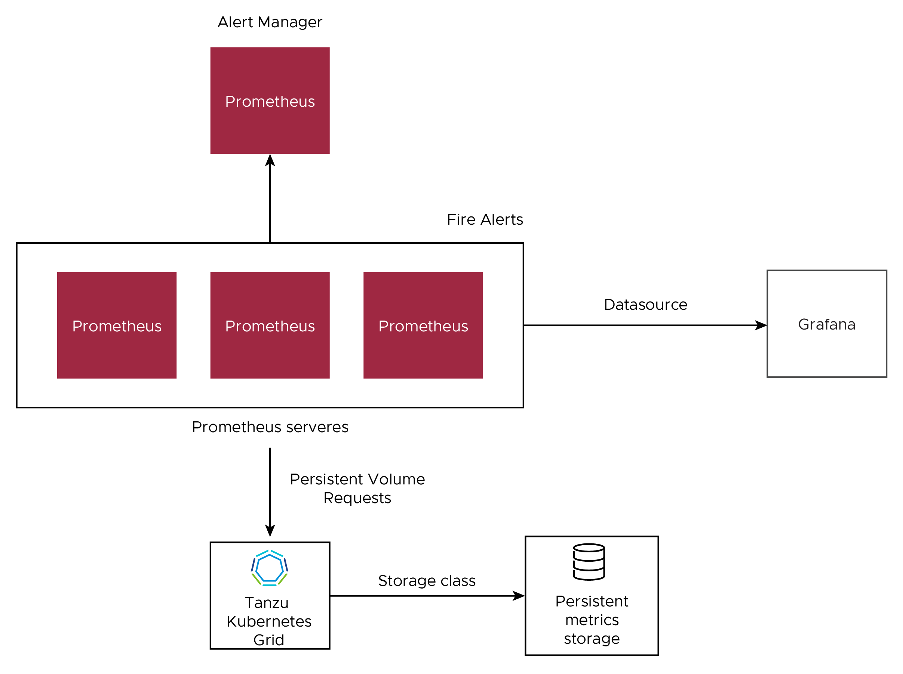

# VMware Tanzu Kubernetes Grid on AWS Air-Gapped Reference Design

VMware Tanzu Kubernetes Grid (multi-cloud) provides a consistent, upstream-compatible, regional Kubernetes substrate that is ready for end-user workloads and ecosystem integrations.

This document lays out a reference design for deploying VMware Tanzu for Kubernetes Grid on AWS Networking in an air-gapped environment with Tanzu components on AWS. An air-gapped environment is a network security measure employed to ensure that a computer or computer network is secure by physically isolating it from unsecured networks, such as the public Internet or an unsecured local area network. This reference design is based on the architecture and components described in [VMware Tanzu for Kubernetes Operations Reference Architecture 1.5](https://docs.vmware.com/en/VMware-Tanzu-for-Kubernetes-Operations/1.5/tko-reference-architecture/GUID-reference-designs-index.html).


## Tanzu Kubernetes Grid Infrastructure Network Overview

The following network diagram shows the network layout used with this reference design. It shows the layout for a single virtual private cloud (VPC). The network layout uses the following:

* One private subnet for each AWS availability zone (AZ). Each subnet is allocated a private IP address.
 
* A bootstrap VM running within your Internet-restricted (offline) VPC to install Tanzu Kubernetes Grid.

*  A private Docker-compatible container registry such as Harbor, Docker, or Artifactory installed and configured. This registry runs outside of Tanzu Kubernetes Grid and is separate from any registry deployed as a shared service for clusters.


### Network Recommendations

This reference design uses Tanzu Kubernetes Grid to manage the lifecycle of multiple Kubernetes workload clusters by bootstrapping a Kubernetes management cluster with the Tanzu command-line tool. Consider the following when configuring the network for Tanzu Kubernetes Grid:

* Create Internet-restricted VPCs with no Internet gateway (offline VPCs) for Tanzu Kubernetes Grid management and workload clusters. The Administrator/Operator must be able to access/ssh into Internet-restricted (offline) VPCs.

* Create an AWS Transit Gateway for a network architecture with multiple VPCs with multiple Availability Zones. The AWS Transit Gateway connects all your VPCs and on-premises networks through a central hub. This simplifies your network and avoids complex peering relationships. The AWS Transit Gateway acts as a cloud router – each new connection is made only once.

* Use an internal load balancer scheme. A best practice is to create an internal load balancer to avoid exposing the Kubernetes API server to the public Internet. To use an internal load balancer, include the following setting in the cluster configuration file:
   `AWS_LOAD_BALANCER_SCHEME_INTERNAL: true`
If you use an internal load balancer, run Tanzu Kubernetes Grid from a machine with access to the target VPC private IP space.

* Beware that 172.17.0.0/16 is the default Docker subnet. If you are going to use that subnet for a VPC deployment, you must change the subnet for your Docker container.

## Storage

Tanzu Kubernetes Grid ships with the AWS cloud storage driver, which allows you to provision stateful storage volumes in your Tanzu Kubernetes Grid cluster. The following storage classes are available:

  * gp2 - General Purpose SSD (default storage class)
  * io1 - IOPS provisioned SSD
  * st1 - Throughput Optimized HHD
  * sc1 - Cold HDD

For more information on available storage options, see [Amazon EBS volume types](https://docs.aws.amazon.com/AWSEC2/latest/UserGuide/ebs-volume-types.html).  

## VPC Architectures

In a production deployment, Tanzu Kubernetes Grid creates multiple Availability Zones (AZs).

VMware recommends that you create the VPCs before you deploy Tanzu Kubernetes Grid. Also, make sure that you tag a private subnet in each AZ, including the control plane cluster, with a key of `kubernetes.io/cluster/<cluster_name>`. As a best practice, ensure that the value you use for the private subnets for an AZ can easily identify the subnets as belonging to the same AZ. For example:

` aws ec2 create-subnet --vpc-id $vpcId --cidr-block <ip_address>  --availability-zone ${AWS_REGION}b  --tag-specifications ‘ResourceType=subnet, Tags=[{Key=Name,Value=priv-b}]’ --output json > $WORKING_DIR/subnet-priv-b `

All Internet-restricted VPCs must add the following endpoints to enable private connections between the VPCs and supported AWS services.

**Service endpoints:**

* sts
* ssm
* ec2
* ec2messages
* elasticloadbalancing
* secretsmanager
* ssmmessages
* s3 (optional; recommended)

Based on your application needs and desired outcomes, you can organize your workloads by using one of the following VPC architectures.

### Single VPC with Multiple Availability Zones

For most use cases, a single VPC spread across multiple AZs is sufficient. If more separation is needed within one VPC, more subnets can be used to provide better IP-based visibility to corporate firewalls. The network diagram above depicts this architecture.

### Multiple VPC with Multiple Availability Zones

For more separation of application workloads on AWS, you can deploy separate Kubernetes clusters to independent private VPCs. This separation might be desirable for workloads with different compliance requirements across different business units. By default, Tanzu Kubernetes Grid creates one VPC per cluster.

The following diagram shows an example architecture with **multiple offline VPCs**. The control plane load balancers in the example architecture are configured as internal load balancers.


Another variant of multiple VPC and multiple AZ design is to have one VPC for the management cluster and another for workload clusters. The following diagram illustrates such a design.



Consider the following design implications when designing your network architecture.  

 **Decision ID** | **Design Decision**  | **Design Justification**  | **Design Implications**
-----|-----|-----|-----
 TKG-AG-001 | Use separate networks/VPCs for the management cluster and workload clusters  | Better isolation and security policies between environments isolate production Kubernetes clusters from dev/test clusters | Sharing the same network for multiple clusters can cause shortage of IP addresses
TKG-AG-002 | Use separate networks for workload clusters based on their usage | Isolate production Kubernetes clusters from dev/test clusters | A separate set of Service Engines can be used for separating dev/test workload clusters from prod clusters

## Availability

VMware recommends deploying your Tanzu Kubernetes Grid cluster in an odd number of AZs to ensure high availability of components that require consensus to operate in failure modes.  

The Tanzu Kubernetes Grid management cluster performs [Machine Health Checks](https://cluster-api.sigs.k8s.io/tasks/automated-machine-management/healthchecking.html) on all Kubernetes worker VMs.  This ensures that workloads remain in a functional state, and can remediate issues such as:

  * a worker VM is accidentally deleted or corrupted.
  * the Kubelet process on a worker VM is accidentally stopped or corrupted.

These health checks ensure that your worker capacity remains stable and can be scheduled for workloads. These health checks, however, do not apply to the control plane or to the load balancer VMs.

### Quotas

It is essential to provide sufficient quotas to support both the management cluster and the workload clusters in your deployment. Otherwise, the cluster deployments will fail. Depending on the number of workload clusters you deploy, you may need to increase the AWS services quotas from their default values in every region in which you deploy Tanzu Kubernetes Grid.

The number of VPCs depends on the VPC architecture you select. The following table indicates the number of VPCs for the network architectures in the network diagrams shown above.

VPC Architecture | Number of VPCs
-----|-----
Single VPC | 1
Multiple VPCs - one for each Kubernetes cluster | 3
Multiple VPCs - one for the management cluster and one for workload cluster | 2

See [Tanzu Kubernetes Grid resources in AWS account](https://docs.vmware.com/en/VMware-Tanzu-Kubernetes-Grid/1.5/vmware-tanzu-kubernetes-grid-15/GUID-mgmt-clusters-aws.html#aws-resources) for all AWS resources consumed for the Tanzu Kubernetes Grid. See [AWS service quotas](https://docs.aws.amazon.com/general/latest/gr/aws_service_limits.html) for more information on AWS services default quotas.

## Private Registry for Tanzu Kubernetes Grid

Before installing Tanzu Kubernetes grid into an air-gapped environment, a private Docker-compatible container registry such as [Harbor](https://goharbor.io/), [Docker](https://www.docker.com/), or [Artifactory](https://jfrog.com/artifactory/) must be installed and configured as follows:

 * Should run outside of Tanzu Kubernetes Grid and should be separate from any registry deployed as a shared service for clusters.
 * Should use an RFC 1918 (private) address and remain routable to the Tanzu Kubernetes Grid clusters.
 * Should be configured with SSL certificates signed by a trusted CA.
 * Must not implement user authentication. For example, if you use a Harbor registry, the project must be public, not private.
 * Must have all the Tanzu Kubernetes Grid images uploaded before you start installing Tanzu Kubernetes grid. See [Copy installing Tanzu Kubernetes grid Images into an Air-gapped Environment](https://docs.vmware.com/en/VMware-Tanzu-Kubernetes-Grid/1.5/vmware-tanzu-kubernetes-grid-15/GUID-mgmt-clusters-image-copy-airgapped.html) for more details.

## Compliance and Security

VMware-published Tanzu Kubernetes releases (TKrs), along with compatible versions of Kubernetes and supporting components, use the latest stable and generally-available update of the OS version that it packages. They contain all current CVE and USN fixes as of the day that the image is built. The image files are signed by VMware and have file names that contain a unique hash identifier. The VMware-published Tanzu Kubernetes releases (TKrs) contain a BOM (bill of materials) for every component that appears in each Tanzu Kubernetes releases. This can be combined with the Tanzu Kubernetes grid BOM to provide a holistic view of the containers and contents of every combination of a Tanzu Kubernetes releases and Tanzu Kubernetes Grid release. These BOM files are securely served from VMware and stored as [imgpkg](https://carvel.dev/imgpkg/) generated [Open Container Initiative (OCI)](https://opencontainers.org/) compliant images that have immutable hashes associated with the BOM file itself.

VMware provides FIPS (Federal Information Processing Standards)-capable version of Tanzu Kubernetes Grid. You can install and run a FIPS-capable version of Tanzu Kubernetes Grid, in which core components use cryptographic primitives provided by a FIPS-compliant library that provides [FIPS 140-2](https://www.nist.gov/standardsgov/compliance-faqs-federal-information-processing-standards-fips) compliance based on the [BoringCrypto](https://csrc.nist.gov/projects/cryptographic-module-validation-program/certificate/2964) / Boring SSL module. These core components include components of Kubernetes, [Containerd and CRI](https://github.com/containerd/containerd), [CNI plugins](https://www.cni.dev/docs/), [CoreDNS](https://coredns.io/), and [etcd](https://etcd.io/).

### Kubernetes Hardening

VMware has a robust process of following U.S. Department of Defense security standards for Tanzu Kubernetes Grid which includes scanning against an official [Security Technical Implementation Guide (STIG) provided by the Defense Information Systems Agency (DISA)](https://ncp.nist.gov/checklist/996).

Refer to the following sample post hardening results snapshots for Tanzu Kubernetes Grid.

#### Kubernetes Hardening - Control Plane


#### Kubernetes Hardening - Worker Node


You can download the [sample test results output](./resources/tkg-aws-airgap/CAAT-STIG-Resolution-Explanation.csv).

### Node OS Hardening

Tanzu Kubernetes Grid is layered on top of VMs using the Ubuntu operating system. Ubuntu has an official Security Technical Implementation Guide (STIG) provided by the Defense Information Systems Agency (DISA). To comply with STIG guidelines and to enable consistent and fast machine deployments, VMs are deployed from images using Ubuntu as the base operating system. VMware publishes AMI, OVA, or VHD that are FIPS enabled and STIG hardened.

Refer to the following OS hardening sample results snapshots.

#### Node OS Hardening - Control Plane


#### Node OS Hardening - Worker Node


You can download the [sample test results output](./resources/tkg-aws-airgap/tkg-bionic-stig.csv).

[Service Installer for VMware Tanzu](https://docs.vmware.com/en/Service-Installer-for-VMware-Tanzu/1.4/service-installer/GUID-AWS%20-%20Federal%20Airgap-AWSFederalAirgap-DeploymentGuide.html) allows you to deploy a working Tanzu Kubernetes Grid cluster that already has the DISA Kubernetes STIG applied and it also enables FIPS 140-2 compatible algorithms.

### Ports, Protocols, and Services Management (PPSM)  

The Cloud Computing SRG V1R4 states in Section 5.15 that `mission owners using CSOs of any service type (I/P/SaaS) must comply with DoDI 8551.01: Ports, Protocols, and Services Management (PPSM) when implementing and operating their systems/applications in an IaaS/PaaS CSO or when using a SaaS offering.`

This requirement is to ensure that a standardized process is in place to catalog, regulate, and control the use and management of protocols in the Internet protocol suite, and associated ports on government networks including interconnected systems and platforms.  

To further this mission, and ensure that this information is readily available, refer to the VMware public repository for [Tanzu Kubernetes Grid PPSM](https://ports.esp.vmware.com/home/Tanzu-Kubernetes-Grid).

### National Institute of Standards and Technology ([NIST](https://www.nist.gov/))

Since 2014, the public sector has been required to develop, document, implement, and maintain information security of government information systems through a standardized approach or framework.  A major component of how this strategy is implemented relies on the security controls documented in NIST Special Publication 800-53, and the Risk Management Framework guidelines established in NIST SP 800-37.
VMware maintains a partnership with the NIST Cybersecurity Center of Excellence (NCCoE) which includes validation of core VMware products including NSX, vSphere, vRealize, and Tanzu Kubernetes Grid. Refer to [Tanzu Kubernetes Grid NIST control](https://docs.vmware.com/en/VMware-Tanzu-Kubernetes-Grid/1.5/vmware-tanzu-kubernetes-grid-15/GUID-security-nist.html) for more information.

### Tanzu Kubernetes Grid Security Overview

For in depth information on the VMware security process and the current state of the art of Tanzu Kubernetes Grid security standards, see [Tanzu Kubernetes Grid Security Overview Whitepaper](https://docs.vmware.com/en/VMware-Tanzu-Kubernetes-Grid/1.5/vmware-tanzu-kubernetes-grid-15/GUID-security-overview.html).

## Cluster Creation and Management

In this reference design, Tanzu Kubernetes Grid creates and manages ubiquitous Kubernetes clusters on AWS using Kubernetes [Cluster API](https://cluster-api.sigs.k8s.io/). Tanzu Kubernetes Grid functions through the creation of a management cluster that hosts the Cluster API.  The Cluster API then interacts with the infrastructure provider to service workload Kubernetes cluster lifecycle requests.  

  

Tanzu for Kubernetes Operations includes observability components as well as a container registry.  VMware recommends installing the necessary components into a centralized shared services cluster.

When making design decisions for your Tanzu Kubernetes Grid clusters, consider the design implications listed in the following table.

 **Decision ID** | **Design Decision**  | **Design Justification**  | **Design Implications**
-----|-----|-----|-----
TKG-CLS-001 | Deploy TKG Management cluster from CLI | UI doesn’t provide an option to specify an internal registry to use for TKG installation | Additional parameters are required to be passed in the cluster deployment file. Using UI, you can’t pass these additional parameters.
TKG-CLS-002 | Use AWS internal Load Balancer scheme for your Control Plane Endpoints | Don’t expose Kubernetes API endpoints to Internet in Tanzu Kubernetes Grid clusters. | Create additional AWS load balancers in your AWS account which may increase AWS infrastructure cost.
TKG-CLS-003 | Deploy Tanzu Kubernetes clusters in large and above sizes ec2 instances(example t2.large or ++) | Allow TKG clusters to have enough resources for all Tanzu packages | Create bigger AWS ec2 instances into your aws account which may increase AWS infrastructure cost .
TKG-CLS-004 | Deploy Tanzu Kubernetes clusters with Prod plan | This deploys multiple control plane nodes and provides High Availability for the control plane | TKG infrastructure is not impacted by single node failure
TKG-CLS-005 | Deploy Tanzu Kubernetes clusters with an odd number of AWS AZs for HA | This deploys multiple control plane nodes and provides High Availability for the control plane | TKG infrastructure is not impacted by single zone failure.
TKG-CLS-006 | Enable identity management for Tanzu Kubernetes Grid clusters | To avoid usage of administrator credentials and ensure that required users with the right roles have access to Tanzu Kubernetes Grid clusters | Pinniped package helps with integrating the TKG Management cluster with LDAPS Authentication and Workload cluster inherits the authentication configuration from the management cluster
TKG-CLS-007 | Enable Machine Health Checks for TKG clusters | The Tanzu Kubernetes Grid management cluster performs Machine Health Checks on all Kubernetes worker VMs and HA, Machine Health Checks interoperably work together to enhance workload resiliency | A MachineHealthCheck is a resource within the Cluster API that allows users to define conditions under which Machines within a Cluster should be considered unhealthy. Remediation actions can be taken when MachineHealthCheck has identified a node as unhealthy.

## Bring Your Own Images for the Tanzu Kubernetes Grid Deployment

You can build custom machine images for Tanzu Kubernetes Grid to use as a VM template for the management and Tanzu Kubernetes (workload) cluster nodes that it creates. Each custom machine image packages a base operating system (OS) version and a Kubernetes version, along with any additional customizations, into an image that runs on vSphere, Microsoft Azure infrastructure and AWS (EC2) environments.

A custom image must be based on the OS versions that are supported by Tanzu Kubernetes Grid. The table below provides a list of operating systems that are supported for building custom images for the Tanzu Kubernetes Grid.

 **vSphere** | **AWS**  | **Azure**
 -----|-----|-----
</br>- Ubuntu 20.04</br>- Ubuntu 18.04</br>- RHEL 7</br>- Photon OS 3|</br>- Ubuntu 20.04</br> - Ubuntu 18.04</br>- Amazon Linux 2|</br>- Ubuntu 20.04</br>- Ubuntu 18.04

For additional information on building custom images for TKG, see the Tanzu Kubernetes Grid [Build Machine Images](https://docs.vmware.com/en/VMware-Tanzu-Kubernetes-Grid/1.5/vmware-tanzu-kubernetes-grid-15/GUID-build-images-index.html) documentation for the applicable operating system:

* [Linux Custom Machine Images](https://docs.vmware.com/en/VMware-Tanzu-Kubernetes-Grid/1.5/vmware-tanzu-kubernetes-grid-15/GUID-build-images-linux.html)
* [Windows Custom Machine Images](https://docs.vmware.com/en/VMware-Tanzu-Kubernetes-Grid/1.5/vmware-tanzu-kubernetes-grid-15/GUID-build-images-windows.html)

## Tanzu Kubernetes Clusters Networking

A Tanzu Kubernetes cluster provisioned by the Tanzu Kubernetes Grid supports two Container Network Interface (CNI) options:

* [Antrea](https://antrea.io/)
* [Calico](https://www.tigera.io/project-calico/)
  
Both are open-source software that provide networking for cluster pods, services, and ingress.

When you deploy a Tanzu Kubernetes cluster using Tanzu CLI using the default configuration, Antrea CNI is automatically enabled in the cluster. While Kubernetes does have in-built network policies, Antrea builds on those native network policies to provide more fine-grained network policies of its own.

Antrea has a ClusterNetworkPolicy which operates at the Kubernetes cluster level. It also has a NetworkPolicy which limits the scope of a policy to a Kubernetes namespace. The ClusterNetworkPolicy can be thought of as a means for a Kubernetes Cluster Admin to create a security policy for the cluster as a whole. The NetworkPolicy can be thought of as a means for a developer to secure applications in a particular namespace. See Tanzu Kubernetes Grid [Security and Compliance](https://docs.vmware.com/en/VMware-Tanzu-Kubernetes-Grid/1.5/vmware-tanzu-kubernetes-grid-15/GUID-security-compliance.html) for more details.

To provision a Tanzu Kubernetes cluster using a non-default CNI, see Deploy [Tanzu Kubernetes clusters with calico](https://docs.vmware.com/en/VMware-Tanzu-Kubernetes-Grid/1.5/vmware-tanzu-kubernetes-grid-15/GUID-tanzu-k8s-clusters-networking.html#calico)

Each CNI is suitable for a different use case. The following table lists some common use cases for the two CNIs that Tanzu Kubernetes Grid supports. The information in this table will help you select the right CNI in your Tanzu Kubernetes Grid implementation.

 **CNI** | **Use Case**  | **Pros and Cons**
 -----|-----|-----
Antrea | Enable Kubernetes pod networking with IP overlay networks using VXLAN or Geneve for encapsulation. Optionally encrypt node-to-node communication using IPSec packet encryption. Antrea supports advanced network use cases like kernel bypass and network service mesh | **Pros**:</br>Provide an option to configure egress IP pool or static egress IP for the Kubernetes workloads. </br> **Cons**:</br>More complicated for network troubleshooting because of the additional overlay network
Calico | Calico is used in environments where factors like network performance, flexibility, and power are essential.</br>For routing packets between nodes, Calico leverages the BGP routing protocol instead of an overlay network. This eliminates the need to wrap packets with an encapsulation layer resulting in increased network performance for Kubernetes workloads.|**Pros**:</br>- Support for network policies</br>- High network performance</br>- SCTP Support<br>**Cons**:</br>- No multicast support.

## Ingress and Load Balancing

Tanzu Kubernetes Grid requires load balancing for both the control plane and the workload clusters. Tanzu Kubernetes Grid for AWS uses elastic load balancers for both.

A default installation of Tanzu Kubernetes Grid does not deploy an ingress controller. Users can use Contour (available for installation through Tanzu Packages) or any third-party ingress controller of their choice. Contour is an open-source controller for Kubernetes ingress routing and can be used for layer 7 load balancing. Contour can be installed in the Shared Services cluster on any Tanzu Kubernetes Cluster. Deploying Contour is a prerequisite for deploying the Prometheus, Grafana, or Harbor packages on a workload cluster. For more information about [Contour](https://projectcontour.io/), see the [Implementing Ingress Control with Contour](https://docs.vmware.com/en/VMware-Tanzu-Kubernetes-Grid/1.5/vmware-tanzu-kubernetes-grid-15/GUID-packages-ingress-contour.html).

To use a private load balancer, set `service.beta.kubernetes.io/aws-load-balancer-internal: "true"` in the annotations for the service. This setting also applies to the Contour ingress and controls.

**Example** :

```
annotations:
   service.beta.kubernetes.io/aws-load-balancer-internal: "true"
```

The following table provides general recommendations for when you should use the Contour ingress controller for your Kubernetes environment.

 **Ingress Controller** | **Use Case**
 -----|-----
Contour | Use Contour when north-south traffic is needed in a Kubernetes cluster. You can apply security policies for north-south traffic by defining the policies in the applications manifest file. Contour is a reliable solution for simple Kubernetes workloads.

## Authentication with Pinniped

The Pinniped authentication and authorization service components are deployed into the management cluster. Pinniped uses the LDAP identity provider (IDP) configurations specified during the management cluster deployment. The workload cluster inherits its authentication configurations from its management cluster. With authentication in place, a Kubernetes administrator can enforce role-based access control (RBAC) with Kubernetes RoleBinding resources. These resources associate an identity provider user with a given Kubernetes role on the workload cluster.

Pinniped consists of following components:

  * **The Pinniped Supervisor:** It is an OIDC server that authenticates users through an external identity provider (IDP)/LDAP, and then issues its own federation ID tokens to be passed on to clusters based on the user information from the IDP.
  * **The Pinniped Concierge:** It is a credential exchange API which takes as input a credential from an identity source (e.g., Pinniped Supervisor, proprietary IDP), authenticates the user via that credential, and returns another credential which is understood by the host Kubernetes cluster or by an impersonation proxy which acts on behalf of the user.
  * **Dex:** Pinniped uses Dex as a broker for your upstream LDAP identity provider. Dex is only deployed when LDAP is selected as the OIDC backend during Tanzu Kubernetes Grid management cluster creation.

The following diagram shows the Pinniped authentication flow with an LDAP. In the diagram, the blue arrows represent the authentication flow between the workload cluster, the management cluster and the LDAP. The green arrows represent Tanzu CLI and `kubectl` traffic between the workload cluster, the management cluster and the external IDP.


See the [Pinniped docs](https://pinniped.dev/docs/) for more information on how to integrate Pinniped into Tanzu Kubernetes Grid with LDAP.

VMware recommends the following best practices for managing identities in Tanzu Kubernetes Grid-provisioned clusters:

* Configure Pinniped services during management cluster creation.
* Limit access to cluster resources following the [least privilege](https://csrc.nist.gov/glossary/term/least_privilege) principle.
* Limit access to management clusters to the appropriate set of users. For example, provide access only to users who are responsible for managing infrastructure and cloud resources but not to application developers. This is especially important because access to the management cluster provides access to all workload clusters.

## Observability

### Tanzu Kubernetes Grid Monitoring

In an air-gapped environment, monitoring for the Tanzu Kubernetes clusters is provided via [Prometheus](https://prometheus.io/) and [Grafana](https://grafana.com/).

* **Prometheus** is an open-source system monitoring and alerting toolkit. It can collect metrics from target clusters at specified intervals, evaluate rule expressions, display the results, and trigger alerts if certain conditions arise. The Tanzu Kubernetes Grid implementation of Prometheus includes Alert Manager, which you can configure to notify you when certain events occur. Prometheus exposes scrapable metrics endpoints for various monitoring targets throughout your cluster. Metrics are ingested by polling the endpoints at a set interval. The metrics are then stored in a time-series database. You use the [Prometheus Query Language](https://prometheus.io/docs/prometheus/latest/querying/basics/) interface to explore the metrics.
* **Grafana** is an open-source visualization and analytics software. It allows you to query, visualize, alert on, and explore your metrics no matter where they are stored. Grafana is responsible for visualizing Prometheus metrics without the need to manually write the PromQL queries. You can create custom charts and graphs in addition to the pre-packaged options.

Both Prometheus and Grafana are installed via user-managed Tanzu packages by creating the deployment manifests and invoking the kubectl command to deploy the packages in the Tanzu Kubernetes clusters.

The following diagram shows how the monitoring components on a cluster interact.



You can use out-of-the-box Kubernetes dashboards or you can create new dashboards to monitor compute/network/storage utilization of Kubernetes objects such as Clusters, Namespaces, and Pods.

The following pictures show some sample dashboards.

#### Namespace (Pods) Compute Resources Utilization Dashboard


#### Namespace (Pods) Networking Utilization Dashboard


#### API Server Availability Dashboard


#### Cluster Compute Resources Utilization Dashboard


## Log Forwarding

Tanzu also includes Fluent Bit for integration with logging platforms such as vRealize, Log Insight Cloud, and Elasticsearch. See [Fluent Bit Documentation](https://docs.vmware.com/en/VMware-Tanzu-Kubernetes-Grid/1.5/vmware-tanzu-kubernetes-grid-15/GUID-packages-logging-fluentbit.html) for various logging providers.

You can deploy Fluent Bit on any management cluster or Tanzu Kubernetes clusters from which you want to collect logs. First, configure an output plugin on the cluster from which you want to gather logs, depending on the endpoint that you use. Then deploy Fluent Bit on the cluster as a package.

## Tanzu Kubernetes Grid Upgrade

To upgrade the previous version of Tanzu Kubernetes Grid into your environment, see [Tanzu Kubernetes Grid Upgrade instructions](https://docs.vmware.com/en/VMware-Tanzu-Kubernetes-Grid/1.5/vmware-tanzu-kubernetes-grid-15/GUID-upgrade-tkg-index.html).

## Summary

Tanzu Kubernetes Grid on AWS offers high-performance potential, convenience, and addresses the challenges of creating, testing, and updating cloud-based Kubernetes platforms in a consolidated production environment. This validated approach will result in a production quality installation with all the application services needed to serve combined or uniquely separated workload types via a combined infrastructure solution.  

This plan meets many Day-0 needs for quickly aligning product capabilities to full stack infrastructure, including networking, configuring your firewall, load balancing, workload compute alignment and other capabilities. Observability and Metrics Monitoring can be quickly implemented with Prometheus and Grafana.
