# VMware Tanzu for Kubernetes Operations on AWS Reference Design


VMware Tanzu for Kubernetes Operations simplifies operation of Kubernetes for multi-cloud deployment by centralizing management and governance for clusters and teams across on-premises, public clouds, and edge. Tanzu for Kubernetes Operations delivers an open source aligned Kubernetes distribution with consistent operations and management to support infrastructure and application modernization.

This document lays out a reference design for deploying VMware Tanzu for Kubernetes Operations with Tanzu components on AWS.

The following reference design is based on the architecture and components described in [VMware Tanzu for Kubernetes Operations Reference Architecture](index.md).

> **Note:** This reference design is supported and validated for customers deploying Tanzu Kubernetes Grid 1.6.x on AWS.

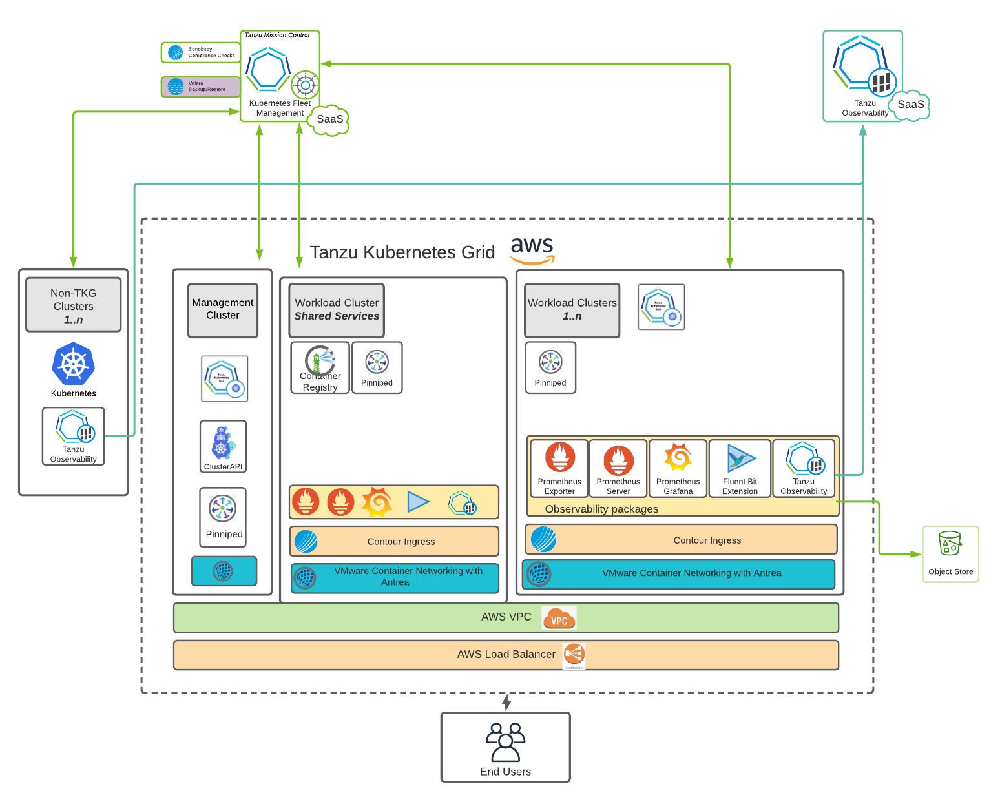

### Supported Kubernetes Versions in Tanzu Kubernetes Grid v1.6
Tanzu Kubernetes Grid v1.6.0 supports the Kubernetes versions v1.23.x, v1.22.x, and v1.21.x.


### Tanzu Kubernetes Grid v1.6 Components
Tanzu Kubernetes Grid v1.6 supports the following operating systems and components. The component versions listed in parentheses are included in Tanzu Kubernetes Grid v1.6.

 **Function** | **Component and Version**  
 -----|-----
Infrastructure platform | Native AWS
CLI, API, and package infrastructure | Tanzu Framework v0.25.0
Cluster creation and management | Core Cluster API (v1.1.5), Cluster API Provider AWS (v1.2.0)
Kubernetes node OS distributed with TKG | Amazon Linux 2, Ubuntu 20.04
Build your own image | Amazon Linux 2, Ubuntu 18.04, Ubuntu 20.04
Container runtime | Containerd (v1.6.6)
Container networking| Antrea (v1.5.3), Calico (v3.22.1)
Container registry | Harbor (v2.5.3)
Ingress | Contour (v1.20.2)
Storage | Amazon EBS CSI driver (v1.8.0) and in-tree cloud providers
Authentication | OIDC through Pinniped (v0.12.1), LDAP through Pinniped (v0.12.1) and Dex
Observability | Fluent Bit (v1.8.15), Prometheus (v2.36.2), Grafana (v7.5.16), Tanzu Observability 
Backup and migration | Velero (v1.8.1)


## Network Overview

The following network diagram shows the network layout used with this reference design. It shows the layout for a single virtual private cloud (VPC). The network layout uses the following types of subnets:

1. One private subnet for each AWS availability zone (AZ). These subnets are not automatically allocated a public IP address. The default gateway is a NAT gateway.
1. One public subnet for each AWS availability zone (AZ). These subnets are automatically allocated a public IP address. The default gateway is an Internet gateway if subnet is connected to the Internet. A public subnet is optional if you do not need Internet ingress or egress.  

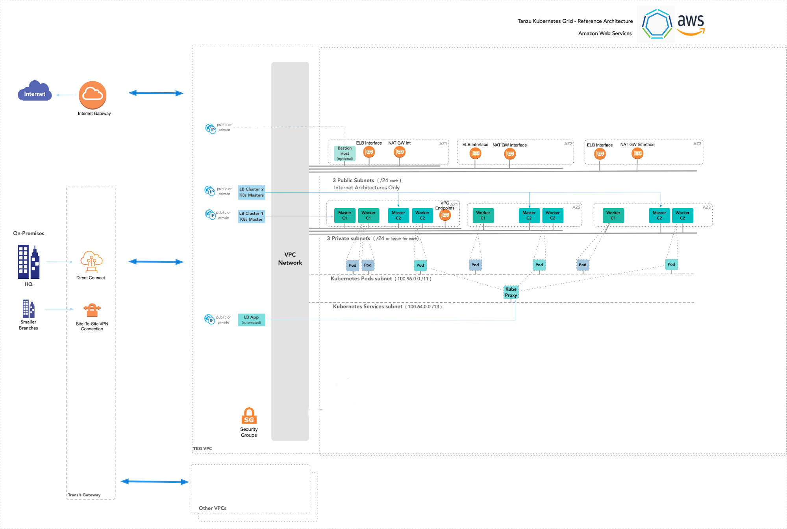

### Network Recommendations

This reference design uses Tanzu Kubernetes Grid to manage the lifecycle of multiple Kubernetes workload clusters by bootstrapping a Kubernetes management cluster with the Tanzu command line tool. Consider the following when configuring the network for Tanzu Kubernetes Grid:

* Use an internal load balancer scheme. A best practice is to create an internal load balancer to avoid exposing the Kubernetes API to the public Internet. To avoid creating a public-facing load balancer, you can set AWS_LOAD_BALANCER_SCHEME_INTERNAL to true in the cluster configuration file `AWS_LOAD_BALANCER_SCHEME_INTERNAL: true`
This setting customizes the management cluster’s load balancer to use an internal scheme, which means that its Kubernetes API server will not be accessible and routed over the Internet. If you use an internal load balancer, run Tanzu Kubernetes Grid from a machine with access to the target VPC private IP space.

* If you don't want an outbound Internet or inbound connection from AWS, you can eliminate the public subnet.

* Beware that 172.17.0.0/16 is the default docker subnet. If you are going to use that for a VPC deployment, you must change your docker container subnet.

## Storage

Tanzu Kubernetes Grid ships with the AWS cloud storage driver, which allows you to provision stateful storage volumes in your Tanzu Kubernetes Grid cluster. The following storage classes are available:

  * gp2 - General Purpose SSD (default storage class)
  * io1 - IOPS provisioned SSD
  * st1 - Throughput Optimized HHD
  * sc1 - Cold HDD

For more information on the available storage options see [Amazon EBS volume types](https://docs.aws.amazon.com/AWSEC2/latest/UserGuide/ebs-volume-types.html).  

## VPC Architectures
In a production deployment, Tanzu Kubernetes Grid creates a multi-AZ deployment.

We recommend that you create the VPCs before you deploy Tanzu Kubernetes Grid. Also, make sure that you tag a public and private subnet in each AZ, including the control plane cluster, with a key of `kubernetes.io/cluster/<cluster_name>`. As a best practice, ensure that the value you use for the public and private subnets for an AZ can easily identify the subnets as belonging to the same AZ. For example,

```
aws ec2 create-subnet --vpc-id $vpcId --cidr-block <ip_address>  --availability-zone ${AWS_REGION}b  --tag-specifications ‘ResourceType=subnet, Tags=[{Key=Name,Value=priv-b}]’ --output json > $WORKING_DIR/subnet-priv-b
aws ec2 create-subnet --vpc-id $vpcId --cidr-block <ip_address>  --availability-zone ${AWS_REGION}b  --tag-specifications ‘ResourceType=subnet, Tags=[{Key=Name,Value=pub-b}]’  --output json > $WORKING_DIR/subnet-pub-b
```

Based on your application needs and desired outcomes, you can organize your workloads using one of the following VPC architectures.

### Single VPC with Multiple Availability Zones

Most use cases require only a single VPC spread across multiple AZs as shown in the reference diagram. If more separation is needed within one VPC, more subnets can be used to provide better IP based visibility to corporate firewalls.

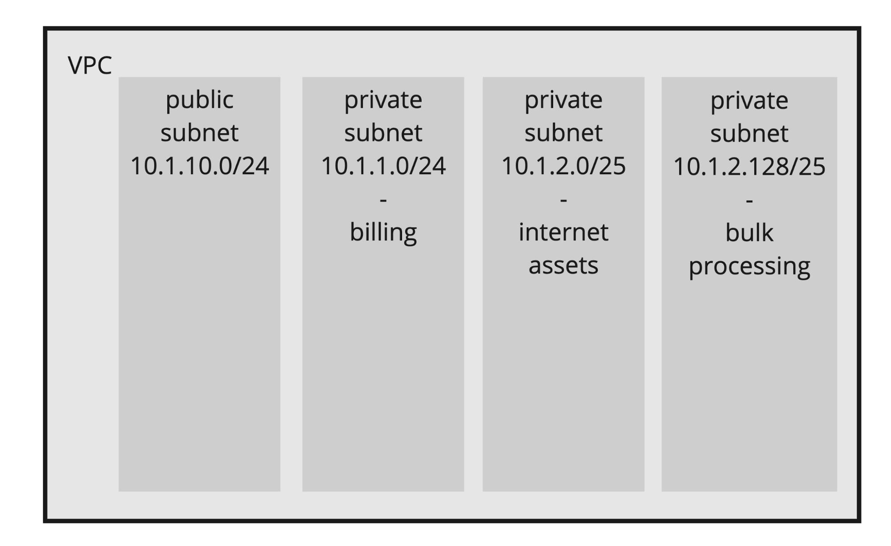


### Multiple VPC with Multiple Availability Zones

For more separation of application workloads on AWS, you can deploy separate Kubernetes clusters to independent VPCs. This separation might be desirable for workloads with different compliance requirements, across different business units, or with different levels of Internet ingress and egress. By default, Tanzu Kubernetes Grid creates a VPC per cluster.

The following diagram shows an example architecture with multiple VPCs. The control plane load balancers in the example architecture are configured as internal load balancers.

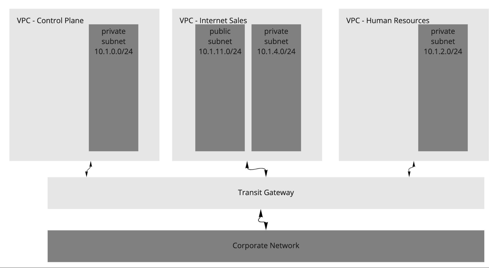

Another variant of multiple VPC and multiple AZ design is to have one VPC for the control plane and another for just workload clusters. The following diagram shows such a design.

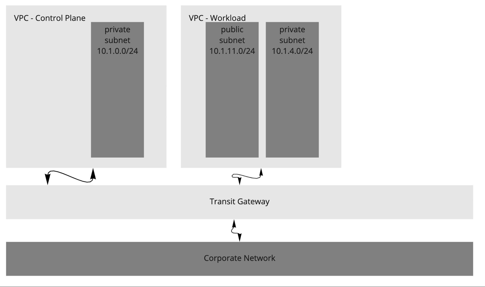

Consider the following design implications when designing your network architecture.  

 **Decision ID** | **Design Decision**  | **Design Justification**  | **Design Implications** 
-----|-----|-----|-----
 TKO-AWS-001 | Use separate networks/VPCs for the management cluster and workload clusters  | Better isolation and security policies between environments isolate production Kubernetes clusters from dev/test clusters | Sharing the same network for multiple clusters can cause shortage of IP addresses
TKO-AWS-002 | Use separate networks for workload clusters based on their usage | Isolate production Kubernetes clusters from dev/test clusters | A separate set of Service Engines can be used for separating dev/test workload clusters from production clusters

## Availability

We recommend deploying your Tanzu Kubernetes Grid cluster in an odd number of AZs to ensure high availability of components that require consensus to operate in failure modes.  

The Tanzu Kubernetes Grid management cluster performs [Machine Health Checks](https://cluster-api.sigs.k8s.io/tasks/automated-machine-management/healthchecking.html) on all Kubernetes worker VMs.  This ensures workload remain in a functional state, and can remediate issues such as:

  * Worker VM is accidentally deleted or corrupted.
  * Kubelet process on worker VM is accidentally stopped or corrupted.

This health check ensures that your worker capacity remains stable and can be  scheduled for workloads.  This health check, however, does not apply to the control plane or the load balancer VMs. The health check does not recreate VMs due to physical host failure.

### Quotas

Provide sufficient quotas to support both the management cluster and the workload clusters in your deployment. Otherwise, the cluster deployments will fail. Depending on the number of workload clusters you will deploy, you may need to increase the AWS services quotas from their default values. You will need to increase the quota in every region in which you plan to deploy Tanzu Kubernetes Grid.

See [Tanzu Kubernetes Grid resources in AWS account](https://docs.vmware.com/en/VMware-Tanzu-Kubernetes-Grid/1.6/vmware-tanzu-kubernetes-grid-16/GUID-mgmt-clusters-aws.html#aws-resources) for more details.

The number of VPCs depends on the VPC architecture you select. The following table indicates the number of VPCs for the network architectures in the network diagrams shown above.

VPC Architecture | Number of VPCs
-----|-----
Single VPC | 1
Multiple VPCs - one for each Kubernetes cluster | 3
Multiple VPCs - one for the management cluster and one for workload cluster | 2


See [AWS service quotas](https://docs.aws.amazon.com/general/latest/gr/aws_service_limits.html) for more information on AWS services default quotas.

## Cluster Creation and Management

This reference design uses Tanzu Kubernetes Grid to create and manage ubiquitous Kubernetes clusters on AWS using Kubernetes [Cluster API](https://cluster-api.sigs.k8s.io/). Tanzu Kubernetes Grid functions through the creation of a management cluster which houses the Cluster API.  The Cluster API then interacts with the infrastructure provider to service workload Kubernetes cluster lifecycle requests.  

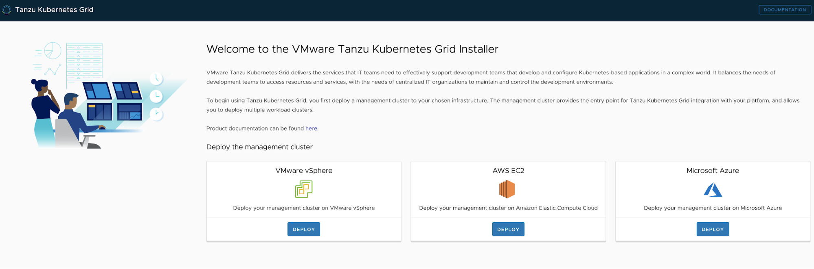  

When making design decisions for your Tanzu Kubernetes Grid clusters, consider the design implications listed in the following table.

 **Decision ID** | **Design Decision**  | **Design Justification**  | **Design Implications** 
-----|-----|-----|-----
TKO-CLS-001 | Deploy TKG Management cluster from CLI | UI doesn’t provide an option to specify an internal registry to use for TKG installation. | Additional parameters are required to be passed in the cluster deployment file. Using UI, you can’t pass these additional parameters.
TKO-CLS-002 | Use AWS internal load balancer scheme for your control plane endpoints | Don’t expose Kubernetes API endpoints to Internet in Tanzu Kubernetes Grid clusters. | Create additional AWS load balancers in your AWS account which may increase AWS infrastructure cost.
TKO-CLS-003 | Deploy Tanzu Kubernetes clusters in large and above sizes EC2 instances(For example, t2.large or greater) | Allow TKG clusters to have enough resources for all Tanzu packages. | Create larger AWS EC2 instances into your AWS account which may increase AWS infrastructure cost.
TKO-CLS-004 | Deploy Tanzu Kubernetes clusters with Prod plan | This deploys multiple control plane nodes and provides high availability for the control plane. | TKG infrastructure is not impacted by single node failure.
TKO-CLS-005 | Deploy Tanzu Kubernetes clusters with an odd number of AWS AZs for HA | This deploys multiple control plane nodes and provides high availability for the control plane. | TKG infrastructure is not impacted by single zone failure.
TKO-CLS-006 | Enable identity management for Tanzu Kubernetes Grid clusters | To avoid usage of administrator credentials and ensure that required users with the right roles have access to Tanzu Kubernetes Grid clusters. | Pinniped package helps with integrating the TKG management cluster with LDAPS authentication and workload cluster inherits the authentication configuration from the management cluster.
TKO-CLS-007 | Enable Machine Health Checks for TKG clusters | The Tanzu Kubernetes Grid management cluster performs Machine Health Checks on all Kubernetes worker VMs and HA, Machine Health Checks interoperably work together to enhance workload resiliency | A MachineHealthCheck is a resource within the Cluster API that allows users to define conditions under which Machines within a Cluster should be considered unhealthy. Remediation actions can be taken when MachineHealthCheck has identified a node as unhealthy.

Tanzu Editions include components for observability, as well as container registry. We recommended installing the necessary components into a centralized shared services cluster.

## Global Cluster Lifecycle Management

Registering Management cluster and attaching workload clusters to Tanzu Mission Control allows you to manage your global portfolio of Kubernetes clusters. You can do the following with Tanzu Mission Control:

  * Centralized lifecycle management: managing the creation and deletion of workload clusters using registered management or supervisor clusters
  * Centralized management: viewing the inventory of clusters and the health of clusters and their components
  * Authorization: centralized authentication and authorization with federated identity from multiple sources (e.g., AD, LDAP, and SAML), plus an easy-to-use policy engine for granting the right access to the right users across teams
  * Compliance: enforcing all clusters to apply the same set of policies
  * Data protection: managing Velero deployment, configuration, and schedule to ensure that cluster manifests and persistent volumes are backed up & restorable
  * Inspection: running a Sonobouy conformance check suite to ensure Kubernetes cluster functionality

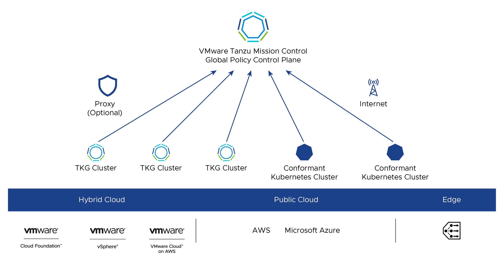


For a complete list of Tanzu Mission Control features, see [VMware Tanzu Mission
Control Feature Comparison](https://content.cdntwrk.com/files/aT0xMjk5NjY3JnY9OSZpc3N1ZU5hbWU9dG1jLWNvbXBhcmlzb24tY2hhcnQmY21kPWQmc2lnPTc2YTA2N2E4MWRjMmVkNjE0ZDcwMTlmNjc4NjhmMjI4).  

To Register your management or supervisor cluster for management through Tanzu Mission Control, navigate to **Administration > Management Cluster** on the Tanzu Mission Control console and follow the prompts.

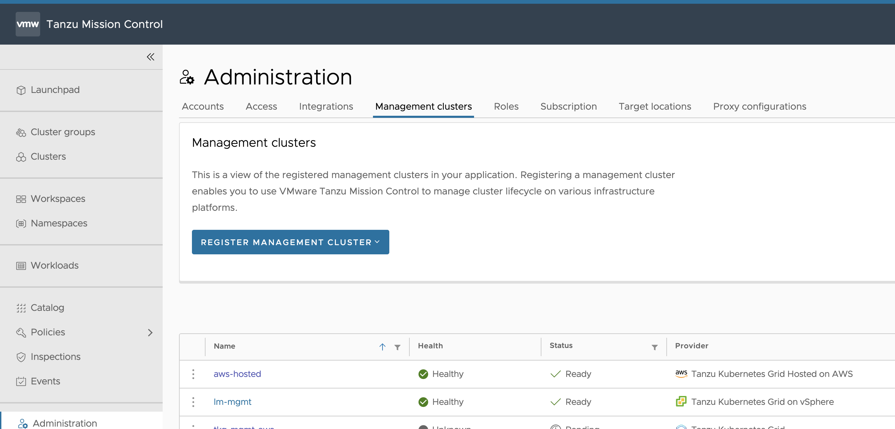

To attach your cluster for management through Tanzu Mission Control, navigate to **Clusters > Attach Cluster** on the Tanzu Mission Control console and follow the prompts.

> **Note:** If a workload cluster under management requires a proxy to access the Internet, you can use the Tanzu Mission Control CLI to [generate the YAML](https://docs.vmware.com/en/VMware-Tanzu-Mission-Control/services/tanzumc-using/GUID-97672F56-2AD4-46E6-94E1-805ED38D06C7.html) necessary to install Tanzu Mission Control components on it.


## Tanzu Kubernetes Clusters Networking
A Tanzu Kubernetes cluster provisioned by the Tanzu Kubernetes Grid supports two Container Network Interface (CNI) options: 

* [Antrea](https://antrea.io/) 
* [Calico](https://www.tigera.io/project-calico/)
  
Both are open-source software that provide networking for cluster pods, services, and ingress.

When you deploy a Tanzu Kubernetes cluster using Tanzu CLI using the default configuration, Antrea CNI is automatically enabled in the cluster. While Kubernetes does have in-built network policies, Antrea builds on those native network policies to provide more fine-grained network policies of its own. 

Antrea has a ClusterNetworkPolicy which operates at the Kubernetes cluster level. It also has a NetworkPolicy which limits the scope of a policy to a Kubernetes namespace. The ClusterNetworkPolicy can be used by a Kubernetes Cluster Admin to create a security policy for the cluster as a whole. The NetworkPolicy can be used by a developer to secure applications in a particular namespace. See Tanzu Kubernetes Grid [Security and Compliance](https://docs.vmware.com/en/VMware-Tanzu-Kubernetes-Grid/1.6/vmware-tanzu-kubernetes-grid-16/GUID-security-compliance.html) for more details.

To provision a Tanzu Kubernetes cluster using a non-default CNI, see [Deploy Tanzu Kubernetes clusters with calico](https://docs.vmware.com/en/VMware-Tanzu-Kubernetes-Grid/1.6/vmware-tanzu-kubernetes-grid-16/GUID-tanzu-k8s-clusters-networking.html#calico).

Each CNI is suitable for a different use case. The following table lists some common use cases for the two CNIs that Tanzu Kubernetes Grid supports. The information in this table helps you select the right CNI in your Tanzu Kubernetes Grid implementation.

 **CNI** | **Use Case**  | **Pros and Cons**
 -----|-----|-----
Antrea | Enable Kubernetes pod networking with IP overlay networks using VXLAN or Geneve for encapsulation. Optionally encrypt node-to-node communication using IPSec packet encryption.Antrea supports advanced network use cases like kernel bypass and network service mesh | **Pros**:</br>Provide an option to configure egress IP pool or static egress IP for the Kubernetes workloads. </br> **Cons**:</br>More complicated for network troubleshooting because of the additional overlay network.
Calico | Calico is used in environments where factors like network performance, flexibility, and power are essential.</br>For routing packets between nodes, Calico leverages the BGP routing protocol instead of an overlay network. This eliminates the need to wrap packets with an encapsulation layer resulting in increased network performance for Kubernetes workloads.|**Pros**:</br>- Support for network policies</br>- High network performance</br>- SCTP support<br>**Cons**:</br>- No multicast support.

## Ingress and Load Balancing

Tanzu Kubernetes Grid requires load balancing for both the control plane and the workload clusters. Tanzu Kubernetes Grid for AWS uses elastic load balancers for the control plane and workload clusters.

For workload clusters, the Tanzu Kubernetes Grid [Contour ingress controller package](https://docs.vmware.com/en/VMware-Tanzu-Kubernetes-Grid/1.6/vmware-tanzu-kubernetes-grid-16/GUID-packages-ingress-contour.html) can be used for layer 7 load balancing.

If you have deployed with both public and private subnets, by default you will get an Internet-facing load balancer. If you want a private load balancer, you can specifically request one by setting `service.beta.kubernetes.io/aws-load-balancer-internal: "true"` in the annotations of the service. This setting also applies to the Contour ingress and controls whether Contour is internal-facing or external-facing.  


In Tanzu Kubernetes Grid, you can optionally deploy the [external-dns package](https://docs.vmware.com/en/VMware-Tanzu-Kubernetes-Grid/1.6/vmware-tanzu-kubernetes-grid-16/GUID-packages-external-dns.html), which automates the updates to DNS records in AWS (Route53) associated with ingress resources or LoadBalancer services. This can also automate DNS record management for externally exposed services.

## Authentication with Pinniped

The Pinniped authentication and authorization service components are deployed into the management cluster. Pinniped uses the OIDC or LDAP identity provider (IDP) configurations specified during the management cluster deployment. The workload cluster inherits its authentication configurations from its management cluster. With authentication in place, a Kubernetes administrator can enforce role-based access control (RBAC) with Kubernetes RoleBinding resources. These resources associate an identity provider user with a given Kubernetes role on the workload cluster.

Pinniped consists of following components:

  * **The Pinniped Supervisor** is an OIDC server that authenticates users through an external identity provider (IDP)/LDAP, and then issues its own federation ID tokens to be passed on to clusters based on the user information from the IDP.
  * **The Pinniped Concierge** is a credential exchange API which takes as input a credential from an identity source (e.g., Pinniped Supervisor, proprietary IDP), authenticates the user via that credential, and returns another credential which is understood by the host Kubernetes cluster or by an impersonation proxy which acts on behalf of the user.
  * **Dex** Pinniped uses Dex as a broker for your upstream LDAP identity provider. Dex is only deployed when LDAP is selected as the OIDC backend during Tanzu Kubernetes Grid management cluster creation.

The following diagram shows the Pinniped authentication flow with an external IDP. In the diagram, the blue arrows represent the authentication flow between the workload cluster, the management cluster and the external IDP. The green arrows represent Tanzu CLI and `kubectl` traffic between the workload cluster, the management cluster and the external IDP.

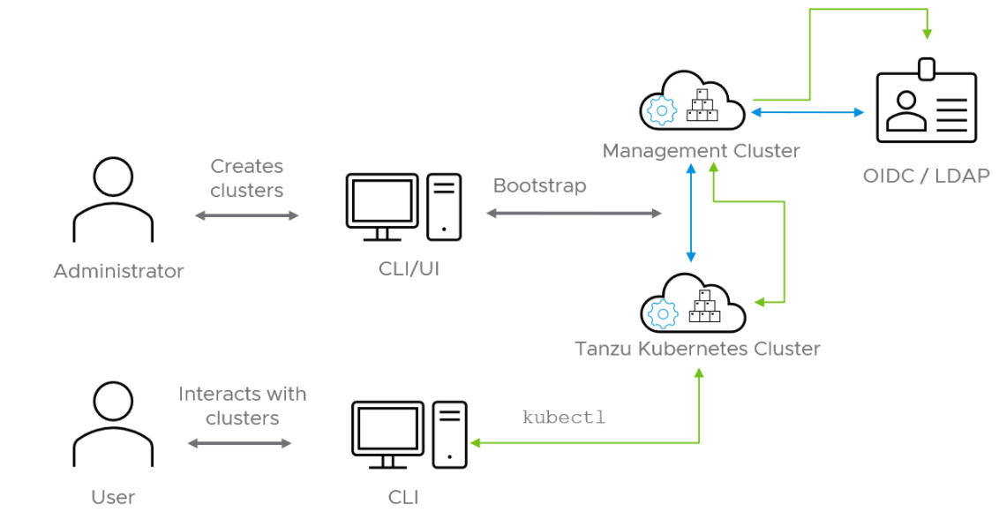

See the [Pinniped docs](https://pinniped.dev/docs/) for more information on how to integrate Pinniped into Tanzu Kubernetes Grid with OIDC providers and LDAP.

We recommend the following best practices for managing identities in Tanzu Kubernetes Grid provisioned clusters:

* Configure Pinniped services during management cluster creation.
* Limit access to cluster resources following the [least privilege](https://csrc.nist.gov/glossary/term/least_privilege) principle.
* Limit access to management clusters to the appropriate set of users. For example, provide access only to users who are responsible for managing infrastructure and cloud resources but not to application developers. This is especially important because access to the management cluster inherently provides access to all workload clusters.
* Limit cluster administrator access for workload clusters to the appropriate set of users. For example, provide access to users who are responsible for managing infrastructure and platform resources in your organization, but not to application developers.
* Connect to an [identity provider](https://csrc.nist.gov/glossary/term/identity_provider) to manage the user identities allowed to access cluster resources instead of relying on administrator-generated `kubeconfig` files.

## Observability

### Metrics Monitoring with Tanzu Observability by Wavefront (Recommended Solution)

Using [VMware Tanzu Observability by Wavefront](https://tanzu.vmware.com/observability) significantly enhances observability. Tanzu Observability is a VMware SaaS application that collects and displays metrics and trace data from the full stack platform, as well as from applications. The service provides the ability to create alerts tuned with advanced analytics, assist in the troubleshooting of systems, and to understand the impact of running production code.

Tanzu Observability collects data from Kubernetes and from applications running within Kubernetes.

You can configure Tanzu Observability with an array of capabilities. There are over 200 [integrations](https://vmware.wavefront.com/integrations) with prebuilt dashboards available in Wavefront.

The following table describes the plugins we recommend for this design:

| Plugin | Purpose | Key Metrics | Example Metrics |
| --- | --- | --- | --- |
| Wavefront Kubernetes Integration | Collect metrics from Kubernetes clusters and pods | Kubernetes container and POD statistics | POD CPU usage rate |
| Wavefront by VMware for Istio | Adapts Istio collected metrics and forwards to Wavefront | Istio metrics including request rates, trace rates, throughput, etc. | Request rate (Transactions per Second) |


#### Custom Tanzu Observability Dashboards

Tanzu Observability provides various out-of-the-box dashboards. You can customize the dashboards for your particular deployment. For information on how to customize Tanzu Observability dashboards for Tanzu for Kubernetes Operations, see [Customize Tanzu Observability Dashboard for Tanzu for Kubernetes Operations](../deployment-guides/tko-to-customized-dashboard.md).


### Metrics Monitoring with Prometheus and Grafana (Alternative Solution)

Tanzu Kubernetes Grid also supports [Prometheus](https://docs.vmware.com/en/VMware-Tanzu-Kubernetes-Grid/1.6/vmware-tanzu-kubernetes-grid-16/GUID-packages-prometheus.html) and [Grafana](https://docs.vmware.com/en/VMware-Tanzu-Kubernetes-Grid/1.6/vmware-tanzu-kubernetes-grid-16/GUID-packages-grafana.html) as an alternative on-premises solution for monitoring Kubernetes clusters.

Prometheus exposes scrapable metrics endpoints for various monitoring targets throughout your cluster. Metrics are ingested by polling the endpoints at a set interval. The metrics are then stored in a time-series database. You use the [Prometheus Query Language interface](https://prometheus.io/docs/prometheus/latest/querying/basics/) to explore the metrics.  

Grafana is responsible for visualizing Prometheus metrics without the need to manually write the `PromQL` queries. You can create custom charts and graphs in addition to the pre-packaged options.

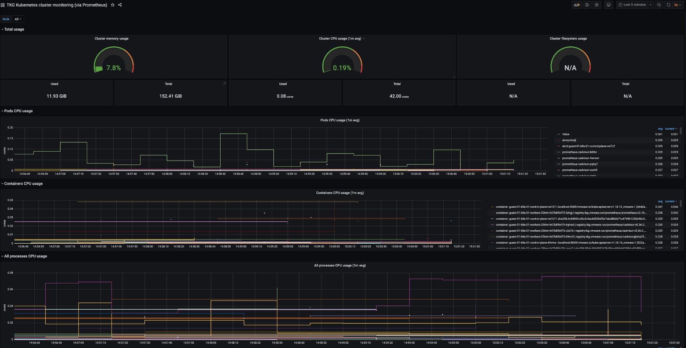

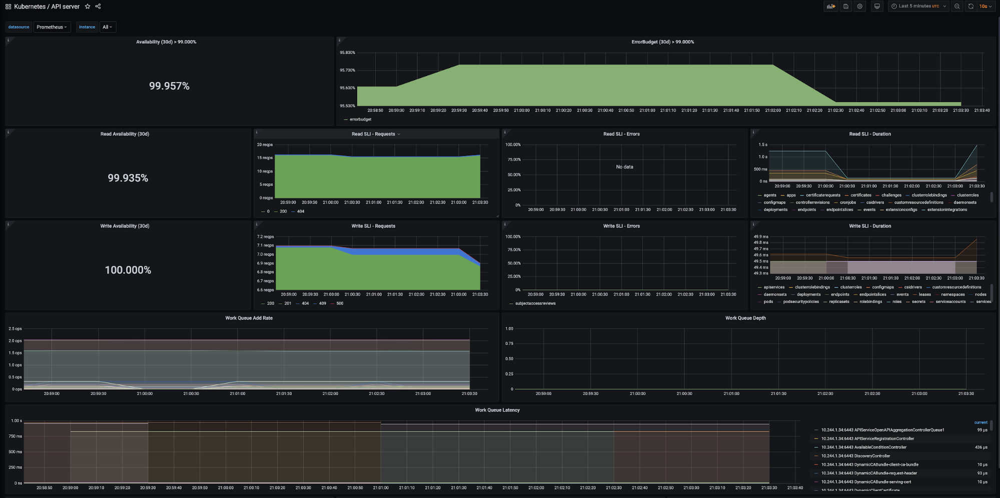

Prometheus and Grafana are user-managed packages available with Tanzu Kubernetes Grid. For more information about packages bundled with Tanzu Kubernetes Grid, see [Install and Configure Packages](https://docs.vmware.com/en/VMware-Tanzu-Kubernetes-Grid/1.6/vmware-tanzu-kubernetes-grid-16/GUID-packages-index.html). For more information about user-managed packages, see [User-Managed Packages](https://docs.vmware.com/en/VMware-Tanzu-Kubernetes-Grid/1.6/vmware-tanzu-kubernetes-grid-16/GUID-packages-user-managed-index.html).

### Log Forwarding

Tanzu also includes Fluent Bit for integration with logging platforms such as vRealize, Log Insight Cloud, and Elasticsearch. See [Fluent Bit Documentation](https://docs.vmware.com/en/VMware-Tanzu-Kubernetes-Grid/1.6/vmware-tanzu-kubernetes-grid-16/GUID-packages-logging-fluentbit.html) for various logging providers.  

## Summary

Tanzu Kubernetes Grid on AWS  offers high-performance potential, convenience, and addresses the challenges of creating, testing, and updating cloud based Kubernetes platforms in a consolidated production environment. This validated approach will result in a production quality installation with all the application services needed to serve combined or uniquely separated workload types via a combined infrastructure solution.  

This plan meets many Day 0 needs for aligning product capabilities, such as configuring firewall rules, networking, load balancing, and workload compute, to the full stack infrastructure.

## Deployment Instructions
For instructions on how to deploy this reference design, see [Deploy Tanzu for Kubernetes Operations on AWS](../deployment-guides/tko-aws.md).
