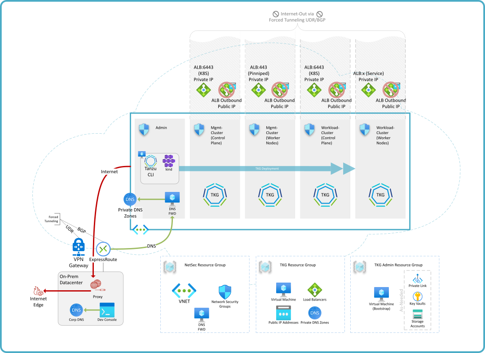

# VMware Tanzu Kubernetes Grid on Hybrid-Cloud Azure

_A validated augmentation for the [TKO on Azure reference architecture](tko-on-azure.md)_

## Summary

Building on the reference architecture provided for Tanzu for Kubernetes Operations (TKO) on Azure, this document outlines the modifications that should be considered for a hybrid-cloud architecture. This type of cloud architecture maintains some dependency or connectivity to on-prem networks and systems, and special considerations must be made to co-exist within this scenario. This reference architecture assumes on-premises connectivity via ExpressRoute or a VPN Gateway, private IP (i.e. not Internet-routable) only access, and _managed_ egress routing.

The solution areas for a hybrid-cloud-accessible TKGm solution can be summarized as:

- Network & WAN Architecture
- Network Security (Ingress/Egress)
- Azure Service Extension
- Platform Configuration

Further, though TKO components are assumed to be in the cloud environment, the solution allows for hybrid placement and each location can reach the other.



## Network & WAN Architecture

A hybrid-cloud architecture may exist within a classic hub-spoke topology, or may have been built using Azure vWAN. As with the [_Reference_](tko-on-azure.md) approach, any VNET topology will work that is supported by the encumbent networking requirements. Depicted in the diagram above, a single VNET houses everything for the TKO solution, administration, and even on-premises integration. This design would fit nicely into either a hub-spoke or vWAN topology and could be considered the 'spoke' subscription and VNET in this case. Should VNET boundaries be desired between components, it is not necessary that they have mesh peering, but that they are configured for loosely-restricted network access between the related VNETs (e.g. firewall NVA fulfilling access controls and routing).

The diagram also shows VNET Gateway connections such as those found in a VPN or ExpressRoute configuration - foundational to a hybrid-cloud architecture. Any specifics regarding the size or assignment of Tanzu subnet CIDRs should follow the requirements of the network and WAN owners, with respect to Azure's minimum and maximum (TKGm recommends minimum /28).

As an element of the datacenter extension into cloud, the networking team may be prescribing the use of [_forced tunneling_](https://docs.microsoft.com/en-us/azure/vpn-gateway/vpn-gateway-forced-tunneling-rm) by configuring the default route in BGP over ExpressRoute, or through creating User-Defined Route Tables (UDR) for VPN connections. As seen in _Network Security_ below, this feature may be particular to your security requirements.

## Network Security

### Azure Load Balancer

Azure networks have a preferred order to build _effective routes_ and forced tunneling overrides the native Internet-out path. **If the default route (0.0.0.0/0) is not overridden, Azure Load Balancers marked with a 🚫 in the diagram will be active for your solution.** Generally speaking, a forced tunneling solution that utilizes transparent proxy or next-gen firewalls will be the simplest and most effective way to control outbound Internet access. However, if a traditional proxy is being used within the organization, additional configuration will be necessary both within the Tanzu platform as well as on the bootstrap virtual machine. A proxy configuration alone will not guarantee that egress follows this path. Virtual Machines inherit an egress NAT automatically even when no public IP address is configured - common ways to prevent this are via route tables or Network Security Groups.

### Network Security Groups (NSG)

A suggested layout for Resource Groups is offered within the diagram above. An important note here is that while a separate team may be responsible for the VNET and security services within your subscription, TKG's worker subnet NSG must be co-located with the VNET's Resource Group and be named according to a pattern:

> `{tkg_cluster_name}-node-nsg`

Subnet NSGs may be configured to NetSec requirements with the following considerations:

| Description | Source | Destination | Protocol | Port |
| - | - | - | -: | - |
| SSH Access | on-prem | "Admin" subnet† | SSH | 22 |
| DNS Forwarding | on-prem (DNS Server(s)) | "Admin" subnet | DNS-udp | 53 |
| k8s API | on-prem, admin | all Control Plane(s) | tcp-tls | 6443 |
| Pinniped†† concierge to supervisor (identity broker) | workload cluster | management cluster | tcp | 31234 |

> †Reference to the "admin" subnet (pictured at top) will vary and may also require on-prem or other sources.
>
> ††Pinniped is an identity broker and a choice. If it is unused, then the port above will not be needed.
>
>**NOTE:** Other services may need to be allowed within these configured NSGs for things not directly related to Tanzu Kubernetes Grid or TKO (e.g. DNS, NTP, internal services).

## Load Balancers

The [Cluster API](https://cluster-api.sigs.k8s.io/) for Azure (CAPZ) will add outbound load balancers to aggregate Internet egress through a single, reliable IP that can be used for outbound rules or whitelisting on the destination. In many hybrid-cloud solutions, the egress IP is actually intended to be an on-prem edge solution as indicated above. Although the load balancers will be created and configured for outbound Internet access, **Azure's order of routing prefers the User-Defined Route (UDR).** If there is no _override_ for the default route (e.g. 0.0.0.0/0 --> Internet), then Azure will prefer the outbound NAT rules provided by the Standard Azure Load Balancer of the solution. Your network requirements may have additional routes added to the Route Table listing as needed.

## Azure Service Extension

### DNS

DNS represents one of the largest differences in a hybrid-cloud approach. TKGm uses Azure Private DNS and is therefore inaccessible from an on-premises network without some additional steps taken. Microsoft has detailed this within their solutions [documentation](https://docs.microsoft.com/en-us/azure/private-link/private-endpoint-dns#virtual-network-and-on-premises-workloads-using-a-dns-forwarder), but here are the components as a summary:


The most important elements of this diagram is the inclusion of a DNS forwarder _within_ your VNET where the private DNS zone is linked, and the forwarding domain configuration for those private zones applied to the local DNS solution (on-prem). The DNS forwarder itself can be as simple as a Linux virtual machine running bind9. The forwarder machine can forward **all** requests to Azure DNS because the on-prem DNS solution will use zone forwarders for Azure private zones (explicit).

Name resolution for on-premises targets must also be available to the TKGm cluster for fully hybrid connectivity. DNS should be configured at the VNET level to point to a user-defined or _custom_ DNS server. This should be configured to use the customer's DNS solution to include on-premises zones. Alternatively, the forwarder can also be configured to forward on-premises zones to another DNS server, while maintaining Azure-specific zones are forwarded to Azure DNS (168.63.129.16).

### Azure Key Vault

> **OPTIONAL**

As shown in the design at the head of this document, the _Admin_ subnet and/or Resource Group may contain other services relevant to the solution or enterprise. Azure Key Vault is used in the [deployment guide](../../automation/tko-on-azure-hybrid/readme.md) for this Reference Architecture to store secret and non-secret parameters that can be used to drive automation for TKG management and workload clusters.

It is recommended that all such _cloud service_ resources are provided via Private Links or otherwise access-restricted means to ensure they are not addressable via the public Internet, unless that is explicitly understood and desired.

## Platform Configuration - Architecture Enablement

### Tanzu Kubernetes Grid

The hybrid-cloud TKGm solution depicted in this reference architecture depends upon v1.4. This version provides a cluster configuration flag of _AZURE_ENABLE_PRIVATE_CLUSTER_ which assigns a private IP address from the associated subnet to the ingress Azure Load Balancer. In addition, TKG will deploy proxy configuration details to other members of the solution given the following configuration directives:

<!-- /* cSpell:disable */ -->
```bash
TKG_HTTP_PROXY_ENABLED: true
TKG_HTTP_PROXY: http://{target:port}
TKG_HTTPS_PROXY: http://{target:port}
TKG_NO_PROXY: {domain.com, 10.0.0.0/8, et al}
```
<!-- /* cSpell:enable */ -->

In addition to these TKG-related configuration directives, you will also need to setup the _bootstrap_ VM with proxy configuration matching these, but using the standard environment variables `HTTP_PROXY`, `HTTPS_PROXY`, and `NO_PROXY`. There are other built-in apps that may require their own proxy configuration like `apt`  as well.

Additional details can be found within the deployment code [example](../../automation/tko-on-azure-hybrid/readme.md) (Terraform)...
