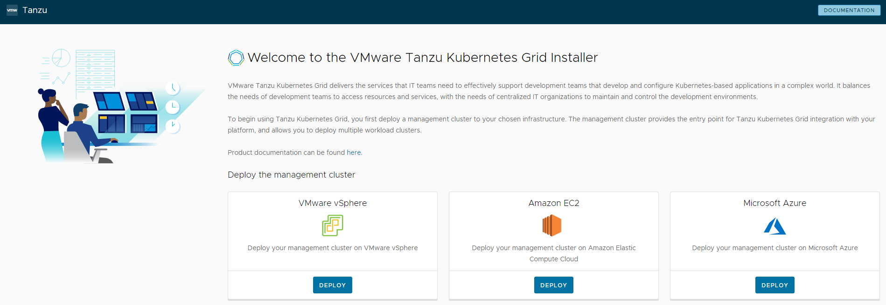
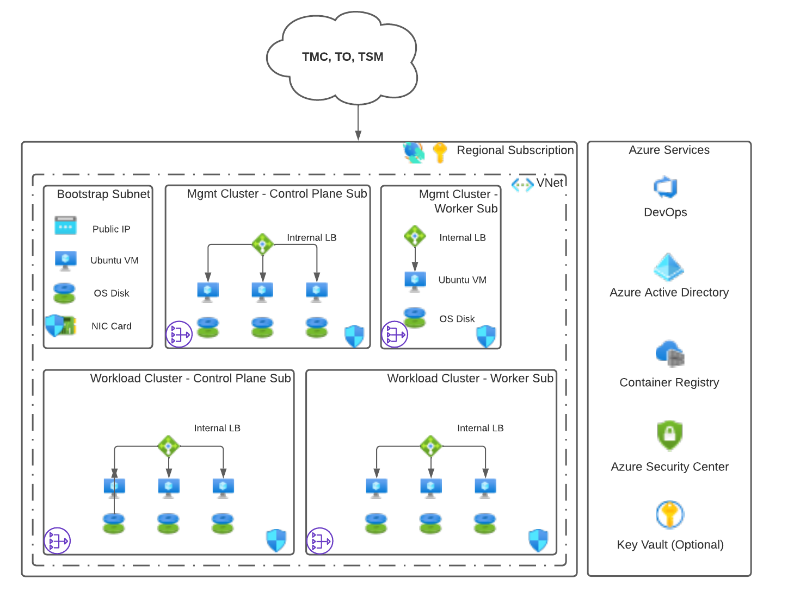
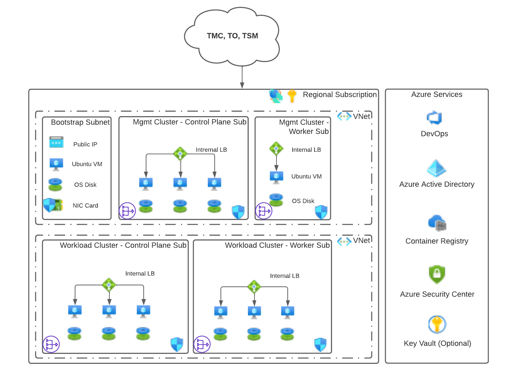
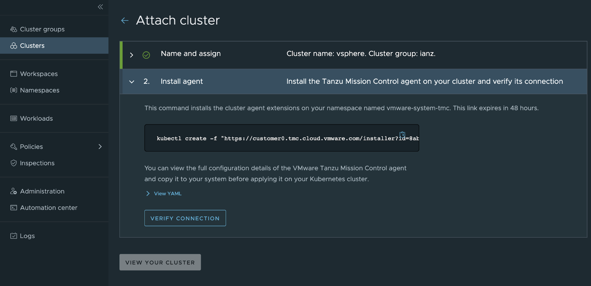

# VMware Tanzu for Kubernetes Operations on Azure Reference Design

VMware Tanzu simplifies the operation of Kubernetes in multi-cloud environment
by centralizing management and governance for clusters and teams across
on-premises, public clouds, and the edge. It delivers an open-source-aligned
Kubernetes distribution with consistent operations and management to support
infrastructure and app modernization.

This document lays out a reference design for deploying VMware Tanzu for Kubernetes Operations with Tanzu components on Microsoft Azure. This reference design is based on the architecture and components described in [VMware Tanzu for Kubernetes Operations Reference Architecture](index.md).

> **Note:** This reference design is supported and validated for customers deploying Tanzu Kubernetes Grid 1.6 on Microsoft Azure.


## Cluster Creation and Management

This reference design uses Tanzu Kubernetes Grid to create and manage ubiquitous Kubernetes clusters on Microsoft Azure using Kubernetes [Cluster API](https://cluster-api.sigs.k8s.io/). Tanzu Kubernetes Grid functions through the creation of a management cluster which houses the Cluster API.  The Cluster API then interacts with the infrastructure provider to service workload Kubernetes cluster lifecycle requests.

The Tanzu Kubernetes Grid user interface (UI) provides a guided deployment experience that is tailored for Microsoft Azure. The Tanzu Kubernetes Grid installer runs either on an operator's own machine (it uses Docker) or through a bootstrap machine or a jump box.



> **Note:** When using a bootstrap machine or a jump box, you may not be able to use the Tanzu Kubernetes Grid UI to build your configuration of the management and workload clusters. In such cases, use the following sample YAML file to help kickstart the installation process.

```yaml
AZURE_ENVIRONMENT: "AzurePublicCloud"
AZURE_CLIENT_ID: <AZURE_CLIENT_ID>
AZURE_CLIENT_SECRET: <AZURE_CLIENT_SECRET>
AZURE_CONTROL_PLANE_MACHINE_TYPE: Standard_D2s_v3
AZURE_CONTROL_PLANE_SUBNET_CIDR: 10.0.1.0/26
AZURE_CONTROL_PLANE_SUBNET_NAME: mgmt-control-subnet
AZURE_ENABLE_PRIVATE_CLUSTER: "true"
AZURE_FRONTEND_PRIVATE_IP: 10.0.1.4
AZURE_LOCATION: eastus2
AZURE_NODE_MACHINE_TYPE: Standard_D2s_v3
AZURE_NODE_SUBNET_CIDR: 10.0.1.64/26
AZURE_NODE_SUBNET_NAME: mgmt-worker-subnet
AZURE_RESOURCE_GROUP: bch-tkg-east
AZURE_SSH_PUBLIC_KEY_B64: <BASE64-SSH-PUBLIC>
AZURE_SUBSCRIPTION_ID: <AZURE_SUBSCRIPTION_ID>
AZURE_TENANT_ID: <AZURE_TENANT_ID>
AZURE_VNET_CIDR: 10.0.0.0/16
AZURE_VNET_NAME: bch-vnet-tkg
AZURE_VNET_RESOURCE_GROUP: bch-tkg-east
CLUSTER_CIDR: 100.96.0.0/11
CLUSTER_NAME: bchcluster-mgmt-east
CLUSTER_PLAN: prod
ENABLE_AUDIT_LOGGING: "true"
ENABLE_CEIP_PARTICIPATION: "false"
ENABLE_MHC: "true"
INFRASTRUCTURE_PROVIDER: azure
OS_ARCH: amd64
OS_NAME: ubuntu
OS_VERSION: "20.04"
SERVICE_CIDR: 100.64.0.0/13
TKG_HTTP_PROXY_ENABLED: "false"
```

Tanzu Kubernetes Grid is deployed as an Infrastructure as a Service (IaaS) solution on Microsoft Azure. You can take advantage of the Azure platform services based on your own specific requirements. However, not all Azure platform services can be tightly integrated into the Tanzu Kubernetes Grid installation.

### Tanzu Clusters

A Kubernetes cluster is made up of several components that act as a control plane of the cluster and a set of supporting components and worker nodes that actually help run the deployed workloads. There are two types of clusters in the Tanzu Kubernetes Grid setup: management cluster and workload cluster. The Tanzu Kubernetes Grid management cluster hosts all the Tanzu Kubernetes Grid components used to manage workload clusters. Workload clusters, which are spun up by Tanzu Kubernetes Grid administrators, run the containerized applications. Cluster security is a shared responsibility between Tanzu Kubernetes Grid cluster administrators, developers, and operators who run applications on Tanzu Kubernetes Grid clusters.

## Network Design

VMware recommends using one of the following production-level network designs for deploying Tanzu Kubernetes Operations on Azure:

- Clusters in the same virtual network (VNet)
- Clusters in separate virtual networks (VNet)

### Same Virtual Network

You can set up your networking such that the Tanzu Kubernetes Grid management cluster and workload clusters are in the same VNet as the bootstrap machine. Each cluster is in a separate subnet. The control plane and worker nodes are also placed in separate subnets.


### Separate Virtual Networks

The following design uses a hub-and-spoke model. The Tanzu Kubernetes clusters are separated into different VNets. This network design requires that the corresponding VNets are peered with one another so that the management cluster can correctly communicate with the workload clusters. This approach is recommended by Microsoft.



### Considerations

The network designs are based on a default Tanzu CLI deployment for a production-level installation. The designs use the default configuration values when running the Tanzu CLI. However, you have complete control over how many nodes are deployed within the workload clusters for both the control plane and worker nodes. You also determine the Azure components with which the clusters will integrate.

Consider the following about the network designs:

1. Use CIDR range /28. Due to the way that Azure implements its IP addressing scheme within subnets, VMware recommends that the minimum CIDR range for a Tanzu deployment is /28 to allow for scalability of each cluster.

2. Use only the required Microsoft Azure components that are necessary for deploying Tanzu Kubernetes Grid on Microsoft Azure.

3. Fit into any production-level network design that you may have in place.

4. Use the default security and DevOps tooling available with an Azure subscription.  The security and DevOps tools are shown in the column to the right of the network designs.

5. Do not make assumptions or provide designs for the outer perimeter of your network design. You may use Azure or third-party services. The outer perimeter network design should not affect the network designs for Tanzu Kubernetes Operations on Microsoft Azure.

6. Integrating with SaaS services, such as Tanzu Mission Control and Tanzu Observability, requires that the Tanzu Kubernetes clusters have outbound SSL-based connectivity to the Internet. Add a rule to allow port 443. Add the rule to the Network Security Groups (NSGs) that are applied to the subnet where the control plane VMs are deployed. Allow port 443 to all targets until VMware can provide a more detailed list of targeted CNAMES or IP ranges.


## Required Microsoft Azure Components

The following Microsoft Azure components are required for deploying the reference architecture.

### Quotas

Provide sufficient quotas to support both the management cluster and the workload clusters in your deployment. Otherwise, the cluster deployments will fail. Depending on the number of workload clusters you will deploy, you may need to increase the following quotas from their default values. You will need to increase these quotas in every region in which you plan to deploy Tanzu Kubernetes Grid.

- Total Regional vCPUs
- Family vCPUs based on your chosen family of VM (D, E, F, etc.)
- Public IP Addresses - Basic
- Static Public IP Addresses
- Public IP Addresses - Standard

### Application Registration or Service Principal

Create an Azure Application Registration or Service Principal (SP) for the Tanzu CLI. The Tanzu CLI creates the necessary VMs and networking components in which the Kubernetes engine runs. The Tanzu CLI uses the Application Registration to perform all the necessary Azure tasks to create the VMs and networking components.

The Tanzu Kubernetes Grid documentation suggests that you assign the Contributor role to the Service Principal. However, because the Tanzu CLI creates the VMs and networking components, for security reasons VMware recommends assigning only the VM and Network Contributor roles to the SP.

### Virtual Network

Because Tanzu for Kubernetes operations is deployed as an IaaS solution on Azure, the Kubernetes clusters must exist within the boundary of an Azure Virtual Network (VNet). Therefore, place the bootstrap machine, which is used to run the Tanzu CLI, in the same VNet as the Tanzu management cluster. Place the management cluster in its own subnet.

The workload clusters can exist within the same VNet, but in different subnets, or in a completely separate VNet. However, ensure that the Workload VNet is peered with the VNet where the management cluster is deployed.

### Load Balancer

When you deploy a management or workload cluster using Tanzu CLI, a load balancer is created and attached to both the control plane and the worker node clusters. The load balancers are used only for running Kubernetes traffic to the underlying nodes. The Kubernetes engine does not use the load balancers for traffic to service pods within the cluster.

The option to make the clusters private or public is controlled by the `AZURE_ENABLE_PRIVATE_CLUSTER` configuration option within the `config.yaml` file that you use to deploy the cluster. Setting this option to `false` tells the deployment process to create a public IP address and attach it to each load balancer. Setting it to `true` requires you to specify a value in the `AZURE_FRONTEND_PRIVATE_IP` configuration option, and attaches an IP address from your specified subnet to the load balancer.

### Network Security Group (NSG)

Before you create clusters, create a Network Security Group and apply it to the subnets that you will use in your Tanzu for Kubernetes Operations deployment. This ensures  that the production environment works properly after the deployment.

Before you begin your deployment, it is important to ensure that the necessary pathways are open to all pieces of the clusters and that they are able to talk to one another. The following are the primary requirements:

- **Bootstrap Machine/Subnet –** SSH and HTTPS Inbound/Outbound Internet, Secure Kubectl within VNet (6443)
- **Control Plane VMs/Subnet –** HTTPS Inbound/Outbound to Internet and SSH and Secure Kubectl (22, 443, and 6443) Inbound/Outbound within the VNet
- **Worker Node VMs/Subnet –** Secure Kubectl (6443) Inbound/Outbound within the VNet

> **Note:** HTTPS traffic to the bootstrap machine and the control plane nodes is required so that they can download the necessary container images for the clusters to function properly.

### Virtual Machines

The primary component of the Tanzu Kubernetes Grid installation is the VMs that are created to work either as the control plane or as worker nodes within the cluster. You can leverage many different VM sizes, including GPU-based VMs, when you deploy your clusters. The default VM size is the standard `D2s_V3` and the minimum requirement for Azure instance types is 2 CPUs and 8 GB memory.

VMware recommends that Resource Groups, VNets, subnets, and Network Security Groups are created before you start a deployment.

> **Important:** All clusters are deployed in a highly available state across Availability Zones within a given Azure region. However, this does mean that regions that do not have Availability Zones will not support Tanzu Kubernetes Grid deployments.

### Azure Backup

As with any IaaS-based solution within Azure, VMware recommends that an Azure Backup Recovery Vault is deployed and made available to all VMs. The availability of Azure Backup is important for the control plane clusters and the bootstrap machine because that is where the Kubernetes and Tanzu configurations are stored and managed.

### Azure Monitor

The Azure Monitor set of services are automatically turned on for all customers within their given subscription. Although Tanzu for Kubernetes Operations provides monitoring and logging, it does not capture information on many of the Azure components mentioned in this reference design. Therefore, it is important to use the available Azure Monitor features that Microsoft provides, such as:

- Activity Log
- Network Watcher
- Azure Log Analytics
- Diagnostics/Metrics/Alerts

## Optional Azure Components
The following Microsoft Azure components are optional for deploying the reference architecture.

### Bastion Host
Microsoft Azure creates an Azure Bastion service by default. You can use the service as a jump box to the bootstrap machine.

This reference design uses a bootstrap machine that does cluster deployments using the Tanzu CLI. However, your security requirements may not allow access from your cluster to a bootstrap machine inside your firewall. In such cases, after the initial cluster creation, you can connect your clusters to Tanzu Mission Control for lifecycle management.

### Public IP

Use of a public IP address for the Kubernetes API server is optional. You can host your Kubernetes API server on a private IP address. In fact, this reference design uses a private IP address. Access is provided through a public endpoint in a DMZ with a Web Application Firewall (WAF) or through some kind of VPN level connectivity, such as Express Route or Site-to-Site VPN with connectivity back to your on-premises network.

> **Note:** Keep in mind that the default deployment of Tanzu Kubernetes Grid creates public facing clusters. Make sure you set `AZURE_ENABLE_PRIVATE_CLUSTER` to `true` if you want to deploy your Kubernetes clusters on a private IP address.

## Container Registries
Numerous container registry options are available, and you may already have one in place. Tanzu comes pre-packaged with its own registry, called Harbor, which can be made available directly within a Tanzu Kubernetes Grid workload cluster. If you are hosting your Kubernetes clusters on a private IP address as described in this reference design, the Harbor registry sits in a workload cluster in the same network architecture as all other clusters. This design allows only private traffic access to the container images.

For more information, see [Deploy Harbor Registry as a Shared Service](https://docs.vmware.com/en/VMware-Tanzu-Kubernetes-Grid/1.6/vmware-tanzu-kubernetes-grid-16/GUID-packages-harbor-registry.html).

### Azure Container Registry
Microsoft Azure also provides a container registry as a service, called Azure Container Registry (ACR). This service can be deployed within your Azure subscription. It is deployed by default as a public service with a public endpoint. However, using Software Defined Networking (SDN) configurations, the Azure Container Registry can be linked directly into the Virtual Network where your Tanzu Kubernetes Grid clusters reside through a service called Private Endpoint. This limits your ACR so that is available only to traffic originating from your Virtual Network, thereby creating a completely private deployment.

For more information, see [Azure Container Registry](https://docs.microsoft.com/en-us/azure/container-registry/container-registry-private-link/).

### Private Container Registry Options
In addition to Harbor, there are other registry options that can be made available within the same network. These options can be deployed as a VM within the same network as the Tanzu Kubernetes Grid clusters. A few of the options are:

- [Docker Hub Registry](https://hub.docker.com/_/registry)
- [JFrog Container Registry](https://jfrog.com/container-registry/)
- [Red Hat Quay](https://github.com/quay/quay)

### Public Container Registry Options
There are many other options for publicly available container registries that are similar to Azure Container Registry. These can also be connected to your Tanzu for Kubernetes Operations deployments. However, you will need to open your networking traffic to the source of your registry. Some of the available options are:

- [Elastic Container Registry (AWS)](https://aws.amazon.com/ecr/)
- [Google Container Registry](https://cloud.google.com/container-registry)
- [DockerHub](https://hub.docker.com/)
- [Oracle Cloud Infrastructure Registry](https://www.oracle.com/cloud-native/container-registry/)

## Global Cluster Lifecycle Management

Attaching clusters to Tanzu Mission Control allows you to manage your global portfolio of Kubernetes clusters.

**Note:** Ensure that Tanzu Kubernetes clusters have outbound SSL-based connectivity to the Internet.

Tanzu Mission Control provides the following capabilities:

  * Centralized lifecycle management: managing the creation and deletion of workload clusters using registered management or supervisor clusters
  * Centralized management: viewing the inventory of clusters and the health of clusters and their components
  * Authorization: centralized authentication and authorization with federated identity from multiple sources (e.g., AD, LDAP, and SAML), plus an easy-to-use policy engine for granting the right access to the right users across teams
  * Compliance: enforcing all clusters to apply the same set of policies
  * Data protection: managing Velero deployment, configuration, and schedule to ensure that cluster manifests and persistent volumes are backed up and restorable
  * Inspection: running a Sonobouy conformance check suite to ensure Kubernetes cluster functionality


For a complete list of features that Tanzu Mission Control includes with Tanzu, see [this chart](https://content.cdntwrk.com/files/aT0xMjk5NjY3JnY9OSZpc3N1ZU5hbWU9dG1jLWNvbXBhcmlzb24tY2hhcnQmY21kPWQmc2lnPTc2YTA2N2E4MWRjMmVkNjE0ZDcwMTlmNjc4NjhmMjI4).  

To attach your cluster for management through Tanzu Mission Control, navigate to **Clusters > Attach Cluster** on the Tanzu Mission Control console and follow the prompts.

> **Note:** If a workload cluster under management requires a proxy to access the Internet, you can use the Tanzu Mission Control CLI to [generate the YAML](https://docs.vmware.com/en/VMware-Tanzu-Mission-Control/services/tanzumc-using/GUID-97672F56-2AD4-46E6-94E1-805ED38D06C7.html) necessary to install Tanzu Mission Control components on it.



## Ingress and Load Balancing

Tanzu Kubernetes Grid requires load balancing for both the control plane and the workloads. Tanzu Kubernetes Grid on Azure uses Azure Load Balancer for control plane and workload clusters.

For workloads, Tanzu Kubernetes Grid [Contour ingress controller package](hhttps://docs.vmware.com/en/VMware-Tanzu-Kubernetes-Grid/1.6/vmware-tanzu-kubernetes-grid-16/GUID-packages-ingress-contour.html) can be used for layer 7 load balancing.

In Tanzu Kubernetes Grid, you can optionally [deploy the external-dns package](https://docs.vmware.com/en/VMware-Tanzu-Kubernetes-Grid/1.6/vmware-tanzu-kubernetes-grid-16/GUID-packages-external-dns.html), which automates updating DNS records in Azure DNS associated with ingress resources or load balancing services. This can also automate away toil associated with DNS record management for externally exposed services.

## Authentication with Pinniped

The Pinniped authentication and authorization service components are deployed into the management cluster. Pinniped uses the OIDC or LDAP identity provider (IDP) configurations specified during the management cluster deployment. The workload cluster inherits its authentication configurations from its management cluster. With authentication in place, a Kubernetes administrator can enforce role-based access control (RBAC) with Kubernetes RoleBinding resources. These resources associate an identity provider user with a given Kubernetes role on the workload cluster.

Pinniped consists of following components:

  * **The Pinniped Supervisor** is an OIDC server which authenticates users through an external identity provider (IDP)/LDAP, and then issues its own federation ID tokens to be passed on to clusters based on the user information from the IDP.
  * **The Pinniped Concierge** is a credential exchange API which takes as input a credential from an identity source (e.g., Pinniped Supervisor, proprietary IDP), authenticates the user via that credential, and returns another credential which is understood by the host Kubernetes cluster or by an impersonation proxy which acts on behalf of the user.
  * **Dex** Pinniped uses Dex as a broker for your upstream LDAP identity provider. Dex is deployed only when LDAP is selected as the OIDC backend during Tanzu Kubernetes Grid management cluster creation.

The following diagram shows the Pinniped authentication flow with an external IDP. In the diagram, the blue arrows represent the authentication flow between the workload cluster, the management cluster, and the external IDP. The green arrows represent Tanzu CLI and `kubectl` traffic between the workload cluster, the management cluster, and the external IDP.


See the [Pinniped Docs](https://pinniped.dev/docs/) for more information on how to integrate Pinniped into Tanzu Kubernetes Grid with OIDC providers and LDAP.

VMware recommends the following best practices for managing identities in clusters provisioned with Tanzu Kubernetes Grid:

- Limit access to cluster resources following [least privilege](https://csrc.nist.gov/glossary/term/least_privilege) principle.
- Limit access to management clusters to the appropriate set of users. For example, provide access only to users who are responsible for managing infrastructure and cloud resources but not to application developers. This is especially important because access to the management cluster inherently provides access to all workload clusters.
- Limit cluster administrator access for workload clusters to the appropriate set of users. For example, provide access to users who are responsible for managing infrastructure and platform resources in your organization, but not to application developers.
- Connect to an [identity provider](https://csrc.nist.gov/glossary/term/identity_provider) to manage the user identities allowed to access cluster resources instead of relying on administrator-generated `kubeconfig` files.

## Observability

### Metrics Monitoring with Tanzu Observability by Wavefront (Recommended Solution)

Using [VMware Tanzu Observability by Wavefront](https://tanzu.vmware.com/observability) significantly enhances observability. Tanzu Observability is a VMware SaaS application that collects and displays metrics and trace data from the full stack platform, as well as from applications. The service provides the ability to create alerts tuned by advanced analytics, assist in the troubleshooting of systems and to understand the impact of running production code.

**Note:** Ensure that Tanzu Kubernetes clusters have outbound SSL-based connectivity to the Internet.

Tanzu Observability collects data from components in Azure, Kubernetes, and applications running within Kubernetes.

You can configure Tanzu Observability with an array of capabilities. The following table describes the plugins that VMware recommends for this design:

| Plugin | Purpose | Key Metrics | Example Metrics |
| --- | --- | --- | --- |
| Wavefront Kubernetes Integration | Collects metrics from Kubernetes clusters and pods | Kubernetes container and POD statistics | POD CPU usage rate |
| Wavefront by VMware for Istio | Adapts Istio collected metrics and forwards to Wavefront | Istio metrics including request rates, trace rates, throughput, etc. | Request rate (Transactions per Second) |


#### Custom Tanzu Observability Dashboards

Tanzu Observability provides various out-of-the-box dashboards. You can customize the dashboards for your particular deployment. For information on how to customize Tanzu Observability dashboards for Tanzu for Kubernetes Operations, see [Customize Tanzu Observability Dashboard for Tanzu for Kubernetes Operations](../deployment-guides/tko-to-customized-dashboard.md).

### Metrics Monitoring with Prometheus and Grafana (Alternative Solution)

Tanzu Kubernetes Grid also supports [Prometheus](https://docs.vmware.com/en/VMware-Tanzu-Kubernetes-Grid/1.6/vmware-tanzu-kubernetes-grid-16/GUID-packages-prometheus.html) and [Grafana](https://docs.vmware.com/en/VMware-Tanzu-Kubernetes-Grid/1.6/vmware-tanzu-kubernetes-grid-16/GUID-packages-grafana.html) as alternative on-premise solutions for monitoring Kubernetes clusters.

Prometheus operates by exposing scrapable metrics endpoints for various monitoring targets throughout your cluster. Metrics are ingested by polling the endpoints on a set interval which are then stored in a time-series database. Metrics data can be explored via the [Prometheus Query Language interface](https://prometheus.io/docs/prometheus/latest/querying/basics/).  

Grafana is responsible for visualizing Prometheus metrics without the need to manually write `PromQL` queries. Custom charts and graphs can be created in addition to the pre-packaged options.

The Tanzu Kubernetes Grid extensions bundles contain instructions and manifests for deploying these tools out.


Prometheus and Grafana are user-managed packages available with Tanzu Kubernetes Grid. For more information about packages bundled with Tanzu Kubernetes Grid, see [Install and Configure Packages](https://docs.vmware.com/en/VMware-Tanzu-Kubernetes-Grid/1.6/vmware-tanzu-kubernetes-grid-16/GUID-packages-index.html). For more information about user-managed packages, see [User-Managed Packages](https://docs.vmware.com/en/VMware-Tanzu-Kubernetes-Grid/1.6/vmware-tanzu-kubernetes-grid-16/GUID-packages-user-managed-index.html).

### Log Forwarding

Tanzu also includes Fluent Bit for integration with logging platforms such as vRealize LogInsight, Elastic Search, and other logging aggregators. For information on configuring Fluent Bit to your logging provider, see [Implement Log Forwarding with Fluent Bit](https://docs.vmware.com/en/VMware-Tanzu-Kubernetes-Grid/1.6/vmware-tanzu-kubernetes-grid-16/GUID-packages-logging-fluentbit.html).  

## Summary

Tanzu Kubernetes Grid on Azure offers high-performance potential, convenience, and addresses the challenges of creating, testing, and updating cloud-based Kubernetes platforms in a consolidated production environment. This validated approach will result in a production-quality installation with all the application services needed to serve combined or uniquely separated workload types via a combined infrastructure solution.  

This plan meets many Day 0 needs for aligning product capabilities, such as configuring firewall rules, networking, load balancing, and workload computing, to the full stack infrastructure.

## Deployment Instructions
For instructions on how to deploy this reference design, see [Deploy Tanzu for Kubernetes Operations on Microsoft Azure](../deployment-guides/tko-on-azure.md).
