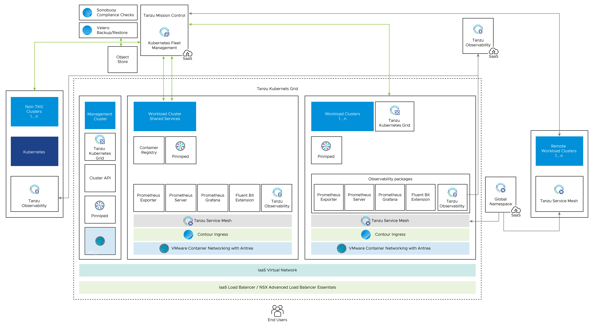
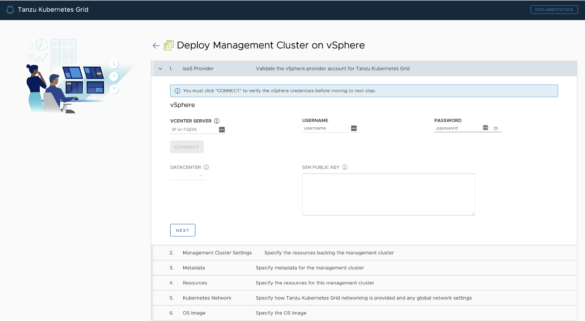

## **VMware Tanzu for Kubernetes Operations on VMware Cloud on AWS Reference Design**

Tanzu for Kubernetes operations simplifies operating Kubernetes for multi-cloud deployment by centralizing management and governance for clusters and teams across on-premises, public clouds, and edge. Tanzu for Kubernetes Operations delivers an open source aligned Kubernetes distribution with consistent operations and management to support infrastructure and application modernization.

This document lays out a reference design for deploying VMware Tanzu for Kubernetes operations on VMware Cloud on AWS and offers a high-level overview of the different components.

The following reference design is based on the architecture and components described in [Tanzu Solution Reference Architecture Overview.](https://github.com/vmware-tanzu-labs/tanzu-validated-solutions/blob/main/src/reference-designs/index.md)

## **TKG Bill Of Materials**
Below is the validated Bill of Materials that can be used to install TKG on your vSphere environment today:

|**Software Components**|**Version**|
| :- | :- |
|Tanzu Kubernetes Grid|1.5.1|
|VMC on AWS SDDC Version|1.16 and later|
|NSX Advanced LB|20.1.7|
The Interoperability Matrix can be verified at all times [here](https://interopmatrix.vmware.com/Interoperability?col=551,&row=648,%26789,).

## **Benefits of running VMware Tanzu on VMware Cloud on AWS**
VMware Cloud on AWS enables your IT and operations teams to add value to your investments in AWS by extending your on-premises VMware vSphere environments to the AWS cloud. VMware Cloud on AWS is an integrated cloud offering jointly developed by Amazon Web Services (AWS) and VMware. It is optimized to run on dedicated, elastic, bare-metal Amazon Elastic Compute Cloud (Amazon EC2) infrastructure and is supported by VMware and its partners.

To learn more about VMware Cloud on AWS, see [VMware Cloud on AWS Documentation](https://docs.vmware.com/en/VMware-Cloud-on-AWS/index.html).

VMware Cloud on AWS enables the following:

1. Cloud Migrations
1. Data Center Extension
1. Disaster Recovery
1. Next-Generation Applications

By running VMware Tanzu within the same infrastructure as the general VM workloads enabled by the first three use cases, organizations can start their next-generation application modernization strategy immediately without incurring additional costs. 

For example, SDDC spare capacity can be used to run Tanzu Kubernetes Grid to enable next-generation application modernization, or compute capacity not used by disaster recovery can be used for Tanzu Kubernetes Grid clusters.

The following additional benefits are enabled by the Elastic Network Interface that connects the VMware Cloud on AWS SDDC to the AWS services within the Amazon VPC:

- Enable developers to modernize existing enterprise apps with AWS cloud capabilities and services.
- Integrate modern application tools and frameworks to develop next-generation applications.
- Remove egress charges as all traffic is internal of the Amazon availability zone.

## **Tanzu Kubernetes Grid components**

VMware Tanzu Kubernetes Grid (TKG) provides organizations with a consistent, upstream-compatible, regional Kubernetes substrate that is ready for end-user workloads and ecosystem integrations. You can deploy Tanzu Kubernetes Grid across software-defined datacenters (SDDC) and public cloud environments, including vSphere, Microsoft Azure, and Amazon EC2. 

Tanzu Kubernetes Grid comprises of the following components:

**Management Cluster -** A management cluster is the first element that you deploy when you create a Tanzu Kubernetes Grid instance. The management cluster is a Kubernetes cluster that performs the role of the primary management and operational center for the Tanzu Kubernetes Grid instance. The management cluster is purpose-built for operating the platform and managing the lifecycle of Tanzu Kubernetes clusters.

**Cluster API -** TKG functions through the creation of a Management Kubernetes cluster that houses [Cluster API](https://cluster-api.sigs.k8s.io/). The Cluster API then interacts with the infrastructure provider to service workload Kubernetes cluster lifecycle requests.

**Tanzu Kubernetes Cluster -** Tanzu Kubernetes clusters are the Kubernetes clusters in which your application workloads run. These clusters are also referred to as workload clusters. Tanzu Kubernetes clusters can run different versions of Kubernetes, depending on the needs of the applications they run.

**Shared Service Cluster -**  Each Tanzu Kubernetes Grid instance can only have one shared services cluster. You will deploy this cluster only if you intend to deploy shared services such as Contour and Harbor. 

**Tanzu Kubernetes Cluster Plans -** A cluster plan is a blueprint that describes the configuration with which to deploy a Tanzu Kubernetes cluster. It provides a set of configurable values that describe settings like the number of control plane machines, worker machines, VM types, and so on.

This current release of Tanzu Kubernetes Grid provides two default templates, dev and prod.

**Tanzu Kubernetes Grid Instance -** A Tanzu Kubernetes Grid instance is the full deployment of Tanzu Kubernetes Grid, including the management cluster, the workload clusters, and the shared services cluster that you configure.

**Tanzu CLI -** A command-line utility that provides the necessary commands to build and operate Tanzu management and tanzu Kubernetes clusters. 

**Bootstrap Machine -** The bootstrap machine is the laptop, host, or server on which you download and run the Tanzu CLI. This is where the initial bootstrapping of a management cluster occurs before it is pushed to the platform where it will run.

**Tanzu Kubernetes Grid Installer -** The Tanzu Kubernetes Grid installer is a graphical wizard that you launch by running the **tanzu management-cluster create --ui** command. The installer wizard runs locally on the bootstrap machine and provides a user interface to guide you through the process of deploying a management cluster.

## **vSphere with Tanzu Storage**
Tanzu Kubernetes Grid integrates with shared datastores available in the vSphere infrastructure. The following types of shared datastores are supported:

- vSAN
- VMFS
- NFS
- vVols 

TKG uses storage policies to integrate with shared datastores. The policies represent datastores and manage the storage placement of such objects as control plane VMs, container images, and persistent storage volumes. vSAN storage policies are the only option available for VMware Cloud on AWS.

Tanzu Kubernetes Grid is agnostic about which option you choose. For Kubernetes stateful workloads, TKG installs the [vSphere Container Storage interface (vSphere CSI)](https://cloud-provider-vsphere.sigs.k8s.io/container_storage_interface.html) to automatically provision Kubernetes persistent volumes for pods. 

[VMware vSAN](https://docs.vmware.com/en/VMware-vSAN/index.html) is a recommended storage solution for TKG clusters. 

|**Decision ID**|**Design Decision**|**Design Justification**|**Design Implications**|
| :- | :- | :- | :- |
|TKO-STG-001|Use vSAN storage for TKO|vSAN supports NFS volumes in ReadWriteMany access modes.|vSAN File Services need to be configured to leverage this. vSAN File Service is available only in vSAN Enterprise and Enterprise Plus editions|

While the default vSAN storage policy can be used, administrators should evaluate the needs of their applications and craft a specific [vSphere Storage Policy](https://docs.vmware.com/en/VMware-vSphere/6.7/com.vmware.vsphere.storage.doc/GUID-89091D59-D844-46B2-94C2-35A3961D23E7.html). vSAN storage policies describe classes of storage (e.g. SSD, NVME, etc.) along with quotas for your clusters.

## **Tanzu Kubernetes Clusters Networking**
A Tanzu Kubernetes cluster provisioned by the Tanzu Kubernetes Grid supports two Container Network Interface (CNI) options: 

- [Antrea](https://antrea.io/) 
- [Calico](https://www.tigera.io/project-calico/)

Both are open-source software that provides networking for cluster pods, services, and ingress.

When you deploy a Tanzu Kubernetes cluster using Tanzu Mission Control or Tanzu CLI, Antrea CNI is automatically enabled in the cluster. 

Tanzu Kubernetes Grid also supports [Multus](https://github.com/k8snetworkplumbingwg/multus-cni) CNI which can be installed through Tanzu user-managed packages. Multus CNI lets you attach multiple network interfaces to a single pod and associate each with a different address range.

To provision a Tanzu Kubernetes cluster using a non-default CNI, please see the below instructions:

[Deploy Tanzu Kubernetes clusters with calico](https://docs.vmware.com/en/VMware-Tanzu-Kubernetes-Grid/1.5/vmware-tanzu-kubernetes-grid-15/GUID-tanzu-k8s-clusters-networking.html#calico)

[Implement Multiple Pod Network Interfaces with Multus](https://docs.vmware.com/en/VMware-Tanzu-Kubernetes-Grid/1.5/vmware-tanzu-kubernetes-grid-15/GUID-packages-cni-multus.html)

Each CNI is suitable for a different use case. The below table lists some common use cases for the three CNI’s that Tanzu Kubernetes Grid supports. This table will help you with information on selecting the right CNI in your Tanzu Kubernetes Grid implementation.

|**CNI**|**Use Case**|**Pros and Cons**|
| :- | :- | :- |
|Antrea|
Enable Kubernetes pod networking with IP overlay networks using VXLAN or Geneve for encapsulation. Optionally encrypt node-to-node communication using IPSec packet encryption.

Antrea supports advanced network use cases like kernel bypass and network service mesh.
|
Pros

- Antrea leverages Open vSwitch as the networking data plane and Open vSwitch supports both Linux and Windows.

- VMware supports the latest conformant Kubernetes and stable releases of Antrea.
|
|Calico|
Calico is used in environments where factors like network performance, flexibility, and power are essential.

For routing packets between nodes, Calico leverages the BGP routing protocol instead of an overlay network. This eliminates the need to wrap packets with an encapsulation layer resulting in increased network performance for Kubernetes workloads.
|
Pros

- Support for Network Policies

- High network performance

- SCTP Support

Cons

- No multicast support

|
|Multus|Multus CNI can give us multiple interfaces per each Kubernetes pod. Using Multus CRD's you can specify which pods get which interfaces and allow different interfaces depending on the use case.|
Pros

- Separation of data/control planes.

- Separate security policies can be used for separate interfaces. 

- Supports SRIOV, DPDK, OVS-DPDK & VPP workloads in Kubernetes with both cloud native and NFV based applications in Kubernetes.
|

## **Tanzu Kubernetes Grid Infrastructure Networking**
Tanzu Kubernetes Grid can be deployed on various networking stacks including

- VMware NSX-T Data Center Networking.
- vSphere Networking (VDS) with NSX Advanced Load Balancer.

**Note:** The scope of this document is limited to VMware NSX-T Data Center Networking with NSX Advanced Load Balancer.

## **TKG on NSX-T Networking with NSX ALB**

Tanzu Kubernetes Grid, when deployed on the VMware NSX-T Networking, uses the NSX-T logical segments & Gateways to provide connectivity to Kubernetes control plane VMs, worker nodes, services, and applications. All hosts from the cluster where Tanzu Kubernetes clusters are deployed are configured as NSX-T Transport nodes that provide network connectivity to the Kubernetes environment.  

Tanzu Kubernetes Grid leverages NSX Advanced Load Balancer to provide L4 load balancing for the Tanzu Kubernetes Clusters Control-Plane HA and L7 ingress to the applications deployed in the Tanzu Kubernetes Clusters. Users access the applications by connecting to the Virtual IP address (VIP) of the applications provisioned by NSX ALB. 

# **NSX Advanced Load Balancer Components**

NSX ALB is deployed in **No-Orchestrator** mode in VMC on AWS environment because the cloudadmin user does not have all required permissions to perform write operations to the vCenter API, which is a key requirement. Therefore, the NSX ALB controller cannot orchestrate the deployment of service engines. 

NSX ALB service engines must be deployed before load balancer services can be requested by Kubernetes. 

The following are the core components of NSX ALB:

- **NSX ALB Controller** - NSX ALB Controller manages Virtual Service objects and interacts with the vCenter Server infrastructure to manage the lifecycle of the service engines (SEs). It is the central repository for the configurations and policies related to services and management and provides the portal for viewing the health of VirtualServices and SEs and the associated analytics that NSX Advanced Load Balancer provides.
- **NSX ALB Service Engine** - The Service Engines (SEs) are lightweight VMs that handle all data plane operations by receiving and executing instructions from the controller. The SEs perform load balancing and all client and server-facing network interactions.
- **Avi Kubernetes Operator (AKO)** - It is a Kubernetes operator that runs as a pod in the Management Cluster and Tanzu Kubernetes clusters and provides ingress and load balancing functionality. AKO translates the required Kubernetes objects to NSX ALB objects and automates the implementation of ingresses/routes/services on the Service Engines (SE) via the NSX ALB Controller.
- **AKO Operator (AKOO)** - This is an operator which is used to deploy, manage and remove takes care of deploying, managing, and removing AKO from Kubernetes clusters. This operator when deployed creates an instance of the AKO controller and installs all the relevant objects like
    - AKO statefulset
    - Clusterrole and Clusterrolbinding
    - Configmap required for the AKO controller and other artifacts.

TKG management clusters have an ako-operator installed out of the box during cluster deployment. By default, a TKG management cluster has a couple of AkoDeploymentConfig created which dictates when and how ako pods are created in the workload clusters. For more information on the ako-operator, please see VMware official [documentation](https://github.com/vmware/load-balancer-and-ingress-services-for-kubernetes/tree/master/ako-operator).

Each environment configured in NSX ALB is referred to as Cloud. Each cloud in NSX ALB maintains networking and NSX ALB Service Engine settings. The cloud is configured with one or more VIP networks to provide IP addresses to load balancing (L4/L7) virtual services created under that cloud.

The virtual services can be spanned across multiple Service Engines if the associated Service Engine Group is configured in Active/Active HA mode. A Service Engine can belong to only one Service Engine group at a time. 

IP address allocation for virtual services can be over DHCP or via NSX ALB in-built IPAM functionality. The VIP networks created/configured in NSX ALB are associated with the IPAM profile.

# **Network Architecture**

For deployment of TKG in VMware Cloud on AWS SDDCs, we build separate segments for the TKG management cluster, TKG Shared Services cluster, TKG workload clusters, NSX ALB management, Cluster-VIP segment for control plane HA, TKG Mgmt VIP/Data segment, and TKG workload Data/VIP segment.

The network reference design can be mapped into this general framework. 

This topology enables the following benefits:

- Isolate and separate SDDC management components (vCenter, ESX) from the TKG components.  This reference design only allows the minimum connectivity between the TKG clusters and NSX ALB to the vCenter Server.
- Isolate and separate the NSX ALB management network segment from the TKG management segment and the TKG workload segments.
- Depending on the workload cluster type and use case, multiple workload clusters may leverage the same logical segments or new segments can be used for each workload cluster. 
  To isolate and separate TKG workload cluster networking from each other it’s recommended to make use of separate logical segments for each workload cluster and configure the required firewall between these networks. Refer to [Firewall Requirements](#_7hutc2r9oonm) for more details.
- Separate provider and tenant access to the TKG environment.
     - Only provider administrators need access to the TKG management cluster. This prevents tenants from attempting to connect to the TKG management cluster.

**Network Requirements**

As per the defined architecture below is the list of required networks:

|**Network Type**|**DHCP Service**|
**Description & Recommendations**

|
| :- | :- | :- |
|NSX ALB Management Network|Optional|
NSX ALB controllers and SEs will be attached to this network. 

 DHCP is not a mandatory requirement on this network as NSX ALB can handle IPAM services for a given network
|
|TKG Management Network|Yes|Control plane and worker nodes of TKG Management Cluster clusters will be attached to this network|
|TKG Shared Service Network|Yes|Control plane and worker nodes of TKG Shared Service Cluster will be attached to this network.|
|TKG Workload Network|Yes|Control plane and worker nodes of TKG Workload Clusters will be attached to this network.|
|TKG Cluster VIP/Data Network|No|Virtual services for Control plane HA of all TKG clusters (Management, Shared service, and Workload).|
|TKG Management VIP/Data Network|No|Virtual services for all user-managed packages (such as Contour and Harbor) hosted on the Shared service cluster. |
|TKG Workload VIP/Data Network |No|Virtual services for all applications hosted on the Workload clusters.|

## **Subnet and CIDR Examples**

For the purpose of demonstration, this document makes use of the following Subnet CIDR for TKO deployment.

|**Network Type**|**Segment Name**|**Gateway CIDR**|**DHCP Pool**|**NSX ALB IP Pool**|
| :- | :- | :- | :- | :- |
|NSX ALB Mgmt Network|NSX-ALB-Mgmt|192.168.11.1/27|192.168.11.15 - 192.168.11.20|192.168.11.21 - 192.168.11.30|
|TKG Management Network|TKG-Management|192.168.12.1/24|192.168.12.2 - 192.168.12.251|NA|
|TKG Workload Network|TKG-Workload-PG01|192.168.13.1/24|192.168.13.2 - 192.168.13.251|NA|
|TKG Cluster VIP Network|TKG-Cluster-VIP|192.168.14.1/26|NA|192.168.14.2 - 192.168.14.60|
|TKG Mgmt VIP Network|TKG-SS-VIP|192.168.15.1/26|NA|192.168.15.2 - 192.168.15.60|
|TKG Workload VIP Network|TKG-Workload-VIP|192.168.16.1/26|NA|192.168.16.2 - 192.168.16.60|
|TKG Shared Services Network|TKG-Shared-Service|192.168.17.1/24|192.168.17.2 - 192.168.17.251||

## **Firewall Requirements**
To prepare the firewall, you need to gather the following:

1. NSX ALB Controller nodes and Cluster IP address.
1. NSX ALB Management Network CIDR..
1. TKG Management Network CIDR.
1. TKG Shared Services Network CIDR.
1. TKG Workload Network CIDR.
1. TKG Cluster VIP Range.
1. TKG Management VIP Range.
1. TKG Workload VIP Range.
1. Client Machine IP Address.
1. Bootstrap machine IP address.
1. Harbor registry IP.
1. vCenter Server IP.
1. DNS server IP(s).
1. NTP Server(s).

The below table provides a list of firewall rules based on the assumption that there is no firewall within a subnet/VLAN. 

|**Source**|**Destination**|**Protocol:Port**|**Description**|
| :- | :- | :- | :- |
|Client Machine|NSX ALB Controller nodes and Cluster IP Address.|TCP:443|To access NSX ALB portal for configuration.|
|Client Machine|vCenter Server|TCP:443|To create resource pools, VM folders, etc, in vCenter.|
|
Bootstrap Machine

|projects.registry.vmware.com|TCP:443|To pull binaries from VMware public repo for TKG installation.|
|
TKG Management Network CIDR

TKG Shared Services Network CIDR.

TKG Workload Network CIDR.
|
DNS Server

 NTP Server
|
UDP:53

 UDP:123
|
DNS Service 

 Time Synchronization
|
|
TKG Management Network CIDR

TKG Shared Services Network CIDR.

TKG Workload Network CIDR.
|vCenter IP|TCP:443|Allows components to access vCenter to create VMs and Storage Volumes|
|
TKG Management Network CIDR.

TKG Shared Service Network CIDR.

TKG Workload Network CIDR.
|TKG Cluster VIP Range.|TCP:6443|For Management cluster to configure Shared-Services and Workload Cluster.|
|
TKG Management Network 

TKG Shared service Network

TKG Workload Networks
|Internet|TCP:443|For interaction with Tanzu Mission Control, Tanzu Observability, and Tanzu Service Mesh.|
|
TKG Management Network 

TKG Shared service Network

TKG Workload Networks
|NSX ALB Controllers and Cluster IP Address.|TCP:443|Allow Avi Kubernetes Operator (AKO) and AKO Operator (AKOO) access to NSX ALB Controller.|
|NSX ALB Controllers.|vCenter and ESXi Hosts|TCP:443|Allow NSX ALB to discover vCenter objects and deploy SEs as required|
|NSX ALB Management Network CIDR.|
DNS Server

NTP Server
|
UDP:53

UDP:123
|
DNS Service

Time Synchronization
|
#
**Optional Firewall Rules**

|**Source**|**Destination**|**Protocol:Port**|**Description**|
| :- | :- | :- | :- |
|
TKG Management Network CIDR

TKG Shared Services Network CIDR.

TKG Workload Network CIDR.
|
Harbor Registry

(optional)
|TCP:443|Allows components to retrieve container images from a local image registry.|
|
Client Machine

|
console.cloud.vmware.com

\*.tmc.cloud.vmware.com

projects.registry.vmware.com
|TCP:443|
To access Cloud Services portal to configure networks in VMC SDDC.

To access the TMC portal for TKG clusters registration and other SaaS integration.

To pull binaries from VMware public repo for TKG installation.
|
|Client Machine|
TKG Management VIP Range.

TKG Workload VIP Range.
|
TCP:80

TCP:443
|To http/https workloads in shared services and workload cluster. |
#

# **Installation Experience**

TKG management cluster is the first component that you deploy to get started with Tanzu Kubernetes Grid.

You can deploy the Management cluster in two ways:

1. Run the Tanzu Kubernetes Grid installer, a wizard interface that guides you through the process of deploying a management cluster. This is the recommended method if you are installing a TKG Management cluster for the first time. 
1. Create and edit YAML configuration files, and use them to deploy a management cluster with the CLI commands.

The TKG Installation user interface shows that, in the current version, it is possible to install TKG on vSphere (including VMware Cloud on AWS), AWS EC2, and Microsoft Azure. The UI provides a guided experience tailored to the IaaS, in this case on VMware Cloud on AWS.

The installation of TKG on VMware Cloud on AWS is done through the same UI as mentioned above but tailored to a vSphere environment.

This installation process will take you through the setup **TKG** **Management Cluster** on your vSphere environment. Once the management cluster is deployed you can make use of [Tanzu Mission Control](https://tanzu.vmware.com/mission-control) or Tanzu CLI to deploy Tanzu Kubernetes Shared Service and workload clusters.

# **Design Recommendations**

## **NSX ALB Recommendations**
The below table provides the recommendations for configuring NSX ALB for TKG deployment in a VMC on AWS environment.

|**Decision ID**|**Design Decision**|**Design Justification**|**Design Implications**|
| :- | :- | :- | :- |
|TKO-ALB-001|Deploy NSX ALB controller cluster nodes on a segment dedicated to NSX-ALB|Isolate NSX ALB traffic from infrastructure management traffic and Kubernetes workloads.|Using the same network for NSX ALB Controller Cluster nodes allows for configuring a floating cluster IP address that will be assigned to the cluster leader.|
|TKO-ALB-002|Deploy 3 NSX ALB controllers nodes.|To achieve high availability for the NSX ALB platform.|In clustered mode, NSX ALB availability is not impacted by an individual controller node failure. |
|TKO-ALB-003|Use static IPs for the NSX ALB controllers if DHCP cannot guarantee a permanent lease.|NSX ALB Controller cluster uses management IPs to form and maintain the quorum for the control plane cluster. Any changes would be disruptive.|NSX ALB Controller control plane might go down if the management IPs of the controller node changes.|
|TKO-ALB-004|Connect Service Engines to VIP networks and Server networks manually. |NSX ALB Service Engine deployment is manual in VMC on AWS. |The controllers can’t reconfigure Service Engines for network connectivity when virtual services are created.|
|TKO-ALB-005|Reserve an IP in the NSX ALB management subnet to be used as the Cluster IP for the Controller Cluster.|NSX ALB portal is always accessible over Cluster IP regardless of a specific individual controller node failure.|NSX ALB administration is not affected by an individual controller node failure.|
|TKO-ALB-006|Use separate VIP networks per TKC for application load balancing.|Separate dev/test and prod workloads L7 load balancer traffic.|Install AKO in TKG clusters manually by creating AkodeploymentConfig.|
|TKO-ALB-007|Create separate SE Groups for TKG management and workload clusters.|This allows isolating load balancing traffic of the management and shared services cluster from workload clusters.|
Create dedicated Service Engine Groups under the no-orchestrator cloud configured manually.

|
|TKO-ALB-018|Share Service Engines for the same type of workload (dev/test/prod)clusters.|Minimize the licensing cost|
Each Service Engine contributes to the CPU core capacity associated with a license.

An SE group can be shared by any number of workload clusters as long as the sum of the number of distinct cluster node networks and the number of distinct cluster VIP networks is not more than 8.
|
|TKO-ALB-009|Enable DHCP in the No-Orchestrator cloud.|Reduce the administrative overhead of manually configuring IP pools for the networks where DHCP is available.||

## **Network Recommendations**
The following are the key network recommendations for a production-grade Tanzu Kubernetes Grid on VMC deployment:

|**Decision ID**|**Design Decision**|**Design Justification**|**Design Implications**|
| :- | :- | :- | :- |
|TKO-NET-001|Use separate networks for TKG management and workload clusters.|To have a flexible firewall and security policies|Sharing the same network for multiple clusters can complicate firewall rules creation. |
|TKO-NET-002|Use separate networks for workload clusters based on their usage.|Isolate production Kubernetes clusters from dev/test clusters.|
A separate set of Service Engines can be used for separating dev/test workload clusters from prod clusters.

|
|TKO-NET-003|Configure DHCP for TKG clusters.|Tanzu Kubernetes Grid does not support static IP assignments for Kubernetes VM components|Enable DHCP on the logical segments that will be used to host TKG clusters.  |

## **TKG Clusters Recommendations**

|**Decision ID**|**Design Decision**|**Design Justification**|**Design Implications**|
| :- | :- | :- | :- |
|TKO-TKG-001|Deploy TKG management cluster from TKG installer UI|Simplified method of installation.|
When you deploy a management cluster by using the installer interface, it populates a cluster configuration file for the management cluster with the required parameters. 

You can use the created configuration file as a model for future deployments from the CLI
|
|TKO-TKG-002|Register TKG Management cluster with Tanzu Mission Control|Tanzu Mission Control automates the creation of the Tanzu Kubernetes clusters and manages the life cycle of all clusters centrally.|Tanzu Mission Control also automates the deployment of Tanzu Packages in all Tanzu Kubernetes clusters associated with TMC.|
|TKO-TKG-003|Use NSX ALB as your Control Plane endpoint provider.|Eliminates the requirement for the external load balancer and additional configuration changes in TKG clusters configuration. |NSX ALB is a true SDN solution and offers a flexible deployment model and automated way of scaling load balancer objects when needed.|
|TKO-TKG-004|Deploy Tanzu Kubernetes clusters in large form factor|Allow TKG clusters integration with Tanzu SaaS components (Tanzu Mission Control, Tanzu Observability, and Tanzu Service Mesh)|
TKG shared services and workload clusters also hosts tanzu packages such as cert-manager, contour, harbor, etc. 

|
|TKO-TKG-005|Deploy Tanzu Kubernetes clusters with Prod plan.|This deploys multiple control plane nodes and provides High Availability for the control plane.|TKG infrastructure is not impacted by single node failure. |
|TKO-TKG-006|Enable Identity Management for TKG clusters.|This avoids usage of admin credentials and ensures required users with the right roles have access to TKG clusters.|The pinniped package helps with integrating TKG with LDAPS/OIDC Authentication.|
|TKO-TKG-007|Enable Machine Health Checks for TKG clusters|vSphere HA and Machine Health Checks interoperably work together to enhance workload resiliency|A MachineHealthCheck is a resource within the Cluster API that allows users to define conditions under which Machines within a Cluster should be considered unhealthy. Remediation actions can be taken when MachineHealthCheck has identified a node as unhealthy.|

# **Kubernetes Ingress Routing**
Default installation of Tanzu Kubernetes Grid does not have any ingress controller installed. Users can use Contour (available for installation through Tanzu Packages) or any Third-party ingress controller of their choice. 

Contour is an open-source controller for Kubernetes Ingress routing. Contour can be installed in the Shared Services cluster on any Tanzu Kubernetes Cluster. Deploying Contour is a prerequisite if you want to deploy the Prometheus, Grafana, and Harbor Packages on a workload cluster. 

For more information about Contour, see [Contour](https://projectcontour.io/) site and [Implementing Ingress Control with Contour](https://docs.vmware.com/en/VMware-Tanzu-Kubernetes-Grid/1.4/vmware-tanzu-kubernetes-grid-14/GUID-packages-ingress-contour.html).

Another option is to use the NSX Advanced Load Balancer Kubernetes ingress controller which offers an advanced L7 ingress for containerized applications that are deployed in the Tanzu Kubernetes workload cluster. 

For more information about the NSX ALB ingress controller, please see the [official documentation](https://avinetworks.com/docs/ako/1.5/avi-kubernetes-operator/).

[Tanzu Service Mesh](https://tanzu.vmware.com/service-mesh), which is a SaaS offering for modern applications running across multi-cluster, multi-clouds, also offers an Ingress controller based on [Istio](https://istio.io/). 

Each ingress controller has pros and cons of its own. The below table provides general recommendations on when you should use a specific ingress controller for your Kubernetes environment.

|**Ingress Controller**|**Use Cases**|
| :- | :-: |
|Contour|
Use contour when only north-south traffic is needed in a Kubernetes cluster. You can apply security policies for north-south traffic by defining the policies in the applications manifest file.

It's a reliable solution for simple Kubernetes workloads. 
|
|Istio|use Istio ingress controller when you intended to provide security, traffic direction, and insight within the cluster (east-west traffic) and between the cluster and the outside world (north-south traffic)|
|NSX ALB Ingress controller|
Use NSX ALB ingress controller when a containerized application requires features like local and global server load balancing (GSLB), web application firewall (WAF), performance monitoring, etc. 

|

# **NSX ALB Sizing Guidelines**

## **NSX ALB Controller Sizing Guidelines**
Regardless of NSX ALB Controller configuration, each Controller cluster can achieve up to 5,000 virtual services, this is a hard limit. For further details, please refer to this [guide](https://avinetworks.com/docs/20.1/avi-controller-sizing/#cpuandmemalloc).

|**Controller Size**|**VM Configuration**|**Virtual Services**|**NSX ALB SE Scale**|
| :- | :- | :- | :- |
|Small|4 vCPUS, 12 GB RAM|0-50|0-10|
|Medium|8 vCPUS, 24 GB RAM|0-200|0-100|
|Large|16 vCPUS, 32 GB RAM|200-1000|100-200|
|Extra Large|24 vCPUS, 48 GB RAM|1000-5000|200-400|

## **Service Engine Sizing Guidelines**
See [Sizing Service Engines](https://avinetworks.com/docs/20.1/sizing-service-engines/) for guidance on sizing your SEs. 

|**Performance metric**|**1 vCPU core**|
| :- | :- |
|Throughput|4 Gb/s|
|Connections/s|40k|
|SSL Throughput|1 Gb/s|
|SSL TPS (RSA2K)|~600|
|SSL TPS (ECC)|2500|

Multiple performance vectors or features may have an impact on performance.  For instance, to achieve 1 Gb/s of SSL throughput and 2000 TPS of SSL with EC certificates, NSX ALB recommends two cores.

NSX ALB Service Engines may be configured with as little as 1 vCPU core and 1 GB RAM, or up to 36 vCPU cores and 128 GB RAM. Service Engines can be deployed in Active/Active or Active/Standby mode depending on the license tier used. NSX ALB Essentials license doesn’t support Active/Active HA mode for Service Engines. 

|**Decision ID**|**Design Decision**|**Design Justification**|**Design Implications**|
| :- | :- | :- | :- |
|TKO-ALB-SE-001|Configure the High Availability mode for SEs|To mitigate a single point of failure for the NSX ALB data plane.|High Availability** for Service Engines is configured via setting the Elastic HA mode to Active/Active or N+M in the Service Engine Group.|

# **Container Registry**
VMware Tanzu for Kubernetes Operations using Tanzu Kubernetes Grid include Harbor as a container registry. Harbor provides a location for pushing, pulling, storing, and scanning container images used in your Kubernetes clusters. 

Harbor registry is used for day2 operations of the Tanzu Kubernetes workload clusters. Typical day-2 operations include tasks such as pulling images from the harbor for application deployment, pushing custom images to Harbor, etc. 

There are three main supported installation methods for Harbor:

- [**TKG Package deployment**](https://docs.vmware.com/en/VMware-Tanzu-Kubernetes-Grid/1.5/vmware-tanzu-kubernetes-grid-15/GUID-packages-harbor-registry.html) on a TKG Shared service cluster. Tanzu Kubernetes Grid includes signed binaries for Harbor, which you can deploy into a shared services cluster to provide container registry services for other Tanzu Kubernetes (workload) clusters. This installation method is recommended for general use cases.
- [**Helm-based deployment**](https://goharbor.io/docs/2.4.0/install-config/harbor-ha-helm/) to a Kubernetes cluster - this installation method may be preferred for customers already invested in Helm.
- [**VM-based deployment**](https://goharbor.io/docs/2.1.0/install-config/installation-prereqs/) - using docker-compose - this installation method is recommended in cases where Tanzu Kubernetes Grid is installed in an air-gapped environment and no pre-existing Kubernetes clusters exist on which to install Harbor.

# **TKG integration with Tanzu SaaS Products**

Companies today are adopting software as a service (SaaS) at a rapid pace. There are many factors contributing to this trend, including:

- Operational efficiency – There are significant time and cost benefits to using vendor-managed, cloud-hosted software versus installing and maintaining commercial, off-the-shelf software in your own data centers.

- Security – In a SaaS model, the vendor is responsible for updating the software to resolve security vulnerabilities, removing that burden from your teams.

- Reliability – A vendor is bound by a service-level agreement (SLA) that provides an expected level of availability for the service. You can focus more on your business and less on maintaining high availability for vendor software on premises. 

The SaaS products in the VMware Tanzu portfolio are in the critical path for securing systems at the heart of your IT infrastructure. VMware Tanzu Mission Control provides a centralized control plane for Kubernetes, and Tanzu Service Mesh provides a global control plane for service mesh networks. Tanzu Observability provides features like Kubernetes monitoring, Application observability and Service insights. 

To learn more about TKG integration with Tanzu SaaS, please see [Tanzu SaaS Services](tko-saas.md)

# **Logging**

Fluent Bit is a lightweight log processor and forwarder that allows you to collect data and logs from different sources, unify them, and send them to multiple destinations. Tanzu Kubernetes Grid includes signed binaries for Fluent Bit, that you can deploy on management clusters and on Tanzu Kubernetes clusters to provide a log-forwarding service.

Tanzu for Kubernetes Operations includes [Fluent Bit](https://fluentbit.io/) as a user-managed package for the integration with logging platforms such as **vRealize LogInsight, Elasticsearch, Splunk, or other logging solutions**. Details on configuring Fluent Bit to your logging provider can be found in the documentation [here](https://docs.vmware.com/en/VMware-Tanzu-Kubernetes-Grid/1.5/vmware-tanzu-kubernetes-grid-15/GUID-packages-logging-fluentbit.html).

You can deploy Fluent Bit on any management cluster or Tanzu Kubernetes clusters from which you want to collect logs. First, you configure an output plugin on the cluster from which you want to gather logs, depending on the endpoint that you use. Then, you deploy Fluent Bit on the cluster as a package. 

vRealize Log Insight (vRLI) provides real-time log management and log analysis with machine learning based intelligent grouping, high-performance searching, and troubleshooting across physical, virtual, and cloud environments. vRLI already has a deep integration with the vSphere platform where you can get key actionable insights, and it can be extended to include the cloud native stack as well. 

vRealize Log Insight appliance is available as a separate on-prem deployable product. You can also choose to go with the SaaS version **vRealize Log Insight Cloud**.

## **Configure Node Sizes**

The Tanzu CLI creates the individual nodes of management clusters and Tanzu Kubernetes clusters according to the settings that you provide in the configuration file. 

On vSphere, you can configure all node VMs to have the same predefined configurations, set different predefined configurations for control plane and worker nodes, or customize the configurations of the nodes. By using these settings, you can create clusters that have nodes with different configurations to the management cluster nodes. You can also create clusters in which the control plane nodes and worker nodes have different configurations.

**Use Predefined Node Configurations**

The Tanzu CLI provides the following predefined configurations for cluster nodes:

|**Size**|**CPU**|**Memory (in GB)**|**Disk (in GB)**|
| :- | :- | :- | :- |
|Small|2|4|20|
|Medium|2|8|40|
|Large|4|16|40|
|Extra-large|8|32|80|

To create a cluster in which all of the control plane and worker node VMs are the same size, specify the SIZE variable. If you set the SIZE variable, all nodes will be created with the configuration that you set.

- SIZE: "large"

To create a cluster in which the control plane and worker node VMs are different sizes, specify the CONTROLPLANE\_SIZE and WORKER\_SIZE options.

- CONTROLPLANE\_SIZE: "medium"
- WORKER\_SIZE: "large"

You can combine the CONTROLPLANE\_SIZE and WORKER\_SIZE options with the SIZE option. For example, if you specify SIZE: "large" with WORKER\_SIZE: "extra-large", the control plane nodes will be set to large and worker nodes will be set to extra-large.

- SIZE: "large"
- WORKER\_SIZE: "extra-large"

**Define Custom Node Configurations**

You can customize the configuration of the nodes rather than using the predefined configurations. 

To use the same custom configuration for all nodes, specify the VSPHERE\_NUM\_CPUS, VSPHERE\_DISK\_GIB, and VSPHERE\_MEM\_MIB options.

- VSPHERE\_NUM\_CPUS: 2
- ` `VSPHERE\_DISK\_GIB: 40
- ` `VSPHERE\_MEM\_MIB: 4096

To define different custom configurations for control plane nodes and worker nodes, specify the VSPHERE\_CONTROL\_PLANE\_\* and VSPHERE\_WORKER\_\* 

- VSPHERE\_CONTROL\_PLANE\_NUM\_CPUS: 2
- ` `VSPHERE\_CONTROL\_PLANE\_DISK\_GIB: 20
- ` `VSPHERE\_CONTROL\_PLANE\_MEM\_MIB: 8192
- ` `VSPHERE\_WORKER\_NUM\_CPUS: 4
- ` `VSPHERE\_WORKER\_DISK\_GIB: 40
- ` `VSPHERE\_WORKER\_MEM\_MIB: 4096

# **Summary**
TKG on VMware Cloud on AWS offers high-performance potential, convenience, and addresses the challenges of **creating, testing, and updating Kubernetes platforms** in a consolidated production environment. This validated approach will result in a production quality installation with all the application services needed to **serve combined or uniquely separated workload types** via a combined infrastructure solution.

This plan meets many Day 0 needs for quickly aligning product capabilities to full-stack infrastructure, including **networking, firewalling, load balancing, workload compute alignment,** and other capabilities.

Observability is quickly established and easily consumed with **Tanzu Observability**.

