# VMware Tanzu for Kubernetes Operations on VMware Cloud on AWS Reference Design

Tanzu for Kubernetes Operations simplifies operating Kubernetes for multi-cloud deployment by centralizing management and governance for clusters and teams across on-premises, public clouds, and edge. Tanzu for Kubernetes Operations delivers an open source aligned Kubernetes distribution with consistent operations and management to support infrastructure and application modernization.

This document lays out a reference design for deploying VMware Tanzu for Kubernetes Operations on VMware Cloud on AWS.

The following reference design is based on the architecture and components described in [VMware Tanzu for Kubernetes Operations Reference Architecture](index.md).

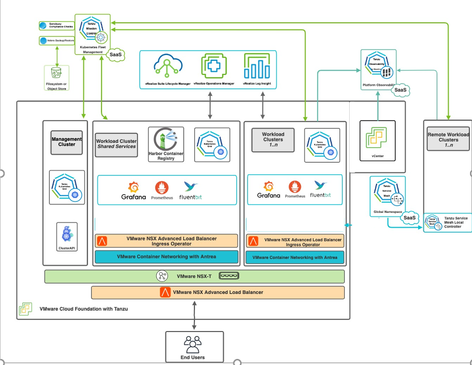

## Benefits of running VMware Tanzu on VMware Cloud on AWS
VMware Cloud on AWS enables your IT and operations teams to add value to your investments in AWS by extending your on-premises VMware vSphere environments to the AWS cloud. VMware Cloud on AWS is an integrated cloud offering jointly developed by Amazon Web Services (AWS) and VMware. It is optimized to run on dedicated, elastic, bare-metal Amazon Elastic Compute Cloud (Amazon EC2) infrastructure and supported by VMware and its partners. To learn more about VMware Cloud on AWS, see [VMware Cloud on AWS Documentation](https://docs.vmware.com/en/VMware-Cloud-on-AWS/index.html).

VMware Cloud on AWS enables the following:

1.	Cloud Migrations
2.	Data Center Extension
3.	Disaster Recovery
4.	Next Generation Applications

By running VMware Tanzu within the same infrastructure as the general VM workloads enabled by the first three use cases, organizations can start their next generation application modernization strategy immediately without incurring additional cost.
For example, SDDC spare capacity can be used to run Tanzu Kubernetes Grid to enable next generation application modernization, or compute capacity not used by disaster recovery can be used for Tanzu Kubernetes Grid clusters.

The following additional benefits are enabled by the Elastic Network Interface that connects the VMware Cloud on AWS SDDC to the AWS services within the Amazon VPC:

-	Enable developers to modernize existing enterprise apps with AWS cloud capabilities and services.
-	Integrate modern application tools and frameworks to develop next generation applications.
-	Remove egress charges as all traffic is internal of the Amazon availability zone.

## Supported Component Matrix
The following table provides the component versions and interoperability matrix supported with the reference design:

**Software Components**|**Version**
-----|-----
Tanzu Kubernetes Grid|1.4.0
VMware Cloud on AWS SDDC Version|1.14
NSX Advanced Load Balancer|20.1.6


## Installation Experience
The Tanzu Kubernetes Grid installation is done with the Tanzu Kubernetes Grid installer that is tailored to a vSphere environment.


The installation process takes you through the setup of a Tanzu Kubernetes Grid management cluster on your vSphere environment. The management cluster is a fully compliant, vanilla Kubernetes cluster that will manage the lifecycle of your Kubernetes Workload Clusters using the Cluster API.

The management cluster is deployed using regular VMs on your vSphere environment and can be deployed in a separate, management network segment.

You can create three types of clusters in a Tanzu Kubernetes Grid environment:

* Management Cluster
* Shared Services Cluster
* Workload Cluster

After the management cluster is deployed, you can make use of Tanzu CLI to deploy Tanzu Kubernetes shared service and workload clusters.

### Management Cluster
The management cluster is a Kubernetes cluster that runs Cluster API operations on a specific cloud provider to create and manage workload clusters on that provider. The management cluster is also where you configure the shared and in-cluster services that the workload clusters use.

You can deploy the management cluster using one of following:

* Run the Tanzu Kubernetes Grid installer, a wizard interface that guides you through the process of deploying a management cluster. This is the recommended method if you are installing a Tanzu Kubernetes Grid management cluster for the first time.  
* Create and edit YAML configuration files to deploy a management cluster with CLI commands.

### Shared Services Cluster  
Each Tanzu Kubernetes Grid instance can only have one shared services cluster. You deploy a shared services cluster only if you intend to deploy Harbor.

The Harbor service runs on a shared services cluster to serve all the other clusters in an installation. The Harbor service requires the Contour service to also run on the shared services cluster.

To deploy a shared service cluster, you create a configuration file that specifies the different options with which to deploy the cluster. You then run the `tanzu cluster create` command, specifying the configuration file in the `--file` option.

After the cluster is created, add the `tanzu-services` label to the shared services cluster as its cluster role. This label identifies the shared services cluster to the management cluster and workload clusters. For example:

`kubectl label cluster.cluster.x-k8s.io/tkg-services cluster-role.tkg.tanzu.vmware.com/tanzu-services="" --overwrite=true`

In the example, `tkg-services` is the name of the shared services cluster. You will see the confirmation `cluster.cluster.x-k8s.io/tkg-services labeled`.

### Design Recommendations for Tanzu Kubernetes Grid Management and Shared Services Clusters

1. Make use of the Tanzu Kubernetes Grid installer interface rather than the CLI to deploy your first management cluster.  
	When you deploy a management cluster by using the installer interface, it populates a cluster configuration file for the management cluster with the required parameters. You can use the configuration file as a model for future deployments from the CLI.
1. Use NSX Advanced Load Balancer as your Control Plane Endpoint Provider and for application load balancing.
	This eliminates the requirement for an external load balancer and additional configuration changes on your Tanzu Kubernetes Grid clusters.  
	Tanzu Kubernetes Grid includes VMware NSX Advanced Load Balancer Essentials Edition.  
1. Enable identity management for Tanzu Kubernetes Grid clusters. We recommend  using identity management for any production grade deployment. This avoids the use of administrator credentials and ensures that the required users have the right roles to access the Tanzu Kubernetes Grid clusters.
1. Enable Machine Health Checks. vSphere HA and Machine Health Checks work together to enhance workload resiliency .
1. In order to have flexible firewall and security policies, use dedicated segments for the following:

	* Tanzu Kubernetes Grid management cluster nodes  
	* Tanzu Kubernetes Grid shared service cluster nodes
	* VIP network for Control Plane HA  
	* VIP network for applications hosted on Shared Service cluster  

1. Create a separate Service Engine Group in NSX Advanced Load Balancer. The service engines part of this Service Engine Group hosts VIPs to provide load balancing service for:

	* Tanzu Kubernetes Grid clusters control plane nodes
	* Pinniped
	* User managed packages, such as Harbor, deployed in shared service clusters

1. For production deployments, use the **Prod** plan for Tanzu Kubernetes Grid management and shared service clusters. The **Prod** plan deploys multiple control plane nodes and provides HA.
1. Set the control plane and worker nodes size for the management cluster to **Large**. This allows for the deployment of Cert Manager, Contour, and Harbor extensions and integrating the shared service cluster with Tanzu Mission Control and Tanzu Observability. For more information on configuring nodes sizes, see [Appendix B - Configure Node Sizes](#appendix-b).  
1. If you are deploying Harbor in the shared service cluster without a publicly signed certificate, create the required overlays such that the Tanzu Kubernetes Grid cluster nodes trust the Harbor endpoint.

### Workload Cluster
Your applications run on Tanzu Kubernetes workload clusters. These clusters can be attached to SaaS solutions such as Tanzu Mission Control and Tanzu Observability, which are part of the Tanzu for Kubernetes Operations stack.

When you deploy Tanzu Kubernetes (workload) clusters to vSphere, you must specify options in the cluster configuration file to connect to vCenter Server and identify the vSphere resources that the cluster will use. You can also specify standard sizes for the control plane and worker node VMs and configure the CPU, memory, and disk sizes for control plane and worker nodes explicitly. If you use custom image templates, you can identify which template to use to create node VMs.

### Design Recommendations for Tanzu Kubernetes Grid Workload Clusters.
1. In order to have flexible firewall and security policies, use dedicated segments for the following:
	* 	Each Tanzu Kubernetes Grid workload cluster
	* 	VIP network for applications hosted on workload clusters

1. For Service Engine Group and VIP network for workload clusters:
	* Create a separate Service Engine Group in NSX Advanced Load Balancer. Service engines part of this Service Engine Group provides load balancing service for applications hosted on workload clusters.
	* For setups with a small number of Tanzu Kubernetes workload clusters that each have a large number of nodes, it is recommended to use one dedicated Service Engine Group per cluster.
	* A Service Engine Group can be shared by any number of workload clusters as long as the sum of the number of distinct cluster node networks and the number of distinct cluster VIP networks is no bigger than 8.
	* All clusters can share a single VIP network or each cluster can have a dedicated VIP network.

## Scalability Recommendations
The following table provides the supported scalability specifications for the reference design.

**Item**|**Specification**
-----|-----
Maximum number of tenants|Unlimited
Maximum number of TKG workload clusters per Tenant|Scalability is dictated by VMware Cloud on AWS configuration maximums.
Number of Service Engine Groups per tenant|One or more
Number of Service Engines per Service Engine Group|Up to 10
Maximum number of TKG workload clusters per Service Engine Group|8
Number of TKG workload clusters per AKO operator `kubectl get akodeploymentconfig`|Up to eight. See also Appendix B.
Number of TKG VIP network segments per Tenant|1

## Network Overview

### General Topology

The following network topology shows separate network segments for the Tanzu Kubernetes Grid (TKG) management cluster, Tanzu Kubernetes Grid workload clusters, and NSX Advanced Load Balancer (NSX ALB). Use this framework when deploying Tanzu Kubernetes Grid in VMware Cloud on AWS SDDCs.

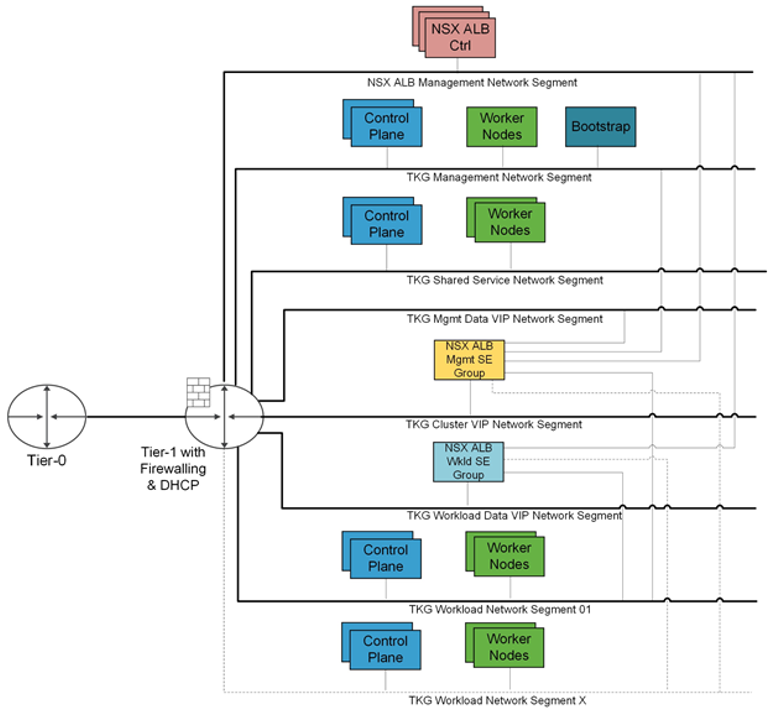

### Network Recommendations
You use Tanzu Kubernetes Grid to manage the lifecycle of multiple Kubernetes workload clusters by bootstrapping a Kubernetes management cluster with the Tanzu command line tool. Consider the following when configuring the network around Tanzu Kubernetes Grid:

- To have flexible firewall and security policies, place the Tanzu Kubernetes Grid management cluster and workload clusters on different network segments.
- Tanzu Kubernetes Grid release does not support static IP assignment for Kubernetes VM components. DHCP is required for each Tanzu Kubernetes Grid network.  
- NSX-T provides DHCP service on a segment. To simplify the configuration, make use of the DHCP local server to provide DHCP services for required segments.
- Plan your subnets for the Tanzu Kubernetes Grid management and workload clusters in advance. Similarly, plan for the VIP network CIDR and IP pools. The IP pool should be big enough to accommodate VIP for the clusters and applications that will be deployed initially as well as those that will be deployed in future.  
- NSX Advanced Load Balancer is used to provide HA for the control plane of each Kubernetes cluster.  
- NSX Advanced Load Balancer is used to provide load balancing services for applications hosted on the shared service and workload clusters.
- You must allocate at least one static IP in each subnet to assign to the Kubernetes control plane HA. This static IP should be part of the IP pool that you create in the NSX Advanced Load Balancer.

This topology enables the following benefits:

- Isolate and separate SDDC management components (vCenter, ESX) from the Tanzu Kubernetes Grid components. This reference design only allows the minimum connectivity between the Tanzu Kubernetes Grid clusters and NSX Advanced Load Balancer to the vCenter server.
- Isolate and separate NSX Advanced Load Balancer management network segments from the Tanzu Kubernetes Grid management segment and the Tanzu Kubernetes Grid workload clusters.
- Depending on the workload cluster type and use case, multiple workload clusters leverage the same logical segments or use new segments.  

	To isolate and separate Tanzu Kubernetes Grid workload cluster networking from each other, we recommend using separate logical segments for each workload cluster and configuring the required firewall between these networks. Refer to [Firewall Recommendations](#firewall) for more details.
- Separate provider and tenant access to the Tanzu Kubernetes Grid environment.
Only provider administrators need access to the Tanzu Kubernetes Grid management cluster. This prevents tenants from attempting to connect to the Tanzu Kubernetes Grid management cluster.
	- Only allow a tenant to access their Tanzu Kubernetes Grid workload cluster(s) and restrict access to the cluster from other tenants.


Network Type  | DHCP Service | Description & Recommendations                                                                                                                                                                                                                                                                                                                                                          
---|---|---|
NSX ALB Management Logical Segment  | Optional | NSX ALB controllers and SEs will be attached to this network.                                                                                                                                                                                                                                                                                                                                           DHCP is not a mandatory requirement on this network because NSX ALB can handle IPAM services for a given network.                                                                                 
TKG Management Logical Segment | Yes | Control plane and worker nodes of TKG management and shared services clusters  will be attached to this network.                                                                                                                                                                                                                                   
TKG Shared Service Logical Segment  | Yes  | Control plane and worker nodes of TKG shared service cluster will be attached to this network.                                                                                                                                                              
TKG Workload Logical Segment  | Yes| Control plane and worker nodes of TKG workload clusters will be attached to this network.                                                                                                                                                                                                                                                                
TKG Cluster VIP/Data Logical Segment  | No | Virtual services for control plane HA of all TKG clusters (management, shared services, and workload).                                                                                                                                                      Reserve sufficient IPs depending on the number of TKG clusters planned to be deployed in the environment, NSX ALB takes care of IPAM on this network.                                      
TKG Management VIP/Data Logical Segment | No  | Virtual services for all user-managed packages (such as Contour, Harbor, Contour, Prometheus, and Grafana) hosted on the shared services cluster.                                                                                                                                            
TKG Workload VIP/Data Logical Segment  | No   | Virtual services for all applications hosted on workload clusters.                                                                                                                                                     Reserve sufficient IPs depending on the number of applications that are planned to be hosted on workload clusters along with scalability considerations.                               

### <a id=firewall></a>Firewall Recommendations
To prepare the firewall rule sets for the Compute Gateway and the Management Gateway, you need to gather the following:

1.	Tanzu Kubernetes Grid Management Cluster Network CIDR
2.	Tanzu Kubernetes Grid Management Cluster control plane VIP
3.	Tanzu Kubernetes Grid Workload Cluster(s) Network CIDR
4.	Tanzu Kubernetes Grid Workload Cluster(s) control plane VIP
5.	Tanzu Kubernetes Grid VIP network(s) segment CIDR
6.	VMware Harbor registry IP
7.	vCenter Server IP
8.	NSX Advanced Load Balancer management segment CIDR
9.	DNS server IP(s)
10.	NTP Server IP(s)

**Source**|**Destination**|**Protocol:Port**|**Description**
-----|-----|-----|-----                                                                             
| TKG Management and TKG Workload Networks | DNS Server NTP Server  | UDP:53  UDP:123 | DNS Service  Time Synchronization                                                                                                                                                                                             
TKG Management and TKG Workload Networks  | DHCP Server | UDP: 67, 68  | Allows hosts to get DHCP addresses
TKG Management and TKG Workload Networks   | vCenter IP   | TCP:443   | Allows components to access vCenter to create VMs and Storage Volumes                                         
TKG Management, Shared Service, and Workload Cluster CIDR   | Harbor Registry  | TCP:443  | Allows components to retrieve container images. This registry can be a local or a public image registry (projects.registry.vmware.com)  |
TKG Management Cluster Network  | TKG Cluster VIP Network   | TCP:6443   | For management cluster to configure workload cluster                                                     
TKG Shared Service Cluster Network    | TKG Cluster VIP Network   | TCP:6443                                                   | Allow shared services cluster to register with management cluster                                 
TKG Workload Cluster Network  | TKG Cluster VIP Network  | TCP:6443   | Allow workload cluster to register with management cluster  
TKG Management, Shared Service, and Workload Networks   | AVI Controllers (NSX ALB) Management Network  | TCP:443 | Allow Avi Kubernetes Operator (AKO) and AKO Operator (AKOO) access to Avi Controller    |
AVI Controllers (NSX ALB) Management Network  | vCenter and ESXi Hosts  | TCP:443                                           | Allow AVI to discover vCenter objects and deploy SEs as required
| Admin Network   | Bootstrap VM    | SSH:22   | To deploy, manage, and configure TKG clusters
Deny-all | Any  | Any  | Deny

### Ingress and Load Balancing

Load balancer services are available only with [VMware NSX Advanced Load Balancer](https://www.vmware.com/products/nsx-advanced-load-balancer.html), formerly known as Avi Vantage.

NSX Advanced Load Balancer provides Layer 4 load balancing for your Kubernetes workloads.
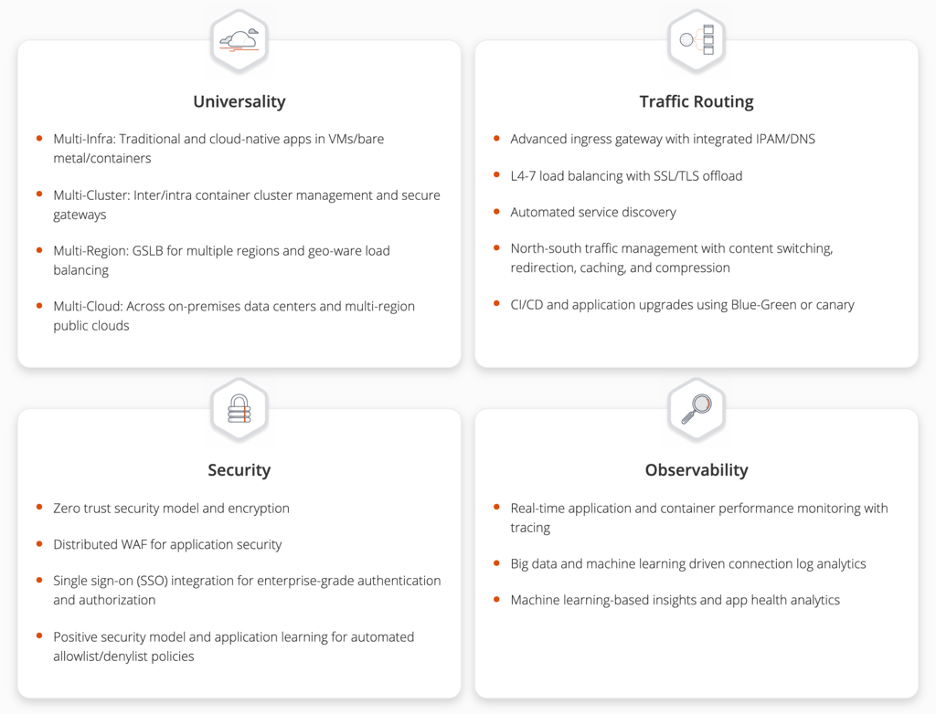

### NSX Advanced Load Balancer Integration with VMware Cloud on AWS
NSX Advanced Load Balancer is deployed as a customer-managed solution in VMware Cloud on AWS instead of in Orchestrator mode because the `cloudadmin` user does not have all required permissions to perform write operations to the vCenter API, which is a key requirement. Therefore, the Avi controller cannot orchestrate the deployment of service engines.

NSX Advanced Load Balancer Service Engines must be deployed before load balancer services can be requested by Kubernetes.

- NSX Advanced Load Balancer is installed in No Orchestrator mode on VMWare Cloud on AWS. See [Appendix A](#appendix-a).
- NSX Advanced Load Balancer cannot be installed in multi-tenant mode on VMware Cloud on AWS.
- The deployment of Service Engines (SE) on VMware Cloud on AWS is not orchestrated by the Avi Controller. Once a SE is integrated with the Avi Controller, virtual service placement and scaling can be handled centrally from the Avi Controller.
- The Avi Controller service runs on three virtual machines and is a clustered service. This provides HA for NSX Advanced Load Balancer controllers.

	>**Note:** Requires advanced licensing.

- A pair of Service Engines provide HA for load balancing.
- A Service Engine is deployed as a VM in VMware Cloud on AWS and has ten network adapters. The first network adapter is always used for management and is connected to the NSX Advanced Load Balancer management network segment. Another network adapter is connected to the Tanzu Kubernetes Grid VIP network segment to provide load balancing services to the Kubernetes pods running on the Tanzu Kubernetes Grid workload cluster.
- Another network adapter is connected to the Tanzu Kubernetes Grid Workload network segment.
- Therefore, a single Service Engine can provide load balancing services for up to eight separate network segments. This translates to up to eight Tanzu Kubernetes Grid workload clusters. We recommend deploying a pair of service engines for each tenant in a Service Engine Group and deploy additional Service Engine Groups if you exceed more than eight Tanzu Kubernetes Grid workload clusters for that single tenant.
- Do not share Service Engine Groups or Service Engines between tenants.

**Avi Service Engines**

- Avi Service Engines are deployed as virtual machines (VMs) on VMware Cloud on AWS.
- Service Engines are connected to the NSX Advanced Load Balancer management, Tanzu Kubernetes Grid VIP, and Tanzu Kubernetes Grid workload cluster network segments.
- The Service Engines connect to the Avi Controller over the NSX Advanced Load Balancer management network segment, which is the logical network connection to the vNIC0 of the SE VM.

**Avi Controller**

- The Avi Controller is dedicated to the VMC environment.
- The Avi Controller service runs on three virtual machines and is a clustered service.
- The Avi Controller VMs are only connected to the NSX Advanced Load Balancer management network segment.

**Avi Controller Configuration**

**Avi Controller Configuration (medium)**|**Specification**
-----|-----
vCPUs|8
Memory (GB)|24
Hard disk (GB)|128
Number of network adapters|1
Number of appliances|3

**Avi Controller Sizing Guidelines**

Regardless of Avi Controller configuration, each Avi Controller cluster can achieve up to 5,000 virtual services, which is a hard limit. For more details, see [Avi Controller Sizing](https://avinetworks.com/docs/20.1/avi-controller-sizing/).

**Controller Size**|**VM Configuration**|**Virtual Services**|**Avi SE Scale**
-----|-----|-----|-----
Small|4 vCPUS, 12 GB RAM|0-50|0-10
Medium|8 vCPUS, 24 GB RAM|0-200|0-100
Large|16 vCPUS, 32 GB RAM|200-1000|100-200
Extra Large|24 vCPUS, 48 GB RAM|1000-5000|200-400

**Service Engine Configuration**

**Service Engine Configuration**|**Specification**
-----|-----
vCPUs|1 (2)*
Memory (GB)|2 (4)*
Hard disk (GB)|15
Number of network adapters|10
Number of service engines per Service Engine Group|2
*Recommended

**Service Engine Sizing Guidelines**

For guidance on sizing your Service Engines, see [Sizing Service Engines](https://avinetworks.com/docs/17.1/sizing-service-engines/).

The following table provides a summary for Intel v4 CPUs, for example Intel(R) Xeon(R) CPU E5-2686 v4 @ 2.30GHz used in VMware Cloud on AWS SDDCs:

**Performance metric**|**1 vCPU core**
-----|-----
Throughput|4 Gb/s
Connections/s|40k
SSL Throughput|1 Gb/s
SSL TPS (RSA2K)|~600
SSL TPS (ECC)|2500

Multiple performance vectors or features may have an impact on performance.  For instance, to achieve 1 Gb/s of SSL throughput and 2000 TPS of SSL with EC certificates, Avi recommends two cores.

Avi Service Engines may be configured with as little as 1 vCPU core and 1 GB RAM, or up to 36 vCPU cores and 128 GB RAM.

**Network Requirements**

For each Tanzu Kubernetes Grid workload cluster network segment, reserve a block of IP addresses for the NSX Advanced Load Balancer service engine.

Virtual IP address assignment for Kubernetes load balancer services (`kubectl expose`) use the separate Tanzu Kubernetes Grid VIP network segment.

For example, if you configured a /24 network for the Tanzu Kubernetes Grid workload cluster 1 network segment. Reserve a block of IP addresses for the service engines and configure this in NSX Advanced Load Balancer.

**TKG workload cluster**|**IP block for TKG workload cluster**|**IP block for NSX Advanced Load Balancer SEs**
-----|-----|-----
TKG workload cluster 1|192.168.0.2-192.168.0.128|192.168.0.129-192.168.0.254
TKG workload cluster 2|192.168.1.2-192.168.1.128|192.168.1.129-192.168.1.254
TKG workload cluster x|192.168.x.2-192.168.x.128|192.168.x.129-192.168.x.254

**Contour for Kubernetes Ingress Routing**

Contour is exposed by NSX Advanced Load Balancer. It provides Layer 7 routing to your Kubernetes services.

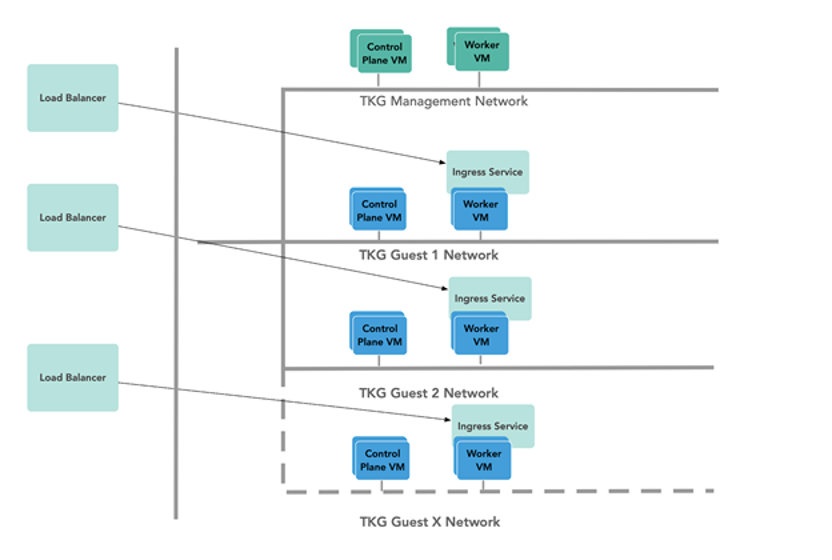


## Storage

vSAN storage policies is the only option available for VMware Cloud on AWS.

For Kubernetes stateful workloads, Tanzu Kubernetes Grid installs the vSphere Container Storage interface (vSphere CSI) to provision Kubernetes persistent volumes for pods automatically. While the default vSAN storage policy can be used, you should evaluate the needs of the applications and craft a specific vSAN storage policy. vSAN storage policies describe classes of storage, such as failure to tolerate and number of replicas, along with quotas for your clusters.

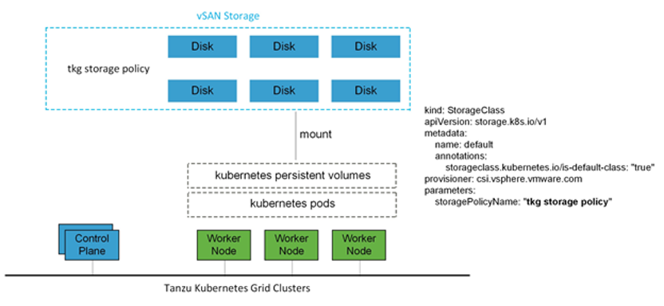


## Clustering on vSphere

### Single Cluster

Starting with a single vSphere cluster, management and workload Kubernetes clusters can be separated into different vSphere resource pools. Using a resource pool lets you manage each Kubernetes cluster’s CPU and memory limitations and reservations. However, it does not separate elements on the physical layer.

This approach is ideal for functional trials, proofs-of-concepts, or production application deployments that do not require hardware separation.
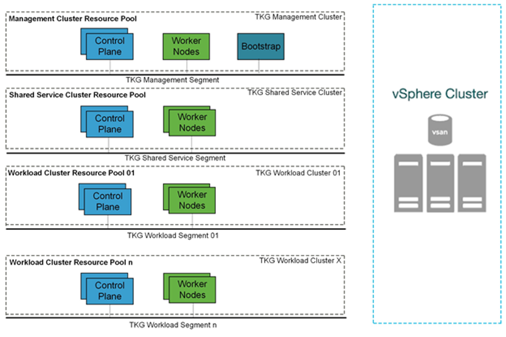

### Multi-clusters

For more physical separation of application workloads on Kubernetes, operators can deploy separate Kubernetes clusters to independent vSphere clusters and gain physical layer separation. For example, a Kubernetes cluster with high storage capacity workloads can leverage hosts with high-capacity storage (R5), while extreme IO workload clusters can be placed onto hosts with high performance storage (I3). Or utilize the I3en host type for data-intensive workloads.

For additional details, see [VMware Cloud on AWS Host Types](https://docs.vmware.com/en/VMware-Cloud-on-AWS/services/com.vmware.vmc-aws-operations/GUID-98FD3BA9-8A1B-4500-99FB-C40DF6B3DA95.html).

This also applies to the management cluster for compute separation between management and workloads.
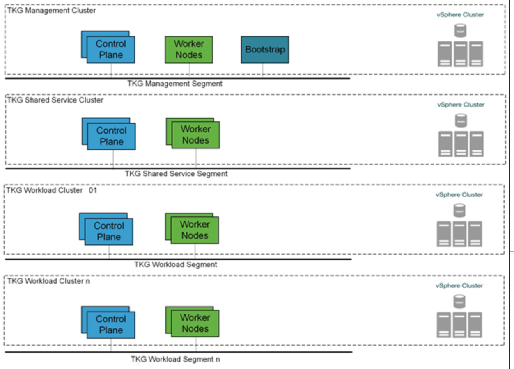

### High Availability
Tanzu Kubernetes Grid relies heavily on existing vSphere features for mitigating common availability disruptions, such as single-host hardware failure.  In this scenario, vSphere HA allows VMs on failed hardware to be automatically restarted on surviving hosts. vSphere HA is enabled by default on all VMware Cloud on AWS SDDC clusters and cannot be disabled.

The Tanzu Kubernetes Grid management cluster performs Machine Health Checks on all Kubernetes worker VMs.  This ensures workloads remain in a functional state, and can remediate issues like:

- Worker nodes accidentally deleted or corrupted
- Kubelet process on worker nodes accidentally stopped or corrupted

This health check aims to ensure your worker capacity remains stable and can be scheduled for workloads.  The health check, however, does not apply to VMs deployed on the control plane, and does not recreate VMs due to physical host failure. vSphere HA and Machine Health Checks work together to enhance workload resilience.

Fully Automated DRS is also enabled by default in VMware Cloud on AWS to continuously ensure that cluster load is evenly spread over all hosts. This indirectly helps reduce vSphere HA recovery time as no single host is overloaded. Recovery time on surviving hosts is reduced because the number or the size of VMs is not large. vSphere DRS is enabled by default on all VMware Cloud on AWS SDDC clusters and cannot be disabled.

### Non-Stretched vSphere clusters
Because Tanzu Kubernetes Grid does not recognize a stretched cluster configuration, it must be deployed on non-stretched vSphere clusters. You will experience downtimes during a site failure if Tanzu Kubernetes Grid is deployed on a stretched cluster topology.

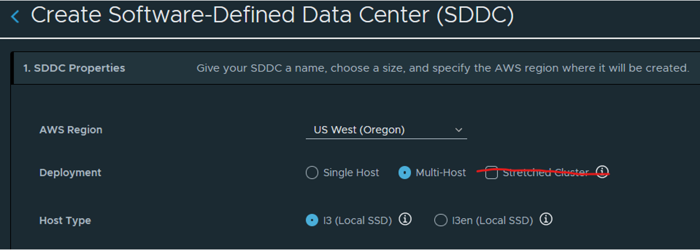

### Shared Services Cluster
Tanzu Kubernetes Grid includes binaries for tools that provide in-cluster and shared services to the clusters running in your Tanzu Kubernetes Grid instance. The provided binaries and container images are built and signed by VMware.

A shared services cluster is just a Tanzu Kubernetes Grid workload cluster used for shared services, it can be provisioned using the standard CLI command `tanzu cluster create`, or through Tanzu Mission Control.

You can add functionalities to Tanzu Kubernetes clusters by installing extensions to different cluster locations as follows:

**Function**|**Extension**|**Location**|**Procedure**
-----|-----|-----|-----
Ingress Control|Contour|Tanzu Kubernetes or shared services cluster|[Implementing Ingress Control with Contour](https://docs.vmware.com/en/VMware-Tanzu-Kubernetes-Grid/1.3/vmware-tanzu-kubernetes-grid-13/GUID-extensions-ingress-contour.html)
Service Discovery|ExternalDNS|Tanzu Kubernetes or shared services cluster|[Implementing Service Discovery with ExternalDNS](https://docs.vmware.com/en/VMware-Tanzu-Kubernetes-Grid/1.3/vmware-tanzu-kubernetes-grid-13/GUID-extensions-external-dns.html)
Log Forwarding|Fluent Bit|Tanzu Kubernetes cluster|[Implementing Log Forwarding with Fluentbit](https://docs.vmware.com/en/VMware-Tanzu-Kubernetes-Grid/1.3/vmware-tanzu-kubernetes-grid-13/GUID-extensions-logging-fluentbit.html)
Container Registry|Harbor|Shared services cluster|[Deploy Harbor Registry as a Shared Service](https://docs.vmware.com/en/VMware-Tanzu-Kubernetes-Grid/1.3/vmware-tanzu-kubernetes-grid-13/GUID-extensions-harbor-registry.html)
Monitoring|Prometheus, Grafana|Tanzu Kubernetes cluster|[Implementing Monitoring with Prometheus and Grafana](https://docs.vmware.com/en/VMware-Tanzu-Kubernetes-Grid/1.3/vmware-tanzu-kubernetes-grid-13/GUID-extensions-monitoring.html)

The Harbor service runs on a shared services cluster to serve all the other clusters in an installation. The Harbor service requires the Contour service to also run on the shared services cluster. In many environments, the Harbor service also benefits from ExternalDNS running on its cluster as described in [Harbor Registry and ExternalDNS](https://docs.vmware.com/en/VMware-Tanzu-Kubernetes-Grid/1.3/vmware-tanzu-kubernetes-grid-13/GUID-extensions-harbor-registry.html#external-dns).

Some extensions require or are enhanced by other extensions deployed to the same cluster:

- Contour is required by Harbor, ExternalDNS, and Grafana
- Prometheus is required by Grafana
- ExternalDNS is recommended for Harbor on infrastructures with load balancing (AWS, Azure, and vSphere with NSX Advanced Load Balancer), especially in production or other environments in which Harbor availability is important.

**Note:** Each Tanzu Kubernetes Grid instance can only have one shared services cluster.

## Container Registry

Tanzu Editions include Harbor as a container registry.  Harbor provides a location for pushing, pulling, storing and scanning container images to be used in your Kubernetes clusters.

If you are deploying Harbor without a publicly signed certificate, follow the instructions for including the Harbor root CA in your Tanzu Kubernetes Grid clusters.

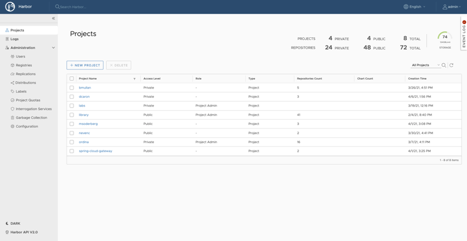

## Tanzu Mission Control

Tanzu Mission Control (TMC) is a centralized management platform for consistently operating and securing your Kubernetes infrastructure and modern applications across multiple teams and clouds. It provides operators with a single control point to give developers the independence they need to drive business forward, while enabling consistent management and operations across environments for increased security and governance.

### Attaching Tanzu Kubernetes Clusters to Tanzu Mission Control

Attaching clusters into Tanzu Mission Control (TMC) provides a centralized administrative interface that enables you to manage your global portfolio of Kubernetes clusters. Tanzu Mission Control can assist you with the following:

- **Centralized Lifecycle Management** - Managing the creation and deletion of workload clusters using registered management clusters.
- **Centralized Monitoring** - Viewing the inventory of clusters and the health of clusters and their components.
- **Authorization** - Centralizing authentication and authorization with federated identity from multiple sources, such as AD, LDAP, or SAML. And, an easy-to-use **policy engine** for granting the right access to the right users across teams.
- **Compliance** - Enforcing all clusters to apply the same set of policies.
- **Data protection** - Using [Velero](https://velero.io/) through Tanzu Mission Control to verify that your workloads and persistent volumes are being backed up.

### Provisioning Tanzu Kubernetes Clusters with Tanzu Mission Control

It is recommended to register the Tanzu Kubernetes Grid management cluster with Tanzu Mission Control before proceeding to provision Tanzu Kubernetes Grid shared services and workload clusters. After a Tanzu Kubernetes Grid management cluster is registered with Tanzu Mission Control, you can provision Tanzu Kubernetes Grid workload clusters directly from Tanzu Mission Control.

You can do this in two ways, by using the Tanzu Mission Control UI from console.cloud.vmware.com or using the [Tanzu Mission Control CLI](https://docs.vmware.com/en/VMware-Tanzu-Mission-Control/services/tanzumc-using/GUID-7EEBDAEF-7868-49EC-8069-D278FD100FD9.html).

Any Tanzu Kubernetes Grid workload cluster that is now created through Tanzu Mission Control is automatically added to Tanzu Mission Control for lifecycle management.

Alternatively, if you prefer to not use Tanzu Mission Control, you can provision Tanzu Kubernetes Grid workload clusters using the Tanzu CLI. You can register a Tanzu Kubernetes Grid workload cluster that was not provisioned on Tanzu Mission Control at a later time and bring it into Tanzu Mission Control lifecycle management.

### Policy-Driven Cluster Management

Tanzu Mission Control allows the creation of policies of various types to manage the operation and security posture of your Kubernetes clusters and other organizational objects. Policies provide a set of rules that govern your organization and all the objects it contains. The policy types available in Tanzu Mission Control include the following:

1. Access Policy: Access policies allow the use of predefined roles to specify which identities (individuals and groups) have what level of access to a given resource. For more information, see [Access Control](https://docs.vmware.com/en/VMware-Tanzu-Mission-Control/services/tanzumc-concepts/GUID-EB9C6D83-1132-444F-8218-F264E43F25BD.html)
2. Image Registry Policy: Image registry policies allow you to specify the source registries from which an image can be pulled.
3. Network Policy: Network policies allow you to use preconfigured templates to define how pods communicate with each other and other network endpoints.
4. Quota Policy: Quota policies allow you to constrain the resources used in your clusters, as aggregate quantities across specified namespaces, using pre configured and custom templates. For more information, see [Managing Resource Consumption in Your Clusters](https://docs.vmware.com/en/VMware-Tanzu-Mission-Control/services/tanzumc-using/GUID-1905352C-856F-4D06-BB86-426F90486C32.html).
5. Security Policy: Security policies allow you to manage the security context in which deployed pods operate in your clusters by imposing constraints on your clusters that define what pods can do and which resources they have access to. For more information, see [Pod Security Management](https://docs.vmware.com/en/VMware-Tanzu-Mission-Control/services/tanzumc-concepts/GUID-6C65B33B-C1EA-465D-B909-3C4F51704C1A.html#GUID-6C65B33B-C1EA-465D-B909-3C4F51704C1A).
6. Custom Policy: Custom policies allow you to implement additional business rules, using templates that you define, to enforce policies that are not already addressed using the other built-in policy types. For more information, see [Creating Custom Policies](https://docs.vmware.com/en/VMware-Tanzu-Mission-Control/services/tanzumc-using/GUID-1FF7A1E5-8456-4EF4-A532-9CF31BE88EAA.html).

Not all policies described here are available in Tanzu Mission Control Standard edition. For a comparison, see [VMware Tanzu Mission Control Feature Comparison Chart.](https://tanzu.vmware.com/content/tanzu-mission-control/tmc-comparison-chart)


### Policy Inheritance

In the Tanzu Mission Control resource hierarchy, there are three levels at which you can specify policies.

1. organization
2. object groups (cluster groups and workspaces)
3. Kubernetes objects (clusters and namespaces)

 In addition to the direct policy defined for a given object, each object also has inherited policies that are defined in the parent objects. For example, a cluster has a direct policy and also has inherited policies from the cluster group and organization to which it is attached.

## Observability

### Metrics On-Premises

Tanzu Kubernetes Grid includes observability with **Prometheus** and **Grafana** extensions. You can automate the installation of the extensions by applying the YAML file in the extensions folder as documented [here](https://docs.vmware.com/en/VMware-Tanzu-Kubernetes-Grid/1.4/vmware-tanzu-kubernetes-grid-14/GUID-packages-monitoring.html). Grafana provides a way to view cluster metrics as shown in the following screen captures:

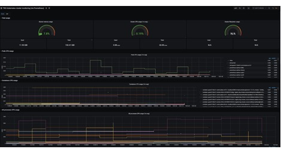

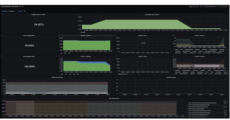


### Metrics in Tanzu Observability

Using [VMware Tanzu Observability by Wavefront](https://tanzu.vmware.com/observability) significantly enhances observability. Tanzu Observability is a VMware SaaS application that collects and displays metrics and trace data from the full stack platform, as well as from applications. The service provides the ability to create alerts tuned by advanced analytics, assist in the troubleshooting of systems, and to understand the impact of running production code.

In the case of vSphere and Tanzu Kubernetes Grid, Tanzu Observability collects data from components in vSphere, Kubernetes, and applications running within Kubernetes.

You can configure Tanzu Observability with an array of capabilities. he following table describes the plugins that we recommend for this design:

| **Plugin** | **Purpose** | **Key Metrics** | **Example Metrics** |
| --- | --- | --- | --- |
| Telegraf for vSphere | Collect metrics from vSphere | ESXi Server and VM performance &amp; resource utilization | vSphere VM, Memory and Disk usage and performance |
| Wavefront Kubernetes Integration | Collect metrics from Kubernetes clusters and pods | Kubernetes container and POD statistics | POD CPU usage rate, `DaemonSet` ready stats |
| Wavefront by VMware for Istio | Adapts Istio collected metrics and forwards to Wavefront | Istio metrics including request rates, trace rates, throughput, etc. | Request rate (Transactions per Second) |

### Tanzu Observability Dashboard Examples

The following sections show example dashboards available on Tanzu Observability. Tanzu Observability can display metric data from the full stack of application elements from the platform (**VMware ESXi servers**), to the **virtual environment**, to the application environment (**Kubernetes**) and down to the various components of an **application** (**APM**).

#### ESXi Dashboards

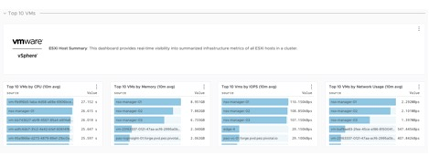

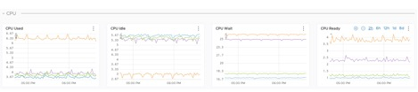

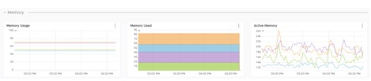

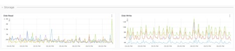

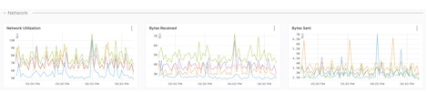

#### VM Dashboards

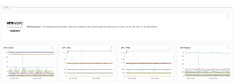

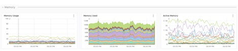

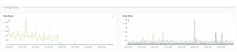

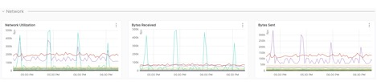

#### Storage Dashboards

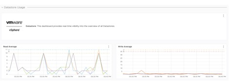

#### Kubernetes Dashboards

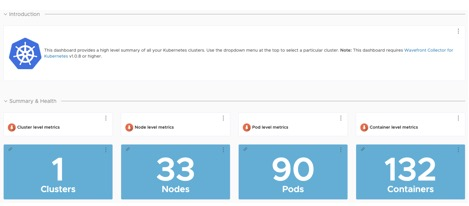

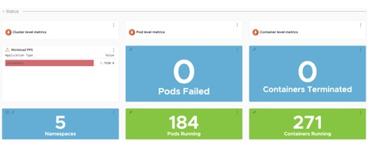

#### Application Dashboards

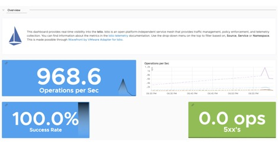

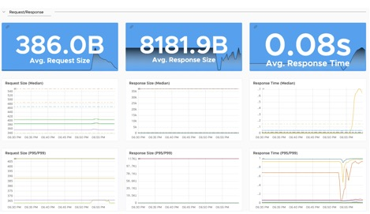

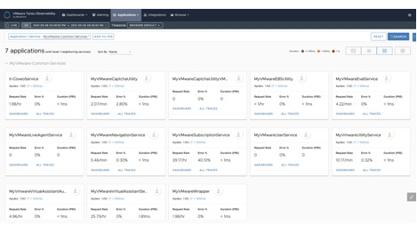

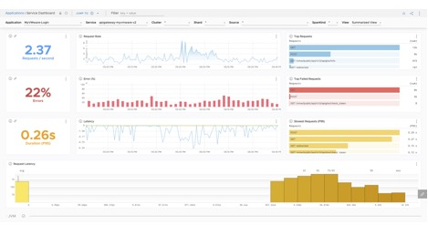

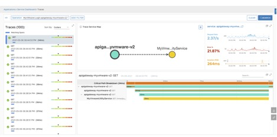

There are over 200 [integrations](https://vmware.wavefront.com/integrations) with prebuilt dashboards available in Tanzu Observability.

## Logging

The Tanzu Editions also include [Fluent Bit](https://fluentbit.io/) for integration with logging platforms such as vRealize Log Insight Cloud, Elasticsearch, Splunk, or logging solutions such as Amazon CloudWatch by using the direct connectivity between the VMware Cloud on AWS SDDC and the Amazon VPC.

Details on configuring Fluent Bit to your logging provider can be found in the documentation [here](https://docs.vmware.com/en/VMware-Tanzu-Kubernetes-Grid/1.3/vmware-tanzu-kubernetes-grid-13/GUID-extensions-logging-fluentbit.html).

The Fluent Bit `DaemonSet` is installed automatically as an extension on all Tanzu Kubernetes Grid clusters, but each Tanzu Kubernetes Grid cluster can be configured differently if desired.

vRealize Log Insight (vRLI) provides real-time log management and log analysis with machine learning based intelligent grouping, high-performance searching, and troubleshooting across physical, virtual, and cloud environments. vRLI already has a deep integration with the vSphere platform, where you can get key actionable insights, and it can be extended to include the cloud native stack as well.

The vRealize Log Insight appliance is available as a separate on-premises deployable product. You can also choose to go with the SaaS version vRealize Log Insight Cloud.


## Summary

Tanzu on VMware Cloud on AWS offers high-performance potential, convenience, and addresses the challenges of creating, testing, and updating Kubernetes platforms in a consolidated production environment. This validated approach will result in a production quality installation with all the application services needed to serve combined or uniquely separated workload types via a combined infrastructure solution.

This plan meets many Day 0 needs for aligning product capabilities, such as configuring firewall rules, networking, load balancing, and workload compute, to the full stack infrastructure.

<!-- Deployment Instructions -->
<!-- For information on how to deploy this reference design, see . -->

## <a id=appendix-a></a> Appendix A

### Automating Deployment of Service Engines

As discussed, Avi Vantage is installed in No Orchestrator mode on VMWare Cloud on AWS. Therefore, the deployment of service engines (SE) on VMware Cloud on AWS is not orchestrated by the Avi Controller. Once SE is integrated with the Avi Controller, virtual service placement and scaling can be handled centrally from the Avi Controller. A pair of service engines provide HA for load balancing.

It is troublesome to manually deploy a pair of service engines for each tenant using the Import OVA workflow in VMware Cloud on AWS. Therefore, we recommend using `GOVC` in conjunction with Python to obtain the OVF properties as a JSON file and then customizing the JSON file for each service engine.

The following example JSON file can be used to automate the provisioning of service engines ready for use with Tanzu Kubernetes Grid.

<!-- /* cSpell:disable */ -->
```json
{
  "DiskProvisioning": "flat",
  "IPAllocationPolicy": "fixedPolicy",
  "IPProtocol": "IPv4",
  "PropertyMapping": [
    {
      "Key": "AVICNTRL",
      "Value": "<ip-address-of-avi-controller>"
    },

    {
      "Key": "AVISETYPE",
      "Value": "NETWORK_ADMIN"
    },
    {
      "Key": "AVICNTRL_AUTHTOKEN",
      "Value": "<avi-controller-auth-token>"
    },
    {
      "Key": "AVICNTRL_CLUSTERUUID",
      "Value": "<avi-controller-cluster-id>"
    },
    {
      "Key": "avi.mgmt-ip.SE",
      "Value": "<management-ip-address-of-service-engine>"
    },
    {
      "Key": "avi.mgmt-mask.SE",
      "Value": "255.255.255.0"
    },
    {
      "Key": "avi.default-gw.SE",
      "Value": "<avi-management-network-gateway>"
    },
    {
      "Key": "avi.DNS.SE",
      "Value": "<dns-server>"
    },
    {
      "Key": "avi.sysadmin-public-key.SE",
      "Value": ""
    }
  ],
  "NetworkMapping": [
    {
      "Name": "Management",
      "Network": "avi-management"
    },
    {
      "Name": "Data Network 1",
      "Network": "<tkg-workload-1-cluster-network-segment-name>"
    },
    {
      "Name": "Data Network 2",
      "Network": "<tkg-workload-2-cluster-network-segment-name>"
    },
    {
      "Name": "Data Network 3",
      "Network": "<tkg-workload-3-cluster-network-segment-name>"
    },
    {
      "Name": "Data Network 4",
      "Network": "<tkg-workload-4-cluster-network-segment-name>"
    },
    {
      "Name": "Data Network 5",
      "Network": "<tkg-workload-5-cluster-network-segment-name>"
    },
    {
      "Name": "Data Network 6",
      "Network": "<tkg-workload-6-cluster-network-segment-name>"
    },
    {
      "Name": "Data Network 7",
      "Network": "<tkg-workload-7-cluster-network-segment-name>"
    },
    {
      "Name": "Data Network 8",
      "Network": "<tkg-workload-8-cluster-network-segment-name>"
    },
    {
      "Name": "Data Network 9",
      "Network": "<tkg-workload-9-cluster-network-segment-name>"
    }
  ],
  "MarkAsTemplate": false,
  "PowerOn": true,
  "InjectOvfEnv": false,
  "WaitForIP": false,
  "Name": "se-1"
}
```
<!-- /* cSpell:enable */ -->

Provision each service engine using the following code.

<!-- /* cSpell:disable */ -->
```bash
export GOVC_URL=<fqdn-of-vcenter-in-vmware-cloud-on-aws>
export GOVC_USERNAME=cloudadmin@vmc.local
export GOVC_PASSWORD=<clouadmin@vmc.local-password>
export GOVC_INSECURE=false
govc import.spec /home/admin/se.ova | python -m json.tool > se-1.json
govc import.ova -pool=*/Resources/Compute-ResourcePool/TKG/SEs -ds=WorkloadDatastore --options=/home/admin/se-1.json /home/admin/se.ova
```
<!-- /* cSpell:enable */ -->

This deploys a new service engine with a VM name of `_se-1_` into the resource pool `_Compute-ResourcePool/TKG/SEs_`. Since the  `_PowerOn_` parameter is set to `_true_`, the service engine will boot up automatically and since we have set the key value pairs for the following, the service engine is automatically registered with Avi Controller and is ready for further configuration in Avi Vantage:

<!-- /* cSpell:disable */ -->
```bash
"Key": "AVICNTRL",
"Value": "<ip-address-of-avi-controller>"
"Key": "AVICNTRL_CLUSTERUUID",
"Value": "<avi-controller-cluster-id>"
"Key": "avi.mgmt-ip.SE",
"Value": "<management-ip-address-of-service-engine>"
```
<!-- /* cSpell:enable */ -->

## <a id=appendix-b></a> Appendix B - Configure Node Sizes

The Tanzu CLI creates the individual nodes of management clusters and Tanzu Kubernetes clusters according to settings that you provide in the configuration file. On vSphere, you can configure all node VMs to have the same predefined configurations, set different predefined configurations for control plane and worker nodes, or customize the configurations of the nodes. By using these settings, you can create clusters that have nodes with different configurations to the management cluster nodes. You can also create clusters in which the control plane nodes and worker nodes have different configurations.

### Use Predefined Node Configurations

The Tanzu CLI provides the following predefined configurations for cluster nodes:

1. small: 2 CPUs, 4 GB memory, 20 GB disk
2. medium: 2 CPUs, 8 GB memory, 40 GB disk
3. large: 4 CPUs, 16 GB memory, 40 GB disk
4. extra-large: 8 CPUs, 32 GB memory, 80 GB disk

To create a cluster in which the control plane and worker node VMs are the same size, specify the `SIZE` variable. If you set the `SIZE` variable, all nodes will be created with the configuration that you set.

 SIZE: "large"

To create a cluster in which the control plane and worker node VMs are different sizes, specify the `CONTROLPLANE_SIZE` and `WORKER_SIZE` options.

<!-- /* cSpell:disable */ -->
```bash
CONTROLPLANE_SIZE: "medium"
WORKER_SIZE: "extra-large"
```
<!-- /* cSpell:enable */ -->

You can combine the `CONTROLPLANE_SIZE` and `WORKER_SIZE` options with the `SIZE` option. For example, if you specify `SIZE: "large"` with `WORKER_SIZE: "extra-large"`, the control plane nodes will be set to large and worker nodes will be set to extra-large.

<!-- /* cSpell:disable */ -->
```bash
SIZE: "large"
WORKER_SIZE: "extra-large"
```
<!-- /* cSpell:enable */ -->

### Define Custom Node Configurations

You can customize the configuration of the nodes rather than using the predefined configurations.

To use the same custom configuration for all nodes, specify the `VSPHERE_NUM_CPUS`, `VSPHERE_DISK_GIB`, and `VSPHERE_MEM_MIB` options.

<!-- /* cSpell:disable */ -->
```bash
VSPHERE_NUM_CPUS: 2
VSPHERE_DISK_GIB: 40
VSPHERE_MEM_MIB: 4096
```
<!-- /* cSpell:enable */ -->

To define different custom configurations for control plane nodes and worker nodes, specify the `VSPHERE_CONTROL_PLANE_*` and `VSPHERE_WORKER_*`

<!-- /* cSpell:disable */ -->
```bash
VSPHERE_CONTROL_PLANE_NUM_CPUS: 2
VSPHERE_CONTROL_PLANE_DISK_GIB: 20
VSPHERE_CONTROL_PLANE_MEM_MIB: 8192
VSPHERE_WORKER_NUM_CPUS: 4
VSPHERE_WORKER_DISK_GIB: 40
VSPHERE_WORKER_MEM_MIB: 4096
```
<!-- /* cSpell:enable */ -->
