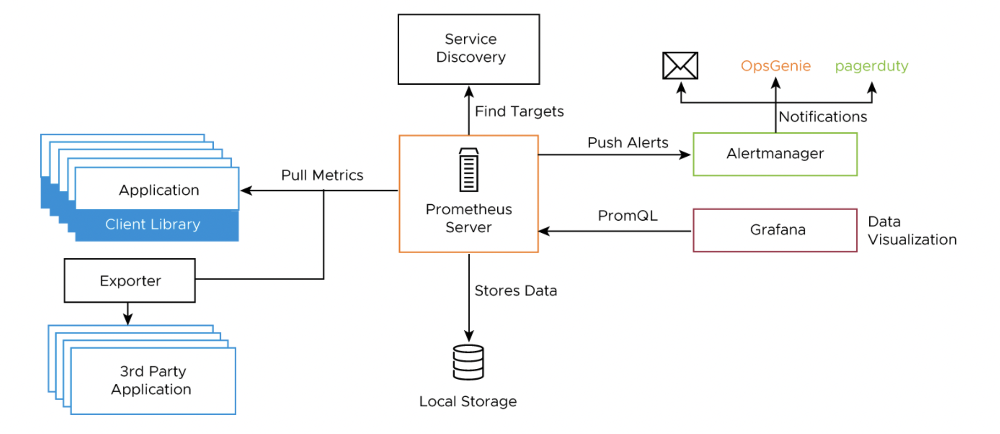
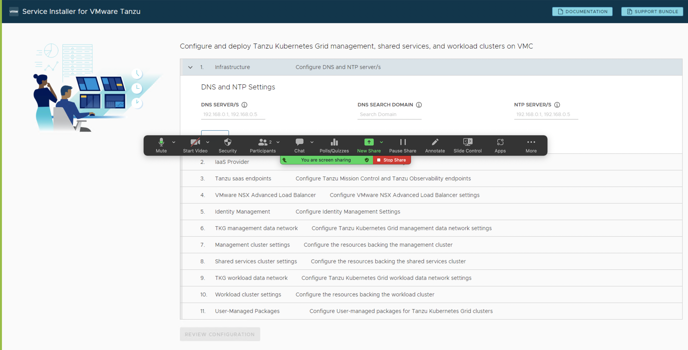

# VMware Tanzu for Kubernetes Operations on VMware Cloud on AWS Reference Design

Tanzu for Kubernetes Operations simplifies operating Kubernetes for multi-cloud deployment by centralizing management and governance for clusters and teams across on-premises, public clouds, and edge. Tanzu for Kubernetes Operations delivers an open source aligned Kubernetes distribution with consistent operations and management to support infrastructure and application modernization.

This document lays out a reference design for deploying VMware Tanzu for Kubernetes Operations on VMware Cloud on AWS.

**Note:** The scope of this document is limited to Tanzu Kubernetes Grid (multi-cloud), which is a customer-managed solution.

The following reference design is based on the architecture and components described in [VMware Tanzu for Kubernetes Operations Reference Architecture](index.md).


## Supported Component Matrix

The following table provides the component versions and interoperability matrix supported with the reference design:

| **Software Components**    | **Version**    |
| ---------------------------- | ---------------- |
| Tanzu Kubernetes Grid      | 2.1.0          |
| VMC on AWS SDDC Version    | 1.18 and later |
| NSX Advanced Load Balancer | 22.1.2         |

For up-to-date information about which software versions can be used together, check the Interoperability Matrix [here](https://interopmatrix.vmware.com/Interoperability?col=551,&row=648,%26789,).

## Benefits of Running VMware Tanzu on VMware Cloud on AWS

VMware Cloud on AWS enables your IT and operations teams to add value to your investments in AWS by extending your on-premises VMware vSphere environments to the AWS cloud. VMware Cloud on AWS is an integrated cloud offering jointly developed by Amazon Web Services (AWS) and VMware. It is optimized to run on dedicated, elastic, bare-metal Amazon Elastic Compute Cloud (Amazon EC2) infrastructure and supported by VMware and its partners. To learn more about VMware Cloud on AWS, see [VMware Cloud on AWS Documentation](https://docs.vmware.com/en/VMware-Cloud-on-AWS/index.html).

VMware Cloud on AWS enables the following:

1. Cloud Migrations
2. Data Center Extension
3. Disaster Recovery
4. Next Generation Applications

By running VMware Tanzu within the same infrastructure as the general VM workloads enabled by the first three use cases, organizations can start their next generation application modernization strategy immediately without incurring additional cost.
For example, SDDC spare capacity can be used to run Tanzu Kubernetes Grid to enable next generation application modernization, or compute capacity not used by disaster recovery can be used for Tanzu Kubernetes Grid clusters.

The following additional benefits are enabled by the Elastic Network Interface that connects the VMware Cloud on AWS SDDC to the AWS services within the Amazon VPC:

- Enable developers to modernize existing enterprise apps with AWS cloud capabilities and services.
- Integrate modern application tools and frameworks to develop next generation applications.
- Remove egress charges as all traffic is internal of the Amazon availability zone.

## Tanzu Kubernetes Grid Components

VMware Tanzu Kubernetes Grid (TKG) provides organizations with a consistent, upstream-compatible, regional Kubernetes substrate that is ready for end-user workloads and ecosystem integrations. You can deploy Tanzu Kubernetes Grid across software-defined datacenters (SDDC) and public cloud environments, including vSphere, Microsoft Azure, and Amazon EC2.

Tanzu Kubernetes Grid comprises the following components:

- **Management Cluster -** A management cluster is the first element that you deploy when you create a Tanzu Kubernetes Grid instance. The management cluster is a Kubernetes cluster that performs the role of the primary management and operational center for the Tanzu Kubernetes Grid instance. The management cluster is purpose-built for operating the platform and managing the lifecycle of Tanzu Kubernetes clusters.
- **Tanzu Kubernetes Cluster -** Tanzu Kubernetes clusters are the Kubernetes clusters in which your application workloads run. These clusters are also referred to as workload clusters. Tanzu Kubernetes clusters can run different versions of Kubernetes, depending on the needs of the applications they run.
- **Shared Services Cluster -**  Each Tanzu Kubernetes Grid instance can have only one shared services cluster. You deploy this cluster only if you intend to deploy shared services such as Contour and Harbor.
- **Cluster API -** Tanzu Kubernetes Grid functions through the creation of a Management Kubernetes cluster that houses [Cluster API](https://cluster-api.sigs.k8s.io/). The Cluster API then interacts with the infrastructure provider to service workload Kubernetes cluster lifecycle requests.
- **Tanzu Kubernetes Cluster Plans -** A cluster plan is a blueprint that describes the configuration with which to deploy a Tanzu Kubernetes cluster. It provides a set of configurable values that describe settings like the number of control plane machines, worker machines, VM types, and so on.

The current release of Tanzu Kubernetes Grid provides two default templates, `dev` and `prod`.

- **Tanzu Kubernetes Grid Instance -** A Tanzu Kubernetes Grid instance is the full deployment of Tanzu Kubernetes Grid, including the management cluster, the workload clusters, and the shared services cluster that you configure.
- **Tanzu CLI -** A command-line utility that provides the necessary commands to build and operate Tanzu management and Tanzu Kubernetes clusters.
- **Carvel Tools -** Carvel is an open-source suite of reliable, single-purpose, composable tools that aid in building, configuring, and deploying applications to Kubernetes. Tanzu Kubernetes Grid uses the following Carvel tools:

  - **ytt** - A command-line tool for templating and patching YAML files. You can also use ytt to collect fragments and piles of YAML into modular chunks for reuse.
  - **kapp** - The application deployment CLI for Kubernetes. It allows you to install, upgrade, and delete multiple Kubernetes resources as one application.
  - **kbld** - An image-building and resolution tool.
  - **imgpkg** - A tool that enables Kubernetes to store configurations and the associated container images as OCI images, and to transfer these images.
  - **yq** - a lightweight and portable command-line YAML, JSON, and XML processor. `yq` uses `jq`-like syntax but works with YAML files as well as JSON and XML.

- **Bootstrap Machine -** The bootstrap machine is the laptop, host, or server on which you download and run the Tanzu CLI. This is where the initial bootstrapping of a management cluster occurs before it is pushed to the platform where it will run.
- **Tanzu Kubernetes Grid Installer -** The Tanzu Kubernetes Grid installer is a graphical wizard that you launch by running the `tanzu management-cluster create --ui` command. The installer wizard runs locally on the bootstrap machine and provides a user interface to guide you through the process of deploying a management cluster.

## Tanzu Kubernetes Grid Storage

Tanzu Kubernetes Grid integrates with shared datastores available in the vSphere infrastructure. The following types of shared datastores are supported:

- vSAN
- VMFS
- NFS
- vVols

Tanzu Kubernetes Grid uses storage policies to integrate with shared datastores. The policies represent datastores and manage the storage placement of such objects as control plane VMs, container images, and persistent storage volumes. vSAN storage policies are the only option available for VMware Cloud on AWS.

Tanzu Kubernetes Grid is agnostic about which storage option you choose. For Kubernetes stateful workloads, Tanzu Kubernetes Grid installs the [vSphere Container Storage interface (vSphere CSI)](https://github.com/container-storage-interface/spec) to automatically provision Kubernetes persistent volumes for pods.

[VMware vSAN](https://docs.vmware.com/en/VMware-vSAN/index.html) is a recommended storage solution for Tanzu Kubernetes Grid clusters.

|**Decision ID**|**Design Decision**|**Design Justification**|**Design Implications**|
| --- | --- | --- | --- |
|TKO-STG-001|Use vSAN storage for TKO|VMC on AWS come with default vSAN storage|NA|

While the default vSAN storage policy can be used, administrators should evaluate the needs of their applications and craft a specific [vSphere Storage Policy](https://docs.vmware.com/en/VMware-vSphere/6.7/com.vmware.vsphere.storage.doc/GUID-89091D59-D844-46B2-94C2-35A3961D23E7.html).


Starting with vSphere 7.0 environments with vSAN, the vSphere CSI driver for Kubernetes also supports the creation of NFS File Volumes, which support ReadWriteMany access modes. This allows for provisioning volumes, which can be read and written from multiple pods simultaneously. To support this, you must enable vSAN File Service.


## Tanzu Kubernetes Clusters Networking

A Tanzu Kubernetes cluster provisioned by the Tanzu Kubernetes Grid supports two Container Network Interface (CNI) options:

- [Antrea](https://antrea.io/)
- [Calico](https://www.tigera.io/project-calico/)

Both are open-source software that provide networking for cluster pods, services, and ingress.

When you deploy a Tanzu Kubernetes cluster using Tanzu Mission Control or Tanzu CLI, Antrea CNI is automatically enabled in the cluster. To provision a Tanzu Kubernetes cluster using a non-default CNI, see the following instructions:

- [Deploy Tanzu Kubernetes clusters with calico](https://docs.vmware.com/en/VMware-Tanzu-Kubernetes-Grid/1.6/vmware-tanzu-kubernetes-grid-16/GUID-tanzu-k8s-clusters-networking.html).
- [Implement Multiple Pod Network Interfaces with Multus](https://docs.vmware.com/en/VMware-Tanzu-Kubernetes-Grid/1.6/vmware-tanzu-kubernetes-grid-16/GUID-packages-cni-multus.html).

Each CNI is suitable for a different use case. The following table lists some common use cases for the three CNIs that Tanzu Kubernetes Grid supports. This table helps you select the most appropriate CNI for your Tanzu Kubernetes Grid implementation.

| **CNI** | **Use Case** | **Pros and Cons** |
| ----- | ----- | ----- |
| Antrea  |Enable Kubernetes pod networking with IP overlay networks using VXLAN or Geneve for encapsulation. Optionally encrypt node-to-node communication using IPSec packet encryption.</br>Antrea supports advanced network use cases like kernel bypass and network service mesh. |Pros</br>- Antrea leverages Open vSwitch as the networking data plane. Open vSwitch supports both Linux and Windows.</br>- VMware supports the latest conformant Kubernetes and stable releases of Antrea.|
| Calico  |Calico is used in environments where factors like network performance, flexibility, and power are essential.</br> For routing packets between nodes, Calico leverages the BGP routing protocol instead of an overlay network. This eliminates the need to wrap packets with an encapsulation layer, resulting in increased network performance for Kubernetes workloads. | Pros</br>- Support for Network Policies</br>- High network performance</br>- SCTP support <p></p>Cons</br> - No multicast support |
| Multus  | Multus CNI can give multiple interfaces per each Kubernetes pod. Using Multus CRDs, you can specify which pods get which interfaces and allow different interfaces depending on the use case. | Pros</br>- Separation of data/control planes.</br>- Separate security policies can be used for separate interfaces. </br>- Supports SR-IOV, DPDK, OVS-DPDK, and VPP workloads in Kubernetes with both cloud-native and NFV-based applications in Kubernetes. |

## Tanzu Kubernetes Grid Infrastructure Networking

You can deploy Tanzu Kubernetes Grid on various networking stacks, including:

- VMware NSX-T Data Center Networking.
- vSphere Networking (VDS) with NSX Advanced Load Balancer.

**Note:** The scope of this document is limited to VMware NSX-T Data Center Networking with NSX Advanced Load Balancer.

## Tanzu Kubernetes Grid on NSX-T Networking with NSX Advanced Load Balancer

When deployed on VMware NSX-T Networking, Tanzu Kubernetes Grid uses the NSX-T logical segments and gateways to provide connectivity to Kubernetes control plane VMs, worker nodes, services, and applications. All hosts from the cluster where Tanzu Kubernetes clusters are deployed are configured as NSX-T Transport nodes, which provide network connectivity to the Kubernetes environment.

Tanzu Kubernetes Grid leverages NSX Advanced Load Balancer to provide L4 load balancing for the Tanzu Kubernetes clusters control plane HA and L7 ingress to the applications deployed in the Tanzu Kubernetes clusters. Users access the applications by connecting to the Virtual IP address (VIP) of the applications provisioned by NSX Advanced Load Balancer.

## NSX Advanced Load Balancer Components

NSX Advanced Load Balancer is deployed in **No-Orchestrator** mode in VMC on AWS environment because the `cloudadmin` user does not have all required permissions to perform write operations to the vCenter API, which is essential. Therefore, the NSX Advanced Load Balancer controller cannot orchestrate the deployment of service engines.

NSX Advanced Load Balancer service engines must be deployed before load balancing services can be requested by Kubernetes.

The following are the core components of NSX Advanced Load Balancer:

- **NSX Advanced Load Balancer Controller** - NSX Advanced Load Balancer Controller manages Virtual Service objects and interacts with the vCenter Server infrastructure to manage the lifecycle of the service engines (SEs). It is the central repository for the configurations and policies related to services and management and provides the portal for viewing the health of virtual services and SEs and the associated analytics provided by NSX Advanced Load Balancer.
- **NSX Advanced Load Balancer Service Engine** - The service engines (SEs) are lightweight VMs that handle all data plane operations by receiving and executing instructions from the controller. The SEs perform load balancing and all client- and server-facing network interactions.
- **Avi Kubernetes Operator (AKO)** - An Avi Kubernetes operator runs as a pod in the management cluster and Tanzu Kubernetes clusters and provides ingress and load balancing functionality. AKO translates the required Kubernetes objects to NSX Advanced Load Balancer objects and automates the implementation of ingresses, routes, and services on the service engines (SE) through the NSX Advanced Load Balancer controller.
- **AKO Operator (AKOO)** - The AKO operator takes care of deploying, managing, and removing AKO from Kubernetes clusters. When deployed, this operator creates an instance of the AKO controller and installs all the relevant objects, including:

  - AKO `StatefulSet`
  - `ClusterRole` and `ClusterRoleBinding`
  - `ConfigMap` (required for the AKO controller and other artifacts)

Tanzu Kubernetes Grid management clusters have an AKO operator installed out-of-the-box during cluster deployment. By default, a Tanzu Kubernetes Grid management cluster has a couple of `AkoDeploymentConfig` objects created, which dictate when and how AKO pods are created in the workload clusters. For more information on the AKO operator, see the [VMware documentation](https://github.com/vmware/load-balancer-and-ingress-services-for-kubernetes/tree/master/ako-operator).

Each environment configured in NSX Advanced Load Balancer is referred to as a _cloud_. Each cloud in NSX Advanced Load Balancer maintains networking and NSX Advanced Load Balancer service engine settings. The cloud is configured with one or more VIP networks to provide IP addresses to load balancing (L4/L7) virtual services created under that cloud.

The virtual services can be spanned across multiple service engines if the associated service engine group is configured in Active/Active HA mode. A service engine can belong to only one service engine group at a time.

IP address allocation for virtual services can be over DHCP or via NSX Advanced Load Balancer in-built IPAM functionality. The VIP networks created/configured in NSX Advanced Load Balancer are associated with the IPAM profile.

### Tanzu Kubernetes Grid Clusters Recommendations

|**Decision ID**|**Design Decision**|**Design Justification**|**Design Implications**|
| --- | --- | --- | --- |
|TKO-TKG-001|Deploy TKG management cluster from TKG Installer UI.|Simplified method of installation|NA|
|TKO-TKG-002|Register the management cluster with Tanzu Mission Control.|Tanzu Mission Control automates the creation of the Tanzu Kubernetes clusters and manages the life cycle of all clusters centrally.|Only Antrea CNI and Photon OS are supported on Workload clusters created from the TMC portal.  |
|TKO-TKG-003|Use NSX Advanced Load Balancer as your control plane endpoint provider and for application load balancing.|AVI is tightly coupled with TKG and vSphere. Since AVI is a VMware product, customers will have single point of contact for support.| Adds NSX Advanced Load Balancer  License Cost to the solution  |
|TKO-TKG-004|Deploy Tanzu Kubernetes clusters in large form factor|Large form factor should suffice to integrate TKG Mgmt Cluster with TMC, pinipped and velero deployment. This must be capable of accommodating 100+ Tanzu Workload Clusters|Consume more Resources from Infrastructure |
|TKO-TKG-005|Deploy Tanzu Kubernetes clusters with prod plan.|This deploys multiple control plane nodes and provides high availability for the control plane.|Consume more Resources from Infrastructure. |
|TKO-TKG-006|Enable identity management for TKG clusters|Role-based access control to Tanzu Kubernetes Grid clusters| Required External Identity Management|
|TKO-TKG-007|Enable Machine Health Checks for TKG clusters|MachineHealthCheck controller helps to provide health monitoring and auto-repair for management and workload clusters Machines.| NA|


## Network Architecture

For deployment of Tanzu Kubernetes Grid in VMware Cloud on AWS SDDCs, separate segments are built for the Tanzu Kubernetes Grid management cluster, Tanzu Kubernetes Grid shared services cluster, Tanzu Kubernetes Grid workload clusters, NSX Advanced Load Balancer management, Cluster-VIP segment for control plane HA, Tanzu Kubernetes Grid Mgmt VIP/Data segment, and Tanzu Kubernetes Grid workload Data/VIP segment.

The network reference design can be mapped into this general framework.


This topology provides the following benefits:

- Isolates and separates SDDC management components (vCenter, ESX) from the Tanzu Kubernetes Grid components.  This reference design allows only minimum connectivity between the Tanzu Kubernetes Grid clusters and NSX Advanced Load Balancer and the vCenter Server.
- Isolates and separates the NSX Advanced Load Balancer management network segment from the Tanzu Kubernetes Grid management segment and the Tanzu Kubernetes Grid workload segments.
- Depending on the workload cluster type and use case, multiple workload clusters can leverage the same logical segments or new segments can be used for each workload cluster.
  To isolate and separate Tanzu Kubernetes Grid workload cluster networking from each other, VMware recommends that you use separate logical segments for each workload cluster and configure the required firewall between these networks. See [Firewall Recommendations](#firewall) for more details.
- Separates provider and tenant access to the Tanzu Kubernetes Grid environment.
  - Only provider administrators need access to the Tanzu Kubernetes Grid management cluster. Allowing only administrators to access the Tanzu Kubernetes Grid management cluster prevents tenants from attempting to connect to the Tanzu Kubernetes Grid management cluster.

### Network Requirements

As per the defined architecture, the list of required networks includes:

|**Network Type**<p></p>|**DHCP Service**|<p>**Description & Recommendations**</p><p></p>|
| --- | --- | --- |
| NSX ALB management network      | Optional         | <p>NSX ALB controllers and SEs are attached to this network. </p><p><br>DHCP is not a mandatory requirement on this network as IP addresses to NSX ALB controllers can be static.  IP addresses can be assigned statically to SE interfaces or by making use of NSX ALB IPAM profiles.</p> |
| TKG management network          | Yes              | Control plane and worker nodes of TKG management cluster clusters are attached to this network                                                                                          |
| TKG shared services network      | Yes              | Control plane and worker nodes of TKG shared services cluster are attached to this network.                                                                                              |
| TKG workload network            | Yes              | Control plane and worker nodes of TKG workload clusters are attached to this network.                                                                                                   |
| TKG cluster VIP/data network    | Optional               | Virtual services for Control plane HA of all TKG clusters (management, shared services, and workload).                                                                                       |
| TKG management VIP/data network | Optional               | Virtual services for all user-managed packages (such as Contour and Harbor) hosted on the shared services cluster.                                                                           |
| TKG workload VIP/data network   | Optional             | Virtual services for all applications hosted on the workload clusters.                                                                                                                      |
### Network Recommendations

The key network recommendations for a production-grade Tanzu Kubernetes Grid deployment with NSX-T Data Center Networking are as follows:

|**Decision ID**|**Design Decision**|**Design Justification**|**Design Implications**|
| --- | --- | --- | --- |
| TKO-NET-001     | Use separate networks for TKG management and workload clusters.   | To have a flexible firewall and security policies                                         | Sharing the same network for multiple clusters can complicate the creation of firewall rules.                          |
| TKO-NET-002     | Use separate networks for workload clusters based on their usage. | Isolate production Kubernetes clusters from dev/test clusters.                            | <p>A separate set of service engines can be used to separate dev/test workload clusters from prod clusters.</p><p></p> |
| TKO-NET-003     | Configure DHCP for TKG clusters.                                  | Tanzu Kubernetes Grid does not support static IP assignments for Kubernetes VM components | Enable DHCP on the logical segments that are used to host TKG clusters.                                            |

### Subnet and CIDR Examples

The deployment described in this document makes use of the following CIDR.

|**Network Type**|**Port Group Name**|**Gateway CIDR**|**DHCP Pool**|**NSX ALB IP Pool**|
| --- | --- | --- | --- | --- |
| NSX ALB management network        | `sfo01-w01-vds01-albmanagement`       | 192.168.11.1/27  | 192.168.11.15 - 192.168.11.30 | NA|
| TKG management network      | `sfo01-w01-vds01-tkgmanagement`| 192.168.12.1/24  | 192.168.12.2 - 192.168.12.251 | NA                            |
| TKG workload network        | `sfo01-w01-vds01-tkgworkload`  | 192.168.13.1/24  | 192.168.13.2 - 192.168.13.251 | NA                            |
| TKG cluster VIP network     | `sfo01-w01-vds01-tkgclustervip`  | 192.168.14.1/26  | 192.168.14.2 - 192.168.14.30                            | 192.168.14.31 - 192.168.14.60  |
|TKG Mgmt VIP Network|`sfo01-w01-vds01-tkgmanagementvip`| 192.168.15.1/26  | 192.168.15.2 - 192.168.15.30                            | 192.168.15.31 - 192.168.15.60  |
| TKG workload VIP network    | `sfo01-w01-vds01-tkgworkloadvip`  | 192.168.16.1/26  | 192.168.16.2 - 192.168.16.30                            | 192.168.16.31 - 192.168.16.60  |
| TKG shared services network | `sfo01-w01-vds01-tkgworkload` | 192.168.17.1/24  | 192.168.17.2 - 192.168.17.251 | NA                              |

## Firewall Requirements

To prepare the firewall, you need to gather the following:

1. NSX Advanced Load Balancer controller nodes and Cluster IP address.
2. NSX Advanced Load Balancer management network CIDR.
3. Tanzu Kubernetes Grid management network CIDR
4. Tanzu Kubernetes Grid shared services network CIDR
5. Tanzu Kubernetes Grid workload network CIDR
6. Tanzu Kubernetes Grid cluster VIP address range
7. Tanzu Kubernetes Grid Management VIP address range
8. Tanzu Kubernetes Grid Workload VIP address range
9. Client machine IP address
10. Bootstrap machine IP address
11. Harbor registry IP address
12. vCenter Server IP address.
13. DNS server IP address(es).
14. NTP server(s).

VMware Cloud on AWS uses a management gateway and compute gateway. These gateways need firewall rules to allow traffic for Tanzu Kubernetes Grid deployments.

The following table provides a list of firewall rules based on the assumption that there is no firewall within a subnet/VLAN.

|**Source**|**Destination**|**Protocol:Port**|**Description**|
| --- | --- | --- | --- |
| Client machine                                                                                                             | NSX ALB controller nodes and cluster IP address. | TCP:443                         | To access NSX ALB portal for configuration.                                               |
| Client machine                                                                                                             | vCenter Server                                   | TCP:443                         | To create resource pools, VM folders, etc, in vCenter.                                    |
| <p>Bootstrap machine</p><p></p>                                                                                            | projects.registry.vmware.com                     | TCP:443                         | To pull binaries from VMware public repo for TKG installation.                            |
| <p>Bootstrap machine</p><p></p>                                                                                            | TKG VIP network (cluster endpoint)                     | TCP:6443                         | Allows bootstrap machine to communicate with cluster.                            |
| <p>TKG management network CIDR</p><p></p><p>TKG shared services network CIDR.</p><p></p><p>TKG workload network CIDR.</p>  | <p>DNS Server</p><p><br>NTP server</p>           | <p>UDP:53</p><p><br>UDP:123</p> | <p>DNS service </p><p><br>Time synchronization</p>                                        |
| <p>TKG management network CIDR</p><p></p><p>TKG shared services network CIDR.</p><p></p><p>TKG workload network CIDR.</p>  | vCenter IP                                       | TCP:443                         | Allows components to access vCenter to create VMs and storage volumes                     |
| <p>TKG management network CIDR.</p><p></p><p>TKG shared services network CIDR.</p><p></p><p>TKG workload network CIDR.</p> | TKG cluster VIP Range.                           | TCP:6443                        | For management cluster to configure shared services and workload clusters.                |
| <p>TKG management network </p><p></p><p>TKG shared services network</p><p></p><p>TKG workload networks</p>                 | Internet                                         | TCP:443                         | For interaction with Tanzu Mission Control, Tanzu Observability, and Tanzu Service Mesh.  |
| <p>TKG management network </p><p></p><p>TKG shared services network</p><p></p><p>TKG workload networks</p>                 | NSX ALB controllers and cluster IP address.      | TCP:443                         | Allow Avi Kubernetes Operator (AKO) and AKO Operator (AKOO) access to NSX ALB controller. |
| NSX ALB controllers.                                                                                                       | vCenter and ESXi Hosts                           | TCP:443                         | Allow NSX ALB to discover vCenter objects and deploy SEs as required                      |
| NSX ALB management network CIDR.                                                                                           | <p>DNS server</p><p>NTP server</p>               | <p>UDP:53</p><p>UDP:123</p>     | <p>DNS service</p><p>Time synchronization</p>                                             |

#### Optional Firewall Rules


|**Source**|**Destination**|**Protocol:Port**|**Description**|
| --- | --- | --- | --- |
|TKG management network CIDR</p><p></p><p>TKG shared services network CIDR.</p><p></p><p>TKG workload network CIDR.</p> | <p>Harbor registry</p><p></p><p>(optional)</p>                                                          | TCP:443                     | Allows components to retrieve container images from a local image registry.                                                                                                                                                             |
| <p>Client machine</p><p></p>                                                                                              | <p>console.cloud.vmware.com</p><p>\*.tmc.cloud.vmware.com</p><p></p><p>projects.registry.vmware.com</p> | TCP:443                     | <p>To access cloud Services portal to configure networks in VMC SDDC.</p><p>To access the TMC portal for TKG clusters registration and other SaaS integration.</p><p>To pull binaries from VMware public repo for TKG installation.</p> |
| Client machine                                                                                                            | <p>TKG management VIP range.</p><p>TKG Workload VIP range.</p>                                          | <p>TCP:80</p><p>TCP:443</p> | To http/https workloads in shared services and workload cluster.                                                                                                                                                                        |


### NSX Advanced Load Balancer Recommendations

The following table provides the recommendations for configuring NSX Advanced Load Balancer in a vSphere with Tanzu environment.

|**Decision ID**|**Design Decision**|**Design Justification**|**Design Implications**|
| --- | --- | --- | --- |
|TKO-ALB-001|Deploy NSX ALB controller cluster nodes on a network dedicated to NSX-ALB.|Isolate NSX ALB traffic from infrastructure management traffic and Kubernetes workloads.|Additional Network (VLAN ) is required.|
|TKO-ALB-002|Deploy 3 NSX ALB controllers nodes.|To achieve high availability for the NSX ALB platform. In clustered mode, NSX ALB availability is not impacted by an individual controller node failure. The failed node can be removed from the cluster and redeployed if recovery is not possible. Provides the highest level of uptime for a site.|Additional resource requirements|
|TKO-ALB-003|Under Compute policies create ‘VM-VM anti-affinity’ rule that prevents collocation of the NSX ALB Controllers VMs on the same host.|vSphere places NSX Advanced Load Balancer Controller VMs in a way that always ensures maximum HA.|Affinity Rules needs to be configured manually.|
| TKO-ALB-004| Add vCenter as No Orchestrator type | VMConAWS NSX-T have only limited Access.<p>CloudAdmin user have Limited Access                                                                                       | Service Engines need to be deployed manually <p> VIP networks and Server Networks need to be assigned manually <p> Service engine group need to be assigned manually |
|TKO-ALB-005|Use static IP addresses for the NSX ALB controllers if DHCP cannot guarantee a permanent lease.|NSX ALB Controller cluster uses management IP addresses to form and maintain quorum for the control plane cluster. Any changes to management IP addresses will be disruptive.|None|
|TKO-ALB-006|Reserve an IP address in the NSX ALB management subnet to be used as the cluster IP address for the controller cluster.|NSX ALB portal is always accessible over cluster IP address regardless of a specific individual controller node failure.|Additional IP is required.|
|TKO-ALB-007|Create a dedicated resource pool with appropriate reservations for NSX ALB controllers.|Guarantees the CPU and Memory allocation for NSX ALB Controllers and avoids performance degradation in case of resource contention.|None|
|TKO-ALB-008|Replace default NSX ALB certificates with Custom CA or Public CA-signed certificates that contains SAN entries of all Controller nodes.|To establish a trusted connection with other infra components, and the default certificate does not include SAN entries which is not acceptable by Tanzu.| None, </br> SAN entries are not applicable if wild card certificate is used.<br>| 
|TKO-ALB-009|Configure NSX ALB backup with a remote server as backup location|Periodic backup of NSX ALB configuration database is recommended. The database defines all clouds, all virtual services, all users, and others. As a best practice, store backups in an external location to provide backup capabilities in case of entire cluster failure| Additional Operational Overhead.<br> Additional infrastructure Resource.|
|TKO-ALB-010|Configure Remote logging for NSX ALB Controller to send events on Syslog.| For operations teams to be able to centrally monitor NSX ALB and escalate alerts, events must be sent from the NSX ALB Controller|  Additional Operational Overhead.<br> Additional infrastructure Resource|  
|TKO-ALB-011|Use LDAP/SAML based Authentication for NSX ALB | Helps to Maintain Role based Access Control.|Additional Configuration is required.|

### NSX Advanced Load Balancer Service Engine Recommendations

|**Decision ID**|**Design Decision**|**Design Justification**|**Design Implications**|
| --- | --- | --- | --- |
| TKO-ALB-SE-001 | NSX ALB Service Engine High Availability set to Active/Active| Provides higher resiliency, optimum performance, and utilization compared to N+M and/or Active/Standby.| Requires Enterprise Licensing.<br> Certain applications might not work in Active/  Active mode. For instance, applications that require preserving client IP use the Legacy Active/ Standby HA mode.|
| TKO-ALB-SE-002 | Dedicated Service Engine Group for the TKG Management | SE resources are guaranteed for TKG Management Stack and provides data path segregation for Management and Tenant Application | Dedicated service engine Groups increase licensing cost. </p>|
| TKO-ALB-SE-003 | Dedicated Service Engine Group for the TKG Workload Clusters Depending on the nature and type of workloads (dev/prod/test)|SE resources are guaranteed for single or set of workload clusters and provides data path segregation for Tenant Application hosted on workload clusters | Dedicated service engine Groups increase licensing cost. </p>|
| TKO-ALB-SE-004 | Enable ALB Service Engine Self Elections | Enable SEs to elect a primary amongst themselves in the absence of connectivity to the NSX ALB controller. | None |
| TKO-ALB-SE-005 | Set 'Placement across the Service Engines' setting to 'Compact'.| This allows maximum  utilization of capacity.| None |
| TKO-ALB-SE-006 | Under Compute policies Create a ‘VM-VM anti-affinity rule for SE engines part of the same SE group that prevents collocation of the Service Engine VMs on the same host.| vSphere will take care of placing the Service Engine VMs in a way that always ensures maximum HA for the Service Engines part of a Service Engine group. | Affinity Rules needs to be configured manually.|
| TKO-ALB-SE-007 | Reserve Memory and CPU for Service Engines.| The Service Engines are a critical infrastructure component providing load-balancing services to mission-critical applications. Guarantees the CPU and Memory allocation for SE VM and avoids performance degradation in case of resource contention. | You must perform additional configuration to set up the reservations.|


## Kubernetes Ingress Routing

The default installation of Tanzu Kubernetes Grid does not install an ingress controller. Users can install Contour (available for installation through Tanzu Packages) or any third-party ingress controller of their choice.

Contour is an open-source controller for Kubernetes Ingress routing. Contour can be installed in the shared services cluster on any Tanzu Kubernetes Cluster. Deploying Contour is a prerequisite if you want to deploy the Prometheus, Grafana, and Harbor Packages on a workload cluster.

For more information about Contour, see [Contour](https://projectcontour.io/) site and [Implementing Ingress Control with Contour](https://docs.vmware.com/en/VMware-Tanzu-Kubernetes-Grid/2.1/using-tkg-21/workload-packages-index.html).

Another option for ingress control is to use the NSX Advanced Load Balancer Kubernetes ingress controller which offers an advanced L7 ingress for containerized applications that are deployed in the Tanzu Kubernetes workload cluster.


For more information about the NSX Advanced Load Balancer ingress controller, see [Configuring L7 Ingress with NSX Advanced Load Balancer](https://docs.vmware.com/en/VMware-Tanzu-Kubernetes-Grid/2.1/tkg-deploy-mc-21/mgmt-reqs-network-nsx-alb-ingress.html).

[Tanzu Service Mesh](https://tanzu.vmware.com/service-mesh), a SaaS offering for modern applications running across multi-cluster, multi-clouds, also offers an ingress controller based on [Istio](https://istio.io/).

Each ingress controller has its own pros and cons. The following table provides general recommendations for choosing an ingress controller for your Kubernetes environment.

|**Ingress Controller**|**Use Cases**|
| --- | --- |
| Contour                    | <p>Use contour when only north-south traffic is needed in a Kubernetes cluster. You can apply security policies for north-south traffic by defining the policies in the applications manifest file.</p><p></p><p>It's a reliable solution for simple Kubernetes workloads. </p> |
| Istio                      |                                                                     Use Istio ingress controller when you intend to provide security, traffic direction, and insight within the cluster (east-west traffic) and between the cluster and the outside world (north-south traffic) |
| NSX ALB Ingress controller |                                                               <p>Use NSX ALB ingress controller when a containerized application requires features like local and global server load balancing (GSLB), web application firewall (WAF), performance monitoring, etc. </p><p></p> |

### NSX Advanced Load Balancer as in L4+L7 Ingress Service Provider

As a load balancer, NSX Advanced Load Balancer provides an L4+L7 load balancing solution for vSphere. It includes a Kubernetes operator that integrates with the Kubernetes API to manage the lifecycle of load balancing and ingress resources for workloads.

Legacy ingress services for Kubernetes include multiple disparate solutions. The services and products contain independent components that are difficult to manage and troubleshoot. The ingress services have reduced observability capabilities with little analytics, and they lack comprehensive visibility into the applications that run on the system. Cloud-native automation is difficult in the legacy ingress services.

In comparison to the legacy Kubernetes ingress services, NSX Advanced Load Balancer has comprehensive load balancing and ingress services features. As a single solution with a central control, NSX Advanced Load Balancer is easy to manage and troubleshoot. NSX Advanced Load Balancer supports real-time telemetry with an insight into the applications that run on the system. The elastic auto-scaling and the decision automation features highlight the cloud-native automation capabilities of NSX Advanced Load Balancer.

NSX Advanced Load Balancer also lets you configure L7 ingress for your workload clusters by using one of the following options:

- L7 ingress in ClusterIP mode
- L7 ingress in NodePortLocal mode
- L7 ingress in NodePort mode
- NSX Advanced Load Balancer L4 ingress with Contour L7 ingress

#### L7 Ingress in ClusterIP Mode

This option enables NSX Advanced Load Balancer L7 ingress capabilities, including sending traffic directly from the service engines (SEs) to the pods, preventing multiple hops that other ingress solutions need when sending packets from the load balancer to the right node where the pod runs. The NSX Advanced Load Balancer controller creates a virtual service with a backend pool with the pod IP addresses which helps to send the traffic directly to the pods.

However, each workload cluster needs a dedicated SE group for Avi Kubernetes Operator (AKO) to work, which could increase the number of SEs you need for your environment. This mode is used when you have a small number of workload clusters.

#### L7 Ingress in NodePort Mode

The NodePort mode is the default mode when AKO is installed on Tanzu Kubernetes Grid. This option allows your workload clusters to share SE groups and it is fully supported by VMware. With this option, the services of your workloads must be set to NodePort instead of ClusterIP even when accompanied by an ingress object. This ensures that NodePorts are created on the worker nodes and traffic can flow through the SEs to the pods via the NodePorts. Kube-Proxy, which runs on each node as DaemonSet, creates network rules to expose the application endpoints to each of the nodes in the format “NodeIP:NodePort”. The NodePort value is the same for a service on all the nodes. It exposes the port on all the nodes of the Kubernetes Cluster, even if the pods are not running on it.

#### L7 Ingress in NodePortLocal Mode

This feature is supported only with Antrea CNI. The primary difference between this mode and the NodePort mode is that the traffic is sent directly to the pods in your workload cluster through node ports without interfering Kube-proxy. With this option, the workload clusters can share SE groups. Similar to the ClusterIP Mode, this option avoids the potential extra hop when sending traffic from the NSX Advanced Load Balancer SEs to the pod by targeting the right nodes where the pods run.

Antrea agent configures NodePortLocal port mapping rules at the node in the format “NodeIP:Unique Port” to expose each pod on the node on which the pod of the service is running. The default range of the port number is 61000-62000. Even if the pods of the service are running on the same Kubernetes node, Antrea agent publishes unique ports to expose the pods at the node level to integrate with the load balancer.

#### NSX Advanced Load Balancer L4 Ingress with Contour L7 Ingress

This option does not have all the NSX Advanced Load Balancer L7 ingress capabilities but uses it for L4 load balancing only and leverages Contour for L7 Ingress. This also allows sharing SE groups across workload clusters. This option is supported by VMware and it requires minimal setup.

### NSX Advanced Load Balancer L7 Ingress Recommendations

|**Decision ID**|**Design Decision**|**Design Justification**|**Design Implications**|
| --- | --- | --- | --- |
|TKO-ALB-L7-001 | Deploy NSX ALB L7 ingress in NodePortLocal mode.|1. Gives good Network hop efficiency. <br> 2. Helps to reduce the east-west traffic and encapsulation overhead. <br> 3.Service Engine groups are shared across clusters and the load-balancing persistence is also supported. |1. Supported only with Antrea CNI with IPV4 addressing.|
<br>

  
## Container Registry

VMware Tanzu for Kubernetes Operations using Tanzu Kubernetes Grid includes Harbor as a container registry. Harbor provides a location for pushing, pulling, storing, and scanning container images used in your Kubernetes clusters.

Harbor registry is used for day-2 operations of the Tanzu Kubernetes workload clusters. Typical day-2 operations include tasks such as pulling images from Harbor for application deployment, pushing custom images to Harbor, etc.

There are three main supported installation methods for Harbor:

- [**Tanzu Kubernetes Grid Package deployment**](https://docs.vmware.com/en/VMware-Tanzu-Kubernetes-Grid/2.1/using-tkg-21/workload-packages-harbor.html) on a Tanzu Kubernetes Grid shared services cluster. Tanzu Kubernetes Grid includes signed binaries for Harbor, which you can deploy into a shared services cluster to provide container registry services for other Tanzu Kubernetes (workload) clusters. This installation method is recommended for general use cases.
- [**Helm-based deployment**](https://goharbor.io/docs/2.6.0/install-config/harbor-ha-helm/) to a Kubernetes cluster - this installation method may be preferred for customers already invested in Helm.
- [**VM-based deployment**](https://goharbor.io/docs/2.6.0/install-config/installation-prereqs/) using Docker Compose. VMware recommends this installation method when Tanzu Kubernetes Grid is installed in an air-gapped environment and there are no pre-existing Kubernetes clusters on which to install Harbor.


## Tanzu Kubernetes Grid Monitoring

Monitoring for the Tanzu Kubernetes clusters is provided through [Prometheus](https://prometheus.io/) and [Grafana](https://grafana.com/). Both Prometheus and Grafana can be installed on Tanzu Kubernetes Grid clusters using Tanzu Packages.  

Prometheus is an open-source system monitoring and alerting toolkit. It can collect metrics from target clusters at specified intervals, evaluate rule expressions, display the results, and trigger alerts if certain conditions arise. The Tanzu Kubernetes Grid implementation of Prometheus includes Alert Manager, which you can configure to notify you when certain events occur.

Grafana is an open-source visualization and analytics software. It allows you to query, visualize, alert on, and explore your metrics no matter where they are stored.
Both Prometheus and Grafana are installed through user-managed Tanzu packages by creating the deployment manifests and invoking the tanzu package install command to deploy the packages in the Tanzu Kubernetes clusters.

The following diagram shows how the monitoring components on a cluster interact.



You can use out-of-the-box Kubernetes dashboards or you can create new dashboards to monitor compute, network, and storage utilization of Kubernetes objects such as Clusters, Namespaces, Pods, etc.

You can also monitor your Tanzu Kubernetes Grid clusters using [Tanzu Observability](https://docs.vmware.com/en/VMware-Tanzu-Observability/index.html) which is a SaaS offering by VMware. Tanzu Observability provides various out-of-the-box dashboards. You can customize the dashboards for your particular deployment. For information on how to customize Tanzu Observability dashboards for Tanzu for Kubernetes Operations, see [Customize Tanzu Observability Dashboard for Tanzu for Kubernetes Operations](../deployment-guides/tko-to-customized-dashboard.md).

## Logging

Fluent Bit is a lightweight log processor and forwarder that allows you to collect data and logs from different sources, unify them, and send them to multiple destinations. Tanzu Kubernetes Grid includes signed binaries for Fluent Bit, that you can deploy on management clusters and on Tanzu Kubernetes clusters to provide a log-forwarding service.

Fluent Bit integrates with logging platforms such as vRealize LogInsight, Elasticsearch, Kafka, Splunk, or an HTTP endpoint. Details on configuring Fluent Bit to your logging provider can be found in the documentation [here](https://docs.vmware.com/en/VMware-Tanzu-Kubernetes-Grid/2.1/using-tkg-21/workload-packages-fluentbit.html).

You can deploy Fluent Bit on any management cluster or Tanzu Kubernetes clusters from which you want to collect logs. First, you configure an output plugin on the cluster from which you want to gather logs, depending on the endpoint that you use. Then, you deploy Fluent Bit on the cluster as a package.

vRealize Log Insight (vRLI) provides real-time log management and log analysis with machine learning-based intelligent grouping, high-performance searching, and troubleshooting across physical, virtual, and cloud environments. vRLI already has a deep integration with the vSphere platform where you can get key actionable insights.

The vRealize Log Insight appliance is available as a separate on-premises deployable product. You can also choose to go with the SaaS version vRealize Log Insight Cloud.


## Bring Your Own Images for Tanzu Kubernetes Grid Deployment

You can build custom machine images for Tanzu Kubernetes Grid to use as a VM template for the management and Tanzu Kubernetes (workload) cluster nodes that it creates. Each custom machine image packages a base operating system (OS) version and a Kubernetes version, along with any additional customizations, into an image that runs on vSphere, Microsoft Azure infrastructure, and AWS (EC2) environments.

A custom image must be based on the operating system (OS) versions that are supported by Tanzu Kubernetes Grid. The table below provides a list of the operating systems that are supported for building custom images for Tanzu Kubernetes Grid.

|**vSphere**|**AWS**|**Azure**|
| --- | --- | --- |
|<p>- Ubuntu 20.04</p><p>- Ubuntu 18.04</p><p>- RHEL 7</p><p>- Photon OS 3</p>|<p>- Ubuntu 20.04</p><p>- Ubuntu 18.04</p><p>- Amazon Linux 2</p>|<p>- Ubuntu 20.04</p><p>- Ubuntu 18.04</p>|

For additional information on building custom images for Tanzu Kubernetes Grid, see the [Build Machine Images](https://docs.vmware.com/en/VMware-Tanzu-Kubernetes-Grid/2.1/tkg-deploy-mc-21/mgmt-byoi-index.html).

- [Linux Custom Machine Images](https://docs.vmware.com/en/VMware-Tanzu-Kubernetes-Grid/2.1/tkg-deploy-mc-21/mgmt-byoi-linux.html)
- [Windows Custom Machine Images](https://docs.vmware.com/en/VMware-Tanzu-Kubernetes-Grid/2.1/tkg-deploy-mc-21/mgmt-byoi-windows.html)

## Compliance and Security

VMware published Tanzu Kubernetes releases (TKrs), along with compatible versions of Kubernetes and supporting components, use the latest stable and generally-available update of the OS version that it packages, containing all current CVE and USN fixes, as of the day that the image is built. The image files are signed by VMware and have file names that contain a unique hash identifier.

VMware provides FIPS-capable Kubernetes OVA that can be used to deploy FIPS compliant Tanzu Kubernetes Grid management and workload clusters. Tanzu Kubernetes Grid core components, such as Kubelet, Kube-apiserver, Kube-controller manager, Kube-proxy, Kube-scheduler, Kubectl, Etcd, Coredns, Containerd, and Cri-tool are made FIPS compliant by compiling them with the [BoringCrypto](https://csrc.nist.gov/projects/cryptographic-module-validation-program/certificate/2964) FIPS modules, an open-source cryptographic library that provides [FIPS 140-2](https://www.nist.gov/standardsgov/compliance-faqs-federal-information-processing-standards-fips) approved algorithms.


## Installation Experience

Tanzu Kubernetes Grid management cluster is the first component that you deploy to get started with Tanzu Kubernetes Grid.

There are two ways to deploy the management cluster:

1. Run the Tanzu Kubernetes Grid installer, a wizard interface that guides you through the process of deploying a management cluster. VMware recommends this method if you are installing a Tanzu Kubernetes Grid Management cluster for the first time.
2. Create and edit YAML configuration files to use with CLI commands to deploy the management cluster.

The Tanzu Kubernetes Grid Installation user interface shows that, in the current version, it is possible to install Tanzu Kubernetes Grid on vSphere (including VMware Cloud on AWS), AWS EC2, and Microsoft Azure. The UI provides a guided experience tailored to the IaaS, in this case on VMware Cloud on AWS.


The installation of Tanzu Kubernetes Grid on VMware Cloud on AWS is done through the same UI as mentioned above but tailored to a vSphere environment.



This installation process takes you through setting up **TKG Management Cluster** on your vSphere environment. Once the management cluster is deployed, you can register the management cluster with Tanzu Mission Control and deploy Tanzu Kubernetes shared services and workload clusters directly from the  [Tanzu Mission Control](https://tanzu.vmware.com/mission-control) UI or Tanzu CLI to deploy Tanzu Kubernetes shared service and workload clusters.

## Deployment Instructions

For instructions on how to deploy this reference design, see [Deploy Tanzu for Kubernetes Operations in VMware Cloud on AWS](../deployment-guides/tko-in-vmc-aws.md).

## Summary

Tanzu on VMware Cloud on AWS offers high-performance potential, convenience, and addresses the challenges of creating, testing, and updating Kubernetes platforms in a consolidated production environment. This validated approach results in a production quality installation with all the application services needed to serve combined or uniquely separated workload types through a combined infrastructure solution.

This plan meets many day-0 needs for aligning product capabilities, such as configuring firewall rules, networking, load balancing, and workload compute, to the full stack infrastructure.


## Supplemental Information

### Automating Deployment of Service Engines

As discussed, Avi Vantage is installed in No Orchestrator mode on VMWare Cloud on AWS. Therefore, the deployment of service engines (SE) on VMware Cloud on AWS is not orchestrated by the Avi Controller. Once SE is integrated with the Avi Controller, virtual service placement and scaling can be handled centrally from the Avi Controller. A pair of service engines provide HA for load balancing.

It is troublesome to manually deploy a pair of service engines for each tenant using the Import OVA workflow in VMware Cloud on AWS. Therefore, we recommend using `GOVC` in conjunction with Python to obtain the OVF properties as a JSON file and then customizing the JSON file for each service engine.

The following example JSON file can be used to automate the provisioning of service engines ready for use with Tanzu Kubernetes Grid.

<!-- /* cSpell:disable */ -->

```json
{
  "DiskProvisioning": "flat",
  "IPAllocationPolicy": "fixedPolicy",
  "IPProtocol": "IPv4",
  "PropertyMapping": [
    {
      "Key": "AVICNTRL",
      "Value": "<ip-address-of-avi-controller>"
    },

    {
      "Key": "AVISETYPE",
      "Value": "NETWORK_ADMIN"
    },
    {
      "Key": "AVICNTRL_AUTHTOKEN",
      "Value": "<avi-controller-auth-token>"
    },
    {
      "Key": "AVICNTRL_CLUSTERUUID",
      "Value": "<avi-controller-cluster-id>"
    },
    {
      "Key": "avi.mgmt-ip.SE",
      "Value": "<management-ip-address-of-service-engine>"
    },
    {
      "Key": "avi.mgmt-mask.SE",
      "Value": "255.255.255.0"
    },
    {
      "Key": "avi.default-gw.SE",
      "Value": "<avi-management-network-gateway>"
    },
    {
      "Key": "avi.DNS.SE",
      "Value": "<dns-server>"
    },
    {
      "Key": "avi.sysadmin-public-key.SE",
      "Value": ""
    }
  ],
  "NetworkMapping": [
    {
      "Name": "Management",
      "Network": "avi-management"
    },
    {
      "Name": "Data Network 1",
      "Network": "<tkg-workload-1-cluster-network-segment-name>"
    },
    {
      "Name": "Data Network 2",
      "Network": "<tkg-workload-2-cluster-network-segment-name>"
    },
    {
      "Name": "Data Network 3",
      "Network": "<tkg-workload-3-cluster-network-segment-name>"
    },
    {
      "Name": "Data Network 4",
      "Network": "<tkg-workload-4-cluster-network-segment-name>"
    },
    {
      "Name": "Data Network 5",
      "Network": "<tkg-workload-5-cluster-network-segment-name>"
    },
    {
      "Name": "Data Network 6",
      "Network": "<tkg-workload-6-cluster-network-segment-name>"
    },
    {
      "Name": "Data Network 7",
      "Network": "<tkg-workload-7-cluster-network-segment-name>"
    },
    {
      "Name": "Data Network 8",
      "Network": "<tkg-workload-8-cluster-network-segment-name>"
    },
    {
      "Name": "Data Network 9",
      "Network": "<tkg-workload-9-cluster-network-segment-name>"
    }
  ],
  "MarkAsTemplate": false,
  "PowerOn": true,
  "InjectOvfEnv": false,
  "WaitForIP": false,
  "Name": "se-1"
}
```

<!-- /* cSpell:enable */ -->

Provision each service engine using the following code.

<!-- /* cSpell:disable */ -->

```bash
export GOVC_URL=<fqdn-of-vcenter-in-vmware-cloud-on-aws>
export GOVC_USERNAME=cloudadmin@vmc.local
export GOVC_PASSWORD=<clouadmin@vmc.local-password>
export GOVC_INSECURE=false
govc import.spec /home/admin/se.ova | python -m json.tool > se-1.json
govc import.ova -pool=*/Resources/Compute-ResourcePool/TKG/SEs -ds=WorkloadDatastore --options=/home/admin/se-1.json /home/admin/se.ova
```

<!-- /* cSpell:enable */ -->

This deploys a new service engine with a VM name of `_se-1_` into the resource pool `_Compute-ResourcePool/TKG/SEs_`. Since the  `_PowerOn_` parameter is set to `_true_`, the service engine boots up automatically and since we have set the key value pairs for the following, the service engine is automatically registered with Avi Controller and is ready for further configuration in Avi Vantage:

<!-- /* cSpell:disable */ -->

```bash
"Key": "AVICNTRL",
"Value": "<ip-address-of-avi-controller>"
"Key": "AVICNTRL_CLUSTERUUID",
"Value": "<avi-controller-cluster-id>"
"Key": "avi.mgmt-ip.SE",
"Value": "<management-ip-address-of-service-engine>"
```

<!-- /* cSpell:enable */ -->

## Appendix A - Configure Node Sizes

The Tanzu CLI creates the individual nodes of management clusters and Tanzu Kubernetes clusters according to the settings that you provide in the configuration file.

On vSphere, you can configure all node VMs to have the same predefined configurations, set different predefined configurations for control plane and worker nodes, or customize the configurations of the nodes. By using these settings, you can create clusters that have nodes with different configurations to the management cluster nodes. You can also create clusters in which the control plane nodes and worker nodes have different configurations.

### Use Predefined Node Configurations

The Tanzu CLI provides the following predefined configurations for cluster nodes:

|**Size**|**CPU**|**Memory (in GB)**|**Disk (in GB)**|
| --- | --- | --- | --- |
|Small|2|4|20|
|Medium|2|8|40|
|Large|4|16|40|
|Extra-large|8|32|80|

To create a cluster in which all of the control plane and worker node VMs are the same size, specify the `SIZE` variable. If you set the `SIZE` variable, all nodes will be created with the configuration that you set.

- `SIZE: "large"`

To create a cluster in which the control plane and worker node VMs are different sizes, specify the `CONTROLPLANE_SIZE` and `WORKER_SIZE` options.

- `CONTROLPLANE_SIZE: "medium"`
- `WORKER_SIZE: "large"`

You can combine the `CONTROLPLANE_SIZE` and `WORKER_SIZE` options with the `SIZE` option. For example, if you specify `SIZE: "large"` with `WORKER_SIZE: "extra-large"`, the control plane nodes will be set to large and worker nodes will be set to extra-large.

- `SIZE: "large"`
- `WORKER_SIZE: "extra-large"`

### Define Custom Node Configurations

You can customize the configuration of the nodes rather than using the predefined configurations.

To use the same custom configuration for all nodes, specify the `VSPHERE_NUM_CPUS`, `VSPHERE_DISK_GIB`, and `VSPHERE_MEM_MIB` options.

- `VSPHERE_NUM_CPUS: 2`
- `VSPHERE_DISK_GIB: 40`
- `VSPHERE_MEM_MIB: 4096`

To define different custom configurations for control plane nodes and worker nodes, specify the `VSPHERE_CONTROL_PLANE_*` and `VSPHERE_WORKER_*`

- `VSPHERE_CONTROL_PLANE_NUM_CPUS: 2`
- `VSPHERE_CONTROL_PLANE_DISK_GIB: 20`
- `VSPHERE_CONTROL_PLANE_MEM_MIB: 8192`
- `VSPHERE_WORKER_NUM_CPUS: 4`
- `VSPHERE_WORKER_DISK_GIB: 40`
- `VSPHERE_WORKER_MEM_MIB: 4096`

## Appendix B - NSX Advanced Load Balancer Sizing Guidelines

### NSX Advanced Load Balancer Controller Sizing Guidelines

Controllers are classified into the following categories:

| **Classification** | **vCPUs** | **Memory (GB)** | **Virtual Services** | **Avi SE Scale** 
| -------------------- | ----------- | ----------------- | ----------- | -------|
| Essentials         | 4         | 12              |  0-50          |   0-10
| Small              | 8         | 24              |  0-200         |  0-100
| Medium             | 16        | 32              | 200-1000       |100-200
| Large              | 24        | 48              |1000-5000       |200-400

The number of virtual services that can be deployed per controller cluster is directly proportional to the controller cluster size. See the NSX Advanced Load Balancer [Configuration Maximums Guide](https://configmax.esp.vmware.com/guest?vmwareproduct=NSX%20Advanced%20Load%20Balancer&release=22.1.2&categories=119-110,119-101) for more information.

### Service Engine Sizing Guidelines

The service engines can be configured with a minimum of 1 vCPU core and 2 GB RAM up to a maximum of 64 vCPU cores and 256 GB RAM. The following table provides guidance for sizing a service engine VM with regards to performance:

| **Performance metric**   | **Per core performance** | **Maximum performance on a single Service Engine VM** |
| -------------------------- | -------------------------- | ------------------------------------------------------- |
| HTTP Throughput          | 5 Gbps                   | 7 Gbps                                                |
| HTTP requests per second | 50k                      | 175k                                                  |
| SSL Throughput           | 1 Gbps                   | 7 Gbps                                                |
| SSL TPS (RSA2K)          | 750                      | 40K                                                   |
| SSL TPS (ECC)            | 2000                     | 40K                                                   |

Multiple performance vectors or features may have an impact on performance. For instance, to achieve 1 Gb/s of SSL throughput and 2000 TPS of SSL with EC certificates, NSX Advanced Load Balancer recommends two cores.