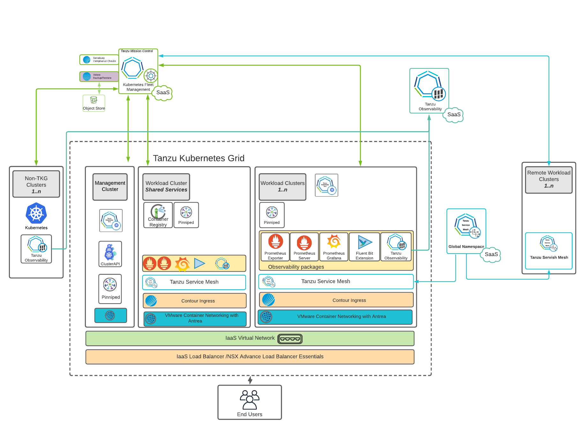

# VMware Tanzu for Kubernetes Operations on VMware Cloud on AWS Reference Design

Tanzu for Kubernetes Operations simplifies operating Kubernetes for multi-cloud deployment by centralizing management and governance for clusters and teams across on-premises, public clouds, and edge. Tanzu for Kubernetes Operations delivers an open source aligned Kubernetes distribution with consistent operations and management to support infrastructure and application modernization.

This document lays out a reference design for deploying VMware Tanzu for Kubernetes Operations on VMware Cloud on AWS.

**Note:** The scope of this document is limited to Tanzu Kubernetes Grid (multi-cloud), which is a customer-managed solution.

The following reference design is based on the architecture and components described in [VMware Tanzu for Kubernetes Operations Reference Architecture](index.md).



## Supported Component Matrix
The following table provides the component versions and interoperability matrix supported with the reference design:

| **Software Components**    | **Version**    |
| ---------------------------- | ---------------- |
| Tanzu Kubernetes Grid      | 1.5.1          |
| VMC on AWS SDDC Version    | 1.16 and later |
| NSX Advanced Load Balancer | 20.1.7         |

For up-to-date information about which software versions can be used together, check the Interoperability Matrix [here](https://interopmatrix.vmware.com/Interoperability?col=551,&row=648,%26789,).

## Benefits of running VMware Tanzu on VMware Cloud on AWS

VMware Cloud on AWS enables your IT and operations teams to add value to your investments in AWS by extending your on-premises VMware vSphere environments to the AWS cloud. VMware Cloud on AWS is an integrated cloud offering jointly developed by Amazon Web Services (AWS) and VMware. It is optimized to run on dedicated, elastic, bare-metal Amazon Elastic Compute Cloud (Amazon EC2) infrastructure and supported by VMware and its partners. To learn more about VMware Cloud on AWS, see [VMware Cloud on AWS Documentation](https://docs.vmware.com/en/VMware-Cloud-on-AWS/index.html).

VMware Cloud on AWS enables the following:

1. Cloud Migrations
2. Data Center Extension
3. Disaster Recovery
4. Next Generation Applications

By running VMware Tanzu within the same infrastructure as the general VM workloads enabled by the first three use cases, organizations can start their next generation application modernization strategy immediately without incurring additional cost.
For example, SDDC spare capacity can be used to run Tanzu Kubernetes Grid to enable next generation application modernization, or compute capacity not used by disaster recovery can be used for Tanzu Kubernetes Grid clusters.

The following additional benefits are enabled by the Elastic Network Interface that connects the VMware Cloud on AWS SDDC to the AWS services within the Amazon VPC:

- Enable developers to modernize existing enterprise apps with AWS cloud capabilities and services.
- Integrate modern application tools and frameworks to develop next generation applications.
- Remove egress charges as all traffic is internal of the Amazon availability zone.

## Tanzu Kubernetes Grid Components

VMware Tanzu Kubernetes Grid (TKG) provides organizations with a consistent, upstream-compatible, regional Kubernetes substrate that is ready for end-user workloads and ecosystem integrations. You can deploy Tanzu Kubernetes Grid across software-defined datacenters (SDDC) and public cloud environments, including vSphere, Microsoft Azure, and Amazon EC2.

Tanzu Kubernetes Grid comprises the following components:

- **Management Cluster -** A management cluster is the first element that you deploy when you create a Tanzu Kubernetes Grid instance. The management cluster is a Kubernetes cluster that performs the role of the primary management and operational center for the Tanzu Kubernetes Grid instance. The management cluster is purpose-built for operating the platform and managing the lifecycle of Tanzu Kubernetes clusters.
- **Tanzu Kubernetes Cluster -** Tanzu Kubernetes clusters are the Kubernetes clusters in which your application workloads run. These clusters are also referred to as workload clusters. Tanzu Kubernetes clusters can run different versions of Kubernetes, depending on the needs of the applications they run.
- **Shared Services Cluster -**  Each Tanzu Kubernetes Grid instance can have only one shared services cluster. You will deploy this cluster only if you intend to deploy shared services such as Contour and Harbor.
- **Cluster API -** Tanzu Kubernetes Grid functions through the creation of a Management Kubernetes cluster that houses [Cluster API](https://cluster-api.sigs.k8s.io/). The Cluster API then interacts with the infrastructure provider to service workload Kubernetes cluster lifecycle requests.
- **Tanzu Kubernetes Cluster Plans -** A cluster plan is a blueprint that describes the configuration with which to deploy a Tanzu Kubernetes cluster. It provides a set of configurable values that describe settings like the number of control plane machines, worker machines, VM types, and so on.

  The current release of Tanzu Kubernetes Grid provides two default templates, `dev` and `prod`.
- **Tanzu Kubernetes Grid Instance -** A Tanzu Kubernetes Grid instance is the full deployment of Tanzu Kubernetes Grid, including the management cluster, the workload clusters, and the shared services cluster that you configure.
- **Tanzu CLI -** A command-line utility that provides the necessary commands to build and operate Tanzu management and Tanzu Kubernetes clusters.
- **Bootstrap Machine -** The bootstrap machine is the laptop, host, or server on which you download and run the Tanzu CLI. This is where the initial bootstrapping of a management cluster occurs before it is pushed to the platform where it will run.
- **Tanzu Kubernetes Grid Installer -** The Tanzu Kubernetes Grid installer is a graphical wizard that you launch by running the `tanzu management-cluster create --ui` command. The installer wizard runs locally on the bootstrap machine and provides a user interface to guide you through the process of deploying a management cluster.

## Tanzu Kubernetes Grid Storage

Tanzu Kubernetes Grid integrates with shared datastores available in the vSphere infrastructure. The following types of shared datastores are supported:

- vSAN
- VMFS
- NFS
- vVols

Tanzu Kubernetes Grid uses storage policies to integrate with shared datastores. The policies represent datastores and manage the storage placement of such objects as control plane VMs, container images, and persistent storage volumes. vSAN storage policies are the only option available for VMware Cloud on AWS.

Tanzu Kubernetes Grid is agnostic about which storage option you choose. For Kubernetes stateful workloads, Tanzu Kubernetes Grid installs the [vSphere Container Storage interface (vSphere CSI)](https://github.com/container-storage-interface/spec) to automatically provision Kubernetes persistent volumes for pods.

[VMware vSAN](https://docs.vmware.com/en/VMware-vSAN/index.html) is a recommended storage solution for Tanzu Kubernetes Grid clusters.


| **Decision ID** | **Design Decision**      | **Design Justification**                                                                                   | **Design Implications**                                                  |
| ----------------- | -------------------------- | ------------------------------------------------------------------------------------------------------------ | -------------------------------------------------------------------------- |
| TKO-STG-001     | Use vSAN storage for TKO | By using vSAN as the shared storage solution, you can take advantage of more cost-effective local storage. | Minimizes storage platform complexity by standardizing on a single type. |

While the default vSAN storage policy can be used, administrators should evaluate the needs of their applications and craft a specific [vSphere Storage Policy](https://docs.vmware.com/en/VMware-vSphere/6.7/com.vmware.vsphere.storage.doc/GUID-89091D59-D844-46B2-94C2-35A3961D23E7.html). vSAN storage policies describe classes of storage (e.g. SSD, NVME, etc.) along with quotas for your clusters.


Starting with vSphere 7.0 environments with vSAN, the vSphere CSI driver for Kubernetes also supports the creation of NFS File Volumes, which support ReadWriteMany access modes. This allows for provisioning volumes, which can be read and written from multiple pods simultaneously. To support this, you must enable vSAN File Service.

**Note:** vSAN File Service is available only in the vSAN Enterprise and Enterprise Plus editions.

## Tanzu Kubernetes Clusters Networking

A Tanzu Kubernetes cluster provisioned by the Tanzu Kubernetes Grid supports two Container Network Interface (CNI) options:

- [Antrea](https://antrea.io/)
- [Calico](https://www.tigera.io/project-calico/)

Both are open-source software that provides networking for cluster pods, services, and ingress.

When you deploy a Tanzu Kubernetes cluster using Tanzu Mission Control or Tanzu CLI, Antrea CNI is automatically enabled in the cluster. To provision a Tanzu Kubernetes cluster using a non-default CNI, see the following instructions:

- [Deploy Tanzu Kubernetes clusters with calico](https://docs.vmware.com/en/VMware-Tanzu-Kubernetes-Grid/1.5/vmware-tanzu-kubernetes-grid-15/GUID-tanzu-k8s-clusters-networking.html#calico).
- [Implement Multiple Pod Network Interfaces with Multus](https://docs.vmware.com/en/VMware-Tanzu-Kubernetes-Grid/1.5/vmware-tanzu-kubernetes-grid-15/GUID-packages-cni-multus.html).

Each CNI is suitable for a different use case. The following table lists some common use cases for the three CNIs that Tanzu Kubernetes Grid supports. This table will help you select the most appropriate CNI for your Tanzu Kubernetes Grid implementation.


| **CNI** | **Use Case** | **Pros and Cons** |
| ----- | ----- | ----- |
| Antrea  |Enable Kubernetes pod networking with IP overlay networks using VXLAN or Geneve for encapsulation. Optionally encrypt node-to-node communication using IPSec packet encryption.</br>Antrea supports advanced network use cases like kernel bypass and network service mesh. |Pros</br>- Antrea leverages Open vSwitch as the networking data plane. Open vSwitch supports both Linux and Windows.</br>- VMware supports the latest conformant Kubernetes and stable releases of Antrea.|
| Calico  |Calico is used in environments where factors like network performance, flexibility, and power are essential.</br> For routing packets between nodes, Calico leverages the BGP routing protocol instead of an overlay network. This eliminates the need to wrap packets with an encapsulation layer, resulting in increased network performance for Kubernetes workloads. | Pros</br>- Support for Network Policies</br>- High network performance</br>- SCTP Support <p></p>Cons</br> - No multicast support |
| Multus  | Multus CNI can give multiple interfaces per each Kubernetes pod. Using Multus CRDs, you can specify which pods get which interfaces and allow different interfaces depending on the use case. | Pros</br>- Separation of data/control planes.</br>- Separate security policies can be used for separate interfaces. </br>- Supports SR-IOV, DPDK, OVS-DPDK & VPP workloads in Kubernetes with both cloud-native and NFV-based applications in Kubernetes. |

## Tanzu Kubernetes Grid Infrastructure Networking

You can deploy Tanzu Kubernetes Grid on various networking stacks, including:

- VMware NSX-T Data Center Networking.
- vSphere Networking (VDS) with NSX Advanced Load Balancer.

**Note:** The scope of this document is limited to VMware NSX-T Data Center Networking with NSX Advanced Load Balancer.

## Tanzu Kubernetes Grid on NSX-T Networking with NSX Advanced Load Balancer

When deployed on VMware NSX-T Networking, Tanzu Kubernetes Grid uses the NSX-T logical segments and gateways to provide connectivity to Kubernetes control plane VMs, worker nodes, services, and applications. All hosts from the cluster where Tanzu Kubernetes clusters are deployed are configured as NSX-T Transport nodes, which provide network connectivity to the Kubernetes environment.

Tanzu Kubernetes Grid leverages NSX Advanced Load Balancer to provide L4 load balancing for the Tanzu Kubernetes clusters control plane HA and L7 ingress to the applications deployed in the Tanzu Kubernetes clusters. Users access the applications by connecting to the Virtual IP address (VIP) of the applications provisioned by NSX Advanced Load Balancer.

## NSX Advanced Load Balancer Components

NSX Advanced Load Balancer is deployed in **No-Orchestrator** mode in VMC on AWS environment because the `cloudadmin` user does not have all required permissions to perform write operations to the vCenter API, which is essential. Therefore, the NSX Advanced Load Balancer controller cannot orchestrate the deployment of service engines.

NSX Advanced Load Balancer service engines must be deployed before load balancing services can be requested by Kubernetes.

The following are the core components of NSX Advanced Load Balancer:

- **NSX Advanced Load Balancer Controller** - NSX Advanced Load Balancer Controller manages Virtual Service objects and interacts with the vCenter Server infrastructure to manage the lifecycle of the service engines (SEs). It is the central repository for the configurations and policies related to services and management and provides the portal for viewing the health of virtual services and SEs and the associated analytics provided by NSX Advanced Load Balancer.
- **NSX Advanced Load Balancer Service Engine** - The Service Engines (SEs) are lightweight VMs that handle all data plane operations by receiving and executing instructions from the controller. The SEs perform load balancing and all client- and server-facing network interactions.
- **Avi Kubernetes Operator (AKO)** - An Avi Kubernetes operator runs as a pod in the management cluster and Tanzu Kubernetes clusters and provides ingress and load balancing functionality. AKO translates the required Kubernetes objects to NSX Advanced Load Balancer objects and automates the implementation of ingresses/routes/services on the Service Engines (SE) via the NSX Advanced Load Balancer Controller.
- **AKO Operator (AKOO)** - The AKO operator takes care of deploying, managing, and removing AKO from Kubernetes clusters. When deployed, this operator creates an instance of the AKO controller and installs all the relevant objects, including:

  - AKO `StatefulSet`
  - `ClusterRole` and `ClusterRoleBinding
  - `ConfigMap` (required for the AKO controller and other artifacts)

Tanzu Kubernetes Grid management clusters have an AKO operator installed out-of-the-box during cluster deployment. By default, a Tanzu Kubernetes Grid management cluster has a couple of `AkoDeploymentConfig` objects created, which dictate when and how AKO pods are created in the workload clusters. For more information on the AKO operator, see the [VMware documentation](https://github.com/vmware/load-balancer-and-ingress-services-for-kubernetes/tree/master/ako-operator).

Each environment configured in NSX Advanced Load Balancer is referred to as a _cloud_. Each cloud in NSX Advanced Load Balancer maintains networking and NSX Advanced Load Balancer Service Engine settings. The cloud is configured with one or more VIP networks to provide IP addresses to load balancing (L4/L7) virtual services created under that cloud.

The virtual services can be spanned across multiple Service Engines if the associated Service Engine Group is configured in Active/Active HA mode. A Service Engine can belong to only one Service Engine group at a time.

IP address allocation for virtual services can be over DHCP or via NSX Advanced Load Balancer in-built IPAM functionality. The VIP networks created/configured in NSX Advanced Load Balancer are associated with the IPAM profile.

## Network Architecture

For deployment of Tanzu Kubernetes Grid in VMware Cloud on AWS SDDCs, separate segments are built for the Tanzu Kubernetes Grid management cluster, Tanzu Kubernetes Grid shared services cluster, Tanzu Kubernetes Grid workload clusters, NSX Advanced Load Balancer management, Cluster-VIP segment for control plane HA, Tanzu Kubernetes Grid Mgmt VIP/Data segment, and Tanzu Kubernetes Grid workload Data/VIP segment.

The network reference design can be mapped into this general framework.


This topology provides the following benefits:

- Isolates and separates SDDC management components (vCenter, ESX) from the Tanzu Kubernetes Grid components.  This reference design allows only minimum connectivity between the Tanzu Kubernetes Grid clusters and NSX Advanced Load Balancer and the vCenter Server.
- Isolates and separates the NSX Advanced Load Balancer management network segment from the Tanzu Kubernetes Grid management segment and the Tanzu Kubernetes Grid workload segments.
- Depending on the workload cluster type and use case, multiple workload clusters can leverage the same logical segments or new segments can be used for each workload cluster.
  To isolate and separate Tanzu Kubernetes Grid workload cluster networking from each other, VMware recommends that you use separate logical segments for each workload cluster and configure the required firewall between these networks. See [Firewall Recommendations](#firewall) for more details.
- Separates provider and tenant access to the Tanzu Kubernetes Grid environment.
  - Only provider administrators need access to the Tanzu Kubernetes Grid management cluster. Allowing only administrators to access the Tanzu Kubernetes Grid management cluster prevents tenants from attempting to connect to the Tanzu Kubernetes Grid management cluster.

### Network Requirements

As per the defined architecture, the list of required networks includes:


| **Network Type**                | **DHCP Service** | <p>**Description & Recommendations**</p><p></p>                                                                                                                                             |
| --------------------------------- | ------------------ | --------------------------------------------------------------------------------------------------------------------------------------------------------------------------------------------- |
| NSX ALB Management Network      | Optional         | <p>NSX ALB controllers and SEs will be attached to this network. </p><p><br>DHCP is not a mandatory requirement on this network as NSX ALB can handle IPAM services for a given network</p> |
| TKG Management Network          | Yes              | Control plane and worker nodes of TKG Management Cluster clusters will be attached to this network                                                                                          |
| TKG Shared Service Network      | Yes              | Control plane and worker nodes of TKG Shared Service Cluster will be attached to this network.                                                                                              |
| TKG Workload Network            | Yes              | Control plane and worker nodes of TKG Workload Clusters will be attached to this network.                                                                                                   |
| TKG Cluster VIP/Data Network    | No               | Virtual services for Control plane HA of all TKG clusters (management, shared service, and workload).                                                                                       |
| TKG Management VIP/Data Network | No               | Virtual services for all user-managed packages (such as Contour and Harbor) hosted on the shared service cluster.                                                                           |
| TKG Workload VIP/Data Network   | No               | Virtual services for all applications hosted on the Workload clusters.                                                                                                                      |

### Subnet and CIDR Examples

For the purpose of demonstration, this document makes use of the following Subnet CIDR for deployment.


| **Network Type**            | **Segment Name**   | **Gateway CIDR** | **DHCP Pool**                 | **NSX ALB IP Pool**           |
| ----------------------------- | -------------------- | ------------------ | ------------------------------- | ------------------------------- |
| NSX ALB Mgmt Network        | NSX-ALB-Mgmt       | 192.168.11.1/27  | 192.168.11.15 - 192.168.11.20 | 192.168.11.21 - 192.168.11.30 |
| TKG Management Network      | TKG-Management     | 192.168.12.1/24  | 192.168.12.2 - 192.168.12.251 | NA                            |
| TKG Workload Network        | TKG-Workload-PG01  | 192.168.13.1/24  | 192.168.13.2 - 192.168.13.251 | NA                            |
| TKG Cluster VIP Network     | TKG-Cluster-VIP    | 192.168.14.1/26  | NA                            | 192.168.14.2 - 192.168.14.60  |
| TKG Mgmt VIP Network        | TKG-SS-VIP         | 192.168.15.1/26  | NA                            | 192.168.15.2 - 192.168.15.60  |
| TKG Workload VIP Network    | TKG-Workload-VIP   | 192.168.16.1/26  | NA                            | 192.168.16.2 - 192.168.16.60  |
| TKG Shared Services Network | TKG-Shared-Service | 192.168.17.1/24  | 192.168.17.2 - 192.168.17.251 |                               |

### <a id=firewall></a>Firewall Recommendations

To prepare the firewall, you need to gather the following:

1. NSX ALB Controller nodes and Cluster IP address.
2. NSX ALB Management Network CIDR.
3. TKG Management Network CIDR
4. TKG Shared Services Network CIDR
5. TKG Workload Network CIDR
6. TKG Cluster VIP Address Range
7. TKG Management VIP Address Range
8. TKG Workload VIP Address Range
9. Client Machine IP Address
10. Bootstrap machine IP Address
11. Harbor registry IP address
12. vCenter Server IP.
13. DNS server IP(s).
14. NTP Server(s).

The following table provides a list of firewall rules based on the assumption that there is no firewall within a subnet/VLAN.


| **Source**                                                                                                                 | **Destination**                                  | **Protocol:Port**               | **Description**                                                                           |
| ---------------------------------------------------------------------------------------------------------------------------- | -------------------------------------------------- | --------------------------------- | ------------------------------------------------------------------------------------------- |
| Client Machine                                                                                                             | NSX ALB Controller nodes and cluster IP address. | TCP:443                         | To access NSX ALB portal for configuration.                                               |
| Client Machine                                                                                                             | vCenter Server                                   | TCP:443                         | To create resource pools, VM folders, etc, in vCenter.                                    |
| <p>Bootstrap Machine</p><p></p>                                                                                            | projects.registry.vmware.com                     | TCP:443                         | To pull binaries from VMware public repo for TKG installation.                            |
| <p>TKG Management Network CIDR</p><p></p><p>TKG shared services network CIDR.</p><p></p><p>TKG workload network CIDR.</p>  | <p>DNS Server</p><p><br>NTP server</p>           | <p>UDP:53</p><p><br>UDP:123</p> | <p>DNS service </p><p><br>Time synchronization</p>                                        |
| <p>TKG Management Network CIDR</p><p></p><p>TKG shared services network CIDR.</p><p></p><p>TKG workload network CIDR.</p>  | vCenter IP                                       | TCP:443                         | Allows components to access vCenter to create VMs and storage volumes                     |
| <p>TKG Management Network CIDR.</p><p></p><p>TKG shared services network CIDR.</p><p></p><p>TKG workload network CIDR.</p> | TKG Cluster VIP Range.                           | TCP:6443                        | For management cluster to configure shared services and workload clusters.                |
| <p>TKG Management Network </p><p></p><p>TKG shared services network</p><p></p><p>TKG workload networks</p>                 | Internet                                         | TCP:443                         | For interaction with Tanzu Mission Control, Tanzu Observability, and Tanzu Service Mesh.  |
| <p>TKG Management Network </p><p></p><p>TKG shared services network</p><p></p><p>TKG workload networks</p>                 | NSX ALB Controllers and cluster IP address.      | TCP:443                         | Allow Avi Kubernetes Operator (AKO) and AKO Operator (AKOO) access to NSX ALB Controller. |
| NSX ALB Controllers.                                                                                                       | vCenter and ESXi Hosts                           | TCP:443                         | Allow NSX ALB to discover vCenter objects and deploy SEs as required                      |
| NSX ALB Management Network CIDR.                                                                                           | <p>DNS server</p><p>NTP server</p>               | <p>UDP:53</p><p>UDP:123</p>     | <p>DNS service</p><p>Time synchronization</p>                                             |

**Optional Firewall Rules**


| **Source**                                                                                                                | **Destination**                                                                                         | **Protocol:Port**           | **Description**                                                                                                                                                                                                                         |
| --------------------------------------------------------------------------------------------------------------------------- | --------------------------------------------------------------------------------------------------------- | ----------------------------- | ----------------------------------------------------------------------------------------------------------------------------------------------------------------------------------------------------------------------------------------- |
| <p>TKG Management Network CIDR</p><p></p><p>TKG shared services network CIDR.</p><p></p><p>TKG workload network CIDR.</p> | <p>Harbor Registry</p><p></p><p>(optional)</p>                                                          | TCP:443                     | Allows components to retrieve container images from a local image registry.                                                                                                                                                             |
| <p>Client Machine</p><p></p>                                                                                              | <p>console.cloud.vmware.com</p><p>\*.tmc.cloud.vmware.com</p><p></p><p>projects.registry.vmware.com</p> | TCP:443                     | <p>To access Cloud Services portal to configure networks in VMC SDDC.</p><p>To access the TMC portal for TKG clusters registration and other SaaS integration.</p><p>To pull binaries from VMware public repo for TKG installation.</p> |
| Client Machine                                                                                                            | <p>TKG Management VIP Range.</p><p>TKG Workload VIP Range.</p>                                          | <p>TCP:80</p><p>TCP:443</p> | To http/https workloads in shared services and workload cluster.                                                                                                                                                                        |

## Installation Experience

Tanzu Kubernetes Grid management cluster is the first component that you deploy to get started with Tanzu Kubernetes Grid.

There are two ways to deploy the management cluster:

1. Run the Tanzu Kubernetes Grid installer, a wizard interface that guides you through the process of deploying a management cluster. VMware recommends this method if you are installing a Tanzu Kubernetes Grid Management cluster for the first time.
2. Create and edit YAML configuration files to use with CLI commands to deploy the management cluster.

The Tanzu Kubernetes Grid Installation user interface shows that, in the current version, it is possible to install Tanzu Kubernetes Grid on vSphere (including VMware Cloud on AWS), AWS EC2, and Microsoft Azure. The UI provides a guided experience tailored to the IaaS, in this case on VMware Cloud on AWS.


The installation of Tanzu Kubernetes Grid on VMware Cloud on AWS is done through the same UI as mentioned above but tailored to a vSphere environment.


This installation process takes you through setting up **TKG Management Cluster** on your vSphere environment. Once the management cluster is deployed, you can register the management cluster with Tanzu Mission Control and deploy Tanzu Kubernetes shared services and workload clusters directly from the  [Tanzu Mission Control](https://tanzu.vmware.com/mission-control) UI or Tanzu CLI to deploy Tanzu Kubernetes shared service and workload clusters.

## Design Recommendations

### NSX Advanced Load Balancer Recommendations

The following table provides the recommendations for configuring NSX ALB for Tanzu Kubernetes Grid deployment in a VMC on AWS environment.


| **Decision ID** | **Design Decision**                                                                                     | **Design Justification**                                                                                                                       | **Design Implications**                                                                                                                                                                                                                                                                                     |
| ----------------- | --------------------------------------------------------------------------------------------------------- | ------------------------------------------------------------------------------------------------------------------------------------------------ | ------------------------------------------------------------------------------------------------------------------------------------------------------------------------------------------------------------------------------------------------------------------------------------------------------------- |
| TKO-ALB-001     | Deploy NSX ALB controller cluster nodes on a segment dedicated to NSX-ALB                               | Isolate NSX ALB traffic from infrastructure management traffic and Kubernetes workloads.                                                       | Using the same network for NSX ALB Controller Cluster nodes allows for configuring a floating cluster IP address that will be assigned to the cluster leader.                                                                                                                                               |
| TKO-ALB-002     | Deploy 3 NSX ALB controllers nodes.                                                                     | To achieve high availability for the NSX ALB platform.                                                                                         | In clustered mode, NSX ALB availability is not impacted by an individual controller node failure.                                                                                                                                                                                                           |
| TKO-ALB-003     | Use static IPs for the NSX ALB controllers if DHCP cannot guarantee a permanent lease.                  | NSX ALB Controller cluster uses management IPs to form and maintain the quorum for the control plane cluster. Any changes would be disruptive. | NSX ALB Controller control plane might go down if the management IPs of the controller node changes.                                                                                                                                                                                                        |
| TKO-ALB-004     | Connect Service Engines to VIP networks and Server networks manually.                                   | NSX ALB Service Engine deployment is manual in VMC on AWS.                                                                                     | The controllers can’t reconfigure Service Engines for network connectivity when virtual services are created.                                                                                                                                                                                              |
| TKO-ALB-005     | Reserve an IP in the NSX ALB management subnet to be used as the cluster IP for the controller cluster. | The NSX ALB portal is always accessible over the cluster IP even if a specific individual controller node fails.                               | NSX ALB administration is not affected by the failure of an individual controller node.                                                                                                                                                                                                                     |
| TKO-ALB-006     | Use separate VIP networks per TKC for application load balancing.                                       | Separate dev/test and prod workloads L7 load balancing traffic.                                                                                | Install AKO in TKG clusters manually by creating`AkodeploymentConfig`.                                                                                                                                                                                                                                      |
| TKO-ALB-007     | Create separate SE Groups for TKG management and workload clusters.                                     | This allows isolating load balancing traffic of the management and shared services cluster from workload clusters.                             | <p>Create dedicated Service Engine Groups under the no-orchestrator cloud configured manually.</p><p></p><p></p><p></p>                                                                                                                                                                                     |
| TKO-ALB-018     | Share Service Engines for the same type of workload (dev/test/prod)clusters.                            | Minimize the licensing cost                                                                                                                    | <p>Each Service Engine contributes to the CPU core capacity associated with a license.</p><p></p><p>An SE group can be shared by any number of workload clusters as long as the sum of the number of distinct cluster node networks and the number of distinct cluster VIP networks is not more than 8.</p> |
| TKO-ALB-009     | Enable DHCP in the No-Orchestrator cloud.                                                               | Reduce the administrative overhead of manually configuring IP pools for the networks where DHCP is available.                                  |                                                                                                                                                                                                                                                                                                             |

### Network Recommendations

The following are the key network recommendations for a production-grade Tanzu Kubernetes Grid on VMC deployment:


| **Decision ID** | **Design Decision**                                               | **Design Justification**                                                                  | **Design Implications**                                                                                                |
| ----------------- | ------------------------------------------------------------------- | ------------------------------------------------------------------------------------------- | ------------------------------------------------------------------------------------------------------------------------ |
| TKO-NET-001     | Use separate networks for TKG management and workload clusters.   | To have a flexible firewall and security policies                                         | Sharing the same network for multiple clusters can complicate the creation of firewall rules.                          |
| TKO-NET-002     | Use separate networks for workload clusters based on their usage. | Isolate production Kubernetes clusters from dev/test clusters.                            | <p>A separate set of Service Engines can be used to separate dev/test workload clusters from prod clusters.</p><p></p> |
| TKO-NET-003     | Configure DHCP for TKG clusters.                                  | Tanzu Kubernetes Grid does not support static IP assignments for Kubernetes VM components | Enable DHCP on the logical segments that will be used to host TKG clusters.                                            |

### Tanzu Kubernetes Grid Cluster Recommendations


| **Decision ID** | **Design Decision**                                        | **Design Justification**                                                                                                            | **Design Implications**                                                                                                                                                                                                                                                                  |
| ----------------- | ------------------------------------------------------------ | ------------------------------------------------------------------------------------------------------------------------------------- | ------------------------------------------------------------------------------------------------------------------------------------------------------------------------------------------------------------------------------------------------------------------------------------------ |
| TKO-TKG-001     | Deploy TKG management cluster from TKG installer UI        | Simplified method of installation.                                                                                                  | <p>When you deploy a management cluster by using the installer interface, it populates a cluster configuration file for the management cluster with the required parameters. </p><p></p><p>You can use the created configuration file as a model for future deployments from the CLI</p> |
| TKO-TKG-002     | Register TKG Management cluster with Tanzu Mission Control | Tanzu Mission Control automates the creation of the Tanzu Kubernetes clusters and manages the life cycle of all clusters centrally. | Tanzu Mission Control also automates the deployment of Tanzu Packages in all Tanzu Kubernetes clusters associated with TMC.                                                                                                                                                              |
| TKO-TKG-003     | Use NSX ALB as your Control Plane endpoint provider.       | Eliminates the requirement for the external load balancer and additional configuration changes in TKG clusters configuration.       | NSX ALB is a true SDN solution and offers a flexible deployment model and automated way of scaling load balancer objects when needed.                                                                                                                                                    |
| TKO-TKG-004     | Deploy Tanzu Kubernetes clusters in large form factor      | Allow TKG clusters integration with Tanzu SaaS components (Tanzu Mission Control, Tanzu Observability, and Tanzu Service Mesh)      | <p>TKG shared services and workload clusters also hosts tanzu packages such as cert-manager, contour, harbor, etc. </p><p></p>                                                                                                                                                           |
| TKO-TKG-005     | Deploy Tanzu Kubernetes clusters with Prod plan.           | This deploys multiple control plane nodes and provides High Availability for the control plane.                                     | TKG infrastructure is not impacted by single node failure.                                                                                                                                                                                                                               |
| TKO-TKG-006     | Enable Identity Management for TKG clusters.               | This avoids usage of admin credentials and ensures required users with the right roles have access to TKG clusters.                 | The pinniped package helps with integrating TKG with LDAPS/OIDC Authentication.                                                                                                                                                                                                          |
| TKO-TKG-007     | Enable Machine Health Checks for TKG clusters              | vSphere HA and Machine Health Checks interoperably work together to enhance workload resiliency                                     | A MachineHealthCheck is a resource within the Cluster API that allows users to define conditions under which Machines within a Cluster should be considered unhealthy. Remediation actions can be taken when MachineHealthCheck has identified a node as unhealthy.                      |

## Kubernetes Ingress Routing

The default installation of Tanzu Kubernetes Grid does not install an ingress controller. Users can install Contour (available for installation through Tanzu Packages) or any third-party ingress controller of their choice.

Contour is an open-source controller for Kubernetes Ingress routing. Contour can be installed in the shared services cluster on any Tanzu Kubernetes Cluster. Deploying Contour is a prerequisite if you want to deploy the Prometheus, Grafana, and Harbor Packages on a workload cluster.

For more information about Contour, see [Contour](https://projectcontour.io/) site and [Implementing Ingress Control with Contour](https://docs.vmware.com/en/VMware-Tanzu-Kubernetes-Grid/1.5/vmware-tanzu-kubernetes-grid-15/GUID-packages-ingress-contour.html).

Another option for ingress control is to use the NSX Advanced Load Balancer Kubernetes ingress controller which offers an advanced L7 ingress for containerized applications that are deployed in the Tanzu Kubernetes workload cluster.


For more information about the NSX ALB ingress controller, see the [official documentation](https://avinetworks.com/docs/ako/1.5/avi-kubernetes-operator/).

[Tanzu Service Mesh](https://tanzu.vmware.com/service-mesh), an SaaS offering for modern applications running across multi-cluster, multi-clouds, also offers an ingress controller based on [Istio](https://istio.io/).

Each ingress controller has its own pros and cons. The following table provides general recommendations for choosing an ingress controller for your Kubernetes environment.


| **Ingress Controller**     |                                                                                                                                                                                                                                                                   **Use Cases** |
| ---------------------------- | --------------------------------------------------------------------------------------------------------------------------------------------------------------------------------------------------------------------------------------------------------------------------------: |
| Contour                    | <p>Use contour when only north-south traffic is needed in a Kubernetes cluster. You can apply security policies for north-south traffic by defining the policies in the applications manifest file.</p><p></p><p>It's a reliable solution for simple Kubernetes workloads. </p> |
| Istio                      |                                                                     Use Istio ingress controller when you intend to provide security, traffic direction, and insight within the cluster (east-west traffic) and between the cluster and the outside world (north-south traffic) |
| NSX ALB Ingress controller |                                                               <p>Use NSX ALB ingress controller when a containerized application requires features like local and global server load balancing (GSLB), web application firewall (WAF), performance monitoring, etc. </p><p></p> |

## Container Registry

VMware Tanzu for Kubernetes Operations using Tanzu Kubernetes Grid include Harbor as a container registry. Harbor provides a location for pushing, pulling, storing, and scanning container images used in your Kubernetes clusters.

Harbor registry is used for day2 operations of the Tanzu Kubernetes workload clusters. Typical day-2 operations include tasks such as pulling images from the harbor for application deployment, pushing custom images to Harbor, etc.

There are three main supported installation methods for Harbor:

- [**Tanzu Kubernetes Grid Package deployment**](https://docs.vmware.com/en/VMware-Tanzu-Kubernetes-Grid/1.5/vmware-tanzu-kubernetes-grid-15/GUID-packages-harbor-registry.html) on a Tanzu Kubernetes Grid shared service cluster. Tanzu Kubernetes Grid includes signed binaries for Harbor, which you can deploy into a shared services cluster to provide container registry services for other Tanzu Kubernetes (workload) clusters. This installation method is recommended for general use cases.
- [**Helm-based deployment**](https://goharbor.io/docs/2.4.0/install-config/harbor-ha-helm/) to a Kubernetes cluster - this installation method may be preferred for customers already invested in Helm.
- [**VM-based deployment**](https://goharbor.io/docs/2.1.0/install-config/installation-prereqs/) using Docker Compose. VMware recommends this installation method when Tanzu Kubernetes Grid is installed in an air-gapped environment and there are no pre-existing Kubernetes clusters on which to install Harbor.


## Logging

Fluent Bit is a lightweight log processor and forwarder that allows you to collect data and logs from different sources, unify them, and send them to multiple destinations. Tanzu Kubernetes Grid includes signed binaries for Fluent Bit, that you can deploy on management clusters and on Tanzu Kubernetes clusters to provide a log-forwarding service.

Fluent Bit integrates with logging platforms such as vRealize LogInsight, Elasticsearch, Kafka, Splunk, or an HTTP endpoint. Details on configuring Fluent Bit to your logging provider can be found in the documentation [here](https://docs.vmware.com/en/VMware-Tanzu-Kubernetes-Grid/1.5/vmware-tanzu-kubernetes-grid-15/GUID-packages-logging-fluentbit.html).

You can deploy Fluent Bit on any management cluster or Tanzu Kubernetes clusters from which you want to collect logs. First, you configure an output plugin on the cluster from which you want to gather logs, depending on the endpoint that you use. Then, you deploy Fluent Bit on the cluster as a package.

vRealize Log Insight (vRLI) provides real-time log management and log analysis with machine learning-based intelligent grouping, high-performance searching, and troubleshooting across physical, virtual, and cloud environments. vRLI already has a deep integration with the vSphere platform where you can get key actionable insights.

The vRealize Log Insight appliance is available as a separate on-premises deployable product. You can also choose to go with the SaaS version vRealize Log Insight Cloud.

## Tanzu Kubernetes Grid and Tanzu SaaS Integration

The SaaS products in the VMware Tanzu portfolio are in the critical path for securing systems at the heart of your IT infrastructure. VMware Tanzu Mission Control provides a centralized control plane for Kubernetes, and Tanzu Service Mesh provides a global control plane for service mesh networks. Tanzu Observability provides Kubernetes monitoring, Application observability and Service insights.

To learn more about Tanzu Kubernetes Grid integration with Tanzu SaaS, see [Tanzu SaaS Services](tko-saas.md)

### Customize Tanzu Observability Dashboards

Tanzu Observability provides various out-of-the-box dashboards. You can customize the dashboards for your particular deployment. For information on how to customize Tanzu Observability dashboards for Tanzu for Kubernetes Operations, see [Customize Tanzu Observability Dashboard for Tanzu for Kubernetes Operations](../deployment-guides/tko-to-customized-dashboard.md).

## Summary

Tanzu on VMware Cloud on AWS offers high-performance potential, convenience, and addresses the challenges of creating, testing, and updating Kubernetes platforms in a consolidated production environment. This validated approach will result in a production quality installation with all the application services needed to serve combined or uniquely separated workload types via a combined infrastructure solution.

This plan meets many Day 0 needs for aligning product capabilities, such as configuring firewall rules, networking, load balancing, and workload compute, to the full stack infrastructure.

## Deployment Instructions

For instructions on how to deploy this reference design, see [Deploy Tanzu for Kubernetes Operations in VMware Cloud on AWS](../deployment-guides/tko-in-vmc-aws.md).

## Supplemental Information

### Automating Deployment of Service Engines

As discussed, Avi Vantage is installed in No Orchestrator mode on VMWare Cloud on AWS. Therefore, the deployment of service engines (SE) on VMware Cloud on AWS is not orchestrated by the Avi Controller. Once SE is integrated with the Avi Controller, virtual service placement and scaling can be handled centrally from the Avi Controller. A pair of service engines provide HA for load balancing.

It is troublesome to manually deploy a pair of service engines for each tenant using the Import OVA workflow in VMware Cloud on AWS. Therefore, we recommend using `GOVC` in conjunction with Python to obtain the OVF properties as a JSON file and then customizing the JSON file for each service engine.

The following example JSON file can be used to automate the provisioning of service engines ready for use with Tanzu Kubernetes Grid.

<!-- /* cSpell:disable */ -->

```json
{
  "DiskProvisioning": "flat",
  "IPAllocationPolicy": "fixedPolicy",
  "IPProtocol": "IPv4",
  "PropertyMapping": [
    {
      "Key": "AVICNTRL",
      "Value": "<ip-address-of-avi-controller>"
    },

    {
      "Key": "AVISETYPE",
      "Value": "NETWORK_ADMIN"
    },
    {
      "Key": "AVICNTRL_AUTHTOKEN",
      "Value": "<avi-controller-auth-token>"
    },
    {
      "Key": "AVICNTRL_CLUSTERUUID",
      "Value": "<avi-controller-cluster-id>"
    },
    {
      "Key": "avi.mgmt-ip.SE",
      "Value": "<management-ip-address-of-service-engine>"
    },
    {
      "Key": "avi.mgmt-mask.SE",
      "Value": "255.255.255.0"
    },
    {
      "Key": "avi.default-gw.SE",
      "Value": "<avi-management-network-gateway>"
    },
    {
      "Key": "avi.DNS.SE",
      "Value": "<dns-server>"
    },
    {
      "Key": "avi.sysadmin-public-key.SE",
      "Value": ""
    }
  ],
  "NetworkMapping": [
    {
      "Name": "Management",
      "Network": "avi-management"
    },
    {
      "Name": "Data Network 1",
      "Network": "<tkg-workload-1-cluster-network-segment-name>"
    },
    {
      "Name": "Data Network 2",
      "Network": "<tkg-workload-2-cluster-network-segment-name>"
    },
    {
      "Name": "Data Network 3",
      "Network": "<tkg-workload-3-cluster-network-segment-name>"
    },
    {
      "Name": "Data Network 4",
      "Network": "<tkg-workload-4-cluster-network-segment-name>"
    },
    {
      "Name": "Data Network 5",
      "Network": "<tkg-workload-5-cluster-network-segment-name>"
    },
    {
      "Name": "Data Network 6",
      "Network": "<tkg-workload-6-cluster-network-segment-name>"
    },
    {
      "Name": "Data Network 7",
      "Network": "<tkg-workload-7-cluster-network-segment-name>"
    },
    {
      "Name": "Data Network 8",
      "Network": "<tkg-workload-8-cluster-network-segment-name>"
    },
    {
      "Name": "Data Network 9",
      "Network": "<tkg-workload-9-cluster-network-segment-name>"
    }
  ],
  "MarkAsTemplate": false,
  "PowerOn": true,
  "InjectOvfEnv": false,
  "WaitForIP": false,
  "Name": "se-1"
}
```

<!-- /* cSpell:enable */ -->

Provision each service engine using the following code.

<!-- /* cSpell:disable */ -->

```bash
export GOVC_URL=<fqdn-of-vcenter-in-vmware-cloud-on-aws>
export GOVC_USERNAME=cloudadmin@vmc.local
export GOVC_PASSWORD=<clouadmin@vmc.local-password>
export GOVC_INSECURE=false
govc import.spec /home/admin/se.ova | python -m json.tool > se-1.json
govc import.ova -pool=*/Resources/Compute-ResourcePool/TKG/SEs -ds=WorkloadDatastore --options=/home/admin/se-1.json /home/admin/se.ova
```

<!-- /* cSpell:enable */ -->

This deploys a new service engine with a VM name of `_se-1_` into the resource pool `_Compute-ResourcePool/TKG/SEs_`. Since the  `_PowerOn_` parameter is set to `_true_`, the service engine will boot up automatically and since we have set the key value pairs for the following, the service engine is automatically registered with Avi Controller and is ready for further configuration in Avi Vantage:

<!-- /* cSpell:disable */ -->

```bash
"Key": "AVICNTRL",
"Value": "<ip-address-of-avi-controller>"
"Key": "AVICNTRL_CLUSTERUUID",
"Value": "<avi-controller-cluster-id>"
"Key": "avi.mgmt-ip.SE",
"Value": "<management-ip-address-of-service-engine>"
```

<!-- /* cSpell:enable */ -->

### NSX Advanced Load Balancer Sizing Guidelines

#### Controller Sizing Guidelines

Controllers are classified into the following categories:


| **Classification** | **vCPUs** | **Memory (GB)** |
| -------------------- | ----------- | ----------------- |
| Small              | 8-15      | 24-32           |
| Medium             | 16-23     | 32-48           |
| Large              | >24       | >48             |

The number of virtual services that can be deployed per controller cluster is directly proportional to the controller cluster size. See the NSX Advanced Load Balancer [Configuration Maximum guide](https://configmax.esp.vmware.com/guest?vmwareproduct=NSX%20Advanced%20Load%20Balancer&release=21.1.3&categories=119-0c) for more information.

#### Service Engine Sizing Guidelines

The Service Engines can be configured with a minimum of 1 vCPU core and 1 GB RAM up to a maximum of 64 vCPU cores and 256 GB RAM. The following table provides guidance for sizing a Service Engine VM with regards to performance:


| **Performance metric**   | **Per core performance** | **Maximum performance on a single Service Engine VM** |
| -------------------------- | -------------------------- | ------------------------------------------------------- |
| HTTP Throughput          | 5 Gbps                   | 7 Gbps                                                |
| HTTP requests per second | 50k                      | 175k                                                  |
| SSL Throughput           | 1 Gbps                   | 7 Gbps                                                |
| SSL TPS (RSA2K)          | 750                      | 40K                                                   |
| SSL TPS (ECC)            | 2000                     | 40K                                                   |

Multiple performance vectors or features may have an impact on performance. For instance, to achieve 1 Gb/s of SSL throughput and 2000 TPS of SSL with EC certificates, NSX Advanced Load Balancer recommends two cores.

Service Engines can be deployed in Active/Active or Active/Standby mode depending on the license tier used. The NSX Advanced Load Balancer Essentials license does not support Active/Active HA mode for Service Engines.


| **Decision ID** | **Design Decision**                          | **Design Justification**                                          | **Design Implications**                                                                                                                  |
| ----------------- | ---------------------------------------------- | ------------------------------------------------------------------- | ------------------------------------------------------------------------------------------------------------------------------------------ |
| TKO-ALB-SE-001  | Configure the High Availability mode for SEs | To mitigate a single point of failure for the NSX ALB data plane. | High Availability for Service Engines is configured via setting the Elastic HA mode to Active/Active or N+M in the Service Engine Group. |

### <a id=appendix-b></a> Configure Node Sizes

The Tanzu CLI creates the individual nodes of management clusters and Tanzu Kubernetes clusters according to settings that you provide in the configuration file. On vSphere, you can configure all node VMs to have the same predefined configurations, set different predefined configurations for control plane and worker nodes, or customize the configurations of the nodes. By using these settings, you can create clusters that have nodes with different configurations to the management cluster nodes. You can also create clusters in which the control plane nodes and worker nodes have different configurations.

#### Use Predefined Node Configurations

The Tanzu CLI provides the following predefined configurations for cluster nodes:

1. small: 2 CPUs, 4 GB memory, 20 GB disk
2. medium: 2 CPUs, 8 GB memory, 40 GB disk
3. large: 4 CPUs, 16 GB memory, 40 GB disk
4. extra-large: 8 CPUs, 32 GB memory, 80 GB disk

To create a cluster in which the control plane and worker node VMs are the same size, specify the `SIZE` variable. If you set the `SIZE` variable, all nodes will be created with the configuration that you set.

SIZE: "large"

To create a cluster in which the control plane and worker node VMs are different sizes, specify the `CONTROLPLANE_SIZE` and `WORKER_SIZE` options.

<!-- /* cSpell:disable */ -->

```bash
CONTROLPLANE_SIZE: "medium"
WORKER_SIZE: "extra-large"
```

<!-- /* cSpell:enable */ -->

You can combine the `CONTROLPLANE_SIZE` and `WORKER_SIZE` options with the `SIZE` option. For example, if you specify `SIZE: "large"` with `WORKER_SIZE: "extra-large"`, the control plane nodes will be set to large and worker nodes will be set to extra-large.

<!-- /* cSpell:disable */ -->

```bash
SIZE: "large"
WORKER_SIZE: "extra-large"
```

<!-- /* cSpell:enable */ -->

#### Define Custom Node Configurations

You can customize the configuration of the nodes rather than using the predefined configurations.

To use the same custom configuration for all nodes, specify the `VSPHERE_NUM_CPUS`, `VSPHERE_DISK_GIB`, and `VSPHERE_MEM_MIB` options.

<!-- /* cSpell:disable */ -->

```bash
VSPHERE_NUM_CPUS: 2
VSPHERE_DISK_GIB: 40
VSPHERE_MEM_MIB: 4096
```

<!-- /* cSpell:enable */ -->

To define different custom configurations for control plane nodes and worker nodes, specify the `VSPHERE_CONTROL_PLANE_*` and `VSPHERE_WORKER_*`

<!-- /* cSpell:disable */ -->

```bash
VSPHERE_CONTROL_PLANE_NUM_CPUS: 2
VSPHERE_CONTROL_PLANE_DISK_GIB: 20
VSPHERE_CONTROL_PLANE_MEM_MIB: 8192
VSPHERE_WORKER_NUM_CPUS: 4
VSPHERE_WORKER_DISK_GIB: 40
VSPHERE_WORKER_MEM_MIB: 4096
```
